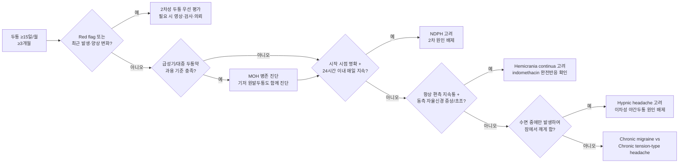

# 만성 두통 Chronic Headache

## <mark style="color:green;">일반 사항</mark>

* 정의 : ≥15일/월, ≥3개월 지속되는 두통
* 분류 : 1차성(원발성)과 2차성으로 나뉘며
* 1차 진료에서는 위험 신호(Red flag)를 통해 2차성 두통을 조기에 감별하는 것이 중요

### <mark style="color:$danger;">🚩 Red Flags!</mark>

☞ [두통 Red Flags ](015_-headache.md#red-flags)참조

### <mark style="color:orange;">감별</mark>

* 최근 시작, 최근 변화, 증상 진행 → 2차성 두통
* 발열, 체중 감소, 악성 종양 과거력 → 전신적 질환, 2차성 두통
* 간혹 편두통성 발작 동반 → [만성 편두통](016_-migraine.md#chronic-migraine)
* 편두통 발작 없이 지속적 두통 → [만성 긴장형두통](017_-tension-type-headache-ttha.md#chronic-tension-type-headache)
* 시작 시점을 명확히 기억하고, 발생 후 24시간 이내 매일 지속되는 두통이 됨 → 신생매일지속두통
* 거의 매일 대증 약물 복용, 다른 위험 소견 없음 → 약물과용두통
* 심한 두통, 편측, 눈물/콧물, 시계 같은 규칙성, 군집성 발생, 4시간 이내 → [군발 두통](015_-headache.md#undefined-6)
* 경부 외상력, 목 움직임으로 유발 → [경부인성두통](019_-cervicogenic-headache.md)
* 비만, 여성, 일시적 시각 장애, 박동성 이명 → 특발성 두개 내 고혈압
* 불안, 우울 동반 → 정신과적 동반질환(comorbidity)으로 병행 관리; 2차성 두통 가능성도 배제
* 경추/턱관절 움직임 제한 또는 통증 → 경부인성두통, 턱관절 이상
* &#x20;두통의 2차 원인 감별을 위한 [SNOOP4](015_-headache.md#id-2-snoop4)


### <mark style="color:orange;">만성 두통 초고속 감별 알고리듬</mark>




**MOH는 기저 원발두통을 대체하는 진단이 아닙니다.** 만성 편두통·긴장형두통 등과 약물과용두통의 진단 기준을 각각 충족하면 두 진단을 함께 붙입니다.



## <mark style="color:green;">1차성 두통</mark>

### <mark style="color:orange;">발작 지속시간에 따른 실용적 감별 - ＞4시간</mark>

* 종류 : [Chronic migraine](016_-migraine.md#undefined-1), [Chronic tension type headache](017_-tension-type-headache-ttha.md#chronic-tension-type-headache), New daily persistent headache, Hemicrania continua

#### <mark style="color:$primary;">신생매일지속두통 (New daily persistent headache, NDPH)</mark>

* 매일 지속되는 두통, 시작 시점을 명확히 기억함
* 통증은 특징적 양상이 없으며 편두통 또는 긴장형두통 요소를 모두 가질 수 있음
* 전형적으로 과거 두통의 병력이 없는 사람에서 발생

A. 아래의 진단 기준 B, C를 충족시키는 지속되는 두통

B. 뚜렷하고 확실히 기억되는 시작을 갖는 통증이 지속되며, 24시간 이내에 멈추지 않음

C. ＞3개월 존재

D. 다른 ICHD-3 진단으로 더 잘 설명되지 않음<sup>1\~4)</sup>

_1) 전형적으로 과거 두통의 병력이 없는 사람에서 발생, 시작부터 매일 중단 없이 지속. 만약 환자가 시작 시점을 기억하여 정확히 묘사할 수 없다면 다른 진단이 내려져야 함. 기존 두통의 빈도가 증가된 것이나 약물과용 후에 기존 두통이 악화된 것은 아니어야 함_\
\&#xNAN;_2) 두통이 만성편두통 또는 만성긴장형두통의 진단 기준을 충족할지라도 본 진단 기준에 맞으면 신생매일지속두통으로 진단함. 본 두통과 지속반두통의 진단 기준을 모두 충족한다면 후자로 진단함_\
\&#xNAN;_3) 약물과용두통에 정의한 양을 초과하여 진통제를 복용하는 경우에 매일두통의 발생이 약물과용의 시점보다 명확하게 선행하지 않았으면 신생매일지속두통과 약물과용두통 두 가지 진단을 동시에 붙임_\
\&#xNAN;_4) 모든 경우에서 2차 두통(예: 머리의 외상성 손상, 뇌척수압 관련 두통)을 적절한 검사로 배제해야 함_

#### <mark style="color:$primary;">지속반두통 (Hemicrania continua)</mark>

* 항상 편측으로 발생하는 지속적인 통증으로 같은 쪽의 결막 충혈, 눈물, 코 막힘, 콧물, 이마와 얼굴의 땀, 동공 수축, 눈꺼풀 처짐, 눈꺼풀 부종을 동반
* 두통은 indomethacin에 매우 민감하게 반응

A. 아래의 진단 기준 B\~D를 충족시키는 편측 두통

B. 중등증 이상의 강도로 ＞3개월 존재

C. 다음 중 하나 이상 해당

⑴ 두통과 동측으로 다음 중 ≥1가지 존재

⓵ 결막 충혈 &/or 눈물\
⓶ 코 막힘 &/or 콧물\
⓷ 눈꺼풀 부종\
⓸ 이마 및 안면 발한\
⓹동공 축소 &/or 눈꺼풀 처짐

⑵ 안절부절, 초조, 또는 움직임에 의해 통증 악화

D. 치료 용량의 indomethacin에 절대적으로 반응함<sup>1)</sup>

E. 다른 ICHD-3 진단으로 더 잘 설명되지 않음

_1) ICHD-3의 성인 치료 용량은 경구 indomethacin ≥150 ㎎/d이며 필요 시 225 ㎎/d까지 증량함. 실제 임상에서는 위장관·신장 부작용을 줄이기 위해 25 ㎎ tid에서 시작하여 단계적으로 증량할 수 있으나, 저용량에서의 불충분한 반응만으로 indomethacin 무반응으로 판단하지 않음. 완전 반응 확인 후 최소 유효 용량으로 감량_

### <mark style="color:orange;">발작 지속시간에 따른 실용적 감별 - ＜4시간</mark>

* 종류 : Chronic cluster headache, Chronic paroxysmal hemicrania, Hypnic headache, Primary stabbing headache, Short-lasting unilateral neuralgiform headache attacks

#### <mark style="color:$primary;">수면두통 (Hypnic headache)</mark>

* 수면 중에만 반복적으로 발생하여 잠에서 깨어나게 하는 두통(일명 alarm clock headache)
* 특징적인 동반 자율신경 증상이 없으며 다른 병리에 기인하지 않음
* 보통 50세 이후에 발생
* 둔한 두통, 종종 양측성

**진단 기준**

A. 아래의 진단 기준 B\~E를 충족하는 반복되는 두통 발작

B. 잠자는 동안에만 발생하여 잠에서 깨게 함

C. ＞3개월 동안 ≥10일/월 발생

D. 잠에서 깬 후 15분\~4시간 지속

E. 자율 신경 증상이나 안절부절못함은 없음

F. 다른 ICHD-3 진단으로 더 잘 설명되지 않음<sup>1,2)</sup>

_1) 효과적인 치료를 위하여 삼차자율신경두통들(군발두통)과의 감별이 필요_\
&#xNAN;_&#x32;) 수면 중 발생하여 잠에서 깨어나게 하는 두통의 다른 가능한 원인들(예: 수면무호흡증, 야간 고혈압, 저혈당, 약물과용, 두개 내 질환) 감별_

※ **주의 - 이차성 원인 배제 후 진단 :** 50세 이후 처음 발생하는 수면 중 두통은 두개 내 종양, 수면무호흡증(OSA), 야간 고혈압, 저혈당, 약물과용 등을 먼저 배제해야 함. 새로 발생한 야간 두통에서는 이차성 두개 내 병변 배제를 위해 뇌 MRI를 적극 고려

## <mark style="color:green;">2차성 두통</mark>

### <mark style="color:orange;">종류</mark>

* 약물과용두통
* 뇌혈관 이상과 관련 있는 두통 : 동정맥 기형, 거대세포 동맥염, Carotid dissection, 혈관염
* 뇌혈관 이상과 관련 없는 두통 : 종양, 특발성 두개 내 고혈압, 감염, 외상 후 두통, 경막하 혈종
* 근막 통증 : 경추 질환, 턱관절 이상
* 수면 장애에 의한 두통 : 폐쇄수면무호흡증

### <mark style="color:orange;">약물과용두통 (Medication overuse headache, MOH)</mark>

* 기존 원발두통 환자에서 ≥15일/월 두통이 있으면서, 급성기·대증 치료 약제를 ＞3개월 동안 다음 기준 이상 과용하면 약물과용두통을 고려
  * 한 달에 ≥10일 : triptan, opioid, ergotamine, 복합진통제
  * 한 달에 ≥15일 : acetaminophen, aspirin, NSAID 등 단순진통제
* MOH는 기저 원발두통을 대체하는 진단이 아니며, 만성 편두통·긴장형두통 등과 각각의 기준을 충족하면 함께 진단

#### <mark style="color:$primary;">진단 기준</mark>

A. 기존 원발 두통을 가진 환자에서 ≥15일/월 발생하는 두통

B. 급성기 &/or 대증 치료로 사용될 수 있는 ≥1가지의 약물을 ＞3개월 동안 규칙적으로 과용<sup>1\~3)</sup>

C. 다른 ICHD-3 진단으로 더 잘 설명되지 않음

_1) 각 환자들은 과용한 약물들의 종류와 이에 대한 진단 기준에 근거하여 본 두통의 한 가지 이상의 아형으로 분류될 수 있음 (예: 트립탄과용두통, 단순진통제과용두통, 혼합진통제과용두통)_\
&#xNAN;_&#x32;) 여러 개의 진통제를 병용하고 있으나 각각의 약물은 과용 범위에 해당되지 않는 경우 '개별적으로는 과용이 되지 않는 복수 약물군의 과용에 의한 두통'으로 진단_\
&#xNAN;_&#x33;) 두통의 급성기 또는 대증 치료를 목적으로 약물을 과용하고 있으나 각각의 이름과 용량이 명확하지 않은 경우에는 정확한 정보가 확인될 때까지 '증명되지 않은 복수약물군에 의한 약물과용두통'으로 진단_

***

## <mark style="background-color:$warning;">Management</mark>

### <mark style="color:orange;">치료 방침</mark>

* 생활 치료 : 수면 개선, 규칙적 유산소 운동, 스트레스 관리, 두통 일지 작성
* 유발 요인 제거, [만성 편두통](016_-migraine.md#management) 또는 만성 [긴장형두통](017_-tension-type-headache-ttha.md#management) 치료
* 불안·우울 등 정신건강 문제 동반 시 병행 치료
* 스테로이드 사용 주의
  * 만성 두통에서 low cortisol에 근거한 장기 steroid 대체 요법은 근거 수준이 낮으며 EHF·AAN 가이드라인의 일반적 권고가 아님
  * MOH 약물 중단 시 corticosteroid를 단기 bridge로 사용한 연구가 있으나 효과는 일관되지 않아 일상적 표준 요법으로 권고하지 않음

#### <mark style="color:$primary;">신생매일지속두통 (NDPH)</mark>

* 치료에 잘 반응하지 않음; 편두통형 또는 긴장형 양상에 따라 해당 치료를 준용
* 편두통형 : amitriptyline, topiramate, valproate
* 긴장형 : amitriptyline, nortriptyline, mirtazapine
* 전문의 영역/실험적 치료 : doxycycline, mexiletine, naltrexone 등이 소규모 증례·case series 수준에서 보고되었으나 근거가 매우 제한적이며 표준 치료로 권고되지 않음. 특히 mexiletine은 심장 부작용·약물상호작용을 고려하여 일차진료에서 일반적으로 사용하지 않음
* ※ Self-limiting subtype은 수개월 내 자연 소실 가능; refractory subtype은 수년간 지속되며 예후가 다름
* ※ 예방약 1\~2종 시도 후에도 반응이 없으면 신경과 의뢰 권장 (난치성이 많으며 1차 진료의 한계가 있음)

#### <mark style="color:$primary;">지속반두통 (Hemicrania continua)</mark>

* 1차 치료 : indomethacin - 진단 기준(criterion D)에 포함될 만큼 완전 반응이 중요함 (진단적 치료). 실제 임상에서는 25 ㎎ tid부터 시작하여 내약성을 확인하며 증량하되, 진단적 충분 용량에 도달하기 전에 무반응으로 판단하지 않음 <mark style="color:blue;">\[인도메타캡슐]</mark>
* indomethacin 불내성(위장관 부작용 등) 시 대안 :
  * celecoxib : 200 ㎎ bid <mark style="color:blue;">\[쎄레브렉스]</mark>
  * topiramate : 50\~100 ㎎/d <mark style="color:blue;">\[토파맥스]</mark>
  * melatonin : 9\~15 ㎎ 취침 전 (근거 제한적) <mark style="color:blue;">\[서카딘서방정]</mark>
* 후두신경차단술(Occipital nerve block) : indomethacin 반응은 있으나 장기 복용이 어려운 경우 보조적 선택지로 고려 가능 (근거 제한적)

#### <mark style="color:$primary;">수면두통 (Hypnic headache)</mark>

* 1차 치료 : 취침 전 caffeine 40\~60 ㎎ (정량 복용 권장; 커피는 함량 편차가 크므로 정제 형태가 더 정확함) - 단순하고 효과적
* 대안
  * lithium carbonate 150\~300 ㎎ 취침 전 (혈중 농도 모니터링) <mark style="color:blue;">\[리튬]</mark>
  * indomethacin 25\~50 ㎎ 취침 전
  * melatonin 3\~5 ㎎ 취침 전

#### <mark style="color:$primary;">약물과용두통 (MOH)</mark>

* 치료의 핵심은 **환자 교육 + 과용 약물 중단/감량 + 기저 두통의 예방 치료**임
* 단순진통제·triptan·ergotamine 과용은 대부분 외래에서 즉시 중단(abrupt withdrawal) 가능
* opioid 과용은 의존·금단 위험을 평가하여 점진적 감량을 고려하며, 외래 중단이 어렵거나 고용량·복합 의존이 있으면 신경과/중독 전문진료 또는 입원 치료를 고려
* benzodiazepine은 ICHD-3의 MOH 원인 약제군은 아니지만, 병용·의존이 있으면 급격히 중단하지 말고 MOH와 별개로 점진적 감량 계획을 세움

**▶ 브릿지 요법 (선별적 사용)**

* 약물 중단 후 초기 수일간 반동 두통·오심·수면장애 등이 악화될 수 있음을 사전에 설명
* bridge therapy 전반의 근거는 제한적이며 모든 환자에게 일상적으로 필요하지 않음
  * **Naproxen** 250\~500 ㎎ bid를 단기간(대개 수일\~1주, 필요 시 최대 1\~2주) 고려할 수 있음. 단, NSAID 과용 환자에서는 동일 계열이므로 일반적으로 피함
  * **Corticosteroid** : 일부 연구에서 사용되었으나 효과가 일관되지 않아 routine bridge로 권고하지 않음
  * **Frovatriptan** : 장기작용 triptan을 transitional/rescue therapy로 사용하는 접근이 일부 문헌에서 검토되었으나 확립된 표준 bridge 치료 근거는 제한적임. **Triptan 과용 환자에서는 사용하지 않으며**, analgesic overuse 환자 중 선별된 경우에만 짧게 고려

* MOH 재발 예방을 위해 급성기 두통약은 가급적 **주 2일 이하**로 제한
* ICHD-3의 과용 기준은 약제군에 따라 ≥10일/월 또는 ≥15일/월이므로 환자 교육 시 두 기준을 구분

**▶ 예방 치료 (약물 중단과 동시에 또는 조기에 시작)**

* 편두통형 : topiramate, valproate, amitriptyline 등
* 긴장형 : amitriptyline (1차), nortriptyline, mirtazapine
* 만성 편두통 동반 시 OnabotulinumtoxinA (PREEMPT protocol 기반, 155\~195 units) 또는 CGRP 표적 치료제를 고려할 수 있으며 국내 허가·급여 기준 확인

**▶ 추적 관찰**

* **2주** : 금단 증상, 약물 사용일수 및 순응도 확인
* **4\~8주** : 두통 빈도·강도, 급성기 약물 사용일수, 예방치료 반응 재평가
* **8주 전후** : 치료 전략을 재조정하는 시점이며, ICHD-3상 MOH의 '진단 확정 시점'을 의미하지 않음
* 중단 후에도 만성 두통이 지속되면 기저 원발두통의 예방 치료를 강화

#### <mark style="color:$primary;">CGRP 표적 치료제 (편두통 예방; MOH 동반 환자 포함)</mark>

* AHS 2024 position statement에서는 CGRP 표적 치료를 편두통 예방의 **1차 선택지 중 하나**로 제시하며, 기존 경구 예방약의 선행 실패를 필수 조건으로 두지 않음
* MOH 동반 만성 편두통에서도 예방 효과가 보고됨. Galcanezumab은 REGAIN 및 medication-overuse subgroup 분석, fremanezumab은 FOCUS 등의 근거가 있음
* 다만 국내 실제 사용 순서는 각 성분의 허가사항과 보험 급여 기준에 따라 달라질 수 있음

<table><thead><tr><th width="142">구분</th><th width="223">성분명 [상품명]</th><th>용법</th></tr></thead><tbody><tr><td>항체 주사제 (SC)</td><td>Galcanezumab <mark style="color:blue;">[앰겔러티]</mark></td><td>120 ㎎/월 SC (초회 240 ㎎)</td></tr><tr><td></td><td>Fremanezumab <mark style="color:blue;">[아조비]</mark></td><td>225 ㎎/월 or 675 ㎎/분기 SC</td></tr><tr><td></td><td>Erenumab <mark style="color:blue;">[에이모빅]</mark></td><td>70\~140 ㎎/월 SC</td></tr><tr><td>항체 주사제 (IV)</td><td>Eptinezumab <mark style="color:blue;">[Vyepti]</mark></td><td>100\~300 ㎎/분기 IV; 국내 허가 여부 확인 필요</td></tr><tr><td>경구용 Gepant</td><td>Rimegepant <mark style="color:blue;">[너텍]</mark></td><td>75 ㎎ 급성기; 예방 목적 격일 복용</td></tr></tbody></table>

_※ Gepant는 현재까지 기존 단순진통제·triptan과 같은 MOH 유발 위험이 낮은 것으로 평가되며, 기존 진통제·triptan 과용 환자에서 유용할 수 있음_

※ [보험 급여 기준](https://www.hira.or.kr/rc/insu/insuadtcrtr/InsuAdtCrtrPopup.do?mtgHmeDd=20240701\&sno=4\&mtgMtrRegSno=0005) : 기존 예방약(propranolol, topiramate, valproate, amitriptyline 등) 3종 이상 실패 후 사용 인정. 급여 외 사용 시 비급여(고가). ※ 급여 기준은 변경될 수 있으므로 최신 HIRA 기준 확인 권장

***

### <mark style="color:red;">질병코드 (KCD)</mark>

G44.2 긴장형두통

G44.3 만성 외상후 두통

G44.4 달리 분류되지 않은 약물유발 두통 - 약물과용두통(MOH)에 적용

G44.8 기타 명시된 두통증후군 - 신생매일지속두통(NDPH), 지속반두통(Hemicrania continua), 수면두통(Hypnic headache) 등은 KCD에서 미국 ICD-10-CM의 G44.52/G44.51/G44.81과 같은 세분코드를 사용하지 않고 해당 KCD 범주로 분류

G93.2 양성 두개내고혈압/특발성 두개내고혈압

※ 편두통(G43 계열)은 별도 [편두통](016_-migraine.md) 챕터의 질병코드 참조

***

***

## <mark style="color:purple;">처방례</mark>

> **처방례 1. 신생매일지속두통 - 편두통형**
>
> ```
> 에트라빌 10 ㎎/T 1T hs
>   → 2~4주마다 10 ㎎씩 증량, 목표 25~75 ㎎/d
> 오르필서방정 250 ㎎/T 1T bid (필요 시 병용; 반응에 따라 500 ㎎ bid까지 증량)
> ```

> **처방례 2. 지속반두통 (Hemicrania continua) - 진단 및 1차 치료**
>
> ```
> 인도메타신 25 ㎎/T 1T tid (식후)
>   → 불완전 반응이면 내약성을 확인하며 단계적으로 증량
>   → ICHD-3의 성인 진단적 치료 용량은 ≥150 ㎎/d (필요 시 225 ㎎/d)
>   → 완전 반응 확인 후 최소 유효 용량으로 감량
> 오메프라졸 20 ㎎/T 1T qd (위장 보호; 식전)
> ※ 고용량 증량이 필요하거나 진단이 불확실하면 신경과 협진 권장
> ※ indomethacin 불내성 시 celecoxib 등 대안을 고려할 수 있으나,
>    대체약 반응은 hemicrania continua의 진단 기준을 대신하지 않음
> ```

> **처방례 3. 수면두통 (Hypnic headache)**
>
> ```
> [1차] 취침 전 caffeine 40~60 ㎎ (정량 복용 권장)
> [대안] 리튬카보네이트 150 ㎎/T 1T hs
>   → 혈중 농도 0.3~0.8 mEq/L 목표; 신기능·갑상선 기능 모니터링
> 또는 인도메타신 25 ㎎/T 1T hs
> ```

> **처방례 4. 약물과용두통 (MOH) - 약물 중단 + 예방 치료**
>
> ```
> [과용 약물 중단]
> 단순진통제·triptan 과용 → 원칙적으로 즉시 중단
> opioid 과용 → 의존·금단 위험에 따라 점진적 감량 및 전문진료 고려
>
> [필요 시 단기 브릿지 - NSAID 과용이 아닌 경우]
> 낙센에프 500 ㎎/T 1T bid × 5~7일
>   → 증상에 따라 최단기간 사용, 반복·장기 사용 피함
>   ※ corticosteroid 및 frovatriptan bridge는 근거가 제한적이므로 routine 처방례로 사용하지 않음
>
> [예방 치료 - 동시 또는 조기 시작]
> 토파맥스 25 ㎎/T 1T hs → 2~4주 간격으로 단계적 증량 (목표 용량은 반응·내약성에 따라 조정)
> 또는 에트라빌 10~25 ㎎/T 1T hs (긴장형두통 동반 시 고려)
> ```

***

### <mark style="color:$success;">핵심 복약 지도</mark>

> **약물과용두통(MOH) - 진통제 중단 안내**
>
> * 현재 두통이 매일 나타나고 진통제를 자주 복용하고 있다면, 진통제 자체가 두통의 원인일 수 있습니다.
> * 특히 **약국에서 처방 없이 구입할 수 있는 카페인 함유 복합 진통제**(게보린, 펜잘 등)는 효과가 빠르게 느껴져 자주 복용하게 되지만, MOH를 일으키는 주요 원인입니다.
> * **복용 중인 진통제(특히 카페인 복합제·트립탄·오피오이드)를 줄이거나 중단**해야 두통이 나아집니다. 재발 예방을 위해 급성기 두통약은 가급적 주 2일 이하로 제한하고, 약제군별 과용 기준(10일/월 또는 15일/월)을 넘지 않도록 하십시오.
> * 중단 후 **2\~10일간 반동 두통(이전보다 심한 두통)이 생길 수 있으나** 이 고비를 넘겨야 호전됩니다. 이 기간을 사전에 충분히 이해해 주십시오.
> * 단독으로 중단하기 어려운 경우 반드시 담당 의사와 감량 계획을 세우십시오.

> **예방약 (토파맥스·에트라빌 등)**
>
> * 효과가 나타나기까지 **4\~8주** 이상 걸립니다. 임의로 중단하지 마십시오.
> * 토파맥스(topiramate)는 물을 충분히 마셔야 신결석을 예방할 수 있습니다.
> * 에트라빌(amitriptyline)은 취침 전 복용하며, 구갈·졸음이 생길 수 있습니다.

> **인도메타신 (지속반두통)**
>
> * 지속반두통 진단 시 인도메타신에 완전히 반응하는 것이 진단의 중요한 기준입니다.
> * 위장 부작용을 줄이기 위해 반드시 **식후에 복용**하고, 위장약을 함께 처방받으십시오.
> * 증상이 조절되면 최소 유효 용량으로 감량합니다.

> **언제 다시 병원을 방문해야 하나요?**
>
> * 진통제를 줄인 뒤에도 두통이 지속되거나 악화되어 일상생활이 어려운 경우
> * 두통 양상이 갑자기 변하거나 신경 증상이 새로 생긴 경우 - 즉시 응급실 방문
> * 예방약 복용 2개월 후에도 두통 빈도가 줄지 않는 경우

***

### <mark style="color:blue;">환자 안내서</mark>


**만성 두통, 올바른 이해가 치료의 시작입니다**

만성 두통은 적절한 치료와 생활 습관 개선으로 충분히 호전될 수 있으며, 진통제 과다 사용을 줄이는 것이 첫 번째 목표입니다.


#### <mark style="color:$primary;">만성 두통이란 무엇인가요?</mark>

* 한 달에 15일 이상, 3개월 이상 두통이 지속되는 상태입니다.
* 만성 편두통, 만성 긴장형두통, 약물과용두통 등 다양한 형태가 있습니다.

#### <mark style="color:$primary;">약물과용두통이란 무엇인가요?</mark>

* 두통을 가라앉히려고 진통제를 자주 먹다 보면 오히려 두통이 매일 생기는 악순환이 발생합니다.
* 트립탄·오피오이드·카페인 복합제는 **한 달 10일 이상**, 단순 진통제는 **한 달 15일 이상** 복용 시 약물과용두통이 생길 수 있습니다.
* 치료의 핵심은 과용 약물을 줄이거나 중단하고, 필요한 경우 예방 치료를 함께 시행하는 것입니다. 중단 초기에는 수일간 두통이 더 심해질 수 있으며 호전 속도는 개인마다 다릅니다.

#### <mark style="color:$primary;">어떻게 치료하나요?</mark>

* **진통제 중단 또는 감량** : 약물과용두통의 핵심 치료입니다. 의사와 함께 계획을 세우세요.
* **예방약 복용** : 두통 빈도를 줄이기 위한 예방약을 처방받아 꾸준히 복용합니다.
* **생활 습관 개선** : 규칙적인 수면, 운동, 스트레스 관리, 수분 섭취가 중요합니다.

#### <mark style="color:$primary;">생활 속 실천 사항</mark>

* **두통 일기 작성** : 두통이 언제, 얼마나 자주, 어떤 상황에서 발생하는지 기록하면 치료에 큰 도움이 됩니다.
* **규칙적인 생활** : 수면·식사·기상 시간을 일정하게 유지하십시오.
* **카페인 줄이기** : 커피·에너지 음료·카페인 진통제의 과다 섭취는 두통을 악화시킬 수 있습니다.

#### <mark style="color:$primary;">이럴 때는 즉시 병원을 방문하세요</mark>

* 두통 양상이 갑자기 변하거나 팔다리 마비·언어 장애·시야 이상이 생긴 경우
* 두통이 평소와 달리 갑자기 극심하게 시작된 경우

***
