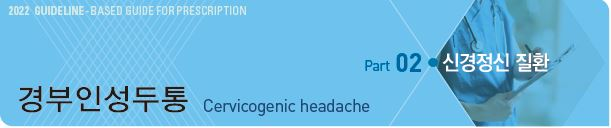

# 경부인성두통 Cervicogenic headache



## 일반 사항

* 경부의 골격계 또는 연조직에서 기원하는 두통
*   기전 : 삼차신경 감각신경로와 경추 감각신경섬유가 기능적으로 상호 작용함으로써 안면/두부의 trigeminal sensory

    receptive field와 neck 사이에 통증 신호의 양방향 전달이 발생됨
* 경부인성두통의 흔한 원천 : C2\~3 zygapophyseal joint(70%), atlanto-axial joint

## 임상 양상

* 편측 두통
* 후두부 → 전두부 방사통
* non-throbbing, non-lancinating, 두통 강도 변동(중등증\~중증), 다양한 기간
* 목 움직임 or 불편한 머리 자세 지속 시 유발됨. 이로 인하여 목의 움직임이 제한됨
* 두통이 있는 쪽의 목/어깨/팔의 통증

## 진단

#### 진단의 어려움

* 임상적으로 긴장형두통이나 편두통과 구별하는 것이 쉽지 않음. 이들 두통에서도 후두부 및 경추 압통이 발생할 수 있음
* 경부인성두통 환자에서 흔히 긴장형두통이나 편두통이 동반됨
* 진단적 목적의 마취 차단(anesthetic block)에 반응하지 않은 경우에 정확한 부위를 차단시키지 못하였을 가능성이 있음

### 진단 기준 \[ICHD-3]

A. 아래의 진단 기준 C를 충족하는 두통

B. 두통을 유발할 수 있다고 알려진 경추 또는 경부 연조직 질환 또는 병소의 임상, 실험실 검사 &/or 영상 증거1,2)

C. 다음 중 ≥2가지 인과 관계가 입증됨

① 두통은 경부 질환의 시작 또는 병소의 발병과 시간적인 연관성을 가지고 발생함

② 경부 질환 또는 병소의 호전 또는 소실에 따라 두통이 의미 있게 완화 또는 호전됨

③ 경부 운동 범위가 감소하고 provocative maneuver에 따라 두통이 의미 있게 악화됨

④ 경부 구조물 또는 신경 분포에 진단 목적으로 신경 차단을 했을 때 두통이 사라짐

D. 다른 ICHD-3 진단으로 더 잘 설명되지 않음3\~5)

1. 상부 경추의 영상 소견은 진단에 약간의 도움을 주지만 강력한 증거는 아님

> 2) 상부 경추의 종양, 골절, 감염과 RA는 공식적으로 확인된 두통의 원인은 아니지만 개인에서 그 인과 관계가 입증된 경우에는

> ```
> 받아들여 질 수도 있음. 경추의 척추증과 골연골증은 개인에 따라 진단 기준 B를 충족하는 원인 질환일 수도 있고 아닐 수도 있음
> ```

3. 경부 근막통증이 원인인 경우는 긴장형두통으로 분류함
4. 상부 경추신경뿌리병증은 상부 경추와 삼차신경통각 사이의 convergence가 두통을 발생시키는 것으로 생각됨.

> ```
> 다른 근거가 더 있을 때까지는 이 진단은 ‘상부경추신경뿌리병증에 기인한 두통’으로 분류함
> ```

5. 경부인성두통은 ①편측으로 국한된 통증, ②목 근육에 손으로 압력을 가하거나 머리를 움직일 때 발생하는 전형적인 두통,

> ```
> ③뒤쪽에서 앞쪽으로 방사되는 통증의 양상을 보이는 것으로 긴장형두통이나 편두통과 구별됨. 그러나 이것이 경부인성두통의
> ```

> ```
> 양상이기는 하지만 이 상병에 특징적인 것은 아니며 인과 관계를 규명하는데 꼭 필요하지는 않음. 구역, 구토, 소리/빛공포증 같은
> ```

> ```
> 편두통 양상이 경부인성두통에서 나타날 수 있지만 보통 편두통에서보다는 약한 강도로 나타나며 긴장형두통과의 감별점이 됨
> ```

### 진단 기준 \[Cervicogenic Headache International Study Group]

**Major criteria**

⑴ 증상의 특징

① 다음에 의해 목의 증상이 유발됨

```
    •목 움직임 &/or 불편한 머리 자세 지속, AND/OR

    •증상이 있는 쪽 상부 경추 또는 후두부 압박
```

② 목 움직임 제한

③ 동측 목/어깨/팔의 통증

⑵ 진단적 마취 차단에 의해 입증

⑶ 편측 두통 (side shift 없음)

**Head pain characteristics**

⑷① 중등증\~중증, non-throbbing, non-lancinating, 보통 목에서 시작

② 다양한 기간

③ fluctuating, continuous pain

**Other characteristics of more importance**

⑸① indomethacin에 효과가 없거나 약간의 효과

② ergotamine 및 sumatriptan에 효과가 없거나 약간의 효과

③ 여성

④ 병력상 빈번한 두부 또는 직접적인 경부 외상(보통 중간 이상의 외상)

**Other features of lesser importance**

⑹① 구역

② phonophobia & photophobia

③ 어지럼증

④ 동측의 blurred vision

⑤ 삼킴곤란

⑥ 동측 부종(대부분 눈 주위)

### 검사

* X선, MRI, CT : 확진 도구는 아님; 다른 진단 배제 목적으로 고려

***

## Management

* 물리 치료 : 다소의 효과
* 약물 치료 : 효과적이지 않음
*   anesthetic block : 정확한 부위에 주사 시 가장 효과적인 치료 방법

    •주로 atlanto-axial joint, C2-3/C3-4 zygapophyseal joint 시술

> **질병코드** R51 두통

G44 기타 두통증후군
