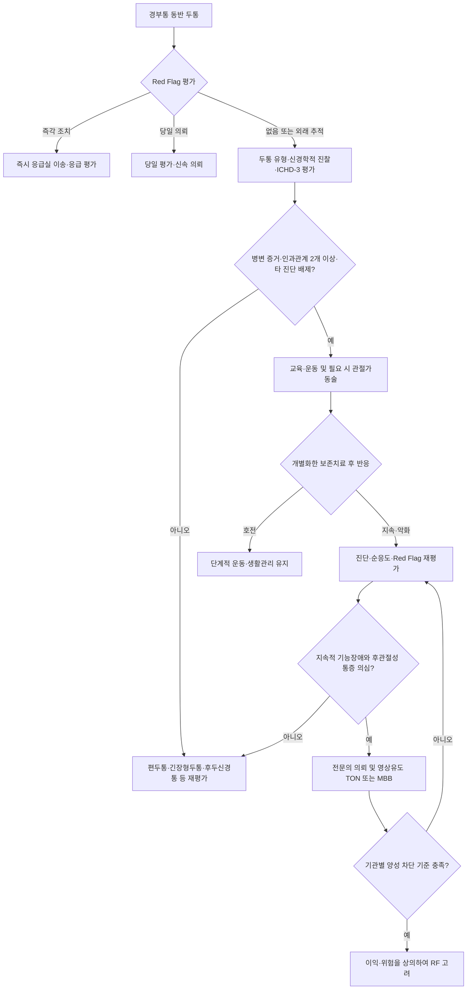

# 경추성 두통 Cervicogenic headache

## <mark style="color:green;">일반 사항</mark>

* 경추 또는 경부 연조직의 질환이나 병변에서 기원하는 이차성 두통. 경부인성 두통이라고도 함
* ICHD-3 기준을 적용한 유병률 자료는 매우 제한적임. 최신 체계적 문헌고찰에서 적격 연구는 3건뿐이었으며, 일반 인구 대상 연구 1건에서 유병률 3.9%, 두통 전문 외래 연구에서 통합 상대빈도 약 3.1%가 보고됨. 연구 수가 적고 선택·측정 편향 가능성이 있어 해석에 주의하며 추가 연구가 필요
* 편두통·긴장형두통에서도 목 통증, 경부 압통 및 운동 제한이 흔하므로 이러한 소견만으로 경추성 두통을 진단하지 않음
* 편두통 등 다른 두통질환과 경추성 두통을 함께 진단하려면 각각의 진단 기준을 독립적으로 충족해야 함

## <mark style="color:green;">병태생리와 원인 구조물</mark>

* 상부 경추의 통각 입력과 삼차신경 통각 입력이 삼차경부복합체(trigeminocervical complex)에 수렴하여 경부 병변의 통증이 후두부·측두부·안와부 등으로 연관통(referred pain)을 일으킴
* 진단에는 단순한 퇴행성 영상 소견이 아니라, 두통을 유발할 수 있는 병변과 두통 사이의 인과관계가 필요함

#### <mark style="color:$primary;">주요 원인 구조물</mark>

* C2\~3 후관절(zygapophyseal joint) 및 그 신경지배인 제3후두신경(third occipital nerve)
  * 선택된 만성 편타손상 환자의 중재 연구에서는 C2\~3 후관절이 흔한 통증원으로 보고되었으나 일반 외래 환자에게 해당 비율을 그대로 적용할 수 없음
* 환축관절(atlanto-axial joint, C1\~2), 환후두관절(atlanto-occipital joint, C0\~1)
* 상부 경추 추간판, 신경근 및 기타 경추 구조물
* 경부 근막통증이 주된 원인인 두통은 ICHD-3에서 일반적으로 긴장형두통으로 분류하며, 별도의 경부 근막통증 기인 두통은 부록 진단임

#### <mark style="color:$primary;">관절별로 보고된 연관통 분포</mark>

* C0\~1·C1\~2 관절 : 주로 후두하부와 상부 경부이며, 일부에서는 두정부·전두부·안와측으로 퍼질 수 있음
* C2\~3 후관절 : 상부 경부에서 후두부·귀·두정부·전두부·안와부 방향으로 퍼질 수 있음
* C3\~4 후관절 : 주로 후두하부에서 하부 경부까지이며 어깨 침범은 상대적으로 적음
* 더 아래 후관절 : 하부 경부·견갑대·어깨 방향의 통증 비중이 커짐
* 이러한 분포는 소수의 유발시험과 선택된 진단차단 양성 환자에서 작성되었고 서로 겹치므로, 통증 위치만으로 원인 관절을 확정하거나 차단 표적을 결정하지 않음

### <mark style="color:orange;">관련 요인</mark>

* 경추 관절·추간판 질환, 염증성 또는 구조적 병변
* 장시간의 고정된 자세, 반복적인 경부 작업 및 부적절한 작업환경은 경부 근골격 증상을 악화시킬 수 있으나, 경추성 두통의 확립된 독립 위험인자로 단정하지 않음
* 편타손상 등 외상과 시간적으로 연관되어 발생한 두통은 경추성 두통보다 ICHD-3의 두경부 외상 또는 손상에 기인한 두통으로 우선 분류
* 여성 환자의 비율이 높게 보고되지만 근거 연구가 적어 여성에서 4배 호발하는 확립된 위험인자로 제시하기 어려움

## <mark style="color:green;">임상 양상</mark>

* 대개 한쪽에 고정되는 두통이지만 양측성이거나 항상 고정되지 않을 수도 있음
* 목 또는 후두부에서 시작하여 전두부·측두부·안와부로 방사
* 비박동성이 흔하지만 통증 양상만으로 편두통과 구별할 수 없음
* 목 움직임, 특정 자세의 지속 또는 경부 구조물 압박으로 평소 두통이 유발·악화될 수 있음
* 경추 운동 범위 감소, 동측 목·어깨 또는 팔 통증이 동반될 수 있음
* 구역, 구토, 빛공포증·소리공포증 같은 편두통 양상이 나타날 수 있어 동반 증상의 유무만으로 감별하지 않음

### <mark style="color:$danger;">🚩 Red Flags!</mark>

_※ 두통 총론의 Red Flags와 함께 참조(총론 챕터 파일명·앵커 확인 필요)_

<mark style="color:$danger;">**즉각 조치 또는 의뢰**</mark>

* 갑작스럽거나 평소와 전혀 다른 편측 경부통·두통, 부분 호너증후군(안검하수·축동), 복시·구음장애·연하곤란·운동실조·편측 신경학적 결손 → 경추동맥 박리 또는 뇌혈관질환 의심
* 의식 변화, 급성 근력저하, 새로운 보행장애 또는 대소변 장애
* 고열·수막자극징후, 면역저하 상태에서 발생한 심한 두통·경부통
* 고에너지 외상 후 심한 경부통, 정중선 압통 또는 신경학적 이상
* 50세 이상에서 새 두통과 시력저하·복시·일과성 흑암시가 동반되어 거대세포동맥염이 의심되는 경우

<mark style="color:$warning;">**당일 또는 조기 의뢰**</mark>

* 진행하는 근력저하·감각이상, 반사항진, 손의 미세운동 저하 또는 보행 불안정 → 경추척수증 의심
* 발열, 체중감소, 지속적인 야간통, 암·감염 과거력
* 50세 이상 새 두통과 두피 압통·턱파행·전신증상·류마티스성 다발근통 증상
* 류마티스관절염 환자의 새 상부 경부통·두통 또는 신경학적 증상 → 환축추 불안정성 가능

<mark style="color:$info;">**외래 추적 / 추가 평가 계획**</mark> <mark style="color:$info;">- 즉각 위험 낮으나 호전 없으면 의뢰</mark>

* 적절한 보존치료에도 2\~4주 이상 호전이 없거나 점차 악화
* 진단이 불확실하거나 편두통·후두신경통 등 다른 두통질환이 의심됨

## <mark style="color:green;">진단</mark>

### <mark style="color:orange;">진단 원칙</mark>

* 목 통증이나 경추 압통은 편두통·긴장형두통에서도 흔하므로 단독 진단 근거가 아님
* 경추 영상의 퇴행성 변화도 무증상 성인에게 흔하므로 영상 소견만으로 확진하지 않음
* ICHD-3의 경추 병변 증거와 인과관계 기준을 적용하고 다른 두통질환으로 더 잘 설명되지 않는지 확인
* 진단적 차단은 원인 경추 구조물 또는 그 신경지배를 정확히 표적으로 해야 하며, 대후두신경차단 반응만으로 경추성 두통을 확진하거나 다른 두통질환과 구별할 수 없음

### <mark style="color:orange;">진단 기준 [ICHD-3]</mark>

A. 아래 진단 기준 C를 충족하는 두통

B. 두통을 일으킬 수 있다고 알려진 경추 또는 경부 연조직 질환·병변의 임상 및/또는 영상 증거

C. 다음 중 ≥2가지로 인과관계가 입증됨

①  두통이 경추 질환 또는 병변의 발생과 시간적으로 연관되어 시작됨\
②  경추 질환 또는 병변이 호전·소실됨에 따라 두통도 의미 있게 호전·소실됨\
③  경추 운동 범위가 감소하고 유발 동작에 의해 두통이 의미 있게 악화됨\
④  경추 구조물 또는 그 신경지배에 대한 진단적 차단으로 두통이 소실됨

D. 다른 ICHD-3 진단으로 더 잘 설명되지 않음


**ICHD-3 적용 시 주의**

* 상부 경추 영상 소견은 원인을 시사할 수 있지만 인과관계의 확정 근거는 아님
* 종양·골절·감염·류마티스관절염은 개별 환자에서 기준 B를 충족할 수 있음
* 경추증·골연골증은 환자에 따라 원인 병변일 수도 있고 아닐 수도 있음
* 한쪽 고정 통증, 목 움직임·압박에 의한 유발, 뒤에서 앞으로의 방사는 경추성 두통을 시사하지만 특이적이지 않음



**Cervicogenic Headache International Study Group(CHISG) 기준**은 과거 연구에서 사용된 기준이다. Triptan·indomethacin 반응, 성별, 외상력 등의 항목은 현대 진단 기준으로 사용하지 않으며, 현재는 ICHD-3를 표준으로 적용한다.


### <mark style="color:orange;">주요 감별진단</mark>

* 편두통의 경부 증상, 긴장형두통 및 경부 근막통증
* 후두신경통 : 대개 수초\~수분 지속되는 찌르거나 전기 오는 발작성 통증, 후두신경 분포의 압통·감각 이상
* 상부 경추 신경근병증
* 지속반두통(hemicrania continua), 돌발반두통(paroxysmal hemicrania)
* 측두하악장애, 인두뒤건염, 두개경부 근긴장이상
* 급성 또는 지속성 편타손상 기인 두통
* 경추동맥 박리, 거대세포동맥염
* 수막염·경추 감염, 종양, 류마티스관절염의 환축추 불안정성, Chiari I 기형
* 비만, 심한 코골이, 목격된 무호흡, 주간 졸림 또는 저항성 고혈압과 아침 두통이 동반되면 STOP-Bang 등으로 폐쇄성수면무호흡 위험을 평가하고 수면검사 고려

### <mark style="color:orange;">이학적 검사</mark>

* 경추 능동 운동 범위, 평소 두통의 재현 여부, 신경학적 진찰, 보행·협응, 상지 신경근·척수증 징후를 평가
* **Cervical flexion-rotation test(FRT)**
  * 환자를 앙와위로 눕히고 경추를 충분히 굴곡시킨 상태에서 수동적으로 좌우 회전하여 주로 C1\~2 회전 제한을 평가
  * 경추 굴곡은 중·하부 경추의 회전 기여를 줄여 상부 경추, 특히 C1\~2 회전을 상대적으로 강조하기 위한 것이며 C1\~2만을 완전히 분리하는 검사는 아님
  * 회전각 약 32° 이하 또는 좌우 차이가 큰 경우 기능장애를 시사할 수 있음
  * 과거 숙련 검사자·선택 표본에서 높은 민감도·특이도가 보고되었지만 최근 검토에서는 위양성과 연구 편향 가능성이 확인됨
  * 단독 확진검사가 아니며 편두통이나 하부 경추 통증에서도 제한될 수 있으므로 병력·다른 검사와 종합
* 경추척수증이 의심되면 반사항진, 병적반사, 손의 미세운동 및 보행을 포함하여 평가

### <mark style="color:orange;">검사</mark>

* 전형적이고 안정적인 증상, 정상 신경학적 진찰 및 Red Flag가 없는 경우 진단을 위한 일률적 영상검사는 필요하지 않음
* 경추 MRI : 진행성 신경학적 이상, 척수증·신경근병증, 감염·종양·염증성 질환 또는 수술 가능한 구조적 병변 의심 시
* 경추 CT : 급성 외상에서 골절 평가 또는 골성 병변의 세부 평가
* CTA 또는 MRI/MRA : 경추동맥 박리가 의심되면 외래 검사를 기다리지 말고 응급실로 의뢰하여 임상 상황에 따라 시행
* ESR·CRP·CBC : 50세 이상 새 두통과 턱파행·두피 압통·전신증상 등으로 거대세포동맥염이 의심될 때. 정상 염증수치만으로 완전히 배제되지 않으며 시각증상이 있으면 검사 결과를 기다리지 않고 응급 평가·치료
* 단순 X선·MRI·CT는 경추성 두통의 확진검사가 아니며 영상-임상 불일치에 주의
* 원인 후관절이 의심되고 고주파치료 등을 고려할 때에는 영상 유도 진단적 medial branch 또는 third occipital nerve block을 통증중재 전문의에게 의뢰

***

## <mark style="background-color:$warning;">Management</mark>

### <mark style="color:orange;">치료 원칙</mark>

* 교육, 능동적 운동, 필요 시 관절가동술을 조합한 개별화된 비약물치료를 우선 권고
* 수동치료는 단독 반복치료보다 운동 참여와 기능 회복을 돕는 보조수단으로 사용
* 약물은 경부 통증·근연축 또는 동반 질환의 단기 증상 조절에 사용하며 경추성 두통 자체에 대한 직접 근거는 제한적
* 시술은 보존치료에 반응하지 않고 원인 구조물이 임상적으로 좁혀진 환자에서 전문의가 선택

### <mark style="color:orange;">진단·치료 알고리듬</mark>


```mermaid
flowchart TD
    A[경부통 동반 두통] --> B{Red Flag 평가}
    B -->|즉각 조치| C[즉시 응급실 이송·응급 평가]
    B -->|당일 의뢰| D[당일 평가·신속 의뢰]
    B -->|없음 또는 외래 추적| E[두통 유형·신경학적 진찰·ICHD-3 평가]
    E --> F{병변 증거·인과관계 2개 이상·타 진단 배제?}
    F -->|아니오| G[편두통·긴장형두통·후두신경통 등 재평가]
    F -->|예| H[교육·운동 및 필요 시 관절가동술]
    H --> I{개별화한 보존치료 후 반응}
    I -->|호전| J[단계적 운동·생활관리 유지]
    I -->|지속·악화| K[진단·순응도·Red Flag 재평가]
    K --> L{지속적 기능장애와 후관절성 통증 의심?}
    L -->|아니오| G
    L -->|예| M[전문의 의뢰 및 영상유도 TON 또는 MBB]
    M --> N{기관별 양성 차단 기준 충족?}
    N -->|예| O[이익·위험을 상의하여 RF 고려]
    N -->|아니오| K
```

_※ ICHD-3 기준을 모두 충족하기 전에는 경추성 두통으로 확진하지 않는다. 보존치료 기간과 MRI·혈액검사·혈관영상의 선택은 의심 질환과 임상 경과에 따라 개별화한다._

## <mark style="color:green;">비약물 치료</mark>

#### <mark style="color:$primary;">교육·운동·물리치료</mark>

* 통증 신경과학 교육, 정상 활동 유지 및 단계적 활동 증가
* 심부 경부 굴곡근의 저부하 지구력 운동과 경추 안정화 운동
* 견갑대 근지구력·안정화 운동 및 필요한 경우 흉추 운동
* 환자의 기능장애에 맞춘 상부 경추 관절가동술(mobilization), SNAGs 등
* 운동과 관절가동술을 포함한 복합 치료가 단일 수동치료나 약물 단독보다 단기적으로 유리한 것으로 보고됨. 다만 중재별 근거 확실성이 다르고 연구 이질성·편향 위험이 있어 장기 효과를 단정하지 않음
* 온열·냉찜질, TENS는 일시적 증상 완화를 위한 보조요법으로 고려

#### <mark style="color:$primary;">경추 고속 수기조작 안전</mark>

* 저속 관절가동술과 상부 경추 고속저진폭 조작(manipulation)을 구분
* Hautant·Underberg 등 VBI positional test는 혈관병리 위험을 신뢰성 있게 배제하지 못하므로 선별검사로 권고하지 않음
* 최근 갑작스럽거나 평소와 다른 두통·경부통, 부분 호너증후군, 복시·구음장애·연하곤란·운동실조·뇌신경 증상, 최근 외상·감염 및 혈관·결합조직질환 위험을 병력과 신경학적 진찰로 평가
* 경추 혈관병리가 의심되면 조작을 시행하지 말고 즉시 응급 평가
* 고속 경추 조작은 적절한 훈련을 받은 전문가가 이익과 드문 중대한 위험을 설명하고 환자와 상의하여 선택

#### <mark style="color:$primary;">생활 습관</mark>

* 화면·의자·키보드 높이를 조정하고 한 자세를 장시간 유지하지 않도록 규칙적으로 자세를 바꿈
* 증상 허용 범위에서 경부·견갑대 운동을 꾸준히 시행
* 엎드려 자며 목을 한쪽으로 오래 돌리는 자세를 피함
* 바로 눕거나 옆으로 누울 때 베개 높이를 개인에 맞춰 경추가 중립 정렬을 유지하도록 함. 일률적으로 낮은 베개를 권하지 않음

## <mark style="color:green;">약물 치료 (보조적)</mark>

* **Acetaminophen 또는 NSAID** : 급성 악화 시 최소 유효용량을 최단기간 사용
  * acetaminophen 500\~1,000 ㎎ q6\~8h prn. 다른 복합제에 포함된 양을 합산하며 성인에서 모든 공급원의 총량이 4,000 ㎎/d를 초과하지 않도록 함
    * 4,000 ㎎/d는 일반적인 처방 목표가 아니라 선택된 성인의 절대 상한이며, 간질환·과음·저체중·고령·영양불량 등 위험요인이 있으면 더 낮은 상한과 투여 간격을 개별화
  * naproxen 250\~500 ㎎ bid prn <mark style="color:blue;">[낙센]</mark>
  * ibuprofen 200\~400 ㎎ tid prn <mark style="color:blue;">[부루펜]</mark>
  * 위장관 출혈, 신장기능, 심혈관질환, 항응고제 병용 여부를 확인하고 반복·장기 사용을 피함
  * 단순진통제·NSAID 사용이 월 15일 이상 지속되지 않도록 하여 약물과용두통을 예방
* **근이완제** : 통증성 근연축이 뚜렷할 때 단기간 선택
  * eperisone 50 ㎎ tid <mark style="color:blue;">[에릭슨정 등]</mark> : 드물게 쇼크·아나필락시스 및 중증피부반응 가능
  * tizanidine 2 ㎎ hs부터 시작 <mark style="color:blue;">[실다루드]</mark> : 졸음·저혈압·서맥·간기능 이상에 주의; ciprofloxacin·fluvoxamine과 병용 금기
  * cyclobenzaprine 10 ㎎ 정 <mark style="color:blue;">[시클펜정]</mark>, ER 15 ㎎ <mark style="color:blue;">[본렉스이알캡슐]</mark> : 급성 동통성 근골격계 질환의 근연축에 한해 2\~3주 이내 사용. 현행 국내 용량주의 기준 최대 30 ㎎/d(2026년 8월 확인; 개정 여부 확인)
    * 국내 허가사항상 **고령자·간장애 환자는 투여 금기**(단순 주의가 아님) — 혈장 농도·반감기가 유의하게 상승하는 것으로 확인됨
    * MAO억제제 투여 중 또는 중단 후 14일 이내, 심근경색 회복기, 부정맥·심차단·심전도장애, 울혈성심부전, 갑상선기능항진증에서도 금기
    * 졸음·어지럼·항콜린 부작용에 주의하고 자동차 운전·기계 조작을 피하도록 안내
* **Amitriptyline·gabapentinoid·SNRI** : 경추성 두통 자체에 대한 근거가 약하므로 일률적으로 사용하지 않음
  * 동반 편두통·긴장형두통·우울·불면 또는 명확한 경추 신경근병증·신경병증성 통증이 있을 때 해당 진단과 적응증에 따라 선택
  * duloxetine의 국내 급여 여부는 구체적 신경병증성 통증 진단과 최신 급여기준에 따라 확인
* **국소 NSAID 또는 lidocaine 패치** : 국소 경부통에 선택적으로 고려할 수 있으나 경추성 두통 자체의 근거는 부족하고 일부 사용은 허가 외일 수 있음

## <mark style="color:green;">시술 치료</mark>

#### <mark style="color:$primary;">대후두신경차단술 (Greater occipital nerve block)</mark>

* 후두부 통증과 압통이 뚜렷하고 보존치료에 반응하지 않을 때 숙련된 의료진이 단기 증상 완화를 위해 고려
* 편두통·후두신경통 등 여러 두통질환에서도 반응할 수 있어 경추성 두통의 확진검사가 아니며, ICHD-3의 원인 경추 구조물 진단차단과 구별
* 국소마취제 단독 또는 선택적으로 스테로이드를 병용할 수 있으나 경추성 두통에서 최적 스테로이드 제제·용량·반복 간격은 확립되지 않음
* 두피 가까이에 triamcinolone 등 스테로이드를 주사하면 국소 피부위축·저색소증·탈모가 발생할 수 있으므로 일률적인 초회 40 ㎎ 및 반복 감량 프로토콜을 사용하지 않음
* Dexamethasone도 당뇨 환자에서 고혈당을 유발할 수 있으므로 단순한 안전 대체제로 간주하지 않음
* 초음파 유도는 신경·혈관과 침 위치를 확인하여 위험을 줄일 수 있으나 혈관 내 주입을 완전히 방지하지는 않음. 흡인, 소량 분할 주입, 국소마취제 최대용량 확인 및 시술 후 관찰 필요
* 반복 여부와 간격은 이전 효과의 크기·지속기간, 이상반응 및 누적 스테로이드 노출을 평가하여 개별 결정

#### <mark style="color:$primary;">후관절 진단차단과 고주파치료</mark>

* C2\~3 후관절 기원 통증에는 제3후두신경(third occipital nerve), C3\~4 이하에는 해당 medial branch를 영상 유도하에 진단적으로 차단
* 진단적 차단으로 의미 있는 일시적 통증 완화가 확인되고 보존치료에 반응하지 않을 때 radiofrequency neurotomy를 고려
* 양성 차단의 통증 감소 기준과 차단 횟수는 지침·보험자·기관에 따라 다름
  * 다학제 합의지침은 실제 임상에서 ≥50% 통증 감소와 단일 차단을 허용하는 방향을 제시
  * 일부 학회·보험자는 2회의 차단과 ≥80% 감소를 요구하므로 국내 기준과 시술기관 프로토콜 확인
* 효과의 크기와 지속기간은 환자와 연구에 따라 다르며 일정한 지속기간을 예측할 수 없음

#### <mark style="color:$primary;">환축관절(C1\~2) 주사</mark>

* 추골동맥, C2 신경절 및 척수막 구조와 인접한 고위험 시술
* 통증중재 전문의가 투시 또는 CT 유도와 조영제 확인하에 시행하며 일반적인 촉지 기반 외래 주사로 시행하지 않음

#### <mark style="color:$primary;">Botulinum toxin</mark>

* 순수 경추성 두통에서는 연구 결과가 일관되지 않고 최신 비교 연구에서도 효과가 제한적이므로 통상 권고하지 않음
* 만성편두통이 별도로 진단된 경우에는 경추성 두통 치료가 아니라 만성편두통 적응증과 표준 주사 프로토콜에 따라 판단

#### <mark style="color:$primary;">수술적 치료</mark>

* 수술 가능한 구조적 병변이 두통의 원인이라는 근거가 명확하고 충분한 비수술 치료에도 증상이 지속되는 경우에만 신경외과·정형외과 협진

***

### <mark style="color:red;">질병코드</mark>

G44.8 기타 명시된 두통증후군

_※ KCD에는 cervicogenic headache 또는 경추성 두통 명칭의 별도 전용 코드가 없음. 경추성 두통으로 진단한 경우 G44.8을 사용하고, 실제로 확인된 경추 질환이나 경부통이 있으면 해당 코드를 임상기록에 근거하여 추가함._

M54.2 경추통 (경부 통증이 별도로 진단된 경우)

M50 경추간판장애 (경추 추간판 병변이 확인되고 임상적으로 관련된 경우)

M47 척추증 (해당 경추증이 확인된 경우 세부코드 선택)

***

## <mark style="color:purple;">처방례</mark>

> **처방례 1. 급성 악화와 통증성 근연축**
>
> ```
> 낙센 250 ㎎/T 1T bid pc prn
> 에릭슨정 50 ㎎/T 1T tid pc [통증성 근연축이 뚜렷할 때]
> ※ NSAID는 최소 유효용량·최단기간 사용; 통상 5~7일 이내 반응 평가
> ※ 에페리손은 단기간 사용하고 발진·두드러기·호흡곤란·어지럼과 저혈압 발생 시 즉시 중단·평가
> ```

> **처방례 1-1. NSAID 사용이 적절하지 않은 경우**
>
> ```
> Acetaminophen 500 ㎎/T 1~2T tid prn
> ※ 다른 단일제·복합제에 포함된 acetaminophen을 모두 합산
> ※ 성인 총량 4,000 ㎎/d를 초과하지 않으며, 위험요인에 따라 더 낮게 설정
> ※ 간질환·과음·저체중·고령·영양불량 및 항응고제 병용 여부를 확인
> ```

> **처방례 2. Cyclobenzaprine을 선택하는 경우**
>
> ```
> [Option A - 속방정]
> 시클펜정 10 ㎎/T 1T hs
>   → 필요 시 분할 증량; 최대 30 ㎎/d
>
> [Option B - 서방캡슐]
> 본렉스이알캡슐 15 ㎎/C 1C qd
>   → 필요 시 최대 30 ㎎ qd
>
> ※ 두 제형을 병용하지 않음
> ※ 급성 통증성 근골격계 근연축에 한해 2~3주 이내 사용
> ※ 고령자·간장애 환자는 국내 허가사항상 투여 금기
> ※ MAO억제제 투여 중·중단 후 14일 이내, 심근경색 회복기, 심차단·부정맥·울혈성심부전, 갑상선기능항진증 환자 금기
> ※ 졸음·항콜린 부작용에 주의하고 세로토닌성 약물 병용 여부 확인
> ```

> **처방례 3. 경추 신경근병증 또는 신경병증성 통증이 명확히 동반된 경우**
>
> ```
> 리리카 75 ㎎/C 1C hs
>   → 어지럼·졸음 및 신기능을 확인하며 필요 시 75 ㎎ bid로 증량
> ※ 경추성 두통 단독에는 일률적으로 사용하지 않음
> ```

> **시술 예시. 대후두신경차단술**
>
> ```
> 1% lidocaine 1~2 ㎖, 편측
> ※ 해부학과 국소마취제 최대용량을 숙지한 숙련 의료진이 시행
> ※ 흡인 후 소량씩 분할 주입하고 시술 후 이상반응 관찰
> ※ 스테로이드는 일률적으로 혼합하지 않으며, 병용 필요성과 제제·용량은 개별 판단
> ※ 고정된 4~6주 간격의 반복 처방으로 사용하지 않음
> ```

***

### <mark style="color:$success;">핵심 복약 지도</mark>

> **아세트아미노펜**
>
> * 감기약이나 복합진통제에도 같은 성분이 들어 있을 수 있으므로 모든 제품의 총량을 합산하십시오.
> * 처방되거나 제품에 표시된 용량을 넘지 말고, 간질환이 있거나 술을 자주 마시는 경우에는 복용 전에 의료진과 상의하십시오.

> **소염진통제**
>
> * 필요한 기간에만 최소 용량으로 복용하십시오.
> * 검은 변·토혈, 심한 복통, 소변량 감소, 부종 또는 호흡곤란이 나타나면 복용을 중단하고 진료받으십시오.
> * 진통제를 자주 복용하면 오히려 두통이 잦아질 수 있으므로 월 15일 이상 반복하지 마십시오.

> **근이완제**
>
> * 졸음·어지럼·혈압 저하가 생길 수 있으므로 약의 영향을 확인할 때까지 운전·위험한 기계 조작을 피하십시오.
> * 음주는 졸음을 증가시킬 수 있으므로 피하십시오.
> * Cyclobenzaprine은 장기 복용약이 아니며 처방된 단기간만 복용하십시오. 고령자와 간질환이 있는 분은 이 약을 복용하지 않습니다.
> * Eperisone 복용 후 두드러기, 얼굴·입술 부종, 호흡곤란 또는 실신할 듯한 증상이 나타나면 즉시 복용을 중단하고 응급진료를 받으십시오.

> **Gabapentinoid — 동반 신경병증성 통증에 사용하는 경우**
>
> * 졸음·어지럼이 생길 수 있으므로 저용량으로 시작하며 임의로 갑자기 중단하지 마십시오.

> **언제 다시 진료받아야 하나요?**
>
> * 갑자기 평소와 다른 심한 두통·목 통증, 눈꺼풀처짐·동공 크기 차이, 복시·말 어눌함·삼킴곤란·비틀거림이 생기면 즉시 응급실로 가십시오.
> * 팔다리 힘 빠짐, 감각 이상, 보행 장애 또는 대소변 장애가 새로 생기면 즉시 진료받으십시오.
> * 2\~4주간 적절한 치료에도 호전이 없거나 점차 악화되면 진단을 재평가합니다.

***

### <mark style="color:blue;">환자 안내서</mark>


**경추성 두통은 목의 질환에서 기원하는 두통입니다**

목이 아프다고 모두 경추성 두통은 아닙니다. 편두통에서도 목 통증이 흔하므로 진찰을 통해 원인과 두통 유형을 구분해야 합니다.


#### <mark style="color:$primary;">경추성 두통이란 무엇인가요?</mark>

* 경추나 목 주변 조직의 질환에서 시작된 통증이 뒤통수·관자놀이·눈 주위 등으로 퍼지는 이차성 두통입니다.
* 한쪽에 나타나는 경우가 많고 목을 움직이거나 특정 자세를 오래 유지할 때 평소 두통이 악화될 수 있습니다.
* 목 통증과 영상검사의 퇴행성 변화만으로 진단하지 않으며, 목의 병변과 두통 사이의 연관성을 확인해야 합니다.

#### <mark style="color:$primary;">어떻게 치료하나요?</mark>

* 증상과 기능에 맞춘 경부·견갑대 운동, 교육 및 필요한 경우 관절가동술을 함께 시행합니다.
* 약물은 급성 통증이나 근육 연축을 줄여 운동과 일상생활을 돕는 보조수단입니다.
* 보존치료에 반응하지 않고 원인 관절이나 신경이 의심될 때 전문의가 진단차단·고주파치료 등의 필요성을 평가합니다.
* C1\~2 관절 주사는 일반적인 촉지 기반 외래 주사가 아닙니다. 필요한 경우 숙련된 통증중재 전문의가 투시 또는 CT로 위치와 조영제 분포를 확인하며 시행합니다.

#### <mark style="color:$primary;">생활 속 실천 사항</mark>

* 컴퓨터 화면·의자·키보드 높이를 몸에 맞게 조정하고 한 자세를 오래 유지하지 마십시오.
* 통증이 심해지지 않는 범위에서 배운 목·어깨 운동을 꾸준히 하십시오.
* 옆으로 자는 것 자체는 문제가 아닙니다. 바로 눕거나 옆으로 누울 때 목이 중립 위치를 유지하도록 베개 높이를 조절하십시오.
* 엎드려 자면서 목을 한쪽으로 오래 돌리는 자세는 피하십시오.

#### <mark style="color:$primary;">이럴 때는 즉시 병원을 방문하세요</mark>

* 갑자기 평소와 다른 심한 두통·목 통증이 생긴 경우
* 눈꺼풀처짐·동공 크기 차이, 복시, 말 어눌함, 삼킴곤란 또는 비틀거림이 생긴 경우
* 팔다리 힘 빠짐·감각 이상·보행 장애·대소변 장애가 새로 생긴 경우
* 발열·의식 변화 또는 외상 후 심한 두통이 생긴 경우

***
