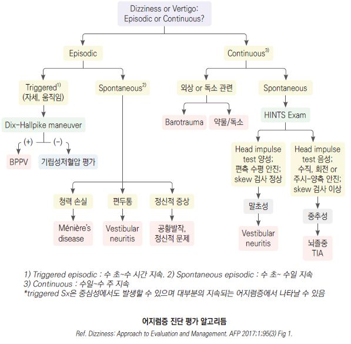

# 어지럼증 Dizziness

## <mark style="color:green;">일반 사항</mark>

* 움직임이 없음에도 움직인다고 느끼거나 실제보다 더 많이 움직이는 느낌, 불균형, 불안정성
* 경고 증상이 있거나 중추성 원인이 의심되는 경우 이송 등 신속한 조치를 요함
* 어지럼의 여러 형태가 혼재되어 있고 표현의 불확실성 때문에 증상으로 원인을 감별하기 어려움; 증상의 유형보다 증상의 발생 시점, trigger 등에 주목하는 것이 필요

#### <mark style="color:$primary;">(true) Vertigo</mark>

* 증상 : 회전감(“방이 돈다”), 움직이는 느낌(false sense)
* 원인
  * 말초성 : 대부분 차지; BPPV, 전정신경염, 미로염, Ménière Dz
  * 중추성 : 소뇌종양, CVD, 편두통

#### <mark style="color:$primary;">Disequilibrium</mark>

* 증상 : 불안정성, 불균형, 흔들리는 느낌
* 원인 : 파킨슨병, 말초신경병증, 진정제, 전정 신경 질환, 소뇌 장애, 시각 장애, 경추 강직, (보행 장애 관련) 근골격 질환

#### <mark style="color:$primary;">Pre-syncope</mark>

* 증상 : 실신감, 거의 기절할 것 같은 느낌, 창백, 발한, 구역, 흐릿한 시각 (☞ [실신](/broken/pages/lwehYdDz4jOkTWMpnI8t))
  * 보통 서 있거나 똑바로 앉아 있을 때 발생 (✽누워 있을 때 발생하면 cardiac arrhythmia를 의심)
  * 지속 시간 : 수 초\~ 수분
* 원인 : 기립성 저혈압 및 유발 약물, 부정맥, 심근경색, 관상동맥병

#### <mark style="color:$primary;">Lightheadedness</mark>

* 증상 : 막연한 어지럼, 머리에 혈액이 부족한 느낌
* 원인 : 과호흡증후군, 공황장애, 불안증, 알코올 남용

#### <mark style="color:$primary;">Non-specific dizziness</mark>

* 원인 : 정신적 문제(스트레스, 우울), 과호흡, 두부 외상, 약물(항콜린제, 항우울제), 대사 장애(저혈당), 특정 어지럼증의 가벼운 형태

### <mark style="color:$danger;">🚩 Red Flags!</mark>

<mark style="color:$danger;">**즉각 응급 조치**</mark>

* 신경학적 이상 : 시각 이상, 구음 장애, 팔/다리 약화, 감각 저하, tingling → 뇌간·소뇌 뇌졸중 의심
* 중추성 안진 (수직 안진, 방향 변환성 안진) → 소뇌·뇌간 병변의 특이적 징후
* 흉통 동반 / 실신·허탈 → 심근경색·대동맥박리·부정맥 의심
* 이전에 경험하지 못한 심한 두통 → 지주막하출혈(thunderclap headache) 의심

<mark style="color:$warning;">**긴급 평가 (당일 응급실 - 수 시간 내)**</mark>

* 외상 후 발생 → 두개내출혈 가능성
* 심한 자세 불안(부축 없이 걸을 수 없음), 행동 장애 → 소뇌 경색·출혈 의심
* 과거 뇌졸중 병력 + 어지럼 재발 → TIA/뇌졸중 재발 의심

<mark style="color:$info;">**조기 평가 (24\~48시간 내 외래 또는 응급실)**</mark>

* 청력 손실 동반 어지럼 → 미로염·AICA 경색 감별 필요 (신경 증상 동반 시 즉각 응급으로 격상)
* 원인 미상의 발열(＞38℃) → 뇌막염·뇌염 가능성 (경부 강직·의식 변화 동반 시 즉각 응급으로 격상)
* 48시간 후에도 호전되지 않음 → 중추성 원인 배제 필요

## <mark style="color:green;">원인</mark>

* Central : 10% 차지, 고령에서는 20% 차지; 편두통, 소뇌 종양, 뇌졸중, vestibular ischemia
* Peripheral : BPPV, 전정신경염, Ménière Dz, otosclerosis, 미로염, cholesteatoma, 외림프누공, superior canal dehiscence syndrome, 멀미, 중이염
* 기타 : 약물, 고령, 기립성 저혈압, 부정맥, 정신적 문제, 급격한 다이어트
* 고령 : 불안/우울 특성, 균형 감각 손상, 심근경색/뇌졸중 과거력, 청력 장애, 기립성 저혈압, 다제약물(✽≥5가지 약물 복용 환자의 ⅔에서 어지럼증 발생)

<mark style="color:$info;">※ 우리나라 referral-based dizziness clinic을 대상으로 한 연구에서는 BPPV 24.1%, psychiatric or persistent postural perceptual dizziness(PPPD) 20.8%, vascular disorder 12.9%, vestibular migraine 10.2%, Meniere’s disease 7.2%, vestibular neuritis 5.4%였으며 19\~64세에서는 PPPD 26.3%, ≥65세에서는 BPPV 28.2%로 가장 흔한 원인으로 보고되었음. (J Neurol 2020 Aug;267(8):2252-2259.)</mark>

## <mark style="color:green;">말초성 질환</mark>

### <mark style="color:orange;">양성발작성체위성어지럼증 (Benign paroxysmal positional vertigo, BPPV)</mark>

* 다른 이름 : 이석증, 돌발성체위성현훈증
* vertigo의 가장 흔한 원인
* 말초성 vertigo
* 50\~70대, 여성(2배)
* 기전 : calcite particle(otoconia)이 떨어져 나와 세반고리관 내에 부유. 머리를 움직이면 otoconia가 움직이게 되고, 다시 놓여 질 때까지 motion sense를 일으킴
* 원인 : 특발성(특히 고령), 외상(젊은 연령), viral neurolabyrinthitis
* 위험 인자 : 두부 외상, 내이 허혈, 전정신경염, 귀 수술, 우울, 움직이지 않는 생활
* 발생 부위 : post. canal 60\~90%, lat.(horizontal) canal 10\~30%; ant.(sup.) canal rare; \[우리나라] lat canal 이환이 많음(30%)

#### <mark style="color:$primary;">임상 양상</mark>

* 특정 자세나 머리 움직임에 따라 심한 회전감 발생
* 경과 : 돌발적 발생 → 자세를 바꾸고 안정하면 보통 수 분 이내 호전, 1주일 이상 반복 발생
* 동반 증상 : 구역
  * 청력이나 신경학적 이상은 없음
* 안진 : 말초성
* 검사 : Dix-Hallpike test(post canal), Supine roll test(lat canal)

### <mark style="color:orange;">급성단측전정병증 (Acute Unilateral Vestibulopathy, AUV / 전정신경염)</mark>

* vertigo의 두 번째 흔한 원인
* 30\~50세 호발
* 원인 : 전정신경의 바이러스 감염; 기전은 불명
* 국제 전정장애 분류(ICVD)에서 최신 선호 용어는 Acute Unilateral Vestibulopathy(AUV)

#### <mark style="color:$primary;">임상 양상</mark>

* 경과 : 수 시간에 걸쳐 아급성으로 진행 → 1\~2일째 가장 심함 → 수일\~1주 동안 점차 완화
  * 불안정성은 수개월 동안 지속될 수 있음; 발병 후 15%에서 BPPV가 발생할 수 있음
* 동반 증상 : 구역/구토(처음 수일 동안 심함)
  * 청력 이상은 보통 없음
* 안진 : 급성기에 말초성 안진. horizontally rotating spontaneous nystagmus
* 신경학적 이상 : 걷기 힘듦. 이환된 쪽으로 방향이 틀어지거나 넘어짐
* 검사 : Head impulse test 이상

### <mark style="color:orange;">메니에르병 (Ménière Dz)</mark>

* 기전 : 내이 endolymphatic fluid의 증가
* 원인 : 불명, 알레르기, 감염, 자가면역 손상

#### <mark style="color:$primary;">임상 양상</mark>

* 3주징 : 어지럼, (환측) 이명, 난청(감각 신경성); 종종 침상 안정이 필요할 만큼 중증
* 경과 : 수 분\~수 시간 지속, 반복 발생
* 동반 증상 : 귀의 충만감과 통증, 구역, 구토, 두통 악화
  * 신경학적 이상은 없음
* 안진 : 말초성. unidirectional, horizontal-torsional

### <mark style="color:orange;">미로염 (내이염, Labyrinthitis)</mark>

* 원인 : 감염(바이러스, 세균), 염증, 혈행 장애(경색), 자가면역 질환, 이독성 약물(예: aspirin, aminoglycoside, loop diuretics, cisplatin)
* 위험 인자 : 상기도 감염, 중이염, 두부 외상, 알레르기 병력, 뇌막염, 뇌혈관 질환, 기저 자가면역질환, herpes zoster 감염, 음주, 알코올 남용, 흡연

#### <mark style="color:$primary;">임상 양상</mark>

* 심한 정도의 움직이는 느낌, 방이 도는 느낌
* 경과 : 돌발적 → 보통 수 시간\~수일 지속
* 동반 증상 : 구역, 구토; 원인에 따른 증상 발생(예: 뇌막염 시 두통, 중이염 시 귀의 통증)
* 청력 이상 : 편측 돌발성 난청　
  * 신경학적 이상은 없음(뇌막염 제외)
* 안진 : spontaneous, fine horizontal nystagmus. horizon-torsion 병합도 가능

### <mark style="color:orange;">외림프누공 (Perilymphatic fistula)</mark>

* 기전 : 두개 내 또는 압력 변화로 인하여 외림프액이 내이로부터 중이로 갑자기 이동하면서 발생
* 원인 : 머리/목 외상(가장 흔함), 스쿠버 다이빙, 곡예 비행, 역도, 출산, 심한 코 풀기 또는 재채기, 만성 귀 질환
* 증상 : 갑자기 발생하는 난청, 현훈, 이명

### <mark style="color:orange;">기타</mark>

* Cholesteatoma : keratin debris가 들어 있는 낭종성 병변; 대부분 중이와 mastoid 이환
* Herpes zoster oticus (Ramsay Hunt syndrome) : 귀의 vesicular eruption
* Otosclerosis : 중이의 비정상적으로 성장한 뼈; 난청, 이명, 어지럼 유발
* 말초신경병증 : disequilibrium; 하지(특히 발) 감각 저하

## <mark style="color:green;">중추성 질환</mark>

### <mark style="color:orange;">편두통성 어지럼증 (Vestibular migraine)</mark>

* 편두통과 관련하여 발생하는 어지럼증; 약 30%는 어지럼 발생 시 두통을 동반하지 않음 → 두통이 없어도 편두통 병력이 있으면 반드시 고려
* 5분\~72시간 동안 지속되는 전정기관 증상이 5회 이상 및 편두통 병력이 있는 경우 고려
* 증상 : 두부 압박감, 시각/청각 과민; 구역, 구토, 빛/소리 과민
  * 청력 소실 또는 이명은 없음
* 유발 요인 : 카페인, 알코올, 수면 부족, 호르몬 변화, 특정 음식(티라민 함유 식품), 시각적 자극(복잡한 패턴, 대형 스크린, 스크롤)
* 치료 : 편두통 치료 (☞ [편두통](016_-migraine.md#management))

### <mark style="color:orange;">기타</mark>

* Cerebellopontine angle tumor : vestibular schwannoma(예: acoustic neuroma) 등에 의함
* Cerebrovascular disease : TIA, 뇌졸중
* Multiple sclerosis : white matter의 demyelinization
* 파킨슨병 : disequilibrium; resting tremor, rigidity, bradykinesia

## <mark style="color:green;">기타 질환</mark>

### <mark style="color:orange;">멀미 (Motion sickness)</mark>

* 실제 또는 감지된 움직임에 반응하여 발생하는, 위장 및 신경 증상을 포함하는 증후군 (☞ [멀미](020_-dizziness.md#motion-sickness))
* 원인 : 불명
* 기전 : 신체 움직임에 대한 visual receptor, vestibular receptor 및 body proprioceptor 사이의 불일치에 따른 생리적 반응으로 추정
* 회전, 상하, 낮은 주파수 움직임에서 흔히 발생; 직선, 수평, 높은 주파수 움직임에서는 적게 발생
* 동반 증상 : epigastric fullness, 트림, 구역, 구토, 발한, 창백, 침 분비 증가, 하품, 과호흡
* 신경학적 이상, 청력 이상 : 없음

### <mark style="color:orange;">기타</mark>

* Cervical vertigo : 경추의 외상(특히 과신전)이나 퇴행성 변화 관련; 목의 움직임에 의해 유발
  * 고령의 혈관 위험 인자 보유자에서 고개를 돌릴 때만 발생하는 짧은 어지럼은 VBI(Vertebrobasilar Insufficiency)에 의한 일시적 허혈일 수 있음 - BPPV와 반드시 감별 필요; 신경학적 증상 동반 시 즉시 응급 의뢰
* 약물 유발성 : 향정신성 약물, 항경련제, aspirin, aminoglycosides, α-/β-blockers, furosemide, nitrates, amiodarone, 항콜린제, 근이완제, 발기부전치료제(PDE5i), 인슐린 과다, 알코올
* Psychological : 기분, 불안, 신체화 증상
* 기립성 저혈압 : presyncope; 맥박 증가 (☞ [기립성 저혈압](../225_/096_-orthostatic-hypotension.md))
* 과호흡 : lightheadness; 불안, 맥박 증가; 치료- 호흡 조절, β-차단제, 항불안제

## <mark style="color:green;">진단</mark>

* 혈압 : 누운 자세 및 기립 자세를 포함하여 측정
* 신경학적 검사, 귀 검사 : 청력 검사, Rinne test, Weber test, 안진; electronystagmography, vestibular-evoked myogenic potentials
* 수기 검사 : Dix-Hallpike test, Supine roll test, Test of skew
* 영상 검사 : 보통 도움이 되지 않음; 진단이 불확실하거나 신경학적 이상 시 CT/MRI 고려
* 실험실 검사 : 일률적인 실험실 검사는 필요 없음; 당뇨 환자에서 혈당 등 검사 고려
* 심장 질환 의심 시 ECG, Holter monitoring, carotid Doppler test 등 고려

#### <mark style="color:$primary;">Dix-Hallpike test</mark>

* 방법 ([figure\_e-2.jpg, video\_1.wmv](https://www.neurology.org/doi/10.1212/01.wnl.0000313378.77444.ac))
  * 침대에 무릎을 뻗은 상태로 길게 앉힘\
    → 머리를 45°옆으로 돌린 상태에서 턱을 약간 쳐들게 잡고, 머리가 수평보다 30°더 내려가게 빠르게 눕히고(머리를 침대 밖으로 늘어뜨림) 30초간 안진 관찰\
    → 다시 앉게 하고 30초간 안진 관찰\
    → 반대 방향으로 머리를 돌려 다시 시행
* 진단 : 대부분 안진과 증상이 생기는 쪽의 post canal BPPV에 기인. 드물게 ant canal BPPV도 가능

#### <mark style="color:$primary;">Supine roll test</mark>

* 적용 : Dix-Hallpike test에 음성인 BPPV 의심 환자에서 시행
* 방법 ([video\_2.wmv](https://www.neurology.org/doi/10.1212/01.wnl.0000313378.77444.ac))
  * 환자를 반듯이 눕히고 고개를 약간 굴곡시킨 상태에서 한쪽으로 빠르게 90도 돌린 후 30초간 어지럼 및 안진을 관찰\
    → 30초간 정면을 향하게 한 후 반대쪽도 시행
* 진단 : 안진과 증상이 생기는 쪽의 lat canal BPPV

#### <mark style="color:$primary;">Head impulse test</mark>

* 방법 ([Figure](https://www.nuemblog.com/blog/hints))
  * 검사자와 마주 앉아 검사자의 코를 주시하게 하고 검사자가 환자의 얼굴을 잡고 (환자는 예측 하지 못한 상태에서) 한쪽으로 빠르게 15°돌림\
    → 천천히 정면을 향하게 하고 반대쪽으로 다시 시행
* 음성 (정상) : 시선이 표적에 고정됨; 소뇌 병변에서는 정상 반응을 보임
* 양성 (비정상) : 시선이 머리 회전을 따라 돌아간 후 정면으로 돌아 옴; 회전시킨 쪽의 vestibulo-ocular reflex 결손 (peripheral vestibular lesion)

#### <mark style="color:$primary;">기타</mark>

* Test of skew : 양쪽 눈을 번갈아 cover & uncover 하며 안구의 수직 움직임을 관찰
  * 양성 (수직 움직임 발생) : 소뇌 이상 의심
* 누공 검사 : 통기 이경으로 고막에 음압/양압을 가해 안진과 현훈 유발
  * 양성 (증상 발생) : 외림프누공 의심
* Vestibular function testing : 진단이 불확실하거나 치료에 반응하지 않을 때 시행

※ [**HiNTS Plus Exam**](https://www.nuemblog.com/blog/hints)

* 중추/말초 vertigo 감별에 유용. 안진이 있는 vertigo가 지속되는 환자에서 적용
* 다음 4가지 검사로 구성 : Head impulse test, Nystagmus, Test of Skew, New hearing loss
* 말초성(Peripheral) 시사 소견 (특이도 및 민감도 ＞95%)
  * Head Impulse Test (+) : 환측으로 머리 회전 시 교정 가동(catch-up saccade) 관찰
  * Nystagmus : 단방향 수평 안진(Direction-fixed); 주시 방향을 바꿔도 안진의 방향이 변하지 않음
  * Test of Skew (-) : 수직 안구 편위 없음
  * New hearing loss (-) : 청력 소실 없음 → 말초성 판정 유지
* 급성 청력 저하(new hearing loss) 전하소뇌동맥(AICA) 경색은 말초성 안진 패턴을 보이면서 청력 소실을 동반할 수 있음. 급성 어지럼증 환자에서 새로운 청력 저하가 확인되면 HINTS 결과와 무관하게 중추성(AICA 경색)으로 간주하고 즉시 응급 MRI 시행

### <mark style="color:orange;">감별</mark>

**Sudden-onset dizziness with 국소 신경학적 이상**

* 예: 수직 or 회전 안진, 새로 발생한 불안정, 새로 발생한 난청
* 당뇨가 있으면 저혈당 확인; 당뇨가 없거나 저혈당 치료 후에도 증상 지속, BPPV 또는 기립성 저혈압에 해당되지 않으면 즉시 의뢰(stroke 감별을 요함)

**Sudden-onset vestibular 증상**

* 예: 어지럼, 구역/구토, 보행 불안정
* HiNTS 검사 시행 : head impulse test(-), 방향성이 있는 안진, test of skew(+) 시 즉시 의뢰(중추성 의심)
* HiNTS 검사를 수행하지 못하는 상황에서 BPPV 또는 기립성 저혈압에 해당되지 않으면 즉시 의뢰

**재발성 어지럼 with 기능적 신경학적 이상**

* 이미 functional neurological disorder로 진단받은 경우 반복되는 어지럼증은 장애 증상일 수 있음
* 새로운 증상이 발생하면 재평가 필요

#### <mark style="color:$primary;">유발 인자에 따른 감별</mark>

<table><thead><tr><th width="239.47369384765625">유발 인자</th><th>의심 질환</th></tr></thead><tbody><tr><td>머리 위치 변화</td><td>급성 미로염, BPPV, 소뇌교각종양, MS, 외림프누공</td></tr><tr><td>자발적 삽화(지속되는 유발 인자 없음)</td><td>급성 전정신경염, CVD(stroke or TIA), 메니에르병, 편두통, 다발경화증</td></tr><tr><td>최근 바이러스성 상기도 감염</td><td>급성 전정신경염</td></tr><tr><td>스트레스</td><td>Psychiatric or psychological, 편두통</td></tr><tr><td>면역 저하 (예: 고령, 스트레스)</td><td>HZO</td></tr><tr><td>귀 압력, 두부 외상, 긴장, 소음</td><td>외림프누공</td></tr></tbody></table>

_<mark style="color:$info;">Ref. Initial evaluation of vertigo AFP 2006:73(2). Table 3.</mark>_

#### <mark style="color:$primary;">증상 기간 및 청각 저하 여부에 따른 감별</mark>

<table><thead><tr><th width="96.36837768554688">시간</th><th>청각 증상 있음</th><th>청각 증상 없음</th></tr></thead><tbody><tr><td>수 초</td><td>외림프누공</td><td>BPPV, 척추뇌저동맥부전</td></tr><tr><td>수 시간</td><td>내림프수종(Ménière Dz, 매독)</td><td>편두통</td></tr><tr><td>수일</td><td>미로염, 자가면역 내이 질환</td><td>전정신경염, 편두통</td></tr><tr><td>수개월</td><td>청신경종, 이독성</td><td>다발경화증, 소뇌 퇴화</td></tr></tbody></table>

_<mark style="color:$info;">Ref. Lange 2020 Current medical diagnosis & treatment 59th Ed. Table 8-3.</mark>_

#### <mark style="color:$primary;">동반 증상에 따른 감별</mark>

<table><thead><tr><th width="181.368408203125">동반 증상</th><th>의심 질환</th></tr></thead><tbody><tr><td>귀 충만감</td><td>청신경종, 메니에르병</td></tr><tr><td>귀, 유양돌기 통증</td><td>청신경종, 급성 중이 질환(중이염, HZO)</td></tr><tr><td>안면 약화</td><td>청신경종, HZO(herpes zoster oticus)</td></tr><tr><td>국소 신경 이상</td><td>소뇌교각종양, CVD, 다발경화증</td></tr><tr><td>두통</td><td>청신경종, 편두통</td></tr><tr><td>청력 손실</td><td>메니에르병, 미로염, 외림프누공, 청신경종, 진주종, 귀경화증, CVD, HZO</td></tr><tr><td>불균형</td><td>급성 전정신경염(보통 중등증), 소뇌교각종양(보통 심함)</td></tr><tr><td>안진</td><td>Vertigo(중추 또는 말초)</td></tr><tr><td>큰소리공포, 눈부심</td><td>편두통</td></tr><tr><td>이명</td><td>급성 미로염, 청신경종, 메니에르병</td></tr><tr><td>보행 불안정, 구음 장애</td><td>cerebellar disorder</td></tr></tbody></table>

_<mark style="color:$info;">Ref. Initial evaluation of vertigo AFP 2006:73(2). Table 4.</mark>_

#### <mark style="color:$primary;">중추성 vs 말초성 감별</mark>

| 특징                          | 말초성             | 중추성                         |
| --------------------------- | --------------- | --------------------------- |
| 발병/진행                       | 갑자기 발생          | 갑자기 또는 점진적 (뇌졸중은 갑자기 발생 가능) |
| 안진: 수직/purely torsional     | 없음              | 있음                          |
| 안진: 물체 주시 효과                | 주시로 진정됨         | 주시로 진정되지 않음                 |
| 안진: 좌우 응시에 따른 fast phase 방향 | 변화 없음(건측 방향 안진) | 방향 변함                       |
| 안진: 지속 기간                   | 수일 후 사라짐        | 수 주\~수개월 지속                 |
| 자세 불균형 정도                   | 중등증 이하, 보행 가능   | 심함, 보행하기 힘듦                 |
| 구역, 구토                      | 심함              | 다양함                         |
| 이명, 청력 소실                   | 흔함              | 드묾/다양(이환 부위에 따라)            |
| 신경학적 이상                     | 드묾              | 흔함(복시, 구어 장애, 딸꾹질)          |
| 유발 검사 후 잠복기                 | 5\~20초          | 없음 또는 즉각 발생                 |

_<mark style="color:$info;">Ref. Initial evaluation of vertigo AFP 2006:73(2). Table 6. (잠복기 항목 수정)</mark>_

_<mark style="color:$info;">✽ 침상 감별에는 HINTS Plus(Head impulse test, Nystagmus, Test of Skew + New hearing loss) 활용 — 본문 HiNTS Plus Exam 참조</mark>_

#### <mark style="color:$primary;">체위성 안진: 말초성 vs 중추성</mark>

| 특징              | 말초성                                        | 중추성                    |
| --------------- | ------------------------------------------ | ---------------------- |
| 체위성 안진 발생 전 잠복기 | 5\~20초                                     | 없음 또는 즉각 발생            |
| vertigo 강도      | 심함                                         | 약함, 간혹 없음              |
| 안진 방향           | 편측 방향(torsional-upbeating); 주시에 따라 변할 수 있음 | 머리 방향에 따라 변화; 수직 안진 가능 |
| 안진 지속 시간        | ＜1분                                        | ＞1분                    |
| fatigability    | 있음(자세 유지 시 호전)                             | 없음(감소하지 않고 유지)         |
| habituation     | 있음(반복 검사 시 반응↓)                            | 없음                     |

_<mark style="color:$info;">Ref. Treatment of vertigo AFP 2005;71(6). Table 2. Evaluation of the patient with vertigo. UpToDate.</mark>_

#### <mark style="color:$primary;">Vertigo 원인별 특징</mark>

|                          | 시간 경과                | 임상 상태                          | 안진         | 신경 증상                     | 청각 증상                             | 기타                       |
| ------------------------ | -------------------- | ------------------------------ | ---------- | ------------------------- | --------------------------------- | ------------------------ |
| **BPPV**                 | 반복; 짧음(＜1분)          | 특정 머리 움직임 or 자세로 증상 유발         | 말초성        | 없음                        | 없음                                | Dix-Hallpike maneuver 양성 |
| **AUV / 전정신경염**          | 일회성; 갑자기 시작; 수일      | 바이러스 감염(예: 감기)이 동반되거나 선행       | 말초성        | 병변측으로 넘어짐; 뇌간 증상 없음       | 극고주파수대 난청(＞8 kHz) 또는 없음           | Head impulse test 비정상    |
| **Meniere disease**      | 재발; 수 분\~수 시간        | 자발적 개시                         | 말초성        | 없음                        | 귀 먹먹함/통증 선행; 편측성 이명, 저주파 감각신경성 난청 |                          |
| **Vestibular migraine**  | 재발; 수 분\~72시간        | 편두통 병력; 두통 없는 경우 약 30%         | 중추성 or 말초성 | 편두통 증상(두통, 빛/소리 과민)       | 보통 없음                             | 삽화 사이 정상; 시각 자극으로 유발 가능  |
| **PPPD**                 | 지속(≥3개월); 비발작성       | 전정 질환·불안 선행; 직립·움직임·시각 자극으로 악화 | 보통 없음      | 없음                        | 없음                                | SSRI·CBT·전정재활 치료         |
| **Vertebrobasilar TIA**  | 일회성 or 재발; 수 분\~수 시간 | 고령, 혈관 위험인자, 경추 외상             | 중추성        | 일시적 신경 장애(발음, 균형, 시각, 마비) | 보통 없음                             | 영상(MRI) 검사               |
| **Brainstem infarction** | 갑자기 시작; 수일\~수 주      | 고령, 혈관 위험인자                    | 중추성        | 다른 뇌간 증상                  | 보통 없음(AICA 경색은 청력 소실 동반)          | 영상(MRI) 검사               |
| **소뇌 경색 or 출혈**          | 갑자기 시작; 수일\~수 주      | 고령, 혈관 위험인자(고혈압)               | 중추성        | 보행 장애, 두통, 사지 마비, 연하 장애   | 없음                                | 응급 영상(MRI) 검사            |

_<mark style="color:$info;">Ref. Evaluation of the patient with vertigo. UpToDate. 2018. / Rakel Family medicine 9th ed. 2016. eTable 18-4. (AUV 용어, VM·PPPD 업데이트)</mark>_

***

<figure><figcaption></figcaption></figure>

***

## <mark style="background-color:$warning;">Management</mark>

## <mark style="color:green;">비-약물 치료</mark>

* 금연

**전정 재활 운동**

* 어지럼 증상이 심하게 유발되지 않는 수준으로 시행
* [예](https://youtu.be/KkKAoHZdUnI)
  1. 고개를 양 옆으로 움직임,
  2. 정면을 보고 위 아래로 움직임,
  3. 옆으로 45도 돌리고 위 아래로 움직임 & 반대편에서 반복
  * 처음에는 눈을 뜨고 시선 고정 없이, 이후 정면 사물을 주시하면서(또는 팔을 뻗고 손가락을 응시하면서), 최종적으로 눈을 감고 운동
  * 1회 20번, 1일 2회 이상 시행. 천천히 시작, 점차 빠르게 시행

**Balance exercise**

* [예](https://www.uofmhealth.org/health-library/ug1239)
  1. 앞에는 의자 등, 뒤에는 벽을 두고(필요하면 이를 지지) 팔을 붙이고 발을 모으고 30초간 서 있음 (Romberg exercise)
  2. 어깨 넓이로 발을 벌리고 서서 앞-뒤로, 좌-우로 기울임, 20번 반복
  3. 제자리 걷기(가급적 무릎을 높게 올림)
  4. 발을 약간 벌리고 서서 180도 turn
  * 처음에는 오른쪽, 다음에는 왼쪽, 어지러움이 발생하는 쪽에 5회 turn; 눈을 뜨고 시행, 가능하면 눈을 감고 반복; 하루 2회 시행

## <mark style="color:green;">치료 약물</mark>

✽일부 약제는 어지럼증 상병으로는 보험 적용 안 됨

### <mark style="color:orange;">전정 안정제</mark>

* 진정 작용으로 인하여 낙상 등의 위험이 있음. 항콜린제 부작용 위험이 있음; 증상 회복 기간을 단축시켜 주지는 못함

#### <mark style="color:$primary;">Benzodiazepine</mark>

* diazepam : 2\~5 ㎎ bid\~tid <mark style="color:blue;">\[디아제팜]</mark>
* clonazepam : 0.25\~0.5 ㎎ bid <mark style="color:blue;">\[리보트릴]</mark>
* lorazepam : 0.5\~2 ㎎ qid <mark style="color:blue;">\[아티반]</mark>

#### <mark style="color:$primary;">Antihistamine</mark>

* meclizine : 12.5\~25 ㎎ bid\~tid <mark style="color:blue;">\[염산메클리진]</mark>
* dimenhydrinate : 25\~50 ㎎ bid\~qid <mark style="color:blue;">\[보나링 에이]</mark>; BPH, 녹내장 주의

#### <mark style="color:$primary;">항콜린제</mark>

*   scopolamine 경피제 : 멀미에 적용; 출발 4시간 이전에 귀 뒤에 부착 (72시간 동안 효과); ≥8세 허가 <mark style="color:blue;">\[키미테 패취]</mark>

    (☞ [항콜린제](../224_/073_.md#gi-antispasmodic-agent))

### <mark style="color:orange;">항구토제</mark>

* granisetron : 1 ㎎ tid <mark style="color:blue;">\[카이트릴]</mark>
* metoclopramide : 단기 사용; 5\~10 ㎎ tid <mark style="color:blue;">\[맥페란]</mark>
  * 고령 환자 주의 : 추체외로 증상(extrapyramidal symptoms; 파킨슨 유사 증상, 지연성 이상운동증) 위험; 가능한 단기간(5일 이내) 사용, 대안으로 ondansetron 고려

### <mark style="color:orange;">이뇨제</mark>

* hydrochlorothiazide : 메니에르병에 적용; 12.5\~25 ㎎ qd\~bid <mark style="color:blue;">\[다이크로짇]</mark>

### <mark style="color:orange;">허혈 예방, 혈액 순환 개선</mark>

* 필요시 혈압 조절, 지질 개선, 항혈전제
* trimetazidine : 20 ㎎ tid <mark style="color:blue;">\[바스티난]</mark>
* ginkgo biloba extract : 유효성에 대한 근거 부족; 40 ㎎ tid 또는 80 ㎎ bid <mark style="color:blue;">\[기넥신]</mark> ([보험기준](https://www.hira.or.kr/rc/insu/insuadtcrtr/InsuAdtCrtrPopup.do?mtgHmeDd=20250301\&sno=1\&mtgMtrRegSno=0008))
* kallidinogenase : 유효성에 대한 근거 부족; 25\~50 IU tid <mark style="color:blue;">\[카레스]</mark>

### <mark style="color:orange;">Betahistine</mark>

* 말초성 어지럼증(메니에르병, 전정신경염) 증상 완화 및 예방에 적용
* 기전 : 전정 핵의 흥분성 조절 (H1 효현제 + H3 길항제), 내이 혈류 개선
* 용량 : 16 ㎎ tid (48 ㎎/d); 최소 3개월 이상 투여 <mark style="color:blue;">\[메네스에스]</mark>
  * 고용량 요법 : 효과 불충분 시 최대 48 ㎎ tid (144 ㎎/d)까지 증량 보고 있음 (유럽 가이드라인); 기존 용량에 반응 없는 메니에르병 환자에서 6개월 이상의 고용량 요법이 발작 빈도를 유의하게 낮춘다는 근거가 있음; 국내 보험 급여 범위 초과 시 비급여 처방 필요
* BPPV에는 효과 없음; 중추성 어지럼증에 대한 근거 불충분

### <mark style="color:orange;">기타</mark>

* 편두통 치료제 : 편두통 관련 어지럼증에 적용
* SSRI : psychosomatic vertigo, 지속되는 postural-perceptual vertigo에 적용 (☞ [항우울제](../231_/213_-antidepressants-and-anxiolytics.md#selective-serotonin-reuptake-inhibitor-ssri))
* steroid : 전정신경염에 적용; 증상 발현 3일 이내 투여 시 단기 전정 기능 회복에 도움 가능 (장기 예후 근거 불충분)
  * methylprednisolone : 100 ㎎/d → 10일에 걸쳐 점감, 총 3주 투여 <mark style="color:blue;">\[메치론]</mark>

## <mark style="color:green;">질환별 치료</mark>

### <mark style="color:orange;">BPPV</mark>

* 대부분 4(2\~6)주 내 자연 회복; 30\~50%에서 재발(특히 첫째 해), 이석정복술로 재발 감소;

#### <mark style="color:$primary;">이석정복술 (Canalith repositioning maneuver)</mark>

**Epley maneuver**

* post canal BPPV의 가장 효과적인 치료법; 치료 성공률 80%
* [방법](https://www.youtube.com/watch?v=jBzID5nVQjk)
  * 무릎을 뻗은 상태로 침대에 길게 앉음 → 환측으로 머리를 45°돌리고 턱을 약간 쳐들게 한 후 빠르게, 머리가 수평보다 30°더 내려가게 눕히고(lay back, 머리를 침대 밖으로 늘어뜨림) 1분간 유지\
    → 이 상태에서 고개를 건측으로 90°돌려 1분간 유지\
    → 머리와 몸을 건측으로 90°더 돌려 얼굴이 45°각도로 바닥을 향하게 하고 1분간 유지; 이 과정에서 두정부는 계속 아래를 향하도록 함\
    → 이 상태를 유지하며 천천히 일아나 앉게 하고 30초간 유지
* 시술 중 구역 발생 가능성에 대하여 설명; 반복 시술할 수 있으며 시술 후 활동 제한은 필요 없음

**Semont-plus maneuver**

*   post canal BPPV에 적용

    Epley maneuver보다 효과가 더 좋다는 보고가 있음(증상 소멸까지 평균 SM-plus 2일 vs. EM 3일 소요)
* [방법](https://edhub.ama-assn.org/jn-learning/video-player/18794329)
  * \[어지러움이 발생하는 방향이 오른쪽일 때] 침대 오른쪽에 걸터 앉아 왼쪽을 향해 얼굴을 45도 돌림\
    → 오른팔을 옆으로 뻗고 오른쪽(환측)으로, 머리가 침대 아래로 내려가도록(head 60 degree overextended) 150도 이상 옆으로 쓰러짐, 이 자세를 60초 유지\
    → 얼굴 각도를 유지한 채 왼쪽(건측)으로 240도 움직임. 60초 유지\
    → 일어나 앉아 정면을 보고 60초 유지
* 오전, 오후, 밤에 각각 3회 반복

**Lempert roll maneuver(Barbecue roll maneuver)**

* lat canal BPPV 치료법; 치료 성공률 ＜75%
* 방법
  * 환측 귀가 바닥을 향하도록 90°옆으로 누움\
    → 건측으로 90도 돌아 누움(얼굴이 천정을 향한 자세)\
    → 건측으로 90도씩 더 돌아 누워 환측 귀가 바닥을 향한 처음 자세가 되도록 함\
    → 천천히 일어나 앉음; 각 자세마다 30\~60초 또는 어지럼증이 사라질 때까지 유지함 (✽각 자세의 유지 시간과 눕는 각도에 대해서는 이견이 있음)

**Gufoni maneuver**

* lat canal BPPV 치료법; Lempert보다 시행이 간편하여 임상에서 선호도 높음
* 방법 (canalith repositioning type — geotropic 안진 시)
  * 환자를 건측으로 빠르게 눕힘 (2분 유지)\
    → 코가 바닥을 향하도록 고개를 45° 아래로 돌림 (2분 유지)\
    → 천천히 일어나 앉음
* ✽ 안진 방향(geotropic vs apogeotropic)에 따라 방법이 달라지므로 Supine roll test로 병변 측 확인 후 시행

**재활 운동**

* 전정 재활 운동 예: [Brandt-Daroff exercise](https://www.youtube.com/watch?v=voZXtTUdQ00\&t=31s)
  * 침대 가장자리에 똑바로 앉음\
    → 고개를 오른쪽으로 45도(또는 가능한 한) 돌림\
    → 왼쪽으로 빠르게 눕고 30초간(또는 어지럼이 진정될 때까지) 자세 유지\
    → 일어나 앉아 고개를 정면을 향하게 함\
    → 고개를 왼쪽으로 45(또는 가능한 한) 돌림\
    → 오른쪽으로 빠르게 눕고 30초간(또는 어지럼이 진정될 때까지) 자세 유지\
    → 일어나 앉아 고개를 정면을 향하게 함

#### <mark style="color:$primary;">약물 치료</mark>

* 안정제 : 원칙적으로 권장하지 않음 (AAO-HNS 가이드라인); central compensation을 방해하고 낙상 위험을 증가시킴. 불가피한 경우 단기간으로 제한하며 주의를 요함
* 항구토제 : 구역/구토가 심한 경우 단기 사용
* Vit D & Ca : 혈중 Vitamin D 농도가 낮은 경우(＜20 ng/mL) 보충 시 BPPV 재발률이 유의하게 감소함 (Neurology 2020); 정상 농도에서는 추가 효과 불분명
  * Cholecalciferol 400 IU + Calcium carbonate 500 ㎎ bid

### <mark style="color:orange;">급성단측전정병증 (AUV / 전정신경염)</mark>

* 전정 재활 훈련 : 가능한 조기 시작; 최소 3개월 시행 권장

#### <mark style="color:$primary;">약물 치료</mark>

* 안정제, 항구토제 : central compensation을 차단하는 작용이 있으므로 3일 이내로 사용 제한
* steroid : 증상 발현 3일 이**내** 투여 시 전정 기능 단기 회복에 도움 가능; 장기 예후(어지럼 장애 지수) 개선 근거는 불충분
  * methylprednisolone : 100 ㎎/d → 10일에 걸쳐 점감, 총 3주 투여 <mark style="color:blue;">\[메치론]</mark>
* betahistine : 증상 완화 목적; 16 ㎎ tid (48 ㎎/d) <mark style="color:blue;">\[메네스에스]</mark> — EAONO 권고

### <mark style="color:orange;">미로염</mark>

#### <mark style="color:$primary;">약물 치료</mark>

* 전정 안정제(단기 사용), 항구토제
* 항생제 : 세균 감염 의심 시 적용
* 항바이러스제 : herpes에 의한 경우 적용
  * acyclovir 800 ㎎ 5회/d ×7d <mark style="color:blue;">\[메노바]</mark> (☞ [단순포진](../229_/181_-herpes-simplex.md#undefined-14))

### <mark style="color:orange;">메니에르병</mark>

* 음식 제한 : 소금(＜2 g/d), MSG, 카페인, 초콜릿, 니코틴, 음주; 충분한 수분 섭취(35 ㎖/㎏/d)
* 알레르기 환자에서 알레르기 치료
* 수술 : endolymphatic sac surgery

#### <mark style="color:$primary;">약물 치료</mark>

* 전정 안정제, 항구토제 : 급성 발작기 단기 사용
* 이뇨제 : hydrochlorothiazide
* betahistine : 발작 예방 목적; 16 ㎎ tid (48 ㎎/d) 이상, 최소 3개월 이상 투여 <mark style="color:blue;">\[메네스에스]</mark> - EAONO·NICE 가이드라인 권고
* 고실 내 스테로이드 주입술(Intratympanic steroid injection, ITSI) : 경구 스테로이드 부작용이 우려되는 환자(당뇨 등) 또는 경구 약물에 반응하지 않는 난치성 증례에서 이비인후과 협진 고려

### <mark style="color:orange;">지속성체위지각어지럼증 (Persistent postural-perceptual dizziness, PPPD)</mark>

* 국내 dizziness clinic에서 두 번째로 흔한 원인(20.8%)
* 진단 기준 \[ICD-11]
  * **지속성** : 3개월 이상 대부분의 날(한 달에 15일 이상) 발생하는 어지럼, 부동감(unsteadiness); 환자는 흔히 "붕 떠 있는 것 같다", "구름 위를 걷는 것 같다"고 표현함
  * **악화 요인** : 직립 자세(standing/walking), 특정 방향과 상관없는 능동적/수동적 움직임, 복잡한 시각 자극(대형 마트, 영화관 등)
  * **선행 사건** : 급성 전정질환(BPPV, 전정신경염), 실신, 공황발작 등 어지럼을 유발하는 사건이 선행함
  * **심각한 고통** : 증상으로 인한 일상생활 기능 장애 또는 심리적 위축 동반 (직장, 사회활동 회피 등)
  * **배제 진단** : 다른 질환으로 더 잘 설명되지 않음

#### <mark style="color:$primary;">치료</mark>

* 전정 재활 훈련 : 습관화 운동 중심; 조기 시작이 중요
* 인지행동치료(CBT) : 발생 8주 이내 시작 시 효과 현저히 높음
* SSRI/SNRI : sertraline 25\~100 ㎎/d 또는 escitalopram 5\~20 ㎎/d; 최소 1년 유지 권장

### <mark style="color:orange;">외림프누공</mark>

* 침상 안정. 수술(이식)

***

### <mark style="color:red;">질병코드</mark>

R42 어지럼증 및 어지럼

_※ 실무 팁 : R42는 증상 코드로, 장기 처방이나 VNG 등 정밀 검사 청구 시 삭감 위험이 있음. 확정 진단 전까지는 R42를 주상병으로 사용하되, BPPV가 의심되면 H81.1을 부상병으로 병기하여 청구 일관성을 유지하는 것이 바람직함_

H81.0 메니에르병

H81.1 양성 발작성 현기증

H81.2 전정신경세포염

H81.9 전정기능의 상세불명 장애

H83.0 미로염

H81.89 기타 명시된 전정기능 장애 (PPPD에 적용)

***

## <mark style="color:purple;">처방례</mark>

> **처방례 1.** 급성 어지럼증 — 일반 (말초성, 원인 불명)
>
> ```
> 보나링 에이 50 mg/T  1T  bid~tid  (BPH, 녹내장 주의)
> 맥페란 5 mg/T  1T  tid  (구역/구토 동반 시; 단기 사용)
> ```

> **처방례 2.** BPPV — 재발 예방 (Vit D 결핍 환자)
>
> ```
> 비타민 D3 400 IU  1캡슐  bid
> 탄산칼슘 500 mg  1정  bid  (식후 복용)
> ```

> **처방례 3.** 전정신경염 — 급성기 (증상 발현 3일 이내)
>
> ```
> 메치론 주 500 mg/5 mL  1V(100 mg)  IV qd  (3주 tapering; 발현 3일 이내 시작)
> 보나링 에이 50 mg/T  1T  bid  (3일 이내로 제한)
> 메네스에스 16 ㎎/T  1T  tid  (증상 완화 목적)
> ```

> **처방례 4.** 메니에르병 — 예방 (발작 간기)
>
> ```
> 메네스에스 16 ㎎/T  1T  tid  (48 ㎎/d; 최소 3개월 이상 유지)
> 다이크로짇 25 mg/T  1T  qd  (이뇨; 아침 복용)
> ```

> **처방례 5.** PPPD (지속성체위지각어지럼증)
>
> ```
> [Option A - SSRI]
> 렉사프로 10 mg/T  0.5T  qd  조식 후  (2주 후 1T으로 증량; 최소 1년 유지)
>
> [Option B - SNRI]
> 이팩사 37.5 mg/C  1C  qd  조식 후  (1~2주 후 75 mg qd로 증량; 최소 1년 유지)
> ```

***

### <mark style="color:$success;">핵심 복약 지도</mark>

> **전정 안정제** (보나링 에이, 디아제팜 등)
>
> * **단기 사용 원칙** : 어지럼증이 심한 급성기(2\~3일)에만 사용하십시오. 장기 복용은 뇌의 균형 회복을 방해합니다.
> * **졸음·낙상 주의** : 복용 중 운전·기계 조작을 삼가고, 갑자기 일어날 때 천천히 움직이십시오.
> * **입마름·소변 불편** : 입마름이 생길 수 있습니다. 전립선 비대증이 있는 고령 남성은 소변이 잘 나오지 않는 증상(소변 정체)이 생길 수 있으니 반드시 의사에게 알리십시오.
> * **BPH·녹내장** : 전립선 비대증 또는 녹내장이 있으면 반드시 의사에게 알리십시오.

> **이석정복술(Epley maneuver) 후 안내**
>
> * 시술 직후 일시적인 어지럼이 생길 수 있으나 곧 가라앉습니다.
> * 시술 후 특별한 자세 제한은 필요하지 않습니다 (일상 활동 가능).
> * 재발 예방을 위해 Vit D 혈중 농도가 낮은 경우 보충제를 처방받으십시오.

> **전정 재활 운동 (전정신경염·PPPD)**
>
> * 어지럼이 완전히 없어질 때까지 기다리지 말고, 증상이 유발되지 않는 수준으로 조기에 운동을 시작하십시오.
> * 매일 2회 이상, 최소 3개월간 꾸준히 시행하는 것이 중요합니다.
> * 처음에는 눈을 뜨고 천천히 시작하여 점차 빠르게, 최종적으로 눈을 감고 시행합니다.

> **메네스에스 (메니에르병·전정신경염)**
>
> * 효과가 나타나기까지 수주\~수개월이 걸릴 수 있으니 임의로 중단하지 마십시오.
> * 식사와 함께 또는 식후에 복용하면 위장 불편을 줄일 수 있습니다.
> * 메니에르병은 저염식(소금 2 g/d 이하)과 충분한 수분 섭취(1.5\~2 L/d)를 병행하십시오.

> **렉사프로 (PPPD)**
>
> * 처음 1\~2주간 오히려 어지럼이 일시적으로 악화될 수 있으나 이후 호전됩니다.
> * 최소 1년 이상 복용이 권장되며, 의사와 상의 없이 갑자기 중단하지 마십시오.
> * 인지행동치료(CBT) 또는 전정 재활 운동을 병행하면 효과가 높아집니다.

***

### <mark style="color:blue;">환자 안내서</mark>


**어지럼증, 원인에 따라 치료가 달라집니다**

대부분의 어지럼증은 귀(전정기관)에서 비롯되며 적절한 치료로 충분히 회복될 수 있습니다. 단, 신경학적 증상이 동반되면 즉각 응급 평가가 필요합니다.


#### <mark style="color:$primary;">어지럼증이란 무엇인가요?</mark>

* **이석증(BPPV)** : 귀 속 작은 돌(이석)이 제자리를 벗어나 특정 머리 움직임 때마다 수 초\~수 분간 심한 회전감이 생기는 가장 흔한 어지럼증. 이석정복술(에플리 방법)로 대부분 빠르게 호전됩니다.
* **전정신경염** : 전정신경의 바이러스 감염으로 수일간 심한 어지럼과 구역이 지속됩니다. 조기 재활 운동이 회복을 앞당깁니다.
* **메니에르병** : 어지럼·이명·난청이 반복 발생합니다. 저염식과 수분 섭취 조절이 중요합니다.
* **PPPD** : 급성 전정 질환 이후 수개월간 흔들림·불안정감이 지속되는 상태. 재활 운동과 인지행동치료가 핵심 치료입니다.

#### <mark style="color:$primary;">즉시 응급실로 가야 하는 어지럼증</mark>

* 어지럼과 함께 팔다리 힘 빠짐·발음 장애·복시·안면 마비가 동반된 경우
* 갑자기 심한 두통이 함께 발생한 경우
* 쓰러질 정도로 균형을 잡지 못하는 경우

#### <mark style="color:$primary;">전정 재활 운동은 어떻게 하나요?</mark>

* 어지럼이 완전히 사라질 때까지 기다리지 말고, **증상이 심하게 유발되지 않는 범위에서 조기에 시작**하십시오.
* 매일 2회 이상, 최소 3개월간 꾸준히 시행하는 것이 중요합니다.
* 처음에는 눈을 뜨고 천천히, 점차 빠르게, 최종적으로 눈을 감고 시행합니다.
* 이석정복술(에플리) 후에는 특별한 자세 제한 없이 일상생활이 가능합니다.

#### <mark style="color:$primary;">생활 속 실천 사항</mark>

* **낙상 방지** : 어지럼 발작이 느껴지면 즉시 그 자리에 주저앉거나 고정된 물체(벽·가구)를 잡으십시오. 무리하게 걸으려 하지 마십시오.
* **메니에르병** : 소금을 하루 2 g 이하로 제한하고, 수분을 하루 1.5\~2 L 충분히 마시십시오. 카페인·알코올·흡연을 피하십시오.
* **이석증 재발 예방** : 비타민 D가 부족한 경우 보충제를 복용하면 재발을 줄일 수 있습니다.
* 안정제(전정억제제)는 급성기 단기 사용에 한하며, 장기 복용은 뇌의 균형 회복을 방해합니다.
* 갑자기 일어날 때는 천천히 움직이십시오.
