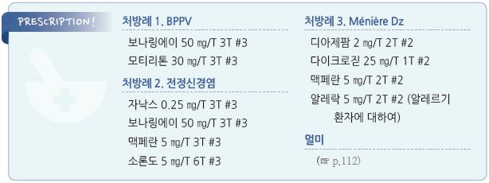

# 어지럼증 Dizziness

## <mark style="color:green;">일반 사항</mark>

* 움직임이 없음에도 움직인다고 느끼거나 실제보다 더 많이 움직이는 느낌, 불균형, 불안정성
* 경고 증상이 있거나 중추성 원인이 의심되는 경우 이송 등 신속한 조치를 요함
* 어지럼의 여러 형태가 혼재되어 있고 표현의 불확실성 때문에 증상으로 원인을 감별하기 어려움; 증상의 유형보다 증상의 발생 시점, trigger 등에 주목하는 것이 필요

#### (true) Vertigo

* 증상 : 회전감(“방이 돈다”), 움직이는 느낌(false sense)
* 원인
  * 말초성 : 대부분 차지; BPPV, 전정신경염, 미로염, Ménière Dz
  * 중추성 : 소뇌종양, CVD, 편두통

#### Disequilibrium

* 증상 : 불안정성, 불균형, 흔들리는 느낌
* 원인 : 파킨슨병, 말초신경병증, 진정제, 전정 신경 질환, 소뇌 장애, 시각 장애, 경추 강직, (보행 장애 관련) 근골격 질환

#### Pre-syncope

* 증상 : 실신감, 거의 기절할 것 같은 느낌, 창백, 발한, 구역, 흐릿한 시각 (☞ p.103)
  * 보통 서 있거나 똑바로 앉아 있을 때 발생 (✽누워 있을 때 발생하면 cardiac arrhythmia를 의심)
  * 지속 시간 : 수 초\~ 수분
* 원인 : 기립성 저혈압 및 유발 약물, 부정맥, 심근경색, 관상동맥병

#### Lightheadedness

* 증상 : 막연한 어지럼, 머리에 혈액이 부족한 느낌
* 원인 : 과호흡증후군, 공황장애, 불안증, 알코올 남용

#### Non-specific dizziness

* 원인 : 정신적 문제(스트레스, 우울), 과호흡, 두부 외상, 약물(항콜린제, 항우울제), 대사 장애(저혈당), 특정 어지럼증의 가벼운 형태

### <mark style="color:$danger;">🚩 Red Flags!</mark>

* 청력 손실, 진성 현훈, 중추성 안진
* 외상 후 발생
* 행동 장애, 심한 자세 불안(부축 없이 걸을 수 없음), 실신, 허탈
* 신경학적 이상 : 시각 이상, 구음 장애, 팔/다리 약화, 감각 저하, tingling
* 흉통, 이전에 경험하지 못한 심한 두통, 과거 뇌졸중 병력
* 48시간 후에도 호전되지 않음
* 원인 미상의 발열(＞38℃

## <mark style="color:green;">원인</mark>

* Central : 10% 차지, 고령에서는 20% 차지; 편두통, 소뇌 종양, 뇌졸중, vestibular ischemia
* Peripheral : BPPV, 전정신경염, Ménière Dz, otosclerosis, 미로염, cholesteatoma, 외림프누공, superior canal dehiscence syndrome, 멀미, 중이염
* 기타 : 약물, 고령, 기립성 저혈압, 부정맥, 정신적 문제, 급격한 다이어트
* 고령 : 불안/우울 특성, 균형 감각 손상, 심근경색/뇌졸중 과거력, 청력 장애, 기립성 저혈압, 다제약물(✽≥5가지 약물 복용 환자의 ⅔에서 어지럼증 발생)
* ※ 우리나라 referral-based dizziness clinic을 대상으로 한 연구에서는 BPPV 24.1%, psychiatric or persistent postural perceptual dizziness(PPPD) 20.8%, vascular disorder 12.9%, vestibular migraine 10.2%, Meniere’s disease 7.2%,

## <mark style="color:green;">말초성 질환</mark>

### <mark style="color:$primary;">양성발작성체위성어지럼증 (Benign paroxysmal positional vertigo, BPPV)</mark>

* 다른 이름 : 이석증, 돌발성체위성현훈증
* vertigo의 가장 흔한 원인
* 말초성 vertigo
* 50\~70대, 여성(2배)
* 기전 : calcite particle(otoconia)이 떨어져 나와 세반고리관 내에 부유. 머리를 움직이면 otoconia가 움직이게 되고, 다시 놓여 질 때까지 motion sense를 일으킴
* 원인 : 특발성(특히 고령), 외상(젊은 연령), viral neurolabyrinthitis
* 위험 인자 : 두부 외상, 내이 허혈, 전정신경염, 귀 수술, 우울, 움직이지 않는 생활
* 발생 부위 : post. canal 60\~90%, lat.(horizontal) canal 10\~30%; ant.(sup.) canal rare; \[우리나라] lat canal 이환이 많음(30%)

#### 임상 양상

* 특정 자세나 머리 움직임에 따라 심한 회전감 발생
* 경과 : 돌발적 발생 → 자세를 바꾸고 안정하면 보통 수 분 이내 호전, 1주 일 이상 반복 발생
* 동반 증상 : 구역 • 청력이나 신경학적 이상은 없음
* 안진 : 말초성
* 검사 : Dix-Hallpike test(post canal), Supine roll test(lat canal)

### <mark style="color:$primary;">전정신경염 (Vestibular neuritis)</mark>

* vertigo의 두 번째 흔한 원인
* 30\~50세 호발
* 원인 : 전정신경의 바이러스 감염; 기전- 불명

#### 임상 양상

* 경과 : 수 시간에 걸쳐 아급성으로 진행 → 1\~2일째 가장 심함 → 수일\~1주 동안 점차 완화
  * 불안정성은 수개월 동안 지속될 수 있음; 발병 후 15%에서 BPPV가 발생할 수 있음
* 동반 증상 : 구역/구토(처음 수일 동안 심함)
  * 청력 이상은 보통 없음
* 안진 : 급성기에 말초성 안진. horizontally rotating spontaneous nystagmus
* 신경학적 이상 : 걷기 힘듦. 이환된 쪽으로 방향이 틀어지거나 넘어짐
* 검사 : Head impulse test 이상

### <mark style="color:$primary;">메니에르병 (Ménière Dz)</mark>

* 기전 : 내이 endolymphatic fluid의 증가
* 원인 : 불명, 알레르기, 감염, 자가면역 손상

#### 임상 양상

* 3주징 : 어지럼, (환측) 이명, 난청(감각 신경성); 종종 침상 안정이 필요할 만큼 중증
* 경과 : 수 분\~수 시간 지속, 반복 발생
* 동반 증상 : 귀의 충만감과 통증, 구역, 구토, 두통 악화
  * 신경학적 이상은 없음
* 안진 : 말초성. unidirectional, horizontal-torsional

### <mark style="color:$primary;">미로염 (내이염, Labyrinthitis)</mark>

* 원인 : 감염(바이러스, 세균), 염증, 혈행 장애(경색), 자가면역 질환, 이독성 약물(예: aspirin, aminoglycoside, loop diuretics, cisplatin)
* 위험 인자 : 상기도 감염, 중이염, 두부 외상, 알레르기 병력, 뇌막염, 뇌혈관 질환, 기저 자가면역질환, herpes zoster 감염, 음주, 알코올 남용, 흡연

#### 임상 양상

* 심한 정도의 움직이는 느낌, 방이 도는 느낌
* 경과 : 돌발적 → 보통 수 시간\~수일 지속
* 동반 증상 : 구역, 구토; 원인에 따른 증상 발생(예: 뇌막염 시 두통, 중이염 시 귀의 통증)
* 청력 이상 : 편측 돌발성 난청　
  * 신경학적 이상은 없음(뇌막염 제외)
* 안진 : spontaneous, fine horizontal nystagmus. horizon-torsion 병합도 가능

### <mark style="color:$primary;">외림프누공 (Perilymphatic fistula)</mark>

* 기전 : 두개 내 또는 압력 변화로 인하여 외림프액이 내이로부터 중이로 갑자기 이동하면서 발생
* 원인 : 머리/목 외상(가장 흔함), 스쿠버 다이빙, 곡예 비행, 역도, 출산, 심한 코 풀기 또는 재채기, 만성 귀 질환
* 증상 : 갑자기 발생하는 난청, 현훈, 이명

### <mark style="color:$primary;">기타</mark>

* Cholesteatoma : keratin debris가 들어 있는 낭종성 병변; 대부분 중이와 mastoid 이환
* Herpes zoster oticus (Ramsay Hunt syndrome) : 귀의 vesicular eruption
* Otosclerosis : 중이의 비정상적으로 성장한 뼈; 난청, 이명, 어지럼 유발
* 말초신경병증 : disequilibrium; 하지(특히 발) 감각 저하

## <mark style="color:green;">중추성 질환</mark>

### <mark style="color:$primary;">편두통성 어지럼증 (Migrainous vertigo)</mark>

* 편두통과 관련하여 발생하는 일회적 어지럼증; 두통 없이도 발생할 수 있음
* 편두통과 마찬가지로 카페인, 알코올 등에 의해 유발
* 증상 : 두부 압박감, 시각/청각 과민　
  * 청력 소실 또는 이명은 없음
* 5분\~72시간 동안 지속되는 전정기관 증상이 5회 이상 및 편두통 병력이 있는 경우 고려
* 증상 : 두부 압박감, 시각/청각 과민; 구역, 구토, 빛/소리 과민 •청력 소실 또는 이명은 없음
* 치료 : 편두통 치료 (☞ p.76)

### <mark style="color:$primary;">기타</mark>

* Cerebellopontine angle tumor : vestibular schwannoma(예: acoustic neuroma) 등에 의함
* Cerebrovascular disease : TIA, 뇌졸중
* Multiple sclerosis : white matter의 demyelinization
* 파킨슨병 : disequilibrium; resting tremor, rigidity, bradykinesia

## <mark style="color:green;">기타 질환</mark>

### <mark style="color:$primary;">멀미 (Motion sickness)</mark>

* 실제 또는 감지된 움직임에 반응하여 발생하는, 위장 및 신경 증상을 포함하는 증후군 (☞ p.112)
* 원인 : 불명
* 기전 : 신체 움직임에 대한 visual receptor, vestibular receptor 및 body proprioceptor 사이의 불일치에 따른 생리적 반응으로 추정
* 회전, 상하, 낮은 주파수 움직임에서 흔히 발생; 직선, 수평, 높은 주파수 움직임에서는 적게 발생
* 동반 증상 : epigastric fullness, 트림, 구역, 구토, 발한, 창백, 침 분비 증가, 하품, 과호흡
* 신경학적 이상, 청력 이상 : 없음

### <mark style="color:$primary;">기타</mark>

* Cervical vertigo : 경추의 외상(특히 과신전)이나 퇴행성 변화 관련; 목의 움직임에 의해 유발
* 약물 유발성 : : 향정신성 약물, 항경련제, aspirin, aminoglycosides, α-/β-blockers, furosemide, nitrates, amiodarone, 항콜린제, 근이완제, 발기부전치료제(PDE5i), 인슐린 과다, 알코올
* Psychological : 기분, 불안, 신체화 증상
* 기립성 저혈압 : presyncope; 맥박 증가 (☞ p.500)
* 과호흡 : lightheadness; 불안, 맥박 증가; 치료- 호흡 조절, β-차단제, 항불안제

## <mark style="color:green;">진단</mark>

* 혈압 : 누운 자세 및 기립 자세를 포함하여 측정
* 신경학적 검사, 귀 검사 : 청력 검사, Rinne test, Weber test, 안진; electronystagmography, vestibular-evoked myogenic potentials
* 수기 검사 : Dix-Hallpike test, Supine roll test, Test of skew
* 영상 검사 : 보통 도움이 되지 않음; 진단이 불확실하거나 신경학적 이상 시 CT/MRI 고려
* 실험실 검사 : 일률적인 실험실 검사는 필요 없음; 당뇨 환자에서 혈당 등 검사 고려
* 심장 질환 의심 시 ECG, Holter monitoring, carotid Doppler test 등 고려

**Dix-Hallpike test**

* 방법 : 침대에 무릎을 뻗은 상태로 길게 앉힘 → 머리를 45°옆으로 돌린 상태에서 턱을 약간 쳐들게 잡고, 머리가 수평보다 30°더 내려가게 빠르게 눕히고(머리를 침대 밖으로 늘어뜨림) 30초간 안진 관찰 → 다시 앉게 하고 30초간 안진 관찰 → 반대 방향으로 머리를 돌려 다시 시행 ([figure\_e-2.jpg, video\_1.wmv](https://www.neurology.org/doi/10.1212/01.wnl.0000313378.77444.ac))
* 진단 : 대부분 안진과 증상이 생기는 쪽의 post canal BPPV에 기인. 드물게 ant canal BPPV도 가능

#### Supine roll test

* 적용 : Dix-Hallpike test에 음성인 BPPV 의심 환자에서 시행
* 방법 : 환자를 반듯이 눕히고 고개를 약간 굴곡시킨 상태에서 한쪽으로 빠르게 90도 돌린 후 30초간 어지럼 및 안진을 관찰. 30초간 정면을 향하게 한 후 반대쪽도 시행 ([video\_2.wmv](https://www.neurology.org/doi/10.1212/01.wnl.0000313378.77444.ac))
* 진단 : 안진과 증상이 생기는 쪽의 lat canal BPPV

#### Head impulse test

* 방법 : 검사자와 마주 앉아 검사자의 코를 주시하게 하고 검사자가 환자의 얼굴을 잡고 (환자는 예측 하지 못한 상태에서) 한쪽으로 빠르게 15°돌림 → 천천히 정면을 향하게 하고 반대쪽으로 다시 시행 ([Figure](https://www.nuemblog.com/blog/hints))
* 음성 (정상) : 시선이 표적에 고정됨; 소뇌 병변에서는 정상 반응을 보임
* 양성 (비정상) : 시선이 머리 회전을 따라 돌아간 후 정면으로 돌아 옴; 회전시킨 쪽의 vestibulo-ocular reflex 결손 (peripheral vestibular lesion)

#### 기타

* Test of skew : 양쪽 눈을 번갈아 cover & uncover 하며 안구의 수직 움직임을 관찰
  * 양성 (수직 움직임 발생) : 소뇌 이상 의심
* 누공 검사 : 통기 이경으로 고막에 음압/양압을 가해 안진과 현훈 유발
  * 양성 (증상 발생) : 외림프누공 의심
* Vestibular function testing : 진단이 불확실하거나 치료에 반응하지 않을 때 시행

※ **HiNTS Exam**

* 중추/말초 vertigo 감별에 유용. 안진이 있는 vertigo가 지속되는 환자에서 적용
* 다음 3가지 검사로 구성 : Head impulse test, Nystagmus, Test of Skew
* 다음의 경우 말초성으로 판정 : head impulse test(+), 안진- 수평 또는 방향성 없음, test of skew(-); 특이도 및 민감도 ＞95%

### <mark style="color:$primary;">감별</mark>

* Sudden-onset dizziness with 국소 신경학적 이상(예: 수직 or 회전 안진, 새로 발생한 불안정, 새로 발생한 난청) → 당뇨가 있으면 저혈당 확인; 당뇨가 없거나 저혈당 치료 후에도 증상 지속, BPPV 또는 기립성 저혈압에 해당되지 않으면 즉시 의뢰(stroke 감별을 요함)
* Sudden-onset vestibular 증상(예: 어지럼, 구역/구토, 보행 불안정) → HiNTS 검사 시행- head impulse test(-), 방향성이 있는 안진, test of skew(+) 시 즉시 의뢰(중추성 의심); HiNTS 검사를 수행하지 못하는 상황에서 BPPV 또는 기립성 저혈압에 해당되지 않으면 즉시 의뢰
* 재발성 어지럼 with 기능적 신경학적 이상 → 이미 functional neurological disorder로 진단받은 경우 반복되는 어지럼증은 장애 증상일 수 있음. 새로운 증상이 발생하면 재평가 필요

#### 유발 인자에 따른 감별

| 유발 인자                 | 의심 질환                                           |
| --------------------- | ----------------------------------------------- |
| 머리 위치 변화              | 급성 미로염, BPPV, 소뇌교각종양, MS, 외림프누공                 |
| 자발적 삽화(지속되는 유발 인자 없음) | 급성 전정신경염, CVD(stroke or TIA), 메니에르병, 편두통, 다발경화증 |
| 최근 바이러스성 상기도 감염       | 급성 전정신경염                                        |
| 스트레스                  | Psychiatric or psychological, 편두통               |
| 면역 저하 (예: 고령, 스트레스)   | HZO                                             |
| 귀 압력, 두부 외상, 긴장, 소음   | 외림프누공                                           |

#### 증상 기간 및 청각 저하 여부에 따른 감별

| 시간   | 청각 증상 있음              | 청각 증상 없음       |
| ---- | --------------------- | -------------- |
| 수 초  | 외림프누공                 | BPPV, 척추뇌저동맥부전 |
| 수 시간 | 내림프수종(Ménière Dz, 매독) | 편두통            |
| 수일   | 미로염, 자가면역 내이 질환       | 전정신경염, 편두통     |
| 수개월  | 청신경종, 이독성             | 다발경화증, 소뇌 퇴화   |

#### 동반 증상에 따른 감별

| 동반 증상         | 의심 질환                                        |
| ------------- | -------------------------------------------- |
| 귀 충만감         | 청신경종, 메니에르병                                  |
| 귀, 유양돌기 통증    | 청신경종, 급성 중이 질환(중이염, HZO)                     |
| 안면 약화         | 청신경종, HZO(herpes zoster oticus)              |
| 국소 신경 이상      | 소뇌교각종양, CVD, 다발경화증                           |
| 두통            | 청신경종, 편두통                                    |
| 청력 손실         | 메니에르병, 미로염, 외림프누공, 청신경종, 진주종, 귀경화증, CVD, HZO |
| 불균형           | 급성 전정신경염(보통 중등증), 소뇌교각종양(보통 심함)              |
| 안진            | Vertigo(중추 또는 말초)                            |
| 큰소리공포, 눈부심    | 편두통                                          |
| 이명            | 급성 미로염, 청신경종, 메니에르병                          |
| 보행 불안정, 구음 장애 | cerebellar disorder                          |

#### 중추성 vs 말초성 감별

| 특징                         | 말초성             | 중추성                |
| -------------------------- | --------------- | ------------------ |
| 발병/진행                      | 갑자기 발생          | 점진적 진행             |
| 안진: 수직/purely torsional    | 없음              | 있음                 |
| 안진: 물체 주시 효과               | 주시로 진정됨         | 주시로 진정되지 않음        |
| 안진:좌우 응시에 따른 fast phase 방향 | 변화 없음(건측 방향 안진) | 방향 변함              |
| 안진:  지속 기간                 | 수일 후 사라짐        | 수 주\~수개월 지속        |
| 자세 불균형 정도                  | 중등증 이하, 보행 가능   | 심함, 보행하기 힘듦        |
| 구역, 구토                     | 심함              | 다양함                |
| 이명, 청력 소실                  | 흔함              | 드묾/다양(이환 부위에 따라)   |
| 신경학적 이상                    | 드묾              | 흔함(복시, 구어 장애, 딸꾹질) |

#### 체위성 안진: 말초성 vs 중추성

| 특징                | 말초성 질환                | 중추성 질환        |
| ----------------- | --------------------- | ------------- |
| 체위성 안진 발생 전 지체 시간 | 2\~20초                | 없음            |
| 안진 방향             | 편측 방향, 주시에 따라 변할 수 있음 | 머리 방향에 따라 변화  |
| 안진 지속 시간          | <1분                   | >1분           |
| 안진 피로             | 반복 시험하면 안진이 줄어 듦      | 감소하지 않고 유지됨   |
| 어지럼 강도            | 심함                    | 심하지 않음, 간혹 없음 |

> Ref. Evaluation of the patient with vertigo. UpToDate. 2015.

#### 말초성 어지럼의 질환별 감별

| 특징       | BPPV  | 전정신경염                | Ménière Dz | 외림프누공 | 미로염 |
| -------- | ----- | -------------------- | ---------- | ----- | --- |
| 청력 소실    | 없음    | 극고주파수대(>8 kHz) 또는 없음 | 초기 저주파수대   | 다양    | 있음  |
| 이명       | 없음    | 대부분 없음               | 있음         | 다양    | 있음  |
| 머리 위치 관련 | 있음    | 없음(자발성)              | 없음(자발성)    | 다양    | 있음  |
| 어지럼 기간   | 1\~2분 | 24\~48시간             | 20분\~24시간  | 다양    | 수일  |

#### Vertigo 원인별 특징

|                          | 시간 경과                | 임상 상태                    | 안진         | 신경 증상                     | 청각 증상                             | 기타                       |
| ------------------------ | -------------------- | ------------------------ | ---------- | ------------------------- | --------------------------------- | ------------------------ |
| **BPPV**                 | 반복; 짧음               | 특정 머리 움직임 or 자세로 증상 유발   | 말초성        | 없음                        | 없음                                | Dix-Hallpike maneuver 양성 |
| **전정신경염**                | 일회성; 갑자기 시작; 수일      | 바이러스 감염(예: 감기)이 동반되거나 선행 | 말초성        | 병변측으로 넘어짐; 뇌간 증상 없음       | 극고주파수대 난청(>8 kHz) 또는 없음           | Head impulse test 비정상    |
| **Meniere disease**      | 재발; 수 분\~수 시간        | 자발적 개시                   | 말초성        | 없음                        | 귀 먹먹함/통증 선행; 편측성 이명, 저주파 감각신경성 난청 |                          |
| **Vestibular migraine**  | 재발; 수 분\~수 시간        | 편두통 병력                   | 중추성 or 말초성 | 편두통 증상                    | 보통 없음                             | 삽화 사이에서는 정상 검사 소견        |
| **Vertebrobasilar TIA**  | 일회성 or 재발; 수 분\~수 시간 | 고령, 혈관 위험인자, 경추 외상       | 중추성        | 일시적 신경 장애(발음, 균형, 시각, 마비) | 보통 없음                             | 영상(MRI) 검사               |
| **Brainstem infarction** | 갑자기 시작; 수일\~수 주      | 위와 동일                    | 중추성        | 다른 뇌간 증상                  | 보통 없음(전하부 소뇌동맥 증후군은 예외)           | 영상(MRI) 검사               |
| **소뇌 경색 or 출혈**          | 갑자기 시작; 수일\~수 주      | 고령, 혈관 위험인자(고혈압)         | 중추성        | 보행 장애, 두통, 사지 마비, 연하 장애   | 없음                                | 응급 영상(MRI) 검사            |

> Ref. Evaluation of the patient with vertigo. UpToDate. 2018.\
> Rakel Family medicine 9th ed. 2016. eTable 18-4.

***

## <mark style="background-color:$warning;">Management</mark>

## 비-약물 치료

* 금연
*   전정 재활 운동 : 어지럼 증상이 심하게 유발되지 않는 수준으로 시행

    [• 예:](https://acare.abbott.com/en/exercise-with-vertigo/) ① 고개를 양 옆으로 움직임, ② 정면을 보고 위 아래로 움직임, ③ 옆으로 45도 돌리고 위 아래로 움직임 & 반대편에서 반복;

    처음에는 눈을 뜨고 시선 고정 없이, 이후 정면 사물을 주시하면서(또는 팔을 뻗고 손가락을 응시하면서), 최종적으로 눈을 감고

    운동; 1회 20번, 1일 2회 이상 시행. 천천히 시작, 점차 빠르게 시행
*   Balance exercise

    [• 예: ](https://www.uofmhealth.org/health-library/ug1239)앞에는 의자 등 뒤에는 벽을 두고(필요하면 이를 지지) ① 팔을 붙이고 발을 모으고 30초간 서 있음, (Romberg exercise),

    ② 어깨 넓이로 발을 벌리고 서서 앞-뒤로, 좌-우로 기울임, 20번 반복, ③ 제자리 걷기(가급적 무릎을 높게 올림),

    ④ 발을 약간 벌리고 서서 180o turn. 처음에는 오른쪽, 다음에는 왼쪽, 어지러움이 발생하는 쪽에 5회 turn; 눈을 뜨고 시행,

    가능하면 눈을 감고 반복; 하루 2회 시행

## 치료 약물

> ```
> ✽일부 약제는 어지럼증 상병으로는 보험 적용 안 됨
> ```

### 전정 안정제

* 진정 작용으로 인하여 낙상 등의 위험이 있음. 항콜린제 부작용 위험이 있음; 증상 회복 기간을 단축시켜 주지는 못함

#### Benzodiazepine

* diazepam : 2~~5 ㎎ bid~~tid \[디아제팜]
* clonazepam : 0.25\~0.5 ㎎ bid \[리보트릴]
* lorazepam : 0.5\~2 ㎎ qid \[아티반]

#### Antihistamine

* meclizine : 12.5~~25 ㎎ bid~~tid [염산메클리진](../%EB%B9%84%EB%B3%B4%ED%97%98/)
* dimenhydrinate : 25~~50 ㎎ bid~~qid \[보나링 에이]; BPH, 녹내장 주의

#### 항콜린제

*   scopolamine 경피제 : 멀미에 적용; 출발 4시간 이전에 귀 뒤에 부착 (72시간 동안 효과); ≥8세 허가 [키미테 패취](../%EB%B9%84%EB%B3%B4%ED%97%98/)

    (☞ p.113)

### 항구토제

* granisetron : 1 ㎎ tid \[카이트릴]
* metoclopramide : 단기 사용; 5\~10 ㎎ tid \[맥페란]

### 이뇨제

* hydrochlorothiazide : 메니에르병에 적용; 12.5~~25 ㎎ qd~~bid \[다이크로짇]

### 허혈 예방, 혈액 순환 개선

* 필요시 혈압 조절, 지질 개선, 항혈전제
* trimetazidine : 20 ㎎ tid \[바스티난]
* gin㎏o biloba extract : 유효성에 대한 근거 부족; 40 ㎎ tid 또는 80 ㎎ bid \[기넥신] (보험기준 ☞ 1179)
* kallidinogenase : 유효성에 대한 근거 부족; 25\~50 IU tid \[카레스]

### 기타

* 편두통 치료제 : 편두통 관련 어지럼증에 적용 (☞ p.78)
* SSRI : psychosomatic vertigo, 지속되는 postural-perceptual vertigo에 적용 (☞ p.1146)
*   steroid : 전정신경염에 적용 (효과에 대하여 논란)

    •methylprednisolone : 100 ㎎ qd → 10 ㎎/d 씩 감량, 총 3주 투여 \[메치론]

## 질환별 치료

### BPPV

* 대부분 4(2~~6)주 내 자연 회복; 30~~50%에서 재발(특히 첫째 해), 이석정복술로 재발 감소;

#### 이석정복술 (Canalith repositioning maneuver)

**Epley maneuver**

* post canal BPPV의 가장 효과적인 치료법; 치료 성공률 80%
*   [방법](https://www.youtube.com/watch?v=jBzID5nVQjk)

    ① 무릎을 뻗은 상태로 침대에 길게 앉음 → 환측으로 머리를 45°돌리고 턱을 약간 쳐들게 한 후 빠르게, 머리가 수평보다

    30°더 내려가게 눕히고(lay back, 머리를 침대 밖으로 늘어뜨림) 1분간 유지

    ② 이 상태에서 고개를 건측으로 90°돌려 1분간 유지

    ③ 머리와 몸을 건측으로 90°더 돌려 얼굴이 45°각도로 바닥을 향하게 하고 1분간 유지; 이 과정에서 두정부는 계속 아래를

    향하도록 함

    ④ 이 상태를 유지하며 천천히 일아나 앉게 하고 30초간 유지
* 시술 중 구역 발생 가능성에 대하여 설명; 반복 시술할 수 있으며 시술 후 활동 제한은 필요 없음

**Semont-plus maneuver**

*   post canal BPPV에 적용

    Epley maneuver보다 효과가 더 좋다는 보고가 있음(증상 소멸까지 평균 SM-plus 2일 vs. EM 3일 소요)
*   [방법](https://edhub.ama-assn.org/jn-learning/video-player/18794329) : \[어지러움이 발생하는 방향이 오른쪽일 때] 침대 오른쪽에 걸터 앉아 왼쪽을 향해 얼굴을 45도 돌림

    → 오른팔을 옆으로 뻗고 오른쪽(환측)으로, 머리가 침대 아래로 내려가도록(head 60 degree overextended) 150도 이상

    옆으로 쓰러짐, 이 자세를 60초 유지

    → 얼굴 각도를 유지한 채 왼쪽(건측)으로 240도 움직임. 60초 유지

    → 일어나 앉아 정면을 보고 60초 유지
* 오전, 오후, 밤에 각각 3회 반복

**Lempert roll maneuver(Barbecue roll maneuver)**

* lat canal BPPV 치료법; 치료 성공률 ＜75%
*   방법 : 환측 귀가 바닥을 향하도록 90°옆으로 누움 → 건측으로 90도 돌아 누움(얼굴이 천정을 향한 자세) → 건측으로 90도씩

    더 돌아 누워 환측 귀가 바닥을 향한 처음 자세가 되도록 함 → 천천히 일어나 앉음; 각 자세마다 30\~60초 또는 어지럼증이

    사라질 때까지 유지함 (✽각 자세의 유지 시간과 눕는 각도에 대해서는 이견이 있음)

**재활 운동**

*   전정 재활 운동

    • 예: [Brandt-Daroff exercise](https://www.youtube.com/watch?v=voZXtTUdQ00\&t=31s)

    ① 침대 가장자리에 똑바로 앉음

    ② 고개를 오른쪽으로 45도(또는 가능한 한) 돌림

    ③ 왼쪽으로 빠르게 눕고 30초간(또는 어지럼이 진정될 때까지) 자세 유지

    ④ 일어나 앉아 고개를 정면을 향하게 함

    ⑤ 고개를 왼쪽으로 45(또는 가능한 한) 돌림

    ⑥ 오른쪽으로 빠르게 눕고 30초간(또는 어지럼이 진정될 때까지) 자세 유지

    ⑦ 일어나 앉아 고개를 정면을 향하게 함

#### 약물 치료

*   안정제 : central compensation을 방해하고 낙상 위험을 증가시킬 수 있으므로 권하지 않음; 투여하는 경우 단기간으로

    제한하며 주의를 요함
* 항구토제
* Vit D & Ca : (특히 Vit D 결핍 환자에서) BPPV 재발 감소에 유효하다는 보고가 있음

### 전정신경염

* 전정 재활 훈련

#### 약물 치료

* 안정제, 항구토제 : central compensation을 차단하는 작용이 있으므로 3일 이내로 사용
* steroid : 효과에 대하여 논란이 있으며 투여 시 증상 발현 3일 이내 시작

### 미로염

#### 약물 치료

* 전정 안정제(단기 사용), 항구토제
* 항생제 : 세균 감염 의심 시 적용
*   항바이러스제 : herpes에 의한 경우 적용

    •acyclovir 800 ㎎ 5회/d ×7d \[메노바] (☞ p.962)

### 메니에르병

* 음식 제한 : 소금(＜2.5 g/d), MSG, 카페인, 초콜릿, 니코틴, 음주
* 알레르기 환자에서 알레르기 치료
* 수술 : endolymphatic sac surgery

#### 약물 치료

* 전정 안정제, 항구토제, 이뇨제

### 외림프누공

* 침상 안정. 수술(이식)

> **질병코드** R42 어지럼증 및 어지럼

H81.0 메니에르병

H81.1 양성 발작성 현기증

H81.2 전정신경세포염

H81.9 전정기능의 상세불명 장애

H83.0 미로염


