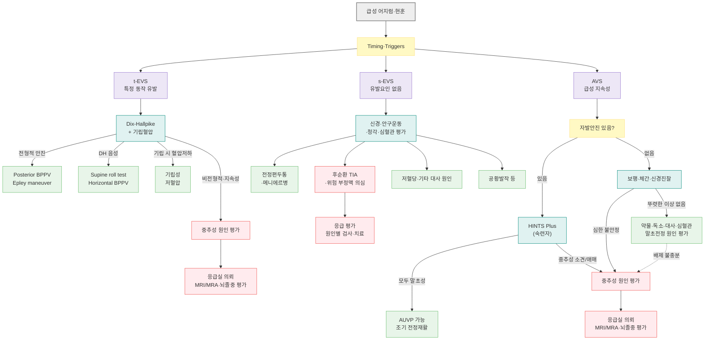

# 어지럼증 Dizziness

## <mark style="color:green;">일반 사항</mark>

* 움직임이 없음에도 움직인다고 느끼거나 실제보다 더 많이 움직이는 느낌, 불균형, 불안정성
* 경고 증상이 있거나 중추성 원인이 의심되는 경우 이송 등 신속한 조치를 요함

### <mark style="color:orange;">증상/징후 중심 분류</mark>

* vertigo, disequilibrium, presyncope, lightheadedness는 환자의 증상 표현을 정리하는 보조 분류이며, 이 분류만으로 원인을 결정하는 것은 곤란함

#### <mark style="color:$primary;">(true) Vertigo</mark>

* 증상 : 회전감(“방이 돈다”), 실제 움직임이 없는데 움직이는 듯한 느낌
* 원인
  * 말초성 : 대부분 차지; BPPV, AUVP(과거 전정신경염), 미로염, Ménière Dz
  * 중추성 : 소뇌종양, 뇌졸중/TIA, 편두통

#### <mark style="color:$primary;">Disequilibrium</mark>

* 증상 : 불안정성, 불균형, 흔들리는 느낌
* 원인 : 파킨슨병, 말초신경병증, 진정제, 전정 신경 질환, 소뇌 장애, 시각 장애, 경추 강직, (보행 장애 관련) 근골격 질환

#### <mark style="color:$primary;">Pre-syncope</mark>

* 증상 : 실신감, 거의 기절할 것 같은 느낌, 창백, 발한, 구역, 흐릿한 시각
  * 보통 서 있거나 똑바로 앉아 있을 때 발생 (✽누워 있을 때 발생하면 부정맥 등 심장성 원인의 가능성이 증가)
  * 지속 시간 : 수 초\~ 수분
* 원인 : 기립성 저혈압 및 유발 약물, 부정맥, 심근경색, 관상동맥병

#### <mark style="color:$primary;">Lightheadedness</mark>

* 증상 : 막연한 어지럼, 머리에 혈액이 부족한 느낌
* 원인 : 과호흡증후군, 공황장애, 불안증, 알코올 남용

#### <mark style="color:$primary;">Non-specific dizziness</mark>

* 원인 : 정신적 문제(스트레스, 우울), 과호흡, 두부 외상, 약물(항콜린제, 항우울제), 대사 장애(저혈당), 특정 어지럼증의 가벼운 형태

### <mark style="color:orange;">Timing–Triggers에 따른 분류</mark>

* 어지럼의 여러 형태가 혼재되어 있고 표현의 불확실성 때문에 증상의 성격만으로 원인을 감별하기 어려움; 환자는 회전감·붕뜸·기절할 것 같음을 정확히 구분해서 말하지 못하는 경우가 많고, 같은 환자도 질문 방식에 따라 다르게 답함(질적 증상 표현의 신뢰도가 낮음)
* "언제 시작됐고, 얼마나 지속되며, 무엇이 유발했는가"는 환자가 비교적 정확하게 기억하고 재현성도 높으므로 증상이 아니라 시간 패턴을 1차 분류축으로 하는 TiTrATE(Timing, Triggers, Targeted Examination)를 도입
* "vertigo인가 disequilibrium인가"를 아는 것보다 "지금 처음 보는 급성 지속 증상인가, 반복되는 발작인가, 자세로 유발되는가"를 아는 것이 다음에 무슨 검사를 할지·무슨 치료를 시작할지를 결정하는데 유용

<table><thead><tr><th width="86">분류</th><th>특징</th><th>감별 요점; 의심 질환</th><th>임상적 의의</th></tr></thead><tbody><tr><td><strong>t-EVS</strong><br></td><td>특정 동작/자세가 매번 새 발작을 유발, 유발 전엔 무증상</td><td>자세·동작 의존적 기전을 우선 고려; <strong>BPPV, 기립성 저혈압</strong>. 비전형적 체위안진에서는 중추성 원인 감별</td><td>Dix-Hallpike, supine roll test, 기립혈압 측정으로 진단을 확인하고 정복술 등 즉시 시행 가능한 치료로 연결</td></tr><tr><td><strong>s-EVS</strong></td><td>뚜렷한 유발요인 없이 반복되는 발작, 발작 사이는 정상</td><td>혈류·전기적·화학적으로 간헐적인 이상을 시사; <strong>TIA, 부정맥, 전정 편두통, 메니에르, 저혈당, 공황발작</strong></td><td>발작 당시를 못 보므로 진찰만으로 확진 어려움 → 발작일지, 심전도/홀터, 청력검사, 혈당 등 발작 간 검사와 병력 패턴(지속시간·동반증상)으로 감별</td></tr><tr><td><strong>AVS</strong></td><td>급성 발생, 지속적(보통 24시간 이상), 진찰 시점에도 증상 존재</td><td>진찰 시 안진·HIT를 볼 수 있음</td><td>HINTS Plus를 바로 적용할 수 있는 유일한 범주</td></tr></tbody></table>

> _**t-EVS** = Triggered Episodic Vestibular Syndrome (유발성 삽화성 전정 증후군)_\
> _**s-EVS** = Spontaneous Episodic Vestibular Syndrome (자발성 삽화성 전정 증후군)_\
> _**AVS** = Acute Vestibular Syndrome (급성 전정 증후군)_

### <mark style="color:$danger;">🚩 Red Flags!</mark>

<mark style="color:$danger;">**즉각 조치**</mark>

* 신경학적 이상 : 복시·시야결손, 구음·연하 장애, 안면마비, 새 일측성 팔/다리 위약·감각저하, 사지실조 `뇌간·소뇌 뇌졸중`
* 중추성 안진 (수직 안진, 주시 방향에 따른 방향 변환성 안진) `소뇌·뇌간 병변`
* 흉통 동반 / 실신·허탈 `심근경색` `대동맥박리` `부정맥`
* 갑자기 시작하여 1분 이내 최고 강도에 도달한 심한 두통(thunderclap headache) `지주막하출혈` `동맥박리` `후순환 뇌졸중`
* 새로 발생한 심한 후두부·경부 통증 또는 부분 Horner 증후군 동반 `척추동맥박리`
* 심한 체간·보행 불안정(부축 없이 앉거나 서기 어렵거나 보행 불가), 의식 변화·혼돈 `소뇌 경색·출혈`
* 지속되는 급성 어지럼(AVS) + 새로 발생한 일측성 청력 저하 `중추성 원인`
* 두부 직접 충격 후 새 어지럼과 함께 의식소실·기억상실·지속되는 두통/구토, 항응고제 복용 또는 신경학적 이상이 있는 경우 `두개내출혈`

<mark style="color:$warning;">**당일\~수일 내 평가**</mark>

* 새로 발생한 청력 저하가 주 증상이고 지속성 AVS가 뚜렷하지 않은 경우에는 당일(가능하면 24시간 이내) 이비인후과 평가 `돌발성 감각신경성 난청`
* 과거 뇌졸중 병력이 있는 환자에서 새로 발생한 급성 지속성 또는 자발성 발작성 어지럼이 반복되거나 혈관 위험·신경/안구운동/보행 이상이 동반되는 경우 `TIA` `뇌졸중 재발`
* 원인 미상의 발열(＞38℃); 경부 강직·의식 변화·새로운 심한 두통·패혈증 소견 동반 시 즉각 응급으로 격상

<mark style="color:$info;">**조기 평가 및 추적**</mark>

* 진단이 불확실하거나 예상 경과와 달리 악화·지속되는 경우

## <mark style="color:green;">원인</mark>

* Central : 편두통, 소뇌 종양, 뇌졸중/TIA, vestibular ischemia 등
  * 중추성 원인의 비율은 진료 환경과 대상군에 따라 크게 달라 고정된 수치로 일반화하기 어려움
* Peripheral : BPPV, AUVP, Ménière Dz, otosclerosis, 미로염, cholesteatoma, 외림프누공, superior canal dehiscence syndrome, 멀미, 중이염
* 기타 : 약물, 고령, 기립성 저혈압, 부정맥, 정신적 문제, 급격한 다이어트
* 고령 : 불안/우울, 균형 감각 손상, 심뇌혈관질환 과거력, 청력·시력 저하, 기립성 저혈압, 다제약물 등 여러 요인이 복합적으로 작용


우리나라 referral-based dizziness clinic을 대상으로 한 연구에서는 BPPV 24.1%, psychiatric or persistent postural perceptual dizziness(PPPD) 20.8%, vascular disorder 12.9%, vestibular migraine 10.2%, Meniere’s disease 7.2%, vestibular neuritis 5.4%였으며 19\~64세에서는 PPPD 26.3%, ≥65세에서는 BPPV 28.2%로 가장 흔한 원인으로 보고되었음. (J Neurol 2020 Aug;267(8):2252-2259.)


## <mark style="color:green;">말초성 질환</mark>

### <mark style="color:orange;">양성발작성체위성어지럼증 (Benign paroxysmal positional vertigo, BPPV)</mark>

* 다른 이름 : 이석증, 돌발성체위성현훈증
* vertigo의 가장 흔한 원인
* 말초성 vertigo
* 호발 : 50\~70대, 여성(2배)
* 기전 : calcium carbonate crystals(otoconia)이 떨어져 나와 세반고리관 내에 부유. 머리를 움직이면 otoconia가 움직이게 되고, 다시 놓여 질 때까지 motion sense를 일으킴
* 원인 : 특발성(특히 고령), 외상(젊은 연령), viral neurolabyrinthitis
* 위험인자 : 두부 외상, 내이 허혈, AUVP, 귀 수술, 우울, 움직이지 않는 생활
* 발생 부위 : post. canal 60\~90%, lat.(horizontal) canal 10\~30%; ant.(sup.) canal rare
  * 우리나라는 lat canal 이환이 많음(30%)
* 재발 : 1년 내 20\~30% 재발
  * 관찰연구에서 당뇨병, 비-후반고리관형(lat./ant. canal) 이환, Vit D 결핍, 고령, 편두통·불안·불면 동반, 폐경 후 여성의 낮은 estradiol 등이 재발 관련 요인으로 보고되었으나 인과관계와 개별 환자에서의 예측력은 제한적임 <mark style="color:$info;">(Front Neurol 2024;15:1483233 / 2025;16:1595887 / 2026;17:1812718)</mark>

#### <mark style="color:$primary;">임상 양상</mark>

* 특정 자세나 머리 움직임에 따라 심한 회전감 발생
* 경과 : 돌발적 발생 → 자세를 바꾸고 안정하면 수 초\~1분 이내 호전 (대개 10\~30초)
  * 수일\~수주 동안 반복될 수 있으나 진단에 필요한 최소 지속기간은 없음
* 동반 증상 : 구역
  * 청력이나 신경학적 이상은 없음
* 안진 : 말초성
* 검사 : Dix-Hallpike test(post canal), Supine roll test(lat canal)

### <mark style="color:orange;">메니에르병 (Ménière Dz)</mark>

* 병태생리 : 내림프수종(endolymphatic hydrops)과 연관되지만 이것만으로 모든 임상 양상을 설명할 수 없으며 병태생리는 완전히 규명되지 않음
* 원인 : 불명. 알레르기·감염·자가면역 등 여러 연관 기전이 제안되었으나 확정되지 않음

#### <mark style="color:$primary;">임상 양상</mark>

* Definite Ménière disease 진단기준
  * 20분\~12시간 지속되는 자발성 현훈 발작 2회 이상
  * 발작 전·중 또는 후 적어도 한 번의 청력검사에서 확인된 환측 저\~중주파수 감각신경성 난청
  * 환측의 변동성 청각 증상(난청, 이명 또는 귀 충만감)
  * 다른 전정질환으로 더 잘 설명되지 않음
* Probable Ménière disease : 20분\~24시간 지속되는 현훈 또는 어지럼 발작 2회 이상과 변동성 환측 청각 증상; 다른 질환으로 더 잘 설명되지 않음
* 동반 증상 : 귀 충만감(± 불편감), 구역, 구토, 두통 악화
  * 신경학적 이상은 없음
* 안진 : 발작 중 주로 수평-회선성 안진이 관찰되지만 질병 단계와 발작 경과에 따라 방향이 변할 수 있으므로 단일한 방향으로 고정되지 않음

### <mark style="color:orange;">급성단측전정병증 (Acute unilateral vestibulopathy, AUVP)</mark>

* vertigo의 두 번째 흔한 원인
* 30\~50세 호발
* 원인 : 불명; 바이러스 재활성화 또는 염증성 기전 등이 가설로 제시되지만 확정되지 않음


AUVP : vestibular neuritis를 대체하는 용어 - "신경염"이라는 표현이 실제로는 염증이 조직학적으로 확인되지 않은 경우가 많고 원인이 바이러스성 신경염 외에도 다양할 수 있다는 점 때문에, 더 중립적인 "vestibulopathy(전정병증)"라는 표현을 씀 \[국제 전정장애 분류(ICVD)]


#### <mark style="color:$primary;">임상 양상</mark>

* 경과 : 급성 또는 아급성으로 발생하여 24시간 이상 지속 → 1\~2일째 가장 심함 → 수일\~수 주 동안 점차 완화
  * 불안정성은 수개월 동안 지속될 수 있음; 발병 후 15%에서 BPPV가 발생할 수 있음
* 동반 증상 : 구역/구토(처음 수일 동안 심함)
  * 청력 이상은 보통 없음
* 안진 : 급성기에 방향고정성 수평-회선성 자발안진; 시고정을 제거하면 증가
* 신경학적 이상 : 병변 측으로 치우치거나 넘어질 수 있으나 중추성 신경·안구운동 소견은 없어야 함
* 검사 : 병변 측 vestibulo-ocular reflex 저하(침상 Head impulse test 또는 vHIT 등). 새 청각 증상이나 중추성 소견이 있으면 AUVP로 단정하지 않음

### <mark style="color:orange;">미로염 (내이염, Labyrinthitis)</mark>

* 원인 : 바이러스성 또는 세균성 내이 염증
  * 중이염·유양돌기염·뇌막염에 속발한 세균성 미로염은 응급 전문 치료가 필요

#### <mark style="color:$primary;">임상 양상</mark>

* 심한 정도의 움직이는 느낌, 방이 도는 느낌
* 경과 : 돌발적 → 보통 수 시간\~수일 지속
* 동반 증상 : 구역, 구토; 원인에 따른 증상 발생(예: 뇌막염 시 두통, 중이염 시 귀의 통증)
* 청력 이상 : 편측 돌발성 난청　
  * 신경학적 이상은 없음(뇌막염 제외)
* 안진 : spontaneous, fine horizontal nystagmus. horizon-torsion 병합도 가능


- labyrinthitis : vertigo + 청력 저하 동반
- AUVP : vertigo only, 청력 정상
- 급성 어지럼 + 새로운 청력 저하 → labyrinthitis, AICA(anterior inferior cerebellar artery) 경색, 돌발성 감각신경성 난청, 외림프누공 감별


### <mark style="color:orange;">외림프누공 (Perilymphatic fistula)</mark>

* 기전 : 난원창·정원창 등에 비정상적인 연결 또는 결손이 생겨 외림프가 내이에서 중이 쪽으로 누출되는 상태
* 원인 : 머리/목 외상(가장 흔함), 스쿠버 다이빙, 곡예 비행, 역도, 출산, 심한 코 풀기 또는 재채기, 만성 귀 질환
* 증상 : 갑자기 발생하는 난청, 현훈, 이명

### <mark style="color:orange;">기타</mark>

* Cholesteatoma : 각질화 편평상피가 중이·유양돌기에 증식하는 병변
  * 미로누공 등 합병증이 발생하면 현훈이 동반될 수 있음
* Herpes zoster oticus (Ramsay Hunt syndrome) : 심한 이통과 외이도·귓바퀴 수포, 급성 말초성 안면마비가 핵심
  * 난청·이명·현훈이 동반될 수 있음
* Otosclerosis : otic capsule의 비정상적 골재형성으로 등골 고정이 발생하는 질환
  * 전형적으로 전음성 난청과 이명이 주 증상이며 일부에서 어지럼 동반
* 말초신경병증 : disequilibrium; 하지(특히 발) 감각 저하

## <mark style="color:green;">중추성 질환</mark>

### <mark style="color:orange;">편두통성 어지럼증 (Vestibular migraine)</mark>

* 편두통과 관련하여 발생하는 어지럼증
  * 발작 중 두통이 없을 수 있으므로 두통 동반 여부만으로 배제하지 않음
* 진단기준 (Bárány Society/IHS 2022)
  * 중등도\~중증 전정 증상이 5분\~72시간 지속되는 발작이 5회 이상
  * 현재 또는 과거의 전조성/무전조성 편두통 병력
  * 전정 발작의 50% 이상에서 다음 중 하나 이상 동반
    * 편두통성 두통, 빛공포와 소리공포, 시각조짐
  * 다른 전정질환 또는 ICHD 진단으로 더 잘 설명되지 않음
* 증상 : 두부 압박감, 시각/청각 과민; 구역, 구토, 빛/소리 과민
  * 이명·귀 충만감·변동성 청각 증상이 동반될 수 있음
  * 뚜렷한 진행성 일측 난청은 메니에르병 등 다른 질환을 우선 감별
* 유발 요인 : 카페인, 알코올, 수면 부족, 호르몬 변화, 특정 음식(티라민 함유 식품), 시각적 자극(복잡한 패턴, 대형 스크린, 스크롤)
* 치료 : [편두통](016_-migraine.md#management) 치료

### <mark style="color:orange;">기타</mark>

* Cerebellopontine angle tumor : vestibular schwannoma(예: acoustic neuroma) 등에 의함
* Cerebrovascular disease : TIA, 뇌졸중
* Multiple sclerosis : white matter의 demyelinization
* 파킨슨병 : disequilibrium; resting tremor, rigidity, bradykinesia

## <mark style="color:green;">기타 질환</mark>

### <mark style="color:orange;">멀미 (Motion sickness)</mark>

* 실제 또는 감지된 움직임에 반응하여 발생하는, 위장 및 신경 증상을 포함하는 증후군 (☞ [멀미](024_-motion-sickness.md))
* 원인 : 불명
* 기전 : 신체 움직임에 대한 visual receptor, vestibular receptor 및 body proprioceptor 사이의 불일치에 따른 생리적 반응으로 추정
* 회전·직선·상하·수평 움직임 및 시각적 움직임 모두에서 발생할 수 있으며, 특히 저주파수 움직임에서 흔함; 발생 정도는 움직임의 방향·주파수·가속도·노출 시간과 개인 감수성에 따라 달라짐
* 동반 증상 : epigastric fullness, 트림, 구역, 구토, 발한, 창백, 침 분비 증가, 하품, 과호흡
* 신경학적 이상, 청력 이상 : 없음

### <mark style="color:orange;">기타</mark>

<mark style="color:cyan;">**Cervical dizziness**</mark>

* 경부 병변과 현훈 사이의 인과관계 및 보편적 진단기준은 확립되지 않았으므로 배제진단으로만 고려
* 목 움직임으로 유발되면 BPPV·전정편두통 등 흔한 원인을 먼저 평가하고, 드문 회전성 척추동맥증후군은 신경학적 증상·혈관 위험에 따라 전문 평가

<mark style="color:cyan;">**약물 유발성**</mark>

* 원인 약물 : 향정신성 약물, 항경련제, aspirin, aminoglycosides, α-/β-blockers, furosemide, nitrates, amiodarone, 항콜린제, 근이완제, 발기부전치료제(PDE5i), 인슐린 과다, 알코올

<mark style="color:cyan;">**Psychological**</mark>

* 기분, 불안, 신체화 증상

[<mark style="color:cyan;">**기립성 저혈압**</mark>](../225_/096_-orthostatic-hypotension.md)

* presyncope
* 기립 후 3분 이내 수축기 혈압 ≥20 ㎜Hg 또는 이완기 혈압 ≥10 ㎜Hg 감소. 맥박 반응은 원인에 따라 다르며 신경성 기립저혈압에서는 증가가 미미할 수 있음

<mark style="color:cyan;">**과호흡**</mark>

* lightheadedness, 불안, 맥박 증가
* 원인 질환과 위험 징후를 먼저 평가하고 천천히 규칙적으로 호흡하도록 안내
* 종이봉투 재호흡은 저산소증 위험 때문에 시행하지 않음

## <mark style="color:green;">진단</mark>

* 혈압 : 5분간 누운 뒤 혈압·맥박을 측정하고 기립 1분·3분에 재측정
* 신경학적 검사, 귀 검사 : 청력 검사, Rinne test, Weber test, 안진
  * electronystagmography, vestibular-evoked myogenic potentials
* 수기 검사 : Dix-Hallpike test, Supine roll test, Test of skew
* 영상 검사 : 비조영 뇌 CT는 후순환 허혈성 뇌졸중 진단 민감도가 낮음
  * 중추성 HINTS, 애매한 검사 또는 중추성 원인 의심 시 MRI(DWI)±MRA 시행
  * 초기 DWI 음성도 후순환 소경색을 완전히 배제하지 못하므로 임상 의심이 지속되면 신경과 평가·반복 영상 고려
  * 전형적 BPPV 등 명확한 말초성 어지럼에서는 routine 촬영 불필요
  * 후순환 TIA·동맥박리 또는 대혈관 병변이 의심되면 두개내·경부 후순환을 포함한 CTA/MRA 고려
  * carotid Doppler는 후순환성 어지럼의 일반 선별검사가 아님
* 실험실 검사 : 일률적인 실험실 검사는 필요 없음
  * 당뇨 환자에서 혈당 등 검사 고려
* 심장 질환 의심 시 ECG, 필요에 따라 ambulatory ECG monitoring 고려

#### <mark style="color:$primary;">Dix-Hallpike test</mark>

* 방법 ([figure\_e-2.jpg, video\_1.wmv](https://www.neurology.org/doi/10.1212/01.wnl.0000313378.77444.ac))
  * 침대에 무릎을 뻗은 상태로 길게 앉힘\
    → 머리를 45°옆으로 돌린 상태에서 턱을 약간 쳐들게 잡고, 머리가 수평보다 30°더 내려가게 빠르게 눕히고(머리를 침대 밖으로 늘어뜨림) 30초간 안진 관찰\
    → 다시 앉게 하고 30초간 안진 관찰\
    → 반대 방향으로 머리를 돌려 다시 시행
* 진단 : 검사한 귀가 아래로 향했을 때 일시적 torsional-upbeating 안진과 전형적 현훈이 유발되면 해당 쪽 posterior canal BPPV
  * 전형적으로 수초의 잠복기 후 안진 강도가 증가했다가 감소하는 crescendo-decrescendo 양상을 보이며 대개 1분 이내 소실됨. 피로성 확인만을 위해 검사를 반복할 필요는 없음
  * 비전형적·지속성 안진은 중추성 체위안진 등 감별

#### <mark style="color:$primary;">Supine roll test</mark>

* 적용 : Dix-Hallpike test에 음성인 BPPV 의심 환자에서 시행
* 방법 ([video\_2.wmv](https://www.neurology.org/doi/10.1212/01.wnl.0000313378.77444.ac))
  * 환자를 반듯이 눕히고 고개를 약간 굴곡시킨 상태에서 한쪽으로 빠르게 90도 돌린 후 30초간 어지럼 및 안진을 관찰\
    → 30초간 정면을 향하게 한 후 반대쪽도 시행
* 진단 : 양쪽 머리 회전에서 모두 수평안진이 유발될 수 있으므로 단순히 증상이 생긴 쪽을 환측으로 판단하지 않음
  * Geotropic형 : 일반적으로 안진이 더 강한 쪽이 환측
  * Apogeotropic형 : 일반적으로 안진이 더 약한 쪽이 환측
  * 안진 방향·강도가 불분명하면 bow-and-lean test 등 보조검사 또는 전문 평가 고려

#### <mark style="color:$primary;">Head impulse test</mark>

* 방법 ([Figure](https://www.nuemblog.com/blog/hints))
  * 검사자와 마주 앉아 검사자의 코를 주시하게 하고 검사자가 환자의 얼굴을 잡고 (환자는 예측 하지 못한 상태에서) 한쪽으로 빠르게 15°돌림\
    → 천천히 정면을 향하게 하고 반대쪽으로 다시 시행
* 음성 (정상) : 시선이 표적에 고정됨. AVS에서는 정상 HIT가 중추성 원인을 시사할 수 있음
* 양성 (비정상) : 시선이 머리 회전을 따라간 뒤 교정성 단속운동으로 표적에 돌아옴
  * 회전시킨 쪽의 vestibulo-ocular reflex 결손을 시사
  * 단, AICA 경색 등 중추성 병변에서도 비정상일 수 있으므로 HIT 단독으로 말초성 확정 불가

#### <mark style="color:$primary;">기타</mark>

* Test of skew : 양쪽 눈을 번갈아 cover & uncover 하며 안구의 수직 움직임을 관찰
  * 양성 (수직 재정렬 움직임 발생) : 뇌간·소뇌 등 중추성 병변 의심
* 누공 검사 : 통기 이경으로 고막에 음압/양압을 가해 안진과 현훈 유발
  * 양성 (증상 발생) : 외림프누공 의심
* Vestibular function testing : 진단이 불확실하거나 치료에 반응하지 않을 때 시행
* vHIT(video Head Impulse Test) : 각 반고리관의 고주파수 vestibulo-ocular reflex gain과 교정성 단속운동을 정량화하여 AUVP·양측전정기능저하의 확인과 추적에 유용. 저주파수 수평반고리관 기능을 주로 평가하는 caloric test와 결과가 불일치할 수 있으며, HINTS 전체나 뇌영상의 대체검사는 아님

#### <mark style="color:$primary;">HINTS Plus Exam</mark>

* 다음 4가지 검사로 구성 : Head impulse test, Nystagmus, Test of Skew, New hearing loss
* 현재 자발안진이 있는 급성전정증후군(AVS) 환자에서, 적절히 훈련된 검사자가 시행
  * 발작성·체위성 어지럼, 자발안진이 없는 환자 또는 검사 협조가 어려운 환자에게 적용하지 않음
* 말초성(Peripheral) 패턴 : 아래 소견이 모두 충족될 때 AUVP를 시사
  * Head Impulse Test (+) : 환측으로 머리 회전 시 교정성 단속운동(catch-up saccade) 관찰
  * Nystagmus : 단방향 수평 안진(Direction-fixed); 주시 방향을 바꿔도 안진의 방향이 변하지 않음
  * Test of Skew (-) : 수직 안구 편위 없음
  * New hearing loss (-) : 양측을 비교한 finger rub 등 침상 청력 선별검사에서 새 일측성 청력 저하 없음 → 말초성 판정 유지. 이상이 있으면 정식 청력검사를 병행
* 중추성 또는 equivocal 패턴 : 정상 Head impulse test, 주시 방향에 따라 방향이 바뀌는 안진, skew deviation 또는 새 일측성 청력 저하 중 하나라도 있으면 뇌졸중 가능성을 평가하고 MRI/MRA 시행
* 새 일측성 청력 저하는 AICA 경색의 민감도를 높이는 위험 신호이지만 단독 확진 소견은 아님
  * 미로염·돌발성 감각신경성 난청 등 말초성 원인도 가능하므로 응급 뇌졸중 평가와 청각 평가를 병행
* 자발안진이 없는 AVS에서는 HINTS 대신 보행·체간 불안정 정도와 신경학적 진찰을 중점 평가

### <mark style="color:orange;">감별</mark>

**Sudden-onset dizziness with 국소 신경학적 이상 또는 중추성 위험 소견**

* 예: 수직·순수 회선성·주시 방향변환성 안진, 새 국소 신경학적 이상, 심한 체간 불안정, AVS에 동반된 새 일측성 청력 저하
* 당뇨가 있으면 저혈당 확인
* 당뇨가 없거나 저혈당 치료 후에도 증상 지속, BPPV 또는 기립성 저혈압에 해당되지 않으면 즉시 의뢰(stroke 감별을 요함)

**Sudden-onset vestibular 증상**

* 예: 어지럼, 구역/구토, 보행 불안정
* 자발안진이 있으면 훈련된 검사자가 HINTS Plus 시행 : head impulse test 정상, 주시 방향에 따른 방향변환성 안진, skew deviation 또는 새 일측성 청력 저하 중 하나라도 있으면 즉시 의뢰(중추성 또는 equivocal)
* 자발안진이 없으면 보행·체간 불안정 정도를 평가
* HINTS를 적절히 수행·판독할 수 없고 BPPV 또는 기립성 저혈압으로 명확히 설명되지 않으면 즉시 의뢰

**재발성 어지럼 with 기능적 신경학적 이상**

* 이미 functional neurological disorder로 진단받은 경우 반복되는 어지럼증은 장애 증상일 수 있음
* 새로운 증상이 발생하면 재평가 필요

#### <mark style="color:$primary;">중추성 vs 말초성 감별</mark>

<table><thead><tr><th width="165">소견</th><th>말초성 패턴</th><th>중추성 위험 소견</th></tr></thead><tbody><tr><td>자발안진</td><td>방향고정성 수평-회선성</td><td>주시 방향에 따른 방향변환성, 수직 또는 순수 회선성</td></tr><tr><td>Head impulse</td><td>병변 측 교정성 단속운동</td><td>AVS에서 정상 반응. 단, 비정상 반응도 AICA 경색을 배제하지 못함</td></tr><tr><td>Skew</td><td>없음</td><td>수직 안구 재정렬</td></tr><tr><td>보행·체간</td><td>불안정할 수 있으나 대개 보조하여 보행 가능</td><td>부축 없이 앉거나 서기 어렵거나 보행 불가</td></tr><tr><td>청각</td><td>질환에 따라 난청·이명 동반 가능</td><td>AVS와 새 일측성 청력 저하가 동반되면 AICA 경색 위험 증가</td></tr><tr><td>기타 신경학적 소견</td><td>없음</td><td>복시, 구음·연하 장애, 편측 위약·감각저하, 사지실조 등</td></tr></tbody></table>

> _<mark style="color:$info;">증상 강도·구역·청각 증상만으로 중추성과 말초성을 구분하지 않음.</mark>_\
> _<mark style="color:$info;">HINTS Plus는 현재 자발안진이 있는 AVS에서 훈련된 검사자가 시행.</mark>_

#### <mark style="color:$primary;">체위성 안진: 말초성 vs 중추성</mark>

<table><thead><tr><th width="100">특징</th><th>전형적 canalolithiasis BPPV</th><th>중추성 체위안진 의심</th></tr></thead><tbody><tr><td>잠복기</td><td>짧은 잠복기 후 발생할 수 있음</td><td>즉시 발생할 수 있음</td></tr><tr><td>방향</td><td>해당 반고리관 평면에 맞는 특징적 안진</td><td>순수 수직·순수 회선성 또는 반고리관 평면과 맞지 않는 비전형적 안진</td></tr><tr><td>지속·경과</td><td>대개 1분 미만이고 감소</td><td>지속성, 반복해도 감소하지 않거나 정복술에 반응하지 않음</td></tr><tr><td>동반 소견</td><td>국소 신경학적 이상 없음</td><td>새 신경학적 소견, 심한 체간실조 등이 동반될 수 있음</td></tr></tbody></table>

<p align="center"><em><mark style="color:$info;">Ref. Bárány Society BPPV diagnostic criteria; AAO-HNS BPPV guideline.</mark></em></p>

#### <mark style="color:$primary;">Vertigo 원인별 특징</mark>

<table data-search="false"><thead><tr><th width="127">원인</th><th>Timing·trigger</th><th>핵심 소견</th><th>주요 검사·조치</th></tr></thead><tbody><tr><td><strong>BPPV</strong></td><td>자세로 유발되는 반복성 짧은 발작(대개 1분 미만)</td><td>청각·신경학적 이상 없음</td><td>Dix-Hallpike 또는 supine roll test; 정복술</td></tr><tr><td><strong>AUVP</strong></td><td>24시간 이상 지속되는 급성 현훈</td><td>방향고정성 수평-회선성 안진, 일측 VOR 저하; 새 청각·중추성 소견 없음</td><td>적절한 대상에서 HINTS Plus; 조기 전정재활</td></tr><tr><td><strong>Ménière disease</strong></td><td>20분~12시간 자발성 발작</td><td>변동성 환측 난청·이명·귀 충만감</td><td>청력검사; 전정편두통 감별</td></tr><tr><td><strong>Vestibular migraine</strong></td><td>5분~72시간 반복 발작</td><td>50% 이상 발작에서 편두통 특징; 이명·귀 충만감 가능</td><td>임상 진단·다른 원인 배제</td></tr><tr><td><strong>PPPD</strong></td><td>3개월 이상 대부분의 날</td><td>직립·움직임·복잡한 시각 자극으로 악화</td><td>전정재활·CBT; 약물은 개별화</td></tr><tr><td><strong>후순환 TIA</strong></td><td>유발 요인 없는 일과성 반복 발작</td><td>혈관 위험, 신경·보행·안구운동 이상이 일시적일 수 있음</td><td>응급 신경학적 평가; 필요 시 CTA/MRA</td></tr><tr><td><strong>뇌간·소뇌 뇌졸중</strong></td><td>급성 지속성 증상</td><td>중추성 HINTS, 심한 체간실조, 국소 신경학적 소견; AICA 경색은 새 난청 가능</td><td>응급 MRI/MRA; 초기 DWI 위음성 주의</td></tr></tbody></table>

<p align="center"><em><mark style="color:$info;">Ref. Bárány Society ICVD criteria; GRACE-3 acute dizziness guideline.</mark></em></p>

***


```mermaid
flowchart TD
    A["급성 어지럼·현훈"] --> B["Timing·Triggers"]
    B --> C["t-EVS<br/>특정 동작 유발"]
    B --> D["s-EVS<br/>유발요인 없음"]
    B --> E["AVS<br/>급성 지속성"]

    C --> C1["Dix-Hallpike <br/>+ 기립혈압"]
    C1 -->|"전형적 안진"| C2["Posterior BPPV<br/>Epley maneuver"]
    C1 -->|"DH 음성"| C3["Supine roll test<br/>Horizontal BPPV"]
    C1 -->|"기립 시 혈압저하"| C4["기립성 <br/>저혈압"]
    C1 --->|"비전형적·지속성"| X["중추성 원인 평가"]

    D --> D1["신경·안구운동<br/>·청각·심혈관 평가"]
    D1 --> D2["전정편두통<br/>·메니에르병"]
    D1 --> D3["후순환 TIA<br/>·위험 부정맥 의심"]
    D1 --> D5["저혈당·기타 대사 원인"]
    D1 --> D4["공황발작 등"]
    D3 --> Y2["응급 평가<br/>원인별 검사·치료"]

    E --> E1["자발안진 있음?"]
    E1 -->|"있음"| E2["HINTS Plus<br/>(숙련자)"]
    E2 --->|"모두 말초성"| E3["AUVP 가능<br/>조기 전정재활"]
    E2 -->|"중추성 소견/애매"| X1["중추성 원인 평가"]
    E1 -->|"없음"| E4["보행·체간·신경진찰"]
    E4 -->|"심한 불안정"| X1
    E4 -->|"뚜렷한 이상 없음"| E5["약물·독소·대사·심혈관<br/>말초전정 원인 평가"]
    E5 -.->|"배제 불충분"| X1

    X --> Y["응급실 의뢰<br/>MRI/MRA·뇌졸중 평가"]
    X1 --> Y1["응급실 의뢰<br/>MRI/MRA·뇌졸중 평가"]

    classDef start fill:#eeeeee,stroke:#888888,stroke-width:2px
    classDef branch fill:#fff9c4,stroke:#ffe082
    classDef category fill:#ede7f6,stroke:#9575cd
    classDef process fill:#e0f2f1,stroke:#00897b
    classDef outcome fill:#e8f5e9,stroke:#66bb6a
    classDef urgent fill:#ffebee,stroke:#ef5350

    class A start
    class B,E1 branch
    class C,D,E category
    class C1,D1,E2,E4 process
    class C2,C3,C4,D2,D4,D5,E3,E5 outcome
    class X,Y,X1,Y1,D3,Y2 urgent

```

<p align="center"><strong>어지럼증 진단 평가 알고리듬</strong><br><em><mark style="color:$info;">저자 구성</mark></em> - <em><mark style="color:$info;">TiTrATE 및 GRACE-3 timing-and-triggers 접근법 기반</mark></em></p>

***

## <mark style="background-color:$warning;">Management</mark>

## <mark style="color:green;">비-약물 치료 및 예방</mark>

* 금연

<mark style="color:cyan;">**전정 재활 운동**</mark>

* AUVP·말초전정기능저하·PPPD 등 진단과 기능장애에 맞추어 시선 안정화, 습관화, 균형·보행 운동을 개별화함
* 심한 증상 악화나 낙상을 유발하지 않는 범위에서 시행하고 고령자·보행 불안정 환자는 치료사 지도 또는 보호자·고정 지지물 등 안전 대책을 마련
* [예](https://youtu.be/KkKAoHZdUnI)
  1. 고개를 양 옆으로 움직임,
  2. 정면을 보고 위 아래로 움직임,
  3. 옆으로 45도 돌리고 위 아래로 움직임 & 반대편에서 반복
  * 시선 안정화 운동은 눈을 뜨고 정면의 표적을 선명하게 유지하면서 머리를 움직임. 천천히 시작하여 표적이 흐려지지 않고 경미한 증상 범위에서 점차 속도·시간을 늘림
  * 운동 종류·횟수·기간은 전정기능과 증상에 따라 조절하며, 일률적으로 눈을 감는 단계로 진행하지 않음

<mark style="color:cyan;">**Balance exercise**</mark>

* [예](https://www.uofmhealth.org/health-library/ug1239)
  1. 앞에는 의자 등, 뒤에는 벽을 두고(필요하면 이를 지지) 팔을 붙이고 발을 모으고 30초간 서 있음 (Romberg exercise)
  2. 어깨 넓이로 발을 벌리고 서서 앞-뒤로, 좌-우로 기울임, 20번 반복
  3. 제자리 걷기(가급적 무릎을 높게 올림)
  4. 발을 약간 벌리고 서서 180° turn
  * 처음에는 눈을 뜨고 고정 지지물 가까이에서 시행. 눈 감기, 좁은 지지면, 회전 등 난이도 증가는 개인별 낙상 위험을 평가한 뒤 필요한 환자에게만 보호자 또는 치료사 감독하에 적용

## <mark style="color:green;">약물 치료</mark>

* 일부 약제는 어지럼증 상병으로는 보험 적용 안 됨

### <mark style="color:orange;">전정 안정제</mark>

* 진정 작용으로 인하여 낙상 등의 위험이 있음. 항콜린제 부작용 위험이 있음; 증상 회복 기간을 단축시켜 주지는 못함

#### <mark style="color:$primary;">Benzodiazepine</mark>

* 급성 현훈에서 benzodiazepine은 항히스타민제보다 증상 완화 근거가 약하고 진정·호흡억제·섬망·보행실조·의존 위험이 있으므로 일상적으로 사용하지 않음
* 다른 방법으로 조절되지 않는 심한 급성 증상에서만 환자의 호흡기질환·수면무호흡·낙상 위험과 알코올·opioid 등 중추신경억제제 병용 여부를 확인한 후 최소 유효용량으로 2\~3일 이내 고려. 어지럼증에 대한 국내 허가사항은 제품별로 확인
* 고령 환자에서는 가능하면 피함

#### <mark style="color:$primary;">Antihistamine</mark>

* meclizine <mark style="color:blue;">\[파비스염산메클리진정]</mark>
  * 멀미에 의한 구역·구토·어지러움 : 25\~50 ㎎을 승차 1시간 전에 1회 투여하고, 여행 중 필요 시 24시간마다 반복
  * 미로염·메니에르증후군·방사선·숙취에 의한 구역·구토·어지러움 : 1회 25 ㎎, 1일 2\~3회; 최대 75 ㎎/d
  * BPPV·AUVP 등 허가사항에 명시되지 않은 원인의 어지럼에 사용하는 경우에는 적응증과 근거를 별도로 검토
* dimenhydrinate <mark style="color:blue;">\[보나링 에이]</mark>
  * 임상적 단기 대증치료 시 25\~50 ㎎ bid\~qid
  * 국내 허가 용법은 성인 1회 50 ㎎, 1일 3\~4회이며 원칙적으로 1일 200 ㎎을 초과하지 않음
  * 녹내장·전립선비대 등 하부요로폐색성 질환 환자에는 투여 금기

#### <mark style="color:$primary;">항콜린제</mark>

* scopolamine 경피제 : 멀미에 적용
  * 출발 4시간 이전에 귀 뒤에 1매 부착(72시간 동안 효과) <mark style="color:blue;">\[키미테 패취]</mark>
  * 성인용 제품은 만 16세 이상에서 사용. 과거 8\~15세용 어린이키미테패취는 2020년 허가 취소되었으므로 소아에게 성인용 패취를 분할·대체 사용하지 않음

### <mark style="color:orange;">항구토제</mark>

* metoclopramide
  * 단기 사용; 5\~10 ㎎ tid <mark style="color:blue;">\[맥페란]</mark>
  * 고령 환자와 파킨슨병 환자에서 추체외로 증상(파킨슨 유사 증상, 급성 근긴장이상, 지연성 이상운동증) 위험이 증가하므로 피하거나 가능한 단기간(5일 이내) 사용
  * 다른 진정성 전정억제제와의 불필요한 병용을 피함

### <mark style="color:orange;">이뇨제</mark>

* hydrochlorothiazide : 메니에르병에서 선택적으로 고려
  * 12.5\~25 ㎎ qd\~bid <mark style="color:blue;">\[다이크로짇]</mark>
  * 예방 효과의 근거는 제한적이며 혈압·신기능·Na/K를 모니터링

### <mark style="color:orange;">혈관 위험인자 관리 및 근거 불충분 약제</mark>

* TIA·뇌졸중 등 혈관성 진단 또는 별도 적응증이 확인되면 해당 지침에 따라 혈압·지질을 관리하고 항혈전제를 사용
* 어지럼증만을 이유로 항혈전제를 경험적으로 시작하지 않음
* ginkgo biloba extract : 유효성에 대한 근거 부족; 일상적 처방 권장되지 않음
  * 40 ㎎ tid 또는 80 ㎎ bid <mark style="color:blue;">\[기넥신]</mark> ([급여기준](https://www.hira.or.kr/rc/insu/insuadtcrtr/InsuAdtCrtrPopup.do?mtgHmeDd=20250301\&sno=1\&mtgMtrRegSno=0008))
* kallidinogenase : 유효성에 대한 근거 부족
  * 25\~50 IU tid <mark style="color:blue;">\[카레스]</mark>


**Trimetazidine은 어지럼증에 사용하지 않음.** 국내에서 혈관성 어지럼·메니에르병성 어지럼·이명 적응증이 삭제되었으며 안정형 협심증의 2차 추가요법으로 제한됨. 파킨슨병·파킨슨증상·진전·하지불안증후군 등 운동장애와 중증 신장애에서는 금기이며, 복용 중 운동장애가 새로 나타나면 중단하고 재평가함.


### <mark style="color:orange;">Betahistine</mark>

* 국내 허가 적응증 : 메니에르병에 의한 어지럼, 이명, 청력 소실
* 기전 : 전정 핵의 흥분성 조절 (H1 효현제 + H3 길항제), 내이 혈류 개선
* 용량 : 초기 16 ㎎ tid, 유지 24\~48 ㎎/d <mark style="color:blue;">\[메네스에스]</mark>
  * 일정 기간 시험적으로 투여하고 임상적 이득이 없으면 지속하지 않음
* 고용량 144 ㎎/d까지 연구되었으나 BEMED 위약대조시험에서 48 ㎎/d와 144 ㎎/d 모두 발작 빈도·중증도·삶의 질을 유의하게 개선하지 못했으므로 일상적 고용량 증량은 권장하지 않음
* BPPV에는 효과 없음; 중추성 어지럼증에 대한 근거 불충분
* NICE CKS·AAO-HNS 등은 유지치료의 선택지 또는 시험적 투여로 제시하지만, 위약대조시험과 체계적 문헌고찰에서 확실한 예방 효과가 입증되지 않아 근거는 불확실함

### <mark style="color:orange;">기타</mark>

* 편두통 치료제 : 편두통 관련 어지럼증에 적용
* SSRI/SNRI : PPPD에서 임상적으로 사용되지만 위약대조 RCT 근거는 없으며 국내 허가 외 사용. 동반 불안·우울, 증상 부담과 환자 선호를 고려하여 개별적으로 시도 (☞ [항우울제](../231_/213_-antidepressants-and-anxiolytics.md#selective-serotonin-reuptake-inhibitor-ssri))
* steroid : 진단이 확실하고 금기가 없는 AUVP 환자에서 증상 발현 3일 이내 단기 투여를 shared decision으로 고려할 수 있으나, 증상 및 장기 전정기능 개선 근거는 불확실함

## <mark style="color:green;">질환별 치료</mark>

### <mark style="color:orange;">BPPV</mark>

* 대부분 수주 내 자연 회복할 수 있으나 재발이 흔함
* 이석정복술은 현재 발작의 현훈과 안진을 빠르게 소실시키는 1차 치료이며 장기 재발 자체를 예방한다고 단정하지 않음

#### <mark style="color:$primary;">이석정복술 (Canalith repositioning maneuver)</mark>

* 정복술 도중 또는 이후 안진이 수평성으로 변하거나 증상 양상이 달라지면 반고리관 전환(canal conversion)을 고려
* 증상이 지속되거나 안진 양상이 변한 경우 Dix-Hallpike 및 supine roll test로 재평가하고, 확인된 아형에 맞는 정복술을 시행

<mark style="color:cyan;">**Epley maneuver**</mark>

* post canal BPPV의 가장 효과적인 치료법; 치료 성공률 80%
* Epley·Semont가 단기 유효성·완치율에서 다른 정복술 대비 우월하여 1차 치료로 재확인됨\[2026 네트워크 메타분석]. 다만 일부 연구의 비뚤림 위험이 높았고 장기 재발에 대한 근거 확실성은 낮았음 <mark style="color:$info;">(Front Neurol 2026;17:1762375)</mark>
* [방법](https://www.youtube.com/watch?v=jBzID5nVQjk)
  * 무릎을 뻗은 상태로 침대에 길게 앉음 → 환측으로 머리를 45°돌리고 턱을 약간 쳐들게 한 후 빠르게, 머리가 수평보다 30°더 내려가게 눕히고(lay back, 머리를 침대 밖으로 늘어뜨림) 1분간 유지\
    → 이 상태에서 고개를 건측으로 90°돌려 1분간 유지\
    → 머리와 몸을 건측으로 90°더 돌려 얼굴이 45°각도로 바닥을 향하게 하고 1분간 유지; 이 과정에서 두정부는 계속 아래를 향하도록 함\
    → 이 상태를 유지하며 천천히 일어나 앉게 하고 30초간 유지
* 시술 중 구역 발생 가능성에 대하여 설명; 반복 시술할 수 있으며 시술 후 활동 제한은 필요 없음

<mark style="color:cyan;">**Semont-plus maneuver**</mark>

* post canal BPPV에 적용
* 무작위시험의 반복 자가치료 조건에서 증상 소실까지의 기간이 Epley maneuver보다 약 1일 짧았음(평균 SM-plus 2일 vs. EM 3일); 단일 연구 결과이므로 모든 진료 환경에서의 전반적 우월성으로 일반화하지 않음
* [방법](https://edhub.ama-assn.org/jn-learning/video-player/18794329)
  * \[어지러움이 발생하는 방향이 오른쪽일 때] 침대 오른쪽에 걸터 앉아 왼쪽을 향해 얼굴을 45도 돌림\
    → 오른팔을 옆으로 뻗고 오른쪽(환측)으로, 머리가 침대 아래로 내려가도록(head 60 degree overextended) 150도 이상 옆으로 쓰러짐, 이 자세를 60초 유지\
    → 얼굴 각도를 유지한 채 왼쪽(건측)으로 240도 움직임. 60초 유지\
    → 일어나 앉아 정면을 보고 60초 유지
* 오전, 오후, 밤에 각각 3회 반복

<mark style="color:cyan;">**Lempert roll maneuver(Barbecue roll maneuver)**</mark>

* 주로 geotropic형 horizontal canal canalolithiasis에 적용하는 치료법; 치료 성공률 ＜75%
* 방법
  * 반듯이 누운 자세에서 환측 귀가 바닥을 향하도록 머리와 몸을 90° 돌림\
    → 건측 방향으로 90°씩 순차적으로 회전하여 얼굴이 천장, 건측 귀가 바닥, 얼굴이 바닥을 향하는 자세를 거침\
    → 같은 방향으로 90° 더 돌아 환측 귀가 다시 바닥을 향하도록 총 360° 회전\
    → 천천히 일어나 앉음; 각 자세마다 30\~60초 또는 어지럼증이 사라질 때까지 유지함 (✽각 자세의 유지 시간과 눕는 각도에 대해서는 이견이 있음)
* ✽ horizontal canal BPPV는 geotropic·apogeotropic형에 따라 정복술이 달라지므로 병변 측과 아형이 불확실하면 전문 평가 후 시행

<mark style="color:cyan;">**Gufoni maneuver**</mark>

* lat canal BPPV 치료법; Lempert보다 시행이 간편하여 임상에서 선호도 높음
* 방법 (canalith repositioning type - geotropic 안진 시)
  * 환자를 건측으로 빠르게 눕힘 (2분 유지)\
    → 코가 바닥을 향하도록 고개를 45° 아래로 돌림 (2분 유지)\
    → 천천히 일어나 앉음
* ✽ 안진 방향(geotropic vs apogeotropic)에 따라 방법이 달라지므로 Supine roll test로 병변 측 확인 후 시행

<mark style="color:cyan;">**재활 운동**</mark>

* 전정 재활 운동 예: [Brandt-Daroff exercise](https://www.youtube.com/watch?v=voZXtTUdQ00\&t=31s)
  * 침대 가장자리에 똑바로 앉음\
    → 고개를 오른쪽으로 45도(또는 가능한 한) 돌림\
    → 왼쪽으로 빠르게 눕고 30초간(또는 어지럼이 진정될 때까지) 자세 유지\
    → 일어나 앉아 고개를 정면을 향하게 함\
    → 고개를 왼쪽으로 45(또는 가능한 한) 돌림\
    → 오른쪽으로 빠르게 눕고 30초간(또는 어지럼이 진정될 때까지) 자세 유지\
    → 일어나 앉아 고개를 정면을 향하게 함

#### <mark style="color:$primary;">약물 치료</mark>

* 안정제 : 원칙적으로 권장하지 않음 \[AAO-HNS 가이드라인]
  * central compensation을 방해하고 낙상 위험을 증가시킴
  * 불가피한 경우 3일 이내로 제한하며 주의를 요함
* 항구토제 : 구역/구토가 심한 경우 단기 사용
* Vit D & Ca : 혈중 Vitamin D 농도가 낮은 경우(＜20 ng/mL) 보충 시 BPPV 재발률이 유의하게 감소함 \[Neurology 2020]; 정상 농도에서는 추가 효과 불분명
  * 단일기관 노인 대상 이중맹검 RCT(결핍자에서 13주 2,000 IU/d → 13주 1,000 IU/d 보충)에서 재발률 87% 감소, 인년당 임상 재발 0.75건 감소, 최초 재발까지 기간 연장이 보고됨. 대상과 표본 규모가 제한되어 효과 크기의 일반화에는 주의 <mark style="color:$info;">(Otolaryngol Head Neck Surg 2025)</mark>
  * Cholecalciferol 400 IU + Calcium carbonate 500 ㎎ bid

#### <mark style="color:$primary;">잔여 어지럼 (Residual dizziness, BPPV-RD)</mark>

* 정의 : 정복술 성공(체위유발 현훈·안진 소실) 후에도 남는 비특이적 어지럼·부동감(불안, 붕 뜬 느낌 등)
* 유병률 : 23\~70% (연구간 편차 큼)
* 병태생리 : 단일 기전으로 설명되지 않음 - 이석 일부 잔류, utricle(이석기관) 기능 저하, 전정 보상 지연, 심인성 요인 등이 복합적으로 작용 <mark style="color:$info;">(Front Neurol 2024;15:1382196)</mark>
* 약물 치료 : betahistine, trimetazidine, ginkgo biloba extract 등의 일상적 투여를 뒷받침하는 근거는 충분하지 않음. 특히 trimetazidine은 국내 어지럼 적응증이 삭제되어 사용하지 않음
* 지속되는 증상에는 전정 재활 운동을 우선 고려
* 대개 수일\~수 주 내 자연 호전
* 장기 지속 시 PPPD, 미인식 중추성 원인, 미해결 이석증(다른 반고리관) 등 감별 필요

### <mark style="color:orange;">급성단측전정병증 (AUVP; 전정신경염)</mark>

* 전정 재활 훈련 : 가능한 조기 시작; 회복 상태에 따라 수주\~수개월 시행하고 정기 재평가

#### <mark style="color:$primary;">약물 치료</mark>

* 안정제, 항구토제 : central compensation을 차단하는 작용이 있으므로 3일 이내로 사용 제한
* steroid : 진단이 확실하고 금기가 없는 환자에서 증상 발현 3일 이내 단기 경구 투여를 shared decision으로 고려할 수 있음
  * 근거 수준이 매우 낮고 최근 위약대조시험에서도 유의한 이득이 확인되지 않아 일률적 고용량 정주·장기 점감요법은 권장하지 않음
* 항바이러스제와 betahistine의 일상적 사용을 뒷받침하는 근거는 부족하며, 국내 betahistine 허가 적응증은 메니에르병임

### <mark style="color:orange;">미로염</mark>

#### <mark style="color:$primary;">약물 치료</mark>

* 전정 안정제(단기 사용), 항구토제
* 항생제 : 세균 감염 의심 시 적용
* 항바이러스제 : 바이러스성 미로염에 일률적으로 사용하지 않음
  * 귀 수포·안면마비가 있는 Ramsay Hunt syndrome 등 명확한 적응증에서 해당 질환 지침에 따라 투여

### <mark style="color:orange;">메니에르병</mark>

* 생활요법
  * 과도한 염분 섭취를 피하고 규칙적인 식사·수면·수분 섭취를 유지
  * 카페인·음주·흡연 등 개인별 발작 유발요인을 확인하여 조절
  * 특정 식품이나 일률적 수분량을 모든 환자에게 강제할 근거는 제한적
* 알레르기 환자에서 알레르기 치료
* 비침습적 치료에 반응하지 않는 경우 이비인후과 의뢰
  * 고실 내 스테로이드·gentamicin 및 청력 상태에 따른 수술적 치료를 단계적으로 고려

#### <mark style="color:$primary;">약물 치료</mark>

* 전정 안정제, 항구토제 : 급성 발작기 단기 사용
* 이뇨제 : hydrochlorothiazide를 선택적으로 고려
  * 근거가 제한적이므로 발작 빈도와 혈압·신기능·전해질을 추적
* betahistine : 초기 16 ㎎ tid, 유지 24\~48 ㎎/d <mark style="color:blue;">\[메네스에스]</mark>
  * 일부 지침에서 시험적 유지치료로 제시하지만 BEMED trial에서는 48 또는 144 ㎎/d 모두 위약 대비 발작 예방 효과가 확인되지 않음
  * 일정 기간 반응을 평가하고 유의한 이득이 없으면 지속하지 않음
* 고실 내 스테로이드 주입술(Intratympanic steroid injection, ITSI) : 비침습적 치료에 반응하지 않는 활동성 메니에르병에서 이비인후과가 고려할 수 있는 선택지

### <mark style="color:orange;">지속성체위지각어지럼증 (Persistent postural-perceptual dizziness, PPPD)</mark>

* 국내 dizziness clinic에서 두 번째로 흔한 원인(20.8%)
* 진단 기준 \[Bárány Society 2017; ICD-11에 수록] - 다음 기준을 모두 충족
  * 지속성 : 3개월 이상 대부분의 날 발생하는 어지럼, 부동감(unsteadiness) 또는 비회전성 현훈
    * 증상은 수시간 이상 지속될 수 있고 강도는 증감함
  * 악화 요인 : 직립 자세(standing/walking), 특정 방향과 상관없는 능동적/수동적 움직임, 복잡한 시각 자극(대형 마트, 영화관 등)
  * 선행 사건 : 급성 전정질환(BPPV, AUVP 등), 실신, 공황발작 등 어지럼을 유발하는 사건이 선행함
  * 심각한 고통 : 증상으로 인한 일상생활 기능 장애 또는 심리적 위축 동반 (직장, 사회활동 회피 등)
  * 배제 진단 : 다른 질환으로 더 잘 설명되지 않음

#### <mark style="color:$primary;">치료</mark>

* 전정 재활 훈련 : 습관화 운동을 중심으로 개별화하여 고려할 수 있으나, 장기 유효성을 뒷받침하는 근거의 확실성은 제한적임
* 인지행동치료(CBT) : 질환 교육, 회피행동·과도한 경계·불안에 대한 치료로 고려
* SSRI/SNRI : 위약대조 RCT 근거가 없어 효과는 불확실하며 PPPD에는 국내 허가 외 사용
  * 동반 불안·우울, 증상 부담과 환자 선호를 고려하여 저용량부터 개별적으로 시도하고 반응·부작용을 재평가
  * 유지기간은 관해 정도와 재발 위험에 따라 결정

### <mark style="color:orange;">외림프누공</mark>

* 초기에는 머리를 높이고 힘주기·무거운 물건 들기·코 풀기·비행·잠수 등 압력 상승을 유발하는 행동을 피하며 활동을 제한하는 보존적 치료를 고려
* 외상 후 진행성 난청, 지속되는 전정 증상 또는 보존치료 실패 시 이비인후과·이신경과 의뢰
  * 선택된 환자에서 시험적 고실개방술과 난원창·정원창 보강술을 고려

***

### <mark style="color:red;">질병코드</mark>

* R42 어지럼증 및 어지럼 Dizziness and giddiness
  * 실무 팁 : 확정 진단 전에는 R42를 사용할 수 있으며, 원인 질환이 확인되면 실제 진료기록과 진단에 맞는 질병코드를 사용함. 의심만으로 특정 질환 코드를 삭감 방지 목적으로 병기하지 않음
* H81.0 메니에르병 Meniere’s disease
* H81.1 양성 발작성 현기증 Benign paroxysmal vertigo
* H81.2 전정신경세포염 Vestibular neuronitis
* H81.9 전정기능의 상세불명 장애 Unspecified disorder of vestibular function
* H83.0 미로염 Labyrinthitis
* H81.8 전정기능의 기타 장애 Other disorders of vestibular function

***

## <mark style="color:purple;">처방례</mark>

> **처방례 1.** 급성 말초성 어지럼증 - 심한 구역/구토의 단기 대증치료
>
> ```
> 보나링 에이 50 ㎎/T  0.5~1T  bid~tid prn  (최대 2~3일; 녹내장·전립선비대 등 하부요로폐색성 질환 금기, 낙상 주의)
> [필요 시] 맥페란 5 ㎎/T  1T  tid prn  (구역/구토 동반 시; 최대 5일)
> ```
>
> ✽ 중추성 원인이 배제되지 않은 급성 어지럼에 진정성 약물을 먼저 반복 투여하면 안진 진찰과 신경학적 평가가 어려워질 수 있음.

> **처방례 2.** BPPV - 재발 예방 (Vit D 결핍 환자)
>
> ```
> 비타민 D3 400 IU  1캡슐  bid
> [필요 시] 탄산칼슘 500 ㎎  1정  bid  (식이섭취·골다공증·결석 위험 등을 고려)
> ```

> **처방례 3.** 급성단측전정병증 - 급성기
>
> ```
> 보나링 에이 50 ㎎/T  0.5~1T  bid prn  (최대 2~3일; 녹내장·전립선비대 등 하부요로폐색성 질환 금기)
> ```
>
> ✽ 조기 활동과 전정재활이 핵심. 스테로이드는 진단이 확실하고 금기가 없는 환자에서 발현 3일 이내 shared decision으로 고려할 수 있으나 최적 용량·기간과 임상적 이득이 확립되지 않아 일률적 처방례로 제시하지 않음.

> **처방례 4.** 메니에르병 - 예방 (발작 간기)
>
> ```
> [Option A]
> 메네스에스 16 ㎎/T  1T  tid  (시험적 투여; 반응을 평가하여 이득 없으면 중단)
>
> [Option B]
> 다이크로짇 25 ㎎/T  1T  qd  (이뇨; 아침 복용)
> ```
>
> ✽ Betahistine과 이뇨제 모두 근거가 제한적이므로 일률적으로 병용하지 않고 청력검사와 발작일지를 바탕으로 한 가지 치료의 효과·부작용을 먼저 재평가함. Hydrochlorothiazide 사용 시 혈압·신기능·Na/K를 확인하며, 병용은 단독요법 반응과 위험을 평가한 후 선택적으로 고려함.

> **처방례 5.** PPPD (지속성체위지각어지럼증)
>
> ```
> [Option A - SSRI]
> 렉사프로 10 ㎎/T  0.5T  qd  조식 후  (내약 시 1~2주 후 1T으로 증량)
>
> [Option B - SNRI]
> 이팩사 37.5 ㎎/C  1C  qd  조식 후  (내약 시 1~2주 후 75 ㎎ qd로 증량)
> ```
>
> ✽ SSRI/SNRI의 PPPD 사용은 국내 허가 외이며 효과를 입증한 위약대조 RCT는 없음. 전정재활·CBT와 함께 개별적으로 시도하고 반응·부작용 및 유지기간을 재평가함. Escitalopram은 초기 불안 악화·성기능 이상·저나트륨혈증·QT 연장, venlafaxine은 혈압 상승·오심·중단증후군에 주의하며 고령자는 더 낮은 용량에서 시작하는 것을 고려함.

***

### <mark style="color:$success;">핵심 복약 지도</mark>

> **전정 안정제** (보나링 에이, 디아제팜 등)
>
> * **단기 사용 원칙** : 어지럼증이 심한 급성기(2\~3일)에만 사용하십시오. 장기 복용은 뇌의 균형 회복을 방해합니다.
> * **졸음·낙상 주의** : 복용 중 운전·기계 조작을 삼가고, 갑자기 일어날 때 천천히 움직이십시오.
> * **입마름·소변 불편** : 입마름이 생길 수 있습니다. 소변이 잘 나오지 않거나 소변 정체가 생기면 복용을 중단하고 진료를 받으십시오.
> * **전립선비대·녹내장** : 보나링 에이는 녹내장 또는 전립선비대 등 하부요로폐색성 질환이 있는 환자에게 투여하면 안 됩니다. 해당 질환이 있으면 복용 전에 반드시 의사에게 알리십시오.

> **이석정복술(Epley maneuver) 후 안내**
>
> * 시술 직후 일시적인 어지럼이 생길 수 있으나 곧 가라앉습니다.
> * 시술 후 특별한 자세 제한은 필요하지 않습니다 (일상 활동 가능).
> * 재발 예방을 위해 Vit D 혈중 농도가 낮은 경우 보충제를 처방받으십시오.

> **전정 재활 운동 (AUVP·PPPD)**
>
> * AUVP에서는 어지럼이 완전히 없어질 때까지 기다리지 말고, 견딜 수 있는 경미한 증상 범위에서 조기에 운동을 시작하십시오. PPPD에서는 증상과 기능장애에 맞추어 운동을 개별화합니다.
> * 매일 꾸준히 시행하되 기간은 회복 상태에 따라 수주에서 수개월로 조절하고 정기적으로 재평가합니다.
> * 시선 안정화 운동은 눈을 뜨고 표적을 선명하게 유지하면서 시행합니다. 눈 감기·회전 등 난이도 증가는 낙상 위험을 평가한 뒤 의료진의 지시에 따라 안전한 환경에서만 시행하십시오.

> **메네스에스 (메니에르병)**
>
> * 일부 환자에서 시험적으로 사용할 수 있으나 발작 예방 효과는 확실하지 않습니다. 발작일지를 기록하고 일정 기간 후 효과를 평가하십시오.
> * 식사와 함께 또는 식후에 복용하면 위장 불편을 줄일 수 있습니다.
> * 과도한 염분 섭취를 피하고 규칙적으로 식사·수분을 섭취하며, 본인의 발작 유발요인을 확인하십시오.

> **렉사프로 (PPPD)**
>
> * 처음 1\~2주간 구역·불안·어지럼 등이 일시적으로 나타날 수 있습니다. 심하거나 지속되면 진료를 받으십시오.
> * 고령자에서는 저나트륨혈증과 낙상 위험에 주의하며, 두통·심한 무기력·혼돈이 새로 생기면 진료를 받으십시오.
> * 효과와 부작용을 정기적으로 평가하며 유지기간은 환자마다 다릅니다. 의사와 상의 없이 갑자기 중단하지 마십시오.
> * 인지행동치료(CBT) 또는 전정 재활 운동을 함께 시행할 수 있습니다.

> **언제 다시 병원을 방문해야 하나요?**
>
> * 팔다리 힘 빠짐, 발음 장애, 복시, 안면 마비 등 새로운 신경학적 증상이 동반되는 경우 - 즉시 응급실
> * 갑자기 심한 두통이 함께 발생하는 경우 - 즉시 응급실
> * 부축 없이 서거나 걸을 수 없을 정도로 균형을 잡지 못하는 경우 - 즉시 응급실
> * 지속되는 심한 어지럼과 함께 한쪽 청력이 새로 저하되는 경우 - 즉시 응급실
> * 어지럼은 뚜렷하지 않지만 한쪽 청력이 갑자기 저하되는 경우 - 당일 이비인후과 평가
> * 이석정복술 또는 약물 치료 후에도 수 주 이상 증상이 호전되지 않거나 오히려 악화되는 경우 - 외래 재평가

***

## <mark style="color:blue;">환자 안내서</mark>


**어지럼증, 원인에 따라 치료가 달라집니다**

어지럼증은 귀의 전정기관뿐 아니라 뇌혈관·심장·혈압·약물·대사 이상 등 여러 원인으로 생길 수 있습니다. 발생 양상과 진찰에 따라 치료가 달라지며, 신경학적 증상이 동반되면 즉각 응급 평가가 필요합니다.


#### <mark style="color:$primary;">어지럼증이란 무엇인가요?</mark>

* **이석증(BPPV)** : 귀 속 작은 돌(이석)이 제자리를 벗어나 특정 머리 움직임 때마다 대개 1분 미만의 심한 회전감이 생기는 가장 흔한 어지럼증. 이석정복술(에플리 방법)로 대부분 빠르게 호전됩니다. 시술 후에도 며칠\~몇 주간 붕 뜨는 듯한 가벼운 느낌(잔여 어지럼)이 흔히 남을 수 있습니다. 다만 체위성 회전감이 다시 생기거나 증상이 지속·악화되면 미해결 이석증·재발 또는 다른 원인을 재평가해야 합니다.
* **급성단측전정병증(전정신경염)** : 한쪽 전정기능이 갑자기 저하되어 수일간 심한 어지럼과 구역이 지속됩니다. 원인은 확실하지 않으며 조기 재활 운동이 회복에 중요합니다.
* **메니에르병** : 20분\~12시간 지속되는 어지럼 발작과 이명·난청·귀 충만감이 반복됩니다. 청력검사와 발작일지, 생활요법 및 개별화된 치료가 필요합니다.
* **PPPD** : 전정질환·편두통·실신·공황발작 등 이후 흔들림·불안정감이 3개월 이상 지속되고 직립·움직임·복잡한 시각 자극으로 악화되는 상태입니다. 재활 운동과 인지행동치료를 고려하며 약물은 개별화합니다.

#### <mark style="color:$primary;">즉시 응급실로 가야 하는 어지럼증</mark>

* 어지럼과 함께 팔다리 힘 빠짐·발음 장애·복시·안면 마비가 동반된 경우
* 갑자기 심한 두통이 함께 발생한 경우
* 쓰러질 정도로 균형을 잡지 못하는 경우
* 지속되는 심한 어지럼과 함께 한쪽 청력이 새로 떨어진 경우
* 갑자기 심한 후두부·목 통증이 함께 발생한 경우

#### <mark style="color:$primary;">전정 재활 운동은 어떻게 하나요?</mark>

* 어지럼이 완전히 사라질 때까지 기다리지 말고, **견딜 수 있는 경미한 증상 범위에서 조기에 시작**하십시오.
* 매일 꾸준히 시행하되 기간과 강도는 회복 상태에 따라 의료진과 조절하십시오.
* 시선 안정화 운동은 눈을 뜨고 표적을 선명하게 유지하면서 천천히 시작하십시오. 눈 감기·회전 등 난이도 증가는 낙상 위험을 평가한 뒤 의료진의 지시에 따라 안전한 환경에서만 시행하십시오.
* 이석정복술(에플리) 후에는 특별한 자세 제한 없이 일상생활이 가능합니다.

#### <mark style="color:$primary;">생활 속 실천 사항</mark>

* **낙상 방지** : 어지럼 발작이 느껴지면 즉시 그 자리에 주저앉거나 고정된 물체(벽·가구)를 잡으십시오. 무리하게 걸으려 하지 마십시오.
* **메니에르병** : 과도한 염분 섭취를 피하고 규칙적인 식사·수면·수분 섭취를 유지하십시오. 카페인·알코올·흡연 등 발작을 유발하는 요인은 개인별로 확인하여 줄이십시오.
* **이석증 재발 예방** : 비타민 D가 부족한 경우 보충제를 복용하면 재발을 줄일 수 있습니다.
* 안정제(전정억제제)는 급성기 단기 사용에 한하며, 장기 복용은 뇌의 균형 회복을 방해합니다.
* 갑자기 일어날 때는 천천히 움직이십시오.
