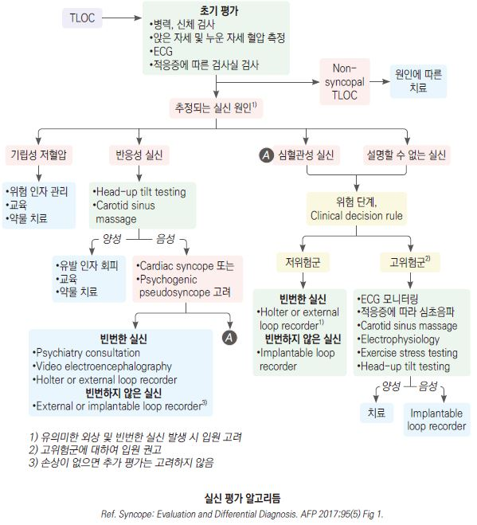

# 실신 Syncope

## <mark style="color:green;">일반 사항</mark>

#### Syncope

* 뇌 혈류량 감소로 인하여 갑작스럽게 발생하고, 신경학적 후유 장애 없이 자발적으로 회복되는 일시적인(수 초\~수 분) 의식 소실
* 자신 및 상황에 대한 인식 없음, postural tone을 유지할 수 없음(넘어짐), 자극에 반응하지 않음
* 전체 인구의 약 40%가 평생 한 번 이상 경험; 응급실 방문의 약 1\~3% 차지
* 심장 질환이 있는 경우를 제외하고는 양호한 예후; 원인 중 ⅓ 이상에서 원인 미상

**원인 또는 기전**

* syncope (TLOC, transient loss of consciousness) : 일과성 뇌 저관류(cerebral hypoperfusion)에 의함
* non-syncope TLOC : 발작(epilepsy), 저혈당, 대사 이상, 약물/알코올 남용, 뇌진탕, 심인성(psychogenic pseudosyncope)

#### Presyncope

* 실신 발생 직전에 경험하는 증상(near-syncope). 회복될 수도 있고 syncope로 진행될 수도 있음
* 어지럼(dizziness, lightheadedness), 시각 이상(터널 시야, 시력 상실), 다양한 수준의 의식 변화(완전한 의식 소실은 아님); 구역, 오한, 복통, 창백, 자세 긴장 저하 (☞ p.93)

### <mark style="color:$danger;">🚩 Red Flags!</mark>&#x20;

<mark style="color:$danger;">**즉각 이송/응급 평가 — 심혈관성 실신 또는 생명 위협 원인 직접 시사**</mark>

* 운동 중 또는 누운 자세에서 발생한 실신
* 비정상 ECG : QT 연장, pre-excitation(WPW), bundle branch block, 지속성 서맥(＜40회/분), ST 이상, Q파
* 전구 증상 없이 갑작스럽게 발생한 실신
* 기저 구조적 심질환(심부전, 심근증, 판막 질환), 관상동맥병 병력, 또는 가족성 돌연사 병력(＜50세)

<mark style="color:$warning;">**당일 의뢰 또는 응급 평가 권고**</mark>

* 흉통, 호흡 곤란, 심계항진 동반
* 실신 직후 두근거림
* 수축기 혈압 ＜90 ㎜Hg (회복 후에도 저혈압 지속)
* 중증 빈혈 또는 전해질 이상 동반
* 심한 외상 동반 (낙상으로 인한 골절, 두부 손상 등)

<mark style="color:$info;">**외래 추적 / 추가 검사 계획 — 단독 시 즉각 위험 낮으나 반복 시 재평가 필요**</mark>

* 반복적이고 설명할 수 없는 실신 (위 소견 병존 시 즉각 격상)

## <mark style="color:green;">종류</mark>

### <mark style="color:$primary;">반사성 실신, 신경 매개성 실신 (Reflex syncope, Neurally mediated syncope)</mark>

(☞ [반사성 실신](022_-reflex-syncope-neurally-mediated-syncope.md))

* 실신의 가장 흔한 원인 (약 21%)
* 양성 경과; 젊은 환자에서 특히 흔하나 고령자에서도 발생 (이봉형 연령 분포)
* 기전 : 과도한 vagal tone 또는 말초 순환의 반사 조절 장애
* 유발 인자 : vasovagal(예: 스트레스, 공포, 통증, 불쾌한 장면/소리/냄새, 의료 시술), situational(예: 기침, 큰 웃음, 배변, 배뇨, 운동, 더운 곳, 오래 서 있음), 머리 회전 또는 carotid sinus 압박(예: 목이 조이는 옷)
* 특징
  * 비슷한 상황에서 반복되지만 악화되지 않는 실신 병력
  * syncope 발생 전에 자율 신경 항진 증상(예: 창백, 식은땀, 구역, 구토)이 있음
  * 실신 후 피로감; tonic-clonic movement 동반 가능 (단시간, ＜15초; 간질과 감별)

### <mark style="color:$primary;">기립성 저혈압 실신 (Orthostatic hypotension syncope)</mark>

* 기립 후 3분 이내 수축기 혈압 ≥20 ㎜Hg 또는 이완기 혈압 ≥10 ㎜Hg 감소
* 원인 : 1차성 자율 신경 장애(pure autonomic failure), 2차성 자율 신경 장애(예: 당뇨, spinal cord injury, 파킨슨병), 약물(예: 술, 혈관 확장제, 이뇨제, adrenergic blocker, 진정제), hypovolemia(예: 탈수, 출혈) (☞ p.500)
* 특징
  * 갑자기 일어선 직후 또는 더운 곳에서 장시간 서 있을 때 발생
  * 최근 약물 복용 시작 또는 증량 병력
  * 고령, 기저 질환자(예: 당뇨병, 자율신경병증)에서 호발

### <mark style="color:$primary;">심혈관성 실신 (Cardiovascular syncope)</mark>

* 원인 : 부정맥/전도 장애(가장 흔한 심장 원인), 심혈관 구조 이상(예: MI, 심근증, 대동맥협착증, 비후성심근증), 폐질환(예: 폐색전증, 폐동맥고혈압)
* 특징
  * 운동 중 또는 앉아 있는 상태에서 발생
  * 전구 증상 없거나 짧음(＜10초)
  * 실신 전후 두근거림, 흉통, 호흡 곤란
  * 비정상 ECG, 심장 또는 관상동맥 이상 병력, 심장 질환 가족력
  * 반복 실신이 부정맥에 의할 가능성은 낮음 → 반복 시 반사성 실신 우선 고려

## <mark style="color:green;">진단</mark>

### <mark style="color:$primary;">초기 평가 원칙</mark>

* 병력 청취 : 발생 상황, 전구 증상, 회복 과정, 목격자 진술, 복용 약물, 심장 질환 병력, 가족력
* 신체 검진 : 양측 혈압(앙와위·기립 후 즉시·3분 후), 맥박, 심장 청진
* ECG : 모든 실신 환자에서 반드시 시행 (Class I)

<mark style="color:$info;">※ 2017 ACC/AHA/HRS 및 2018 ESC 가이드라인 공통 권고 : 병력 청취, 신체 검진(기립성 활력징후 포함), 12유도 ECG가 초기 평가의 핵심; 일률적인 광범위 실험실 검사 및 영상 검사는 권고하지 않음</mark>

### <mark style="color:$primary;">추가 검사</mark>

* 부정맥 의심 : 즉각적 심전도 모니터링, Holter monitoring
* 구조적 심질환 의심 : 심초음파
* 운동 유발 실신 : exercise stress test
* 반사성/기립성 실신 의심 : head-up tilt-table test (민감도 30\~56%, 특이도 90% 이상)
* 원인 불명 반복 실신 : Implantable loop recorder (ILR) — 장기 모니터링에 가장 유용
* 40세 이상 : carotid sinus massage 고려
* 실험실 검사 : 임상적으로 필요한 경우에 한하여 시행 (CBC, 전해질, troponin, BNP, 혈당, D-dimer 등)
  * 일률적·광범위한 실험실 검사는 권고하지 않음 (Class III: No Benefit)
* EEG : 발작 의심 시 고려
* 뇌 CT/MRI : 신경학적 이상 소견이 있는 경우에 한하여 고려; 신경학적 증상 없는 단순 실신에서는 routine 촬영 불필요

### <mark style="color:$primary;">저위험 — 외래 추적 또는 퇴원 가능</mark>

다음 모든 사항에 해당되면 위험도가 낮은 것으로 판단

* ＜50세, 심혈관 질환 병력 없음
* 정상 ECG
* 명확한 trigger 있음(예: 탈수, 기침, 채혈)
* 반사성 실신 또는 기립성 저혈압 실신 양상


**Canadian Syncope Risk Score (CSRS)**

응급실 내원 실신 환자의 30일 내 중대 부작용 발생 위험 예측 도구. 9개 항목(병력, 활력징후, ECG, troponin, 응급실 진단)으로 구성. 점수 범위 −3 \~ +11점.

* 매우 낮은 위험 (−3, −2점) / 낮은 위험 (−1, 0점) : 30일 내 SAE 약 1.2%, 외래 추적 고려
* 중간 위험 (1, 2, 3점) / 높은 위험 (4, 5점) / 매우 높은 위험 (≥6점) : 단계적 입원 및 추가 검사

2022년 국제 다기관 전향적 검증 연구 완료; 8개국에서 SAE 0.6%로 확인됨. [🔗 mdcalc.com/canadian-syncope-risk-score](https://www.mdcalc.com/canadian-syncope-risk-score)


### <mark style="color:$primary;">감별</mark>

* 뇌 혈류 감소 없는 의식 소실 → epilepsy, 대사 이상(예: 저혈당, 저산소증, 과호흡/저이산화탄소혈증, 중독), vertebrobasilar TIA (☞ p.109)
* 의식 소실 없는 쓰러짐 → cataplexy, 낙상, psychogenic pseudosyncope, TIA
* 발작과의 감별 : 실신에서의 tonic-clonic movement는 ＜15초로 짧고 실신 후 빠른 회복; 발작 후 혼돈(postictal confusion)은 없음

***



***

## <mark style="color:green;">Management</mark>

### <mark style="color:$primary;">치료 방침</mark>

* 원인 치료, 기저 질환 치료
* 유발 약물 검토 및 감량/중단 (혈압 강하제, 이뇨제, 혈관 확장제 등)
* 저위험 반사성 실신 : 교육 및 안심 (Class I), 비약물 치료 우선 (☞ [반사성 실신](022_-reflex-syncope-neurally-mediated-syncope.md))
* 기립성 저혈압 실신 : 유발 약물 조정, 수분·염분 섭취 증가, 압박 스타킹 (☞ p.500)
* 심혈관성 실신 : 전문의 의뢰; 부정맥 치료, ICD, pacemaker 등
  * 부정맥 확인 시 : 항부정맥제, ablation, pacemaker, ICD 등
  * 구조적 심질환 : 원인 질환 치료
* 부상 예방 : 채혈 또는 주사 시 누워서 진행, 전조 증상 발생 시 앉거나 누움
* 운전 : 원인과 재발 위험에 따라 운전 중단 권고 고려 (심혈관성 실신의 경우 특히 중요)

***

### <mark style="color:purple;">질병코드</mark>

R55 실신 및 허탈

***

## <mark style="color:orange;">처방례</mark>

> **처방례 1.** 기립성 저혈압 실신 — 급성기 수액 보충
>
> ```
> 생리식염수(0.9% NaCl) 500 mL  IV  over 30분  (탈수 동반 시)
> ※ 이후 경구 수분 섭취 권고; 유발 약물 검토 및 감량/중단 고려
> ```

> **처방례 2.** 반사성 실신 (vasovagal) — 외래 처방
>
> ```
> 미드론 2.5 mg/T  1T  tid  (식전; 앙와위 고혈압 주의)
> ※ 수분 2 L/d 이상, 소금 6~9 g/d, counter-pressure maneuver 교육
> ※ 자세한 처방은 반사성 실신 챕터 참조 (☞ p.xxx)
> ```

> **처방례 3.** 기립성 저혈압 — 만성 (신경인성, 약물 조정 후에도 지속 시)
>
> ```
> 미드론 2.5 mg/T  1T  tid  (식전; 고혈압·요저류 주의)
> 플로리네프 0.1 mg/T  0.5~1T  조식 후  (전해질 모니터 필요)
> ※ 압박 스타킹(20~30 mmHg), 두부 거상 취침(10~20°), 소량 빈번한 식사
> ```

***

### <mark style="color:purple;">핵심 복약 지도</mark>

> **실신 후 일반 주의사항**
>
> * 의식을 완전히 회복하고 안정될 때까지 움직이지 마십시오.
> * 전조 증상(어지럼, 식은땀, 창백)이 느껴지면 즉시 앉거나 눕고 다리를 올리십시오.
> * 회복 후 빠르게 일어나지 말고, 천천히 앉았다가 일어나는 습관을 들이십시오.

> **운전 및 위험 활동**
>
> * 원인이 밝혀지지 않은 실신 또는 심혈관성 실신이 의심되는 경우, 원인 확인 및 치료 전까지 운전·기계 조작·고소 작업을 삼가십시오.
> * 담당 의사와 운전 재개 시점을 반드시 상의하십시오.

> **언제 다시 병원을 방문해야 하나요?**
>
> * 실신이 반복되거나 점점 자주 발생하는 경우
> * 실신 시 흉통·두근거림·호흡 곤란이 동반된 경우
> * 실신 시 크게 다쳤거나 의식 회복이 느린 경우
> * 전조 증상 없이 갑자기 쓰러지는 경우
