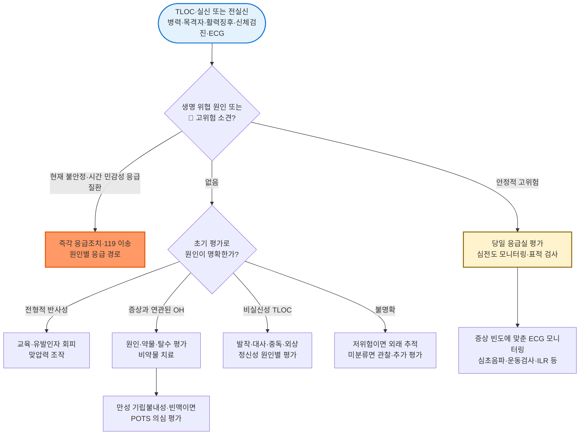

# 실신 Syncope

## <mark style="color:green;">일반 사항</mark>

#### <mark style="color:$primary;">Syncope</mark>

* 전반적 뇌 저관류로 인하여 갑자기 발생하고, 지속 시간이 짧으며, 특별한 처치 없이 자발적으로 완전히 회복되는 일시적 의식 소실
* 의식 소실 동안 사건에 대한 기억상실, 운동 조절 및 자세 긴장 소실, 자극에 대한 무반응이 동반됨
* 전체 인구의 약 40%가 평생 한 번 이상 경험; 응급실 방문의 약 1\~3% 차지
* 예후는 원인과 동반 질환에 따라 다름. 반사성 실신은 대체로 양호하지만 심장성 실신은 예후가 불량하며, 기립성 저혈압도 중증 동반 질환과 연관될 수 있음; 원인 중 ⅓ 이상에서 원인 미상

**원인 또는 기전**

* TLOC(transient loss of consciousness)는 짧은 의식 소실, 사건에 대한 기억상실, 비정상 운동 조절 및 무반응을 특징으로 하는 상위 개념
* syncope는 전반적 뇌 저관류(cerebral hypoperfusion)에 의한 비외상성 TLOC의 한 유형
* non-syncope TLOC : 뇌전증 발작, psychogenic pseudosyncope 등. 저혈당·저산소증·중독·대사 이상 및 두부 외상도 의식 소실의 감별 원인

#### <mark style="color:$primary;">전실신 (Presyncope)</mark>

* 전실신(presyncope; near-syncope)은 실신이 임박한 듯한 증상이 있으나 완전한 의식 소실 없이 회복되는 상태. 실신(syncope)으로 진행할 수도 있음
* 어지럼(dizziness, lightheadedness), 시각 이상(터널 시야, 시력 상실), 다양한 수준의 의식 변화(완전한 의식 소실은 아님); 구역, 오한, 복통, 창백, 자세 긴장 저하 (☞ [어지럼증](020_-dizziness.md))
* 응급실 전실신 환자도 부정맥 등 단기 중대 결과 위험이 실신과 비슷할 수 있으므로, 특히 고령·심질환자 또는 Red Flags 동반 시 실신과 같은 수준으로 평가

### <mark style="color:$danger;">🚩 Red Flags!</mark>

<mark style="color:$danger;">**즉각 응급 조치 및 119 이송**</mark> <mark style="color:$danger;">- 현재 생명 위협 상태 또는 시간 민감성 응급질환 의심</mark>

* 의식 또는 활력징후가 신속히 회복되지 않음, 정상 호흡 없음, 지속되는 수축기 혈압 ＜90 ㎜Hg 또는 쇼크
* 지속성 중증 서맥·빈맥, 급성 심근허혈을 시사하는 ECG 변화, 심박동기·제세동기 기능 이상
* 지속되는 흉통·심한 호흡곤란·복통 또는 벼락두통: 급성 관상동맥증후군, 폐색전증, 대동맥박리, 중증 출혈, 지주막하출혈 등 의심
* 새 국소 신경학적 결손, 의식 회복 지연, 중증 두부 손상·골절 또는 기타 심한 외상
* 가임기 여성에서 임신 가능성과 함께 복통·질출혈·저혈압이 있는 경우

> **QTc 연장 확인 시 즉시 약물 검토**
>
> 실신 환자에서 QTc ≥460 ms가 확인되면 반복 ECG, 전해질, 신기능, 가족력 및 다음 QT 연장 유발 약물을 함께 검토할 것. QTc ＞500 ms는 torsades de pointes 위험이 더 높지만, QTc 수치만으로 선천성 long-QT syndrome을 확진하지 않음.
>
> * 항정신병약, 일부 macrolide·fluoroquinolone, class IA·III 항부정맥제, 일부 항구토제·항진균제·항우울제 등 약제별 위험도가 다름.
> * 2종 이상 병용, 고용량, 저칼륨·저마그네슘혈증, 서맥, 신·간기능 저하는 위험을 높일 수 있음. ※ [CredibleMeds QTDrugs List](https://crediblemeds.org)에서 개별 약물의 Known/Possible/Conditional Risk 확인

<mark style="color:$warning;">**당일 응급실 평가 및 모니터링 권고**</mark>

* 운동 중 또는 누운 자세에서 발생한 실신
* 갑작스러운 심계항진 직후 실신
* 전구 증상 없이 또는 매우 짧은 전구 증상 후 발생한 실신이 구조적 심질환·관상동맥질환 또는 비정상 ECG와 동반
* 기저 구조적 심질환(심부전, 심근증, 판막질환), 관상동맥질환 또는 젊은 나이의 급사·익사 가족력
* 고위험 ECG: 심근허혈, Mobitz II형 또는 3도 AV block, 지속성·비지속성 VT, type 1 Brugada pattern, QTc ≥460 ms, 현저한 전도 장애·심실비후·병적 Q파 등
  * Mobitz I형/현저한 1도 AV block, 각성 시 서맥 ＜40회/분 또는 3초 이상 pause, 발작성 SVT·AF, pre-excitation, short QT(≤340 ms), 비전형 Brugada pattern 등은 구조적 심질환 또는 다른 비정상 ECG와 함께 있을 때 위험도를 격상
  * 3초 이상 pause는 젊은 운동선수, 수면 중 또는 심박수가 조절된 AF 등 생리적 예외를 고려
* 중증 빈혈·출혈 또는 유의한 전해질 이상

<mark style="color:$info;">**외래 추적 / 추가 검사 계획**</mark> - 단독 시 즉각 위험 낮으나 반복 시 재평가 필요

* 반복적이고 설명할 수 없는 실신 또는 원인불명 낙상(특히 고령자); 위 소견이 병존하면 즉시 격상

## <mark style="color:green;">종류</mark>

### <mark style="color:orange;">반사성 실신, 신경 매개성 실신 (Reflex syncope, Neurally mediated syncope)</mark>

(☞ [반사성 실신](022_-reflex-syncope-neurally-mediated-syncope.md))

* 실신의 가장 흔한 원인 (약 30\~60%); 양성 경과; 젊은 환자에서 특히 흔하나 고령자에서도 발생 (이봉형 연령 분포)
* 기전 : 부적절한 자율신경 반사로 혈관 확장, 서맥 또는 두 가지가 함께 발생
* 유발 인자 : vasovagal(예: 스트레스, 공포, 통증, 불쾌한 장면/소리/냄새, 의료 시술, 더운 곳, 오래 서 있음), situational(예: 기침, 큰 웃음, 연하, 배변, 배뇨, 운동 직후), 머리 회전 또는 carotid sinus 압박(예: 목이 조이는 옷)
  * 운동 **중** 실신은 반사성으로 단정하지 말고 심장성 원인을 우선 배제; 운동 직후 실신은 반사성 기전이 흔함
* 특징
  * 비슷한 상황에서 반복되지만 악화되지 않는 실신 병력
  * syncope 발생 전에 자율 신경 항진 증상(예: 창백, 식은땀, 구역, 구토)이 있음
  * 실신 후 피로감; tonic-clonic movement 동반 가능 (단시간, ＜15초; 간질과 감별)

### <mark style="color:orange;">기립성 저혈압 실신 (Orthostatic hypotension syncope)</mark>

* Classic OH : 기립 후 3분 이내 지속적으로 수축기 혈압 ≥20 ㎜Hg 또는 이완기 혈압 ≥10 ㎜Hg 감소하거나 수축기 혈압 ＜90 ㎜Hg로 저하
  * Initial OH : 기립 15초 이내 수축기 혈압 ＞40 ㎜Hg 및/또는 이완기 혈압 ＞20 ㎜Hg가 일시적으로 저하된 후 빠르게 회복. 일반 커프 혈압계로 확진할 수 없고 연속 beat-to-beat 혈압 측정이 필요
  * Delayed OH : 기립 3분 이후 지속적으로 수축기 혈압 ≥20 ㎜Hg(누운 자세에서 혈압이 높은 환자는 ≥30 ㎜Hg) 또는 이완기 혈압 ≥10 ㎜Hg 감소. 발생 시간을 10분 이내로 제한하지 않음
* 원인 : 1차성 자율 신경 장애(pure autonomic failure), 2차성 자율 신경 장애(예: 당뇨, spinal cord injury, 파킨슨병), 약물(예: 술, 혈관 확장제, 이뇨제, adrenergic blocker, 진정제), hypovolemia(예: 탈수, 출혈) (☞ [기립성 저혈압](../225_/096_-orthostatic-hypotension.md))
* 특징
  * 갑자기 일어선 직후 또는 더운 곳에서 장시간 서 있을 때 발생
  * 최근 약물 복용 시작 또는 증량 병력
  * 고령, 기저 질환자(예: 당뇨병, 자율신경병증)에서 호발

### <mark style="color:orange;">체위 기립성 빈맥증후군 (Postural orthostatic tachycardia syndrome, POTS)</mark>

* 실신 자체보다는 만성 기립불내성, 전실신, 두근거림·쇠약·시야 흐림·피로를 주로 일으키는 증후군
* 진단을 위해 다음을 모두 확인
  * 기립 10분 이내 지속적 심박수 증가 ≥30회/분(12\~19세는 ≥40회/분); 적어도 1분 간격의 2회 이상 측정에서 확인
  * 유의한 기립성 저혈압 없음
  * 기립 시 악화되고 누우면 빠르게 호전되는 증상이 매우 자주 나타나며 **3개월 이상 지속**
  * 급성 탈수·출혈·빈혈·발열·갑상선기능항진·약물 등 빈맥을 설명할 다른 원인 배제
* 3분 기립 활력징후나 일회성 심박수 증가만으로 확진하지 않으며, 필요 시 10분 능동기립검사·기립경사검사 또는 전문의 평가

### <mark style="color:orange;">심혈관성 실신 (Cardiovascular syncope)</mark>

* 원인 : 부정맥/전도 장애(가장 흔한 심장 원인), 심혈관 구조 이상(예: MI, 심근증, 대동맥협착증, 비후성심근증), 폐질환(예: 폐색전증, 폐동맥고혈압)
* 특징
  * 운동 중 또는 앉아 있는 상태에서 발생
  * 전구 증상 없거나 짧음(＜10초)
  * 실신 전후 두근거림, 흉통, 호흡 곤란
  * 비정상 ECG, 심장 또는 관상동맥 이상 병력, 심장 질환 가족력
  * 반복 실신은 반사성 실신에서 흔하지만, 전구 증상 없이 갑작스럽게 발생하거나 심장 질환 병력이 있는 경우에는 부정맥 원인을 반드시 배제해야 함

## <mark style="color:green;">진단</mark>

### <mark style="color:orange;">초기 평가 원칙</mark>

* 병력 청취 : 발생 상황, 전구 증상, 회복 과정, 목격자 진술, 복용 약물, 심장 질환 병력, 가족력
  * 가능하면 목격자 진술이나 스마트폰 영상을 확보. 고령자의 원인불명 낙상은 사건 기억상실로 실신이 숨겨질 수 있음
* 신체 검진 : 활력징후, 맥박, 심장·신경학적 검진, 출혈·외상 징후
  * 기립 활력징후 : 앙와위 5분 안정 후 혈압·맥박 측정 → 기립 1분·3분에 반복; 증상이나 delayed OH가 의심되면 10분 이상 연장 또는 기립경사검사 고려
  * 일반 커프 혈압계의 기립 직후 측정만으로 initial OH를 진단하지 않음. 의심 시 연속 beat-to-beat 혈압 측정 필요
  * 양팔 혈압 차이가 크거나 대동맥박리·쇄골하동맥 질환이 의심될 때 양측 혈압 확인
  * 수축기 잡음 청취 시 HOCM(Valsalva 시 증강)·대동맥협착증 감별 고려
* ECG : 모든 실신 환자에서 반드시 시행 (Class I)

 ※ 2024 대한부정맥학회, 2018 ESC 및 2017 ACC/AHA/HRS 지침 공통 원칙 : 병력 청취, 신체 검진(기립성 활력징후 포함), 12유도 ECG가 초기 평가의 핵심; 일률적인 광범위 실험실 검사 및 영상 검사는 권고하지 않음

***


```mermaid
graph TD
    Start([TLOC·실신 또는 전실신<br/>병력·목격자·활력징후·신체검진·ECG]) --> S1{생명 위협 원인 또는<br/>🚩 고위험 소견?}
    S1 -->|현재 불안정·시간 민감성 응급질환| Emergency[즉각 응급조치·119 이송<br/>원인별 응급 경로]
    S1 -->|안정적 고위험| High[당일 응급실 평가<br/>심전도 모니터링·표적 검사]
    S1 -->|없음| S2{초기 평가로<br/>원인이 명확한가?}
    S2 -->|전형적 반사성| Reflex[교육·유발인자 회피<br/>맞압력 조작]
    S2 -->|증상과 연관된 OH| Orthostatic[원인·약물·탈수 평가<br/>비약물 치료]
    S2 -->|비실신성 TLOC| Other[발작·대사·중독·외상<br/>정신성 원인별 평가]
    S2 -->|불명확| Observe[저위험이면 외래 추적<br/>미분류면 관찰·추가 평가]
    Orthostatic --> POTS[만성 기립불내성·빈맥이면<br/>POTS 의심 평가]
    High --> Monitor[증상 빈도에 맞춘 ECG 모니터링<br/>심초음파·운동검사·ILR 등]
    style Emergency fill:#f96,stroke:#e65100,stroke-width:2px
    style High fill:#fff3cd,stroke:#856404,stroke-width:2px
    style Start fill:#e3f2fd,stroke:#1976d2,stroke-width:2px
```

<p align="center"><strong>실신·전실신 환자 초기 평가 알고리듬</strong></p>

* _생명 위협 원인과 고위험 소견을 먼저 평가하되, 고위험이 곧 심장성만을 의미하지는 않음. 폐색전증·대동맥박리·출혈·지주막하출혈 등도 고려._
* _기립 활력징후는 가능한 모든 환자에서 측정._
* _저위험 환자는 초기 평가에서 중대한 원인이 배제되고 전형적 반사성 실신 또는 증상과 연관된 OH가 확인된 경우. 나이만으로 귀가 여부를 결정하지 않음._
* _Canadian Syncope Risk Score는 응급실 초기 평가 후 보조적으로 활용할 수 있으나 임상판단을 대체하거나 퇴원 안전성을 보장하지 않음._

<p align="center"><em><mark style="color:$info;">Ref. 2024 대한부정맥학회 실신 진료지침; 2024 EUSEM Syncope Core Management Process; 2018 ESC Guidelines; 2017 ACC/AHA/HRS Guideline</mark></em></p>

***

### <mark style="color:orange;">추가 검사</mark>

* 고위험 부정맥 의심 : 즉각적인 병원 내 침상 또는 원격 심전도 모니터링
* 증상 빈도에 따른 외래 심전도 모니터링
  * 실신·전실신이 주 1회 이상 : Holter monitoring 고려
  * 증상 간격이 약 4주 이내 : 외부형 사건기록기·patch monitor 고려
  * 드물지만 재발성이고 원인불명이며 부정맥이 의심됨 : ILR 조기 고려
* 구조적 심질환 의심 : 심초음파
* 운동 중 또는 직후 실신 : exercise stress test(심전도·혈압 모니터링이 가능한 환경)
* 반사성 실신, OH, POTS 또는 psychogenic pseudosyncope가 의심되나 초기 평가로 확진하기 어려운 경우 : head-up tilt-table test 고려
  * 양성 반응은 저혈압 감수성을 보여줄 수 있으며 특정 원인을 자동 확정하지 않음; 음성이라고 반사성 실신을 배제할 수 없음
* 원인 불명 반복 실신 : Implantable loop recorder(ILR)는 장기 모니터링에 유용하며, 특히 부정맥이 의심되나 ECG·단기 모니터링에서 확인되지 않고 장치 배터리 수명 내 재발 가능성이 높은 경우 평가 초기 단계에서 고려
  * 국내 건강보험 급여 기준(확인일 : 원고 검토 시점 기준) : 다른 검사로 원인이 진단되지 않은 재발성 실신. 구조적 심장질환이 있는 환자는 실신 1회도 인정 가능하며, 재발성 두근거림 및 일정 조건의 심방세동 의심 원인불명 뇌졸중도 해당할 수 있음. ※ 급여 기준은 개정될 수 있으므로 처방·시술 시점의 최신 HIRA 고시(고시번호·시행일 확인)를 반드시 재확인
* Carotid sinus massage : 40세 초과의 원인불명 실신 중 반사성 기전에 합당한 경우, 지속 ECG 및 beat-to-beat 혈압 모니터링이 가능한 환경에서 고려
  * 시행법 : 좌·우 경동맥동을 각각 앙와위(supine)에서 먼저 마사지(약 10초)하고, 음성이면 기립경사대를 이용해 세운 자세(upright)에서 재시행 (Six-Step Method; 2018 ESC 지침, 2024/2025 Europace)
  * 최근 TIA·뇌졸중·심근경색, 유의한 경동맥 협착·잡음 등 금기·주의 확인
  * 3초 이상 무수축 및/또는 수축기 혈압 50 ㎜Hg 이상 저하만으로는 carotid sinus hypersensitivity이며, 자발성 실신과 합당한 증상이 재현되어야 carotid sinus syndrome 진단
* 실험실 검사 : 임상적으로 필요한 경우에 한하여 시행 (CBC, 전해질, BNP, 혈당, D-dimer 등)
  * 일률적·광범위한 실험실 검사는 권고하지 않음 (Class III: No Benefit)
  * hs-Troponin : 심장 질환 또는 ACS가 의심되는 경우에 한하여 시행; 무증상 저위험군에서 일률적 시행은 불필요
* EEG : 발작이 의심되는 경우 고려; **routine EEG는 불필요**. Psychogenic pseudosyncope 또는 경련성 실신 감별 시 필요하면 기립경사검사와 EEG·혈역학 모니터링을 병행
* 뇌 CT/MRI : 국소 신경학적 이상, 지주막하출혈 의심 또는 유의한 두부 외상이 있는 경우 고려; **신경학적 증상·외상 없는 단순 실신에서는 routine 촬영 불필요**
* 경동맥 초음파(Carotid Doppler) : 신경학적 국소 증상·징후가 없는 단순 실신에서는 루틴 시행 불필요 (Class III: No Benefit); 국소 신경 증상 동반 시에 한하여 고려

### <mark style="color:orange;">저위험 - 외래 추적 또는 퇴원 가능</mark>

초기 평가에서 중대한 원인이 배제되고 다음과 같은 저위험 임상 양상이 확인되면 외래 추적 또는 퇴원을 고려

* 전형적인 반사성 실신의 유발 인자와 전구 증상(오래 서 있음, 더위, 통증·감정, 채혈, 창백·발한·구역 등)
* 기립 후 발생하고 증상과 연관된 OH가 확인됨
* 구조적 심질환·관상동맥질환 병력, 고위험 가족력, 비정상 심장 진찰 및 고위험 ECG가 없음
* 활력징후가 회복되고 중증 외상·출혈·기타 응급질환이 없음

**Canadian Syncope Risk Score (CSRS)**

* 응급실 내원 실신 환자의 30일 내 중대 부작용 발생 위험 예측 도구
* 9개 항목(병력, 활력징후, ECG, troponin, 응급실 진단)으로 구성; 점수범위−3 \~ +11점. ☞ [계산기](https://www.mdcalc.com/canadian-syncope-risk-score)
  * 캐나다 다기관 검증연구에서 매우 낮은 위험(−3, −2점)과 낮은 위험(−1, 0점)을 합친 30일 중대 결과 발생률은 약 0.4%(개별군 0.2%, 0.7%)
  * 중간 위험(1\~3점)은 관찰·신속 추적 또는 입원을 임상적으로 결정하고, 높은 위험(4, 5점)·매우 높은 위험(≥6점)은 집중 평가와 입원을 고려
* 적용 범위와 한계
  * 중대한 원인이 초기 응급실 평가에서 확인되지 않은 환자에서 보조적으로 사용; 외래 단독 평가나 명백한 응급질환의 배제 도구가 아님
  * 2026년 미국 전향적 외부 검증에서는 CSRS AUROC 0.72로 캐나다 연구보다 낮았으므로, 단독 퇴원 결정 도구로 사용하지 않음
* 원 문헌
  * 유도 : Thiruganasambandamoorthy V, et al. _CMAJ_. 2016;188:E289-E298.
  * 캐나다 다기관 검증 : Thiruganasambandamoorthy V, et al. _JAMA Intern Med_. 2020;180:737-744.
  * 국제 외부 검증 : Zimmermann T, et al. _Ann Intern Med_. 2022;175:783-794.
  * 미국 외부 검증 : Suh EH, et al. _JAMA Netw Open_. 2026.

### <mark style="color:orange;">감별</mark>

<mark style="color:$info;">※ 실신 아형 간 감별(혈관미주신경성/상황/기립성 저혈압/심장성)은 본 섹션 하단의</mark> <mark style="color:$info;"></mark><mark style="color:$info;">**실신 아형 감별표**</mark><mark style="color:$info;">와 위의</mark> <mark style="color:$info;"></mark><mark style="color:$info;">**초기 평가 알고리듬**</mark> <mark style="color:$info;"></mark><mark style="color:$info;">참조. 본 섹션은 실신과 혼동되는</mark> <mark style="color:$info;"></mark><mark style="color:$info;">**비실신성 TLOC**</mark> <mark style="color:$info;"></mark><mark style="color:$info;">감별에 집중.</mark>

**Non-syncope TLOC (의식 소실이 뇌 저관류에 의하지 않는 경우)**

* 뇌 저관류에 의하지 않는 의식 소실·의식 변화 → 뇌전증, psychogenic pseudosyncope, 대사 이상(예: 저혈당, 저산소증), 중독, 두부 외상 등
* 의식 소실 없는 쓰러짐 → cataplexy, 기계적 낙상, 기능성 신경학적 증상 등
* [TIA](023_-transient-ischemic-attack-tia.md)는 고립된 의식 소실의 일반적 원인이 아님. vertebrobasilar ischemia는 드물게 의식 소실을 일으킬 수 있으나 복시·구음장애·운동실조·국소 신경학적 결손 등 후순환 증상이 동반될 때 고려

**발작과의 감별**

* 실신과 뇌전증 발작에서는 눈을 뜨고 있는 경우가 전형적이며, 눈을 계속 감고 있거나 눈뜨기에 저항하는 소견은 psychogenic pseudosyncope를 시사. 단독 소견으로 확진하지 않음
* 실신의 myoclonic jerk는 대개 의식 소실 이후 시작하고 불규칙·비동기·비대칭적이며 흔히 10회 미만; 뇌전증성 강직-간대발작은 의식 소실과 거의 동시에 시작하고 동기성·대칭성 운동이 흔하며 20회 이상이면 발작을 더 시사
* 측면 혀 깨물기와 수분 이상 지속되는 postictal confusion은 뇌전증을 강하게 시사. 요실금·외상·사건 후 피로는 두 질환 모두에서 나타날 수 있어 단독 감별력이 낮음
* Psychogenic pseudosyncope : 외관상 무반응이나 사건 중 혈압·심박수 및 EEG가 정상 또는 상승하고, 눈 감김·긴 지속시간·높은 발생 빈도가 단서. 기립경사검사 중 혈압·심박수·EEG 또는 video-EEG로 전형적 사건을 기록하면 감별에 유용

**실신 아형 감별표**

<table><thead><tr><th width="326">임상 특성</th><th>우선 고려 유형</th><th>참조 챕터/섹션</th></tr></thead><tbody><tr><td>스트레스·통증·오래 서 있음, 전구 증상(창백·식은땀·구역)</td><td>혈관미주신경성 실신</td><td><a href="022_-reflex-syncope-neurally-mediated-syncope.md">022</a></td></tr><tr><td>기침·연하·배뇨·배변 또는 운동 직후 발생</td><td>상황·반사성 실신</td><td><a href="022_-reflex-syncope-neurally-mediated-syncope.md">022</a></td></tr><tr><td>기립 후 증상과 함께 혈압이 기준 이상 지속 저하</td><td>기립성 저혈압 실신</td><td>본 챕터</td></tr><tr><td>만성 기립불내성, 10분 이내 지속적 빈맥, 유의한 OH 없음</td><td>POTS 의심</td><td>본 챕터 POTS 참조</td></tr><tr><td>운동 중 또는 누운 자세 발생<br>갑작스러운 심계항진 직후 발생<br>비정상 ECG 또는 구조적 심질환</td><td>심장성 실신 우선 → 당일 응급 평가</td><td>Red Flags 참조</td></tr><tr><td>국소 신경학적 결손·벼락두통·의식 회복 지연</td><td>실신 외 신경학적 응급질환</td><td>Red Flags 참조</td></tr></tbody></table>

***

### <mark style="color:orange;">소아·청소년 실신</mark>

* 대부분은 반사성 실신이지만, **운동 중 또는 누운 자세의 실신, 흉통·갑작스러운 심계항진 동반, 비정상 심잡음·ECG, 심근병증·부정맥 또는 젊은 연령 급사·원인 불명 익사 가족력**은 심장성 원인을 우선 배제
* 최초 평가에는 성인과 마찬가지로 병력·가족력, 기립성 활력징후, 심장·신경학적 진찰과 12유도 ECG를 포함. 운동 중 실신이면 비후성 심근병증, 대동맥 기시 관상동맥 이상(anomalous aortic origin of a coronary artery, AAOCA), 긴 QT 증후군, catecholaminergic polymorphic ventricular tachycardia 등을 고려하여 소아심장 전문 평가
  * 바이러스 전구 증상, 흉통, 호흡곤란, 운동능 저하와 함께 ECG·troponin 이상이 동반되면 급성 심근염(myocarditis)도 감별에 포함
* 소아·청소년(12\~19세) POTS 심박수 기준(기립 10분 이내 ≥40 bpm 증가로 상향)은 위 **체위 기립성 빈맥증후군(POTS)** 절 참조
* 탈수·섭식장애·저혈당·빈혈, breath-holding spell(어린 소아), 임신 가능성 등 연령별 감별을 추가

***

## <mark style="background-color:$warning;">치료 및 관리</mark>

### <mark style="color:orange;">치료 방침</mark>

* 확인된 원인과 기저 질환을 치료하고, 재발·외상 위험을 함께 줄임
* 유발 가능 약물은 적응증, 용량, 시작·증량 시점, 복용 시간, 탈수·급성질환 여부를 검토하여 **임의 중단하지 말고 개별적으로** 감량·교체·중단을 결정
  * 혈압 강하제, 이뇨제, 질산염·기타 혈관 확장제, 진정성 약물 등
  * SGLT2 억제제는 이뇨·체액량 감소가, GLP-1 수용체 작용제는 구토·섭취 저하·급격한 체중 감소에 따른 탈수가 기립성 증상을 악화할 수 있음
  * sacubitril/valsartan(ARNI)은 이뇨제 병용 또는 체액·염분이 부족한 환자에서 증상성 저혈압 위험이 커질 수 있음
  * 정신작용약물(TCA, trazodone, quetiapine 등)은 기립성 저혈압·실신이 허가정보에 명시되어 있어 시작·증량 시 확인
  * 알파 차단제(tamsulosin, silodosin, alfuzosin 등)는 특히 시작·증량 시 기립성 저혈압 위험을 확인. 요로선택성이 높은 약제도 위험이 없지는 않으므로 증상과 혈압을 바탕으로 조정
* 저위험 반사성 실신 : 교육 및 안심 (Class I), 비약물 치료 우선 (☞ [반사성 실신](022_-reflex-syncope-neurally-mediated-syncope.md))
  * 전구 증상을 인지할 수 있는 반복성 저혈압형에서 counter-pressure maneuver를 교육하고, 증상 부담이 큰 일부 환자는 비약물 치료 후 midodrine 등을 고려
  * Cardioneuroablation은 선별된 중증 재발성 cardioinhibitory reflex syncope에서 논의되는 시술로, 근거와 장기 안전성이 확립 중이므로 실신·부정맥 전문센터에서만 고려
* 기립성 저혈압 실신 : 유발 약물 조정, 금기가 없을 때 수분·염분 섭취, **복대 또는 허리 높이 압박복**을 우선 고려. 무릎 높이 압박스타킹만으로는 효과가 제한적 (☞ [기립성 저혈압](../225_/096_-orthostatic-hypotension.md#management))
* 심혈관성 실신 : 전문의 의뢰; 부정맥 치료, ICD, pacemaker 등
  * 부정맥 확인 시 : 항부정맥제, ablation, pacemaker, ICD 등
  * 구조적 심질환 : 원인 질환 치료
* 부상 예방 : 채혈 또는 주사 시 누워서 진행, 전조 증상 발생 시 앉거나 누움
* 운전 : 원인·전구 증상·치료 여부·재발 위험과 개인/직업 운전 여부에 따라 제한을 개별화하고, 국내 현행 규정 확인. 원인 불명 또는 심장성 실신은 평가·치료 전 운전을 중단

***

### <mark style="color:red;">질병코드</mark>

R55 실신 및 허탈

***

## <mark style="color:purple;">처방례</mark>

> **처방례 1.** 탈수·혈관내 용적 감소가 확인된 기립성 저혈압 실신 - 급성기 수액 보충
>
> ```
> 생리식염수(0.9% NaCl) 500 ㎖  IV  over 30분
> ※ 투여 후 증상·혈압·폐음·소변량 재평가; 심부전·만성콩팥병·고령 환자는 용량과 속도를 개별화
> ※ 회복 후 경구 수분 섭취를 권고하고, 유발 가능 약물은 적응증을 확인하여 조정
> ```

> **처방례 2.** 증상 부담이 큰 반복성 저혈압형 반사성 실신 - 선택적 외래 처방
>
> ```
> 미드론 2.5 ㎎/T  1T  tid  (식전; 마지막 복용은 취침 4시간 전까지; 앙와위 고혈압 주의)
> ※ 비약물 치료(충분한 수분·염분 섭취, counter-pressure maneuver) 실패 후 2차 선택
> ※ 수분·염분 목표는 고혈압·심부전·콩팥병·간경변 여부를 고려해 개별화
> ※ 취침 4시간 전 이후 복용 금지; 낮 시간 복용 후에도 바로 눕지 말 것 (복용 후 최소 2~3시간은 좌위 또는 입위 유지)
> ※ 앙와위·기립 혈압과 요저류를 확인하고 반응에 따라 용량 조정
> ※ 자세한 처방은 반사성 실신 챕터 참조 (☞ [반사성 실신](022_-reflex-syncope-neurally-mediated-syncope.md#처방례))
> ```

> **처방례 3.** 기립성 저혈압 - 만성 (신경인성, 약물 조정 후에도 지속 시)
>
> ```
> [1차 선택 예] 미드론 2.5 ㎎/T  1T  tid
>   (식전; 마지막 복용은 취침 4시간 전까지; 앙와위 고혈압·요저류 주의)
> [대안 또는 단계적 추가 고려] 플로리네프 0.1 ㎎/T  0.5~1T(0.05~0.1 ㎎)  조식 후
>   (부종·체중 증가·저칼륨혈증·고혈압·심부전 악화 모니터)
> ※ 두 약을 처음부터 병용하는 처방례가 아님. 한 약제로 시작해 반응·부작용을 평가하고, 병용은 전문적 판단하에 단계적으로 고려
> ※ 앙와위·기립 혈압, 체중·부종, 전해질·콩팥기능을 추적; 고혈압·심부전·중증 콩팥병에서는 특히 주의
> ※ 플로리네프 시작 또는 증량 후 약 1\~2주 내 혈압·체중·부종·혈청 K+/신기능 첫 추적을 고려; 고령·심부전·콩팥병 또는 병용약물 위험이 있으면 더 일찍 평가
> ※ 복대 또는 허리 높이 압박복, 두부 거상 취침(10~20°), 소량 빈번한 식사를 병행
> ```

***

### <mark style="color:$success;">핵심 복약 지도</mark>

> **실신 후 일반 주의사항**
>
> * 의식을 완전히 회복하고 안정될 때까지 움직이지 마십시오.
> * 전조 증상(어지럼, 식은땀, 창백)이 느껴지면 즉시 앉거나 눕고 다리를 올리십시오.
> * 회복 후 빠르게 일어나지 말고, 천천히 앉았다가 일어나는 습관을 들이십시오.
> * 물 500 ㎖를 빠르게 마시는 방법은 의식과 삼킴이 정상인 상태에서 기립성 저혈압의 예방 또는 증상 완화에 사용할 수 있습니다. 자세를 낮추는 것보다 우선하지 않으며, 의식이 흐린 사람에게는 물·약을 먹이지 마십시오.

> **미드론(Midodrine) 복용 시 주의사항**
>
> * 취침 4시간 전 이후에는 복용하지 마십시오.
> * 낮에 복용한 후에도 바로 눕지 마십시오 (복용 후 최소 2\~3시간은 앉거나 서 있는 자세 유지).
> * 두통, 두피 따끔거림(piloerection), 소변 보기 어려움이 생기면 의사에게 알리십시오.

> **운전 및 위험 활동**
>
> * 원인이 밝혀지지 않은 실신 또는 심혈관성 실신이 의심되는 경우, 원인 확인 및 치료 전까지 운전·기계 조작·고소 작업을 삼가십시오.
> * 담당 의사와 운전 재개 시점을 반드시 상의하십시오.

> **언제 다시 병원을 방문해야 하나요?**
>
> * 실신이 반복되거나 점점 자주 발생하는 경우
> * 실신 시 흉통·두근거림·호흡 곤란이 동반된 경우
> * 실신 시 크게 다쳤거나 의식 회복이 느린 경우
> * 전조 증상 없이 갑자기 쓰러지는 경우

***

### <mark style="color:blue;">환자 안내서</mark>


**실신, 원인을 파악하는 것이 중요합니다**

대부분의 실신은 생명을 위협하지 않지만, 심장 질환이 원인인 경우에는 반드시 전문 진료가 필요합니다.


#### <mark style="color:$primary;">실신이란 무엇인가요?</mark>

* 뇌로 가는 혈류가 일시적으로 감소하여 수 초\~수 분간 의식을 잃었다가 저절로 회복되는 현상입니다.
* 가장 흔한 원인은 **혈관미주신경성 실신**으로, 극심한 긴장·통증·채혈·오랜 기립 등이 계기가 됩니다. 대부분 양성 경과를 보입니다.
* 심장 부정맥이나 구조적 심장 질환이 원인인 경우에는 즉각 전문 평가가 필요합니다.

#### <mark style="color:$primary;">즉시 응급실로 가야 하는 경우</mark>

* 실신과 함께 흉통·심한 두근거림·호흡 곤란이 동반된 경우
* 전조 증상 없이 갑자기 쓰러진 경우
* 운동 중 또는 누운 자세에서 실신이 발생한 경우
* 심장 질환 병력이 있거나 가족 중 젊은 나이에 급사한 분이 있는 경우
* 의식이 빨리 완전히 회복되지 않거나, 한쪽 마비·말 어눌함·심한 두통·지속되는 혼돈이 있는 경우
* 심한 출혈, 임신 중 출혈·복통, 큰 외상이 동반된 경우

#### <mark style="color:$primary;">쓰러진 사람을 발견했을 때</mark>

* 반응과 정상 호흡을 확인하십시오. **반응이 없고 정상적으로 숨 쉬지 않으면 즉시 119에 신고하고, 자동심장충격기(AED)를 요청한 뒤 가슴압박 심폐소생술을 시작**하십시오.
* 정상 호흡이 있고 곧 반응이 돌아오면 안전한 곳에 똑바로 눕히고 가능하면 다리를 올리며 계속 관찰하십시오. 반응이 없거나 구토하면 기도가 막히지 않도록 옆으로 돌려 회복자세를 취하십시오(큰 외상이 의심되면 불필요하게 움직이지 않음).
* 완전히 깨어 삼킬 수 있기 전에는 물·음식·약을 주지 마십시오. 회복이 지연되거나 위 응급 징후가 있으면 구급차를 부르십시오.

#### <mark style="color:$primary;">실신 전조 증상이 느껴질 때</mark>

전조 증상(어지럼·식은땀·창백·시야 흐림)이 오면 즉시 **앉거나 눕고 다리를 올리십시오.** 누울 수 없다면 다음 동작을 시도하십시오:

* 다리를 교차하여 힘주기
* 양 손을 맞잡고 서로 당기기
* **엉덩이·허벅지 근육에 강하게 힘주기** (5\~10초 유지, 반복)

완전히 깨어 안전하게 삼킬 수 있고 기립성 저혈압이 원인인 경우에는 물 500 ㎖를 빠르게 마시는 방법이 추가로 도움이 될 수 있습니다. 먼저 자세를 낮추는 것이 중요합니다.

#### <mark style="color:$primary;">생활 속 실천 사항</mark>

* **수분·염분 섭취** : 권장량은 원인과 동반 질환에 따라 다릅니다. 심부전·고혈압·콩팥병·간경변이 있거나 수분 제한을 안내받았다면 임의로 늘리지 말고 담당 의사와 상의하십시오.
* **천천히 일어나기** : 잠자리나 의자에서 일어날 때 빠르게 기립하지 마십시오.
* **유발 상황 파악** : 채혈·더운 환경·장시간 서 있기·식후 등 실신이 자주 일어나는 상황을 파악하고 미리 대비하십시오.
* **압박복** : 기립성 저혈압에서는 복대 또는 허리까지 올라오는 압박복이 무릎 높이 스타킹보다 효과적입니다. 착용 압력과 금기 여부는 의료진과 상의하십시오.
* **운전** : 원인이 확인되지 않은 실신, 특히 심혈관성이 의심되는 경우 담당 의사와 운전 재개 시점을 반드시 상의하십시오.
