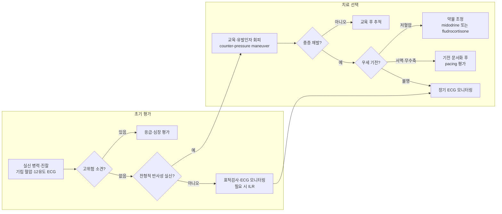

# 반사성 실신 Reflex Syncope, Neurally Mediated Syncope

<!-- 편집 메모: ESC의 Syncope and cardiovascular autonomic disorders 가이드라인은 2027년 발간 예정. 발표 후 2018 ESC syncope 및 2021 ESC pacing 인용·권고를 재검토할 것. -->

## <mark style="color:green;">일반 사항</mark>

* 실신 : 일시적인 전뇌 관류 저하로 갑자기 발생하며, 지속 시간이 짧고 자발적·완전하게 회복되는 일시적 의식 소실 (☞ [실신](syncope.md))
* 반사성 실신 : 자율신경 반사에 의한 부적절한 혈관 확장(vasodepression) 및/또는 심한 서맥·무수축(cardioinhibition)으로 동맥압과 뇌 관류가 일시적으로 감소하여 발생하는 실신
* 가장 흔한 형태는 혈관미주신경성 실신(vasovagal syncope, VVS)이며, 상황 실신과 목동맥굴증후군도 포함됨
* 뇌전증 발작, 심인성 가성실신(psychogenic pseudosyncope), 저혈당, 중독, 두부 외상 및 심장성 실신 등 다른 일시적 의식 소실 원인과 감별해야 함
* 병태생리 : 다양한 구심성 자극과 중추 자율신경 조절 이상 → 교감신경성 혈관수축 소실 및/또는 과도한 미주신경 활성 → 혈압 저하와 서맥·무수축 → 일시적 뇌 관류 저하

### <mark style="color:orange;">유발 요인 및 취약 조건</mark>

* 탈수, 장시간 기립, 고온·혼잡한 환경
* 통증·정서 자극(공포, 놀람, 채혈·주사 등)
* 피로, 금식, 음주
* 기저 저혈압 상태, 임신

## <mark style="color:green;">종류</mark>

#### <mark style="color:$primary;">혈관미주신경성 실신 Vasovagal Syncope(VVS), Neurocardiogenic Syncope</mark>

* 가장 흔한 반사성 실신
* 유발 인자 : 불쾌한 광경·소리·냄새, 공포, 통증, 채혈·주사 등 의료 시술, 장시간 기립, 고온·혼잡한 환경, 운동 직후(post-exertional)
  * ※ 운동 중(exertional) 실신은 심장성 실신의 Red Flag이므로 반사성 실신으로 간주하지 말고 심장 원인을 우선 배제
* 전조 증상 : 어지럼, 열감 또는 냉감, 구역, 창백, 발한, 시야 흐림·축소, 청각 변화
* 실신 후 피로·구역이 남을 수 있으며, 의식 소실 후 짧고 불규칙한 근간대성 움직임이 나타날 수 있음(convulsive syncope)
  * 지남력은 대개 신속히 회복함. 수 분 이상 지속되는 혼돈, 의식 회복 전부터 시작하는 규칙적 강직간대운동, 측면 혀 깨물기 등은 뇌전증 발작을 더 시사

#### <mark style="color:$primary;">상황 실신 Situational Syncope</mark>

* 특정 행위 중 또는 직후 반복되는 반사성 실신
* 유발 인자 : 기침, 재채기, 큰 웃음, 배뇨, 배변, 삼킴·식도 자극, 내장 통증, 운동 직후, 부는 악기 연주, 역도 등
* 같은 상황에서 반복된 병력이 진단에 도움을 주지만, 전조 증상은 짧거나 없을 수 있음
* 기침 원인 치료, 배뇨 시 앉은 자세 등 유발 상황에 맞춘 대처를 병행

#### <mark style="color:$primary;">목동맥굴증후군 Carotid Sinus Syndrome(CSS)</mark>

* 주로 40세 이후에서 발생하며 머리 회전, 면도, 목을 조이는 옷 등 목동맥굴 압박과 연관될 수 있음
* 단순 목동맥굴 과민반응(carotid sinus hypersensitivity)과 달리, 진단을 위해서는 목동맥굴 마사지 중 평소의 실신·전실신 증상이 재현되어야 함

#### <mark style="color:$primary;">비전형적 반사성 실신 Atypical Forms</mark>

* 뚜렷한 유발 인자나 전형적인 전조가 없을 수 있으므로, 다른 원인을 충분히 배제하고 유사한 반사 기전이 검사에서 재현될 때 진단

### <mark style="color:$danger;">🚩 Red Flags</mark>

**<mark style="color:$danger;">즉각 조치 또는 의뢰</mark>**

* 운동 중 또는 누운 자세에서 발생한 실신
* 실신과 동시에 발생한 흉통, 지속적인 심계항진, 호흡곤란 또는 저산소증
* 회복 후에도 지속되는 의식 변화, 국소 신경학적 이상, 심한 두통
* 지속적인 저혈압·서맥·빈맥 또는 활동성 출혈·심한 빈혈·폐색전증 의심
* 중증 두부 외상이나 기타 심각한 손상 동반
* Mobitz II형 또는 3도 방실차단, 지속성 심실빈맥, 명백한 허혈성 변화 등 즉각적인 처치가 필요한 ECG 이상

※ 운동 직후 실신은 반사성 실신 또는 운동 후 저혈압일 수 있으나, 운동 중 발생했거나 흉통·심계항진·비정상 ECG·구조적 심질환·돌연사 가족력이 동반되면 심장성 원인을 우선 평가

**<mark style="color:$warning;">당일 의뢰 또는 신속한 평가</mark>**

* 앉은 자세에서 갑자기 발생하거나 전조 증상 없이 발생한 실신
* 알려진 구조적 심질환·심부전 또는 이전 심근경색
* 실신 당시 갑작스러운 심계항진
* 젊은 연령의 돌연사 가족력 또는 Long QT syndrome, Brugada syndrome, CPVT 등 유전성 부정맥 가족력
* 명백한 QT 연장·단축, pre-excitation(WPW), bifascicular block 또는 기타 유의한 전도장애, type 1 Brugada pattern 등 비정상 ECG
* 첫 실신이거나 이전과 양상이 달라졌으며 반사성 실신으로 확신하기 어려운 경우

**<mark style="color:$info;">외래 평가 및 추적</mark>**

* 전형적인 유발 상황과 전조가 있으나 실신이 반복되거나 일상생활·직업에 지장을 주는 경우
* 외상 위험이 높거나 전조가 짧아 안전한 자세를 취하기 어려운 경우
* 혈압강하약·이뇨제·질산염·향정신성 약물 등 약물 관련 저혈압이 의심되는 경우
* 동반된 기립불내성 또는 낙상이 반복되는 경우

## <mark style="color:green;">진단</mark>

### <mark style="color:orange;">초기 평가</mark>

* 환자 및 목격자의 상세한 병력 : 발생 자세와 활동, 유발 인자, 전조, 의식 소실 시간, 움직임, 피부색, 회복 양상, 외상, 과거 실신, 복용약, 심장질환 및 돌연사 가족력
* 신체진찰 : 심혈관·신경학적 진찰과 표준화된 기립 혈압·맥박 측정
  * 5분 이상 누운 자세에서 안정 후 기준 혈압·맥박을 측정하고, 기립 후 약 1분과 3분에 반복 측정
  * 지연성 기립성 저혈압 또는 POTS가 의심되면 5~10분까지 연장. Initial OH는 일반 커프 혈압계로 놓칠 수 있으므로 의심되면 beat-to-beat monitoring 고려
  * 양팔 혈압은 첫 평가에서 대동맥·쇄골하동맥 질환 등이 의심되거나 유의한 차이가 확인될 때 비교
* 12유도 ECG : 모든 실신 환자의 초기 평가에서 시행
* 전형적인 병력, 정상 진찰·기립 혈압·ECG로 반사성 실신이 매우 유력하고 고위험 소견이 없으면 추가검사 없이 교육과 생활요법을 시작할 수 있음

### <mark style="color:orange;">적응증에 따른 추가 검사</mark>

* 심초음파 : 기존 심질환, 심잡음, 비정상 ECG 또는 구조적 심질환 의심 시
* 지속 ECG 모니터링 : 고위험 환자에서 부정맥성 실신이 의심될 때
* Holter 또는 외부 loop recorder : 검사 기간 안에 증상이 재발할 가능성이 충분히 높은 경우
* 운동부하검사 : 운동 중 또는 운동 직후 실신
* Implantable loop recorder(ILR) : 재발성·중증 원인 불명 실신에서 부정맥 가능성이 있고, 재발 시 특정 치료로 이어질 수 있는 경우
* 표적 혈액검사 : 출혈 의심 시 CBC, 대사 이상 의심 시 혈당·전해질·신기능, 심근허혈 의심 시 troponin, 폐색전증 의심 시 D-dimer 등
* 뇌 CT/MRI·EEG : 단순 실신에서는 routine 시행하지 않음. 국소 신경학적 이상, 지속적 의식 변화, 두부 외상 또는 뇌전증 의심 등 별도 적응증이 있을 때 시행
* 경동맥 초음파 : 전형적인 실신 평가 목적으로 routine 시행하지 않음. 경동맥 질환 자체가 의심되거나 목동맥굴 마사지 전 고도 협착 가능성을 평가해야 할 때 고려
* Dix-Hallpike 검사 : 실신 검사가 아니라 체위 변화로 유발되는 회전성 현훈이 주증상일 때 BPPV 감별 목적으로 시행(☞ [어지럼증](020_-dizziness.md#dix-hallpike-test))

#### <mark style="color:$primary;">Head-up Tilt-table Test</mark>

* 병력으로 반사성 실신이 의심되지만 확진되지 않은 경우, 지연성 기립성 저혈압·POTS 평가 또는 심인성 가성실신 감별에 고려
* 양성 반응은 VVS를 단독으로 확진하기보다 저혈압 감수성(hypotensive susceptibility)과 cardioinhibitory/vasodepressor 반응을 확인하는 자료로 해석
* cardioinhibitory 양성 반응은 자발성 무수축 실신을 예측하는 데 도움이 되지만, vasodepressor·mixed 또는 음성 반응도 자발성 무수축을 배제하지 못함
* 검사 결과가 치료 선택, 특히 심박동기 치료 가능성과 잔여 저혈압 성분 평가에 영향을 줄 때 유용

#### <mark style="color:$primary;">Carotid Sinus Massage(CSM)</mark>

* 적응 : 40세 초과에서 초기 평가 후에도 원인 불명이며 반사성 기전과 합당한 실신
* 방법 : ECG와 beat-to-beat 혈압을 지속 감시하고 응급 대처가 가능한 환경에서, 오른쪽·왼쪽 및 누운 자세·기립 자세에서 각각 약 10초간 시행
* carotid sinus hypersensitivity : ventricular pause ＞3초 및/또는 SBP ＞50 mmHg 감소
* carotid sinus syndrome : 위 혈역학적 반응과 함께 평소의 실신·전실신 증상이 재현된 경우
* 금기 : 최근 3개월 이내 TIA·뇌졸중·심근경색 또는 확인된 고도 경동맥 협착
  * 경동맥 잡음 자체는 절대 금기가 아니며, 잡음이 있거나 고도 협착이 의심되면 경동맥 초음파 등으로 먼저 평가

### <mark style="color:orange;">주요 감별</mark>

<table><thead><tr><th>감별 진단</th><th>주요 단서</th><th>확인·대응</th></tr></thead><tbody><tr><td>혈관미주신경성 실신</td><td>불쾌한 자극·통증·장시간 기립, 창백·발한·구역·시야 변화 등의 전조</td><td>전형적인 병력과 정상 초기 평가가 핵심</td></tr><tr><td>상황 실신</td><td>기침·배뇨·배변·삼킴 등 특정 행위 중 또는 직후 반복</td><td>유발 상황과 증상의 시간적 연관성 확인</td></tr><tr><td><a href="../225_/096_-orthostatic-hypotension.md">기립성 저혈압</a></td><td>기립 후 지속적인 혈압 감소와 기립불내성</td><td>표준 기립 혈압 측정. Initial OH는 필요 시 beat-to-beat monitoring</td></tr><tr><td><a href="../225_/096_-orthostatic-hypotension.md">식후저혈압</a></td><td>주로 고령자·자율신경기능장애 환자에서 식후 일정 시간이 지나 증상과 혈압 감소</td><td>식전·식후 혈압 평가. 삼킴과 동시에 발생하는 상황 실신과 구분</td></tr><tr><td>심장성 실신</td><td>심폐질환, 비정상 ECG, 운동 중·누운 자세 실신, 전조 없는 돌발 실신</td><td>고위험도에 따라 응급 평가·심장검사</td></tr><tr><td>뇌전증 발작</td><td>지속적 발작 후 혼돈, 측면 혀 깨물기, 의식 소실 전부터 시작한 규칙적 강직간대운동</td><td>임상적으로 의심될 때 신경학적 평가·EEG</td></tr></tbody></table>

### <mark style="color:orange;">진단 및 치료 알고리듬</mark>



## <mark style="background-color:$warning;">Management</mark>

### <mark style="color:orange;">치료 원칙</mark>

* 진단과 양성 경과를 설명하고 재발 가능성, 유발 인자, 전조 증상 및 대처법을 교육하는 것이 모든 환자의 1차 치료
* 드물고 경증인 전형적 반사성 실신에는 보통 약물이나 추가검사가 필요하지 않음
* 외상, 운전·위험 직업, 짧거나 없는 전조, 잦은 재발 등 중증도를 평가하고 안전 대책을 함께 마련
* 응급실 관찰·입원 여부는 나이가 아니라 고위험 소견, 중증 동반질환·외상 및 긴급 검사·치료 필요성에 따라 결정

### <mark style="color:orange;">기전 기반 치료</mark>

* 저혈압 우세형 : 혈압강하 약물 조정 → 수분·식염 및 물리적 대처 → 선별적으로 midodrine 또는 fludrocortisone
* 서맥·무수축 우세형 : 증상과 서맥·무수축의 연관성을 ILR·CSM·tilt test 등으로 확인 → 선별적으로 dual-chamber pacemaker 고려
* 기전 불명 또는 전조 없는 재발성 실신 : 경험적 침습 치료보다 장기 ECG 모니터링 등으로 기전 확인
* 혈관확장과 cardioinhibition이 함께 있는 경우 한 가지 치료만으로 재발을 완전히 예방하지 못할 수 있음을 설명

## <mark style="color:green;">비-약물 치료 및 예방</mark>

* 유발 인자와 취약 조건을 파악하고 탈수·고온·혼잡한 환경·장시간 기립·과음을 피함
* 고혈압·심부전·신장질환이 없는 저혈압 경향 환자에서 수분 ≥2 L/day 및 식염 6~9 g/day 정도를 개별적으로 고려
  * 식염과 나트륨 양을 혼동하지 않도록 하고, 임신부·고령자·고혈압 환자는 혈압과 동반질환에 따라 조정
* 전조 증상이 시작되면 즉시 앉거나 눕고 다리를 올리며, 가능하면 counter-pressure maneuver를 지체 없이 시행
* 물 500 mL의 빠른 섭취는 예상되는 유발 상황 전 또는 임박한 저혈압 증상에서 보조적으로 고려할 수 있으나, 안전한 자세를 취하는 행동을 지연시키지 않음
* 규칙적인 유산소·근력 운동을 권장하되, 전조 시 시행하는 등척성 counter-pressure maneuver와 구분
* tilt training은 동기가 높은 반복성 VVS 환자에서 선택적으로 시도할 수 있으나 순응도가 낮고 임상적 유효성 근거가 제한적
* 혈압강하제, 이뇨제, 질산염, 일부 향정신성 약물 등 저혈압 유발 약물을 검토하고 적응증·혈압을 고려하여 감량·변경을 검토
* 압박 스타킹은 일반적인 VVS에서 재발 예방 효과가 입증되지 않음
  * 2025 COMFORTS-II에서 허벅지 길이 25~30 mmHg 압박 스타킹은 VVS 재발을 유의하게 줄이지 못함
  * 동반된 기립성 저혈압·기립불내성 또는 장시간 기립이 주된 유발 인자인 저혈압 우세형에서만 선택적으로 고려. 복부 바인더·허리 높이 압박의 VVS 재발 예방 효과는 아직 확립되지 않음
* 채혈·주사는 가능하면 누운 자세에서 시행하고, 전조가 짧거나 반복되는 환자는 운전·고소 작업·수영 등 위험 활동을 진단과 증상 조절 전까지 피하도록 개별적으로 안내

#### <mark style="color:$primary;">Counter-pressure Maneuver</mark>

* 전구 증상을 인지할 수 있는 VVS 환자에서 재발을 줄이는 데 유용함. 먼저 앉거나 눕고, 바로 눕기 어려운 경우 다음 동작을 시행
* Leg crossing : 다리를 교차하고 다리·복부·엉덩이 근육에 강하게 힘을 줌
* Squatting : 안전한 장소에서 쪼그려 앉음
* Handgrip : 고무공을 쥐거나 주먹을 강하게 쥠
* Arm tensing : 양손을 갈고리처럼 걸고 서로 당김
* 증상이 호전되지 않거나 악화되면 즉시 바닥에 눕고 도움을 요청

#### <mark style="color:$primary;">보완·대체 요법</mark>

* 보충제, 약초 및 동종요법이 반사성 실신 재발을 예방한다는 근거는 확립되지 않아 routine 권고하지 않음

## <mark style="color:green;">약물 치료</mark>

* 생활요법에도 외상 위험이 있는 재발성 실신이 지속될 때, 혈압 표현형·연령·동반질환과 부작용을 고려하여 선택

#### <mark style="color:$primary;">Midodrine</mark>

* 기립 유발 및 저혈압 우세형 VVS에서 가장 근거가 양호한 약물 중 하나
* POST-4 RCT와 메타분석에서 임상 재발 감소가 확인되었으나, 모든 VVS 환자에게 routine 투여하지 않음
* 국내 허가효능은 저혈압(기립성·본태성·증후성)이며, 허가 용법은 성인 1회 2.5 mg, 1일 2~3회; 증상과 혈압에 따라 최소 유효량 사용
* 마지막 복용은 앙와위 고혈압을 줄이기 위해 늦어도 취침 4시간 전. 식전 복용을 요구하는 국내 허가 근거는 없음
* 앙와위·기립 혈압, 배뇨 증상 및 신기능을 확인. 고혈압, 심한 심질환, 급성 신장염, 배뇨장애 등 국내 금기 확인
* midodrine [<mark style="color:blue;">미드론</mark>](../225_/096_-orthostatic-hypotension.md#midodrine)

#### <mark style="color:$primary;">Fludrocortisone</mark>

* 저-정상 혈압이고 주요 동반질환이 없는 비교적 젊은 환자에서 선택적으로 고려
* 연구 용량 0.05~0.2 mg/day. POST-2의 1차 결과는 통계적으로 유의하지 않았고 전체 임상 이득은 modest함
* 고혈압·심부전에서는 사용하지 않으며, 혈압·체중·부종·혈청 K⁺를 모니터링
* midodrine과 처음부터 병용하기보다 한 약제를 선택해 반응과 이상반응을 평가한 뒤 단계적으로 조정
* VVS는 국내 허가효능에 별도 명시되어 있지 않으므로, 처방 시 최신 허가사항과 급여 인정 여부를 확인
* fludrocortisone [<mark style="color:blue;">플로리네프</mark>](../225_/096_-orthostatic-hypotension.md#fludrocortisone)

#### <mark style="color:$primary;">β-blocker</mark>

* ESC 2018 : VVS에 적응증 없음(Class III, LOE A)
* ACC/AHA/HRS 2017 : 재발성 VVS가 있는 42세 이상에서 제한적으로 고려 가능(Class IIb, LOE B-NR)하나 근거가 일관되지 않음. 소아·청소년에서는 유익성 없음
* VVS 치료 목적으로 routine 처방하지 않음

#### <mark style="color:$primary;">SSRI</mark>

* 소수의 소규모 RCT와 메타분석에서 재발 감소 가능성이 보고되었으나 근거가 제한적이며 routine 권고 약물이 아님
* 기존 생활요법과 혈압 보강 치료에도 반복되는 난치성 VVS 중 anxiety sensitivity가 뚜렷하거나 실제 우울·불안장애가 동반된 선별 환자에서 고려
* fluoxetine의 효과 가능성은 추가 검증이 필요하며, paroxetine이 VVS 재발을 증가시킨다는 근거는 확립되지 않음
* VVS에 대한 표준 유지기간은 정립되지 않았으므로 일률적으로 최소 6개월을 권고하지 않음
* 실제 정신질환이 없는 환자에게 급여 목적으로 F코드를 병기해서는 안 되며, VVS 목적 처방의 국내 허가·급여 기준을 확인하고 설명
* fluoxetine <mark style="color:blue;">[푸록틴, 프로작]</mark> (☞ [항우울제](../231_/213_-antidepressants-and-anxiolytics.md))

## <mark style="color:green;">시술 및 기타 처치</mark>

#### <mark style="color:$primary;">심박동기 Pacemaker</mark>

* 심박동기는 혈관확장·저혈압을 직접 막지 못하므로 마지막 선택으로, 서맥·무수축이 실신의 주된 기전인 고도 선별 환자에서 고려
* 2021 ESC Class I 적응 : 40세 초과, 중증·예측 불가능·재발성 실신이며 다음 중 하나가 확인된 경우 dual-chamber pacemaker로 재발 감소
  * 자발성 증상 동반 asystolic pause ＞3초 또는 무증상 pause ＞6초(동정지 또는 방실차단)
  * cardioinhibitory carotid sinus syndrome
  * tilt test로 유발된 asystolic syncope
* 약물치료 무반응은 위 Class I 적응증의 필수조건이 아님
* vasodepressor 우세형에서는 효과가 제한적임. Mixed CSS도 저혈압 성분이 클수록 pacing 후 재발 위험이 높으므로 개별 평가
* 40세 이하에서는 근거가 부족하며 예외적인 환자에서 전문적으로 판단

#### <mark style="color:$primary;">Cardioneuroablation(CNA)</mark>

* 심장 내재 자율신경계의 신경절총(ganglionated plexi, GPs)을 표적으로 고주파 절제하여 과도한 심장 미주신경 효과를 감소시키는 시술
* 2024 EHRA/HRS/APHRS/LAHRS 과학선언이 발표되었으나 확립된 표준치료나 일반적 지침 적응증은 아님
* 소규모 RCT는 sham-controlled가 아니며, 대규모 맹검 연구·장기 안전성 자료와 환자 선택·절제 부위·종료 기준의 표준화가 부족
* 지속적인 심박수 증가·증상성 동성빈맥, 혈관 접근·심낭·전도계·관상동맥·횡격신경 손상 및 혈전색전 등 심방 절제술 관련 합병증 가능
* 단순히 심박동기를 거부한다는 이유만으로 시행하지 않음. 충분한 자율신경검사와 장기 ECG에서 asystolic bradycardic phenotype이 확인된 고도 선별 환자에서 경험 많은 전문센터의 임상시험 또는 충분한 공동의사결정하에 제한적으로 고려

***

### <mark style="color:red;">질병코드</mark>

R55.0 혈관미주신경성 실신

R55.8 기타 실신 및 허탈

***

## <mark style="color:purple;">처방례</mark>

> **처방례 1.** 저혈압·기립 유발형 재발성 VVS — 생활요법 후에도 지속
>
> ```
> 미드론 2.5 mg/T  1T  bid~tid  (활동 시간대 복용; 마지막 복용은 취침 4시간 전까지)
> ※ 앙와위·기립 혈압과 배뇨 증상 확인. 수분·식염 섭취 및 counter-pressure maneuver 교육 병행
> ```

> **처방례 2.** 저-정상 혈압의 재발성 VVS — midodrine 대안
>
> ```
> 플로리네프 0.1 mg/T  0.5T  조식 후  (반응에 따라 1T으로 조정 고려)
> ※ 혈압·체중·부종·혈청 K⁺ 모니터링. 고혈압·심부전 환자에는 사용하지 않음
> ```

> **처방례 3.** 고도 선별된 난치성 VVS — anxiety sensitivity 또는 실제 우울·불안장애 동반
>
> ```
> 푸록틴 10 mg/T  1T  조식 후  (반응·내약성에 따라 개별 조정)
> ※ VVS에 대한 비허가(off-label) 처방이며 routine으로 사용하지 않음. 기대효과의 불확실성·이상반응·동반 우울·불안장애를 검토하고 환자와 상의하여 제한적으로 고려. 치료기간은 반응과 동반 정신질환에 따라 개별화
> ```

***

### <mark style="color:$success;">핵심 복약 지도</mark>

> **미드론 Midodrine**
>
> * 낮 동안 기립 시 혈압을 유지하도록 돕는 약입니다. 음식과 관계없이 처방된 시간에 복용할 수 있습니다.
> * 통상 활동 시간대에 3~4시간 간격으로 복용하며, **마지막 복용은 취침 4시간 전까지**로 제한하십시오.
> * 복용 직후 장시간 눕는 상황을 피하고, 누운 자세와 선 자세의 혈압을 확인하십시오.
> * 두피 가려움, 저림, 소름·입모, 배뇨 곤란이 나타날 수 있습니다. 증상이 심하거나 발진·얼굴 부종·호흡곤란이 동반되면 복용을 중단하고 진료받으십시오.
> * 고혈압, 심장질환, 전립선·배뇨장애 또는 신장질환이 있으면 미리 알리십시오.

> **플로리네프 Fludrocortisone**
>
> * 체내에 나트륨과 수분을 보유하여 혈압을 올리는 데 도움을 줄 수 있습니다.
> * 부종, 빠른 체중 증가, 두통 또는 혈압 상승이 있으면 진료받으십시오.
> * 정기적으로 혈압·체중과 혈청 K⁺를 확인해야 합니다.

> **실신 전구 증상 발생 시**
>
> * 즉시 앉거나 눕고 다리를 심장보다 높게 올리십시오.
> * 바로 누울 수 없다면 다리를 교차하고 다리·복부·엉덩이에 힘을 주거나, 쪼그려 앉거나, 양손을 맞잡아 서로 당기십시오.
> * 물 500 mL를 빠르게 마시는 것은 보조적으로 도움이 될 수 있지만, 안전한 자세를 취하는 일을 늦추지 마십시오.
> * 증상이 호전되지 않거나 흉통·두근거림·호흡곤란이 동반되면 즉시 도움을 요청하십시오.

> **생활 습관 안내**
>
> * 고혈압·심부전·신장질환이 없다면 하루 물 2 L 이상과 적절한 식염 섭취를 개별적으로 고려하십시오.
> * 더운 환경, 장시간 기립, 탈수, 과음 및 금식을 피하십시오.
> * 규칙적인 유산소·근력 운동을 하되 운동 중 실신·흉통·심계항진이 있으면 즉시 중단하고 진료받으십시오.
> * 압박 스타킹은 일반적인 혈관미주신경성 실신의 재발을 막는 표준치료가 아닙니다. 기립성 저혈압·기립불내성이 동반된 경우에만 의료진과 상의하여 사용하십시오.

***

### <mark style="color:blue;">환자 안내서</mark>


**혈관미주신경성 실신은 유발 상황과 전조 증상을 알고 대처하는 것이 핵심입니다**

전형적인 혈관미주신경성 실신은 대부분 심각한 심장질환과 무관하지만, 처음 발생했거나 양상이 달라진 경우에는 다른 위험한 원인이 없는지 평가해야 합니다.


#### <mark style="color:$primary;">혈관미주신경성 실신이란 무엇인가요?</mark>

* 긴장·통증·채혈·장시간 기립·더운 환경 등에서 일시적으로 혈압이 떨어지고 때로는 맥박도 느려져 의식을 잃는 현상입니다.
* 의식을 잃기 전 어지럼, 식은땀, 창백, 구역, 열감, 시야 흐림·축소 같은 전조 증상이 흔합니다.
* 의식은 대부분 짧은 시간 안에 저절로 완전히 회복됩니다. 회복 후에도 혼돈이 오래 지속되면 다른 원인을 확인해야 합니다.

#### <mark style="color:$primary;">전조 증상이 느껴지면 즉시 이렇게 하세요</mark>

* **즉시 앉거나 눕고 다리를 올립니다.** 가장 중요한 조치입니다.
* 바로 누울 수 없다면 **다리를 교차하여 하체에 힘을 주거나, 쪼그려 앉거나, 양손을 맞잡아 서로 당기십시오.**
* 물 500 mL를 빠르게 마시는 것은 보조적으로 도움이 될 수 있지만, 눕거나 앉는 일을 늦추지 마십시오.
* 채혈·주사 등이 예정된 경우 미리 수분을 섭취하고 누운 자세에서 시술받으십시오.

#### <mark style="color:$primary;">생활 속 실천 사항</mark>

* 고혈압·심부전·신장질환이 없다면 충분한 물과 적절한 식염 섭취에 관해 의료진과 상의하십시오.
* 더운 환경, 장시간 서 있기, 탈수, 과음 및 빈속 등 자신의 유발 요인을 파악하고 피하십시오.
* 규칙적인 유산소·근력 운동을 하십시오.
* 압박 스타킹은 모든 혈관미주신경성 실신 환자에게 필요한 치료가 아닙니다. 기립성 저혈압·기립불내성이 동반된 경우에만 의료진과 상의하십시오.
#### <mark style="color:$primary;">이럴 때는 즉시 응급 평가가 필요합니다</mark>

* 운동 중 또는 누워 있을 때 실신한 경우
* 실신과 함께 흉통·지속적인 두근거림·호흡곤란이 나타난 경우
* 의식이 신속히 완전히 회복되지 않거나 팔다리 힘 빠짐·말 어눌함 등 신경학적 증상이 남는 경우
* 실신으로 머리를 다치거나 심한 출혈·외상이 발생한 경우
* 심장질환이 있거나 젊은 나이에 돌연사한 가족이 있는 경우

#### <mark style="color:$primary;">반복되면 진료받으세요</mark>

* 전조 없이 갑자기 쓰러지거나 이전과 다른 양상으로 발생하는 경우
* 실신이 반복되어 운전·직업·일상생활에 영향을 주는 경우
* 새 약을 시작하거나 혈압약 용량을 변경한 뒤 발생한 경우
