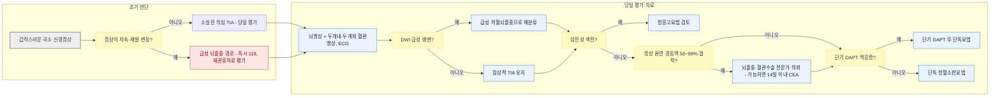

# 일과성 뇌허혈발작 Transient Ischemic Attack, TIA

## <mark style="color:green;">일반 사항</mark>

* 급성 경색 없이 뇌·망막·척수의 국소 허혈로 발생하는 일시적 신경 기능 이상
* 증상은 통상 수 분\~1시간 이내 완전히 회복됨; 지속시간으로 TIA와 뇌경색을 구분하지 않음
* 의의: 뇌졸중의 전조 증상일 수 있음
  * 뇌졸중 환자의 7\~40%에서 TIA의 과거력이 있음
  * TIA 환자의 4\~10%에서 48시간 내, 10\~20%에서 3개월 내 뇌졸중 발생 (치료 전 자연 경과 기준; 조기 집중 치료 시 3개월 위험 5% 이하로 감소 가능)
  * 신속 TIA 진료 체계에서 평가·치료받은 코호트에서는 뇌졸중 발생이 2일 1.5%, 7일 2.1%, 90일 3.7%, 1년 5.1%로 과거 알려진 발생율보다 낮음 \[TIAregistry.org, NEJM 2016]
* 조치
  * 증상이 지속되거나 재발·변동하면 지속 시간이나 혈압에 관계없이 급성 뇌졸중으로 간주하여 즉시 119 및 뇌졸중 대응체계 가동
  * 증상이 완전히 소실된 TIA 의증도 응급질환으로 취급하여 당일 응급실 또는 24시간 이내 신속 TIA 진료체계에서 평가
  * 낮은ABCD² 점수만으로 평가의 긴급성을 낮추거나 외래 추적만 시행하지 않음
* 증상이 완전히 소실되었더라도 MRI DWI(확산강조영상)에서 해당 급성 허혈 병변이 확인되면 TIA가 아니라 급성 허혈뇌졸중으로 재분류
* MRI DWI가 음성이어도 임상적으로 합당한 TIA를 배제할 수 없음

## <mark style="color:green;">원인</mark>

* 경동맥 또는 척추 동맥의 죽상경화증
* 두개내 동맥 죽상경화(ICAS) : 한국 등 동아시아인에서 비중이 높음
* 소혈관 질환(small vessel disease), 심방세동·심근경색·판막질환 등에 의한 심인성 색전
* 경동맥·척추동맥 박리, 동맥염, 기타 혈관병증
* 대동맥궁 죽상경화, 난원공 개존(PFO)을 통한 역설 색전 (주로 18\~60세의 원인불명 색전성 사건에서 고려하며, PFO가 발견되었다는 사실만으로 원인으로 단정하지 않음)
* 모야모야병 : 소아·젊은 성인의 반복 TIA; 과호흡(울음·악기 연주 등)으로 유발되는 증상이 특징적
* 응고 항진: 항인지질항체증, 활동성 암, 임신·산후기, 경구 피임제 등
  * protein C/S·antithrombin 결핍 등 유전성 thrombophilia는 동맥성 TIA의 흔한 원인이 아니므로 젊은 환자, 반복 혈전·가족력 등 선별된 상황에서만 평가

### <mark style="color:orange;">위험 인자</mark>

* 심장 질환 : MI, 심방세동, 판막 질환
* 고혈압, 당뇨병, 고지혈증, 비만, 수면무호흡증, thrombophilia
* 흡연

## <mark style="color:green;">임상 양상</mark>

* 갑자기 발생하여 처음부터 최대인 국소 신경학적 결손이 전형적이며, 운동·감각·언어·시각 기능의 소실과 같은 음성 증상이 흔함
* 얼굴 또는 사지의 편측 근력 저하·감각 저하, 발음 또는 언어 장애, 시야 장애
* 경동맥 영역: 일과성 단안시력소실(amaurosis fugax), 반대쪽 편마비·반신감각저하, 실어증
* 척추뇌바닥동맥 영역: 복시, 구음장애, 연하곤란, 안면 또는 교차성 감각·운동 결손, 시야결손, 비체위성 현훈과 운동실조·보행 또는 체간 불안정, 심한 구역·구토
  * 후순환 허혈은 반드시 양측 증상으로 나타나는 것은 아니며, 단독 어지럼은 흔히 비허혈성이지만 동반 국소 신경증상이 있으면 긴급 평가
* limb-shaking TIA : 기립·체위 변화 시 반복되는 편측 사지의 불수의적 떨림; 고도 경동맥 협착에 의한 혈류역학적 TIA로 국소 발작과 혼동 주의
* capsular warning syndrome : 짧은 간격으로 반복되는 순수 운동·감각 증상; 열공성 경색으로 진행 위험이 높음

### <mark style="color:$danger;">🚩 Red Flags!</mark>

<mark style="color:$danger;">**즉각 조치**</mark>

* 진료 시점에 국소 신경학적 결손이 지속되거나 재발·변동하는 경우 - 지속시간·혈압과 무관하게 급성 뇌졸중으로 간주 `급성 허혈뇌졸중` `뇌출혈`
* NIHSS가 낮더라도 실어증·시야장애·손 기능 상실 등 일상생활에 지장을 주는 결손(disabling deficit)이 남아 있는 경우 `급성 허혈뇌졸중`
* 갑자기 발생한 의식 저하 또는 혼수 `후순환 뇌졸중` `뇌출혈`
* 수 초\~1분 내 최고조에 이르는 생애 최악의 두통(thunderclap headache) `거미막하출혈`
* 갑작스러운 복시·구음장애·연하곤란 또는 심한 보행·체간 불안정 `후순환 뇌졸중` `기저동맥 폐색`
* 갑작스러운 무통성 단안 시력소실이 지속되는 경우 `망막중심동맥폐쇄` `급성 망막허혈`
* 50세 이상에서 새 두통·두피압통·턱파행과 지속되거나 진행하는 시력저하가 동반된 경우 `시력 위협 거대세포동맥염`

_✽응급성은 혈압 수치가 아니라 지속·재발·변동하는 국소 신경학적 결손으로 판단하며, 뇌영상 전 임의로 급격히 혈압을 낮추지 않음_

<mark style="color:$warning;">**당일\~수일 내 평가**</mark>

* 증상이 완전히 소실된 모든 의심 TIA (ABCD² 점수만으로 긴급성을 낮추지 않음) `TIA`
* 최근 48시간 이내 발생한 일과성 편측 운동마비 또는 언어장애 `고위험 TIA`
* ABCD² ≥4점, 다발성 또는 복합 신경증상 `고위험 TIA`
* 심방세동 동반 또는 심인성 색전 의심 `심인성 색전`
* 7일 이내 2회 이상 반복된 TIA 또는 짧은 간격으로 반복·증가하는 증상 `crescendo TIA` `capsular warning syndrome`
* 경동맥 잡음(bruit), 일과성 단안시력소실 또는 알려진 경동맥 협착 `증상성 경동맥 협착`
* 항응고제 복용 중 TIA 발생 `항응고제 치료 중 재발`
* 두경부 외상·급격한 목 움직임 후 두통/경부통, 부분 Horner 증후군 `경동맥·척추동맥 박리`
* 50세 이상에서 일과성 단안시력소실과 새 두통·두피압통·턱파행 등이 있는 경우 `거대세포동맥염`

_✽TIA에서는 이 단계의 항목도 '수일'이 아니라 당일(24시간 이내) 응급실 또는 신속 TIA 진료체계 평가를 원칙으로 함. MRI DWI에서 해당 급성 병변이 확인되면 TIA가 아니라 급성 허혈뇌졸중으로 재분류하여 관리_

<mark style="color:$info;">**조기 평가 및 추적**</mark>

* 신속 평가 완료 후에도 원인이 불명확한 경우 - 장기 심전도 모니터링 계획 수립 `잠재성 심방세동` `ESUS`
* 18\~60세에서 충분한 원인평가 후 비열공성 원인불명 허혈뇌졸중이 확인되고 PFO와의 인과성이 높다고 판단되는 경우 `PFO 연관 뇌졸중`
* 항혈소판제 복용 중 재발 - 순응도·상호작용·원인 재평가 `치료 실패`
* 체위 변화·기립 시 반복되는 편측 사지 떨림 `limb-shaking TIA` `고도 경동맥 협착`

_✽단독 어지럼·감각 증상은 TIA mimic 가능성이 높지만 후순환 허혈을 완전히 배제하지 못하므로, 임상 양상에 따라 동일한 긴급 평가 원칙 적용_

## <mark style="color:green;">진단</mark>

* 정확한 발병시각 또는 last known well, 증상의 갑작스러운 발생·최대 강도·순서·지속시간·완전 회복 여부와 목격자 진술 확인
* 활력징후, 혈당, 신경학적 검사 및 NIHSS; 증상이 소실된 뒤에도 당시의 국소 신경증상을 구체적으로 기록
* 영상검사: 가능한 한 즉시 시행하고, 원칙적으로 응급실 퇴실 전에 뇌영상과 두개내·두개외 혈관영상을 완료
  * **CT/CTA 또는 MRI DWI/MRA가 핵심 평가**: CTA는 가능하면 대동맥궁부터 두정부(vertex)까지 두경부 혈관을 함께 평가
  * 비조영 CT는 작은 급성 허혈 병변에 민감하지 않지만 출혈·종양 등 대체진단을 신속히 확인하는 데 유용
  * MRI DWI는 작은 경색과 후두개와 병변에 가장 민감하며 가능하면 24시간 이내 시행; DWI 양성이면 급성 허혈뇌졸중, 음성이어도 TIA를 배제하지 않음
* 심장검사
  * 12-lead ECG와 심전도 모니터링(telemetry); 필요 시 troponin
  * 초기 ECG가 정상이더라도 원인불명 또는 색전성 양상이면 Holter·patch monitor 등 장기 심전도 모니터링을 단계적으로 고려; 필요 시 삽입형 심전도기록계
  * 심인성 색전 의심 또는 원인불명인 경우 경흉부 심초음파, 선별적으로 경식도 심초음파
  * 18\~60세에서 다른 원인이 없는 색전성 양상이면 거품 조영 심초음파로 PFO를 평가. 충분한 원인평가 후 비열공성 PFO 연관 허혈뇌졸중으로 판단되는 경우 폐쇄술 여부를 심장내과·신경과와 논의하며, 영상 음성의 순수 TIA만으로 routine closure를 권고하지 않음
* 실험실검사: CBC, 전해질, Cr/eGFR, 혈당, HbA1c, 지질, ALT, PT/INR, aPTT
  * 50세 이상에서 일과성 단안시력소실과 새 두통·두피압통·턱파행 등이 있으면 ESR/CRP와 혈소판을 검사하여 거대세포동맥염 평가
    * 시력저하가 지속·진행하거나 시력 위협이 의심되면 즉시 안과·류마티스내과와 협진하고, 조직검사나 혈관영상 때문에 glucocorticoid 치료를 지연하지 않음
  * 유전성 thrombophilia 검사는 일률적으로 시행하지 않고 젊은 환자, 반복 혈전·강한 가족력 등 선별된 상황에서 혈액내과/혈전 전문가와 상의

**ABCD² score**

<table><thead><tr><th width="109">항목</th><th width="307">조건</th><th width="76" align="center">배점</th></tr></thead><tbody><tr><td>연령</td><td>≥60세</td><td align="center">1</td></tr><tr><td>혈압</td><td>SBP ≥140 ㎜Hg 또는 DBP ≥90 ㎜Hg</td><td align="center">1</td></tr><tr><td>임상 특징</td><td>편측 국소 약화 증상</td><td align="center">2</td></tr><tr><td></td><td>약화 증상 없는 언어장애</td><td align="center">1</td></tr><tr><td>지속 시간</td><td>≥60분</td><td align="center">2</td></tr><tr><td></td><td>10~59분</td><td align="center">1</td></tr><tr><td>당뇨병</td><td>있음</td><td align="center">1</td></tr></tbody></table>

▶ 의의 : TIA 후 48시간 내의 뇌졸중 발생 위험도 추정; 고위험 TIA 분류 기준으로 활용

▶ 역사적 2일 위험 추정치: 0\~3점 약 1.0%, 4\~5점 4.1%, 6\~7점 8.1% \[Johnston SC, et al. Lancet 2007;369:283-292 (점수 개발·검증 코호트)]. 원 개발·검증 코호트의 추정치이므로 현대의 신속 평가·치료 환경에서 개인의 절대위험으로 그대로 적용하지 않음

▶ 주의: **ABCD²는 종합 평가의 한 요소이며 응급성·입원 여부를 단독으로 결정하지 않음.** 33개 연구 16,070명의 메타분석에서 0\~3점/4\~7점 절단값의 7일 뇌졸중 예측 민감도는 0.89, 특이도는 0.34로 판별력이 제한적이었으며, 기저 위험 5% 가정 시 ABCD² ＞3점은 7일 위험을 절대치로 2.0%만 높이고 ≤3점은 2.9%만 낮추는 데 그침 \[Sanders LM, et al. Neurology 2012;79:971-980]. 낮은 점수에서도 심방세동·경동맥 협착·후순환 허혈을 놓칠 수 있음. DWI 양성은 고위험 TIA가 아니라 급성 허혈뇌졸중이므로 NIHSS, 심인성 여부, 출혈 위험 등을 기준으로 치료 결정

▶ 반복 TIA, DWI 병변 및 증상 관련 동맥협착을 반영한 ABCD³-I 같은 영상결합 도구가 ABCD²의 위험 예측을 보완할 수 있으나, 어떤 점수도 긴급 뇌·혈관영상과 전문평가를 대체하지 않음

_<mark style="color:$info;">Ref. Johnston SC, et al. Lancet 2007;369:283-292 (점수 개발 및 2일 위험 추정치); Tsivgoulis G, et al. Multicenter external validation of the ABCD2 score in triaging TIA patients. Neurology 2010;74(17):1351-1357; Sanders LM, et al. Neurology 2012;79:971-980 (메타분석, 판별력 한계)</mark>_

### <mark style="color:orange;">감별</mark>

* Brain tumor : 점진적으로 진행하는 지속적 신경학적 결손, 발작 동반 가능
* CNS 감염(뇌염, 수막염) : 발열, 두통, 혼란, 경부 강직, 구역/구토, 광선 공포, 정신 상태 변화
* 낙상/외상 : 두통, 혼란, 멍듦
* 저혈당 : 혼란, 약함, 발한
* 대사성 뇌병증·전해질 이상(특히 저나트륨혈증): 혼돈·의식 변화 등 전반적 증상이 흔하며, 특정 혈관영역에 합당한 갑작스러운 국소 음성 증상은 덜 전형적
* 편두통 aura: 수 분에 걸쳐 퍼지는 양성 시각현상 또는 이동하는 감각증상, 이후 두통; TIA는 대개 갑자기 최대가 되는 음성 증상
* 다발경화증 : 복시, 사지 약화, 둔감증, 소변 저류, 시신경염
* 발작 장애: 증상의 march, 국소 경련, 이후 혼돈·Todd 마비, 요실금, 혀 깨물기
* SAH : 갑자기 발생, 광선 공포증을 동반한 심한 두통
* 현훈: 어지럼(±난청), 발한; 두통·복시·구음장애·운동실조가 동반되면 중추성 의심
  * HINTS/HINTS Plus는 지속적인 급성 전정증후군과 자발안진이 있는 환자에서 숙련자가 시행하는 검사이며, 이미 소실된 일시적 어지럼이나 모든 현훈 환자에게 적용하지 않음
* 실신·전실신: 전반적 뇌관류 저하에 의한 의식 소실/아찔함; 국소 신경결손이 없는 경우가 일반적
* 일과성 전기억상실(transient global amnesia): 수 시간 지속되는 전향기억 형성 장애와 반복 질문이 특징이며, 일반적으로 국소 신경학적 결손은 없음

***



<p align="center"><strong>진단 및 초기 치료 알고리듬</strong></p>

<p align="center"><em>심인성 색전원 평가와 두개내·두개외 대혈관 평가는 상호 배타적이지 않으며 병행한다. 조기 CEA가 예상되면 DAPT 선택과 수술 전 중단 시점을 시술팀과 조율한다.</em></p>

<p align="center"><em><mark style="color:$info;">Ref. Amin HP, et al. Stroke. 2023;54:e109-e121; Prabhakaran S, et al. 2026 Guideline for the Early Management of Patients With Acute Ischemic Stroke. Stroke. 2026</mark></em></p>

***

## <mark style="background-color:$warning;">Management</mark>

### <mark style="color:orange;">치료 방침</mark>

* 급성기 뇌졸중 발생 가능성에 대하여 주의 관찰, 필요시 입원 관찰
* 증상과 같은 쪽의 경동맥 50\~99% 협착이 확인되면 지체 없이 뇌졸중·혈관수술 전문가에게 의뢰
  * 적응증이 되는 환자에서는 CEA(경동맥 내막절제술)를 가능한 조기에, 이상적으로 14일 이내 시행
  * 남성 50\~99%, 여성 70\~99% 증상성 협착에서 CEA 권고; 여성 50\~69%는 재발위험·동반질환·수술위험을 고려하여 선별
  * 70세 초과이면서 수술 가능한 환자는 CAS보다 CEA를 우선; CAS는 CEA 고위험 또는 해부학적으로 부적합한 선별 환자에서 고려
  * 조기 CEA가 예상되면 DAPT의 선택과 수술 전 중단 시점을 시술팀과 조율
* 기저 질환 및 위험 인자 관리: 당뇨병, 고혈압, 이상지질혈증, 비만, 심장 질환, 수면무호흡증
  * 장기 혈압 목표는 대체로 ＜130/80 ㎜Hg이나 급성기 혈압 처치와 구분하고 환자별로 조정
  * 지속되는 국소 신경학적 결손은 급성 뇌졸중 경로로 이송하며, 급성기 혈압관리는 재관류치료 여부와 고혈압 응급질환 동반 여부에 따라 뇌졸중 프로토콜로 결정. 외래에서 임의로 급격히 낮추지 않음
* 재발 방지를 위하여 항혈소판/항응고 치료, 생활 습관 교정
* 추적 관찰: 퇴원 후 가능한 한 48시간 이내, 늦어도 1주 이내 전문진료; 초기 1\~3개월은 집중 추적하고 이후 안정적이면 간격 확대

## <mark style="color:green;">비-약물 치료 및 예방</mark>

* 금연
* 적정 체중 유지
* 급성 평가 완료 후 기능과 심혈관 상태에 맞추어 규칙적 신체활동: 중등도 유산소운동 주 150분 또는 고강도 주 75분을 목표로 단계적으로 시행 (☞ [운동 지침](../231_/216_-physical-activity-guideline.md))
* 식이 : DASH 또는 지중해식 식단 — 과일, 야채, 통곡물, 저지방 유제품, 생선·견과류 권장; 술, 소금, 당분, 적색육·가공육 제한 \[AHA/ASA 2021] (☞ [식이 지침](../231_/217_-nutritiondiet-guideline.md))
* 절주
* 수면무호흡증 선별 및 진단 시 치료 고려 \[AHA/ASA 2021]

## <mark style="color:green;">약물 치료</mark>

### <mark style="color:orange;">Antiplatelet therapy</mark>

* 비심인성 TIA에 적용 (☞ [항혈전제](../231_/214_-anti-thrombotics-anti-coagulants.md#antiplatelet))
* 뇌출혈을 배제하고 재관류치료 대상이 아님을 확인한 뒤 가능한 한 조기에 시작(이상적으로 12\~24시간 이내)
* \[AHA/ASA 2026] 증상 발생 24시간 이내의 경미한 비심인성 허혈뇌졸중(NIHSS 0\~3) 또는 고위험 TIA(ABCD² ≥4) : clopidogrel+aspirin 21일 후 단독요법 (Class 1)
* \[AHA/ASA 2026] 정맥내 혈전용해술을 받지 않았고 죽상경화성 원인(증상 관련 두개내·두개외 동맥 ≥50% 협착 또는 대혈관 죽상경화 기원 추정 급성 경색)이 추정되는 경우, 24\~72시간에 도착한 NIHSS ≤5 뇌졸중·고위험 TIA 또는 24시간 이내 NIHSS 4\~5 뇌졸중에서도 21일 DAPT 고려 (Class 2a, INSPIRES 근거)
* \[AHA/ASA 2026] 4.5시간 이내라도 비장애성(non-disabling, 예: 순수 감각 증후군) 경증 뇌졸중에는 혈전용해술 대신 DAPT를 우선

#### <mark style="color:$primary;">단기 이중 항혈소판 요법 (DAPT, Dual Antiplatelet Therapy)</mark>

* 비심인성 고위험 TIA(ABCD² ≥4) 또는 경미한 비심인성 허혈뇌졸중(NIHSS 0\~3)에서 출혈 고위험이 아닐 때 적용
* DWI 양성은 TIA가 아니라 급성 허혈뇌졸중으로 재분류하고 NIHSS·병변 크기·출혈 위험·재관류치료 여부를 기준으로 결정
* 요양급여기준 \[HIRA 고시 제2025-15호, 일반원칙 경구용 항혈전제] : 재발성 뇌졸중·중증 뇌졸중 등 고위험군에는 항혈전제 2제 병용요법을 1년 이내 인정하나, TIA·경증 뇌졸중이 이 고위험군 정의에 명시적으로 포함되지는 않아 단기 DAPT의 급여 인정 여부는 처방 전 확인 필요

**Clopidogrel + Aspirin**

* aspirin 부하 160\~325 ㎎ + clopidogrel 부하 300 ㎎\
  → clopidogrel 75 ㎎/일 + aspirin 75\~100 ㎎/일 × 21일 <mark style="color:blue;">\[플라빅스]</mark> + <mark style="color:blue;">\[아스피린프로텍트]</mark>\
  → 이후 단독 요법으로 전환
  * 급성 aspirin 부하는 장용정이 아닌 비장용정을 씹어서 복용하는 것이 권장되며, 장용정은 흡수가 지연될 수 있으므로 유지요법에 사용
* clopidogrel 부하용량은 연구·지침에 따라 300\~600 ㎎이며, 600 ㎎은 더 빠른 항혈소판 효과와 출혈 위험을 함께 고려하여 선별적으로 사용
* 21일 단기 DAPT 후 aspirin 또는 clopidogrel 단독요법으로 전환; 장기 약제는 내약성·순응도·비용·동반질환을 고려하여 선택
* 주의
  * 열공성 뇌경색(lacunar stroke)으로 확인된 경우, 장기적 DAPT는 권고되지 않음 (출혈 위험 증가, SPS3 연구); 21일 단기 DAPT는 초급성기에 적용 가능
  * **21일 초과 clopidogrel 기반 DAPT는 특별한 적응증 없이 시행하지 않음**
  * 최근 30일 이내 증상성 두개내 주요동맥 70\~99% 협착에서는 전문진료하에 aspirin+clopidogrel을 90일까지 사용하는 예외가 있음
  * 항혈소판제를 복용 중 발생한 TIA에서는 순응도·약물상호작용과 원인을 다시 평가하며, 단순히 용량을 늘리거나 다른 약으로 바꾸는 이득은 확립되지 않음

**Ticagrelor + Aspirin - THALES 기반 요법**

* 증상 발생 24시간 이내의 경증\~중등도 비심인성 허혈뇌졸중(NIHSS ≤5), 또는 고위험 TIA(ABCD² ≥6 또는 증상 관련 두개내·두개외 동맥 ≥50% 협착)에서 출혈 위험을 고려하여 선택 가능 <mark style="color:blue;">\[브릴린타]</mark> + <mark style="color:blue;">\[아스피린프로텍트]</mark>
* ticagrelor 180 ㎎ 부하 → 90 ㎎ bid + aspirin 300\~325 ㎎ 부하 → 75\~100 ㎎/일, 총 30일 병용 후 단독 항혈소판제로 전환
* clopidogrel 기반 21일 요법보다 근거 수준이 낮고 중증 출혈이 증가할 수 있으므로 환자별 위험·이득을 평가
* 국내 허가 : 급성 허혈성 뇌졸중(NIHSS ≤5) 또는 고위험 TIA 성인 환자에서 아스피린 병용 30일 투여로 허가됨
* 요양급여기준 \[HIRA 고시 제2025-15호] : Ticagrelor 개별 급여기준(바)은 급성관상동맥증후군(90 ㎎)·심근경색 후 병용(60 ㎎)만 규정하며, 뇌졸중·TIA는 명시되어 있지 않음. 일반 병용요법 기준(나)의 고위험군(ST분절상승 심근경색·급성관상동맥증후군·재발성 뇌졸중·중증 뇌졸중·스텐트 삽입환자)에도 TIA·경증 뇌졸중은 포함되지 않아, THALES 요법의 급여 인정 여부는 불확실하므로 처방 전 확인 필요(비급여 가능성)

**CYP2C19 기능소실 변이 보유자 — CHANCE-2 기반 요법**

* 증상 발생 24시간 이내, 정맥내 혈전용해술을 받지 않은 비심인성 경미한 허혈뇌졸중(NIHSS ≤3) 또는 고위험 TIA(ABCD² ≥4) 환자에서 CYP2C19 loss-of-function allele이 확인된 경우, clopidogrel+aspirin 대신 ticagrelor+aspirin 21일 후 ticagrelor 단독요법을 90일까지 시행하는 방안을 고려할 수 있음 <mark style="color:blue;">\[브릴린타]</mark> + <mark style="color:blue;">\[아스피린프로텍트]</mark> \[AHA/ASA 2026, Class 2b]
* CHANCE-2는 중국인 집단의 근거이며, 이 조건부 권고가 모든 TIA 환자에 대한 일상적 유전자검사 또는 'clopidogrel 저항성 의심'만으로 한 일률적 약제 교체를 의미하지 않음
* ticagrelor 31\~90일 투여는 국내 허가 기간(30일)을 초과하는 허가 범위 초과 사용이며, 급여 인정 여부도 불확실하므로 전문진료하에 신중히 결정

#### <mark style="color:$primary;">장기 단독 항혈소판 요법</mark>

* DAPT 완료 후 또는 DAPT 적응증이 아닌 비심인성 TIA
* aspirin : 100 ㎎/d (장기 유지) <mark style="color:blue;">\[아스피린프로텍트]</mark>
* clopidogrel : 75 ㎎/d; aspirin 불내성/알레르기 시 <mark style="color:blue;">\[플라빅스]</mark>
* 서방형 dipyridamole/aspirin : 200/25 ㎎ bid; aspirin 또는 clopidogrel의 대안 <mark style="color:blue;">\[디피아녹스]</mark>
* cilostazol : 100 ㎎ bid <mark style="color:blue;">\[프레탈정]</mark> 또는 서방형 200 ㎎ qd <mark style="color:blue;">\[프레탈서방캡슐]</mark>; 비심인성 뇌경색 후 재발억제의 국내 허가 범위에서 aspirin/clopidogrel 사용이 어렵거나 출혈 위험을 고려하는 선별 환자의 대안
  * 두통·심계항진·빈맥에 유의하고 울혈성 심부전에서는 사용하지 않음. 제형별 복용법과 상호작용은 국내 허가사항을 확인
  * 영상 병변이 없는 순수 TIA에 사용할 때에는 국내 허가·급여기준을 별도로 확인
* aspirin, clopidogrel, 서방형 dipyridamole/aspirin, 선별 환자의 cilostazol 중 선택은 내약성·순응도·비용·동반질환을 고려

### <mark style="color:orange;">Anticoagulation therapy</mark>

* cardioembolic TIA(심방세동 등)에 적용
* 비판막성 심방세동에서는 DOAC(direct oral anticoagulant)을 warfarin보다 우선 권고
* 영상에서 경색·출혈이 없는 짧은 TIA: 뇌출혈을 배제한 뒤 선별된 환자에서는 가능한 한 조기에, 통상 24시간 이내 DOAC 시작을 고려할 수 있음
* 뇌경색이 확인된 경우 \[ELAN, NEJM 2023; OPTIMAS, Lancet 2024] : 선별된 환자에서 경증·중등도 경색은 48시간 이내, 대경색은 6\~7일째 DOAC 시작을 고려할 수 있는 근거 기반 예시. 경색 크기·임상 중증도·출혈변환·재관류치료 여부·전신 출혈위험을 함께 평가하여 시작 시점을 개별화
* 원인불명 색전성 뇌졸중(ESUS)에서 심방세동이 확인되지 않았다면 경험적 항응고요법은 권고하지 않음 \[NAVIGATE ESUS; RE-SPECT ESUS; ARCADIA]
* 용량은 Cockcroft-Gault CrCl, 연령, 체중, 출혈 위험, 약물상호작용과 국내 허가사항을 기준으로 결정
  * Cockcroft-Gault CrCl(mL/min) = \[(140−연령) × 체중(㎏)] / \[72 × 혈청 Cr(㎎/㎗)]; 여성은 ×0.85. 극단적 체중·부종에서는 적용 체중을 개별 판단
  * apixaban: 5 ㎎ bid <mark style="color:blue;">\[엘리퀴스]</mark>; 연령 ≥80세, 체중 ≤60 ㎏, 혈청 Cr ≥1.5 ㎎/㎗ 중 2개 이상이면 2.5 ㎎ bid
  * rivaroxaban: CrCl ≥50 mL/min이면 20 ㎎ qd, CrCl 15\~49 mL/min이면 15 ㎎ qd; 반드시 식사와 함께 <mark style="color:blue;">\[자렐토]</mark>
  * edoxaban: 60 ㎎ qd <mark style="color:blue;">\[릭시아나]</mark>; CrCl 15\~50 mL/min, 체중 ≤60 ㎏ 또는 특정 P-gp 억제제 병용 시 30 ㎎ qd
  * dabigatran: 150 ㎎ bid가 표준이며 고령·신기능·출혈 위험·verapamil 병용 등에 따라 국내 허가사항에 맞추어 110 ㎎ bid 고려 <mark style="color:blue;">\[프라닥사]</mark>
* warfarin : 심방세동 또는 중등도\~중증 류마티스성 승모판협착에서는 일반적으로 INR 2.0\~3.0을 목표로 용량 조절 <mark style="color:blue;">\[대화와르파린]</mark>
  * 기계판막에서는 DOAC이 아니라 warfarin을 사용하며, 목표 INR은 판막 종류·위치와 추가 혈전위험인자에 따라 결정
* 장기 경구항응고에 비가역적 금기가 있는 비판막성 심방세동에서는 경피적 좌심방이 폐색술 의뢰를 고려
* 특별한 적응증이 없으면 항응고제와 항혈소판제를 장기 병용하지 않음

### <mark style="color:orange;">Statin</mark>

* 죽상경화성 허혈뇌졸중/TIA에서는 금기가 없으면 고강도 statin을 조기에 시작. **즉시 고강도 투여가 3일 지연 투여보다 90일 뇌졸중 재발을 더 줄인다는 근거는 없음**(90일 새 뇌졸중 8.1% vs 8.4%, 유의한 차이 없음; 다만 기능적 결과 개선 가능성은 시사됨) \[INSPIRES, JAMA Neurol 2024 — 중국인 35\~80세 환자 6,100명 대상]
* 국내 KSoLA 2026에서 죽상경화성 허혈뇌졸중/TIA의 기본 LDL-C 목표는 ＜70 ㎎/㎗ 및 기저치 대비 50% 이상 감소이며, 재발성 죽상경화성 허혈뇌졸중 등 일부 고위험군에서는 ＜55 ㎎/㎗를 선택적으로 고려. 심인성 TIA 등에서는 동반 ASCVD와 전체 위험도에 따라 개별화
* 고강도 : atorvastatin 40\~80 ㎎/d <mark style="color:blue;">\[리피토]</mark>, rosuvastatin 20 ㎎/d <mark style="color:blue;">\[크레스토]</mark>. 국내에는 rosuvastatin 40 ㎎ 단일정이 없고 40 ㎎/d는 국내 허가 용량을 초과함(20 ㎎정 2정으로 투여 시에도 허가 범위 초과 사용)
* 고강도 불내성 시 : 중강도 statin으로 대체 (LDL-C 30\~49% 감소 목표); 목표 미도달 시 중강도 statin + ezetimibe 병용도 선택지 \[RACING]
* 최대 내약 statin으로 목표에 도달하지 못하면 ezetimibe, 이후 선별적으로 PCSK9 억제제 병용 고려

### <mark style="color:orange;">향후 치료</mark>

* OCEANIC-STROKE 3상시험 \[NEJM 2026;394:1467-1479] : 증상 발생 72시간 이내 등록된 비심인성 허혈뇌졸중 또는 고위험 TIA(죽상경화·혈관 플라크 또는 색전성 경색 소견 필요) 12,327명에서 표준 항혈소판치료에 factor XIa 억제제 asundexian 50 ㎎ qd를 추가했을 때 허혈뇌졸중이 감소했으며(6.2% vs 8.4%; HR 0.74, 중앙 추적 19개월), ISTH 주요출혈은 유의하게 증가하지 않았음(1.9% vs 1.7%)
* 2026년 5월 FDA 우선심사 대상으로 신약허가신청이 접수되었고 일본·중국에도 허가 신청됨; 2026년 9월 현재 어느 국가에서도 미승인인 연구약으로 국내 표준 치료나 처방례에는 포함하지 않음

***

### <mark style="color:red;">질병코드</mark>

G45 일과성 대뇌허혈발작 및 관련 증후군 – Transient cerebral ischemic attacks and related syndromes

G45.9 상세불명의 일과성 대뇌허혈발작 – Transient cerebral ischemic attack, unspecified

G45.3 일과성 흑암시 – Amaurosis fugax

***

## <mark style="color:purple;">처방례</mark>

> **처방례 1.** 고위험 TIA(ABCD² ≥4) 또는 경미한 허혈뇌졸중(NIHSS 0\~3) - clopidogrel 기반 급성기 DAPT(비심인성, 출혈 고위험이 아니며 뇌출혈·재관류치료 대상 배제 후)
>
> ```
> 아스피린 비장용정 300 ㎎  stat  첫날 부하용량(씹어서 복용)
> 플라빅스 75 ㎎/T  4T(300 ㎎)  stat  첫날 부하용량
> 플라빅스 75 ㎎/T  1T  qd  (2일째부터 21일까지)
> 아스피린프로텍트 100 ㎎/T  1T  qd  (2일째부터 21일까지)
> 리피토 40 ㎎/T  1T  qd  (죽상경화성 원인 등 고강도 statin 적응증이 있는 경우)
> ※ 21일 후 단독 요법(아스피린 또는 클로피도그렐)으로 전환, 장기 유지
> ※ 뇌출혈을 배제하고 재관류치료 대상이 아님을 확인한 뒤 가급적 12~24시간 이내 시작
> ※ 죽상경화성 원인 추정 시 24~72시간 또는 NIHSS 4~5(24시간 이내)까지 적용 가능 [AHA/ASA 2026]
> ※ 최근 30일 이내 증상성 두개내 동맥 70~99% 협착 등 특별한 적응증에서는 전문진료하에 90일까지 병용 가능
> ※ 급성 부하는 비장용 aspirin 160~325 ㎎을 씹어서 복용하는 것이 권장되며, 아스피린프로텍트 등 장용정은 유지요법에 사용
> ```

> **처방례 2.** DAPT 비대상 비심인성 TIA 또는 DAPT 완료 후 - 단독 항혈소판요법
>
> ```
> 아스피린 비장용정 300 ㎎  stat  첫날 부하용량(급성기 미투여 시, 씹어서 복용)
> 아스피린프로텍트 100 ㎎/T  1T  qd  (2일째부터 장기 유지)
> 리피토 40 ㎎/T  1T  qd  (죽상경화성 원인 등 고강도 statin 적응증이 있는 경우)
> ※ ABCD² 저점수 또는 DWI 음성만으로 긴급 평가를 생략하지 않음
> ※ 급성 부하는 비장용 aspirin 160~325 ㎎을 씹어서 복용하는 것이 권장되며, 아스피린프로텍트 등 장용정은 유지요법에 사용
> ```

> **처방례 3.** 심인성 TIA (심방세동 등) - 항응고 요법
>
> ```
> 엘리퀴스 5 ㎎/T  1T  bid
> ※ 연령 ≥80세, 체중 ≤60 ㎏, 혈청 Cr ≥1.5 ㎎/㎗ 중 2개 이상이면 2.5 ㎎ bid
> ※ 영상에서 경색·출혈이 없는 짧은 TIA는 뇌출혈 배제 후 선별된 환자에서 가능한 한 조기에, 통상 24시간 이내 시작을 고려할 수 있음
> ※ 경색이 확인되면 선별된 환자에서 경증~중등도 48시간 이내, 대경색 6~7일째 시작을 고려할 수 있으나, 경색 크기·임상 중증도·출혈변환·재관류치료 여부·전신 출혈위험에 따라 개별화
> ※ 항혈소판제와 병용하지 않음 (출혈 위험); 신기능 정기 모니터링
> ※ 기계판막 또는 중등도~중증 류마티스성 승모판협착에는 사용하지 않고 warfarin 고려
> ```

> **처방례 4.** THALES 기준을 충족하는 경증\~중등도 비심인성 허혈뇌졸중 또는 고위험 TIA - ticagrelor 기반 DAPT
>
> ```
> 브릴린타 90 ㎎/T  2T(180 ㎎)  stat  첫날 부하용량
> 아스피린 비장용정 300 ㎎  stat  첫날 부하용량(씹어서 복용)
> 브릴린타 90 ㎎/T  1T  bid  (2일째부터 30일까지)
> 아스피린프로텍트 100 ㎎/T  1T  qd  (2일째부터 30일까지)
> 리피토 40 ㎎/T  1T  qd  (죽상경화성 원인 등 고강도 statin 적응증이 있는 경우)
> ※ 증상 발생 24시간 이내, NIHSS ≤5의 비심인성 뇌졸중 또는 ABCD² ≥6/증상 관련 동맥 ≥50% 협착 TIA에서 출혈 위험을 평가한 뒤 고려
> ※ 두개내 출혈 병력에서는 금기; 30일 후 단독 항혈소판요법으로 전환
> ※ 단순한 'clopidogrel 저항성 의심'만으로 일률 적용하지 않음
> ※ 국내 허가 적응증(30일)이나 요양급여 인정 여부는 처방 전 확인 필요(비급여 가능성)
> ※ 급성 부하는 비장용 aspirin 300~325 ㎎을 씹어서 복용하는 것이 권장되며, 아스피린프로텍트 등 장용정은 유지요법에 사용
> ```

> **처방례 5.** CYP2C19 loss-of-function allele 확인 환자 - CHANCE-2/AHA·ASA 2026 기반 요법
>
> ```
> 브릴린타 90 ㎎/T  2T(180 ㎎)  stat  첫날 부하용량
> 아스피린 비장용정 300 ㎎  stat  첫날 부하용량(씹어서 복용)
> 브릴린타 90 ㎎/T  1T  bid  (2일째부터 90일까지)
> 아스피린프로텍트 100 ㎎/T  1T  qd  (2일째부터 21일까지)
> ※ 22~90일에는 ticagrelor 단독요법; 90일 후 장기 단독 항혈소판제를 개별 선택
> ※ 증상 발생 24시간 이내, 정맥내 혈전용해술을 받지 않은 NIHSS ≤3 비심인성 뇌졸중 또는 ABCD² ≥4 TIA에서 CYP2C19 기능소실 변이가 확인된 경우 고려
> ※ AHA/ASA 2026 Class 2b; 모든 TIA 환자에 대한 일상적 유전자검사를 의미하지 않음
> ※ 호흡곤란·서맥성 부정맥·출혈 위험과 ticagrelor 금기 및 상호작용을 확인
> ※ 31~90일 투여는 국내 허가 범위(30일) 초과이며 급여 인정 여부도 불확실
> ※ 급성 부하는 비장용 aspirin 160~325 ㎎을 씹어서 복용하는 것이 권장되며, 아스피린프로텍트 등 장용정은 유지요법에 사용
> ```

***

### <mark style="color:$success;">핵심 복약 지도</mark>

> **항혈소판제 복용 시 주의사항**
>
> * 아스피린, 클로피도그렐은 혈액이 굳는 것을 억제하여 뇌졸중 재발을 예방합니다. 의사의 지시 없이 임의로 중단하지 마십시오.
> * **출혈 주의** : 코피가 자주 나거나, 잇몸에서 피가 나거나, 대변이 검거나 혈변이 보이면 즉시 내원하십시오.
> * 수술·발치·시술 전에 반드시 복용 사실을 담당 의사에게 알리십시오.
> * 이중 항혈소판요법은 처방된 기간만 복용합니다. 클로피도그렐 병용은 보통 21일, THALES 기준 티카그렐러 병용은 30일입니다. CYP2C19 기능소실 변이가 확인된 선별 환자는 티카그렐러와 아스피린을 21일 병용한 뒤 티카그렐러만 90일까지 복용할 수 있으며, 특별한 혈관질환에서는 전문의가 기간을 조정합니다.
> * 티카그렐러는 초기에 숨이 찬 느낌이 흔히 나타날 수 있으나 대개 경미합니다. 심하거나 지속되면 즉시 알리십시오. 정해진 1일 2회 복용 시간을 거르지 않도록 하고, 아스피린은 처방된 저용량(75\~100 ㎎)만 함께 복용하십시오.

> **항응고제(DOAC) 복용 시 주의사항**
>
> * 정해진 시간에 복용하십시오. 1일 2회 약은 예정 시각 6시간 이내, 1일 1회 약은 12시간 이내에 생각나면 바로 복용하고, 그 이후라면 건너뛰십시오. 두 배로 복용하지 마십시오.
> * 자렐토 15\~20 ㎎은 반드시 식사와 함께 복용하십시오.
> * 소염진통제(이부프로펜 등)를 임의로 함께 복용하지 마십시오. 진통제가 필요하면 아세트아미노펜을 우선 사용하십시오.
> * 수술·발치·내시경 전에는 중단 시점을 반드시 의사와 상의하십시오.
> * **출혈 주의** : 코피, 잇몸 출혈, 검은 대변, 혈변이 나타나면 즉시 내원하십시오.

> **스타틴 복약 안내**
>
> * 뇌혈관 보호 목적으로 처방된 약입니다. 증상이 없더라도 매일 꾸준히 복용하십시오.
> * 근육통이나 근육 약화가 생기면 즉시 의사에게 알리십시오 (드물지만 근육 손상 가능).
> * 아토르바스타틴·로수바스타틴은 아침 또는 저녁 중 매일 일정한 시간에 복용할 수 있습니다.

> **재발 징후 - 즉시 응급실로**
>
> * 갑자기 한쪽 팔·다리에 힘이 빠지거나 마비되는 경우
> * 갑자기 말이 어눌해지거나 상대방 말을 이해하지 못하는 경우
> * 갑자기 한쪽 눈이 안 보이거나 시야가 흐려지는 경우
> * 갑자기 심한 두통이 발생하는 경우
> * **증상이 일시적으로 회복되어도 즉시 119에 연락하십시오.**

***

## <mark style="color:blue;">환자 안내서</mark>


**일과성 뇌허혈발작(TIA), 뇌졸중의 경고 신호입니다**

TIA 증상은 일시적으로 사라지지만, 이후 뇌졸중으로 진행할 수 있으며 특히 처음 2일 동안 위험이 가장 높습니다. **증상이 회복되어도 즉시 119에 연락하십시오.**


### <mark style="color:$primary;">일과성 뇌허혈발작(TIA)이란 무엇인가요?</mark>

* 뇌로 가는 혈액이 일시적으로 막혀 팔다리 마비·언어 장애·시야 장애 등이 수 분\~수 시간 나타났다가 사라지는 현상입니다.
* 증상이 저절로 회복되어도 뇌졸중(중풍)의 강력한 전조 증상이므로 **즉시 병원을 방문**하여 원인을 파악하고 예방 치료를 시작해야 합니다.

### <mark style="color:$primary;">이런 증상이 생기면 즉시 119에 연락하세요 (BE-FAST)</mark>

* **B**alance : 갑자기 심하게 비틀거리거나 균형을 잡기 어려운 경우
* **E**yes : 갑자기 한쪽 눈이 안 보이거나 시야가 흐려지거나 겹쳐 보이는 경우
* **F**ace : 얼굴 한쪽이 처지거나 감각이 없는 경우
* **A**rm : 한쪽 팔·다리에 힘이 빠지거나 감각이 없는 경우
* **S**peech : 말이 어눌해지거나 상대방의 말을 이해하지 못하는 경우
* **T**ime : **증상이 일시적으로 회복되어도 즉시 119에 연락하십시오.** 직접 운전하지 말고 증상 시작 시각을 기억하십시오

### <mark style="color:$primary;">약 복용 시 꼭 지켜주세요</mark>

* **항혈소판제(아스피린·클로피도그렐)** : 혈액이 굳는 것을 억제하여 뇌졸중 재발을 예방합니다. 임의로 중단하지 마십시오.
* **출혈 주의** : 코피·잇몸 출혈·검은 대변·혈변이 나타나면 즉시 내원하십시오.
* **수술·시술 전** : 항혈소판제 복용 사실을 반드시 담당 의사에게 알리십시오.
* **스타틴(콜레스테롤약)** : 증상이 없어도 매일 꾸준히 복용하십시오. 근육통이나 근력 저하가 생기면 즉시 알리십시오.

### <mark style="color:$primary;">생활 속 실천 사항</mark>

* **혈압·혈당·콜레스테롤 관리** : 장기 혈압 목표는 대체로 130/80 ㎜Hg 미만이며, LDL-콜레스테롤 목표는 TIA 원인과 동반 혈관질환에 따라 담당 의사가 정합니다.
* **금연** : 흡연은 뇌졸중 위험을 크게 높입니다.
* **규칙적인 운동** : 급성 평가가 끝난 뒤 건강상태에 맞추어 시작하고, 가능하면 빠르게 걷기 등 중등도 유산소운동을 주 150분 목표로 합니다.
* **식이** : 과일·채소·통곡물·저지방 유제품·생선을 충분히 섭취하고, 적색육·가공육·소금·술·당분을 줄이십시오.
* **정기 추적** : 퇴원 후 안내받은 일정에 따라 가능한 한 48시간 이내, 늦어도 1주 이내 전문진료를 받고 초기 1\~3개월은 집중 추적하십시오.
* **운전** : 재개 시점은 담당 의사와 상의하십시오.
