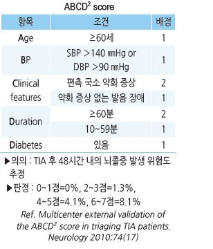
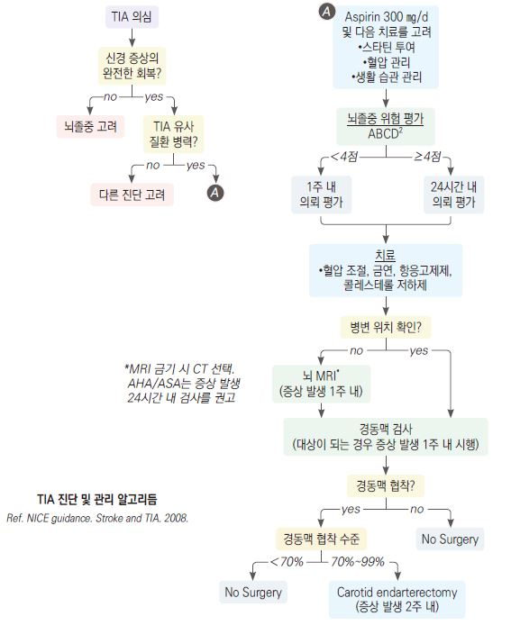

# 일과성 뇌허혈발작 Transient Ischemic Attack, TIA

## 일반 사항

* 급성 경색증 없이 뇌/망막/척수의 국소 허혈에 의해 수 분\~24시간 지속되는 일시적 신경 기능 이상
*   뇌졸중의 전조 증상일 수 있음

    •뇌졸중 환자의 7\~40%에서 TIA의 과거력이 있음

    •TIA 환자의 4~~10%에서 48시간 내, 10~~20%에서 3개월 내 CVA 발생
* 증상 발생 후 가능한 한 빨리(12시간 내) 진료
* 발생 24시간 내 평가를 권고

## 원인

* 경동맥 또는 척추 동맥의 죽상경화증
* lacunar infarct, 심근경색, 색전증, 동맥염
* 응고 항진 : protein S/C 결핍, antithrombin Ⅲ 존재, 경구 피임제, 임신, 출산

### 위험 인자

* 심장 질환 : MI, 심방세동, 판막 질환
* 고혈압, 당뇨병, 고지혈증, 비만, 수면무호흡증, thrombophilia
* 흡연

## 임상 양상

* 얼굴 또는 사지의 기력 또는 감각 저하(편측성), 발음 장애, 시각 장애
* 경동맥 장애(hemispheric) : 편측 시력 소실, hemianesthesia, 실어증
*   척추뇌바닥동맥 장애 : 양측 시력 소실, 복시, 어지럼, 운동 실조,

    안면 마비, 연하 곤란, 말더듬, 두통, 구역, 구토

## 진단

* 신경학적 검사
* ECG
* 실험실 검사 : CBC, 전해질, Cr, 혈당, 지질
* 영상 검사 : CT, MRI, MRA, 경동맥검사; 증상 발생 48시간 내 시행

### 감별

* Brain tumor : 구역/구토를 동반한 심한 편측 두통
*   CNS 감염(뇌염, 수막염) : 발열, 두통, 혼란, 경부 강직, 구역/구토,

    광선 공포, 정신 상태 변화
* 낙상/외상 : 두통, 혼란, 멍듦
* 저혈당 : 혼란, 약함, 발한
* 편두통 : 편두통의 일반적 특징이 있는 심한 두통, 젊은 연령
* 다발경화증 : 복시, 사지 약화, 둔감증, 소변 저류, 시신경염
* 발작 장애 : 혼란(±의식 소실), 요실금, 혀 깨물기, 강대성 움직임
* SAH : 갑자기 발생, 광선 공포증을 동반한 심한 두통
* 현훈 : 어지럼(±난청), 발한

***

## Management

### 치료 방침

* 급성기 뇌졸중 발생 가능성에 대하여 주의 관찰, 필요시 입원 관찰
* 재발 방지를 위하여 항혈소판/항응고 치료, 생활 습관 교정
* 기저 질환 및 위험 인자 관리 : 당뇨병, 고혈압, 고지혈증, 비만, 심장 질환, 수면무호흡증
* 1년 동안 매 3개월마다, 이후 매년 F/U

## 비-약물 치료

* 금연
* 적정 체중 유지
*   규칙적 유산소 운동 : 달리기, 자전거, 수영 등을 중등도 이상의 강도로 거의 매일(≥3회/주), ≥30분/일(≥150분/주) 시행

    (☞ p.1160)
* DASH diet : 과일, 야채, 통곡물, 저지방 유제품 권장; 술, 소금, 당분, meats 제한 (☞ p.1164)

## 약물 치료

#### Antiplatelet therapy

* atherothrombotic TIA에 적용 (☞ p.1154, 보험기준 p.1187)
* 서방형 dipyridamole/aspirin : 200/25 ㎎ bid; 단독 요법보다 효과/부작용 많음 \[디피아녹스]
* aspirin : 50~~325 ㎎/d, 급성기 160~~325 ㎎/d \[아스피린 장용정]
* clopidogrel : 75 ㎎/d; aspirin 알레르기가 있는 환자에서 선택 \[플라빅스]
* clopidogrel/aspirin : 단독 요법보다 유효. 장기 사용 시 출혈 위험 증가 \[클라빅신 듀오]
* ticlopidine : 다른 약제를 사용할 수 없는 환자에서 고려 \[티클로돈]

#### Anticoagulation therapy

* cardioembolic TIA에 적용 (보험기준 ☞ p.1187)
* apixaban : 2.5\~5 ㎎ bid \[엘리퀴스]
* rivaroxaban : 10\~20 ㎎ qd \[자렐토]
* edoxaban : 30\~60 ㎎ qd \[릭시아나]
* dabigatran : 150 ㎎ bid \[프라닥사]
* warfarin : INR에 따라 용량 조절 \[와파린]

#### Statin

* 기존에 복용 중이던 환자에서는 투여 유지
*   급성 stroke에서 신규로 즉시 투여 개시를 하지는 않음

    

> **질병코드** G45 일과성 뇌허혈발작 및 관련 증후군
