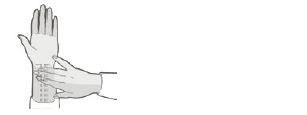

# 멀미 Motion Sickness

## <mark style="color:green;">일반 사항</mark>

* 실제 또는 감지된 움직임에 반응하여 발생하는, 위장 및 신경 증상을 포함하는 증후군
* 빈도 : 비행기 \~25%, 배 \~29%, 자동차 \~41%

## <mark style="color:green;">원인</mark>

* 불명
* 추정 기전 : 신체 움직임에 대한 visual receptor, vestibular receptor 및 body proprioceptor 사이의 불일치에 따른 생리적 반응
  * 구역/구토는 dopamine과 acetylcholine 증가에 따른 CNS에서의 chemoreceptor trigger zone 및 vomiting center 흥분에 의함
  * substance P 유리 → 중추신경계 NK-1 수용체 활성화도 구역/구토에 관여

**멀미 발생의 직접적·필수적 전제 조건**

* 회전·상하·낮은 주파수의 움직임 (자극 자체가 없으면 멀미 불성립)
* 시각 자극(가상현실·사이버멀미) - 실제 움직임 없이도 발생 가능

**개인 감수성을 결정하는 주요 인자** (멀미 취약성에 가장 큰 영향)

* 연령, 호르몬 : 3\~12세/여성·임신·월경; 역학적으로 가장 강력한 위험 인자
* 편두통 병력, 특히 vestibular migraine (전정계 과민성의 직접 지표)
* 기저 질환 : 어지럼증, 전정 질환, 메니에르병
* 가족력 (유전적 감수성)

**증상을 악화 시키거나 촉발하는 수정 가능한 인자**

* 약물 (원인 파악 후 조정 가능)
* 나쁜 공기 - 냄새·흡연·일산화탄소
* 감정 변화 - 두려움·불안
* 수면 부족

**주요 멀미 유발 약물**

* 아편유사제 : morphine, codeine, tramadol; CTZ 직접 자극, 위 배출 지연
* 항생제 : erythromycin, metronidazole, tetracycline; 구역 유발, 위장관 자극
* NSAIDs : ibuprofen, naproxen, aspirin; 위장관 자극, 위 배출 지연
* 항우울제 : SSRI·TCA·MAOI; 어지럼증·구역 유발
* 항경련제 : valproate, carbamazepine; 어지럼증·구역 유발
* 호르몬제 : 경구피임약·HRT; 호르몬 변동으로 감수성 증가
* 항암제 : cisplatin, cyclophosphamide; 강력한 CTZ 자극
* 디곡신 : 치료 범위에서도 구역 유발 가능
* 도파민 작용제 : levodopa, bromocriptine; CTZ 도파민 수용체 자극

## <mark style="color:green;">임상 양상</mark>

* 어지럼증, 두통, 졸림, 불안, 공황, 피로, apathy, malaise, 혼란
* epigastric fullness, 트림, 구역, 구토, 식욕 저하
* 식은땀, 창백, 침 분비 증가, 하품, 과호흡, 냄새에 대한 반응 증가

## <mark style="color:green;">진단</mark>

* 멀미는 병력과 임상 양상으로 진단

#### <mark style="color:$primary;">병력 및 임상 양상</mark>

* 구역, 어지럼증, 불쾌감 중 1가지 이상의 증상
* 발생 상황 : 어떤 교통 수단, 어떤 자세, 어떤 움직임과 시간적 연관성; 움직임(실제 또는 인지된) 노출 중 또는 직후 발생
* 움직임 중단 후 호전 여부 (호전되면 멀미 가능성 높음)
* 멀미 유발 약물 복용 여부
* 편두통·전정 질환 기왕력
* 다른 원인으로 설명되지 않음

#### <mark style="color:$primary;">**검사**</mark>

* 일반적으로 불필요; 진단이 불확실하거나 감별을 위하여 고려
* 감별이 필요한 경우에는 신경학적 진찰, 안진 유무, 필요 시 MRI

#### <mark style="color:$primary;">감별</mark>

* 복시, 구음장애, 사지 위약, 보행 실조 등 신경학적 증상 동반 → 즉각 응급 평가
* 움직임과 무관하게 발생하는 구역·구토·어지럼증 → 중추성 어지럼증증(소뇌·뇌간 병변), 미로염, 메니에르병
* 두통 동반, 특히 후두부·경부 통증 → 후두와 병변(소뇌출혈, Arnold-Chiari 기형 등)
* 안진(nystagmus), 특히 수직 안진 → 중추성 병변
* 처음으로 발생한 심한 어지럼증·구토 (평소와 다른 양상) → 중추성 원인
* 이명·청력 소실 동반 → 메니에르병, 청신경종
* 멀미약에 전혀 반응하지 않음 → 다른 원인
* PPPD(지속성 체위지각 어지럼증) : 시각 자극에 의한 만성 어지럼증; 움직임과 무관한 지속적 증상·불안 동반이 멀미와의 감별점

***

## <mark style="background-color:$warning;">Management</mark>

### <mark style="color:orange;">치료 방침</mark>

* 예방이 핵심 : 약물·비약물 치료 모두 증상 발생 전에 시행할 때 효과가 가장 크며, 구역·구토가 시작된 후에는 효과가 현저히 감소함
* 증상의 중증도, 여행 기간, 환자 연령, 기저 질환에 따라 치료법 선택
* 경증 : 비약물 치료 우선; 필요 시 항히스타민제 추가
* 중등도\~중증 또는 장기 여행 : 스코폴라민 패치 ± 항히스타민제 병용
* 멀미 유발 약물 복용 중인 경우 가능하면 중단 또는 대체 고려

## <mark style="color:green;">비-약물 치료 및 예방</mark>

* 증상이 발생했던 경험이 있는 상황을 피함
* 움직임이나 움직임 인식을 줄이기 위한 좌석 선택 : 비행기- 날개 부분; 자동차- 앞 좌석, 앞을 향한 좌석; 배- 선체 중앙부(mid-deck), 수평선이 보이는 자리
* 창가 좌석에 기대어 앉아 머리를 뒤쪽에 밀착함
* 시각 입력 최소화 : 움직이는 물체를 주시하지 않음, 눈을 감고 있음, 수평선 보기, 먼 곳에 시선 고정, 움직이는 상태에서 독서하지 않음
* 식사 : 충분한 수분 섭취, 소량의 음식을 자주 섭취(light, soft, bland, low-fat, low-acid food), 음주/카페인 음료 섭취 제한
* 충분한 수면/휴식 : 수면 부족은 증상을 악화시킴
* 금연 : 잠시의 금연도 멀미에 대한 민감도를 줄여 줌
* 호흡 조절, 환기 개선, 유독 가스 회피, 향기 요법(예: 민트, 라벤더)
* 얼굴에 바람을 쏘임, 사탕/껌 이용, 음악 듣기
* 적응 : 멀미를 유발하는 상황에 대한 노출을 점차 늘려 나감

## <mark style="color:green;">약물 치료</mark>

* 증상 발생 전 투여 (✽증상 발생 후 투여 시 효과 적음); 경구제는 보통 여행 30\~60분 전에 투여
* 약물 부작용 등을 고려하여 출발일 이전에 시험 투여를 권고
* 1차 선택 : 항콜린제, 항히스타민제; vestibular nuclei 활성 감소 작용
* 기타 : benzodiazepine, 항도파민제, 교감 신경 흥분제(예: caffeine, pseudoephedrine)

 ✽ Ondansetron(세로토닌 길항제)은 구역에 다소 효과가 있으나 멀미 예방에는 효과가 입증되지 않아 권장하지 않음

#### <mark style="color:$primary;">Anticholinergics</mark>

* 주의/금기 : 녹내장, 요폐, 고령(60세 이상 주의)
* 부작용 : 졸음, 입마름, 시야 흐림, 소변 저류
* 제거 후 금단 증상 : 패취 제거 후 24시간 이내에 어지럼증·구역·평형 장애가 나타날 수 있으며, 장기간(3일 이상) 사용 후 갑자기 제거 시 위험이 더 높음; 민감한 환자에서는 단기간 사용 후에도 발생 가능. ✽ 멀미 재발과 증상이 유사하여 혼동될 수 있으므로, 여행 종료 후 수시간 이내 어지럼증·구역 발생 시 금단 증상 가능성을 고려해야 함
* scopolamine 경피제 : 1.5 ㎎ patch <mark style="color:blue;">\[키미테 패취]</mark>(성인용 1.5 ㎎/매) (비보험)
  * 출발 최소 4시간 전(이상적으로는 6\~8시간 전) 귀 뒤의 털 없는 건조한 피부 표면에 부착(72시간 동안 효과)
  * 만 8세 미만 금기; 국내 소아용 제품 미시판으로 사실상 성인 전용으로 사용
  * 1매 부착으로 3일간 유효; 3일 이상 적용해야 할 경우 첫 번째 것을 제거하고 다른 패취를 반대편 귀 뒤에 부착
  * 주의 : Scopolamine 경피제 사용 시 체온 상승(hyperthermia) 위험(FDA 안전 경고)
    * 주로 17세 미만 소아 및 60세 이상 고령자에서 보고됨(합병증, 입원, 사망 사례 포함)
    * 사용 중 전기담요, 핫팩 등 외부 발열 기구 사용 금지
    * 체온 상승 또는 발한 감소 시 즉시 제거

#### <mark style="color:$primary;">항히스타민제</mark>

* 항콜린 및 진정 작용이 있는 1세대 항히스타민제 선택
  * 비진정성 2세대 항히스타민제는 BBB 통과 및 중추 항콜린 작용이 없어 멀미에 효과 없음
* 주의/부작용 : 항콜린제와 동일
* dimenhydrinate : 50\~100 ㎎ q6h, 6\~12세 25\~50 ㎎/2\~5세 12.5\~25 ㎎ q6\~8h <mark style="color:blue;">\[보나링 에이]</mark>
* diphenhydramine : 25\~50 ㎎ q6\~8h; 6\~12세 12.5\~25 ㎎ q6\~8h, 2\~5세 6.25 ㎎ q6\~8h; 수면 작용이 있음 <mark style="color:blue;">\[디펙타민]</mark>
* meclizine : 25\~50 ㎎ q24h, 여행 60분 전 복용; 1일 1회 투여로 편리하고 dimenhydrinate보다 졸림이 적음 <mark style="color:blue;">\[염산메클리진]</mark> (✽12세 미만 권장하지 않음)
* cyclizine : 일부 연구에서 dimenhydrinate과 효과는 비슷하며 덜 졸림
* promethazine : 12.5\~25 ㎎ bid; 중증 멀미에서 효과적이나 진정 작용이 강함 (✽2세 미만 금기 - 호흡 억제 위험으로 FDA 블랙박스 경고; 2세 이상도 주의)

#### <mark style="color:$primary;">Cinnarizine</mark>

* 칼슘 채널 차단 + H1 수용체 길항 이중 기전; 전정계 과민성 억제
* 부작용 : 졸음, 체중 증가, 드물게 가역적 파킨슨 증후군 (장기 복용을 피함)
* 주의 : 파킨슨병, 고혈압, 중증 관상동맥질환; 임부·수유부 권장하지 않음
* 국내 허가 적응증은 어지럼증 치료이며 멀미 예방 적응증은 없음; 어지럼증이 동반된 멀미에서 off-label 처방 가능(유럽 및 한국에서 어지럼증·멀미 치료에 사용; 미국·캐나다 미허가)
* 단일제 : 25 ㎎ tid (식후) <mark style="color:blue;">\[마이그리진정]</mark>
* 복합제 (cinnarizine 20 ㎎ + dimenhydrinate 40 ㎎) : 1정 tid (식후) <mark style="color:blue;">\[알레버트정]</mark>
  * 두 성분의 시너지 효과; 단독 성분 대비 우월한 효과 (RCT 근거 있음)
  * 전문의약품; 성인 및 12세 이상 소아

#### <mark style="color:$primary;">임신·수유 중 멀미 치료</mark>

* 비약물 요법 우선 : P6 지압, 생강(1\~2 g), 좌석 선택, 시선 고정 등
* 약물이 필요한 경우 :
  * dimenhydrinate, meclizine : 비교적 안전한 선택 (구 FDA Category B); 임신 전 기간 사용 가능하나 임신 말기에는 신생아 금단 증상 가능성으로 주의
  * scopolamine, promethazine : 구 FDA Category C; 필요 시 단기 사용 가능하나 주의 요
* 수유 중 : 모든 1세대 항히스타민제는 모유로 이행되어 신생아 졸음·식욕 저하 가능. 가능하면 비약물 요법 우선. 단회 사용 시 수유 시간 조절 고려

#### <mark style="color:$primary;">Antidopaminergics</mark>

* scopolamine보다 효과 적음
* metoclopramide : 10 ㎎ q6h <mark style="color:blue;">\[맥페란]</mark>
* prochlorperazine : 5\~10 ㎎ bid\~tid

#### <mark style="color:$primary;">Benzodiazepine</mark>

* vestibular nuclei 억제 작용
* 진정 및 중독 가능성 때문에 2차 선택
* 주의 : 고령, 알코올 남용, 간질환, 폐 기능 저하
* lorazepam : 1\~2 ㎎ q8h <mark style="color:blue;">\[아티반]</mark>
* diazepam : 2\~10 ㎎ q6\~12h <mark style="color:blue;">\[디아제팜]</mark>

#### <mark style="color:$primary;">NK-1 수용체 길항제: Tradipitant</mark>

* substance P 매개 NK-1 수용체를 선택적으로 차단하는 새로운 기전
* 멀미로 인한 구토 예방 목적, 성인(18\~75세) 대상 (2025년 12월 30일 FDA 승인; 브랜드명 NEREUS™; 국내 시판 제품 없음)
* 40년 만의 최초 신규 기전 멀미 치료제
* 2개의 Phase 3 연구(Motion Syros, Motion Serifos)에서 위약 대비 구토 발생률 약 55\~60% 감소
* 용량 : 85 ㎎ 또는 170 ㎎ 경구 공복에 출발 약 60분 전 복용
* CYP3A4 강력 억제제 병용 시 노출 증가 가능 — 주의
* 소아(<18세) 대상 안전성·유효성 미확립 (소아 임상시험 진행 중)

## <mark style="color:green;">대체 요법</mark>

* 생강 : 4시간 전 1\~2 g 또는 생강 음료 섭취; 응고 장애, 십이지장궤양, 장폐쇄 환자에서는 금지 (✽고질적 증거는 부족하며 위약 대비 우월성이 일관되게 증명되지 않음)
* 지압 : 손목(P6) 지압이 일부에서 효과

<figure><figcaption></figcaption></figure>

✽P6 : 손목 palmar side, transverse crease로부터 근위 4\~6 ㎝, palmaris longus와 the flexor carpi radialis 사이

***

### <mark style="color:red;">질병코드</mark>

T75.3 멀미

***

## <mark style="color:purple;">처방례</mark>

> **처방례 1.** 경증 멀미 — 단기 여행, 항히스타민제
>
> ```
> 보나링 에이 50 ㎎/T  1T  여행 30~60분 전 복용
> ※ 필요 시 q6~8h 반복, 1일 최대 300 ㎎; 졸음·입마름 주의, 음주 금지
> ```

> **처방례 2.** 경증 멀미 — 1일 1회, 졸림 적음
>
> ```
> 염산메클리진 25 ㎎/T  1T  여행 60분 전 복용
> ※ 1일 1회 투여로 편리; dimenhydrinate보다 졸림이 적음; 음주 금지
> ```

> **처방례 3.** 중등도\~중증 — 장기 여행 (3일 이내), 스코폴라민 패치
>
> ```
> 키미테 패취 1.5 ㎎/P  출발 최소 4~8시간 전 귀 뒤 털 없는 건조한 피부에 부착 (72시간 유효)
> ※ 성인 전용; 3일 이상 필요 시 첫 번째 패취 제거 후 반대편 귀 뒤에 새 패취 부착
> ※ FDA 안전 경고 : 체온 상승(hyperthermia) 위험 — 고령자·고온 환경 주의; 발열·발한 감소 시 즉시 제거
> ※ 부착 후 손을 깨끗이 씻어 눈에 접촉 방지(산동, 시야 흐림 유발 가능)
> ```

> **처방례 4.** 중증 구토 동반 — 패치 + 항히스타민제 병용
>
> ```
> 키미테 패취 1.5 ㎎/P  출발 최소 4~8시간 전 귀 뒤 부착
> 프로메타진 25 ㎎/T  1T  출발 30~60분 전 복용
> ※ 강한 진정 작용 — 반드시 운전 금지; 음주 절대 금지
> ※ 고령자·호흡기 질환자에서 호흡 억제 주의
> ```

> **처방례 5.** 어지럼증이 두드러진 멀미 — cinnarizine + dimenhydrinate 복합제
>
> ```
> 알레버트정 (cinnarizine 20 ㎎ + dimenhydrinate 40 ㎎)/T 1T 출발 30~60분 전 식후 복용
> ※ 성인 및 12세 이상; 전문의약품 (처방 필요)
> ※ 다른 항히스타민제·스코폴라민과 병용 금지 (항콜린 작용 중첩)
> ※ 파킨슨병·고혈압·중증 관상동맥질환 환자 주의; 임부·수유부 권장하지 않음
> ```

***

### <mark style="color:$success;">핵심 복약 지도</mark>

> **멀미약은 미리 복용해야 효과가 있습니다**
>
> * 경구약은 출발 **30\~60분 전**, 스코폴라민 패치는 출발 **최소 4\~8시간 전**에 적용하십시오.
> * 멀미 증상이 시작된 후에는 약의 효과가 크게 줄어듭니다.
> * 처음 사용하는 약은 여행 전날 미리 시험 복용하여 부작용 여부를 확인하십시오.

> **졸음 및 주의력 저하**
>
> * 멀미약(항히스타민제, 스코폴라민)은 졸음·집중력 저하를 일으킬 수 있습니다.
> * 복용 후에는 **운전, 기계 조작, 고소 작업을 하지 마십시오**.
> * 음주는 졸음을 크게 악화시키므로 **복용 중 음주를 삼가십시오**.

> **스코폴라민 패치 사용 시 주의사항**
>
> * 귀 뒤 털 없는 깨끗하고 건조한 피부에 부착하십시오.
> * **부착 후 반드시 손을 깨끗이 씻으십시오** — 손에 남은 약이 눈에 닿으면 동공 확대·시야 흐림이 생길 수 있습니다.
> * 패취를 자르거나 2장을 동시에 붙이지 마십시오.
> * 고열이 나거나 땀이 나지 않는 느낌이 들면 즉시 패취를 제거하고 의사에게 알리십시오.
> * 패취 제거 후 24시간 이내에 어지럼증·구역이 다시 나타날 수 있습니다. 이는 멀미 재발이 아닌 **금단 증상**일 수 있으므로, 증상이 지속되면 의사와 상담하십시오.

> **이런 경우 복용을 피하거나 의사와 상담하십시오**
>
> * 녹내장, 전립선비대(소변 보기 어려운 경우), 폐 질환이 있는 경우
> * **임신 중이거나 수유 중인 경우** — 가능하면 비약물 요법(P6 지압, 생강 등)을 먼저 시도하십시오. 약이 꼭 필요한 경우에는 반드시 의사와 상담하십시오.
> * **만 8세 미만 소아에게 스코폴라민 패치는 금기입니다** (국내 소아용 제품 미시판).

***

### <mark style="color:blue;">환자 안내서</mark>


**멀미, 미리 대비하면 여행이 편안해집니다**

멀미약은 증상이 생기기 전에 복용해야 효과가 있습니다. 자신에게 맞는 약을 여행 전날 미리 시험해 보세요.


#### <mark style="color:$primary;">멀미가 생기는 이유는 무엇인가요?</mark>

* 눈·귀·몸이 각각 다른 움직임 신호를 뇌에 보낼 때 생기는 일종의 생리적 반응입니다.
* 자동차·배·비행기 외에도 가상현실(VR) 기기 사용 중에도 발생할 수 있습니다.
* 어린이(3\~12세)·여성·편두통 환자에서 더 잘 나타납니다.

#### <mark style="color:$primary;">멀미를 줄이는 생활 요령</mark>

* **좌석 선택** : 자동차는 앞좌석·앞 방향 좌석, 배는 선체 중앙부·수평선이 보이는 자리, 비행기는 날개 부분을 선택하십시오.
* **시선 고정** : 멀리 수평선이나 고정된 사물을 바라보고, 이동 중에는 책·스마트폰을 보지 마십시오.
* **식사 조절** : 출발 전 과식하지 말고, 기름지거나 강한 향의 음식을 피하십시오. 소량씩 자주 드시고 충분히 수분을 섭취하십시오.
* **환기** : 신선한 공기를 쐬거나 얼굴에 바람을 맞으면 도움이 됩니다.
* **자세** : 머리를 뒤로 기대어 움직임을 최소화하십시오.

#### <mark style="color:$primary;">멀미약 복용 안내</mark>

* **반드시 출발 전에** 복용하십시오 — 경구약은 30\~60분 전, 패치는 최소 4\~8시간 전.
* 증상이 생긴 후에는 약의 효과가 크게 줄어듭니다.
* **졸음 주의** : 멀미약 복용 후에는 운전·기계 조작·음주를 하지 마십시오.
* **스코폴라민 패치** 부착 후에는 손을 깨끗이 씻으십시오. 손에 묻은 약이 눈에 닿으면 시야가 흐려집니다.
* **만 8세 미만 소아**에게 스코폴라민 패치는 사용할 수 없습니다.
* 녹내장·전립선 비대·폐 질환이 있거나 임신 중이라면 복용 전 반드시 의사와 상담하십시오.

#### <mark style="color:$primary;">처음으로 이런 증상이 생긴다면 병원을 방문하세요</mark>

* 어지럼증과 함께 팔다리 힘 빠짐·발음 장애·복시가 동반된 경우
* 수직 방향의 안진(눈이 위아래로 떨리는 느낌)이 느껴지는 경우
* 멀미약을 복용했는데도 전혀 호전이 없는 경우
