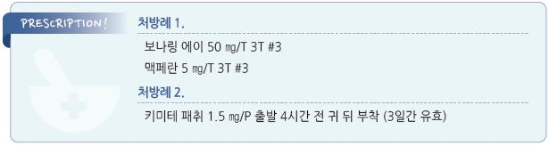

# 멀미 Motion Sickness

## 일반 사항

* 실제 또는 감지된 움직임에 반응하여 발생하는, 위장 및 신경 증상을 포함하는 증후군
* 빈도 : 비행기 \~25%, 배 \~29%, 자동차 \~41%

## 원인

* 불명
*   추정 기전 : 신체 움직임에 대한 visual receptor, vestibular receptor 및 body proprioceptor 사이의 불일치에 따른 생리적 반응

    •구역/구토는 dopamine과 acetylcholine 증가에 따른 CNS에서의 chemoreceptor trigger zone 및 vomiting center 흥분에 의함

### 위험 인자

* 회전, 상하, 낮은 주파수의 움직임 (※ 직선, 수평, 높은 주파수의 움직임에서는 보다 적게 발생)
* 시각 자극(예: 가상현실)
* 나쁜 공기 : 냄새, 흡연, 일산화탄소
* 감정 변화 : 두려움, 불안
* 나쁜 건강 상태, 기저 질환
*   약물 : 항생제, 항기생충제, estrogen/경구피임제, digoxin, levodopa, NSAID, SSRI, aminophylline, bisphosphonate,

    마약성 진통제
* 가족력
* 3\~12세 (✽영유아와 ＞50세에서는 덜 발생함)
* 여성, 임신, 월경
* 편두통 병력(특히 vestibular migraine)

## 임상 양상

* 어지럼, 두통, 졸림, 불안, 공황, 피로, apathy, malaise, 혼란
* epigastric fullness, 트림, 구역, 구토, 식욕 저하
* 식은땀, 창백, 침 분비 증가, 하품, 과호흡, 냄새에 대한 반응 증가

***

## Management

## 비-약물 치료 및 예방

* 증상이 발생했던 경험이 있는 상황을 피함
*   움직임이나 움직임 인식을 줄이기 위한 좌석 선택 : 비행기- 날개 부분; 자동차- 앞좌석, 앞을 향한 좌석; 배- 파도를 보는 자리,

    노 젓는 곳에서 떨어진 자리, 물에 가까운 자리

    •창가 좌석에 기대어 앉아 머리를 뒤쪽에 밀착함
*   시각 입력 최소화 : 움직이는 물체를 주시하지 않음, 눈을 감고 있음, 수평선 보기, 먼 곳에 시선 고정, 움직이는 상태에서

    독서하지 않음
* 식사 : 충분한 수분 섭취, 소량의 음식을 자주 섭취(light, soft, bland, low-fat, low-acid food), 음주/카페인 음료 섭취 제한
* 금연 : 잠시의 금연도 멀미에 대한 민감도를 줄여 줌
* 호흡 조절, 환기 개선, 유독 가스 회피, 향기 요법(예: 민트, 라벤더)
* 얼굴에 바람을 쏘임, 사탕/껌 이용, 음악 듣기
* 적응 : 멀미를 유발하는 상황에 대한 노출을 점차 늘려 나감

## 약물 치료

* 증상 발생 전 투여 (✽증상 발생 후 투여 시 효과 적음); 경구제는 보통 여행 30\~60분 전에 투여
* 약물 부작용 등을 고려하여 출발일 이전에 시험 투여를 권고
* 1차 선택 : 항콜린제, 항히스타민제; vestibular nuclei 활성 감소 작용
* 기타 : benzodiazepine, 항도파민제, 교감 신경 흥분제(예: caffeine, pseudoephedrine)

#### Anticholinergics

* 주의/금기 : 녹내장, 요폐
* 부작용 : 졸음, 입마름, 시야 흐림, 소변 저류
*   scopolamine 경피제 : 1\~1.5 ㎎ patch, 출발 4시간 전에 귀 뒤의 털 없는 건조한 피부 표면에 부착(72시간 동안 효과);

    ≥8세 허가 \[키미테 패취]\(성인용 1.5 ㎎/매; 3일 이상 적용해야 할 경우 첫 번째 것은 제거하고 다른 패취를 반대편 귀 뒤에

    부착) (비보험)

#### 항히스타민제

* 항콜린 및 진정 작용이 있는 1세대 항히스타민제 선택
* 주의/부작용 : 항콜린제와 동일
* dimenhydrinate : 50~~100 ㎎ q6h, 6~~12세 25~~50 ㎎/2~~5세 12.5~~25 ㎎ q6~~8h \[보나링 에이]
* diphenhydramine : 25~~50 ㎎ q6~~8h, 6~~12세 5 ㎎/㎏ q6~~8h; 수면 작용이 있음 [디펙타민](../%EB%B9%84%EB%B3%B4%ED%97%98/)
* meclizine : 25\~50 ㎎ q24h, 여행 60분 전 복용 \[염산메클리진]
* cyclizine : 일부 연구에서 dimenhydrinate과 효과는 비슷하며 덜 졸림
* promethazine : 25 ㎎ bid

#### Antidopaminergics

* scopolamine보다 효과 적음
* metoclopramide : 10 ㎎ q6h \[맥페란]
* prochlorperazine : 5 ㎎ tid\~qid

#### Benzodiazepine

* vestibular nuclei 억제 작용
* 진정 및 중독 가능성 때문에 2차 선택
* 주의 : 고령, 알코올 남용, 간질환, 폐 기능 저하
* lorazepam : 1\~2 ㎎ q8h \[아티반]
* diazepam : 2~~10 ㎎ q6~~12h \[디아제팜]

## 대체 요법

* 생강 : 4시간 전 1\~2 g 또는 생강 음료 섭취; 응고 장애, 십이지장궤양, 장폐쇄 환자에서는 금지
* 지압 : 손목(P6) 지압이 일부에서 효과

> (✽P6 : 손목 palmar side, transverse crease로부터 근위 1인치, palmaris longus와 the flexor carpi radialis 사이)

> **질병코드** T75.3 멀미

