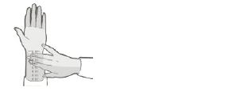

# 멀미 Motion Sickness

## <mark style="color:green;">일반 사항</mark>

* 실제 신체 움직임 또는 시각적으로 인지된 움직임에 의해 유발되는 구역·구토, 위장 불쾌감, 자율신경 및 중추신경 증상의 복합 증후군 (Bárány Society Consensus, 2021)
* 충분히 강한 자극에서는 정상 전정기능을 가진 사람 대부분에게 발생할 수 있으며, 빈도는 교통수단 자체보다 움직임의 강도·주파수, 노출 시간, 시야 확보 및 개인 감수성에 따라 크게 달라짐

## <mark style="color:green;">원인</mark>

* 정확한 신경기전이 완전히 규명된 것은 아니나, 가장 널리 받아들여지는 설명은 예상된 감각 정보와 실제 전정·시각·고유감각 입력 사이의 불일치(sensory conflict 또는 neural mismatch)
* 전정핵과 뇌간의 muscarinic·histamine H1 경로가 주요 역할을 하며, substance P-NK-1 경로도 움직임 유발 구토에 관여

**멀미를 유발하는 자극**

* 회전·상하·저주파 움직임 등 실제 신체 움직임
* 가상현실(VR), 시뮬레이터, 대형 화면·게임 등 시각적 움직임만으로도 발생 가능(visually induced motion sickness, VIMS)

**개인 감수성을 결정하는 주요 인자** (멀미 취약성에 가장 큰 영향)

* 연령 : 2세 미만에서는 드물고 7\~12세에 가장 흔하며 성인기 이후 감소하는 경향
* 여성, 임신·월경 등 호르몬 요인
* 편두통 병력, 특히 vestibular migraine
* 기저 질환 : 어지럼증, 전정 질환, 메니에르병
* 가족력 (유전적 감수성)

**증상을 악화 시키거나 촉발하는 수정 가능한 인자**

* 약물 (원인 파악 후 조정 가능)
* 나쁜 공기 - 냄새·흡연·일산화탄소
* 감정 변화 - 두려움·불안
* 수면 부족

**구역·어지럼을 유발하여 멀미와 혼동하거나 증상을 악화시킬 수 있는 약물**

* 아편유사제 : morphine, codeine, tramadol; CTZ 직접 자극, 위 배출 지연
* 항생제 : erythromycin, metronidazole, tetracycline; 구역 유발, 위장관 자극
* NSAIDs : ibuprofen, naproxen, aspirin; 위장관 자극
* 항우울제 : SSRI·TCA·MAOI; 어지럼증·구역 유발
* 항경련제 : valproate, carbamazepine; 어지럼증·구역 유발
* 호르몬제 : 경구피임약·HRT; 일부에서 감수성 증가 가능
* 항암제 : cisplatin, cyclophosphamide; 강력한 CTZ 자극
* 디곡신 : 치료 범위에서도 구역 유발 가능
* 도파민 작용제 : levodopa, bromocriptine; CTZ 도파민 수용체 자극

## <mark style="color:green;">임상 양상</mark>

* 초기에는 위 인지감(stomach awareness; 평소 의식하지 않던 위가 느껴지는 감각), 온감, 하품, 식은땀, 창백, 침 분비 증가, 어지럼이 점진적으로 나타나고 이후 구역·구토로 진행 가능
* 위장관 : 상복부 불쾌감·팽만, 트림, 식욕 저하, 구역, 구토
* 중추신경·sopite syndrome : 졸림, 피로, 무기력, 집중력 저하, 두통
* 기타 : 과호흡, 냄새 민감성 증가; VIMS에서는 눈피로·시야 흐림·두통이 상대적으로 흔함
* 뚜렷한 혼란·의식 변화는 전형적 멀미보다 중추성 질환, 탈수 또는 멀미약 부작용을 우선 고려

### <mark style="color:$danger;">🚩 Red Flags!</mark>

<mark style="color:$danger;">**즉각 응급 조치 및 이송**</mark> <mark style="color:$danger;">- 중추신경계·외상성 응급질환 배제</mark>

* 복시, 구음장애, 연하곤란, 사지 위약·감각 이상, 새 보행 불능·심한 몸통 실조 또는 의식 변화 동반 → 뇌간·소뇌 병변 즉각 배제
* 진찰에서 수직안진, 순수 회선안진 또는 주시 방향에 따라 방향이 바뀌는 안진 → 중추성 원인 의심; 응급실 이송 후 신경학적 평가·영상검사
* 갑작스럽고 심한 두통(thunderclap 양상), 새 경부통 또는 신경학적 증상 동반 → 지주막하출혈, 소뇌출혈, 척추동맥박리 등 배제
* 고에너지 외상 후 발생하는 심한 어지럼·구토 → 두개내 병변 배제

<mark style="color:$warning;">**당일 긴급 평가 권고**</mark> <mark style="color:$warning;">- 평소와 다른 양상이거나 다른 급성질환 감별이 필요한 경우</mark>

* 처음으로 발생한 심한 어지럼·구토 (기존 멀미 병력 없음)
* 움직임 노출이 끝난 뒤에도 심한 구역·구토·어지럼증이 지속되거나 자극과 무관하게 발생
* 급성 지속성 어지럼과 새 한쪽 청력저하 동반 → AICA 영역 허혈을 포함한 중추성 원인 및 급성 내이질환 평가
* 반복 구토로 경구 수분 섭취가 어렵거나 탈수·핍뇨·전해질 이상이 의심됨

<mark style="color:$info;">**외래 평가·추적**</mark> <mark style="color:$info;">- 응급 신호는 없으나 전형적 경과가 아닌 경우</mark>

* 적절한 비약물·약물 예방에도 반복적으로 심한 증상이 발생하거나 일상·여행을 현저히 제한
* 움직임 종료 후 흔들림·출렁임이 48시간을 초과하여 지속 → mal de débarquement syndrome(MdDS) 등 평가
* 반복되는 이명·청력 변동, 편두통 양상 또는 체위성 어지럼 → 전정편두통, 메니에르병, BPPV 등 감별

✽ 움직임 자극과 무관한 지속성 어지럼은 급성 전정 증후군(acute vestibular syndrome, AVS)으로 평가한다. 자발안진이 동반된 AVS에서는 훈련된 검사자가 HINTS Plus를 적용할 수 있으나, 단순 멀미나 자발안진이 없는 환자에게 적용하는 검사는 아니다.

## <mark style="color:green;">진단</mark>

* 멀미는 병력과 임상 양상으로 진단

#### <mark style="color:$primary;">병력 및 임상 양상</mark>

* 신체 움직임에 의해 구역, 위 인지감, 발한, 두통 또는 졸림 중 1가지 이상이 유발됨; VIMS에서는 눈피로·시야 흐림도 포함
* 증상은 움직임 또는 시각 자극에 노출되는 동안 점진적으로 발생하고, 자극 중단 후 결국 소실
* 발생 상황 : 교통수단·VR 등 자극 종류, 자세, 시야 확보, 노출 시간 및 반복 노출과의 시간적 연관성
* 구역·어지럼을 유발할 수 있는 약물 복용 여부
* 편두통·전정 질환 기왕력
* 다른 원인으로 설명되지 않음

✽ 같은 종류의 움직임에 의해 반복적으로 유발되고 반복 노출에도 적응되지 않으며 회피·활동 제한을 초래하면 motion sickness disorder 또는 VIMSD를 고려 (Bárány Society Consensus, 2021)

#### <mark style="color:$primary;">**검사**</mark>

* 일반적으로 불필요; 진단이 불확실하거나 감별을 위하여 고려
* 감별이 필요한 경우에는 활력징후, 탈수 상태, 신경학적 진찰, 보행·안진·청력 평가를 시행하고 임상 상황에 따라 영상검사 등을 고려

#### <mark style="color:$primary;">감별</mark>

* PPPD(지속성 체위지각 어지럼증) : 대부분의 날에 3개월 이상 기본 증상이 지속되고 직립 자세, 능동·수동 움직임 및 복잡한 시각 자극에서 악화
* MdDS : 배·비행기 등 수동 움직임 노출이 끝난 뒤 48시간 이내 rocking·bobbing·swaying이 시작되어 48시간을 초과해 지속하고, 다시 수동 움직임에 노출되면 일시적으로 호전되는 양상. 48시간 초과 1개월 미만은 진행 중 MdDS, 1개월 이상은 지속성 MdDS로 분류 (Bárány Society Consensus, 2020)
* 전정편두통, 메니에르병, BPPV, AUV(전정신경염), 미로염 및 약물·대사성 원인
* 응급 감별이 필요한 중추성 병변은 위의 Red Flags 참조

***

## <mark style="background-color:$warning;">Management</mark>

### <mark style="color:orange;">치료 방침</mark>

* 예방이 핵심 : 약물·비약물 치료 모두 증상 발생 전에 시행할 때 효과가 가장 크며, 구역·구토가 시작된 후에는 효과가 현저히 감소함
* 증상의 중증도, 여행 기간, 환자 연령, 기저 질환에 따라 치료법 선택
* 경증 : 비약물 치료 우선; 필요 시 항히스타민제 추가
* 단기(≤6시간) 경증\~중등도 : meclizine 또는 dimenhydrinate 중 하나 선택
* 장기(＞6시간) 중등도\~중증 : scopolamine 패치 고려
* 여러 진정성·항콜린성 멀미약의 일상적 병용은 부작용을 증가시키므로 피함
* 구역·어지럼 유발 약물 복용 중인 경우 원인 여부를 평가하고 필요 시 조정

## <mark style="color:green;">비-약물 치료 및 예방</mark>

* 증상이 발생했던 경험이 있는 상황을 피함
* 움직임이나 감각 불일치를 줄이기 위한 좌석 선택 : 비행기- 날개 부근; 자동차- 성인 승객은 앞좌석·앞을 향한 좌석; 배- 선체 중앙부·수면에 가까우며 수평선이 보이는 자리
  * 소아는 멀미 예방보다 연령·체격에 맞는 카시트·부스터 및 뒷좌석 탑승 원칙을 우선하고, 가능한 범위에서 창밖 먼 곳을 보게 함
* 창가 좌석에 기대어 앉아 머리를 뒤쪽에 밀착함
* 시각 입력 최소화 : 움직이는 물체를 주시하지 않음, 눈을 감고 있음, 수평선 보기, 먼 곳에 시선 고정, 움직이는 상태에서 독서하지 않음
* 식사 : 과식·기름진 음식은 피하고 필요 시 가벼운 식사와 충분한 수분 섭취; 특정 식이의 예방 효과 근거는 제한적
* 충분한 수면/휴식 : 수면 부족은 증상을 악화시킴
* 흡연·니코틴은 멀미를 악화시킬 수 있으므로 피함
* 규칙적인 호흡 조절, 환기 개선, 유독 가스 회피; 향기·음악 등은 일부에서 보조적으로 도움될 수 있으나 근거는 제한적
* 얼굴에 바람을 쏘임, 사탕/껌 이용, 음악 듣기
* 적응 : 멀미를 유발하는 상황에 대한 노출을 점차 늘려 나감

#### <mark style="color:$primary;">VIMS(시각 유발 멀미·디지털 멀미)</mark>

* 증상이 시작되면 화면·VR 노출을 즉시 중단하고 완전히 회복한 뒤 다시 사용
* 처음에는 짧게 사용하고 휴식 간격을 두면서 노출 시간을 서서히 늘림
* 앉은 자세에서 불필요한 머리·몸 움직임을 줄이고, 기기 착용 상태와 화면 끊김·지연을 점검
* 기기가 지원하면 시야각 또는 주변부 시야를 줄이거나 고정된 지평선·참조점을 사용하고, 충분한 수면과 환기를 확보

#### <mark style="color:$primary;">생강·P6 지압 등 보완요법</mark>

* 생강 : 효과에 관한 근거가 제한적이고 연구 결과가 일관되지 않으나, 원하는 환자가 보조적으로 시도할 수 있음. 항응고제 복용 등 출혈 위험이 있으면 주의
* 지압 : 손목 P6 지압의 효과 근거가 충분하지 않고 결과가 일관되지 않으나, 원하는 환자가 보조적으로 시도할 수 있음

<figure><figcaption>P6(내관) 지압점 위치</figcaption></figure>

✽P6 : 손바닥 쪽 손목 주름에서 몸쪽으로 약 4\~6 ㎝, palmaris longus와 flexor carpi radialis 힘줄 사이

## <mark style="color:green;">약물 치료</mark>

* 증상 발생 전 투여 (✽증상 발생 후 투여 시 효과 적음); 경구제는 보통 여행 30\~60분 전에 투여
* 약물 부작용 등을 고려하여 출발일 이전에 시험 투여를 권고
* 1차 선택 : 항콜린제, 항히스타민제; vestibular nuclei 활성 감소 작용
* ondansetron·granisetron 등 5-HT3 길항제와 metoclopramide 등 일반 항구토제는 멀미의 주된 전정핵 H1·M1 경로를 차단하지 않으므로 멀미 예방·치료 목적으로 권장하지 않음
* benzodiazepine은 진정, 운전 장애, 낙상·호흡억제 및 의존성 위험 때문에 단순 멀미 치료제로 권장하지 않음

#### <mark style="color:$primary;">항콜린제</mark>

* 금기/주의 : 폐쇄각녹내장 금기; 배뇨장애·요폐 위험, 위장관 폐색, 발작·정신병 병력, 고령자 및 다른 항콜린제 병용 시 주의
* 부작용 : 졸음, 입마름, 시야 흐림, 소변 저류
* 제거 후 금단 증상 : 보통 며칠간 사용한 뒤 제거하고 24시간 이상 지난 후 평형장애, 어지럼증, 구역·구토, 복통, 발한, 혼란, 근력저하, 서맥·저혈압 등이 나타날 수 있음. 제거 직후의 증상을 곧바로 금단으로 단정하지 말고 멀미 지속, 탈수 및 다른 전정질환을 감별
* scopolamine 경피제 : 1.5 ㎎ patch <mark style="color:blue;">\[키미테 패취]</mark>(성인용 1.5 ㎎/매) (비급여)
  * 출발 최소 4시간 전(이상적으로는 6\~8시간 전) 귀 뒤의 털 없는 건조한 피부 표면에 부착(72시간 동안 효과)
  * 성인용 키미테 패취는 만 16세 이상에서 사용; 소아·청소년에게 성인용 패취를 자르거나 임의로 사용하지 않음
  * 1매 부착으로 3일간 유효; 3일 이상 적용해야 할 경우 첫 번째 것을 제거하고 다른 패취를 반대편 귀 뒤에 부착
  * 주의 : Scopolamine 경피제 사용 시 항콜린 작용에 의해 발한 감소 → 체온 상승 가능성. 특히 소아·고령자 및 고온 환경에서 주의 (드물지만 보고됨)
    * 사용 중 전기담요, 핫팩 등 외부 발열 기구 사용 금지
    * 체온 상승 또는 발한 감소 시 즉시 제거
  * 금속성 막에 의한 피부 화상 위험이 있으므로 MRI 검사 전에 제거하고 의료진에게 사용 사실을 알림

#### <mark style="color:$primary;">항히스타민제</mark>

* 항콜린 및 진정 작용이 있는 1세대 항히스타민제 선택
  * 비진정성 2세대 항히스타민제는 BBB 통과 및 중추 항콜린 작용이 없어 멀미에 효과 없음
* 주의/부작용 : 항콜린제와 동일
* dimenhydrinate <mark style="color:blue;">\[보나링에이정 50 ㎎]</mark>
  * 성인 치료 : 50 ㎎ tid\~qid; 예방 : 여행 30\~60분 전 50\~100 ㎎ 1회
  * 원칙적으로 1일 200 ㎎을 초과하지 않음
* meclizine : 25\~50 ㎎ q24h, 여행 60분 전 복용; 1일 1회 투여로 편리하고 dimenhydrinate보다 진정이 적은 편 <mark style="color:blue;">\[파비스염산메클리진정 25 ㎎]</mark> (12세 이하 투여하지 않음)
* promethazine : 성인 25 ㎎을 여행 30\~60분 전 단독 투여할 수 있으나 진정 작용이 강하므로 운전·위험 작업 금지; 다른 진정성·항콜린성 멀미약과 일상적으로 병용하지 않음. 2세 미만은 치명적 호흡억제 위험으로 절대 금기(FDA Boxed Warning)이며, 2세 이상 소아도 최저 유효용량으로 신중히 사용
* 시판 경구용 멀미약에는 dimenhydrinate 또는 meclizine에 카페인·pyridoxine 등이 포함된 복합제가 있으므로 성분 중복을 확인. 카페인은 운전 안전성을 보장하지 않으며 저녁 복용 시 불면·두근거림에 주의

#### <mark style="color:$primary;">소아</mark>

* 비약물 요법을 우선하며, 과진정과 역설적 흥분이 생길 수 있으므로 멀미약 사용에 특히 주의
* 국내 제품별 허가 연령·제형을 확인하여 사용하고 성인용 스코폴라민 패취는 사용하지 않음
* 해외 지침(CDC Yellow Book 2026)에서는 6\~12세에 dimenhydrinate 12\~25 ㎎을 여행 1\~2시간 전에 고려할 수 있으나, 국내 해당 제품의 허가사항과 용량을 우선함
* promethazine은 치명적 호흡억제 위험 때문에 2세 미만에서 절대 금기이며, 2세 이상에서도 일상적 소아 멀미약으로 사용하지 않음
* diphenhydramine은 진정과 역설적 흥분 위험이 있고 국내 <mark style="color:blue;">\[디펙타민]</mark>은 불면증 적응증이며 15세 미만 금기이므로 소아 멀미약으로 사용하지 않음

#### <mark style="color:$primary;">임신·수유 중 멀미 치료</mark>

* 비약물 요법 우선 : 좌석 선택, 시선 고정, 머리 움직임 최소화 등; P6 지압·생강은 효과 근거가 일관되지 않음
* 약물이 필요한 경우 :
  * dimenhydrinate 또는 meclizine은 인체 임신자료가 비교적 축적되어 있으나, 임신 주수·국내 허가사항을 확인하고 최소 유효용량으로 단기간 사용
  * scopolamine은 임신 중 일상적 1차 선택으로 권장하지 않으며, promethazine도 진정 등 위험을 고려해 필요한 경우에만 사용
* 과거 FDA A/B/C/D/X 분류는 폐지되었으므로 해당 범주가 아니라 약물별 인체자료, 임신 주수, 투여 기간 및 국내 허가사항을 바탕으로 판단
* 수유 중에는 약제별 자료를 확인하고 최소 유효용량·단기간 사용을 원칙으로 하며, 영아의 졸림·수유저하와 모유량 감소 가능성을 관찰

#### <mark style="color:$primary;">NK-1 수용체 길항제: Tradipitant</mark>

* substance P 매개 NK-1 수용체를 선택적으로 차단하는 새로운 기전
* 성인의 움직임 유발 **구토 예방** 목적(2025년 12월 30일 FDA 승인; 브랜드명 NEREUS™; 국내 시판 제품 없음); 이미 발생한 구역·구토의 치료 효과는 평가되지 않음
* 2개의 Phase 3 연구(Motion Syros, Motion Serifos)에서 위약 대비 구토 발생을 유의하게 감소시킴. 다만 FDA 라벨의 구역 단독 2차 평가변수(worst nausea score)는 두 연구 모두 통계적으로 유의하지 않았음
* 용량 : 85 ㎎ 또는 170 ㎎ 중 최소 유효용량을 1회 경구 투여; 170 ㎎은 85 ㎎ 캡슐 2개. 24시간 내 1회만 투여
* 움직임 노출 약 60분 전, **충분한 식사 최소 1시간 전 또는 식후 2시간 후 공복에 복용**
* CYP3A4 강력 억제제 병용 시 노출 증가 가능 - 주의
* 흔한 이상반응 : 졸림, 두통, 피로; 운전·위험 기계 조작 주의
* 중증 신장기능 저하(eGFR ≤29 mL/min/1.73㎡) 및 모든 정도의 간기능 장애에서는 사용을 피함
* 소아 대상 안전성·유효성 미확립

***

### <mark style="color:red;">질병코드</mark>

T75.3 멀미

***

## <mark style="color:purple;">처방례</mark>

> **처방례 1.** 경증 멀미 - 단기 여행, 항히스타민제
>
> ```
> 보나링 에이 50 ㎎/T  1T  여행 30~60분 전 복용
> ※ 치료 목적으로 반복 시 1회 50 ㎎ tid~qid, 원칙적으로 1일 최대 200 ㎎
> ※ 졸음·입마름 주의, 음주·운전 금지
> ```

> **처방례 2.** 경증 멀미 - 1일 1회, 졸림 적음
>
> ```
> 파비스염산메클리진정 25 ㎎/T  1T  여행 60분 전 복용
> ※ 1일 1회 투여로 편리; dimenhydrinate보다 졸림이 적음; 음주 금지
> ※ 12세 이하 투여하지 않음
> ```

> **처방례 3.** 중등도\~중증 - 장기 여행 (3일 이내), 스코폴라민 패치
>
> ```
> 키미테 패취 1.5 ㎎/P  출발 최소 4~8시간 전 귀 뒤 털 없는 건조한 피부에 부착 (72시간 유효)
> ※ 만 16세 이상; 3일 이상 필요 시 첫 번째 패취 제거 후 반대편 귀 뒤에 새 패취 부착
> ※ FDA 안전 경고 : 체온 상승(hyperthermia) 위험 - 고령자·고온 환경 주의; 발열·발한 감소 시 즉시 제거
> ※ 부착 후 손을 깨끗이 씻어 눈에 접촉 방지(산동, 시야 흐림 유발 가능)
> ※ MRI 검사 전 제거(금속성 막에 의한 부착 부위 화상 위험)
> ```

***

### <mark style="color:$success;">핵심 복약 지도</mark>

> **멀미약은 미리 복용해야 효과가 있습니다**
>
> * 경구약은 출발 **30\~60분 전**, 스코폴라민 패치는 출발 **최소 4\~8시간 전**에 적용하십시오.
> * 멀미 증상이 시작된 후에는 약의 효과가 크게 줄어듭니다.
> * 처음 사용하는 약은 여행 전날 미리 시험 복용하여 부작용 여부를 확인하십시오.

> **졸음 및 주의력 저하**
>
> * 멀미약(항히스타민제, 스코폴라민)은 졸음·집중력 저하를 일으킬 수 있습니다.
> * 복용 후에는 **운전, 기계 조작, 고소 작업을 하지 마십시오**.
> * 음주는 졸음을 크게 악화시키므로 **복용 중 음주를 삼가십시오**.

> **스코폴라민 패치 사용 시 주의사항**
>
> * 귀 뒤 털 없는 깨끗하고 건조한 피부에 부착하십시오.
> * **부착 후 반드시 손을 깨끗이 씻으십시오** - 손에 남은 약이 눈에 닿으면 동공 확대·시야 흐림이 생길 수 있습니다.
> * 패취를 자르거나 2장을 동시에 붙이지 마십시오.
> * 고열이 나거나 땀이 나지 않는 느낌이 들면 즉시 패취를 제거하고 의사에게 알리십시오.
> * **MRI 검사 전에는 패취를 제거하고 의료진에게 알리십시오.** 금속성 막 때문에 피부 화상이 생길 수 있습니다.
> * 며칠간 사용한 뒤 제거하면 일반적으로 **24시간 이후**부터 어지럼증·구역 등 금단 증상이 나타날 수 있습니다. 증상이 심하면 진료를 받으십시오.

> **이런 경우 복용을 피하거나 의사와 상담하십시오**
>
> * 폐쇄각녹내장, 전립선비대 등으로 소변 보기 어려운 경우, 장폐색·발작·정신병 병력이 있는 경우
> * **임신 중이거나 수유 중인 경우** - 가능하면 좌석 선택·시선 고정 등 비약물 요법을 먼저 시도하십시오. 약이 꼭 필요한 경우에는 반드시 의사와 상담하십시오.
> * **성인용 키미테 패취는 만 16세 이상에서만 사용합니다.** 소아·청소년에게 자르거나 임의로 사용하지 마십시오.

***

### <mark style="color:blue;">환자 안내서</mark>


**멀미, 미리 대비하면 여행이 편안해집니다**

멀미약은 증상이 생기기 전에 복용해야 효과가 있습니다. 자신에게 맞는 약을 여행 전날 미리 시험해 보세요.


#### <mark style="color:$primary;">멀미가 생기는 이유는 무엇인가요?</mark>

* 눈·귀·몸이 각각 다른 움직임 신호를 뇌에 보낼 때 생기는 일종의 생리적 반응입니다.
* 자동차·배·비행기 외에도 가상현실(VR) 기기 사용 중에도 발생할 수 있습니다.
* 2세 미만에서는 드물고 7\~12세에 가장 흔하며, 여성·편두통 환자에서도 더 잘 나타납니다.

#### <mark style="color:$primary;">멀미를 줄이는 생활 요령</mark>

* **좌석 선택** : 성인 자동차 승객은 앞좌석·앞 방향 좌석, 배는 선체 중앙부·수평선이 보이는 자리, 비행기는 날개 부근을 선택하십시오. 소아는 멀미보다 카시트·부스터와 뒷좌석 탑승 원칙을 우선하십시오.
* **시선 고정** : 멀리 수평선이나 고정된 사물을 바라보고, 이동 중에는 책·스마트폰을 보지 마십시오.
* **식사 조절** : 출발 전 과식하지 말고, 기름지거나 강한 향의 음식을 피하십시오. 소량씩 자주 드시고 충분히 수분을 섭취하십시오.
* **환기** : 신선한 공기를 쐬거나 얼굴에 바람을 맞으면 도움이 됩니다.
* **자세** : 머리를 뒤로 기대어 움직임을 최소화하십시오.

#### <mark style="color:$primary;">멀미약 복용 안내</mark>

* **반드시 출발 전에** 복용하십시오 - 경구약은 30\~60분 전, 패치는 최소 4\~8시간 전.
* 증상이 생긴 후에는 약의 효과가 크게 줄어듭니다.
* **졸음 주의** : 멀미약 복용 후에는 운전·기계 조작·음주를 하지 마십시오.
* 복합 멀미약에는 카페인이 들어 있을 수 있으므로 성분을 확인하고, 저녁 복용 시 불면·두근거림에 주의하십시오.
* **스코폴라민 패치** 부착 후에는 손을 깨끗이 씻으십시오. 손에 묻은 약이 눈에 닿으면 시야가 흐려집니다.
* 성인용 스코폴라민 패치는 **만 16세 이상**에서만 사용하고 자르지 마십시오.
* MRI 검사 전에는 패취를 제거하고 의료진에게 알리십시오.
* 폐쇄각녹내장·배뇨장애가 있거나 임신 중이라면 사용 전 반드시 의사와 상담하십시오.

#### <mark style="color:$primary;">처음으로 이런 증상이 생긴다면 병원을 방문하세요</mark>

* 차·배·화면 노출과 관계없이 침대에서 돌아눕기, 눕거나 일어나기, 고개를 들거나 숙일 때 수초에서 1분 이내의 회전성 어지럼이 반복되면 멀미가 아니라 BPPV(양성돌발성체위현훈)일 수 있습니다.
* 어지럼증과 함께 팔다리 힘 빠짐·발음 장애·복시가 동반된 경우
* 새로 걷기 어렵거나 한쪽 청력이 갑자기 떨어지고 심한 어지럼이 지속되는 경우
* 갑작스럽고 매우 심한 두통·경부통, 의식 변화 또는 고에너지 외상 후 구토가 발생한 경우
* 움직임이 끝난 뒤에도 심한 구토가 지속되어 물을 마시기 어렵거나 소변량이 줄어드는 경우
