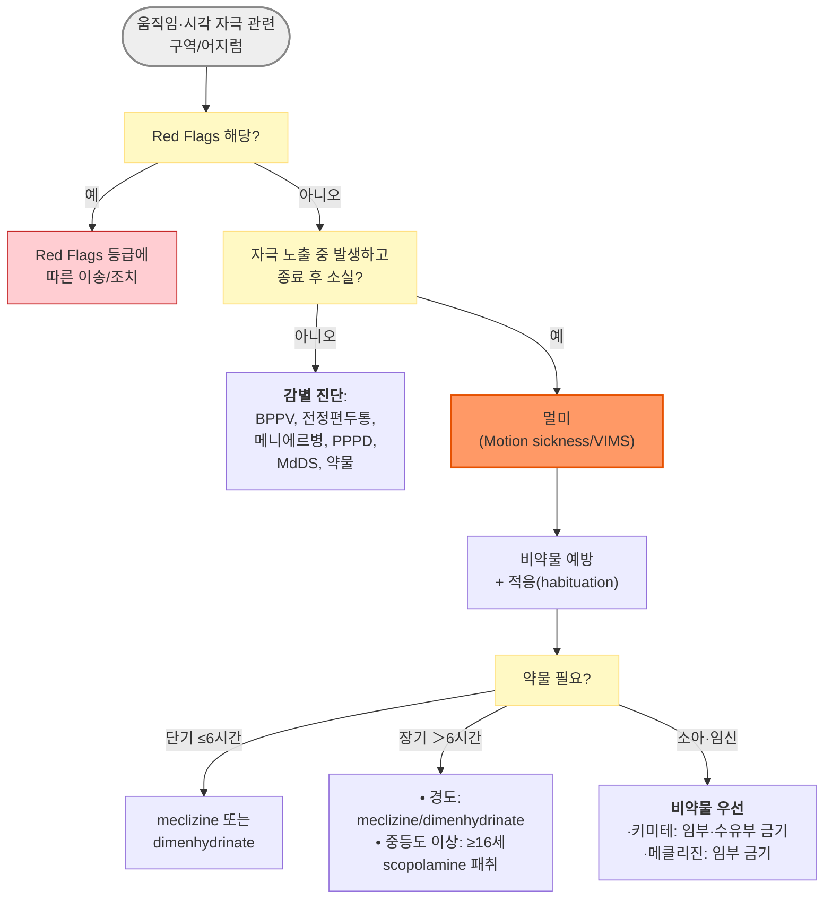

# 멀미 Motion Sickness

## <mark style="color:green;">일반 사항</mark>

* 실제 신체 움직임 또는 시각적으로 인지된 움직임에 의해 유발되는 구역·구토, 위장 불쾌감, 자율신경 및 중추신경 증상의 복합 증후군
* 충분히 강한 자극에서는 정상 전정 기능을 가진 사람 대부분에게 발생할 수 있으며, 빈도는 교통수단 자체보다 움직임의 강도·주파수, 노출 시간, 시야 확보 및 개인 감수성에 따라 크게 달라짐

## <mark style="color:green;">원인</mark>

* 예상된 감각 정보와 실제 전정·시각·고유감각 입력 사이의 불일치(sensory conflict 또는 neural mismatch)로 추정 (정확한 신경 기전이 규명된 것은 아님)
* 전정핵과 뇌간의 muscarinic·histamine H1 경로가 주요 역할을 하며, substance P-NK-1 경로도 움직임 유발 구토에 관여

**멀미를 유발하는 자극**

* 회전·상하·저주파 움직임 등 실제 신체 움직임
* 가상현실(VR), 시뮬레이터, 대형 화면·게임 등 시각적 움직임만으로도 발생 가능(VIMS, visually induced motion sickness)

**개인 감수성을 결정하는 주요 인자** (멀미 취약성에 가장 큰 영향)

* 연령 : 2세 미만에서는 드물고 7\~12세에 가장 흔하며 성인기 이후 감소하는 경향
* 여성, 임신·월경 등 호르몬 요인
* 편두통 병력, 특히 vestibular migraine
* 기저 질환 : 어지럼증, 전정 질환, 메니에르병
* 가족력 (유전적 감수성)

**증상을 악화시키거나 촉발하는 수정 가능한 인자**

* 약물 (아래 목록 참조)
* 나쁜 공기 - 냄새·흡연·환기 불량
  * 일산화탄소 중독은 멀미와 혼동될 수 있으므로 Red Flags 참조
* 음주
* 감정 변화 - 두려움·불안
* 수면 부족

**구역·어지럼을 유발하여 멀미와 혼동하거나 증상을 악화시킬 수 있는 약물**

* 아편유사제 : morphine, codeine, tramadol; CTZ 직접 자극, 위 배출 지연
* 항생제 : erythromycin, metronidazole, tetracycline; 구역 유발, 위장관 자극
* NSAIDs : ibuprofen, naproxen, aspirin; 위장관 자극
* 항우울제 : SSRI·TCA·MAOI; 어지럼증·구역 유발
* 항경련제 : valproate, carbamazepine; 어지럼증·구역 유발
* 호르몬제 : 경구피임약·HRT; 일부에서 감수성 증가 가능
* 항암제 : cisplatin, cyclophosphamide; 강력한 CTZ 자극
* 디곡신 : 치료 범위에서도 구역 유발 가능
* 도파민 작용제 : levodopa, bromocriptine; CTZ 도파민 수용체 자극
* GLP-1 수용체 작용제 : semaglutide, tirzepatide 등; 위 배출 지연, 구역·구토 흔함
* 기타 : metformin, 철분제; 위장관 자극

## <mark style="color:green;">임상 양상</mark>

* 초기에는 위 인지감(stomach awareness; 평소 의식하지 않던 위장이 느껴짐), 온감, 하품, 식은땀, 창백, 침 분비 증가, 어지럼이 점진적으로 나타나고 이후 구역·구토로 진행 가능
* 위장관 : 상복부 불쾌감·팽만, 트림, 식욕 저하, 구역, 구토
* 중추신경·sopite syndrome : 졸림, 피로, 무기력, 집중력 저하, 두통
* 기타 : 과호흡, 냄새 민감성 증가; VIMS에서는 눈 피로·시야 흐림·두통이 상대적으로 흔함
* 뚜렷한 혼란·의식 변화는 전형적 멀미보다 중추성 질환, 탈수 또는 멀미약 부작용을 우선 고려

### <mark style="color:$danger;">🚩 Red Flags!</mark>

<mark style="color:$danger;">**즉각 조치**</mark>

* 복시, 구음장애, 연하곤란, 사지 위약·감각 이상, 새로운 보행 불능·심한 몸통 실조 또는 의식 변화 동반 `뇌간·소뇌 경색/출혈`
* 수직안진, 순수 회선안진 또는 주시 방향에 따라 방향이 바뀌는 안진 `중추성 어지럼`
* 급성 지속성 어지럼과 새로운 한쪽 청력저하 동반 `AICA 영역 경색` `미로 경색`
* 갑작스럽고 심한 두통(thunderclap 양상) 또는 새로운 경부통 동반 `지주막하출혈` `소뇌출혈` `척추동맥박리`
* 고에너지 외상 후 심한 어지럼·반복 구토 `두개내 출혈` `측두골 골절`
* 같은 차량·선실·실내에 있던 여러 사람이 동시에 두통·구역·어지럼 호소 `일산화탄소 중독`
* 항콜린성 멀미약(스코폴라민 패취 등) 사용 중 혼돈·환각·초조 또는 체온 상승·발한 감소 `항콜린 독성` `고체온`
* 항콜린성 멀미약 사용 후 갑작스러운 안통·충혈·시력저하·빛 번짐 `급성 폐쇄각녹내장`

<mark style="color:$warning;">**당일\~수일 내 평가**</mark>

* 멀미 병력이 없던 성인에서 처음 발생한 심한 어지럼·구토, 특히 고령·혈관 위험인자 보유 `중추성 어지럼` `급성 전정 증후군`
* 움직임 노출이 끝난 뒤에도 심한 어지럼·구역·구토가 지속되거나 자극과 무관하게 발생 `급성 전정 증후군` `전정신경염`
* 반복 구토로 경구 수분 섭취가 어렵거나 핍뇨·전해질 이상 의심 `탈수` `전해질 이상`
* 항콜린성 멀미약 사용 후 배뇨 곤란 `급성 요폐`

<mark style="color:$info;">**조기 평가 및 추적**</mark>

* 적절한 비약물·약물 예방에도 반복적으로 심한 증상이 발생하거나 일상·여행을 현저히 제한 `motion sickness disorder` `VIMSD`
* 움직임 종료 후 흔들림·출렁임이 48시간을 초과하여 지속 `MdDS`
* 반복되는 이명·청력 변동, 편두통 양상 또는 체위성 어지럼 `전정편두통` `메니에르병` `BPPV`


움직임 자극과 무관한 지속성 어지럼은 급성 전정 증후군(acute vestibular syndrome, AVS) 감별을 요함. 자발안진이 동반된 AVS에서는 훈련된 검사자가 HINTS Plus를 적용할 수 있으나, 단순 멀미나 자발안진이 없는 환자에게 적용하는 검사는 아님


## <mark style="color:green;">진단</mark>

* 멀미는 병력과 임상 양상으로 진단

### <mark style="color:orange;">병력 및 임상 양상</mark>

* 신체 움직임(VIMS는 시각적 움직임) 노출 중 다음 5개 영역 중 1개 이상에서 최소 수준을 넘는 증상·징후 발생
  * ① 구역 및/또는 위장관 불편감(위 인지감 포함) ② 체온조절 이상(발한, 온감) ③ 각성 변화(졸림, 피로) ④ 어지럼 및/또는 현훈 ⑤ 두통 및/또는 눈피로
* 증상은 노출 중 발생하여 노출이 길어질수록 심해지고, 움직임이 끝나면 결국 소실
* 발생 상황 : 교통수단·VR 등 자극 종류, 자세, 시야 확보, 노출 시간 및 반복 노출과의 시간적 연관성
* 구역·어지럼을 유발할 수 있는 약물 복용 여부
* 편두통·전정 질환 기왕력
* 다른 원인으로 설명되지 않음


같거나 유사한 자극에 의해 최소 5회 반복 유발되고, 반복 노출에도 중증도가 의미 있게 감소하지 않으며, 활동 변경·회피 행동 또는 노출 전 예기적 혐오 정서 반응을 초래하고, 다른 질환으로 더 잘 설명되지 않으면 motion sickness disorder(MSD) 또는 VIMSD로 진단; 2\~4회이면 probable MSD/VIMSD. \
경미하거나 쉽게 회피 가능하고 기능적 영향이 없는 멀미는 장애로 보지 않음 \[Bárány Society 2021]


### <mark style="color:orange;">검사</mark>

* 일반적으로 불필요; 진단이 불확실하거나 감별을 위하여 고려
* 감별이 필요한 경우에는 활력징후, 탈수 상태, 신경학적 진찰, 보행·안진·청력 평가를 시행하고 임상 상황에 따라 영상검사 등을 고려

### <mark style="color:orange;">감별</mark>

* MdDS 진단 기준 : 배·비행기 등 수동 움직임 노출이 끝난 뒤 48시간 이내에 rocking, bobbing, swaying이 시작되어 48시간을 초과해 지속하고, 다시 수동 움직임에 노출되면 일시적으로 호전
  * 경과 분류 : 증상 지속 중이며 관찰 1개월 미만 - 진행 중(in evolution) MdDS; 1개월 이내 소실이 확인된 경우(후향적 진단) - 일과성 MdDS; 1개월 초과 지속 - 지속성 MdDS
  * 하선 직후 수시간 이내 사라지는 흔들림은 정상 반응이며 증후군이 아님
* 응급 감별이 필요한 중추성 병변은 위의 Red Flags 참조
* [어지럼](020_-dizziness.md)

<table data-search="false"><thead><tr><th width="153">질환</th><th>멀미와의 차이점</th><th>핵심 감별 포인트</th></tr></thead><tbody><tr><td>BPPV</td><td>차량·화면 노출과 무관, 머리 위치 변화로 유발</td><td>1분 미만의 회전성 현훈; Dix-Hallpike·supine roll test</td></tr><tr><td>전정편두통</td><td>움직임 과민이 동반될 수 있으나 자발 발작이 있음</td><td>편두통 병력·특징과 함께 5분\~72시간의 어지럼 발작</td></tr><tr><td>메니에르병</td><td>자극과 무관한 자발 현훈 발작</td><td>20분\~12시간 현훈 + 변동성 저음역 난청·이명·이충만감</td></tr><tr><td>전정신경염</td><td>자극과 무관한 급성 지속성 현훈</td><td>수일간 지속, 자발안진, head impulse test 양성</td></tr><tr><td>PPPD(지속성 체위지각 어지럼증)</td><td>움직임 노출 여부와 관계없이 만성 지속</td><td>3개월 이상 대부분의 날에 증상; 직립·능동/수동 움직임·복잡한 시각 자극에서 악화</td></tr><tr><td>MdDS</td><td>움직임이 끝난 뒤 시작, 다시 움직이면 호전</td><td>하선·하기 후 48시간 이내 시작, 48시간 초과 지속</td></tr><tr><td>일산화탄소 중독</td><td>동승자 여러 명에게 동시 발생</td><td>두통 동반, 환경 확인, COHb 측정</td></tr><tr><td>약물 부작용</td><td>움직임과 무관</td><td>복용 시작·증량과의 시간적 연관</td></tr></tbody></table>

***


```mermaid
graph TD
    Start(["움직임·시각 자극 관련 <br/>구역/어지럼"]) --> RF["Red Flags 해당?"]
    RF -->|예| ER[Red Flags 등급에 <br/>따른 이송/조치]
    RF -->|아니오| Q1["자극 노출 중 발생하고 <br/>종료 후 소실?"]
    Q1 -->|아니오| DDX["<b>감별 진단</b>: <br/>BPPV, 전정편두통, <br/>메니에르병, PPPD, <br/>MdDS, 약물"]
    Q1 -->|예| MS["멀미 <br/>(Motion sickness/VIMS)"]
    MS --> NP["비약물 예방 <br/>+ 적응(habituation)"]
    NP --> Q2["약물 필요?"]
    Q2 -->|"단기 ≤6시간"| S1["meclizine 또는 <br/>dimenhydrinate"]
    Q2 -->|"장기 ＞6시간"| S2["• 경도: <br/>meclizine/dimenhydrinate<br/>• 중등도 이상: ≥16세 <br/>scopolamine 패취"]
    Q2 -->|"소아·임신"| S3["<b>비약물 우선</b><br>·키미테: 임부·수유부 금기<br>·메클리진: 임부 금기"]
    style Start fill:#eeeeee,stroke:#888888,stroke-width:2px
    style MS fill:#f96,stroke:#e65100,stroke-width:2px
    style RF fill:#fff9c4,stroke:#ffe082
    style Q1 fill:#fff9c4,stroke:#ffe082
    style Q2 fill:#fff9c4,stroke:#ffe082
    style ER fill:#ffcdd2,stroke:#c62828

```

<p align="center"><strong>진단 및 치료 알고리듬</strong> <em><mark style="color:$info;">(저자 구성)</mark></em></p>

***

## <mark style="background-color:$warning;">Management</mark>

### <mark style="color:orange;">치료 방침</mark>

* 예방이 핵심 : 약물·비약물 치료 모두 증상 발생 전에 시행할 때 효과가 가장 크며, 구역·구토가 시작된 후에는 효과가 현저히 감소함
* 증상의 중증도, 여행 기간, 환자 연령, 기저 질환에 따라 치료법 선택
* 경증 : 비약물 치료 우선; 필요 시 항히스타민제 추가
* 성인 약물 선택
  * 단기 노출(≤6시간)
    * 경도\~중등도 자극 : meclizine 또는 dimenhydrinate
    * 강한 자극 : promethazine(국내 유통 제품 없음)
  * 장기 노출(＞6시간)
    * 경도 자극 : meclizine 또는 dimenhydrinate
    * 중등도 이상 자극 : scopolamine 패취
* scopolamine과 1세대 항히스타민제의 우열은 확립되지 않음
* 여러 진정성·항콜린성 멀미약의 일상적 병용은 부작용을 증가시키므로 피함
* 구역·어지럼 유발 약물 복용 중인 경우 원인 여부를 평가하고 필요 시 조정
* 이미 발생한 멀미 : 눕히고 안심시킴, 수분·전해질 보충
  * 증상 발생 후에는 위 정체로 경구약 흡수가 떨어지므로 중증이면 비경구 투여 고려
* 편두통 병력자는 편두통 예방·급성기 치료가 멀미 조절에 도움될 수 있음

## <mark style="color:green;">비-약물 치료 및 예방</mark>

* 증상이 발생했던 경험이 있는 상황을 피함
* 움직임이나 감각 불일치를 줄이기 위한 좌석 선택
  * 비행기 : 날개 부근
  * 자동차 : 성인 승객은 앞좌석·앞을 향한 좌석
  * 배 : 선체 중앙부·수면에 가까우며 수평선이 보이는 자리
* 등받이에 기대어 앉아 머리를 뒤쪽에 밀착하여 머리 움직임을 줄임
* 소아는 멀미 예방보다 연령·체격에 맞는 카시트·부스터 및 뒷좌석 탑승 원칙을 우선하고, 가능한 범위에서 창밖 먼 곳을 보게 함
* 시각 입력 최소화 : 움직이는 물체를 주시하지 않음, 수평선 보기, 먼 곳에 시선 고정, 움직이는 상태에서 독서하지 않음; 바깥 시야를 확보할 수 없으면 눈을 감고 있음
* 식사 : 과식·기름진 음식은 피하고 필요 시 가벼운 식사와 충분한 수분 섭취
  * 특정 식이의 예방 효과 근거는 제한적
* 충분한 수면/휴식 : 수면 부족은 증상을 악화시킴
* 음주·흡연(니코틴)은 멀미 자체를 악화시키므로 피함
* 규칙적인 호흡 조절, 환기 개선, 유독 가스 회피, 얼굴에 바람 쐬기, 사탕·껌
  * 음악·향기 등 주의 분산은 보조적으로 도움될 수 있으나 근거는 제한적
* 적응(habituation) : 멀미 유발 상황에 대한 노출을 점차 늘림. 약물보다 효과적인 장기 대책이지만 획득에 시간이 걸리고 자극 특이적이며, 효과 유지를 위해서는 주기적 재노출이 필요

### <mark style="color:orange;">VIMS(시각 유발 멀미·디지털 멀미)</mark>

* 증상이 시작되면 화면·VR 노출을 즉시 중단하고 완전히 회복한 뒤 다시 사용
* 처음에는 짧게 사용하고 휴식 간격을 두면서 노출 시간을 서서히 늘림
* 앉은 자세에서 불필요한 머리·몸 움직임을 줄이고, 기기 착용 상태와 화면 끊김·지연을 점검
* 기기가 지원하면 시야각 또는 주변부 시야를 줄이거나 고정된 지평선·참조점을 사용하고, 충분한 수면과 환기를 확보

### <mark style="color:orange;">생강·P6 지압 등 보완요법</mark>

* 생강 : 효과에 관한 근거가 제한적이고 연구 결과가 일관되지 않지만, 원하는 환자는 보조적으로 시도할 수 있음. 항응고제 복용 등 출혈 위험이 있으면 주의
* 지압 : 손목 P6 지압(밴드 포함)은 실험실 연구에서 위약 이상의 효과가 확인되지 않았으나, 위약 효과가 클 수 있어 원하는 환자는 보조적으로 시도할 수 있음
  * P6 : 손바닥 쪽 손목 주름에서 몸쪽으로 약 4\~6 ㎝, palmaris longus와 flexor carpi radialis 힘줄 사이

## <mark style="color:green;">약물 치료</mark>

* 증상 발생 전 투여; 투여 시점은 약물별 허가 용법과 작용 발현시간을 따름
  * 국내 허가 용법 : dimenhydrinate - 출발 최소 30분 전(30\~60분 전); meclizine - 출발 최소 1시간 전; 키미테패취 - 출발 최소 4시간 전
  * \[CDC Yellow Book 2026] 작용 발현시간은 경구 dimenhydrinate·meclizine·promethazine 약 2시간, scopolamine 경피제 6\~8시간(1 ㎎ 제형)\~12시간(1.5 ㎎ 제형)이므로 가능한 한 여유 있게 투여하고, 패취는 전날 저녁 부착도 고려
* 약물 부작용 등을 고려하여 출발일 이전에 시험 투여를 권고
* 1차 선택 : 항콜린제, 항히스타민제; vestibular nuclei 활성 감소 작용
* 5-HT3 길항제(ondansetron·granisetron 등)는 작용 부위가 중추 전정 경로가 아니어서 멀미에 효과가 없음
* 기타 항구토제(metoclopramide 등)는 멀미 예방 근거가 부족하므로 권장하지 않음
* benzodiazepine(diazepam 등)은 진정, 운전 장애, 낙상·호흡억제 및 의존성 위험 때문에 단순 멀미 치료제로 권장하지 않음

### <mark style="color:orange;">항콜린제 패취</mark>

* 금기 : 협우각형(폐쇄각) 녹내장, 서맥, 전립선비대 등 배뇨장애, 임부·수유부, 7세 이하 영유아, 벨라돈나 알칼로이드 과민증
* 주의 : 고령자, 간·신장 질환, 유문협착·장폐색, 발작·정신병 병력, 다른 항콜린제 병용
* 부작용 : 입마름, 졸음, 시야 흐림·산동, 소변 저류; 혼돈·지남력 장애·환각
  * 혼돈·환각 부작용은 고령자·소아에서 위험 높으며, 발생 시 즉시 제거
* 제거 후 금단 증상 : 특히 3일 이상 사용한 뒤 제거하면 24시간 이상 지난 후 평형장애, 어지럼증, 구역·구토, 복통, 발한, 혼란, 근력저하, 서맥·저혈압 등이 나타날 수 있음
  * 제거 직후의 증상을 곧바로 금단으로 단정하지 말고 멀미 지속, 탈수 및 다른 전정질환을 감별
* scopolamine 경피제 <mark style="color:blue;">\[키미테패취]</mark> (성인용 1.5 ㎎/매) (비급여)
  * 출발 최소 4시간 전(허가 용법) 귀 뒤의 털 없는 건조한 피부에 1매 부착; 1매로 72시간 효과 지속
  * 작용 발현에 시간이 걸리므로 가능하면 전날 저녁 등 충분히 일찍 부착
  * 3일 이상 적용해야 할 경우 첫 번째 것을 제거하고 새 패취를 반대편 귀 뒤에 부착
  * 성인용 키미테패취는 ≥16세에서 사용
  * 소아용(어린이키미테패취)은 허가 취소되어 현재 소아용 스코폴라민 패취는 없음. ＜16세에게 성인용 패취를 자르거나 임의로 사용하지 않음
  * 부착 후와 제거 후 모두 손과 부착 부위를 비누로 씻음
  * 사용한 패취는 접착면끼리 맞붙여 접어 어린이 손이 닿지 않게 폐기
  * 고체온 : 항콜린 작용으로 심부체온 상승·발한 감소 → 사망 사례를 포함한 중증 고체온이 시판 후 보고되어 FDA 라벨 경고 신설(2025). 소아·고령자, 고온 환경, 전기담요·핫팩 등 외부 열원에서 위험 증가
    * 사용 중 전기담요, 핫팩 등 외부 발열 기구 사용 금지
    * 체온 상승 또는 더운 환경에서 땀이 나지 않으면 즉시 제거하고 진료
    * 제거 후에도 피부에 남은 약물 흡수로 증상이 수시간\~수일 지속될 수 있음
  * 금속성 지지체에 의한 피부 화상 위험이 있으므로 MRI 검사 전에 제거하고 의료진에게 사용 사실을 알림

### <mark style="color:orange;">항히스타민제</mark>

* 항콜린 및 진정 작용이 있는 1세대 항히스타민제 선택
  * 비진정성 2세대 항히스타민제(cetirizine, fexofenadine, loratadine 등)는 뇌 투과를 피하도록 설계되고 항콜린 작용이 없어 멀미에 효과 없음
* 공통 주의/부작용 : 졸림, 입마름, 시야 흐림, 배뇨 곤란 등 항콜린성 이상반응
  * 금기·허가 연령은 성분·제품별 허가사항을 확인
* dimenhydrinate <mark style="color:blue;">\[보나링에이정 50 ㎎]</mark>
  * 성인 : 치료 - 50 ㎎ tid\~qid; 예방 - 여행 30\~60분 전 50\~100 ㎎ 1회
  * 원칙적으로 1일 200 ㎎을 초과하지 않음
* meclizine : 25\~50 ㎎ q24h, 여행 60분 전 복용(여행 중 24시간마다 반복 가능)
  * 1일 1회 투여로 편리하고 dimenhydrinate보다 진정이 적은 편 <mark style="color:blue;">\[파비스염산메클리진정 25 ㎎]</mark>
  * 금기 : 임부·임신 가능 여성, 12세 이하, 협우각형 녹내장, 전립선비대 등 배뇨장애
* promethazine : 성인 25 ㎎을 여행 약 2시간 전 경구 투여(작용 발현 약 2시간) (현재 국내 유통 제품 없음)
  * 진정 작용이 가장 강하므로 운전·위험 작업 금지
  * 다른 진정성·항콜린성 멀미약과 일상적으로 병용하지 않음
  * ＜2세는 치명적 호흡억제 위험으로 절대 금기이며, ≥2세도 최저 유효용량으로 신중히 사용
* 시판 경구용 멀미약에는 카페인·pyridoxine 등이 포함된 dimenhydrinate <mark style="color:blue;">\[이지롱내복액]</mark>(성인) 또는 meclizine <mark style="color:blue;">\[노보민시럽]</mark>(≥13세) 복합제가 있으므로 성분 중복과 허가 연령을 확인. 운전 등에 위험이 있으며 저녁 복용 시 불면·두근거림 가능 (비급여)

### <mark style="color:orange;">소아</mark>

* 비약물 요법을 우선하며, 과진정과 역설적 흥분이 생길 수 있으므로 멀미약 사용에 특히 주의
* 국내 제품별 허가 연령·제형을 확인하여 사용하고 성인용 스코폴라민 패취는 사용하지 않음
* CDC Yellow Book 2026에서는 6\~12세에 dimenhydrinate 12\~25 ㎎(소아용 씹는 정제)을 여행 1\~2시간 전에 고려할 수 있으나, 국내 보나링에이정 50 ㎎을 임의로 분할하여 소아에게 투여하라는 의미는 아니며 국내 소아 허가 제형과 제품별 용량을 우선함
* diphenhydramine은 진정과 역설적 흥분 위험이 있고 국내 적응증은 불면증이며 ＜15세 금기이므로 소아 멀미약으로 사용하지 않음 <mark style="color:blue;">\[디펙타민]</mark>

### <mark style="color:orange;">임신·수유 중 멀미 치료</mark>

* 비약물 요법 우선 : 좌석 선택, 시선 고정, 머리 움직임 최소화 등
  * P6 지압·생강은 효과가 일관되지 않음
* 치료 약물
  * dimenhydrinate : 인체 임신 자료가 비교적 축적되어 있으므로 필요성에 따라 최소 유효용량으로 단기간 고려 <mark style="color:blue;">\[보나링에이정]</mark>
  * meclizine : 국제적으로 임신 자료가 축적되어 있으나, 국내 기준은 임부에게 투여 금지임
  * scopolamine : 국내 키미테패취는 임부·수유부에게 사용 금지
* 수유 중에는 약제별 자료를 확인하고 최소 유효용량·단기간 사용을 원칙으로 하며, 영아의 졸림·수유저하와 모유량 감소 가능성을 관찰(키미테패취는 수유부 금기)

### <mark style="color:orange;">NK-1 수용체 길항제 : tradipitant</mark>

* substance P 매개 NK-1 수용체를 선택적으로 차단하는 새로운 기전
* 제품명 Nereus : 성인의 움직임 유발 구토 예방 적응증으로 2025년 12월 30일 FDA 승인 (국내 미허가); 이미 발생한 구역·구토의 치료 효과는 평가되지 않음
* 2건의 3상 연구에서 위약 대비 구토 발생을 유의하게 감소시킴. 다만 FDA 라벨의 구역 단독 2차 평가변수(worst nausea score)는 두 연구 모두 통계적으로 유의하지 않음
* 용량 : 85 ㎎ 또는 170 ㎎ 중 최소 유효용량을 1회 경구 투여; 170 ㎎은 85 ㎎ 캡슐 2개. 24시간 내 1회만 투여; 움직임 노출 약 60분 전, 정규 식사(한 끼 식사) 최소 1시간 전 또는 식후 2시간 후 공복에 복용
* 흔한 이상반응 : 졸림, 두통, 피로; 단독 복용으로도 운전·위험 기계 조작 능력을 저하시킬 수 있음
* 다른 중추신경억제제 또는 강력 CYP3A4 억제제 병용 시 진정 증가 가능 - 병용이 불가피하면 운전·위험 작업 금지

***

### <mark style="color:red;">질병코드</mark>

* T75.3 멀미

***

## <mark style="color:purple;">처방례</mark>

> **처방례 1.** 경증 멀미 - 단기 여행, 항히스타민제
>
> ```
> 보나링에이정 50 ㎎/T  1T  여행 30~60분 전 복용
> ※ 치료 목적으로 반복 시 1회 50 ㎎ tid~qid, 원칙적으로 1일 최대 200 ㎎
> ※ 졸음·입마름 주의, 음주·운전 금지
> ```

> **처방례 2.** 경증 멀미 - 1일 1회, 졸림 적은 편
>
> ```
> 파비스염산메클리진정 25 ㎎/T  1T  여행 60분 전 복용
> ※ 1일 1회 투여로 편리(여행 중 24시간마다 반복 가능)
> ※ dimenhydrinate보다 졸림이 적은 편이나 개인차가 있으므로 운전·위험 작업 및 음주 금지
> ※ 12세 이하, 임부·임신 가능 여성, 협우각형 녹내장, 배뇨장애 환자에게 투여하지 않음
> ```

> **처방례 3.** 중등도\~중증 - 장기 여행 (3일 이내), 스코폴라민 패취
>
> ```
> 키미테패취 1.5 ㎎/P  1매  출발 최소 4시간 전(가능하면 전날 저녁) 귀 뒤 털 없는 건조한 피부에 부착 (약 72시간 유효)
> ※ 만 16세 이상; 3일 이상 필요 시 첫 번째 패취 제거 후 반대편 귀 뒤에 새 패취 부착
> ※ 부착 후와 제거 후 모두 손과 부착 부위를 비누로 씻음 (눈에 닿으면 산동·시야 흐림)
> ※ 고체온 경고 (FDA 라벨 2025) : 체온 상승·발한 감소 시 즉시 제거; 전기담요·핫팩 금지; 고령자·고온 환경 주의
> ※ 혼돈·환각, 안통·시력저하, 배뇨 곤란 시 즉시 제거 후 진료
> ※ MRI 검사 전 제거 (금속 지지체에 의한 부착 부위 화상 위험)
> ※ 사용한 패취는 접착면끼리 접어 어린이 손이 닿지 않게 폐기
> ```

***

### <mark style="color:$success;">핵심 복약 지도</mark>

> **멀미약은 미리 복용해야 효과가 있습니다**
>
> * 보나링에이정은 출발 **30분\~1시간 전**, 메클리진은 **1시간 전**, 스코폴라민 패취는 **최소 4시간 전(가능하면 전날 저녁)에** 적용하십시오.
> * 멀미 증상이 시작된 후에는 약의 효과가 크게 줄어듭니다.
> * 처음 사용하는 약은 여행 전날 미리 시험 복용하여 부작용 여부를 확인하십시오.

> **졸음 및 주의력 저하**
>
> * 멀미약(항히스타민제, 스코폴라민)은 졸음·집중력 저하를 일으킬 수 있습니다.
> * 복용 후에는 **운전, 기계 조작, 고소 작업을 하지 마십시오**.
> * 음주는 졸음을 크게 악화시킬 뿐 아니라 **멀미 자체도 심하게 만듭니다**. **복용 중 음주를 삼가십시오**.

> **스코폴라민 패취 사용 시 주의사항**
>
> * 귀 뒤 털 없는 깨끗하고 건조한 피부에 부착하십시오.
> * **부착 후 반드시 손을 깨끗이 씻으십시오** - 손에 남은 약이 눈에 닿으면 동공 확대·시야 흐림이 생길 수 있습니다.
> * 패취를 **떼어낸 뒤에도** 손과 붙였던 자리를 비누로 씻고, 사용한 패취는 접착면끼리 붙게 접어서 버리십시오.
> * 패취를 자르거나 2장을 동시에 붙이지 마십시오.
> * 열이 오르거나 더운 곳에서 땀이 나지 않으면 즉시 패취를 제거하고 의사에게 알리십시오. 패취를 뗀 뒤에도 몸에 남은 약 때문에 증상이 한동안 지속될 수 있습니다.
> * 패취 사용 중 **헛것이 보이거나 정신이 혼란스럽거나, 눈이 갑자기 아프고 흐려지거나, 소변이 잘 나오지 않으면** 즉시 패취를 떼고 진료를 받으십시오.
> * **MRI 검사 전에는 패취를 제거하고 의료진에게 알리십시오.** 금속성 막 때문에 피부 화상이 생길 수 있습니다.
> * 며칠간 사용한 뒤 제거하면 일반적으로 **24시간 이후**부터 어지럼증·구역 등 금단 증상이 나타날 수 있습니다. 증상이 심하면 진료를 받으십시오.

> **이런 경우 복용을 피하거나 의사와 상담하십시오**
>
> * 폐쇄각녹내장, 전립선비대 등으로 소변 보기 어려운 경우, 장폐색·발작·정신병 병력이 있는 경우
> * **임부·수유부는 키미테패취를 사용하지 마십시오.** 메클리진(파비스염산메클리진정)도 임신 중이거나 임신 가능성이 있으면 복용하지 마십시오.
> * 그 밖에 임신·수유 중 멀미약이 꼭 필요하면 반드시 의사와 상담하십시오. 가능하면 좌석 선택·시선 고정 등 비약물 요법을 먼저 시도하십시오.
> * **성인용 키미테패취는 만 16세 이상에서만 사용합니다.** 16세 미만에게는 사용하지 마시고, 패취를 자르지 마십시오.

***

## <mark style="color:blue;">환자 안내서</mark>


**멀미, 미리 대비하면 여행이 편안해집니다**

멀미약은 증상이 생기기 전에 복용해야 효과가 있습니다. 자신에게 맞는 약을 여행 전날 미리 시험해 보세요.


#### <mark style="color:$primary;">멀미가 생기는 이유는 무엇인가요?</mark>

* 눈·귀·몸이 각각 다른 움직임 신호를 뇌에 보낼 때 생기는 일종의 생리적 반응입니다.
* 자동차·배·비행기 외에도 가상현실(VR) 기기 사용 중에도 발생할 수 있습니다.
* 2세 미만에서는 드물고 7\~12세에 가장 흔하며, 여성·편두통 환자에서도 더 잘 나타납니다.

#### <mark style="color:$primary;">멀미를 줄이는 생활 요령</mark>

* **좌석 선택** : 성인 자동차 승객은 앞좌석·앞 방향 좌석, 배는 선체 중앙부·수평선이 보이는 자리, 비행기는 날개 부근을 선택하십시오. 소아는 멀미보다 카시트·부스터와 뒷좌석 탑승 원칙을 우선하십시오.
* **시선 고정** : 멀리 수평선이나 고정된 사물을 바라보고, 이동 중에는 책·스마트폰을 보지 마십시오.
* **식사 조절** : 출발 전 과식하지 말고, 기름지거나 강한 향의 음식을 피하십시오. 소량씩 자주 드시고 충분히 수분을 섭취하십시오.
* **환기** : 신선한 공기를 쐬거나 얼굴에 바람을 맞으면 도움이 됩니다.
* **자세** : 머리를 뒤로 기대어 움직임을 최소화하십시오.
* **술과 담배 피하기** : 음주와 흡연은 멀미를 더 심하게 만듭니다.
* **조금씩 적응하기** : 멀미가 나는 상황에 안전하고 견딜 수 있는 범위에서 짧게 시작해 점차 노출을 늘리면 몸이 적응하여 멀미가 줄어듭니다.

#### <mark style="color:$primary;">멀미약 복용 안내</mark>

* **반드시 출발 전에** 사용하십시오 - 먹는 약은 처방받은 약의 안내에 따라 30분\~1시간 전, 패취는 최소 4시간 전(가능하면 전날 저녁).
* 증상이 생긴 후에는 약의 효과가 크게 줄어듭니다.
* **졸음 주의** : 멀미약 복용 후에는 운전·기계 조작·음주를 하지 마십시오.
* 복합 멀미약에는 카페인이 들어 있을 수 있으므로 성분을 확인하고, 저녁 복용 시 불면·두근거림에 주의하십시오.
* **스코폴라민 패취**를 붙인 후와 뗀 후에는 손을 깨끗이 씻으십시오. 손에 묻은 약이 눈에 닿으면 시야가 흐려집니다.
* 성인용 스코폴라민 패취는 **만 16세 이상**에서만 사용하고, 16세 미만에게는 사용하지 마십시오. 패취를 자르지 마십시오.
* MRI 검사 전에는 패취를 제거하고 의료진에게 알리십시오.
* 폐쇄각녹내장·배뇨장애가 있으면 사용 전 반드시 의사와 상담하십시오. **임신 중이거나 수유 중이면 멀미 패취를 사용하지 마시고**, 먹는 멀미약도 의사와 상담 후 사용하십시오.

#### <mark style="color:$primary;">이럴 때는 즉시 119 또는 응급실을 이용하세요</mark>

* 어지럼증과 함께 팔다리 힘 빠짐·발음 장애·물체가 둘로 보임·걷기 어려움이 생긴 경우
* 한쪽 귀가 갑자기 안 들리면서 심한 어지럼이 계속되는 경우
* 갑자기 매우 심한 두통·목 통증, 의식 변화가 생기거나 머리를 크게 다친 뒤 구토하는 경우
* **차 안이나 실내에서 함께 있던 여러 사람이 동시에 두통·메스꺼움·어지럼을 느끼는 경우** - 운전 중이면 안전한 곳에 정차하고, 즉시 그 공간에서 벗어나 신선한 공기가 있는 곳으로 이동한 뒤 119에 신고하십시오. 의식이 흐려진 사람이 있으면 바로 119에 구조를 요청하고, 안전이 확인될 때까지 다시 들어가지 마십시오(일산화탄소 중독 가능성).
* 멀미 패취 사용 중 열이 오르며 땀이 나지 않거나, 헛것이 보이거나, 눈이 갑자기 아프고 흐려지는 경우 - 패취를 떼고 진료를 받으십시오.

#### <mark style="color:$primary;">이럴 때는 진료를 받아 보세요</mark>

* 차·배·화면과 관계없이 돌아눕거나 고개를 들고 숙일 때 1분 이내의 빙빙 도는 어지럼이 반복되는 경우 (이석증 가능성)
* 움직임이 끝난 뒤에도 구토가 계속되어 물을 마시기 어렵거나 소변량이 줄어든 경우
* 배·비행기에서 내린 뒤 흔들리는 느낌이 이틀 넘게 계속되는 경우
* 예방 조치와 약에도 멀미가 심해 여행이나 일상생활이 어려운 경우
