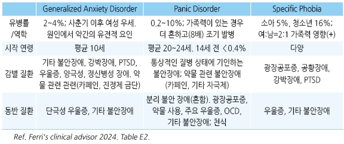
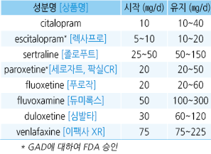
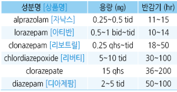
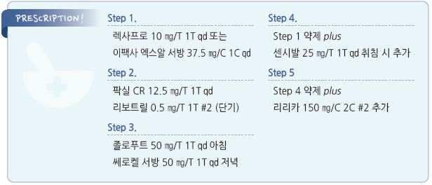

# 불안장애 Anxiety Disorder

## <mark style="color:green;">일반 사항</mark>

* 실제 발생한 위험에 비하여 과도하고 지속되며 조절하기 어려운, 불편하고 일상생활에 지장을 주는 걱정; 일상적인 상황에 대하여 과도한 불안감
* 불안감을 유발하는 실체나 상황을 피하기 위해 부적절한 행동을 취하기도 함
* 흔히 주요우울증, 기분 저하, 사회공포증을 동반
* 대부분 의학적 상태와 정신적 상태가 결합되어 있음
* 유병률 : 범불안장애 평생 유병률 여성 7%, 남성 4%; 50%가 18세 이전에 발생, 중간 연령 30세
* 만성적인 신체적 건강 문제가 있거나, 신체적 건강 문제는 없지만 이에 대한 확신을 갖고자 하거나, 여러 다른 문제들에 대하여 반복적으로 걱정을 하고 있는 경우 불안증 감별을 요함

## <mark style="color:green;">원인</mark>

* 기전(추정)
  * neurotransmitter 이상 : serotonin system의 활성 저하, norepinephrine system의 활성 증가, GABA system의 붕괴
  * 뇌기능 이상 : amygdala 및 prefrontal cortex의 활성 증가

### <mark style="color:$primary;">위험 인자</mark>

* 소아 시기의 학대, 역경, 부모의 이혼 또는 상실
* 능력 상실, 최근의 스트레스 증가(나쁜 일)
* 직업 관련 스트레스, 낮은 사회 경제적 상태
* 비만, 흡연(특히 청소년기), 알코올 남용, 약물 남용
* 만성 정신 질환 : 우울증, 공황장애, 거식증, 불안증 과거력
* 급만성 질환 또는 통증
* 정신적 문제가 있는 가족력

### <mark style="color:$danger;">🚩 Red Flags!</mark>

* 자살 위험
* 유의미한 동반 질환 (예: 약물 중독, 인격장애)
* 치료에 반응하지 않음

## <mark style="color:green;">임상 양상</mark>

* 걱정, 두려움, 예기 불안, 집중력 저하, 불안 유발 상황에 대한 경계, 대인 접촉 기피
* 안절부절, 두근거림, 떨림, 근육 긴장/통증, 땀 흘림, 손 냉증/축축함, 숨 막힘, 과호흡, 어지럼, 피로, 목 안의 덩어리 느낌, 입마름, 피부 감각 저하/저림
* 복통, 소화불량, 식욕 저하, 구역, 구토, 설사
* 수면 장애, 악몽, 성욕 감퇴

※ 공황장애에 비하여 호흡 곤란, 두근거림, 빈맥 증상은 적음

※ Anorexia, “Butterflies” in stomach(불안/긴장으로 인하여 속이 떨림), Chest pain or tightness, Diaphoresis, Diarrhea, Dizziness, Dry mouth, Dyspnea, Faintness, Flushing, Headache, Hyperventilation, Light-headedness, Muscle tension, Nausea, Pallor, Palpitations, Paresthesia, Sexual dysfunction, Shortness of breath, Stomach pain, Tachycardia, Tremulousness, Urinary frequency, Vomiting

## <mark style="color:green;">진단</mark>

### <mark style="color:$primary;">선별 검사</mark>

#### Generalized anxiety disorder 7-item [(GAD-7)](http://www.phqscreeners.com)

**Generalized Anxiety Disorder 7-item (GAD-7)**

지난 2주일 동안 당신은 다음의 문제들로 인하여 지장을 받았던 날들이 얼마나 됩니까?

<table><thead><tr><th width="367.57891845703125">항목</th><th width="79.57891845703125" align="center">없음 (0~1일)</th><th width="79.5789794921875" align="center">수일 (2~6일)</th><th width="79.578857421875" align="center">절반 이상 (7~11일)</th><th width="79.5789794921875" align="center">거의 매일 (12~14일)</th></tr></thead><tbody><tr><td>① 초조하거나 불안하거나 조마조마하게 느낀다.</td><td align="center">0</td><td align="center">1</td><td align="center">2</td><td align="center">3</td></tr><tr><td>② 걱정하는 것을 멈추거나 조절할 수 없다.</td><td align="center">0</td><td align="center">1</td><td align="center">2</td><td align="center">3</td></tr><tr><td>③ 여러 가지 것들에 대해 걱정을 너무 많이 한다.</td><td align="center">0</td><td align="center">1</td><td align="center">2</td><td align="center">3</td></tr><tr><td>④ 편안하게 있기 어렵다.</td><td align="center">0</td><td align="center">1</td><td align="center">2</td><td align="center">3</td></tr><tr><td>⑤ 너무 안절부절못해서 가만히 있기 힘들다.</td><td align="center">0</td><td align="center">1</td><td align="center">2</td><td align="center">3</td></tr><tr><td>⑥ 쉽게 짜증이 나거나 쉽게 화를 내게 된다.</td><td align="center">0</td><td align="center">1</td><td align="center">2</td><td align="center">3</td></tr><tr><td>⑦ 마치 끔찍한 일이 생길 것 같은 두려움을 느낀다.</td><td align="center">0</td><td align="center">1</td><td align="center">2</td><td align="center">3</td></tr></tbody></table>

▶ 판정 : 0\~4점 = minimal / 5\~9점 = mild / 10\~14점 = moderate / 15\~21점 = severe

\{% hint style="info" %\} **\[삶의 질 평가]** (참고 문항)\
위에 해당되는 사항이 있다면 그로 인하여 직장이나 집안일, 또 다른 사람들과 지내는 것이 얼마나 힘듭니까?\
☐ 전혀 힘들지 않다. ☐ 어느 정도 힘들다. ☐ 매우 힘들다. ☐ 극도로 힘들다. \{% endhint %\}

```

```

#### GAD-2 screening

* GAD-7 문항 ① & ②으로 시행
* 합계 점수 ≥3점인 경우 GAD를 의심(민감도 86%, 특이도 83%) 하고 추가 평가 시행

### <mark style="color:$primary;">검사</mark>

* 기질적 원인 배제를 위하여 시행
* CBC, TSH, 혈당, 전해질, urine toxicology
* ECG

### <mark style="color:$primary;">범불안장애 진단 기준 (Generalized anxiety disorder. GAD) \[DSM-5]</mark>

A. 최소 6개월 동안 많은 사건이나 활동(예: 직장이나 학교생활 수행)에 대하여 과도한 걱정과 불안감(예기 불안)이 발생한 날이 그렇지 않은 날보다 많음

B. 환자 스스로 걱정을 조절하는 것이 어렵다는 것을 알고 있음

C. 불안감과 걱정은 다음 6가지 중 ≥3가지와 관련 있음; 복수의 증상이 과거 6개월 동안 발생한 날이 그렇지 않은 날보다 많음

1. 차분하지 못함, 또는 안절부절
2. 쉽게 피로
3. 집중하기 어려움 또는 멍함
4. 과민
5. 근육 긴장
6. 수면 장애(예: 잠에 들거나 유지하기 어려움, 제대로 쉬지 못함, 불만족스러운 수면)

D. 불안, 걱정, 또는 신체적 증상은 사회, 직업, 또는 기능의 다른 중요한 영역에서 임상적으로 중요한 고통과 장애를 일으킴

E. 물질(예: 약물) 또는 일반적인 의학적 상태(예: 갑상선항진증)의 생리적 작용에 의한 것이 아님

F. 다른 정신 질환으로 더 잘 설명되지 않음

### <mark style="color:$primary;">감별</mark>

* 스트레스, 갑상선항진증, 심장 질환, 심한 신체 질환, 알코올/항불안제 금단 증상
* 약물 : 정신 자극제(예: 카페인, amphetamine, cocaine, methamphetamine, caffeine), 교감 신경 흥분제(예: β2-작용제), 항고혈압제, NSAID
* 다른 정신 질환 : 우울증, 공황장애, 강박장애, 외상 후 스트레스, 신체화장애, 조현병, 망상장애

#### 우울증

* 우울증은 과거의 사건과 상황에 대하여 자기비판적인 경향을 보이는 반면, GAD 환자들은 미래의 사건에 대하여 걱정하는 경향이 있음 (☞ p.124)
* 이른 아침 각성, 일중 기분 변화, 자살 충동 등의 우울증 증상이 GAD에서는 흔하지 않음

#### 건강염려증

* 건강염려증은 보통 질병에 대한 걱정인 반면, GAD는 질병 이외의 다른 것들에 대해서도 걱정함

#### Social anxiety disorder

* 미팅, 발표, 낯선 사람들과의 대화 등 다른 사람에 의해 평가될 수 있는 상황에 대하여 과도한 두려움을 느끼는 상태
* 사람들이 부정적인 태도(예: 거절, 어색함, 비웃음, 불쾌함)를 갖는 것에 대하여 과도하게 걱정
* 사회적 상황을 회피하거나 커다란 불안감 속에서 지냄

#### Post-traumatic stress disorder (PTSD)

* 원인 : 신체적 또는 정신적 외상(직접 피해나 목격) 후 발생
  * 예: 죽음의 현장 또는 위협, 극심한 부상, 성폭행
* 증상 : 사고 상황과 관련된 것들을 피하려는 행동, 사고와 관련된 기억 장애, 지속적인 부정 정서, 대인 관계 장애, 과잉 경계, 과각성, 수면 장애, 집중력 장애, 잘 놀람, 분노 감정 폭발, 자기 파괴적 행동
* 진단 : 임상적으로 유의미한 고통 또는 기능 장애가 1개월 이상 지속



***

## Management

### 치료 방침

* 자살 위험, 약물 남용, 다른 정신 질환 여부를 확인하고 관리
* 불안증으로 진단되면 조기에 치료 시작
* 낮은 강도의 심리적 중재 : 개별적 또는 그룹 중재
*   현저한 기능 장애가 있거나 낮은 강도의 심리적 중재로 호전되지 않는 경우 고강도 정신 치료(예:인지행동 요법) &/or

    약물 치료
* 매 방문 때마다 불안 수준 정량화 모니터링(예: GAD-7)

※ GAD는 만성 상태이므로 갑작스런 악화는 공황장애, 갑상선 질환 등 다른 질환이나 악화 요인 확인이 필요함

## 비-약물 치료

* 인지행동 요법, mindfulness-based therapy
* 카페인 섭취 제한, 금연, 금주(술로 문제를 해결하게 해서는 안 됨)
* 신체 활동, 이완 요법 : 규칙적 운동, 요가, 태극권, 기공, 명상; 일부 연구에서 유효
* 허브(근거 부족) : St. John’s wort(hyperici), Sympathyl, 시계풀(passionflower), 쥐오줌풀(valerian)

## 약물 치료

* 저용량으로 시작
* 1차 선택 : SSRI/SNRI
* 항경련제, 마약성 진통제와의 병용 시 과도한 진정, 호흡 억제가 발생될 수 있으므로 주의
* 항우울제 효과 발현까지 2~~4주 소요; 완화는 4~~6개월 후에 나타남
*   추적 관찰 : 첫 3개월 동안 2\~4주마다, 이후 3개월마다 약효와 부작용 평가

    •새로운 약제 투여 시 2\~4주 내 F/U
* 약효가 있는 경우 재발을 줄이기 위하여 최소 6개월\~12개월 이상의 치료 유지를 권고
* 약제 중단 시 tapering 하며(갑자기 중단하지 않음) 증상 재발, 약물 금단 증상 등 모니터링

#### SSRI/SNRI

* SSRIs 사이의 효과 차이는 입증되지 않음(개인차는 있음) (☞ p.1146)
* 저용량으로 시작 → 4~~6주 후 평가하여 효과가 부족하면 1~~2주 간격으로 증량
*   부작용 : 위장 장애(예: 구역, 설사), 불면, 과민, 체중↑, 혈압↑(venlafaxine); 자살 충동(＜30세에서 투여 첫 한 달 동안

    매주 자살 생각에 대하여 모니터링)
*   약물 중단 시 반동 증상 : 어지럼, 이상 감각, 구역/구토, 두통, 발한, 불안, 수면 장애

    

#### GABA-analogue

* SSRI/SNRI를 사용할 수 없을 때 고려
* pregabalin : 150\~600 ㎎ \[리리카]

#### Azapirone

* 5-HT1A autoreceptor 방해에 의한 serotonergic system 작용
* benzodiazepine보다 의존 위험은 적지만 효과가 적고 효과 발현까지 오래 걸림
* 동반된 우울증에 대해서는 효과 없음
* 부작용 : 불면, 흥분, 구역
* buspirone : 10\~60 ㎎/d \[부스파]

#### Benzodiazepine계

* SSRI/SNRI의 효과가 나타날 때까지 위기 동안 단기 투여
* 장기적 경과를 개선시키지는 못함
* 동반된 우울증에 대해서는 효과 없음
* 저용량으로 시작 (☞ p.1149)
* 고령에서는 내성 및 낙상 등의 사고 위험으로 감량 투여 (특히 long-acting 제제 주의)
*   불안, 불쾌감, 진전 등의 반동 현상을 피하기 위하여 중단 시 중간 반감기 약제(예: clonazepam)가 선호되며 중단 시

    tapering

    

#### 항정신병 약물

*   불응성 불안장애, benzodiazepine 등으로 조절 되지 않는 경우 고려

    •일차의료에서에서는 사용하지 않을 것을 권고 \[NICE]
* olanzapine : 2.5\~7.5 ㎎/d qd(hs)\~bid \[자이프렉사]
* quetiapine : 12.55\~100 ㎎/d qd(hs)\~bid \[쎄로켈]
* risperidone : 0.5\~1 ㎎/d qd(hs)\~bid \[리스페달]

#### β-차단제

* 발한, 심박수 증가 등 불안에 따른 증상 억제 효과; 불안 자체에는 효과 없음
* propranolol : 10\~120 ㎎/d \[인데놀]
* metoprolol : 100\~200 ㎎/d \[베타록] (☞ p.487)

## 치료 Step

```
[대한불안의학회]
```

#### Step 1

* 1차 약물 : SSRI, SNRI 또는 buspirone 단독
* 임상의의 판단에 따라 benzodiazepine계 약물 병용 가능(초기/단기)

#### Step 2

* Step 1에서 사용하지 않은 SSRI, SNRI 또는 buspirone 단독 사용
* 임상의의 판단에 따라 benzodiazepine계 약물 병용 가능(초기/단기)

#### Step 3

* 병용 또는 부가 약물 추가
*   비전형 항정신병제

    •quetiapine : 시작 25 ㎎/d → 매주 or 격주로 25\~50 ㎎ 증량, 최대 300 ㎎/d \[쎄로켈]
*   항히스타민제

    •hydroxyzine : 50\~100 ㎎ qid \[아디팜]

#### Step 4

* Step 3에서 사용되지 않은 약물로 병용 요법
* SSRI, SNRI, NaSSA(Noradrenergic and specific serotonergic antidepressant) 또는 TCA 계열이 포함된 또 다른 병용 요법
*   TCA

    •amitriptyline : 25~~50 ㎎/d, 100~~300 ㎎/d; 편두통 적응 \[에트라빌]

    •imipramine : 25~~50 ㎎/d, 100~~300 ㎎/d \[이미프라민]

    •nortriptyline : 25 ㎎/d, 50\~150 ㎎/d; 근골격 통증 적응 \[센시발]

#### Step 5

* Step 4에서 사용되지 않은 계열의 3번째 약물 추가
* bupropion : 100\~450 ㎎ \[웰부트린]
* pregabalin : 150\~600 ㎎ \[리리카]

#### Step 6

* 진단에 대한 재평가 및 공존 질환에 대한 평가

> **질병코드** F41.1 범불안장애

F41.2 혼합형 불안 및 우울장애

F41.9 상세불명의 불안장애


