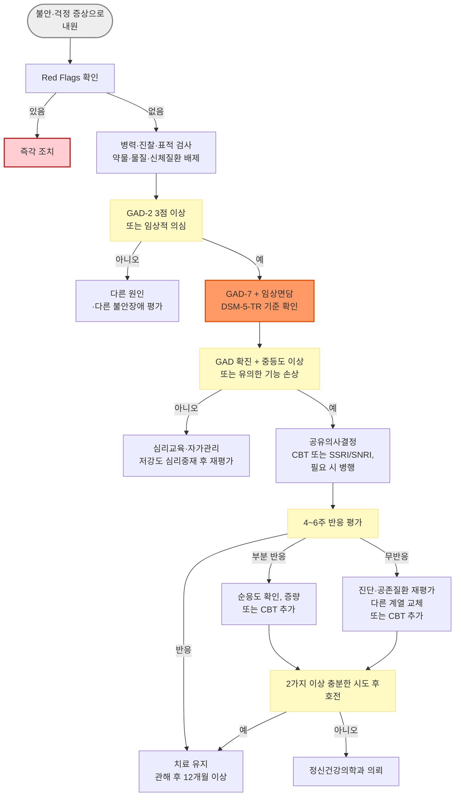

# 불안장애 Anxiety Disorder


이 챕터는 불안장애 중 범불안장애(Generalized Anxiety Disorder, GAD)의 진단과 치료를 중심으로 다룸.\
불안장애 · [공황장애](026_-panic-disorder.md) · [우울증](027_-depression.md) · [산후우울증](028_-postpartum-depression.md) 등은 상호 동반 이환이 매우 흔함(해당 챕터 참조)


## <mark style="color:green;">일반 사항</mark>

* 실제 발생한 위험에 비하여 과도하고 지속되며 조절하기 어려운, 불편하고 일상생활에 지장을 주는 걱정; 일상적인 상황에 대하여 과도한 불안감
* 불안감을 유발하는 실체나 상황을 피하기 위해 부적절한 행동을 취하기도 함
* 흔히 주요우울증, 지속적인 기분 저하, 사회불안장애 등을 동반
* 유병률 : 일차진료 환자의 불안장애 유병률은 19.5%이며(GAD 7.6%, PTSD 8.6%, 공황장애 6.8%, 사회불안장애 6.2%), 불안장애 간 동반 이환이 흔함 \[Kroenke, Ann Intern Med 2007]
  * 우리나라 불안장애 평생 유병률 - 9.3%, 1년 유병률 - 3.1%(여성 4.7%, 남성 1.6%; 여성이 2.9배) \[정신건강실태조사 2021]
  * 미국의 평생 유병률 조사에서 GAD는 여성 약 7%, 남성 약 4%로 보고됨
* GAD의 발병 연령은 특정공포증·분리불안장애 등 일부 불안장애보다 상대적으로 늦을 수 있음(연구와 정의에 따라 다름)
* 만성통증, 심혈관·호흡기·위장관질환 등 만성 신체질환이 흔히 동반되며, 신체질환과 불안 증상이 서로 악화시킬 수 있음
* 만성적인 신체적 건강 문제가 있거나, 신체적 건강 문제는 없지만 이에 대한 확신을 갖고자 하거나, 여러 다른 문제들에 대하여 반복적으로 걱정을 하고 있는 경우 불안증 감별을 요함

## <mark style="color:green;">원인</mark>

* 기전(추정)
  * neurocircuit 이상 : 편도체(amygdala) 과활성 + 전전두엽(PFC) 조절 기능 저하에 의한 top-down regulation 감소
    * salience network 과활성이 핵심 병태생리로 이해됨
  * neurotransmitter 이상 : serotonin system 활성 저하, norepinephrine system 활성 증가, GABA inhibitory tone 감소
    * 단일 신경전달물질 불균형보다 회로 수준의 조절 이상이 더 포괄적인 설명 모델임
* 기저질환 : 갑상선항진증, 갈색세포종, 저혈당, 부정맥, COPD·천식, 폐색전증, 측두엽 뇌전증, 파킨슨병, 폐경 이행기 증상

### <mark style="color:orange;">위험인자</mark>

* 소아 시기의 학대, 역경, 부모의 이혼 또는 상실
* 능력 상실, 최근의 스트레스 증가(나쁜 일)
* 직업 관련 스트레스, 낮은 사회경제적 상태
* 비만, 흡연(특히 청소년기), 알코올 남용, 약물 남용
* 만성 정신 질환 : 우울증, 공황장애, 신경성 식욕부진증, 불안증 과거력
* 급성·만성 질환 또는 통증
* 정신적 문제가 있는 가족력
* 여성, 행동억제 기질·부정 정서성(신경증 성향)
* 유전 요인 : 위험의 약 1/3이 유전적 요인으로 설명됨

## <mark style="color:green;">임상 양상</mark>

* 걱정, 두려움, 예기 불안, 집중력 저하, 불안 유발 상황에 대한 경계, 대인 접촉 기피
* 안절부절, 두근거림, 떨림, 근육 긴장/통증, 땀 흘림, 손 냉증/축축함, 숨막힘, 과호흡, 어지럼, 피로, 목 안의 덩어리 느낌, 입마름, 피부 감각 저하/저림, 두통, 홍조, 흉통/가슴 답답함
* 복통, 소화불량, 식욕 저하, 구역, 구토, 설사, 빈뇨
* 수면 장애, 악몽, 성욕 감퇴
* 공황장애에 비하여 갑작스럽고 최고조에 도달하는 양상은 덜함
  * 자율신경 증상 자체는 GAD에서도 나타날 수 있음

### <mark style="color:$danger;">🚩 Red Flags!</mark>

<mark style="color:$danger;">**즉각 조치**</mark>

* 현재 자살·자해 의도, 구체적 계획 또는 수단 접근성이 있거나 충동 조절이 어려운 경우 `자살 고위험`
* 타인에 대한 위해 의도·계획 `타해 위험`
* 환청·망상·와해 행동, 조증·혼재성 양상 또는 급성 의식 변화 `급성 정신증` `조증` `섬망`
* 진전·발한·빈맥과 함께 심한 초조·환각·발작이 동반되거나 급성 중독 의심 `알코올 금단` `BZD 금단` `물질 중독`
* 흉통, 호흡곤란·저산소증, 실신, 지속성 빈맥·부정맥, 고열·의식 변화를 동반한 갑상선 증상 등 불안처럼 보이는 응급 신체질환 `급성관상동맥증후군` `폐색전증` `부정맥` `갑상선 중독 위기` `저혈당`
* 세로토닌성 약물 복용 중 고열·근경직·간대성 근경련·의식 변화 `세로토닌 증후군`

<mark style="color:$warning;">**당일\~수일 내 평가**</mark>

* 자살사고가 있으나 구체적 계획·의도가 확인되지 않은 경우([PHQ-9](027_-depression.md#phq-9) 9번 항목 양성 포함) `자살 위험`
* 발작성 두통·발한·빈맥·고혈압의 반복, 또는 체중 감소·열 불내성·진전 동반 `갈색세포종` `갑상선항진증`
* 유의미한 알코올·약물 사용장애 또는 BZD 의존 의심(중증 금단 징후 없음) `물질사용장애` `BZD 의존`
* 임신 중 또는 산후의 중등도 이상 불안·우울 `주산기 불안장애` `산후우울증`
* 항우울제 시작·증량 후 초조·불면·충동성의 급격한 증가 `항우울제 유발 활성화` `양극성장애`
* 직장·학업·기본 일상생활이 어려울 정도의 기능 저하 `중증 GAD` `주요우울장애 동반`

<mark style="color:$info;">**조기 평가 및 추적**</mark>

* 2가지 이상의 근거 기반 치료를 충분한 용량·기간 시행했음에도 미호전 `치료저항성 GAD`
* 증상 악화 또는 새로운 공황발작·우울·물질사용 증상 출현 `공황장애` `우울장애` `물질사용장애`
* 50세 이후 새로 발생한 불안 또는 비전형적·급격한 발병 `기질성 불안장애` `신경인지장애` `신체질환`
* BZD 장기 사용 중으로 감량 계획이 필요한 경우 `BZD 의존`

## <mark style="color:green;">진단</mark>

### <mark style="color:orange;">범불안장애 진단 기준 (Generalized Anxiety Disorder, GAD)</mark>

* \[DSM-5-TR]

A. 최소 6개월 동안 많은 사건이나 활동(예: 직장이나 학교생활 수행)에 대하여 과도한 걱정과 불안감(예기 불안)이 발생한 날이 그렇지 않은 날보다 많음

B. 환자는 걱정을 조절하기 어려워함

C. 불안감과 걱정은 다음 6가지 중 성인은 ≥3가지, 소아는 ≥1가지와 관련 있음; 복수의 증상이 과거 6개월 동안 발생한 날이 그렇지 않은 날보다 많음

1. 차분하지 못함, 또는 안절부절
2. 쉽게 피로
3. 집중하기 어려움 또는 멍함
4. 과민
5. 근육 긴장
6. 수면 장애(예: 잠에 들거나 유지하기 어려움, 제대로 쉬지 못함, 불만족스러운 수면)

D. 불안, 걱정, 또는 신체적 증상은 사회, 직업, 또는 기능의 다른 중요한 영역에서 임상적으로 중요한 고통과 장애를 일으킴

E. 물질(예: 약물) 또는 다른 의학적 상태(예: 갑상선항진증)의 생리적 작용에 의한 것이 아님

F. 다른 정신 질환으로 더 잘 설명되지 않음

### <mark style="color:orange;">선별 검사</mark>

* 불안장애 진단을 받지 않았고 인지된 증상·징후가 없는 19\~64세 성인(임신부·산후 여성 포함)에서 불안장애 선별 권고(B등급). 65세 이상은 근거 불충분(I statement). 양성 결과는 확진이 아니며 진단 평가와 근거기반 치료·의뢰 체계로 연결해야 함. 최적 선별 간격은 확립되지 않음. \[USPSTF 2023]

#### <mark style="color:$primary;">Generalized Anxiety Disorder 7-item (GAD-7)</mark>

* ☞ [원문 및 공식 번역본](https://www.phqscreeners.com)
* 질문 : 지난 2주일 동안 당신은 다음의 문제들로 인하여 지장을 받았던 날들이 얼마나 됩니까?
*   ① 초조하거나 불안하거나 조마조마하게 느낀다. ② 걱정하는 것을 멈추거나 조절할 수 없다.

    ③ 여러 가지 것들에 대해 걱정을 너무 많이 한다. ④ 편안하게 있기 어렵다.

    ⑤ 너무 안절부절못해서 가만히 있기 힘들다. ⑥ 쉽게 짜증이 나거나 쉽게 화를 내게 된다.

    ⑦ 마치 끔찍한 일이 생길 것 같은 두려움을 느낀다.
* 배점 : 전혀 없음 = 0점, 수일 = 1점, 절반 이상 = 2점, 거의 매일 = 3점
* 판정 : 0\~4점 = minimal, 5\~9점 = mild, 10\~14점 = moderate, 15\~21점 = severe
  * 10점 이상 : GAD 민감도 89%, 특이도 82% \[Spitzer, Arch Intern Med 2006]; USPSTF 근거 검토의 통합 결과는 민감도 79%, 특이도 89% \[Evidence Review 2023]
* 해석 원칙 : GAD-7은 선별·중증도·치료 경과 측정 도구이며 확진 도구가 아님. 10점 이상이면 추가 진단 평가가 필요하지만, 치료 시작·증량·감량은 진단, 기능 손상, 자살 위험, 동반질환, 치료 경과, 환자 선호와 관해 후 유지기간을 함께 고려하여 결정

**\[기능 곤란도 문항]** (참고 문항) 위에 해당되는 사항이 있다면 그로 인하여 직장이나 집안일, 또 다른 사람들과 지내는 것이 얼마나 힘듭니까?

* ☐ 전혀 힘들지 않다. ☐ 어느 정도 힘들다. ☐ 매우 힘들다. ☐ 극도로 힘들다.
* 기능 평가 : 이 문항은 기능 손상 정도를 파악하는 참고 문항임. GAD-7 점수와 함께 해석하되, 특정 응답만으로 진단하거나 약물치료 시작·변경 여부를 결정하지 않음

#### <mark style="color:$primary;">GAD-2 screening</mark>

* GAD-7 1번과 2번 문항만으로 시행
* 합계 점수 ≥3점인 경우 GAD를 의심(민감도 86%, 특이도 83%) 하고 추가 평가 시행
* 0\~2점이더라도 임상적 의심이 강한 경우에는 GAD-7 전체 시행 권고
* 메타분석에서는 민감도 약 76%, 특이도 약 81%로 원연구보다 낮게 보고됨 \[Plummer, Gen Hosp Psychiatry 2016]

#### <mark style="color:$primary;">Penn State Worry Questionnaire (PSWQ)</mark>

* 병적 걱정의 정도와 치료 경과를 평가하는 16문항 보조 척도. 일차진료 선별에는 GAD-2/GAD-7이 더 간편함
* 총점은 16\~80점
  * 원판의 1·3·8·10·11번은 역채점(1↔5점, 2↔4점)하되, 사용 중인 검증 한국어판의 문항 순서와 채점지침을 반드시 확인
* cutoff와 의미 있는 변화량은 연구 대상 집단에 따라 다르므로 특정 점수만으로 GAD를 확진하거나 사회불안장애와 감별하지 않음
* 전문 평가 또는 연구에서 사용할 때에는 검증된 한국어판 문항과 채점법을 확인하여 사용

### <mark style="color:orange;">검사</mark>

* 불안장애는 임상 진단이며 모든 환자에게 정해진 검사 패널을 일률적으로 시행하지 않음
* 병력, 진찰, 발병 연령·속도와 의심되는 원인에 따라 CBC, TSH, 혈당, 전해질, ECG, 임신반응검사 등을 선택
* 갑작스러운 발병, 비전형적 증상, 50세 이후 신규 발병 또는 물질사용·금단이 의심될 때 표적 검사를 고려
* Urine drug screen은 위양성·위음성과 검출 기간 차이가 있으며, cannabis 양성 등 단일 결과가 증상의 원인을 확정하지는 않음. 복용약·노출력과 함께 해석

### <mark style="color:orange;">감별</mark>

* 스트레스, 갑상선항진증, 심장 질환(부정맥, 급성관상동맥증후군), 갈색세포종, 저혈당, COPD·천식, 폐색전증, 심한 신체 질환, 알코올/항불안제 금단 증상
* 약물
  * 정신자극제 : 카페인, amphetamine, cocaine, methamphetamine, methylphenidate
  * 교감신경흥분제/기관지확장제 : β2-작용제, pseudoephedrine, theophylline
  * 호르몬·대사성 : corticosteroid, levothyroxine 과량
  * 활성화 작용이 있는 항우울제 : bupropion
  * 금단 : cannabis·니코틴·카페인 금단(불안 악화 가능)
* 약물 유발 정좌불능(akathisia) : 항정신병약, metoclopramide 등이 원인이 될 수 있으며 불안·초조로 오인되기 쉬움
* 다른 정신 질환 : 우울증, 공황장애, 양극성장애, 강박장애, 외상후스트레스장애, 신체증상장애, 질병불안장애, 조현병, 망상장애
  * DSM-5-TR에서 강박장애와 외상후스트레스장애는 불안장애와 별도 범주이지만 증상이 중첩될 수 있어 감별 필요

#### [우울증](027_-depression.md)

* 무쾌감(anhedonia)·지속적인 우울감은 주요우울장애를, 통제하기 어려운 다영역의 미래 걱정은 GAD를 시사하지만 상당한 증상 중첩이 있음
* 자살사고는 GAD 자체에서도, 특히 우울증·물질사용장애 동반 시 나타날 수 있으므로 감별과 무관하게 항상 별도로 평가함
* GAD와 주요우울증은 50% 이상에서 동반 이환됨. 두 진단 모두 충족 시 SSRI/SNRI를 공통 1차 치료제로서 고려 가능


**불안 vs 우울 감별 팁**

* 무쾌감(anhedonia), 의욕 저하, 이른 아침 각성 → 우울증 우세
* 근육 긴장, 신체 긴장감, 미래 걱정 → GAD 우세
* 갑작스러운 공포 발작, 회피 행동 → 공황장애


#### <mark style="color:$primary;">질병불안장애 (Illness anxiety disorder)</mark>

* 질병불안장애(과거 건강염려증)는 주로 중대한 질병에 걸렸거나 걸릴 것이라는 걱정이 중심
  * GAD는 건강 이외의 여러 영역을 지속적으로 걱정함

#### <mark style="color:$primary;">사회불안장애 (Social anxiety disorder)</mark>

* 미팅, 발표, 낯선 사람들과의 대화 등 다른 사람에 의해 평가될 수 있는 상황에 대하여 과도한 두려움을 느끼는 상태
* 불안 증상을 보이거나 부적절하게 행동하여 부정적으로 평가받고, 당황하거나 거절당하거나 타인에게 불쾌감을 줄 것을 두려워함
* 사회적 상황을 회피하거나 커다란 불안감 속에서 지냄

#### <mark style="color:$primary;">외상 후 스트레스 장애 (Post-traumatic stress disorder, PTSD)</mark>

* 원인 : 신체적 또는 정신적 외상(직접 피해나 목격) 후 발생
  * 예: 죽음의 현장 또는 위협, 극심한 부상, 성폭행
* 증상 : 사고 상황과 관련된 것들을 피하려는 행동, 사고와 관련된 기억 장애, 지속적인 부정 정서, 대인 관계 장애, 과잉 경계, 과각성, 수면 장애, 집중력 장애, 잘 놀람, 분노 감정 폭발, 자기 파괴적 행동
* 진단 : 임상적으로 유의미한 고통 또는 기능 장애가 1개월 이상 지속

#### <mark style="color:$primary;">범불안장애, 공황장애, 특정공포증 비교</mark>

<table><thead><tr><th width="100.52630615234375">항목</th><th>GAD</th><th>Panic Disorder</th><th>Specific Phobia</th></tr></thead><tbody><tr><td><strong>유병률</strong><br><strong>/역학</strong></td><td>12개월 유병률은 조사에 따라 약 2~4%; 사춘기 이후 여성 우세, 유전·환경 요인이 함께 작용</td><td>성인 12개월 유병률 약 2~3%; 가족력이 있는 경우 더 흔함</td><td>소아·청소년기에 흔하고 12개월 유병률 약 8~12%로 여성에서 더 흔함</td></tr><tr><td><strong>시작 연령</strong></td><td>어느 연령에서나 시작할 수 있으나 특정공포증·분리불안장애보다 상대적으로 늦게 발병하는 경향</td><td>청소년 후기~성인 초기에 흔함</td><td>소아기에 흔하나 연령별 차이 있음</td></tr><tr><td><strong>감별 질환</strong></td><td>기타 불안장애, 강박장애, PTSD, 우울증, 양극성장애, 정신병성 장애, 약물 관련(카페인, 진정제 금단)</td><td>의학적 상태에 의한 불안장애; 약물 관련 불안장애(카페인, 기타 자극제)</td><td>광장공포증, 공황장애, 강박장애, PTSD</td></tr><tr><td><strong>동반질환</strong></td><td>단극성 우울증, 기타 불안장애</td><td>광장공포증, 물질사용장애, 주요우울증, 기타 불안장애; 천식</td><td>우울증, 기타 불안장애</td></tr></tbody></table>

_<mark style="color:$info;">Ref. Ferri's Clinical Advisor 2024. Table E2.</mark>_

***


```mermaid
graph TD
    Start(["불안·걱정 증상으로 <br>내원"]) --> RF["Red Flags 확인"]
    RF -->|"있음"| ER["즉각 조치"]
    RF -->|"없음"| Eval["병력·진찰·표적 검사<br>약물·물질·신체질환 배제"]
    Eval --> Q1["GAD-2 3점 이상 <br>또는 임상적 의심"]
    Q1 -->|"아니오"| Other["다른 원인<br>·다른 불안장애 평가"]
    Q1 -->|"예"| Dx["GAD-7 + 임상면담<br>DSM-5-TR 기준 확인"]
    Dx --> Q2["GAD 확진 + 중등도 이상<br>또는 유의한 기능 손상"]
    Q2 -->|"아니오"| Low["심리교육·자가관리<br>저강도 심리중재 후 재평가"]
    Q2 -->|"예"| Tx["공유의사결정<br>CBT 또는 SSRI/SNRI, <br>필요 시 병행"]
    Tx --> Q3["4~6주 반응 평가"]
    Q3 -->|"반응"| Keep["치료 유지<br>관해 후 12개월 이상"]
    Q3 -->|"부분 반응"| Opt["순응도 확인, 증량<br>또는 CBT 추가"]
    Q3 -->|"무반응"| Sw["진단·공존질환 재평가<br>다른 계열 교체 <br>또는 CBT 추가"]
    Opt --> Q4["2가지 이상 충분한 시도 후 <br>호전"]
    Sw --> Q4
    Q4 -->|"아니오"| Ref["정신건강의학과 의뢰"]
    Q4 -->|"예"| Keep
    style Start fill:#eeeeee,stroke:#888888,stroke-width:2px
    style Dx fill:#f96,stroke:#e65100,stroke-width:2px
    style Q1 fill:#fff9c4,stroke:#ffe082
    style Q2 fill:#fff9c4,stroke:#ffe082
    style Q3 fill:#fff9c4,stroke:#ffe082
    style Q4 fill:#fff9c4,stroke:#ffe082
    style ER fill:#ffcdd2,stroke:#b71c1c,stroke-width:2px
```

<p align="center"><strong>진단 및 치료 알고리듬</strong> <em><mark style="color:$info;">(저자 재구성)</mark></em></p>

***

## <mark style="background-color:$warning;">Management</mark>

### <mark style="color:orange;">치료 방침</mark>

* GAD는 SSRI/SNRI와 인지행동요법(CBT)이 모두 효과적인 1차 치료이며, 환자 선호·중증도·접근성을 고려하여 단독 또는 병행하고 measurement-based follow-up을 시행
* 역치하 불안(subthreshold anxiety) : 진단 기준(예: 6개월 지속)에 못 미치지만 임상적으로 유의한 증상군
  * 자가관리·행동치료부터 시작하며 약물치료의 근거는 약함
  * GAD-7 점수만으로 역치하 불안을 정의하지 않음
* 공유의사결정(shared decision-making) : 약물·정신치료·병행 중 환자의 선호를 적극 반영
  * 환자가 선호하는 치료를 받을 때 치료 만족도·순응도·예후가 더 좋음
* 예후 : 만성·재발성 경과를 보일 수 있으나 근거기반 정신치료·약물치료로 호전 가능
  * 일차진료 협력진료 모델은 통상 진료보다 반응·관해를 개선
* 자살 위험, 약물 남용, 다른 정신 질환 여부를 확인하고 관리
  * 자살 사고가 있는 경우 : 구조화된 위험평가 후 환자와 함께 안전 계획(Safety Planning)을 작성
  * 경고신호, 혼자 시행할 대처법, 도움을 받을 사람·장소, 가족·지지자, 진료기관·자살예방 상담전화 109, 치명적 수단 제한과 단기 재평가 계획을 기록함
  * 현재 구체적 의도·계획·수단 접근성이 있거나 안전한 귀가를 보장할 수 없으면 안전 계획만으로 대체하지 말고 즉시 응급 평가·이송
* 불안증으로 진단되면 조기에 치료 시작
  * SSRI/SNRI 시작 전 과거 조증·경조증, 수면욕 감소, 과대감·충동적 행동, 항우울제 유발 활성화와 양극성장애 가족력을 확인
* 낮은 강도의 심리적 중재 : 개별적 또는 그룹 중재
* 현저한 기능 장애가 있거나 낮은 강도의 심리적 중재로 호전되지 않는 경우 고강도 정신 치료(예: 인지행동 요법) 및/또는 약물 치료
* GAD는 만성 상태이므로 갑작스런 악화는 공황장애, 갑상선 질환 등 다른 질환이나 악화 요인 확인이 필요함
* 가능한 기관에서는 일차진료의사, care manager와 정신건강의학과 자문이 측정기반 추적과 치료 조정을 함께하는 통합협력진료(Collaborative Care Management)를 고려


**Measurement-based care - GAD-7 점수만으로 치료를 결정하지 않음** : 정기적으로 GAD-7과 기능 수준을 함께 측정하여 경과를 추적. 5·10·15점은 중증도 구간이고 10점 이상은 추가 진단 평가가 필요한 선별 기준이지만, 치료 시작·강화·유지·감량을 한 번의 점수로 자동 결정하지 않음. 증상 변화, 기능 손상, 자살 위험, 동반질환, 부작용, 환자 선호, 재발력과 관해 후 유지 기간을 함께 판단


#### <mark style="color:$primary;">일차 진료 단계별 접근 Step</mark>

**Step 1. 응급 선별 (Red flags)**

* 현재 자살·타해 의도/계획, 급성 정신증·조증·섬망, 중증 금단·중독 또는 응급 신체질환 의심 시 즉각 이송/응급 평가

**Step 2. 진단·중증도·기능 평가 및 초기 치료 선택**

* GAD-7을 선별·중증도 참고자료로 사용하며 임상면담으로 GAD를 확진
* 경도·역치하 증상, 기능 손상 경미 시 심리교육, 자가관리·저강도 심리중재 후 재평가
* 확진된 GAD에서 중등도 이상 증상 또는 유의한 기능 손상 시 환자 선호에 따라 CBT 또는 SSRI/SNRI, 필요 시 병행

**Step 3. 치료 반응 평가**

* 초기 내약성·안전성은 2\~4주 내 확인하고, 4\~6주 시점에 1차 반응 평가, 충분한 치료용량에서 8\~12주까지 반응을 판정
  * 의미 있는 증상·기능 개선 시 현 치료 유지
  * 부분 반응 시 순응도·용량 확인 후 증량 또는 정신치료 추가; 필요한 경우 보조 약물 검토
  * 무반응 시 진단·동반질환·물질사용·치료 순응도 재평가 후 다른 계열 약제로 교체 또는 정신치료 추가

**Step 4. 의뢰**

* 2가지 이상 충분한 시도 후에도 호전되지 않은 경우 정신건강의학과 의뢰

## <mark style="color:green;">비-약물 치료 및 예방</mark>

* 인지행동요법(CBT)은 단기 및 장기 효과 근거가 가장 축적된 정신치료이며, 초기 치료 시기부터 시작할 수 있음
* 국내 전문가 합의의 1차 선택 : 개인 CBT, 집단 CBT, 마음챙김기반 인지치료(MBCT), 수용전념치료(ACT), 응용이완법(applied relaxation)
  * 개인 CBT가 상대적으로 가장 선호되었으나 집단 CBT도 1차 선택에 해당
  * CBT와 MBCT가 동등한 효과·유용성을 보인다는 응답이 62.9%였으나, 이는 비교 임상시험의 동등성 입증이 아니라 국내 전문가 인식 조사 결과임
  * 국내 전문가 선호(KMAP-GAD 2024) : 개인 CBT 8\~12회기
  * 국제 근거기반 지침의 고강도 CBT·응용이완 : 통상 12\~15회기 \[NICE CG113]
  * MBCT·ACT는 GAD에서 고려 가능한 치료이나, CBT와 동일 수준으로 확립된 근거는 아님
* CBT 시행 방법
  * 종료 후 재발 예방과 기술 유지를 위한 강화 세션(booster session)을 고려. 다만 GAD 자체의 직접 근거는 아직 제한적
  * 1차 기법 : 교육, 인지 재구성, 불확실성에 대한 인내력 학습, 걱정에 대한 역기능적 믿음 다루기, 걱정으로부터 주의 전환, 핵심 믿음 수정
  * 실제 상황 노출과 사회기술훈련은 상위 2차 선택이며, 공황장애·사회불안장애보다 GAD에서 상대적 비중이 낮음
* 정신치료와 약물치료는 모두 효과적인 선택이며 환자 선호와 중증도에 따라 단독 또는 병행
  * 단독치료 반응이 불충분하면 병행을 우선 고려
* 카페인 : 용량 의존적으로 불안을 유발하며 민감한 사람은 저용량에서도 악화 가능
  * 성인 일일 상한 400 ㎎은 안전 기준이며 불안 역치가 아님
* 금연, 금주 : 술로 문제를 해결하게 해서는 안 됨
* 피해야 할 것(Avoid list) : 에너지음료, pseudoephedrine(코감기약), cannabis(불안 악화 가능), 고용량 카페인 음료
* 신체 활동, 이완 요법 : 규칙적 운동을 권장. 요가, 태극권, 기공, 명상은 보조적으로 고려할 수 있으나 연구의 이질성이 크고 근거 확실성은 제한적
* 디지털 중재 : 인터넷·앱 기반 CBT는 접근성을 보완하는 보조 수단으로 활용할 수 있으나 제품별 임상 근거, 규제기관 허가 대상·사용조건과 국내 허가·급여 여부를 확인
  * 대면 평가와 필요한 치료를 대체하지 않음
* 허브(근거 부족) : St. John's wort(고추나물), 시계풀(passionflower), 쥐오줌풀(valerian)
  * St. John's wort는 SSRI/SNRI와 병용 시 세로토닌 증후군 위험, CYP3A4 유도로 다른 약물 효과 감소 가능 - 복용 여부를 반드시 확인

## <mark style="color:green;">약물 치료</mark>

#### <mark style="color:$primary;">치료 timeline</mark>

1. 0\~2주 : 초기 불안 일시 악화 가능; 환자에게 사전 안내
   * 저용량으로 시작
   * 1차 선택 : SSRI/SNRI
2. 2\~4주 : 수면·신체 증상부터 부분 반응 시작
   * 항우울제의 부분 효과는 2\~4주부터 나타날 수 있음
3. 4\~6주 : 1차 반응 평가 시점
   * 충분한 반응은 보통 4\~6주 이상 걸림
4. 8\~12주 : 충분한 치료 용량에서 최종 반응 판정 시점
5. 3\~6개월 : 관해(remission) 도달 목표
   * 관해까지는 수개월이 필요할 수 있음
6. 치료 유지 기간 : 효과가 있으면 재발 방지를 위해 관해 후 최소 12개월 유지
   * 재발력·잔여 증상·중증 동반질환이 있으면 2년 이상을 개별적으로 고려
   * 약제 중단 시 tapering 하며(갑자기 중단하지 않음) 증상 재발, 약물 금단 증상 등 모니터링

<mark style="color:cyan;">**추적 관찰**</mark>

* 첫 3개월 동안 2\~4주마다, 이후 3개월마다 약효와 부작용 평가
  * 새로운 약제 투여 시 일반적으로 2\~4주 내 F/U
  * 24세 이하, 자살사고·과거 자살시도, 양극성장애 가능성, 심한 초기 activation·불면, BZD 병용 또는 물질사용장애가 있으면 1주 이내 또는 더 이른 시점에 F/U

### <mark style="color:orange;">초기 약물치료 전략</mark>

* 근거 기반 1차 약물은 SSRI 또는 SNRI. 저용량으로 시작하여 1\~2주 내 최소 유효용량으로 증량
  * 치료 시작 후 4\~6주 시점에 1차 반응 평가, 부분 반응 시 1\~2주 간격으로 추가 증량
  * 충분한 용량에서 8\~12주까지 반응을 판정
* Buspirone은 BZD 의존 위험이 높거나 SSRI/SNRI를 사용할 수 없는 환자의 대안 또는 병용약으로 고려하되, 항우울제와 동등한 일반적 1차 단독약으로 보지는 않음
* 급성 불안·불면·초기 초조감이 심하면 BZD를 단기간 병용할 수 있으나, 의존·낙상·인지저하·운전 위험을 평가하고 가능한 한 짧게 사용


**한국형 범불안장애 약물치료지침 2024 (KMAP-GAD 2024, 대한불안의학회) 국내 전문가 합의** : 국내 전문가 설문에서는 초기 치료로 항우울제+항불안제 병용이 최우선 치료(평균 9.09), 항우울제 단독이 다음 1차 선택이었음. 여기서 항불안제에는 BZD와 azapirone(buspirone 등)이 모두 포함됨.

NICE 등 다수의 국제 근거기반 지침과 \[Shepardson RL, et al. JAMA Intern Med. 2026;186(7):878-889] 리뷰는 SSRI/SNRI 또는 CBT 단독을 우선 권고하며 BZD를 권고하지 않으므로, 환자별 위험·선호와 총 약물 노출을 함께 고려.

BZD 병합 기간은 8주가 최다 응답(28.1%)이었으나 4주·12주·지속사용 등으로 응답이 분산되어 합의된 권장기간으로 볼 수 없음.


* 국내 전문가가 선호한 초기 항우울제 : SSRI, SNRI(milnacipran은 제외), mirtazapine
  * vortioxetine은 국내 전문가 합의상 상위 2차 선택제이나, 국제 지침 기준으로는 GAD 미승인 약물의 허가 외 사용에 해당
  * mirtazapine은 국내 전문가 합의상 초기 1차 선택제이지만, GAD 허가·근거수준은 SSRI/SNRI와 구분하여 설명
* 항우울제+비정형 항정신병약물은 국내 합의에서도 전체 초기 전략상 상위 2차 선택제이고, 비정형 항정신병약물 단독은 하위 2차 선택제
  * Aripiprazole·quetiapine의 ‘1차’는 해당 약물군 안에서의 선호도이며, 전체 치료제 중 1차라는 뜻이 아님
* Propranolol은 ‘기타약물군 안에서’ 선호되지만, GAD 전체의 1차 약물은 아니며, 주로 자율신경계 신체증상·상황불안에 제한적으로 고려

### <mark style="color:orange;">유지 약물치료 전략</mark>

* 관해 후 항우울제 단독치료가 국내 전문가 합의상 최우선. 항우울제+항불안제도 1차 범주였으나 장기 병용의 필요성을 정기적으로 재평가
* 선호 항우울제 : escitalopram, sertraline, venlafaxine이 1차이며 escitalopram이 최우선
* 상위 2차 : fluoxetine, paroxetine, desvenlafaxine, duloxetine, mirtazapine
* 유지단계의 항불안제 : buspirone·alprazolam·clonazepam·lorazepam은 하위 2차, bromazepam·diazepam은 3차
  * Buspirone의 낮은 순위는 의존성 때문이 아니라 장기 효과 근거와 전문가 선호도를 반영한 것임
* BZD는 관성적으로 지속하지 말고 감량 가능성, 의존·인지저하·낙상 위험을 매 방문 평가

### <mark style="color:orange;">치료 반응 불충분 시 전략</mark>

* 먼저 진단, 동반 우울·양극성장애·다른 불안장애, 알코올·물질사용, 복약 순응도, 충분한 용량·기간, 정신치료의 회기·질을 재평가
* 약물치료만 시행했다면 → 약물 조정+정신치료 추가가 가장 선호되며, 약물 유지+정신치료 추가도 1차 선택
* 정신치료만 시행했다면 → 정신치료 유지+약물 추가가 가장 선호되며, 정신치료 조정+약물 추가도 1차 선택
* 항우울제 조정 : 사용하지 않은 다른 계열의 SSRI, SNRI 또는 mirtazapine으로 교체하거나 추가
* 비정형 항정신병약물 추가 : 국내 합의상 1차 방침이지만 해외 지침과 차이가 크고 효과 근거가 제한적
  * 대사·신경학적 부작용이 있으므로 정신건강의학과 협진하에 고려
* Pregabalin 추가 : 국내 합의상 2차 방침이지만 일부 해외 지침에서는 더 높은 순위로 권고됨
  * 국내 허가·급여, 신기능, 진정 및 남용 위험을 함께 확인

### <mark style="color:orange;">동반질환이 있는 경우</mark>

* 우울장애, 다른 불안장애 또는 알코올·물질사용장애가 동반되면 약물치료+정신치료 병행이 국내 합의상 최우선
* 범불안장애와 동반질환 중 임상적 중증도·자살 위험·기능 손상이 큰 질환을 우선하되 두 질환을 함께 치료
* 동반질환이 있는 경우에 선호되는 항우울제 : escitalopram, sertraline, venlafaxine, paroxetine, desvenlafaxine, duloxetine, fluoxetine, mirtazapine
* 알코올·물질사용장애 동반 시 해당 장애를 적극적으로 함께 치료
  * BZD·pregabalin 등 남용 가능 약물은 가능한 한 피하거나 정신건강의학과·중독 전문진료하에 제한적으로 사용
* 국내 전문가설문에서는 물질사용장애 동반 시 항우울제+BZD 병용도 1차 범주였으나, 이는 중독 위험을 고려한 근거기반 일반 권고로 해석해서는 안 됨

### <mark style="color:orange;">약물 종류</mark>

#### [<mark style="color:$primary;">SSRI/SNRI</mark>](../231_/213_-antidepressants-and-anxiolytics.md)

* SSRIs 사이의 효과 차이는 입증되지 않음(개인차는 있음)
* 저용량으로 시작 → 내약성을 확인하면서 1\~2주 내 최소 유효용량으로 증량 → 치료용량에서 4\~6주 시점에 1차 반응 평가; 부분 반응이면 1\~2주 간격으로 추가 증량
* 부작용 : 위장 장애(예: 구역, 설사), 불면, 과민, 체중↑, 혈압↑(venlafaxine)
* 자살 위험 모니터링 : 24세 이하(25세 미만)의 소아·청소년·젊은 성인은 투여 초기와 용량 변경 시 자살사고·행동 악화 여부를 면밀히 확인.
  * 연령과 관계없이 임상적 악화·초조·자살사고가 나타나면 즉시 평가
* 초기 불안 악화(jitteriness syndrome) : 투약 첫 1\~2주에 불안·초조가 일시 악화될 수 있음
  * 위험인자 : 공황장애 동반, 기저 불안 수준 높음, 급격한 증량
  * 저용량 시작 및 환자 사전 설명으로 예방
* 성기능 장애 : 발생률 30\~50%
  * 주요 증상 - 성욕 저하, 불감증, 사정 지연
  * 대책 : 용량 감량, vortioxetine 또는 bupropion(우울 동반 시)으로 전환 고려
    * buspirone 병용도 SSRI 유발 성기능 부작용 완화에 도움될 수 있음
* GI 출혈 : 혈소판 세로토닌 고갈로 NSAID·aspirin·항혈소판제·항응고제 병용 시 위장관 출혈 위험 증가
  * 대책 : 고위험군에서 PPI 병용 고려
* 세로토닌 증후군 : 세로토닌 활성 약물과 병용 시 세로토닌 증후군(정신상태변화·자율신경불안정·신경근증상) 위험
  * SSRI/SNRI 처방 전 병용 약물 확인 필수. 다른 과 처방 여부 반드시 확인
  * 위험 약물 : MAO 억제제, linezolid, 정맥용 methylene blue, tramadol(오피오이드계 진통제), fentanyl, dextromethorphan(일반 감기약), St. John's wort, lithium, tryptophan, buspirone
  * triptan 병용 위험은 실제로는 매우 낮은 것으로 평가되나 병용 여부는 확인 필요
* QT 간격 연장 : escitalopram은 용량 의존적으로 QT가 연장될 수 있음
  * 대책 : 권장 최대 20 ㎎/d를 초과하지 않음. 고령자는 초회량을 5 ㎎로 절반 감량하고, 통상 10 ㎎/d를 넘지 않는 것이 실무적으로 흔히 쓰이는 상한임
    * QT 연장 약물 병용·기저 심질환·저칼륨혈증 등 위험이 있으면 ECG와 전해질 확인 고려
* 폐쇄각 녹내장 : SSRI/SNRI 공통으로 산동(mydriasis) 효과에 의해 안압이 상승할 수 있음
  * 대책 : 위험 환자(고령, 좁은 전방각)에서 투여 전 안과 확인 권고
* 고령자 : SSRI/SNRI 투여 시 저나트륨혈증(SIADH) 위험을 고려하여 고위험군에서 기저 및 투약 초기 전해질 확인
  * Duloxetine은 모든 고령자에서 회피하는 약물이 아니라 CrCl ＜30 ㎖/min에서 위장관 이상반응과 대사산물 축적 우려로 회피
* Fluvoxamine : CYP1A2·CYP2C19·CYP3A4 억제 작용이 있어 diazepam 등 이 경로로 대사되는 benzodiazepine과 병용 시 혈중농도 상승 위험
  * tizanidine(근이완제) 병용 금기, ramelteon·pimozide·thioridazine 병용 회피
* 임신·수유 : 임신 후기 노출 시 신생아 적응증후군과 PPHN 가능성을 고려하되 절대위험, 치료하지 않은 중증 불안·우울의 위험, 기존 치료반응과 수유 계획을 함께 평가
  * 치료력이 없는 임신·임신 계획 환자에서 새로 시작할 때에는 sertraline 또는 escitalopram을 우선 고려할 수 있음
  * Paroxetine은 임신 1삼분기 노출과 심혈관 기형 위험 증가의 연관성이 보고되어 대안이 있으면 새로 시작하지 않는 편이 합리적임. 다만 이미 안정적으로 복용 중인 환자는 재발·금단 위험을 포함해 개별적으로 판단하며 임의 중단·일률적 변경을 피하고 산부인과·정신건강의학과와 협의
* 약물 중단 시 반동 증상 : 어지럼, 이상 감각, 구역/구토, 두통, 발한, 불안, 수면 장애
* Tapering 원칙 : 용량이 낮아질수록 더 작은 폭으로 천천히 감량(hyperbolic tapering). 특히 paroxetine, venlafaxine은 discontinuation syndrome 위험이 높아 더욱 천천히 감량
  * 격일 복용은 혈중 농도 변동으로 금단 증상을 악화시킬 수 있어 일률적으로 권하지 않음. 가능한 경우 저함량 제제 또는 액상 제형 등을 활용하여 매일 복용 용량을 줄임


**Hyperbolic tapering** 개념 : 뇌의 세로토닌 수용체 점유율은 약물 용량에 비례하지 않고 쌍곡선(hyperbolic) 관계로 변화한다. 즉 고용량 구간에서는 용량을 크게 줄여도 수용체 점유율 변화가 작지만, 저용량 구간에서는 조금만 줄여도 수용체 점유율이 급격히 변한다. 따라서 감량 후반부일수록 더 작은 폭으로, 더 천천히 줄여야 금단 증상을 최소화할 수 있다.\
예) escitalopram은 고용량 구간보다 저용량 구간, 특히 5 ㎎ 이하에서 더 작은 절대량으로 감량한다. 저함량 제제·정제 분할·액상 제형의 국내 가용성을 확인하여 조정하며, 장기 복용 또는 과거 금단 경험이 있으면 단계별 감량폭을 줄이고 간격을 수 주\~수개월까지 개별화한다.


<table data-search="false"><thead><tr><th width="270.15789794921875">성분명 [상품명]</th><th width="119.73681640625" align="center">시작 (㎎/d)</th><th width="119.8076171875" align="center">유지 (㎎/d)</th></tr></thead><tbody><tr><td>escitalopram¹⁾ <mark style="color:blue;">[렉사프로]</mark></td><td align="center">5~10</td><td align="center">10~20</td></tr><tr><td>sertraline²⁾ <mark style="color:blue;">[졸로푸트]</mark></td><td align="center">25~50</td><td align="center">50~200</td></tr><tr><td>paroxetine IR¹⁾ <mark style="color:blue;">[세로자트]</mark></td><td align="center">10~20</td><td align="center">20~50</td></tr><tr><td>fluoxetine²⁾ <mark style="color:blue;">[푸록틴]</mark></td><td align="center">10~20</td><td align="center">20~60</td></tr><tr><td>fluvoxamine²⁾ <mark style="color:blue;">[듀미록스]</mark></td><td align="center">50</td><td align="center">100~300</td></tr><tr><td>duloxetine¹⁾ <mark style="color:blue;">[드록틴]</mark></td><td align="center">30</td><td align="center">60~120</td></tr><tr><td>venlafaxine¹⁾ <mark style="color:blue;">[이팩사 XR]</mark></td><td align="center">37.5</td><td align="center">75~225</td></tr><tr><td>vortioxetine²⁾ <mark style="color:blue;">[브린텔릭스]</mark></td><td align="center">10</td><td align="center">10~20</td></tr></tbody></table>

> ¹⁾_국내 GAD 허가 : escitalopram, paroxetine IR, venlafaxine XR, duloxetine_\
> ²⁾_국내 GAD 허가 외 사용 : sertraline, fluoxetine, fluvoxamine, vortioxetine. Vortioxetine은 주요우울장애 적응증 약물이며 GAD의 일반적 치료제로 권고하지 않음_\
> ✽_mirtazapine도 국내 GAD 허가 외 사용(SSRI/SNRI 표에는 미포함)_


**국내 전문가 실사용 용량(KMAP-GAD 2024)**

아래 수치는 국내 전문가 설문에서 가장 많이 응답한 최빈값이며 허가용량이나 권장 최대용량을 뜻하지 않음. 국내 허가사항과 환자별 내약성을 우선하고, 설문에서 보고된 허가범위 초과 용량을 그대로 처방 근거로 사용하지 않음.

<table data-search="false"><thead><tr><th>성분명</th><th align="center">시작용량 최빈값</th><th align="center">유지용량 최빈값</th><th align="center">최대사용용량 최빈값</th></tr></thead><tbody><tr><td>escitalopram</td><td align="center">5 ㎎/d</td><td align="center">10 ㎎/d</td><td align="center">20 ㎎/d</td></tr><tr><td>sertraline</td><td align="center">25 ㎎/d</td><td align="center">100 ㎎/d</td><td align="center">200 ㎎/d</td></tr><tr><td>paroxetine</td><td align="center">10 ㎎/d</td><td align="center">20 ㎎/d</td><td align="center">40 ㎎/d</td></tr><tr><td>duloxetine</td><td align="center">30 ㎎/d</td><td align="center">60 ㎎/d</td><td align="center">120 ㎎/d</td></tr><tr><td>venlafaxine</td><td align="center">37.5 ㎎/d</td><td align="center">150 ㎎/d</td><td align="center">225 ㎎/d</td></tr><tr><td>mirtazapine</td><td align="center">7.5 ㎎/d</td><td align="center">15 ㎎/d</td><td align="center">30 ㎎/d</td></tr><tr><td>buspirone</td><td align="center">15 ㎎/d</td><td align="center">30 ㎎/d</td><td align="center">30 ㎎/d</td></tr></tbody></table>

<table data-search="false"><thead><tr><th>보조약물</th><th align="center">시작용량 최빈값</th><th align="center">유지용량 최빈값</th><th align="center">최대사용용량 최빈값</th></tr></thead><tbody><tr><td>alprazolam</td><td align="center">0.25 ㎎/d</td><td align="center">0.5 ㎎/d</td><td align="center">1.5 ㎎/d</td></tr><tr><td>clonazepam</td><td align="center">0.25 ㎎/d</td><td align="center">0.5 ㎎/d</td><td align="center">1 ㎎/d</td></tr><tr><td>lorazepam</td><td align="center">0.5 ㎎/d</td><td align="center">1 ㎎/d</td><td align="center">3 ㎎/d</td></tr><tr><td>aripiprazole</td><td align="center">1 ㎎/d</td><td align="center">2 ㎎/d</td><td align="center">5 ㎎/d</td></tr><tr><td>quetiapine</td><td align="center">12.5 ㎎/d</td><td align="center">25 ㎎/d</td><td align="center">100 ㎎/d</td></tr><tr><td>pregabalin</td><td align="center">150 ㎎/d</td><td align="center">150 ㎎/d</td><td align="center">150 ㎎/d</td></tr><tr><td>propranolol</td><td align="center">10 ㎎/d</td><td align="center">40 ㎎/d</td><td align="center">60 ㎎/d</td></tr></tbody></table>


#### <mark style="color:$primary;">Gabapentinoid (α2δ 리간드)</mark>

* SSRI/SNRI를 사용할 수 없을 때 또는 보조 요법으로 고려
* pregabalin : 150\~600 ㎎/d, 2\~3회 분할 <mark style="color:blue;">\[리리카]</mark>
  * GAD에 대해 유럽 허가. 국내에서는 GAD에 대해 미승인
  * WFSBP 등 일부 국제 가이드라인에서는 높은 순위로 권고하지만 국내 전문가 합의에서는 초기 기타약물군 내 2차, 치료반응 불충분 시 추가약물로 2차에 해당
  * 효과 발현이 SSRI보다 빠름(1\~2주); 수면 개선 효과도 있음
  * SSRI/SNRI의 성기능 부작용(성욕 저하, 불감증)을 피해야 하는 환자에게 유용한 대안
  * 주의 : 남용·의존 가능성(특히 약물 남용 과거력), 어지럼·진정 부작용; 신기능 저하 시 감량
  * 고령자 : 일률적 회피 약물은 아니나 신기능에 따라 감량. opioid와 병용하면 중증 진정·호흡억제 위험이 증가하므로 병용을 회피. 다만 opioid 감량·전환 과정에서 불가피한 단기 중첩은 면밀한 모니터링하에 개별적으로 판단

#### <mark style="color:$primary;">Azapirone</mark>

* 5-HT1A 수용체 부분작용제(partial agonist)로 serotonergic system에 작용
* benzodiazepine보다 남용·신체의존 위험이 낮음
* SSRI/SNRI보다 근거량과 직접 비교자료가 제한적이며, 효과 발현에 대개 2\~4주가 걸림
* 부작용 : 어지럼(가장 흔함), 구역, 두통, 신경과민, 불면
* buspirone : 10\~60 ㎎/d <mark style="color:blue;">\[부스파]</mark>
  * CYP3A4 대사; 강력(itraconazole·ketoconazole·ritonavir·clarithromycin) 또는 중등도(erythromycin·diltiazem·verapamil) CYP3A4 억제제와 병용하면 혈중 농도와 어지럼·진정이 증가할 수 있어 저용량 투여·용량 조절이 필요
  * rifampin·carbamazepine 등 유도제 병용 시 효과가 감소할 수 있음
  * 다량의 자몽주스는 피하도록 안내

#### <mark style="color:$primary;">Benzodiazepine</mark>

* 의존·인지저하·낙상·교통사고 등 위해 위험을 지니므로 위기 상황의 단기 완화 목적으로만 제한적으로 사용
* 남용·오용·중독, 신체의존과 금단 반응(갑작스러운 중단 시 생명을 위협할 수 있음) 위험이 있음
* 대체약 선택 시에도 hydroxyzine의 항콜린·진정·QT 위험 등 환자별 위해를 함께 비교
* SSRI/SNRI의 효과가 나타날 때까지 위기 동안 단기 투여
* 장기적 경과를 개선시키지는 못함
* 저용량으로 시작 (☞ [항불안제](../231_/213_-antidepressants-and-anxiolytics.md#benzodiazepine))
* 투여 방식 : PRN과 단기 scheduled 투여 모두 장단점이 있으므로 증상 양상과 총 노출을 고려하고, 최소 유효용량·최단기간 사용
* opioid, gabapentinoid 및 그 밖의 중추신경억제제 병용 시 과도한 진정·호흡 억제 위험 증가 (특히 고령, COPD 환자)
* 고령에서는 진정·인지저하·섬망·낙상 등의 위험으로 감량 투여 (특히 long-acting 제제 주의)
* 수주 이상 규칙적으로 사용했거나 신체의존 가능성이 있으면 갑자기 중단하지 않음. 일반적으로 초기 5\~10% 감량을 2\~4주 간격으로 고려하고 2주에 25%를 넘지 않도록 하되, 복용기간·용량·금단증상에 따라 개별화하도록 권고 \[ASAM 2025]
  * 장시간 작용 약제(clonazepam, diazepam 등)로 전환할 수 있으나 일률적으로 선호하지 않으며 간기능·병용약을 고려. 고령자에서는 장시간형 전환이 오히려 부적절할 수 있음
* 역설적 탈억제(Paradoxical disinhibition) : 드물게 고령자, 기질적 뇌질환(치매·뇌손상) 환자, 소아에서 BZD 복용 후 오히려 불안·흥분·공격성이 심해지는 반응이 나타날 수 있음. 이 경우 추가 투여를 보류하고 즉시 평가. 다만 수주 이상 규칙적으로 복용한 환자는 금단 위험을 고려하여 갑자기 중단하지 말고 개별화된 속도로 감량

<table><thead><tr><th width="251.52630615234375">성분명 [상품명]</th><th width="130.15789794921875" align="center">용량 (㎎/d)</th><th width="129.8076171875" align="center">반감기 (hr)</th></tr></thead><tbody><tr><td>alprazolam <mark style="color:blue;">[자낙스]</mark></td><td align="center">0.25~4</td><td align="center">11~15</td></tr><tr><td>lorazepam <mark style="color:blue;">[아티반]</mark></td><td align="center">0.5~6</td><td align="center">10~14</td></tr><tr><td>bromazepam <mark style="color:blue;">[브로마제팜]</mark></td><td align="center">3~18</td><td align="center">10~20</td></tr><tr><td>clonazepam <mark style="color:blue;">[리보트릴]</mark></td><td align="center">0.5~4</td><td align="center">18~50</td></tr><tr><td>chlordiazepoxide <mark style="color:blue;">[리버티]</mark></td><td align="center">5~100</td><td align="center">30~100</td></tr><tr><td>diazepam <mark style="color:blue;">[바리움]</mark></td><td align="center">4~40</td><td align="center">50~100</td></tr></tbody></table>

#### <mark style="color:$primary;">항정신병 약물</mark>

* GAD 적응증이 아니며 일차진료에서 시작하지 않음
* 항우울제와 충분한 정신치료에도 반응이 불충분하고 다른 진단·동반질환을 재평가한 뒤 정신건강의학과 협진하에 예외적으로 고려
* 국내 전문가 합의에서는 aripiprazole·quetiapine이 이 약물군 내에서 선호되었으나, 전체 초기 전략에서 항우울제+비정형 항정신병약물은 상위 2차이고 단독요법은 하위 2차임
* NICE·RANZCP는 GAD에 비정형 항정신병약물을 권하지 않으며, 대사증후군·정좌불능·지연성 운동장애 등 위해를 고려하여 일차의료에서 일상적으로 시작하지 않음
* 사용 시에는 적응증 외 사용임을 설명하고 체중·허리둘레·혈압·혈당/HbA1c·지질, 추체외로증상과 정좌불능 등을 기저 및 치료 중 모니터링

#### <mark style="color:$primary;">항히스타민계 항불안제 - Hydroxyzine</mark>

* H1 길항 + 항콜린 작용; BZD와 달리 남용·신체의존 위험이 낮고 효과 발현이 빠름(15\~30분)
  * 단기 급성 불안 완화에 고려
  * 대체약제로 사용 시에도 항콜린·진정·QT 위험을 환자별로 비교
* 진정 작용으로 수면 장애 동반 시 유리
* 주의 : 졸음, 입마름, 요저류, 낙상; 고령자에서는 Beers Criteria상 회피 권고
  * QT 연장·torsades 위험이 있으므로 기존 QT 연장, 유의한 서맥·심혈관질환·전해질 이상 또는 QT 연장 약물 병용 시 피함
* 국내 기존 허가사항에는 정신과 영역 75\~150 ㎎/d 분할 용량이 있으나, EMA 안전성 제한은 성인 최대 100 ㎎/d(고령자는 가능하면 피하고 불가피하면 최대 50 ㎎/d)를 권고. 최소 유효용량을 최단기간 사용 <mark style="color:blue;">\[아디팜]</mark>

#### <mark style="color:$primary;">β-차단제</mark>

* 발한, 심박수 증가 등 불안에 따른 증상 억제 효과; 불안 자체에는 효과 없음
* 금기·주의 : 천식·중증 COPD(비선택성 제제), 서맥·방실차단, 비대상성 심부전
  * 당뇨병 환자에서 저혈당 증상 은폐 가능
* propranolol : 10\~40 ㎎ PRN (상황불안·performance anxiety 기준; 국내 GAD·상황불안 허가 외 사용이며 고용량 사용은 근거 제한적) <mark style="color:blue;">\[인데놀]</mark>

#### <mark style="color:$primary;">환자 유형별 약제 선택</mark>

<table><thead><tr><th width="135">환자 유형</th><th>고려할 약제와 주의사항</th></tr></thead><tbody><tr><td>불면 심함</td><td>mirtazapine 또는 진정성이 있는 약제를 고려하되 체중 증가·주간 졸림 평가</td></tr><tr><td>통증 동반</td><td>duloxetine 고려; CrCl ＜30 ㎖/min, 만성 간질환 또는 상당한 음주가 있는 환자에서는 회피; 60 ㎎/d 초과 시 GAD에서 추가 이득이 뚜렷하지 않으면서 이상반응 부담이 증가할 수 있음</td></tr><tr><td>성기능 중요</td><td>pregabalin 또는 buspirone 등을 고려하되 GAD 허가·근거와 신기능·남용 위험 확인; vortioxetine은 GAD 미승인</td></tr><tr><td>고령</td><td>sertraline, escitalopram을 저용량으로 시작할 수 있음. Hydroxyzine·BZD는 Beers Criteria상 회피; pregabalin은 신기능에 따라 감량하고 opioid 병용 회피; duloxetine은 CrCl ＜30 ㎖/min에서 회피</td></tr><tr><td>급성 불안</td><td>원인·응급상황을 먼저 평가하고, 비약물적 안정화와 함께 환자별 QT·항콜린·의존 위험을 비교하여 단기 약제 선택</td></tr><tr><td>BZD 의존 위험</td><td>SSRI/SNRI, buspirone 또는 정신치료를 우선 고려</td></tr></tbody></table>

***

### <mark style="color:red;">질병코드</mark>

* F41.1 범불안장애 Generalized anxiety disorder
* F41.2 혼합형 불안 및 우울장애 Mixed anxiety and depressive disorder
  * 불안과 우울 증상이 모두 있으나 어느 한쪽도 독립된 장애의 진단 기준을 충족할 정도로 우세하지 않을 때 사용; GAD와 주요우울장애를 모두 충족하면 각각 진단
* F41.8 기타 명시된 불안장애 Other specified anxiety disorders
* F41.9 상세불명의 불안장애 Anxiety disorder, unspecified
* 감별 대상 코드 : F41.0(공황장애), F40.1(사회공포증), F43.1(외상후스트레스장애)

***

## <mark style="color:purple;">처방례</mark>

> **처방례 1.** GAD - 초기치료, SSRI 단독
>
> ```
> 렉사프로 5 ㎎/T  1T  qd  조식 후  (첫 1~2주)
> → 2주 후 10 ㎎ qd로 증량; 4~6주 후 효과 평가
> ※ 투약 초기 불안 일시 악화(jitteriness syndrome) 가능 - 저용량 시작 이유 설명
> ※ 24세 이하: 투여 초기와 용량 변경 시 자살사고·행동 악화 여부를 면밀히 확인
> ※ 권장 최대 20 ㎎/d를 초과하지 않음. 심질환·전해질 이상 또는 QT 연장 유발 약물 병용 시 ECG 고려
> ※ 고령자: 5 ㎎로 절반 감량하여 시작, 통상 10 ㎎/d를 넘지 않음(국내 허가사항상 구체적 상한 미명시); 투약 2~4주 후 전해질(Na) 확인(SIADH 위험)
> ```

> **처방례 2.** GAD - 초기치료, SNRI 단독 (불안+통증 동반 또는 SSRI 불내성)
>
> ```
> 이팩사 엑스알 서방 37.5 ㎎/C  1C  qd  조식 후  (첫 4~7일)
> → 내약성 확인 후 75 ㎎ qd로 증량; 이후 반응과 내약성에 따라 1주 이상 간격으로 조절(최대 225 ㎎/d)
> ※ 투여 전 및 치료 중 정기적으로 혈압 확인 - 특히 고용량에서 용량 의존적 상승 가능
> ※ 갑작스러운 중단 금지 (discontinuation syndrome 위험)
> ```

> **처방례 3.** GAD - Buspirone 대안요법 (BZD 의존 위험 또는 SSRI/SNRI 불내성)
>
> ```
> 부스파 5 ㎎/T  1T  tid  식후  (첫 1~2주)
> → 1~2주 간격으로 5 ㎎씩 증량, 목표 용량 20~30 ㎎/d (최대 60 ㎎/d)
> ※ 효과 발현까지 2~4주 소요 - 즉각 효과를 기대하지 않도록 설명
> ※ BZD보다 남용·신체의존 위험이 낮아 BZD 남용·의존 위험이 큰 환자에서 고려
> ※ MAO 억제제와 병용 금지
> ```

> **처방례 4.** GAD - 항우울제+단기 BZD 병용 (급성 불안·수면 장애 동반)
>
> ```
> 렉사프로 5 ㎎/T  1T  qd  조식 후  (첫 1~2주)
> → 내약성 확인 후 10 ㎎ qd로 증량
> 리보트릴 0.5 ㎎/T  0.5T  취침 전  (최대 2~4주 단기; 이후 tapering 중단)
> ※ 기존에 escitalopram 내약성이 확인된 환자는 10 ㎎ 시작도 가능
> ※ clonazepam은 국내 간질·발작 및 공황장애 적응증만 허가되어 있으며 GAD 적응증은 미승인(허가 외 사용) - 처방 전 환자에게 설명
> ※ BZD는 SSRI 효과 발현 전 브릿지 목적으로만 단기 사용
> ※ 고령자·운전자: 낙상, 졸음 위험 설명; 복용 중 음주 및 운전 금지
> ※ 중단 시 반드시 tapering (갑작스러운 중단 금지)
> ```

> **처방례 5.** GAD - Paroxetine IR 대안 (다른 1차 약물 불내성 또는 기존 치료반응이 확인된 경우)
>
> ```
> 세로자트 20 ㎎/T  0.5T  qd  조식 후  (첫 1~2주)
> → 내약성 확인 후 20 ㎎ qd로 증량; 반응에 따라 조절(최대 50 ㎎/d)
> ※ 항콜린 부작용(변비, 구갈, 요저류) 주의; 항콜린 작용이 상대적으로 강해 고령자에서는 회피(Beers Criteria 2023)
> ※ 강력한 CYP2D6 억제제로 tamoxifen·metoprolol 등 CYP2D6 기질 약물과 병용 시 상호작용 주의
> ※ Paxil CR은 FDA GAD 적응증이 없음. IR·CR의 허가 적응증과 용량을 혼용하지 않음
> ※ 임신 계획·임신 중 새로 시작할 때에는 대안을 우선 고려. 이미 안정적으로 복용 중이면 임의 중단·일률적 변경을 피하고, 심혈관 기형 관련 관찰자료와 신생아 적응증후군·PPHN 가능성, 치료하지 않은 질환의 위험 및 기존 치료반응을 함께 평가하여 산부인과·정신건강의학과와 협의
> ※ 중단 시 discontinuation syndrome 발생 빈도 높음 - 반드시 서서히 감량
> ```

> **처방례 6.** GAD - 고령 환자
>
> ```
> 졸로푸트 50 ㎎/T  0.5T  qd  조식 후  (첫 1~2주)
> → 반응·내약성에 따라 1~2주 간격으로 25 ㎎씩 증량
> ※ 저용량으로 시작 - "start low, go slow" 원칙
> ※ 투약 초기·용량 변경 시 저나트륨혈증(SIADH) 위험 - 2~4주 후 전해질(Na) 확인
> ※ NSAID·항혈소판제·항응고제 병용 시 위장관 출혈 위험 증가 - 병용약 확인
> ※ 낙상 위험 평가 및 안내
> ※ sertraline의 GAD 적응증은 국내 허가 외 사용(국내 허가 적응증: 우울증, 성인·소아 강박장애, 공황장애, PTSD, 사회불안장애, 월경전불쾌장애)
> ```

***

### <mark style="color:$success;">핵심 복약 지도</mark>

> **불안장애 약물 복용 안내**
>
> * 약 효과는 2\~4주 후 서서히 나타납니다. 처음 1\~2주는 오히려 불안이 약간 더 느껴질 수 있으나 대개 1\~2주 내에 가라앉으므로 임의로 중단하지 마십시오.
> * 반드시 담당 의사와 상의한 후 서서히 줄여야 합니다. 갑자기 끊으면 어지럼, 저림, 구역 등 중단 증상(discontinuation syndrome)이 생길 수 있습니다.
> * 커피·에너지음료 등 카페인 음료와 술은 불안을 악화시킵니다.
> * 감기약(덱스트로메토르판 함유), 진통제(트라마돌), 편두통약(triptan), 세인트존스워트 등을 복용 중이거나 복용 예정이면 반드시 담당 의사·약사에게 알려 주십시오.
> * 소염진통제(NSAID)나 아스피린과 함께 복용하면 위장 출혈 위험이 높아질 수 있습니다.
> * 안정제(BZD)를 함께 복용하는 동안에는 술을 마시거나 운전하지 마십시오.
> * 24세 이하에서는 복용 초기와 용량 변경 시 자살 생각이나 행동이 드물게 증가할 수 있습니다. 연령과 관계없이 우울감·초조가 심해지거나 자해 충동이 생기면 즉시 담당 의사에게 알려 주십시오.

> **언제 다시 병원을 방문해야 하나요?**
>
> * 불안 증상이 악화되거나 일상생활이 어려울 정도로 심해지는 경우
> * 자해나 자살에 대한 생각이 드는 경우 - 즉시 내원 또는 **자살예방 상담전화 109**
> * 약 복용 후 심한 위장 장애, 두근거림, 혈압 이상 등이 나타나는 경우
> * 4\~6주 약 복용 후에도 증상 호전이 없는 경우

***

## <mark style="color:blue;">환자 안내서</mark>


**불안장애, 함께 이해하고 극복하기**

불안장애는 적절한 치료를 통해 충분히 조절되고 일상으로 회복될 수 있는 질환입니다.


#### <mark style="color:$primary;">불안장애란 무엇인가요?</mark>

* 실제 위험에 비해 과도하고 지속적인 걱정·두려움이 조절되지 않아 일상생활에 지장을 주는 상태입니다.
* 신체 증상(두근거림·근육 긴장·발한·두통·소화불량)을 함께 경험하는 경우가 많습니다.
* 범불안장애(GAD) 외에도 공황장애·사회불안장애·PTSD 등 다양한 형태가 있습니다.
* 불안은 누구나 느끼는 정상적인 감정이며, 위험을 피하도록 돕는 "투쟁-도피 반응(fight-or-flight)"에서 비롯됩니다. 적당한 불안은 오히려 도움이 되므로, 치료의 목표는 불안을 완전히 없애는 것이 아니라 일상에 지장을 주지 않는 수준으로 조절하는 것입니다.
* 생각·감정·행동은 서로 영향을 주고받습니다. 불안한 생각이 들면 몸에서 신체 증상이 느껴지고, 이로 인해 회피 행동을 하게 되는 악순환("불안의 소용돌이")이 반복될 수 있습니다. 치료는 이 악순환의 고리를 끊는 것을 목표로 합니다.

#### <mark style="color:$primary;">어떻게 치료하나요?</mark>

* **약물 치료** : 항우울제(SSRI/SNRI)가 대표적인 1차 치료제입니다. 일부 효과는 2\~4주부터 나타날 수 있으며 충분한 효과에는 보통 4\~6주 이상 걸립니다.
* **비약물 치료** : 인지행동요법(CBT)이 가장 근거가 확립된 정신치료이며, 마음챙김기반 치료·수용전념치료·응용이완법도 고려할 수 있습니다.
* **치료 기간** : 증상이 좋아진 후에도 재발 방지를 위해 보통 12개월 이상 꾸준히 복용을 권장합니다.

#### <mark style="color:$primary;">약 복용 시 꼭 지켜주세요</mark>

* **임의 중단 금지** : 증상이 좋아졌다고 갑자기 약을 끊으면 어지럼·저림·구역 등 중단 증상(몸이 약에 익숙해진 상태에서 갑자기 끊을 때 나타나는 일시적 반응)이 생길 수 있습니다. 반드시 의사와 상의하여 서서히 줄이십시오.
* **초기 적응기** : 복용 첫 1\~2주 동안 불안이나 초조가 일시적으로 더 느껴질 수 있습니다. 증상이 심하거나 불면·충동성·자해 생각이 동반되면 기다리지 말고 즉시 담당 의사에게 연락하십시오.
* **안정제(BZD) 주의** : 안정제는 의존성 예방을 위해 의사의 지시대로 단기간만 사용합니다.
* 24세 이하에서는 복용 초기와 용량 변경 시 자살 생각이나 행동이 드물게 증가할 수 있습니다. 연령과 관계없이 우울감·초조가 심해지거나 자해 충동이 생기면 즉시 담당 의사에게 알려 주십시오.

#### <mark style="color:$primary;">생활 속 실천 사항</mark>

* **카페인·술 제한** : 커피·에너지음료·술은 불안을 악화시키는 주요 원인입니다.
* **규칙적인 운동** : 주 3회 이상의 유산소 운동은 불안감을 낮추는 데 도움이 됩니다.
* **이완 연습** : 하루 1회, 복식호흡이나 점진적 근육이완을 3\~5분부터 시작하여 익숙해지면 10\~20분까지 늘리십시오. 긴장될 때에는 코로 4초 들이쉬고 입으로 6초 내쉬는 호흡을 시도할 수 있습니다.
* **규칙적인 생활** : 수면 시간과 식사 시간을 일정하게 유지하십시오.

#### <mark style="color:$primary;">이럴 때는 즉시 도움을 요청하세요</mark>

* 불안 증상이 갑자기 심해지거나 일상생활이 불가능한 경우
* 우울감이 심해지거나 스스로를 해치고 싶은 생각이 드는 경우 - 즉시 내원 또는 **자살예방 상담전화 109**
* 약 복용 후 심한 부작용(혈압 이상, 심한 위장 장애 등)이 나타나는 경우
