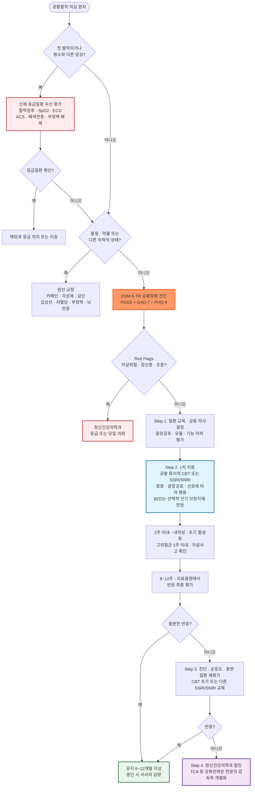
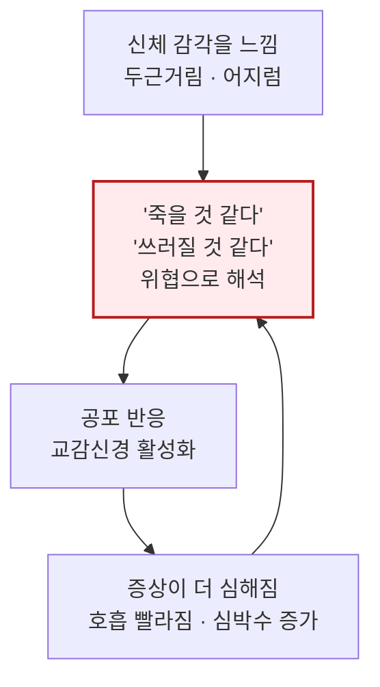

# 공황장애 Panic Disorder


**관련 챕터** : [불안장애](025_-anxiety-disorder.md) · 공황장애 · [우울증](027_-depression.md) · [산후우울증](028_-postpartum-depression.md) 동반 이환이 매우 흔하며, SSRI/SNRI가 공통 1차 치료제임. GAD·공황장애·특정공포증 비교표(☞ [불안장애](025_-anxiety-disorder.md#undefined-10))


## <mark style="color:green;">일반 사항</mark>

* 공황발작 : 갑작스럽게 밀려오는 극심한 공포 또는 불편감과 함께 두근거림, 호흡 곤란, 흉부 불편감, 어지럼, 감각 이상 등의 신체·인지 증상이 나타나는 현상. 보통 수 분 내 절정에 도달하지만 전체 지속시간은 다양함. 공황발작은 공황장애 외의 정신질환·의학적 상태·물질 사용에서도 나타날 수 있으며, DSM-5-TR에서는 다른 정신질환의 **명시자(specifier)** 로도 사용됨
* 공황장애 : 반복되는 **예기치 않은 공황발작**이 있고, 적어도 한 번의 발작 뒤 1개월 이상 추가 발작이나 그 결과에 대한 지속적 걱정 또는 발작과 관련된 유의한 부적응적 행동 변화가 이어지는 상태
* 유병률
  * 국외 : 12개월 유병률 2\~3%, 평생 유병률 4\~5%; 여성이 남성의 2배, 평균 발병 연령 20\~24세
  * 국내 지역사회 : 공황장애 평생 유병률 0.4% (2021년 정신건강실태조사, 보건복지부). 불안장애 전체는 평생 9.3%, 1년 3.1%
  * 국내 진료 인원 : 2017년 13만 8,736명 → 2021년 20만 540명으로 44.5% 증가(연평균 9.6%). 연령대별로는 40대 23.4%, 50대 19.2%, 30대 18.3% 순
  ✽지역사회 조사와 건강보험 진료통계는 조사방법·진단기준·의료이용 반영 범위가 달라 직접 비교에 주의해야 함. 40\~50대 진료 인원이 많다는 사실이 발병 연령이나 진단 지연을 직접 의미하지는 않음
* 동반 증상 : 우울, 자살 위험 증가(특히 우울증 동반 시 현저히 증가), 강박 장애, 위장 증상(복통, 가슴쓰림, 설사, 변비, 구역/구토)이 흔함
* 광장공포증(Agoraphobia) : DSM-5부터 공황장애와 별개의 독립 진단으로 분리됨; 두 질환이 공존하는 경우가 흔하며 각각 독립적으로 진단·치료함. 다만 **KCD(ICD-10 계열)에는 F40.01 '공황장애를 동반한 광장공포증' 조합 코드가 남아 있어** 청구 시 코드 체계와 진단 체계가 일치하지 않음에 유의

## <mark style="color:green;">원인</mark>

* 불명
* 유전적 취약성, 불안 민감성, 스트레스 및 공포 회로(편도체·전전두피질 등)의 조절 이상이 복합적으로 관여하는 것으로 추정

### <mark style="color:orange;">공황발작의 설명 모형 - 질식 경보 오작동</mark>

* 공황장애의 병태생리는 단일 기전으로 확립되어 있지 않음. 아래는 널리 인용되는 설명 모형의 하나이며, 호흡 교육과 신체감각 노출의 이론적 근거를 제공함
* **질식 경보 오작동(false suffocation alarm)** : 뇌간의 이산화탄소 감지 체계가 과민해져 실제 질식 위험이 없는데도 '숨이 막힌다'는 경보를 울린다는 모형. 공황장애 환자는 CO₂ 흡입이나 젖산 주입 같은 생리적 자극에 정상인보다 훨씬 쉽게 발작이 유발됨
* **과호흡의 이중 역할** : 경보에 대한 반응으로 호흡이 빨라지면 저탄산혈증이 생겨 어지럼·손발 저림·입 주위 감각 이상·비현실감이 나타나고, 이 감각이 다시 위협으로 해석되어 공포를 증폭시킴
* **인지적 오해석(catastrophic misinterpretation)** : 정상적 신체 감각을 심장마비·졸도·정신을 잃음 등 파국으로 해석하면서 악순환이 완성됨
  ✽이 세 요소가 **호흡 교육**(과도한 심호흡을 피하고 속도를 늦춤)과 **신체 감각 노출(interoceptive exposure)** 이 효과를 내는 이론적 근거임

### <mark style="color:orange;">위험인자</mark>

* 스트레스, 대인 관계 갈등 또는 상실, 학대/성폭력 피해 과거력, 불안 또는 과보호 부모
* 양극장애, 주요우울증, 강박장애, 특정공포증
* 손상(예: 사고, 수술), 질병
* 흡연·니코틴 의존 : 공황장애 발병 위험 증가와 연관되며 금연 시 금단 증상이 발작을 유발할 수 있음
* 물질·약물 : 카페인·교감신경작용제·각성제 등의 사용, 알코올·오피오이드·벤조디아제핀의 중독 또는 금단, 일부 기관지확장제·갑상선호르몬·코르티코스테로이드 등. 국내에서는 **슈도에페드린 함유 감기약, 체중 감량 보조제, ADHD 각성제**가 흔한 유발 요인. 시간적 연관성을 확인하고 물질/약물 유발 불안장애와 감별

## <mark style="color:green;">임상 양상</mark>

* 공황발작은 갑자기 시작해 수 분 내 절정에 이르며 두근거림, 흉부 불편감, 숨막힘, 어지럼, 발한, 떨림, 감각 이상과 죽거나 통제력을 잃을 것 같은 공포가 동반될 수 있음
* 발작 사이에는 재발에 대한 예기불안, 신체 감각에 대한 과도한 경계, 운동·외출·낯선 장소 회피가 나타날 수 있음
* **야간 공황발작(nocturnal panic)** : 수면 중 갑작스러운 공포와 자율신경 증상으로 깨어나는 형태로, 공황장애 환자의 상당수가 경험함. 깨어난 직후부터 각성이 명료하고 발작 내용을 기억한다는 점이 야경증·악몽과 다름. 수면무호흡, 야간 부정맥, 위식도역류와 감별 필요
* 광장공포증, 우울장애, 다른 불안장애, 물질사용장애가 흔히 동반되므로 기능 저하와 자살위험을 함께 평가

### <mark style="color:$danger;">🚩 Red Flags!</mark>

<mark style="color:$danger;">**즉각 이송/응급 평가**</mark> <mark style="color:$danger;">- 생명 위협 또는 즉각적 위해 가능성</mark>

* 자살·자해 또는 타해의 구체적 계획·의도·수단 접근성이 있거나 충동을 통제하기 어려운 경우
* 급성 정신증, 심한 초조·와해, 조증 또는 중독·금단이 동반된 경우
* 첫 발작 또는 평소와 현저히 다른 발작에서 ACS·폐색전증·부정맥 등 응급질환을 배제할 수 없는 흉통·호흡곤란
* 운동 중 흉통·실신, 지속되는 저산소증·저혈압·유의한 부정맥, 국소 신경학적 결손
* 발작 중 의식 소실, 요실금, 발작 후 혼돈·자동증 - 공황발작에서는 드물며 실신 또는 경련성 질환을 우선 평가

<mark style="color:$warning;">**당일 의뢰 또는 긴급 평가**</mark>

* 자살사고가 확인되어 즉시 구조화된 자살위험 평가가 필요한 경우. PHQ-9 9번 양성만으로 처분을 결정하지 않고 의도·계획·수단·과거 시도·보호요인을 평가
* 심한 우울증, 물질사용장애, 조증·경조증 의심 등으로 신속한 정신건강의학과 평가가 필요한 경우
* 45세 이후 처음 발생한 공황 유사 삽화 - 전형적 발병 연령을 벗어나므로 이차성 원인 가능성을 우선 평가
* 광장공포·회피로 외출이 불가능하거나 식사·수면·직업 기능이 현저히 저하된 경우

<mark style="color:$info;">**외래 추적 / 추가 평가 계획**</mark> <mark style="color:$info;">- 단독 시 즉각 위험 낮으나 경과 관찰 필요</mark>

* 적절한 진단과 순응도를 확인하고도 근거 기반 치료 2가지 이상에 충분한 반응이 없는 경우
* 반복적인 의료 이용, 잔류 회피 행동 또는 동반 우울·불안 증상이 지속되는 경우

## <mark style="color:green;">진단</mark>

### <mark style="color:orange;">병력 확인</mark>

※ 다음 항목은 공황장애 진단 및 치료 방향 결정에 직접 영향을 미치므로 초진 시 빠짐없이 확인해야 함

* 발작의 첫 발생인지, 기존 발작과 같은 양상인지, 발생 상황·지속시간·회복 양상
* 운동 유발 흉통·실신, 지속되는 호흡곤란, 국소 신경학적 증상 등 신체 응급질환을 시사하는 소견
* 카페인·에너지음료, 알코올, 대마·각성제 및 처방약·일반의약품 사용과 최근 감량·중단 여부
* 수면 부족, 최근 스트레스 사건, 공황 유발 상황과 회피 행동
* 갑상선질환, 부정맥, 천식·COPD, 저혈당 등 관련 의학적 병력
* 우울증, 조증·경조증, 정신증, 외상 관련 증상 및 자살·자해 위험

### <mark style="color:orange;">진단 기준 \[DSM-5-TR]</mark>

A. 반복되는 **예기치 않은 공황발작**. 공황발작은 갑작스럽게 밀려오는 극심한 공포 또는 불편감이 수 분 내 절정에 이르며 다음 중 ≥4개가 동반됨

1. 두근거림, 심장이 세게 뛰는 느낌 또는 빈맥
2. 땀 흘림(sweating)
3. 전율 또는 흔들림(shaking)
4. 호흡 곤란(shortness of breath or smothering)
5. 질식감(choking sensation)
6. 흉통 또는 흉부 불편감(chest pain or discomfort)
7. 구역 또는 복부 통증(nausea or gastrointestinal distress)
8. 어지럼, 몸이 흔들리는 느낌, 아찔하거나 쓰러질 것 같은 느낌(feeling dizzy, unsteady, light-headed, or faint)
9. 덥거나 추운 느낌(sensations of heat or cold)
10. 이상 감각(paresthesias)
11. 비현실감(derealization) 또는 이인감·자신에게서 분리된 느낌(depersonalization)
12. 통제력을 잃거나 미칠 것 같은 두려움
13. 죽음의 공포(fear of dying)

✽8번은 **아찔함·불안정감**이며 회전성 어지럼(vertigo)이 아님. 회전감이 주증상이면 전정기관 질환을 먼저 고려\
✽DSM-5-TR는 이명, 목 뻣뻣함, 두통, 통제되지 않는 비명이나 울음 등 **문화특이적 증상**이 나타날 수 있으나 위 4개 증상 산정에는 포함하지 않는다고 명시

B. 적어도 한 번의 공황발작 후 1개월 이상 다음 중 하나 이상이 지속됨

1. 추가 공황발작 또는 그 결과에 대한 지속적 걱정
2. 발작과 관련된 유의한 부적응적 행동 변화(예: 운동·낯선 장소 회피)

C. 물질·약물 또는 다른 의학적 상태의 생리적 영향으로 인한 것이 아님

D. 다른 정신질환으로 더 잘 설명되지 않음

### <mark style="color:orange;">중증도 평가</mark>

**Panic Disorder Severity Scale (PDSS)**

* 7개 항목의 임상의 평가척도 : ⓵ 공황발작 빈도, ⓶ 발작 시 고통 정도, ⓷ 예기불안, ⓸ 광장공포적 회피, ⓹ 공황 관련 감각 회피, ⓺ 직업적 기능 장애, ⓻ 사회적 기능 장애. 자가보고판은 **PDSS-SR**로 구분(☞ [대한불안의학회](https://public.anxiety.or.kr/html/?pmode=evaluationtool))
* 배점 : 각 0\~4점, 총 0\~28점. 진단을 대신하거나 점수만으로 치료를 결정하지 않고 기저치와 추적 점수의 변화를 임상 면담과 함께 해석
* Furukawa 등(2009) 제안 기준 : 광장공포가 없으면 0\~1 정상, 2\~5 경계, 6\~9 경도, 10\~13 중등도, ≥14 현저한 중증; 광장공포가 있으면 3\~7 경계, 8\~10 경도, 11\~15 중등도, ≥16 현저한 중증
* 치료반응 : 기저치 대비 ≥40% 감소. 관해 참고 기준 : 공황장애 단독 ≤5점, 광장공포 동반 ≤7점

※ 동반 질환 파악을 위해 [GAD-7](025_-anxiety-disorder.md#generalized-anxiety-disorder-7-item-gad-7), [PHQ-9](027_-depression.md#phq-9) 병행 사용 권고

### <mark style="color:orange;">검사</mark>

* 공황장애를 확진하는 단일 검사는 없음. 활력징후, 산소포화도, 심폐·신경학적 진찰을 시행하고 첫 발작·비전형적 증상·관련 병력에 따라 검사를 선택
* 흉통·두근거림·실신이 있으면 ECG를 우선 고려하고, 간헐적 부정맥이 의심되면 Holter 또는 사건기록계 고려
* 혈당, CBC, 전해질, TSH 등은 병력·진찰에서 저혈당, 빈혈, 전해질 이상, 갑상선질환 등이 의심될 때 선택적으로 시행

### <mark style="color:orange;">감별</mark>

* 심근경색 / 협심증 : 운동 관련 흉통, 압박감·방사통, 심혈관 위험인자는 의심을 높이지만 휴식 중·비전형적으로도 발생 가능; 임상상과 ECG·트로포닌을 종합
* Tachyarrhythmia : 두근거림이 주증상; Holter에서 부정맥 확인; 심박수 급격히 증가·감소
* 체위기립빈맥증후군(POTS) : 젊은 여성에 많고 기립 후 10분 이내 심박수 ≥30회 증가(청소년은 ≥40회), 누우면 호전; 공포보다 체위 연관성이 뚜렷
* 폐색전증 : 호흡 곤란·흉막성 흉통, 빈맥, 저산소증, 편측 하지 부종·통증; 임상 사전확률과 PERC·연령보정 D-dimer 등을 이용하여 영상검사 필요성 결정
* 천식 / COPD : 호흡 곤란·과호흡이 주증상; 공황장애와 공존 빈도 높음; 기관지 확장제 반응, 폐기능 검사(FEV1/FVC), 천명음으로 감별; 두 질환 공존 시 증상 상호 악화 가능
* 갑상선 항진증 : 환자는 삽화성으로 느낄 수 있으나 **발작 사이에도 빈맥·진전·열 불내성·체중 감소가 지속되는 경우가 많음**; 안구 돌출 동반 가능; TSH 저하
* 저혈당 : 식사 거름 또는 당뇨 치료 중 발생; 혈당 측정으로 즉시 확인
* 갈색세포종 : 두통·발한·발작성 고혈압이 반복되고 임상적으로 의심되면 혈장 유리 metanephrine 또는 24시간 소변 fractionated metanephrine 검사 고려
* **측두엽 뇌전증 / 공포 조짐을 동반한 국소 발작** : 비현실감·이인감·기시감과 공포가 **매번 거의 동일한 순서로** 반복되고 지속시간이 1\~2분으로 짧음; 자동증(입맛 다심, 손 만지작거림), 발작 후 혼돈·기억 공백, 상승성 위 불쾌감이 단서 → 신경과 의뢰, EEG 고려
* 전정기관 이상 (내이) : 회전성 어지럼이 주증상; 체위 변화와 관련; 이명·청력 저하 동반 가능
* 과호흡 증후군 : 공황과 공존 가능; 이산화탄소 저하로 인한 손발 저림·입 주위 감각 이상이 두드러짐
* 알코올·BZD 금단 : 자율신경 항진(발한, 빈맥, 진전). 알코올과 단시간형 BZD는 대체로 마지막 복용 후 12\~48시간에 시작하나, **장시간형 BZD는 수일 뒤에 나타날 수 있음** - 약물 반감기와 마지막 복용 시점을 함께 확인
* 카페인 과다 섭취 : 섭취 후 수 시간 이내 발생; 카페인 섭취량 감량 시 호전
* 전정 편두통(Vestibular migraine) : 어지럼 + 두통·빛·소리 과민; 공황 유사 자율신경 증상 동반 가능
* 폐경기 혈관운동 증상 : 40\~50대 여성에서 열감·상열·발한·두근거림이 수 분간 지속; 야간에 흔하고 공포·예기불안은 뚜렷하지 않음. 국내 공황장애 진료 인원이 가장 많은 연령대와 겹치므로 반드시 고려
* 아나필락시스 : 원인 노출 후 두드러기·혈관부종, 천명·후두 증상, 저혈압 또는 중증 위장관 증상이 있으면 공황으로 단정하지 말고 아나필락시스를 우선 평가·치료. **피부 증상이 없다고 배제할 수 없으며**, 공황·불안이 동시에 나타날 수도 있음
* 야간 증상 : 수면무호흡(코골이·목격된 무호흡·주간 졸림), 야경증(각성 불명료·기억 없음), 악몽, 위식도역류와 야간 공황발작을 구분
* 다른 정신 질환 : 특정 상황에서만 발생(사회공포증, 특정공포증); 외상 관련(PTSD); 강박 사고 동반(강박장애)
* 범불안장애·공황장애·특정 공포증 비교 → [불안장애](025_-anxiety-disorder.md#undefined-10)


**공황장애가 늦게 진단되는 전형적 패턴**

* 첫 공황발작 → 응급실 내원 → 심장검사(ECG, 트로포닌) 정상 → "이상 없음" 듣고 귀가 → 발작 반복
* 이 과정에서 환자는 "심장이 나쁜데 의사가 못 찾는 것"으로 오해하여 여러 기관을 전전하는 경우가 흔함
* 공황 증상과 심장질환이 실제로 공존하는 경우도 있으므로, 감별 후에도 임상적 판단 유지


#### <mark style="color:$primary;">흉통·두근거림이 동반된 경우</mark>

<table><thead><tr><th width="190">신체 응급질환을 우선 평가할 소견</th><th>적절한 평가 후 공황발작을 지지하는 소견</th></tr></thead><tbody><tr><td>• 첫 발작 또는 평소와 다른 양상<br>• 운동 중 발생한 흉통·실신<br>• 지속되는 저산소증·저혈압·부정맥<br>• 압박성 흉통, 방사통, 심한 발한·구토<br>• 심혈관 위험인자 또는 혈전색전 위험<br>• 국소 신경학적 결손</td><td>• 과거 적절한 신체 평가를 받은 전형적인 반복 발작<br>• 수 분 내 공포와 여러 자율신경·인지 증상이 함께 절정<br>• 발작 사이 회복되고 예기불안·회피가 동반<br>• 추적 중 동일한 양상이 반복되며 신체질환을 시사하는 새 소견이 없음</td></tr></tbody></table>

> ACS도 갑자기, 휴식 중 또는 비전형적인 통증으로 나타날 수 있다. 통증 성격·지속시간·공포감만으로 공황발작과 심장질환을 구분하지 않으며, 첫 발작이나 비전형적 발작은 신체 응급질환을 먼저 평가한다.

***



<p align="center"><strong>공황장애 진단 및 치료 알고리듬</strong></p>

<p align="center"><em><mark style="color:$info;">Ref. WHO mhGAP Guideline 3rd ed., Anxiety module (2023); NICE CG113 (2011, 2020 update); 대한불안의학회 2018 한국형 공황장애 치료지침서</mark></em></p>

***

## <mark style="background-color:$warning;">Management</mark>

### <mark style="color:orange;">치료 방침</mark>

* 1차 치료 : 공황 특이적 인지행동치료(CBT) 또는 SSRI/SNRI. 환자 선호, 중증도, 기능 저하, 광장공포, 동반 우울증 및 치료 접근성을 고려하여 단독 또는 병용
* 주요 지침의 BZD 권고는 다음과 같이 차이가 있음
  * **WHO mhGAP 3판(2023)** : 범불안장애·공황장애 성인의 치료제로 BZD를 권고하지 않음(강한 권고). 급성·중증 불안 증상의 **응급 관리에 한하여 최대 3\~7일**의 단기 조치로만 고려 가능
  * **NICE CG113** : 공황장애에서 BZD는 장기 예후가 좋지 않아 **처방하지 않을 것**을 권고
  * **대한불안의학회 2018** : 항우울제·BZD·CBT를 초기 치료 선택지로 제시한 국내 전문가 합의
  * 이 챕터가 취한 **선택적 단기 브릿지**는 국내 처방 현실과 위 두 국제 지침 사이의 절충안이며, WHO·NICE 권고를 그대로 따른 것이 아님을 명시함. BZD를 사용하기로 결정했다면 총 사용기간 목표를 처음부터 환자와 공유하고, 3\~7일을 넘기는 경우 그 근거를 진료기록에 남기는 것을 권장
  ✽WHO mhGAP 3판(2023)은 **CBT 원리에 기반한 단기 구조화 심리중재를 강하게 권고(중등도 확실성)**하고, **SSRI는 조건부 권고(낮은 확실성, SSRI 사용이 어려우면 TCA 고려)**함. 접근이 가능하다면 CBT를 먼저 제안하거나 병용을 권하는 근거가 됨
* 광장공포·회피가 있으면 상황 노출을 포함한 CBT를 적극 권고
* BZD는 일률적인 1차 병용약이 아님. 급성·중증 증상으로 즉각적 완화가 불가피한 경우에 한하여, 기간을 미리 정해 놓고(가능하면 1주 이내, 길어도 수 주) 최소 용량으로 사용. 항우울제 효과 발현까지의 기간 전체를 BZD로 메우는 방식은 권고하지 않음
* 유지치료에서는 항우울제와 CBT를 중심으로 하고, BZD 장기 단독 또는 관성적 병용은 피함

✽근거 개관에 따라서는 TCA도 SSRI·SNRI·CBT와 함께 1차 중재로 분류됨([Brazilian Psychiatric Association, An overview of systematic reviews, 2025](https://pubmed.ncbi.nlm.nih.gov/41046453/)). 이 챕터는 국내 처방 현실과 부작용·과량복용 안전성을 고려하여 TCA를 2차로 배치함

**약물 치료 반응이 불충분한 경우**

* 진단, 순응도, 충분한 용량·기간, 카페인·물질 사용, 양극성장애 및 동반 질환을 먼저 재평가
* 공황 특이적 CBT를 시행하지 않았다면 추가하고, 첫 SSRI/SNRI에 불충분 반응이면 다른 SSRI/SNRI로 교체; 이후 TCA 등은 부작용과 상호작용을 고려하여 선택
  * \[NICE CG113] SSRI가 부적합하거나 **12주 치료 후에도 호전이 없으면** imipramine 또는 clomipramine을 고려
* 비정형 항정신병제·buspirone·propranolol은 공황장애의 표준적인 일반 강화요법이 아님. 반복 치료에도 반응하지 않으면 정신건강의학과 협진하에 개별 결정

#### <mark style="color:$primary;">단계적 치료 알고리듬</mark>

<table><thead><tr><th width="125">단계</th><th>평가 및 치료</th></tr></thead><tbody><tr><td>Step 1<br>진단·선호 확인</td><td>신체 응급질환과 물질·약물 유발 상태를 감별하고, 광장공포·우울증·자살위험·기능 저하를 평가. 질환 교육과 치료 선택의 공동 의사결정</td></tr><tr><td>Step 2<br>1차 치료</td><td>공황 특이적 CBT 또는 SSRI/SNRI 시작. 중증·광장공포·현저한 기능 저하 또는 환자 선호에 따라 병용. BZD는 선택적인 단기 브릿지에 한정</td></tr><tr><td>Step 3<br>부분·무반응</td><td>2주 이내(30세 미만 또는 자살위험이 높으면 1주 이내)에 내약성과 위험을 확인하고, 치료용량에서 8\~12주 후 반응을 평가. 순응도·진단·동반 질환을 재확인하고 CBT 추가 또는 다른 SSRI/SNRI로 교체</td></tr><tr><td>Step 4<br>치료저항성</td><td>충분한 근거 기반 치료 2가지 이상에 반응하지 않거나 자살위험·심한 기능 저하가 지속되면 정신건강의학과 협진. TCA 및 기타 강화전략은 전문의 감독하에 개별화</td></tr></tbody></table>

## <mark style="color:green;">비-약물 치료 및 예방</mark>

* 공황 및 관련한 과호흡으로 인하여 증상이 발생하고 악화되고 있으며 이를 수정하면 증상이 완화될 수 있음을 교육
* 공황 특이적 인지행동요법(CBT) : 인지 재구성, 신체감각 노출, 상황 노출을 포함하는 근거 기반 1차 치료. 약물치료와 대안 관계 또는 병용으로 선택 가능
  * 신체 감각 노출(Interoceptive Exposure) : 공황 유사 신체 감각을 의도적으로 유발하여 둔감화; CBT의 핵심 기법
    * 예시 : 회전하기, 제자리 뛰기, 호흡을 변화시켜 신체 감각 경험하기. 초기에는 치료자 지도하에 시행
    * 심혈관·호흡기·신경계 질환, 임신 또는 근골격계 제한이 있으면 의학적 안전성을 먼저 평가하고 노출 과제를 생략하거나 변형
  * **국내 의뢰 경로** : 공황 특이적 CBT를 제공하는 기관이 제한적이므로 ⓵ 정신건강의학과 의원·병원(개인정신치료 및 인지행동치료 시행 여부 확인), ⓶ 지역 정신건강복지센터, ⓷ 근거 기반 인터넷·앱 기반 CBT 순으로 현실적 경로를 안내. 의뢰가 지연되는 동안에도 질환 교육·호흡 교육·회피 감소 원칙은 1차 진료에서 시작할 수 있음
* 구조화된 규칙적 운동 : WHO mhGAP(2023)에서 범불안장애·공황장애 성인에 대해 **조건부 권고**. 마음챙김·이완 등 스트레스 관리 기법도 함께 고려하되, 공황 특이적 CBT를 대체하지 않음
  ✽2026년 소규모 RCT(n=72)에서 감독하 고강도 간헐운동(걷기 중 30초 전력 질주 반복, 12주)을 신체감각 노출 전략으로 활용한 프로그램이 이완훈련보다 공황 중증도와 발작 빈도를 더 크게 감소시켰음(Muotri 등, Front Psychiatry 2026). 단일 연구이고 감독하 시행된 프로토콜이므로 독립 치료로 권고하기에는 추가 검증이 필요함
* 카페인을 감량하고 과음·금단을 피함
* 인터넷·앱 기반 CBT는 접근성을 높이는 보조 수단이 될 수 있음. 일반 건강 앱, 임상시험 중 소프트웨어, 식약처 허가 디지털치료기기를 구분하고 실제 허가·처방·수가 상태를 확인

### <mark style="color:orange;">호흡 교육</mark>

**핵심 원칙 : 편안한 크기로 천천히, 과도하게 깊은 호흡은 피하기**

* 큰 숨을 반복해 들이마시면 과호흡과 어지럼·저림이 악화될 수 있음. 숨을 억지로 얕게 참기보다 편안한 크기로 호흡하면서 속도를 늦추고 날숨을 조금 길게 함

**실천 방법 :**

1. 코로 4초 동안 편안하게 들이쉰다
2. 입으로 6초 동안 천천히 내쉰다
3. 어깨와 가슴의 힘을 빼고 큰 숨을 반복해서 들이마시지 않는다
4. 이것을 반복하면서 호흡 속도 자체를 늦추는 데 집중한다


**⚠️ 종이봉투 재호흡은 권고하지 않습니다**\
과거 과호흡 대처법으로 알려졌으나 현재는 권고되지 않습니다. 저산소증을 유발할 수 있고, 심근경색·폐색전증 등 감별이 끝나지 않은 상태에서 시행하면 위험합니다. 호흡 **속도를 늦추는 것**으로 충분하며, 환자와 보호자에게 이 통념을 적극적으로 교정해야 합니다.


## <mark style="color:green;">약물 치료</mark>

* 1차 선택 : SSRI, SNRI (☞ [항우울제](../231_/213_-antidepressants-and-anxiolytics.md#selective-serotonin-reuptake-inhibitor-ssri))
* 급여 : 공황장애(F41.0) 상병의 항우울제 급여 적용은 약제별 허가사항과 최신 HIRA 기준을 확인할 것. 우울병 상병에 적용되는 60일 관련 기준 및 정신건강의학과 의뢰 권고 사항은 (☞ [우울증](027_-depression.md)) 참조
* 저용량으로 시작(통상 우울증 시작 용량의 절반 수준) → 점차 증량하여 초기 불안 악화·jitteriness를 줄이고, 모든 SSRI/SNRI에서 초기 활성화가 가능함을 사전 안내
* 치료 반응 평가 : 2주(내약성 확인) → 4\~6주(부분 반응 확인) → 8\~12주까지 충분 용량 유지 후 치료 반응 최종 평가
* 일부 호전은 수 주 내 나타날 수 있으나 충분한 반응 평가는 치료용량에서 8\~12주까지 필요할 수 있음
* 치료 기간 : 충분한 반응 또는 관해 후 최소 6\~12개월 유지; 재발력, 잔류 증상, 광장공포 또는 반복 삽화가 있으면 12\~24개월 이상 개별화
* 투여 중단 시 tapering (갑자기 중단하지 않음); 용량이 낮아질수록 더 천천히 감량(hyperbolic tapering)
  * 특히 paroxetine, venlafaxine은 discontinuation syndrome 위험이 높아 더욱 서서히 감량
  * 약물 중단 증상 : 어지럼, 이상 감각, 위장 장애(예: 구역/구토), 두통, 발한, 불안, 수면 장애

### <mark style="color:orange;">항우울제 선택 가이드</mark>

<table><thead><tr><th width="173">환자 특성</th><th width="272">고려할 선택</th><th>주의</th></tr></thead><tbody><tr><td>기본 1차 선택</td><td>escitalopram, sertraline, paroxetine 또는 venlafaxine XR 중 과거 반응·부작용·상호작용을 고려</td><td>초기 활성화 증상을 줄이기 위해 저용량 시작</td></tr><tr><td>성기능 부작용 민감</td><td>공황 특이적 CBT를 우선 또는 병용하고 치료 중 성기능을 적극 확인</td><td>모든 SSRI/SNRI에서 발생 가능; paroxetine은 상대적으로 부담이 큼</td></tr><tr><td>체중 증가 우려</td><td>sertraline, escitalopram 등 개별화</td><td>paroxetine은 상대적으로 체중 증가 부담이 큼</td></tr><tr><td>복약 불규칙·중단증상 우려</td><td>반감기가 긴 fluoxetine을 허가 외 대안으로 고려 가능</td><td>국내 공황장애 적응증 미승인; 초기 활성화 및 상호작용 고려</td></tr><tr><td>고령자</td><td>저용량 시작, 낙상·골절·다약제·QT 위험 고려</td><td>기저 Na와 저나트륨혈증 위험인자를 평가하고 필요 시 초기 재검</td></tr><tr><td>임신·임신 계획</td><td>기존 치료 반응과 재발위험을 고려하여 개별 결정; 새로 시작할 때 sertraline을 흔히 고려</td><td>약물의 임의 중단을 피하고 산부인과·정신건강의학과 협진 고려</td></tr><tr><td>QT 연장 위험</td><td>심장질환·전해질 이상·병용약을 평가</td><td>citalopram 및 고용량 escitalopram 주의</td></tr><tr><td>조증·경조증 의심</td><td>양극성장애 평가 및 정신건강의학과 협진</td><td>특히 양극성 I형에서는 항우울제 단독치료를 피함</td></tr></tbody></table>

> **Paroxetine** : 공황장애에 대한 적응증과 오랜 사용 근거가 있으나 체중 증가·성기능 장애·중단증상 부담이 상대적으로 커, 환자 특성에 따라 다른 SSRI를 우선할 수 있음.
>
> **Venlafaxine** : 용량 의존성 혈압 상승 주의; discontinuation syndrome 위험 높음 - 반드시 서서히 감량. 국내 허가사항의 공황장애 적응증 포함 여부는 제품별로 확인할 것

### <mark style="color:orange;">항우울제</mark>

* 선호 약제 : escitalopram, sertraline, paroxetine, venlafaxine XR (과거 반응·부작용·상호작용을 고려한 동급 1차 선택). venlafaxine XR은 혈압 상승과 중단증상 위험을 고려하여 개별 선택
* TCA는 부작용 때문에 2차 약제로 고려
* 고령자 : SSRI 투여 시 저나트륨혈증(SIADH) 위험 - 기저 Na와 위험인자를 평가하고 고위험 환자에서 투약 초기 재검 고려. 낙상·골절 위험도 함께 평가
* 임산부 : SSRI 사용 시 신생아 지속성 폐고혈압(PPHN) 및 **신생아 적응곤란 증후군(poor neonatal adaptation syndrome)** 위험을 고려. 다만 PPHN의 절대 위험은 매우 낮으며, 이를 이유로 한 자의적 중단이 재발 위험을 더 키울 수 있음을 함께 설명. 정신건강의학과 협진 권고
* 초기 추적 일정 \[NICE 기준]
  * 일반 성인 : 투약 후 **2주 이내** 첫 추적
  * **30세 미만** 또는 자살위험이 높은 환자 : 투약 후 **1주 이내** 첫 추적, 이후 첫 4주간 **매주** 자살사고·자해 위험 확인
  ✽국내 식약처·FDA의 자살 관련 경고는 24세 이하 기준이며, 30세 미만 매주 추적은 NICE의 보다 보수적인 권고임
* 세로토닌 증후군 주의 : 증량 또는 다른 세로토닌성 약물 병용 후 초조·발한·설사·고열·진전·과반사·클로누스가 나타나면 원인 약물을 중단하고 중증도에 따라 응급 평가
* 성기능 장애 및 체중 증가 : SSRI/SNRI 장기 복용 시 성기능 장애(약 30\~60%)와 체중 증가가 흔한 중단 원인임. 투약 전 미리 안내하고, 부작용이 현저한 경우 다른 SSRI/SNRI로 교체하거나 감량을 시도하며, 호전되지 않으면 정신건강의학과 협진

#### <mark style="color:$primary;">SSRI / SNRI</mark>

<table><thead><tr><th width="250">성분명 (상품명)</th><th>시작 (㎎/d)</th><th>치료 범위 (㎎/d)</th></tr></thead><tbody><tr><td>escitalopram <mark style="color:blue;">[렉사프로]</mark></td><td>5</td><td>10\~20</td></tr><tr><td>paroxetine <mark style="color:blue;">[세로자트]</mark></td><td>10</td><td>20\~60</td></tr><tr><td>sertraline <mark style="color:blue;">[졸로푸트]</mark></td><td>25</td><td>50\~200</td></tr><tr><td>venlafaxine XR <mark style="color:blue;">[이팩사 XR]</mark></td><td>37.5</td><td>75\~225</td></tr><tr><td>paroxetine CR <mark style="color:blue;">[팍실 CR]</mark></td><td>12.5</td><td>25\~75</td></tr><tr><td>fluoxetine <mark style="color:blue;">[푸록틴]</mark>†</td><td>10</td><td>20\~60</td></tr></tbody></table>

† Fluoxetine은 공황장애에서 근거가 있으나 국내 공황장애 적응증은 미승인. 60 ㎎/d 초과는 공황장애에서 체계적으로 평가되지 않음.

✽escitalopram 국내 허가 용법(공황장애) : 초기 1일 5 ㎎을 1주간 투여 후 1일 10 ㎎까지 증량, 반응에 따라 최대 1일 20 ㎎. 최대 효과는 약 3개월 후 발현

#### <mark style="color:$primary;">TCA</mark>

<table><thead><tr><th width="250">성분명 (상품명)</th><th>저용량 시작 예 (㎎/d)</th><th>치료 범위 (㎎/d)</th></tr></thead><tbody><tr><td>clomipramine <mark style="color:blue;">[그로민]</mark></td><td>10\~25</td><td>50\~150</td></tr><tr><td>imipramine</td><td>10\~25</td><td>50\~150</td></tr></tbody></table>

> TCA는 SSRI/SNRI 불내성 또는 불충분 반응에서 고려하는 2차 약물이다. 항콜린성 부작용, 기립성저혈압, QT·전도 이상 및 과량복용 독성을 확인한다. 국내 허가사항은 제품별로 다르며, clomipramine의 국내 허가 문구인 "공포상태"가 DSM-5-TR 공황장애 적응증과 완전히 같은 의미는 아니므로 **실제 처방 전 반드시 제품 허가사항을 확인한다.**

### <mark style="color:orange;">Benzodiazepine (BZD)</mark>

* 급성·중증 증상으로 즉각적 완화가 불가피한 경우에 한하여, 기간을 미리 정해 놓고(가능하면 1주 이내, 길어도 수 주) 최소 용량으로 사용. 항우울제 효과 발현까지의 기간 전체를 BZD로 메우는 방식은 권고하지 않음
  * \[NICE CG113] 공황장애에서 장기 예후가 좋지 않아 처방하지 않을 것을 권고
  * \[WHO mhGAP 2023] 범불안장애·공황장애 성인의 치료제로 권고하지 않으며, 급성·중증 불안 증상의 응급 관리에 한하여 최대 3\~7일의 단기 조치로만 고려 가능(강한 권고)
  * 단기 효능은 있으나 의존·금단·장기 위험 때문에 **일률적인 1차 병용약으로 권고하지 않음**
* BZD를 예외적으로 사용하는 경우 정규 분할 투여와 필요시 투여 중 어느 방식이 우월하다고 일반화하지 않음. 사용 조건, 1일 최대 횟수, 총 사용기간, 중단 계획을 **처방 시점에 미리 정하고 기록**하며, 필요시 복용이 반복되면 치료계획 자체를 재평가
  ✽반복적 필요시 복용은 "약을 지녀야 안전하다"는 안전행동을 강화하여 신체감각·상황 노출의 학습을 방해할 수 있음. 짧은 반감기 약물에서는 투여 간 금단과 반동불안을 공황 재발로 오인할 위험도 있음
* 알코올·BZD·오피오이드 사용장애가 있거나 과량복용 위험이 높은 환자에서는 가급적 피하고, 불가피하면 전문의 협진과 면밀한 모니터링
* 고령자 : 내성 및 낙상 등의 사고 위험으로 감량 투여
* 규칙적으로 사용한 뒤에는 갑작스러운 중단을 피하고 사용기간·용량·금단 위험에 따라 감량을 개별화


**⚠️ Benzodiazepine 병용 및 활동 관련 경고**\
**오피오이드·알코올·기타 진정제와 병용 시** 과도한 진정, 호흡 억제, 혼수 및 사망 위험이 증가함(FDA Boxed Warning). 불가피한 경우 최소 용량·최단 기간으로 제한하고 호흡 상태를 면밀히 관찰.\
복용 후 **운전 및 위험 기계 조작을 금지**하며, 다음 날 아침까지 잔류 진정이 있을 수 있음을 안내.\
**수면무호흡, 중증 호흡기질환, 고령·허약 환자**에서는 특별히 주의하고 가급적 회피.\
**임신 후기·수유 중** 사용은 신생아 진정·호흡 억제·금단 증상을 고려하여 산부인과·정신건강의학과 협진.


<table><thead><tr><th width="250">Benzodiazepine</th><th>저용량 시작 예</th><th>주의</th></tr></thead><tbody><tr><td>alprazolam <mark style="color:blue;">[자낙스/알프람]</mark></td><td>0.25\~0.5 ㎎ 필요시 (1일 2\~3회 이내)</td><td>국내 공황장애 적응증 보유; 짧은 반감기와 고효능으로 투여 간 금단·반동불안·의존 위험에 주의</td></tr><tr><td>clonazepam <mark style="color:blue;">[리보트릴]</mark></td><td>0.25\~0.5 ㎎ 1일 1\~2회</td><td>긴 반감기로 투여 간 금단이 적어 예기불안이 지속될 때 유리; 낙상·운전 주의</td></tr><tr><td>lorazepam <mark style="color:blue;">[아티반]</mark></td><td>0.25\~0.5 ㎎ 1일 1\~2회</td><td>반감기·금단·진정 고려</td></tr><tr><td>diazepam <mark style="color:blue;">[디아제팜]</mark></td><td>2 ㎎ 1일 1\~2회</td><td>긴 반감기와 활성 대사체; 고령자에서 축적 - 공황장애 브릿지 목적으로는 우선 선택하지 않음</td></tr></tbody></table>

> BZD의 선택·용량은 환자 연령, 간·신기능, 병용 진정제, 낙상·운전 위험과 국내 허가사항을 확인하여 최소화한다. 장기 복용에서 감량이 필요한 경우 일반적으로 5\~10%씩 2\~4주 간격으로 시작하고 통상 2주에 25%를 넘지 않도록 개별화한다. 다만 저용량을 짧게 사용한 환자는 더 빠른 감량이 가능하다. Alprazolam은 짧은 반감기로 투여 간 금단과 반동불안이 나타날 수 있으므로 작은 용량 단위로 감량하고, 감량이 어려우면 등가용량의 불확실성·간기능·상호작용을 고려하여 장시간형 BZD 전환을 선택적으로 고려한다. [Joint BZD Tapering Guideline 2025](https://pmc.ncbi.nlm.nih.gov/articles/PMC12463801/) / 국내 지침 간 BZD 권고 차이는 대한불안의학회지 2025;21(2):35-41 참조

***

### <mark style="color:red;">질병코드</mark>

F40.00 공황장애가 없는 광장공포증 Agoraphobia without panic disorder

F40.01 공황장애를 동반한 광장공포증 Agoraphobia with panic disorder

F41.0 공황장애\[우발적 발작성 불안] Panic disorder \[episodic paroxysmal anxiety]

F41.9 상세불명의 불안장애 Anxiety disorder, unspecified

***

## <mark style="color:purple;">처방례</mark>

> **처방례 1.** 급성기 - 단기 BZD 병용을 선택한 경우
>
> ```
> 렉사프로 5 ㎎/T  1T  qd  조식 후  (첫 1\~2주, 저용량 시작)
> 자낙스 0.25 ㎎/T  1T  필요시  (1일 2회 이내; 가능한 최소 기간, 통상 2\~4주 이내 재평가)
> ※ 투약 초기 불안 일시 악화(jitteriness syndrome) 가능 - 저용량 시작 이유 설명
> ※ SSRI/SNRI 초기 활성화·불안 악화 가능성을 사전 안내
> ※ 사용 조건·1일 최대 횟수·총 기간·중단 시점을 처방 시 환자와 함께 정할 것
> ※ 필요시 복용이 잦아지면 용법 변경이 아니라 치료계획 전체를 재평가
> ※ BZD 중단은 사용기간·용량·금단 위험에 따라 개별화
>   - 저용량 단기 사용자는 더 빠른 감량이 가능
>   - 장기·규칙적 복용자는 대체로 5\~10%씩 2\~4주 간격으로 시작하고 통상 2주에 25%를 넘지 않도록 조절
>   - 유의한 금단 증상이 나타나면 감량을 일시 중지하거나 속도를 늦춤
> ※ 고령자: 기저 Na와 저나트륨혈증 위험인자를 평가하고 고위험 환자는 투약 2\~4주 후 재검 고려
> ※ F/U: 2주 이내 추적 (초기 불안 악화, 내약성, 자살 사고 확인)
>   - 30세 미만 또는 자살위험 높은 환자는 1주 이내 첫 추적 후 4주간 매주 [NICE]
> ```

> **처방례 2.** 유지기 - 항우울제 단독
>
> ```
> 렉사프로 10 ㎎/T  1T  qd  조식 후
> ※ 충분한 반응 또는 관해 후 6\~12개월 유지; 재발력·잔류 증상이 있으면 12\~24개월 이상 개별화
> ※ 중단 시 반드시 서서히 감량 (갑작스러운 중단 금지)
> ```

> **처방례 3.** SNRI 선택
>
> ```
> 이팩사 엑스알 서방 37.5 ㎎/C  1C  qd  조식 후  (첫 7일)
> → 8일째부터 75 ㎎으로 증량; 내약성과 반응에 따라 7일 이상의 간격으로 증량, 최대 225 ㎎/d
> ※ 용량 의존성 혈압 상승 가능 - 혈압 정기 모니터링
> ※ discontinuation syndrome 위험 높음 - 갑작스러운 중단 금지, 반드시 서서히 감량
> ※ 국내 허가사항의 공황장애 적응증 포함 여부는 제품별로 확인
> ```

> **처방례 4.** 복약 순응도 우려 또는 discontinuation 최소화
>
> ```
> 푸록틴 10 ㎎/C  1C  qd  조식 후  (첫 1\~2주)
> → 2주 후 20 ㎎으로 증량
> ※ 국내 공황장애 적응증 미승인(허가 외 사용); 사용 근거와 대안을 설명하고 제품 허가사항 확인
> ※ 긴 반감기(1\~4일 + 활성 대사체 norfluoxetine 약 1주)로 중단 증상이 적음
> ※ 복약 불규칙한 환자, 중단 시도 가능성 높은 환자에서 유리
> ```

***

### <mark style="color:$success;">핵심 복약 지도</mark>

> **공황장애 약물 복용 안내**
>
> * 약 효과는 수 주에 걸쳐 서서히 나타납니다. 처음에는 불안·초조가 더 느껴질 수 있습니다. 임의로 중단하지 말되 증상이 심하거나 자해 충동, 잠을 거의 자지 않아도 지나치게 활발해지는 증상이 나타나면 즉시 연락하십시오.
> * 반드시 담당 의사와 상의한 후 서서히 줄여야 합니다. 갑자기 끊으면 어지럼, 저림, 구역 등 금단 증상이 생길 수 있습니다.
> * 안정제(항불안제)는 **의사와 미리 정한 조건과 횟수 안에서만 사용하십시오.** 장기 복용 시 의존성이 생길 수 있어 의사의 지시대로 복용해 주십시오.
> * 안정제를 드시는 동안에는 **술을 드시지 마십시오.** 진통제(마약성)나 수면제를 함께 드시는 경우 반드시 담당 의사에게 알리십시오. 함께 복용하면 숨쉬기가 억제되어 위험할 수 있습니다.
> * 안정제 복용 후에는 **운전과 위험한 기계 조작을 하지 마십시오.** 다음 날 아침까지 졸리거나 반응이 느려질 수 있습니다.
> * 커피·에너지음료 등 카페인을 줄이고 과음과 갑작스러운 금주로 인한 금단을 피하십시오.
> * 규칙적인 운동과 수면은 회복에 도움이 됩니다.
> * 30세 미만이신 경우 복용 초기 우울감이나 자해 충동이 생기면 즉시 담당 의사에게 알려 주십시오.
> * 숨이 가쁠 때 종이봉투에 대고 숨을 쉬는 방법은 위험할 수 있으므로 하지 마십시오. 호흡을 **천천히** 하는 것으로 충분합니다.

> **언제 다시 병원을 방문해야 하나요?**
>
> * 공황 발작이 악화되거나 빈도가 늘어나는 경우, 또는 처음 겪는 발작·평소와 다른 발작인 경우
> * 자해나 자살에 대한 생각이 드는 경우 - 즉시 내원 또는 **자살예방 상담전화 109**
> * 약 복용 후 심한 위장 장애, 두근거림, 혈압 이상 등이 나타나는 경우
> * 예정된 초기 추적일에 내원하고, 심한 초조·불면·자살사고·경조증 또는 조증 증상이 생기면 기다리지 말고 즉시 연락

***

## <mark style="color:blue;">환자 안내서</mark>


**공황장애, 함께 이해하고 극복하기**

공황장애는 적절한 치료를 통해 충분히 조절되고 일상으로 회복될 수 있는 질환입니다.


#### <mark style="color:$primary;">공황발작과 공황장애란 무엇인가요?</mark>

* **공황발작** : 갑자기 심한 공포감과 함께 심장 두근거림, 호흡 곤란, 식은땀 등의 증상이 나타나는 현상. 보통 수 분 내 가장 심해지지만 전체 지속시간은 사람과 발작에 따라 다름
* **공황장애** : 발작이 반복되고, 다시 일어날까 봐 계속 걱정하거나(예기불안), 발작을 피하려고 일상생활에 제약을 받는 상태
* **광장공포증** : 대중교통, 열린 공간, 밀폐된 장소, 군중 또는 혼자 외출하는 상황에서 빠져나가기 어렵거나 도움받기 힘들 것을 두려워해 회피하는 별개의 질환으로, 공황장애와 함께 나타날 수 있음

#### <mark style="color:$primary;">공황은 왜 생기나요? - 오작동하는 경보장치</mark>

적절한 신체 평가를 받은 전형적인 공황발작은 뇌의 '위험 감지 경보장치'가 실제 위험이 없는 상황에서 과도하게 작동하는 것으로 이해할 수 있습니다. 특히 '숨이 막힌다'는 경보가 잘못 울리면 숨이 빨라지고, 그 때문에 어지럼과 손발 저림이 생기며, 이 느낌이 다시 공포를 키웁니다.

**공황의 악순환**



<p align="center"><em><mark style="color:$info;">신체 감각을 위협으로 해석하는 고리를 끊는 것이 치료의 핵심입니다</mark></em></p>

이전에 적절한 평가를 받아 평소와 같은 공황발작임이 확인된 경우에는 **"전에 겪었던 공황 반응이며, 호흡을 늦추고 기다리면 가라앉을 수 있다"**고 상기하면 공포 반응을 줄이는 데 도움이 됩니다. 처음 겪는 발작이거나 평소와 다르면 신체질환 여부를 먼저 평가받아야 합니다.


**카페인 주의** : 카페인은 심박수 증가, 손 떨림, 불안감 등 공황발작의 신체 증상을 그대로 모방합니다. 카페인이 공황의 방아쇠(Trigger)가 될 수 있으므로, 커피·에너지음료·녹차를 가급적 삼가주십시오.


**카페인 함량 참고 (1잔/1캔 기준)**

<table><thead><tr><th>음료</th><th>카페인 함량</th></tr></thead><tbody><tr><td>아메리카노(톨 사이즈)</td><td>약 150 ㎎</td></tr><tr><td>에너지음료(250 ㎖)</td><td>약 80\~100 ㎎</td></tr><tr><td>캔커피(175 ㎖)</td><td>약 50\~70 ㎎</td></tr><tr><td>녹차(200 ㎖)</td><td>약 20\~40 ㎎</td></tr><tr><td>콜라(355 ㎖)</td><td>약 35\~40 ㎎</td></tr><tr><td>홍차(200 ㎖)</td><td>약 25\~40 ㎎</td></tr></tbody></table>

✽식약처 기준 성인의 1일 카페인 최대 섭취 권고량은 400 ㎎입니다. 공황 증상이 있으시면 이보다 훨씬 적게, 그리고 **서서히** 줄이십시오(갑자기 끊으면 두통·피로가 생길 수 있습니다).\
✽실제 함량은 제품·추출법에 따라 크게 달라질 수 있습니다.

#### <mark style="color:$primary;">공황발작이 왔을 때 즉시 대응하는 방법</mark>


**공황발작 즉시 대응 4단계**

1. **안전한 곳에 멈추기** - 운전·계단·도로 등 위험한 상황이면 먼저 안전을 확보합니다
2. **평소와 같은지 확인하기** - 이전에 평가받은 전형적인 발작과 같다면 공황 반응임을 상기합니다. 처음이거나 평소와 다르면 진료를 받습니다
3. **호흡을 편안하게 늦추기** - 코로 약 4초 들이쉬고 입으로 약 6초 내쉽니다. 큰 숨을 반복하지 않습니다
4. **회피를 줄이는 연습** - 안전한 환경에서 치료계획에 따라 증상이 가라앉는 경험을 합니다. 위험 장소에서 무리하게 버티라는 뜻은 아닙니다

⚠️ **종이봉투에 대고 숨쉬기는 하지 마십시오.** 예전에 알려진 방법이지만 산소가 부족해질 수 있어 현재는 권하지 않습니다.


#### <mark style="color:$primary;">어떻게 치료하나요?</mark>

* **약물 치료** : SSRI 또는 SNRI 계열 항우울제가 1차 약물이며 효과는 수 주에 걸쳐 서서히 나타남. 안정제 계열 약은 필요한 일부 환자에게만 짧게 사용
* **치료 기간** : 충분히 좋아진 뒤에도 재발 방지를 위해 보통 6\~12개월 이상 유지하며, 재발력·잔류 증상에 따라 더 길게 치료
* **비약물 치료** : 공황에 맞춘 인지행동요법(CBT)은 약물과 함께 또는 단독으로 선택할 수 있는 1차 치료이며, 세계보건기구는 이를 강하게 권고하고 있음

#### <mark style="color:$primary;">약 복용 시 꼭 지켜주세요</mark>

* **임의 중단 금지** : 증상이 좋아졌다고 갑자기 약을 끊으면 어지럼증, 구역감, 불안 등 금단 증상이 생길 수 있으므로 반드시 의사와 상의하여 서서히 줄여야 함
* **초기 적응기** : 복용 초기에 불안·초조가 더 느껴질 수 있음. 심하거나 자해 충동, 극심한 불면, 평소와 다른 과도한 활력이 나타나면 즉시 담당 의사에게 연락
* **항불안제 주의** : 안정제 계열 약은 의존성 예방을 위해 필요할 때만 단기적으로 사용
* 30세 미만이신 경우 복용 초기 우울감이나 자해 충동이 생기면 즉시 담당 의사에게 알려 주십시오

#### <mark style="color:$primary;">생활 속 실천 사항</mark>

* **카페인 및 음주 조절** : 카페인을 줄이고 과음과 갑작스러운 금주로 인한 금단을 피함
* **규칙적인 생활** : 규칙적인 운동과 수면은 불안 조절에 도움이 됨
* **호흡 조절** : 숨이 가빠질 때 코로 약 4초 들이쉬고 입으로 약 6초 내쉬며, 큰 숨을 반복하지 않음

#### <mark style="color:$primary;">이럴 때는 즉시 도움을 요청하세요</mark>

* 처음 겪는 발작, 평소와 다른 발작, 운동 중 흉통·실신, 지속되는 심한 호흡곤란, 마비·언어장애가 있을 때
* 발작 중 의식을 잃거나, 소변을 지리거나, 발작 후 한동안 멍하고 기억이 나지 않을 때
* 공황 발작의 빈도가 갑자기 늘어나거나 일상생활이 불가능할 때
* 우울감이 심해지거나 스스로를 해치고 싶은 생각이 들 때 - 즉시 내원 또는 **자살예방 상담전화 109**
* 약 복용 후 심한 부작용(혈압 이상, 심한 위장 장애 등)이 나타날 때
