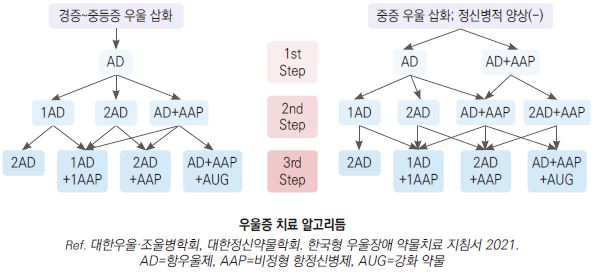

# 우울증 Depression

## <mark style="color:green;">일반 사항</mark>

* ≥2주 지속되는 우울한 기분, 흥미 또는 기쁨을 주던 사물에 대한 흥미 감소
*   주요우울증 : 기간의 대부분 우울, 흥미나 기쁨의 상실이 지속됨, 죄책감이나 무가치함이 동반됨; 삽화적, 빈번한

    재발성 증후군
*   슬픔 : 스트레스 사건(예: 상실)에 따른 정상적인 반응 (normal grief); 슬픈 감정의 변동이 있음, 기간 중 슬픔에서

    벗어나는 때 또는 즐거운 순간이 있음, 자존감은 유지됨; 주위의 동정심과 슬픔을 유발할 수 있음
* 유병률 : 성인의 6.7%가 ≥1회/년 주요 우울 삽화 경험
* 호발 연령 : 24\~40세; 평균 첫 발병 연령- 26\~29세
* 우울증 환자에 대하여 다른 정신 질환 동반 여부 평가, 자살 위험 평가
* 종종 동반 질환이 있으며(불안이 가장 흔함), 환자의 ＞⅔가 두통 등 통증, 소화기 장애를 호소함
* 노인 우울증에 대해서는 노화, 다른 내과 질환, 기억력 장애/치매 초기 증상 가능성 고려

### <mark style="color:$danger;">🚩 Red Flags!</mark>

<mark style="color:$danger;">**즉각 이송/응급 평가 — 생명 위협 또는 즉각적 위해 가능성**</mark>

* 자살 사고가 구체적(방법, 시기, 계획 등)이거나 자살 시도 직후인 경우
* 타인에 대한 위해 의도
* 급성 정신증(환청, 망상, 심한 와해 행동) 동반
* 음식/수분 거부로 인한 신체 상태 급격히 악화

<mark style="color:$warning;">**당일 의뢰 또는 긴급 평가 권고**</mark>

* 자살 사고가 있으나 구체적 계획은 없는 경우 (PHQ-9 9번 항목 양성)
* 양극성 장애 의심(과거 조증/경조증 삽화)
* 혼재성 양상(Mixed features) 의심 : 우울증을 호소하면서 동시에 초조, 과민성, 사고 빠름, 수면 감소, 과대성 등이 동반되는 경우&#x20;
  * 조증 전환 위험↑, 항우울제 단독 투여 시 삽화 악화 가능
  * 양극성 장애 감별 및 기분조절제 병용 고려 필요
* 약물·알코올 남용 동반, 인격장애 동반
* 중증 삽화로 일상생활 전면 불가 상태

<mark style="color:$info;">**외래 추적 / 추가 평가 계획 - 단독 시 즉각 위험 낮으나 경과 관찰 필요**</mark>

* 치료에 반응하지 않는 경우 (2가지 이상 계열 항우울제를 적절한 용량·기간 사용 후에도 미호전)
* 동반 신체 질환(갑상선, 당뇨, 만성통증 등) 조절 불량

## <mark style="color:green;">원인</mark>

* 유전(예: 신경 전달 기능 이상)
* 발달 문제(예: 인성, 유년기 사건)
* 정신적 스트레스(예: 이혼, 실직)

※ 복합적 원인에 의해 유발; 발병 원인과 위험 인자의 구별이 어려움; 우울에 취약한 특성을 지닌 사람이 스트레스 사건을 경험하면 우울 삽화가 발현됨

### <mark style="color:orange;">기전</mark>

* monoamine-deficiency hypothesis : norepinephrine↓(멍함, 무기력), serotonin↓(불안정, 적대감, 자살 충동), neurotransmitter(dopamine, acetylcholine, GABA, glutamate) 관련
* stress 중에 hypothalamic-pituitary-adrenal axis 활성도 증가 : cortisol 상승에 의한 영향
* inflammatory process, 비정상적 일주기 리듬 : 신경 전달 물질 생성 및 대사에 영향

### <mark style="color:orange;">위험 인자</mark>

**과거력 및 유전**

* 우울증 과거력 (가장 강력한 단일 위험 인자)
* 가족력 : 우울, 양극성 장애, 자살, 약물/알코올 남용; 우울증 배우자

**인구학적 특성**

* 여성 (남성의 2배)
* 고령 : 활동 장애, 나쁜 건강 상태, 복합적인 슬픔, 만성 수면 장애, 외로움

**심리·성격적 요인**

* 어릴 적 까다로운 기질, 신경증적 성격
* 낮은 자존감
* 생애 초기 경험 : 방임, 학대, 부모와의 불안정한 애착, 부모의 불화

**사회·환경적 요인**

* 사건 : 이별/사별, 심한 외상, 가정 폭력, 학대
* 만성적인 스트레스
* 사회적 환경 : 빈곤, 무직, 독신, 이혼, 부부 갈등, 상실, 신뢰 관계 결핍
* 낮은 교육 수준

**신체·의학적 요인**

* 만성 질환, 만성 통증, 신체 장애
* 지속되는 수면 장애

**행동·물질 관련**

* 약물/알코올 남용

### <mark style="color:orange;">재발 위험 인자</mark>

**질병 경과 관련**

* 주요우울증의 복수 episode 병력
* 중증의 첫 증상 및 중증의 후속 episode
* 이른 연령에 발생
* sub-threshold 우울 증상의 지속

**유전·가족력**

* 정신 질환(특히 기분장애) 가족력

**심리·성격적 요인**

* 부정적 성격

**사회·환경적 요인**

* 진행 중인 정신/사회적 스트레스 또는 손상

**신체·의학적 요인**

* 다른 비-정서적 정신 질환 존재
* 비-정신적 만성 질환 존재
* 지속적인 수면 장애

## <mark style="color:green;">임상 양상</mark>

* 슬픔, 불안, 짜증, 걱정, 집중력 부족, 좌절
* 불면, 거식증, 성욕 저하, 체중 감소, 신체적 불편
* 정신 운동성 동요나 지체, 망상, 활동 저하

## <mark style="color:green;">진단</mark>

선별 검사 \[USPSTF]

* 대상 : 이전에 검사한 적이 없는 모든 성인
* 검사 주기 : 정해지지 않음. 임상적으로 결정
* 검사 도구 : 특정하지 않음; 일반 인구- PHQ, 고령- GDS, 임신- 에든버러 척도(☞ p.136)
* 선별 검사에서 양성 시 다른 정신 질환(예: 불안, 공황장애)에 대해서도 검사 시행

### <mark style="color:orange;">진단 기준 \[DSM-5]</mark>

#### <mark style="color:$primary;">주요우울증 (Major depressive episode)</mark>

A. 다음 중 ≥5개의 증상이(1.과 2.중 최소 하나는 반드시 포함) ≥2주 지속되며 예전 기능에 변화가 발생; 일반적인 의학적 상태에 의한 증상 또는 기분에 합당하지 않는 망상이나 환각으로 인한 증상은 해당되지 않음

\[Depression]

1. 거의 하루 종일, 거의 매일 우울한 기분을 호소하거나(예: 슬픔, 공허감) 객관적으로 관찰됨(예: 울먹이는 모습)

\[Anhedonia]

2. 거의 하루 종일, 거의 매일, 거의 모든 일상에 대하여 흥미 또는 즐거움이 뚜렷이 저하되어 있음(주관적 호소 또는 객관적 관찰)

\[Physical Sx]

3. 체중 조절을 하고 있지 않는 상태에서 의미 있는 체중 감소나 증가(예: 1개월 동안 ＞5% 변화), 또는 거의 매일 식욕의 증가나 감소가 있음 \[appetitie/weight change]
4. 거의 매일 나타나는 불면 또는 과다 수면 \[sleep disturbance]
5. 거의 매일 나타나는 정신 운동성 동요 또는 지체(주관적 감정 뿐 아니라 객관적으로 관찰되는 안절부절 또는 느려짐) \[psychomotor disorder]
6. 거의 매일 나타나는 피로 또는 무기력함 \[fatigue]

\[Psychologic Sx]

7. 거의 매일 무가치감 또는 과도하거나 부적절한 죄책감을 느낌(단지 아픈 것에 대한 자책이나 죄책감이 아님) \[guilty/worthlessness]
8. 거의 매일 사고력이나 집중력의 감소 또는 우유부단함(주관적 호소나 객관적 관찰) \[concentration difficulty/indecisiveness]
9. 반복적인 죽음에 대한 생각(단순히 죽는 것에 대한 두려움이 아님), 구체적 계획 없는 반복적 자살 사고, 자살 시도 또는 구체적 자살 계획 \[suicidal ideation/attempt]

B. 증상이 사회적, 직업적, 또는 기타 중요한 기능 영역에서 임상적으로 의미 있는 고통이나 장애를 초래함

C. 증상은 물질(예: 약물) 또는 일반적인 의학적 상태(예: 갑상선저하증)의 직접적인 생리학적 영향에 의한 것이 아님

#### <mark style="color:$primary;">경도우울증 (Minor depression)</mark>

* 2주 동안 ≥2번의 우울 증상 경험
* 주요우울증의 기준에는 미흡

#### <mark style="color:$primary;">지속 우울 장애 (Persistent depressive disorder, Dysthymia)</mark>

A. 최소 2년 동안 주관적 호소 또는 다른 사람에 의해 관찰되는 거의 하루 종일 우울한 기분의 날이 그렇지 않은 날보다 더 많음

B. 우울이 있는 동안 다음 중 ≥2가지 존재

1. 식욕 저하 또는 과식
2. 불면 또는 과다 수면
3. 기력 저하 또는 피로
4. 낮은 자존감
5. 낮은 집중력 또는 의사 결정 장애
6. 절망감

C. 2년 동안 A 및 B의 증상이 없던 기간이 ＞2달 지속된 적이 없음

D. 주요우울증의 진단 기준이 2년 동안 지속될 수 있음

E. manic or hypomanic episode는 전혀 없으며 cyclothymic disorder에 해당되지 않음

F. schizophrenia나 다른 psychotic disorder에 해당되지 않음

G. 증상은 물질(예: 약물) 또는 다른 의학적 상태(예: 갑상선저하증)의 생리학적 영향에 의한 것이 아님

H. 증상이 사회적, 직업적, 또는 다른 중요한 기능 영역에서 임상적으로 유의미한 고통이나 장애를 야기함

#### <mark style="color:$primary;">계절성 정동장애 (Seasonal affective disorder)</mark>

* 계절적 특성을 갖는 우울증
* 여성에서 흔함
* 증상 : 무기력, 피로, 체중 증가, 과다 수면, 삽화적 탄수화물 갈망

#### <mark style="color:$primary;">주산기/산후 우울증 (Peripartum/Postpartum depression)</mark>

* DSM-5에서 주요우울장애의 세부 명시자(specifier)로 분류; 공식 기준은 임신 중 또는 출산 후 4주 이내 발생 ☞ [산후우울증](028_-postpartum-depression.md)
* 임상적으로는 출산 후 12개월까지 발생하는 경우를 포함하여 산후우울증(postpartum depression)으로 통용됨
* 산후 우울감(Postpartum blues)과 구별 필요 : 출산 후 2\~3일 내 발생하여 2주 내 자연 소실되는 경증 반응
* 선별 : Edinburgh Postnatal Depression Scale(EPDS) (☞ p.136)
* 치료 : 정신건강의학과 협진 권고; sertraline, escitalopram — 모유 수유 중 안전 근거 비교적 충분

### <mark style="color:orange;">검사</mark>

* 신체 질환의 양상이 없는 경우 권고하지 않음
* 검사 대상 : 새로 진단, 심한 증상, 치료에 반응하지 않음
* 기본 검사 : CBC, 전해질, U/A, TSH
* 선택 : Vit B12(cobalamin), B9(folate), Vit D, ECG, EEG, brain MRI

### <mark style="color:orange;">우울 척도 문진표</mark>

#### <mark style="color:$primary;">PHQ-2</mark>

▶지난 2주일 동안 당신은 다음의 문제들로 인하여 지장을 받았던 날들이 얼마나 됩니까?

1. 일 또는 여가 활동을 하는데 흥미나 즐거움이 거의 없다.
2. 기분이 가라앉거나 우울하거나 희망이 없다.

▶2개 항목에 각각 배점 : 없음(0\~1일)=0점, 수일(2\~6일)=1점, 절반 이상(7\~11일)=2점, 거의 매일(12\~14일)=3점

▶판정 : ≥3점을 양성 기준으로 했을 때 민감도/특이도 87%/78%; 양성 시 PHQ-9 등 추가 평가

#### <mark style="color:$primary;">[PHQ-9](http://www.phqscreeners.com)</mark>

* 민감도/특이도 : ≥10점 기준 - 성인 88%/88%, 청소년 90%/78%&#x20;
  * ✽cut-off를 ≥15점으로 높이면 민감도↓/특이도↑

▶지난 2주일 동안 당신은 다음의 문제들로 인하여 지장을 받았던 날들이 얼마나 됩니까?

1. 일 또는 여가 활동을 하는데 흥미나 즐거움이 거의 없다.
2. 기분이 가라앉거나 우울하거나 희망이 없다.
3. 잠들기 어렵거나 잠을 유지하기 어렵거나 잠을 너무 많이 잔다.
4. 피곤하다고 느끼거나 기운이 거의 없다.
5. 입맛이 없거나 과식을 한다.
6. 자신을 부정적 또는 실패자로 보거나 자기 자신이나 가족을 실망시 키고 있다고 느낀다.
7. 신문을 읽거나 텔레비전 보는 것과 같은 일에 집중하기 어렵다.
8. 주변 사람들이 알 정도로 움직이거나 말하는 것이 느려졌다. 또는 반대로 예전보다 초조해서 가만히 못 있는다.
9. 자신이 죽는 것이 더 낫다고 생각하거나 어떤 식으로든 자신을 해칠 것이라고 생각한다.

▶9개 항목에 각각 배점 : 없음(0\~1일)=0점, 수일(2\~6일)=1점, 절반 이상(7\~11일)=2점, 거의 매일(12\~14일)=3점

▶판정 및 조치 : 0\~4점 = none; 5\~9점 = mild; 관찰, PHQ-9 추적 반복 검사; 10\~14점 = moderate; 상담 치료 고려, 추적 관리, 약물 치료 고려; 15\~19점 = moderately severe; 즉시 약물 치료 시작, 정신 요법 고려; 20\~27점 = severe depression; 즉시 약물 치료 시작, 의뢰 고려

**<mark style="color:blue;">\[삶의 질 평가]</mark>**(참고 문항)\
▶위에 해당되는 사항이 있다면 그로 인하여 직장이나 집안일, 또 다른 사람들과 지내는 것이 얼마나 힘듭니까?\
□ 전혀 힘들지 않다.　□ 어느 정도 힘들다.　□ 매우 힘들다.　□ 극도로 힘들다.

#### <mark style="color:$primary;">WHO-5 Well-being index</mark>

* 민감도/특이도 : 93%/64%

▶지난 2주일 중 다음 상태가 얼마나 있었습니까?

1. 나는 유쾌하고 기분이 좋다.
2. 나는 차분하고 편안하다.
3. 나는 활동적이고 활기 찬 기분이다.
4. 나는 상쾌하게 잠에서 깼다.
5. 나의 일상은 나의 흥미를 끄는 것들로 채워져 왔다.

▶5개 항목에 각각 배점 : 항상=5점, 대부분=4점, 절반=3점, <절반=2점, 약간=1점, 없음=0점

▶ 판정 : 총점으로 ＜13점이거나 ≤1점인 항목이 있는 경우 주요우울증 의심

#### <mark style="color:$primary;">Beck Depression Inventory (BDI)</mark>

<table><thead><tr><th width="45.263153076171875" align="center">번호</th><th width="89.47369384765625">영역</th><th align="center">0점</th><th align="center">1점</th><th align="center">2점</th><th align="center">3점</th></tr></thead><tbody><tr><td align="center">1</td><td>슬픔</td><td align="center">슬프지 않다</td><td align="center">슬프다</td><td align="center">항상 슬프고 기운을 낼 수 없다</td><td align="center">너무나 슬프고 불행해서 도저히 견딜 수 없다</td></tr><tr><td align="center">2</td><td>비관</td><td align="center">미래에 대해 낙심하지 않는다</td><td align="center">미래에 대해 낙담하고 있다</td><td align="center">기대할 것이 아무것도 없다고 느낀다</td><td align="center">미래가 절망적이고 나아질 가망이 없다고 느낀다</td></tr><tr><td align="center">3</td><td>실패감</td><td align="center">실패자라고 느끼지 않는다</td><td align="center">보통 사람들보다 더 많이 실패한 것 같다</td><td align="center">내 삶을 뒤돌아볼 때 많은 실패만 보인다</td><td align="center">완전한 실패자라고 느낀다</td></tr><tr><td align="center">4</td><td>불만족</td><td align="center">일상생활에 만족하고 있다</td><td align="center">일상생활이 전처럼 즐겁지 않다</td><td align="center">어떤 것에서도 만족을 얻지 못한다</td><td align="center">모든 것이 불만스럽거나 싫증난다</td></tr><tr><td align="center">5</td><td>죄책감</td><td align="center">특별히 죄책감을 느끼지 않는다</td><td align="center">죄책감을 느낄 때가 많다</td><td align="center">죄책감을 느낄 때가 아주 많다</td><td align="center">항상 죄책감을 느낀다</td></tr><tr><td align="center">6</td><td>처벌감</td><td align="center">벌을 받고 있다고 느끼지 않는다</td><td align="center">벌을 받을지도 모른다는 느낌이 든다</td><td align="center">벌을 받을 것 같다</td><td align="center">지금 벌을 받고 있다고 느낀다</td></tr><tr><td align="center">7</td><td>자기혐오</td><td align="center">자신에게 실망하지 않는다</td><td align="center">자신에게 실망하고 있다</td><td align="center">자신에게 화가 난다</td><td align="center">자신을 증오한다</td></tr><tr><td align="center">8</td><td>자기비난</td><td align="center">다른 사람보다 못한 것 같지는 않다</td><td align="center">약점이나 실수에 대해 자신을 탓하는 편이다</td><td align="center">내 잘못을 항상 자책한다</td><td align="center">모든 나쁜 일에 대해 자신을 탓한다</td></tr><tr><td align="center">9</td><td>자살 사고</td><td align="center">자살을 생각하지 않는다</td><td align="center">가끔 자살을 생각하지만 실행하지는 않을 것이다</td><td align="center">자살하고 싶다</td><td align="center">기회만 있으면 자살하겠다</td></tr><tr><td align="center">10</td><td>울음</td><td align="center">평소보다 더 울지는 않는다</td><td align="center">전보다 더 많이 운다</td><td align="center">요즘 항상 운다</td><td align="center">울고 싶어도 울 수가 없다</td></tr><tr><td align="center">11</td><td>초조감</td><td align="center">평소보다 더 짜증을 내는 편은 아니다</td><td align="center">평소보다 조금 더 짜증이 난다</td><td align="center">꽤 많은 시간 동안 짜증이 난다</td><td align="center">항상 짜증이 난다</td></tr><tr><td align="center">12</td><td>대인관심</td><td align="center">다른 사람들에 대한 관심을 잃지 않고 있다</td><td align="center">전보다 다른 사람들에 대한 관심이 줄었다</td><td align="center">다른 사람들에 대한 관심을 거의 잃었다</td><td align="center">다른 사람들에 대한 관심을 완전히 잃었다</td></tr><tr><td align="center">13</td><td>결정력</td><td align="center">평소처럼 결정을 잘 내린다</td><td align="center">결정하는 것을 전보다 많이 미룬다</td><td align="center">결정하는 데 전보다 큰 어려움을 느낀다</td><td align="center">더 이상 결정을 내릴 수 없다</td></tr><tr><td align="center">14</td><td>신체상</td><td align="center">전보다 내 모습이 나빠졌다고 느끼지 않는다</td><td align="center">나이 들어 보이거나 매력 없어 보일까 봐 걱정한다</td><td align="center">외모가 영구히 매력 없게 변했다고 느낀다</td><td align="center">내가 추하게 보인다고 믿는다</td></tr><tr><td align="center">15</td><td>업무능력</td><td align="center">전처럼 일을 잘할 수 있다</td><td align="center">일을 시작하는 데 전보다 많은 노력이 필요하다</td><td align="center">무슨 일이든 하려면 자신을 매우 심하게 push해야 한다</td><td align="center">전혀 아무 일도 할 수가 없다</td></tr><tr><td align="center">16</td><td>수면</td><td align="center">평소처럼 잠을 잘 수 있다</td><td align="center">예전처럼 잠을 자지는 못한다</td><td align="center">전보다 1~2시간 일찍 깨며 다시 잠들기 어렵다</td><td align="center">평소보다 몇 시간이나 일찍 깨며 다시 잠들 수 없다</td></tr><tr><td align="center">17</td><td>피로감</td><td align="center">평소보다 더 피곤하지는 않다</td><td align="center">전보다 쉽게 피곤해진다</td><td align="center">무엇을 해도 피곤해진다</td><td align="center">너무 피곤해서 아무 일도 할 수 없다</td></tr><tr><td align="center">18</td><td>식욕</td><td align="center">식욕은 평소와 다름없다</td><td align="center">식욕이 예전만 못하다</td><td align="center">식욕이 많이 떨어졌다</td><td align="center">식욕이 전혀 없다</td></tr><tr><td align="center">19</td><td>체중</td><td align="center">체중 감소는 없다</td><td align="center">2 ㎏ 이상 줄었다</td><td align="center">4.5 ㎏ 이상 줄었다</td><td align="center">7 ㎏ 이상 줄었다</td></tr><tr><td align="center">20</td><td>건강염려</td><td align="center">건강에 대해 전보다 더 염려하지 않는다</td><td align="center">통증, 소화불량, 변비 등의 건강 문제를 걱정한다</td><td align="center">건강이 염려되어 다른 일을 생각하기 힘들다</td><td align="center">건강이 너무 염려되어 다른 아무것도 생각할 수 없다</td></tr><tr><td align="center">21</td><td>성욕</td><td align="center">성에 대한 관심에 별다른 변화가 없다</td><td align="center">전보다 성에 대한 관심이 줄었다</td><td align="center">성에 거의 관심이 없다</td><td align="center">성에 대한 관심을 완전히 잃었다</td></tr></tbody></table>

▶각 항목에서 해당하는 문항의 점수를 선택하여 합산

▶판정 : 1\~10점=정상, 11\~16점=경증 기분 장애, 17\~20점=경계, 21\~30점=중등도 우울, 31\~40점=중증 우울, ＞40=극도의 우울

#### <mark style="color:$primary;">노인 우울 척도 : GDS-SF-K (Geriatric Depression Scale-한국판 단축형)</mark>

<table><thead><tr><th width="425.47369384765625">문항</th><th align="center">예</th><th align="center">아니오</th></tr></thead><tbody><tr><td>1. 평소 자신의 생활에 만족합니까?</td><td align="center">0</td><td align="center">1</td></tr><tr><td>2.* 활동과 흥미가 많이 저하되었습니까?</td><td align="center">1</td><td align="center">0</td></tr><tr><td>3. 앞날에 대해서 희망적입니까?</td><td align="center">0</td><td align="center">1</td></tr><tr><td>4. 대부분의 시간을 맑은 정신으로 지냅니까?</td><td align="center">0</td><td align="center">1</td></tr><tr><td>5. 대부분의 시간이 행복하다고 느낍니까?</td><td align="center">0</td><td align="center">1</td></tr><tr><td>6. 지금 살아있다는 것이 아름답다고 생각합니까?</td><td align="center">0</td><td align="center">1</td></tr><tr><td>7.* 가끔 낙담하고 우울하다고 느낍니까?</td><td align="center">1</td><td align="center">0</td></tr><tr><td>8.* 지금 자신의 인생이 가치가 없다고 느낍니까?</td><td align="center">1</td><td align="center">0</td></tr><tr><td>9. 인생이 흥미롭다고 느낍니까?</td><td align="center">0</td><td align="center">1</td></tr><tr><td>10. 활력이 충만하다고 느낍니까?</td><td align="center">0</td><td align="center">1</td></tr><tr><td>11.* 사소한 일에 자주 감정의 동요를 느낍니까?</td><td align="center">1</td><td align="center">0</td></tr><tr><td>12.* 자주 울고 싶다고 느낍니까?</td><td align="center">1</td><td align="center">0</td></tr><tr><td>13. 아침에 일어나는 것이 즐겁습니까?</td><td align="center">0</td><td align="center">1</td></tr><tr><td>14. 결정을 내리는 것이 수월합니까?</td><td align="center">0</td><td align="center">1</td></tr><tr><td>15. 당신의 마음은 이전처럼 편안합니까?</td><td align="center">0</td><td align="center">1</td></tr></tbody></table>

▶배점 : '아니오'에 1점; \*2, 7, 8, 11, 12번은 '예'에 1점

▶판정 : ≤5점=정상, 6\~9점=중등도 우울, ≥10=우울증

_<mark style="color:$info;">Ref. 기백석. 한국판 노인 우울 척도 단축형의 표준화 예비연구. 신경정신의학 1996;35(2);298- 307</mark>_

***

## <mark style="background-color:$warning;">Management</mark>

### <mark style="color:orange;">치료 방침</mark>

* 정신 치료 : 경증 우울증에서 초치료로 정신 치료를 권고; 특히 고령에서 심리사회적 치료를 선호
* 약물 치료 : 주요 우울 삽화를 갖는 환자에게 약물 치료를 권고
  * 중증 과거력이 없는 2년 이하의 경증 우울증 삽화에 대한 일률적인 약물 치료는 효과와 부작용을 고려하여 권고하지 않음. 단, 다른 시도로 회복되지 않는 경우 고려 \[NICE]

## <mark style="color:green;">비-약물 치료</mark>

### <mark style="color:orange;">생활 습관 중재</mark>

*   식이 : 가공 식품 섭취를 줄이고 채소, 과일, 전곡류, 건강 단백질(예: 살코기, 생선, 치즈), 무가당 유제품, 올리브유, 강황,

    계피 등의 섭취를 늘리는 것이 우울 및 불안, 스트레스 증상 완화에 도움이 된다는 보고가 있음
* 운동 : 중등 강도 이상의 신체 활동, 유산소/근력 운동이 우울 증상과 삶의 질을 개선 (☞ p.1160)
* 디지털 치료제(DTx) : CBT 기반 앱을 경증\~중등도 우울증의 보조 수단으로 활용 가능; 국내외 허가 절차 진행 중 (근거 축적 중, 2023 APA update)

### <mark style="color:orange;">정신 치료</mark>

* behavioral therapy
* cognitive-behavioral therapy, mindfulness
* interpersonal psychotherapy
* psychodynamic psychotherapy
* supportive therapy

### <mark style="color:orange;">지지 치료</mark>

* clinician-guided self-help : 의사의 지시 하에 영상 자료 등을 이용하여 자가 치료 시도
*   relaxation & positive activity : 근육 이완, 평화로운 장면 등 이완 이미지 회상, autogenic training(전신의 따듯함과 평온함의

    상태를 유도/시각화)
* exercise : 우울 증상 완화 및 건강상 이익을 제공
* music therapy : 도파민 활성↑, HPA axis↓, 부교감신경계 자극 작용; 음악을 듣거나 직접 연주

## <mark style="color:green;">약물 치료</mark>

### <mark style="color:orange;">약제 종류</mark>

* 아래 용량은 일반적인 시작 및 유지 용량임 (☞ p.1146; 보험기준 ☞ p.1176)
* 일반적으로 계열 간 또는 계열 내 약제 간 효과 차이는 없음. 단, 환자에 따라 반응이 다를 수 있음

#### <mark style="color:$primary;">SSRI</mark>

* 부작용 : 성 기능 저하, 구역, 복통, 어지럼, 불면증, 두통; 특히 복용 첫 주에 많음
* 고령자 SSRI 복용 시 SIADH에 의한 저나트륨혈증 주의 : 투여 초기(특히 첫 2\~4주) 전해질(Na) 확인 권고; 증상(오심, 두통, 의식 혼탁) 발생 시 즉시 중단 및 평가
* 고령 및 청소년, 간질환/불안증/공황장애 동반 시 저용량으로 시작
* escitalopram, sertraline : 약물 상호 작용이 적음
* escitalopram : 10 ㎎/d, 10\~20 ㎎/d <mark style="color:blue;">\[렉사프로]</mark>
* fluoxetine, paroxetine : 다른 약물의 혈중 농도를 높일 수 있음. 고령자에서 poorly tolerated
* citalopram : 고용량 시 QT 연장 부작용; 20 ㎎/d, 20\~40 ㎎/d
* fluoxetine : 20 ㎎/d 아침, 20\~60 ㎎/d <mark style="color:blue;">\[푸로작]</mark> (✽청소년에 대하여 FDA 승인); 폭식증 적응
* paroxetine : 10 ㎎/d, 20\~50 ㎎/d <mark style="color:blue;">\[세로자트]</mark>; CR 12.5 ㎎/d, 25\~62.5 ㎎/d <mark style="color:blue;">\[팍실 CR]</mark>
* sertraline : 25\~50 ㎎/d, 50\~200 ㎎/d <mark style="color:blue;">\[졸로푸트]</mark>
* fluvoxamine : 50 ㎎/d, 50\~200 ㎎/d <mark style="color:blue;">\[듀미록스]</mark>

#### <mark style="color:$primary;">SNRI</mark>

* 통증 및 신체 증상 감소 효과가 있음 (☞ p.13)
* 부작용 : 위장관계 부작용, 성 기능 저하, 체중 증가, 확장기 고혈압(고용량 투여 시)
* duloxetine : 30 ㎎/d, 60\~120 ㎎/d <mark style="color:blue;">\[심발타]</mark>; neuropathic pain 적응
* venlafaxine XR : 37.5 ㎎/d, 225 ㎎/d <mark style="color:blue;">\[이팩사 XR]</mark>
* desvenlafaxine : 50\~100 ㎎/d <mark style="color:blue;">\[프리스틱]</mark>
* milnacipran : 시작 25 ㎎ qd, 최대 100 ㎎/d <mark style="color:blue;">\[익셀]</mark>; 섬유근육통 적응

#### <mark style="color:$primary;">TCA</mark>

* 부작용 및 과용 시 치명적 손상 위험을 고려하여 2차 선택
* 주의 : 고령(부작용 증가), 녹내장, BPH, 갑상선항진증, 심혈관 질환, 부정맥, 간질환, 당뇨병(혈당 상승), MAOI 투여
* 부작용 : 입마름, 시야 흐림, 변비, 요 정체, 빈맥, 혼돈
* amitriptyline : 25\~50 ㎎/d, 100\~300 ㎎/d <mark style="color:blue;">\[에트라빌]</mark>; 편두통 적응
* imipramine : 25\~50 ㎎/d, 100\~300 ㎎/d <mark style="color:blue;">\[이미프라민]</mark>
* nortriptyline : 25 ㎎/d, 50\~150 ㎎/d <mark style="color:blue;">\[센시발]</mark>; 근골격 통증 적응

#### <mark style="color:$primary;">기타 항우울제</mark>

* trazodone : 시작 25 ㎎ qd 저녁, 최대 600 ㎎/d <mark style="color:blue;">\[트리티코]</mark>; 불면증 적응
*   bupropion : 정신 운동 지체, 피로감, 집중력 저하 개선; 고용량에서 경련;

    150\~450 ㎎/d <mark style="color:blue;">\[웰부트린]</mark> (300 ㎎/d 까지 보험 인정); 흡연 적응
* vilazodone : serotonin partial agonist & reuptake inhibitor(SPARI); 10\~40 ㎎/d
* vortioxetine : serotonin 수용체 조절/자극; 인지 기능 보존/향상; 5\~20 ㎎/d <mark style="color:blue;">\[브린텔릭스]</mark>
* mirtazapine : tetracyclic계; α2-adrenergic 작용제, 5-HT2 대항제; 수면 시간/질 향상, 불안 감소, 식욕/체중 감소 효과; \[부작용]진정/졸림, 체중 증가, 어지럼; 15\~45 ㎎/d <mark style="color:blue;">\[레메론]</mark>
* agomelatine : 멜라토닌 작용제, 5-HT2C 수용체 대항제; 전두 피질에서 norepinephrine 및 dopamine 방출↑; \[부작용] 어지럼, 위장관계, 간 기능 이상; 25\~50 ㎎ qd(취침시) <mark style="color:blue;">\[아고틴]</mark>

#### <mark style="color:$primary;">대체 요법</mark>

* s-adenosyl-L-methionine : 일반적으로 의미 있는 효과 없음
* St John’s wort(Hypericum perforatum) : 일부에서 경증 우울증에 대하여 유효하나 치료 적정량 및 효과의 지속 여부에 대한 연구가 미흡하며 다른 약물과의 상호 작용 문제로 처방 권고 안 함 \[NICE]

### <mark style="color:orange;">약제 선택</mark>

#### <mark style="color:$primary;">1단계 (초기) 치료 전략</mark>

<table><thead><tr><th width="166.52630615234375">임상 삽화</th><th>1차 선택</th><th>2차 선택</th></tr></thead><tbody><tr><td>경증 및 중등증 삽화</td><td>항우울제 단독¹⁾</td><td>• 항우울제+항우울제<br>• 항우울제+비정형 항정신병제²⁾</td></tr><tr><td>중증 삽화/<br>정신병적 양상(-)</td><td>• 항우울제 단독<br>• 항우울제+비정형 항정신병제</td><td>• 항우울제+항우울제<br>• 항우울제+기분조절제<br>• 비정형 항정신병제 단독</td></tr><tr><td>중증 삽화/<br>정신병적 양상(+)</td><td>항우울제+비정형 항정신병제¹⁾</td><td>• 비정형 항정신병제 단독<br>• 항우울제+기분조절제<br>• 항우울제+항우울제²⁾<br>• 항우울제 단독²⁾</td></tr></tbody></table>

_<mark style="color:$info;">1) 최우선 선택. 2) 컨센서스 없음</mark>_\
\&#xNAN;_<mark style="color:$info;">Ref. 대한우울·조울병학회, 대한정신약물학회. 한국형 우울장애 약물치료 지침서 2021.</mark>_

**항우울제**

* 1차 약물 : 각 삽화의 심각도에 관계없이 escitalopram(최우선 선택) 및 대부분의 항우울제
* 2차 약물 : milnacipran, agomelatine, bupropion, tianeptine, vortioxetine, TCA(중증 시)

**항정신병제** (☞ p.162)

* 정신병적 양상(-)
  * 1차 약물 : aripiprazole <mark style="color:blue;">\[아빌리파이]</mark>
  * 2차 약물 : quetiapine <mark style="color:blue;">\[쎄로켈]</mark>, olanzapine <mark style="color:blue;">\[자이프렉사]</mark>, risperidone, ziprasidone, amisulpride
* 정신병적 양상(+)
  * 1차 약물 : aripiprazole(최우선), quetiapine, olanzapine
  * 2차 약물 : risperidone, paliperidone, blonanserin, ziprasidone, amisulpride, clozapine

#### <mark style="color:$primary;">2단계 치료 전략</mark>

**항우울제 단독 치료에 불충분한 반응을 보이는 경우**

* 초기 치료에 부분적인 반응을 보인 경우
  * 1차 선택 : 비정형 항정신병제 추가, 다른 항우울제의 추가 권고
  * 2차 선택 : 항우울제 교체, 강화 약물(예: lithium, 항경련제, buspirone, psychostimulant, 갑상선 호르몬) 추가 고려
* 초기 치료에 거의 반응이 없는 경우
  * 1차 선택 : 비정형 항정신병제 추가, 항우울제 교체, 항우울제 추가 권고
  * 2차 선택 : 강화 약물 추가 고려

**항우울제 & 비정형 항정신병제 병합 치료에 불충분한 반응을 보이는 경우**

* 초기 치료에 부분적인 반응을 보인 경우
  * 1차 선택 : 항우울제 추가, 비정형 항정신병제 교체 권고
  * 2차 선택 : 비정형 항정신병제 추가, 항우울제 교체, 강화 약물 추가 고려
* 초기 치료에 거의 반응이 없는 경우
  * 1차 선택 : 비정형 항정신병제 교체, 항우울제 추가, 항우울제 교체 권고
  * 2차 선택 : 비정형 항정신병제 추가, 강화 약물 추가 고려

#### <mark style="color:$primary;">임상 아형에 따른 치료 전략</mark>

**지속성 우울장애 (기분저하증)**

* 1차 선택 : 항우울제 단독
* 2차 선택 : 항우울제+비정형 항정신병제, 항우울제+항우울제, 항우울제+기분조절제, 비정형 항정신병제 단독

**지속성 우울장애 혼합형**

* 1차 선택 : 항우울제+비정형 항정신병약물, 항우울제+기분조절제
* 2차 선택 : 비정형 항정신병제 단독, 기분조절제 단독, 항우울제 단독, 항우울제+항우울제, 항우울제+비정형 항정신병제

**주요우울장애 불안형**

* 1차 선택 : 항우울제 단독, 항우울제+비정형 항정신병제
* 2차 선택 : 항우울제+항우울제, 항우울제+기분조절제, 비정형 항정신병제 단독

#### <mark style="color:$primary;">고령</mark>

* 경증\~중등증 : 항우울제 단독
* 중증 & 정신병적 양상(-) : 항우울제 단독, 항우울제+비정형 항정신병제
* 정신병적 양상(+) : 항우울제+비정형 항정신병제
* 1차 선택 항우울제 : escitalopram(최우선), sertraline, desvenlafaxine, vortioxetine, duloxetine, venlafaxine, fluoxetine, mirtazapine, milnacipran
* 1차 선택 항정신병제 : aripiprazole(최우선), quetiapine

#### <mark style="color:$primary;">동반 질환에 따른 항우울제의 선택</mark>

| 동반 질환             | 1차 선택        | 2차 선택        | 3차 선택       |
| ----------------- | ------------ | ------------ | ----------- |
| 당뇨, 파킨슨병          |              |              | bupropion   |
| 갑상선 질환            | escitalopram | sertraline   | fluoxetine  |
| 간/신장 질환, 고혈압, 뇌전증 |              |              | tianeptine  |
| 만성통증              | duloxetine   | milnacipran  | venlafaxine |
| 심혈관 질환            | sertraline   | escitalopram | tianeptine  |
| 부정맥               | sertraline   | escitalopram | fluoxetine  |

#### <mark style="color:$primary;">약물 안정성을 고려한 항우울제의 선택</mark>

|         | 1차 선택       | 2차 선택        | 3차 선택       |
| ------- | ----------- | ------------ | ----------- |
| 안전사고    |             | escitalopram | fluoxetine  |
| 세로토닌증후군 | bupropion   | tianeptine   | agomelatine |
| 기립성 저혈압 |             | escitalopram | mirtazapine |
| 자살 생각   | mirtazapine | bupropion    | agomelatine |

#### <mark style="color:$primary;">약물 부작용에 따른 항우울제의 선택</mark>

|              | 1차 선택        | 2차 선택       | 3차 선택        |
| ------------ | ------------ | ----------- | ------------ |
| 성기능 장애       |              | mirtazapine | vortioxetine |
| 졸림, 진정작용     | bupropion    | fluoxetine  | tianeptine   |
| 체중 증가        |              | fluoxetine  | vortioxetine |
| 항콜린성 부작용     | escitalopram | agomelatine | vortioxetine |
| 수면장애(불면)     |              | paroxetine  | TCAs         |
| 소화기장애(오심/구토) | mirtazapine  | tianeptine  | bupropion    |

### <mark style="color:orange;">용량 조절</mark>

* 저용량으로 시작하고 호전까지 매 2주, 이후 매달 방문 및 조절(첫 3개월 동안 ≥6회 방문)
* 젊은 연령(＜30세) 및 자살 위험이 높은 경우에는 치료 개시 후 **첫 4주간 매주** 자살 사고 모니터링, 매주 용량 조절
* 고령자에서는 ½ 용량으로 시작, 2\~4주마다 용량 조절
* 불안증이 동반되어 있는 경우 불안증 용량으로 시작할 수 있음 (✽보통 불안증 치료 용량은 우울증에 대한 용량보다 저용량임)

### <mark style="color:orange;">치료 반응 판정</mark>

* response : 증상의 ≥50% 호전
* remission : 우울 척도상 진단 기준치 이하로 호전
* 적절한 치료 시 1\~2주 내 증상이 개선되며, 충분한 효과까지 4\~6주 소요됨 (✽약물에 대한 반응이 빠른 환자가 완화 가능성이 많음)
* 6\~12주(8주) 치료 후 충분한 효과 여부를 판정 → 안정 시 3\~6개월마다 방문 평가
* 4\~6주 치료로 증상의 25% 이상 감소되지 않으면 치료 방법 변경 고려

### <mark style="color:orange;">반응 부족에 대한 대처</mark>

#### <mark style="color:$primary;">부족한 반응의 원인 평가</mark>

* 진단의 적정성(오진), 약제 선택의 적정성, 부적절한 투여 방법, 부적절한 치료 기간
* 치료 불순응, 지속 또는 견디기 힘든 부작용, 환자와 치료자 간의 라뽀 부족
* 다른 병발 질환 또는 이상(예: 알코올 남용), 복잡한 정신적/사회적 요인

#### <mark style="color:$primary;">약제 조정(2차 약제) 또는 의뢰</mark>

* 약물 교체 시 이전 사용 약물과의 상호 작용 주의, 특히 긴 반감기 약제 주의 (✽fluoxetine은 중단 후 1주간 영향을 미침)
* SSRI에서 TCA로 교체 시 TCA 저용량으로 시작 (✽잔류 SSRI의 영향으로 TCA의 대사가 억제됨)

### <mark style="color:orange;">치료 기간</mark>

* 적절한 치료 반응을 보인 경우 초기 급성기 치료 후 최소 6\~12개월간 약물 치료를 유지
* 급성기 치료 후에 유지 치료를 하지 않는 경우 주요우울장애 환자의 50\~80%가 재발; 항우울제 치료의 조기 중단은 재발을 높이며, 재발 횟수가 증가할수록 치료가 더 어려워짐
* 다음의 경우 치료 지속 : 첫 번째 episode가 ＜20세 또는 ＞50세에서 발생, ＞40세에서 2 episodes 발생(그중 한 번은 ＞50세 발생), 3회 이상의 episodes 경험

#### <mark style="color:$primary;">약제 중단 방법</mark>

* 갑자기 투여를 중단하는 경우 금단 증상(예: 어지럼, 구역, 두통, 감각 이상)이 발생하므로 중단 예정 시 수 주(보통 4주) 동안 tapering
* 반감기가 짧은 약제(예: paroxetine, venlafaxine)는 중단하는 데 보다 긴 기간이 필요할 수 있음
* 중단 후에도 수개월간 매달 추적 관찰

### <mark style="color:orange;">부작용</mark>

* (☞ p.1146)
* 일반적으로 부작용은 용량에 비례함
*   항우울제의 부작용은 시간이 지나면서 보통 호전되지만 추적 관찰 중에 호전되지 않으면 약물 교체 또는 감량 및

    benzodiazepine계 단기(2주 이내) 병용 고려

***



### <mark style="color:orange;">치료 저항성 우울증 (Treatment resistant depression)</mark>

* 서로 다른 계열의 2가지 항우울제(또는 다른 치료)를 적절한 용량과 기간 동안 치료했음에도 효과가 부족한 경우
* 우울증 환자 중 30% 이상이 해당
* 원인 : 뇌하수체-시상하부-부신 축, 면역, glutamate system, 뇌유래신경영양인자(brain derived neurotrophic factor), 뇌의 구조적/기능적 이상, 유전
* 위험 인자 : 낮은 사회적 지지, 사회적 적응 부족, 부정적 생활 사건, 정신병적 양상, 물질남용, 불안장애, 자살 위험, 첫 번째 항우울제에 치료반응 없음, 멜랑콜리아 양상 동반

#### <mark style="color:$primary;">치료</mark>

* 항우울제 치료 최적화 : 투여 용량/기간, 약물 순응도 확인 및 시정
* 항우울제 교체 또는 병용 : 기존 항우울제의 효과가 미약(＜25% 호전)한 경우 교체(다른 계열로의 교체는 근거가 불명확)
* 강화 요법 : 다른 계열 약물 추가; 약물 상호작용 주의
  * 비정형 항정신병제(예: aripiprazole, quetiapine), lithium, 정신자극제(예: methylphenidate, modafinil), 갑상선 호르몬, esketamine(항우울제)
  * esketamine : Rapid-acting antidepressant; NMDA수용체 길항 → glutamate/AMPA 수용체 경로를 통한 빠른 항우울 작용 (기존 항우울제와 기전 상이); 치료저항성 우울증 및 급성 자살 위기가 동반된 중등도 이상 주요우울장애에서 기존 항우울제보다 우선 고려 가능 \[최근 지침]; 주 2회 비강 분무 ×1\~4주, 이후 증량; 투여 후 최소 2시간 의료기관 모니터링 필수(해리, 혈압 변동 관찰); \[부작용] 오심, 어지럼증, 해리, 두통, 미각 이상 <mark style="color:blue;">\[스프라바토 나잘 스프레이]</mark>
* 비약물학 요법
  * 생물학적 치료 : 전기경련치료(ECT), 신경조절술(Neuromodulation)
    * 반복적 경두개 자기자극술(rTMS) : 좌측 배외측 전전두엽(DLPFC) 자극; 약물 불내성 또는 2가지 이상 항우울제 실패 시 적응; 국내 급여 등재(2022); 일 1회, 4\~6주 시행; 효과 크기는 ECT보다 작으나 인지 부작용 없음; \[부작용] 두통, 두피 불편감(경미, 일시적)
    * 경두개 직류자극술(tDCS) : 약한 직류 전류로 피질 흥분성 조절; 근거 축적 중 — 단독 사용보다 항우울제 병용 시 효과 보고; 아직 표준 치료로 권고되지 않음 (근거 수준 낮음)
    * ECT : 중증·치료저항성·정신병적 양상·급성 자살 위기 시 가장 효과적; 전신마취 필요
  * 심리 사회적 치료 : 인지행동 치료, 마음챙김(mindfulness) 치료, 변증법적 행동 치료, 행동 활성화 치료

***

### <mark style="color:red;">질병코드</mark>

F32 우울에피소드

***

## <mark style="color:purple;">처방례</mark>

> **처방례 1.** 기본 — SSRI 단독
>
> ```
> 렉사프로 10 mg/T  1T  qd  조식 후
> ※ 저용량(5 mg)으로 시작하여 1~2주 후 10 mg으로 증량 가능
> ※ 효과 판정은 4~6주 후; 충분한 효과까지 최대 8주 소요
> ※ 30세 미만: 투약 첫 4주간 매주 자살 사고 모니터링
> ※ 고령자: 투약 2~4주 후 전해질(Na) 확인 (SIADH 위험)
> ※ 치료 반응 시 최소 6~12개월 유지; 중단 시 4주에 걸쳐 서서히 감량
> ```

> **처방례 2.** SNRI 선택 (통증 동반 또는 SSRI 불내성)
>
> ```
> 이팩사 XR 서방 37.5 mg/C  1C  qd  조식 후  (첫 1~2주)
> → 2주 후 75 mg으로 증량; 필요 시 최대 225 mg까지
> ※ 고용량 시 확장기 혈압 상승 가능 — 혈압 모니터링
> ※ discontinuation syndrome 위험 높음 — 갑작스러운 중단 금지, 반드시 서서히 감량
> ```

> **처방례 3.** 수면 장애 동반
>
> ```
> 레메론 15 mg/T  1T  hs
> ※ 졸림, 체중 증가 부작용 사전 설명
> ※ 수면 개선 효과는 즉각적이나 항우울 효과는 2~4주 소요
> ```

> **처방례 4.** 폭식 동반
>
> ```
> 푸로작 확산정 20 mg/T  1T  qd  아침
> ※ 폭식증 적응증; 반감기 길어 discontinuation syndrome 위험 낮음
> ※ 다른 약물과의 상호 작용(CYP2D6 억제) 주의
> ```

***

### <mark style="color:$success;">핵심 복약 지도</mark>

> **우울증 약물 복용 안내**
>
> * 항우울제는 복용 후 **2\~4주 후부터** 서서히 효과가 나타납니다. 처음 1\~2주는 효과가 느껴지지 않을 수 있으므로 임의로 중단하지 마십시오.
> * 복용 초기(특히 첫 1\~2주) 일시적으로 불안, 초조감, 불면이 생길 수 있습니다. 이는 약이 적응되는 과정이므로 계속 복용하시되 심하면 담당 의사에게 알려 주십시오.
> * 증상이 좋아졌더라도 **담당 의사와 상의 없이 임의로 중단하지 마십시오.** 갑자기 끊으면 어지럼, 저림, 구역 등 금단 증상이 생길 수 있습니다.
> * 술은 우울 증상을 악화시키고 약물 효과를 방해합니다. 음주를 피해 주십시오.
> * 30세 미만이신 경우 복용 초기 우울감이나 자해 충동이 생기면 즉시 담당 의사에게 알려 주십시오.

> **언제 다시 병원을 방문해야 하나요?**
>
> * 자해나 자살에 대한 생각이 드는 경우 - 즉시 내원 또는 자살예방 상담전화 109
> * 2\~4주 복용 후에도 증상이 전혀 나아지지 않는 경우
> * 심한 위장 장애, 두근거림, 발진 등 부작용이 나타나는 경우
> * 기분이 지나치게 고양되거나 잠이 전혀 없어지는 경우 (조증 전환 가능성)

***

### <mark style="color:blue;">환자 안내서</mark>


**우울증, 혼자 견디지 않아도 됩니다**

우울증은 의지 부족이나 성격의 문제가 아닙니다. 뇌의 신경전달 물질 불균형에서 비롯된 질환이며, 적절한 치료를 통해 충분히 회복될 수 있습니다.


#### <mark style="color:$primary;">우울증이란 무엇인가요?</mark>

* **우울증** : 단순한 우울감과 달리 거의 매일, 하루 종일 지속되는 기분 저하, 흥미·의욕 소실, 수면·식욕 변화, 집중력 저하 등이 2주 이상 지속되는 상태
* 뇌의 세로토닌·노르에피네프린 등 신경전달 물질의 불균형과 관련이 있으며, 의지만으로 극복하기 어려운 질환임
* 적절히 치료하지 않으면 반복적으로 재발할 수 있음

#### <mark style="color:$primary;">어떻게 치료하나요?</mark>

* **약물 치료** : 항우울제를 주로 사용; 약 효과는 보통 2\~4주에 걸쳐 서서히 나타나므로 꾸준히 복용이 중요
* **치료 기간** : 증상이 좋아진 후에도 재발 방지를 위해 보통 **6\~12개월 이상** 유지 권장
* **비약물 치료** : 인지행동치료(CBT), 마음챙김 명상 등이 약물 치료만큼 효과적이며 병행 시 효과가 더욱 높음

#### <mark style="color:$primary;">생활 속 실천 사항</mark>

* **규칙적인 운동** : 주 3회 이상 중등도 유산소 운동이 우울 증상 완화에 도움
* **규칙적인 수면** : 일정한 취침·기상 시간 유지; 낮잠은 가능하면 줄이기
* **사회적 연결 유지** : 혼자 있지 않고 신뢰할 수 있는 사람과 대화하기
* **알코올 제한** : 술은 일시적으로 기분을 완화하는 것처럼 느껴지지만 우울증을 악화시킴

#### <mark style="color:$primary;">이럴 때는 즉시 도움을 요청하세요</mark>

* 스스로를 해치거나 죽고 싶다는 생각이 드는 경우 — 즉시 내원 또는 **자살예방 상담전화 109**
* 갑자기 기분이 너무 좋아지고 잠이 없어지며 말이 많아지는 경우 (조증 전환 가능성)
* 약 복용 후 심한 부작용이 나타나는 경우
