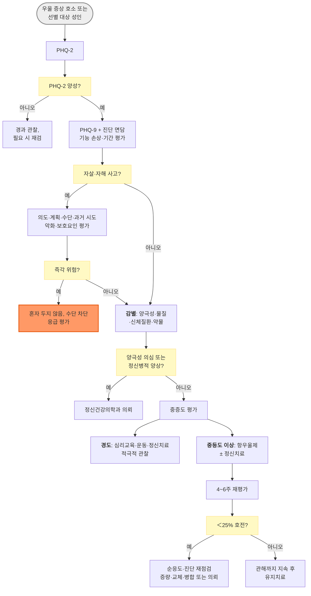

# 우울증 Depression

## <mark style="color:green;">일반 사항</mark>

* ≥2주 지속되는 우울한 기분, 흥미 또는 기쁨을 주던 사물에 대한 흥미 감소
* 주요우울증 : 기간의 대부분 우울, 흥미나 기쁨의 상실이 지속됨, 죄책감이나 무가치함이 동반됨
  * 삽화적, 빈번한 재발성 증후군
* 슬픔 : 상실 등 스트레스 사건에 따른 정상적인 반응(normal grief)
  * 슬픈 감정의 변동이 있음, 기간 중 슬픔에서 벗어나는 때 또는 즐거운 순간이 있음, 자존감은 유지됨
  * 주위의 동정심과 슬픔을 유발할 수 있음
* 유병률 : 국내 성인 주요우울장애 평생유병률 - 7.7%, 1년 유병률 - 1.7% \[정신건강실태조사 2021]
  * 여성에서 남성보다 약 2배
* 호발 연령 : 첫 발병은 청소년기 후반\~30대에 흔함
* 우울증 환자에 대하여 다른 정신 질환 동반 여부 평가, 자살 위험 평가가 필요함
  * 종종 동반 질환이 있으며(불안이 가장 흔함), 환자의 ＞⅔가 두통 등 통증, 소화기 장애를 호소함
* 노인 우울증에 대해서는 노화, 다른 내과 질환, 기억력 장애/치매 초기 증상 가능성 고려
  * 우울 감정을 부정하면서 두통·소화기 증상·만성 통증 등 신체 증상만 호소하는 경우가 흔함

**신체증상 중심의 우울증 표현** (Somatic presentations of depression; 전통적 용어: masked depression)

* 일차 의료 기관을 방문하는 우울증 환자의 상당수는 우울한 기분보다 두통, 만성 통증, 소화불량, 피로감, 기력 저하 등 신체 증상을 주 호소로 먼저 제시함(특히 노인 우울증에서 흔함)
* 신체 증상이 반복되고 기질적 원인이 불명확한 경우 우울증을 적극적으로 감별해야 하는 한편, 신체 증상만으로 우울증을 진단하지 않고 전체 우울 증상과 기능 손상을 평가함
* masked depression은 DSM-5-TR의 공식 진단명이 아님

## <mark style="color:green;">원인</mark>

* 유전적 취약성
* 발달 문제(예: 인성, 유년기 사건)
* 정신적 스트레스(예: 이혼, 실직)


우울증은 복합적 원인에 의해 유발되며, 발병 원인과 위험인자의 구별이 어려움.\
우울에 취약한 특성을 지닌 사람이 스트레스 사건을 경험하면 우울 삽화가 발현됨.


### <mark style="color:orange;">기전</mark>

* 우울증은 특정 신경전달물질 하나의 결핍만으로 설명되지 않음
* 유전적 취약성, 신경회로·신경가소성, 스트레스 반응, 수면·일주기, 염증·면역 및 심리사회적 요인이 상호 작용하는 생물-심리-사회적 질환으로 이해함
* serotonin, norepinephrine, dopamine, glutamate 및 GABA 등 여러 신경전달계와 흥분-억제 조절이 관련되지만, 이들의 변화는 원인·결과와 치료 반응이 복합적으로 얽혀 있어 단순한 ‘화학적 불균형’으로 설명하지 않음
* stress 중에 hypothalamic-pituitary-adrenal axis 활성도 증가 - cortisol 상승에 의한 영향
* inflammatory process, 비정상적 일주기 리듬 - 신경 전달 물질 생성 및 대사에 영향
* 염증/면역 가설 : CRP 등 염증 지표 상승이 항우울제 치료 반응 저하와 연관
  * anti-inflammatory adjunct(예: celecoxib, omega-3) 병용 연구 진행 중

### <mark style="color:orange;">위험인자</mark>

* 과거력 및 유전
  * 우울증 과거력 (가장 강력한 단일 위험인자)
  * 가족력 : 우울, 양극성 장애, 자살, 약물/알코올 남용; 우울증 배우자
* 인구학적 특성
  * 여성에서 남성보다 약 2배 흔하며, 성별 격차는 사춘기 이후 뚜렷해지고 연령·지역·조사방법에 따라 크기가 달라짐
  * 고령 : 활동 장애, 나쁜 건강 상태, 복합적인 슬픔, 만성 수면 장애, 외로움
* 심리·성격적 요인
  * 어릴 적 까다로운 기질, 신경증적 성격
  * 낮은 자존감
  * 생애 초기 경험 : 방임, 학대, 부모와의 불안정한 애착, 부모의 불화
* 사회·환경적 요인
  * 사건 : 이별/사별, 심한 외상, 가정 폭력, 학대
  * 만성적인 스트레스
  * 사회적 환경 : 빈곤, 무직, 독신, 이혼, 부부 갈등, 상실, 신뢰 관계 결핍
  * 낮은 교육 수준
* 신체·의학적 요인
  * 만성 질환, 만성 통증, 신체 장애
  * 지속되는 수면 장애
* 행동·물질 관련
  * 약물/알코올 남용

### <mark style="color:orange;">재발 위험인자</mark>

* 질병 경과 관련
  * 주요우울증의 복수 episode 병력
  * 중증의 첫 증상 및 중증의 후속 episode
  * 이른 연령에 발생
  * sub-threshold 우울 증상의 지속
* 유전·가족력
  * 정신 질환(특히 기분장애) 가족력
* 심리·성격적 요인
  * 부정적 성격
* 사회·환경적 요인
  * 진행 중인 정신/사회적 스트레스 또는 손상
* 신체·의학적 요인
  * 다른 비-정서적 정신 질환 존재
  * 비-정신적 만성 질환 존재
  * 지속적인 수면 장애

## <mark style="color:green;">임상 양상</mark>

* 슬픔, 불안, 짜증, 걱정, 집중력 부족, 좌절
* 불면 또는 과다 수면, 식욕 저하 또는 증가, 체중 변화, 성욕 저하, 신체적 불편
* 집중력·기억력 저하, 우유부단 (노인에서는 치매와 혼동될 수 있음)
* 정신운동성 동요나 지체, 활동 저하; 중증 삽화에서는 망상·환각 등 정신병적 증상이 동반될 수 있음

### <mark style="color:$danger;">🚩 Red Flags!</mark>

<mark style="color:$danger;">**즉각 조치**</mark>

* 실행 의도가 있거나 수단에 접근 가능한 구체적 자살사고, 최근 자살 시도·중단된 시도, 스스로 안전을 유지하기 어려운 상태 `고위험 자살 위기`
* 타인에 대한 위해 의도 또는 계획 `타해 위험`
* 환청·망상·심한 와해 행동 동반 `정신병적 우울증` `조증·혼재성 삽화` `물질 유발 정신병`
  * 조증·혼재성 증상, 물질·약물 유발 상태 및 일차성 정신병적 장애를 함께 감별하되 응급 평가를 지연하지 않음
* 무언증·혼미·거부증·자세 유지 `긴장증`
* 출산 후 수주 이내 급격한 혼돈·환각·망상 `산후 정신병`
* 음식·수분 거부로 신체 상태 급격히 악화 `탈수·영양실조`
* 세로토닌성 약물 시작·증량·병용 후 고열·의식 변화·clonus·반사항진 `세로토닌증후군`
* 항정신병약물 투여 또는 dopaminergic drug 중단 후 고열·의식 변화·심한 전신 근강직 `신경이완제 악성증후군`

<mark style="color:$warning;">**당일\~수일 내 평가**</mark>

* 자살·자해 사고 또는 수동적 죽음 소망이 있으나 즉각 위해가 명확하지 않음: 당일 구조화 평가 후 위험도와 보호요인에 따라 의뢰 시급성 결정 `자살 위험`
* 과거 조증/경조증 삽화 `양극성 장애`
* 우울 삽화 중 초조·과민·사고 비약·수면 욕구 감소·과대성 동반 `혼재성 양상` `양극성 장애`
* 항우울제 시작·증량 후 새로 생긴 초조·불안·충동성(특히 25세 미만) `항우울제 관련 활성화`
* 50세 이후 첫 발병이면서 인지저하·국소 신경학적 징후·체중 감소 등 비전형 경과 `치매` `뇌혈관질환` `뇌종양` `악성종양`
* 알코올·약물 남용 동반 `물질사용장애`
* 중증 삽화로 일상생활 전면 불가 `중증 주요우울삽화`

<mark style="color:$info;">**조기 평가 및 추적**</mark>

* 충분한 용량으로 4\~6주 치료 후 반응 부족(＜25% 호전) `치료 반응 부족`
* 서로 다른 항우울제 2가지 이상을 적절한 용량·기간 사용 후에도 미호전 `치료저항성 우울증`
* 치료 1년 이내 재발 `재발성 우울장애`
* 인격장애 동반 또는 복잡한 심리사회적 문제 `동반 정신질환`
* 동반 신체질환(갑상선, 당뇨, 만성통증 등) 조절 불량 `신체질환 동반 우울증`
* 임신·수유 중이거나 임신 계획 `주산기 우울증`

## <mark style="color:green;">진단</mark>

<mark style="color:cyan;">**선별 검사**</mark> \[USPSTF 2023]

* 대상 : 임신·산후 여성과 고령자를 포함한 모든 성인
  * 양성 시 진단·치료·추적이 가능한 체계와 연계하며, 선별검사는 임상적 평가를 대신하지 않음
* 자살 위험 선별 : 무증상 성인의 일률적 자살 위험 선별은 근거 불충분(I statement). 우울 증상이 있으면 자살 위험을 반드시 평가
* 검사 주기 : 정해지지 않음. 임상적으로 결정
* 검사 도구 : 특정하지 않음; 일반 인구- PHQ, 고령- GDS, 임신- [에든버러 척도](028_-postpartum-depression.md#edinburgh-postnatal-depression-scale-epds)
* 선별 검사에서 양성 시 다른 정신 질환(예: 불안, 공황장애)에 대해서도 검사 시행

### <mark style="color:orange;">진단 기준 \[DSM-5-TR]</mark>

#### <mark style="color:$primary;">주요우울장애 (Major depressive disorder)</mark>

* A\~C는 주요우울 삽화 기준이며, 주요우울장애 진단에는 D와 E까지 확인해야 함

A. 다음 중 ≥5개의 증상이(1과 2중 최소 하나는 반드시 포함) 같은 2주 동안 지속되고 이전 기능에 변화가 발생함

\[Depression]

1. 거의 하루 종일, 거의 매일 우울한 기분을 호소하거나(예: 슬픔, 공허감) 객관적으로 관찰됨(예: 울먹이는 모습)

\[Anhedonia]

2. 거의 하루 종일, 거의 매일, 거의 모든 일상에 대하여 흥미 또는 즐거움이 뚜렷이 저하되어 있음(주관적 호소 또는 객관적 관찰)

\[Physical Sx]

3. 체중 조절을 하고 있지 않는 상태에서 의미 있는 체중 감소나 증가(예: 1개월 동안 ＞5% 변화), 또는 거의 매일 식욕의 증가나 감소가 있음 \[appetite/weight change]
4. 거의 매일 나타나는 불면 또는 과다 수면 \[sleep disturbance]
5. 거의 매일 나타나는 정신 운동성 동요 또는 지체(주관적 감정 뿐 아니라 객관적으로 관찰되는 안절부절 또는 느려짐) \[psychomotor disorder]
6. 거의 매일 나타나는 피로 또는 무기력함 \[fatigue]

\[Psychologic Sx]

7. 거의 매일 무가치감 또는 과도하거나 부적절한 죄책감을 느낌(단지 아픈 것에 대한 자책이나 죄책감이 아님) \[guilty/worthlessness]
8. 거의 매일 사고력이나 집중력의 감소 또는 우유부단함(주관적 호소나 객관적 관찰) \[concentration difficulty/indecisiveness]
9. 반복적인 죽음에 대한 생각(단순히 죽는 것에 대한 두려움이 아님), 구체적 계획 없는 반복적 자살 사고, 자살 시도 또는 구체적 자살 계획 \[suicidal ideation/attempt]

B. 증상이 사회적, 직업적, 또는 기타 중요한 기능 영역에서 임상적으로 의미 있는 고통이나 장애를 초래함

C. 증상은 물질(예: 약물) 또는 일반적인 의학적 상태(예: 갑상선저하증)의 직접적인 생리학적 영향에 의한 것이 아님

D. 주요우울 삽화가 조현정동장애, 조현병, 조현양상장애, 망상장애 또는 기타 명시되거나 명시되지 않은 조현병 스펙트럼 및 정신병적 장애로 더 잘 설명되지 않음

E. 조증 삽화 또는 경조증 삽화가 있었던 적이 없음. 단, 물질이나 다른 의학적 상태의 생리적 영향에 의한 삽화는 제외함

#### <mark style="color:$primary;">DSM-5-TR Specifiers</mark>

<table data-search="false"><thead><tr><th width="183">Specifiers</th><th>특징</th><th>치료 시 유의점</th></tr></thead><tbody><tr><td>Anxious distress<br>(불안 고통 동반)</td><td>긴장, 안절부절, 걱정으로 인한 집중 곤란, 파국적 예감, 자제력 상실에 대한 두려움 중 ≥2개</td><td>불안의 중증도와 자살 위험을 함께 평가; 초기 활성화 부작용을 고려해 저용량 시작</td></tr><tr><td>Mixed features<br>(혼재성)*</td><td>우울 삽화 중 ≥3가지 조증/경조증 증상 동반</td><td>혼재성 양상 자체가 양극성 장애를 확정하지는 않음. 양극성 장애를 재평가하고 항우울제 단독 사용은 신중히 결정</td></tr><tr><td>With psychotic features<br>(정신병적 양상)</td><td>우울 삽화 중 망상 또는 환각 동반; 기분 일치성·불일치성으로 세분</td><td>중증도·자살 위험·영양 및 수분 섭취를 평가하고 항우울제+항정신병약물 또는 ECT 고려; 정신건강의학과 협진</td></tr><tr><td>Melancholic features<br>(멜랑콜리아)</td><td>쾌감 소실, 아침 악화, 조기 각성, 죄책감, 정신운동 변화</td><td>중증도·정신병적 증상·영양상태와 ECT 필요성을 함께 평가</td></tr><tr><td>Atypical features<br>(비전형적)</td><td>기분 반응성 유지, 과식, 과수면, 납 마비, 거절 예민성</td><td>양극성 장애와 수면·섭식 문제를 함께 평가</td></tr><tr><td>Peripartum onset<br>(주산기)</td><td>임신 중 또는 출산 후 4주 이내 발병</td><td>태아·영아 노출, 과거 치료 반응 및 치료하지 않은 우울증의 위험을 개별적으로 비교</td></tr><tr><td>Seasonal pattern<br>(계절성)</td><td>특정 계절과 삽화·관해 사이에 반복적 시간 관계</td><td>광선치료, 정신치료 및 항우울제를 중증도와 선호에 따라 선택</td></tr><tr><td>With catatonia<br>(긴장증 동반)</td><td>혼미, 무언증, 거부증, 자세 유지, 강경증 등</td><td>응급 평가 및 정신건강의학과 의뢰; lorazepam·ECT가 치료 선택지</td></tr></tbody></table>

* 조증 전환 가능성을 관찰하고 양극성 장애를 면밀히 감별함. 혼재성 양상이 있다는 이유만으로 양극성 장애로 확진하거나 모든 환자에게 병용치료를 의무화하지 않음

#### <mark style="color:$primary;">역치하 우울증 (Subthreshold depression / Other specified depressive disorder)</mark>

* 2주 이상 2\~4개의 우울 증상(우울 기분 또는 흥미 저하 중 하나 포함)이 있으나 주요우울장애 기준에 미달
* DSM-5-TR에서 공식 진단명 "Minor depression"은 사용하지 않음; "Other specified depressive disorder"로 분류하며 임상적으로는 subthreshold depression으로 통용됨

#### <mark style="color:$primary;">지속 우울 장애 (Persistent depressive disorder, Dysthymia)</mark>

A. 최소 2년 동안 주관적 호소 또는 다른 사람에 의해 관찰되는 거의 하루 종일 우울한 기분의 날이 그렇지 않은 날보다 더 많음

B. 우울이 있는 동안 다음 중 ≥2개 존재

1. 식욕 저하 또는 과식
2. 불면 또는 과다 수면
3. 기력 저하 또는 피로
4. 낮은 자존감
5. 낮은 집중력 또는 의사 결정 장애
6. 절망감

C. 2년 동안 A 및 B의 증상이 없던 기간이 ＞2달 지속된 적이 없음

D. 주요우울증의 진단 기준이 2년 동안 지속될 수 있음

E. manic or hypomanic episode는 전혀 없으며 cyclothymic disorder에 해당되지 않음

F. schizophrenia나 다른 psychotic disorder에 해당되지 않음

G. 증상은 물질(예: 약물) 또는 다른 의학적 상태(예: 갑상선저하증)의 생리학적 영향에 의한 것이 아님

H. 증상이 사회적, 직업적, 또는 다른 중요한 기능 영역에서 임상적으로 유의미한 고통이나 장애를 야기함

#### <mark style="color:$primary;">계절성 정동장애 (Seasonal affective disorder)</mark>

* 계절적 특성을 갖는 우울증
* DSM-5-TR에서는 독립 진단이 아닌 주요우울장애·양극성 장애의 명시자(with seasonal pattern)
* 여성에서 흔함
* 증상 : 무기력, 피로, 체중 증가, 과다 수면, 삽화적 탄수화물 갈망
* 치료 : 광선치료가 1차 치료(1만 lux 광원을 매일 아침 약 30분 노출; 항우울제 병행 가능)
  * bupropion XL은 계절성 삽화 예방에 FDA 승인

### <mark style="color:orange;">검사</mark>

* 모든 신환에게 동일한 검사를 일률적으로 시행하지 않으며, 병력·진찰·연령·복용약물과 감별진단에 따라 표적 검사를 선택함
* TSH, CBC, 전해질, 간·신장기능, 혈당, 임신검사, vitamin B12/folate 등은 갑상선질환·빈혈·대사질환·영양결핍·약물 부작용 가능성 또는 치료 전 기초치가 필요한 경우 고려
* ECG는 심혈관 위험, QT 연장 약물 또는 TCA 사용 시 고려함
* EEG·뇌영상은 일상적으로 시행하지 않고 신경학적 이상, 비전형적 경과, 인지저하 또는 다른 신경계 질환이 의심될 때 시행함

### <mark style="color:orange;">우울 척도 문진표</mark>

#### <mark style="color:$primary;">PHQ-2</mark>

* 질문 : 지난 2주 동안, 아래 나열되는 증상들에 얼마나 자주 시달렸습니까?
  1. 일을 하는 것에 대한 흥미나 재미가 거의 없음
  2. 가라앉은 느낌, 우울감 혹은 절망감
* 배점 : 2개 항목에 각각 전혀 아니다=0점, 여러날 동안=1점, 일주일 이상=2점, 거의 매일=3점
* 판정 : 민감도/특이도 - ≥3점 기준 시 72%/85%, ≥2점 기준 시 91%/67% \[Levis, JAMA 2020]
  * 민감도를 중시하면 ≥2점에서 PHQ-9로 진행
  * 양성 시 PHQ-9 등 추가 평가

#### [<mark style="color:$primary;">PHQ-9</mark>](http://www.phqscreeners.com)

* 민감도/특이도 : 성인에서 ≥10점 기준 88%/85% \[Levis, BMJ 2019]; 대상군과 진단 면담 방식에 따라 달라질 수 있음
  * cut-off를 ≥15점으로 높이면 민감도↓/특이도↑
* 질문 : 지난 2주 동안, 아래 나열되는 증상들에 얼마나 자주 시달렸습니까?
  1. 일을 하는 것에 대한 흥미나 재미가 거의 없음
  2. 가라앉은 느낌, 우울감 혹은 절망감
  3. 잠들기 어렵거나 자꾸 깨어남, 혹은 너무 많이 잠
  4. 피곤함, 기력이 저하됨
  5. 식욕 저하 혹은 과식
  6. 내 자신이 나쁜 사람이라는 느낌 혹은 내 자신을 실패자라고 느끼거나 나 때문에 나 자신이나 내 가족이 불행하게 되었다는 느낌
  7. 신문을 읽거나 TV를 볼 때 집중하기 어려움
  8. 남들이 알아챌 정도로 거동이나 말이 느림, 또는 반대로 너무 초조하고 안절부절 못해서 평소보다 많이 돌아다니고 서성거림
  9. 나는 차라리 죽는 것이 낫겠다는 등의 생각 혹은 어떤 식으로든 스스로를 자해하는 생각들
* 배점 : 9개 항목에 각각 전혀 아니다=0점, 여러날 동안=1점, 일주일 이상=2점, 거의 매일=3점 (총 0\~27점)
* 출처 : 건강검진 실시기준 \[별지 제14호 서식] [정신건강검사 평가도구](https://www.gangnam.go.kr/office/smilegn/contents/smilegn_adult/1/view.do?mid=smilegn_depression)(PHQ-9)

**\[삶의 질 평가]** (참고 문항)

* 위에 해당되는 사항이 있다면 그로 인하여 직장이나 집안일, 또 다른 사람들과 지내는 것이 얼마나 힘듭니까?\
  □ 전혀 힘들지 않다.　□ 어느 정도 힘들다.　□ 매우 힘들다.　□ 극도로 힘들다.

**PHQ-9 점수별 권장 조치**

<table><thead><tr><th width="120">점수</th><th width="160">증상 범위</th><th>임상적 활용</th></tr></thead><tbody><tr><td>0~4점</td><td>최소</td><td>임상적으로 필요하면 경과 관찰·재평가</td></tr><tr><td>5~9점</td><td>경도</td><td>기능 손상·지속 기간·환자 선호를 평가하고 심리교육·생활중재·적극적 관찰을 고려</td></tr><tr><td>10~14점</td><td>중등도</td><td>진단 면담 후 정신치료 및 약물치료 필요성을 개별 결정</td></tr><tr><td>15~19점</td><td>중등도-중증</td><td>진단·기능 손상·양극성 및 자살 위험을 평가하고 적극적 치료 고려</td></tr><tr><td>20~27점</td><td>중증</td><td>신속한 임상평가와 적극적 치료·전문의뢰 고려</td></tr></tbody></table>

* **PHQ-9 9번 항목 양성**은 수동적 죽음 소망부터 적극적 자살사고까지 포함함. 총점과 무관하게 즉시 추가 질문을 시행하되, 일괄 응급이송하지 않고 현재 의도·계획·수단 접근성·과거 시도·급성 악화요인·보호요인을 종합하여 조치함
* **PHQ-9의 기능 문항**은 DSM-5-TR 진단기준 B의 기능 손상 평가에 대응함. ‘매우 힘들다’ 이상의 응답은 총점이 낮더라도 기능 손상을 반드시 함께 확인함. 치료 반응을 평가할 때에도 증상 점수와 함께 확인함

#### <mark style="color:$primary;">WHO-5 Well-being index</mark>

* 민감도/특이도 : 일차진료 환자에서 CIDI로 확인한 ICD-10 우울장애 선별 시 93%/64% \[Henkel et al., BMJ 2003]; 대상군·절단점·진단 준거에 따라 달라짐
* 질문 : 지난 2주일 중 다음 상태가 얼마나 있었습니까?
  1. 나는 유쾌하고 기분이 좋다.
  2. 나는 차분하고 편안하다.
  3. 나는 활동적이고 활기 찬 기분이다.
  4. 나는 상쾌하게 잠에서 깼다.
  5. 나의 일상은 나의 흥미를 끄는 것들로 채워져 왔다.
* 배점 : 5개 항목에 각각 항상=5점, 대부분=4점, 절반 이상=3점, 절반 미만=2점, 가끔=1점, 없음=0점
* 판정 : 총점이 ＜13점이거나 어느 한 항목이 1점 또는 0점이면 웰빙 저하로 판정하고 우울증 평가 시행 (WHO-5는 웰빙 척도이며, 진단 도구는 아님)

#### <mark style="color:$primary;">Beck Depression Inventory-II (BDI-II)</mark>

* BDI-II는 저작권이 있는 상용 심리검사임
* 필요한 경우 허가된 한국판 검사지를 구입·사용하고, 결과는 임상 면담과 함께 해석함

#### <mark style="color:$primary;">노인 우울 척도 : GDS-SF-K (Geriatric Depression Scale-한국판 단축형)</mark>

<table data-search="false"><thead><tr><th width="425">문항</th><th align="center">예</th><th align="center">아니오</th></tr></thead><tbody><tr><td>1. 평소 자신의 생활에 만족합니까?</td><td align="center">0</td><td align="center">1</td></tr><tr><td>2.* 활동과 흥미가 많이 저하되었습니까?</td><td align="center">1</td><td align="center">0</td></tr><tr><td>3. 앞날에 대해서 희망적입니까?</td><td align="center">0</td><td align="center">1</td></tr><tr><td>4. 대부분의 시간을 맑은 정신으로 지냅니까?</td><td align="center">0</td><td align="center">1</td></tr><tr><td>5. 대부분의 시간이 행복하다고 느낍니까?</td><td align="center">0</td><td align="center">1</td></tr><tr><td>6. 지금 살아있다는 것이 아름답다고 생각합니까?</td><td align="center">0</td><td align="center">1</td></tr><tr><td>7.* 가끔 낙담하고 우울하다고 느낍니까?</td><td align="center">1</td><td align="center">0</td></tr><tr><td>8.* 지금 자신의 인생이 가치가 없다고 느낍니까?</td><td align="center">1</td><td align="center">0</td></tr><tr><td>9. 인생이 흥미롭다고 느낍니까?</td><td align="center">0</td><td align="center">1</td></tr><tr><td>10. 활력이 충만하다고 느낍니까?</td><td align="center">0</td><td align="center">1</td></tr><tr><td>11.* 사소한 일에 자주 감정의 동요를 느낍니까?</td><td align="center">1</td><td align="center">0</td></tr><tr><td>12.* 자주 울고 싶다고 느낍니까?</td><td align="center">1</td><td align="center">0</td></tr><tr><td>13. 아침에 일어나는 것이 즐겁습니까?</td><td align="center">0</td><td align="center">1</td></tr><tr><td>14. 결정을 내리는 것이 수월합니까?</td><td align="center">0</td><td align="center">1</td></tr><tr><td>15. 당신의 마음은 이전처럼 편안합니까?</td><td align="center">0</td><td align="center">1</td></tr></tbody></table>

* 배점 : '아니오'에 1점; \*2, 7, 8, 11, 12번은 '예'에 1점
* 판정 : 선별도구이며 진단이나 중증도 분류를 대신하지 않음. 국내 검증연구에서는 ≥8점을 흔히 양성 선별 기준으로 사용하며, 특이도를 중시할 때 ≥10점을 사용할 수 있음. 양성 시 임상적 진단평가 시행

<p align="center"><em><mark style="color:$info;">Ref. 기백석. 한국판 노인 우울 척도 단축형의 표준화 예비연구. 신경정신의학 1996;35(2):298-307</mark></em></p>

### <mark style="color:orange;">기타 선별</mark>

#### <mark style="color:$primary;">양극성 장애 평가</mark>

* 양극성 장애 환자에서 항우울제 단독 투여 시 조증 전환(manic switch) 위험이 있음
* 항우울제 투여 전 과거 조증/경조증 삽화(기분이 지나치게 고양되거나, 수면이 현저히 줄었는데도 기운이 넘쳤던 경험) 유무를 확인하고, 의심 시 정신건강의학과 협진과 치료전략 재평가를 고려

**MDQ (Mood Disorder Questionnaire)** - 양극성 장애 감별 설문

* **질문 1**. 다음 항목들이 해당되는지 답하십시오 (예/아니오)

1. 기분이 너무 좋거나 들떠서 다른 사람들이 걱정하거나, 당신이 평소와 달리 과장된 행동을 하였습니까?
2. 매우 쉽게 화가 나서 고함을 치거나, 사소한 일로 싸움을 시작한 적이 있습니까?
3. 평소보다 훨씬 자신감이 넘쳤습니까?
4. 평소보다 수면이 훨씬 줄었지만(예: 3시간만 자도 충분하다고 느낌) 피로감을 느끼지 않았습니까?
5. 평소보다 훨씬 말이 많아지거나 말이 매우 빨라졌습니까?
6. 생각이 머릿속에서 빠르게 스치고 지나가거나, 생각을 멈출 수 없었습니까?
7. 주변 환경이나 소리·사건 등에 주의가 쉽게 분산되어 하려던 일에 집중하기 어려웠습니까?
8. 평소보다 에너지가 넘치거나 활동량이 훨씬 많아졌습니까?
9. 평소보다 훨씬 더 활동적이거나, 더 많은 일을 하려 했습니까?
10. 평소보다 훨씬 더 사교적이거나 외향적이었습니까? (예: 한밤중에 친구에게 전화하기)
11. 성적 욕구가 평소보다 훨씬 높아졌습니까?
12. 평소와 달리 무모한 행동을 하거나, 나중에 후회할 만한 일을 했습니까?
13. 돈을 많이 써서 본인이나 가족에게 문제가 생긴 적이 있습니까?

* **질문 2.** 위 항목 중 여러 개가 동시에 나타난 적이 있습니까? (예/아니오)
* **질문 3.** 위와 같은 문제들로 인해 어느 정도 지장을 받았습니까? ☐ 전혀 없음 ☐ 경미함 ☐ 중등도 ☐ 심각함
* **판정** : (질문 1. 13개 항목 중 ≥7개 양성) & (질문 2. "예") & ("중등도" 또는 "심각함") → MDQ 양성
* **조치** : MDQ는 선별도구이므로 양극성 장애를 확진하지 않으며, 임상 면담으로 과거 조증·경조증 삽화와 물질·약물 영향을 확인한 뒤 항우울제 사용과 전문의뢰 여부를 결정

#### <mark style="color:$primary;">자살 위험 구조화 평가</mark>

* 평가 흐름 : 자살사고와 수동적 죽음 소망 확인 → 현재 의도·계획·수단 접근성·과거 시도·급성 악화요인·보호요인 평가 → 즉각 위험 시 혼자 두지 않고 수단을 차단하며 응급 평가

<table><thead><tr><th width="187">평가 요소</th><th width="343">확인 질문</th><th>고위험 소견</th></tr></thead><tbody><tr><td><strong>Suicidal Ideation</strong><br>(자살사고)</td><td>죽고 싶거나 자해하고 싶은 생각이 드나요?</td><td>빈번하고 강렬한 사고</td></tr><tr><td><strong>Plan</strong> (계획)</td><td>구체적인 방법이나 시기를 생각해 두었나요?</td><td>구체적 방법·시기 있음</td></tr><tr><td><strong>Intent</strong> (의도)</td><td>실제로 실행할 생각이 있나요?</td><td>실행 의도 있음</td></tr><tr><td><strong>Means</strong> (수단)</td><td>그 방법에 필요한 수단(약물, 흉기 등)이 있나요?</td><td>수단 접근 가능</td></tr><tr><td><strong>Past attempt</strong> (과거력)</td><td>이전에 자해나 자살을 시도한 적이 있나요?</td><td>과거 시도 있음</td></tr></tbody></table>

* 즉각 위험이 아닌 경우에도 안전계획(경고 신호, 스스로 할 대처, 연락할 사람·기관, 자살예방 상담전화 109)을 환자와 함께 작성하고, 약물·농약·흉기 등 치명적 수단을 가족과 함께 제거·보관하도록 상담

### <mark style="color:orange;">감별</mark>

#### <mark style="color:$primary;">신체 질환·약물 및 기타 정신질환</mark>

<table data-search="false"><thead><tr><th width="172">감별 대상</th><th width="393">의심 단서</th><th>확인</th></tr></thead><tbody><tr><td>갑상선저하증</td><td>피로, 체중 증가, 한랭 불내성, 변비</td><td>TSH</td></tr><tr><td>양극성 장애</td><td>과거 경조증, 가족력, 이른 발병, 항우울제 후 활성화</td><td>병력, MDQ</td></tr><tr><td>치매·경도인지장애</td><td>고령 첫 발병, 기억장애 선행</td><td>인지선별검사</td></tr><tr><td>물질·약물 유발</td><td>음주, corticosteroid, interferon, isotretinoin 등</td><td>복용력</td></tr><tr><td>폐쇄성 수면무호흡</td><td>코골이, 주간 졸림</td><td>STOP-BANG</td></tr><tr><td>빈혈·B12 결핍</td><td>피로, 신경 증상</td><td>CBC, B12</td></tr><tr><td>적응장애</td><td>스트레스 사건 후 3개월 내, 주요우울 기준 미달</td><td>병력</td></tr></tbody></table>

#### <mark style="color:$primary;">우울증 vs 슬픔 vs</mark> [<mark style="color:$primary;">번아웃</mark>](032_1-burnout-stress-disorder.md)

<table data-search="false"><thead><tr><th width="109">구분</th><th>우울증 (Major depression)</th><th>정상적 슬픔 (Grief)</th><th>번아웃 (Burnout)</th></tr></thead><tbody><tr><td>유발 요인</td><td>명확하지 않을 수 있음 (내인성 + 스트레스)</td><td>명확한 상실/스트레스 사건</td><td>직무 스트레스, 과로</td></tr><tr><td>지속 기간</td><td>≥2주 지속, 흔히 수개월</td><td>파동성, 점진적 완화</td><td>업무 환경 지속 시 악화</td></tr><tr><td>기분 특성</td><td>지속적 저하 (하루 대부분)</td><td>파동성 (좋아지는 순간 있음)</td><td>무기력, 냉소, 감정 소진</td></tr><tr><td>흥미/즐거움</td><td>거의 모든 활동에서 감소 (anhedonia)</td><td>일부 유지됨</td><td>일 관련 활동에서 주로 감소</td></tr><tr><td>자존감</td><td>저하 (무가치감, 죄책감)</td><td>대체로 유지됨</td><td>성취감 감소, 무력감</td></tr><tr><td>자살 사고</td><td>가능 (중요 red flag)</td><td>드묾</td><td>드묾 (있다면 우울증 의심)</td></tr><tr><td>반응성</td><td>긍정 자극에도 반응 ↓</td><td>긍정 자극에 반응 가능</td><td>휴식 시 일부 회복</td></tr><tr><td>핵심 구분</td><td>지속성 + 전반성 + 자존감 저하</td><td>파동성 + 자존감 유지</td><td>직무 특이성 + 소진</td></tr></tbody></table>

***


```mermaid
graph TD
    Start(["우울 증상 호소 또는 <br>선별 대상 성인"]) --> P2["PHQ-2"]
    P2 --> Q1["PHQ-2 양성?"]
    Q1 -->|아니오| Obs["경과 관찰, <br>필요 시 재검"]
    Q1 -->|예| P9["PHQ-9 + 진단 면담<br>기능 손상·기간 평가"]
    P9 --> Q2["자살·자해 사고?"]
    Q2 -->|예| Risk["의도·계획·수단·과거 시도<br>악화·보호요인 평가"]
    Risk --> Q3["즉각 위험?"]
    Q3 -->|예| ER["혼자 두지 않음, 수단 차단<br>응급 평가"]
    Q3 -->|아니오| Diff
    Q2 -->|아니오| Diff["<b>감별</b>: 양극성·물질<br>·신체질환·약물"]
    Diff --> Q4["양극성 의심 또는 <br>정신병적 양상?"]
    Q4 -->|예| Ref["정신건강의학과 의뢰"]
    Q4 -->|아니오| Sev["중증도 평가"]
    Sev --> Mild["<b>경도</b>: 심리교육·운동·정신치료<br>적극적 관찰"]
    Sev --> Mod["<b>중등도 이상</b>: 항우울제 <br>± 정신치료"]
    Mod --> Ev["4~6주 재평가"]
    Ev --> Q5["＜25% 호전?"]
    Q5 -->|예| Adj["순응도·진단 재점검<br>증량·교체·병합 또는 의뢰"]
    Q5 -->|아니오| Cont["관해까지 지속 후 <br>유지치료"]
    style Start fill:#eeeeee,stroke:#888888,stroke-width:2px
    style ER fill:#f96,stroke:#e65100,stroke-width:2px
    style Q1 fill:#fff9c4,stroke:#ffe082
    style Q2 fill:#fff9c4,stroke:#ffe082
    style Q3 fill:#fff9c4,stroke:#ffe082
    style Q4 fill:#fff9c4,stroke:#ffe082
    style Q5 fill:#fff9c4,stroke:#ffe082
```

<p align="center"><strong>진단 및 치료 알고리듬</strong></p>

<p align="center"><em><mark style="color:$info;">저자 재구성 (참고 문헌 : USPSTF 2023; NICE NG222 2022; KMAP-DD 2025)</mark></em></p>

***

## <mark style="background-color:$warning;">Management</mark>

### <mark style="color:orange;">치료 방침</mark>

* 경도(less severe, PHQ-9 ＜16) : 정신치료·운동·가이드 자가치료 등을 우선 선택
  * 항우울제는 환자가 원하거나 과거 반응이 좋았던 경우 외에는 일률적 1차 치료로 권하지 않음 \[NICE NG222, 2022]
* 중등도 이상 : 항우울제 또는 근거기반 정신치료; 중증에서는 병합 권장 \[CANMAT 2023]
* 고령에서는 심리사회적 치료를 선호하는 경우가 많음
* 방문마다 PHQ-9로 반응을 측정하여 치료를 조정(measurement-based care)
* 항우울제 시작 전 과거 조증·경조증 삽화를 임상적으로 확인하고, 의심될 때 MDQ 등 선별도구를 보조적으로 사용함


**SSRI 비정신건강의학과 처방** [**급여기준**](https://www.hira.or.kr/rc/insu/insuadtcrtr/InsuAdtCrtrPopup.do?mtgHmeDd=20221201\&sno=8\&mtgMtrRegSno=0011) : 2주 이상 우울 증상이 지속되고 아래 정신건강의학과 자문 의뢰 대상이 아니면, 상용량으로 1회 60일 범위 내에서 반복 처방 가능.

자문 의뢰 대상 : 1\~2가지 약물 무반응, 치료 1년 이내 재발, 양극성 장애 의심, 환자·가족의 전과 요구, 지속되는 자살 생각, 알코올·약물남용·인격장애 동반, 중증 우울, 자기 관리 불가


## <mark style="color:green;">비-약물 치료 및 예방</mark>

### <mark style="color:orange;">생활 습관 중재</mark>

* [식이](../231_/217_-nutritiondiet-guideline.md) : 지중해식 식단 - 채소·과일·전곡류·생선·올리브유
  * 식이 중재가 중등도 이상 우울증의 보조 치료로 효과를 보인 RCT가 있음 (\[SMILES trial, BMC Med 2017]
* [운동](../231_/216_-physical-activity-guideline.md) : 걷기·조깅, 요가, 근력운동이 우울 증상 감소에 효과적이며 강도가 높을수록 효과가 큼 \[네트워크 메타분석, BMJ 2024]
* 디지털 치료기기(DTx) : CBT 기반 디지털 중재를 경증\~중등도 우울증의 보조치료로 고려할 수 있음
  * 국내에서는 2025년 블루케어-티([BlueKare-T](https://www.bluekare.kr/), CBT 기반 모바일), 2026년 [치유 포레스트 N](https://www.mindsai.co.kr/ko/cheeu)(VR 기반)이 우울장애 디지털치료기기로 허가됨. "의사 진료 → 처방 → 환자가 앱 설치·사용"의 방식으로 적용하며 제품별 처방 가능 기관과 비용 확인이 필요(비급여)

### <mark style="color:orange;">정신 치료</mark>

* behavioral therapy
* cognitive-behavioral therapy, mindfulness
* interpersonal psychotherapy
* psychodynamic psychotherapy
* supportive therapy

### <mark style="color:orange;">지지 치료</mark>

* clinician-guided self-help : 의사의 지시 하에 영상 자료 등을 이용하여 자가 치료 시도
* relaxation & positive activity : 근육 이완, 평화로운 장면 등 이완 이미지 회상, autogenic training(전신의 따듯함과 평온함의 상태를 유도/시각화)
* exercise : 우울 증상 완화 및 건강상 이익을 제공
* music therapy : 일부 환자에서 우울 증상 완화를 위한 보조적 중재로 고려할 수 있으나, 연구의 중재 방식과 근거가 이질적임

## <mark style="color:green;">약물 치료</mark>

### <mark style="color:orange;">약제 종류</mark>

* 아래 용량은 일반적인 시작 및 유지 용량임 (☞ [항우울제](../231_/213_-antidepressants-and-anxiolytics.md))
* 일반적으로 계열 간 또는 계열 내 약제 간 효과 차이는 없음. 단, 환자에 따라 반응이 다를 수 있음

#### <mark style="color:$primary;">SSRI</mark>

* 부작용 : 성 기능 저하, 구역, 복통, 어지럼, 불면증, 두통; 특히 복용 첫 주에 많음
* 성기능 장애 : SSRI/SNRI 장기 복용 시 성기능 장애(약 30\~60%)가 흔한 중단 원인
  * 투약 전 미리 안내하고, 부작용이 현저한 경우 bupropion 또는 mirtazapine으로 교체하거나 용량 감량
* 세로토닌 증후군 주의 : clonus·반사항진, 고열, 발한, 빈맥, 의식 변화 등 발생 즉시 약물 중단 후 응급 평가
  * 위험 약물 : SSRI/SNRI를 MAOI, linezolid, methylene blue, tramadol, fentanyl, dextromethorphan, lithium, St John’s wort; 병용 시 발생 위험↑
* CYP2D6 억제 작용 주의 : 강력한 CYP2D6 억제제 - fluoxetine, paroxetine, bupropion
  * 다약제 복용 환자와 고령자에서 상호작용·내약성에 주의
* 고령자에서 SIADH에 의한 저나트륨혈증 주의 : 고령, 여성, 저체중, 낮은 기초 Na·과거 저나트륨혈증, thiazide 등 이뇨제, carbamazepine·oxcarbazepine 또는 다른 SIADH 유발약물 병용 시 위험 증가
  * 고위험 환자는 투약 전 Na를 확인하고 시작·증량 후 1\~2주경 재검을 고려
  * 오심, 두통, 의식 혼탁, 보행 불안정 등이 발생하면 즉시 평가
* 출혈 위험 : NSAID·aspirin·항응고제 병용 시 위장관 출혈 위험↑
  * 고위험군은 PPI 병용 고려
* escitalopram, sertraline : 약물 상호 작용이 적음
* escitalopram : 10 ㎎/d, 10\~20 ㎎/d <mark style="color:blue;">\[렉사프로]</mark>
  * 고령자는 5 ㎎으로 시작하고 최대 10 ㎎/d (QT 연장)
* fluoxetine : 20 ㎎/d 아침, 20\~60 ㎎/d <mark style="color:blue;">\[푸록틴]</mark> (8세 이상 소아·청소년 주요우울장애 FDA 승인)
  * 신경성 폭식증 적응
* paroxetine : 10 ㎎/d, 20\~50 ㎎/d <mark style="color:blue;">\[세로자트]</mark>; CR 25 ㎎/d, 25\~62.5 ㎎/d <mark style="color:blue;">\[팍실 CR]</mark>
  * 항콜린 작용·체중 증가
  * 고령자에서 가급적 회피
* sertraline : 25\~50 ㎎/d, 50\~200 ㎎/d <mark style="color:blue;">\[졸로푸트]</mark>
* fluvoxamine : 50 ㎎/d, 50\~300 ㎎/d(150 ㎎ 초과 시 분할) <mark style="color:blue;">\[듀미록스]</mark>
  * 강력한 CYP1A2·2C19 억제 작용 - tizanidine 병용 금기, theophylline·clozapine 병용 주의
* 고령 및 청소년, 간질환/불안증/공황장애 동반 시 저용량으로 시작


**세로토닌증후군(SS)과 신경이완제 악성증후군(NMS) 감별**

<table><thead><tr><th width="89">구분</th><th width="319">세로토닌증후군</th><th>신경이완제 악성증후군</th></tr></thead><tbody><tr><td>신경근육</td><td>clonus, 반사항진, 진전</td><td>lead-pipe rigidity, 반사 저하 또는 정상</td></tr><tr><td>위장관</td><td>설사·장음 증가가 흔함</td><td>상대적으로 덜 흔함</td></tr><tr><td>경과</td><td>대개 원인약 시작·증량·상호작용 후 수시간 이내</td><td>보통 1~3일에 걸쳐 진행</td></tr><tr><td>검사</td><td>CK 상승 가능</td><td>CK의 현저한 상승이 흔함</td></tr></tbody></table>

두 질환 모두 고열·의식 변화·자율신경 불안정을 보일 수 있고 CK만으로 구분할 수 없음. 의심 시 원인약을 중단하고 응급 평가함.


#### <mark style="color:$primary;">SNRI</mark>

* 통증 및 신체 증상 감소 효과가 있음
* 부작용 : 구역, 발한, 변비, 성 기능 저하, 용량 의존적 혈압 상승(특히 venlafaxine 고용량 투여 시)
* duloxetine : 적응을 위해 30 ㎎ qd로 1주간 시작 가능, 통상 60 ㎎ qd <mark style="color:blue;">\[드록틴]</mark>, <mark style="color:blue;">\[듀로셉톨]</mark>
  * 최대 120 ㎎/d까지 연구되었으나 60 ㎎/d 초과 용량의 추가 이익 근거는 없음
  * neuropathic pain 적응 (☞ [통증](../220_/001_-pain.md#undefined-9))
  * 과음·만성 간질환 환자에서 회피
* venlafaxine XR : 37.5 ㎎/d, 최대 225 ㎎/d <mark style="color:blue;">\[이팩사 XR]</mark>
* desvenlafaxine : 50\~100 ㎎/d <mark style="color:blue;">\[프리스틱]</mark>
* milnacipran : 유지 50 ㎎ bid(100 ㎎/d) <mark style="color:blue;">\[익셀]</mark>
  * 내약성에 따라 저용량으로 시작하여 증량 가능

#### <mark style="color:$primary;">TCA</mark>

* 부작용 및 과용 시 치명적 손상 위험을 고려하여 2차 선택
* 주의 : 고령(부작용 증가), 녹내장, BPH, 갑상선항진증, 심혈관 질환, 부정맥, 간질환, 당뇨병(혈당 상승), MAOI 투여
* 부작용 : 입마름, 시야 흐림, 변비, 요 정체, 빈맥, 혼돈
* 과량 복용 시 치명적이므로 자살 위험 환자에서는 처방량을 제한 (예: 1주분)
* amitriptyline : 30\~75 ㎎/d를 2\~3회 분할 투여, 필요 시 150 ㎎/d까지 점차 증량, 드물게 300 ㎎/d까지 증량 <mark style="color:blue;">\[에트라빌]</mark>
* imipramine : 25\~50 ㎎/d, 100\~300 ㎎/d <mark style="color:blue;">\[이미프라민]</mark>
* nortriptyline : 25 ㎎/d, 50\~150 ㎎/d <mark style="color:blue;">\[센시발]</mark>

#### <mark style="color:$primary;">기타 항우울제</mark>

* trazodone : 150 ㎎/d에서 시작(분할 투여), 외래 최대 400 ㎎/d·입원 최대 600 ㎎/d <mark style="color:blue;">\[트리티코]</mark>
  * 지속발기증(priapism) 주의
* bupropion XL : 150 ㎎ qd로 시작, 필요 시 300 ㎎ qd로 증량 <mark style="color:blue;">\[웰부트린 XL]</mark>
  * 정신운동 지체, 피로감, 집중력 저하에 유용
  * 초기 불안·불면 악화 가능
  * 뇌전증 또는 현재·과거 신경성 식욕부진증·폭식증 환자에게 금기; 강력한 CYP2D6 억제 작용
* vilazodone : serotonin partial agonist & reuptake inhibitor(SPARI); 10\~40 ㎎/d (국내 미허가)
* vortioxetine : 5\~20 ㎎/d <mark style="color:blue;">\[브린텔릭스]</mark>
  * serotonin 수용체 조절/자극; 인지 증상 개선 근거(일부 RCT)
  * 구역 흔함
* mirtazapine : 15\~45 ㎎/d <mark style="color:blue;">\[레메론]</mark>
  * 진정·졸림, 식욕 및 체중 증가, 어지럼에 주의
* tianeptine : 12.5 ㎎ tid; 70세 이상·신기능 저하 시 25 ㎎/d <mark style="color:blue;">\[스타브론]</mark>
  * 고용량 남용 시 opioid 유사 의존·금단 보고가 있어 물질사용 병력자에서 주의
* agomelatine : melatonin MT1/MT2 수용체 작용제, 5-HT2C 수용체 길항제; 25\~50 ㎎ qd 취침 전 <mark style="color:blue;">\[아고틴]</mark>.
  * 모든 환자에서 시작 전 ALT/AST를 포함한 간기능검사를 하고 약 3·6·12·24주 및 임상적으로 필요할 때 재검; 증량 후 같은 일정 반복
  * transaminase 상승 시 48시간 이내 재검하고 ALT/AST ＞정상 상한의 3배이면 중단
  * 비만·과체중·비알코올성 지방간, 당뇨병, 알코올사용장애·상당량 음주 또는 간손상 위험 약물 병용 시 이익과 위험을 주의 깊게 평가함
  * 간장애·간경변·활동성 간질환 및 강력한 CYP1A2 억제제(fluvoxamine, ciprofloxacin) 병용 금기이며 75세 이상에는 투여하지 않음

#### <mark style="color:$primary;">대체 요법</mark>

* s-adenosyl-L-methionine : 근거 제한적
* St John’s wort(Hypericum perforatum) : 일부에서 경증 우울증에 대하여 유효하나 치료 적정량 및 효과의 지속 여부에 대한 연구가 미흡하며 다른 약물과의 상호 작용 문제로 처방 권고 안 함 \[NICE]

### <mark style="color:orange;">부작용 관리 원칙</mark>

* 대부분의 부작용은 용량에 비례하며, 복용 초기(1\~2주)에 두드러지다가 시간이 지나면서 호전되는 경우가 많음
* 초기 부작용이 경미하면 지속 복용하며 관찰; 지속되거나 견디기 힘들면 복용 시각 조절, 감량 또는 약물 교체를 고려함
* 초기의 심한 불안·불면에 한하여 의존·낙상·호흡억제 위험을 평가한 뒤 benzodiazepine을 최소 용량으로 매우 단기간 고려할 수 있으며, 고령자·물질사용장애·수면무호흡 환자에서는 가급적 피함

### <mark style="color:orange;">약제 선택</mark>


**KMAP-DD 2025 치료전략 활용 시 주의** : 아래 치료전략은 정신건강의학과 전문치료 상황을 포함한 전문가 합의 결과이며 근거기반 권고등급과 동일하지 않음. 항우울제 다제 병용, 비정형 항정신병제·기분조절제·정신자극제 강화요법은 부작용, 국내 허가 적응증 및 근거수준을 검토하여 정신건강의학과에서 시행하거나 협진함.

일차진료에서는 항우울제 단독 또는 근거기반 정신치료로 시작하고, 정신병적 양상·혼재성 양상·치료저항성이 있으면 의뢰


#### <mark style="color:$primary;">1단계 (초기) 치료 전략</mark>

<table><thead><tr><th width="173">임상 삽화</th><th>1차 선택</th><th>2차 선택</th></tr></thead><tbody><tr><td>경증 및 중등증 삽화</td><td>항우울제 단독¹⁾</td><td>• 항우울제+항우울제<br>• 항우울제+비정형 항정신병제<br>• 항우울제+기분조절제</td></tr><tr><td>중증 삽화/<br>정신병적 양상(-)</td><td>• 항우울제 단독<br>• 항우울제+비정형 항정신병제<br>• 항우울제+항우울제</td><td>• 항우울제+기분조절제<br>• 비정형 항정신병제 단독²⁾</td></tr><tr><td>중증 삽화/<br>정신병적 양상(+)</td><td>항우울제+비정형 항정신병제¹⁾</td><td>• 비정형 항정신병제 단독<br>• 항우울제+항우울제<br>• 항우울제+기분조절제<br>• 항우울제 단독</td></tr></tbody></table>

> ¹⁾_최우선 선택(treatment of choice, TOC)_\
> ²⁾_전문가 합의 없음. 이 표는 KMAP-DD 2025 전문가 설문·합의 결과이며 근거기반 지침의 권고등급과 동일하게 해석하지 않음_
>
> <p align="center"><em><mark style="color:$info;">Ref. 최원석 외. 한국형 우울장애 약물치료 알고리듬 2025 (I). 신경정신의학 2025;64(3):178-192</mark></em></p>

**항우울제**

* 1차 약물 : SSRI, SNRI, mirtazapine, bupropion (KMAP-DD 2025 전문가 합의)
* 구체적인 약물 우선 순위는 삽화의 중증도와 임상 아형에 따라 달라짐
* KMAP-DD 2025는 이전 판보다 중증·정신병적 우울증에서 조기 병합치료와 비정형 항정신병약물 선호가 증가함

**항정신병제** (☞ [치매](033_-dementia.md#undefined-20))

* 정신병적 양상(-)
  * 1차 약물 : aripiprazole <mark style="color:blue;">\[아빌리파이]</mark>, quetiapine <mark style="color:blue;">\[쎄로켈]</mark>
  * 2차 약물 : olanzapine <mark style="color:blue;">\[자이프렉사]</mark>, risperidone, ziprasidone
* 정신병적 양상(+)
  * 1차 약물 : aripiprazole, quetiapine(최우선), olanzapine
  * 2차 약물 : risperidone, paliperidone, blonanserin, ziprasidone, amisulpride

#### <mark style="color:$primary;">2단계 치료 전략</mark>

**항우울제 단독 치료에 불충분한 반응을 보이는 경우**

* 초기 치료에 부분적인 반응을 보인 경우
  * 1차 선택 : 비정형 항정신병제 추가, 다른 항우울제의 추가, 항우울제 교체 권고
  * 2차 선택 : 강화 약물(예: lithium, 항경련제, buspirone, psychostimulant, 갑상선 호르몬) 추가 고려
* 초기 치료에 거의 반응이 없는 경우
  * 1차 선택 : 비정형 항정신병제 추가, 항우울제 교체, 항우울제 추가 권고
  * 2차 선택 : 강화 약물 추가 고려

**항우울제 & 비정형 항정신병제 병합 치료에 불충분한 반응을 보이는 경우**

* 초기 치료에 부분적인 반응을 보인 경우
  * 1차 선택 : 항우울제 추가, 비정형 항정신병제 교체, 비정형 항정신병제 추가(항정신병제 2제 병용 - 정신건강의학과 전문치료) 권고
  * 2차 선택 : 항우울제 교체, 강화 약물 추가 고려
* 초기 치료에 거의 반응이 없는 경우
  * 1차 선택 : 비정형 항정신병제 교체, 항우울제 추가, 항우울제 교체 권고
  * 2차 선택 : 비정형 항정신병제 추가(항정신병제 2제 병용 - 정신건강의학과 전문치료), 강화 약물 추가 고려

#### <mark style="color:$primary;">임상 아형에 따른 치료 전략</mark>

**지속성 우울장애 (기분저하증)**

* 1차 선택 : 항우울제 단독, 항우울제+비정형 항정신병약물
* 2차 선택 : 항우울제+항우울제, 항우울제+기분조절제, 비정형 항정신병제 단독

**멜랑콜리아 양상**

* 1차 약물 : escitalopram(최우선), desvenlafaxine, venlafaxine, sertraline, fluoxetine, duloxetine, mirtazapine, paroxetine, vortioxetine, milnacipran, bupropion, agomelatine
* 2차 약물 : tianeptine, TCA

**비전형적 양상**

* 1차 약물 : escitalopram, sertraline, fluoxetine, desvenlafaxine, venlafaxine, bupropion, duloxetine, paroxetine
* 2차 약물 : mirtazapine, agomelatine, milnacipran, tianeptine
* 3차 약물 : TCA, esketamine

**계절성 양상**

* 1차 약물 : escitalopram, sertraline, fluoxetine, desvenlafaxine, venlafaxine, duloxetine, bupropion, paroxetine, mirtazapine, agomelatine
* 2차 약물 : vortioxetine, milnacipran, tianeptine, TCA
* 3차 약물 : esketamine

**혼재성 양상 (Mixed features)**

* 1차 선택 : 항우울제+비정형 항정신병약물, 항우울제+기분조절제
* 2차 선택 : 비정형 항정신병제 단독, 항우울제 단독, 기분조절제 단독, 항우울제+항우울제
* 1차 항우울제 : escitalopram, sertraline, fluoxetine, bupropion, paroxetine
* 2차 항우울제 : venlafaxine, desvenlafaxine, agomelatine, duloxetine, mirtazapine, vortioxetine, milnacipran, TCA
* 1차 기분조절제/항정신병제 : aripiprazole, quetiapine, olanzapine, valproate, lithium, lamotrigine
* 2차 기분조절제/항정신병제 : risperidone, ziprasidone, 기타 비정형 항정신병약물(amisulpride, blonanserin, paliperidone), carbamazepine

**주요우울장애 불안형**

* 1차 선택 : 항우울제 단독, 항우울제+비정형 항정신병제
* 2차 선택 : 항우울제+항우울제, 항우울제+기분조절제, 비정형 항정신병제 단독
* 1차 항우울제 : escitalopram, sertraline, paroxetine, desvenlafaxine, venlafaxine, mirtazapine, fluoxetine, duloxetine
* 2차 항우울제 : vortioxetine, agomelatine, milnacipran, bupropion, tianeptine, TCA
* 1차 기분조절제/항정신병제 : aripiprazole, quetiapine, olanzapine

#### <mark style="color:$primary;">고령</mark>

* 경증\~중등증 : 항우울제 단독(최우선)
* 중증 & 정신병적 양상(-) : 항우울제 단독, 항우울제+비정형 항정신병제, 항우울제+항우울제
* 정신병적 양상(+) : 항우울제+비정형 항정신병제(최우선)
* 1차 선택 항우울제 : escitalopram(최우선), sertraline, duloxetine, fluoxetine, desvenlafaxine, mirtazapine, venlafaxine, vortioxetine
* 2차 선택 항우울제 : agomelatine, milnacipran, paroxetine, bupropion, tianeptine
* 정신병적 양상(-) 1차 항정신병제 : aripiprazole, quetiapine
* 정신병적 양상(+) 1차 항정신병제 : aripiprazole(최우선), quetiapine, olanzapine

#### <mark style="color:$primary;">임상 표현형(Phenotype)에 따른 항우울제 선택</mark>

<table data-search="false"><thead><tr><th width="166">임상 표현형</th><th width="200">고려 약물</th><th>근거/특징</th></tr></thead><tbody><tr><td>불면 동반 (Insomnia dominant)</td><td>mirtazapine</td><td>진정·졸림과 체중 증가 가능성을 사전 설명. 저용량에서 진정이 두드러질 수 있으나 개인차가 크며 증량 시 반드시 감소한다고 단정하지 않음</td></tr><tr><td>무기력/무쾌감 (Fatigue/Apathy dominant)</td><td>bupropion</td><td>도파민/노르에피네프린 작용; 진정과 체중 증가 부담이 상대적으로 낮음</td></tr><tr><td>불안 동반 (Anxiety dominant)</td><td>escitalopram, sertraline</td><td>SSRI 고려; 초기 불안 악화 가능 → 저용량 시작</td></tr><tr><td>만성 통증 동반 (Pain dominant)</td><td>duloxetine</td><td>SNRI; 신경병증성 통증 적응; milnacipran 대안</td></tr><tr><td>체중 증가 우려</td><td>bupropion, fluoxetine</td><td>체중 증가 부담이 상대적으로 낮음<br>(bupropion은 체중 감소 가능)</td></tr><tr><td>성기능 장애 우려</td><td>bupropion, vortioxetine</td><td>SSRI/SNRI보다 성기능 부작용 부담이 상대적으로 낮음</td></tr><tr><td>인지 기능 저하 동반</td><td>vortioxetine</td><td>인지 증상 개선 근거가 있으나 원인 감별과 기능 평가를 병행</td></tr></tbody></table>

#### <mark style="color:$primary;">동반 질환에 따른 항우울제의 선택</mark>

<table data-search="false"><thead><tr><th>동반 질환</th><th>1차 선택</th><th>2차 선택</th><th>3차 선택</th></tr></thead><tbody><tr><td>당뇨</td><td>escitalopram</td><td>sertraline</td><td>bupropion</td></tr><tr><td>고혈압</td><td>escitalopram</td><td>sertraline</td><td>tianeptine</td></tr><tr><td>갑상선 질환</td><td>escitalopram</td><td>sertraline</td><td>fluoxetine</td></tr><tr><td>간/신장 질환</td><td>escitalopram</td><td>sertraline</td><td>tianeptine</td></tr><tr><td>뇌전증</td><td>escitalopram</td><td>sertraline</td><td>tianeptine</td></tr><tr><td>파킨슨병</td><td>escitalopram</td><td>sertraline</td><td>bupropion</td></tr><tr><td>만성통증</td><td>duloxetine</td><td>milnacipran</td><td>venlafaxine</td></tr><tr><td>심혈관 질환</td><td>sertraline</td><td>escitalopram</td><td>tianeptine</td></tr><tr><td>부정맥</td><td>sertraline</td><td>escitalopram</td><td>fluoxetine</td></tr></tbody></table>

#### <mark style="color:$primary;">약물 안정성을 고려한 항우울제의 선택</mark>

<table><thead><tr><th width="148"></th><th width="233">1차 선택</th><th>2차 선택</th><th>3차 선택</th></tr></thead><tbody><tr><td>안전사고</td><td>bupropion</td><td>escitalopram</td><td>fluoxetine</td></tr><tr><td>세로토닌증후군</td><td>bupropion</td><td>tianeptine</td><td>agomelatine</td></tr><tr><td>기립성 저혈압</td><td>bupropion, escitalopram</td><td>mirtazapine</td><td></td></tr></tbody></table>

* 자살사고 동반 시 특정 항우울제를 자살예방 목적으로 우선 선택하지 않음
* 위험도 평가, 안전계획·수단 제한, 소량 처방과 조기 추적, 정신건강의학과 협진을 우선하며, 과량 복용 독성(TCA 등)과 양극성·혼재성·활성화 위험을 고려하여 약제 선택

#### <mark style="color:$primary;">약물 부작용에 따른 항우울제의 선택</mark>

<table><thead><tr><th width="176"></th><th width="133">1차 선택</th><th width="135">2차 선택</th><th width="129">3차 선택</th></tr></thead><tbody><tr><td>성기능 장애</td><td>bupropion</td><td>mirtazapine</td><td>vortioxetine</td></tr><tr><td>졸림, 진정작용</td><td>bupropion</td><td>fluoxetine</td><td>tianeptine</td></tr><tr><td>체중 증가</td><td>bupropion</td><td>fluoxetine</td><td>vortioxetine</td></tr><tr><td>항콜린성 부작용</td><td>escitalopram</td><td>sertraline, agomelatine</td><td>vortioxetine</td></tr><tr><td>수면장애(불면)</td><td>mirtazapine</td><td>agomelatine</td><td>paroxetine</td></tr><tr><td>소화기장애(오심/구토)</td><td>mirtazapine</td><td>tianeptine</td><td>agomelatine</td></tr></tbody></table>

#### <mark style="color:$primary;">항우울제 처방 시작 템플릿</mark>

* SSRI 표준 처방 흐름 (Start → Titrate → Evaluate → Decide → Maintain)

<table><thead><tr><th width="126">단계</th><th width="116">시점</th><th>조치</th></tr></thead><tbody><tr><td><strong>Start</strong></td><td>처방 시작</td><td>저용량 시작(escitalopram 5 ㎎ 또는 sertraline 25 ㎎); 부작용·중단 교육; 과거 조증·경조증 및 자살 위험 평가</td></tr><tr><td><strong>Titrate</strong></td><td>1~2주 후</td><td>내약성과 반응에 따라 표준 용량으로 증량(escitalopram 10 ㎎, sertraline 50 ㎎)</td></tr><tr><td><strong>Evaluate</strong></td><td>4~6주 후</td><td>PHQ-9와 기능을 함께 재평가; 반응 부족 시 순응도·진단·용량을 점검하고 증량 또는 교체 검토</td></tr><tr><td><strong>Decision</strong></td><td>6~8주 후</td><td>충분한 반응이면 지속; 반응 부족이면 교체·병용·강화 또는 전문의뢰</td></tr><tr><td><strong>Maintain</strong></td><td>관해 후</td><td>재발 위험, 삽화 횟수, 잔류 증상 및 환자 선호에 따라 유지 기간 결정</td></tr></tbody></table>

### <mark style="color:orange;">용량 조절</mark>

* 저용량으로 시작하고 초기 내약성·자살 위험·임상적 필요에 따라 추적 간격을 정함
* 18\~25세 또는 자살 위험이 높은 환자는 항우울제 시작·증량 후 1주 이내 대면 또는 원격으로 검토하고, 이후 위험이 안정될 때까지 필요에 따라 자주 평가함
  * 그 외 성인은 보통 2주 이내 첫 검토를 시행
* 고령자에서는 ½ 용량으로 시작, 2\~4주마다 용량 조절
* 불안증이 동반되어 있는 경우 불안증 용량으로 시작할 수 있음 (✽보통 불안증 치료 용량은 우울증에 대한 용량보다 저용량임)

### <mark style="color:orange;">치료 반응 판정</mark>

* 치료 목표는 반응(Response)이 아닌 관해(Remission)임. 단순한 증상 감소에 그치지 않고 우울 증상이 거의 없는 상태까지 도달하는 것이 장기 예후와 재발 방지에 결정적
  * Response : 증상의 ≥50% 호전&#x20;
  * Remission : 우울 척도상 진단 기준치 이하로 호전 - 최종 치료 목표
    * Remission 기준 : PHQ-9 ＜5 (또는 MADRS ≤10, HAM-D ≤7)
* 초기 반응 : 2\~4주에 호전이 ＜20%이면 순응도·용량 점검 및 증량 검토&#x20;
  * 초기의 호전 부재는 최종 무반응의 예측 인자임
* 1차 판정 : 충분 용량 4\~6주 후 ＜25% 호전이면 교체·병합 또는 의뢰 검토
* 최종 판정 : 6\~8주(최대 12주)에 반응·관해 평가
  * 안정 시 3\~6개월마다 방문 평가
* 항우울제 효과 발현 타임라인
  * 투약 1\~2주 : 초기 부작용·활성화와 함께 수면·식욕·불안 등 일부 증상 변화가 나타날 수 있음
  * 투약 2\~4주 : 기분·흥미·집중력과 기능의 변화를 추적하되, 반응이 없으면 순응도·용량·진단을 재평가
  * 투약 4\~8주 : 충분한 용량과 복용을 전제로 반응을 종합 평가하고 치료 조정을 고려
  * 투약 6\~12주 : 환자와 치료법에 따라 관해 여부를 평가
* 증상별 호전 순서는 개인차가 큼. 일부 증상이 먼저 좋아졌거나 아직 충분히 호전되지 않았더라도 임의로 중단하지 않고 경과와 부작용을 함께 평가

#### <mark style="color:$primary;">초기 4주 관리 체크리스트</mark>

* 첫째주 : 18\~25세 또는 자살 위험이 높은 환자: 자살사고·초조·활성화, 부작용, 순응도 확인
* 둘째주 : 그 외 성인의 첫 검토; 복약 순응도·부작용·자살 위험 확인, 증량 여부 결정, 임의 중단 금지 교육
* 넷째주 : PHQ-9와 기능을 함께 재평가; 수면·식욕·기력 및 전반적 반응 확인

#### <mark style="color:$primary;">반응 부족에 대한 대처</mark>

**부족한 반응의 원인 평가**

* 진단의 적정성(오진), 약제 선택의 적정성, 부적절한 투여 방법, 부적절한 치료 기간
* 치료 불순응, 지속 또는 견디기 힘든 부작용, 환자와 치료자 간의 라뽀 부족
* 다른 병발 질환 또는 이상(예: 알코올 남용), 복잡한 정신적/사회적 요인

**약제 조정(2차 약제) 또는 의뢰**

* 약물 교체 시 이전 약물의 반감기와 전환 대상에 따른 감량·교차감량·휴약기간을 확인함
  * fluoxetine은 norfluoxetine을 포함해 중단 후에도 수 주간 상호작용 가능성이 있으므로 washout을 일률적으로 생략하지 않으며, 특히 MAOI로 전환할 때는 충분한 휴약기간이 필요함
* SSRI에서 TCA로 교체 시 TCA 저용량으로 시작 (✽잔류 SSRI의 영향으로 TCA의 대사가 억제됨)
* paroxetine·venlafaxine을 매우 느리게 감량해도 중단 증상이 반복되는 일부 환자에서는 상호작용과 금기를 검토한 뒤 저용량 fluoxetine으로 치환하여 감량하는 fluoxetine bridge를 전문적으로 고려할 수 있음. 일상적인 전환법은 아님

### <mark style="color:orange;">치료 기간</mark>

<table><thead><tr><th width="200">삽화 횟수</th><th width="200">권장 유지 기간</th><th>비고</th></tr></thead><tbody><tr><td>첫 번째 episode</td><td>6~12개월</td><td>증상 완전 관해 후부터 기산</td></tr><tr><td>두 번째 episode</td><td>≥2년</td><td>재발 위험 현저히 증가</td></tr><tr><td>세 번째 이상 episode</td><td>장기 유지 고려</td><td>환자와 충분히 상의하여 개별 결정</td></tr></tbody></table>

> 삽화 횟수뿐 아니라 중증도, 잔류 증상, 정신병적 양상, 자살 위험, 중단 후 재발, 동반 질환 및 환자 선호에 따라 개별화하며, 세 번째 삽화라는 이유만으로 평생 복용을 자동 결정하지 않음

* 1차 진료에서 장기 복용 중 안정된 환자의 항우울제 중단 시 52주 재발률 56% vs 유지군 39% \[ANTLER trial, NEJM 2021]
  * 조기 중단은 재발을 높이며, 재발 횟수가 증가할수록 치료가 더 어려워짐
* 장기 유지 치료는 반복 삽화, 잔류 증상, 중증·정신병적 삽화, 자살 위험, 만성 경과, 동반 질환 및 중단 후 재발 병력을 종합하여 결정함. 출처가 불분명한 연령 조합만으로 기간을 정하지 않음

#### <mark style="color:$primary;">약제 중단 방법</mark>

* 갑자기 투여를 중단하는 경우 금단 증상(예: 어지럼, 구역, 두통, 감각 이상)이 발생할 수 있으므로 수주\~수개월에 걸쳐 tapering
  * 용량이 낮아질수록 더 천천히 감량(hyperbolic tapering)
* 반감기가 짧은 약제(예: paroxetine, venlafaxine)는 중단하는 데 더 긴 기간이 필요할 수 있음
* 중단 후에도 수개월간 매달 추적 관찰

**Discontinuation Syndrome**

* 증상 : 어지럼, 구역, 두통, 감각 이상(electric shock sensation), 불안, 불면, 과민성
* 중단 후 1\~4일 내 발생
* 특히 위험한 약제 : paroxetine(비선형 약동학·항콜린 작용), venlafaxine(반감기 짧음 + 고용량 사용 빈번)
* 원칙 : 갑작스러운 중단 금지. 수 주\~수개월에 걸쳐 서서히 감량. 용량이 낮아질수록 더 천천히 감량


대규모 메타분석에서 중단 증상은 평균적으로 경미·일시적이었고 가장 흔한 것은 어지럼이었음 \[Kalfas, JAMA Psychiatry 2025]. 중단 후 뒤늦게 발생한 지속적 우울 증상은 재발 가능성을 평가하되, 감량 시점·신체 및 감각 증상·재투여 반응 등을 통해 지연성 중단 증상과 감별함


## <mark style="color:green;">치료 저항성 우울증 (Treatment resistant depression, TRD)</mark>


**TRD 치료 선택 원칙** : 충분한 용량·기간과 순응도, 진단 및 동반 질환을 먼저 재평가한 뒤 교체·병용·강화요법, rTMS, esketamine 또는 ECT를 임상 상황에 따라 선택함. 이는 고정된 6단계 사다리가 아니며, ECT는 중증 정신병적 우울증, 긴장증, 급성 자살 위험, 음식·수분 거부 또는 신속한 반응이 필요한 경우 앞 단계의 반복 실패를 기다리지 않고 조기에 고려함.


* 정의 : 단일한 보편적 정의는 없으나, 임상적으로는 서로 다른 항우울제 ≥2가지를 각각 적절한 용량·기간 사용하고 순응도가 확보되었음에도 충분히 반응하지 않은 경우를 흔히 사용함
  * KMAP-DD 2025 전문가 설문에서는 항우울제 2제와 비정형 항정신병약물 병합 실패를 포함한 더 엄격한 정의가 가장 많이 선택되었으나(42.9%) 합의는 일치하지 않음
* 우울증 환자 중 20\~30%가 해당
* 원인 : 뇌하수체-시상하부-부신 축, 면역, glutamate system, 뇌유래신경영양인자(brain derived neurotrophic factor), 뇌의 구조적/기능적 이상, 유전
* 위험인자 : 낮은 사회적 지지, 사회적 적응 부족, 부정적 생활 사건, 정신병적 양상, 물질남용, 불안장애, 자살 위험, 첫 번째 항우울제에 치료반응 없음, 멜랑콜리아 양상 동반

### <mark style="color:orange;">치료</mark>

* 항우울제 치료 최적화 : 투여 용량/기간, 약물 순응도 확인 및 시정
* 항우울제 교체 또는 병용 : 기존 항우울제의 효과가 미약(＜25% 호전)한 경우 교체 (✽다른 계열로의 교체는 근거가 불명확)

#### <mark style="color:$primary;">강화 요법</mark>

* 다른 계열 약물 추가; 약물 상호작용 주의
  * 비정형 항정신병제 : aripiprazole, quetiapine
  * lithium
  * 정신자극제 : methylphenidate, modafinil
  * 갑상선 호르몬
  * esketamine&#x20;
* esketamine : NMDA 수용체 길항을 통해 빠른 항우울 효과를 나타내는 비강분무제
  * TRD(＜65세) : 유도기(1\~4주, 주 2회) 1일째 56 ㎎ → 이후 56 또는 84 ㎎; 유지기 5\~8주 매주, 9주 이후 2주마다 또는 매주 56\~84 ㎎; 증상 개선 후에도 최소 6개월 치료
  * TRD(≥65세) : 초회 28 ㎎ → 이후 28\~84 ㎎(28 ㎎ 단위 증감)
  * 자살사고·행동 동반 MDD : 84 ㎎ 주 2회 4주(내약성에 따라 56 ㎎), 4주 후 경구 항우울제 지속 여부는 임상적 판단
  * 자살 예방 또는 자살사고·행동 감소 효과는 입증되지 않음
  * 경구 항우울제와 병용 투여
  * 투여 후 최소 2시간 의료기관에서 진정·해리·호흡곤란·혈압 변화 관찰
  * 투여 당일 숙면 후 다음 날까지 운전·기계조작 금지
  * 약물 사용 관리 프로그램에 등록된 의료기관·의료전문가만 처방·투여, 등록된 약사만 조제 가능 <mark style="color:blue;">\[스프라바토 나잘 스프레이]</mark>

#### <mark style="color:$primary;">비약물학 요법</mark>

<mark style="color:cyan;">**생물학적 치료**</mark>&#x20;

* 전기경련치료(ECT), 신경조절술(Neuromodulation)
* 반복적 경두개 자기자극술(rTMS) : 주로 좌측 배외측 전전두엽(DLPFC)을 자극하며 약물 불내성 또는 충분한 항우울제 치료에 반응이 부족할 때 고려
  * 국내 허가·급여 기준을 확인하며, 일반적으로 ECT보다 효과 크기는 작지만 전신마취가 필요 없고 인지 부작용 부담이 낮음
  * 부작용 : 두통, 두피 불편감, 드문 경련
  * 간헐적 세타버스트(iTBS)는 1회 약 3분으로 기존 rTMS와 비열등
* 경두개 직류자극술(tDCS) : 약한 직류 전류로 피질 흥분성 조절
  * 단독 사용보다 항우울제 병용 시 효과 보고
  * 아직 표준 치료로 권고되지 않음 (근거 수준 낮음)
* ECT : 중증·치료저항성·정신병적 양상·급성 자살 위기 시 가장 효과적; 전신마취 필요

<mark style="color:cyan;">**심리 사회적 치료**</mark>&#x20;

* 인지행동 치료, 마음챙김(mindfulness) 치료, 변증법적 행동 치료, 행동 활성화 치료

***

### <mark style="color:red;">질병코드</mark>

* F32.0 경도 우울에피소드 Mild depressive episode
* F32.1 중등도 우울에피소드 Moderate depressive episode
* F32.2 정신병적 증상이 없는 중증의 우울에피소드 Severe depressive episode without psychotic symptoms
* F32.3 정신병적 증상이 있는 중증의 우울에피소드 Severe depressive episode with psychotic symptoms
* F32.9 상세불명의 우울에피소드 Depressive episode, unspecified
* F33 재발성 우울장애 Recurrent depressive disorder
* F34.1 기분부전증 Dysthymia
* F41.2 혼합형 불안 및 우울장애 Mixed anxiety and depressive disorder
* F43.2 적응장애 Adjustment disorders

***

## <mark style="color:purple;">처방례</mark>

> **처방례 1.** 기본 - SSRI 단독
>
> ```
> 렉사프로 10 ㎎/T  0.5T  qd  조식 후  (첫 1~2주)
> → 1~2주 후 1T qd로 증량
> ※ 1차 판정 4~6주, 최종 판정 6~8주(최대 12주)
> ※ 18~25세 또는 자살 위험이 높은 환자: 시작·증량 1주 이내 검토 후 필요에 따라 자주 모니터링
> ※ 고령자 중 저체중, 낮은 기초 Na·과거 저나트륨혈증, 이뇨제 등 위험약물 병용 시 투약 전 Na 확인 및 시작·증량 1~2주 후 재검 고려
> ※ 치료 반응 시 최소 6~12개월 유지; 중단 시 복용 기간·용량·약제 및 과거 중단 증상에 따라 수 주~수개월에 걸쳐 단계적으로 감량
> ```

> **처방례 2.** SNRI 선택 (통증 동반 또는 SSRI 불내성)
>
> ```
> 이팩사 XR 서방 37.5 ㎎/C  1C  qd  조식 후  (첫 1~2주)
> → 2주 후 75 ㎎으로 증량; 필요 시 최대 225 ㎎까지
> ※ 고용량 시 용량 의존적 혈압 상승 가능(특히 venlafaxine) - 혈압 모니터링
> ※ discontinuation syndrome 위험 높음 - 갑작스러운 중단 금지, 반드시 서서히 감량
> ```

> **처방례 3.** 수면 장애 동반
>
> ```
> 레메론 15 ㎎/T  1T  hs
> ※ 졸림, 체중 증가 부작용 사전 설명
> ※ 수면 개선 효과는 수일 내 나타나나 항우울 효과는 2~4주 소요
> ※ 저용량에서 진정이 두드러질 수 있으나 개인차가 크며, 증량하면 진정이 반드시 감소한다고 단정하지 않음
> ```

> **처방례 4.** 신경성 폭식증 동반
>
> ```
> 푸록틴 20 ㎎/C  1C  qd  아침
> → 내약성을 보며 60 ㎎ qd로 증량
> ※ 신경성 폭식증의 근거·허가 용량은 60 ㎎/d이며, 20 ㎎/d를 치료용량으로 유지하지 않음
> ※ 다른 약물과의 상호 작용(CYP2D6 억제) 주의
> ```

> **처방례 5.** 고령자
>
> ```
> 렉사프로 10 ㎎/T  0.5T  qd  조식 후
> ※ 5 ㎎으로 시작, 최대 10 ㎎/d (QT 연장)
> ※ 투약 전·시작 1~2주 후 Na 확인 (SIADH 고위험군)
> ※ NSAID·항혈소판제 병용 시 위장관 출혈 위험 - PPI 고려
> ※ 낙상 위험 평가; paroxetine·TCA 등 항콜린성 약제 회피
> ```

***

### <mark style="color:$success;">핵심 복약 지도</mark>

> **우울증 약물 복용 안내**
>
> * 항우울제는 복용 후 **2\~4주 후부터** 서서히 효과가 나타납니다. 처음 1\~2주는 효과가 느껴지지 않을 수 있으므로 임의로 중단하지 마십시오.
> * 복용 초기에는 일시적으로 불안·초조·불면이 나타날 수 있습니다. 가벼운 증상은 담당 의사와 상의하며 지켜볼 수 있지만, 가만히 있기 어려울 정도의 심한 초조, 충동성, 기분의 급격한 악화 또는 자해 충동이 생기면 약을 임의로 조절하지 말고 즉시 의료진에게 연락하거나 응급 평가를 받으십시오.
> * 증상이 좋아졌더라도 **담당 의사와 상의 없이 임의로 중단하지 마십시오.** 갑자기 끊으면 어지럼, 저림, 구역 등 금단 증상이 생길 수 있습니다.
> * 술은 우울 증상을 악화시키고 약물 효과를 방해합니다. 음주를 피해 주십시오.
> * 진통소염제(NSAID)·아스피린·항응고제를 함께 복용하면 위장 출혈 위험이 높아질 수 있으므로 복용 중인 약을 모두 알려 주십시오.
> * 졸림을 유발하는 약(미르타자핀, 트라조돈 등)은 효과를 확인하기 전까지 운전·위험한 기계 조작을 피하십시오.
> * 임신 중이거나 임신을 계획 중이면 임의로 중단하지 말고 담당 의사와 상의하십시오.
> * 25세 미만이거나 자살 위험이 있는 경우에는 복용 초기와 용량 변경 후 더 이른 추적이 필요합니다. 연령과 관계없이 우울감 악화나 자해 충동이 생기면 즉시 담당 의사에게 알려 주십시오.

> **언제 다시 병원을 방문해야 하나요?**
>
> * 자해·자살을 실행할 생각이나 구체적 계획·수단이 있거나 스스로 안전을 지키기 어려우면 혼자 있지 말고 즉시 **112·119 또는 응급실**에 도움을 요청하십시오. 위기상담은 **자살예방 상담전화 109**(24시간)를 이용할 수 있습니다.
> * 4\~6주 복용 후에도 증상이 거의 나아지지 않는 경우
> * 심한 위장 장애, 두근거림, 발진 등 부작용이 나타나는 경우
> * 기분이 지나치게 고양되거나 잠이 전혀 없어지는 경우 (조증 전환 가능성)

***

## <mark style="color:blue;">환자 안내서</mark>


**우울증, 혼자 견디지 않아도 됩니다**

우울증은 의지 부족이나 성격의 문제가 아닙니다. 생물학적 취약성, 스트레스와 생활환경, 심리적·사회적 요인이 복합적으로 작용하는 질환이며, 적절한 치료를 통해 충분히 회복될 수 있습니다.


#### <mark style="color:$primary;">우울증이란 무엇인가요?</mark>

* **우울증** : 단순한 우울감과 달리 거의 매일, 하루 종일 지속되는 기분 저하, 흥미·의욕 소실, 수면·식욕 변화, 집중력 저하 등이 2주 이상 지속되는 상태
* 뇌 기능과 신경회로, 스트레스 반응, 수면, 신체 건강 및 심리사회적 요인이 함께 관련되며 의지만으로 극복하기 어려운 질환임
* 적절히 치료하지 않으면 반복적으로 재발할 수 있음

#### <mark style="color:$primary;">어떻게 치료하나요?</mark>

* **약물 치료** : 항우울제를 주로 사용; 약 효과는 보통 2\~4주에 걸쳐 서서히 나타나므로 꾸준히 복용이 중요
* **치료 기간** : 증상이 좋아진 후에도 재발 방지를 위해 보통 **6\~12개월 이상** 유지 권장
* **비약물 치료** : 가벼운\~중간 정도 우울증에서는 인지행동치료가 약물치료와 비슷한 효과를 보이며, 증상이 심할수록 약과 함께할 때 더 효과적입니다. 마음챙김 기반 인지치료는 재발 예방에 도움이 됩니다.

#### <mark style="color:$primary;">생활 속 실천 사항</mark>

* **규칙적인 운동** : 주 3회 이상 중등도 운동이 우울 증상 완화에 도움; 걷기, 요가, 근력운동 모두 효과가 있음
* **규칙적인 수면** : 일정한 취침·기상 시간 유지; 낮잠은 가능하면 줄이기
* **사회적 연결 유지** : 혼자 있지 않고 신뢰할 수 있는 사람과 대화하기
* **알코올 제한** : 술은 일시적으로 기분을 완화하는 것처럼 느껴지지만 우울증을 악화시킴

#### <mark style="color:$primary;">이럴 때는 즉시 도움을 요청하세요</mark>

* 자해·자살을 실행할 생각이나 구체적 계획·수단이 있거나 스스로 안전을 지키기 어려우면 혼자 있지 말고 즉시 **112·119 또는 응급실**에 도움을 요청하십시오. 위기상담은 **자살예방 상담전화 109**(24시간)를 이용할 수 있습니다.
* 갑자기 기분이 너무 좋아지고 잠이 없어지며 말이 많아지는 경우 (조증 전환 가능성)
* 약 복용 후 심한 부작용이 나타나는 경우

#### <mark style="color:$primary;">자주 하시는 질문</mark>

**"약 효과가 왜 이렇게 늦게 나타나나요?"**

항우울제의 초기 변화는 비교적 일찍 시작될 수 있지만, 기분·흥미와 일상 기능의 충분한 회복을 평가하려면 보통 수 주가 필요합니다. 처음에는 수면·식욕이나 불안이 먼저 변할 수 있으며 개인차가 큽니다. 효과가 늦다고 임의로 중단하지 말고 부작용이나 악화가 있으면 담당 의사와 상의하십시오.

**"증상이 좋아졌는데 왜 약을 계속 먹어야 하나요?"**

증상이 좋아졌다는 것은 약이 잘 듣고 있다는 신호입니다. 하지만 증상이 좋아진 직후에 약을 끊으면 재발 위험이 높다는 것이 연구로 확인되어 있습니다. 당뇨나 고혈압처럼 수치가 정상이 되어도 약을 유지하는 것과 같은 원리입니다. 담당 의사와 상의하여 충분한 기간(보통 6\~12개월 이상) 유지한 뒤 서서히 감량합니다.

#### <mark style="color:$primary;">우울증 vs 슬픔 vs 번아웃 - 어떻게 다른가요?</mark>

우울증은 단순한 슬픔이나 번아웃과 다릅니다. 슬픔은 파동성이 있어 좋아지는 순간이 있고 자존감이 유지되지만, 우울증은 하루 대부분 지속되며 무가치감·죄책감을 동반합니다. 번아웃은 직무 스트레스에서 비롯되며 휴식 시 일부 회복되지만, 우울증은 휴식과 무관하게 지속됩니다. 자살 사고가 있다면 우울증을 반드시 의심하고 즉시 내원하십시오.
