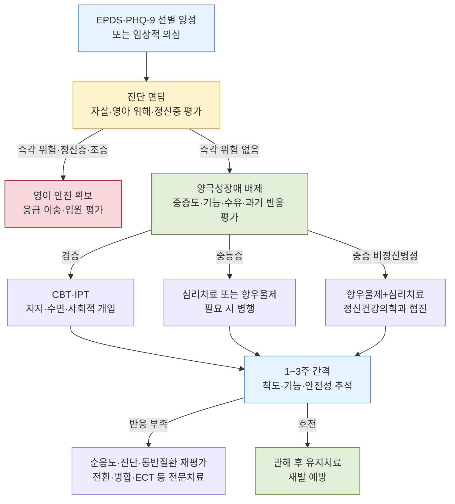

# 주산기/산후 우울증 Perinatal/Postpartum Depression

## <mark style="color:green;">일반 사항</mark>

* 주산기 우울증(perinatal depression)은 임신 중 또는 출산 후 12개월 이내에 발생하거나 재발한 우울장애를 포괄하는 임상적 용어임
* 산후우울증(postpartum depression)은 이 중 출산 후 나타나는 주요우울삽화를 의미함; 진단 기준은 일반 [주요우울장애](027_-depression.md)와 동일하나, 영아에 대한 관심 저하, 양육 능력에 대한 과도한 의심, 영아 관련 침습적 사고 등에 유의
* DSM-5-TR의 주산기 발병 명시자(peripartum onset specifier)는 임신 중 또는 출산 후 4주 이내에 시작된 삽화에 적용하지만, 임상 지침에서는 출산 후 12개월까지 평가·관리함
* 빈도 : 연구 대상·시점·선별기준에 따라 다르나 주산기 우울 증상은 대략 10\~20%에서 보고됨
* 임신 중 주요우울장애 유병률은 약 12%이며, 전체 임신부의 약 5\~6%가 주로 주요우울장애 치료를 위해 SSRI를 복용함 (JAMA Psychiatry 2026)
* 아버지·공동양육자에서도 임상적으로 유의한 주산기 우울 증상이 약 8\~10%에서 보고되며, 산모의 우울증과 밀접하게 연관됨

#### <mark style="color:$primary;">신체 증상 중심의 산후우울증</mark>

* "좋은 엄마는 행복해야 한다"는 사회적 기대로 인해 우울 감정을 숨기고 요통, 두통, 만성 피로 등 신체 증상을 주로 호소할 수 있음; 신체 증상 중심 표현(somatic presentation of depression)이며 과거에는 masked depression(가면 우울증)으로도 표현함
* 신체 증상이 반복되거나 기질적 원인이 불명확한 경우 EPDS 선별 검사를 적극 시행할 것 (☞ [우울증](027_-depression.md) ＞ 가면 우울증)

#### <mark style="color:$primary;">산후 우울 기분 (Postpartum blues)</mark>

* 출산 후 일시적으로 발생하는 경증 우울; 출산 후 2\~3일 내 발생하여 2주 내 자연 소실
* 빈도 : 산모의 30\~70%
* 증상 : 불쾌감, 불면, 감정 기복/정서 불안, 집중력 저하
* 약물 치료는 대개 필요하지 않으나 안심·교육, 수면과 가족 지지, 안전 평가 및 경과 관찰이 필요함; 2주 이상 지속되거나 기능 저하·자살 사고가 있으면 산후우울증을 평가

## <mark style="color:green;">원인</mark>

* 불확실
* 추정 요인 : 유전·후성유전·환경 요인, 출산 후 estrogen·progesterone 및 allopregnanolone의 급격한 변화, HPA axis·면역·염증 반응 변화, 수면 부족 및 심리사회적 스트레스
* 수면 부족은 중요한 교정 가능한 악화 요인이며, 특히 양극성장애·산후 정신증 고위험군에서는 수면 박탈이 조증·정신증을 촉발할 수 있어 수면 보호 계획이 중요함

### <mark style="color:orange;">위험 인자</mark>

**과거력 및 유전**

* 산후우울증 병력 (가장 강력한 단일 위험 인자)
* 주요우울증 병력, 월경전증후군(PMDD) 병력
* 우울증 가족력

**인구학적 특성**

* 어린 연령 산모
* 낮은 사회 경제적 상태, 낮은 교육 수준

**임신·분만 관련**

* 원치 않는 임신
* 조산/저체중 출산, 다자녀
* 분만 후 통증
* 임신 중 불안증

**심리·성격적 요인**

* 낮은 자존감
* 임신 중 우울/불안 증상

**사회·환경적 요인**

* 육아 스트레스, 지원 감소
* 관계 단절, 부부 갈등
* 생활 스트레스, 최근 이사
* 성폭력·아동기 학대 등 외상력, 친밀한 파트너 폭력
* 임신 상실·외상성 분만 경험, 재정·주거 불안

**신체·의학적 요인**

* 수면 장애, 피로

**행동·물질 관련**

* 알코올 남용

## <mark style="color:green;">임상 양상</mark>

**핵심 증상** (DSM-5 진단에 필수 - 반드시 1개 이상 포함)

* 우울한 기분(산후에는 과민성이 두드러질 수 있음)
* 흥미 또는 즐거움의 현저한 저하(Anhedonia)

**흔한 증상** (빈도 높음)

* 피로 또는 활력 상실
* 수면 패턴 변화 (불면 또는 과수면)
* 우는 일이 많아짐
* 체중 또는 식욕 변화
* 집중력 저하

**중등도 이상에서 두드러지는 증상**

* 스스로 가치가 없다고 생각 또는 죄책감
* 사회적 상호 작용 또는 책임 있는 일을 피함
* 자살, 죽음, 또는 일상으로부터의 탈출에 대한 빈번한 생각

**산후우울증 특이 증상**

* 신생아 또는 다른 자녀에 대한 관심 상실
* 엄마로서의 능력에 대한 의심
* 아기의 건강과 안전에 대한 과도하고 침습적인 걱정(Intrusive thoughts)
  * 예) "아기를 떨어뜨리면 어쩌지", "수유가 잘못되면 어쩌지" 등 반복적으로 떠오르는 자아이질적(ego-dystonic) 사고
  * 침습적 사고는 실제 해코지 의도와 다름; 환자를 과도하게 낙인찍지 않도록 주의
  * 강박증(OCD)과 감별 필요
  * 실제 해코지 의도가 있는 경우는 즉각 이송
* 부모-영아 애착(bonding) 장애 : eye contact 감소, 영아 신호에 대한 반응성 저하, 애착 형성 지연 - 기능적 outcome으로 중요; 적극 평가 필요
* 망상 또는 환각 (산후 정신증 감별 필요)

**침습적 사고(Intrusive thoughts) vs 해코지 의도(Infanticidal ideation)**

<table><thead><tr><th width="121"></th><th width="254">침습적 사고</th><th width="280">해코지 의도</th></tr></thead><tbody><tr><td>자아 일치성</td><td>대개 자아이질적(ego-dystonic)</td><td>자아동조적(ego-syntonic)이거나 현실검증력 저하 가능</td></tr><tr><td>환자 반응</td><td>사고를 두려워하고 회피하며 도움을 구함</td><td>실행 의도·계획·명령 환청·망상이 있거나 사고로 인한 괴로움이 적을 수 있음</td></tr><tr><td>임상 대응</td><td>의도·계획·정신증 여부를 평가하고 OCD 감별, 교육·CBT 등 치료</td><td>영아 안전 확보 후 즉시 응급 평가; 포괄적 평가 전까지 영아와 단둘이 두지 않음</td></tr></tbody></table>

### <mark style="color:$danger;">🚩 Red Flags!</mark>

<mark style="color:$danger;">**즉각 이송/응급 평가**</mark> <mark style="color:$danger;">- 생명 위협 또는 즉각적 위해 가능성</mark>

* 자살 사고가 구체적(방법, 시기, 계획 등)이거나 자살 시도 직후인 경우 (☞ [우울증](027_-depression.md))
* 영아 또는 다른 자녀에 대한 해코지 의도(Infanticidal/filicidal ideation)¹⁾ - 즉각 이송 및 아동 안전 확보
* 출산 후 급격히 발생한 환청·망상, 조증·혼재성 증상, 심한 혼란·긴장증·와해 행동 → 산후 정신증(Postpartum psychosis) 의심; 대개 첫 주에 시작하지만 4주 이후에도 가능

**실무 경로** : 산모를 혼자 보내지 않고 보호자가 동행하도록 하며, 포괄적 위험평가 전까지 영아·다른 자녀와 단둘이 두지 않음. 즉각적 위해 가능성이 있으면 119를 통해 응급실로 이송하고 정신건강의학과 응급·입원 평가를 요청함

<mark style="color:$warning;">**당일 의뢰 또는 긴급 평가 권고**</mark>

* 자살 사고가 있으나 구체적 계획은 없는 경우 또는 EPDS 10번 항목이 1점 이상인 경우 - 즉시 자살위험 면담 후 긴급도 결정
* [양극성 우울증](027_-depression.md) 감별이 필요한 경우²⁾
* 우울 증상과 함께 초조, 과민성, 수면 감소, 사고 빠름이 동반되는 경우 → [혼재성 양상](027_-depression.md#dsm-5-tr-specifiers)(mixed features) 의심
* 영아 돌봄 전면 불가 상태 (극도의 무기력, 신생아 방치 위험)
* 중증 삽화로 일상생활 전면 불가

**실무 경로** : 당일 정신건강의학과 협진 또는 응급실 평가를 연결하며, 당일 평가를 확보할 수 없거나 위험도가 불명확하면 응급실로 의뢰함

<mark style="color:$info;">**외래 추적 / 추가 평가 계획 - 단독 시 즉각 위험 낮으나 경과 관찰 필요**</mark>

* 치료에 반응하지 않는 경우 (적절한 용량·기간 치료 후에도 미호전)
* 산후 우울 기분(Postpartum blues)이 2주 이상 지속되는 경우

_1) 아기를 다치게 할까 봐 두려운 침습적 사고(Intrusive thoughts, 자아이질적)와 구별 필요 : 침습적 사고는 즉각 이송 대상이 아니나 면밀한 평가와 지지 필요_

_2) 다음 red flag 중 1개 이상 해당 시 항우울제 단독 투여 전 양극성 장애 배제 필수_

* _과거 짧은 수면에도 피로 없이 에너지가 유지되고 활동성이 증가한 시기(조증·경조증) 경험_
* _산후 수일\~수주 내 급격한 발병_
* _양극성장애 또는 산후 정신증의 개인력·가족력_
* _항우울제 시작 후 초조·불면·충동성·혼재성 양상 출현_

## <mark style="color:green;">진단</mark>

* 단극성 주산기·산후 주요우울장애의 진단 기준은 비주산기 주요우울장애와 동일함
* 양성 선별검사는 진단이 아니므로 증상 수·지속기간·기능 저하, 자살·영아 위해 위험, 조증·경조증, 정신증, 불안·OCD·PTSD·물질사용 및 의학적 원인을 면담으로 평가함
* 산후 갑상선염, 빈혈·철결핍, 수면장애 등은 우울감·피로·불안·인지 저하와 유사하게 나타날 수 있으므로 병력과 증상에 따라 감별함

### <mark style="color:orange;">감별 진단</mark>

<table><thead><tr><th width="180">감별 질환</th><th>감별 단서</th></tr></thead><tbody><tr><td>양극성장애</td><td>수면욕구 감소, 들뜬 기분·과민성, 사고·말·활동 증가, 반복 삽화, 개인력·가족력; 항우울제 단독 시작 전 확인</td></tr><tr><td>산후 정신증</td><td>급격한 발병, 망상·환각, 심한 혼란·와해, 조증·혼재성 또는 긴장증; 즉시 응급·입원 평가</td></tr><tr><td>주산기 OCD</td><td>자아이질적 침습 사고, 보존된 현실검증력, 회피·확인 행동; 실제 의도·계획·정신증과 구별</td></tr><tr><td>출산 관련 PTSD</td><td>외상성 분만·임신 상실 후 재경험, 회피, 과각성, 부정적 인지·기분 변화</td></tr><tr><td>산후 갑상선염</td><td>두근거림·진전·체중 변화 또는 추위 민감·변비·피로; 임상적으로 의심되면 TSH ± free T4</td></tr><tr><td>빈혈·철결핍</td><td>산후 출혈, 창백, 호흡곤란, 심한 피로; CBC ± ferritin</td></tr><tr><td>수면 박탈·기타 의학적 원인</td><td>영아 돌봄과 연동된 수면 분절, 약물·물질사용, 감염·영양결핍 등; 병력과 진찰에 따라 선택 검사</td></tr></tbody></table>

### <mark style="color:orange;">선별 검사</mark>

* \[USPSTF 2023] 임신부·산후 여성을 포함한 성인에서 우울증 선별 권고; 양성자에게 진단, 효과적인 치료 및 추적을 제공할 체계를 함께 갖추어야 함
* \[ACOG 2023] 첫 산전진찰, 임신 후기 및 산후 방문에서 표준화된 도구로 선별하고, 증상·위험에 따라 반복
* 도구 : Edinburgh Postnatal Depression Scale(EPDS), PHQ-9
* 항우울제 시작 전 과거 조증·경조증을 면담하고, 이전에 평가하지 않았다면 Mood Disorder Questionnaire(MDQ) 등으로 양극성장애 선별을 고려

> EPDS는 주산기 집단에서 널리 검증되었고 불안 관련 증상을 함께 포착하는 장점이 있음. PHQ-9도 실무적으로 사용할 수 있고 검사 특성은 대체로 비슷하므로, 동일한 검증 도구를 반복 사용하여 변화량을 추적하는 것이 중요함

#### <mark style="color:$primary;">에든버러 산후우울증 척도 (Edinburgh Postnatal Depression Scale, EPDS)</mark>

* 임신 중 및 출산 후 첫 1년 동안 반복 적용 가능; 최근 7일의 상태를 평가
* 각 문항의 응답 문구와 채점 방향이 서로 다르므로 **검증된 공식 한국어판 전체 양식**을 그대로 사용함; 공통 응답 열로 재구성하거나 임의 번역하지 않음
* 국내 연구에서는 선별 목적의 9/10점과 주요우울증 가능성이 높은 12/13점이 모두 보고되었으므로 사용 양식·시점·목적에 맞는 절단점을 적용함
* 국제 개별환자자료 메타분석에서는 ≥11점이 민감도와 특이도의 균형이 가장 좋았음
* 절단점 이상은 **선별 양성**이며 진단 면담이 필요함; 총점만으로 진단하거나 중증도를 확정하지 않음
* 10번 자해 문항이 1점 이상이면 총점과 무관하게 즉시 자살위험을 면담하고 계획·의도·수단·보호요인에 따라 긴급도를 결정함

### <mark style="color:orange;">검사</mark>

* TSH : 갑상선 증상·병력, 산후 갑상선염 위험 또는 임상적 의심 시
* CBC ± ferritin : 산후 출혈, 빈혈 위험 또는 심한 피로가 있는 경우
* Vit B12, folate, Vit D : 영양결핍 위험 또는 임상적 의심 시 선택적으로 시행
* 그 밖의 검사는 물질사용, 감염, 신경학적 질환 등 임상적 감별에 따라 선택함

***

### <mark style="color:orange;">1차 진료 접근 알고리듬</mark>



<p align="center"><strong>주산기/산후 우울증 1차 진료 알고리듬</strong><br><em>ACOG 2023 및 본문 근거를 바탕으로 재구성</em></p>

***

## <mark style="background-color:$warning;">Management</mark>

### <mark style="color:orange;">임신 중 우울증 치료 결정</mark>

* 임신부에서 SSRI의 위약 대조 RCT는 거의 없어 안전성 근거는 주로 관찰 연구에 의존함; 핵심 한계는 적응증에 의한 교란(confounding by indication)으로, 약물 지속군은 중증·재발성 질환 및 다른 위험 요인이 더 많을 수 있음
* 미치료·저치료된 모성 우울증은 조산(OR 1.46), 저체중출생(OR 1.90), 제왕절개(위험차 +3.5%p), 임신오조(OR 5.2), 임신성 고혈압·전자간증(약 3배)과 연관됨; SSRI 노출의 잠재적 위험과 함께 평가함 (JAMA Psychiatry 2026)
* **심장기형 재평가** : 초기 연구는 특히 paroxetine 1분기 노출 후 위험 증가를 보고했으나, 모성 우울증과 다른 특성을 보정한 대규모 코호트에서 SSRI와 심장기형의 연관성은 유의하지 않았음(보정 OR 1.06, 95% CI 0.93\~1.22). 다만 관찰 연구이므로 작은 잔여 위험을 완전히 배제할 수는 없음
* **절대위험 상담** : 논문의 의사결정 보조자료에서는 전체 선천기형 약 3/100 대 항우울제 노출 3.2/100, 심장기형 약 1/100 대 1.1/100으로 제시함. 이는 SSRI만의 수치가 아니라 우울증 치료 약물 전반에 관한 설명자료임
* **자폐스펙트럼장애 등 신경발달장애** : 가족·유전 요인을 보정하거나 형제자매를 비교하면 연관성이 대부분 크게 감소하거나 소실되며, 장기 기능장애를 일관되게 입증한 근거는 없음
* **중단과 재발** : 임신 전부터 항우울제를 복용하던 환자, 특히 중증·재발성 우울증에서는 임신 중 중단 시 재발 위험이 증가할 수 있음. 전문 프로그램 코호트에서는 HR 5.0이 보고되었으나 다른 연구 결과에는 이질성이 있음; 과거 삽화 수·중증도, 이전 중단 후 재발, 치료 반응 및 환자 선호를 반영하여 개별 결정
* 임신 중 약동학 변화로 일부 항우울제 혈중농도가 낮아질 수 있으므로, 증상 악화 시 복약순응도와 진단을 재확인하고 검증 척도로 추적하면서 용량을 개별 조정함
* 상담 원칙 : 미치료 질환의 모체·태아 위험, 치료의 이익, 약물 노출의 잠재적 위험과 불확실성을 가능하면 절대위험으로 설명함; "무위험(zero-risk)" 선택지는 없음

### <mark style="color:orange;">치료 방침</mark>

* 경증 : 지지·심리치료 우선; 증상 지속, 과거 중증 삽화 또는 환자 선호에 따라 약물 추가
* 중등증 : 심리치료 또는 항우울제; 기능 저하가 크거나 단독 치료 반응이 부족하면 병행
* 중증 비정신병성 : 항우울제와 심리치료 병행 및 정신건강의학과 협진; 급성 자살위험·영양섭취 불가·긴장증 등에는 입원·ECT 고려
* 약제는 과거 효과·내약성을 우선 고려하고, 새로 시작한다면 임신·수유 안전성 자료를 반영함; 수유만을 이유로 효과적인 유지약을 일률적으로 교체하지 않음
* 산후 정신증·조증·혼재성 양상은 일반 단극성 우울증 알고리듬에서 분리함

**국내 전문가 합의에 따른 약물치료 전략** \[KMAP-DD 2025]

<table><thead><tr><th width="177">임상 상황</th><th>1차 치료</th><th>2차 치료</th></tr></thead><tbody><tr><td>경증~중등증</td><td>항우울제 단독, 항우울제+비정형 항정신병제</td><td>AAP 단독, AD+AD, AD+기분조절제, 기분조절제+AAP, 기분조절제 단독</td></tr><tr><td>정신병적 양상(-) 중증</td><td>항우울제+비정형 항정신병제, 항우울제 단독</td><td>AAP 단독, AD+AD, AD+기분조절제, 기분조절제+AAP, 기분조절제 단독</td></tr><tr><td>정신병적 양상(+) 중증</td><td>*항우울제+비정형 항정신병제 (최우선)<br>비정형 항정신병제 단독</td><td>기분조절제+AAP, AD+기분조절제, AD 단독, AD+AD, 기분조절제 단독</td></tr></tbody></table>

_<mark style="color:$info;">\*최우선(treatment of choice). AD=항우울제, AAP=비정형 항정신병제. 국내 전문가 합의 결과이며 RCT 기반의 국제 주산기 지침과 권고 강도가 다를 수 있음. 정신병적 양상은 산후 정신증·양극성장애 여부를 먼저 평가하고 응급·입원 경로를 우선함. Ref. 대한우울·조울병학회, 대한정신약물학회. 한국형 우울장애 약물치료 지침서 2025 (Wang SM et al. J Korean Neuropsychiatr Assoc 2025;64(3):213-220)</mark>_

***


**임상에서 자주 놓치는 점**

* **선별 양성=진단으로 간주** → 반드시 진단 면담·중증도·기능·자살위험 평가
* **양극성 장애 미감별** → 항우울제 단독 투여 후 조증 전환 또는 혼재성 삽화 유발
* **자아이질적 침습적 사고=해코지 의도로 간주** → 의도·계획·정신증 여부를 구분하여 낙인과 실제 위험 누락을 모두 방지
* **수면 부족 미개입** → 중요한 교정 가능 악화 요인, 특히 양극성장애·산후 정신증 위험군에서 수면 보호 필요


***

## <mark style="color:green;">비-약물 치료 및 예방</mark>

### <mark style="color:orange;">모유 수유 산모 일반 관리</mark>

* 모유 수유의 이익, 약제별 모유 이행·영아 자료, 산모의 치료 필요 및 선호를 함께 고려; 대부분의 우울증 치료는 수유와 병행 가능
* 신생아와의 적절한 접촉 유지 (예: 신생아 마사지)
* 밝은 환경 유지, 활동
* 수면 박탈 적극 관리 : 보호자와 야간 돌봄·수유 시간을 미리 나누고 필요 시 분유 보충을 고려하며, 휴대전화 알림을 줄여 가능한 수면 구간을 보호함
* 실제 수면시간과 수면욕구 감소·기분 변화를 간단히 기록하고, 특히 양극성장애·산후 정신증 고위험군에서 잠을 거의 자지 않아도 피곤하지 않은 상태를 조기 경고 신호로 평가함
* 신생아 수면 관리 (필요 시 주변의 도움 요청)
* 적당한 영양 및 수분 섭취
* 균형 잡힌 식사와 결핍 교정; 복합 vitamin·미네랄·오메가-3를 산후우울증 치료 목적으로 일률 처방하지 않음

### <mark style="color:orange;">심리치료</mark>

* 인지행동치료(CBT) : 경증\~중등증의 1차 심리치료; 중증에서는 약물과 병행
* 대인관계치료(IPT) : 역할 전환(모성 적응), 대인 갈등 해소에 특히 효과적; 산후우울증 1차 심리치료로 권고
* 행동활성화, 지지 치료, mindfulness 기반 치료 및 훈련된 동료 지지(peer support)를 보조적으로 활용
* 고위험 임신부·산후 여성에게 CBT·IPT 기반 상담을 제공하면 주산기 우울증 예방에 도움이 됨
* 대면치료 접근이 어려운 경우 검증된 디지털 CBT 등 원격 심리개입을 보조적으로 활용할 수 있으나, 자살위험·양극성장애·정신증 평가와 전문치료를 대체하지 않음

### <mark style="color:orange;">신경조절치료</mark>

* rTMS : 일반 주요우울장애의 근거를 토대로 항우울제 반응이 불충분한 환자에서 전문기관이 고려할 수 있으나, 주산기·산후 집단에 특화된 연구는 적고 비무작위 연구가 포함되어 근거의 확실성이 낮음
* tDCS : 주산기·산후우울증에 대한 효과와 장기 안전성이 확립되지 않은 연구 단계의 치료이며 표준치료 또는 특정 재택기기를 권고하지 않음
* ECT : 정신병적·긴장성 우울증, 급성 자살위험, 심한 영양·신체상태 악화 또는 신속한 반응이 필요한 경우 정신건강의학과에서 고려

## <mark style="color:green;">약물 치료</mark>

### <mark style="color:orange;">약제</mark>

* 경증 : 심리치료 우선; 약물이 필요하면 항우울제 단독
* 중등증\~중증 비정신병성 : 항우울제 ± 심리치료; 중증은 병행과 정신건강의학과 협진 권고
* 비정형 항정신병제 증강은 충분한 항우울제 치료 후 반응이 부족한 치료저항성 우울증에서 전문의가 고려하며, 단순 불면·불안 또는 중등증이라는 이유만으로 일률적으로 추가하지 않음
* 정신병적 양상, 조증·혼재성 또는 긴장증 : 산후 정신증·양극성장애를 우선 평가하고 응급·입원 치료 경로 적용

#### <mark style="color:$primary;">항우울제</mark>

* 과거 효과적이었던 항우울제가 있으면 임신·수유 안전성과 환자 선호를 함께 고려하여 우선 검토함
* 새로 시작하는 경우 sertraline, escitalopram을 우선 고려할 수 있음; 수유 중 자료가 비교적 충분하고 영아 노출이 낮음
* 저용량으로 시작하여 증상·내약성에 따라 치료용량까지 증량; 검증 척도와 기능으로 반응을 추적함
* paroxetine : 수유 중 영아 노출은 낮지만 다음 임신 가능성까지 고려하면 새로 시작하는 약으로는 후순위가 될 수 있음; 이미 효과적으로 복용 중이면 임의 교체하지 않음
* mirtazapine : 수유 중 자료가 sertraline·escitalopram보다 적고 산모 진정·체중 증가 가능성이 있어 보통 후순위로 고려함; SSRI 불내성이거나 불면·식욕저하가 두드러진 경우 선택할 수 있으며 영아의 졸림·수유 상태를 관찰함
* nortriptyline : TCA 계열은 과량 복용 시 치명적이므로 자살 위험이 있는 경우 1차 선택으로는 피함
* 신생아 모니터링 : 모유 수유 중 항우울제 복용 시 영아의 졸림, 수유 장애, 체중 증가 불량 여부 관찰
* **임신 후기 SSRI 노출과 PPHN** : 보정 OR 1.28(95% CI 1.01\~1.64)의 작은 연관성이 보고되었으나 잔여 교란 가능성이 있음; 특정 SSRI만의 위험으로 단정하거나 이를 이유로 필요한 치료를 보류하지 않고 절대위험과 미치료 우울증 위험을 함께 설명함
* **신생아 적응 증후군(Poor Neonatal Adaptation Syndrome, PNAS)** : 임신 후기 SSRI 노출 신생아의 최대 30%에서 jitteriness(신경과민), 호흡곤란, 과민성, 빈맥, 수유 곤란 등이 나타날 수 있음; 대부분 자기제한적이며 수일\~2주 내 조용한 환경, 포대기·피부접촉, 소량씩 자주 수유하는 지지치료로 호전됨. 출생 직후 호흡·체온·수유 상태를 임상적으로 관찰하고 증상이 있으면 저혈당·호흡곤란 등 중증도를 평가함; 건강한 만삭아·후기 미숙아에게 일률적인 추가 검사를 요구하지 않음. SSRI+benzodiazepine 병용 시에는 관찰을 강화함

<table><thead><tr><th width="204">항우울제</th><th width="126">시작 (㎎/d)</th><th width="122">주요우울장애 범위 (㎎/d)</th></tr></thead><tbody><tr><td>sertraline <mark style="color:blue;">[졸로푸트]</mark></td><td>25~50</td><td>50~200</td></tr><tr><td>escitalopram <mark style="color:blue;">[렉사프로]</mark></td><td>5~10</td><td>10~20</td></tr><tr><td>paroxetine <mark style="color:blue;">[세로자트]</mark></td><td>10~20</td><td>20~50</td></tr><tr><td>nortriptyline <mark style="color:blue;">[센시발]</mark></td><td>25</td><td>25~150</td></tr></tbody></table>

#### <mark style="color:$primary;">Neuroactive Steroids (GABA-A 양성 조절제)</mark>

산후우울증에 특화된 계열로, 기존 항우울제와 기전이 다름 (GABA-A 수용체 양성 조절 → 빠른 효과 발현)

**Zuranolone** <mark style="color:blue;">\[Zurzuvae]</mark>

* GABA-A 수용체 양성 조절제(neuroactive steroid); 산후우울증 전용 경구 치료제
* 2023년 FDA 승인; 2026년 현재 국내 미허가. ACOG는 출산 후 12개월 이내 환자 중 우울증이 임신 3분기 또는 산후 4주 이내 시작된 경우 고려하도록 권고함
* 표준 용법 : **50 ㎎을 지방 함유 식사와 함께 저녁에 1일 1회, 14일간**; 단독 또는 기존 경구 항우울제에 추가 가능. 반복 치료의 안전성·유효성은 확립되지 않음
* 효과는 투여 3일경부터 나타날 수 있으나 45일 이후의 지속효과 자료는 제한적임
* 모유 내 농도는 낮지만 수유 영아에 미치는 영향 자료는 제한적임. 미국 ACOG·LactMed는 일률적인 수유 중단보다 공동의사결정과 영아의 과도한 졸림·수유 장애 관찰을 권고함; 국가별 허가사항은 다를 수 있음
* 부작용 : 졸림, 어지럼, 진정, 두통, 설사, 피로; 매 복용 후 **최소 12시간** 운전·위험 작업 금지. 산모가 주 양육자인 경우 투약 후 영아를 안전하게 돌볼 다른 보호자를 확보하고, 졸리거나 어지러운 동안 영아를 안고 이동·목욕시키거나 침대·소파에서 영아와 함께 잠들지 않도록 함
* CNS 억제제 병용 시 진정이 증가할 수 있어 주의하고 필요 시 감량함. 강력한 CYP3A4 유도제 병용은 피하고, 강력한 CYP3A4 억제제·중등도 이상 신기능 저하·중증 간기능 저하에서는 허가사항에 따라 감량
* 태아 위해 가능성 때문에 치료 중과 마지막 복용 후 1주간 효과적인 피임 필요

**Brexanolone** <mark style="color:blue;">\[Zulresso]</mark>

* 동일 계열의 60시간 지속 정맥주사 제형으로 2019년 미국에서 산후우울증 치료제로 승인되었음
* 과도한 진정·갑작스러운 의식 소실 위험 때문에 인증 의료기관에서 지속 관찰하며 투여하던 약제임
* 제조사의 상업적 요청에 따라 **FDA 허가가 2025년 4월 14일 철회되었고 미국에서 더 이상 판매되지 않음**; 안전성·유효성 문제에 따른 철회는 아님
* 국내 미허가이며 현재 실제 치료 선택지로 제시하지 않음

### <mark style="color:orange;">산후 정신증</mark>

* 약 1,000건의 출산 중 1\~2건에서 발생하며, 자살·영아 살해 위험 때문에 정신과적 응급상황임
* 대개 출산 후 첫 주에 급격히 시작하고 대부분 4주 이내 발생하지만 더 늦게 시작할 수도 있음
* 망상·환각뿐 아니라 기분 변동, 과민·초조, 수면욕구 감소, 조증·혼재성 증상, 혼란, 긴장증 및 와해 행동으로 나타날 수 있음
* 양극성장애 및 과거 산후 정신증과 강하게 연관됨; 첫 발병처럼 보여도 양극성장애를 적극 평가함
* 즉시 정신건강의학과 평가 및 대개 입원 치료가 필요함. 포괄적 위험평가가 끝날 때까지 산모를 영아 또는 다른 자녀와 단둘이 두지 않고 안전을 확보함
* 급성기에는 항정신병제 ± 단기 benzodiazepine을 사용하고, lithium 추가와 ECT를 고려함. 항우울제 단독 치료는 피함
* 과거 산후 정신증 또는 양극성 I형 환자는 산전부터 전문의와 출산 직후 예방약물·수면 보호·관찰 계획을 수립함; lithium의 재발 예방 근거가 가장 많음
* lithium은 모유 이행과 영아 노출이 유의하므로 수유 여부를 정신건강의학과·소아청소년과와 공동 결정함. 건강한 만삭아에서 수유를 지속한다면 영아의 수유·체중·수분 상태와 필요 시 혈중 lithium, creatinine/BUN, TSH를 추적하며, 미숙아·탈수·감염 또는 모니터링이 어려운 경우에는 수유를 피하는 쪽을 우선 고려함

### <mark style="color:orange;">재발 예방</mark>

* 산후우울증 과거력이 있는 경우 재발률이 높아 다음 임신 계획 시 사전 상담 필수
* 고위험 임신부·산후 여성에게 CBT·IPT 기반 예방 상담을 제공함
* 산후우울증 과거력이 있는 고위험 산모에서는 제한된 임상시험 근거를 바탕으로 출산 직후 예방적 SSRI 시작을 고려할 수 있음; 산전에 재발 예방·수면 보호·약물·지지체계를 포함한 계획을 수립함
* 관해 후 최소 6\~12개월 유지 치료 권고; 반복성·중증 삽화, 자살위험 또는 이전 중단 후 재발 병력이 있으면 장기 유지 고려
* 다음 임신 전 항우울제를 일률적으로 중단하거나 지속하지 않고, 특히 중증·재발성 우울증에서 중단 시 재발 위험이 증가할 수 있음을 설명하여 공동 결정함

***

## <mark style="color:green;">배우자·공동양육자 우울증</mark>

* 아버지에서 임상적으로 유의한 주산기 우울 증상은 약 8\~10%에서 보고되며, 산모의 우울증·관계 갈등·재정 불안·실업·정신질환 과거력이 위험인자임
* 아버지 우울·불안은 자녀의 정서·행동 문제와 작은 연관성이 보고되며 산모의 정신건강과도 상호 영향을 줄 수 있음
* 모든 배우자의 의무적 선별 근거는 충분하지 않지만, 산모 또는 영아를 진료하는 의료진은 공동양육자의 정신건강에도 주의를 기울이고 증상·위험이 있으면 표준화 도구로 평가함

### <mark style="color:orange;">선별 도구</mark>

* EPDS : 아버지에서 제안된 절단점은 7\~10점으로 일정하지 않고 국내 남성에 특화된 진단적 절단점도 충분히 확립되지 않았으므로, 양성 시 진단 면담 필요
* PHQ-9 또는 PHQ-2 : 일반 성인 선별 도구로 사용 가능
* 불안 동반 평가 : GAD-7 사용 가능

### <mark style="color:orange;">아버지 우울증의 특이적 표현</mark>

* 일반적인 우울감 외에 다음 양상이 두드러질 수 있음
  * 과민성, 분노, 충동적 행동
  * 회피 행동 (귀가 회피, 일중독)
  * 알코올 등 물질 사용 증가
  * 아기 또는 배우자와의 정서적 거리감
* 확인할 질문
  * "최근 짜증이나 분노가 늘었나요?"
  * "집에 있는 시간이 줄었나요?"
  * "음주량이 늘었나요?"
  * "아기나 배우자와 거리감이 느껴지나요?"

### <mark style="color:orange;">외래 접근</mark>

* EPDS 일부 문항만 임의로 추출하여 진단용으로 단축 사용하지 않음. 짧은 1차 선별이 필요하면 검증된 PHQ-2를 사용하고, 양성이면 PHQ-9 또는 EPDS 전체 양식을 시행함
* 선별 양성자는 산모·배우자 여부와 관계없이 진단 면담, 기능 저하, 물질사용 및 자살위험을 평가하고 중증도에 맞는 치료를 연결함
* 두 사람 모두 증상이 있거나 관계 갈등·양육 부담이 크면 각 개인의 치료와 함께 역할 조정·부부 기반 개입을 고려함

### <mark style="color:orange;">치료 접근</mark>

* 경한 스트레스·우울 증상에는 psychoeducation, 수면·역할 분담, 사회적 지지와 심리치료를 고려함
* 주요우울장애가 확인되면 일반 성인 [우울증](027_-depression.md)의 중증도별 치료 원칙을 적용함; 아버지·공동양육자에 특화된 치료 RCT는 부족함

***

### <mark style="color:red;">질병코드</mark>

F32.- 우울삽화

F33.- 재발성 우울장애

F53.0 달리 분류되지 않은 산후기와 연관된 경한 정신 및 행동장애(다른 코드로 더 정확히 분류되지 않는 경우)

O99.3 임신·출산 및 산후기에 합병된 신경계통의 질환과 정신 및 행동장애

_※ 주요우울삽화 진단 기준을 충족하면 F32.- 또는 F33.-로 분류하며, O99.3의 병용 여부는 발병 시점·주진단 선정 및 실제 청구기준에 따라 확인함. KCD-9은 2026년 1월부터 시행 중이며 기존 ICD-10 기반 분류체계를 유지함. O90은 산후우울증의 일반 코드로 사용하지 않음._

***

## <mark style="color:purple;">처방례</mark>

> **처방례 1.** 기본 - SSRI 단독 (모유 수유 산모)
>
> ```
> 졸로푸트 50 ㎎/T  0.5T  qd  아침  7~14일
> 이후 졸로푸트 50 ㎎/T  1T  qd  아침
> ※ 모유 이행량 적음 - 수유 중 사용 가능; 영아 졸림·수유 장애 모니터링
> ※ 1~3주 간격으로 증상·기능·자살위험을 추적하고, 충분한 치료반응은 대개 4~8주에 평가
> ※ 관해 후 최소 6~12개월 유지; 중단 기간은 용량·복용기간·중단증상에 따라 개별화
> ```

> **처방례 2.** 수면 장애 동반
>
> ```
> 레메론 15 ㎎/T  1T  qd  취침 시
> ※ 수면 개선 효과 즉각적; 항우울 효과는 2~4주 소요
> ※ 졸림, 체중 증가 부작용 사전 설명
> ※ 수유 중 자료가 sertraline·escitalopram보다 적고 산모 진정 가능성이 있어 2차 선택;
>    SSRI 불내성이거나 불면·식욕저하가 두드러진 경우 고려, 영아 졸림·수유 상태 모니터링
> ```

> **처방례 3.** 불안 동반 또는 sertraline 대체
>
> ```
> 렉사프로 10 ㎎/T  0.5T  qd  조식 후  7~14일
> 이후 렉사프로 10 ㎎/T  1T  qd  조식 후
> ※ 간기능 저하 시 10 ㎎/day 이하로 유지
> ※ 모유 이행량 적음 - 수유 중 사용 가능
> ```

> **처방례 4.** TCA 선택 시 (SSRI/SNRI 불내성, 만성 통증 동반)
>
> ```
> 센시발 25 ㎎/T  1T  qd  취침 시
> ※ TCA 계열은 과량 복용 시 치명적 - 자살 위험이 있는 경우 1차 선택 피함
> ※ 항콜린성 부작용(입마름, 변비, 요 정체) 사전 설명
> ※ 모유로 소량 분비 - 영아 모니터링 필요
> ```

_※ 비정형 항정신병제 증강, lithium, zuranolone 및 ECT는 양극성장애·정신증·치료저항성 여부와 수유·안전성을 평가하여 정신건강의학과 협진하에 결정함. Quetiapine 25\~50 ㎎은 주로 진정 용량이므로 일반 산후우울증의 표준 증강 처방례로 제시하지 않음._

***

### <mark style="color:$success;">핵심 복약 지도</mark>

> **산후우울증 약물 복용 안내**
>
> * 항우울제는 복용 후 **2\~4주 후부터** 서서히 효과가 나타납니다. 처음에는 효과가 느껴지지 않더라도 임의로 중단하지 마십시오.
> * 모유 수유 중에도 사용할 수 있는 항우울제가 있습니다. 약마다 모유 이행량과 영아 자료가 다르므로 담당 의사가 효과와 안전성을 함께 고려하여 선택합니다.
> * 증상이 좋아졌더라도 **담당 의사와 상의 없이 임의로 중단하지 마십시오.** 갑자기 끊으면 어지럼, 저림, 구역 등 금단 증상이 생길 수 있습니다.
> * 아기에 대한 걱정이나 부정적인 생각이 드는 것은 산후우울증의 증상일 수 있습니다. 혼자 감추지 말고 담당 의사에게 솔직히 말씀해 주십시오.

> **언제 다시 병원을 방문해야 하나요?**
>
> * 자해나 자살에 대한 생각이 드는 경우 - 즉시 내원 또는 **자살예방 상담전화 109**
> * 아기를 해칠 의도·계획이 있거나, 해치라는 목소리가 들리거나, 현실과 다른 확신이 드는 경우 - 아기와 단둘이 있지 말고 즉시 내원
> * 원하지 않는데 아기를 다칠까 봐 두려운 생각이 반복되는 경우 - 실제 의도와 다를 수 있으나 숨기지 말고 담당 의사에게 알려 평가받기
> * 2\~4주 복용 후에도 증상이 전혀 나아지지 않는 경우
> * 영아가 평소보다 많이 졸리거나 수유를 잘 못 하는 경우

***

### <mark style="color:blue;">환자 안내서</mark>


**산후우울증은 엄마의 잘못이 아닙니다**

산후우울증은 출산 후 호르몬 변화와 신체적·심리적 스트레스가 복합적으로 작용하여 생기는 질환입니다. 적절한 치료를 통해 충분히 회복될 수 있습니다.


#### <mark style="color:$primary;">산후 우울 기분과 산후우울증은 어떻게 다른가요?</mark>

* **산후 우울 기분(Baby blues)** : 출산 후 2\~3일 내에 생기는 일시적인 감정 기복으로, 2주 이내에 자연스럽게 사라짐. 산모의 절반 이상에서 경험하는 정상적인 반응
* **산후우울증** : 2주 이상 지속되는 우울감, 무기력, 불안, 아기에 대한 관심 저하 등이 나타나는 상태. 치료가 필요함

#### <mark style="color:$primary;">어떻게 치료하나요?</mark>

* **약물 치료** : 항우울제를 주로 사용; 모유 수유 중에도 안전하게 사용할 수 있는 약이 있으며, 효과는 2\~4주에 걸쳐 서서히 나타남
* **심리 치료** : 인지행동치료(CBT), 대인관계치료(IPT) 등이 약물 치료와 병행 시 효과적
* **치료 기간** : 증상이 호전되어도 재발 방지를 위해 보통 6\~12개월 이상 유지 권장

#### <mark style="color:$primary;">임신 중에도 항우울제를 복용해도 되나요?</mark>

* 임신 중 우울증을 치료하지 않을 때의 위험과 약물 노출의 잠재적 위험을 함께 비교해야 하며, 누구에게나 적용되는 무위험 선택지는 없습니다.
* 예전에는 일부 항우울제가 아기의 심장 기형과 관련 있다고 알려졌으나, 최근 대규모 연구에서는 우울증과 동반 위험 요인을 충분히 보정하면 연관성이 뚜렷하지 않았습니다. 다만 관찰 연구이므로 작은 위험까지 완전히 배제할 수는 없습니다.
* 임신 후반기에 약을 복용한 경우 아기가 태어난 직후 며칠간 예민하거나 처지는 모습을 보일 수 있으나, 대부분 2주 이내에 특별한 치료 없이 좋아집니다.
* 임신을 계획하고 계시다면 약을 임의로 끊지 말고, 과거 우울증의 중증도와 재발 횟수, 이전 중단 경험을 바탕으로 담당 의사와 지속 여부를 결정하십시오.

#### <mark style="color:$primary;">생활 속 실천 사항</mark>

* **도움 요청하기** : 혼자 모든 것을 감당하려 하지 말고 배우자, 가족, 지인에게 도움을 요청하세요
* **수면 확보** : 아기가 잘 때 함께 쉬고, 밤중 수유는 가능하면 교대로 하세요
* **규칙적인 가벼운 운동** : 산책 등 가벼운 활동이 기분 개선에 도움이 됩니다
* **사회적 연결** : 산후우울증 자조 모임이나 육아 커뮤니티를 통해 비슷한 경험을 나누세요
* **배우자도 살펴보세요** : 아기 아빠도 출산 후 약 10%에서 우울증을 경험할 수 있습니다. 배우자가 무기력하거나 평소와 다른 기분 변화를 보인다면 함께 상담을 권해 주세요

#### <mark style="color:$primary;">이럴 때는 즉시 도움을 요청하세요</mark>

* 스스로를 해치거나 죽고 싶다는 생각이 드는 경우 - 즉시 내원 또는 **자살예방 상담전화 109**
* 아기를 해칠 의도·계획이 있거나, 아기를 해치라는 목소리가 들리거나, 현실과 다른 확신이 드는 경우 - 아기와 단둘이 있지 말고 즉시 내원
* 환청, 망상, 심한 혼란, 잠을 거의 자지 않아도 피곤하지 않으면서 지나치게 들뜨거나 행동이 빨라지는 경우 (산후 정신증·조증 가능성)
