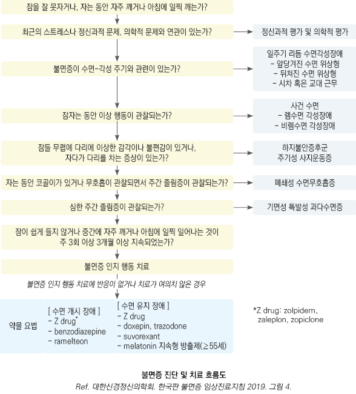

# 불면증 Insomnia, Sleep Disorder

## <mark style="color:green;">일반 사항</mark>

### <mark style="color:$primary;">Sleep disorder 분류 \[ICSD-3]</mark>

1. Insomnia : 적절한 수면 환경에도 불구하고 잠에 들기 어렵거나 잠을 유지하기 어렵거나 너무 일찍 깨어나며 이로 인하여 주간 기능에 지장이 발생함
   1. 수면 지연(sleep latency) : 젊은 성인에서 20분, 나이든 성인에서 30분 내 수면에 들지 못함
   2. 조기 기상(early morning awakening) : 원하는 시간보다 30분 이전에 기상
2. Sleep-related breathing disorders : 수면 중 비정상적인 호흡; central or obstructive sleep apnea syndrome, sleep-related hypoventilation disorder, sleep-related hypoxemia disorder
3. Central disorder of hypersomnolence : 다른 수면 이상에 의하지 않은 주간 졸림
4. Circadian rhythm sleep-wake disorders (= Shift work disorder, SWD)
   1. shift work schedule과 관련된 증상이 최소 1개월 이상 지속되는 수면 장애
   2. 자신의 수면 패턴에서 요구되는 sleep-wake 일정과 환경(생활) 사이의 불일치(예: 여행, 야간 작업)에 기인하여 주간의 과도한 졸림이나 불면증이 발생한 지속적 또는 재발성 수면 장애. 이로 인하여 일상생활에서 유의미한 장애 발생
5. 사건수면 (Parasomnia) : 잠이 드는 동안, 잠자는 중, 또는 잠에서 깨어나는 동안 원하지 않는 신체적 사건(행동) 또는 경험(지각, 감정, 꿈); 몽유병, 잠꼬대, 수면 중 신음, 악몽, 야경, 야뇨, 이갈이, 수면 행동
6. Sleep-related movement disorders : 수면을 방해하는 단순한, 입체적인 움직임(예: restless legs syndrome) (☞ [하지불안증후군](036_-restless-legs-syndrome.md))
7. Other sleep disorders

### <mark style="color:$primary;">기간에 따른 분류</mark>

#### Short-term insomnia disorder

* ＜3개월 동안 주간 기능 장애 등의 유의미한 문제를 일으키는 수면 장애
* 다른 명칭 : adjustment insomnia, acute insomnia, stress-related insomnia, transient insomnia
* 일시적인 스트레스와 관련될 수 있으나 급성 통증, 슬픔, 또는 다른 스트레스 요인들이 수면 장애의 유일한 원인일 때는 불면증이라는 진단을 적용하지 않을 수 있음
* 스트레스가 해소되거나 스트레스에 적응하면 증상이 해소될 수 있음

#### Chronic insomnia disorder

* ≥3개월 동안 ≥3회/주 유의미한 문제를 일으키는 수면 장애
* 적절한 수면 기회가 주어졌음에도 불구하고 발생하는 것이 진단의 전제 조건 - 소음·빛 등 환경 요인에 의한 단순 수면 부족과 구별됨
* 여러 해에 걸쳐 수 주 동안 반복적으로 불면증이 발생하는 환자는 각각의 episode가 3개월 동안 지속되지 않더라도 만성 불면증으로 진단할 수 있음

#### Other insomnia disorder

* short-term 또는 chronic insomnia에 해당되지 않는 수면 장애

## <mark style="color:green;">원인 및 위험 인자</mark>

* 특발성(원인 불명)
* 불규칙 수면 : 교대 근무, 여행, 출장; 낮잠, 일찍 취침
* 나쁜 환경 : 밝은 조명, 소음
* 사회적 관계 장애, 낮은 사회 경제적 상태
* 사회심리적 스트레스 : 경제, 학업, 직장(예: 이직, 실직), 가정(예: 갈등, 별거)
* 고령(중년의 10%, ＞65세의 ⅓이 만성 불면증 유병), 여성(남성의 5배)
  * 연령 증가에 따른 수면 구조 변화 : 서파수면(slow-wave NREM) 및 렘수면 비율 감소 → 수면이 얕아지고 야간 각성 빈도↑, 아침 회복감↓
  * 중년기부터 10년마다 평균 27분씩 수면 시간 감소
  * 내부 일주기 시계 기능 저하 → 취침·기상 시간이 앞당겨지는 경향(앞당겨진 수면위상형)
  * 수면에 영향을 주는 동반 질환 증가, 다제약물 복용 증가
* 정신 질환 : 불안증, 우울증, 인격장애, 외상 후 스트레스장애
* 급만성 질환 : 하지 불안증, 수면무호흡증, 만성 통증, 골관절증, 심부전, 신부전, COPD, GERD, 갑상선항진증, 배뇨 장애, 과민대장증후군, 만성피로증후군, 뇌졸중, 파킨슨병, 치매, 악성 종양
* 약물 남용 : 다제약물, 알코올 남용, 카페인 과용, 약물 금단
* 약물 : 항우울제(예: SSRI, SNRI, bupropion), β-차단제/항진제, CCB, 이뇨제, 항간질제(예: lamotrigine, phenytoin), 항콜린제, 항암제, 교감 신경 흥분제(예: salbutamol, salmeterol, theophylline, pseudoephedrine), CNS 자극제(예: methylphenidate, dextroamphetamine, nicotine), NSAID, steroid, 경구 피임제, 갑상선 호르몬, atorvastatin, levodopa, quinidine

## <mark style="color:green;">임상 양상</mark>

**주간 기능 장애** (가장 흔하고 직접적인 증상)

* 주간 졸음, 피로, 활력 감소
* 집중력·기억력 장애, 작업 수행 능력 저하
* 사고 위험 증가

**심리·정서적 증상**

* 감정 이상, 과민, 긴장
* 불면에 대한 두려움 (수면 불안, 불면을 악화시키는 악순환)

**신체 증상**

* 두통, 소화 장애

**장기적 건강 위험** (만성 불면 시)

* 심혈관 질환(고혈압, 심근경색), 당뇨병 위험 증가

### <mark style="color:$danger;">🚩 Red Flags!</mark>

<mark style="color:$danger;">**즉각 이송/응급 평가 — 생명 위협 또는 즉각적 위해 가능성**</mark>

* 자살 사고가 구체적이거나 자살 시도 직후인 경우 (✽불면증은 자살 위험의 독립적 위험 인자)
* 급성 섬망 또는 의식 변화 동반 (원인 질환 즉각 평가 필요)

<mark style="color:$warning;">**당일 의뢰 또는 긴급 평가 권고**</mark>

* 자살 사고가 있으나 구체적 계획은 없는 경우
* 폐쇄성 수면무호흡증 강력 의심 : 코골이 + 수면 중 무호흡 목격 + 주간 졸림 동반 — 수면다원검사 의뢰
* 기면병 의심 : 갑작스러운 탈력 발작, 수면 마비, 입면 시 환각 동반
* 렘수면 행동장애 의심 : 수면 중 격렬한 행동(소리 지름, 팔다리 움직임) — 파킨슨병 등 신경과적 질환 감별 필요

<mark style="color:$info;">**외래 추적 / 추가 평가 계획 — 단독 시 즉각 위험 낮으나 경과 관찰 필요**</mark>

* 치료에 반응하지 않는 경우 (CBT-I 및 2가지 이상 약제 충분한 용량·기간 사용 후에도 미호전)
* 동반 정신 질환(우울증, 불안증) 또는 신체 질환 조절 불량

## <mark style="color:green;">진단</mark>

* 다른 원인을 배제하여 진단
* 병력(예: 통증성 질환), 약물/음주 경력
* 수면 이력 : 수면/기상 시간, 근무/활동 시간, 불면 패턴(입면 지연, 유지 장애), 주간 졸음 여부
  * 수면 일지 작성 : 취침/기상/밤중 각성 시간, 야간 배뇨 시간/배뇨량, 수면 환경, 낮잠, 음주, 스트레스, 기분
* 실험실 검사 : CBC, 빈혈 검사, TSH, 간/신장 기능, CRP, Vit B12, urine toxicology
* ECG, EEG, CT/MRI, circadian markers(melatonin, 체온)
* 수면다원검사 : 치료 실패, 주간 졸음 위험 직업군(예: 직업 운전자)에서 고려

#### 주간 졸림증 자가 진단 - Epworth Sleepiness Scale (ESS)

([대한수면연구학회](https://www.sleepnet.or.kr/))

* 아래 7가지 상황들에서 당신은 어느 정도나 졸음을 느끼십니까?
* 배점 : 전혀 졸지 않는다( 0점), 가끔 졸음에 빠진다(1점), 종종 졸음에 빠진다(2점), 자주 졸음에 빠진다(3점)

- [ ] 앉아서 책을 읽을 때
- [ ] 텔레비젼을 볼 때
- [ ] 극장이나 회의석상과 같은 공공 장소에서 가만히 앉아있을 때
- [ ] 오후 휴식 시간에 편안히 누워 있을 때
- [ ] 앉아서 누군가에게 말을 하고 있을 때
- [ ] 점심 식사 후 조용히 앉아 있을 때
- [ ] 차를 운전하고 가다가 교통 체증으로 몇 분간 멈추었을 때

▶판정 : ＜10점 정상, ≥10점 경증, 14\~18점 중등증, ≥19점 중증 주간 졸림증

#### 불면증 심각도 지수 (Insomnia Severity Index, ISI)

([대한수면연구학회](https://www.sleepnet.or.kr/))

1. 불면증에 관한 아래 3가지 항목에 대하여 당신은 현재(최근 2주간) 어떤 상태인가요?
   * 배점 : 없음(0점), 약간(1점), 중간(2점), 심함(3점), 매우 심함(4점)
   - [ ] 잠들기 어렵다.
   - [ ] 잠을 유지하기 어렵다.
   - [ ] 쉽게 깬다.
2. 현재 수면 양상에 관하여 얼마나 만족하고 있습니까?
   * 매우 만족(0점), 약간 만족(1점), 그저 그렇다(2점), 약간 불만족(3점), 매우 불만족(4점)
3. 당신의 수면 장애가 어느 정도나 당신의 낮 활동을 방해한다고 생각합니까? (예. 낮에 피곤함, 직장이나 가사에 일하는 능력, 집중력, 기억력, 기분 등)
   * 전혀(0점), 약간(1점), 다소(2점), 상당히(3점), 매우 많이(4점)
4. 불면증으로 인한 장애가 당신의 삶의 질을 얼마나 손상시킨다고 생각합니까?
   * 전혀(0점), 약간(1점), 다소(2점), 상당히(3점), 매우 많이(4점)
5. 당신은 현재 불면증에 관하여 얼마나 걱정하고 있습니까?
   * 전혀(0점), 약간(1점), 다소(2점), 상당히(3점), 매우 많이(4점)

▶판정 : 0\~7점 유의할 만한 불면증 없음, 8\~14점 경증, 15\~21점 중등증, 22\~28점 중증 불면증

### <mark style="color:$primary;">감별</mark>

#### 일주기리듬 수면각성장애

* 수면각성 패턴 때문에 잠이 오지 않는 상황
* 뒤처진 수면위상형 : 늦게 잠이 들고 기상 시간이 늦어지는 수면-각성 주기 지연(예: 우울증)
* 앞당겨진 수면위상형 : 일찍 잠을 자고 새벽에 일찍 깨는 수면-각성 주기 앞당김; 고령자에서 특히 흔함 - 저녁 7\~9시에 졸리고 새벽 3\~5시에 기상하는 패턴; 늦게 취침해도 일찍 깨는 경향 유지
* 진단 : 수면 각성 주기 평가(예: 수면 일지, 활동기록계)
* 치료 : 저녁 광치료(취침 시간 지연 효과), melatonin; 수면제에 잘 반응하지 않음

#### 폐쇄성 수면무호흡증

* 잠은 쉽게 들지만 수면 중 호흡이 멈추거나 얕아짐; 수면 중 근육 긴장도가 감소하고 흡기 시 상기도 음압이 발생하여 기도 폐쇄, 산소 포화도 저하, 쉽게 각성(자주 깸), 낮졸림증 발생
* 위험 인자 : 남성, 고령, 비만, 음주, 흡연
* 진단 : 수면다원검사; 무호흡 저호흡 지수\*로 중증도 평가
  * \*Apnea-Hypopnea Index, AHI : 시간 당 무호흡이나 저호흡이 최소 10초 이상 되는 횟수
* 고령자 특이사항 : 치매 동반 요양원 입소 노인에서 특히 흔함; 심부전·심근경색·뇌졸중의 독립적 위험 인자
* 치료 : 수술, 구강 내 장치, 지속적 상기도 양압술(CPAP)
* benzodiazepine 사용 시 무호흡이 심해질 수 있음

#### 하지불안증후군 및 주기성 사지운동장애

* 하지불안증후군 : 다리에 불편하고 불쾌한 느낌으로 인해 다리를 움직이고 싶은 충동이 생겨 잠을 잘 이루지 못함; 밤, 누워있거나 쉴 때 발생
* 주기성 사지운동장애 : 수면을 취하는 동안 다리를 툭 터는 행동 반복 (시간당 15회 이상)
* 고령자 특이사항 : 두 질환 모두 연령 증가에 따라 유병률이 약 2배 증가; 고령자에서 다른 약물 또는 동반 질환으로 치료가 복잡해질 수 있음
* 원인 : 유전, 철분 대사 이상, 도파민 기능 이상; 도파민 농도를 저하시킬 수 있는 항정신병제/항우울제, 철분 결핍을 일으킬 수 있는 빈혈/출혈/임신/출산/만성 신부전
* 치료 : 원인 질환 치료, clonazepam, dopamine 작용제

#### 사건수면

* 렘수면 각성장애 : 렘수면 행동장애(렘수면 중 근육 긴장도가 유지되어 꿈 내용을 실제로 행동 함); 특발성, 신경과적 질환(예: 파킨슨병, 루이소체 치매) 관련
* 비렘수면 각성장애 : 야경증(자다가 소리를 지르고 울면서 깨는 행동을 반복), 수면보행증(수면 중 갑자기 일어나서 걸어다니는 행동을 반복)
* 깊은 잠을 자고 있는 상태로, 다른 사람이 말을 거는 것에 대해 적절한 반응을 보이지 않음
* 수면 중 첫 ⅓ 시점에서 많이 발생
* 진단 : 병력, 수면 다원 검사
* 치료 : 아동기 비렘수면 각성장애는 특별한 치료를 요하지 않을수 있음; 렘수면 행동장애는 손상을 방지하기 위하여 clonazepam 또는 melatonin을 사용할 수 있음

#### 기면병 및 특발성 과다수면증

* 기면병 : 낮졸림증, 탈력 발작, 수면 마비, 입면 시 환각; 각성을 유지하게 해 주는 신경 펩타이드인 orexin/hypocretin 농도 감소와 관련; 평균 수면 잠복기 8분 이내, sleep-onset REM periods(SOREMp) 2회 이상 관찰 시 진단
* 특발성 과수면증 : 낮졸림증은 심하지만 기면병의 진단 기준을 충족하지 못함
* 치료 : 행동 요법(잘 수 있을 때 잠을 잠), 각성제(예: modafinil); 탈력 발작에 대하여 항우울제(예: TCA, venlafaxine); 불면증이 심하지 않으면 불면증에 대한 약물 치료는 필요 없음

***

## <mark style="background-color:$warning;">Management</mark>

### <mark style="color:$primary;">치료 방침</mark>

* (특히 다제약물 복용 환자) 진료 시 수면 장애 확인 (✽수면 장애 환자의 ＜⅓만 의사와 의논함)
* 원인 제거, 기저 질환 치료, 수면 환경 개선 등 생활 요법 중재, 정신 요법, 약물 치료
  * 약물 치료는 남용, 내성, 중독 가능성이 있으므로 주의
* 야간 저산소증이 있는 만성 폐질환 또는 수면무호흡증 환자는 의뢰

**고령자 치료 원칙**

* 수면 교육 및 수면 위생 개선을 첫 번째 단계로 시행
* CBT-I : 고령자에서도 1차 치료로 효과적; 약물 치료보다 부작용 없이 지속 효과
* 약물 선택 시 낙상·인지 저하·다제약물 상호 작용을 최우선으로 고려
  * BZD·Z-drug : 낙상·골절·섬망 위험↑ → Beers Criteria 부적절 약물; 불가피 시 최저 용량·최단 기간
  * 상대적으로 안전한 약제 : ramelteon(의존·낙상 위험 낮음), DORA(suvorexant·lemborexant), doxepin 저용량
* 권장 수면 시간 : ≥7시간 (AASM·Sleep Research Society 권고)
* 야간 배뇨(nocturia)가 동반된 경우 원인 질환(전립선비대증, 과민성방광, 심부전, 당뇨 등) 평가 및 치료 병행; 저녁 수분 섭취 제한, 취침 전 배뇨 습관화

## <mark style="color:green;">비-약물 치료</mark>

_<mark style="color:$info;">Ref. AASM. Behavioral and Psychological Treatments for Chronic Insomnia Disorder in Adults. J Clin Sleep Med. 2021;17(2):255–262.</mark>_

* 인지행동치료(CBT-I) : 만성 불면증의 모든 경우에 대한 1차 치료 \[AASM 강력 권고]; 약물 치료보다 장기 효과 우수하며 부작용 없음; 수면 제한법, 자극 조절, 이완 요법, 인지 치료, 수면 위생의 복합 구성
  * 디지털 CBT-I (dCBT-I) : 앱·웹 기반 CBT-I; 접근성 낮은 환경에서 대안으로 활용 가능
    * 국내 현황 : 슬립큐(SleepQ) 등 식약처 허가 디지털 치료제(DTx) 처방 가능; 의사가 처방 코드 발행 → 환자 앱 설치 후 6\~9주 CBT-I 과정 수행; 혁신의료기술로 지정, 비급여 또는 선별급여 형태 운영; 약물 의존도가 높거나 CBT-I 접근성이 낮은 환자에게 대안으로 제시 가능
* 명상, mindfulness, 광 치료 : 보조적 활용

#### 수면 위생 (sleep hygiene)

1. 다음날 피곤하지 않을 정도만 취침; 침대에 누워 있는 시간이 너무 길면 얕게 자고 자주 깨게 됨
2. 아침에 규칙적인 시간에 기상
3. 매일 적당량의 운동을 지속; 간헐적인 심한 운동은 도움이 되지는 않음
4. 조용한 환경을 만듦
5. 침실이 덥거나 춥지 않도록 함
6. 배가 고프지 않게 함; 필요시 우유나 스낵 등 간단한 음식을 섭취
7. 필요시 간헐적/단기간 수면제 사용; 정기적/ 장기간 수면제 사용은 피함
8. 저녁의 카페인 음료 섭취를 피함
9. 술에 의존하지 않음; 술은 잠을 빠르게 들게 할 수 있지만 자주 깨게 함
10. 잠 자려고 너무 애 쓰지 않음; 잠이 오지 않을 때는 적당한 조명 하에 책을 보거나 음악을 들음

#### 수면 제한법 (sleep restriction therapy)

1. 원하는 기상 시간을 정함
2. 몇 시간 정도를 자면 만족할지 생각
3. 이를 바탕으로 취침 시간을 정함
4. 수면 효율이 85% 이하라면 잠자리에 누워 있는 시간을 15분씩 줄임
5. 수면 효율이 90% 이상에 도달하면 잠자리에 누워 있는 시간을 15분씩 늘림

#### 자극 조절 (stimulus control therapy)

1. 졸릴 때에만 잠자리에 누움
2. 잠이 오지 않으면 10\~15분 정도 후에 다시 일어남
3. 거실에 앉아서 스탠드만 켜 놓고 책이나 TV를 보거나 음악을 들음
4. 졸리면 다시 잠자리로 들어가서 잠을 청함
5. 2.\~4.의 과정을 반복
6. 기상 시간을 일정하게 유지
7. 잠자리는 잠을 자는 용도로만 사용
8. 낮잠은 피하며, 필요시 30분 이내로만 잠

#### 이완 요법(relaxation technique)

1. 편안한 자세로 눕거나 앉아서 두 눈을 감는다.
2. 왼쪽 손은 배 위에, 오른쪽 손은 가슴에 올려놓는다.
3. 약 5초간 코로 천천히, 가능한 한 깊게 숨을 들이 쉬면서 배를 최대한 내민다.
4. 배가 부풀어 오르는 것을 느끼면서 숨을 들이마시되, 가슴이 움직이지 않도록 한다.
5. 숨을 최대한 들이마신 상태에서 1초 정도 숨을 멈춘다.
6. 약 5초간 천천히 숨을 끝까지 내 쉰다.
7. 한 번 시행 시 5분 간, 하루 중에 자주 시행한다.

#### 인지 치료(cognitive therapy)

* 수면에 대한 역기능적인 생각 : 하루에 8시간은 자야 한다. 부족한 잠은 어떻게 해서든지 보충해야 한다. 잠을 잘 못 자면 건강을 해칠까 걱정된다. 잠을 잘 못 자면 이튿날 생활을 망치게 될 것이다. 잠을 영영 통제하지 못하게 될 것이다.
* 부정적인 정서 반응 및 수면 습관 : 수면에 대해 지나치게 걱정하고 집착한다. 잠 잘 시간이 다가오거나 침대에 누우면 오히려 각성이 된다. 잠이 오지 않는데도 미리 누워서 자려고 애쓴다.

#### 광치료 (bright light therapy)

* 일주기 리듬 안정; 전반적 수면 증상 개선 효과
* 일정 시간 규칙적으로 밝은 빛(햇빛 아님)을 눈에 비춤; 2,000\~10,000 lux, 30분\~2시간, 수일
* 부작용 : 경미; 안구건조증, 안구 충혈감, 두통, 불안, 초조감

## <mark style="color:green;">약물 치료</mark>

### <mark style="color:$primary;">사용 원칙</mark>

* 최소 유효 용량 투여. 특히 고령에서는 저용량 투여 (☞ [수면작용제](../231_/213_-antidepressants-and-anxiolytics.md#undefined-7))
* 일시적 불면증에 대하여 단기 사용(최대 4\~5주)
* 매일 수면제를 복용하는 환자는 간헐적 사용을 유도
  * ✽수면제 복용 시(＜18정/년인 경우에도) 사망 위험률이 ＞3배 증가한다는 보고가 있음
* 복용 시간 : (수면-각성 주기를 고려하여) 잠이 오는 시간의 30분 전 또는 아침 기상 7시간 전
* 약물 투여 중단 시 반동 현상과 내성이 발생하지 않도록 tapering
* 부작용 : 주간 졸음, 어지럼, 인지 장애, 내성, 반동 불면
  * 대처 방법 : 주간 졸음 발생 시 감량, 반감기가 짧은 약제 선택
* 투여 주의/제한 : 고령, 알코올 남용, 자살 시도 병력, 수면무호흡증, 간/신/폐질환자, 운전자, 밤에 깨어나서 해야 할 일이 있는 사람
* 고령자 주의 : BZD 및 Z-drug은 AGS [Beers Criteria](../231_/215_.md#beers-criteria)에서 고령자 부적절 약물로 분류 - 낙상·골절·인지 저하·섬망 위험↑; 불가피한 경우 최소 용량·최단 기간 사용; DORA 또는 doxepin 저용량이 상대적으로 안전

### <mark style="color:$primary;">약물 종류</mark>

#### Orexin 수용체 길항제 (Dual Orexin Receptor Antagonist, DORA)

* 각성을 유지하는 orexin/hypocretin 신호를 차단하여 수면 유도; BZD·Z-drug과 달리 수면 구조(서파수면·렘수면) 보존
* 의존·남용 위험 낮음; 고령자 및 수면무호흡증 동반 환자에서 BZD/Z-drug보다 상대적으로 안전
* 입면 및 수면 유지 장애 모두에 효과
* suvorexant \[벨솜라] : 10\~20 ㎎ qd 취침 직전; \[부작용] 다음날 졸림, 두통, 이상한 꿈
* lemborexant \[데이비고] : 5\~10 ㎎ qd 취침 직전; 국내 허가·급여 적용(입면 또는 수면 유지 장애 성인); 타 수면제와 병용 시 급여 인정 안 됨; 기존 약물에서 전환 시 이전 약물 서서히 감량 후 교체 권고; suvorexant보다 다음날 졸림 적다는 보고
* 병용 금기 : 강력한 CYP3A 억제제(예: clarithromycin, itraconazole) 병용 시 혈중 농도 급격히 상승 - 병용 피하거나 감량; moderate CYP3A 억제제(예: fluconazole, diltiazem)도 주의

#### Benzodiazepine

* 수면 잠복기 감소, 총 수면 시간 연장, 수면 개시 후 각성(WASO) 감소, 수면 질 향상
* 단기(4주 이하) 사용; 장기 사용 시 수면 질 저하(deep sleep time 감소, 수면 구조 왜곡), 의존/금단 위험(금단 증상은 반감기가 짧은 약제에서 더 흔함)
* 부작용 : 다음날 낮졸림, 운동 실조, 어지럼증, 인지 저하, 섬망, 전향성 기억 상실(triazolam); 부작용과 약물 용량에 상관관계가 있음
* FDA 승인 약제 : estazolam, flurazepam \[달마돔], temazepam, triazolam \[할시온], quazepam

#### Z-class drugs

* non-benzodiazepine hypnotics(benzodiazepine receptor agonist의 일종); 수면 잠복기 감소, 총 수면 시간 증가, 수면 유지, 수면 질 개선
* FDA 승인 약제 : zolpidem \[스틸녹스], zaleplon \[잘레딥], zopiclone
* 부작용 : 두통, 어지럼증, 졸림; 사건 수면, 기억상실, 환각, 자살 위험성 증가, 내성/의존/금단
* 4\~5주 이하의 단기 사용 및 정기적 사용의 부작용을 감안하여 필요시(잠자리에 들었으나 잠이 잘 오지 않을 때) 복용 권고

#### Melatonin

* 저녁 시간에 송과체에서 분비되는 호르몬
* 수면의 질 및 기간, circadian rhythm 회복에 유효하다는 보고가 있으나 논란; 연령에 따라 melatonin 합성과 농도가 감소하므로 고령에서 효과가 있을 가능성이 있음
* 치료 반응률이 다른 수면제에 비하여 낮고, 효과가 즉각적이지 않음
* 최소 3주 이상 지속 복용 (✽3\~4주간 꾸준히 복용하면 66%에서 불면 증상 호전, 44%에서 기존 복용 수면제 용량 감량을 보였다는 보고가 있음)
* 일반적인 수면제에 비하여 인지 저하, 낙상, 내성/의존/금단 등의 부작용이 적음
* 지속 방출형으로 ≥55세에서 수면 유지 장애에 고려; 속효성 제제는 권고 안 함
  * ✽서카딘(Circadin) : 지속 방출형(prolonged-release) 2 ㎎; 식약처 허가 의약품 — 건강기능식품으로 유통되는 일반 멜라토닌(속효성, 비표준화 용량)과 구별됨; 일반 멜라토닌은 불면증 치료 근거 불충분
* 복용 시간 : 아침 기상 시간 9시간 전에 복용, 2시간 후 취침
* Ramelteon : melatonin 수용체 작용제; 수면 개시 장애, 고령 환자에서 고려

#### 항우울제

* Doxepin \[사일레노] : 입면 후 각성 시간, 총 수면 시간, 수면 효율 개선; 수면 유지 장애에 고려
  * 부작용 : 설사, 낮졸림증, 두통; 낙상 위험이 상대적으로 적음
* Trazodone \[트리티코] : WASO, 총 수면 시간, 수면 효율, 서파 수면 증가; 수면 유지 장애에 고려; 25\~50 ㎎
  * 부작용 : 두통, 기립저혈압; 남용 문제는 상대적으로 적음
* Mirtazapine \[레메론] : 수면 유도, 서파 수면 증가; 우울증 동반 불면증에 고려; 7.5\~30 ㎎
  * 부작용 : 과도한 진정, 식욕/체중 증가, 입마름

#### 기타

* 항히스타민제, 항정신병제, L-tryptophan, phytotherapy(예: valerian), 향기 요법, 동종 요법, foot reflexology, 명상, 침, 뜸, 요가 : 증거 불충분, 권하지 않음

### <mark style="color:$primary;">권고 약제</mark>

_<mark style="color:$info;">Ref. AASM. Clinical Practice Guideline for the Pharmacologic Treatment of Chronic Insomnia in Adults. J Clin Sleep Med. 2017;13(2):307–349.</mark>_

#### 입면 장애(Sleep onset insomnia)에 대한 권고 약제

<table data-full-width="false"><thead><tr><th width="128">성분명 [상품명]</th><th width="83.78948974609375" align="center">용량 (mg)</th><th width="83.78955078125" align="center">반감기 (hr)</th><th width="81.6842041015625" align="center">수면지연 단축</th><th width="76.842041015625" align="center">수면 질 향상</th><th width="191.381591796875">부작용</th></tr></thead><tbody><tr><td>eszopiclone<br>[조피스타]</td><td align="center">2, 3</td><td align="center">4~6</td><td align="center">14분</td><td align="center">중~강</td><td>쓴맛(dysgeusia) — 장기 사용 시 순응도 저하 주요 원인; 경증 어지럼, 입마름, 두통</td></tr><tr><td>ramelteon¹⁾</td><td align="center">8</td><td align="center">2~5</td><td align="center">9분</td><td align="center">No</td><td>경증 피로, 두통, 현기증, 졸음</td></tr><tr><td>temazepam</td><td align="center">15</td><td align="center">7~11</td><td align="center">37분</td><td align="center">약</td><td>경증 주간 졸음, 두통, 시각 장애, 혼돈, 우울</td></tr><tr><td>triazolam<br>[할시온]</td><td align="center">0.25</td><td align="center">1.5~5.5</td><td align="center">9분</td><td align="center">중</td><td>speech disorder</td></tr><tr><td>zaleplon<br>[잘레딘]</td><td align="center">5, 10</td><td align="center">1</td><td align="center">10분</td><td align="center">No</td><td>경증 두통, 졸음, 피로</td></tr><tr><td>zolpidem²⁾<br>[스틸녹스]</td><td align="center">10</td><td align="center">2~3</td><td align="center">5~12분</td><td align="center">중</td><td>졸음, 경증기억상실, 어지럼, 두통, 구역, 불쾌한 맛</td></tr></tbody></table>

#### 유지 장애(Sleep maintenance insomnia)에 대한 권고 약제

<table><thead><tr><th width="122.73681640625">성분명 [상품명]</th><th width="83.7894287109375" align="center">용량 (mg)</th><th width="83.78948974609375" align="center">반감기 (hr)</th><th width="98.5263671875" align="center">총 수면 시간 연장</th><th width="82.73681640625" align="center">수면 질 향상</th><th>부작용</th></tr></thead><tbody><tr><td>doxepin<br>[사일레노]</td><td align="center">3, 6</td><td align="center">8~24</td><td align="center">26~32분</td><td align="center">약~중</td><td>유의미한 부작용에 대한 증거 없음</td></tr><tr><td>eszopiclone<br>[조피스타]</td><td align="center">2, 3</td><td align="center">4~6</td><td align="center">28~57분</td><td align="center">중~강</td><td>쓴맛(dysgeusia) — 장기 사용 시 순응도 저하 주요 원인; 경증 어지럼, 입마름, 두통</td></tr><tr><td>suvorexant*</td><td align="center">10, 20</td><td align="center">9~13</td><td align="center">10분</td><td align="center">no data</td><td>유의미한 부작용 없음</td></tr><tr><td>temazepam</td><td align="center">15</td><td align="center">3.5~18</td><td align="center">99분</td><td align="center">약</td><td>경증 주간 졸음, 두통, 시각 장애, 혼돈, 우울</td></tr><tr><td>zolpidem<br>[스틸녹스]</td><td align="center">10</td><td align="center">2~3</td><td align="center">29분</td><td align="center">중</td><td>졸음, 경증기억상실, 어지럼, 두통, 구역, 불쾌한 맛</td></tr></tbody></table>

#### 기타

* benzodiazepine : 만성 사용 시 deep sleep time 감소, 수면 구조 왜곡 등 수면 질을 떨어뜨리고 의존 위험이 있어 제한
* 항히스타민제, 항정신병제, melatonin, L-tryptophan, phytotherapy(예: valerian), 향기 요법, 동종 요법, foot reflexology, 명상, 침, 뜸, 요가 : 증거 불충분, 권하지 않음

## <mark style="color:green;">Circadian rhythm sleep-wake disorders (Shift work disorder, SWD)</mark>

* 일반적 생활 요법 시행. 특히 취침 전 카페인이나 알코올 섭취 회피, 취침 전 소음/밝기 최소화
* bright light therapy
* chronotherapy : 원하는 수면 일정이 될 때까지 점차 수면 시간을 조정
  * 취침 및 기상 시간을 매일 3시간씩 늦춤. 예) 첫날 04시 취침/12시 기상 → 2일째 07시/15시 → 3일째 10시/18시 → 4일째 13시/21시 → 5일째 16시/0시 → 6일째 19시/03시 → 7\~13일째 22시/06시 → 14일째 23시/07시

#### 수면 유도 약물

* 수면제는 수면 질을 향상시키지 못하며, 주간 졸음을 유발할 수 있고, SWD를 악화시킬 수 있음
* non-benzodiazepine hypnotics(예: zolpidem) : 필요시 단기 사용
* melatonin 3 ㎎ \[서카딘]
  * ✽서카딘 허가 사항 : 비급여. 수면의 질이 저하된 55세 이상의 불면증 환자의 단기 치료

#### 각성 약물

* modafinil : 100\~200 ㎎, shift 시작 60분 전 \[프로비질]
* armodafinil : 150\~250 ㎎; 12\~16시간 작용 \[누비질]
* 카페인 : 200 ㎎ 정도를 주간 작업 전 섭취

***



***

### <mark style="color:purple;">질병코드</mark>

F51 비기질성 수면장애

G47 수면장애

***

## <mark style="color:orange;">처방례</mark>

> **처방례 1.** 입면 장애
>
> ```
> 스틸녹스 10 mg/T  1T  취침 시
> ※ 잠자리에 든 직후 복용; 복용 후 즉시 취침
> ※ 최대 4~5주 단기 사용; 매일 복용보다 필요 시(잠 못 드는 날) 간헐적 복용 권고
> ※ 고령자: 5 mg으로 감량
> ※ 복용 후 수면 보행, 기억 상실 등 사건 수면 발생 시 즉시 중단
> ```

> **처방례 2.** 수면 유지 장애
>
> ```
> 사일레노 6 mg/T  1T  취침 30분 전
> ※ 고령자·경증: 3 mg으로 시작
> ※ 낙상 위험 낮음 — 고령자에서 상대적으로 안전
> ※ 최소 7~8시간 수면 시간 확보 후 복용
> ```

> **처방례 3.** 입면·유지 장애 (DORA 선택)
>
> ```
> 데이비고 5 mg/T  1T  취침 직전
> ※ 필요 시 10 mg으로 증량
> ※ BZD·Z-drug 대비 수면 구조 보존, 의존 위험 낮음
> ※ 고령자·수면무호흡증 동반 시 우선 고려
> ※ CYP3A 억제제(예: 이트라코나졸, 클래리스로마이신) 병용 시 용량 조절
> ```

> **처방례 4.** 시차 적응 (Circadian rhythm 장애)
>
> ```
> 서카딘 2 mg/T  1T  취침 1~2시간 전  (비급여)
> ※ 허가 사항: 55세 이상 수면 질 저하 불면증 단기 치료
> ※ 최소 3주 이상 꾸준히 복용
> ※ 복용 시간: 원하는 기상 시간 9시간 전 복용, 2시간 후 취침
> ```

> **처방례 5.** 우울증 동반 불면증
>
> ```
> 레메론 15 mg/T  1T  hs
> ※ 수면 개선 효과 즉각적; 항우울 효과는 2~4주 소요
> ※ 졸림, 체중 증가 부작용 사전 설명
> ```

***

### <mark style="color:purple;">핵심 복약 지도</mark>

> **수면제 복용 안내**
>
> * 수면제는 **잠자리에 든 직후** 복용하고 즉시 취침하십시오. 복용 후 활동하면 기억 상실이나 이상 행동이 생길 수 있습니다.
> * 수면제는 **단기간(4\~5주 이내)** 사용을 원칙으로 합니다. 매일 복용하기보다 잠이 잘 오지 않는 날에만 필요한 만큼 복용하십시오.
> * 갑자기 중단하면 반동 불면(오히려 더 잠을 못 자는 현상)이 생길 수 있으므로, 중단할 때는 **담당 의사와 상의하여 서서히 줄여야** 합니다.
> * 복용 후 **술을 마시면 절대 안 됩니다.** 심한 호흡 억제나 기억 상실이 생길 수 있습니다.
> * 복용 다음날 졸림이 심하거나 운전·기계 조작을 해야 하는 경우 담당 의사와 상담하십시오.

> **언제 다시 병원을 방문해야 하나요?**
>
> * 수면 보행(자다가 일어나 돌아다님), 수면 중 기억하지 못하는 행동이 생기는 경우 — 즉시 내원
> * 4주 복용 후에도 증상이 전혀 나아지지 않는 경우
> * 코골이와 수면 중 숨막힘이 동반되는 경우 (수면무호흡증 의심)
> * 우울감·자살에 대한 생각이 드는 경우 — 즉시 내원 또는 정신건강 위기상담전화 **(1577-0199)**

***

### <mark style="color:blue;">환자 안내서</mark>


**불면증, 약보다 습관이 먼저입니다**

만성 불면증의 가장 효과적인 치료는 수면제가 아니라 인지행동치료(CBT-I)입니다. 수면 습관을 바꾸면 수면제 없이도 잠을 잘 수 있습니다.


#### 좋은 수면을 위한 생활 수칙

* **매일 같은 시간에 기상하세요** : 잠드는 시간보다 기상 시간을 일정하게 유지하는 것이 수면 리듬을 잡는 데 더 중요합니다. 주말·여행 중에도 지키세요
* **침대는 잠자는 용도로만 사용하세요** : 침대에서 TV 시청, 스마트폰, 업무는 금물. 뇌가 침대를 각성 공간으로 인식하게 됩니다
* **잠이 올 때만 침대에 누우세요** : 잠이 오지 않으면 15분 후 일어나 은은한 조명 아래 독서나 음악을 듣고, 졸리면 다시 들어가세요
* **낮잠은 30분 이내로 제한하세요** : 오후 3시 이후 낮잠은 밤 수면을 방해합니다. 낮잠이 필요하면 오전 또는 이른 오후에 짧게 주무세요
* **카페인은 오후 2시 이후 피하세요** : 커피, 녹차, 에너지음료 모두 해당됩니다
* **저녁 음주는 피하세요** : 술은 일시적으로 잠을 빠르게 들게 하지만 수면 후반부에 자주 깨게 만듭니다
* **취침 전 전자 기기를 멀리하세요** : TV, 스마트폰, 컴퓨터의 블루라이트는 수면을 방해합니다
* **취침 3시간 이내 격렬한 운동은 피하세요** : 낮 동안의 규칙적인 운동은 수면에 도움이 됩니다

#### 고령자를 위한 수면 안내

* **권장 수면 시간은 7시간 이상입니다** : 나이가 들면 잠이 줄어드는 것이 자연스럽지만, 7시간 이하면 낮에 피로하고 건강에 영향을 줄 수 있습니다
* **일찍 졸리고 새벽에 일찍 깨는 것은 노화에 따른 일주기 리듬 변화입니다** : 저녁에 밝은 빛(광치료)을 쬐면 취침 시간을 조금 늦추는 데 도움이 됩니다
* **코골이와 수면 중 숨막힘이 있다면 반드시 진료를 받으세요** : 수면무호흡증은 고령자에서 흔하며 심장·뇌 건강에 영향을 줍니다
* **밤중에 화장실을 자주 가신다면** : 저녁 식사 후 수분 섭취를 줄이고, 잠자리 들기 전 반드시 배뇨하세요. 야간 배뇨가 잦으면 전립선·방광 문제일 수 있으니 진료를 받아 보세요
* **수면제 복용 시 낙상에 주의하세요** : 특히 밤중에 화장실 갈 때 어지럼이 생길 수 있으므로 침대 옆 조명을 켜두고 천천히 일어나세요

#### 수면제에 대해 알아두세요

* 수면제는 **단기 보조 수단**입니다. 장기 복용 시 효과가 줄고 의존성이 생길 수 있습니다
* **갑자기 끊지 마세요** : 반동 불면이 생길 수 있으므로 반드시 담당 의사와 상의하여 서서히 줄여야 합니다
* **음주와 절대 함께 복용하지 마세요**

#### 이럴 때는 즉시 도움을 요청하세요

* 자다가 모르게 일어나 돌아다니거나 기억하지 못하는 행동을 하는 경우
* 코골이와 함께 수면 중 숨이 멈추는 것이 목격되는 경우 (수면무호흡증 가능성)
* 불면증과 함께 우울감·자살에 대한 생각이 드는 경우 - **자살예방 상담전화 109**
