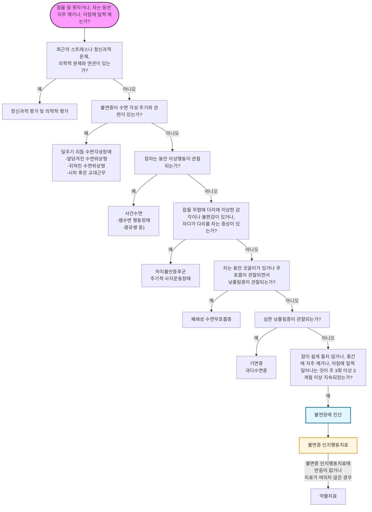

# 불면증 Insomnia, Sleep Disorder

## <mark style="color:green;">일반 사항</mark>

* 불면증의 핵심 병태생리 - 과각성 모델 (Hyperarousal model)
  * 불면증의 핵심 기전은 신경계 과각성(hyperarousal) 상태 : HPA axis 활성 증가, 교감신경 항진, 피질 각성 증가
  * Sleep effort paradox : 잠을 자려고 노력할수록 각성이 높아져 오히려 불면이 악화되는 역설적 현상; CBT-I의 핵심 치료 대상
* 불면증과 정신 질환의 양방향 관계&#x20;
  * 불면증은 우울증·불안 장애의 '증상'인 동시에, 그 자체로 우울증과 불안 장애를 악화시키는 '독립적 위험 인자'임(양방향성, Bidirectional relationship)
  * 기저 정신 질환이 있는 환자에서 불면증을 별도로 평가·치료하는 것이 중요하며, 불면증 치료가 선행될 때 동반 정신 질환의 예후도 개선될 수 있음

### <mark style="color:orange;">Sleep disorder 분류 \[ICSD-3]</mark>

1. Insomnia : 적절한 수면 환경에도 불구하고 잠에 들기 어렵거나 잠을 유지하기 어렵거나 너무 일찍 깨어나며 이로 인하여 주간 기능에 지장이 발생함
   1. 수면 지연(sleep latency) : 젊은 성인에서 20분, 나이든 성인에서 30분 내 수면에 들지 못함
   2. 조기 기상(early morning awakening) : 원하는 시간보다 30분 이전에 기상
2. Sleep-related breathing disorders : 수면 중 비정상적인 호흡; central or obstructive sleep apnea syndrome, sleep-related hypoventilation disorder, sleep-related hypoxemia disorder
3. Central disorder of hypersomnolence : 다른 수면 이상에 의하지 않은 주간 졸림
4. Circadian rhythm sleep-wake disorders (= Shift work disorder, SWD)
   1. shift work schedule과 관련된 증상이 최소 1개월 이상 지속되는 수면 장애
   2. 자신의 수면 패턴에서 요구되는 sleep-wake 일정과 환경(생활) 사이의 불일치(예: 여행, 야간 작업)에 기인하여 주간의 과도한 졸림이나 불면증이 발생한 지속적 또는 재발성 수면 장애. 이로 인하여 일상생활에서 유의미한 장애 발생
5. 사건수면 (Parasomnia) : 잠이 드는 동안, 잠자는 중, 또는 잠에서 깨어나는 동안 원하지 않는 신체적 사건(행동) 또는 경험(지각, 감정, 꿈); 몽유병, 잠꼬대, 수면 중 신음, 악몽, 야경, 야뇨, 이갈이, 수면 행동
6. Sleep-related movement disorders : 수면을 방해하는 단순한, 입체적인 움직임(예: restless legs syndrome) (☞ [하지불안증후군](036_-restless-legs-syndrome.md))
7. Other sleep disorders

### <mark style="color:orange;">기간에 따른 분류</mark>

#### <mark style="color:$primary;">Short-term insomnia disorder</mark>

* ＜3개월 동안 주간 기능 장애 등의 유의미한 문제를 일으키는 수면 장애
* 다른 명칭 : adjustment insomnia, acute insomnia, stress-related insomnia, transient insomnia
* 일시적인 스트레스와 관련될 수 있으나 급성 통증, 슬픔, 또는 다른 스트레스 요인들이 수면 장애의 유일한 원인일 때는 불면증이라는 진단을 적용하지 않을 수 있음
* 스트레스가 해소되거나 스트레스에 적응하면 증상이 해소될 수 있음

#### <mark style="color:$primary;">Chronic insomnia disorder</mark>

* ≥3개월 동안 ≥3회/주 유의미한 문제를 일으키는 수면 장애
* 적절한 수면 기회가 주어졌음에도 불구하고 발생하는 것이 진단의 전제 조건 - 소음·빛 등 환경 요인에 의한 단순 수면 부족과 구별됨
* 여러 해에 걸쳐 수 주 동안 반복적으로 불면증이 발생하는 환자는 각각의 episode가 3개월 동안 지속되지 않더라도 만성 불면증으로 진단할 수 있음

#### <mark style="color:$primary;">Other insomnia disorder</mark>

* short-term 또는 chronic insomnia에 해당되지 않는 수면 장애

## <mark style="color:green;">원인 및 위험 인자</mark>

* 특발성(원인 불명)
* 불규칙 수면 : 교대 근무, 여행, 출장; 낮잠, 일찍 취침
* 나쁜 환경 : 밝은 조명, 소음
* 사회적 관계 장애, 낮은 사회 경제적 상태
* 사회심리적 스트레스 : 경제, 학업, 직장(예: 이직, 실직), 가정(예: 갈등, 별거)
* 고령(중년의 10%, ＞65세의 ⅓이 만성 불면증 유병), 여성(남성의 5배)
  * 연령 증가에 따른 수면 구조 변화 : 서파수면(slow-wave NREM) 및 렘수면 비율 감소 → 수면이 얕아지고 야간 각성 빈도↑, 아침 회복감↓
  * 중년기부터 10년마다 평균 27분씩 수면 시간 감소
  * 내부 일주기 시계 기능 저하 → 취침·기상 시간이 앞당겨지는 경향(앞당겨진 수면위상형)
  * 수면에 영향을 주는 동반 질환 증가, 다제약물 복용 증가
* 정신 질환 : 불안증, 우울증, 인격장애, 외상 후 스트레스장애
* 급만성 질환 : 하지 불안증, 수면무호흡증, 만성 통증, 골관절증, 심부전, 신부전, COPD, GERD, 갑상선항진증, 배뇨 장애, 과민대장증후군, 만성피로증후군, 뇌졸중, 파킨슨병, 치매, 악성 종양
* 약물 남용 : 다제약물, 알코올 남용, 카페인 과용, 약물 금단
* 약물 : 항우울제(예: SSRI, SNRI, bupropion), β-차단제/항진제, CCB, 이뇨제, 항간질제(예: lamotrigine, phenytoin), 항콜린제, 항암제, 교감 신경 흥분제(예: salbutamol, salmeterol, theophylline, pseudoephedrine), CNS 자극제(예: methylphenidate, dextroamphetamine, nicotine), NSAID, steroid, 경구 피임제, 갑상선 호르몬, atorvastatin, levodopa, quinidine

## <mark style="color:green;">임상 양상</mark>

**주간 기능 장애** (가장 흔하고 직접적인 증상)

* 주간 졸음, 피로, 활력 감소
* 집중력·기억력 장애, 작업 수행 능력 저하
* 사고 위험 증가

**심리·정서적 증상**

* 감정 이상, 과민, 긴장
* 불면에 대한 두려움 (수면 불안, 불면을 악화시키는 악순환)

**신체 증상**

* 두통, 소화 장애

**장기적 건강 위험** (만성 불면 시)

* 심혈관 질환(고혈압, 심근경색), 당뇨병 위험 증가

### <mark style="color:$danger;">🚩 Red Flags!</mark>

<mark style="color:$danger;">**즉각 이송/응급 평가**</mark> <mark style="color:$danger;">- 생명 위협 또는 즉각적 위해 가능성</mark>

* 자살 사고가 구체적이거나 자살 시도 직후인 경우 (✽불면증은 자살 위험의 독립적 위험 인자)
* 급성 섬망 또는 의식 변화 동반 (원인 질환 즉각 평가 필요)

<mark style="color:$warning;">**당일 의뢰 또는 긴급 평가**</mark>

* 자살 사고가 있으나 구체적 계획은 없는 경우
* 코골이 + 수면 중 무호흡 목격 + 주간 졸림 동반 → 폐쇄성 수면무호흡증 강력 의심&#x20;
* 갑작스러운 탈력 발작, 수면 마비, 입면 시 환각 동반 → 기면병 의심&#x20;
* 수면 중 격렬한 행동(소리 지름, 팔다리 움직임) → 렘수면 행동장애 의심, 파킨슨병 등 신경과적 질환 감별 필요
* 야간 흉통·호흡곤란 동반 불면 → 심부전·협심증·폐질환 가능성

<mark style="color:$info;">**외래 추적 / 추가 평가 계획**</mark> - 단독 시 즉각 위험 낮으나 경과 관찰 필요

* 치료에 반응하지 않는 경우 (CBT-I 및 2가지 이상 약제 충분한 용량·기간 사용 후에도 미호전)
* 동반 정신 질환(우울증, 불안증) 또는 신체 질환 조절 불량

## <mark style="color:green;">진단</mark>

* 다른 원인을 배제하여 진단
* 병력(예: 통증성 질환), 약물/음주 경력
* 수면 이력 : 수면/기상 시간, 근무/활동 시간, 불면 패턴(입면 지연, 유지 장애), 주간 졸음 여부
  * 수면 일지 작성 : 취침/기상/밤중 각성 시간, 야간 배뇨 시간/배뇨량, 수면 환경, 낮잠, 음주, 스트레스, 기분
* 실험실 검사 : CBC, 빈혈 검사, TSH, 간/신장 기능, CRP, Vit B12, urine toxicology
* ECG; EEG, CT/MRI, circadian markers(melatonin, 체온)는 routine 검사가 아니며 특정 원인 질환 의심 시에만 시행
* 수면다원검사 : 치료 실패, 주간 졸음 위험 직업군(예: 직업 운전자)에서 고려

#### <mark style="color:$primary;">주간 졸림증 자가 진단 - Epworth Sleepiness Scale (ESS)</mark>

([대한수면연구학회](https://www.sleepnet.or.kr/))

* 아래 8가지 상황들에서 당신은 어느 정도나 졸음을 느끼십니까?
* 배점 : 전혀 졸지 않는다(0점), 가끔 졸음에 빠진다(1점), 종종 졸음에 빠진다(2점), 자주 졸음에 빠진다(3점)
  1. 앉아서 책을 읽을 때
  2. 텔레비젼을 볼 때
  3. 극장이나 회의석상과 같은 공공 장소에서 가만히 앉아있을 때
  4. 오후 휴식 시간에 편안히 누워 있을 때
  5. 앉아서 누군가에게 말을 하고 있을 때
  6. 점심 식사 후 조용히 앉아 있을 때
  7. 차 안에 승객으로 앉아 있을 때
  8. 차를 운전하고 가다가 교통 체증으로 몇 분간 멈추었을 때
* 판정 : ＜10점 정상, 10\~12점 경증, 13\~15점 중등증, ≥16점 중증 주간 졸림증

#### <mark style="color:$primary;">불면증 심각도 지수 (Insomnia Severity Index, ISI)</mark>

([대한수면연구학회](https://www.sleepnet.or.kr/))

1. 불면증에 관한 아래 3가지 항목에 대하여 당신은 현재(최근 2주간) 어떤 상태인가요?
   1. 잠들기 어렵다.
   2. 잠을 유지하기 어렵다.
   3. 쉽게 깬다.
   * 배점 : 없음(0점), 약간(1점), 중간(2점), 심함(3점), 매우 심함(4점)
2. 현재 수면 양상에 관하여 얼마나 만족하고 있습니까?
   * 매우 만족(0점), 약간 만족(1점), 그저 그렇다(2점), 약간 불만족(3점), 매우 불만족(4점)
3. 당신의 수면 장애가 어느 정도나 당신의 낮 활동을 방해한다고 생각합니까? (예. 낮에 피곤함, 직장이나 가사에 일하는 능력, 집중력, 기억력, 기분 등)
   * 전혀(0점), 약간(1점), 다소(2점), 상당히(3점), 매우 많이(4점)
4. 불면증으로 인한 장애가 당신의 삶의 질을 얼마나 손상시킨다고 생각합니까?
   * 전혀(0점), 약간(1점), 다소(2점), 상당히(3점), 매우 많이(4점)
5. 당신은 현재 불면증에 관하여 얼마나 걱정하고 있습니까?
   * 전혀(0점), 약간(1점), 다소(2점), 상당히(3점), 매우 많이(4점)

* 판정 : 0\~7점=유의할 만한 불면증 없음, 8\~14점=경증, 15\~21점=중등증, 22\~28점=중증 불면증

### <mark style="color:orange;">감별</mark>

#### <mark style="color:$primary;">일주기리듬 수면각성장애</mark>

* 수면각성 패턴 때문에 잠이 오지 않는 상황
* 뒤처진 수면위상형 : 늦게 잠이 들고 기상 시간이 늦어지는 수면-각성 주기 지연(예: 우울증)
* 앞당겨진 수면위상형&#x20;
  * 일찍 잠을 자고 새벽에 일찍 깨는 수면-각성 주기 앞당김
  * 고령자에서 특히 흔함 - 저녁 7\~9시에 졸리고 새벽 3\~5시에 기상하는 패턴
  * 늦게 취침해도 일찍 깨는 경향 유지
* 진단 : 수면 각성 주기 평가(예: 수면 일지, 활동기록계)
* 치료 : 저녁 광치료(취침 시간 지연 효과), melatonin; 수면제에 잘 반응하지 않음

#### <mark style="color:$primary;">폐쇄성 수면무호흡증</mark>

* 잠은 쉽게 들지만 수면 중 호흡이 멈추거나 얕아짐
* 수면 중 근육 긴장도가 감소하고 흡기 시 상기도 음압이 발생하여 기도 폐쇄, 산소 포화도 저하, 쉽게 각성(자주 깸), 낮졸림증 발생
* 위험 인자 : 남성, 고령, 비만, 음주, 흡연
*   진단 : 수면다원검사; 무호흡 저호흡 지수\*로 중증도 평가

    _\*Apnea-Hypopnea Index, AHI : 시간 당 무호흡이나 저호흡이 최소 10초 이상 되는 횟수_
* 고령자 특이사항 : 치매 동반 요양원 입소 노인에서 특히 흔함; 심부전·심근경색·뇌졸중의 독립적 위험 인자
* 치료 : 수술, 구강 내 장치, 지속적 상기도 양압술(CPAP)
* benzodiazepine 사용 시 무호흡이 심해질 수 있음

#### <mark style="color:$primary;">하지불안증후군 및 주기성 사지운동장애</mark>

* 하지불안증후군 : 다리에 불편하고 불쾌한 느낌으로 인해 다리를 움직이고 싶은 충동이 생겨 잠을 잘 이루지 못함; 밤, 누워있거나 쉴 때 발생 (☞ [하지불안증후군](036_-restless-legs-syndrome.md))
* 주기성 사지운동장애 : 수면을 취하는 동안 다리를 툭 터는 행동 반복 (시간당 15회 이상)
* 고령자 특이사항 : 두 질환 모두 연령 증가에 따라 유병률이 약 2배 증가; 고령자에서 다른 약물 또는 동반 질환으로 치료가 복잡해질 수 있음
* 원인 : 유전, 철분 대사 이상, 도파민 기능 이상; 도파민 농도를 저하시킬 수 있는 항정신병제/항우울제, 철분 결핍을 일으킬 수 있는 빈혈/출혈/임신/출산/만성 신부전
* 치료 : 원인 질환 치료, clonazepam, dopamine 작용제

#### <mark style="color:$primary;">사건수면</mark>

* 깊은 잠을 자고 있는 상태로, 다른 사람이 말을 거는 것에 대해 적절한 반응을 보이지 않음
* 수면 중 첫 ⅓ 시점에서 많이 발생
* 렘수면 각성장애&#x20;
  * 렘수면 행동장애(렘수면 중 근육 긴장도가 유지되어 꿈 내용을 실제로 행동 함)
  * 특발성, 신경과적 질환(예: 파킨슨병, 루이소체 치매) 관련&#x20;
  * 렘수면 행동장애는 파킨슨병의 가장 강력한 전구 증상 지표 중 하나로, 수년 후 파킨슨병 발병 가능성이 있으므로 의뢰 고려 (☞ [파킨슨병 전구 증상](035_-parkinsons-disease.md#전구-증상))
* 비렘수면 각성장애&#x20;
  * 야경증 : 자다가 소리를 지르고 울면서 깨는 행동을 반복
  * 수면보행증 : 수면 중 갑자기 일어나서 걸어다니는 행동을 반복
* 진단 : 병력, 수면 다원 검사
* 치료&#x20;
  * 아동기 비렘수면 각성장애는 특별한 치료를 요하지 않을수 있음
  * 렘수면 행동장애는 손상을 방지하기 위하여 clonazepam 또는 melatonin을 사용할 수 있음

#### <mark style="color:$primary;">기면병 및 특발성 과다수면증</mark>

* 기면병 : 낮졸림증, 탈력 발작, 수면 마비, 입면 시 환각; 각성을 유지하게 해 주는 신경 펩타이드인 orexin/hypocretin 농도 감소와 관련; 평균 수면 잠복기 8분 이내, sleep-onset REM periods(SOREMp) 2회 이상 관찰 시 진단
* 특발성 과수면증 : 낮졸림증은 심하지만 기면병의 진단 기준을 충족하지 못함
* 치료 : 행동 요법(잘 수 있을 때 잠을 잠), 각성제(예: modafinil); 탈력 발작에 대하여 항우울제(예: TCA, venlafaxine); 불면증이 심하지 않으면 불면증에 대한 약물 치료는 필요 없음

***



<p align="center"><strong>불면증 진단 및 치료 흐름도</strong></p>

<p align="center"><em>대한신경정신의학회. 한국판 불면증 임상진료지침 2019. 그림 4.</em></p>

***

## <mark style="background-color:$warning;">Management</mark>

### <mark style="color:orange;">치료 방침</mark>

* (특히 다제약물 복용 환자) 진료 시 수면 장애 확인 (✽수면 장애 환자의 ＜⅓만 의사와 의논함)
* 원인 제거, 기저 질환 치료, 수면 환경 개선 등 생활 요법 중재, 정신 요법, 약물 치료
  * 약물 치료는 남용, 내성, 중독 가능성이 있으므로 주의

> **Short sleeper vs Insomnia** (치료 전 감별 필수)
>
> * Short sleeper : 수면 시간이 짧아도 주간 기능 정상 → 치료 불필요; 과치료 주의
> * Insomnia : 수면 문제 + 주간 기능 장애 동반 → 치료 대상
> * 야간 저산소증이 있는 만성 폐질환 또는 수면무호흡증 환자는 의뢰

### <mark style="color:orange;">불면증 1차 치료 Step</mark>

**Step 1.** Red flag 확인

**Step 2.** 2차 원인 평가 및 다른 질환 감별(OSA·사건수면·하지불안·기면증 등)

  _✽ Step 1 & 2 는_ "진단-불면증 진단 및 치료 흐름도" _참조_

**Step 3. Insomnia phenotype 분류**

* 잠들기까지 30분 이상 → 소요 입면 장애
* 야간 각성 잦음, 새벽 조기 기상 → 유지 장애
* 입면 + 유지 장애 동반 → 혼합형

**Step 4. 기본 치료 - 모든 환자에게 적용**

* CBT-I (± dCBT-I) - 경증\~중등도는 약물 없이 단독 시행
* 수면 위생 교육
* 수면 일지 작성

**Step 5. 약물 치료 필요성 판단**

* 경증 → 비약물 치료 유지
* 중등도 이상(ISI ≥15) 또는 CBT-I 접근 어려운 경우 → STEP 6으로

**Step 6. 환자 특성 확인** (약물 선택 전 필수)

* ≥65세 또는 낙상 위험 → BZD·Z-drug 원칙적 회피
* OSA 동반 또는 의심 → BZD 금기
* 우울·불안 동반 → 항우울제 계열 우선 고려
* 교대근무·circadian 장애 → melatonin + 광치료

**Step 7. 약물 선택** → **약물 선택 요약**&#x20;

**Step 8. 재평가** (2\~4주 후)

* 호전 → 감량 계획 수립 (25%씩 tapering)
* 미호전 → 약물 변경 또는 병합, 전문과 의뢰 고려

**※ 약물 선택 요약 (Decision Guide)**

<table><thead><tr><th width="161">상황</th><th>우선 선택</th><th>대안</th></tr></thead><tbody><tr><td>입면 장애 (일반)</td><td><a href="029_-insomnia-sleep-disorder.md#z-class-drugs">Z-drug</a> (zolpidem, zaleplon)</td><td>DORA, eszopiclone</td></tr><tr><td>유지 장애</td><td><a href="029_-insomnia-sleep-disorder.md#orexin-dual-orexin-receptor-antagonist-dora">DORA</a>, doxepin 3~6 ㎎</td><td>zolpidem CR, eszopiclone</td></tr><tr><td>혼합형</td><td>DORA</td><td>eszopiclone, zolpidem CR</td></tr><tr><td>고령자</td><td>DORA, doxepin 3 ㎎, ramelteon</td><td>Z-drug 최저 용량 (단기)</td></tr><tr><td>OSA 동반</td><td>DORA, ramelteon</td><td>BZD·Z-drug 회피</td></tr><tr><td>우울증 동반</td><td>mirtazapine</td><td>trazodone (보조적)</td></tr><tr><td>일주기리듬 장애</td><td>melatonin + 광치료</td><td>—</td></tr></tbody></table>

⚠️ 고령자·낙상 위험 → BZD/Z-drug 원칙적 회피\
⚠️ 자살 위험 → Z-drug 신중 사용\
⚠️ OSA(폐쇄성 수면 무호흡증) 의심 → BZD 사용 금지

***

### <mark style="color:orange;">고령자 Insomnia Protocol</mark>

**Step 1. 핵심 원칙**

1. CBT-I = 1차 치료 (약물보다 우선)
2. 약물은 최소화
3. 낙상·인지저하 위험을 모든 약물 결정의 최우선 기준으로 적용

**Step 2. 반드시 먼저 확인**

* 다제약물 복용 여부 (수면에 영향을 주는 약물 점검)
* Nocturia - 원인 질환(전립선비대증, 과민성방광, 심부전, 당뇨) 평가와 치료 병행; 저녁 수분 섭취 제한, 취침 전 배뇨 습관화
* OSA - 동반 시 BZD 금기
* 치매·섬망 위험 - 항콜린성 약물·BZD 특히 주의

**Step 3. 비약물 치료** (모든 고령 환자에게 우선 적용)

* 기상 시간 고정 (취침 시간보다 기상 시간 일정화가 더 중요)
* 낮잠 ≤30분, 오후 3시 이전
* 저녁 광 노출↑ (circadian advance 교정 — 취침 시간 지연 효과)
* Sleep compression 권장 : 수면 제한법 대신 침대 시간을 수 주에 걸쳐 서서히 단축
* 수면 압력 증가 전략 (낮잠 줄이기, 기상 시간 고정)

**Step 4. 약물 선택 우선 순위**

* **1차 (권장)**
  * DORA - lemborexant 5 ㎎, suvorexant 10 ㎎
  * doxepin 3 ㎎ (유지 장애)
  * ramelteon 8 ㎎ (입면 장애, 의존·낙상 위험 없음)
* **2차 (단기·제한적)**
  * Z-drug 최저 용량 (zolpidem 5 ㎎) - 불가피한 경우만, 최단 기간
* **금기·회피**
  * benzodiazepine (낙상·섬망·인지저하 위험)
  * 항히스타민제 (anticholinergic burden)
  * 항정신병제 (불면 단독 목적)

**Step 5. 용량 전략 - "Start low, go slow"**

* lemborexant 5 ㎎ → 반응 부족 시 10 ㎎
* doxepin 3 ㎎ → 반응 부족 시 6 ㎎
* zolpidem (불가피 시) 5 ㎎ 고정, 증량 원칙적 금지

**Step 6. 중단 전략**

* 안정화 후 2\~4주부터 감량 시작
* 25%씩 단계적 감량
* 중단 전 rebound insomnia 반드시 설명

**※ 고령자 특이 포인트**

* Nocturia 교정 : 수면 개선의 핵심→ 수면 치료보다 야뇨증을 먼저 해결
* Circadian advance (이른 취침·이른 기상) → 저녁 광 치료로 교정
* 수면 시간 감소는 정상적 노화임. 총 수면 시간만으로 과잉치료 주의; 주간 기능 장애 유무로 판단

## <mark style="color:green;">비-약물 치료</mark>

### <mark style="color:orange;">인지행동치료 (CBT-I, Cognitive Behavioral Therapy for Insomnia)</mark>

만성 불면증의 1차 치료로 강력 권고됨 \[AASM 2021 Strong recommendation]; 단기 효과는 약물과 유사하나 장기 효과 및 안전성에서 우수하며 치료 종결 후에도 효과가 지속됨

* 경증\~중등증 불면증에서는 약물 없이 CBT-I (또는 dCBT-I) 단독 치료를 우선 권장
* 일반적으로 4\~8주, 주 1회 세션으로 구성; 수면 일기 작성 필수
* 초기 부작용 : 수면 제한 단계에서 일시적 주간 졸림·피로·과민성·집중력 저하가 나타날 수 있으나 대부분 1\~2주 내 호전
* CBT-I의 6가지 구성 요소
  * 수면 위생 교육 (Sleep hygiene education) - 단독으로는 효과 불충분, 반드시 다른 구성 요소와 병행
  * 자극 조절 (Stimulus control)
  * 수면 제한 (Sleep restriction)
  * 이완 요법 (Relaxation technique)
  * 인지 재구성 (Cognitive restructuring)
  * 수면 일기 (Sleep diary) 및 재발 방지 교육

**단축형 CBT-I (Brief therapies for insomnia, BBT-I)**

* AASM 2021 Conditional recommendation; 1\~4회 세션으로 구성된 축약형 CBT-I
* 정신건강 전문가 접근이 어려운 1차 의료 환경에서 활용도 높음

**디지털 CBT-I (dCBT-I)**

* 앱·웹 기반 CBT-I; 1차 진료에서 접근성 낮은 환경의 효과적 대안
* 국내 식약처 허가 디지털 치료기기 (DTx)
  * <mark style="color:blue;">솜즈</mark> (Somzz, 에임메드) : 국내 1호 DTx, 2023년 2월 허가, 6\~9주 프로그램
  * <mark style="color:blue;">웰트-아이</mark> (WELT-I, 웰트/한독) : 국내 2호 DTx, 2023년 4월 허가, 8주 프로그램
* 처방 대상 : 만 19세 이상, 만성 불면증(3개월 이상, 주 3회 이상 증상)으로 진단된 환자
* 처방 절차 : 의사가 처방 코드 발행 → 환자 앱 설치 → 6\~9주 CBT-I 과정 수행
* 비용 및 급여
  * 1주기 약 20\~25만원 수준 (혁신의료기술로 임시 등재, 비급여 또는 선별 급여(본인 부담률 90%) 형태 운영)
  * 급여 적용 방식은 기관·시기에 따라 차이가 있을 수 있으므로 처방 전 확인 필요
* 처방 시 혁신의료기술 동의서 작성 및 앱 설치 안내 절차 필요
* 사용 금기 (수면 제한 요법 포함으로 인한 졸음 위험)
  * 장거리 운전기사, 항공교통관제사, 중장비·기계 조작자, 일부 조립라인 작업자 등 졸음으로 심각한 사고가 발생할 수 있는 직업군
  * 조절되지 않은 양극성장애, 경련성 질환

#### <mark style="color:$primary;">1. 수면 위생 (Sleep hygiene)</mark>

 ※ 단독 치료로는 효과 불충분; 반드시 CBT-I의 다른 구성요소와 병행

* 잠자리에 누워있는 시간을 실제 필요한 수면 시간으로 제한; 침대에 누워 있는 시간이 너무 길면 얕게 자고 자주 깨게 됨
* 매일 일정한 시간에 기상 (주말 포함, 평소 기상 시간 ±1시간 이내)
* 매일 적당량의 운동을 지속하되, 격렬한 운동은 취침 3\~4시간 이내 회피 (운동 후 심부 체온 상승이 입면을 방해하며, 반대로 심부 체온이 하강할 때 졸음이 유발됨)
* 침실 환경 : 어둡고, 조용하고, 서늘하게 (18\~20℃ 권장)
* 배가 고프지 않게 함; 필요시 우유나 가벼운 스낵 등 간단한 음식 섭취; 취침 직전 과식은 회피
* 필요시 간헐적/단기간 수면제 사용; 정기적/장기간 수면제 사용은 피함
* 취침 6시간 이내 카페인 섭취 회피 (커피, 차, 콜라, 에너지 음료, 일부 진통제)
* 술에 의존하지 않음; 술은 잠을 빠르게 들게 할 수 있지만 자주 깨게 하고 수면 후반부 각성을 유발하며, 수면무호흡증 악화·코골이 유발 위험
* 잠자리에서 스마트폰·TV·태블릿 사용 회피 (청색광 노출이 일주기 리듬 교란)
* 잠 자려고 너무 애 쓰지 않음; 잠이 오지 않을 때는 적당한 조명 하에 책을 보거나 음악을 들음

#### <mark style="color:$primary;">2. 자극 조절 (Stimulus control therapy)</mark>

 ※ 침대-각성 연합을 끊고 침대-수면 연합을 강화

* 졸릴 때에만 잠자리에 누움
* 잠이 오지 않으면 약 20분 후 (또는 잠이 오지 않는다고 느끼면 즉시) 침대에서 일어남; 시계를 보지 말 것
* 거실에 앉아서 스탠드만 켜 놓고 책이나 음악을 들음 (TV·스마트폰은 회피)
* 졸리면 다시 잠자리로 들어가서 잠을 청함
* 위 과정을 잠들 때까지 반복
* 기상 시간을 일정하게 유지
* 잠자리는 잠을 자는 용도로만 사용 (성생활 제외); 침대에서 독서·식사·업무·TV 시청 회피
* 낮잠은 피하며, 필요시 오후 3시 이전 30분 이내로만 잠

#### <mark style="color:$primary;">3. 수면 제한법 (Sleep restriction therapy)</mark>

 ※ 침대에 머무르는 시간을 실제 수면 시간에 가깝게 제한하여 수면 압력을 높이는 치료법

* 수면 일기를 1\~2주간 작성하여 평균 실제 수면 시간 (TST) 산출
* 원하는 기상 시간을 정함
* 산출된 평균 수면 시간만큼만 잠자리에 머무르도록 취침 시간을 정함 (단, 최소 5\~5.5시간 이상은 보장)
* 수면 효율 = 실제 수면 시간 / 잠자리에 누워 있던 시간 × 100
* 수면 효율이 85% 미만이면 잠자리에 누워 있는 시간을 15분씩 줄임
* 수면 효율이 90% 이상에 도달하면 잠자리에 누워 있는 시간을 15분씩 늘림

**주의 / 금기**

* 고위험 직업군 : 장거리 운전기사, 항공교통관제사, 중장비·기계 조작자 등 - 초기 졸림으로 사고 위험
* 조증·양극성장애 병력 : 수면 박탈이 조증/경조증을 유발할 수 있음
* 경련성 질환·뇌전증 : 수면 박탈이 발작 역치를 낮춤
* 고령자 : 주간 졸림 악화 및 순응도 저하 우려; 침대 시간을 급격히 줄이지 않고 수 주에 걸쳐 서서히 단축하는 수면 압축 (sleep compression) 이 더 현실적인 대안

#### <mark style="color:$primary;">4. 이완 요법 (Relaxation technique)</mark>

 ※ 복식호흡, 점진적 근이완, 명상, 자율훈련법 등이 포함됨

**복식호흡법**

1. 편안한 자세로 눕거나 앉아서 두 눈을 감음
2. 왼쪽 손은 배 위에, 오른쪽 손은 가슴에 올려놓음
3. 약 5초간 코로 천천히, 가능한 한 깊게 숨을 들이쉬면서 배를 최대한 내밈 (가슴이 움직이지 않도록 함)
4. 숨을 최대한 들이마신 상태에서 1초 정도 숨을 멈춤
5. 약 5초간 천천히 숨을 끝까지 내쉼
6. 한 번 시행 시 5분간, 하루 중에 자주 시행

#### <mark style="color:$primary;">5. 인지 재구성 (Cognitive restructuring) — CBT-I 구성요소</mark>

 ※ 수면에 대한 역기능적 사고를 식별하고 수정 (단독 치료로는 근거 부족, 반드시 CBT-I 일부로 시행)

**수면에 대한 역기능적인 생각 (예시)**

* "하루에 8시간은 자야 한다."
* "부족한 잠은 어떻게 해서든지 보충해야 한다."
* "잠을 잘 못 자면 건강을 해칠까 걱정된다."
* "잠을 잘 못 자면 이튿날 생활을 망치게 될 것이다."
* "잠을 영영 통제하지 못하게 될 것이다."

**부정적인 정서 반응 및 수면 습관**

* 수면에 대해 지나치게 걱정하고 집착함
* 잠 잘 시간이 다가오거나 침대에 누우면 오히려 각성됨
* 잠이 오지 않는데도 미리 누워서 자려고 애씀

**인지 재구성 전략**

* 비현실적 기대 수정 : "8시간 신화"에서 벗어나기 - 개인별 적정 수면 시간은 다름
* 파국적 사고 점검 : "하루 못 잤다고 다음 날 모든 일이 망가지지는 않는다"
* 수면에 대한 통제 욕구 완화 : "잠은 애쓴다고 오는 것이 아니다"

#### <mark style="color:$primary;">6. 수면일기</mark>

 ※ 수면일기는 불면증 인지행동치료(CBT-I)의 핵심 도구로, 환자의 수면 패턴을 객관화하고 수면제한요법의 처방 근거를 제공함. 최소 1\~2주 연속 기록을 권장

**작성 요령**

* 매일 아침 기상 직후 작성 (전날 밤 기억이 가장 정확할 때)
* 정확한 분 단위보다 경향성 파악이 목적임; 시계를 자주 확인하지 말고 대략적인 추정치로 기록

#### 수면일기 양식

<table><thead><tr><th>항목</th><th width="72">월( / )</th><th width="72">화( / )</th><th width="72">수( / )</th><th width="72">목( / )</th><th width="72">금( / )</th><th width="72">토( / )</th><th width="72">일( / )</th></tr></thead><tbody><tr><td>⓵ 전날 낮잠 (시각/분)</td><td></td><td></td><td></td><td></td><td></td><td></td><td></td></tr><tr><td>⓶ 카페인 섭취 (시각/양)</td><td></td><td></td><td></td><td></td><td></td><td></td><td></td></tr><tr><td>⓷ 음주 (시각/양)</td><td></td><td></td><td></td><td></td><td></td><td></td><td></td></tr><tr><td>⓸ 수면제 복용 (약명/시각)</td><td></td><td></td><td></td><td></td><td></td><td></td><td></td></tr><tr><td>⓹ 잠자리에 누운 시각</td><td></td><td></td><td></td><td></td><td></td><td></td><td></td></tr><tr><td>⓺ 소등 시각 (잠 청한 시각)</td><td></td><td></td><td></td><td></td><td></td><td></td><td></td></tr><tr><td>⓻ 잠들기까지 걸린 시간 (분)</td><td></td><td></td><td></td><td></td><td></td><td></td><td></td></tr><tr><td>⓼ 야간 각성 횟수 (회)</td><td></td><td></td><td></td><td></td><td></td><td></td><td></td></tr><tr><td>⓽ 야간 각성 총 시간 (분)</td><td></td><td></td><td></td><td></td><td></td><td></td><td></td></tr><tr><td>⑩ 최종 기상 시각</td><td></td><td></td><td></td><td></td><td></td><td></td><td></td></tr><tr><td>⑪ 잠자리에서 나온 시각</td><td></td><td></td><td></td><td></td><td></td><td></td><td></td></tr><tr><td>⑫ 총 수면시간 (시간)</td><td></td><td></td><td></td><td></td><td></td><td></td><td></td></tr><tr><td>⑬ 수면의 질 (1~5점)</td><td></td><td></td><td></td><td></td><td></td><td></td><td></td></tr><tr><td>⑭ 낮 동안 졸음/피로 (1~5점)</td><td></td><td></td><td></td><td></td><td></td><td></td><td></td></tr><tr><td>⑮ 특이사항 (스트레스, 운동 등)</td><td></td><td></td><td></td><td></td><td></td><td></td><td></td></tr></tbody></table>

> **수면의 질 척도**: 1점(매우 나쁨) · 2점(나쁨) · 3점(보통) · 4점(좋음) · 5점(매우 좋음)

**주간 수면 지표 계산**

 ※ 일주일 기록이 모이면 아래 지표를 계산

| 지표               | 계산식               | 정상 기준 |
| ---------------- | ----------------- | ----- |
| 총 수면시간 (TST)     | ⑩ − ⓺ − ⓻ − ⓽     | 개인차   |
| 침상 시간 (TIB)      | ⑪ − ⓹             | —     |
| 수면효율 (SE, %)     | (TST ÷ TIB) × 100 | ≥ 85% |
| 입면 잠복기 (SOL)     | ⓻                 | < 30분 |
| 입면 후 각성시간 (WASO) | ⓽                 | < 30분 |

> **수면효율이 85% 미만이면** 수면제한요법(Sleep restriction therapy)의 적응 대상. 평균 TST를 기준으로 침상 시간을 제한하고, 주 단위로 재평가하여 SE ≥85% 도달 시 15\~30분씩 침상 시간을 늘려 나감

***

### <mark style="color:orange;">그 외 치료법</mark>

CBT-I와는 별개의 비약물 치료법으로, 만성 불면증 단독 치료로서의 근거는 제한적이나 특정 적응증이나 보조 치료로 활용될 수 있음

#### <mark style="color:$primary;">광 치료 (Bright light therapy)</mark>

 ※ 만성 불면증 단독 치료 근거는 제한적 (AASM 2021 권고 항목에 미포함).\
  일주기 리듬 관련 수면장애에서는 1차 치료에 준하는 효과; CBT-I와 병행 가능

**적응증**

* 일주기 리듬 수면-각성장애 (지연수면위상장애, 진행수면위상장애, 시차증, 교대근무장애)
* 계절성 정동장애 동반 불면
* 고령자에서 일주기 리듬 약화로 인한 수면 분절

**처방**

* 2,000\~10,000 lux, 30분\~2시간, 매일 규칙적으로 시행
* 시행 방법 : 10,000 lux 기준 광원에서 약 40\~60 cm 거리에 위치; 광원을 직접 응시하지 말고 시야 내에 두며, 독서·식사 등 다른 활동과 병행 가능
* 시행 시간- 적응증에 따라 다름
  * 지연수면위상장애·계절성 정동장애 : 아침 기상 직후
  * 진행수면위상장애 : 저녁 시간
* UV 필터된 광치료기 사용 (UV는 광독성 위험으로 차단 필요)

**부작용**

* 안구건조증, 안구 충혈감, 두통, 안구 피로
* 불안, 초조감, 불면 악화 (저녁 시행 시)

**주의 / 금기**

* 양극성장애 : 조증/경조증 유발 위험 (특히 아침 광치료); 시행 시 기분안정제 병용 및 모니터링 필요
* 망막 질환 (황반변성, 당뇨망막병증 등) : 광독성 위험; 시행 전 안과 평가 권장
* 백내장 수술 후, LASIK 수술 후 : 안과 전문의 상의 후 결정
* 광민감성 약물 복용자 : 아래 약물 복용 중이면 광치료 시행 전 대체 가능성 검토
  * 항생제 : tetracycline 계열 (doxycycline 등), fluoroquinolone 계열 (ciprofloxacin 등), sulfonamide 계열
  * 항말라리아제 : chloroquine, hydroxychloroquine
  * 심혈관계 약물 : amiodarone, thiazide 이뇨제
  * NSAIDs : piroxicam, ketoprofen 등
  * 정신과 약물 : 일부 항정신병약 (phenothiazine 계열), 일부 TCA·SSRI
  * 기타 : St. John's Wort (Hypericum perforatum), retinoid 제제

#### <mark style="color:$primary;">기타</mark>&#x20;

**마음챙김 기반 치료 (Mindfulness-Based Therapy for Insomnia, MBTI)**

* 임상 활용 증가 추세이나 AASM 2021은 단독 치료로는 권고되지 않음
* 수면에 대한 과도한 집착·각성 완화에 도움이 될 수 있음

**역설적 의도 (Paradoxical intention)**&#x20;

* 잠들지 않으려고 노력하여 수면 불안을 완화; 근거 부족으로 단독 치료로는 권고되지 않음

**바이오피드백 (Biofeedback)**&#x20;

* 근거 부족으로 단독 치료로는 권고되지 않음

**집중 수면 재훈련 (Intensive sleep retraining)**&#x20;

* 단독 치료로는 권고되지 않음

## <mark style="color:green;">약물 치료</mark>

### <mark style="color:orange;">사용 원칙</mark>

* 최소 유효 용량 투여. 특히 고령에서는 저용량 투여 (☞ [수면작용제](../231_/213_-antidepressants-and-anxiolytics.md#undefined-7))
* 일시적 불면증에 대하여 단기 사용(최대 4\~5주)
* 매일 수면제를 복용하는 환자는 간헐적 사용을 유도
  * 일부 관찰연구에서 수면제 사용과 사망률 증가의 연관성이 보고되었으나, 인과관계는 확립되지 않았으며 기저 질환 중증도 등 교란 변수 가능성이 있음
* 복용 시간 : 취침 30분 전 복용; 복용 후 최소 7\~8시간 수면 시간 확보 (✽melatonin 계열 제외)
* 약물 투여 중단 시 반동 현상과 내성이 발생하지 않도록 tapering
  * Tapering 예시 : 2주 간격으로 기존 용량의 25%씩 감량 (예: zolpidem 10 mg → 7.5 mg → 5 mg → 2.5 mg → 중단); 금단 증상 발생 시 감량 속도를 늦추고 환자와 상의하여 조정
  * 반동 불면(rebound insomnia)은 반감기가 짧은 약제(예: triazolam, zaleplon)에서 더 흔함 — 중단 전 환자에게 반드시 설명
* 부작용 : 주간 졸음, 어지럼, 인지 장애, 내성, 반동 불면
  * 대처 방법 : 주간 졸음 발생 시 감량, 반감기가 짧은 약제 선택
* 투여 주의/제한 : 고령, 알코올 남용, 자살 시도 병력, 수면무호흡증, 간/신/폐질환자, 운전자, 밤에 깨어나서 해야 할 일이 있는 사람
* 고령자 주의&#x20;
  * BZD와 Z-drug은 [Beers Criteria](../231_/215_.md#beers-criteria)에서 고령자 부적절 약물로 분류 (낙상·골절·인지 저하·섬망 위험↑)
  * 불가피한 경우 최소 용량·최단 기간 사용
  * DORA 또는 doxepin 저용량이 상대적으로 안전

### <mark style="color:orange;">약물 종류</mark>

#### <mark style="color:$primary;">Orexin 수용체 길항제 (Dual Orexin Receptor Antagonist, DORA)</mark>

* 각성을 유지하는 orexin/hypocretin 신호를 차단하여 수면 유도; BZD·Z-drug과 달리 수면 구조(서파수면·렘수면) 보존
* 의존·남용 위험 낮음; BZD/Z-drug보다 호흡 억제 위험이 낮아 고령자 및 수면무호흡증 동반 환자에서 상대적으로 선호되나, 중등도 이상 OSA에서는 주의 필요
* 입면 및 수면 유지 장애 모두에 효과
* suvorexant <mark style="color:blue;">\[벨솜라]</mark> : 10\~20 ㎎ qd 취침 직전; 국내 허가·비급여
  * 부작용 : 다음날 졸림, 두통, 이상한 꿈; 강력한 CYP3A 억제제(예: clarithromycin, itraconazole) 병용 피할 것
* lemborexant <mark style="color:blue;">\[데이비고]</mark> : 5\~10 ㎎ qd 취침 직전; 국내 허가·비급여
  * 기존 약물에서 전환 시 이전 약물 서서히 감량 후 교체 권고
  * suvorexant보다 다음날 졸림 적다는 보고
  * 향정신성의약품(마약류) 지정 - 처방 시 마약류 관리 규정 적용 여부 확인 필요
* daridorexant <mark style="color:blue;">\[Quviviq]</mark> : 25\~50 ㎎ qd 취침 30분 이내; 국내 미도입 (2026년 현재)
  * 반감기가 약 8시간으로 적절하여, DORA 계열 중 다음날 잔류 졸림이 가장 적고 주간 기능 개선 효과가 임상적으로 입증됨
* 병용 금기 : 강력한 [CYP3A4 억제제](../231_/220_-caution_drugs.md#cyp3a4-억제제)(예: clarithromycin, itraconazole) 병용 시 혈중 농도 급격히 상승 - 병용 피하거나 감량; moderate CYP3A4 억제제(예: fluconazole, diltiazem)도 주의&#x20;

#### <mark style="color:$primary;">Benzodiazepine</mark>

* 수면 잠복기 감소, 총 수면 시간 연장, 수면 개시 후 각성(WASO) 감소, 수면 질 향상
* 단기(4주 이하) 사용; 장기 사용 시 수면 질 저하(deep sleep time 감소, 수면 구조 왜곡), 의존/금단 위험(금단 증상은 반감기가 짧은 약제에서 더 흔함)
* 부작용 : 다음날 낮졸림, 운동 실조, 어지럼증, 인지 저하, 섬망, 전향성 기억 상실(triazolam); 부작용과 약물 용량에 상관관계가 있음
* FDA 승인 약제 : estazolam, flurazepam <mark style="color:blue;">\[달마돔]</mark> (국내 유통 중단), temazepam (국내 미허가·유통 없음), triazolam <mark style="color:blue;">\[할시온]</mark>, quazepam

#### <mark style="color:$primary;">Z-class drugs</mark>

* non-benzodiazepine hypnotics(benzodiazepine receptor agonist의 일종); 수면 잠복기 감소, 총 수면 시간 증가, 수면 유지, 수면 질 개선
* FDA 승인 약제 : zolpidem <mark style="color:blue;">\[스틸녹스]</mark>, zaleplon <mark style="color:blue;">\[잘레딥]</mark>, zopiclone
* 부작용 : 두통, 어지럼증, 졸림; 사건 수면, 기억상실, 환각, 자살 행동과의 연관성 보고(인과관계 불명확), 내성/의존/금단
* 4\~5주 이하의 단기 사용 및 정기적 사용의 부작용을 감안하여 필요시(잠자리에 들었으나 잠이 잘 오지 않을 때) 복용 권고
* FDA 블랙박스 경고 : zolpidem 등 Z-drug은 수면 보행, 수면 운전, 수면 중 식사 등 복잡 수면 행동(complex sleep behaviors)과 관련되며, 이로 인한 심각한 손상 및 사망 사례가 보고됨. 이전에 이러한 사건 수면이 발생한 환자에게는 투여 금기

#### <mark style="color:$primary;">Melatonin</mark>

* 저녁 시간에 송과체에서 분비되는 호르몬
* 불면증 전반에서 효과 크기는 제한적이나, 고령자 및 일주기리듬 장애(DSPD, 시차 적응 등)에서는 임상적으로 유의한 효과가 보고됨; 연령 증가에 따라 melatonin 합성·농도가 감소하므로 고령자에서 우선 고려 가능
* 치료 반응률이 다른 수면제에 비하여 낮고, 효과가 즉각적이지 않음
* 최소 3주 이상 지속 복용; 3\~4주간 꾸준히 복용하면 66%에서 불면 증상 호전, 44%에서 기존 복용 수면제 용량 감량을 보였다는 보고가 있음
* 일반적인 수면제에 비하여 인지 저하, 낙상, 내성/의존/금단 등의 부작용이 적음
* 지속 방출형으로 ≥55세에서 수면 유지 장애에 고려; 속효성 제제는 권고 안 함
  * <mark style="color:$primary;">\[서카딘]</mark> : 지속 방출형(prolonged-release) 2 ㎎; 식약처 허가 의약품 (건강기능식품으로 유통되는 일반 멜라토닌(속효성, 비표준화 용량)과 구별됨). 일반 멜라토닌은 불면증 치료 근거 불충분
* 복용 시간 : 일반적으로 취침 1\~2시간 전 복용; 일주기리듬 장애에서는 개인 수면 위상에 따라 조정
* Ramelteon : melatonin 수용체 작용제; 수면 개시 장애, 고령 환자에서 고려

#### <mark style="color:$primary;">항우울제</mark>

* Doxepin : 입면 후 각성 시간, 총 수면 시간, 수면 효율 개선; 수면 유지 장애에 고려 <mark style="color:blue;">\[사일레노]</mark>
  * 부작용 : 설사, 낮졸림증, 두통; 낙상 위험이 상대적으로 적음
* Trazodone : 수면 개시 후 각성 시간(WASO), 총 수면 시간, 수면 효율, 서파 수면 증가; 25\~50 ㎎ <mark style="color:blue;">\[트리티코]</mark>
  * 불면증 단독 치료 목적의 1차 치료로는 권고되지 않음(AASM); 우울증 동반 시 선택적으로 사용
  * 부작용 : 두통, 기립저혈압; 남용 문제는 상대적으로 적음
* Mirtazapine : 수면 유도, 서파 수면 증가; 우울증 동반 불면증에 고려; 7.5\~30 ㎎ <mark style="color:blue;">\[레메론]</mark>
  * 부작용 : 과도한 진정, 식욕/체중 증가, 입마름

#### <mark style="color:$primary;">기타</mark>

* 항히스타민제, 항정신병제, L-tryptophan, phytotherapy(예: valerian), 향기 요법, 동종 요법, foot reflexology, 명상, 침, 뜸, 요가 : 증거 불충분, 권하지 않음
* 항히스타민제(예: diphenhydramine) : 특히 고령자에서 anticholinergic burden(인지 저하, 섬망, 변비, 요폐 등) 위험 - 사용 자제

### <mark style="color:orange;">권고 약제</mark>

_<mark style="color:$info;">Ref. AASM. Clinical Practice Guideline for the Pharmacologic Treatment of Chronic Insomnia in Adults. J Clin Sleep Med. 2017;13(2):307–349.</mark>_

#### <mark style="color:$primary;">입면 장애(Sleep onset insomnia)에 대한 권고 약제</mark>

<table data-full-width="false"><thead><tr><th width="128">성분명 [상품명]</th><th width="83.78948974609375" align="center">용량 (mg)</th><th width="83.78955078125" align="center">반감기 (hr)</th><th width="81.6842041015625" align="center">수면지연 단축</th><th width="76.842041015625" align="center">수면 질 향상</th><th width="191.381591796875">부작용</th></tr></thead><tbody><tr><td>eszopiclone<br><mark style="color:blue;">[조피스타]</mark></td><td align="center">2, 3</td><td align="center">4~6</td><td align="center">14분</td><td align="center">중~강</td><td>쓴맛(dysgeusia) — 장기 사용 시 순응도 저하 주요 원인; 경증 어지럼, 입마름, 두통</td></tr><tr><td>ramelteon¹⁾</td><td align="center">8</td><td align="center">2~5</td><td align="center">9분</td><td align="center">No</td><td>경증 피로, 두통, 현기증, 졸음</td></tr><tr><td>temazepam<br><em>(국내 미허가)</em></td><td align="center">15</td><td align="center">7~11</td><td align="center">37분</td><td align="center">약</td><td>경증 주간 졸음, 두통, 시각 장애, 혼돈, 우울</td></tr><tr><td>triazolam<br><mark style="color:blue;">[할시온]</mark></td><td align="center">0.25</td><td align="center">1.5~5.5</td><td align="center">9분</td><td align="center">중</td><td>speech disorder</td></tr><tr><td>zaleplon<br><mark style="color:blue;">[잘레딥]</mark></td><td align="center">5, 10</td><td align="center">1</td><td align="center">10분</td><td align="center">No</td><td>경증 두통, 졸음, 피로</td></tr><tr><td>zolpidem²⁾<br><mark style="color:blue;">[스틸녹스]</mark></td><td align="center">10</td><td align="center">2~3</td><td align="center">5~12분</td><td align="center">중</td><td>졸음, 경증기억상실, 어지럼, 두통, 구역, 불쾌한 맛</td></tr></tbody></table>

#### <mark style="color:$primary;">유지 장애(Sleep maintenance insomnia)에 대한 권고 약제</mark>

<table><thead><tr><th width="122.73681640625">성분명 [상품명]</th><th width="83.7894287109375" align="center">용량 (mg)</th><th width="83.78948974609375" align="center">반감기 (hr)</th><th width="98.5263671875" align="center">총 수면 시간 연장</th><th width="82.73681640625" align="center">수면 질 향상</th><th>부작용</th></tr></thead><tbody><tr><td>doxepin<br><mark style="color:blue;">[사일레노</mark>]</td><td align="center">3, 6</td><td align="center">8~24</td><td align="center">26~32분</td><td align="center">약~중</td><td>유의미한 부작용에 대한 증거 없음</td></tr><tr><td>eszopiclone<br><mark style="color:blue;">[조피스타]</mark></td><td align="center">2, 3</td><td align="center">4~6</td><td align="center">28~57분</td><td align="center">중~강</td><td>쓴맛(dysgeusia) — 장기 사용 시 순응도 저하 주요 원인; 경증 어지럼, 입마름, 두통</td></tr><tr><td>suvorexant*</td><td align="center">10, 20</td><td align="center">9~13</td><td align="center">10분</td><td align="center">no data</td><td>유의미한 부작용 없음</td></tr><tr><td>temazepam<br><em>(국내 미허가)</em></td><td align="center">15</td><td align="center">3.5~18</td><td align="center">99분</td><td align="center">약</td><td>경증 주간 졸음, 두통, 시각 장애, 혼돈, 우울</td></tr><tr><td>zolpidem<br><mark style="color:blue;">[스틸녹스]</mark></td><td align="center">10</td><td align="center">2~3</td><td align="center">29분</td><td align="center">중</td><td>졸음, 경증기억상실, 어지럼, 두통, 구역, 불쾌한 맛</td></tr></tbody></table>

#### <mark style="color:$primary;">기타</mark>

* benzodiazepine : 만성 사용 시 deep sleep time 감소, 수면 구조 왜곡 등 수면 질을 떨어뜨리고 의존 위험이 있어 제한
* 항히스타민제, 항정신병제, melatonin, L-tryptophan, phytotherapy(예: valerian), 향기 요법, 동종 요법, foot reflexology, 명상, 침, 뜸, 요가 : 증거 불충분, 권하지 않음

## <mark style="color:green;">Circadian rhythm sleep-wake disorders (Shift work disorder, SWD)</mark>

* 일반적 생활 요법 시행. 특히 취침 전 카페인이나 알코올 섭취 회피, 취침 전 소음/밝기 최소화
* bright light therapy
* chronotherapy : 원하는 수면 일정이 될 때까지 점차 수면 시간을 조정
  * 취침 및 기상 시간을 매일 3시간씩 늦춤. 예) 첫날 04시 취침/12시 기상 → 2일째 07시/15시 → 3일째 10시/18시 → 4일째 13시/21시 → 5일째 16시/0시 → 6일째 19시/03시 → 7\~13일째 22시/06시 → 14일째 23시/07시

#### <mark style="color:$primary;">수면 유도 약물</mark>

* 수면제는 수면 질을 향상시키지 못하며, 주간 졸음을 유발할 수 있고, SWD를 악화시킬 수 있음
* non-benzodiazepine hypnotics(예: zolpidem) : 필요시 단기 사용
* melatonin 3 ㎎ <mark style="color:blue;">\[서카딘]</mark>
  * ✽서카딘 허가 사항 : 비급여. 수면의 질이 저하된 55세 이상의 불면증 환자의 단기 치료

#### <mark style="color:$primary;">각성 약물</mark>

* modafinil : 100\~200 ㎎, shift 시작 60분 전 <mark style="color:blue;">\[프로비질]</mark>
* armodafinil : 150\~250 ㎎; 12\~16시간 작용 <mark style="color:blue;">\[누비질]</mark>
* 카페인 : 200 ㎎ 정도를 주간 작업 전 섭취

***

### <mark style="color:red;">질병코드</mark>

F51 비기질성 수면장애

G47 수면장애

***

## <mark style="color:purple;">처방례</mark>

> **처방례 1.** 입면 장애
>
> ```
> 스틸녹스 10 mg/T  1T  취침 시
> ※ 잠자리에 든 직후 복용; 복용 후 즉시 취침
> ※ 최대 4~5주 단기 사용; 매일 복용보다 필요 시(잠 못 드는 날) 간헐적 복용 권고
> ※ 고령자: 5 mg으로 감량
> ※ 복용 후 수면 보행, 기억 상실 등 사건 수면 발생 시 즉시 중단
> ```

> **처방례 2.** 수면 유지 장애
>
> ```
> 사일레노 6 mg/T  1T  취침 30분 전
> ※ 고령자·경증: 3 mg으로 시작
> ※ 낙상 위험 낮음 — 고령자에서 상대적으로 안전
> ※ 최소 7~8시간 수면 시간 확보 후 복용
> ```

> **처방례 3.** 입면·유지 장애 (DORA 선택)
>
> ```
> 데이비고 5 mg/T  1T  취침 직전
> ※ 필요 시 10 mg으로 증량
> ※ BZD·Z-drug 대비 수면 구조 보존, 의존 위험 낮음
> ※ 고령자·수면무호흡증 동반 시 우선 고려
> ※ CYP3A 억제제(예: 이트라코나졸, 클래리스로마이신) 병용 시 용량 조절
> ```


**데이비고(lemborexant) 급여 인정 조건**\
⓵ 만성 불면증(≥3개월) 진단이 확인된 성인 환자\
⓶ BZD·Z-drug 사용이 부적절하거나(고령자, 수면무호흡증, 낙상 위험 등) 기존 약물에 불충분한 반응을 보인 경우\
⓷ 타 수면제와 병용 시 급여 인정 안 됨\
✽정확한 급여 기준은 HIRA 고시를 반드시 확인할 것 (기준 변경 가능)


> **처방례 4.** 시차 적응 (Circadian rhythm 장애)
>
> ```
> 서카딘 2 mg/T  1T  취침 1~2시간 전  (비급여)
> ※ 허가 사항: 55세 이상 수면 질 저하 불면증 단기 치료
> ※ 최소 3주 이상 꾸준히 복용
> ※ 일주기리듬 장애(DSPD, 시차 적응)에서는 개인 수면 위상에 따라 복용 시간 조정
> ```

> **처방례 5.** 우울증 동반 불면증
>
> ```
> 레메론 15 mg/T  1T  hs
> ※ 수면 개선 효과 즉각적; 항우울 효과는 2~4주 소요
> ※ 졸림, 체중 증가 부작용 사전 설명
> ```

***

### <mark style="color:$success;">핵심 복약 지도</mark>

> **수면제 복용 안내**
>
> * 수면제는 **잠자리에 든 직후** 복용하고 즉시 취침하십시오. 복용 후 활동하면 기억 상실이나 이상 행동이 생길 수 있습니다.
> * 수면제는 **단기간(4\~5주 이내)** 사용을 원칙으로 합니다. 매일 복용하기보다 잠이 잘 오지 않는 날에만 필요한 만큼 복용하십시오.
> * 갑자기 중단하면 반동 불면(오히려 더 잠을 못 자는 현상)이 생길 수 있으므로, 중단할 때는 **담당 의사와 상의하여 서서히 줄여야** 합니다.
> * 복용 후 **술을 마시면 절대 안 됩니다.** 심한 호흡 억제나 기억 상실이 생길 수 있습니다.
> * 복용 다음날 졸림이 심하거나 운전·기계 조작을 해야 하는 경우 담당 의사와 상담하십시오.


**⚠️ 졸피뎀 등 Z-drug 계열 위험 행동 경고 (FDA Boxed Warning)**\
수면 보행(몽유병), 수면 중 운전, 수면 중 식사 등 **본인이 기억하지 못하는 복잡 수면 행동**이 발생한 경우 즉시 복용을 중단하고 내원하십시오. 이러한 행동은 심각한 사고 및 사망으로 이어질 수 있으며, 이전에 한 번이라도 이런 증상이 있었던 경우 이 약의 복용은 금기입니다.


> **언제 다시 병원을 방문해야 하나요?**
>
> * 수면 보행(자다가 일어나 돌아다님), 수면 중 기억하지 못하는 행동이 생기는 경우 — 즉시 내원
> * 4주 복용 후에도 증상이 전혀 나아지지 않는 경우
> * 코골이와 수면 중 숨막힘이 동반되는 경우 (수면무호흡증 의심)
> * 우울감·자살에 대한 생각이 드는 경우 — 즉시 내원 또는 **자살예방 상담전화 109**

***

### <mark style="color:blue;">환자 안내서</mark>


**불면증, 약보다 습관이 먼저입니다**

만성 불면증의 가장 효과적인 치료는 수면제가 아니라 인지행동치료(CBT-I)입니다. 수면 습관을 바꾸면 수면제 없이도 잠을 잘 수 있습니다.


#### <mark style="color:$primary;">좋은 수면을 위한 생활 수칙</mark>

* **매일 같은 시간에 기상하세요** : 잠드는 시간보다 기상 시간을 일정하게 유지하는 것이 수면 리듬을 잡는 데 더 중요합니다. 주말·여행 중에도 지키세요
* **침대는 잠자는 용도로만 사용하세요** : 침대에서 TV 시청, 스마트폰, 업무는 금물. 뇌가 침대를 각성 공간으로 인식하게 됩니다
* **잠이 올 때만 침대에 누우세요** : 잠이 오지 않으면 15분 후 일어나 은은한 조명 아래 독서나 음악을 듣고, 졸리면 다시 들어가세요
* **낮잠은 30분 이내로 제한하세요** : 오후 3시 이후 낮잠은 밤 수면을 방해합니다. 낮잠이 필요하면 오전 또는 이른 오후에 짧게 주무세요
* **카페인은 오후 2시 이후 피하세요** : 커피, 녹차, 에너지음료 모두 해당됩니다
* **저녁 음주는 피하세요** : 술은 일시적으로 잠을 빠르게 들게 하지만 수면 후반부에 자주 깨게 만듭니다
* **취침 전 전자 기기를 멀리하세요** : TV, 스마트폰, 컴퓨터의 블루라이트는 수면을 방해합니다
* **취침 3시간 이내 격렬한 운동은 피하세요** : 낮 동안의 규칙적인 운동은 수면에 도움이 됩니다

#### <mark style="color:$primary;">고령자를 위한 수면 안내</mark>

* **권장 수면 시간은 7시간 이상입니다** : 나이가 들면 잠이 줄어드는 것이 자연스럽지만, 7시간 이하면 낮에 피로하고 건강에 영향을 줄 수 있습니다
* **일찍 졸리고 새벽에 일찍 깨는 것은 노화에 따른 일주기 리듬 변화입니다** : 저녁에 밝은 빛(광치료)을 쬐면 취침 시간을 조금 늦추는 데 도움이 됩니다
* **코골이와 수면 중 숨막힘이 있다면 반드시 진료를 받으세요** : 수면무호흡증은 고령자에서 흔하며 심장·뇌 건강에 영향을 줍니다
* **밤중에 화장실을 자주 가신다면** : 저녁 식사 후 수분 섭취를 줄이고, 잠자리 들기 전 반드시 배뇨하세요. 야간 배뇨가 잦으면 전립선·방광 문제일 수 있으니 진료를 받아 보세요
* **수면제 복용 시 낙상에 주의하세요** : 특히 밤중에 화장실 갈 때 어지럼이 생길 수 있으므로 침대 옆 조명을 켜두고 천천히 일어나세요

#### <mark style="color:$primary;">수면제에 대해 알아두세요</mark>

* 수면제는 **단기 보조 수단**입니다. 장기 복용 시 효과가 줄고 의존성이 생길 수 있습니다
* **갑자기 끊지 마세요** : 반동 불면이 생길 수 있으므로 반드시 담당 의사와 상의하여 서서히 줄여야 합니다
* **음주와 절대 함께 복용하지 마세요**

#### <mark style="color:$primary;">이럴 때는 즉시 도움을 요청하세요</mark>

* 자다가 모르게 일어나 돌아다니거나 기억하지 못하는 행동을 하는 경우
* 코골이와 함께 수면 중 숨이 멈추는 것이 목격되는 경우 (수면무호흡증 가능성)
* 불면증과 함께 우울감·자살에 대한 생각이 드는 경우 - **자살예방 상담전화 109**

***

### <mark style="color:$primary;">수면일기, 왜/어떻게 써야 하나요?</mark>

"어젯밤에 한숨도 못 잤어요"라고 느끼시는 분들도 실제로 기록해 보면 생각보다 더 주무셨거나, 반대로 수면 패턴에 숨은 문제가 드러나는 경우가 많습니다. 수면일기는 **내 수면을 객관적으로 들여다보는 거울**입니다.

#### 이렇게 작성하세요

1. **아침에 일어나서 바로 쓰세요** 기억이 흐려지기 전이 가장 좋습니다. 5분이면 충분합니다.
2. **시계를 자꾸 보지 마세요** "지금 몇 시지?" 하고 시계를 확인할수록 잠은 더 달아납니다. **대략 짐작**으로 적으면 됩니다. "한 30분쯤 걸린 것 같다" 정도면 충분합니다.
3. **완벽하게 쓰려고 애쓰지 마세요** 수면일기가 또 다른 스트레스가 되면 안 됩니다. 빈칸이 있어도 괜찮습니다.
4. **최소 2주는 꾸준히** 하루 이틀 기록으로는 패턴이 보이지 않습니다. 2주 정도 모여야 의미 있는 분석이 가능합니다.

#### 기록할 때 이런 것들을 체크하세요

* 🛏️ **언제 누웠고, 언제 잠들었는지** (차이가 클수록 입면장애)
* ⏰ **밤중에 몇 번, 얼마나 깼는지**
* ☀️ **아침에 몇 시에 깼고, 몇 시에 일어났는지**
* ☕ **낮에 커피/차를 몇 잔 드셨는지** (오후 2시 이후 카페인은 수면 방해)
* 🍷 **술을 드셨는지** (음주는 잠들기엔 쉬워도 수면의 질을 나쁘게 함)
* 😴 **낮잠을 주무셨는지** (30분 이상 낮잠은 밤잠을 방해)

#### 자주 묻는 질문

**Q. 밤중에 깬 시간을 어떻게 재나요?** A. 정확히 재실 필요 없습니다. "잠깐 깼다"(5분 이내), "한참 뒤척였다"(30분 이상) 정도로 적으시면 됩니다.

**Q. 주말은 쉬고 싶은데요.** A. 주말도 꼭 기록해 주세요. 주중과 주말의 차이가 치료에 중요한 단서가 됩니다.

**Q. 수면일기를 쓰니까 오히려 수면에 더 신경 쓰여서 잠이 안 와요.** A. 흔한 반응입니다. **아침에만** 간단히 적고, 밤에는 잊으세요. 시간이 지나면 습관이 되어 부담이 줄어듭니다.

#### 다음 진료 때 가져오세요

기록하신 수면일기를 **다음 진료 시 꼭 지참**해 주세요. 주치의와 함께 패턴을 분석하여 치료 방향을 결정합니다.
