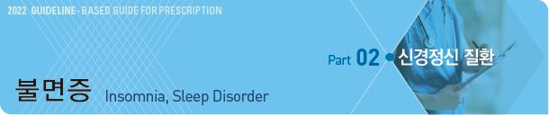
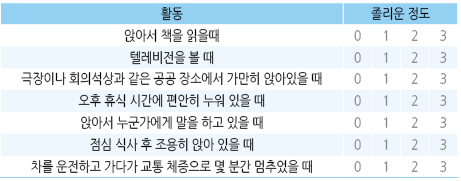
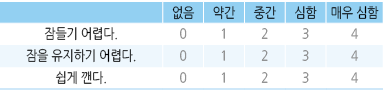
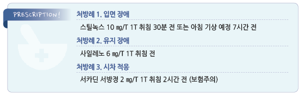

# 불면증 Insomnia, Sleep Disorder



## 일반 사항

### Sleep disorder 분류 \[ICSD-3]

1.  Insomnia : 적절한 수면 환경에도 불구하고 잠에 들기 어렵거나 잠을 유지하기 어렵거나 너무 일찍 깨어나며 이로 인하여

    주간 기능에 지장이 발생함

•수면 지연(sleep latency) : 젊은 성인에서 20분, 나이든 성인에서 30분 내 수면에 들지 못함

•조기 기상(early morning awakening) : 원하는 시간보다 30분 이전에 기상

2.  Sleep-related breathing disorders : 수면 중 비정상적인 호흡; central or obstructive sleep apnea syndrome,

    sleep-related hypoventilation disorder, sleep-related hypoxemia disorder
3. Central disorder of hypersomnolence : 다른 수면 이상에 의하지 않은 주간 졸림
4. Circadian rhythm sleep-wake disorders (= Shift work disorder, SWD)

•shift work schedule과 관련된 증상이 최소 1개월 이상 지속되는 수면 장애

•자신의 수면 패턴에서 요구되는 sleep-wake 일정과 환경(생활) 사이의 불일치(예: 여행, 야간 작업)에 기인하여 주간의

```
과도한 졸림이나 불면증이 발생한 지속적 또는 재발성 수면 장애. 이로 인하여 일상생활에서의 유의미한 장애 발생
```

5\. Parasomnia : 잠이 드는 동안, 잠자는 중, 또는 잠에서 깨어나는 동안 원하지 않는 신체적 사건(행동) 또는 경험(지각,

```
감정, 꿈); 몽유병, 잠꼬대, 수면 중 신음, 악몽, 야경, 야뇨, 이갈이, 수면 행동
```

6\. Sleep-related movement disorders : 수면을 방해하는 단순한, 입체적인 움직임(예: restless legs syndrome) (☞ p.174)

7. Other sleep disorders

### 기간에 따른 분류

#### Short-term insomnia disorder

* ＜3개월 동안 주간 기능 장애 등의 유의미한 문제를 일으키는 수면 장애
* 다른 명칭 : adjustment insomnia, acute insomnia, stress-related insomnia, transient insomnia
*   일시적인 스트레스와 관련될 수 있으나 급성 통증, 슬픔, 또는 다른 스트레스 요인들이 수면 장애의 유일한 원인일 때는

    불면증이라는 진단을 적용하지 않을 수 있음
* 스트레스가 해소되거나 스트레스에 적응하면 증상이 해소될 수 있음

#### Chronic insomnia disorder

* ≥3개월 동안 ≥3회/주 유의미한 문제를 일으키는 수면 장애
*   여러 해에 걸쳐 수 주 동안 반복적으로 불면증이 발생하는 환자는 각각의 episode가 3개월 동안 지속되지 않더라도

    만성 불면증으로 진단할 수 있음

#### Other insomnia disorder

* short-term 또는 chronic insomnia에 해당되지 않는 수면 장애

## 원인 및 위험 인자

* 특발성(원인 불명)
* 불규칙 수면 : 교대 근무, 여행, 출장; 낮잠, 일찍 취침
* 나쁜 환경 : 밝은 조명, 소음
* 사회적 관계 장애, 낮은 사회 경제적 상태
* 사회심리적 스트레스 : 경제, 학업, 직장(예: 이직, 실직), 가정(예: 갈등, 별거)
*   고령(중년의 10%, ＞65세의 ⅓이 만성 불면증 유병), 여성(남성의 5배)

    •연령 증가에 따라 수면이 얕아지고 수면에 영향을 주는 질환이 많아지며 약물 복용이 늘어남
* 정신 질환 : 불안증, 우울증, 인격장애, 외상 후 스트레스장애
*   급만성 질환 : 하지 불안증, 수면무호흡증, 만성 통증, 골관절증, 심부전, 신부전, COPD, GERD, 갑상선항진증, 배뇨 장애,

    과민대장증후군, 만성피로증후군, 뇌졸중, 파킨슨병, 치매, 악성 종양
* 약물 남용 : 다제약물, 알코올 남용, 카페인 과용, 약물 금단
*   약물 : 항우울제(예: SSRI, SNRI, bupropion), β-차단제/항진제, CCB, 이뇨제, 항간질제(예: lamotrigine, phenytoin),

    항콜린제, 항암제, 교감 신경 흥분제(예: salbutamol, salmeterol, theophylline, pseudoephedrine),

    CNS 자극제(예: methylphenidate, dextroamphetamine, nicotine), NSAID, steroid, 경구 피임제, 갑상선 호르몬,

    atorvastatin, levodopa, quinidine

## 임상 양상

* 주간 졸음, 집중력 장애, 기억력 장애
* 피로, 활력 감소, 적극성 감소
* 감정 이상, 과민, 긴장, 두통
* 직장이나 학교 등에서의 작업 수행 능력 저하, 사고 위험 증가
* 불면에 대한 두려움
* 소화 장애, 심혈관 질환(예: 고혈압, 심근경색), 당뇨병 위험 증가

## 진단

* 다른 원인을 배제하여 진단
* 병력(예: 통증성 질환), 약물/음주 경력
*   수면 이력 : 수면/기상 시간, 근무/활동 시간, 불면 패턴(입면 지연, 유지 장애), 주간 졸음 여부

    •수면 일지 작성 : 취침/기상/밤중 각성 시간, 야간 배뇨 시간/배뇨량, 수면 환경, 낮잠, 음주, 스트레스, 기분
* 실험실 검사 : CBC, 빈혈 검사, TSH, 간/신장 기능, CRP, Vit B12, urine toxicology
* ECG, EEG, CT/MRI, circadian markers(melatonin, 체온)
* 수면다원검사 : 치료 실패, 주간 졸음 위험 직업군(예: 직업 운전자)에서 고려

#### 주간 졸림증 자가 진단 [대한수면연구학회](../\[https:/www.sleepnet.or.kr]\(https:/www.sleepnet.or.kr\))

* 아래의 상황들에서 당신은 어느 정도나 졸음을 느끼십니까?
*   배점 : 전혀 졸지 않는다( 0점), 가끔 졸음에 빠진다(1점), 종종 졸음에 빠진다(2점), 자주 졸음에 빠진다(3점)

    
* 판정 : ＜10점 정상, ≥10점 경증, 14\~18점 중등증, ≥19점 중증 주간 졸림증

#### 불면증 자가 진단 [대한수면연구학회](../\[https:/www.sleepnet.or.kr]\(https:/www.sleepnet.or.kr\))

1.  당신의 불면증에 관한 문제들의 현재(최근2주간) 심한 정도를 표시해 주세요.

    
2.  현재 수면 양상에 관하여 얼마나 만족하고 있습니까?

    매우 만족(0점), 약간 만족(2점), 그저 그렇다(3점), 약간 불만족(점), 매우 불만족(4점)
3.  당신의 수면 장애가 어느 정도나 당신의 낮 활동을 방해 한다고 생각합니까?

    ```
     (예. 낮에 피곤함, 직장이나 가사에 일하는 능력, 집중력, 기억력, 기분, 등).
    ```

    전혀(0점), 약간(2점), 다소(3점), 상당히(점), 매우 많이(4점)
4.  불면증으로 인한 장애가 당신의 삶의 질의 손상정도를 다른 사람들에게 어떻게 보인다고 생각합니까?

    전혀(0점), 약간(2점), 다소(3점), 상당히(점), 매우 많이(4점)
5.  당신은 현재 불면증에 관하여 얼마나 걱정하고 있습니까?

    전혀 그렇지 않다(0점), 약간 만족(2점), 그저 그렇다(3점), 약간 불만족(점), 매우 불만족(4점)

* 판정: 0~~7점 유의할 만한 불면증 없음, 8~~14 점 경증, 15~~21 점 중등증, 22~~28점 중증 불면증

### 감별

#### 일주기리듬 수면각성장애

* 수면각성 패턴 때문에 잠이 오지 않는 상황
* 뒤처진 수면위상형 : 늦게 잠이 들고 기상 시간이 늦어지는 수면-각성 주기 지연(예: 우울증)
* 앞당겨진 수면위상형 : 일찍 잠을 자고 새벽에 일찍 깨는 수면-각성 주기 앞당김(예: 노인)
* 진단 : 수면 각성 주기 평가(예: 수면 일지, 활동기록계)
* 치료 : 광치료, melatonin; 수면제에 잘 반응하지 않음

#### 폐쇄성 수면무호흡증

*   잠은 쉽게 들지만 수면 중 호흡이 멈추거나 얕아짐; 수면 중 근육 긴장도가 감소하고 흡기 시 상기도 음압이 발생하여

    기도 폐쇄, 산소 포화도 저하, 쉽게 각성(자주 깸), 낮졸림증 발생
* 위험 인자 : 남성, 고령
*   진단 : 수면다원검사; 무호흡 저호흡 지수\*로 중증도 평가

    \*Apnea-Hypopnea Index, AHI : 시간 당 무호흡이나 저호흡이 최소 10초 이상 되는 횟수
* 치료 : 수술, 구강 내 장치, 지속적 상기도 양압술(continuous positive airway pressure, CPAP)
* benzodiazepine 사용 시 무호흡이 심해질 수 있음

#### 하지불안증후군 및 주기성 사지운동장애

*   하지불안증후군 : 다리에 불편하고 불쾌한 느낌으로 인해 다리를 움직이고 싶은 충동이 생겨 잠을 잘 이루지 못함; 밤,

    누워있거나 쉴 때 발생 (☞ p.174)
* 주기성 사지운동장애 : 수면을 취하는 동안 다리를 툭 터는 행동 반복
*   원인 : 유전, 철분 대사 이상, 도파민 기능 이상; 도파민 농도를 저하시킬 수 있는 항정신병제/항우울제, 철분 결핍을

    일으킬 수 있는 빈혈/출혈/임신/출산/만성 신부전
* 치료 : 원인 질환 치료, clonazepam, dopamine 작용제

#### 사건수면

*   렘수면 각성장애 : 렘수면 행동장애(렘수면 중 근육 긴장도가 유지되어 꿈 내용을 실제로 행동 함); 특발성, 신경과적

    질환(예: 파킨슨병, 루이소체 치매) 관련
*   비렘수면 각성장애 : 야경증(자다가 소리를 지르고 울면서 깨는 행동을 반복), 수면보행증(수면 중 갑자기 일어나서

    걸어다니는 행동을 반복)
* 깊은 잠을 자고 있는 상태로, 다른 사람이 말을 거는 것에 대해 적절한 반응을 보이지 않음
* 수면 중 첫 ⅓ 시점에서 많이 발생
* 진단 : 병력, 수면 다원 검사
*   치료 : 아동기 비렘수면 각성장애는 특별한 치료를 요하지 않을수 있음; 렘수면 행동장애는 손상을 방지하기 위하여

    clonazepam 또는 melatonin을 사용할 수 있음

#### 기면병 및 특발성 과다수면증

*   기면병 : 낮졸림증, 탈력 발작, 수면 마비, 입면 시 환각; 각성을 유지하게 해 주는 신경 펩타이드인 orexin/hypocretin

    농도 감소와 관련; 평균 수면 잠복기 8분 이내, sleep-onset REM periods(SOREMp) 2회 이상 관찰 시 진단
* 특발성 과수면증 : 낮졸림증은 심하지만 기면병의 진단 기준을 충족하지 못함

•치료 : 행동 요법(잘 수 있을 때 잠을 잠), 각성제(예: modafinil); 탈력 발작에 대하여 항우울제(예: TCA, venlafaxine);

```
불면증이 심하지 않으면 불면증에 대한 약물 치료는 필요 없음
```

***

## Management

### 치료 방침

* (특히 다제약물 복용 환자) 진료 시 수면 장애 확인 (✽수면 장애 환자의 ＜⅓만 의사와 의논함)
*   원인 제거, 기저 질환 치료, 수면 환경 개선 등 생활 요법 중재, 정신 요법, 약물 치료

    •약물 치료는 남용, 내성, 중독 가능성이 있으므로 주의
* 야간 저산소증이 있는 만성 폐질환 또는 수면무호흡증 환자는 의뢰

## 비-약물 치료

```
(Ref. 대한신경정신의학회. 한국판 불면증 임상진료지침 2019)
```

* 인지행동 요법(특히 만성 불면증의 1차 치료), 명상, mindfulness, 광 치료

#### 수면 위생 (sleep hygiene)

① 다음날 피곤하지 않을 정도만 취침; 침대에 누워 있는 시간이 너무 길면 얕게 자고 자주 깨게 됨

② 아침에 규칙적인 시간에 기상

③ 매일 적당량의 운동을 지속; 간헐적인 심한 운동은 도움이 되지는 않음

④ 조용한 환경을 만듦

⑤ 침실이 덥거나 춥지 않도록 함

⑥ 배가 고프지 않게 함; 필요시 우유나 스낵 등 간단한 음식을 섭취

⑦ 필요시 간헐적/단기간 수면제 사용; 정기적/ 장기간 수면제 사용은 피함

⑧ 저녁의 카페인 음료 섭취를 피함

⑨ 술에 의존하지 않음; 술은 잠을 빠르게 들게 할 수 있지만 자주 깨게 함

⑩ 잠 자려고 너무 애 쓰지 않음; 잠이 오지 않을 때는 적당한 조명 하에 책을 보거나 음악을 들음

#### 수면 제한법 (sleep restriction therapy)

① 원하는 기상 시간을 정함

② 몇 시간 정도를 자면 만족할지를 생각

③ 이를 바탕으로 취침 시간을 정함

④ 수면 효율이 85% 이하라면 잠자리에 누워 있는 시간을 15분씩 줄임

⑤ 수면 효율이 90% 이상에 도달하면 잠자리에 누워 있는 시간을 15분씩 늘림

#### 자극 조절 (stimulus control therapy)

① 졸릴 때에만 잠자리에 누움

② 잠이 오지 않으면 10\~15분 정도 후에 다시 일어남

③ 거실에 앉아서 스탠드만 켜 놓고 책이나 TV를 보거나 음악을 들음

④ 졸리면 다시 잠자리로 들어가서 잠을 청함

⑤ ②\~④의 과정을 반복

⑥ 기상 시간을 일정하게 유지

⑦ 잠자리는 잠을 자는 용도로만 사용

⑧ 낮잠은 피하며, 필요시 30분 이내로만 잠

#### 이완 요법(relaxation technique)

① 편안한 자세로 눕거나 앉아서 두 눈을 감는다.

② 왼쪽 손은 배 위에, 오른쪽 손은 가슴에 올려놓는다.

③ 약 5초간 코로 천천히, 가능한 한 깊게 숨을 들이 쉬면서 배를 최대한 내민다.

④ 배가 부풀어 오르는 것을 느끼면서 숨을 들이마시되, 가슴이 움직이지 않도록 한다.

⑤ 숨을 최대한 들이마신 상태에서 1초 정도 숨을 멈춘다.

⑥ 약 5초간 천천히 숨을 끝까지 내 쉰다.

⑦ 한 번 시행 시 5분 간, 하루 중에 자주 시행한다.

#### 인지 치료(cognitive therapy)

*   수면에 대한 역기능적인 생각 : 하루에 8시간은 자야 한다. 부족한 잠은 어떻게 해서든지 보충해야 한다. 잠을 잘 못 자면

    건강을 해칠까 걱정된다. 잠을 잘 못 자면 이튿날 생활을 망치게 될 것이다. 잠을 영영 통제하지 못하게 될 것이다.
*   부정적인 정서 반응 및 수면 습관 : 수면에 대해 지나치게 걱정하고 집착한다. 잠 잘 시간이 다가오거나 침대에 누우면

    오히려 각성이 된다. 잠이 오지 않는데도 미리 누워서 자려고 애쓴다.

#### 광치료 (bright light therapy)

* 일주기 리듬 안정; 전반적 수면 증상 개선 효과
* 일정 시간 규칙적으로 밝은 빛(햇빛 아님)을 눈에 비춤; 2,000~~10,000 lux, 30분~~2시간, 수일
* 부작용 : 경미; 안구건조증, 안구 충혈감, 두통, 불안, 초조감

## 약물 치료

### 사용 원칙

* 최소 유효 용량 투여. 특히 고령에서는 저용량 투여 (☞ p.1152)
* 일시적 불면증에 대하여 단기 사용(최대 4\~5주)
* 매일 수면제를 복용하는 환자는 간헐적 사용을 유도

✽수면제 복용 시(＜18정/년인 경우에도) 사망 위험률이 ＞3배 증가한다는 보고가 있음

* 복용 시간 : (수면-각성 주기를 고려하여) 잠이 오는 시간의 30분 전 또는 아침 기상 7시간 전
* 약물 투여 중단 시 반동 현상과 내성이 발생하지 않도록 tapering
* 부작용 : 주간 졸음, 어지럼, 인지 장애, 내성, 반동 불면

•대처 방법 : 주간 졸음 발생 시 감량, 반감기가 짧은 약제 선택

*   투여 주의/제한 : 고령, 알코올 남용, 자살 시도 병력, 수면무호흡증, 간/신/폐질환자, 운전자, 밤에 깨어나서 해야 할 일이

    있는 사람

### 약물 종류

#### Benzodiazepine

* 수면 잠복기 감소, 총 수면 시간 연장, 수면 개시 후 각성(WASO) 감소, 수면 질 향상
*   단기(4주 이하) 사용; 장기 사용 시 수면 질 저하(deep sleep time 감소, 수면 구조 왜곡), 의존/금단 위험(금단 증상은

    반감기가 짧은 약제에서 더 흔함)
*   부작용 : 다음날 낮졸림, 운동 실조, 어지럼증, 인지 저하, 섬망, 전향성 기억 상실(triazolam); 부작용과 약물 용량에

    상관관계가 있음
* FDA 승인 약제 : estazolam, flurazepam \[달마돔], temazepam, triazolam \[할시온], quazepam

#### Z-class drugs

*   non-benzodiazepine hypnotics(benzodiazepine receptor agonist의 일종); 수면 잠복기 감소, 총 수면 시간 증가, 수면 유지,

    수면 질 개선
* FDA 승인 약제 : zolpidem \[스틸녹스], zaleplon \[잘레딥], zopiclone
* 부작용 : 두통, 어지럼증, 졸림; 사건 수면, 기억상실, 환각, 자살 위험성 증가, 내성/의존/금단
* 4\~5주 이하의 단기 사용 및 정기적 사용의 부작용을 감안하여 필요시(잠자리에 들었으나 잠이 잘 오지 않을 때) 복용 권고

#### Melatonin

* 저녁 시간에 송과체에서 분비되는 호르몬
*   수면의 질 및 기간, circadian rhythm 회복에 유효하다는 보고가 있으나 논란; 연령에 따라 melatonin 합성과 농도가

    감소하므로 고령에서 효과가 있을 가능성이 있음
* 치료 반응률이 다른 수면제에 비하여 낮고, 효과가 즉각적이지 않음
*   최소 3주 이상 지속 복용 (✽3\~4주간 꾸준히 복용하면 66%에서 불면 증상 호전, 44%에서 기존 복용 수면제 용량 감량을

    보였다는 보고가 있음)
* 일반적인 수면제에 비하여 인지 저하, 낙상, 내성/의존/금단 등의 부작용이 적음
* 지속 방출형으로 ≥55세에서 수면 유지 장에에 고려; 속효성 제제는 권고 안 함
* 복용 시간 : 아침 기상 시간 9시간 전에 복용, 2시간 후 취침
* Ramelteon : melatonin 수용체 작용제; 수면 개시 장애, 고령 환자에서 고려

#### 항우울제

* Doxepin \[사일레노] : 입면 후 각성 시간, 총 수면 시간, 수면 효율 개선; 수면 유지 장애에 고려

•부작용 : 설사, 낮졸림증, 두통; 낙상 위험이 상대적으로 적음

* Trazodone \[레메론] : WASO, 총 수면 시간, 수면 효율, 서파 수면 증가; 수면 유지 장애에 고려; 25\~50 ㎎

•부작용 : 두통, 기립저혈압; 남용 문제는 상대적으로 적음

* Mirtazapine \[레메론] : 수면 유도, 서파 수면 증가; 우울증 동반 불면증에 고려; 7.5\~30 ㎎

•부작용 : 과도한 진정, 식욕/체중 증가, 입마름

#### 기타

*   항히스타민제, 항정신병제, L-tryptophan, phytotherapy(예: valerian), 향기 요법, 동종 요법, foot reflexology, 명상, 침, 뜸,

    요가 : 증거 불충분, 권하지 않음

### 권고 약제

```
Ref. AASM. Clinical practice guideline for the pharmacologic Tx of chronic insomnia in adults. 2017.
```

#### 입면 장애(Sleep onset insomnia)에 대한 권고 약제

```

```

#### 유지 장애(Sleep maintenance insomnia)에 대한 권고 약제

```

```

#### 기타

* benzodiazepine : 만성 사용 시 deep sleep time 감소, 수면 구조 왜곡 등 수면 질을 떨어뜨리고 의존 위험이 있어 제한
*   항히스타민제, 항정신병제, melatonin, L-tryptophan, phytotherapy(예: valerian), 향기 요법, 동종 요법, foot reflexology,

    명상, 침, 뜸, 요가 : 증거 불충분, 권하지 않음

## Circadian rhythm sleep-wake disorders (Shift work disorder, SWD)

* 일반적 생활 요법 시행. 특히 취침 전 카페인이나 알코올 섭취 회피, 취침 전 소음/밝기 최소화
* bright light therapy
*   chronotherapy : 원하는 수면 일정이 될 때까지 점차 수면 시간을 조정

    •취침 및 기상 시간을 매일 3시간씩 늦춤. 예) 첫날 04시 취침/12시 기상 → 2일째 07시/15시 → 3일째 10시/18시

    → 4일째 13시/21시 → 5일째 16시/0시 → 6일째 19시/03시 → 7\~13일째 22시/06시 → 14일째 23시/07시

#### 수면 유도 약물

* 수면제는 수면 질을 향상시키지 못하며, 주간 졸음을 유발할 수 있고, SWD를 악화시킬 수 있음
* non-benzodiazepine hypnotics(예: zolpidem) : 필요시 단기 사용
*   melatonin 3 ㎎ \[서카딘]

    ✽서카딘 허가 사항 : 비급여. 수면의 질이 저하된 55세 이상의 불면증 환자의 단기 치료

각성 약물

* modafinil : 100\~200 ㎎, shift 시작 60분 전 \[프로비질]
* armodafinil : 150~~250 ㎎; 12~~16시간 작용 \[누비질]
*   카페인 : 200 ㎎ 정도를 주간 작업 전 섭취

    

> **질병코드** F51 비기질성 수면장애

G47 수면장애


