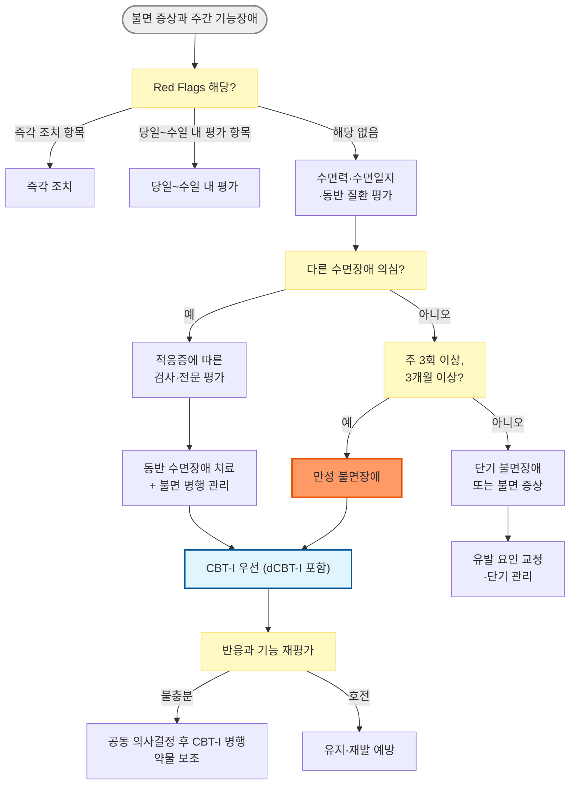

# 불면증 Insomnia

## <mark style="color:green;">일반 사항</mark>

* 불면증의 핵심 병태생리 - 과각성 모델 (Hyperarousal model)
  * 신경계 과각성(hyperarousal) : HPA axis 활성 증가, 교감신경 항진, 피질 각성 증가; 불면증의 핵심 기전
  * Sleep effort paradox : 잠을 자려고 노력할수록 각성이 높아져 오히려 불면이 악화되는 역설적 현상; CBT-I의 핵심 치료 대상
* 불면증과 정신 질환의 양방향 관계
  * 불면증은 우울증·불안 장애의 '증상'인 동시에, 그 자체로 우울증과 불안 장애를 악화시키는 '독립적 위험인자'임(양방향성, Bidirectional relationship)
  * 기저 정신 질환이 있는 환자에서 불면증을 별도로 평가·치료하는 것이 중요하며, 불면증 치료가 선행될 때 동반 정신 질환의 예후도 개선될 수 있음
* 불면장애는 동반 정신·신체 질환이 있어도 독립적으로 진단할 수 있음

### <mark style="color:orange;">수면장애 분류 \[ICSD-3-TR]</mark>

1. Insomnia : 적절한 수면 기회와 환경에도 불구하고 잠들기 어렵거나 잠을 유지하기 어렵거나 원하는 시간보다 너무 일찍 깨어나며, 이로 인해 주간 기능장애 또는 유의한 고통이 발생함
   * 임상적으로 흔히 입면 잠복기 또는 입면 후 각성시간 ＞30분을 참고하지만, 시간 수치만으로 진단하지 않음
   * 조기 기상(early morning awakening) : 원하는 시간보다 일찍 깨어 다시 잠들기 어려운 상태
2. Sleep-related breathing disorders : 수면 중 비정상적인 호흡; central or obstructive sleep apnea syndrome, sleep-related hypoventilation disorder, sleep-related hypoxemia disorder
3. Central disorders of hypersomnolence : 다른 수면 이상에 의하지 않은 주간 졸림
4. Circadian rhythm sleep-wake disorders : 내인성 일주기 리듬과 요구되는 수면-각성 일정이 맞지 않아 불면 또는 과도한 졸림과 기능장애가 발생하는 질환군
   * 지연수면-각성위상장애, 진행수면-각성위상장애, 불규칙 수면-각성리듬장애, 비24시간 수면-각성리듬장애, 시차장애, 교대근무장애 등을 포함
   * 교대근무장애(shift work disorder, SWD)는 이 질환군의 한 아형이며, 교대근무 일정과 관련된 불면 또는 과도한 졸림이 일반적으로 ≥3개월 지속되고 기능장애를 유발할 때 진단을 고려
5. 사건수면 (Parasomnia) : 잠이 드는 동안, 잠자는 중, 또는 잠에서 깨어나는 동안 원하지 않는 신체적 사건(행동) 또는 경험(지각, 감정, 꿈); 비렘수면 각성장애(혼돈각성, 수면보행증, 야경증), 렘수면행동장애, 악몽장애, 수면마비, 야뇨증 등
   * 잠꼬대는 정상 변이, 이갈이는 수면 관련 운동장애로 분류됨
6. Sleep-related movement disorders : 수면을 방해하는 비교적 단순하고 상동적인(stereotyped) 움직임(예: restless legs syndrome) (☞ [하지불안증후군](036_-restless-legs-syndrome.md))
7. Other sleep disorders

### <mark style="color:orange;">기간에 따른 분류</mark>

#### <mark style="color:$primary;">단기 불면장애 (Short-term insomnia disorder)</mark>

* ＜3개월 동안 주간 기능 장애 등의 유의미한 문제를 일으키는 수면 장애
* 과거에 급성·적응성·스트레스성·일과성 불면증(acute, adjustment, stress-related, transient insomnia) 등으로도 불렸으나, ICSD-3-TR에 따라 본문에서는 단기 불면장애로 통일
* 일시적인 스트레스·급성 통증·슬픔 등과 관련될 수 있음
* 증상과 주간 기능장애가 유의하면 동반 원인을 치료하면서 단기 불면장애를 함께 진단·관리할 수 있음
* 스트레스가 해소되거나 스트레스에 적응하면 증상이 해소될 수 있음

#### <mark style="color:$primary;">만성 불면장애 (Chronic insomnia disorder)</mark>

* ≥3개월 동안 ≥3회/주 유의미한 문제를 일으키는 수면 장애
* 적절한 수면 기회가 주어졌음에도 불구하고 발생하는 것이 진단의 전제 조건
  * 소음·빛 등 환경 요인에 의한 단순 수면 부족과 구별됨
* 여러 해에 걸쳐 수 주 동안 반복적으로 불면증이 발생하는 환자는 각각의 episode가 3개월 동안 지속되지 않더라도 만성 불면증으로 진단할 수 있음

#### <mark style="color:$primary;">기타 불면장애 (Other insomnia disorder)</mark>

* 단기 또는 만성 불면장애에 해당되지 않는 수면 장애

## <mark style="color:green;">원인 및 위험 인자</mark>

* 유발·지속·악화 요인을 함께 평가

### <mark style="color:orange;">Spielman의 3P 모델</mark>

* 소인 요인(Predisposing factors) : 불면에 취약하게 만드는 요인
  * 유전적 취약성, 과각성·불안 성향, 고령, 여성
* 유발 요인(Precipitating factors) : 불면을 시작하게 하는 요인
  * 급성 스트레스, 신체 질환·통증, 주요 생활사건, 환경 변화
* 지속 요인(Perpetuating factors) : 급성 불면이 만성화되게 하는 요인; CBT-I의 주요 치료 표적
  * 침상 시간 연장, 불규칙한 낮잠, 수면에 대한 불안과 과도한 노력, 음주·카페인 과용

### <mark style="color:orange;">주요 원인 및 위험 인자</mark>

* 불규칙 수면 : 교대 근무, 여행, 출장; 낮잠, 일찍 취침
* 나쁜 환경 : 밝은 조명, 소음
* 사회적 관계 장애, 낮은 사회 경제적 상태
* 사회심리적 스트레스 : 경제, 학업, 직장(예: 이직, 실직), 가정(예: 갈등, 별거)
* 고령
  * 연령 증가에 따른 수면 구조 변화 : 서파수면(slow-wave NREM) 감소, 수면 분절과 야간 각성 증가
  * 필요한 수면시간에는 개인차가 크며, 연령만으로 일정한 비율로 수면시간이 계속 감소한다고 단정하지 않음
  * 내부 일주기 시계 기능 저하 → 취침·기상 시간이 앞당겨지는 경향(전진 수면각성위상장애(advanced sleep-wake phase disorder))
  * 수면에 영향을 주는 동반 질환 증가, 다제약물 복용 증가
* 여성 : 불면증 위험이 남성보다 약 1.4배 높은 것으로 보고됨
  * 폐경 전후 호르몬 변동(에스트로겐 감소)과 혈관운동 증상(안면홍조·야간발한)이 수면을 분절시킴
  * 우울증·불안장애 유병률이 여성에서 더 높아 불면증과 상호작용
* 정신 질환 : 불안증, 우울증, 인격장애, 외상 후 스트레스장애
* 급만성 질환
  * 통증·근골격계 : 만성 통증, 골관절증
  * 야간 각성 유발 신체 증상 : 심부전·신부전(기좌호흡·야간뇨), COPD, GERD, 배뇨 장애, 과민대장증후군
  * 신경계·신경퇴행성 질환 : 하지불안증, 뇌졸중, 파킨슨병, 치매
  * 기타 : 수면무호흡증, 갑상선항진증, 만성피로증후군, 악성 종양
* 약물 남용 : 다제약물, 알코올 남용, 카페인 과용, 니코틴(흡연), 약물 금단
* 약물 : 약물명만으로 인과관계를 단정하지 말고 복용 시각·증상 발생 시점·용량 변화·금단 여부를 함께 평가
  * 일부 항우울제 : SSRI, SNRI, bupropion
  * 교감신경흥분제 : salbutamol, theophylline, pseudoephedrine
  * CNS 자극제 : methylphenidate, amphetamine
  * 기타 : β-차단제, 이뇨제, corticosteroid, 갑상선 호르몬

## <mark style="color:green;">임상 양상</mark>

* 주간 기능 장애 (가장 흔하고 직접적인 증상)
  * 주간 졸음, 피로, 활력 감소
  * 집중력·기억력 장애, 작업 수행 능력 저하
  * 사고 위험 증가
* 심리·정서적 증상 : 감정 이상, 과민, 긴장, 불면에 대한 두려움(수면 불안, 불면을 악화시키는 악순환)
* 신체 증상 : 두통, 소화 장애
* 장기적 건강 위험과의 연관성 (만성 불면 시)
  * 심혈관 질환(고혈압, 심근경색), 당뇨병 위험 증가와 연관되지만 개인 환자에서 인과관계를 단정하지 않음
  * 우울증 발병 위험 약 2배 증가 (Baglioni et al., J Affect Disord 2011 메타분석)

### <mark style="color:$danger;">🚩 Red Flags!</mark>

<mark style="color:$danger;">**즉각 조치**</mark>

* 자살 사고가 구체적이거나(계획·의도·수단 접근) 자살 시도 직후
* 급성 섬망 또는 의식 변화 동반
* 불면과 함께 지속되는 흉통, 심한 호흡곤란 또는 저산소증  [`급성 관상동맥증후군`](../225_/097_-angina-pectoris.md) [`급성 심부전`](../225_/098_-heart-failure.md) [`폐색전증`](../220_/007_-dyspnea.md)
* 음주·BZD·Z-drug 중단 후 불면과 함께 진전, 발한, 빈맥, 환각 또는 경련  [`알코올 금단`](../230_/189_-alcohol-use-disorder-aud.md) `진전섬망` `BZD 금단`
* 출산 후 급격한 불면과 함께 혼돈, 환각·망상, 급격한 기분 변화  [`산후 정신병`](028_-postpartum-depression.md)&#x20;

<mark style="color:$warning;">**당일\~수일 내 평가**</mark>

* 자살 사고가 있으나 구체적 계획·의도는 없는 경우
* 잠을 거의 자지 않아도 피곤하지 않으면서 기분 고양·심한 과민, 사고 비약, 충동행동 동반  `조증` `경조증`
* 과도한 주간졸림이 있으면서 운전·고위험 작업  `폐쇄성 수면무호흡증` `기면병`
* 누우면 숨이 차거나(기좌호흡) 자다가 숨이 차서 깨는 경우  `심부전`

<mark style="color:$info;">**조기 평가 및 추적**</mark>

* 탈력발작, 반복되는 수면마비·입면/출면 환각과 심한 주간졸림  `기면병`
* 코골이 + 수면 중 무호흡 목격 + 주간 졸림  `폐쇄성 수면무호흡증`
* 수면 중 격렬한 행동으로 본인·동침자의 손상 위험  `렘수면행동장애` `사건수면`
* 구조화된 CBT-I를 적절히 시행했음에도 호전되지 않거나 진단이 불확실  `치료저항성 불면증`&#x20;
* 동반 정신 질환 또는 신체 질환 조절 불량  [`우울증`](027_-depression.md) [`불안장애`](025_-anxiety-disorder.md)

## <mark style="color:green;">진단</mark>

* 불면장애는 임상적으로 진단하며, 동반 정신질환·신체질환·다른 수면장애를 함께 평가함
  * 동반 질환이 있다는 이유만으로 불면장애 진단을 배제하지 않음
* 병력(예: 통증성 질환), 정신건강 상태, 약물·카페인·nicotine·음주 및 물질사용 경력
* 수면 이력 : 수면/기상 시간, 근무/활동 시간, 불면 패턴(입면 지연, 유지 장애), 주간 졸음 여부
  * 수면 일지 작성 : 취침/기상/밤중 각성 시간, 야간 배뇨 시간/배뇨량, 수면 환경, 낮잠, 음주, 스트레스, 기분 등을 기록
  * 필요 시 활동기록계(actigraphy)로 수면 패턴을 보조 평가&#x20;
* 신체진찰 : 체중/BMI, 상기도·심폐·신경학적 소견, 하지불안증후군 및 동반 질환 단서 확인
* 검사실검사 : CBC, ferritin/TSAT, TSH, 간/신장기능 등
  * 병력·진찰에서 빈혈/철결핍, 갑상선질환, 신장질환 등 특정 원인이 의심될 때 선택적으로 시행
  * CRP, vitamin B12, urine toxicology 등은 일률적으로 시행하지 않음
* ECG, EEG, CT/MRI, circadian markers(melatonin, 체온) : 특정 원인 질환 의심 시에만 시행
* 수면다원검사 : 진단이 불확실하거나 치료 반응이 없고, 다른 수면장애 또는 객관적 수면 평가가 임상적 의사결정에 영향을 줄 때 고려
* OSA 의심 시 STOP 또는 STOP-Bang 등 선별도구를 사용할 수 있으나 확진은 수면다원검사 또는 적절한 환자에서 가정수면무호흡검사(HSAT)로 시행

### <mark style="color:orange;">자가 평가</mark>

#### <mark style="color:$primary;">주간 졸림증 자가 진단 - 한국형 주간 졸음 자가평가 척도(K-ESS)</mark>

* 독서, TV 시청, 공공장소 착석, 차량 내 착석, 오후 누워서 휴식, 앉아서 대화, 점심 식후 착석, 대중교통 내 기대 있을 때 등 8가지 일상 상황에서의 졸림 정도를 자가설문 (☞ [대한수면학회 온라인 자가검사](https://www.sleep.or.kr/html/?pmode=sleepiness))
* 판정 : ＜10점 정상범위, 10\~13점 주간 졸림증 있음, 14\~18점 중등도의 주간 졸림증, ≥19점 심한 주간 졸림증 (대한수면의학회 기준)
* 점수만으로 OSA·기면병 등을 진단하지 않음
* 심한 과도한 주간졸림이 두드러지면 불면장애 자체뿐 아니라 수면부족, OSA, 기면병, 약물 영향을 우선 재평가

#### <mark style="color:$primary;">불면증 심각도 지수 (Insomnia Severity Index, ISI)</mark>

* 입면 곤란, 수면 유지 곤란, 조기 각성, 현재 수면에 대한 만족도, 일상 기능에 대한 영향, 수면 문제의 타인 인지도, 수면 문제로 인한 걱정 등 7개 항목을 각 0\~4점으로 자가평가 (☞ [온라인 자가검사 ISI-K](http://www.wjmhc.or.kr/kor/check/adult_isi.php))
* 판정 : 0\~7점 유의할 만한 불면증 없음, 8\~14점 역치하 불면증, 15\~21점 중등증, 22\~28점 중증 불면증

### <mark style="color:orange;">감별</mark>

#### <mark style="color:$primary;">일주기리듬 수면각성장애 (Circadian rhythm sleep-wake disorders, CRSWD)</mark>

* 수면각성 패턴 때문에 잠이 오지 않는 상황
* 지연 수면각성위상장애 : 늦게 잠이 들고 기상 시간이 늦어지는 수면-각성 주기 지연
  * 청소년·젊은 성인에서 흔함
* 전진 수면각성위상장애 : 일찍 잠을 자고 새벽에 일찍 깨는 수면-각성 주기 앞당김
  * 늦게 취침해도 일찍 깨는 경향 유지
  * 고령자에서 특히 흔함 - 저녁 7\~9시에 졸리고 새벽 3\~5시에 기상하는 패턴
* 진단 : 수면 각성 주기 평가(예: 수면 일지, 활동기록계)
* 치료 : 수면제 단독으로는 위상 이상이 교정되지 않음
  * 지연 수면각성위상장애 : 기상 직후 아침 밝은 빛 노출 + 저녁(취침 수 시간 전) 저용량 melatonin
    * 저녁 밝은 빛 회피
  * 전진 수면각성위상장애 : 저녁 광치료(취침 시간 지연 효과)
    * 새벽 밝은 빛 회피

#### <mark style="color:$primary;">폐쇄성 수면무호흡증 (Obstructive sleep apnea, OSA)</mark>

* 입면은 쉬울 수도 있으나 수면 중 반복되는 상기도 폐쇄로 무호흡·저호흡, 저산소증 및 각성이 발생할 수 있음
* 수면 중 근육 긴장도가 감소하고 흡기 시 상기도 음압이 발생하여 기도 폐쇄, 산소 포화도 저하, 쉽게 각성(자주 깸), 낮졸림증 발생
* 위험인자 : 남성, 고령, 비만, 폐경 후 여성, 두개안면·상기도 구조 이상, 음주, 흡연
* 진단 : 수면다원검사; 무호흡 저호흡 지수\*로 중증도 평가

> _\*Apnea-Hypopnea Index(AHI) : 수면 1시간당 10초 이상 지속되는 무호흡·저호흡의 횟수._ \
> _5\~14 = 경증, 15\~29 = 중등도, ≥30 = 중증_

* 고령자 특이사항 : 치매 동반 요양원 입소 노인에서 특히 흔함
  * 심부전·심근경색·뇌졸중의 독립적 위험인자
* 치료 : 양압기(PAP), 적절한 환자에서 하악전진 구강장치·체위치료·체중관리·수술 평가
  * BMI ≥30 비만 동반 중등도\~중증 OSA에서 tirzepatide <mark style="color:blue;">\[마운자로]</mark> 고려. 기존 OSA 평가와 PAP 등 표준치료의 필요성을 대체하지 않으며 비만 관리의 일부로 고려
  * 진정수면제는 호흡·각성 반응과 주간졸림에 영향을 줄 수 있으므로 OSA 중증도와 치료 상태를 고려하여 신중히 사용

#### <mark style="color:$primary;">하지불안증후군 및 주기성 사지운동장애</mark>

* [하지불안증후군](036_-restless-legs-syndrome.md) : 다리에 불편하고 불쾌한 느낌으로 인해 다리를 움직이고 싶은 충동이 생겨 잠을 잘 이루지 못함; 밤, 누워있거나 쉴 때 발생
* 주기성 사지운동장애 (Periodic limb movement disorder, PLMD) : 성인에서 수면 중 주기성 사지운동지수(PLMI) ＞15회/시간이면서 임상적으로 유의한 수면장애·주간 기능장애가 있고, 다른 수면·신경·내과 질환이나 약물로 더 잘 설명되지 않을 때 진단
* 고령자 특이사항 : 두 질환 모두 연령 증가에 따라 유병률이 약 2배 증가
  * 고령자에서 다른 약물 또는 동반 질환으로 치료가 복잡해질 수 있음
* 원인·악화 요인 : 유전, 도파민 기능 이상, 철 결핍(빈혈·출혈·임신·출산·만성 신부전), 도파민 길항제(항정신병제, metoclopramide), 세로토닌계 항우울제(SSRI·SNRI·mirtazapine), 진정성 항히스타민제
* 치료 : ferritin·transferrin saturation을 포함한 철 상태와 악화 약물을 먼저 평가·교정.&#x20;
  * 약물치료 : gabapentin·pregabalin 등 α2δ ligand를 우선 고려하며, 도파민 작용제는 augmentation 위험 때문에 일상적 1차 선택으로 권하지 않음. clonazepam도 RLS 치료 목적으로 권하지 않음
    * ferritin ≤75 ㎍/L 또는 transferrin saturation ＜20%이면 철 보충을 고려하며, ferritin 75\~100 ㎍/L에서는 정맥 철분만 고려

#### <mark style="color:$primary;">사건수면 (Parasomnia)</mark>

* 렘수면 관련 사건수면
  * 렘수면 행동장애 : 렘수면 중 정상적인 근긴장 소실이 일어나지 않아 꿈 내용을 실제로 행동함
  * 렘수면이 많은 수면 후반부에 주로 발생
  * 특발성, 신경과적 질환(예: 파킨슨병, 루이소체 치매) 관련
  * SSRI·SNRI·mirtazapine 등 항우울제가 렘수면 행동장애를 유발·악화시킬 수 있음
  * 특발성 렘수면 행동장애는 α-synucleinopathy의 중요한 전구 표지자(신경퇴행성 질환 전환율 연 약 6%, 10년 이상 추적 시 과반에서 진행)이므로 신경과·수면전문 평가와 장기 추적을 고려 (☞ [파킨슨병 전구 증상](035_-parkinsons-disease.md#전구-증상))
* 비렘수면 각성장애
  * 깊은 잠(서파수면)에서 불완전하게 깨어난 상태로, 다른 사람이 말을 거는 것에 대해 적절한 반응을 보이지 않으며 대개 기억하지 못함
  * 수면 중 첫 ⅓ 시점에서 많이 발생
  * 야경증 : 자다가 소리를 지르고 울면서 깨는 행동을 반복
  * 수면보행증 : 수면 중 갑자기 일어나서 걸어다니는 행동을 반복
  * 성인에서 새로 발생하면 zolpidem 등 약물 유발 여부를 확인
* 진단 : 병력과 동침자 진술·영상이 중요하며, 렘수면행동장애 또는 위험한/비전형적 사건수면이 의심되면 video-polysomnography 고려
* 치료
  * 아동기 비렘수면 각성장애는 특별한 치료를 요하지 않을 수 있음
  * 렘수면 행동장애는 위험 물건 제거, 침대 주변 완충, 동침자 보호 등 침실 안전조치가 우선
  * 필요 시 즉시 방출 melatonin 또는 clonazepam을 선택적으로 고려하되, clonazepam은 고령자·인지저하·보행장애·OSA에서 특히 주의

#### <mark style="color:$primary;">기면병(Narcolepsy) 및 특발성 과다수면증 (Idiopathic Hypersomnia)</mark>

* 기면병 : 심한 주간졸림, 탈력발작, 수면마비, 입면/출면 환각이 단서
  * 충분한 수면과 약물 영향을 확인한 뒤 야간 수면다원검사에 이어 다중수면잠복기검사(MSLT)를 시행하며, 평균 수면잠복기 ≤8분과 SOREMP ≥2회가 주요 객관적 기준(선행 야간 수면다원검사의 SOREMP도 1회로 인정)
  * 제1형은 명확한 탈력발작 및 검사 소견 또는 뇌척수액 hypocretin 결핍으로 진단
* 특발성 과다수면증 : 낮졸림증은 심하지만 기면병의 진단 기준을 충족하지 못함
* 치료 : 규칙적 수면·계획된 낮잠
  * 약물은 modafinil 등 각성 촉진제와 탈력발작 치료제를 사용하며 \[AASM 2021], 국내 허가·공급 약제가 제한적이므로 수면전문 의뢰; 불면증이 심하지 않으면 불면증에 대한 약물 치료는 필요 없음
  * DORA(Orexin receptor antagonist)는 기면병에서 금기

***


```mermaid
graph TD
    Start([불면 증상과 주간 기능장애]) --> Safety["Red Flags 해당?"]
    Safety -- "즉각 조치 항목" --> T1["즉각 조치"]
    Safety -- "당일~수일 내 평가 항목" --> T2["당일~수일 내 평가"]
    Safety -- "해당 없음" --> Assess["수면력·수면일지<br/>·동반 질환 평가"]
    Assess --> Other["다른 수면장애 의심?"]
    Other -- "예" --> Test["적응증에 따른 <br/>검사·전문 평가"]
    Other -- "아니오" --> Duration["주 3회 이상, <br/>3개월 이상?"]
    Duration -- "예" --> Chronic[만성 불면장애]
    Duration -- "아니오" --> Short["단기 불면장애 <br/>또는 불면 증상"]
    Test --> Combined["동반 수면장애 치료 <br/>+ 불면 병행 관리"]
    Chronic --> CBT["CBT-I 우선 (dCBT-I 포함)"]
    Short --> Cause["유발 요인 교정<br/>·단기 관리"]
    Combined --> CBT
    CBT --> Review["반응과 기능 재평가"]
    Review -- "불충분" --> Drug["공동 의사결정 후 CBT-I 병행 <br/>약물 보조"]
    Review -- "호전" --> Prevent["유지·재발 예방"]
    style Start fill:#eeeeee,stroke:#888888,stroke-width:2px
    style Safety fill:#fff9c4,stroke:#ffe082
    style Other fill:#fff9c4,stroke:#ffe082
    style Duration fill:#fff9c4,stroke:#ffe082
    style Review fill:#fff9c4,stroke:#ffe082
    style Chronic fill:#f96,stroke:#e65100,stroke-width:2px
    style CBT fill:#e1f5fe,stroke:#01579b,stroke-width:2px

```

<p align="center"><strong>불면증 진단 및 치료 알고리듬</strong></p>

<p align="center"><em><mark style="color:$info;">저자 재구성 (참고 문헌 : ICSD-3-TR; European Insomnia Guideline 2023;</mark></em><br><em><mark style="color:$info;">VA/DoD CPG 2025; AASM 2026)</mark></em></p>

***

## <mark style="background-color:$warning;">Management</mark>

### <mark style="color:orange;">치료 방침</mark>

* (특히 다제약물 복용 환자) 진료 시 수면 장애 확인&#x20;
  * 수면 장애 환자의 ＜⅓만 의사와 의논함
* 유발·지속 요인 교정, 동반 질환 치료, 수면 환경 개선, CBT-I, 필요한 경우 약물 치료
  * 약물의 의존·내성·금단 위험은 계열별로 다르므로 약제별 허가사항과 환자 위험을 확인


**Short sleeper vs Insomnia** (치료 전 감별 필수)\
• Short sleeper : 수면 시간이 짧아도 주간 기능 정상 → 치료 불필요; 과치료 주의\
• Insomnia : 수면 문제 + 주간 기능 장애 동반 → 치료 대상\
• 야간 저산소증이 있는 만성 폐질환 또는 수면무호흡증 환자는 원질환 평가·치료를 우선하고 불면을 병행 관리


### <mark style="color:orange;">불면증 1차 치료 Step</mark>

**Step 1.** Red flag 확인

**Step 2.** 2차 원인 평가 및 다른 질환 감별(OSA·사건수면·하지불안·기면증 등)

&#x20;   _✽ Step 1 & 2 는_ "불면증 진단 및 치료 알고리듬" _참조_

**Step 3. Insomnia phenotype 분류**

* 잠들기까지 대체로 30분 이상 → 입면 장애
* 야간 각성 잦음, 새벽 조기 기상 → 유지 장애
* 입면 + 유지 장애 동반 → 혼합형

**Step 4. 기본 치료 - 모든 환자에게 적용**

* CBT-I (± dCBT-I) : 만성 불면증의 중증도와 동반 질환에 관계없이 1차 치료법
* 수면 위생 교육 : CBT-I의 다른 구성 요소와 병행
* 수면 일지 작성

**Step 5. 약물 치료 필요성 판단**

* ISI는 중증도와 치료 반응 평가에 활용하며, 특정 점수만으로 약물치료 여부를 결정하지 않음
* CBT-I 시행 중에도 증상이 심하거나 단기간의 신속한 완화가 필요하거나, CBT-I 접근이 어렵고 기능장애가 큰 경우 → 환자와 이익·위험을 논의한 뒤 STEP 6으로
* 처음부터 병용치료를 고려할 때는 CBT-I 단독을 CBT-I＋약물보다 우선하고, 약물치료만 시행하려는 경우에는 CBT-I를 함께 시작하는 병용치료를 약물 단독보다 우선 고려 \[AASM 2026]
  * 이 권고의 병용치료는 CBT-I와 약물을 동시에 시작하는 경우이며, CBT-I 불충분 반응 후 약물을 추가하는 순차치료나 특정 약제의 우열에 대한 권고가 아님. DORA 병용 근거도 아직 불충분

**Step 6. 환자 특성 확인** (약물 선택 전 필수)

* ≥65세 또는 낙상 위험 → BZD·Z-drug 원칙적 회피
* OSA 동반 또는 의심 → OSA 평가·치료 우선; BZD 원칙적 회피, 다른 수면제도 중증도와 호흡기능을 고려
* 우울·불안 동반 → 해당 질환의 적응증과 중증도에 따라 치료; 불면만을 목적으로 진정성 항우울제를 자동 선택하지 않음
* 교대근무·circadian 장애 → 수면 일정과 개인 위상에 맞춘 광치료·melatonin을 선택적으로 고려
* 임신·수유, 물질사용장애, 양극성장애, 간·신장·폐질환, 고위험 운전/작업 여부 확인


**임신·수유기 원칙**\
• CBT-I와 원인 교정을 우선\
• 수면제는 약제별 안전성 자료, 임신 시기, 치료 필요성을 개별 평가\
• BZD·Z-drug·DORA·진정성 항우울제를 계열 전체로 안전하다고 단정하지 않음\
• 수면박탈이 조증이나 산후 정신병의 단서인 경우 신속 평가


**Step 7. 약물 선택**&#x20;

<table><thead><tr><th width="111">상황</th><th width="334">고려 약제</th><th>주의점</th></tr></thead><tbody><tr><td>입면 장애</td><td>Z-drug(zaleplon, zolpidem, eszopiclone); 국내 허가·공급 확인 후 DORA</td><td>최저 유효용량·다음날 기능·복합수면행동 확인</td></tr><tr><td>유지 장애</td><td>doxepin, zolpidem CR, eszopiclone; 국내 허가·공급 확인 후 DORA</td><td>잔류 졸림·낙상·식사와의 간격 확인</td></tr><tr><td>고령자</td><td>저용량 doxepin; 불가피하면 Z-drug 최저용량·최단기간</td><td>BZD·Z-drug 원칙적 회피; 항콜린성 부담과 낙상 위험 확인</td></tr><tr><td>OSA 동반</td><td>OSA 치료가 우선; 약물이 꼭 필요하면 개별 선택</td><td>BZD 원칙적 회피. DORA도 중증 OSA 안전성이 확립되지 않음</td></tr><tr><td>우울증 동반</td><td>우울증 적응증에 따른 치료 + CBT-I</td><td>저용량 mirtazapine·trazodone은 불면증 단독 치료의 1차 약이 아님</td></tr><tr><td>일주기리듬 장애</td><td>적절한 시각의 광치료·melatonin 선택적 고려</td><td>수면 위상과 국내 허가 여부 확인</td></tr></tbody></table>


• 고령자·낙상 위험 → BZD/Z-drug 원칙적 회피\
• 자살 위험 → Z-drug 신중 사용\
• OSA 의심 → 평가·치료 우선, BZD 원칙적 회피; 모든 진정수면제는 신중히 선택


**Step 8. 재평가** (2\~4주 후)

* 호전 → 지속 필요성 평가. BZD 및 장기·고용량 Z-drug은 점진 감량
  * DORA·저용량 doxepin 등은 약제 특성에 따라 중단 계획 개별화
* 미호전 → 진단·순응도·동반 질환·약물/물질 사용 재평가 후 약물 변경 또는 전문과 의뢰 고려
  * 근거 없는 다제 수면제 병합은 피함

***

### <mark style="color:orange;">고령자 치료 Step</mark>

**Step 1. 핵심 원칙**

1. CBT-I = 1차 치료 (약물보다 우선)
2. 약물은 최소화
3. 낙상·인지저하 위험을 모든 약물 결정의 최우선 기준으로 적용

**Step 2. 반드시 먼저 확인**

* 다제약물 복용 여부 (수면에 영향을 주는 약물 점검)
* Nocturia - 야간다뇨, 수면무호흡증, 전립선비대증, 과민성방광, 심부전, 당뇨, 약물 복용시각 등을 평가
  * 과도한 수분 제한은 피하고 취침 전 배뇨·낙상 예방을 병행
* OSA - 평가·치료를 우선하고 BZD는 원칙적 회피
* 치매·섬망 위험 - 항콜린성 약물·BZD 특히 주의

**Step 3. 비약물 치료**&#x20;

* 모든 고령 환자에게 우선 적용
* 기상 시간 고정 - '취침 시간'보다 '기상 시간' 일정화가 더 중요
* 낮잠을 자는 경우 오후 3시 이전에 30분 이하로 시행
* 저녁 빛 노출 늘림 : circadian advance 교정 - 취침 시간 지연 효과
* 수면 압축요법(Compression) 권장 : 침상 시간을 수 주에 걸쳐 서서히 단축하여 초기 졸림과 부담을 줄임
* 수면 압력 증가 전략 : 낮잠 줄이기, 기상 시간 고정

**Step 4. 약물 선택 우선 순위**

* 우선 고려 : doxepin 3 ㎎ (유지 장애)
  * DORA는 국내 공급과 허가사항을 확인한 뒤 고려(국내 상태는 2026년 9월 1일 기준 DORA 표 참조)
* 2차 (단기·제한적) : Z-drug 최저 용량 (zolpidem 5 ㎎) - 불가피한 경우만, 최단 기간
* 금기·회피
  * benzodiazepine : 낙상·섬망·인지저하 위험
  * 항히스타민제 : 항콜린작용에 따른 부작용 우려
  * 항정신병제 : 불면 단독 목적으로는 사용하지 않음

**Step 5. 용량 전략**&#x20;

* "Start low, go slow" "저용량으로 시작, 천천히 증량"
* doxepin 3 ㎎ → 반응 부족 시 6 ㎎
* zolpidem (불가피 시) 5 ㎎ 고정, 증량 원칙적 금지

**Step 6. 중단 전략**

* BZD는 대개 2\~4주 간격으로 총 용량의 5\~10%씩 감량하며, 2주에 25%를 초과하지 않음
  * 단기·저용량 복용자는 더 빠르게 감량할 수 있으나 환자별로 조정
* 장기·고용량 Z-drug도 사용기간·용량과 금단 위험을 고려하여 점진 감량
  * BZD의 수치화된 감량법이나 DORA·저용량 doxepin의 중단법을 일률 적용하지 않음
* 반동 불면과 금단 가능성은 약제별로 설명하고 CBT-I를 병행


&#x20;**고령자 특이 포인트**\
• Nocturia 교정 : 야간다뇨와 동반 질환을 평가하고 불면 치료와 병행\
• Circadian advance (이른 취침·이른 기상) → 저녁 빛 치료로 교정\
• 서파수면 감소·수면 분절 증가 등 수면 구조 변화는 정상 노화의 일부임. 총 수면 시간만으로 과잉치료하지 말고 주간 기능 장애 유무로 판단


## <mark style="color:green;">비-약물 치료 및 예방</mark>

### <mark style="color:orange;">인지행동치료 (CBT-I, Cognitive behavioral therapy for Insomnia)</mark>

* 만성 불면증의 1차 치료로 강력 권고됨 \[AASM 2021]
* 단기 효과는 약물과 유사하나 장기 효과 및 안전성에서 우수하며 치료 종결 후에도 효과가 지속됨
* 만성 불면증에서는 중증도와 동반 질환에 관계없이 CBT-I(또는 근거 기반 dCBT-I)를 우선 권장
* 일반적으로 4\~8주, 주 1회 세션으로 구성
* 초기 부작용 : 수면 제한 단계에서 일시적 주간 졸림·피로·과민성·집중력 저하가 나타날 수 있으나 대부분 1\~2주 내 호전
* CBT-I의 6가지 구성 요소
  1. 수면 위생 교육 (Sleep hygiene education)
  2. 자극 조절 (Stimulus control)
  3. 수면 제한 (Sleep restriction)
  4. 이완 요법 (Relaxation technique)
  5. 인지 재구성 (Cognitive restructuring)
  6. 수면 일기 (Sleep diary) 및 재발 방지 교육 - 필수

**단축형 CBT-I**

* 1\~4회 세션으로 구성된 축약형 치료 \[AASM 2021]&#x20;
* 대표적으로 BBT-I(Brief behavioral treatment for Insomnia)
* 정신건강 전문가 접근이 어려운 1차 의료 환경에서 활용도 높음

**디지털 CBT-I (dCBT-I)**

* 앱·웹 기반 CBT-I
* 1차 진료에서 접근성 낮은 환경의 효과적 대안
* 국내 식약처 허가 디지털 치료기기 (DTx)
  * [솜즈](https://www.aimnext.co.kr/main/pipelines_Somzz) (Somzz, 에임메드) : 국내 1호 DTx, 2023년 2월 허가, 6\~9주 프로그램
  * [슬립큐](https://sleepq.ai/) (SleepQ, 웰트) : 국내 2호 DTx, 2023년 4월 허가, 8주 프로그램
* 처방 대상 : 만 19세 이상, 만성 불면증(3개월 이상, 주 3회 이상 증상)으로 진단된 환자
* 처방 절차 : 의사가 처방 코드 발행 → 환자 앱 설치 → 제품별 6\~9주 CBT-I 과정 수행
* 비용 및 급여 : 혁신의료기술 임시등재 가격과 실제 비급여 판매가격이 다를 수 있고 실시기관·시기에 따라 적용 방식이 달라지므로 처방 전 기관별 확인
* 혁신의료기술 실시기관 등록 여부, 동의서 및 앱 설치 절차도 처방 전 기관별 확인
* 솜즈는혁신의료기술 임시 등재 기간 만료로 재평가 중이며 임시 적용 중,  슬립큐는임시 등재 기간 적용 중 (적용 시점의 확인 필요)
* 사용 전 주의 (수면 제한 요법 포함으로 인한 졸음 위험)
  * 장거리 운전기사, 항공교통관제사, 중장비·기계 조작자, 일부 조립라인 작업자 등 졸음으로 심각한 사고가 발생할 수 있는 직업군
  * 조절되지 않은 양극성장애, 경련성 질환은 수면제한 강도를 조정하거나 안정화 후 시행

#### <mark style="color:$primary;">1. 수면 위생 (Sleep hygiene)</mark>

* 단독 치료로는 효과 불충분. 반드시 CBT-I의 다른 구성요소와 병행
* 매일 일정한 시간에 기상 (주말 포함, 평소 기상 시간 ±1시간 이내)
* 규칙적으로 운동하되, 늦은 시간의 (강한) 운동이 실제 입면을 방해하면 시간·강도를 조정
* 침실 환경 : 어둡고, 조용하고, 본인에게 편안하고 서늘하게
* 배가 고프지 않게 함. 필요시 우유나 가벼운 스낵 등 간단한 음식 섭취. 취침 직전 과식은 회피
* 카페인이나 약물 복용 시 반감기와 개인 민감도를 고려하여 늦은 오후·저녁 섭취 회피 (커피, 차, 콜라, 에너지 음료, 일부 진통제)
* 술에 의존하지 않음. 술은 잠을 빠르게 들게 할 수 있지만 자주 깨게 하고 수면 후반부 각성을 유발하며, 수면무호흡증 악화·코골이 유발 위험
* 잠자리에서 스마트폰·TV·태블릿 사용을 줄임. 밝은 빛뿐 아니라 자극적인 콘텐츠와 침대-각성 연합도 수면을 방해할 수 있음
* 잠 자려고 너무 애 쓰지 않음. 잠이 오지 않을 때는 적당한 조명 하에 책을 보거나 음악을 들음

#### <mark style="color:$primary;">2. 자극 조절 (Stimulus control therapy)</mark>

* '침대-각성 연합'을 끊고 '침대-수면 연합'을 강화
* 졸릴 때에만 잠자리에 누움
* 잠이 오지 않으면 약 20분 후 (또는 잠이 오지 않는다고 느끼면 즉시) 침대에서 일어남; 시계를 보지 말 것
* 거실에 앉아서 스탠드만 켜 놓고 책이나 음악을 들음 (TV·스마트폰은 회피)
* 졸리면 다시 잠자리로 들어가서 잠을 청함
* 위 과정을 잠들 때까지 반복
* 기상 시간을 일정하게 유지
* 잠자리는 잠을 자는 용도로만 사용(성생활 제외). 침대에서 독서·식사·업무·TV 시청 회피
* 낮잠은 피하며, 필요시 오후 3시 이전 30분 이내로만 잠

#### <mark style="color:$primary;">3. 수면 제한법 (Sleep restriction therapy)</mark>

* 침대에 머무르는 시간을 실제 수면 시간에 가깝게 제한하여 수면 압력을 높이는 치료법
* 수면 일기를 1\~2주간 작성하여 평균 실제 수면 시간(TST) 산출
* 원하는 기상 시간을 정함
* 원하는 기상 시간과 실제 평균 수면 시간으로 산출한 취침 개시 시간에 맞춰침상에 들어감 (단, 최소 5\~5.5시간 이상은 보장)
* 주 단위로 평균 수면 효율을 평가하여 조정
  * 수면 효율 = 실제 수면 시간 / 잠자리에 누워 있던 시간 × 100
  * 85% 미만 : 잠자리에 누워 있는 시간을 15분 줄임
  * 85\~90% : 유지
  * 90% 이상 : 잠자리에 누워 있는 시간을 15분 늘림

**주의 / 조정 필요**

* 고위험 직업군 : 장거리 운전기사, 항공교통관제사, 중장비·기계 조작자 등 - 초기 졸림으로 사고 위험
* 조증·양극성장애 병력 : 수면 박탈이 조증/경조증을 유발할 수 있으므로 안정화 여부를 확인하고 강도를 조정
* 경련성 질환·뇌전증 : 수면 박탈이 발작 역치를 낮출 수 있으므로 조절 상태를 확인하고 수면압축 등으로 조정
* 고령자 : 주간 졸림 악화 및 순응도 저하 우려; 침대 시간을 급격히 줄이지 않고 수 주에 걸쳐 서서히 단축하는 수면 압축(sleep compression) 이 더 현실적인 대안

#### <mark style="color:$primary;">4. 이완 요법 (Relaxation technique)</mark>

* 복식호흡, 점진적 근이완, 명상, 자율훈련법 등
* 복식호흡법 예
  1. 편안한 자세로 눕거나 앉아서 두 눈을 감음
  2. 왼쪽 손은 배 위에, 오른쪽 손은 가슴에 올려놓음
  3. 약 5초간 코로 천천히, 가능한 한 깊게 숨을 들이쉬면서 배를 최대한 내밈 (가슴이 움직이지 않도록 함)
  4. 숨을 최대한 들이마신 상태에서 1초 정도 숨을 멈춤
  5. 약 5초간 천천히 숨을 끝까지 내쉼
  6. 한 번 시행 시 5분간, 하루 중에 자주 시행

#### <mark style="color:$primary;">5. 인지 재구성 (Cognitive restructuring) - CBT-I 구성요소</mark>

* 수면에 대한 역기능적 사고를 식별하고 수정 (단독 치료로는 근거 부족, 반드시 CBT-I 일부로 시행)
* 수면에 대한 역기능적인 생각 (예시)
  * "하루에 8시간은 자야 한다."
  * "부족한 잠은 어떻게 해서든지 보충해야 한다."
  * "잠을 잘 못 자면 건강을 해칠까 걱정된다."
  * "잠을 잘 못 자면 이튿날 생활을 망치게 될 것이다."
  * "잠을 영영 통제하지 못하게 될 것이다."
* 부정적인 정서 반응 및 수면 습관
  * 수면에 대해 지나치게 걱정하고 집착함
  * 잠 잘 시간이 다가오거나 침대에 누우면 오히려 각성됨
  * 잠이 오지 않는데도 미리 누워서 자려고 애씀
* 인지 재구성 전략
  * 비현실적 기대 수정 : "8시간 신화"에서 벗어나기 - 개인별 적정 수면 시간은 다름
  * 파국적 사고 점검 : "하루 못 잤다고 다음 날 모든 일이 망가지지는 않는다"
  * 수면에 대한 통제 욕구 완화 : "잠은 애쓴다고 오는 것이 아니다"

#### <mark style="color:$primary;">6. 수면일기</mark>

* 수면일기는 불면증 인지행동치료(CBT-I)의 핵심 도구로, 환자의 수면 패턴을 객관화하고 수면제한요법의 처방 근거를 제공함
* 최소 1\~2주 연속 기록을 권장
* 작성 요령
  * 매일 아침 기상 직후 작성 (전날 밤 기억이 가장 정확할 때)
  * 정확한 분 단위보다 경향성 파악이 목적임; 시계를 자주 확인하지 말고 대략적인 추정치로 기록

1. **수면일기 양식**
   * 각 항목에 대하여 매일수면질 척도 점수를 기록
   * 수면의 질 척도  : 매우 나쁨 = 1점, 나쁨 = 2점, 보통 = 3점, 좋음 = 4점, 매우 좋음 = 5점

<table data-search="false"><thead><tr><th>항목</th><th width="72">월( / )</th><th width="72">화( / )</th><th width="72">수( / )</th><th width="72">목( / )</th><th width="72">금( / )</th><th width="72">토( / )</th><th width="72">일( / )</th></tr></thead><tbody><tr><td>① 전날 낮잠 (시각/분)</td><td></td><td></td><td></td><td></td><td></td><td></td><td></td></tr><tr><td>② 카페인 섭취 (시각/양)</td><td></td><td></td><td></td><td></td><td></td><td></td><td></td></tr><tr><td>③ 음주 (시각/양)</td><td></td><td></td><td></td><td></td><td></td><td></td><td></td></tr><tr><td>④ 수면제 복용 (약명/시각)</td><td></td><td></td><td></td><td></td><td></td><td></td><td></td></tr><tr><td>⑤ 잠자리에 누운 시각</td><td></td><td></td><td></td><td></td><td></td><td></td><td></td></tr><tr><td>⑥ 소등 시각 (잠 청한 시각)</td><td></td><td></td><td></td><td></td><td></td><td></td><td></td></tr><tr><td>⑦ 잠들기까지 걸린 시간 (분)</td><td></td><td></td><td></td><td></td><td></td><td></td><td></td></tr><tr><td>⑧ 야간 각성 횟수 (회)</td><td></td><td></td><td></td><td></td><td></td><td></td><td></td></tr><tr><td>⑨ 야간 각성 총 시간 (분)</td><td></td><td></td><td></td><td></td><td></td><td></td><td></td></tr><tr><td>⑩ 최종 기상 시각</td><td></td><td></td><td></td><td></td><td></td><td></td><td></td></tr><tr><td>⑪ 잠자리에서 나온 시각</td><td></td><td></td><td></td><td></td><td></td><td></td><td></td></tr><tr><td>⑫ 총 수면시간 (시간)</td><td></td><td></td><td></td><td></td><td></td><td></td><td></td></tr><tr><td>⑬ 수면의 질 (1~5점)</td><td></td><td></td><td></td><td></td><td></td><td></td><td></td></tr><tr><td>⑭ 낮 동안 졸음/피로 (1~5점)</td><td></td><td></td><td></td><td></td><td></td><td></td><td></td></tr><tr><td>⑮ 특이사항 (스트레스, 운동 등)</td><td></td><td></td><td></td><td></td><td></td><td></td><td></td></tr></tbody></table>

2. **주간 수면 지표 계산**
   * 일주일 기록이 모이면 아래 지표를 계산

| 지표              | 계산식               | 해석             |
| --------------- | ----------------- | -------------- |
| 총 수면시간(TST)     | ⑩ − ⑥ − ⑦ − ⑨     | 개인차            |
| 침상 시간(TIB)      | ⑪ − ⑤             | 개인차            |
| 수면효율(SE, %)     | (TST ÷ TIB) × 100 | 일반적으로 ≥85%를 참고 |
| 입면 잠복기(SOL)     | ⑦                 | 일반적으로 ≤30분을 참고 |
| 입면 후 각성시간(WASO) | ⑨                 | 일반적으로 ≤30분을 참고 |

> _수면효율은 수면제한요법의 처방과 조정에 사용하는 지표 중 하나임. SE ＜85%만으로 치료 적응증을 자동 결정하지 말고 불면 증상·주간 기능·안전 위험을 함께 평가하며, 평균 TST를 기준으로 침상 시간을 조정하고 주 단위로 재평가_

***

### <mark style="color:orange;">그 외 치료법</mark>

* CBT-I와는 별개의 비약물 치료법으로, 만성 불면증 단독 치료로서의 근거는 제한적이나 특정 적응증이나 보조 치료로 활용될 수 있음

#### <mark style="color:$primary;">빛 치료 (Bright light therapy)</mark>

* 만성 불면증 단독 치료 근거는 제한적; AASM 2021 권고 항목에 미포함
* 일주기 리듬 관련 수면장애에서는 1차 치료에 준하는 효과; CBT-I와 병행 가능

**적응증**

* 일주기 리듬 수면-각성장애 (지연 수면각성위상장애, 전진 수면각성위상장애, 시차증, 교대근무장애)
* 계절성 정동장애 동반 불면
* 고령자에서 일주기 리듬 약화로 인한 수면 분절

**처방**

* 2,000\~10,000 lux, 30분\~2시간, 매일 규칙적으로 시행
* 시행 방법 : 10,000 lux 기준 광원에서 약 40\~60 ㎝ 거리에 위치; 광원을 직접 응시하지 말고 시야 내에 두며, 독서·식사 등 다른 활동과 병행 가능
* 시행 시간- 적응증에 따라 다름
  * 지연 수면각성위상장애·계절성 정동장애 : 아침 기상 직후
  * 전진 수면각성위상장애 : 저녁 시간
* UV 필터된 광치료기 사용 (UV는 광독성 위험으로 차단 필요)

**부작용**

* 안구건조증, 안구 충혈감, 두통, 안구 피로
* 불안, 초조감, 불면 악화 (저녁 시행 시)

**주의 / 금기**

* 양극성장애 : 조증/경조증 유발 위험이 있어 기분 상태와 치료 안정성을 확인하고 모니터링하면서 시행
* 망막 질환(황반변성, 당뇨망막병증 등) : 광독성 위험; 시행 전 안과 평가 권장
* 광민감성 약물 복용자 : 아래 약물 복용 중이면 광치료 시행 전 대체 가능성 검토
  * 항생제 : tetracycline 계열 (doxycycline 등), fluoroquinolone 계열 (ciprofloxacin 등), sulfonamide 계열
  * 항말라리아제 : chloroquine, hydroxychloroquine
  * 심혈관계 약물 : amiodarone, thiazide 이뇨제
  * NSAIDs : piroxicam, ketoprofen 등
  * 정신과 약물 : 일부 항정신병약 (phenothiazine 계열), 일부 TCA·SSRI
  * 기타 : St. John's Wort (Hypericum perforatum), retinoid 제제

#### <mark style="color:$primary;">기타</mark>

<mark style="color:cyan;">**마음챙김 기반 치료 (Mindfulness-Based Therapy for Insomnia, MBTI)**</mark>

* 임상 활용 증가 추세이나 단독 치료에 관한 권고를 제시하기에 근거가 불충분함 \[AASM 2021]
* 수면에 대한 과도한 집착·각성 완화에 도움이 될 수 있음

<mark style="color:cyan;">**역설적 의도 (Paradoxical intention)**</mark>

* 잠들지 않으려고 노력하여 수면 불안을 완화
* 단독 치료에 관한 권고를 제시하기에 근거가 불충분함 \[AASM 2021]

<mark style="color:cyan;">**바이오피드백 (Biofeedback)**</mark>

* 단독 치료에 관한 권고를 제시하기에 근거가 불충분함 \[AASM 2021]

<mark style="color:cyan;">**집중 수면 재훈련 (Intensive sleep retraining)**</mark>

* 단독 치료에 관한 권고를 제시하기에 근거가 불충분함 \[AASM 2021]

## <mark style="color:green;">약물 치료</mark>

### <mark style="color:orange;">사용 원칙</mark>

* 최소 유효 용량 투여. 특히 고령에서는 저용량 투여 (☞ [수면작용제](../231_/213_-antidepressants-and-anxiolytics.md))
* 약물치료는 CBT-I의 대체가 아니라 보조수단으로 사용
* 간헐 복용이 적절한지는 약제·불면 패턴·오남용 위험에 따라 결정하며, 같은 밤에 추가 복용하지 않음
  * 일부 관찰연구에서 수면제 사용과 사망률 증가의 연관성이 보고되었으나, 인과관계는 확립되지 않았으며 기저질환 중증도 등 교란 변수 가능성이 있음
* 복용 시간과 필요한 수면 가능 시간은 약제별 허가사항을 따름
  * 대다수 진정수면제는 취침 직전에 1회 복용하고 최소 7\~8시간의 수면 가능 시간을 확보
* 약제는 증상 유형만이 아니라 연령, 임신 가능성, 동반 질환, 병용약, 물질사용, 낙상·운전 위험과 국내 허가사항을 함께 고려하여 선택
* benzodiazepine, trazodone, diphenhydramine, 항정신병제는 만성 불면증의 통상적 1차 약물치료로 권하지 않음 \[VA/DoD 2025]
* 이미 장기 복용 중인 benzodiazepine·Z-drug은 금단과 반동 불면을 고려해 개별적으로 감량
* 서로 다른 수면제를 임의로 병용하거나 같은 밤에 추가 복용하지 않음
* zolpidem은 감량기간을 포함하여 원칙적으로 4주 이내
* BZD는 갑자기 중단하지 않으며, 대개 2\~4주 간격으로 총 용량의 5\~10%씩 감량하고 2주에 25%를 초과하지 않음. 단기·저용량 복용자는 더 빠르게 감량할 수 있으나 금단·반동 불면이 있으면 더 느리게 조정
* 장기·고용량 Z-drug도 사용기간·용량과 금단 위험을 고려하여 점진 감량하되, BZD의 수치화된 감량법이나 DORA·저용량 doxepin의 중단법을 일률 적용하지 않음
* 반동 불면(rebound insomnia)은 반감기가 짧은 BZD/BZRA에서 더 두드러질 수 있으므로 중단 전 설명
* 부작용 : 주간 졸음, 어지럼, 인지 장애, 내성, 반동 불면
  * 대처 방법 : 주간 졸음 발생 시 감량·중단 또는 약제 변경을 검토하고 운전·위험작업을 피함
  * 반감기가 짧아도 한밤중 금단·반동 불면이 증가할 수 있으므로 단순 교체하지 않음
* 투여 주의/제한 : 고령, 알코올 남용, 자살 시도 병력, 수면무호흡증, 간/신/폐질환자, 운전자, 밤에 깨어나서 해야 할 일이 있는 사람
* 고령자 주의
  * BZD와 Z-drug은 [Beers Criteria](../231_/215_-elderly.md#ags-beers-criteria-stopp-start)에서 고령자 부적절 약물로 분류 (낙상·골절·인지 저하·섬망 위험↑)
  * 불가피한 경우 최소 용량·최단 기간 사용
  * 저용량 doxepin 또는 국내 허가·공급이 확인된 DORA가 대안이 될 수 있으나, 잔류 졸림·낙상·호흡기능·상호작용을 개별 평가

### <mark style="color:orange;">약물 종류</mark>

#### <mark style="color:$primary;">Orexin 수용체 길항제 (Dual Orexin Receptor Antagonist, DORA)</mark>

<table><thead><tr><th width="207">약제</th><th>국내 허가·공급 상태(2026년 9월 1일 기준)</th></tr></thead><tbody><tr><td>lemborexant <mark style="color:blue;">[데이비고]</mark></td><td>2026년 9월 비급여 목록 등재 및 비대면 진료 처방 금지 약제 지정</td></tr><tr><td>daridorexant</td><td>국내 유통 제품 없음</td></tr><tr><td>suvorexant</td><td>국내 미허가·미도입</td></tr></tbody></table>

* 각성을 유지하는 orexin/hypocretin 신호를 차단하여 수면을 유도하며, GABA 작용 약물과 수면 구조에 미치는 영향이 다름. 정상 수면 구조를 완전히 보존한다고 단정하지 않음
* BZD/Z-drug보다 의존·호흡억제 위험이 낮을 가능성이 있으나 향정신성의약품이며 남용 가능성과 다음날 기능저하가 있음
* 중증 OSA·COPD에서 안전성이 확립되지 않았으므로 OSA 환자의 일률적 우선약으로 제시하지 않음
* 입면 및 수면 유지 장애 모두에 효과
* 기면병 환자에게 금기
* lemborexant <mark style="color:blue;">\[데이비고]</mark> : 5 ㎎ qd 취침 직전, 반응·내약성에 따라 최대 10 ㎎; 최소 7시간의 수면 가능 시간 확보
  * 향정신성의약품으로 마약류 관리 규정을 적용; 2026년 9월 비급여 목록 등재 및 비대면 진료 처방 금지 약제 지정
  * 강력한 또는 중등도 [CYP3A 억제제](../231_/220_-caution_drugs.md#cyp3a4-억제제)(예: clarithromycin, itraconazole, fluconazole, diltiazem)와 병용 회피; 약한 CYP3A 억제제 병용 시 최대 5 ㎎
  * 중등도 간장애 환자에서 최대 5 ㎎, 중증 간장애에서는 회피

#### <mark style="color:$primary;">Benzodiazepine</mark>

* 수면 잠복기 감소, 총 수면 시간 연장, 수면 개시 후 각성(WASO) 감소, 수면 질 향상
* 원칙적으로 단기 사용
  * 장기 사용 시 서파수면 감소 등 수면 구조 변화, 의존·내성·금단 위험
  * 금단 증상은 반감기가 짧은 약제에서 더 흔함
* 부작용 : 부작용과 약물 용량에 상관관계가 있음
  * 다음날 낮졸림, 운동 실조, 어지럼증, 인지 저하, 섬망, 전향성 기억 상실(triazolam)
  * 남용·오용·중독, 신체 의존과 금단 반응(급격한 중단 시 경련 등 생명 위협 가능) 위험
  * opioid와 병용 시 심한 진정, 호흡 억제, 혼수, 사망 위험
* flurazepam <mark style="color:blue;">\[달마돔],</mark> estazolam, quazepam, temazepam, triazolam <mark style="color:blue;">\[할시온] -</mark> 2026년 9월 현재 유통 되지 않음

#### <mark style="color:$primary;">Z-class drugs</mark>

* non-benzodiazepine hypnotics(benzodiazepine receptor agonist의 일종)
* 수면 잠복기 감소, 총 수면 시간 증가, 수면 유지, 수면 질 개선
* zolpidem <mark style="color:blue;">\[스틸녹스]</mark>, zaleplon <mark style="color:blue;">\[잘레딥]</mark>, eszopiclone <mark style="color:blue;">\[조피스타]</mark>
* 부작용 : 두통, 어지럼증, 졸림; 사건수면, 기억상실, 환각, 자살 행동과의 연관성 보고(인과관계 불명확), 내성/의존/금단
  * 수면 보행, 수면 운전, 수면 중 식사 등 복합수면행동과 관련되며, 이로 인한 심각한 손상·사망 사례가 보고됨. 과거 이런 사건이 있었던 환자에게는 투여 금기
* 복용하는 날에는 취침 직전 1회만 복용하고 같은 밤에 추가 복용하지 않음
  * 계획된 기상까지 충분한 시간이 남지 않았다면 복용하지 않음

#### <mark style="color:$primary;">Melatonin</mark>

* 저녁 시간에 송과체에서 분비되는 호르몬
* 불면증 전반에서 효과 크기는 제한적이나, ≥55세의 일부 환자에서 지속방출형을 고려할 수 있고 일주기리듬 장애에서는 적절한 투여 시각이 핵심
* 치료 반응률이 다른 수면제에 비하여 낮고, 효과가 즉각적이지 않음
* 효과가 서서히 나타날 수 있으며 3주 전후에 반응을 평가; 특정 연구의 반응률을 모든 환자에게 일반화하지 않음
* 일반적인 수면제에 비하여 인지 저하, 낙상, 내성/의존/금단 등의 부작용이 적음
* 지속방출형은 ≥55세에서 수면의 질이 저하된 원발성 불면증의 단기 치료에 고려
  * <mark style="color:blue;">\[서카딘]</mark> : 지속방출형(prolonged-release) 2 ㎎; 국내 전문의약품, 비급여. 취침 1\~2시간 전 식후 복용하며 최대 13주까지 사용 가능
  * 속효성 melatonin은 일주기리듬 적응증 외 만성 불면증 단독 치료 근거가 불충분
* 복용 시간 : 일반적으로 취침 1\~2시간 전 복용; 일주기리듬 장애에서는 개인 수면 위상에 따라 조정
* ramelteon : melatonin 수용체 작용제. 최신 지침 간 권고가 일치하지 않음; 해외에서는 수면 개시 장애에 사용하기도 하지만 국내 미허가·미도입

#### <mark style="color:$primary;">항우울제</mark>

* doxepin : 입면 후 각성 시간, 총 수면 시간, 수면 효율 개선; 수면 유지 장애에 고려 <mark style="color:blue;">\[사일레노]</mark>
  * 부작용 : 낮졸림, 어지럼, 두통, 구역
  * BZD·Z-drug보다 의존·낙상 위험이 상대적으로 낮지만 위험이 없다고 단정하지 않음
  * 취침 전 30분 이내 복용하되 다음날 영향을 줄이기 위해 식후 3시간 이내에는 복용하지 않음
* trazodone : 수면 개시 후 각성 시간(WASO), 총 수면 시간, 수면 효율, 서파 수면 증가 <mark style="color:blue;">\[트리티코]</mark>
  * 불면증 단독 치료 목적으로 권고되지 않음 \[AASM 2017, VA/DoD 2025]
  * 우울증 치료 적응증과 전체 용량을 고려해 선택적으로 사용
  * 불면증 단독 치료 목적의 저용량 사용은 국내 허가 외 사용이며, 동반 우울증의 적응증·치료용량과 구분
  * 부작용 : 두통, 기립저혈압(고령자 낙상), QT 연장, 드물게 지속발기증(priapism)
  * 남용 문제는 상대적으로 적음
* mirtazapine : 우울증 치료가 필요한 환자에서 진정 특성을 고려할 수 있으나 불면증 단독 치료의 1차 약이 아님 <mark style="color:blue;">\[레메론]</mark>
  * 불면증 단독 치료 목적의 저용량 사용은 국내 허가 외 사용임
  * 동반 우울증의 적응증·치료용량과 구분
  * 부작용 : 과도한 진정, 식욕/체중 증가, 입마름, 하지불안증후군·주기성 사지운동 악화 가능. 체중 증가로 OSA·대사질환이 악화될 수 있음

#### <mark style="color:$primary;">기타</mark>

* 항히스타민제, 항정신병제, L-tryptophan, phytotherapy(예: valerian), 향기 요법, 동종 요법, foot reflexology, 침, 뜸 : 증거 불충분, 권하지 않음
* 항히스타민제(예: diphenhydramine) : 특히 고령자에서 항콜린 작용에 따른 부작용 우려(인지 저하, 섬망, 변비, 요폐 등) 위험 - 사용 자제
  * 일반의약품 수면유도제(diphenhydramine, doxylamine) 자가 복용 여부를 확인

### <mark style="color:orange;">권고 약제</mark>

<table><thead><tr><th width="148">약제</th><th>주요 대상 및 시작용량</th><th>핵심 주의사항</th></tr></thead><tbody><tr><td>eszopiclone<br><mark style="color:blue;">[조피스타]</mark></td><td>입면·수면 유지; 성인 1 ㎎ 취침 직전 시작, 필요 시 최대 3 ㎎; 고령자·중증 간장애·강력 CYP3A4 억제제 병용 시 최대 2 ㎎</td><td>미각 이상, 어지럼, 다음날 기능 저하, 복잡 수면 행동; 충분한 수면 시간을 확보</td></tr><tr><td>zaleplon<br><mark style="color:blue;">[잘레딥]</mark></td><td>주로 입면 장애; 성인 10 ㎎, 고령자·쇠약 환자 5 ㎎</td><td>반감기가 짧지만 다음날 졸림과 복잡 수면 행동 가능; 동일한 밤에 임의로 추가 복용하지 않음</td></tr><tr><td>zolpidem 속방형<br><mark style="color:blue;">[스틸녹스]</mark></td><td>주로 입면 장애; 국내 허가상 성인 10 ㎎, 노인·쇠약 환자 5 ㎎; 다음날 기능저하 위험이 우려되면 낮은 용량부터 시작</td><td>국내 허가상 치료 기간은 가능한 짧게, 최대 4주(감량 기간 포함); 최소 7~8시간 수면 확보. 복합수면행동이 발생하면 즉시 중단; 기억상실이나 비정상 행동이 발생하면 복용을 중지하고 신속히 평가</td></tr><tr><td>zolpidem 서방형<br><mark style="color:blue;">[스틸녹스CR]</mark></td><td>입면 및 수면 유지 장애; 국내 제품은 6.25 ㎎과 12.5 ㎎이며 환자별로 가장 낮은 유효용량을 선택</td><td>분할·분쇄하지 않고 통째로 복용; 다음날 잔류 졸림이 속방형보다 클 수 있어 운전·위험작업 주의; 치료 기간은 가능한 짧게</td></tr><tr><td>doxepin<br><mark style="color:blue;">[사일레노]</mark></td><td>수면 유지 장애; 성인 6 ㎎, 고령자는 3 ㎎ 시작(최대 6 ㎎)</td><td>취침 전 30분 이내, 식후 3시간 이내 복용하지 않음; 다음날 졸림·어지럼 가능</td></tr><tr><td>DORA</td><td>입면·수면 유지 장애에 고려 가능한 계열</td><td>narcolepsy 금기, 다음날 졸림·수면마비·입면/각성 시 환각·복잡 수면 행동 가능. 국내 상태는 2026년 9월 1일 기준 DORA 표를 참조하고 실제 처방 가능 여부를 재확인</td></tr></tbody></table>

> _<mark style="color:$info;">Ref. AASM 2017 pharmacologic guideline; European insomnia guideline 2023; VA/DoD insomnia/OSA guideline 2025.</mark>_&#x20;

## <mark style="color:green;">일주기리듬 수면-각성장애(Circadian rhythm sleep-wake disorders)</mark>

* 교대근무장애(SWD)는 일주기리듬 수면-각성장애의 한 유형이며, 불면증과 동일한 진단이 아님
* 최소 14일(근무일과 휴일 포함)의 수면일기와 근무표를 바탕으로 수면 위상과 빛 노출을 평가
* 필요하면 actigraphy를 병행.
* 치료는 유형과 목표 위상에 맞춘 일정한 수면-기상 시각, 적절한 시점의 밝은 빛과 빛 회피, 속효성 melatonin의 투여 시각 조절을 조합.
* 수면 시간을 매일 수 시간씩 늦추는 고강도 chronotherapy는 비24시간 수면-각성리듬으로 이행할 위험이 있어 일반적인 자가 치료로 제시하지 않으며, 전문의 감독하에 제한적으로 시행.

### <mark style="color:orange;">교대근무장애</mark>

* 가능한 한 근무 교대의 빈도와 방향을 일정하게 하고, 야간근무 전 계획된 짧은 낮잠, 근무 초반의 밝은 빛과 카페인, 퇴근 시 빛 차단, 조용하고 어두운 주간 수면 환경을 활용
* 수면제는 충분한 수면 기회를 대신하지 못하며 근무·운전 시 잔여 졸림을 유발할 수 있어 일상적으로 사용하지 않는다.
* 주간 수면을 위해 속효성 melatonin을 고려할 수 있으나 국내 허가 범위와 제품별 제형을 확인
  * 지속방출형 <mark style="color:blue;">\[서카딘]</mark>은 2 ㎎ 제제이며, 국내 허가 적응증은 55세 이상 원발성 불면증의 단기 치료이므로 SWD 치료는 허가 외 사용임

#### <mark style="color:$primary;">각성 촉진 약물</mark>

* 중등도 이상의 과도한 졸림이 지속되면 modafinil <mark style="color:blue;">\[프로비질]</mark> 또는 armodafinil <mark style="color:blue;">\[누비질]</mark>을 고려할 수 있음
  * 제품별 국내 허가사항·공급 여부를 확인하고(허가 적응증과 HIRA 급여 인정 범위는 별개이므로 비급여 가능성 확인), 혈압·심박수, 정신과적 이상반응, 피부 발진 및 호르몬 피임제와의 상호작용을 점검
* 각성 촉진 약물과 카페인은 충분한 수면 기회를 대체하지 못하며, 귀가 운전 전 졸림을 반드시 재평가

***

## <mark style="color:red;">질병코드</mark>

* F51.0 비기질성 불면증 Nonorganic insomnia
* G47.0 수면개시 및 유지장애\[불면증] Disorders of initiating and maintaining sleep \[insomnias]
* G47.2 일주기리듬 수면장애 Disorders of the sleep-wake schedule

***

## <mark style="color:purple;">처방례</mark>

> **처방례 1.** 입면 장애
>
> ```
> 졸피뎀 속방형 5 ㎎/T  1T  취침 직전
> ※ 잠자리에 든 직후 복용; 복용 후 즉시 취침
> ※ 최소 7~8시간 수면을 확보하고 같은 밤에 추가 복용하지 않음
> ※ 감량 기간을 포함해 최대 4주 이내 사용하고, 연장 시 진단과 위해·편익을 재평가
> ※ 수면보행·수면운전·수면 중 식사 등 복합수면행동이 발생하면 즉시 중단
> ※ 기억상실이나 비정상 행동이 발생하면 복용을 중지하고 신속히 평가
> ```

> **처방례 2.** 수면 유지 장애
>
> ```
> 사일레노 6 ㎎/T  1T  취침 30분 이내
> ※ 고령자는 3 ㎎으로 시작하며 최대 6 ㎎
> ※ 식후 3시간 이내에는 복용하지 않음
> ※ 최소 7~8시간 수면 시간 확보 후 복용
> ```

> **처방례 3.** 입면·유지 장애
>
> ```
> 조피스타 1 ㎎/T  1T  취침 직전
> ※ 최소 7~8시간 수면 시간 확보; 같은 밤에 추가 복용하지 않음
> ※ 효과와 다음날 기능을 평가해 필요 시 최대 3 ㎎까지 증량
> ※ 고령자·중증 간장애·강력 CYP3A4 억제제 병용 시 최대 2 ㎎
> ※ 미각 이상, 어지럼, 다음날 졸림, 복잡 수면 행동 설명
> ```

> **처방례 4.** 55세 이상 원발성 불면증에서 지속방출형 melatonin을 선택한 경우
>
> ```
> 서카딘 2 ㎎/T  1T  저녁 식후, 취침 1~2시간 전  (비급여)
> ※ 약 3주 후 반응 평가; 허가된 치료 기간은 최대 13주
> ※ 시차 적응·교대근무장애에 사용할 때는 허가 외 사용이며, 속효성 제제와 동일하게 간주하지 않음
> ```

> **처방례 5.** 고령자 수면 유지 장애
>
> ```
> 사일레노 3 ㎎/T  1T  취침 30분 이내
> ※ 반응 부족 시 6 ㎎까지 증량
> ※ 식후 3시간 이내에는 복용하지 않음
> ※ 야간 배뇨 시 낙상 주의; 침대 옆 조명 유지
> ※ BZD·Z-drug은 원칙적으로 회피 (Beers Criteria)
> ```

✽우울증·불안장애가 동반된 경우에는 해당 질환의 적응증과 치료 용량을 기준으로 약제를 선택함. 진정성 항우울제를 불면증만을 위해 관행적으로 처방하지 않음

***

### <mark style="color:$success;">핵심 복약 지도</mark>

> **수면제 복용 안내**
>
> * 약마다 복용 시점이 다르므로 처방 지시를 따르십시오. 취침 직전 약은 **잠자리에 든 뒤** 복용하고, 복용 후 활동하지 마십시오.
> * 처방된 1회 용량을 지키고 **같은 밤에 추가 복용하거나 다른 수면제와 임의로 함께 복용하지 마십시오.**
> * 치료 기간은 약제와 경과에 따라 다릅니다. zolpidem 등 BZD·Z-drug은 가능한 짧게 사용하며, 장기 복용 후 중단할 때는 반동 불면과 금단을 피하도록 담당 의사와 감량 계획을 세우십시오.
> * **술, opioid, 다른 진정제와 함께 복용하면 안 됩니다.** 심한 진정, 호흡 억제, 낙상이나 기억 상실 위험이 커질 수 있습니다.
> * 다음날 졸리면 운전·기계 조작을 하지 말고 담당 의사와 상담하십시오.


**졸피뎀 등 Z-drug 계열 위험 행동 경고 (FDA Boxed Warning)**\
수면 보행(몽유병), 수면 중 운전, 수면 중 식사 등 **본인이 기억하지 못하는 복잡 수면 행동**이 발생한 경우 즉시 복용을 중단하고 내원하십시오. 이러한 행동은 심각한 사고 및 사망으로 이어질 수 있으며, 이전에 한 번이라도 이런 증상이 있었던 경우 이 약의 복용은 금기입니다.


> **언제 다시 병원을 방문해야 하나요?**
>
> * 수면 보행(자다가 일어나 돌아다님), 수면 중 기억하지 못하는 행동이 생기는 경우 - 즉시 내원
> * 4주 복용 후에도 증상이 전혀 나아지지 않는 경우
> * 코골이와 수면 중 숨막힘이 동반되는 경우 (수면무호흡증 의심)
> * 우울감·자살에 대한 생각이 드는 경우 - 즉시 내원 또는 **자살예방 상담전화 109**

***

## <mark style="color:blue;">환자 안내서</mark>


**불면증, 약보다 습관이 먼저입니다**

만성 불면증의 1차 치료는 불면증 인지행동치료(CBT-I)입니다. 생활습관 조언만으로 끝내지 않고, 자극조절·수면시간 조절·인지치료 등을 함께 시행하면 약 없이도 호전되거나 약의 필요를 줄일 수 있습니다.


#### <mark style="color:$primary;">좋은 수면을 위한 생활 수칙</mark>

* **매일 같은 시간에 기상하세요** : 잠드는 시간보다 기상 시간을 일정하게 유지하는 것이 수면 리듬을 잡는 데 더 중요합니다. 주말·여행 중에도 지키세요
* **침대는 잠과 부부생활 용도로만 사용하세요** : 침대에서 TV 시청, 스마트폰, 업무를 하면 침대와 각성이 연결될 수 있습니다
* **잠이 올 때만 침대에 누우세요** : 한동안 잠이 오지 않아 답답하면 시계를 확인하지 말고 일어나 은은한 조명 아래 조용한 활동을 하다가, 졸리면 다시 들어가세요
* **낮잠은 필요하면 짧고 이른 시간에** : 밤잠에 영향을 주는 경우 낮잠을 줄이거나 피하고, 안전상 필요하면 이른 오후에 짧게 주무세요
* **카페인은 충분히 일찍 끊으세요** : 개인차가 크지만 보통 취침 최소 6시간 전부터 커피, 차, 에너지음료를 피합니다
* **저녁 음주는 피하세요** : 술은 일시적으로 잠을 빠르게 들게 하지만 수면 후반부에 자주 깨게 만듭니다
* **취침 전에는 밝은 빛과 자극적인 콘텐츠를 줄이세요** : 화면의 빛뿐 아니라 업무·게임·뉴스처럼 각성을 높이는 활동도 영향을 줄 수 있습니다
* **규칙적으로 운동하세요** : 저녁 운동도 대개 괜찮지만, 격렬한 운동이 본인의 잠을 방해한다면 시간을 앞당기세요

#### <mark style="color:$primary;">고령자를 위한 수면 안내</mark>

* **필요한 수면 시간에는 개인차가 있습니다** : 많은 고령자는 약 7\~8시간이 적절하지만, 낮 기능과 졸림을 함께 보아 조정합니다
* **일찍 졸리고 새벽에 일찍 깨는 것은 노화에 따른 일주기 리듬 변화입니다** : 저녁에 밝은 빛(광치료)을 쬐면 취침 시간을 조금 늦추는 데 도움이 됩니다
* **코골이와 수면 중 숨막힘이 있다면 반드시 진료를 받으세요** : 수면무호흡증은 고령자에서 흔하며 심장·뇌 건강에 영향을 줍니다
* **밤중에 화장실을 자주 가신다면** : 취침 직전 과도한 수분과 음주를 피하고 잠들기 전 배뇨하세요. 심장·신장질환이 있거나 이뇨제를 복용한다면 임의로 수분을 제한하지 말고, 야간뇨가 지속되면 원인을 평가받으세요
* **수면제 복용 시 낙상에 주의하세요** : 특히 밤중에 화장실 갈 때 어지럼이 생길 수 있으므로 침대 옆 조명을 켜두고 천천히 일어나세요

#### <mark style="color:$primary;">수면제에 대해 알아두세요</mark>

* 수면제의 치료 기간과 의존 위험은 약제마다 다릅니다. 특히 benzodiazepine·Z-drug은 가능한 짧게 사용하고 정기적으로 필요성을 재평가합니다
* benzodiazepine·Z-drug을 오래 복용했다면 **갑자기 끊지 마세요**. 담당 의사와 상의하여 서서히 줄입니다
* **음주와 절대 함께 복용하지 마세요**

#### <mark style="color:$primary;">이럴 때는 약을 중단하거나 진료를 받으세요</mark>

* 자다가 모르게 일어나 돌아다니거나 기억하지 못하는 행동을 하는 경우 → 해당 수면제를 중단하고 신속히 진료
* 코골이와 함께 수면 중 숨이 멈추는 것이 목격되는 경우 → 수면무호흡증 평가 예약
* 불면증과 함께 우울감·자살에 대한 생각이 드는 경우 - **자살예방 상담전화 109**

### <mark style="color:orange;">수면일기, 왜/어떻게 써야 하나요?</mark>

"어젯밤에 한숨도 못 잤어요"라고 느끼시는 분들도 실제로 기록해 보면 생각보다 더 주무셨거나, 반대로 수면 패턴에 숨은 문제가 드러나는 경우가 많습니다. 수면일기는 **내 수면을 객관적으로 들여다보는 거울**입니다.

#### <mark style="color:$primary;">이렇게 작성하세요</mark>

1. **아침에 일어나서 바로 쓰세요** 기억이 흐려지기 전이 가장 좋습니다. 5분이면 충분합니다.
2. **시계를 자꾸 보지 마세요** "지금 몇 시지?" 하고 시계를 확인할수록 잠은 더 달아납니다. **대략 짐작**으로 적으면 됩니다. "한 30분쯤 걸린 것 같다" 정도면 충분합니다.
3. **완벽하게 쓰려고 애쓰지 마세요** 수면일기가 또 다른 스트레스가 되면 안 됩니다. 빈칸이 있어도 괜찮습니다.
4. **최소 2주는 꾸준히** 하루 이틀 기록으로는 패턴이 보이지 않습니다. 2주 정도 모여야 의미 있는 분석이 가능합니다.

#### <mark style="color:$primary;">기록할 때 이런 것들을 체크하세요</mark>

* 🛏️ **언제 누웠고, 언제 잠들었는지** (차이가 클수록 입면장애)
* ⏰ **밤중에 몇 번, 얼마나 깼는지**
* ☀️ **아침에 몇 시에 깼고, 몇 시에 일어났는지**
* ☕ **낮에 커피/차를 몇 잔 드셨는지** (섭취 시각도 함께 기록; 개인에 따라 늦은 카페인이 수면을 방해)
* 🍷 **술을 드셨는지** (음주는 잠들기엔 쉬워도 수면의 질을 나쁘게 함)
* 😴 **낮잠을 주무셨는지** (30분 이상 낮잠은 밤잠을 방해)

#### <mark style="color:$primary;">자주 묻는 질문</mark>

**Q. 밤중에 깬 시간을 어떻게 재나요?** A. 정확히 재실 필요 없습니다. "잠깐 깼다"(5분 이내), "한참 뒤척였다"(30분 이상) 정도로 적으시면 됩니다.

**Q. 주말은 쉬고 싶은데요.** A. 주말도 꼭 기록해 주세요. 주중과 주말의 차이가 치료에 중요한 단서가 됩니다.

**Q. 수면일기를 쓰니까 오히려 수면에 더 신경 쓰여서 잠이 안 와요.** A. 흔한 반응입니다. **아침에만** 간단히 적고, 밤에는 잊으세요. 시간이 지나면 습관이 되어 부담이 줄어듭니다.

#### <mark style="color:$primary;">다음 진료 때 가져오세요</mark>

기록하신 수면일기를 **다음 진료 시 꼭 지참**해 주세요. 주치의와 함께 패턴을 분석하여 치료 방향을 결정합니다.
