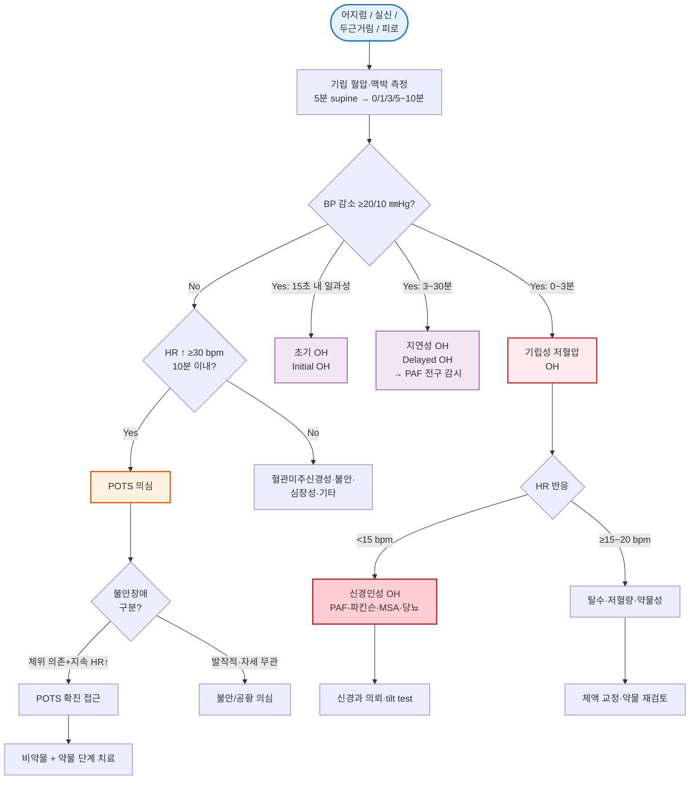

# 자율 신경 기능 장애 Autonomic Dysfunction

## <mark style="color:green;">일반 사항</mark>

* 교감·부교감 신경계의 기능 이상으로 심혈관, 소화기, 비뇨기, 발한, 성기능 등 다양한 장기에 걸친 증상이 발생하는 증후군
* 원발성(특발성) : 기저 질환 없이 자율신경계 자체의 퇴행성 변화
* 이차성 : 기저 질환(당뇨병, 파킨슨병, 알코올 등)에 의한 자율신경 손상 - 임상에서 대부분을 차지함
* 증상이 다양하고 비특이적이어서 신체증상장애와 감별이 필요함 (☞ [신체증상장애](031_-somatic-symptom-disorder.md))

### <mark style="color:orange;">대표적 증후군</mark>

**당뇨병성 자율신경병증**

* 이차성 자율신경 기능 장애의 가장 흔한 원인; 장기간 고혈당에 의한 자율신경 손상

**초기 기립성 저혈압 (Initial Orthostatic Hypotension, Initial OH)**

* 기립 후 15초 이내에 혈압이 급격히 하강(수축기 ≥40 ㎜Hg 또는 이완기 ≥20 ㎜Hg)했다가 곧 회복
* 주로 젊은 사람과 노인에서 흔함 - 젊은 층의 실신·현기증 원인 중 혈관미주신경성 실신과 함께 가장 흔한 원인 중 하나
* 일반적인 1·3·5분 혈압 측정으로는 놓치기 쉬움; "일어나는 즉시 아찔함을 느끼는지" 문진으로 선별

**지연성 기립성 저혈압 (Delayed Orthostatic Hypotension, Delayed OH)**

* 기립 후 3분 이내는 정상이나 3\~30분 사이에 혈압이 기준치(수축기 ≥20 ㎜Hg / 이완기 ≥10 ㎜Hg) 이상 감소
* 초기 자율신경 부전(early autonomic failure)의 조기 징후 - 파킨슨병·PAF의 전구 신호일 수 있어 증상이 있는 환자는 10분 이상 연장 측정과 정기 추적 필요

**체위성 빈맥 증후군 (Postural Orthostatic Tachycardia Syndrome, POTS)**

* 기립 시 심박수 ≥30회/분 증가(10분 이내), 단 기립성 저혈압 기준(수축기 ≥20 ㎜Hg 또는 이완기 ≥10 ㎜Hg 감소)을 충족하지 않아야 함 - 경미한 혈압 변동은 POTS에서도 흔하므로 strict하게 "혈압 저하 없음"으로 해석하지 않음
* 주로 젊은 여성
* 어지럼, 심계항진, 피로, 인지 저하("brain fog")
* 자가면역, Long COVID 후 발생 가능
* POTS 아형 (임상 특징으로 분류 가능, 중첩 존재)
  * 신경병성 (neuropathic) : 하지 sympathetic denervation → venous pooling; 하지 발한 감소
  * 과아드레날린성 (hyperadrenergic) : 기립 시 수축기 ≥10 ㎜Hg 상승 + 노르에피네프린 ≥600 pg/㎖; 떨림·불안·고혈압 경향
  * 저혈량성 (hypovolemic) : renin-aldosterone 저하; 염분·수분 요법에 반응 양호

**순수 자율신경 부전증 (Pure Autonomic Failure, PAF)**

* 기립성 저혈압이 주증상; 서서히 진행
* 상당수에서 파킨슨병·DLB·MSA 등 시누클레인병증(synucleinopathy)으로 이행 - 장기 추적 시 약 1/4에서 운동·인지 증상이 발현하며, 전향적 연구에서 연간 약 10\~15%의 이행률이 보고됨; 초기에 PAF로 진단되더라도 REM 수면행동장애·후각저하·경미한 운동 징후 유무를 추적 평가해야 함

**다계통 위축증 (Multiple System Atrophy, MSA)**

* 자율신경 부전 + 소뇌/파킨슨 증상 동반; 빠른 진행

## <mark style="color:green;">원인 및 위험 인자</mark>

**신경퇴행성 질환**

* 파킨슨병, 루이소체 치매, 다계통 위축증(MSA)

**대사성·전신 질환**

* 당뇨병(가장 흔한 이차성 원인), 아밀로이드증, 만성 신부전, 갑상선 기능 이상, 부신 피질 기능 저하증(Addison병)

**자가면역·감염**

* Sjögren 증후군, 자가면역 자율신경절병증, 길랭-바레 증후군
* 바이러스 감염 후 : Long COVID(COVID-19 감염 후 12주 이상 지속되는 증상) - POTS 유발의 주요 원인으로 부상; 자율신경절 항체, 소섬유신경병증(small fiber neuropathy), 탈조건화(deconditioning), 자율신경 조절 이상 등 복합 기전이 제시되는 단계이며 단일 기전으로 확정되지 않음

**결합조직 질환·비만세포 질환 (특히 POTS 동반)**

* Ehlers-Danlos 증후군(과운동형) : POTS와 강한 연관 — 관절 과운동성·피부 탄성 증가 확인
* 비만세포 활성 증후군(MCAS) : flushing + 빈맥 + POTS 중첩

**독성·약물**

* 알코올 남용(만성), 항암제(예: vinca alkaloids, platinum계), 항콜린제, α/β 차단제

**기타**

* 척수 손상, 부종양 증후군, 특발성

### <mark style="color:$danger;">🚩 Red Flags!</mark>

<mark style="color:$danger;">**즉각 응급 조치 및 이송**</mark> <mark style="color:$danger;">- 생명 위협 가능성</mark>

* 기립 시 실신 또는 의식 소실
* 심한 서맥·빈맥 동반 (심혈관계 자율신경 부전)
* 급격한 신경학적 악화 (MSA, 길랭-바레 의심)

<mark style="color:$warning;">**당일 의뢰 또는 긴급 평가**</mark>

* 기립성 저혈압이 조절되지 않아 낙상·외상 반복
* 새로 발생한 자율신경 증상 + 파킨슨 증상 동반 (MSA 감별 필요)
* POTS 의심 : 기립 시 심계항진·어지럼 + 젊은 여성
* 자율신경 부전 + 의도하지 않은 체중 감소·야간 발한 등 전신 증상 - 부종양 증후군, 아밀로이드증, 자가면역 자율신경절병증 등의 이차 원인 감별 필요

<mark style="color:$info;">**외래 추적 / 추가 평가**</mark>

* 당뇨병 환자에서 설명되지 않는 저혈압, 소화 장애, 배뇨 장애 - 당뇨병성 자율신경병증 평가
* PAF 진단 환자 - 시누클레인병증 이행 감시 (운동 징후, 후각, REM 수면행동장애 정기 평가)
* 치료에 반응하지 않는 경우 신경과 의뢰

## <mark style="color:green;">임상 양상</mark>

**심혈관계**

* 기립성 저혈압 : 가장 흔하고 임상적으로 중요; 어지럼, 실신, 낙상 (☞ [기립성 저혈압](../225_/096_-orthostatic-hypotension.md))
* 운동 불내성(exercise intolerance) : 운동 시 적절한 심박수 증가 불가
* 앙와위 고혈압 : 기립성 저혈압과 역설적으로 동반될 수 있음

**발한·분비**

* 발한 장애(과다 또는 저하), 침 분비 감소, 눈물 분비 감소

**소화기계**

* 소화 운동 감소, 위마비(gastroparesis), 식욕 부진, 팽만감, 변비, 설사, 삼킴곤란

**비뇨기계**

* 배뇨 지연, 요실금, 불완전 배뇨, 빈뇨, 야간 배뇨

**성기능**

* 발기 부전, 사정 장애, 질 건조, 오르가즘 장애

**기타**

* 수면 장애, 시야 흐림·동공 반사 저하, 피로, 인지 저하(POTS에서 두드러짐)

## <mark style="color:green;">진단</mark>

#### <mark style="color:$primary;">증상별 초기 접근</mark>

<table><thead><tr><th width="180">주 증상</th><th width="220">최우선 감별</th><th>핵심 진단 단계</th></tr></thead><tbody><tr><td>기립 시 어지럼</td><td>OH vs POTS vs Initial OH</td><td>5분 supine 후 즉시/1/3/(5~10)분 BP·HR 동시 측정</td></tr><tr><td>실신</td><td>혈관미주신경성 실신 vs OH vs 심장성 실신</td><td>OH 프로토콜 + 심전도; 재발성이면 tilt test 의뢰</td></tr><tr><td>두근거림</td><td>POTS vs 불안장애·공황장애 vs 부정맥</td><td>기립 10분 HR 변화 + Holter/심전도 + 심리 평가</td></tr><tr><td>광범위 자율신경 증상</td><td>당뇨병성 자율신경병증 vs PAF·MSA</td><td>기저 질환 평가 + 신경과 의뢰</td></tr></tbody></table>

### <mark style="color:orange;">검사</mark>

#### <mark style="color:$primary;">기립 혈압·맥박 측정 프로토콜 (표준화)</mark>

**Orthostatic Vital Signs Protocol**

1. Supine rest 최소 5분 (흡연·식사 직후 피할 것)
2. 누운 자세에서 BP·HR 측정 (baseline)
3. 바로 기립(active stand; "천천히" 아님)
4. 기립 즉시(0분, 가능하면 15초 이내), 1분, 3분 시점에 BP·HR 측정
5. 증상 지속·지연성 OH 의심 시 5분, 10분까지 연장 측정
6. BP·HR을 같은 시점에 동시에 기록(해석에 필수)

**해석 기준**

* 기립성 저혈압(OH) : 수축기 ≥20 ㎜Hg 또는 이완기 ≥10 ㎜Hg 감소 (고혈압 환자는 수축기 ≥30 ㎜Hg)
  * 초기 OH(Initial OH) : 기립 15초 이내 수축기 ≥40 또는 이완기 ≥20 ㎜Hg 일과성 하강 후 회복 - 표준 혈압계로 포착 어려움; 확진은 연속 혈압 모니터링(Finometer 등) 필요
  * 지연성 OH(Delayed OH) : 기립 후 3\~30분에 기준 이상 감소 - PAF·파킨슨병 전구 신호 가능성 평가
* POTS : 기립 후 10분 이내 HR ≥30 bpm 증가 + OH 기준 미충족
  * 12\~19세 청소년 : ≥40 bpm을 기준으로 적용

**HR 반응으로 원인 감별** (OH에서 가장 유용)

<table><thead><tr><th width="267">상황</th><th width="200">HR 반응</th><th>해석</th></tr></thead><tbody><tr><td>신경인성 OH (PAF, 파킨슨병, MSA, 당뇨병성 자율신경병증)</td><td>HR 증가 &#x3C;15 bpm (blunted)</td><td>압력수용체 반사궁의 교감 출력 저하</td></tr><tr><td>탈수·저혈량·약물성 OH</td><td>HR 증가 ≥15~20 bpm</td><td>정상 보상성 빈맥 - 체액 교정·약제 조정 반응 양호</td></tr></tbody></table>

#### <mark style="color:$primary;">전문 검사 (의뢰)</mark>

* Tilt table test : 적응증 - ⓵ 기립 혈압 측정만으로 진단이 불분명, ⓶ 재발성 실신, ⓷ POTS와 불안장애 구분이 어려운 경우
* Heart rate variability (HRV) test : 심호흡 시 심박수 변동 평가
* Valsalva response test : 자율신경 반사 평가
* Sudomotor function test (QSART) : 발한 기능 평가 - POTS·SFN 평가에 유용
* 피부 생검 (intraepidermal nerve fiber density, IENFD) : 소섬유신경병증 확진 - 일부 POTS(특히 neuropathic type)·Long COVID 관련 자율신경 증상에서 양성률 상승

#### <mark style="color:$primary;">기저 질환 감별 검사</mark>

* 혈당/HbA1c, TSH, 전해질, CBC, B12
* 아침 cortisol(또는 ACTH 자극 검사) : 부신 피질 기능 저하 배제 - OH + 피로 + 체중 감소 패턴에서 필수
* 필요 시 : 항ganglionic AChR 항체(자가면역 자율신경절병증), 부종양 항체

### <mark style="color:orange;">감별 진단</mark>

<table><thead><tr><th width="134">원인</th><th width="132">심혈관</th><th width="110">소화기</th><th width="100">비뇨기</th><th width="90">발한</th><th>특징적 단서</th></tr></thead><tbody><tr><td>당뇨병성</td><td>기립성 저혈압, 운동 불내성</td><td>위마비, 변비, 설사</td><td>배뇨 지연, 요실금</td><td>발한 감소(하지)</td><td>장기 당뇨 병력, HbA1c ↑</td></tr><tr><td>POTS</td><td>기립 시 빈맥(≥30 bpm), 혈압 유지</td><td>경도 복통, 팽만감</td><td>—</td><td>과발한 가능</td><td>젊은 여성, Long COVID 후</td></tr><tr><td>파킨슨병/MSA</td><td>기립성 저혈압(특히 MSA)</td><td>변비, 삼킴곤란</td><td>배뇨 장애</td><td>과발한</td><td>운동 증상 동반; MSA는 stridor</td></tr><tr><td>순수 자율신경 부전(PAF)</td><td>기립성 저혈압(심함)</td><td>변비</td><td>배뇨 장애</td><td>발한 감소</td><td>서서히 진행; 시누클레인병증 이행 감시</td></tr><tr><td>알코올성</td><td>기립성 저혈압</td><td>소화 장애, 설사</td><td>—</td><td>발한 이상</td><td>음주 병력, 말초신경병증 동반</td></tr></tbody></table>

**POTS vs 불안·공황장애 감별**&#x20;

<table><thead><tr><th width="173">특징</th><th width="241">POTS</th><th>불안/공황장애</th></tr></thead><tbody><tr><td>체위 의존성</td><td>O - 기립 시 악화, 누우면 호전</td><td>X - 자세와 무관</td></tr><tr><td>HR 증가 패턴</td><td>기립 시 지속적 ≥30 bpm 증가</td><td>발작적(episodic), 공황 삽화 중</td></tr><tr><td>누우면 호전</td><td>O - 수 분 이내 소실</td><td>X - 자세 변화 무관</td></tr><tr><td>과호흡·공포감</td><td>일반적으로 없음</td><td>두드러짐</td></tr><tr><td>심호흡·이완으로 호전</td><td>제한적</td><td>뚜렷함</td></tr></tbody></table>

* 신체증상장애 : 객관적 자율신경 검사 정상; 증상에 대한 과도한 집착; 심리적 요인 — 증상이 설명되지 않을 때 자율신경 기능 장애와 감별 필요 (☞ [신체증상장애](031_-somatic-symptom-disorder.md))
* 빈혈·탈수 : 기립성 저혈압 유발; 혈액 검사로 확인
* 약물 부작용 : 항고혈압제, 이뇨제, α차단제 등

***



<p align="center"><strong>자율신경 기능 장애 1차 진료 접근 알고리듬</strong></p>

<p align="center"><em><mark style="color:$info;">Ref. Freeman 2011 Consensus (OH 기준); Sheldon 2015 HRS (POTS 기준); Kaufmann 2017 Natural History of PAF</mark></em></p>

***

## <mark style="background-color:$warning;">Management</mark>

### <mark style="color:orange;">치료 방침</mark>

* 원인 질환 치료가 우선 - 기저 질환 조절로 증상 호전 가능
* 증상별 대증 치료 병행
* 비약물 치료를 기본으로 하고 필요 시 약물 추가

## <mark style="color:green;">비-약물 치료</mark>

#### <mark style="color:$primary;">기립성 저혈압 / POTS</mark>

* 수분 섭취 증가 (2\~3 L/일), 염분 섭취 증가 (6\~10 g/일)
* 압박 스타킹 착용 (하지 정맥 귀환량 증가)
* 기상 시 천천히 일어나기; 오랜 기립 피하기
* 소량 자주 식사 (식후 저혈압 예방)
* 단계적 운동 (Levine/Dallas Protocol) : POTS 병태생리의 핵심 중 하나가 탈조건화(deconditioning)이므로 운동 재활은 약물과 동등한 치료 축; 초기부터 직립 운동 시 증상 악화·치료 포기 위험 높음
  * 1단계 (4\~6주) : 수평 운동 - 수영, 로잉 머신, 누워서 하는 저항 운동 (심장이 머리와 같은 높이)
  * 2단계 (4\~6주) : 경사도 운동 - 사이클, 경사 트레드밀
  * 3단계 : 직립 운동 - 걷기, 달리기로 이행
* 앙와위 고혈압 관리 (기립성 저혈압과 역설적 동반)
  * 침대 머리 높이기 (Head-up tilt sleeping) - 10\~20도(약 15\~25 ㎝)
  * 저녁 염분 섭취 제한
  * 취침 전 탄수화물 간식(식후 저혈압 효과 이용)
  * 심한 경우에만 단시간 작용 항고혈압제(예: 단기 losartan) 고려 - 신경과 협진
* 고온 환경·알코올 회피

#### <mark style="color:$primary;">소화기 증상</mark>

* 소량 자주 식사, 저지방·저섬유 식이(위마비 시)
* 취침 시 상체 거상

#### <mark style="color:$primary;">비뇨기 증상</mark>

* 정해진 시간 배뇨 훈련, 이중 배뇨법(배뇨 후 잠시 후 재시도)

## <mark style="color:green;">약물 치료</mark>

#### <mark style="color:$primary;">기립성 저혈압</mark>

* fludrocortisone : 혈장량 증가; 0.05\~0.2 ㎎/d; \[부작용] 앙와위 고혈압, 저칼륨혈증, 부종 <mark style="color:blue;">\[플로리네프]</mark>
* midodrine : α1 작용제; 2.5\~10 ㎎ tid (취침 전 복용 금지); \[부작용] 입모근 반응, 앙와위 고혈압 <mark style="color:blue;">\[미드론]</mark>
* droxidopa : 노르에피네프린 전구체; 신경인성 기립성 저혈압(파킨슨병·MSA·PAF)에서 midodrine과 함께 고려; 100\~600 ㎎ tid; \[부작용] 앙와위 고혈압, 두통, 어지럼
  * 국내 접근성 제한적, 급여기준 미확인 - 파킨슨병·MSA 동반 신경인성 기립성 저혈압에는 신경과 의뢰 후 처방 권고; 당뇨병성 자율신경병증이나 일시적 약물 부작용에 의한 기립성 저혈압에는 비급여로 처방
* pyridostigmine : 콜린에스터라제 억제; 30\~60 ㎎ bid\~tid; 특히 POTS에서 고려 <mark style="color:blue;">\[메스티논]</mark>

#### <mark style="color:$primary;">POTS</mark>

 ※ 단일 약제로 모두 커버되지 않으므로 아형 또는주증상에 따라 선택

* β차단제(저용량) : 심박수 조절 - 과아드레날린성 POTS 우선 고려; propranolol 10\~20 ㎎ <mark style="color:blue;">\[인데놀]</mark>&#x20;
* ivabradine : If 채널 차단; 심박수 감소; β차단제 불내성 시 대안 <mark style="color:blue;">\[프로코라란]</mark>
* midodrine : 3\~10 ㎎ tid - 신경병성(neuropathic) POTS의 venous pooling에 유용
* fludrocortisone : 0.05\~0.2 ㎎/d - 저혈량성(hypovolemic) POTS에서 우선 선택
* pyridostigmine : 30\~60 ㎎ bid\~tid - 심박수 완화 + 위장관 증상 개선 효과

#### <mark style="color:$primary;">소화기 증상</mark>

* metoclopramide, domperidone : 위장관 운동 촉진 (단기) (☞ [소화기계약제](../224_/073_.md#gi-prokinetic-agent))

#### <mark style="color:$primary;">기저 질환 치료</mark>

* 당뇨병성 자율신경병증 : 혈당 조절 최적화 (☞ [당뇨병](../226_/100_-diabetes-mellitus.md))
* 알코올 남용 : 금주 (☞ [알코올 사용 장애](../230_/189_-alcohol-use-disorder-aud.md))
* 파킨슨병 (☞ [파킨슨병](035_-parkinsons-disease.md))

***

### <mark style="color:red;">질병코드</mark>

G90 자율신경계통의 장애

F45.3 신체형자율신경기능장애

***

## <mark style="color:purple;">처방례</mark>

> **처방례 1.** POTS — 기본 (심박수 조절)
>
> ```
> 인데놀 10 ㎎/T  1T  bid
> ※ 저용량; 심박수 조절 목적 (혈압 저하 주의)
> ※ 과아드레날린성 POTS에 우선 적용
> ※ 수분·염분 섭취 증가 + 압박 스타킹 병행
> ```

> **처방례 2.** POTS — β차단제 불내성 시
>
> ```
> 프로코라란 5 ㎎/T  1T  bid  식사 중
> ※ If 채널 차단으로 심박수 감소; 혈압 강하 효과 없음
> ※ 필요 시 7.5 ㎎ bid로 증량
> ```

> **처방례 3.** POTS — 저혈량성 아형 (혈장량 부족)
>
> ```
> 플로리네프 0.1 ㎎/T  1T  qd (아침)
> ※ renin-aldosterone 저하 경향·염분 보충에도 반응 부족한 경우
> ※ [부작용] 부종·저칼륨혈증 — 정기 전해질 모니터링
> ```

> **처방례 4.** POTS — 신경병성 아형 (venous pooling)
>
> ```
> 미도드린 2.5 ㎎/T  1T  tid (기상 후·점심·오후)
> ※ 반응 부족 시 5~10 ㎎ tid까지 증량
> ※ 취침 후 복용 금지; 복용 후 4시간 이내 눕지 않도록 지도
> ```

> **처방례 5.** POTS — 콜린에스터라제 억제
>
> ```
> 메스티논 30 ㎎/T  1T  bid~tid
> ※ 말초 자율신경 기능 강화; 심박수 완화 + 위장관 증상 개선
> ※ [부작용] 구역, 복통, 설사, 과다분비 — 식후 복용으로 위장 증상 경감
> ```

> **처방례 6.** 기립성 저혈압 — 혈장량 증가
>
> ```
> 플로리네프 0.1 ㎎/T  1T  qd (아침)
> ※ 시작 용량; 반응 부족 시 0.2 ㎎/d까지 증량
> ※ [부작용] 앙와위 고혈압, 저칼륨혈증, 부종 — 정기적 전해질·혈압 모니터링 필요
> ※ 취침 시 상체 30° 거상으로 앙와위 고혈압 완화
> ```

> **처방례 7.** 기립성 저혈압 — α1 작용제
>
> ```
> 미도드린 2.5 ㎎/T  1T  tid (기상 후·점심·저녁; 취침 3~4시간 전 마지막 복용)
> ※ 반응 부족 시 5~10 ㎎ tid까지 증량
> ※ [부작용] 입모근 반응(소름·두피 가려움), 앙와위 고혈압
> ※ 취침 후 복용 절대 금지; 복용 후 4시간 이내에는 눕지 않도록 지도
> ```

***

### <mark style="color:$success;">핵심 복약 지도</mark>

> **기립성 저혈압·POTS 약물 복용 안내**
>
> * 미도드린(혈압 올리는 약)은 **누운 자세에서 복용하면 혈압이 과도하게 오를 수 있습니다.** 반드시 취침 3\~4시간 전에 마지막으로 복용하고, 취침 후에는 복용하지 마십시오. 복용 후 **4시간 이내에는 눕지 않도록** 주의하십시오.
> * 플로리네프(혈장량 증가)는 **부종·저칼륨혈증**이 생길 수 있으므로 정기적으로 혈액 검사를 받으셔야 합니다.
> * 약보다 \*\*생활 습관 교정(수분·염분 섭취, 압박 스타킹, 천천히 일어나기)\*\*이 먼저입니다. 이를 충분히 실천한 후에도 증상이 지속될 때 약을 추가합니다.
> * POTS의 경우 **누워서 하는 운동부터 단계적으로 하는 재활 운동**이 약물과 동등한 치료 효과가 있습니다 — 꾸준히 4\~6주 이상 실천해야 효과가 나타납니다.
> * 임의로 약을 중단하거나 용량을 바꾸지 마시고, 증상 변화는 반드시 담당 의사에게 알려 주십시오.

> **언제 다시 병원을 방문해야 하나요?**
>
> * 일어서다가 의식을 잃거나 쓰러진 경우 — 즉시 내원
> * 심한 두근거림과 함께 가슴 통증이 생긴 경우
> * 다리·발 부종이 새로 생기거나 갑자기 심해진 경우 (플로리네프 복용 중)
> * 증상이 전반적으로 악화되는 경우

***

### <mark style="color:blue;">환자 안내서</mark>


**어지럼증과 두근거림, 약보다 생활 습관이 먼저입니다**

자율신경 기능 장애로 인한 증상은 수분·염분 섭취와 천천히 일어나는 습관만으로도 상당히 호전될 수 있습니다.


#### <mark style="color:$primary;">자율신경 기능 장애란 무엇인가요?</mark>

* 심장 박동, 혈압, 소화, 배뇨, 발한 등을 자동으로 조절하는 자율신경계가 제대로 작동하지 않아 다양한 증상이 나타나는 상태
* 가장 흔한 증상은 \*\*일어설 때 어지럼증(기립성 저혈압)\*\*과 **누워 있다가 일어서면 심장이 빨리 뛰는 것(POTS)**
* 대부분 생활 습관 교정과 적절한 치료로 호전됨

#### <mark style="color:$primary;">왜 물과 소금이 중요한가요?</mark>

* 우리 몸의 혈액량이 부족하면 일어설 때 뇌로 가는 피가 줄어 어지럼증이 생깁니다
* **물(하루 2\~3 L)은 혈액량을 늘리고, 소금은 물이 몸에 남아 있게 도와줍니다**
* 음식을 평소보다 약간 짜게 드시거나, 짠 국물·김치·젓갈 등을 활용하세요
* 단, **심부전·신부전·고혈압**이 있으시면 반드시 담당 의사와 상의 후 조절하세요

#### <mark style="color:$primary;">왜 누워서 하는 운동부터 시작해야 하나요?</mark>

* POTS나 기립성 저혈압 환자는 서서 운동을 하면 증상이 심해져 운동을 포기하게 되기 쉽습니다
* **수영, 로잉 머신, 누워서 하는 근력 운동**처럼 심장과 머리가 같은 높이에 있는 운동부터 시작하면, 심장 기능이 회복되어 점차 서 있어도 괜찮아집니다
* 4\~6주 후 익숙해지면 실내 자전거 → 걷기 → 달리기 순으로 단계를 올리세요
* 꾸준히 하면 **약과 비슷할 정도의 효과**가 있는 핵심 치료입니다

#### <mark style="color:$primary;">생활 속 실천 사항</mark>

**일어날 때**

* 누운 채로 발목을 10회 위아래로 펌핑한 후 → 천천히 앉기 → 30초 기다린 후 일어서기
* 오랫동안 서 있어야 할 때는 다리를 교차하거나 발뒤꿈치를 들었다 내렸다 하세요

**압박 스타킹**

* 아침에 **누운 채로** 착용하세요 (일어선 후 착용하면 효과가 줄어듭니다)

**피해야 할 것**

* 오랫동안 서 있기, 뜨거운 목욕·사우나, 과도한 음주
* 식사를 한꺼번에 많이 먹기 (식후 혈압이 떨어질 수 있습니다 — 소량씩 자주 드세요)

#### <mark style="color:$primary;">스마트워치 활용 (참고)</mark>

* 애플워치·갤럭시워치 등의 심박수 기록으로 **기립 시 심박수 변화를 스스로 관찰**할 수 있습니다
* 누워 있을 때와 일어선 후 10분간의 심박수를 비교해 30 bpm 이상 꾸준히 증가하면 진료 시 담당 의사에게 기록을 보여 주세요
* 단, 의료기기 수준의 정확성은 없으므로 **진단은 반드시 진료실 측정으로 확인**합니다

#### <mark style="color:$primary;">이것만은 꼭 기억하세요</mark>

* 증상이 있다고 해서 심각한 심장병이나 뇌 질환이 있다는 뜻이 아닙니다
* 생활 습관을 꾸준히 실천하는 것이 약만큼, 때로는 약보다 더 중요합니다
* 증상이 좋아지더라도 의사와 상의 없이 약을 임의로 중단하지 마세요

***
