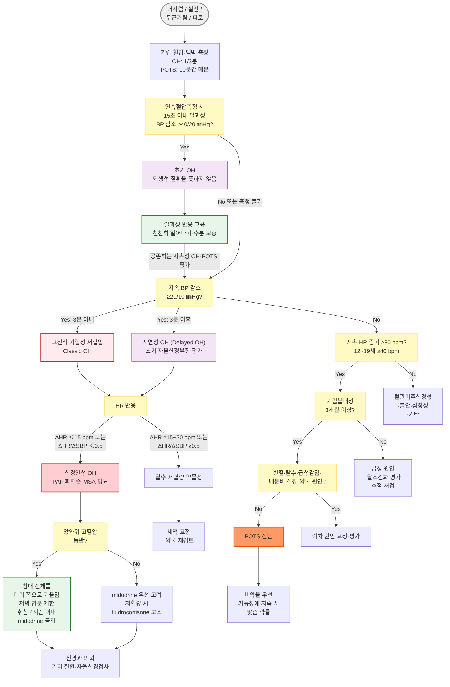

# 자율 신경 기능 장애 Autonomic Dysfunction

## <mark style="color:green;">일반 사항</mark>

* 교감·부교감 신경계의 기능 이상으로 심혈관, 소화기, 비뇨기, 발한, 성기능 등 다양한 장기에 걸친 증상이 발생하는 증후군
* 원발성 : 뚜렷한 이차 원인이 확인되지 않는 경우 - PAF·MSA·[파킨슨병](035_-parkinsons-disease.md)·루이소체 치매 같은 신경퇴행성 질환과 POTS·[반사성 실신](022_-reflex-syncope.md) 같은 비퇴행성 증후군을 모두 포함
* 특발성 : 원인 미확인을 뜻하며 퇴행성을 의미하지 않음
* 이차성 : 당뇨병, 아밀로이드증, 알코올, 약물, 자가면역 질환 등에 의한 자율신경 손상 - 1차 진료에서는 약물·탈수·당뇨병 등 교정 가능한 이차 원인을 먼저 확인
* 증상이 다양하고 비특이적이어서 신체증상장애와 감별이 필요함 (☞ [신체증상장애](031_-somatic-symptom-disorder.md))

### <mark style="color:orange;">대표적 증후군</mark>

**당뇨병성 자율신경병증**

* 이차성 자율신경 기능 장애의 가장 흔한 원인; 장기간 고혈당에 의한 자율신경 손상

**자세성 기립성 빈맥 증후군 (Postural Orthostatic Tachycardia Syndrome, POTS; 체위성 빈맥 증후군)**

* **3개월 이상 지속되는 기립불내성 증상**과 함께, 기립 또는 head-up tilt 후 10분 이내 심박수가 성인에서 ≥30회/분(12\~19세 ≥40회/분) 증가하고 그 증가가 **2회 이상 연속 측정에서 지속**되는 만성 자율신경질환
* 지속성 기립성 저혈압 기준(수축기 ≥20 ㎜Hg 또는 이완기 ≥10 ㎜Hg 감소)을 충족하지 않아야 하며, 빈혈·탈수·급성 감염·내분비질환·심장질환·약물 등 다른 빈맥 원인을 배제해야 함. 기립 직후의 일과성 혈압저하(Initial OH)는 POTS와 공존할 수 있음
* 경미한 혈압 변동은 POTS에서도 흔하므로 strict하게 "혈압 저하 없음"으로 해석하지 않음
* 약 90%가 여성이고 13\~29세에서 가장 흔하지만 어느 연령에서도 발생 가능
* 미국 인구의 약 0.1\~1%로 추정 \[Chung & Raj, JAMA 2026]. 2025년 미국 EHR 연구에서는 연령표준화 진단 발생률 24.5/10만 명, 진단 유병률 100/10만 명으로 추정되었으나 미국의 전용 ICD-10-CM 코드가 2022년에 도입되어 과소진단 가능성이 있음. 국내 인구기반 역학 연구는 부족하므로 이 수치를 국내에 그대로 적용하지 않음 \[Lusk, Mayo Clin Proc 2025]
* 기립 시 어지럼·심계항진·전실신이 발생하고 누우면 호전되는 것이 특징; 피로, 운동불내성, 인지 저하("brain fog"), 두통, 호흡곤란, 위장관 증상, 수면 장애 등이 동반될 수 있음
* POTS 아형 (임상 특징으로 분류 가능하나 기전과 아형이 서로 중첩됨)
  * 신경병성 (neuropathic) : 하지 sympathetic denervation → venous pooling; 하지 발한 감소
  * 과아드레날린성 (hyperadrenergic) : 기립 시 수축기 ≥10 ㎜Hg 상승 + 노르에피네프린 ≥600 pg/㎖; 떨림·불안·고혈압 경향
  * 저혈량성 (hypovolemic) : renin-aldosterone 저하; 염분·수분 요법에 반응 양호
* 예후 : 경과가 길고 변동성이 크며, 상당수가 치료로 기능이 개선되지만 완전한 증상 소실은 드묾. 생존자료는 제한적이나 현재까지 사망률 증가와 관련된 것으로 보이지 않음. 근거는 3차 의료기관의 소규모 코호트 중심이므로 일반화에 주의 \[Chung & Raj, JAMA 2026]

**순수 자율신경 부전증 (Pure Autonomic Failure, PAF)**

* 기립성 저혈압이 주증상; 서서히 진행
* 일부에서 파킨슨병·DLB·MSA 등 중추성 α-synucleinopathy로 이행. 2026년 메타분석(9개 코호트, 900명)에서는 평균 6.4년 동안 약 30%가 이행했고 통합 발생률은 100인년당 5.09건(약 5%/년)이었으나, 연구대상·추적기간에 따라 위험이 달라 개별 환자의 연간 위험으로 단순 적용하지 않음. 이행 예측인자는 배뇨장애·REM 수면행동장애·경미한 운동 징후이며, 후각 보존은 MSA 이행 가능성을, 후각저하·경도인지장애는 루이소체 질환(PD·DLB) 이행 가능성을 상대적으로 높이는 단서임. MSA 이행은 추적 초기 수년에 집중됨 \[Virameteekul, JAMA Neurol 2026]

**다계통 위축증 (Multiple System Atrophy, MSA)**

* 자율신경 부전 + 파킨슨증 또는 소뇌실조; 파킨슨병보다 빠르게 진행
* 조기 의뢰 단서 : 발병 초기의 중증 배뇨장애(요실금·잔뇨) 또는 발기부전, levodopa 반응 불량, stridor(특히 야간), REM 수면행동장애, 지지적 MRI 소견 → 신경과 의뢰 \[MDS 2022]

**자가면역 자율신경절병증 (Autoimmune Autonomic Ganglionopathy, AAG)**

* 수일\~수주에 걸친 급성·아급성 광범위 자율신경 부전(기립성 저혈압, 위장관 운동장애, 요폐, 무한증, 구강·안구건조, 동공 이상)
* ganglionic AChR 항체 양성이 진단을 지지하나 혈청음성 사례도 있음; 부종양성 원인 감별 필요
* 신경과 긴급 의뢰 대상이며 면역치료는 전문의 영역

## <mark style="color:green;">원인 및 위험 인자</mark>

**신경퇴행성 질환**

* 파킨슨병, 루이소체 치매, 다계통 위축증(MSA)

**대사성·전신 질환**

* 당뇨병(가장 흔한 이차성 원인), 만성 신부전, 부신 피질 기능 저하증(Addison병)
* 갑상선 기능 이상 : Hashimoto 갑상선염의 피로·체중 변화·체온 조절 이상이 POTS와 중첩될 수 있어 갑상선 기능 확인
* 아밀로이드증 : 특히 유전성 트랜스티레틴 아밀로이드증(hATTR) - 자율신경 부전 + 길이의존성 말초신경병증 + 양측 수근관증후군 또는 원인 불명 심근비후가 동반되면 의심; 질병조절 치료가 가능하므로 조기 의뢰

**자가면역·감염**

* Sjögren 증후군(안구·구강 건조, 신경병증 또는 다른 자가면역 소견이 있으면 고려), 자가면역 자율신경절병증, 길랭-바레 증후군
* 감염 후 : POTS의 약 30\~40%는 SARS-CoV-2, Epstein-Barr virus, 인플루엔자 등 감염 후 수주\~수개월(대개 3개월 이내)에 시작; Long COVID와도 중첩될 수 있음. 자가면역, 소섬유신경병증(small fiber neuropathy), 탈조건화(deconditioning), 혈량 조절 이상 등 복합 기전이 제시되지만 단일 기전으로 확정되지 않음
* 북미 중심 환자 설문에서 감염 외에 수술(12%), 임신(9%), 모든 종류의 백신접종(6%), 외상·뇌진탕(4%) 등이 증상 발생 전 선행사건으로 보고되었으나, 후향적 자기보고에 따른 시간적 연관성이 인과관계를 의미하지는 않음
* COVID-19 : 감염 후와 백신접종 후 모두 POTS 관련 진단이 늘어난 관찰연구가 있고 감염 후 증가가 더 두드러졌으나, 두 집단이 서로 달라 직접 비교가 불가능하다는 점이 원저자 정정으로 명시됨; 인과관계와 절대위험으로 해석하지 않음 \[Kwan, Nat Cardiovasc Res 2022]

**결합조직 질환·비만세포 질환 (특히 POTS 동반)**

* Ehlers-Danlos 증후군(과운동형) : POTS와 동반될 수 있음 - 관절 과운동성·피부 탄성 증가 확인
* 비만세포 활성 증후군(MCAS) : flushing·두드러기·위장관 증상과 POTS가 중첩될 수 있으나 이런 증상만으로 진단하지 않음. ① 반복되는 급성 다기관 비만세포 매개 증상, ② 발작 중 매개물질의 객관적 증가(예: 혈청 tryptase가 기저치×1.2 + 2 ng/㎖ 이상), ③ 항매개체 치료 반응을 모두 충족해야 하며, 의심 시 알레르기내과 의뢰

**독성·약물**

* 알코올 남용(만성), 항암제(예: vinca alkaloids, platinum계), 항콜린제, α-차단제; β차단제는 OH를 악화시킬 수 있으나 POTS의 두드러진 빈맥에는 저용량을 치료제로 사용하기도 함

**기타**

* 척수 손상, 부종양 증후군, 특발성

## <mark style="color:green;">임상 양상</mark>

**심혈관계**

* 기립성 저혈압 : 가장 흔하고 임상적으로 중요; 어지럼, 실신, 낙상 (☞ [기립성 저혈압](../225_/096_-orthostatic-hypotension.md))
* 운동 불내성(exercise intolerance) : 운동 시 과도한 빈맥, 호흡곤란, 피로·전실신 또는 비정상적인 혈압·심박수 반응으로 기대되는 활동을 지속하기 어려움. 일부 진행성 자율신경병증에서는 심박수 증가가 둔화될 수 있음
* 앙와위 고혈압 : 기립성 저혈압과 역설적으로 동반될 수 있음
* 신경인성 기립성 저혈압의 특징 : 어지럼보다 기립 시 뒷목·어깨 통증(coat-hanger pain), 피로, 시야 흐림, 인지 저하로 나타나는 경우가 많음; 아침 기상 직후·식후·더운 환경·운동 후에 악화; 앙와위 고혈압 동반 시 야간뇨(압력 나트륨이뇨)
* 당뇨병성 심혈관 자율신경병증 : 안정 시 빈맥(＞100 bpm), 운동 시 심박수 반응 둔화, 무증상 심근허혈, 저혈당 무감지, 수술·마취 중 혈역학 불안정

**발한·분비**

* 발한 장애(과다 또는 저하), 침 분비 감소, 눈물 분비 감소

**소화기계**

* 소화 운동 감소, 위마비(gastroparesis), 식욕 부진, 팽만감, 변비, 설사, 삼킴곤란

**비뇨기계**

* 배뇨 지연, 요실금, 불완전 배뇨, 빈뇨, 야간 배뇨

**성기능**

* 발기 부전, 사정 장애, 질 건조, 오르가즘 장애

**기타**

* 수면 장애, 시야 흐림·동공 반사 저하, 피로, 인지 저하(POTS에서 두드러짐)
* POTS에서는 편두통, 과민성장증후군, 과운동형 Ehlers-Danlos 증후군, ME/CFS, 섬유근육통, 비만세포 활성 증후군 등이 동반·중첩되어 증상 부담을 높일 수 있음

### <mark style="color:$danger;">🚩 Red Flags!</mark>

<mark style="color:$danger;">**즉각 조치**</mark>

* 운동 중 또는 앙와위 실신, 심계항진 직후 실신, 지속되는 의식장애, 흉통·심한 호흡곤란·혈역학적 불안정 또는 중증 외상을 동반한 실신 `심장성 실신`
* 지속적 중증 서맥·빈맥 또는 비정상 심전도와 함께 실신·전실신 `부정맥`
* 급격히 진행하는 근력저하·호흡근 약화·연하곤란 `길랭-바레 증후군`
* 새로 발생한 급성 기립성 저혈압 + 흑색변·토혈 또는 발열·의식 변화 `급성 출혈` `패혈증`
* 저혈압 + 구토·복통·저나트륨혈증·고칼륨혈증 `부신 위기`
* T6 이상 척수손상 환자에서 급격한 혈압 상승 + 박동성 두통·손상 부위 위쪽 홍조·발한 `자율신경 반사부전`
* desmopressin 복용 중 두통·구역에 이어 혼동·경련 `중증 저나트륨혈증`

<mark style="color:$warning;">**당일\~수일 내 평가**</mark>

* 기립성 저혈압이 조절되지 않아 낙상·외상 반복 `신경인성 기립성 저혈압`
* 수일\~수주 사이 급속히 발생한 중증 기립성 저혈압 + 요폐·장마비/심한 변비·광범위 무한증·구강/안구건조·동공반응 이상 `자가면역 자율신경절병증` `부종양성 자율신경병증`
* 새로 발생한 자율신경 증상 + 파킨슨증·소뇌실조·stridor 또는 조기 중증 배뇨장애 `다계통 위축증` `파킨슨병`
* 자율신경 부전 + 의도하지 않은 체중 감소·야간 발한 `부종양 증후군` `아밀로이드증`
* 승압제 복용 중 앙와위 혈압 ≥180/110 ㎜Hg가 반복 `중증 앙와위 고혈압`
* 실신 + 구조적 심질환 또는 젊은 나이 급사 가족력 `심장성 실신`

<mark style="color:$info;">**조기 평가 및 추적**</mark>

* 당뇨병 환자에서 설명되지 않는 저혈압, 안정 시 빈맥, 소화 장애, 배뇨 장애 `당뇨병성 자율신경병증`
* 만성 기립불내성 증상 + 기립 빈맥 : 일차진료에서 10분 active stand test와 이차 원인 평가; 단순 의심만으로 당일 의뢰하지 않음 `POTS`
* PAF 진단 환자 : 배뇨장애·REM 수면행동장애·경미한 운동 징후·후각 정기 평가 `시누클레인병증 이행`
* 진단이 불확실하거나 비전형적이거나 초기 치료에도 기능장애가 지속되는 경우 심장내과·신경과 또는 자율신경 전문의 의뢰 `진단 재평가`

## <mark style="color:green;">진단</mark>

### <mark style="color:orange;">증상별 초기 접근</mark>

<table><thead><tr><th width="180">주 증상</th><th width="220">최우선 감별</th><th>핵심 진단 단계</th></tr></thead><tbody><tr><td>기립 직후 어지럼</td><td>Initial OH vs 혈관미주신경 반응</td><td>병력(기립 직후 수초\~30초의 일과성 증상)으로 의심; 확인은 beat-to-beat 연속혈압 측정</td></tr><tr><td>기립 후 수분간 지속되는 어지럼·심계항진</td><td>OH vs POTS</td><td>5\~10분 supine 후 10분 active stand test</td></tr><tr><td>실신</td><td>혈관미주신경성 실신 vs OH vs 심장성 실신</td><td>위험소견 평가 + 기립검사 + 심전도; 원인 불명·재발 시 tilt test 등 의뢰</td></tr><tr><td>두근거림</td><td>POTS vs 부정맥·inappropriate sinus tachycardia vs 불안·공황장애</td><td>10분 active stand + 심전도; 앙와위 빈맥·비기립성 삽화 시 Holter</td></tr><tr><td>광범위 자율신경 증상</td><td>당뇨병성 자율신경병증 vs PAF·MSA</td><td>기저질환 평가 + 신경과 의뢰</td></tr></tbody></table>

### <mark style="color:orange;">검사</mark>

#### <mark style="color:$primary;">기립 혈압 반응의 시간적 유형</mark>

* 초기 기립성 저혈압(Initial OH) : 능동 기립 후 15초 이내 수축기 ≥40 또는 이완기 ≥20 ㎜Hg가 일과성으로 하강한 뒤 대개 30초 이내 회복. 청소년·젊은 성인에서도 흔하며 그 자체가 퇴행성 자율신경질환을 의미하지 않음. 일반 커프 혈압계로 포착하기 어려워 확진에는 beat-to-beat 연속혈압 측정이 필요
* 고전적 기립성 저혈압(Classic OH) : 기립 또는 60도 이상 head-up tilt 후 3분 이내 수축기 ≥20 또는 이완기 ≥10 ㎜Hg가 지속적으로 감소
* 지연성 기립성 저혈압(Delayed OH) : 기립 또는 head-up tilt 후 3분을 지나 처음 나타나는 지속성 혈압저하. 10분 기립검사에서 확인되지 않아도 병력이 강하게 시사하면 더 장시간 tilt-table test를 고려하며, 초기 자율신경 부전 또는 PAF·파킨슨병의 전구 신호 가능성을 평가

#### <mark style="color:$primary;">기립 혈압·맥박 측정 프로토콜 (표준화)</mark>

**기립성 저혈압 평가 프로토콜**

1. Supine rest 최소 5분 (흡연·식사 직후 피할 것)
2. 누운 자세에서 BP·HR 측정 (baseline)
3. 낙상 위험을 방지하도록 의료진이 가까이에서 보호한 상태에서 바로 기립(active stand; 일상생활 교육의 "천천히 일어나기"와 구분)
4. 기립 1분, 3분 시점에 BP·HR 측정 (initial OH는 일반 커프로 신뢰성 있게 포착되지 않으므로 표준 검사 판정에 사용하지 않음)
5. 증상 지속·지연성 OH 의심 시 5분, 10분까지 연장 측정
6. BP·HR을 같은 시점에 동시에 기록(해석에 필수)

* Initial OH 의심(기립 직후 수초\~30초 이내의 일과성 어지럼·시야 흐림) : beat-to-beat 연속혈압측정이 가능한 경우에만 평가

**POTS 10분 active stand protocol**

1. 앙와위에서 5\~10분 안정 후 BP·HR과 증상을 기록
2. 신속하게 일어서서 10분간 유지
3. 기립 후 **매분 BP·HR과 증상**을 기록
4. 심박수 증가가 성인 ≥30 bpm(12\~19세 ≥40 bpm)이고 **2회 이상 연속 측정에서 지속**되는지 확인
5. 3개월 이상 지속되는 기립불내성 증상이 있고, 지속성 OH 및 다른 빈맥 원인을 배제해야 진단
6. 첫 검사에서 기준에 미달하나 임상적 의심이 높으면, 기립 심박수 반응의 일중 변동을 고려해 오전(기상 후 이른 시간)에 반복

**해석 기준**

* 기립성 저혈압(OH) : 수축기 ≥20 ㎜Hg 또는 이완기 ≥10 ㎜Hg 감소. 앙와위 고혈압이 있는 환자에서는 수축기 ≥30 ㎜Hg 감소를 기준으로 사용하는 것이 더 적절할 수 있음
  * 초기 OH·지연성 OH의 정의는 위 '기립 혈압 반응의 시간적 유형' 참조
* POTS : 기립 후 10분 이내 HR ≥30 bpm 증가(12\~19세 ≥40 bpm)가 2회 이상 연속 측정에서 지속 + 지속성 OH 기준 미충족 + 3개월 이상 기립불내성 증상 + 이차 원인 배제. Initial OH는 공존 가능
  * 초기에 기준 이상 증가했다가 곧 정상화되면 지속성 기립 빈맥 기준을 충족하지 않음
  * 앙와위 안정 시 HR ＞100 bpm이면 inappropriate sinus tachycardia나 부정맥 등 다른 원인을 심전도·Holter로 평가; 당뇨병 환자에서는 심혈관 자율신경병증의 소견일 수 있음

**HR 반응으로 원인 감별** (OH에서 가장 유용)

<table><thead><tr><th width="267">상황</th><th width="200">HR 반응</th><th>해석</th></tr></thead><tbody><tr><td>신경인성 OH (PAF, 파킨슨병, MSA, 당뇨병성 자율신경병증)</td><td>HR 증가 ＜15 bpm이 흔함; ΔHR/ΔSBP ＜0.5 bpm/㎜Hg</td><td>압력수용체 반사궁의 교감 출력 저하를 시사</td></tr><tr><td>탈수·저혈량·약물성 OH</td><td>HR 증가 ≥15\~20 bpm이 흔함; ΔHR/ΔSBP ≥0.5 bpm/㎜Hg</td><td>정상 보상성 빈맥을 지지 - 체액 교정·약제 조정 반응 양호</td></tr></tbody></table>

* 절대 HR 증가량은 1차 진료에서 빠른 선별에 유용하고, ΔHR/ΔSBP 비율은 혈압 하강 폭을 함께 반영하므로 신경인성 원인 감별을 보완함. 심방세동·심박조율기 또는 β차단제 등 심박수 반응을 제한하는 상황에서는 해석에 주의

#### <mark style="color:$primary;">전문 검사 (의뢰)</mark>

* Tilt table test : 스스로 10분간 서 있기 어렵거나 active stand로 증상·심박수 변화를 재현하기 어렵거나 진단 확인이 필요한 불확실한 사례
* Heart rate variability (HRV) test : 심호흡 시 심박수 변동 평가
* Valsalva response test : 자율신경 반사 평가
* Sudomotor function test (QSART) : 발한 기능 평가 - POTS·SFN 평가에 유용
* 피부 생검 (intraepidermal nerve fiber density, IENFD) : 소섬유신경병증 평가 - 일부 POTS(특히 neuropathic type)·Long COVID 관련 자율신경 증상에서 이상이 확인되지만 POTS 확진 필수검사는 아님

#### <mark style="color:$primary;">기저질환 감별 검사</mark>

* 혈액 검사 : CBC, ferritin, 종합대사패널(전해질·신기능·혈당·간기능), TSH
* 심전도
* 아침 cortisol(필요 시 ACTH 자극 검사) : 부신 피질 기능 저하 배제; OH·피로·체중 감소·색소침착 등 임상 단서가 있으면 특히 확인
* 앙와위 빈맥, 비기립성 심계항진 또는 부정맥 의심 시 Holter; 임상 단서에 따라 심초음파·갈색세포종 검사
* 당뇨병·신경병증 위험에 따라 HbA1c, B12 등 추가
* 당뇨병 환자 : 2형은 진단 시부터, 1형은 진단 5년 후부터 매년 신경병증 선별 시 자율신경병증 증상·징후(안정 시 빈맥, 기립성 저혈압, 위장관·배뇨·성기능 증상)를 함께 평가 \[ADA 2026] (☞ [당뇨병](../226_/100_-diabetes-mellitus.md))
* 위마비 의심 시 : 기계적 폐색을 먼저 배제하고, 위배출을 지연시키는 약물(GLP-1 수용체 작용제, opioid, 항콜린제)을 확인한 뒤 위배출 신티그래피 의뢰
* 필요 시 : 항ganglionic AChR 항체(자가면역 자율신경절병증), 부종양 항체
* 면역학적 요인 고려 : Long COVID·난치성 POTS에서 GPCR(G-단백질 결합 수용체) 자가항체 - β2-adrenergic, muscarinic M2, α1-adrenergic, AT1 등 - 가 일부 환자에서 확인되었으나 연구 단계이며, POTS 진단·아형 분류·치료 선택을 위한 일상검사로 권고하지 않음

#### <mark style="color:$primary;">POTS 의심 시 신체진찰</mark>

* 흉부 청진과 심폐 진찰
* 관절 과운동성·피부 탄성 등 결합조직질환 소견
* 근력·감각·심부건반사를 포함한 신경학적 검사
* 복부 압통·팽만과 위장관운동장애 단서
* 피부 발진·두드러기·홍조 및 안구·구강건조 등 피부·점막 소견

### <mark style="color:orange;">감별 진단</mark>

<table><thead><tr><th width="134">원인</th><th width="132">심혈관</th><th width="110">소화기</th><th width="100">비뇨기</th><th width="90">발한</th><th>특징적 단서</th></tr></thead><tbody><tr><td>당뇨병성</td><td>기립성 저혈압, 운동 불내성</td><td>위마비, 변비, 설사</td><td>배뇨 지연, 요실금</td><td>발한 감소(하지)</td><td>장기 당뇨 병력, HbA1c ↑</td></tr><tr><td>POTS</td><td>지속성 기립 빈맥, OH 기준 미충족</td><td>오심, 팽만감, 변비·설사</td><td>-</td><td>과발한 가능</td><td>3개월 이상 기립불내성; 젊은 여성·감염 후 흔함</td></tr><tr><td>파킨슨병/MSA</td><td>기립성 저혈압(특히 MSA)</td><td>변비, 삼킴곤란</td><td>배뇨 장애</td><td>과발한</td><td>운동 증상 동반; MSA는 stridor</td></tr><tr><td>순수 자율신경 부전(PAF)</td><td>기립성 저혈압(심함)</td><td>변비</td><td>배뇨 장애</td><td>발한 감소</td><td>서서히 진행; 시누클레인병증 이행 감시</td></tr><tr><td>알코올성</td><td>기립성 저혈압</td><td>소화 장애, 설사</td><td>-</td><td>발한 이상</td><td>음주 병력, 말초신경병증 동반</td></tr></tbody></table>

**POTS vs 불안·공황장애 감별**

<table><thead><tr><th width="173">특징</th><th width="241">POTS</th><th>불안/공황장애</th></tr></thead><tbody><tr><td>체위와의 연관</td><td>기립 시 재현·악화되고 누우면 호전되는 경향</td><td>자세와 무관한 삽화가 흔하지만 개인차가 있음</td></tr><tr><td>HR 증가 패턴</td><td>10분 active stand에서 지속성 증가가 객관적으로 재현</td><td>공황 삽화 중 발작적 빈맥; 기립검사 기준을 일관되게 충족하지 않음</td></tr><tr><td>동반 증상</td><td>어지럼·전실신·피로·운동불내성·brain fog; 불안감·과호흡도 가능</td><td>갑작스러운 강한 공포, 파국적 인지, 회피 행동 등이 두드러질 수 있음</td></tr><tr><td>경과</td><td>기립불내성 증상이 3개월 이상 지속</td><td>반복되는 공황발작과 발작 사이 예기불안 여부 평가</td></tr><tr><td>핵심</td><td>객관적 기립 빈맥과 이차 원인 배제</td><td>정신의학적 진단기준에 따른 평가</td></tr></tbody></table>

* POTS와 불안·공황장애는 서로 배타적이지 않으며 동반될 수 있음. 불안감이나 과호흡의 존재만으로 POTS를 배제하지 않음
* 신체증상장애 : 자율신경검사의 정상 여부나 의학적 설명 가능성으로 진단하지 않음. 증상 또는 건강에 관한 과도하고 지속적인 사고·불안·행동과 기능장애를 양성 기준으로 평가하며, 자율신경질환과 병존할 수 있음 (☞ [신체증상장애](031_-somatic-symptom-disorder.md))
* 빈혈·탈수 : 기립성 저혈압 유발; 혈액 검사로 확인
* 약물 부작용 : 항고혈압제, 이뇨제, α차단제 등

***


```mermaid
graph TD
    Start(["어지럼 / 실신 /<br/>두근거림 / 피로"]) --> Step1["기립 혈압·맥박 측정<br/>OH: 1/3분<br/>POTS: 10분간 매분"]
    Step1 --> Q0["연속혈압측정 시<br/>15초 이내 일과성<br/>BP 감소 ≥40/20 ㎜Hg?"]
    Q0 -->|Yes| IOH["초기 OH<br/>퇴행성 질환을 뜻하지 않음"]
    Q0 -->|"No 또는 측정 불가"| Q1["지속 BP 감소<br/>≥20/10 ㎜Hg?"]
    IOH --> IOH_Tx["일과성 반응 교육<br/>천천히 일어나기·수분 보충"]
    IOH_Tx -->|"공존하는 지속성 OH·POTS 평가"| Q1
    Q1 -->|"Yes: 3분 이내"| OH["고전적 기립성 저혈압<br/>Classic OH"]
    Q1 -->|"Yes: 3분 이후"| DOH["지연성 OH (Delayed OH)<br/>초기 자율신경부전 평가"]
    Q1 -->|No| Q2["지속 HR 증가 ≥30 bpm?<br/>12~19세 ≥40 bpm"]
    Q2 -->|Yes| Chronic["기립불내성<br/>3개월 이상?"]
    Q2 -->|No| Other["혈관미주신경성<br/>·불안·심장성<br/>·기타"]
    OH --> QHR["HR 반응"]
    DOH --> QHR
    QHR -->|"ΔHR ＜15 bpm 또는<br/>ΔHR/ΔSBP ＜0.5"| Neuro["신경인성 OH<br/>PAF·파킨슨·MSA·당뇨"]
    QHR -->|"ΔHR ≥15~20 bpm 또는<br/>ΔHR/ΔSBP ≥0.5"| Volume["탈수·저혈량·약물성"]
    Neuro --> SupHTN["앙와위 고혈압<br/>동반?"]
    SupHTN -->|Yes| SupYes["침대 전체를 <br/>머리 쪽으로 기울임<br/>저녁 염분 제한<br/>취침 4시간 이내 <br/>midodrine 금지"]
    SupHTN -->|No| SupNo["midodrine 우선 고려<br/>저혈량 시 <br/>fludrocortisone 보조"]
    Chronic -->|Yes| Excl["빈혈·탈수·급성감염·<br/>내분비·심장·약물 원인?"]
    Chronic -->|No| Recheck["급성 원인<br/>·탈조건화 평가<br/>추적 재검"]
    Excl -->|No| POTSconf["POTS 진단"]
    Excl -->|Yes| Secondary["이차 원인 교정·평가"]
    SupYes --> Ref["신경과 의뢰<br/>기저 질환·자율신경검사"]
    SupNo --> Ref
    Volume --> Tx1["체액 교정<br/>·약물 재검토"]
    POTSconf --> Tx2["비약물 우선<br/>기능장애 지속 시 <br/>맞춤 약물"]
    style Start fill:#eeeeee,stroke:#888888,stroke-width:2px
    style Q0 fill:#fff9c4,stroke:#ffe082
    style Q1 fill:#fff9c4,stroke:#ffe082
    style Q2 fill:#fff9c4,stroke:#ffe082
    style Chronic fill:#fff9c4,stroke:#ffe082
    style QHR fill:#fff9c4,stroke:#ffe082
    style SupHTN fill:#fff9c4,stroke:#ffe082
    style Excl fill:#fff9c4,stroke:#ffe082
    style OH fill:#ffebee,stroke:#c62828,stroke-width:2px
    style POTSconf fill:#f96,stroke:#e65100,stroke-width:2px
    style IOH fill:#f3e5f5,stroke:#6a1b9a,stroke-width:1px
    style DOH fill:#f3e5f5,stroke:#6a1b9a,stroke-width:1px
    style IOH_Tx fill:#e8f5e9,stroke:#2e7d32,stroke-width:1px
    style SupYes fill:#e8f5e9,stroke:#2e7d32,stroke-width:1px
    style Neuro fill:#ffcdd2,stroke:#b71c1c,stroke-width:2px
```

<p align="center"><strong>자율신경 기능 장애 1차 진료 접근 알고리듬</strong></p>

<p align="center"><em><mark style="color:$info;">저자 재구성 (참고 문헌 : Freeman 2011 Consensus; Sheldon 2015 HRS; Fanciulli 2018 AAS/EFAS; Chung &#x26; Raj, JAMA 2026; Virameteekul et al., JAMA Neurol 2026)</mark></em></p>

***

## <mark style="background-color:$warning;">Management</mark>

### <mark style="color:orange;">치료 방침</mark>

* 원인 질환 치료가 우선 - 기저질환 조절로 증상 호전 가능
* 증상별 대증 치료 병행
* 비약물 치료를 기본으로 하고 필요 시 약물 추가
* 신경인성 기립성 저혈압의 치료 목표는 기립 혈압 수치의 정상화가 아니라 기립 증상 완화·낙상 예방·기립 지속시간 연장이며, 승압 치료로 앙와위 고혈압이 악화되지 않도록 함
* POTS 치료 목표는 심박수 정상화나 모든 증상의 소실보다 **일상생활·학교·직장 참여, 기립 지속시간, 활동량과 삶의 질 향상**에 둠
* 가장 기능을 제한하는 증상을 우선 치료하고 부분 반응이면 순응도·동반 질환·기능 목표를 재평가한 뒤 병용치료를 고려; 대개 4\~12주에 반응 재평가

## <mark style="color:green;">비-약물 치료 및 예방</mark>

### <mark style="color:orange;">공통 원칙</mark>

* 압박요법 : 무릎 아래 스타킹보다 **복부·골반을 포함하는 허리까지 오는 압박복**, 복대 또는 복부+하지 압박을 주간 활동 중 사용
* 기상 시 천천히 일어나기; 오랜 기립 피하기
* 과식·고탄수화물 식사는 식후 내장혈관 저류와 기립 증상을 악화시킬 수 있으므로 소량씩 자주 식사
* [Physical countermeasures](022_-reflex-syncope.md#counter-pressure-maneuver) : 증상이 시작되면 다리 꼬기, 쪼그려 앉기, 종아리·허벅지·둔부·복부의 등척성 근육 긴장으로 정맥환류 증가; 넘어질 위험이 있으면 즉시 앉거나 누움
* 고온 환경·알코올 회피

### <mark style="color:orange;">POTS</mark>

* 정상 신기능 환자에서 수분 약 2\~3 L/일, \*\*소금(NaCl) 10\~12 g/일(나트륨 약 4\~4.8 g)\*\*을 목표로 개별 조절; 심부전·신부전·조절되지 않는 고혈압·부종이 있으면 제한하거나 전문의와 상의
  * 소금 정제는 위장관 불편·삼투성 설사를 유발할 수 있어 식사에 나누어 첨가하거나 경구수분보충액을 고려
* 구조화된 단계적 운동 : POTS 비약물 1차 치료의 핵심이나 과도한 운동은 증상을 악화시킬 수 있어 가능하면 물리치료사·운동전문가 감독하에 약 12주 단위로 평가
  * 초기 : 수영, 로잉 머신, recumbent cycling 등 수평 유산소운동 + 내약도에 따른 하지·코어 저항운동
  * 이후 : 증상과 내약도에 따라 강도와 직립 정도를 서서히 높여 걷기 등으로 이행
  * ME/CFS 또는 postexertional malaise가 있으면 고정된 증량 일정보다 활동 pacing을 우선하고 운동 후 악화를 피함
* 수면 위생을 최적화하고 활동을 pacing하며, 인지 부담이 큰 일은 증상이 덜한 시간대에 배치
* 철결핍이 확인되면 교정 (기립불내성의 가역적 악화 요인)
* 반복 정맥 생리식염수는 장기 치료로 권고하지 않음; 드물고 단기간인 증상 악화 시에만 전문의 판단하에 구조요법으로 고려(반복 중심정맥 접근은 감염·혈전 위험)

### <mark style="color:orange;">신경인성 기립성 저혈압</mark>

* 수분 약 1.5\~2.5 L/일, 소금(NaCl) 약 6\~10 g/일 범위에서 연령·신기능·심혈관질환·부종·앙와위 혈압에 따라 개별화
* 예정된 활동이나 증상이 심한 시간 전에 물 약 500 ㎖를 빠르게 마시면 단시간 혈압 상승에 도움이 될 수 있으나 심부전·신부전·저나트륨혈증 위험이 있으면 사용하지 않음
* 앙와위 고혈압 관리 (신경인성 기립성 저혈압 환자에서 흔히 동반)
  * 5분 이상 앙와위 안정 후 BP ≥140/90 ㎜Hg이면 신경인성 앙와위 고혈압으로 정의하며, 필요 시 24시간 활동혈압으로 야간 혈압 양상을 평가
  * 침대 머리 쪽 거상(Head-up tilt sleeping) : 베개로 머리만 높이거나 허리에서 상체만 굽히지 말고 **침대 전체를 머리 쪽으로 기울여, 내약도에 따라 점진적으로 약 10°까지** 조절; 야간 압력 나트륨이뇨와 야뇨를 줄여 아침 기립혈압 저하를 완화
  * 저녁 염분 섭취 제한
  * 야간 배뇨 시 : 침대에서 앉아 1\~2분 기다린 뒤 일어나고, 필요하면 침대 옆 소변기 사용
  * 취침 전 탄수화물 간식(식후 저혈압 효과 이용)
  * 야간 고혈압이 심한 경우에만 낙상 위험과 야간 혈압을 평가한 뒤 취침 전 항고혈압제(예: losartan)를 전문의 판단하에 고려. 야간 배뇨를 위해 일어날 때 실신·낙상 위험이 커지고 다음 날 아침 기립성 저혈압이 악화될 수 있음을 설명

### <mark style="color:orange;">소화기 증상</mark>

* 소량 자주 식사, 저지방·저섬유 식이(위마비 시)
* 취침 시 상체 거상

### <mark style="color:orange;">비뇨기 증상</mark>

* 정해진 시간 배뇨 훈련, 이중 배뇨법(배뇨 후 잠시 후 재시도)

## <mark style="color:green;">약물 치료</mark>


**증상을 악화시킬 수 있는 동반 약물 점검 (처방 전 필수 확인)**

기립성 저혈압·POTS 환자는 다음 약물이 증상을 유발·악화시킬 수 있으므로 약력 재검토·용량 조정 또는 대체를 우선 고려.

* **α-차단제** : 전립선비대증에 흔히 처방되는 tamsulosin <mark style="color:blue;">\[하루날]</mark>, alfuzosin <mark style="color:blue;">\[자트랄]</mark>, doxazosin <mark style="color:blue;">\[카두라]</mark> - 기립성 저혈압 주요 유발 약물
* **삼환계 항우울제(TCA)** : amitriptyline <mark style="color:blue;">\[에트라빌]</mark>, nortriptyline <mark style="color:blue;">\[센시발]</mark> - 항콜린·α차단 효과로 OH 악화
* **이뇨제·SGLT2 억제제** : furosemide <mark style="color:blue;">\[라식스]</mark>, hydrochlorothiazide, SGLT2 억제제 - 혈장량 감소
* **Levodopa·도파민 작용제** : 파킨슨병 동반 신경인성 기립성 저혈압의 흔한 악화 요인 - 복용 시각과 기립 증상의 관계 확인
* **Norepinephrine 작용을 높이는 약물** : atomoxetine, amphetamine, methylphenidate 및 SNRI(duloxetine, venlafaxine, desvenlafaxine 등) - 기립 빈맥·심계항진 악화 가능
* **Drospirenone 함유 경구피임약** : antimineralocorticoid 효과로 일부 POTS 환자의 저혈량·기립 증상 악화 가능
* **PDE5 억제제** : sildenafil <mark style="color:blue;">\[비아그라]</mark>, tadalafil <mark style="color:blue;">\[시알리스]</mark> - 혈관 확장; 특히 α-차단제 병용 시 위험
* **혈관확장제·nitrate** : amlodipine, hydralazine, nitroglycerin, isosorbide mononitrate 등 - 정맥환류 감소·반사성 빈맥 악화 가능
* **항정신병제·진정성 항우울제** : chlorpromazine, olanzapine, quetiapine, trazodone - α차단 효과 (고령자 수면 목적 사용 시 특히 주의)
* **GLP-1 수용체 작용제·opioid** : 위배출 지연·변비 등 위장관 자율신경 증상 악화

→ 모두 절대금기는 아니며 적응증과 이익을 고려하여 증상 악화 여부에 따라 개별적으로 감량·대체. clonidine·guanfacine·methyldopa는 저혈압·피로를 유발할 수 있으나, 과아드레날린 양상의 POTS에서는 전문가 판단하에 치료제로 사용할 수 있음


### <mark style="color:orange;">기립성 저혈압</mark>

* midodrine : α1 작용제; 국내 허가 용량 1회 2.5 ㎎ 1일 2\~3회(증상에 따라 증감, 실제 5\~10 ㎎ tid까지 사용); 늦어도 취침 4시간 전 마지막 복용; \[부작용] 입모근 반응, 앙와위 고혈압, 요폐; 금기 - 고혈압, 배뇨장애(전립선비대), 폐쇄각 녹내장, 갑상선기능항진증, 빈맥성 부정맥, 갈색세포종 <mark style="color:blue;">\[미드론]</mark>
  * 국내 무작위 공개 시험(증상성 신경인성 OH 87명)에서 midodrine 단독·pyridostigmine 단독·병용 모두 3개월에 기립 혈압 저하가 개선되었고, 증상 개선은 midodrine 단독에서 가장 컸음 \[Byun, Neurology 2017]
* fludrocortisone : 저혈량이 의심될 때 혈장량 증가를 위한 보조약; 0.05\~0.2 ㎎/d; \[부작용] 앙와위 고혈압, 저칼륨혈증, 부종, 심부전·신기능 악화 <mark style="color:blue;">\[플로리네프]</mark>
  * 국내 허가 적응증은 애디슨 질환·염손실성 부신성기증후군이므로 기립성 저혈압·POTS 사용은 허가사항 밖의 사용임. 급여 여부는 약제별 급여기준 고시와 허가초과 사용 승인 여부를 별도로 확인
* droxidopa : 노르에피네프린 전구체; 미국에서 신경인성 기립성 저혈압에 허가 (국내 미허가) - 필요 시 신경과 의뢰
* pyridostigmine : 콜린에스터라제 억제; 60 ㎎ 1/2T bid로 시작해 30\~60 ㎎ bid\~tid로 증량; 앙와위 고혈압을 거의 악화시키지 않으나 승압 효과는 midodrine보다 작음; 금기 - 기관지 천식, 기계적 장·요로 폐쇄, 미주신경 긴장증; 신중 - 서맥·전도장애, 관상동맥질환, 소화성 궤양, 파킨슨 증후군 <mark style="color:blue;">\[메스티논]</mark>
  * 국내 제품은 분할선 없는 60 ㎎ 당의정뿐이므로 반정 조제 가능 여부를 약국과 협의

### <mark style="color:orange;">POTS</mark>

※ 아래 약물은 **국내 POTS 적응증 미승인(off-label)** \[Chung & Raj, JAMA 2026]. 아형은 중첩되므로 단일 아형명보다 주된 생리 이상과 기능 제한 증상에 따라 선택하고, 사용 전 환자에게 근거의 한계와 허가 상태를 설명. POTS 약물치료 근거는 소규모 무작위시험 위주로 제한적이므로(21개 시험, 750명) 증상형에 따라 개별화함 \[Kwok, Trends Cardiovasc Med 2025]

* 두드러진 빈맥
  * propranolol 저용량 : 10\~20 ㎎/회, 단시간 작용을 이용해 증상·활동 시간대에 맞추어 최대 qid 범위에서 개별화 <mark style="color:blue;">\[인데놀]</mark>; 고용량은 HR을 더 낮춰도 증상 이득이 늘지 않고 기립 증상을 악화시킬 수 있음. 천식·COPD·서맥·저혈압 주의
    * 저용량 propranolol을 1차약으로 강하게 권고 \[CCS 2020]; Class IIb(고려 가능)로 분류 \[HRS 2015] - 근거의 한계를 함께 설명
  * ivabradine : 5 ㎎ bid 시작, 증상과 내약도에 따라 조절; β차단제 불내성뿐 아니라 두드러진 빈맥에서 대안 <mark style="color:blue;">\[프로코라란]</mark>; 서맥·가역적 시각증상·심방세동에 주의; 가임기 여성은 효과적인 피임 필요; 강력한 CYP3A4 억제제(clarithromycin, 케토코나졸 등)·자몽주스 병용 금지; 국내 허가는 심부전·안정형 협심증이므로 POTS는 허가 외 사용
* 심한 기립불내성 + 낮거나 정상 저범위 수축기혈압(예: 약 105 ㎜Hg 미만) : midodrine 2.5\~10 ㎎ tid 또는 약 4시간 간격으로 활동 시간대에 맞추어 사용 <mark style="color:blue;">\[미드론]</mark>; 105 ㎜Hg는 절대 처방 역치가 아님. 기립 혈압 상승이나 고혈압 성향이 두드러지면 피하거나 신중히 사용하고, 취침 4시간 이내 금지. 앙와위 고혈압·요절박·요폐·두피 가려움 주의
* 저혈량이 의심되고 비약물치료만으로 부족 : fludrocortisone 0.05\~0.2 ㎎/d <mark style="color:blue;">\[플로리네프]</mark>; POTS 무작위시험 근거는 없으며 용량 변경 약 1주 후 및 유지치료 중 K·혈압·부종 모니터링
* 선별적 혈량 확장 (전문의 판단) : 비약물치료에도 반응이 부족한 저혈량형 POTS에서 특별한 일정 전 desmopressin 0.2 ㎎ 1회 간헐 투여를 제한적으로 고려 <mark style="color:blue;">\[미니린]</mark>. 근거는 단회 투여 무작위 교차시험(투여 후 수 시간의 기립 HR·증상 개선)이며, 반복·장기 투여의 효과와 안전성은 확립되지 않음. 복용 전후 과도한 수분 섭취 금지, 기저 및 투여 후 혈청 Na 확인; 고령·신장질환·저나트륨혈증 병력에서는 특히 신중
* pyridostigmine : 60 ㎎ 1/2T bid 시작 → 30\~60 ㎎ bid\~tid로 점진 증량 <mark style="color:blue;">\[메스티논]</mark>; HR 감소 효과는 크지 않으나 병용치료 또는 변비 동반 시 유용할 수 있음. 복통·설사·발한 악화 주의; 기관지 천식·기계적 장·요로 폐쇄·미주신경 긴장증 금기, 서맥·전도장애 등에서는 신중
* 야간 빈맥·발한·떨림·adrenaline surge 등 과아드레날린 양상 : clonidine, guanfacine 또는 methyldopa를 전문가 판단하에 고려; 저혈압·피로 모니터링
  * ADHD가 동반되고 amphetamine·atomoxetine 등으로 빈맥이 악화되면 guanfacine을 대안으로 고려할 수 있으나(국내 허가·유통 상태는 처방 전 확인), 기립 저혈압과 피로는 별도로 감시
* 심한 피로·brain fog가 주된 선별 환자 : modafinil 1일 1회 아침 100\~200 ㎎(필요 시 오전·정오 분할) <mark style="color:blue;">\[프로비질]</mark>을 전문가 판단하에 보조적으로 고려할 수 있으나 국내 POTS·brain fog 적응증 미승인이고 증상 개선 근거는 제한적; 일부에서 빈맥·불면·수축기혈압 상승 가능; 향정신성의약품

### <mark style="color:orange;">소화기 증상</mark>

* metoclopramide : 파킨슨병·MSA 등 파킨슨증 환자에서는 사용하지 않음(추체외로 증상 악화); 그 외에도 지연성 운동장애 위험으로 최단기간 사용
* domperidone : 말초 D2 차단으로 파킨슨증 환자에서 선호되나 QT 연장 위험 - 1회 10 ㎎ 1일 3회 이내, 가능한 한 단기간(1주 이내) 사용
* (☞ [소화기계약제](../224_/073_.md#gi-prokinetic-agent))

### <mark style="color:orange;">기저질환 치료</mark>

* 당뇨병성 자율신경병증 : 혈당 조절 최적화 (☞ [당뇨병](../226_/100_-diabetes-mellitus.md))
* 알코올 남용 : 금주 (☞ [알코올 사용 장애](../230_/189_-alcohol-use-disorder-aud.md))
* 파킨슨병 (☞ [파킨슨병](035_-parkinsons-disease.md))

***

### <mark style="color:red;">질병코드</mark>

G90 자율신경계통의 장애 Disorders of autonomic nervous system

G90.3 다발계통변성 Multi-system degeneration of the autonomic nervous system - 신경인성 기립성 저혈압·순수 자율신경 부전

G90.8 기타 자율신경계통의 장애 Other disorders of autonomic nervous system - POTS 등

I95.1 기립성 저혈압 Orthostatic hypotension - 신경인성 기립성 저혈압은 제외

G23.2 다발계통 위축, 파킨슨병형 Multiple system atrophy, parkinsonian type \[MSA-P]

G23.3 다발계통 위축, 소뇌형 Multiple system atrophy, cerebellar type \[MSA-C]

E10.42 / E11.42 당뇨병성 자율신경병증을 동반한 1형 / 2형 당뇨병 Type 1 / Type 2 diabetes mellitus with diabetic autonomic neuropathy (G99.0\*) - 당뇨병 유형과 확정된 합병증에 맞게 사용

F45.3 신체형자율신경기능장애 Somatoform autonomic dysfunction - 별도로 이 질환이 진단된 경우에만 사용하며 POTS 코드로 사용하지 않음

※ 미국 ICD-10-CM의 POTS 전용 코드 G90.A는 국내 KCD 코드가 아니므로 그대로 적용하지 않음. ICD-10-CM에서는 E11.42가 다발신경병증, E11.43이 자율신경병증으로 KCD와 세분류가 다르므로 혼동하지 않음

***

## <mark style="color:purple;">처방례</mark>


**처방례의 허가·급여 상태**\
POTS 처방례의 약물은 모두 국내 POTS 적응증 미허가(off-label)이며, 플로리네프도 기립성 저혈압은 허가사항 밖의 사용임. 급여 여부는 약제별 급여기준 고시와 허가초과 사용 승인 여부를 별도로 확인할 것


> **처방례 1.** POTS - 기본 (심박수 조절)
>
> ```
> 인데놀 10 ㎎/T  1T  bid
> ※ 저용량; 심박수 조절 목적 (서맥·혈압 저하·천식/COPD 주의)
> ※ 증상·활동 시간대에 따라 담당 의사가 정한 범위에서 10~20 ㎎/회, 최대 qid까지 개별화 가능
> ※ 수분·소금 섭취 증가 + 복부·하지 압박요법 병행
> ```

> **처방례 2.** POTS - β차단제 불내성 시
>
> ```
> 프로코라란 5 ㎎/T  1T  bid  식사 중
> ※ If 채널 차단으로 심박수 감소; 일반적으로 혈압 영향은 적으나 서맥·저혈압 증상 모니터링
> ※ 필요 시 7.5 ㎎ bid로 증량
> ```

> **처방례 3.** POTS - 저혈량이 의심되고 비약물치료로 부족한 경우
>
> ```
> 플로리네프 0.1 ㎎/T  1T  qd (아침)
> ※ 수분·소금 보충에도 반응이 부족한 경우 고려; POTS 무작위시험 근거는 제한적
> ※ [부작용] 부종·저칼륨혈증 - 시작·용량 변경 약 1주 후 및 유지치료 중 전해질·혈압 모니터링
> ```

> **처방례 4.** POTS - 심한 기립불내성 + 낮거나 정상 저범위 혈압
>
> ```
> 미드론 2.5 ㎎/T  1T  tid (기상 후·점심·오후)
> ※ 수축기혈압 약 105 ㎜Hg 미만은 선택에 참고하는 예시이며 절대 처방 역치가 아님
> ※ 반응 부족 시 5~10 ㎎ tid까지 증량; 담당 의사가 정한 범위에서 증상이 심한 시간대·활동 전에 맞추어 복용 가능
> ※ 마지막 복용은 늦어도 취침 4시간 전; 복용 후 장시간 완전히 평평하게 눕지 않도록 하고, 누워 쉬어야 하면 상체를 올림
> ※ [부작용] 앙와위 고혈압·요절박·요폐·두피 가려움
> ```

> **처방례 5.** POTS - 콜린에스터라제 억제 (저용량 시작 → 점진 증량)
>
> ```
> ① 시작 : 메스티논 60 ㎎/T  1/2T  bid  식후
> ② 1~2주 후 내약성 양호하면 : 메스티논 60 ㎎/T  1/2T  tid 또는 1T  bid
> ③ 필요 시 : 메스티논 60 ㎎/T  1T  tid
> ※ 국내 제품은 분할선 없는 60 ㎎ 당의정뿐이므로 반정 조제 가능 여부를 약국과 협의
> ※ 심박수 감소 효과는 크지 않으나 병용치료 또는 변비 동반 시 고려
> ※ [부작용] 구역·복통·설사·과다분비 - 초기 60 ㎎ tid 시작 시 위장 부작용으로 중단 사례 많음
> ※ 기관지 천식·기계적 장·요로 폐쇄 금기(국내 허가사항); 서맥·전도장애 주의; 증상 안정 후 2~4주 간격으로 단계적 증량
> ```

> **처방례 6.** 신경인성 기립성 저혈압 + 앙와위 고혈압 동반 (가정혈압 또는 24시간 활동혈압으로 확인된 경우)
>
> ```
> 미드론 2.5 ㎎/T  1T  tid (기상 후·점심·오후; 늦어도 취침 4시간 전 마지막 복용)
> ※ 1단계 : 수면 시 침대 전체를 머리 쪽으로 기울임(내약도에 따라 약 10°까지), 저녁 염분 제한, 저녁·취침 전 승압제 회피
> ※ 2단계 : 위 조치에도 앙와위 혈압 ≥180/110 ㎜Hg가 반복될 때만 전문의 판단하에 취침 전 야간 항고혈압제를 개별화
> 　　예) 코자 50 ㎎/T  1T  취침 전
> ※ 투약 후 다음 날 아침 기립혈압과 야간 배뇨 시 어지럼·낙상 여부 확인
> ```

> **처방례 7.** 기립성 저혈압 - α1 작용제
>
> ```
> 미드론 2.5 ㎎/T  1T  tid (기상 후·점심·오후; 늦어도 취침 4시간 전 마지막 복용)
> ※ 반응 부족 시 5~10 ㎎ tid까지 증량
> ※ [부작용] 입모근 반응(소름·두피 가려움), 앙와위 고혈압, 요폐
> ※ 금기 : 고혈압, 배뇨장애(전립선비대), 폐쇄각 녹내장, 갑상선기능항진증
> ※ 취침 후 복용 금지; 마지막 복용은 늦어도 취침 4시간 전
> ※ 복용 후 장시간 완전히 평평하게 눕지 않도록 하고, 누워 쉬어야 하면 상체를 올림(가능하면 앙와위 혈압 확인)
> ```

***

### <mark style="color:$success;">핵심 복약 지도</mark>

> **기립성 저혈압·POTS 약물 복용 안내**
>
> * 미드론(미도드린, 혈압 올리는 약)은 **누운 자세에서 혈압을 과도하게 올릴 수 있습니다.** 마지막 복용은 늦어도 취침 4시간 전에 하고, 취침 후에는 복용하지 마십시오. 복용 후에는 **장시간 완전히 평평하게 누워 있지 말고**, 쉬어야 할 때는 상체를 높이십시오.
> * 플로리네프(혈장량 증가)는 **부종·저칼륨혈증**이 생길 수 있으므로 정기적으로 혈액 검사를 받으셔야 합니다.
> * 미니린(데스모프레신)을 복용하는 경우 **저나트륨혈증** 위험이 있으므로 의료진이 정한 수분 섭취량을 지키고 혈청 나트륨 검사를 받으십시오. 두통·구역·혼동·심한 무력감이 생기면 즉시 진료받으십시오.
> * 약보다 \*\*생활 습관 교정(수분·소금 섭취, 복부·하지 압박, 천천히 일어나기)\*\*이 먼저입니다. 이를 충분히 실천한 후에도 증상이 지속될 때 약을 추가합니다.
> * POTS의 경우 **누워서 하는 운동부터 시작하는 구조화된 재활 운동**이 비약물 1차 치료의 핵심입니다. 과도한 운동은 증상을 악화시킬 수 있으므로 약 12주에 걸쳐 내약도에 맞추어 서서히 진행하십시오.
> * 미드론·인데놀은 담당 의사가 정한 용량 범위에서 증상이 심한 시간대나 활동 전에 맞추어 복용할 수 있습니다. 임의로 횟수나 용량을 늘리지는 마십시오.
> * 임의로 약을 중단하거나 용량을 바꾸지 마시고, 증상 변화는 반드시 담당 의사에게 알려 주십시오.

> **언제 다시 병원을 방문해야 하나요?**
>
> * 일어서다가 의식을 잃거나 쓰러진 경우 - 즉시 내원
> * 심한 두근거림과 함께 가슴 통증이 생긴 경우
> * 다리·발 부종이 새로 생기거나 갑자기 심해진 경우 (플로리네프 복용 중)
> * 누웠을 때 심한 두통·목덜미 당김·시야 흐림이 생기는 경우 (혈압 올리는 약 복용 중)
> * 소변이 잘 나오지 않는 경우 (미드론 복용 중)
> * 다리 힘 빠짐·근육 경련이 생기는 경우 (플로리네프 복용 중 칼륨 저하)
> * 증상이 전반적으로 악화되는 경우

***

## <mark style="color:blue;">환자 안내서</mark>


**어지럼증과 두근거림, 약보다 생활 습관이 먼저입니다**

금기가 없는 POTS와 일부 기립성 저혈압 환자에서는 의료진의 지시에 따라 물과 소금 섭취를 늘리고 천천히 일어나는 습관을 들이면 증상이 상당히 좋아질 수 있습니다. 심부전·콩팥병·고혈압이 있거나 누웠을 때 혈압이 높은 분은 먼저 의료진과 상의하십시오.


#### <mark style="color:$primary;">자율신경 기능 장애란 무엇인가요?</mark>

* 심장 박동, 혈압, 소화, 배뇨, 발한 등을 자동으로 조절하는 자율신경계가 제대로 작동하지 않아 다양한 증상이 나타나는 상태
* 가장 흔한 증상은 \*\*일어설 때 어지럼증(기립성 저혈압)\*\*과 **누워 있다가 일어서면 심장이 빨리 뛰는 것(POTS)**
* POTS는 현재까지 사망률을 높이는 것으로 알려져 있지는 않지만, 경과가 길고 좋아졌다 나빠졌다를 반복할 수 있습니다. 치료로 상당수에서 일상 기능이 좋아지지만 증상이 완전히 없어진다고 보장할 수는 없습니다. 다른 원인에 의한 자율신경부전의 예후는 원인 질환에 따라 다릅니다

#### <mark style="color:$primary;">왜 물과 소금이 중요한가요?</mark>

* 우리 몸의 혈액량이 부족하면 일어설 때 뇌로 가는 피가 줄어 어지럼증이 생깁니다
* **물은 혈액량을 늘리고, 소금은 물이 몸에 남아 있게 도와줍니다**
* POTS 환자는 정상 신기능이고 금기 질환이 없다면 담당 의사와 상의하여 물 약 2\~3 L/일과 소금 약 10\~12 g/일을 목표로 조절할 수 있습니다. 소금 10 g은 나트륨 약 4 g입니다
* 신경인성 기립성 저혈압에서는 대개 물 약 1.5\~2.5 L/일과 소금 약 6\~10 g/일 범위에서 연령·신기능·심혈관질환·부종·누운 자세의 혈압에 따라 조절합니다
* 단, **심부전·신부전·조절되지 않는 고혈압·부종**이 있거나 desmopressin을 복용하면 반드시 담당 의사가 정한 양을 지키세요

#### <mark style="color:$primary;">왜 누워서 하는 운동부터 시작해야 하나요?</mark>

* POTS나 기립성 저혈압 환자는 서서 운동을 하면 증상이 심해져 운동을 포기하게 되기 쉽습니다
* **수영, 로잉 머신, 누워서 하는 근력 운동**처럼 심장과 머리가 같은 높이에 있는 운동부터 시작하면, 몸이 서 있는 자세에 점차 적응하여 서 있어도 괜찮아집니다
* 운동 강도와 직립 정도는 증상에 맞추어 약 12주에 걸쳐 서서히 높이세요. 무리한 뒤 증상이 오래 악화되면 운동량을 줄이고 담당 의료진과 상의하세요
* 운동은 POTS의 중요한 비약물 1차 치료이지만 약과 효과가 동등하다고 단정할 수는 없습니다

#### <mark style="color:$primary;">생활 속 실천 사항</mark>

**일어날 때**

* 누운 채로 발목을 10회 위아래로 펌핑한 후 → 천천히 앉기 → 30초 기다린 후 일어서기
* 오랫동안 서 있어야 할 때는 다리를 교차하거나 쪼그려 앉고, 종아리·허벅지·엉덩이·배에 힘을 주어 정맥환류를 늘리세요
* 심하게 어지럽거나 쓰러질 것 같으면 대응 동작을 계속하려 하지 말고 즉시 앉거나 누우세요
* 아침 첫 기상과 식후 30분\~1시간은 혈압이 가장 떨어지기 쉬운 때이므로 특히 천천히 움직이세요
* 밤에 화장실에 갈 때는 침대에 앉아 1\~2분 기다린 뒤 일어나고, 필요하면 침대 옆에 소변기를 두세요

**압박복·복대**

* 아침에 **누운 채로**, 가능하면 복부·골반을 포함하여 허리까지 오는 압박복이나 복대를 착용하세요

**피해야 할 것**

* 오랫동안 서 있기, 뜨거운 목욕·사우나, 과도한 음주
* 오래 앉아 있기와 탈수
* 과식·고탄수화물 식사 (식후 내장 쪽으로 혈액이 몰려 증상이 악화될 수 있으므로 소량씩 자주 드세요)

#### <mark style="color:$primary;">스마트워치 활용 (참고)</mark>

* 애플워치·갤럭시워치 등의 심박수 기록으로 **기립 시 심박수 변화를 스스로 관찰**할 수 있습니다
* 시간대·자세·활동·식사·약 복용과 심박수 변화를 함께 기록해 추적 진료 때 보여 주세요
* 단, 의료기기 수준의 정확성은 없으므로 **진단은 반드시 진료실 측정으로 확인**합니다

#### <mark style="color:$primary;">이것만은 꼭 기억하세요</mark>

* POTS나 일시적인 기립성 어지럼은 대부분 심각한 심장병이나 뇌 질환이 아닙니다. 다만 나이가 들어 새로 생긴 기립성 저혈압, 배뇨 장애·잠꼬대하며 몸을 움직이는 증상·손 떨림이 함께 있으면 정밀 검사가 필요합니다
* 생활 습관을 꾸준히 실천하는 것은 약물치료와 함께 중요한 치료의 기반입니다
* 증상이 좋아지더라도 의사와 상의 없이 약을 임의로 중단하지 마세요

***
