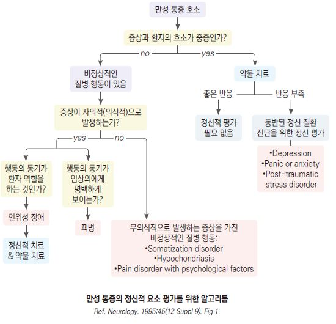

# 신체증상장애 Somatic Symptom Disorder

## <mark style="color:green;">일반 사항</mark>

* 육체적 고통 또는 정신 사회적 장애를 일으키는, 병리적 이상으로 충분히 설명되지 않으며 불안, 우울, 갈등 등에 의해 발생되거나 악화되는 신체 증상 증후군
* ICD-10 및 구(舊) DSM-IV의 somatoform disorders를 비롯한 많은 질환들을 포함 (DSM-5에서 현재 분류 체계로 개편)
* 유병률 : 병리적 질환이 발견되지 않는 신체 증상을 가진 성인 환자의 50% 이상이 이에 해당; 일반 인구의 5\~7%(여성에서 더 흔함); ＞65세에서는 감소
* 보통 첫 증상은 청소년기에 발생
* 진단과 치료에 있어서 신체 증상에 영향을 미치는 심리적, 사회적, 문화적 요소를 고려
* 경과 : 50\~75%에서 호전, 10\~30%에서 악화; 종종 악화와 완화를 반복하며 지속

### <mark style="color:$danger;">🚩 Red Flags!</mark>

<mark style="color:$danger;">**즉각 이송/응급 평가 - 기질적 질환 또는 즉각적 위해 가능성**</mark>

* 급격한 신경학적 결손 : 편측 마비, 실어증, 복시, 급성 시력 소실 - 뇌졸중/MS 감별 필요
* 발열, 체중 감소, 야간 발한 동반 - 악성 종양, 자가면역 질환(SLE 등) 의심
* 자해 또는 자살 사고가 구체적이거나 즉각적인 위해 가능성이 있는 경우
* 음식/수분 거부로 신체 상태 급격히 악화

<mark style="color:$warning;">**당일 의뢰 또는 긴급 평가 권고**</mark>

* 새로운 신경학적 증상(경련, 의식 변화, 보행 장애)이 처음 나타난 경우 - 전환 장애 진단 전 반드시 기질적 원인 배제
* 갑상선 기능 이상, 중증 근무력증, 다발성 경화증 등 감별이 불충분한 경우
* 자살 사고는 있으나 구체적 계획이 없는 경우

<mark style="color:$info;">**외래 추적 / 추가 평가 계획**</mark> - 단독 시 즉각 위험 낮으나 경과 관찰 필요

* 2가지 이상 항우울제를 적절한 용량·기간 사용 후에도 증상 미호전
* 동반 신체 질환(갑상선, 당뇨, 자가면역 질환 등) 조절 불량

## <mark style="color:green;">원인 및 위험 인자</mark>

* 원인 : 불명
* 여성(남성의 10배), 가족력
* 스트레스, 상실(예: 직장, 가족, 친구 상실), 학대(특히 아동기)
* 낮은 교육 수준, 낮은 사회 경제적 수준

## <mark style="color:green;">임상 양상</mark>

* 병리적 이상 소견이 발견되지 않는 다양한 증상군
* 신경계 증상 : 실신, 가짜 발작, 기억 상실, 근육 약화, 연하 곤란, 복시 또는 흐린 시야, 어지럼, 보행 장애, 난청, 쉰 목소리
* 정신 증상 : 불안, 우울, 인격 장애(편집증, 자포자기, 강박)
* 통증 : 두통, 요통, 배뇨통, 관절통, 광범위 통증, 사지 통증
* 소화기계 증상 : 구역, 구토, 복통, 복부 팽만감/가스, 설사
* 심혈관계 증상 : 흉통, 호흡 곤란, 두근거림
* 비뇨생식계 증상 : 배뇨 곤란, 성교통, 월경통, 생식기관 작열감
* 물질 남용 및 의존 : 만성 통증 조절을 위해 진통제(특히 opioid)를 자의로 과다 복용하거나 알코올에 의존하는 경향이 있음; 초진 시 및 추적 관찰 중 음주량·약물 사용력을 반드시 확인

## <mark style="color:green;">진단</mark>

* 신체 진찰
* 과거 병력, 약물 복용력 및 가족 병력
* 환자의 불안감을 비롯한 정신적 사회적 상황, 통증 양상
* 실험실/영상 검사 : 다른 질환 감별을 위하여 고려
* 심리 검사 : MMPI(다면적 인성검사), PHQ-15(신체화장애의 중증도 평가)

 ※ **배제 진단으로서의 주의사항** : 신체증상장애는 기질적 원인을 충분히 배제한 후 진단한다. 모호한 전신 증상이 있을 때 아래 기본 검사로 주요 기질적 질환을 선별한다.

 ※ **1차 선별 검사** : CBC, ESR/CRP, TSH, 전해질(Na/K/Ca), 공복혈당 → 이상 소견 시 또는 임상적으로 의심될 때 2차 검사 추가 고려 : ANA(SLE), Ca/PTH(부갑상선기능항진증), 비타민 B12, 소변검사

<table><thead><tr><th width="189">감별 질환</th><th>주요 단서</th></tr></thead><tbody><tr><td>갑상선 기능 이상</td><td>피로, 체중 변화, 한열 불내성, 두근거림</td></tr><tr><td>SLE</td><td>관절통, 발진, 광과민성, 다장기 증상</td></tr><tr><td>초기 다발성 경화증(MS)</td><td>일과성 신경학적 결손, 재발-완화 패턴</td></tr><tr><td>부갑상선기능항진증</td><td>피로, 우울, 근무력, 고칼슘혈증</td></tr><tr><td>당뇨병</td><td>피로, 다음, 다뇨, 말초 저림</td></tr><tr><td>체위성 빈맥 증후군 (POTS)</td><td>기립 시 어지럼·심계항진·피로·인지 저하(brain fog); 누운 상태에서 기립 후 10분 이내 맥박 ≥30 bpm 상승으로 선별(능동기립검사</td></tr></tbody></table>

#### <mark style="color:$primary;">PHQ-15</mark>

* 최근 4주 동안 다음 문제로 얼마나 고통을 받았습니까? 없음=0점, 약간=1점, 많이=2점
  1. 복통
  2. 등 또는 허리 통증
  3. 팔, 다리, 관절(예: 무릎, 엉덩이) 통증
  4. (여성) 월경통 또는 월경 관련 문제
  5. 두통
  6. 흉통
  7. 어지럼
  8. 기절 또는 실신
  9. 두근거림
  10. 호흡 곤란
  11. 성관계 중 통증 또는 문제
  12. 변비, 무른 변, 또는 설사
  13. 구역, 복부 가스, 또는 소화불량
  14. 피로감 또는 기력 저하
  15. 수면 문제

▶판정(somatic Sx의 중증도) : 0\~4점=정상/최소, 5\~9점=낮음, 10\~14점=중등도, 15\~30점=높음

## <mark style="color:green;">분류 및 진단 기준 \[DSM-5]</mark>

#### <mark style="color:$primary;">DSM-5 신체증상 및 관련 장애 분류 요약</mark>

<table><thead><tr><th width="217">진단</th><th width="323">핵심 특징</th><th width="79">기간</th></tr></thead><tbody><tr><td>신체증상장애</td><td>≥1개의 고통스러운 신체 증상 + 증상에 대한 과도한 생각·불안·행동</td><td>>6개월</td></tr><tr><td>질병 불안 장애</td><td>신체 증상은 없거나 경미함 + 심각한 병에 걸렸다는 집착</td><td>>6개월</td></tr><tr><td>기능성 신경학적 증상 장애/전환장애(FNSD)</td><td>신경학적 증상(마비, 실명 등) + 의학적 소견과 불일치</td><td>—</td></tr><tr><td>인위성 장애</td><td>환자 역할을 위해 증상을 의도적으로 조작; 명백한 외적 이득 없음</td><td>—</td></tr><tr><td>다른 건강 상태에 영향을 미치는 정신적 요소</td><td>기존 의학적 상태의 경과·치료에 심리·행동 요소가 악영향</td><td>—</td></tr><tr><td>기타 명시된/명시되지 않은 신체증상 및 관련 장애</td><td>위 기준 충족하지 않으나 임상적으로 유의한 고통·기능 장애</td><td>—</td></tr></tbody></table>

#### <mark style="color:$primary;">신체증상장애 vs 질병 불안 장애 — 감별 요점</mark>

<table><thead><tr><th width="109"></th><th width="246">신체증상장애</th><th>질병 불안 장애</th></tr></thead><tbody><tr><td><strong>고통의 중심</strong></td><td>실제로 경험하는 신체 증상 자체</td><td>심각한 병에 걸렸다는 생각과 불안</td></tr><tr><td><strong>신체 증상</strong></td><td>뚜렷하게 존재</td><td>없거나 경미함</td></tr><tr><td><strong>주된 호소</strong></td><td>"이 증상이 너무 힘들다"</td><td>"혹시 암(또는 심각한 병)이 아닐까"</td></tr><tr><td><strong>의료 이용</strong></td><td>증상 완화를 위해 병원 방문</td><td>검사·확인을 위해 반복 방문(추구형) 또는 회피(회피형)</td></tr><tr><td><strong>1차 약물</strong></td><td>SSRI, SNRI(통증 동반 시), TCA</td><td>SSRI</td></tr></tbody></table>

### <mark style="color:orange;">기능성 신경학적 증상 장애 / 전환 장애 (Functional Neurological Symptom Disorder, FNSD / Conversion disorder)</mark>

#### <mark style="color:$primary;">일반 사항</mark>

* DSM-5-TR에서는 'FNSD'가 공식 명칭으로 우선 사용되며, '전환 장애'와 병용; 임상 현장에서는 환자에게 '기능성(functional)'이라는 표현이 거부감이 적어 선호됨
* 뚜렷한 기질적 원인 없이 신체 기능(수의 운동 또는 감각 기능)이 변화하거나 결손
* 상당한 고통 또는 정신 사회적 장애를 일으킴
* 유발시키는 환경적인 요인이 있음
* 간혹 실제 기질적 질환이 있으므로 주의를 요함

#### <mark style="color:$primary;">임상 양상</mark>

* 갑자기 증상이 발생하거나 사라짐
* 관련 증상 : 쇠약, 삼킴곤란, 발음 곤란, 시각/후각/청각 장애, 보행 장애, 마비, 경련
*   환자의 임상 양상이 해부학적, 생리학적, 또는 알려진 질환들의 특징에 부합되지 않음. 예) 실명 상태에서 정상 동공 반사,

    발끝으로 설 수 있으나 누워서 ankle dorsiflexion은 못함

#### <mark style="color:$primary;">진단 기준</mark>

A. 수의적 운동 또는 감각 기능에 영향을 미치는 ≥1개의 증상 또는 결손

B. 인지된 신경학적 또는 의학적 상태와 증상이 서로 일치하지 않음

C. 증상 또는 결손은 다른 신체적 또는 정신적 질환으로 잘 설명되지 않음

D. 증상 또는 결손은 사회적, 직업적, 또는 기능상 다른 중요한 영역에서 임상적으로 의미 있는 고통 또는 장애를 일으키거나 의학적 평가를 필요로 함

※ **진찰 팁**

* [Hoover's sign](https://neurosymptoms.org/en/symptoms/fnd-symptoms/functional-limb-weakness/) : 마비측 하지 능동 굴곡 시 반대측 하지에서 불수의적 신전력이 감소하면 기질적 마비, 감소하지 않으면 기능성 마비를 시사
* [Tremor entrainment test](https://neurosymptoms.org/en/symptoms/fnd-symptoms/functional-tremor/) : 떨림(tremor)이 있는 부위 반대편으로 일정한 리듬의 운동을 시켰을 때, 떨림의 리듬이 반대편 운동 리듬을 따라가거나(entrainment) 떨림이 멈추면 기능성(심인성) 떨림을 시사

### <mark style="color:orange;">신체 증상 장애 (Somatic symptom disorder)</mark>

* 기질적 원인 없이 심리적 요인에 의하여 무의식적으로 신체 증상이 발생

#### <mark style="color:$primary;">진단 기준</mark>

A. 일상생활에 상당한 고통 또는 장애를 초래하는 ≥1개의 신체 증상

B. 신체 증상 또는 건강에 대한 걱정과 관련된 과도한 생각, 감정, 또는 행동; 다음 중 ≥1개

1. 한 가지 증상의 심각성에 대한 과도하고 지속적인 생각
2. 건강 및 증상에 대한 지속적이고 높은 수준의 불안
3. 이들 증상이나 건강 문제에 대하여 과도한 시간과 에너지를 소비

C. ＞6개월 지속됨(동일한 증상이 지속될 필요는 없음)

**세부 명시자(Specifier)**

* 통증 우세형(With predominant pain) : 신체 증상이 주로 통증으로 나타나는 경우; 만성 통증 환자의 상당수가 해당하며 SNRI(duloxetine 등) 또는 보조 진통제 병용을 고려
* 지속형(Persistent) : 중증 증상, 심각한 기능 장애, 장기간(>6개월) 지속
* 현재 중증도
  * 경증(Mild) : 기준 B 항목 1개만 해당
  * 중등도(Moderate) : 기준 B 항목 2개 해당
  * 중증(Severe) : 기준 B 항목 3개 모두 해당, 다발성 신체 증상

### <mark style="color:orange;">인위성 장애 (Factitious disorder)</mark>

* 환자가 되기 위하여 고의로 증상을 날조함
* 명백한 외부 이득이 없음. 예) 금전적 이득, 학교생활에서의 이득
* 약간의 의학적 문제와 지식을 가지고 있음. 예) 상처, 감염, 출혈, 저혈당, 위장관 질환
* 병원들을 전전함. 의료진에게 다양한 내용으로 꾸며서 설명함
* 증상이나 행동들이 모순됨. 예) 보행이 어렵다고 하면서 운동하는 장면이 관찰됨

**인위성 장애 vs 꾀병(Malingering)**

<table><thead><tr><th width="121"></th><th width="219">인위성 장애</th><th>꾀병</th></tr></thead><tbody><tr><td><strong>동기</strong></td><td>환자 역할 자체(내적 이득)</td><td>명백한 외적 이득</td></tr><tr><td><strong>외적 이득 예시</strong></td><td>없음</td><td>경제적 보상, 병역 기피, 형사 책임 회피</td></tr><tr><td><strong>의식 여부</strong></td><td>의도적 행동이나 심리적 욕구에 의함</td><td>의도적·계획적</td></tr><tr><td><strong>정신과적 접근</strong></td><td>정신건강의학과 의뢰 권장</td><td>정신과적 질환 아님; 법적·사회적 대응</td></tr></tbody></table>

 ※ 꾀병은 DSM-5에서 정신장애로 분류되지 않으며, 인위성 장애와 달리 이득 추구가 명백하고 맥락(법적, 보상 상황)과 연결된다.

#### <mark style="color:$primary;">자신에게 적용하는 인위성 장애 (Factitious disorder imposed on self) 진단 기준</mark>

A. 자기 자신에 대하여 속임수와 관련된 질병이나 손상 유도, 또는 생리적 또는 정신적 징후나 증상의 위조

B. 질병, 장애, 또는 손상으로서 자기 자신을 다른 사람들에게 드러냄

C. 명백한 외부 보상이 없는 경우에도 기만 행동을 함

D. 이 행위는 망상장애를 비롯한 다른 정신 장애로 더 잘 설명되지 않음

#### <mark style="color:$primary;">다른 사람에게 적용하는 인위성 장애 (Factitious disorder imposed on another) 진단 기준</mark>

A. 다른 사람에 대하여 속임수와 관련된 질병이나 손상의 유도, 또는 생리적 또는 정신적 징후나 증상의 위조

B. 질병, 장애, 또는 손상으로서 다른 사람(희생자)을 제3자에게 드러냄

C. 명백한 외부 보상이 없는 경우에도 기만 행동을 함

D. 이 행위는 망상장애를 비롯한 다른 정신 장애로 더 잘 설명되지 않음

Note: 가해자가 진단의 대상임. 예) 소아가 희생자, 보호자가 가해자인 경우 보호자를 진단

### <mark style="color:orange;">다른 건강 상태에 영향을 미치는 정신적 요소 (Psychological factors affecting other medical conditions)</mark>

* 일반적인 건강 문제가 정신이나 행동 요소에 의하여 발병 또는 치료에 악영향을 받는 상태

#### <mark style="color:$primary;">진단 기준</mark>

A. 정신 문제 이외의 의학적 증상 또는 이상이 존재

B. 정신이나 행동 요소는 다음 중 하나 이상에 해당되는 방법으로 의학적 상태에 악영향을 미침

1. 이 요소들은 의학적 문제의 경과에 영향을 미침; 의학적 문제의 발생, 악화 또는 치유 지연과 정신적 요소들 사이에 밀접한 시간적 연관성을 보임
2. 이 요소들은 의학적 문제의 치료를 방해함. 예) 지시를 이행하지 않음
3. 이 요소들은 추가적인 건강 위험 인자가 됨
4. 이 요소들은 기저 병태 생리, 증상 악화, 또는 의학적 주의를 갖는 것에 영향을 미침

C. B에 해당되는 요소들은 다른 정신 장애(예: 공황장애, 주요우울증, 외상후스트레스장애)로 더 잘 설명되지 않음

### <mark style="color:orange;">기타 명시된/명시되지 않은 신체증상 및 관련 장애 (Other Specified and Unspecified Somatic Symptom and Related Disorders)</mark>

#### <mark style="color:$primary;">기타 명시된(Other Specified) 신체증상 및 관련 장애 진단 기준</mark>

*   임상적으로 상당한 고통 또는 사회, 직업이나 다른 기능상 중요한 영역에서 장애를 일으키는, 신체 증상 및 관련 장애 범주의

    증상 특성을 보이지만 다른 진단 기준을 충족시키지 않는 상태
*   다음을 포함

    1. 단순한 신체 증상 장애 : 증상 기간 ＜6개월
    2. 단순한 질병 불안 장애(Illness anxiety disorder) : 증상 기간 ＜6개월
    3. 과도한 신체 관련 행동이 없는 질병 불안 장애 : 질병 불안 장애의 진단 기준 D\*에 해당 안 됨
    4. 상상임신(Pseudocyesis) : 실제 임신을 하지 않았지만 임신을 했다는 잘못된 믿음. 임신의 징후와 증상을 보임

    _\*과도한 건강 관련 행동(예: 신체 질병의 징후에 대한 반복적인 검사) 또는 적절하지 않은 회피 행동(예: 진료받는 것을 회피)를 함_

#### <mark style="color:$primary;">명시되지 않은(Unspecified) 신체증상 및 관련 장애 진단 기준</mark>

* 임상적으로 상당한 고통 또는 기능상 장애를 일으키는, 신체 증상 및 관련 장애 범주의 증상 특성을 보이지만 다른 진단 기준을 충족시키지 않는 상태

### <mark style="color:orange;">질병 불안 장애 (Illness anxiety disorder)</mark>

* 이전 명칭 : 건강염려증(hypochondriasis)
* 심각한 신체 증상 없이 중한 질병에 걸렸다는 지속적인 불안

#### <mark style="color:$primary;">진단 기준</mark>

A. 심각한 질환을 앓고 있거나 걸릴 것에 대한 집착

B. 신체 증상이 없거나 경미함. 신체 증상이 있는 경우 그 강도는 경미한 수준

C. 건강에 대한 높은 수준의 불안이 있으며, 건강 상태에 대하여 쉽게 걱정함

D. 과도한 건강 관련 행동(예: 신체 질병의 징후에 대한 반복적인 검사) 또는 적절하지 않은 회피 행동(예: 진료받는 것을 회피)를 함

E. 질병에 대한 집착 기간 ≥6개월(구체적으로 두려워하는 질병은 변할 수 있음)

F. 질병에 대한 집착은 신체 증상 장애, 공황장애, 범불안장애, 강박장애, 신체 이형 장애, 또는 망상장애와 같은 다른 정신 장애로 더 잘 설명되지 않음

***



***

## <mark style="background-color:$warning;">Management</mark>

### <mark style="color:orange;">치료 방침</mark>

* 공감 및 지지가 중요 : 기질적 근거가 없는 모든 문제가 정신적 문제는 아님. 환자의 괴로움을 인정하고 환자와 라포(rapport) 또는 치료적 제휴 관계를 형성
* 다른 신체 및 정신적 질환을 평가하고 치료
* 한 명의 의사가 지속적, 정기적으로 진료하는 것이 유익
* 중증 질환이 배제되었음을 환자에게 재확인시킴
* 신체 질환 없이도 신체 증상이 발생할 수 있음을 설명
* 불필요한 검사와 치료를 하지 않도록 주의
* 불필요한 약물 사용을 서서히 중단
* 환자들이 제공한 단서들에 대하여 F/U
* 기능 개선을 치료 목표로 설정
* 심리 치료(예: 인지행동 요법(CBT; 가장 근거 수준이 높음), 이완 치료, 가족 치료), 운동, 여가 활동
* 필요시 의뢰 또는 다른 분야(특히 정신과)와 협력

#### <mark style="color:$primary;">질환별 치료 추가 원칙</mark>

**기능성 신경학적 증상 장애(FNSD / 전환장애)**

* "기질적 질환이 아닌 기능성 문제"임을 비대립적으로 설명; "기능성(functional)"이라는 표현이 환자 수용도 높음
* 물리치료 및 작업치료 병행(운동 재활); CBT가 가장 근거 수준이 높음
* 증상에 과도하게 집중하는 반복 검사나 처치는 증상을 강화할 수 있으므로 지양
* 신경과·재활의학과·정신건강의학과 협진 고려

**질병 불안 장애(Illness anxiety disorder)**

* SSRI(예: escitalopram, fluoxetine)가 1차 약물; CBT 병행이 가장 근거 높음
* 진료 추구형(Care-seeking type) : 잦은 병원 방문 및 반복적인 검사 요청, 과잉 의료 이용 위험 → 단일 주치의(Gatekeeper)를 지정하고 정기적인 방문(필요 시가 아닌 계획된 방문) 일정을 잡는 '안심시키기(Reassurance)' 전략이 중요 → 불필요한 응급 방문 및 반복 검사 감소
* 진료 회피형(Care-avoidant type) : 불안이 너무 커서 오히려 병원 방문을 회피, 진단 지연 위험 → 환자와의 신뢰 관계(라포)를 형성하여 필요한 최소한의 검사라도 받게 유도하는 것이 우선 (치료적 제휴 형성) → 단계적 노출 치료 고려; 진단 지연 위험 주의

**인위성 장애(Factitious disorder)**

* 비대립적 직면 : 증거를 제시하며 환자를 몰아세우기보다 심리적 고통에 공감하며 접근
* 정신건강의학과 의뢰를 강력히 권장; 치료적 관계 유지가 핵심
* 다른 사람에게 적용하는 인위성 장애(예: 대리인에 의한 학대) : 아동 보호 기관 신고 등 법적 의무 고려

## <mark style="color:green;">약물 치료</mark>

### <mark style="color:orange;">항우울제</mark>

(☞ [항우울제](../231_/213_-antidepressants-and-anxiolytics.md))

* 일반적으로 TCA가 유효(부작용 주의)
* hypochondriasis, dysmorphic disorder : SSRI가 유효
* 용법 : 저용량에서 시작하여 점차 증량, 필요시 4주 단위로 용량 조절. 최소 유효 용량으로 유지

**세로토닌 증후군(Serotonin Syndrome) 주의**

* 항우울제 병용·증량 또는 St. John's wort 병용 시 발생 위험
* 다음 증상 출현 시 즉각 투약 중단 후 응급 평가
  * 고열(hyperthermia)
  * 근육 강직·간대성 경련(clonus, myoclonus)
  * 정신 상태 변화(agitation, 혼돈)
  * 자율신경 불안정(빈맥, 발한, 고혈압)

**벤조디아제핀계 단기 사용 주의**

* SSRI/SNRI의 효과가 나타나기 전(첫 2\~4주) 극심한 불안 조절을 위해 단기 병용할 수 있음
* 다음 사항을 반드시 준수
  * 사용 기간 : 원칙적으로 2\~4주 이내; 최단 기간·최소 용량
  * 의존성·내성 형성 위험; 신체증상장애 환자는 약물 의존 취약군임을 인지
  * 장기 사용 시 오히려 신체 증상 악화 및 기능 저하 초래 가능
  * 고령자 : 낙상, 인지 저하 위험으로 원칙적 사용 금지

#### <mark style="color:$primary;">TCA</mark>

* 주의 : 고령, 녹내장, BPH, 갑상선항진증, 심혈관 질환, 부정맥, 간질환, 당뇨병, MAOI 투여
* 부작용 : 입마름, 시야 흐림, 변비, 요 정체, 빈맥, 혼돈
* amitriptyline : 25\~50 ㎎/d, 100\~300 ㎎/d <mark style="color:blue;">\[에트라빌]</mark>
* imipramine : 25\~50 ㎎/d, 100\~300 ㎎/d <mark style="color:blue;">\[이미프라민]</mark>
* nortriptyline : 25 ㎎/d, 50\~150 ㎎/d <mark style="color:blue;">\[센시발]</mark>

#### <mark style="color:$primary;">SSRI</mark>

* 부작용 : 성 기능 저하, 구역, 복통, 어지럼, 불면증, 두통; 특히 복용 첫 주에 많음
* escitalopram : 10 ㎎/d, 10\~20 ㎎/d <mark style="color:blue;">\[렉사프로]</mark>
* fluoxetine : 20 ㎎/d 아침, 20\~60 ㎎/d <mark style="color:blue;">\[푸로작]</mark>; 폭식증 적응
* sertraline : 50 ㎎/d, 50\~200 ㎎/d <mark style="color:blue;">\[졸로푸트]</mark>

#### <mark style="color:$primary;">SNRI</mark>

* 통증 증상이 동반된 경우 또는 통증 우세형(With predominant pain)에 우선 고려
* 부작용 : 구역, 두통, 발한, 고용량 시 혈압 상승
* duloxetine : 30 ㎎/d, 60\~120 ㎎/d <mark style="color:blue;">\[심발타]</mark>

#### <mark style="color:$primary;">SMS (Serotonin Modulator)</mark>

* vortioxetine : 10 ㎎/d, 10\~20 ㎎/d <mark style="color:blue;">\[브린텔릭스]</mark>; 성기능 장애·인지 기능 저하 부작용이 적어 동반 증상이 있는 경우 고려

### <mark style="color:orange;">기타</mark>

* 필요시 저용량의 항정신병제 추가
  * chlorpromazine : 25\~50 ㎎/d <mark style="color:blue;">\[클로르프로마진]</mark>
  * haloperidol : 1\~2 ㎎/d <mark style="color:blue;">\[페리돌]</mark>
* opioid 또는 중독성 있는 약물 사용은 삼가
* St. John’s wort(성요한풀) : 일부 경증 우울 동반 시 사용되나 근거 제한적; SSRI·TCA와 병용 시 세로토닌 증후군 위험 - 병용 금기 <mark style="color:blue;">\[페리시]</mark>
* 신경병성 통증 양상 동반 시 보조 진통제 병용 고려
  * pregabalin : 75 ㎎/d, 150\~300 ㎎/d (분2) <mark style="color:blue;">\[리리카]</mark>; 어지럼, 졸림 주의
  * gabapentin : 300 ㎎/d, 900\~1800 ㎎/d (분3) <mark style="color:blue;">\[가바펜틴]</mark>; 신기능 저하 시 감량

***

### <mark style="color:red;">질병코드</mark>

※ ICD-10 기준 (DSM-5와 진단 범주가 완전히 일치하지는 않음)

F44 전환장애 (기능성 신경학적 증상 장애)

F45 신체형장애

F45.0 신체화장애

F45.1 미분화 신체형장애

F45.2 건강염려장애 (질병 불안 장애)

F68.1 인위성 장애 (자신에게 적용)

***

## <mark style="color:purple;">처방례</mark>

> **처방례 1.** 기본 — SSRI 단독
>
> ```
> 렉사프로 10 ㎎/T  1T  qd  조식 후
> ※ 저용량(5 ㎎)으로 시작하여 1~2주 후 10 ㎎으로 증량 가능; 필요 시 20 ㎎까지
> ※ 효과 판정은 4~6주 후
> ※ 치료 반응 시 최소 6개월 유지; 중단 시 4주에 걸쳐 서서히 감량
> ```

> **처방례 2.** 폭식 동반
>
> ```
> 푸로작 20 ㎎/C  1C  qd  아침
> ※ 폭식증 적응증; 반감기 길어 discontinuation syndrome 위험 낮음
> ```

> **처방례 3.** 수면장애 동반
>
> ```
> 에트라빌 25 ㎎/T  1T  취침 시
> ※ 졸림, 입마름, 변비 등 항콜린성 부작용 사전 설명
> ※ 고령자 사용 주의 — 기립성 저혈압 및 낙상 위험; 가능하면 대안 약제 우선 고려
> ※ 취침 직전 복용하고 야간 기상 시 천천히 일어나도록 안내
> ```

> **처방례 4.** 통증 동반
>
> ```
> 심발타 30 ㎎/C  1C  qd  조식 직후  (2주 후 60 ㎎으로 증량 고려)
> ※ 반드시 식사 직후 복용 — 공복 복용 시 구역 현저히 증가
> ※ 고용량 시 혈압 상승 가능 — 혈압 모니터링
> ※ 갑작스러운 중단 금지; 반드시 서서히 감량
> ```

> **처방례 5.** 성기능 저하 또는 인지 기능 저하 우려 시
>
> ```
> 브린텔릭스 10 ㎎/T  1T  qd  조식 후
> ※ SSRI 대비 성기능 장애·인지 기능 저하 부작용 적음
> ※ 효과 판정은 4~6주 후; 필요 시 20 ㎎으로 증량
> ```

***

### <mark style="color:$success;">핵심 복약 지도</mark>

> **신체증상장애 약물 복용 안내**
>
> * 처방된 항우울제는 **우울·불안 증상과 신체 증상을 함께 완화**하기 위한 목적으로 사용됩니다. "항우울제"라는 이름에 놀라지 않으셔도 됩니다.
> * 복용 후 **4\~8주 후부터** 서서히 효과가 나타납니다. 효과가 느껴지지 않더라도 임의로 중단하지 마십시오.
> * 복용 초기(첫 1\~2주) 일시적으로 구역, 두통, 어지럼이 생길 수 있습니다. 대부분 시간이 지나면 사라지므로 심하지 않으면 계속 복용하십시오.
> * 복용 초기에 오히려 \*\*불안이 일시적으로 증가하거나 안절부절못하는 느낌(jitteriness)\*\*이 생길 수 있습니다. 이는 약의 부작용이 아니라 초기 반응으로, 대부분 1\~2주 내 사라집니다. 심하면 담당 의사에게 알려 주십시오.
> * 증상이 좋아졌더라도 **담당 의사와 상의 없이 임의로 중단하지 마십시오.** 갑자기 끊으면 어지럼, 저림, 구역 등 금단 증상이 생길 수 있습니다.
> * 술은 증상을 악화시키고 약물 효과를 방해합니다. 음주를 피해 주십시오.

> **언제 다시 병원을 방문해야 하나요?**
>
> * 심한 위장 장애, 두근거림, 발진 등 부작용이 나타나는 경우
> * 2\~4주 복용 후에도 증상이 전혀 나아지지 않는 경우
> * 기분이 지나치게 고양되거나 잠이 전혀 없어지는 경우
> * 자해나 자살에 대한 생각이 드는 경우 — 즉시 내원 또는 자살예방 상담전화 **109**

***

### <mark style="color:blue;">환자 안내서</mark>


**몸의 증상이지만, 마음도 함께 돌봐야 합니다**

몸에서 느끼는 통증이나 불편감이 검사에서 이상이 없다고 해서 꾀병이 아닙니다.\
스트레스와 감정이 실제 신체 증상을 만들어 낼 수 있으며, 이는 치료를 통해 충분히 나아질 수 있습니다.


#### <mark style="color:$primary;">신체증상장애란 무엇인가요?</mark>

* 검사에서 뚜렷한 이상이 없는데도 통증, 소화 장애, 두근거림, 어지럼 등 다양한 신체 증상이 지속되는 상태
* 불안, 우울, 스트레스 등 심리적 요인이 신체 증상으로 나타나는 것으로, 환자가 의도적으로 만들어 내는 것이 아님
* 적절한 치료를 받으면 50\~75%에서 호전됨

#### <mark style="color:$primary;">어떻게 치료하나요?</mark>

* **약물 치료** : 항우울제가 신체 증상과 동반된 불안·우울을 함께 완화함; 효과는 4\~8주에 걸쳐 서서히 나타남; 증상이 좋아진 뒤에도 최소 6개월 이상 유지 후 의사 지시에 따라 서서히 감량(갑작스러운 중단 시 어지럼, 저림, 전기 충격 같은 느낌(brain zaps), 구역 등 중단 증상이 나타날 수 있음)
* **심리 치료** : 인지행동치료(CBT)가 가장 근거가 높음; 증상에 대한 과도한 걱정을 줄이고 대처 방식을 개선
* **지속적인 진료** : 한 명의 의사에게 꾸준히 진료받는 것이 불필요한 검사를 줄이고 신뢰 관계 형성에 도움

#### <mark style="color:$primary;">생활 속 실천 사항</mark>

* **규칙적인 운동** : 가벼운 유산소 운동(걷기, 수영 등)이 신체 증상 완화와 기분 개선에 도움
* **규칙적인 수면** : 일정한 취침·기상 시간 유지
* **스트레스 관리** : 이완 훈련, 복식 호흡, 명상 등을 일상에서 실천
* **증상 일지** : 증상이 언제, 어떤 상황에서 심해지는지 기록하면 치료에 도움

#### <mark style="color:$primary;">이것만은 꼭 기억하세요</mark>

* 검사에서 이상이 없다는 것은 **심각한 병의 가능성이 적다는 좋은 신호**입니다
* 증상이 있을 때마다 다른 병원을 찾아다니는 것은 오히려 회복을 늦출 수 있습니다
* 신체 증상이 생겼을 때 "이 증상이 무엇을 의미하는지"보다 **"오늘 내가 많이 지쳐 있지는 않은지"** 먼저 돌아보세요
