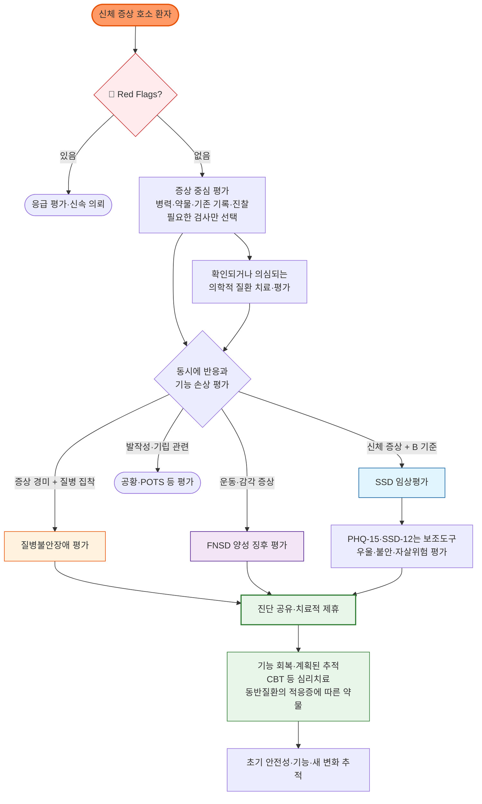

# 신체증상 및 관련 장애 Somatic Symptom and Related Disorders

## <mark style="color:green;">일반 사항</mark>

* 신체증상장애(SSD)는 일상생활을 방해하거나 상당한 고통을 일으키는 신체 증상과, 그 증상 또는 건강 염려에 대한 **과도한 인지·정서·행동 반응**이 함께 지속되는 상태
* DSM-5-TR의 **신체증상 및 관련 장애** 범주에는 신체증상장애, 질병불안장애, 기능성 신경학적 증상장애(FNSD), 다른 의학적 상태에 영향을 미치는 심리적 요인, 인위성 장애 등이 포함됨
* **개념의 전환(DSM-5)** : "의학적으로 설명되지 않는 증상(MUS)의 존재"가 아니라 증상과 관련된 과도한 생각·불안·시간 및 행동(B criteria)에 진단의 초점을 둠. 확인된 신체질환이 있어도 SSD가 공존할 수 있음
* 유병률
  * **MUS(medically unexplained symptoms)** : 1차 진료 방문의 20\~30%
  * **SSD** : 일반 인구 5\~7%, 1차 진료 10\~15%
  * **MUS와 SSD는 부분적으로 겹치지만 서로 다른 개념** : MUS라도 B 기준이 없으면 SSD가 아니며, 의학적으로 설명되는 증상이라도 B 기준을 충족하면 SSD가 공존할 수 있음
  * 위 유병률은 서로 다른 개념·연구 정의·조사 집단에서 산출된 수치이므로 **MUS와 SSD의 빈도를 직접 비교하지 않음**
  * 여성에서 약 1.5\~2배 많음; ＞65세에서는 감소
* 흔히 30세 이전에 시작하지만 어느 연령에서도 발생 가능
* 진단과 치료에 있어서 신체 증상에 영향을 미치는 심리적, 사회적, 문화적 요소를 고려
* 경과 : 지속적 신체 증상/MUS 연구에서는 약 50\~75%가 호전되고 10\~30%가 악화된 것으로 보고되었으나, 이를 DSM-5-TR SSD의 개별 예후 수치로 그대로 적용하지 않음

#### <mark style="color:$primary;">생물-심리-사회적 기전</mark>

* 단일한 병태생리로 설명되지 않으며, 신체 신호의 지각과 예측, 내수용감각에 대한 주의 편향, 학습된 회피·재확인 행동, 스트레스 반응, 수면, 우울·불안, 사회·문화적 요인이 상호작용
* **중추 감작(central sensitization)** 은 섬유근육통과 일부 만성 통증 등에서 관련될 수 있는 기전이지만, 모든 SSD를 설명하는 확립된 공통 기전으로 단정하지 않음
* 증상은 의도적으로 만들어 낸 것이 아니며 실제로 경험됨. 확인된 조직 손상이나 신체질환이 있는지와 증상의 진실성은 별개의 문제

#### <mark style="color:$primary;">MUS · SSD · FNSD - 개념 구분</mark>

<table><thead><tr><th width="154">구분</th><th width="221">핵심 개념</th><th>진단의 초점</th></tr></thead><tbody><tr><td><strong>MUS</strong><br>(medically unexplained symptoms)</td><td>현재의 적절한 평가로 충분히 설명되지 않는 신체 증상</td><td>진단명이 아닌 서술적 용어; SSD와 부분적으로 중첩</td></tr><tr><td><strong>SSD</strong><br>(신체증상장애)</td><td>고통스럽거나 기능을 방해하는 신체 증상 + 증상에 대한 <strong>과도한 반응</strong></td><td>인지·정서·행동 반응(B criteria); 신체질환 공존 가능</td></tr><tr><td><strong>FNSD</strong><br>(기능성 신경학적 증상장애)</td><td>운동·감각 기능의 변화 + 알려진 신경학적 질환과의 <strong>불일치를 보여 주는 양성 임상소견</strong></td><td>Hoover 징후, 떨림 동조 등 증상별 양성 징후</td></tr></tbody></table>

## <mark style="color:green;">원인 및 위험 인자</mark>

* 원인 : 불명 (생물-심리-사회 모델로 접근)
* 여성(남성의 약 1.5\~2배), 가족력
* 스트레스, 상실(예: 직장, 가족, 친구 상실), 학대(특히 아동기)
* 낮은 교육 수준, 낮은 사회 경제적 수준
* 동반된 신체질환 또는 지속적 통증·피로 증후군(IBS, 섬유근육통, 만성 편두통 등)
* Long COVID, ME/CFS, POTS 등은 증상이 겹칠 수 있으나 각각 독립적으로 평가하며, 정상적인 기본검사만으로 SSD에 귀속하지 않음

## <mark style="color:green;">임상 양상</mark>

* 하나 또는 여러 신체 증상이 지속·재발하며, 증상의 의학적 설명 여부와 관계없이 증상 관련 생각·불안·행동에 과도한 시간과 에너지를 사용하고 기능이 저하됨
* 흔한 증상 : 통증, 피로, 어지럼, 위장관 불편, 호흡 곤란, 두근거림 등. 특정 장기계에 국한되거나 시간에 따라 변할 수 있음
* 기능성 위약·보행장애·기능성 발작 등 신경학적 양상은 FNSD로 별도 평가
* 우울장애, 불안장애, 외상 관련 장애, 수면장애 등이 흔히 동반되므로 별도로 평가
* 통증 : 두통, 요통, 배뇨통, 관절통, 광범위 통증, 사지 통증
* 소화기계 증상 : 구역, 구토, 복통, 복부 팽만감/가스, 설사
* 심혈관계 증상 : 흉통, 호흡 곤란, 두근거림
* 비뇨생식계 증상 : 배뇨 곤란, 성교통, 월경통, 생식기관 작열감
* 처방·비처방 진통제, 수면제, 알코올 등 사용력을 확인하되 SSD 환자 전체를 약물 의존 취약군으로 일반화하지 않고 개인별 위험요인을 평가

### <mark style="color:$danger;">🚩 Red Flags!</mark>

<mark style="color:$danger;">**즉각 응급 조치 및 이송**</mark>

* 갑작스러운 편측 마비·감각저하, 실어증, 복시, 급성 시력 소실, 새로운 심한 보행실조 등 뇌졸중 의심 소견
* 첫 경련 또는 반복 경련, 지속되는 의식 변화, 급성 섬망
* 호흡곤란·연하곤란·구음장애가 빠르게 악화하는 중증근무력증 위기 등 호흡·기도 위협
* 활력징후 불안정, 패혈증 의심, 심한 탈수·영양실조 또는 음식·수분 거부로 급격한 신체 악화
* 구체적 자살 계획·수단·의도가 있거나 즉각적인 자해·타해 위험

<mark style="color:$warning;">**당일 긴급 평가 또는 신속 의뢰**</mark>

* 새로 발생하거나 진행하는 객관적 신경학적 이상, 반복 실신, 원인이 불명확한 발작 유사 사건
* 발열, 체중 감소, 야간 발한, 출혈, 진행성 통증 등과 함께 악성종양·감염·염증성 질환을 시사하는 소견
* 자살 사고가 있으나 구체적 계획은 없는 경우 - 의도·수단 접근성·과거 자살 시도, 우울·물질사용·충동성 등 위험요인과 가족·사회적 지지 등 보호요인을 당일 평가

<mark style="color:$info;">**계획된 외래 재평가·협진**</mark>

* 새로운 객관적 변화, 예상과 다른 경과 또는 기능의 지속적 악화
* 동반 신체질환의 조절 불량, 우울·불안·외상·수면·물질사용 문제
* 초기 치료에 반응하지 않거나 진단이 불확실한 경우 - 기존 진단과 검사를 재검토하고 필요한 전문과와 협진

## <mark style="color:green;">진단</mark>


**SSD는 배제 진단(diagnosis of exclusion)이 아니다**\
DSM-5 이후 SSD는 기질적 질환을 모두 배제한 후 내리는 진단이 아니라, **증상에 대한 과도한 반응(B criteria)의 양성 소견**으로 진단한다.

* **확인된 신체 질환이 있어도 SSD 진단 가능** : 증상의 존재가 아니라 반응의 과도성이 핵심
* 예) IBS·섬유근육통·만성 편두통·심부전·암 생존자 등에서 증상에 대한 고통·집착·불안·반복 검사 요구가 의학적 소견으로 설명되는 범위를 현저히 초과하는 경우
* 적절한 의학적 평가는 필요하되 반복적·무분별한 검사는 피해야 한다


* 신체 진찰
* 과거 병력, 약물 복용력 및 가족 병력
* 환자의 불안감을 비롯한 정신적 사회적 상황, 통증 양상
* 실험실/영상 검사 : 증상·연령·병력·진찰·기존 검사와 사전확률에 따라 필요한 항목만 선택. 모든 환자에게 동일한 일괄검사 패널을 적용하지 않음
* 정신건강 평가 : 우울(PHQ-9), 불안(GAD-7), 자살 위험, 외상, 수면, 처방·비처방 약물 및 알코올 사용을 필요에 따라 평가
* 증상 척도 : PHQ-15 또는 SSS-8은 신체 증상 부담, SSD-12는 B 기준 관련 반응의 정도를 평가하는 보조도구이며 진단을 대신하지 않음


**배제 진단은 아니지만 새로운 질환을 놓치지 않습니다**\
기존 SSD 진단이 있더라도 새 증상, 객관적 이상, 경과 변화는 일반 환자와 동일하게 평가합니다. 반대로 중증질환 사전확률이 낮은 상태에서 반복적 검사를 통한 단순 안심은 거짓양성·우연종·추가 처치와 건강불안을 늘릴 수 있습니다.


### <mark style="color:orange;">감별 진단</mark>

<table><thead><tr><th width="189">감별 질환</th><th>주요 단서</th></tr></thead><tbody><tr><td>갑상선 기능 이상</td><td>피로, 체중 변화, 한열 불내성, 두근거림</td></tr><tr><td>SLE 등 염증성·자가면역 질환</td><td>관절염, 발진, 광과민성, 발열, 객관적 다장기 이상</td></tr><tr><td>다발성 경화증 등 신경계 질환</td><td>객관적 국소 신경학적 결손, 재발-완화 또는 진행성 경과</td></tr><tr><td>부갑상선기능항진증·전해질 이상</td><td>근위부 근력저하, 결석, 변비, 고칼슘혈증 등 임상 단서</td></tr><tr><td>당뇨병</td><td>다음, 다뇨, 체중 감소, 말초신경병증</td></tr><tr><td>체위성 빈맥 증후군(POTS)</td><td>기립 시 어지럼·심계항진·피로·인지 저하가 ≥3개월 지속되고, 기립 10분 이내 심박수가 성인 ≥30 bpm(12~19세 ≥40 bpm) 지속적으로 증가. 유의한 기립성 저혈압과 빈맥의 다른 원인을 배제 (☞ <a href="030_-autonomic-dysfunction.md">자율신경기능장애</a>)</td></tr><tr><td>Long COVID·ME/CFS</td><td>감염 후 지속되는 피로·인지·자율신경 증상, 활동 후 증상악화(PEM) 등; 독립적 의학적 상태로 평가</td></tr><tr><td>우울·불안·공황·PTSD</td><td>신체 증상이 두드러질 수 있으므로 핵심 정신증상과 시간 경과를 별도 평가</td></tr></tbody></table>

#### <mark style="color:$primary;">SSD · FNSD · Panic · Dysautonomia - 문진 보조 질문</mark>

다음 질문은 증상 양상을 정리하는 데 도움이 되지만 검증된 진단도구가 아니며, 답변만으로 질환을 확정하지 않습니다.

1. "증상은 계속되나요, 발작적으로 심해지나요? 어떤 상황·자세·활동과 관련됩니까?"
2. "누워 있을 때보다 서 있을 때 악화되고 다시 누우면 좋아집니까?"
3. "증상 자체의 고통과 특정 질병에 대한 두려움 중 어느 것이 일상을 더 방해합니까?"

<table><thead><tr><th width="104">항목</th><th width="140">SSD</th><th width="140">FNSD</th><th width="128">공황발작</th><th>POTS</th></tr></thead><tbody><tr><td>핵심</td><td>신체 증상 + 과도한 인지·정서·행동 반응</td><td>운동·감각 증상 + 양성 신경학적 불일치</td><td>갑작스러운 공포·불편과 동반 증상</td><td>만성 기립불내성 + 객관적 심박수 증가</td></tr><tr><td>시간·상황</td><td>증상이 있는 상태가 지속적</td><td>지속·발작·변동 모두 가능</td><td>발작적으로 시작해 수분 이내 최고조</td><td>기립 시 악화, 누우면 호전</td></tr><tr><td>객관적 소견</td><td>신체질환 소견이 있거나 없을 수 있음</td><td>증상별 양성 진찰소견</td><td>발작 사이 정상일 수 있음</td><td>기립검사에서 진단기준 확인</td></tr><tr><td>주의</td><td>의학적 설명 유무만으로 진단하지 않음</td><td>스트레스 요인은 필수조건 아님</td><td>ACS·부정맥·갑상선질환 등 감별</td><td>탈수·빈혈·약물·부적절 동빈맥 등 배제</td></tr></tbody></table>

#### <mark style="color:$primary;">Bedside 감별 포인트</mark>

* **Panic vs POTS** : 공황발작은 자세와 무관하게 발생할 수 있고 수분 이내 최고조에 도달하는 공포·불편이 핵심. POTS는 만성 기립불내성과 기준에 맞는 심박수 증가를 확인
* **FNSD vs SSD** : FNSD는 Hoover 징후 등 증상별 양성 신경학적 소견으로 진단하며, SSD는 신체 증상에 대한 과도한 인지·정서·행동 반응으로 진단함. 두 질환은 공존할 수 있음
* **SSD vs Panic** : SSD는 증상이 있는 상태와 관련 반응이 지속적이며, 공황발작은 발작적으로 시작해 수분 이내 최고조에 도달
* **혼합형이 흔함** : SSD + Panic, SSD + POTS 등 - 하나만 찾고 끝내면 치료 실패


**혼합형을 놓치지 마세요**\
만성 신체 증상 환자에서 호전이 없다면 SSD 진단 자체와 함께 공황장애, POTS, 섬유근육통, Long COVID, ME/CFS 등 **독립적 또는 동반 진단**을 재검토하십시오. 검사 결과가 정상이라는 이유만으로 이러한 질환을 SSD로 귀속하지 않습니다.


#### <mark style="color:$primary;">PHQ-15</mark>

* 최근 4주 동안 다음 문제로 얼마나 고통을 받았습니까? 없음=0점, 약간=1점, 많이=2점
  1. 복통
  2. 등 또는 허리 통증
  3. 팔, 다리, 관절(예: 무릎, 엉덩이) 통증
  4. (여성) 월경통 또는 월경 관련 문제
  5. 두통
  6. 흉통
  7. 어지럼
  8. 기절 또는 실신
  9. 두근거림
  10. 호흡 곤란
  11. 성관계 중 통증 또는 문제
  12. 변비, 무른 변, 또는 설사
  13. 구역, 복부 가스, 또는 소화불량
  14. 피로감 또는 기력 저하
  15. 수면 문제

▶판정(somatic Sx의 중증도) : 0\~4점=정상/최소, 5\~9점=낮음, 10\~14점=중등도, 15\~30점=높음

#### <mark style="color:$primary;">SSS-8 (Somatic Symptom Scale-8)</mark>

* 최근 7일 동안 8가지 신체 증상으로 얼마나 불편했는지를 평가하는 자기보고식 **증상 부담 척도**(총점 0\~32점)
* 중증도 : 0\~3점=없음/최소, 4\~7점=낮음, 8\~11점=중간, 12\~15점=높음, 16\~32점=매우 높음
* 한국어판 검증 연구가 있으나 표본 규모와 구성이 제한적이므로, 위 구간은 **신체증상 부담의 단계**로만 해석하고 SSD 진단 절단점으로 사용하지 않음(Yang 등, 2020)

#### <mark style="color:$primary;">SSD-12 (Somatic Symptom Disorder-B Criteria Scale)</mark>

* **PHQ-15의 한계** : 신체 증상 부담을 측정하지만 신체질환의 증상도 함께 반영하며, DSM-5-TR의 A 기준이나 SSD 진단을 직접 확정하지 않음. B 기준은 평가하지 못함
* **SSD-12** (Toussaint 등, 2016) : B criteria를 평가하기 위해 개발된 12문항 자기보고식 도구; 인지(cognitive)·정서(affective)·행동(behavioral) 3영역 각 4문항
* 평정 : 0점(전혀 없음) \~ 4점(매우 자주) → 총점 0\~48점
* **판정**
  * 연구에서 사용된 선별 절단점 : ≥23점
  * **한국 정신건강의학과 임상집단 최적 절단점 : ≥29점** (K-SSD-12 검증 연구, 2024; AUC 0.75, 95% CI 0.68~0.82)
* 절단점은 연구집단과 유병률에 따라 달라질 수 있으며 **확진 기준이 아님**. 임상 면담으로 반응의 맥락·비례성·기능 손상과 다른 정신질환을 평가


**PHQ-15·SSS-8과 SSD-12를 함께 쓰는 이유**\
PHQ-15와 SSS-8은 **신체질환에서 비롯된 증상도 포함한 신체증상 부담**을 측정하고, SSD-12는 **DSM-5-TR B 기준에 해당하는 인지·정서·행동 반응**을 평가합니다. 점수 조합만으로 SSD·질병불안장애·신체질환을 구분할 수 없으며, 고득점은 구조화된 임상평가가 필요하다는 신호로 해석합니다.


## <mark style="color:green;">분류 및 진단 기준</mark>

#### <mark style="color:$primary;">DSM-5-TR 신체증상 및 관련 장애 분류 요약</mark>

<table><thead><tr><th width="217">진단</th><th width="323">핵심 특징</th><th width="79">기간</th></tr></thead><tbody><tr><td>신체증상장애</td><td>≥1개의 고통스럽거나 일상을 방해하는 신체 증상 + 과도한 생각·불안·시간·행동</td><td>증상이 있는 상태가 지속적(전형적으로 ＞6개월)</td></tr><tr><td>질병불안장애</td><td>신체 증상은 없거나 경미함 + 심각한 병을 앓거나 걸릴 것이라는 집착</td><td>≥6개월</td></tr><tr><td>기능성 신경학적 증상장애/전환장애(FNSD)</td><td>운동·감각 기능의 변화 + 알려진 질환과의 불일치를 입증하는 임상소견</td><td>-</td></tr><tr><td>인위성 장애</td><td>확인된 기만과 함께 증상·징후를 의도적으로 위조 또는 유발; 명백한 외적 보상이 없어도 지속</td><td>-</td></tr><tr><td>다른 의학적 상태에 영향을 미치는 심리적 요인</td><td>의학적 상태의 경과·치료에 심리·행동 요인이 악영향</td><td>-</td></tr><tr><td>기타 명시된/명시되지 않은 신체증상 및 관련 장애</td><td>위 기준을 모두 충족하지 않지만 임상적으로 유의한 고통·기능 장애</td><td>-</td></tr></tbody></table>

#### <mark style="color:$primary;">ICD-11의 신체고통장애(Bodily Distress Disorder, 6C20)</mark>

* 고통스러운 신체 증상과 그 증상에 대한 **과도한 주의**가 핵심이며, 반복적인 의료기관 접촉으로 나타날 수 있음
* 확인된 신체질환이 증상에 기여하더라도 주의와 집착이 질환의 성격·경과에 비해 명백히 과도하면 진단 가능
* 일부 증상이 대부분의 날에 적어도 수개월간 지속되고, 관련 고통·집착이 중요한 기능 손상을 일으켜야 함
* 경증(6C20.0)·중등도(6C20.1)·중증(6C20.2)으로 구분. DSM-5-TR SSD와 개념적으로 유사하지만 진단요건과 중증도 체계가 완전히 동일하지 않음
* 국내 진료비 청구·통계에는 ICD-11 코드가 아니라 현행 KCD-9 코드를 사용

#### <mark style="color:$primary;">신체증상장애 vs 질병불안장애 - 감별 요점</mark>

<table><thead><tr><th width="109"></th><th width="246">신체증상장애</th><th>질병불안장애</th></tr></thead><tbody><tr><td><strong>고통의 중심</strong></td><td>신체 증상과 그에 대한 과도한 반응</td><td>심각한 병을 앓거나 걸릴 것이라는 집착</td></tr><tr><td><strong>신체 증상</strong></td><td>하나 이상 뚜렷하게 존재</td><td>없거나 경미함</td></tr><tr><td><strong>의료 이용</strong></td><td>다양할 수 있으며 신체질환이 공존 가능</td><td>반복 검사·확인을 추구하거나 진료를 회피</td></tr><tr><td><strong>우선 치료</strong></td><td>구조화된 설명·기능 회복·CBT 등</td><td>CBT 등 심리치료; 동반 우울·불안 또는 중증 건강불안에는 SSRI 고려</td></tr></tbody></table>

### <mark style="color:orange;">기능성 신경학적 증상장애 / 전환 장애 (Functional Neurological Symptom Disorder, FNSD / Conversion disorder)</mark>

#### <mark style="color:$primary;">일반 사항</mark>

* DSM-5-TR에서는 'FNSD'가 공식 명칭으로 우선 사용되며, '전환 장애'와 병용; 임상 현장에서는 환자에게 '기능성(functional)'이라는 표현이 거부감이 적어 선호됨
* 수의 운동 또는 감각 기능이 변화하며, 진찰에서 알려진 신경학적·의학적 질환과의 불일치를 보여 주는 양성 소견을 확인
* 상당한 고통 또는 정신 사회적 장애를 일으킴
* 심리적 스트레스나 외상이 선행할 수 있으나 **진단에 필수조건이 아님**
* 뇌전증 등 실제 신경계 질환이 공존할 수 있으므로 양자택일식으로 판단하지 않음

#### <mark style="color:$primary;">임상 양상</mark>

* 증상은 갑자기 또는 점진적으로 시작할 수 있고 지속·발작·변동 양상을 보일 수 있음
* 관련 증상 : 기능성 위약, 운동이상, 보행장애, 감각증상, 시각·청각증상, 언어·연하증상, 기능성 발작 등
* 환자의 임상 양상이 해부학적, 생리학적, 또는 알려진 질환들의 특징에 부합되지 않음. 예) 실명 상태에서 정상 동공 반사, 발끝으로 설 수 있으나 누워서 ankle dorsiflexion은 못함

#### <mark style="color:$primary;">진단 기준</mark>

A. 수의적 운동 또는 감각 기능의 변화를 보이는 ≥1개의 증상

B. 임상소견이 해당 증상과 알려진 신경학적 또는 의학적 질환 사이의 불일치를 입증함

C. 증상 또는 결손은 다른 신체적 또는 정신적 질환으로 잘 설명되지 않음

D. 증상은 임상적으로 유의한 고통 또는 사회적·직업적·기타 중요한 기능의 손상을 일으키거나 의학적 평가를 필요로 함

#### <mark style="color:$primary;">진찰 팁 - 기능성 vs 기질적 감별</mark>

* [**Hoover 징후**](https://neurosymptoms.org/en/symptoms/fnd-symptoms/functional-limb-weakness/) : 약한 쪽 고관절의 자발적 신전과 반대쪽 다리를 움직일 때 유발되는 자동 신전을 비교
  * 환자를 앙와위로 하고 검사자의 손을 약한 쪽 발뒤꿈치 아래에 둠. 먼저 약한 쪽 발뒤꿈치로 침상을 누르게 하여 자발적 신전을 평가한 뒤, 반대쪽(비교적 보존된 쪽) 다리를 검사자의 저항에 맞서 위로 올리게 함(고관절 굴곡). 이때 약한 쪽 발뒤꿈치가 침상을 아래로 누르는 불수의적 힘(자동 고관절 신전)이 회복되는지 확인
  * **양성 Hoover 징후** : 약한 쪽의 자발적 고관절 신전은 약하지만 반대쪽 고관절 굴곡 시 약한 쪽 발뒤꿈치의 불수의적 하방 압력이 회복·정상화됨 → 기능성 위약을 지지
  * 통증으로 제한된 위약, 반대쪽 다리 위약, 무시증 등은 결과를 혼동할 수 있으며 한 가지 징후만으로 확진하지 않음
* [**Tremor entrainment test**](https://neurosymptoms.org/en/symptoms/fnd-symptoms/functional-tremor/) : 떨림이 있는 부위 반대편으로 일정한 리듬의 운동을 시켰을 때 떨림의 리듬이 따라가거나(entrainment) 현저히 변하면 기능성 떨림을 지지

### <mark style="color:orange;">신체증상장애 (Somatic symptom disorder)</mark>

* 신체 증상이 지속되며, 해당 증상에 대한 **과도한 인지·정서·행동 반응**이 기능 장애를 초래하는 상태
* 증상이 의학적으로 설명되는지 여부는 필수 진단요건이 아님
* **신체질환의 존재가 SSD 진단을 배제하지 않음**. 다만 신체질환이 있을 때 반응의 과도성은 질환의 성격·중증도·경과와 문화적 맥락을 고려하여 신중히 판단

#### <mark style="color:$primary;">진단 기준</mark>

A. 일상생활에 상당한 고통 또는 장애를 초래하는 ≥1개의 신체 증상

B. 신체 증상 또는 건강에 대한 걱정과 관련된 과도한 생각, 감정, 또는 행동; 다음 중 ≥1개

1. 한 가지 증상의 심각성에 대한 과도하고 지속적인 생각
2. 건강 및 증상에 대한 지속적이고 높은 수준의 불안
3. 이들 증상이나 건강 문제에 대하여 과도한 시간과 에너지를 소비

C. 한 가지 증상이 계속 존재할 필요는 없지만 증상이 있는 상태가 지속적임(전형적으로 ＞6개월)

**세부 명시자(Specifier)**

* 통증 우세형(With predominant pain) : 신체 증상이 주로 통증으로 나타나는 경우. SSD 진단만으로 진통제나 항우울제를 선택하지 않고 통증질환·동반질환의 독립 적응증에 따라 치료
* 지속형(Persistent) : 단순히 6개월을 초과한 경우가 아니라, **중증 증상과 현저한 기능 장애가 장기간(＞6개월) 지속되는 경과**
* 현재 중증도
  * 경증(Mild) : 기준 B 항목 1개만 해당
  * 중등도(Moderate) : 기준 B 항목 2개 이상 해당
  * 중증(Severe) : 기준 B 항목 2개 이상 + 다수의 신체 증상 또는 하나의 매우 심한 신체 증상

### <mark style="color:orange;">인위성 장애 (Factitious disorder)</mark>

* 확인된 기만과 함께 질병·손상 또는 신체적·심리적 증상·징후를 의도적으로 위조하거나 유발하고, 자신 또는 다른 사람을 아프거나 손상된 사람으로 제시함
* 명백한 외적 보상이 없어도 기만 행동이 지속됨. 특정 동기나 "환자 역할에 대한 욕구"를 입증할 필요는 없음
* 의학 지식, 여러 의료기관 이용, 증상의 변동성만으로 진단하지 않음. 특히 FNSD의 변동성과 의도적 기만을 혼동하지 않음
* 가능한 의인성 위해를 줄이면서 객관적 기록을 통합하고 다학제적으로 평가

**인위성 장애 vs 꾀병(Malingering)**

<table><thead><tr><th width="121"></th><th width="219">인위성 장애</th><th>꾀병</th></tr></thead><tbody><tr><td><strong>행동</strong></td><td>확인된 기만과 함께 증상·징후를 위조 또는 유발</td><td>증상·장애를 의도적으로 과장 또는 가장</td></tr><tr><td><strong>외적 보상</strong></td><td>명백한 외적 보상이 없어도 지속</td><td>경제적 보상, 병역·업무 회피, 약물 획득, 형사책임 회피 등</td></tr><tr><td><strong>분류</strong></td><td>DSM-5-TR 정신장애</td><td>정신장애 진단이 아니며 임상적 관심의 대상이 될 수 있는 상태</td></tr><tr><td><strong>접근</strong></td><td>안전 확보, 객관적 기록 통합, 비대립적 다학제 접근</td><td>의학적 질환을 먼저 평가한 뒤 객관적 기능·맥락·법적 문제를 구분</td></tr></tbody></table>

※ 꾀병은 DSM-5에서 정신장애로 분류되지 않으며, 인위성 장애와 달리 이득 추구가 명백하고 맥락(법적, 보상 상황)과 연결된다.

#### <mark style="color:$primary;">자신에게 적용하는 인위성 장애 (Factitious disorder imposed on self) 진단 기준</mark>

A. 자기 자신에 대하여 속임수와 관련된 질병이나 손상 유도, 또는 생리적 또는 정신적 징후나 증상의 위조

B. 질병, 장애, 또는 손상으로서 자기 자신을 다른 사람들에게 드러냄

C. 명백한 외부 보상이 없는 경우에도 기만 행동을 함

D. 이 행위는 망상장애를 비롯한 다른 정신 장애로 더 잘 설명되지 않음

#### <mark style="color:$primary;">다른 사람에게 적용하는 인위성 장애 (Factitious disorder imposed on another) 진단 기준</mark>

A. 다른 사람에 대하여 속임수와 관련된 질병이나 손상의 유도, 또는 생리적 또는 정신적 징후나 증상의 위조

B. 질병, 장애, 또는 손상으로서 다른 사람(희생자)을 제3자에게 드러냄

C. 명백한 외부 보상이 없는 경우에도 기만 행동을 함

D. 이 행위는 망상장애를 비롯한 다른 정신 장애로 더 잘 설명되지 않음

Note: 가해자가 진단의 대상임. 예) 소아가 희생자, 보호자가 가해자인 경우 보호자를 진단

### <mark style="color:orange;">다른 의학적 상태에 영향을 미치는 심리적 요인 (Psychological Factors Affecting Other Medical Conditions)</mark>

* 일반적인 건강 문제가 정신이나 행동 요소에 의하여 발병 또는 치료에 악영향을 받는 상태

#### <mark style="color:$primary;">진단 기준</mark>

A. 정신 문제 이외의 의학적 증상 또는 이상이 존재

B. 정신이나 행동 요소는 다음 중 하나 이상에 해당되는 방법으로 의학적 상태에 악영향을 미침

1. 이 요소들은 의학적 문제의 경과에 영향을 미침; 의학적 문제의 발생, 악화 또는 치유 지연과 정신적 요소들 사이에 밀접한 시간적 연관성을 보임
2. 이 요소들은 의학적 문제의 치료를 방해함. 예) 지시를 이행하지 않음
3. 이 요소들은 추가적인 건강 위험 인자가 됨
4. 이 요소들은 기저 병태 생리, 증상 악화, 또는 의학적 주의를 갖는 것에 영향을 미침

C. B에 해당되는 요소들은 다른 정신 장애(예: 공황장애, 주요우울증, 외상후스트레스장애)로 더 잘 설명되지 않음

### <mark style="color:orange;">기타 명시된/명시되지 않은 신체증상 및 관련 장애 (Other Specified and Unspecified Somatic Symptom and Related Disorders)</mark>

#### <mark style="color:$primary;">기타 명시된(Other Specified) 신체증상 및 관련 장애 진단 기준</mark>

*   임상적으로 상당한 고통 또는 사회, 직업이나 다른 기능상 중요한 영역에서 장애를 일으키는, 신체 증상 및 관련 장애 범주의

    증상 특성을 보이지만 다른 진단 기준을 충족시키지 않는 상태
*   다음을 포함

    1. 단기 신체증상 유사 장애(Brief somatic symptom-like disorder) : 증상 기간 ＜6개월
    2. 단기 질병불안 유사 장애(Brief illness anxiety-like disorder) : 집착 기간 ＜6개월
    3. **과도한 건강 관련 행동 또는 부적응적 회피가 없는 질병불안 유사 장애**(Illness anxiety-like disorder without excessive health-related behaviors or maladaptive avoidance) : 질병불안장애의 진단 기준 D(반복적 검사 등 과도한 건강 관련 행동 또는 진료 회피)를 충족하지 않는 경우
    4. 상상임신(Pseudocyesis) : 실제 임신을 하지 않았지만 임신을 했다는 잘못된 믿음. 임신의 징후와 증상을 보임

#### <mark style="color:$primary;">명시되지 않은(Unspecified) 신체증상 및 관련 장애 진단 기준</mark>

* 임상적으로 상당한 고통 또는 기능상 장애를 일으키는, 신체 증상 및 관련 장애 범주의 증상 특성을 보이지만 다른 진단 기준을 충족시키지 않는 상태

### <mark style="color:orange;">질병불안장애 (Illness anxiety disorder)</mark>

* 이전 명칭 : 건강염려증(hypochondriasis)
* 심각한 신체 증상 없이 중한 질병에 걸렸다는 지속적인 불안

#### <mark style="color:$primary;">진단 기준</mark>

A. 심각한 질환을 앓고 있거나 걸릴 것에 대한 집착

B. 신체 증상이 없거나 경미함. 다른 의학적 상태가 있거나 발병 위험이 높은 경우에도 질병에 대한 집착이 명백히 과도하거나 불균형함

C. 건강에 대한 높은 수준의 불안이 있으며, 건강 상태에 대하여 쉽게 걱정함

D. 과도한 건강 관련 행동(예: 신체 질병의 징후에 대한 반복적인 검사) 또는 적절하지 않은 회피 행동(예: 진료받는 것을 회피)를 함

E. 질병에 대한 집착 기간 ≥6개월(구체적으로 두려워하는 질병은 변할 수 있음)

F. 질병에 대한 집착은 신체증상장애, 공황장애, 범불안장애, 강박장애, 신체 이형 장애, 또는 망상장애와 같은 다른 정신 장애로 더 잘 설명되지 않음

**아형(Subtype)**

* 진료추구형(Care-seeking type) : 의사 방문·검사·시술 등 의료 이용이 잦은 경우
* 진료회피형(Care-avoidant type) : 질병에 대한 불안 때문에 필요한 진료도 회피하는 경우

***


```mermaid
graph TD
    Start([신체 증상 호소 환자]) --> RedFlag{🚩 Red Flags?}
    RedFlag -->|있음| Referral([응급 평가·신속 의뢰])
    RedFlag -->|없음| BasicEval[증상 중심 평가<br/>병력·약물·기존 기록·진찰<br/>필요한 검사만 선택]
    BasicEval --> Medical[확인되거나 의심되는<br/>의학적 질환 치료·평가]
    BasicEval --> Pattern{동시에 반응과<br/>기능 손상 평가}
    Medical --> Pattern
    Pattern -->|신체 증상 + B 기준| SSD[SSD 임상평가]
    Pattern -->|증상 경미 + 질병 집착| IAD[질병불안장애 평가]
    Pattern -->|운동·감각 증상| FNSD[FNSD 양성 징후 평가]
    Pattern -->|발작성·기립 관련| Other([공황·POTS 등 평가])
    SSD --> Scale[PHQ-15·SSD-12는 보조도구<br/>우울·불안·자살위험 평가]
    IAD --> Framing[진단 공유·치료적 제휴]
    FNSD --> Framing
    Scale --> Framing
    Framing --> Treatment[기능 회복·계획된 추적<br/>CBT 등 심리치료<br/>동반질환의 적응증에 따른 약물]
    Treatment --> FU[초기 안전성·기능·새 변화 추적]

    style Start fill:#f96,stroke:#e65100,stroke-width:2px
    style RedFlag fill:#ffebee,stroke:#c62828
    style SSD fill:#e1f5fe,stroke:#01579b
    style IAD fill:#fff3e0,stroke:#e65100
    style FNSD fill:#f3e5f5,stroke:#4a148c
    style Framing fill:#e8f5e9,stroke:#2e7d32,stroke-width:2px
    style Treatment fill:#e8f5e9,stroke:#2e7d32
```

<p align="center"><strong>신체증상 및 관련 장애 1차 진료 알고리듬</strong></p>

<p align="center"><em><mark style="color:$info;">Ref. DSM-5-TR (APA, 2022); Kurlansik SL, Maffei MS. Am Fam Physician. 2016; Henningsen P et al. Lancet. 2007 및 후속 리뷰를 종합</mark></em></p>

***

## <mark style="background-color:$warning;">Management</mark>


**진단을 공유하는 과정이 치료의 출발점입니다**\
SSD 환자에게 증상의 실재성을 인정하고 의학적 평가 결과와 생물-심리-사회적 설명을 연결하여 전달합니다. 설명은 일회성 통보가 아니라 추적 진료에서 함께 수정하는 임상적 가설입니다.


### <mark style="color:orange;">치료 방침</mark>

* **공감 및 지지** : 기질적 근거가 없는 모든 문제가 정신적 문제는 아님. 환자의 괴로움을 인정하고 라포(rapport) 또는 치료적 제휴 관계를 형성
* **진료 조정** : 한 명의 책임의사를 중심으로 기존 기록과 검사를 통합하고 필요한 전문의뢰를 조율
* **계획된 방문** : 중증도와 치료 단계에 따라 방문 간격을 개별화. 안정기에는 4\~6주 간격을 고려하되 새 Red Flag는 예정일을 기다리지 않음
* 다른 신체 및 정신적 질환을 평가하고 치료
* **기능 회복 중심 목표 설정** : 증상 제거가 아닌 "일·가정·여가의 복귀"를 치료 목표로
* 불필요한 검사와 치료를 하지 않도록 주의; 불필요한 약물 사용을 서서히 중단
* 환자들이 제공한 단서들에 대하여 F/U
* 심리치료 : **인지행동치료(CBT)가 가장 잘 연구된 치료**이며, 필요에 따라 마음챙김 기반 치료·가족 개입 등을 고려. 효과는 대체로 소~중등도이며 접근성·선호를 반영
* **iCBT(internet-based CBT)** : 대면치료 접근이 어려울 때 고려할 수 있으나 국내에서 검증된 한국어 프로그램의 가용성을 확인
* 필요시 의뢰 또는 다른 분야(특히 정신과)와 협력

#### <mark style="color:$primary;">진단 설명의 기술 (Explanation & Framing)</mark>

단순 reassurance("검사 정상입니다")만 반복하면 불안을 충분히 다루지 못할 수 있습니다. 정상·이상 소견의 의미, 현재 배제된 질환, 남아 있는 불확실성, 새로 평가할 변화, 기능 회복 계획을 함께 설명합니다.

**금지 문장 vs 권장 문장**

<table><thead><tr><th width="280">❌ 피해야 할 표현</th><th>✔ 권장 표현</th></tr></thead><tbody><tr><td>"검사 다 정상입니다"</td><td>"현재 검사에서는 ○○와 같은 위험한 원인을 뒷받침하는 소견이 없었습니다. 증상은 실제이며 계속 함께 평가하겠습니다"</td></tr><tr><td>"아무 이상이 없어요"</td><td>"몸의 신호를 처리하는 과정과 주의·불안·행동이 서로 영향을 주어 증상이 지속될 수 있습니다"</td></tr><tr><td>"스트레스 때문입니다"</td><td>"신체 상태, 수면, 스트레스와 감정이 서로 영향을 주는 양상을 함께 살펴보겠습니다"</td></tr><tr><td>"정신과 가세요"</td><td>"제가 신체 상태를 계속 보면서, 증상 대처와 기능 회복에 도움이 되는 심리치료도 함께 연결하겠습니다"</td></tr><tr><td>"꾀병 아니에요"</td><td>"증상은 의도적으로 만든 것이 아니며 치료의 목표는 일상 기능을 회복하는 것입니다"</td></tr></tbody></table>

**Doctor behavior checklist**

<table><thead><tr><th width="302">✔ 해야 할 것</th><th>❌ 하지 말 것</th></tr></thead><tbody><tr><td>중증도에 맞춘 계획 방문 + Red Flag 안전망</td><td>안전망 없이 "증상 있을 때 오세요" 또는 "정해진 날만 오세요"</td></tr><tr><td>책임의사가 기록·검사·의뢰를 조정</td><td>필요한 전문의뢰까지 차단하거나 조정 없이 반복 의뢰</td></tr><tr><td>새 증상과 객관적 변화를 경청하고 진찰</td><td>SSD라는 이유로 새 증상을 자동 귀속</td></tr><tr><td>일상 활동·직장·가정 기능을 함께 평가</td><td>증상 점수만 확인</td></tr><tr><td>환자에게 맞는 생물-심리-사회적 설명 공유</td><td>모든 환자를 "중추 감작" 하나로 설명</td></tr><tr><td>불필요 약물·검사를 합의하여 감량·중단</td><td>설명 없이 검사·약물을 일방적으로 거절</td></tr></tbody></table>

#### <mark style="color:$primary;">진료 실패 패턴 - 피해야 할 함정</mark>

1. 과도한 검사의 반복 : 새 증상마다 새 검사 → 환자의 "내가 뭔가 있는 게 분명하다"는 믿음을 강화, 만성화 촉진
2. Reassurance 루프 : "검사 정상" 반복 → 단기 안도 → 불안 재발 → 재검사 요구 → 반복
3. 진단·계획의 불명확성 : 평가 결과와 다음 단계를 설명하지 않음 → 환자는 답을 찾기 위해 여러 의료기관을 이용
4. 진료 분절 : 여러 의사가 조정 없이 서로 다른 설명·검사를 제시 → 환자 혼란, 치료적 제휴 형성 실패
5. 신체·정신 이분법 : "몸 아니면 마음" 프레임 → 환자는 "내 증상을 가짜로 본다"고 느낌
6. 단일 진단 고집 : SSD + Panic, SSD + POTS 등 혼합형을 놓침

#### <mark style="color:$primary;">환자 유형별 접근</mark>

<table><thead><tr><th width="170">진료 양상</th><th width="200">특징</th><th>핵심 대응 전략</th></tr></thead><tbody><tr><td>의료이용이 잦은 경우</td><td>잦은 방문·응급실 이용·중복 검사</td><td>책임의사가 기록을 통합하고 계획 방문과 응급 안전망을 합의; 검사 필요성을 공유의사결정</td></tr><tr><td>반복 확인을 구하는 경우</td><td>"진짜 이상 없는 거 맞죠?" 반복 질문</td><td>정상 결과의 의미와 남은 불확실성을 구조화해 설명하고, 다음 평가 기준을 반복 확인</td></tr><tr><td>진료 회피가 있는 경우</td><td>질병 불안 때문에 필요한 진료도 회피</td><td>치료적 제휴를 우선하고 필요한 평가를 단계적으로 진행</td></tr><tr><td>재앙화·회피가 두드러진 경우</td><td>증상을 최악으로 해석하고 활동을 줄임</td><td>CBT 등 심리치료와 단계적 기능 회복; 임상적으로 유의한 동반 우울·불안이 있으면 해당 적응증에 따라 약물 고려</td></tr></tbody></table>

#### <mark style="color:$primary;">질환별 치료 추가 원칙</mark>

**기능성 신경학적 증상장애(FNSD / 전환장애)**

* "기질적 질환이 아닌 기능성 문제"임을 비대립적으로 설명; "기능성(functional)"이라는 표현이 환자 수용도 높음
* 진찰 소견(예: Hoover 징후 양성)을 환자에게 직접 보여주며 "뇌-근육 연결 문제"로 설명하면 수용도 향상
* 기능성 운동증상 : FND에 맞춘 물리치료·작업치료와 운동 재훈련
* 기능성 발작 : 목격자 병력·스마트폰 영상 및 가능한 경우 전형적 사건의 video-EEG를 활용하고, 동반 뇌전증·정신질환 평가; 환자가 원하고 적합하면 발작 특이적 CBT 등 심리치료 고려
* 기능성 언어·연하증상 : 증상별 언어·연하 재활 고려
* 동반 뇌전증이나 다른 적응증이 없다면 기능성 발작 치료 목적으로 항경련제·벤조디아제핀을 새로 처방하지 않으며, 불필요한 기존 항경련제는 진단 확신과 안전을 확인한 뒤 감량(AAN 2026)
* 증상에 과도하게 집중하는 반복 검사나 처치는 증상을 강화할 수 있으므로 지양
* 신경과·재활의학과·정신건강의학과 협진 고려

**질병불안장애(Illness anxiety disorder)**

* CBT가 가장 잘 연구된 치료이며, 중증 건강불안 또는 동반 우울·불안이 있으면 SSRI를 고려할 수 있음(국내 질병불안장애 적응증 미승인)
* 진료 추구형(Care-seeking type) : 책임의사가 진료를 조정하고 계획된 방문·검사 기준·응급 안전망을 함께 정함
* 진료 회피형(Care-avoidant type) : 불안이 너무 커서 오히려 병원 방문을 회피, 진단 지연 위험 → 환자와의 신뢰 관계(라포)를 형성하여 필요한 최소한의 검사라도 받게 유도하는 것이 우선 (치료적 제휴 형성) → 단계적 노출 치료 고려

**인위성 장애(Factitious disorder)**

* 비대립적 직면 : 증거를 제시하며 환자를 몰아세우기보다 심리적 고통에 공감하며 접근
* 정신건강의학과 의뢰를 강력히 권장; 치료적 관계 유지가 핵심
* 다른 사람에게 적용하는 인위성 장애가 아동학대로 의심되는 경우 의료인은 신고의무자로서 시·도, 시·군·구 또는 수사기관(112)에 **즉시 신고**하고 피해아동의 안전을 우선함(아동학대처벌법 제10조)

## <mark style="color:green;">약물 치료</mark>


**SSD 자체에 승인된 약물은 없습니다**\
국내에서 SSRI·SNRI·TCA·vortioxetine 등은 신체증상장애 적응증으로 허가되지 않았습니다. 약물은 진단 설명·기능 회복·CBT를 대신하지 않으며, 주요우울장애·불안장애 또는 허가된 통증질환 등 **독립적인 적응증**이 있을 때 해당 질환의 지침과 허가사항에 따라 사용합니다.


### <mark style="color:orange;">적응증에 따른 항우울제 사용</mark>

(☞ [항우울제](../231_/213_-antidepressants-and-anxiolytics.md))

* 동반 주요우울장애·불안장애 : SSRI 또는 SNRI를 해당 진단의 권고에 따라 고려
* 질병불안장애 : CBT가 우선이며, 중증 건강불안 또는 동반 우울·불안에는 SSRI를 고려할 수 있으나 국내 해당 적응증 미승인
* 통증 우세형 : 먼저 통증질환을 진단하고 비약물치료를 포함한 질환별 치료 시행. duloxetine·TCA 등은 해당 통증 적응증과 금기·부작용을 확인한 경우에만 고려
* 시작 전 양극성장애·조증/경조증 병력, 자살 위험, 출혈 위험, 저나트륨혈증 위험, 상호작용을 평가하고 저용량에서 시작해 내약성·표적 증상에 따라 조절
* 약물 효과와 유지기간은 SSD가 아니라 실제 치료하는 동반질환을 기준으로 평가


**⚠️ 세로토닌 증후군(Serotonin Syndrome) 주의**

항우울제 병용·증량 또는 다음 약물과 병용 시 발생 위험

* **고위험 병용** : MAOI, linezolid(MAOI 작용), tramadol, dextromethorphan(감기약), St. John's wort(성요한풀) 등
* **그 밖의 병용 주의** : triptan은 위험이 낮아 일률적 병용 금기는 아니지만 증상을 교육하고 모니터링. ondansetron·cyclobenzaprine은 허가정보상 드문 세로토닌 증후군 보고가 있어 다른 세로토닌성 약물과 병용 시 주의

다음 증상 출현 시 **즉각 투약 중단 후 응급 평가**

* 고열(hyperthermia)
* 근육 강직·간대성 경련(clonus, myoclonus)
* 정신 상태 변화(agitation, 혼돈)
* 자율신경 불안정(빈맥, 발한, 고혈압)


**벤조디아제핀계 주의**

* SSD 또는 기능성 발작 자체의 치료 목적으로 일상적으로 사용하지 않음
* 다른 명확한 적응증으로 불가피하게 사용할 때도 최단 기간·최소 용량으로 처방하고 의존·내성, 진정, 운전 장애, 고령자의 낙상·인지 저하 위험을 평가
* 기능성 발작에는 동반 뇌전증이나 다른 적응증이 없는 한 급성 중단 목적으로도 처방하지 않음(AAN 2026)

### <mark style="color:orange;">피해야 할 비특이적 약물치료</mark>

* 항정신병제 : SSD 자체에 일상적으로 사용하지 않음. 정신병적 증상·양극성장애 등 별도 적응증이 있으면 정신건강의학과 협진
* opioid : SSD라는 이유만으로 처방하거나 증량하지 않으며, 만성 통증 지침에 따라 기대효과·과량투여·의존 위험을 평가
* pregabalin·gabapentin : 단순 신체 증상이 아니라 신경병성 통증 등 독립 적응증이 확인된 경우에만 사용
* St. John's wort(성요한풀) : 제품별 함량 변동과 상호작용이 많고 SSRI·SNRI·TCA 등 세로토닌성 약물과 병용 시 세로토닌 독성 위험이 있어 자가복용 여부를 확인

***

### <mark style="color:red;">질병코드</mark>

※ **KCD-9 기준(2026.1.1. 시행)**. KCD-9는 ICD-10 기반 분류이므로 DSM-5-TR 또는 ICD-11 진단과 일대일 대응하지 않음

F44 해리[전환]장애 (기능성 신경학적 증상장애와 개념이 완전히 동일하지 않음)

F44.4 해리성 운동장애

F44.5 해리성 경련

F44.6 해리성 무감각 및 감각상실

F44.7 혼합형 해리[전환]장애

F44.9 상세불명의 해리[전환]장애

※ F44 하위코드는 KCD의 해리[전환]장애 분류이며 DSM-5-TR FNSD의 증상 명시자와 일대일로 대응하지 않음

F45 신체형장애

F45.0 신체화장애

F45.1 미분화 신체형장애

F45.2 건강염려증성 장애 (질병불안장애와 개념이 완전히 동일하지 않음)

F68.1 인위성 장애

***

## <mark style="color:purple;">처방례</mark>


다음은 **SSD 자체의 처방례가 아닙니다.** 동반질환을 별도로 진단하고 국내 허가사항·금기·상호작용을 확인한 경우에만 사용합니다.


> **처방례 1.** 주요우울장애 또는 범불안장애가 동반된 경우
>
> ```
> 렉사프로 5 ㎎/T  1T  qd  조식 후  1주
> 이후 렉사프로 10 ㎎/T  1T  qd  조식 후
> ※ 초기 부작용에 민감한 경우 5 ㎎으로 시작; 임상반응과 내약성에 따라 최대 20 ㎎/d
> ※ 1~2주에 활성화·자살위험·조증 전환·부작용 평가, 4~6주에 표적질환 반응 평가
> ※ 유지기간과 감량 속도는 동반질환의 경과와 항우울제 지침에 따라 결정
> ```

> **처방례 2.** duloxetine 허가 통증 적응증 또는 우울·불안장애가 동반된 경우
>
> ```
> 심발타 30 ㎎/C  1C  qd  1~2주
> 이후 심발타 60 ㎎/C  1C  qd
> ※ 식사와 관계없이 복용 가능; 구역이 있으면 식후 복용 고려
> ※ 혈압, 간질환·과음, 신기능, 출혈 위험 및 세로토닌성 약물 상호작용 확인
> ※ 갑자기 중단하지 않고 임상상태에 따라 점진적으로 감량
> ```

***

### <mark style="color:$success;">핵심 복약 지도</mark>

> **동반 우울·불안 또는 통증질환의 약물 복용 안내**
>
> * 이 약은 신체증상장애 자체가 아니라 함께 진단된 **우울·불안 또는 특정 통증질환**을 치료하기 위해 사용합니다.
> * 초기에는 부작용이 먼저 나타날 수 있고 치료효과는 수주에 걸쳐 평가합니다. 효과가 느껴지지 않더라도 임의로 증량·중단하지 마십시오.
> * 복용 초기(첫 1\~2주) 일시적으로 구역, 두통, 어지럼이 생길 수 있습니다. 대부분 시간이 지나면 사라지므로 심하지 않으면 계속 복용하십시오.
> * 복용 초기에 **불안 증가·초조·안절부절못함(jitteriness/activation)** 이 나타날 수 있는 초기 부작용입니다. 심한 정좌불능, 잠을 거의 자지 않아도 피곤하지 않은 상태, 충동성 또는 자살사고가 생기면 즉시 담당 의사에게 알리십시오.
> * 증상이 좋아졌더라도 **담당 의사와 상의 없이 임의로 중단하지 마십시오.** 갑자기 끊으면 어지럼, 저림, 구역 등 금단 증상이 생길 수 있습니다.
> * 술은 증상을 악화시키고 약물 효과를 방해합니다. 음주를 피해 주십시오.

> **진료를 어떻게 받으면 좋을까요?**
>
> * 한 명의 책임의사를 중심으로 진료 기록과 검사를 조정하되, 필요한 전문과 진료는 책임의사와 상의하여 진행하십시오.
> * 중증도에 맞춰 계획된 방문을 하고, 새 Red Flag가 생기면 예약일을 기다리지 마십시오.
> * 새 증상과 객관적 변화도 알리면서, 지난 기간의 수면·활동·직장·가정 기능이 어떻게 달라졌는지 함께 이야기하십시오.

> **언제 다시 병원을 방문해야 하나요?**
>
> * 심한 위장 장애, 두근거림, 발진 등 부작용이 나타나는 경우
> * 복용 1\~2주 이내 심한 초기 부작용·초조·자살사고가 나타나는 경우
> * 4\~6주 동안 적절히 복용했는데 표적 우울·불안 증상의 호전이 없는 경우
> * 기분이 지나치게 고양되거나 잠이 전혀 없어지는 경우
> * 자해나 자살에 대한 생각이 드는 경우 - 즉시 내원 또는 자살예방 상담전화 **109**

***

### <mark style="color:blue;">환자 안내서</mark>


**몸과 마음을 나누지 않고 함께 치료합니다**

통증이나 불편감은 실제로 경험하는 증상이며 의도적으로 만든 것이 아닙니다. 검사에서 위험한 원인이 발견되지 않았더라도 신체 신호, 수면, 스트레스, 감정, 주의와 행동이 서로 영향을 주어 증상이 지속될 수 있습니다.


#### <mark style="color:$primary;">신체증상장애란 무엇인가요?</mark>

* 하나 이상의 신체 증상이 상당한 고통이나 생활의 지장을 일으키고, 증상이나 건강 문제를 걱정하고 확인하는 데 지나치게 많은 시간과 에너지를 쓰는 상태입니다
* 신체질환이 없어야만 진단되는 것은 아닙니다. 확인된 신체질환을 치료하면서 신체증상장애가 함께 있는지도 평가할 수 있습니다
* 한 가지 원인으로 설명되지는 않으며, 신체 상태와 신경계의 신호 처리, 수면, 스트레스, 과거 경험, 걱정과 회피 행동 등이 서로 영향을 줄 수 있습니다

#### <mark style="color:$primary;">어떻게 치료하나요?</mark>

* **진단 설명과 기능 회복** : 현재까지 확인된 결과와 앞으로 다시 평가해야 할 변화를 이해하고, 증상이 남아 있어도 일상 활동을 회복하는 목표를 세웁니다
* **심리치료** : 인지행동치료(CBT)는 증상에 대한 걱정·확인·회피를 줄이고 대처와 기능을 개선하는 데 도움이 됩니다
* **약물치료** : 신체증상장애 자체에 승인된 약은 없습니다. 동반 우울·불안이나 특정 통증질환이 있으면 그 질환을 치료하기 위해 약을 사용할 수 있습니다
* **지속적인 진료** : 책임의사가 진료를 조정하면 불필요한 중복검사를 줄이면서 필요한 평가를 놓치지 않는 데 도움이 됩니다

#### <mark style="color:$primary;">생활 속 실천 사항</mark>

* **개별화된 활동** : 현재 기능에 맞는 활동을 조금씩 회복합니다. 다만 활동 후 증상악화(PEM)가 있는 Long COVID·ME/CFS에서는 무리한 운동 증가를 피하고 pacing 원칙을 따릅니다
* **규칙적인 수면** : 일정한 취침·기상 시간 유지
* **스트레스 관리** : 이완 훈련, 복식 호흡, 명상 등을 일상에서 실천
* **기능 중심 일지** : 증상 강도를 계속 확인하기보다 수면·활동·회피한 일·다시 시작한 일·대처 방법을 간단히 기록합니다

#### <mark style="color:$primary;">이것만은 꼭 기억하세요</mark>

* 현재 검사에서 위험한 원인을 뒷받침하는 소견이 없다는 것은 좋은 신호이지만, 새롭거나 빠르게 악화하는 증상은 다시 평가해야 합니다
* 진료 기록과 검사를 책임의사와 함께 관리하고, 필요한 전문과 의뢰는 조정하여 중복과 누락을 모두 줄이십시오
* 증상이 생겼을 때 위험 신호를 확인한 뒤, 수면·활동·스트레스와 대처가 어떻게 영향을 주는지도 함께 살펴보십시오
