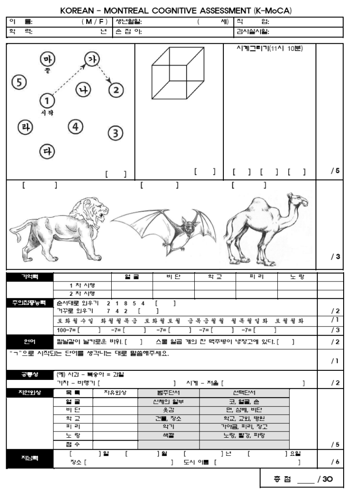
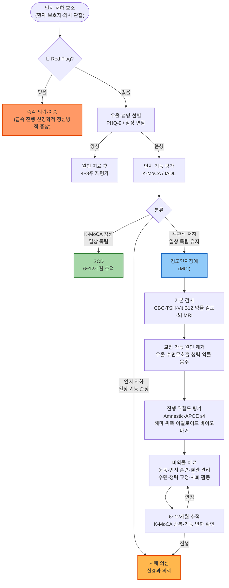

# 경도인지장애 Mild Cognitive Impairment, MCI

## <mark style="color:green;">일반 사항</mark>

* 고령에서 일반적으로 나타나는 것보다 다소 심한 정도로 어떤 일을 수행하는데 지장을 주는, 기억력이나 사고 등 일부 인지 영역의 경미한 장애
* 일상생활 능력과 전반적인 인지 기능은 유지됨
* subtype : amnestic type vs nonamnestic type - 빈도 = 2:1
  * amnestic type : single domain type(기억력 장애), multiple domains type(기억력 장애 및 치매 기준에 해당되지 않는 수준의 다른 인지 장애를 동반)
  * non-amnestic type : 기억력은 유지되나 다른 인지 영역의 장애 발생
  * amnestic type은 알츠하이머치매로, non-amnestic type은 레비소체치매·전두측두엽변성·혈관치매 등으로 진행하는 경향
* 기전 : 퇴행성, 혈관성, 대사성, 정신병성, 외상성, 복합성
* 유병률 : 60\~64세 6.7%, 65\~69세 8.4%, 70\~74세 10.1%, 75\~79세 14.8%, 80\~84세 25.2% \[AAN 2018]
* 경과 : 매년 10\~15%가 치매로 진행; 2년 이내 누적 발생률 약 14.9% \[AAN 2018]
  * 일반적인 고령자의 경우 매년 1\~2%가 치매로 진행
  * 일부는 정상으로 회복되거나 안정적으로 유지됨
  * **고위험 특성** 해당 시 연간 진행률 15\~20% 이상: amnestic type MCI, APOE ε4 보유, 해마 위축(MRI), 아밀로이드 바이오마커 양성, 빠른 진행 추세
* 선별 검사 : 인지 장애 증상이 없는 고령자에 대한 선별 검사는 위해(과잉 진단, 낙인 효과, 스트레스, 우울, 불필요하거나 효과가 없는 치료 및 약물 부작용)에 비하여 이득이 입증되지 않아 권고하지 않음 \[USPSTF 권고안]

#### <mark style="color:$primary;">인지 기능 저하의 단계</mark>

<table><thead><tr><th width="150">단계</th><th width="273">정의</th><th>검사 소견</th></tr></thead><tbody><tr><td><strong>주관적 인지 저하</strong><br><strong>(SCD)</strong></td><td>객관적 검사는 정상이나 환자 스스로 인지 저하를 느끼는 단계; 향후 MCI로 이행 위험 높음 → 6~12개월 간격 정기 추적 권장</td><td>표준화 검사 정상 범위</td></tr><tr><td><strong>경도인지장애</strong><br><strong>(MCI)</strong></td><td>NIA-AA 기준; DSM-5에서는 경도 신경인지장애(Mild Neurocognitive Disorder) 로 명명</td><td>객관적 인지 저하 확인; 일상생활 독립성 유지</td></tr><tr><td><strong>치매</strong></td><td>일상생활 기능 손상을 동반한 인지 저하</td><td>복수 인지 영역 장애</td></tr></tbody></table>

### <mark style="color:orange;">위험 인자</mark>

**교정 불가능한 위험 인자**

* 고령
* apolipoprotein E ε4 genotype
* 가족력

**교정 가능한 위험 인자 - 적극 관리 대상**

* 혈관 위험 인자 : 비만, 당뇨병, 고혈압, 고지혈증, 뇌졸중/심질환
* 생활 습관 : 흡연, 신체 활동 부족, 사회적 고립
* 청력 저하 : 예방 가능한 치매 위험 인자 중 단일 기여도 최고(PAF \~8%); 2024 ACHIEVE 연구(Lancet)에서 고위험 고령자의 보청기 사용 시 인지 저하 약 48% 감소 확인; 보청기 착용을 적극 권고. 보청기 착용이 청각 처리에 소모되던 인지 부하(cognitive load)를 줄여 뇌의 인지 예비 자원(cognitive reserve)을 보존하는 것이 기전으로 제안됨
* 시력 저하
* 수면무호흡증
* 낮은 교육 수준
* 신경정신 증상 : 초조, 무욕, 우울, 불안
* 약물 : 항콜린 작용이 있는 약물(diphenhydramine, chlorpheniramine, amitriptyline, oxybutynin, benztropine)

## <mark style="color:green;">임상 양상</mark>

* 기억력 장애
  * 이름이 떠오르지 않는 것은 고령자에서 정상적으로 흔한 증상이며, 환자가 주관적인 기억력 저하를 호소하는 경우에는 정서 상태 문제 등을 고려
* 일상생활 능력은 유지 또는 고령에서 나타나는 일반적인 수준의 변화를 보임
* 우울(⅓ 정도에서 출현), 불안, 초조, 과민, 공격성, 무욕, 대인 관계 갈등
* 일화성 기억 장애 : 새로운 정보를 배우고 보유하는 능력 장애; AD로 진행하는 경도인지장애 환자들에게서 가장 흔하게 관찰되는 증상
* **Non-amnestic MCI의 임상 양상** — 단순 건망증과 혼동하지 않도록 주의
  * 수행 기능(executive function) 저하 : 계획 세우기, 순서 지키기, 멀티태스킹 어려움; "일 처리가 전보다 느려졌다", "어디서부터 시작해야 할지 모르겠다"는 호소로 나타남
  * 시공간 능력 저하 : 익숙한 길에서 방향 감각 저하, 주차·공간 파악 어려움
  * 이러한 양상은 기억력 저하보다 혈관성 치매·레비소체치매·전두측두엽변성의 전조 증상일 가능성이 높으므로, amnestic MCI에 비해 신경과 의뢰를 더 적극적으로 고려

### <mark style="color:$danger;">🚩 Red Flags!</mark>

<mark style="color:$danger;">**즉각 의뢰 또는 이송**</mark>

* 수 주\~수 개월 이내 급속히 진행하는 인지 기능 저하 (프리온 질환, 신생물, 대사 장애 등)
* 뚜렷한 파킨슨 증상(안정 시 떨림, 경축, 보행 장애) 동반
* 시각적 환각, 초기 렘수면행동장애 동반 (레비소체치매 가능성)
* 심한 망상이나 환청 등 정신병적 증상 동반
* 뚜렷한 언어·행동·인격 변화가 기억력 장애보다 선행 (전두측두엽변성 가능성)

<mark style="color:$warning;">**당일 또는 조기 의뢰**</mark>

* 치료 가능한 원인(갑상선저하증, Vit B12 결핍, 우울증, 약물) 교정 후에도 증상 지속
* 65세 미만의 비교적 젊은 연령에서 인지 저하 발생

<mark style="color:$info;">**외래 추적 / 추가 평가 계획**</mark> <mark style="color:$info;">- 즉각 위험 낮으나 진행 시 의뢰</mark>

* 6\~12개월 이내 기능 저하가 뚜렷이 진행하여 치매 기준 접근 시 → 신경과 의뢰 고려
* 일상생활 수행에 유의미한 지장이 생긴 경우 (치매로의 이행 평가 필요)


**치매 전환 의심 지표 — 추적 시 확인**

* **IADL 미세 균열** : 약 복용 잊기, 공과금 납부 지연, 익숙한 길에서 당황함 등 일상 독립성의 미세한 균열
* **성격 변화** : 이전에 없던 무욕(apathy), 짜증, 사회적 위축이 뚜렷해짐
* **K-MoCA 연속 하락** : 6\~12개월 간격 추적 검사에서 2\~3점 이상 감소


## <mark style="color:green;">진단</mark>

### <mark style="color:orange;">임상적 진단 Criteria</mark>

\[National Institute on Aging–Alzheimer's Association, NIA-AA]

1. 인지 변화에 대하여 환자, 지인, 또는 환자를 관찰한 의사에 의해 얻어진 증거가 있음
2. (교육 수준 및 연령에 비하여) 기억력, 판단력, 집중력, 언어, 시공간 기술 영역 중 ≥1개의 인지 영역에서의 장애
3. 복잡한 업무(예: 보통의 돈 계산, 식사 준비, 장보기)를 수행하는데 약간의 문제가 있지만 일상생활 수행에 있어서의 독립적인 능력 유지; 업무를 수행하는데 있어 이전보다 더 많은 시간이 걸리고 효율성이 떨어지며 더 많은 오류를 범할 수 있음
4. 치매는 아님. 사회적 또는 직업상 유의미한 장애의 증거가 없음

 ※ 6\~12개월 간격으로 재평가하여 변화를 관찰

### <mark style="color:orange;">검사</mark>

* 실험실 검사 : CBC, 전해질 검사, TSH, Vit B12, 지질 검사
* 신경학적 검사
* 영상 검사 : MRI (또는 CT)
* 인지 기능 검사 : 한국판 몬트리올 인지평가 (K-MoCA)


**교정 가능한 원인 체크리스트** — MCI 의심 시 반드시 확인

□ 우울증 (PHQ-9) &#x20; □ 수면무호흡증 &#x20; □ 청력 저하 &#x20; □ 시력 저하\
□ 약물 (항콜린성 부담) &#x20; □ Vit B12 결핍 &#x20; □ TSH (갑상선저하증) &#x20; □ 음주


#### <mark style="color:$primary;">**한국판 몬트리올 인지평가**</mark> <mark style="color:$primary;">(</mark>[<mark style="color:$primary;">K-MoCA</mark>](https://accesson.kr/kjcp/assets/pdf/16582/journal-28-2-549.pdf)<mark style="color:$primary;">)</mark>

* 주의력, 집중력, 실행력, 기억력, 어휘력, 시각 공간력, 추상력, 계산과 지남력 평가; 10분 소요
* 글을 읽거나 쓰는 능력이 없거나 서투른 경우에는 적용하지 않음
* 판정 : 30점 만점, ≥26점 시 정상 (원저자 Nasreddine 등의 기준)
  * 한국 규준 연구에서는 교육 수준 및 연령에 따라 cutpoint 차이가 있으며, 23점 기준 적용 시 MCI 과대평가(정상 10%, MCI 52%, 치매 38%)가 발생함. 최적 민감도·특이도는 cutpoint 16.5에서 달성된다는 보고가 있어 단독 기준 적용에 주의를 요함 \[강연욱 등, 2009]
  * 교육 수준이 낮은 경우(12년 미만) 1점 보정을 권장하는 원저자 지침 참고
* 1차 진료 실용 기준

<table><thead><tr><th width="160">K-MoCA 점수</th><th width="260">해석</th><th>권장 조치</th></tr></thead><tbody><tr><td>≥24점</td><td>정상 범주 가능</td><td>SCD 해당 시 6~12개월 추적</td></tr><tr><td>20–23점</td><td>인지 저하 의심</td><td>위험인자 관리 + 6~12개월 재평가</td></tr><tr><td>≤19점</td><td>치매 가능성</td><td>추가 평가 및 신경과 의뢰 고려</td></tr></tbody></table>

  * 교육 연수 12년 미만 시 획득한 점수에 1점을 가산하여 판정
  * 단독 수치보다 **변화 추이**(추적 검사와의 비교)가 더 중요

<figure><figcaption><p><strong>K-MoCA 검사지</strong> (강연욱 등. 혈관성 인지장애 선별검사로서 Korean-Montreal Cognitive Assessment(K-MoCA)의 신뢰도, 타당도 및 규준 연구. Korean Journal of Clinical Psychology 2009;28(2):549-562.)</p></figcaption></figure>

※ MoCA-2(개정판) : 원저자가 일부 항목을 개정한 버전; 국내에서는 디지털 인지 검사(예: C-SBT 등)를 병용하는 추세도 있으나 아직 표준화 진행 중

#### <mark style="color:$primary;">혈액 바이오마커 (Blood-based Biomarkers)</mark>

**p-tau217 혈액 검사**

* 혈장 phosphorylated tau 217(p-tau217)은 뇌 아밀로이드 병리를 반영하는 마커로, 아밀로이드 PET 검사에 근접하는 정확도(민감도 82%, 특이도 86%; AUC 0.93\~0.96)를 보임 \[다수 독립 코호트 검증, 2024]
* CSF 검사나 아밀로이드 PET에 비해 비침습적이고 저비용; 일차 의료기관 선별 후 상급병원 의뢰 여부 결정에 유용
* 2025년 FDA, 최초 혈액 기반 알츠하이머 진단 보조 검사 허가; 국내 도입 여부는 확인 필요
* 적응: AD 병리 확인이 필요한 경우(예: 항아밀로이드 치료 전 선별), 전문의 협진 시 활용
* 양성(elevated) 시 → 아밀로이드 PET 또는 CSF 검사로 확진 후 전문의 의뢰 권고
* 회색 지대(Intermediate/Grey zone) : 결과가 양성·음성 경계에 해당하는 경우 해석이 불확실하며, 아밀로이드 PET 또는 CSF 검사로 확인이 필요함 — 일차 의료기관에서 단독 결과로 확진하지 않도록 주의

**기타 혈액 바이오마커 (연구·개발 중)**

* p-tau181, p-tau231도 AD 병리 반영 마커로 연구 진행 중
* Aβ42/40 ratio + p-tau 조합 사용 시 단독 마커 대비 정확도 향상 보고
* 향후 혈액 기반 ATN(Amyloid·Tau·Neurodegeneration) 분류 가능성 — 현재는 전문의 영역

### <mark style="color:orange;">감별</mark>

* 우울증, 파킨슨병, 치매, 갑상선저하증, Vit B12 결핍, 약물
* 가성 치매(Pseudodementia) : 우울증으로 인한 인지 기능 저하; MCI와 혼동되기 쉬움
  * 검사 중 "모르겠어요"라는 답변이 많고, 정답을 알면서도 노력하지 않는 경향이 있음
  * 인지 저하보다 우울·무기력 호소가 선행; 우울증 치료 후 인지 기능이 상당 부분 회복됨
* 섬망 : 급성 발생, 의식 변화, 주의력 장애의 변동이 특징 — MCI와 혼동하지 않도록 주의

#### <mark style="color:$primary;">정상 노화 · MCI · 우울(가성치매) 감별</mark>

<table><thead><tr><th width="170">구분</th><th width="190">정상 노화</th><th width="220">경도인지장애 (MCI)</th><th>우울 (가성치매)</th></tr></thead><tbody><tr><td><strong>발병 양상</strong></td><td>서서히, 수년</td><td>서서히 진행</td><td>비교적 빠름 (수주~수개월)</td></tr><tr><td><strong>주 호소</strong></td><td>"깜빡한다"</td><td>"기억이 점점 나빠진다"</td><td>"머리가 안 돌아간다, 아무것도 못하겠다"</td></tr><tr><td><strong>기억 문제 특징</strong></td><td>이름·단어 인출 지연 (tip-of-the-tongue)</td><td>새로운 정보 학습·저장 장애 (recent memory↓)</td><td>집중력 저하로 인한 기억 저하처럼 보임</td></tr><tr><td><strong>단서 제공 시</strong></td><td>대부분 기억 회복</td><td>회복 잘 안 됨</td><td>잘 회복됨</td></tr><tr><td><strong>검사 태도</strong></td><td>협조적, 노력함</td><td>끝까지 노력</td><td>"모르겠어요" 반복, 쉽게 포기</td></tr><tr><td><strong>일상생활 기능</strong></td><td>정상</td><td>독립적이나 효율 저하</td><td>의욕 저하로 기능 저하처럼 보임</td></tr><tr><td><strong>정서 증상</strong></td><td>경미</td><td>동반 가능 (우울·불안)</td><td>핵심 증상 (우울, 무기력, 죄책감)</td></tr><tr><td><strong>진행·치료 반응</strong></td><td>매우 느림</td><td>연 10~15% 치매 진행</td><td>항우울 치료 시 인지 회복 가능</td></tr></tbody></table>

***



<p align="center"><strong>경도인지장애 1차 진료 알고리즘</strong></p>

<p align="center"><em><mark style="color:$info;">Ref. NIA-AA criteria; AAN Practice Guideline 2018</mark></em></p>

***

## <mark style="background-color:$warning;">Management</mark>

## <mark style="color:green;">약물 치료</mark>

* 치매로의 진행을 예방하는 효과가 입증된 약제는 없음 \[AAN 2018, 다수 가이드라인 공통]

#### <mark style="color:$primary;">Acetylcholine 전구체</mark>

* MCI에 대한 치매 예방 효과 입증 불충분; 일부 연구에서 약간의 증상 완화
*   choline alfoscerate : 800\~1200 ㎎/d <mark style="color:blue;">\[글리아티린]</mark>

    ※ 콜린알포세레이트(choline alfoscerate) 급여 주의 : 치매 진단 환자(F00\~F02, G30 등)에서는 기존 급여(본인부담 30%) 유지; 경도인지장애(F06.7) 등 치매 외에서는 선별급여 전환, 본인부담 80%(처방 전 환자 안내 필수)

    * 임상재평가(식약처) 진행 중. 효능 입증 실패 시 품목 취소 가능성 있음

#### <mark style="color:$primary;">Acetylcholinesterase inhibitor</mark>

* MCI에서 cholinesterase inhibitor는 효과 입증 불충분, 부작용 발생 가능 — **일반적으로 사용하지 않음** \[AAN 2018; 복수 가이드라인 비권고]
* 치매로의 이행이 의심되는 경우 → **신경과 의뢰 우선**
* donepezil 처방이 필요하다고 판단되는 경우 신경과 전문의 평가 후 시행 권장 (☞ [치매](033_-dementia.md#management))

#### <mark style="color:$primary;">항아밀로이드 단클론항체</mark>

* AD 병리 확인 MCI에 대한 질병 조절 치료
* 아밀로이드 PET 또는 혈액/뇌척수액 바이오마커로 AD 아밀로이드 병리가 확인된 MCI 또는 경증 AD 치매 환자에서 인지 기능 저하를 18개월간 약 27\~35% 지연시키는 효과로 FDA 승인을 받음; 다만 절대적 효과 크기는 제한적이며 기능적 개선보다 진행 지연 중심 — 환자 선택이 매우 중요; lecanemab <mark style="color:blue;">\[레켐비]</mark>(국내 출시), donanemab <mark style="color:blue;">\[키썬라]</mark>
* 뇌 부종·삼출(ARIA-E) 및 미세출혈·혈철소 침착(ARIA-H) 부작용, 정기 MRI 모니터링, ApoE 유전자 검사 등 전문 관리 필요; ApoE ε4 동형접합(homozygous) 보유자에서 ARIA 위험 현저히 높음
* 일차 의료에서는 직접 처방 대상이 아니며, 신경과·인지신경의학 전문의 평가 후 시행

#### <mark style="color:$primary;">기타</mark>

* growth hormone-releasing hormone, 비내 인슐린 : 유효할 가능성이 있음; 추가 연구 필요

## <mark style="color:green;">비약물 치료</mark>

**운동**&#x20;

* 6개월 이상의 규칙적 유산소 운동은 인지 기능 지표를 개선할 가능성이 높음 \[AAN 2018, Level B]
* 매일 30분 걷기, 주 3\~5회 유산소 운동 프로그램 참여 권고
* FINGER 연구에서 운동·식이·인지 훈련·혈관 위험인자 관리를 병합한 다중 영역 중재가 인지 저하를 유의하게 감소시킴 \[FINGER trial, Lancet 2015] — 단일 중재보다 복합 접근이 효과적

**인지 훈련(Cognitive training)**&#x20;

* 인지 기능 지표 개선 가능성이 있음 \[AAN 2018]
* 예) 퍼즐, 책읽기, 컴퓨터 작업, 수작업, 새로운 언어·악기 학습
* 전문가 감독 하의 구조화된 훈련이 자가 훈련보다 효과가 큰 경향

**디지털 치료기기(DTx)**&#x20;

* 처방 기반 소프트웨어 의료기기로 인지 훈련을 표준화·체계화하여 제공
* 코그테라(Cogthera)<sup>TM</sup> : 국내 최초 경도인지장애 적응증 식약처 허가 취득(2025), 보건복지부 신의료기술 인정; 55\~85세 MCI 환자 대상 12주 모바일 맞춤 인지훈련 제공, 처방전 기반 사용 (제조사: 이모코그); 급여 수가 등 세부 사항은 변동 중

**웨어러블 기기 활용 (Emerging)**&#x20;

* 스마트워치·액티그래피를 통한 수면 효율·일일 활동량(걸음 수) 데이터가 인지 기능 저하의 조기 지표로 연구되고 있음
* 현재 임상 표준은 아니나, 추적 상담 시 환자가 직접 가져온 웨어러블 데이터(수면 패턴 변화, 활동량 감소 추세)를 참고 자료로 활용 가능; 환자의 자기 모니터링 동기 부여 및 치료 순응도 향상에 도움

## <mark style="color:green;">기타 관리 및 예방</mark>

**위험 인자 관리**&#x20;

* 금연, 음주 제한(≤1 SD/d; 1일 1표준잔=순알코올 14g 이하)
* 비만, 고혈압, 당뇨병, 이상지질혈증 관리

**동반 문제 관리**&#x20;

* 우울증, 영양 결핍
* 청력 저하 : 보청기 착용이 인지 기능 저하 속도를 늦출 수 있음(Lancet Commission)
* 시력/후각/미각 저하도 함께 평가

**수면 관리**&#x20;

* 수면 중 뇌의 아밀로이드 제거(glymphatic system)가 이루어지므로 수면의 질 관리가 중요
* 수면 시간 6시간 미만은 인지 기능 저하 및 치매 위험 증가와 연관됨 — 7\~8시간 수면 권장
* 수면무호흡증 치료(CPAP) 시 인지 저하 속도를 늦출 수 있다는 근거가 축적되고 있음; 수면위생 교육 병행 권고 (☞ [불면증](029_-insomnia-sleep-disorder.md))
* 수면 중 소리를 지르거나 팔다리를 움직이는 렘수면 행동장애가 동반된 경우 파킨슨병 전구 증상일 수 있으므로 신경과 의뢰 고려 (☞ [파킨슨병 전구 증상](035_-parkinsons-disease.md#전구-증상))

**사고 예방 조치** : 낙상, 화재, 가출 등 사고 예방을 위한 조치

**혈관 위험 질환 치료**&#x20;

* 고혈압, 당뇨병, 뇌혈관 질환, 고지혈증, 수면무호흡증
* 수축기 혈압 120 ㎜Hg 미만으로 적극 관리 시 MCI 발생률 감소 \[SPRINT-MIND 2019]

**건강한 생활 습관** : 사회적 관계 형성

**식이, 보조 식품/영양제**

* 건전하고 균형 있는 식단, 지중해식 식단 권고 (☞ [영양 지침](../231_/217_-nutritiondiet-guideline.md))
* 항산화제(Vit C/E, 베타 카로틴, selenium), Vit B6/B12, folate, Vit D : 효과 입증 불충분
* Vit E(α-tocopherol; 2,000 IU/d)가 경증 AD에 대하여 유효할 가능성이 있다는 보고가 있음
* 오메가-3, NSAID, estrogen, testosterone, 은행(ginkgo biloba extract 120 ㎎/d), selegiline(MAO-B 억제제), gabapentin, coenzyme Q10 : 효과 입증이 안 됨
* polyphenol : 일부 관찰 연구에서 연관성 보고; 임상 근거 불충분

***

### <mark style="color:red;">질병코드</mark>

F06.7 경도 인지 장애

***

## <mark style="color:purple;">처방례</mark>

> **처방례 1.** 경도 인지 장애 — 일반적 관리 (약물 치료 없이 위험인자 관리 중심)
>
> ```
> ※ 치매로의 진행을 예방하는 효과가 입증된 약제 없음 — 비약물 치료 우선
> ※ 동반 위험인자 관리 : 고혈압, 당뇨병, 고지혈증, 수면무호흡증, 우울증 치료
> ※ 규칙적 유산소 운동 (예: 매일 30분 걷기) 및 인지 훈련 활동 권고
> ※ 6~12개월 후 K-MoCA 재평가하여 인지 기능 변화 추적
> ```

> **처방례 2.** 경도 인지 장애 — 증상 완화 목적 choline alfoscerate 투여 시
>
> ```
> 글리아티린 연질캡슐 400 ㎎  1C  tid  (#3)
> 또는 글리아티린 서방정 1200 ㎎  1T  qd
> ※ [급여 변경] MCI(F06.7)에서는 선별급여 적용 — 본인부담 80% (2025.9.21 시행)
>    → 처방 전 환자에게 반드시 급여 변경 및 본인부담 증가 안내
>    → 청구 시 본인부담률 구분코드 B(100분의 80 본인부담) 기재
> ※ 치매 예방 효과는 입증되지 않음 — 증상 완화 목적; 효과 없으면 중단 고려
> ※ 동반 위험인자 관리 및 운동·인지 훈련 병행
> ※ 6~12개월 후 K-MoCA로 추적 평가
> ```

> **처방례 3.** 경도 인지 장애 — 신경과 의뢰 대상 (치매 이행 의심 / 항아밀로이드 치료 고려)
>
> ```
> ※ 아래 해당 시 신경과 의뢰:
>    - 6~12개월 추적 중 인지·기능 저하가 뚜렷이 진행
>    - amnestic MCI + 고위험 특성 (APOE ε4, 해마 위축 등)
>    - 혈액 바이오마커(p-tau217) 양성 → 아밀로이드 PET 확진 필요
>    - 항아밀로이드 단클론항체 치료 고려 (lecanemab, donanemab)
>    - 65세 미만 비교적 젊은 연령 발병
> ※ MCI에서 cholinesterase inhibitor(donepezil 등)는
>    효과 근거 불충분으로 일차 의료에서 일반적으로 처방하지 않음
> ※ 치매로의 이행이 확인된 경우 → 치매 챕터 처방례 참조
> ```
>
> _✽ "MCI는 치매가 아닙니다. 지금 관리하면 진행 속도를 늦출 수 있습니다"라는 프레임을 먼저 전달한 뒤 의뢰 목적을 설명하면 환자 수용도가 높아짐._

***

### <mark style="color:$success;">핵심 복약 지도</mark>

> **경도인지장애 환자 안내**
>
> * 현재 치매로의 진행을 막아주는 약은 없습니다. 꾸준한 운동과 인지 활동, 혈압·혈당·콜레스테롤 관리가 가장 중요합니다.
> * 매일 30분 이상 걷기 등 규칙적인 유산소 운동을 권장합니다.
> * 독서, 퍼즐, 새로운 취미 활동 등 인지 자극 활동을 꾸준히 하십시오.
> * 사회적 관계를 유지하는 것도 도움이 됩니다.
> * 담배는 반드시 끊고, 술은 하루 1잔 이하로 제한하십시오.
> * 6\~12개월마다 인지 기능 검사를 받아 변화를 확인합니다.

> **언제 다시 병원을 방문해야 하나요?**
>
> * 기억력 저하가 수 주 이내로 빠르게 나타나거나 악화되는 경우
> * 일상생활(요리, 금전 관리, 약 복용)을 혼자 하기 어려워진 경우
> * 헛것이 보이거나 이상한 소리가 들리는 경우
> * 걸음걸이 이상, 손발 떨림이 새로 생긴 경우
> * 성격이나 행동이 크게 변한 경우

***

### <mark style="color:blue;">환자 안내서</mark>


**경도인지장애, 이렇게 관리하세요**

경도인지장애는 치매는 아닙니다. 꾸준한 관리로 진행을 늦출 수 있습니다.


#### <mark style="color:$primary;">경도인지장애란 무엇인가요?</mark>

* 기억력이나 판단력이 또래보다 조금 더 나빠진 상태이지만, 일상생활은 대부분 혼자 할 수 있는 상태입니다.
* 매년 10\~15% 정도가 치매로 진행하지만, 일부는 정상으로 회복되기도 합니다.
* 치매로 진행하지 않도록 위험인자를 관리하는 것이 핵심입니다.

#### <mark style="color:$primary;">가장 중요한 생활 관리</mark>

* **규칙적인 운동** : 매일 30분 이상 걷기, 주 3\~5회 유산소 운동은 인지 기능 개선에 효과가 있는 것으로 알려져 있습니다.
* **인지 자극 활동** : 독서, 퍼즐, 새로운 언어·악기 배우기, 컴퓨터 작업 등을 꾸준히 하십시오.
* **사회적 교류** : 가족·친구와 자주 만나고 모임에 참여하는 것이 도움이 됩니다.
* **균형 잡힌 식사** : 지중해식 식단(채소, 생선, 올리브오일, 통곡물)이 권장됩니다.
* **수면 관리** : 충분한 수면을 취하십시오. 수면 중 뇌에서 노폐물이 제거됩니다. 코골이·수면무호흡이 있다면 치료를 받으십시오.

#### <mark style="color:$primary;">반드시 관리해야 할 건강 문제</mark>

* **혈압** : 수축기 혈압을 120 mmHg 수준으로 적극 관리하는 것이 MCI 예방에 도움이 됩니다.
* **혈당 및 콜레스테롤** : 당뇨병·고지혈증 치료를 꾸준히 받으십시오.
* **우울증** : 우울감이 지속되면 반드시 의사에게 알리십시오. 우울증 치료가 인지 기능에도 도움이 됩니다.
* **청력·시력** : 이상이 있으면 보청기·안경을 사용하십시오. 감각 저하도 인지 기능에 영향을 줍니다.

#### <mark style="color:$primary;">이럴 때는 즉시 내원하세요</mark>

* 기억력이 수 주 이내로 갑자기 나빠질 때
* 일상생활을 혼자 하기 어려워졌을 때
* 헛것이 보이거나 이상한 소리가 들릴 때
