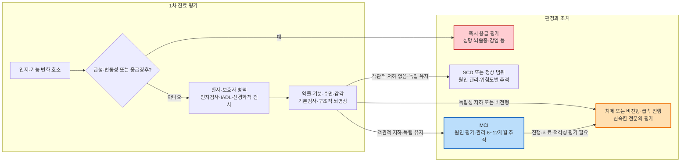

# 경도인지장애 Mild Cognitive Impairment, MCI

## <mark style="color:green;">일반 사항</mark>

* 경도인지장애(Mild Cognitive Impairment, MCI)는 연령·교육·문화적 배경으로 예상되는 수준을 넘어선 **객관적인 인지 저하**가 ≥1개 인지 영역에서 확인되지만, 일상생활의 독립성은 대체로 유지되어 치매(주요 신경인지장애) 기준에는 이르지 않은 임상 증후군이다.
  * 복잡한 일상 업무에서 이전보다 시간이 더 걸리거나 실수가 늘고 보조전략이 필요할 수 있으나, 본질적으로 독립적으로 수행할 수 있다.
  * 일상생활 기능의 유의미한 손상 여부가 MCI와 치매를 구분하는 핵심이며, 인지 선별검사 점수만으로 구분하지 않는다.
* DSM-5에서는 **경도 신경인지장애(Mild Neurocognitive Disorder)**라는 용어를 사용한다.
* MCI는 단일 질환이나 반드시 치매로 진행하는 선형 단계가 아니라, 다양한 원인과 예후를 포함하는 이질적인 증후군이다.
* 임상 아형
  * 기억상실형(amnestic) 또는 비기억상실형(non-amnestic)
  * 단일영역(single-domain) 또는 다영역(multiple-domain)
  * 기억상실형은 알츠하이머병과 연관되는 경우가 많고, 비기억상실형은 혈관성 인지장애·레비소체병·전두측두엽변성 등에서 나타날 수 있으나 아형만으로 원인질환이나 진행 방향을 확정할 수 없다.
* 유병률은 진단 정의와 표본에 따라 크게 다르며 연령과 함께 증가한다. 과거 AAN 분석에서는 60~64세 6.7%, 65~69세 8.4%, 70~74세 10.1%, 75~79세 14.8%, 80~84세 25.2%로 보고되었다.
* 경과
  * 치매 전환율은 진단기준, 원인, 모집 경로와 추적기간에 따라 크게 다르다. 일반적으로 지역사회 표본보다 기억클리닉 등 임상 표본에서 높다.
  * 과거 AAN 분석에서 65세 이상 MCI의 2년 누적 치매 발생률은 약 14.9%였으나, 이를 모든 환자에게 연간 10~15%로 일률 적용하지 않는다.
  * 일부는 장기간 안정적으로 유지되거나 정상 범위로 회귀하지만, 회귀한 경우에도 이후 인지 저하 위험이 일반인과 같아졌다고 단정할 수 없다.
* **무증상 선별과 증상 평가를 구분한다.** USPSTF는 인지 저하 징후가 없는 지역사회 거주 65세 이상 성인의 일률적 선별에 대해 이득과 위해의 근거가 불충분하다는 I statement를 제시한다. 환자·가족의 우려나 인지·기능 변화가 있으면 이 권고와 무관하게 평가한다.


2018 AAN MCI 진료지침은 2024년 2월 10일자로 **retired** 처리되었으며, AAN은 해당 권고와 결론을 더 이상 유효한 것으로 지지하지 않는다. 과거 역학·연구 결과의 출처로는 인용할 수 있으나 현행 권고 수준으로 사용하지 않는다. 현재 인지장애의 진단 평가·검사·상담·결과 설명에는 Alzheimer’s Association DETeCD-ADRD 2024–2025 지침을 참고한다. 다만 DETeCD-ADRD는 과거 AAN MCI 치료 권고를 그대로 대체하는 약물치료 지침은 아니다.


#### <mark style="color:$primary;">인지 저하의 임상 범주</mark>

<table><thead><tr><th width="150">범주</th><th width="350">핵심 특징</th><th>해석</th></tr></thead><tbody><tr><td><strong>주관적 인지 저하</strong><br><strong>(SCD)</strong></td><td>스스로 지속적인 인지 저하를 느끼지만 표준화 검사에서 객관적 저하가 확인되지 않음</td><td>수면·기분·약물·감각 문제 등을 평가하고 위험도와 임상 경과에 따라 추적; 반드시 MCI로 진행하는 단계는 아님</td></tr><tr><td><strong>경도인지장애</strong><br><strong>(MCI)</strong></td><td>≥1개 인지 영역의 객관적 저하가 있으나 일상생활의 독립성 유지</td><td>임상 증후군을 확인한 뒤 원인질환을 평가</td></tr><tr><td><strong>치매</strong><br><strong>(주요 신경인지장애)</strong></td><td>≥1개 인지 영역의 저하가 독립적인 일상생활을 유의미하게 방해</td><td>손상된 인지 영역의 수가 아니라 기능적 독립성 저하가 핵심</td></tr></tbody></table>

## <mark style="color:green;">원인 및 위험 인자</mark>

### <mark style="color:orange;">원인</mark>

* 신경퇴행성 : 알츠하이머병, 레비소체병, 전두측두엽변성, 파킨슨병 관련 인지장애 등
* 혈관성 : 뇌경색, 소혈관질환, 전략적 병변, 혼합형 병리
* 정신건강·수면 : 우울, 불안, 수면무호흡증, 불면 등
* 약물·물질 : 항콜린성 약물, 진정제, 음주 및 기타 물질
* 대사·전신질환 : 갑상선기능 이상, Vit B12 결핍, 간·신장질환, 전해질·혈당 이상 등
* 신경학적·구조적 : 두부외상, 정상압수두증, 경막하혈종, 뇌종양 등
* 청력·시력 저하, 교육·언어·문화적 요인에 의한 검사 수행 저하
* 고령에서는 여러 병리가 함께 존재하는 혼합 원인이 흔하다.

### <mark style="color:orange;">위험 인자</mark>

**교정 불가능하거나 현재 시점에 직접 교정하기 어려운 요인**

* 고령
* 가족력
* apolipoprotein E(APOE) ε4 유전자형
* 낮은 교육 기회 등 생애 초기 요인

**평가하고 관리할 요인**

* 고혈압, 당뇨병, 이상지질혈증, 비만, 뇌졸중·심혈관질환
* 흡연, 과도한 음주, 신체 활동 부족, 사회적 고립
* 청력·시력 저하
  * ACHIEVE 무작위시험의 전체군에서는 3년 인지 변화에 유의한 차이가 없었으나, 인지 저하 위험이 더 높았던 사전지정 ARIC 하위집단에서는 청력 중재가 인지 저하를 48% 늦췄다. 이를 모든 고령자에게 동일한 효과로 일반화하지 않는다.
* 우울, 불안, 무욕 등 신경정신 증상
* 수면무호흡증 및 수면장애
* 인지 기능에 영향을 줄 수 있는 약물
  * 항콜린성 약물 : diphenhydramine, chlorpheniramine, amitriptyline, oxybutynin, benztropine 등
  * benzodiazepine, Z-drug, 일부 항정신병약·항경련제·opioid 등은 적응증, 용량, 병용약 및 환자 취약성을 함께 검토

※ 2024 Lancet Commission은 생애주기 전반의 14개 교정 가능한 치매 위험요인을 제시하고, 중년기 고 LDL 콜레스테롤과 노년기 치료되지 않은 시력저하를 새로 포함하였다. 개별 위험인자 관리가 특정 환자의 치매를 예방한다고 보장하지는 않지만 전반적인 뇌·심혈관 건강을 위해 적극 관리한다.

## <mark style="color:green;">임상 양상</mark>

* 기억 : 새로운 정보의 학습·저장 저하, 같은 질문 반복, 약속이나 최근 사건을 잊음
* 실행기능 : 계획 세우기, 순서 지키기, 문제 해결, 멀티태스킹이 이전보다 느리거나 어려움
* 언어 : 단어 찾기, 이름대기, 문장 이해 또는 표현의 변화
* 주의력·처리속도 : 복잡한 대화나 업무를 따라가기 어려움, 일 처리 속도 저하
* 시공간 기능 : 길 찾기, 주차, 물건 위치와 공간관계 파악의 어려움
* 행동·정서 : 우울, 불안, 과민, 무욕, 사회적 위축 등이 동반될 수 있음
* 기능
  * 약 복용, 금전 관리, 장보기, 요리, 교통수단 이용 등 복잡한 IADL에서 시간 증가·실수·보조전략 사용이 나타날 수 있다.
  * 도움 없이는 안전하거나 정확하게 수행하기 어려워졌다면 치매로의 이행을 평가한다.

**추적 시 진행을 의심할 소견**

* 환자 또는 보호자가 확인하는 지속적인 인지·기능 저하
* 약 복용, 금전 관리, 운전, 길 찾기 등에서 독립성 저하
* 이전에 없던 무욕, 성격·행동 또는 신경학적 변화
* 동일 조건의 반복검사에서 임상적으로 의미 있는 하락
  * MoCA는 검사오차와 연습효과가 있어 2~3점 하락을 보편적인 치매 전환 기준으로 사용하지 않는다. 점수 변화는 IADL, 보호자 병력, 검사 조건 및 필요 시 정밀신경심리검사와 함께 해석한다.

### <mark style="color:$danger;">🚩 Red Flags!</mark>

<mark style="color:$danger;">**즉시 응급 평가 또는 이송**</mark>

* 시간~수일 내 갑자기 발생하거나 하루 중 변동하는 인지·주의력·의식 변화 → 섬망, 약물·대사 이상, 감염 등 평가
* 새 국소 신경학적 결손, 급성 보행·언어장애, 심한 두통 → 뇌졸중·두개강내 병변 평가
* 발작, 발열·수막자극징후, 최근 두부외상
* 심한 저혈당·저산소증·전해질 이상 등 급성 전신질환 의심
* 자·타해 위험, 심한 초조 또는 안전을 확보할 수 없는 망상·환각

<mark style="color:$warning;">**신속한 전문의 평가**</mark>

* 수주~수개월에 걸친 급속 진행성 인지 저하
* 65세 미만에서 시작된 인지·행동 변화
* 파킨슨증, 반복되는 시각환각, 인지 변동, 렘수면행동장애 → 레비소체병 등 의심
* 언어·행동·인격 변화가 기억 저하보다 뚜렷하게 선행 → 전두측두엽변성 등 의심
* 보행장애·요절박/요실금과 인지 저하가 함께 진행 → 정상압수두증 등 감별
* 비전형적 양상, 새 신경학적 징후, 진단 불확실 또는 정밀신경심리검사가 필요한 경우
* 알츠하이머병 바이오마커 검사 또는 항아밀로이드 치료 적격성 평가가 필요한 경우

<mark style="color:$info;">**외래 추적 및 재평가**</mark>

* 즉각 위험이 없는 안정적 MCI는 일반적으로 6~12개월 간격으로 인지·기능·행동 변화를 추적
* 환자·보호자가 진행을 느끼거나 안전·독립성 문제가 생기면 예정된 방문을 기다리지 않고 조기 재평가

## <mark style="color:green;">진단</mark>

### <mark style="color:orange;">임상적 진단 기준</mark>

1. 환자, 환자를 잘 아는 보호자 또는 의료진이 이전 수준과 비교한 인지 변화를 확인
2. 연령·교육·언어·문화적 배경을 고려했을 때 ≥1개 인지 영역의 객관적 저하가 있음
3. 복잡한 업무에서 효율 저하·실수·보조전략 사용은 있을 수 있으나 일상생활의 독립성은 유지
4. 인지 저하가 섬망 중에만 나타나는 것이 아니며 다른 정신질환만으로 더 잘 설명되지 않음
5. 치매(주요 신경인지장애)는 아님

MCI 증후군을 확인한 다음 신경퇴행성·혈관성·정신건강·약물·전신질환 등 원인 또는 복합 원인을 평가한다. **MCI 진단과 알츠하이머병 원인 진단은 같은 의미가 아니다.**


**임상 적용 포인트 — MCI 진단 시 반드시 확인할 것**

* 치매와의 구분 핵심 : 인지검사 점수가 아니라 **일상생활의 독립성 유지 여부**
* 기본 평가 : 환자와 보호자 병력, IADL, 약물·기분·수면·청력·시력, 신경학적 검사, 기본 혈액검사와 구조적 뇌영상
* 치료 원칙 : 교정 가능한 악화요인과 혈관 위험인자를 관리하고 비약물 중재를 우선하며, 원인 미확정 MCI에 치매 전환 예방효과가 입증된 일률적 경구약은 없음
* 의뢰 : 급속 진행·비전형 양상·독립성 저하 또는 알츠하이머병 바이오마커·항아밀로이드 치료 적격성 평가가 필요한 경우


### <mark style="color:orange;">1차 평가</mark>

* 병력
  * 발병 시점과 진행 속도, 손상된 인지 영역, 일상 기능, 행동·정서 변화
  * 환자를 잘 아는 보호자의 독립적인 병력을 가능한 한 함께 청취
  * 교육·직업·주 사용언어, 청력·시력, 수면, 음주, 두부외상, 가족력 확인
* 약물 검토 : 처방약, 일반약, 건강기능식품을 포함하여 항콜린성·진정성 부담과 최근 변경 확인
* 진찰 : 신경학적 검사, 보행, 파킨슨증, 국소신경징후, 청력·시력 및 전신상태
* 인지·기능 평가
  * 검증된 인지 선별검사와 함께 IADL을 평가
  * 선별검사가 정상이어도 병력상 의심이 높거나 고학력·높은 병전기능 환자에서는 정밀신경심리검사를 고려
  * 국내 국가 치매조기검진과 치매안심센터에서는 CIST(Cognitive Impairment Screening Test)를 1단계 선별검사로 사용하며, 의료기관에서는 K-MMSE-2도 활용한다. 두 검사는 MCI 확진검사가 아니며, 특히 K-MMSE-2는 정상 노화와 MCI의 구분 민감도에 한계가 있다.
  * CIST 또는 K-MMSE-2가 정상 범위이더라도 환자·보호자가 분명한 변화를 호소하거나 병전기능이 높다면 K-MoCA 또는 정밀신경심리검사(SNSB, CERAD-K)를 고려한다.
* 기본 검사
  * CBC, 전해질, glucose 또는 HbA1c, calcium, 신장·간기능, TSH, Vit B12
  * 임상상에 따라 folate, thiamine, HIV, 매독, 염증·자가면역·독성·감염 검사 등을 선택
  * 지질 검사는 인지 저하의 직접적인 교정 원인 검사가 아니라 혈관 위험 평가·관리를 위해 시행
* 구조적 뇌영상
  * 원인 감별과 혼합 병리 평가를 위해 가능한 경우 비조영 뇌 MRI를 우선하고, MRI가 불가능하면 뇌 CT를 고려
  * 종양, 경막하혈종, 정상압수두증, 뇌경색·출혈, 소혈관질환, 국소·전반적 위축 양상 등을 확인


갑상선기능 이상, Vit B12 결핍, 우울, 수면무호흡증, 약물 등은 항상 인지 저하의 유일한 “가역적 원인”인 것은 아니다. 기저 신경퇴행성·혈관성 질환과 공존하여 증상을 악화시킬 수 있으므로, 교정 후에도 인지·기능 경과를 추적한다.


#### <mark style="color:$primary;">한국판 몬트리올 인지평가(K-MoCA)</mark>

* 주의력, 실행기능, 기억, 언어, 시공간 기능, 추상력, 계산 및 지남력을 평가하는 약 10분의 **선별검사**이다.
* 총점만으로 정상·MCI·치매를 확정하지 않는다. 일상생활 독립성, 보호자 병력 및 필요 시 정밀신경심리검사와 함께 해석한다.
* 원저자의 ≥26점 기준과 교육 12년 이하 1점 보정은 원 개발 표본의 기준이다. 한국 고령자에게 단일 절단점을 기계적으로 적용하면 저학력·고령자를 과잉 분류하거나 고학력자의 저하를 놓칠 수 있다.
* 2026년 발표된 국내 규준 연구는 인지적으로 건강한 19~90세 성인 1,177명의 연령·교육수준별 K-MoCA 총점, 6개 영역 지수 및 K-MoCA-22 규준을 제시하였다. 연령과 교육은 총점 변이의 약 66%를 설명했으며, 가능하면 이 연령·교육수준별 규준을 참고한다. \[Kang et al. Dement Neurocogn Disord 2026;25(3):164. doi:10.12779/dnd.2026.25.3.164]
  * **적용 예시** : 환자의 연령·교육수준에 해당하는 규준군의 평균·표준편차 또는 제시된 백분위와 비교한다. 낮은 백분위만으로 MCI를 진단하지 않고, 보호자 병력·IADL·인지영역별 양상과 함께 판단한다.
  * 이 연구는 연령·교육수준별 **규준** 연구이지 MCI 진단 절단점 연구가 아니므로, 규준표의 특정 점수를 보편적인 정상/MCI 절단점으로 사용하지 않는다.
* 문해력, 청력·시력 또는 운동장애가 있으면 해당 조건에 맞는 검증 도구나 MoCA Basic, K-MoCA-22/전화형 등을 고려하되 각 도구의 국내 규준과 시행 조건을 확인한다.
* 반복검사에서는 검사 조건과 기능 변화를 함께 기록하고, 짧은 간격의 반복 시 가능한 경우 공식 대체형을 사용한다.


MoCA는 저작권이 있는 검사이다. 공식 정책상 웹사이트에 검사지나 시행 지침을 게시하지 않으며, 출판물 수록에는 별도 허가가 필요하다. 시행·채점자는 공식 교육·인증 요건을 확인한다.


#### <mark style="color:$primary;">알츠하이머병 혈액 바이오마커</mark>

* 혈장 p-tau217은 알츠하이머병 관련 아밀로이드 병리를 반영하는 유망한 바이오마커이나, 성능은 검사 플랫폼·절단점·대상군·유병률 및 신장기능 등에 따라 달라진다. 특정 연구의 민감도·특이도나 AUC를 모든 p-tau217 검사에 일반화하지 않는다.
* 미국 FDA 허가 현황
  * 2025년 : Lumipulse G pTau217/β-amyloid 1-42 plasma ratio — 55세 이상 인지 저하 유증상자의 전문진료 환경에서 진단 보조
  * 2026년 8월 24일 : Elecsys pTau217 — 55세 이상 인지 저하 유증상자의 일차·전문진료 환경에서 아밀로이드 병리의 rule-in/rule-out을 보조하는 단일 바이오마커 검사
* 두 검사 모두 무증상 인구 선별이나 단독 임상진단을 위한 검사가 아니다. 단일 양성/음성 절단점으로 단순화하지 않고 검사별로 검증된 기준에 따라 **rule-out(음성)·intermediate/grey zone(중간)·rule-in(양성)**의 3구간 결과를 임상정보와 함께 해석한다.
* 국내 허가·가용성·수가와 항아밀로이드 치료 전 인정 검사는 제품별로 확인한다. 일차 의료에서는 알츠하이머병 병리 확인이 진료 결정을 바꿀 유증상 환자를 선별하여 전문의와 협진한다.
* 항아밀로이드 치료 적격성 확인은 국내 허가사항과 기관 프로토콜에 따라 아밀로이드 PET, CSF 검사 등으로 확인한다. 중간 결과 또는 임상상과 불일치하는 결과는 추가 평가가 필요하다.
* p-tau181, p-tau231, Aβ42/40, NfL, GFAP 등은 검사 목적과 성능이 서로 다르며 일률적인 MCI 확진검사로 사용하지 않는다.

#### <mark style="color:$primary;">임상증후군과 알츠하이머병 병리의 구분</mark>

* 2024 Alzheimer’s Association 기준은 amyloid PET, 승인된 CSF 바이오마커 및 충분히 정확한 일부 혈장검사, 특히 p-tau217을 Core 1 biomarker로 제시한다.
* 실제 진료에서는 다음을 구분하여 기록한다.
  1. MCI라는 임상증후군
  2. 추정 원인질환
  3. 바이오마커로 확인된 알츠하이머병으로 인한 MCI
* 무증상자의 바이오마커 검사를 일률적으로 시행하거나, 바이오마커 양성만으로 현재 인지증상의 원인이 알츠하이머병이라고 단정하지 않는다.

### <mark style="color:orange;">감별</mark>

* 정상 노화 및 주관적 인지 저하
* 섬망
* 우울·불안 등 정신질환과 관련된 인지 저하
* 알츠하이머병, 레비소체병, 혈관성 인지장애, 전두측두엽변성, 파킨슨병 관련 인지장애
* 약물·물질, 수면무호흡증, 감각 저하, 갑상선기능 이상, Vit B12 결핍 및 기타 전신질환


“가성치매(pseudodementia)”라는 용어와 “모르겠어요를 반복한다”, “단서를 주면 잘 기억한다” 같은 검사 태도만으로 우울 관련 인지 저하와 신경퇴행성 질환을 구분하지 않는다. 우울과 MCI·치매는 공존할 수 있으며, 우울 치료 후에도 인지·기능 저하가 지속되면 재평가한다.


#### <mark style="color:$primary;">정상 노화·MCI·우울 관련 인지 저하의 실용적 비교</mark>

<table><thead><tr><th width="155">구분</th><th width="205">정상 노화</th><th width="230">MCI</th><th>우울 관련 인지 저하</th></tr></thead><tbody><tr><td><strong>인지 변화</strong></td><td>가끔 인출이 늦지만 학습·기능은 대체로 유지</td><td>이전 수준보다 객관적인 저하가 ≥1개 영역에서 확인</td><td>주의력·처리속도·실행기능 저하가 흔하나 양상은 다양</td></tr><tr><td><strong>일상 기능</strong></td><td>독립성 유지</td><td>독립적이나 효율 저하·보조전략 사용 가능</td><td>의욕·정신운동속도 저하로 기능이 감소할 수 있음</td></tr><tr><td><strong>정서·행동</strong></td><td>뚜렷한 변화 없음</td><td>우울·불안·무욕이 동반될 수 있음</td><td>우울감, 흥미 저하, 수면·식욕 변화 등이 동반될 수 있음</td></tr><tr><td><strong>평가 원칙</strong></td><td>임상 우려가 없으면 경과 관찰</td><td>인지검사·IADL·원인 평가를 통합</td><td>우울을 치료하면서 인지 평가와 추적을 병행</td></tr></tbody></table>

***

## <mark style="color:green;">알고리듬</mark>



<p align="center"><strong>경도인지장애 1차 진료 알고리즘</strong></p>

<p align="center"><em><mark style="color:$info;">Ref. Alzheimer’s Association DETeCD-ADRD 2024–2025; 2024 revised AD criteria</mark></em></p>

***

## <mark style="background-color:$warning;">Management</mark>

* 진단명만 전달하지 말고 MCI는 치매와 동일하지 않으며 경과와 원인이 다양하다는 점을 설명한다.
* 교정하거나 악화를 줄일 수 있는 동반질환과 약물을 우선 관리한다.
* 환자와 care partner를 함께 의사결정에 참여시키되 환자의 자율성과 사생활을 존중한다.
* 추적 때마다 인지점수뿐 아니라 IADL, 행동·정서, 안전, 운전·금전·약물관리와 돌봄 부담을 확인한다.
* 일반적으로 6~12개월 간격으로 추적하되 빠른 진행, 안전 문제, 비전형 양상 또는 치료 적격성 평가가 필요하면 앞당긴다.

## <mark style="color:green;">비약물 치료 및 위험 인자 관리</mark>

### <mark style="color:orange;">운동·인지·사회 활동</mark>

* 환자의 심폐기능·낙상 위험·동반질환을 고려하여 규칙적인 유산소운동과 근력·균형운동을 권한다.
  * 실용적으로 중등도 유산소운동 주 150분 정도를 목표로 하되 현재 활동량에서 점진적으로 늘린다.
* 구조화된 인지훈련은 일부 인지 지표를 개선할 수 있으나 치매 전환 예방효과가 확립된 것은 아니다.
* 독서, 학습, 취미, 사회적 교류 등 환자가 지속할 수 있는 의미 있는 활동을 선택한다.
* FINGER 연구는 치매 위험이 높은 지역사회 고령자에서 운동·식이·인지훈련·혈관 위험 관리를 결합한 다중영역 중재의 예방적 가능성을 보여주었으나, MCI 환자만을 대상으로 한 질병수정 치료시험은 아니다.

### <mark style="color:orange;">혈관·생활습관 관리</mark>

* 고혈압, 당뇨병, 이상지질혈증, 비만, 심방세동·뇌혈관질환을 해당 지침에 따라 관리한다.
* SPRINT-MIND에서 특정 심혈관 고위험·비당뇨 성인의 SBP <120 ㎜Hg 집중치료군은 <140 ㎜Hg군보다 MCI 발생이 감소했으나, 이를 모든 MCI 환자의 일률적 목표로 적용하지 않는다. 기립저혈압, 허약, 낙상, 신장기능과 전체 심혈관 위험을 고려하여 개별화한다.
* 금연하고 과음을 피한다. 인지 보호를 목적으로 음주를 시작하도록 권하지 않는다.
* 균형 잡힌 식사와 지중해식 또는 MIND 식사 패턴을 고려한다.
* MRI에서 백질고신호·열공 등 소혈관질환이 확인되어도 MCI 또는 무증상 영상소견만을 이유로 aspirin·clopidogrel을 시작하지 않는다. 항혈소판제는 허혈성 뇌졸중·TIA 등 이차예방 적응증에 따라, statin은 심뇌혈관 위험과 관련 지침에 따라 사용한다.

### <mark style="color:orange;">감각·수면·동반질환</mark>

* 청력·시력을 평가하고 필요한 보청기·안경 및 전문 치료를 제공한다.
* 수면무호흡증은 표준 적응증에 따라 치료한다. CPAP가 주간 졸림·주의력과 삶의 질을 개선할 수 있으나 MCI의 치매 전환을 예방한다고 단정하지 않는다.
* 수면시간과 수면의 질은 인지 건강과 연관되지만 glymphatic system 가설을 근거로 특정 수면시간이 알츠하이머병을 예방한다고 단정하지 않는다.
* 우울, 불안, 영양결핍과 통증을 적절히 치료한다.
* 렘수면행동장애가 의심되면 신경퇴행성 질환 전구 증상 가능성을 고려하여 신경과 평가를 권한다. (☞ [파킨슨병](035_-parkinsons-disease.md#전구-증상))

### <mark style="color:orange;">안전과 향후 계획</mark>

* 운전, 약물 복용, 금전 관리, 사기 취약성, 조리·화기 사용, 낙상 위험을 평가한다.
* 독립성이 유지될 때 환자의 선호, 의료 의사결정 대리인, 재정·생활 계획을 논의할 기회를 제공한다.

### <mark style="color:orange;">디지털 치료기기</mark>

* cogthera <mark style="color:blue;">\[코그테라]</mark><sup>TM</sup>
  * 55~85세 MCI 환자에게 전문의 처방으로 12주간 제공하는 모바일 메타기억훈련 디지털 치료기기
  * 2025년 5월 식약처 허가, 혁신의료기술 지정 후 보건복지부 고시 제2026-114호에 따라 2026년 6월 1일부터 건강보험 비급여 항목 TX013으로 적용
  * 인지중재 도구이며 치매 전환을 예방하는 질병수정치료로 설명하지 않는다.

### <mark style="color:orange;">보조식품·영양제</mark>

* 결핍이 확인된 영양소는 교정하되, 정상 수치 환자에서 Vit B군·C·D·E, folate, omega-3, ginkgo biloba, selenium, coenzyme Q10, polyphenol 등의 MCI 진행 예방효과는 확립되지 않았다.
* 고용량 Vit E 2,000 IU/d의 경증 알츠하이머병 연구 결과를 MCI 치료에 적용하지 않는다.
* NSAID, estrogen, testosterone, selegiline, 비내 인슐린, growth hormone-releasing hormone 등을 MCI 예방·치료 목적으로 사용하지 않는다.
* 웨어러블 수면·활동량 자료는 상담 보조자료가 될 수 있으나 MCI 진단이나 진행 판정의 표준 검사는 아니다.

## <mark style="color:green;">약물 치료</mark>

* **원인 미확정 MCI 또는 비알츠하이머성 MCI에서 치매 전환을 예방하는 것으로 입증된 일률적 경구약은 없다.**
* donepezil 등 acetylcholinesterase inhibitor는 MCI에서 인지·기능 저하 또는 치매 전환 예방효과가 확립되지 않았고 부작용이 있어 일반적으로 사용하지 않는다.

#### <mark style="color:$primary;">Choline alfoscerate</mark>

* choline alfoscerate : 800~1,200 ㎎/d <mark style="color:blue;">\[글리아티린]</mark>
* MCI의 치매 전환을 예방하는 질병수정효과는 입증되지 않았다.
* 2026년 제출된 국내 퇴행성·혈관성 MCI 임상재평가의 전체 분석에서 사전 지정 1차 유효성 평가변수는 통계적 유의성 기준을 충족하지 못했다. 일부 사전 계획 보조분석·순응군 분석에서 개선 신호가 있었으나 해석 논쟁이 있으며, **식약처의 최종 판단은 아직 나오지 않았다. 현재 허가 효능이 임상재평가로 최종 확정된 것으로 해석하지 않는다.**
* 급여 : 치매 외 적응증인 MCI(F06.7)에서는 2025년 9월 21일부터 선별급여 본인부담 80%가 적용되므로 처방 전 비용과 근거의 불확실성을 설명한다.
* 투여하기로 한 경우 치료 목표와 평가 시점을 미리 정하고 객관적·기능적 이득이 없거나 이상반응이 있으면 중단을 고려한다.

#### <mark style="color:$primary;">항아밀로이드 단클론항체</mark>

* **일반 MCI가 아니라 아밀로이드 병리가 확인된 알츠하이머병으로 인한 MCI 또는 경증 알츠하이머병 치매**가 치료 대상이다.
* 인지·기능을 회복시키거나 치매 전환을 완전히 예방하는 약이 아니라 임상 저하 속도를 늦추는 질병수정치료이다.
* lecanemab은 CLARITY-AD에서 18개월 CDR-SB 저하를 위약보다 상대적으로 27% 늦췄으며 절대 군간 차이는 0.45점이었다.
* donanemab의 35% 상대 지연은 저·중등도 tau 집단의 iADRS 결과이며, 전체 분석집단에서는 약 22%였다. 서로 다른 약물·척도·분석집단의 상대효과를 단순 비교하지 않는다.
* ARIA-E, ARIA-H, 대뇌출혈과 주입반응이 발생할 수 있고 드물게 중증·치명적일 수 있다. 치료 전 MRI와 미세출혈·표재철침착 등 위험 평가, 정기 MRI, 항응고제·혈전용해제 관련 출혈 위험 검토 및 APOE ε4 유전자형 상담이 필요하다.
  * 특히 **APOE ε4/ε4 동형접합자**는 비보유자·이형접합자보다 ARIA-E와 중증·증상성 ARIA 위험이 높으므로, 치료 전에 유의한 위험 증가와 대안에 대해 충분히 설명하고 공동 의사결정한다. 필요하면 유전상담이 가능한 인지신경 전문기관에 의뢰한다.
  * APOE 검사는 일반 MCI의 치매 전환을 예측하기 위한 일률적 검사가 아니라, 주로 항아밀로이드 치료 전 ARIA 위험 설명과 의사결정에 활용한다.
* lecanemab <mark style="color:blue;">\[레켐비]</mark> : 국내에서 알츠하이머병으로 인한 MCI 또는 경증 알츠하이머병 치매 성인 환자 치료제로 허가·출시. **2026년 9월 2일 기준 건강보험 비급여**이며 약제 외에도 아밀로이드 확인검사·MRI·주입 및 모니터링 비용을 함께 설명한다.
* donanemab <mark style="color:blue;">\[키썬라]</mark> : 미국 등 해외 허가; **국내 미허가(2026년 9월 2일 기준, 식약처 허가 심사 중이며 연내 출시는 업계 전망)**
* 일차 의료에서 직접 시작하는 치료가 아니며 인지신경 전문의와 다학제 평가 후 시행한다. 실제 투여 적격성, 기저 MRI 제외기준, 추적 MRI 일정, ARIA 발생 시 보류·중단 및 항혈전제 병용 기준은 국내 허가사항과 기관별 프로토콜을 확인한다.

***

### <mark style="color:red;">질병코드</mark>

F06.7 경도 인지 장애

***

## <mark style="color:purple;">처방례</mark>

> **처방례 1.** 경도인지장애 - 원인 평가와 비약물 관리
>
> ```
> ※ MCI와 치매를 인지 선별검사 점수만으로 구분하지 않음
> ※ 보호자 병력, IADL, 약물·기분·수면·청력·시력 평가
> ※ CBC, 전해질, glucose/HbA1c, calcium, 신장·간기능, TSH, Vit B12
> ※ 가능한 경우 비조영 뇌 MRI(불가 시 CT)로 원인 감별
> ※ 고혈압·당뇨병·이상지질혈증 등 혈관 위험 인자 개별화 관리
> ※ 규칙적인 유산소·근력·균형운동과 인지·사회 활동 권고
> ※ 일반적으로 6~12개월 후 인지 기능과 IADL 재평가
> ※ 진행·안전 문제 발생 시 예정일 전 조기 내원
> ```

> **처방례 2.** 경도인지장애 - choline alfoscerate 투여를 선택한 경우
>
> ```
> 글리아티린 연질캡슐 400 ㎎  1C  tid  (#3)
> 또는 글리아티린 서방정 1,200 ㎎  1T  qd
> ※ MCI(F06.7)는 선별급여 본인부담 80% 적용(2025.9.21. 시행)
> ※ 처방 전 비용, 치매 예방효과 미입증 및 임상재평가 불확실성 설명
> ※ 치료 목표와 평가 시점을 정하고 객관적·기능적 이득이 없으면 중단 고려
> ※ 비약물 치료와 동반 위험 인자 관리 병행
> ```

> **처방례 3.** 신속한 신경과·인지신경의학 의뢰
>
> ```
> ※ 다음 중 하나에 해당하면 신속한 전문의 평가:
>    - 수주~수개월의 급속 진행 또는 65세 미만 발병
>    - 비전형적 언어·행동 변화, 파킨슨증, 환시, 인지 변동, RBD
>    - 일상생활 독립성 저하 또는 진단 불확실
>    - 정밀신경심리검사·알츠하이머병 바이오마커 평가 필요
>    - 아밀로이드 양성 초기 알츠하이머병에서 항아밀로이드 치료 고려
> ※ 급성·변동성 의식/주의력 변화, 국소 신경학적 결손, 발작 등은
>    외래 추적하지 말고 즉시 응급 평가
> ```

***

### <mark style="color:$success;">핵심 복약 지도</mark>

> **경도인지장애 환자 안내**
>
> * 경도인지장애는 치매와 같지 않으며 원인과 경과가 다양합니다.
> * 기억력 검사 점수 하나보다 약 복용, 금전 관리, 운전 등 일상 기능의 변화가 중요합니다.
> * 처방약·일반약 중 기억력과 주의력을 떨어뜨릴 수 있는 약이 있으므로 임의로 중단하지 말고 복용 목록을 의사에게 보여주십시오.
> * 규칙적인 운동, 금연, 과음 회피와 혈압·혈당·콜레스테롤 관리가 중요합니다.
> * 청력·시력과 수면무호흡증, 우울·불안을 함께 평가하고 치료하십시오.
> * 원인 미확정 MCI에서 치매를 예방하는 것으로 입증된 일반 경구약은 없습니다. 일부 알츠하이머병 병리가 확인된 환자는 전문의 평가 후 진행을 늦추는 치료를 고려할 수 있습니다.
> * 일반적으로 6~12개월마다 인지 기능과 일상 기능을 함께 확인합니다.

> **예정일을 기다리지 말고 진료받아야 하는 경우**
>
> * 갑자기 혼동하거나 졸리고, 증상이 하루 중 심하게 변할 때
> * 말이 어눌해지거나 한쪽 팔다리 힘이 빠지는 등 새 신경학적 증상이 있을 때
> * 발작, 심한 두통, 발열 또는 최근 두부외상이 있을 때
> * 수주~수개월 사이 빠르게 악화될 때
> * 약 복용·금전 관리·운전·길 찾기를 혼자 안전하게 하기 어려워질 때
> * 헛것이 보이거나 성격·행동·걸음걸이가 뚜렷하게 변할 때
> * 죽고 싶다는 말, 자해·타해 생각이나 행동, 통제하기 어려운 심한 초조·공격성이 있을 때에는 혼자 두지 말고 즉시 119 또는 응급의료기관의 도움을 받을 것

***

### <mark style="color:blue;">환자 안내서</mark>


**경도인지장애, 이렇게 관리하세요**

경도인지장애는 치매와 같지 않습니다. 원인을 확인하고 건강 문제를 관리하면서 인지 기능과 일상 기능을 정기적으로 살펴보는 것이 중요합니다.


#### <mark style="color:$primary;">경도인지장애란 무엇인가요?</mark>

* 기억력·집중력·판단력 등이 이전보다 떨어진 것이 검사에서 확인되지만, 대부분의 일상생활은 혼자 할 수 있는 상태입니다.
* 일부는 치매로 진행하지만 안정적으로 유지되거나 검사상 정상 범위로 돌아오는 사람도 있습니다.
* 모든 경도인지장애가 알츠하이머병인 것은 아니므로 약물, 우울·불안, 수면, 청력·시력, 혈관질환과 뇌질환 등 원인을 평가해야 합니다.

#### <mark style="color:$primary;">생활에서 실천할 일</mark>

* 몸 상태에 맞는 걷기·유산소운동과 근력·균형운동을 규칙적으로 하십시오.
* 독서, 학습, 취미와 가족·친구와의 사회적 활동을 꾸준히 유지하십시오.
* 담배는 끊고 과음을 피하십시오.
* 채소, 통곡물, 생선, 견과류 등을 포함한 균형 잡힌 식사를 하십시오.
* 코골이·무호흡, 지나친 주간 졸림, 불면이 있으면 진료받으십시오.
* 보청기나 안경이 필요하면 적극적으로 사용하십시오.

#### <mark style="color:$primary;">의사와 함께 관리할 문제</mark>

* 혈압 목표는 모두에게 120 ㎜Hg 미만으로 정하는 것이 아니라 연령, 기립저혈압, 낙상, 신장기능과 심혈관 위험에 따라 개별화합니다.
* 당뇨병, 이상지질혈증, 심방세동과 뇌혈관질환을 꾸준히 치료하십시오.
* 복용 중인 처방약·일반약·건강기능식품 전체 목록을 정기적으로 점검하십시오.
* 기억력 검사 점수뿐 아니라 약 복용, 금전 관리, 운전과 길 찾기 같은 일상 기능의 변화를 가족과 함께 확인하십시오.

#### <mark style="color:$primary;">약으로 예방할 수 있나요?</mark>

* 원인이 확인되지 않은 일반적인 경도인지장애에서 치매 전환을 예방하는 것으로 입증된 경구약은 없습니다.
* 알츠하이머병 관련 아밀로이드가 확인된 일부 환자는 전문의 평가 후 진행 속도를 늦추는 항체치료를 고려할 수 있지만, 정기적인 MRI가 필요하고 뇌부종·뇌출혈 등 중대한 부작용 위험이 있습니다.
* 영양제나 건강기능식품이 경도인지장애의 진행을 막는다는 근거는 충분하지 않습니다.

#### <mark style="color:$primary;">즉시 진료가 필요한 경우</mark>

* 갑자기 혼동하거나 의식·주의력이 변할 때
* 말이 어눌하거나 한쪽 팔다리 힘이 빠질 때
* 발작, 심한 두통, 발열 또는 두부외상이 있을 때
* 수주~수개월 사이 빠르게 악화될 때
* 일상생활을 혼자 안전하게 하기 어려워질 때
* 헛것이 보이거나 행동·성격·걸음걸이가 크게 변할 때
* 죽고 싶다는 말, 자해·타해 생각이나 행동 또는 통제하기 어려운 심한 초조·공격성이 있을 때에는 환자를 혼자 두지 말고 즉시 119 또는 응급의료기관의 도움을 받으십시오.

***

<p align="center"><em><mark style="color:$info;">주요 근거: Alzheimer’s Association DETeCD-ADRD 2024–2025; Revised Criteria for Diagnosis and Staging of Alzheimer’s Disease 2024; Lancet Commission 2024; USPSTF 2020; K-MoCA 국내 규준 2026</mark></em></p>
