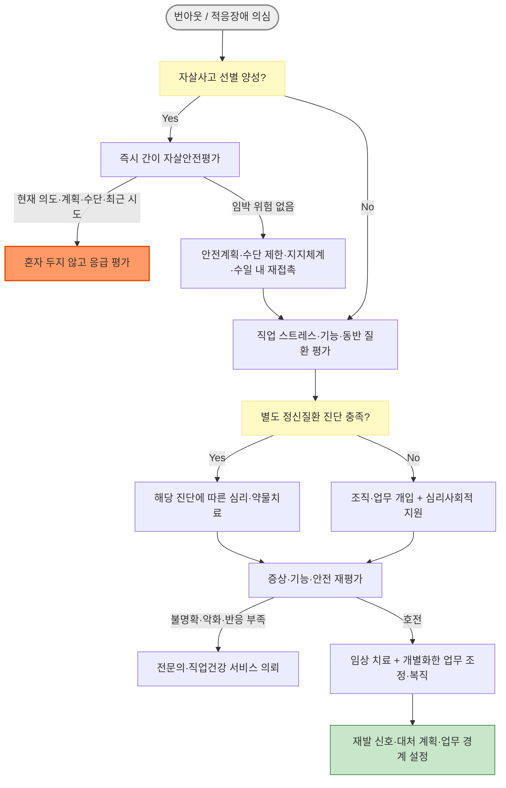

# 번아웃과 적응장애 Burnout, Adjustment Disorder

## <mark style="color:green;">일반 사항</mark>

* **번아웃(Burnout)** : 만성적인 직업적 스트레스가 성공적으로 관리되지 못하여 발생하는 증후군; ICD-11에서 직업적 현상(occupational phenomenon)으로 분류하며 의학적 질환으로 분류하지 않음
  * ICD-11에서 QD85는 24장(건강 상태 또는 보건서비스 접촉에 영향을 주는 요인) 중 고용·실업 관련 문제 아래 위치함
  * 번아웃은 정의상 직업적 맥락에 한정하며, 돌봄·양육·학업 등 다른 생활 영역의 소진에 ICD-11 번아웃 진단 개념을 그대로 적용하지 않음
  * 번아웃은 정신질환 진단명이 아니라 직업적 상태를 기술하는 용어이며, 정신질환이 의심되면 해당 질환의 진단 요건을 별도로 평가
* **적응장애(Adjustment Disorder)** : 식별 가능한 스트레스 요인에 대한 반응으로 발생하는 임상적으로 유의한 정서·행동 증상과 기능 저하; 번아웃과 달리 독립된 정신질환 진단임
* 1차 진료에서 번아웃, 적응장애, 우울증은 증상이 중첩되어 감별이 어렵고 함께 나타날 수 있으므로 각각의 진단 요건을 확인
* 번아웃 유병률은 측정도구·정의·직종·절단점에 따라 편차가 매우 커 일반 인구의 단일 수치를 제시하기 어려움

**번아웃의 3가지 핵심 차원** \[ICD-11]

* 소진(exhaustion) : 에너지 고갈 또는 탈진감
* 정신적 거리감·냉소(mental distance / cynicism) : 직무에 대한 부정적·냉소적 태도, 정서적 거리감
* 효능감 저하(reduced professional efficacy) : 성취감 감소, 업무 효과에 대한 부정적 평가

_<mark style="color:$info;">✽ MBI 판본에 따라 비인격화(depersonalization), 개인적 성취감(personal accomplishment) 등 관련 용어가 다르게 사용됨</mark>_

## <mark style="color:green;">원인 및 위험 인자</mark>

* 번아웃 : 만성적인 직업 스트레스가 핵심
* 적응장애 : 직장 상실·위협, 이별·이혼, 질병·사별, 재정적 위기, 이주 등 식별 가능한 스트레스 요인

#### <mark style="color:$primary;">직업·환경적 요인 (번아웃의 주요 원인)</mark>

* 아래 요인은 Maslach-Leiter의 6대 직무 영역(업무량, 통제, 보상, 공동체, 공정성, 가치)과 대응됨
* 과도한 업무량, 시간 압박, 자율성 부족
  * 직무요구-통제(-지지) 모델(Job Demand-Control-Support, Karasek) : 높은 직무 요구와 낮은 통제·사회적 지지가 결합될 때 직무 스트레스가 커짐
* 동료·상사와의 갈등, 사회적 지지 부족, 직장 내 괴롭힘
* 상시 연결(always-on)에 따른 회복 실패 : 이메일·메신저 과부하와 퇴근 후 심리적 단절 실패 (흔히 '디지털 번아웃'으로 불리나 공식 용어는 아님)
* 가치 충돌(개인 가치관과 조직 문화의 불일치)
  * 시스템적 제약으로 옳다고 아는 행동을 하지 못할 때의 고통은 도덕적 고뇌(moral distress), 자신의 도덕적 신념에 어긋나는 행위를 하거나 막지 못하거나 목격한 뒤 지속되는 죄책감·수치심·배신감은 도덕적 상해(moral injury)로 구분
  * 의료직·교직·공직 종사자에서 함께 평가할 직업 스트레스 요인
* 불충분한 보상(금전적·정서적), 조직 내 불공정
  * 노력-보상 불균형 모델(Effort-Reward Imbalance, ERI) : 투입한 노력에 비해 보상(임금·인정·승진 기회)이 낮은 상황은 번아웃과 연관됨
* 고위험 직업군 : 의료인, 교사·사회복지사, IT 개발자, 콜센터·고객 응대직, 돌봄 노동자

#### <mark style="color:$primary;">개인적 요인</mark>

* 완벽주의, 과도한 자기 요구, 낮은 자기효능감
* 부적절한 대처 전략(회피, 반추)
* 번아웃·우울증 과거력, 정신건강 문제 가족력

## <mark style="color:green;">임상 양상</mark>

#### <mark style="color:$primary;">정서·인지 증상</mark>

* 지속적인 피로감, 탈진, 무기력감
* 냉소, 무관심, 직무 의욕 상실
* 집중력·기억력 저하, 의사결정 어려움
* 좌절감, 무력감, 직업적 성취감 감소
* 불안, 과민성, 기분 저하

#### <mark style="color:$primary;">신체 증상</mark>

* 수면 장애(불면 또는 과수면), 피로 회복 불량
* 두통, 근육 긴장·통증, 위장 증상(복통, 소화불량)
* 심계항진 등 자율신경 증상; 반복 감염 등 다른 증상은 번아웃으로 단정하지 말고 별도 원인을 평가
* 만성 스트레스와 HPA(시상하부-뇌하수체-부신)축·자율신경계·면역계 변화의 연관성이 연구되고 있으나, 번아웃을 진단하거나 단계를 판정하는 데 임상적으로 활용할 수 있는 생체표지는 확립되지 않음
* 퇴근 후에도 업무 관련 사고가 지속되는지, 업무로부터 심리적으로 단절(Psychological Detachment)할 수 있는지 확인
* 우울감·무쾌감·기능 저하가 직업 외 영역(가정·취미·대인관계)에서도 지속되면 이를 번아웃의 단순한 확산으로 설명하지 말고 주요우울장애 등 별도 질환을 평가

#### <mark style="color:$primary;">행동 증상</mark>

* 직무 회피, 잦은 지각·결근, 업무 효율 저하
* 프레젠티즘(Presenteeism) : 출근은 하지만 집중력 저하·업무 기능이 현저히 떨어진 상태 - 결근 여부만으로 중증도를 판단하지 말 것; 병가 필요성 판단 시 중요한 임상 지표
* 사회적 위축, 대인 관계 어려움
* 알코올·카페인 섭취 증가, 진정제·수면제 사용 증가, 흡연 증가

#### <mark style="color:$primary;">번아웃 아형 (Burnout Subtypes)</mark>

<table><thead><tr><th width="160">아형</th><th width="230">핵심 특징</th><th>임상 단서</th></tr></thead><tbody><tr><td><strong>과부하형</strong><br>(Frenetic)</td><td>과도한 업무·헌신; 한계를 무시하고 밀어붙임 (핵심 차원 : overload)</td><td>"더 하면 된다" "조금만 더 버티면"</td></tr><tr><td><strong>무자극형</strong><br>(Under-challenged)</td><td>단조롭고 성장 없는 업무; 지루함·냉소 주도 (핵심 차원 : lack of development)</td><td>"이 일이 의미 없다" "능력 낭비 같다"</td></tr><tr><td><strong>방치형</strong><br>(Worn-out)</td><td>무력감·포기; 노력 자체를 포기한 상태 (핵심 차원 : neglect)</td><td>"어차피 안 된다" "해봤자 달라지는 게 없다"</td></tr></tbody></table>

_<mark style="color:$info;">✽ Montero-Marín(2009)이 제안한 탐색적 분류로, ICD-11 공식 분류가 아니며 아형별 개입의 효과는 검증되지 않음. 면담 시 환자의 소진 양상을 이해하는 참고 틀로만 활용</mark>_

### <mark style="color:$danger;">🚩 Red Flags!</mark>

<mark style="color:$danger;">**즉각 조치**</mark>

* 현재 자살 의도, 구체적 계획, 실행 가능한 수단 접근성, 최근 자살 시도 또는 과량 복용 - 혼자 두지 말고 즉각 응급 평가 `고위험 자살 위험`
* 특정 대상(동료·상사 등)에 대한 위해 의도 또는 계획 `타인 위해 위험`
* 환청·망상·심한 와해 행동, 조증 또는 심한 초조로 자신이나 타인에게 위해 가능성 `급성 정신증` `조증`
* 알코올·진정제 중단 후 진전·경련·의식 변화 `알코올·진정제 금단`
* 심한 자기 방임, 탈수·영양 결핍으로 기본적인 안전 유지 불가 `기본 안전 유지 불가`

<mark style="color:$warning;">**당일\~수일 내 평가**</mark>

* 자살사고가 확인되었으나 임박 위험 여부가 불명확하거나 안전계획·지지체계 확보가 어려운 경우 `자살 위험 재평가 필요`
* 자살사고가 있으나 현재 의도·계획·수단 접근성·최근 시도가 없고 안전 확보가 가능한 경우 - 안전계획, 치명적 수단 제한, 지지 인물·위기 연락처 연결 후 수일 이내 재접촉 `저위험 자살사고`
* 주요우울장애·양극성 장애·물질사용장애가 의심되고 기능 저하가 심한 경우 (☞ [우울증](027_-depression.md)) `주요우울장애` `양극성 장애` `물질사용장애`
* 직장·가정생활을 거의 수행할 수 없거나 알코올·수면제 사용이 빠르게 증가하는 경우 `중증 기능 저하` `물질사용장애`
* 항우울제 시작·증량 후 초조·정좌불능·자살사고 악화 또는 경조증 증상 `SSRI 활성화 증후군` `양극성 전환`

<mark style="color:$info;">**조기 평가 및 추적**</mark>

* 증상이 지속·악화되거나 수면·업무·가정생활에 유의한 지장을 주는 경우 `적응장애` `우울장애`
* 반복적인 직업 관련 병가, 기능 회복 지연 또는 복직 후 재악화 `복직 실패`
* 직장 내 괴롭힘 또는 반복적 부정적 사건 경험(현재 안전 위협이나 심한 재경험 증상이 없을 때) - 사건의 강도·특성이 ICD-11 PTSD/CPTSD의 극도로 위협적이거나 끔찍한 사건 요건을 충족하는지 별도 평가 `PTSD` `CPTSD`
* 피로에 체중 감소·발열·야간 발한·기립성 증상 등 전신 증상 동반 `의학적 원인` `Long COVID` `ME/CFS`

_<mark style="color:$info;">✽ PHQ-9 9번 항목 양성만으로 위험도를 판정하지 않는다. 즉시 추가 면담으로 현재 의도·계획·수단 접근성·최근 시도·보호요인과 지지체계를 확인하고 처분을 결정한다.</mark>_

## <mark style="color:green;">진단</mark>

**외래 30초 면담 시작 질문**

1. 일이 너무 지쳐서 감당이 안 된다고 느끼십니까?
2. 일에 대해 냉소적이거나 의미 없다고 느끼십니까?
3. 예전에 비해 업무 능력이 떨어졌다고 느끼십니까?

 → ICD-11의 세 차원을 확인하기 위한 임상 질문이며, 양성 문항 수로 번아웃을 진단하거나 중증도를 판정하지 않음. 직업적 맥락·지속 기간·기능 저하와 동반 질환을 추가 평가

### <mark style="color:orange;">선별검사</mark>

_<mark style="color:$info;">✽ WHO(2022)는 고용 중 선별 프로그램의 잠재적 이득이 위해보다 큰지 불분명하다고 보아 찬성·반대 어느 쪽 권고도 하지 않음. 아래 도구는 개별 진료에서 면담을 보조하는 용도로 사용</mark>_

#### <mark style="color:$primary;">번아웃 단일 문항 선별(Single-item Burnout Measure)</mark>

* 질문: "전반적으로, 본인이 생각하는 번아웃의 정의에 비추어 현재 번아웃 정도를 어떻게 평가하십니까?"
* 원 도구는 단순한 동의 정도가 아니라, 업무를 즐기며 증상이 없는 상태(1점)부터 완전히 소진되어 변화나 도움이 필요한 상태(5점)까지 구체적인 증상 설명이 포함된 5단계 응답지를 사용함
* 출처 : Rohland 2004; MBI 정서적 소진 척도와의 상관이 검증됨(Dolan, JGIM 2015). 의료인 대상 Mini-Z 설문에도 포함됨
* 연구에서 흔히 ≥3점을 번아웃 증상 있음으로 구분하지만 타당도에 근거해 확립된 임상 진단 절단점은 아님
* 주로 정서적 소진을 포착하므로 냉소·직업적 효능감 저하를 충분히 평가하지 못할 수 있음. 선별 양성은 추가 면담의 출발점으로만 사용

#### <mark style="color:$primary;">Maslach Burnout Inventory (MBI)</mark>

* 널리 사용되는 유료 평가도구이며 판본에 따라 문항과 소척도가 다름
  * MBI-HSS(22항목) : 정서적 소진(EE), 비인격화(DP), 개인적 성취감(PA)
  * MBI-GS : 소진(exhaustion), 냉소(cynicism), 직업적 효능감(professional efficacy)
* 각 차원을 연속변수로 평가하는 연구 및 조직 수준 조사·모니터링 도구이며 **개인의 번아웃을 확진하는 진단도구가 아님**
* 과거 사용하던 규준 기반 절단점은 진단적 타당성이 없어 MBI 4판에서 삭제됨. 보편적인 임상 진단 절단점은 없음

#### <mark style="color:$primary;">한국어판 대안 척도</mark>

* 한국어판 코펜하겐 소진척도(K-CBI) : 개인적·직무 관련·클라이언트 관련 소진의 세 영역을 평가; 원 도구는 무료 공개 도구임. 개인적 소진 영역은 ICD-11의 직업적 번아웃과 동일한 개념이 아님
* 한국판 올덴버그 소진척도(K-OLBI) : 탈진(exhaustion)과 일로부터의 이탈(disengagement)을 평가
* 한국판 직무소진평가척도(K-BAT) : BAT(Burnout Assessment Tool, Schaufeli 2020)의 한국어판으로 소진·정신적 거리감·정서 조절 손상·인지 손상의 4개 핵심 차원을 평가. 원 개발국(벨기에·네덜란드) 규준 기반 위험 절단점이 제시되어 있으나 국내 임상 표본에서 검증되지 않음
* 모두 자기보고식 상태 평가도구이며 국내에서 개인의 번아웃을 진단하거나 약물치료·병가 여부를 결정하는 보편적 절단점은 없음. 국내 타당화 표본과 사용 조건을 확인하여 연구·상태 모니터링에 제한적으로 활용

#### <mark style="color:$primary;">적응장애 선별</mark>

* 심리사회적 기능 평가
* 스트레스 요인의 시작·지속·종료 시점과 증상의 시간적 연관성 확인
* [PHQ-9](027_-depression.md#phq-9) (우울), [GAD-7](025_-anxiety-disorder.md#generalized-anxiety-disorder-7-item-gad-7) (불안)을 병행할 수 있으나, 점수만으로 진단하거나 약물치료를 결정하지 않음
* ICD-11 적응장애를 평가할 때는 스트레스 요인에 대한 집착·반추와 적응 실패로 인한 기능 저하를 확인

### <mark style="color:orange;">진단 기준 및 기술 요건</mark>

#### <mark style="color:$primary;">번아웃 - ICD-11 기술 요건</mark> \[ICD-11 QD85]

1. 에너지 고갈 또는 탈진감
2. 직무에 대한 정신적 거리감, 또는 직무 관련 부정적·냉소적 감정
3. 직업적 효능감 저하

* 정의상 직업적 맥락에 한정됨. 다른 생활 영역에서도 증상이 지속되면 우울증·불안장애·수면장애 등 별도 질환을 평가
* 독립 질환이 아니며 검사실 검사나 확립된 생체표지로 진단하지 않음

#### <mark style="color:$primary;">적응장애</mark> \[DSM-5-TR / ICD-11 6B43]

**DSM-5-TR 핵심 기준**

A. 식별 가능한 스트레스 요인 발생 후 3개월 이내 감정적·행동적 증상 발생

B. 임상적으로 중요한 고통 또는 기능 장애 (다음 중 하나 이상)

　1. 스트레스 요인의 강도·심각도에 비해 과도한 고통(외부 맥락과 문화적 요인을 고려)\
　2. 사회·직업 기능의 유의한 손상

C. 다른 정신 질환 진단 기준을 충족하지 않으며, 기존 정신질환의 단순한 악화가 아님

D. 증상이 정상적인 사별 반응 또는 지속성 애도장애로 더 잘 설명되지 않음

E. 스트레스 요인 또는 그 결과가 종료된 뒤 증상이 추가로 6개월을 초과하여 지속되지 않음

_<mark style="color:$info;">✽ 스트레스 요인이나 그 결과가 계속되면 증상도 6개월을 넘어 지속될 수 있음. 스트레스 요인이 종료된 뒤에도 6개월을 초과하여 지속되거나 증상 양상이 달라지면 주요우울장애(MDD), 범불안장애(GAD) 등으로 진단 재검토</mark>_

**DSM-5-TR 임상 명세자**

* 우울 기분 동반(with depressed mood)
* 불안 동반(with anxiety)
* 혼합형 불안 및 우울 기분 동반(with mixed anxiety and depressed mood)
* 품행 장애 동반(with disturbance of conduct)
* 정서 및 품행 장애 혼합 동반(with mixed disturbance of emotions and conduct)
* 명시되지 않는 형태(unspecified)
* 기간 명세 : 급성(6개월 미만) / 지속성(6개월 이상)

_<mark style="color:$info;">✽ 위 명세자는 DSM-5-TR의 임상 분류이며, 여기에 병기되는 미국 ICD-10-CM 세부코드(F43.21 등)를 국내 청구코드로 사용하지 않음. 국내에서는 F43.2로 기재</mark>_

**ICD-11 핵심 특징**

* 식별 가능한 심리사회적 스트레스 요인에 노출된 뒤 증상 발생
* 스트레스 요인이나 그 결과에 대한 과도한 집착·반추(preoccupation)
* 적응 실패(failure to adapt)로 인해 일상 기능이 유의하게 저하됨
* 증상은 통상 스트레스 요인 발생 후 1개월 이내 나타나며, 스트레스 요인이나 그 결과가 지속되지 않는 한 대개 6개월 이내 호전
* ICD-11은 적응장애의 하위 유형을 두지 않음

### <mark style="color:orange;">감별 진단</mark>

<table><thead><tr><th width="92"></th><th width="167">번아웃</th><th width="216">적응장애</th><th width="222">주요우울증</th></tr></thead><tbody><tr><td>분류</td><td>직업적 현상; 의학적 질환이 아님</td><td>독립된 정신질환</td><td>독립된 정신질환</td></tr><tr><td>관련 요인</td><td>만성 직업 스트레스</td><td>식별 가능한 특정 스트레스 요인</td><td>다양하며 스트레스 요인이 없어도 발생</td></tr><tr><td>맥락</td><td>정의상 직업적 맥락</td><td>스트레스 요인과 밀접히 연관</td><td>직업·생활 전반에 영향</td></tr><tr><td>감정 변화</td><td>직장에서 벗어나면 호전될 수 있으나 감별 기준은 아님</td><td>스트레스 요인 언급·상기 시 악화될 수 있음</td><td>상황과 무관하게 지속적·전반적으로 저하될 수 있음</td></tr><tr><td>자기 평가</td><td>주로 직업적 효능감 저하</td><td>증상 양상에 따라 다양</td><td>전반적 자기 비하·무가치감·죄책감 가능</td></tr><tr><td>경과</td><td>업무 조건과 회복 기회에 따라 다양</td><td>스트레스 요인·결과가 지속되면 장기화 가능</td><td>스트레스 해소 후에도 지속 가능</td></tr><tr><td>핵심 증상</td><td>소진·정신적 거리감/냉소·효능감 저하</td><td>스트레스 요인에 대한 집착·반추, 적응 실패와 기능 저하</td><td>지속적 우울감 또는 무쾌감과 동반 증상</td></tr><tr><td>약물</td><td>승인된 약물 없음</td><td>확립된 특이적 약물치료 없음; 심리사회적 개입 우선</td><td>진단·중증도에 따라 항우울제와 심리치료 고려</td></tr></tbody></table>

_<mark style="color:$info;">✽ 번아웃과 우울증은 함께 나타날 수 있으므로 PHQ-9 등으로 선별하되, 반드시 진단 면담으로 확인</mark>_

**번아웃과 우울증 감별 시 참고 사항**

* 직장에서 벗어났을 때 증상이 호전되는지는 감별의 참고사항일 뿐, 이 반응만으로 번아웃과 우울장애를 구분할 수 없음
* 심하게 소진되면 운동·취미 등 회복 행동을 시작하기 어려울 수 있으므로 이를 의지 부족으로 단정하지 않음

**도덕적 상해(Moral Injury) 탐색 - 의료직·교직·공직 종사자에서 핵심 확인 사항**

* "조직의 방침이나 시스템 때문에 자신의 가치관에 어긋나는 행동을 해야 한다고 느끼십니까?"
* "환자(또는 학생·민원인)를 위해 최선을 다하지 못하는 상황이 반복됩니까?"

 → 이러한 질문은 환자가 경험한 가치 충돌을 구체화하고 라포 형성에 도움이 될 수 있음. 도덕적 상해·도덕적 고뇌와 번아웃은 연관될 수 있으나 동일한 개념은 아니며, 조직·업무 환경 요인을 함께 평가

### <mark style="color:orange;">의학적·정신과적 감별</mark>

* 빈혈, 갑상선기능저하증·갑상선기능항진증(불안·심계항진), 당뇨병, 폐경 이행기, 기타 만성질환 및 약물 부작용
* 체중 감소·발열·야간 발한 등 전신 증상 동반 시 악성 종양·만성 감염
* Long COVID(코로나19 후유증) : SARS-CoV-2 감염 후 발생하여 적어도 3개월간 지속적·재발완화성 또는 진행성 경과로 나타나는 감염 관련 만성 상태(NASEM, 2024). 초기 감염의 검사 확인은 필수가 아님. 활동 후 증상 악화, 호흡곤란·인지 변화·후각 변화·기립불내성 등 다기관 증상 확인
* ME/CFS : 6개월 이상 지속되는 현저한 기능 저하와 함께 활동 후 증상 악화(post-exertional malaise, PEM), 회복되지 않는 수면, 인지기능 저하 또는 기립불내성 확인
* 불면장애, 수면무호흡증, 교대근무 수면장애
* 주요우울장애, 양극성 장애, 불안장애, PTSD
* 성인 ADHD : 현재 직업 스트레스 이전부터 존재한 부주의·실행기능 문제, 12세 이전 증상 및 직장 외 여러 생활 영역에서의 지속 여부 확인
* 알코올·진정제·각성제·카페인 사용 문제
* 병력과 진찰에 따라 필요한 검사를 선택하며, 번아웃이라는 이유만으로 일률적인 혈액검사나 코티솔 검사를 시행하지 않음. 다만 피로가 주호소이면 CBC·TSH·혈당 등 기본 검사는 흔히 고려

***



<p align="center"><strong>번아웃/적응장애 - 치료 결정 및 복직 알고리듬</strong></p>

<p align="center"><em><mark style="color:$info;">저자 재구성 (참고 문헌 : WHO Guidelines on Mental Health at Work, 2022)</mark></em></p>

***

## <mark style="background-color:$warning;">Management</mark>

### <mark style="color:orange;">치료 방침</mark>

* 자살 위험, 물질 사용, 주요우울장애·양극성 장애·불안장애·수면장애 동반 여부를 먼저 확인하고 각각의 진단에 따라 관리
* 번아웃은 직업 환경의 심리사회적 위험을 줄이는 조직·업무 개입이 핵심이며, 번아웃 자체에 승인된 약물은 없음
* 적응장애는 스트레스 요인과 기능 저하를 함께 다루는 심리사회적 개입이 우선이며, 확립된 특이적 약물치료는 없음
* 자살사고가 확인된 환자에게 약물을 처방할 때는 소량·단기로 처방하여 치명적 수단 접근을 제한
* 회복 목표는 증상 감소뿐 아니라 기능 회복, 안전한 업무 참여와 재발 예방을 포함하여 환자와 함께 설정

#### <mark style="color:$primary;">번아웃/적응장애 - 1차 진료 단계적 접근 안</mark>

✽ 다음은 치료 단계 예시로 확립된 표준 프로토콜이 아니며, 임상 상황에 따라 조정이 필요함

<table><thead><tr><th width="90">단계/시점</th><th>핵심 과제</th></tr></thead><tbody><tr><td><strong>1단계/</strong><br>첫 방문</td><td>① 직업 스트레스·기능 저하·수면·물질 사용 평가 → ② PHQ-9·GAD-7 등으로 동반 증상 선별 → ③ 선별 양성 시 진단 면담 → ④ 자살 위험 평가 및 필요 시 응급 조치 → ⑤ 의학적 감별 → ⑥ 업무량·시간·자율성·갈등·괴롭힘·도덕적 상해 등 조정 가능한 직업 요인 확인 → ⑦ 병가·업무 조정의 의료적 필요성과 직무 안전성 평가; 실제 조정은 환자의 동의와 비밀보장을 전제로 관련 법령·사업장 규정에 따라 조직·산업보건 담당자와 협의</td></tr><tr><td><strong>2단계/</strong><br>1~2주 후</td><td>증상·기능·안전 재평가 → 안전계획과 지지체계 확인 → 조직·업무 조정 진행 여부 확인 → 심리치료 또는 직업건강 서비스 연계. 별도 우울장애·불안장애 진단으로 SSRI/SNRI를 시작했다면 초조·정좌불능·자살사고 악화·조증/경조증 전환 및 기타 초기 부작용을 확인</td></tr><tr><td><strong>3단계/</strong><br>4~6주 후</td><td>심리사회적 개입과 동반 질환 치료 반응 평가 → 호전이 없거나 진단이 불명확하면 정신건강의학과·직업환경의학과 등 의뢰 → 병가 중이면 임상 치료와 업무 조정을 결합한 복직 계획 수립</td></tr><tr><td><strong>4단계/</strong><br>이후 추적</td><td>재발 신호·대처 계획 수립 → 필요한 치료 지속 → 직무의 안전 민감도, 증상과 기능, 근무 조정 가능성을 반영하여 업무 참여를 단계적으로 조정</td></tr></tbody></table>

## <mark style="color:green;">비-약물 치료 및 예방</mark>

* 개인 대상 개입만으로 직업 환경의 위험을 대체할 수 없으므로 조직·업무 개입과 병행
  * 의료인 번아웃 메타분석에서 개인 대상·조직 대상 개입 모두 번아웃 감소 효과를 보였으며, 조직 대상 개입의 효과가 더 컸음(West, Lancet 2016; Panagioti, JAMA Intern Med 2017)
* 인지행동치료(CBT) : 부적응적 사고와 대처 방식을 다루는 선택지. WHO(2022)는 정서적 고통이 있는 근로자에게 CBT·마음챙김 기반 개입 또는 문제 해결 훈련을 고려하도록 권고하나 조건부·매우 낮은 확실성임; 적응장애 질환 특이적 근거도 낮음\~매우 낮음
* 마음챙김 기반 스트레스 감소(MBSR) : 표준 프로그램은 흔히 8주로 구성되며 스트레스·소진 감소에 일부 RCT 근거가 있으나 효과 크기와 지속성은 연구마다 다름
* 문제 해결 치료(PST, Problem-Solving Therapy) : 조정 가능한 스트레스 요인과 대처 방안을 구조화하는 데 활용. WHO(2022) 권고 대상 개입에 포함되나(조건부·매우 낮은 확실성) 번아웃·적응장애에 대한 질환 특이적 근거는 제한적
* 수용-전념 치료(ACT) : 가치와 심리적 유연성을 다루는 선택지이나 번아웃 특이적 근거는 제한적
* 특정 심리치료가 다른 기법보다 일관되게 우월하다고 확립되지 않았으므로 환자 선호·접근성·동반 질환과 치료자 숙련도를 고려해 선택
* 1차 진료에서의 단시간 지지적 면담 : 5\~10분 내 ① 경청(판단 없이 듣기) → ② 환언(환자 말을 다시 표현하여 이해 확인) → ③ 정상화("많은 분들이 비슷한 상황에서 이런 증상을 경험합니다") 순서로 진행; 전문 심리 치료의 대체는 아니나 치료적 제휴 형성과 의뢰 연결에 도움이 될 수 있음\
  ✽ 구조화된 1차 진료용 기법으로 BATHE(Background, Affect, Trouble, Handling, Empathy; Stuart & Lieberman)를 활용할 수도 있음
* 가치관 면담 : 성과와 자기 가치를 과도하게 동일시하는지 탐색하고, 직업 외 정체성과 회복 목표를 함께 설정

#### <mark style="color:$primary;">생활 습관 중재</mark>

* 신체 상태와 선호에 맞춘 규칙적인 신체활동을 작은 양부터 시작; 활동 목표는 환자의 기능과 동반 질환에 따라 조정 (WHO 2022 : 정서적 고통이 있는 근로자의 운동, 조건부·매우 낮은 확실성)
* Micro-break(초단기 휴식) : 업무 중 짧게 화면과 업무에서 벗어나는 단절이 피로 감소와 인지 회복에 도움이 될 수 있음. 획일적인 시간·방법보다 실제로 업무 요구에서 벗어나는지가 중요
* 수면 위생 교육 (☞ [불면증](029_-insomnia-sleep-disorder.md))
* 카페인·알코올 섭취 제한
* 사회적 지지 강화 : 가족·동료와의 연결 유지

#### <mark style="color:$primary;">직업 환경 중재</mark>

* 업무량·근무시간·일정·자율성·역할 명확성·의사소통·괴롭힘·조직 내 공정성 등 조정 가능한 위험 요인을 확인
* 필요 시 환자의 동의와 비밀보장을 전제로 관리자·인사·산업보건 담당자와 협의하여 합리적 업무 조정, 단축근무, 직무 전환 또는 병가 고려
  * WHO(2022)는 정신건강 문제가 있는 근로자에게 합리적 편의 제공을 강력 권고함(근거 확실성 매우 낮음)
* 복직은 증상·기능·직무 안전 민감도·근무 조정 가능성에 따라 개별화; WHO(2022)는 업무 지향 개입과 근거 기반 임상 치료의 병행 또는 임상 치료 단독을 모두 고려 대상으로 제시함(조건부·낮은 확실성)
* 국내 법·제도 연계
  * 직장 내 괴롭힘 : 근로기준법 제76조의2·3(2019년 7월 시행)에 따른 사업장 신고·조치 절차 안내
  * 고객 응대 근로자 : 산업안전보건법 제41조의 사업주 건강장해 예방 조치 대상
  * 업무 관련 폭력·폭언 등으로 발생한 적응장애·우울병 에피소드는 산재보험법 시행령 별표 3에 따라 업무상 질병으로 인정될 수 있음 → 근로복지공단 산재 신청 가능성 안내 (최신 조문 확인)
* 필요 시 직업환경의학과·직업 재활 서비스, 안전보건공단 근로자건강센터(직무스트레스 상담), 사업장 근로자지원프로그램(EAP) 연계
* 정신건강 심리상담 바우처사업(구 전국민 마음투자 지원사업) : 전문 심리상담 총 8회 지원. 정신건강복지센터 등 지정기관의 의뢰서, 정신건강의학과 의사·한방신경정신과 한의사의 진단서 또는 소견서, 국가건강검진 우울증 선별검사(PHQ-9) 10점 이상 결과 등으로 신청. 일반 의원의 통상 소견서는 인정되지 않으며, 동네의원 마음건강돌봄 연계 시범사업 참여 의원의 연계의뢰서만 인정됨\
  ✽ 대상 요건과 증빙 서류는 매년 변경될 수 있으므로 보건복지부·복지로의 해당 연도 안내를 확인

## <mark style="color:green;">약물 치료</mark>

* 번아웃 자체에 승인된 약물은 없으며 약물로 직업 환경 개입을 대체하지 않음
* 순수 적응장애에도 확립된 특이적 약물치료가 없고 SSRI·buspirone·BZD 등의 비교 근거가 제한적이므로 심리사회적 개입을 우선
* SSRI/SNRI는 PHQ-9 점수나 번아웃·적응장애 자체가 아니라, 별도로 확인된 주요우울장애 또는 불안장애에 대해 세부 진단별 약제 근거와 국내 허가사항을 확인하여 처방 (☞ [우울증](027_-depression.md), [불안장애](025_-anxiety-disorder.md))
  * PHQ-9 ≥10 또는 우울감·무쾌감 문항 양성 → 최근 2주간의 빈도·지속성, 총 증상 수와 기능 저하, 양극성 장애 가능성, 자살 위험을 추가 평가한 뒤 치료 결정
  * 항우울제 유지기간은 적응장애가 아니라 동반 질환의 진단·중증도와 관해 시점을 기준으로 결정
* 불면이 심하면 불면장애와 수면무호흡증·물질·약물 원인을 평가하고 비약물치료를 우선하며, 약물은 필요성과 위험을 평가해 단기간 고려 (☞ [불면증](029_-insomnia-sleep-disorder.md))

#### <mark style="color:$primary;">불안·자율신경 증상 동반 시</mark>

* 지속적인 불안은 GAD·공황장애 등 별도 진단 여부를 확인하고 해당 지침에 따라 치료
* propranolol <mark style="color:blue;">\[인데놀]</mark>은 무대공포증·발표 불안 등 특정 수행 상황의 말초 자율신경 증상에 제한적으로 사용할 수 있으나 국내 허가 외 사용이며, 번아웃이나 불안장애 자체를 치료하지 않음. 천식·서맥·저혈압·전도장애·비대상성 심부전과 저혈당 인지 저하 위험 확인
* 항우울제별 활성화·진정·인지 효과는 개인차가 크고 주로 MDD 환자에서 연구되었으며, 번아웃 또는 적응장애에서 특정 약물이 우월하다는 비교 근거는 없음

#### <mark style="color:$primary;">단기 불안·불면 완화</mark>

* 수면·급성 불안 증상에 약물이 필요하면 가능한 짧게 사용하고 졸림·운전·낙상·상호작용 위험을 안내
* trazodone <mark style="color:blue;">\[트리티코]</mark>은 불면에 흔히 허가 외 사용되나 국내 허가 적응증은 우울증이며, AASM(2017) 및 VA/DoD(2025) 지침은 만성 불면장애 치료에 사용하지 않도록 제안함. 졸림·기립성 저혈압·드문 지속발기증에 주의\
  ✽ 스트레스 관련 급성 불면에서도 trazodone의 효과 근거는 제한적이므로 일률적으로 사용하지 않음
* hydroxyzine <mark style="color:blue;">\[유시락스]</mark>은 BZD형 의존 위험은 없지만 졸림·항콜린성 부작용·QT 연장 위험을 고려. 성인 1일 최대 100 ㎎, 고령자 1일 최대 50 ㎎(EMA, 2015); 고령자는 강항콜린성 약물로 가능하면 회피(AGS Beers Criteria 2023)
* BZD는 일률적인 브릿지 요법으로 사용하지 않으며, 다른 방법으로 조절하기 어려운 심한 단기 증상에서 위험·편익을 평가해 제한적으로 사용. 가능하면 감량 기간을 포함하여 총 2\~4주 이내 사용을 목표로 함. 고령자는 원칙적으로 회피(AGS Beers Criteria 2023)

#### <mark style="color:$primary;">천연물·영양 요법 - 근거 수준별 정리</mark>

* 번아웃에 대한 확립된 치료법이 없는 탓에 검증되지 않은 건강 제품들이 널리 유통되고 있음. 아래는 근거 수준에 따른 분류이며, 환자 상담 시 근거 기반 정보를 제공하는 데 활용한다.

<table><thead><tr><th width="176">근거 수준</th><th width="199">제품</th><th>비고</th></tr></thead><tbody><tr><td><strong>결핍 교정 시에만 의미 있음</strong><br>(번아웃 치료 효과 근거 없음)</td><td>마그네슘, 비타민 B군(B1·B6·B12), 비타민 D</td><td>결핍이 없는 경우 추가 복용의 번아웃 개선 효과는 입증되지 않음. 병력·위험 요인에 따라 결핍을 평가하고 해당 결핍 지침에 따라 보충</td></tr><tr><td><strong>근거 제한적</strong><br>(소규모 연구; 번아웃 특이적 근거 부족)</td><td>홍경천(Rhodiola rosea), 아슈와간다(Ashwagandha)</td><td>홍경천: 항우울제 등과의 상호작용 자료가 제한적이므로 병용 주의<br>아슈와간다: 갑상선·자가면역 질환, 임신 및 드문 간손상에 주의</td></tr><tr><td><strong>근거 없음 / 주의 필요</strong></td><td>부신 피로(Adrenal Fatigue) 관련 제품†, 고용량 비타민 C IV, 에너지 드링크·카페인 보충제</td><td>'부신 피로'는 의학적으로 인정된 진단이 아님. 에너지 드링크·고용량 카페인은 불안과 수면을 악화시킬 수 있음</td></tr></tbody></table>

† 미국내분비학회는 '부신 피로'를 의학적 진단으로 인정하지 않으며, 이를 표방한 보충제는 안전성과 성분이 보장되지 않아 해로울 수 있다고 경고함. 부신 추출물·'부신 지원' 제품은 성분과 함량이 불명확하고 실제 스테로이드 또는 갑상선호르몬이 혼입될 가능성이 있어 피하도록 안내

***

## <mark style="color:red;">질병코드</mark>

Z73.0 탈진에 관련된 문제 Problems related to burn-out

F43.2 적응장애 Adjustment disorders

_<mark style="color:$info;">✽ 국내에서는 2026년 1월 1일부터 시행된 제9차 한국표준질병·사인분류(KCD-9)를 사용. ICD-11의 QD85는 번아웃을 의학적 질환이 아닌 직업적 현상으로 분류하며 국내 청구코드가 아님</mark>_

_<mark style="color:$info;">✽ Z73.0은 생활관리의 어려움과 관련된 코드로, 우울장애·적응장애와 동급의 정신질환 진단코드가 아님</mark>_

_<mark style="color:$info;">✽ F43.8(심한 스트레스에 대한 기타 반응), F48.0(신경쇠약증) 등은 번아웃의 대체 코드가 아니며 해당 진단 요건을 별도로 충족할 때만 사용</mark>_

***

## <mark style="color:purple;">처방례</mark>

_<mark style="color:$info;">✽ 다음 처방례는 번아웃 치료가 아니라 별도로 진단된 동반 질환 또는 단기간의 심한 표적 증상을 치료하기 위한 예시임</mark>_

> **처방례 1.** 별도로 진단된 주요우울장애 또는 불안장애(공황장애[광장공포증 동반 여부 무관]·사회불안장애·범불안장애) 동반 - SSRI
>
> ```
> 렉사프로 5 ㎎/T  1T  qd  조식 후
> → 1~2주 후 10 ㎎으로 증량; 치료 용량에서 4~6주 후 반응을 평가하고, 8~12주경 관해 여부와 이후 치료계획을 재평가
> ※ PHQ-9 점수만으로 처방하지 않고 MDD/GAD 등 별도 진단을 확인; 순수 번아웃·적응장애의 치료제가 아님
> ※ 불안장애의 세부 진단에 따라 약제별 국내 허가 적응증과 근거가 다르므로 해당 진단의 치료 지침·허가사항을 확인
> ※ 시작 전 조증·경조증 병력과 자살 위험 확인
> ※ 초기 활성화 증상이 나타나면 정상 반응으로 단정하지 말고 초조·정좌불능·자살사고 악화·조증/경조증 전환 여부를 평가
> ※ 65세 이상 고령자는 1일 최대 10 ㎎
> ※ 유지기간은 동반 질환의 진단·중증도와 관해 시점을 기준으로 결정
> ```

> **처방례 2.** 불면 동반 - 단기 trazodone 고려(off-label)
>
> ```
> 트리티코 25 ㎎/T  1~2T  취침 전
> ※ 허가 외 사용; 국내 허가 적응증은 우울증이며 AASM(2017) 및 VA/DoD(2025) 지침은 만성 불면장애 치료에 trazodone을 사용하지 않도록 제안함
> ※ 스트레스 관련 급성 불면에서도 효과 근거가 제한적이므로 일률적으로 사용하지 않음
> ※ 번아웃 자체의 치료제가 아니며, 불면의 원인 평가와 비-약물 치료를 대신하지 않음
> ※ BZD형 신체의존 위험은 낮으나 기상 시 졸림·기립성 저혈압(특히 고령자) 주의 - 취침 직전 복용, 운전 주의
> ※ 알코올·다른 진정제와 병용 금지; QT 연장 약물 병용 주의
> ※ 지속발기증(priapism)이 발생하면 즉시 응급진료
> ```

> **처방례 3.** 적응장애 - 심한 급성 불안으로 잠들기 어려운 경우, 단기 증상 완화
>
> ```
> 아티반 0.5 ㎎/T  1T  취침 전  (가능하면 감량 기간을 포함하여 총 2~4주 이내 사용)
> ※ 심리사회적 개입만으로 조절하기 어려운 심한 급성 불안에 동반된 입면곤란의 단기 증상 완화 목적; 적응장애의 원인 치료가 아님
> ※ lorazepam의 국내 허가 효능은 신경증·정신신체장애에서의 불안·긴장·우울 등이며, 불면증 자체는 허가 적응증이 아님. 0.5 ㎎ 취침 전 단독 투여는 국내 허가 용법(성인 1일 1~4 ㎎을 2~3회 분할)과 다른 저용량 임상 사용 예임
> ※ 고령자는 원칙적으로 회피(Beers 2023); 불가피하면 최소 용량 - 과진정·낙상·인지 저하 주의
> ※ 운전·기계 조작 주의; 야간 기상 시 천천히 일어나도록 안내
> ※ 의존·내성 위험과 알코올·오피오이드 등 중추신경억제제 병용 위험을 안내하고, 시작 시점부터 감량·중단 계획 수립
> ```

***

### <mark style="color:$success;">핵심 복약 지도</mark>

> **스트레스 관련 장애 약물 복용 안내**
>
> * 번아웃 자체를 치료하는 약은 없습니다. 약을 처방받았다면 별도로 확인된 우울장애·불안장애 또는 심한 단기 증상을 치료하기 위한 것인지 확인하십시오.
> * 약물은 직업·생활 환경 조정과 심리사회적 치료를 대신하지 않습니다.
> * 벤조디아제핀계 항불안제·수면제는 가능한 짧게 사용하며, 통상 감량 기간을 포함해 총 2\~4주 이내 사용을 목표로 합니다. 임의로 증량하거나 갑자기 중단하지 말고 반드시 의사와 상의하여 서서히 줄여야 합니다.
> * 항우울제는 효과가 서서히 나타납니다. 임의로 중단하지 말고, 초조가 심해지거나 잠이 현저히 줄어도 피곤하지 않고 활동·말이 많아지는 변화 또는 자살사고가 생기면 즉시 진료받으십시오.
> * 알코올은 일시적으로 긴장을 풀어주는 것 같지만 수면의 질을 떨어뜨리고 불안을 악화시킵니다. 수면제·안정제와 함께 마시면 위험합니다.

> **언제 다시 병원을 방문해야 하나요?**
>
> * 우울감이 심해지거나 일상생활이 어려울 정도로 증상이 악화되는 경우
> * 자해나 자살에 대한 생각이 드는 경우 - 즉시 내원 또는 **자살예방 상담전화 109**
> * 4\~6주 치료 후에도 증상 호전이 없는 경우
> * 알코올이나 수면제 복용량이 늘어나는 것 같은 경우

***

## <mark style="color:blue;">환자 안내서</mark>


**번아웃은 의지 부족이 아닙니다. 오래된 직업 스트레스가 쌓인 결과입니다**

지치고 일에 흥미를 잃으며 업무 능력이 떨어진 것처럼 느끼는 것은 의지 부족이나 나약함을 뜻하지 않습니다. 다만 이러한 변화가 직업 밖의 생활 전반에서도 지속되거나 우울감·무쾌감·자살사고가 동반되면 우울장애 등 별도 질환을 평가해야 합니다.



**번아웃, 약으로 해결되지 않습니다**

번아웃의 핵심 원인은 만성적인 직업 스트레스입니다. 수면제나 안정제로 일부 증상을 완화할 수는 있지만 업무 환경의 위험 요인을 줄이지 못합니다. 휴식과 업무 조정은 회복 계획의 중요한 부분입니다.



**무리해서 이전 생산성을 유지하려 하지 마세요**

소진된 상태에서 "조금만 더 버티면 된다"며 무리하면 회복이 늦어질 수 있습니다. 현재 가능한 업무량과 회복 시간을 의료진·직장과 함께 조정하세요.


#### <mark style="color:$primary;">번아웃이란 무엇인가요?</mark>

* 오랜 기간 관리되지 않은 직업 스트레스로 에너지가 고갈되거나 심하게 소진된 느낌이 드는 상태
* 단순한 일시적 피로와 달리 업무에 대한 거리감·부정적 감정과 직업적 효능감 저하가 함께 나타날 수 있음
* 의학적 질병으로 분류되지는 않지만 우울장애·불안장애와 함께 나타날 수 있으므로 증상이 전반적인 생활로 퍼지면 별도 평가가 필요함

#### <mark style="color:$primary;">어떤 변화가 나타날 수 있나요?</mark>

번아웃의 양상과 진행 순서는 사람마다 다릅니다. 아래는 흔히 경험할 수 있는 변화의 예이며 정식 병기 체계나 진단 기준이 아닙니다.

<table><thead><tr><th width="180">변화</th><th>예시</th></tr></thead><tbody><tr><td><strong>과도한 몰입</strong></td><td>피로를 무시하고 일에 몰두하며 휴식과 경계를 줄임</td></tr><tr><td><strong>회복 저하</strong></td><td>피로·짜증·수면 문제가 누적되고 업무 효율 저하를 더 많은 노력으로 만회하려 함</td></tr><tr><td><strong>소진·거리감</strong></td><td>지속적인 소진, 업무에 대한 냉소·무관심, 직업적 효능감 저하가 나타남</td></tr><tr><td><strong>전반적 기능 저하</strong></td><td>일상생활까지 어려워지거나 우울감·무쾌감이 직업 외 영역에서도 지속됨</td></tr></tbody></table>

증상이 지속·악화되거나 수면·업무·가정생활에 지장을 주면 변화의 양상이나 기간에 관계없이 전문가의 평가를 받으세요.

#### <mark style="color:$primary;">회복을 위해 지금 당장 할 수 있는 것</mark>

**쉬는 것을 허락하세요**

* 완전한 회복을 위해서는 진짜 쉬는 시간이 필요합니다 - 일 생각 없이 온전히 즐길 수 있는 활동을 찾으세요
* 병가나 휴가가 필요한지는 증상·기능과 직무 특성을 고려해 의료진과 상의하세요. 휴식은 회복 계획의 중요한 일부입니다
* **운동이나 취미활동이 하기 싫고 귀찮게 느껴진다면, 번아웃이나 우울의 신호일 수 있습니다** - 의지 부족이 아니에요. 가장 지쳐있을 때 회복 행동이 가장 어렵게 느껴지는 것은 자연스러운 현상입니다. 무리한 목표를 세우지 말고, 5분 산책처럼 아주 작은 활동부터 시작하세요

**퇴근 후 일과 심리적으로 단절하세요 (Psychological Detachment)**

* 업무용 메신저·이메일 알림을 퇴근 후에는 끄세요
* '퇴근 루틴'을 만드세요 - 산책, 샤워, 음악 듣기 등 "오늘 일은 끝났다"는 신호를 뇌에 보내는 행동
* 집에서 업무 관련 대화를 최소화하세요

**나에게 맞는 휴식 방법을 찾으세요**

* 뉴스·SNS가 오히려 피로하거나 불안하게 한다면 알림을 끄고 화면에서 잠시 벗어나세요
* 창밖 보기·눈 감기·복식 호흡처럼 실제로 긴장이 줄어드는 활동을 선택하세요

**작은 것부터 바꿔 보세요**

* 오늘 할 일 목록을 **절반으로 줄여 보세요** - 모든 것을 혼자 다 할 필요는 없습니다
* 몸을 움직이는 시간을 5분부터 시작해 조금씩 늘려, 하루 30분 정도를 목표로 하세요 (산책도 충분합니다)\
  ✽ 가벼운 활동 뒤에도 증상이 현저히 악화되어 하루 이상 지속되면 무리하게 운동량을 늘리지 말고 Long COVID·ME/CFS 등 의학적 원인을 평가받으세요
* 잠드는 시간과 일어나는 시간을 일정하게 유지하세요

**도움을 요청하세요**

* 가까운 사람에게 힘들다고 말하는 것이 회복의 첫 걸음입니다
* 상담 심리사나 정신건강의학과 전문의와의 면담이 도움이 됩니다
* 정부의 정신건강 심리상담 바우처로 전문 심리상담을 지원받을 수 있습니다. 신청 방법은 주민센터나 복지로에서 확인하세요
* 직장 내 괴롭힘이나 고객의 폭언·폭력이 원인이라면 회사의 신고 절차나 산업재해 신청이 가능한지 의료진과 상의하세요

#### <mark style="color:$primary;">이것만은 꼭 기억하세요</mark>

* 번아웃과 우울장애는 함께 나타날 수 있습니다. 증상이 지속·악화되거나 수면·업무·가정생활에 지장을 주고, 우울감·무쾌감·자살사고가 동반되면 기간과 관계없이 진료를 받으세요
* 술로 스트레스를 풀면 일시적으로 나아지는 것 같지만, 번아웃을 더 악화시킵니다
* 직장이나 환경을 바로 바꾸기 어렵더라도 대처 방식을 조정하는 것이 도움이 될 수 있습니다. 가능하다면 업무 조정도 함께 요청하세요

#### <mark style="color:$primary;">이럴 때는 즉시 도움을 받으세요</mark>

* **죽고 싶다는 생각이 들거나 자해·자살을 계획하게 되면** 바로 **자살예방 상담전화 109**에 전화하거나 가까운 응급실을 방문하세요. 위급하면 **119**에 연락하세요
* 누군가를 해치고 싶은 생각이 강하게 들 때
* 술이나 수면제·안정제를 끊은 뒤 손 떨림, 경련, 정신이 혼미해지는 증상이 나타날 때
* 잠을 거의 자지 않아도 피곤하지 않고 말과 행동이 지나치게 많아질 때

***

## 참고문헌

1. World Health Organization. Burn-out an occupational phenomenon. International Classification of Diseases 11th Revision (ICD-11), QD85.
2. World Health Organization. *Guidelines on Mental Health at Work*. Geneva: World Health Organization; 2022.
3. World Health Organization. ICD-11 for Mortality and Morbidity Statistics: Adjustment disorder (6B43).
4. American Psychiatric Association. *Diagnostic and Statistical Manual of Mental Disorders*. 5th ed, text revision (DSM-5-TR). Washington, DC: American Psychiatric Association Publishing; 2022.
5. Maslach C, Jackson SE, Leiter MP, et al. *Maslach Burnout Inventory Manual*. 4th ed. Menlo Park, CA: Mind Garden.
6. Rohland BM, Kruse GR, Rohrer JE. Validation of a single-item measure of burnout against the Maslach Burnout Inventory among physicians. *Stress Health*. 2004;20:75-79.
7. Dolan ED, Mohr D, Lempa M, et al. Using a single item to measure burnout in primary care staff: a psychometric evaluation. *J Gen Intern Med*. 2015;30:582-587.
8. West CP, Dyrbye LN, Erwin PJ, Shanafelt TD. Interventions to prevent and reduce physician burnout: a systematic review and meta-analysis. *Lancet*. 2016;388:2272-2281.
9. Panagioti M, Panagopoulou E, Bower P, et al. Controlled interventions to reduce burnout in physicians: a systematic review and meta-analysis. *JAMA Intern Med*. 2017;177:195-205.
10. Sateia MJ, Buysse DJ, Krystal AD, Neubauer DN, Heald JL. Clinical practice guideline for the pharmacologic treatment of chronic insomnia in adults. *J Clin Sleep Med*. 2017;13:307-349.
11. Department of Veterans Affairs, Department of Defense. *VA/DoD Clinical Practice Guideline for the Management of Chronic Insomnia Disorder and Obstructive Sleep Apnea*. 2025.
12. American Geriatrics Society Beers Criteria Update Expert Panel. American Geriatrics Society 2023 updated AGS Beers Criteria® for potentially inappropriate medication use in older adults. *J Am Geriatr Soc*. 2023;71:2052-2081.
13. National Academies of Sciences, Engineering, and Medicine. *A Long COVID Definition: A Chronic, Systemic Disease State with Profound Consequences*. Washington, DC: The National Academies Press; 2024.
14. 통계청. 제9차 한국표준질병·사인분류 개정 고시(통계청고시 제2025-299호). 2025.
15. 식품의약품안전처. 의약품안전나라 의약품 허가정보: 렉사프로정, 아티반정, 인데놀정, 트리티코정. 접속일: 2026년 9월 22일.
16. 보건복지부. 정신건강 심리상담 바우처사업 안내. 2026.
17. 국가법령정보센터. 근로기준법 제76조의2·제76조의3, 산업안전보건법 제41조, 산업재해보상보험법 시행령 별표 3. 접속일: 2026년 9월 22일.
