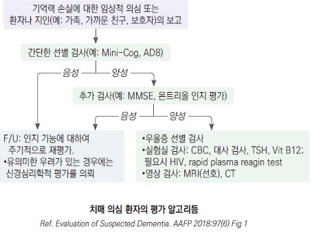

# 치매 Dementia

## <mark style="color:green;">일반 사항</mark>

* 일상생활 수행에 심각한 장애를 초래하는, 지적 기능의 점진적 쇠퇴
* 보통 60세 이후에 시작, 고령에서 5년마다 2배씩 증가, 85세의 30\~50% 이환
* 유병률 : 미국은 감소(높아진 교육 수준 및 심혈관 위험 관리와 관련된 것으로 추정); 우리나라도 65세 이상 치매 유병률이 9.50%(2016) → 9.25%(2023)로 소폭 감소하였으나(보건복지부 치매역학조사), 고령화로 인한 환자 절대 수는 계속 증가 추세 - 2026년 100만 명 돌파 예상
* 항아밀로이드 단클론항체(lecanemab, donanemab)가 조기 AD에 대해 질병 진행을 지연시킬 수 있음이 알려지면서 국내 식약처 허가를 받음(현재 비급여); 이로써 치매는 "치료 불가"에서 "조기 발견 시 질병 진행 지연 가능"으로 패러다임 전환 중
* 일반적인 증상 완화제는 질병 경과를 변화시키지 못함

#### <mark style="color:$primary;">종류</mark>

* 진행성 치매(퇴행성, 비가역적) : Alzheimer Dz(AD), 루이체 치매, 파킨슨병, 전측두엽 치매
* 예방/치료 가능한 치매 : 혈관성 치매(뇌경색, Binswanger's), 우울증, 공간 점유 병변(예: 뇌출혈, 뇌종양, 뇌농양), 약물/독극물, 내분비 이상(예: Vit B12 저하, 엽산 부족, 갑상선 기능 이상), 수두증, 감염(예: 신경매독)

### <mark style="color:$danger;">🚩 Red Flags!</mark>

<mark style="color:$danger;">**즉각 의뢰**</mark>

* 수 주\~수 개월 이내 급속히 진행하는 인지 기능 저하 (프리온, 신생물, 대사 장애 등)
* 심한 망상, 환청 등 정신병적 증상 동반
* 조기 발생 치매(＜65세)

<mark style="color:$warning;">**신속 의뢰**</mark>

* 뚜렷한 파킨슨 증상(안정 시 떨림, 경축, 보행 장애) 동반
* 시각적 환각, 초기 렘수면행동장애 동반 (루이체 치매 가능성)
* 뚜렷한 언어·행동·인격 변화가 기억력 장애보다 선행 (전측두엽 치매 가능성)
* 보행 장애·요실금·인지 저하의 삼증 동반 (정상압수두증 가능성)
* 조기 AD 의심 시 항아밀로이드 치료 적응 여부 평가 고려

## <mark style="color:green;">원인 및 기전</mark>

* 대부분 명확치 않음

**알츠하이머병 (Alzheimer Disease, AD)**

* 고령자 치매의 60\~80% 차지
* amyloid β 단백 축적, 신경원섬유 엉킴(tau 단백), 시냅스 이상 → 신경 퇴행/사멸
* choline acetyltransferase↓ → acetylcholine synthesis↓ → cholinergic function↓

**혈관성 치매 (Vascular dementia)**

* 대뇌 죽상경화증/색전증 → 혈류 감소 → 신경 손상
* 오래 지속된 고혈압, 당뇨병, 뇌졸중 병력 환자에서 흔함. AD와 병발 가능

**루이체 치매 (Dementia with Lewy bodies)**

* 뇌세포에서 비정상 단백인 Lewy body(α-synuclein) 형성

**전측두엽 치매 (Frontotemporal dementia)**

* tau 또는 TDP-43 단백 이상 집적에 의한 전측두엽 뇌세포 사멸

### <mark style="color:orange;">위험 인자</mark>

#### <mark style="color:$primary;">주요 14가지 위험 인자</mark>

**초기 (Early life)**

* 낮은 교육 수준

**중기 (Midlife)**

* 청력 저하, 고혈압, 비만, 흡연, 과도한 음주, 두부 외상, 고LDL 콜레스테롤

**후기 (Late life)**

* 우울증, 신체 활동 저하, 당뇨병, 사회적 고립, 대기 오염, 미교정 시력 저하

#### <mark style="color:$primary;">그 외 위험 인자</mark>

* 수정 불가 인자 : 고령, 가족력
* 인지·정신 관련 : 경도인지장애(MCI), 수면 장애(수면무호흡증, 수면 분절, 수면 시간 단축)
* 대사·혈관 관련 : 심방세동, 뇌졸중(허혈성/출혈성), 만성콩팥병, 고호모시스테인혈증
* 유전·약물 : APOE ε4 대립유전자 보유, 항콜린제 사용

_<mark style="color:$info;">✽ 2024년 Lancet Commission 보고서에서 기존 12가지 위험 인자에 미교정 시력 저하와 고LDL 콜레스테롤을 추가하여 총 14가지로 확대. 이 14가지 가변적 위험 인자를 모두 교정하면 이론적으로 치매의 약 45%를 예방 또는 지연시킬 수 있는 것으로 추산됨</mark>_

## <mark style="color:green;">치매 종류</mark>

### <mark style="color:orange;">알츠하이머병 (Alzheimer Disease, AD)</mark>

* 발생 연령 : 고령(대부분 ＞65세)
* 잠행성 시작, 점진적 진행; 의식 저하는 없음
* 기대 여명 : 진단 후 3\~11년
  * 주요 사망 원인 : 탈수, 영양실조, 감염

#### <mark style="color:$primary;">조기 변화</mark>

* 일상생활에 지장을 주는 기억력 상실 : 이름, 전화번호, 최근의 대화/행동, 중요한 일정
  * 가장 흔한 초기 증상. 즉각적 회상이나 오랫동안 강화된 기억력은 비교적 유지됨
  * 흔히 환자 본인은 인지하지 못함. 스스로 호소하는 기억력 저하는 보통 치매와의 관련성이 적음
* 계획 또는 문제 해결 능력 저하. 복잡한 작업 장애(예: 요리), 계산 능력 저하(예: 가계부 관리)
* 익숙한 작업 능력 저하 : 운전, 게임
* 시간이나 장소의 혼동
* 시각적 이미지와 공간적 관계를 이해하기 어려움
* 언어 장애 : 단어, 사물 명칭이 생각나지 않음, 문장 이해력 저하
* 물건을 잘못 배치하고 단계를 추적하는 기능 상실: 물건을 잘 잊거나 잃어 버림
* 판단력/업무 능력 저하 : 초기에는 다양한 수준의 장애. 다중 작업이나 요약에 어려움을 보이며 점차 행동 장애와 연관됨; 판단력이 유지되는 경우에는 우울증과의 감별을 요함
* 성격 및 감정 변화 : 무관심, 위축, 우울, 기타 성격 변화
* 직장 또는 사회 활동에서 멀어짐

#### <mark style="color:$primary;">후기 변화</mark>

* 정신/행동 증상 : 화/공격적 행동(일부에서는 수동적 행동), 환각, 망상
* 방향 감각 상실, 돌아다님(친숙한 장소에서 길을 잃음)
* 기초적 작업 수행 장애 : 식사, 목욕, 옷 입기
* 대소변 실금

#### <mark style="color:$primary;">AD 의심 징후</mark>

1. 업무 능력에 영향을 미치는 기억력 손실
2. 익숙한 업무 수행에 어려움
3. 언어 문제
4. 시간과 장소에 대한 disorientation
5. 판단력 장애 또는 저하
6. 추상적인 사고 장애
7. 상황을 잘못 이해함
8. 기분이나 행동의 변화
9. 성격 변화
10. initiative 상실

#### <mark style="color:$primary;">DSM-5 진단 기준 (Major neurocognitive disorder due to Alzheimer's Dz)</mark>

A. Major neurocognitive disorder에 부합

* a. 다음의 인지 영역 중 ≥1개에서 이전보다 심각한 장애

> 1. complex attention : 다중 작업, 집중력 유지, 암산 능력 저하
> 2. executive function : 계획 수립, 의사 결정, 오류 수정, 정신적 유연성 등 감퇴
> 3. learning & memory : 같은 말을 반복, 쇼핑 목록을 기억할 수 없음, 자주 상기시켜야 함
> 4. language : 가족 이름 회상, 단어 회상("신발" 대신 "발에 있는 저것"), 문법 능력 저하
> 5. perceptual-motor : 익숙한 장소에서 길을 잃음, 익숙한 활동, 공간 작업 능력 저하
> 6. social cognition : 허용되는 사회적 범위를 벗어나는 행동, 사회적 표준에 대한 무감각, 안전에 대한 고려 없이 작업

* b. 인지 장애는 일상 활동의 수행에 지장을 줌. 예) 청구서 관리, 약물 관리 등의 complex instrumental activities of daily living에 조력자가 필요함
* c. 인지 결손은 delirium의 맥락에서 발생하는 것은 아님
* d. 인지 결손은 우울증, 조현병 등의 다른 정신 질환으로 더 잘 설명되지 않음

B. 최소한 2가지의 인지 영역에서의 장애가 잠행성 시작 및 점진적 진행

C. 다음 중 하나 이상 해당

> 1. 가족력 또는 유전자 검사를 통해 입증된 AD의 유전자 변이에 대한 증거
> 2. 다음 3가지 모두 해당
>    1. learning & memory 및 최소 하나 이상의 인지 영역 저하의 분명한 증거
>    2. 일정하게 유지되지 않는, 인지 능력의 지속적인 저하
>    3. mixed etiology(예: 인지 기능 저하를 유발하는 다른 신경퇴행성/뇌혈관 질환, 또는 다른 신경학적/정신적/전신 질환이나 상태)의 증거가 없음

D. 이 장애는 뇌혈관 질환, 다른 신경퇴행성 질환, substance의 영향, 또는 다른 정신/신경/전신 질환으로 더 잘 설명되지 않음

#### <mark style="color:$primary;">NIA-AA criteria</mark>

1. Preclinical AD : AD 증상(-), AD에 대한 biomarker(+)
2. MCI(경도인지장애) due to AD : 표지자(+), 경증 기억력 장애(+), 일상 생활 기능 장애(-)
3. Dementia due to AD : 표지자(+), 기능 장애를 초래하는 인지 능력 저하(+)

* NIA-AA 2018 개정 기준에서는 AD를 임상 증상이 아닌 아밀로이드(A), tau(T), 신경퇴행(N)의 생물학적 지표(ATN framework)로 정의함. 임상에서는 바이오마커 접근 가능성에 따라 적용 수준이 다름

#### <mark style="color:$primary;">NINCDS-ADRDA 진단 기준</mark>

* NINCDS-ADRDA 기준(1984년)은 NIA-AA 2011/2018 기준으로 대체되었으나, 임상 현장에서 여전히 참고됨

**Definite AD**

* probable AD criteria에 부합하고, 부검 또는 생검에서 알츠하이머병에 합당한 조직병리학적 소견

**Probable AD**

* clinical & neuropsychological 검사를 통해 확인함(예: MMSE, Blessed dementia scale)
* 두 개 이상의 인지 영역의 결함
* 기억력 및 기타 인지 기능의 점진적 악화
* 의식 장애는 없음
* 40\~90세에서 발병(대부분 65세 이후에 발병)
* 기억과 인지 장애의 점진적인 진행을 설명할 수 있는 전신 장애 또는 다른 뇌 질환은 없음

**Possible AD**

* 치매를 유발하기에 충분한 다른 신경, 정신 또는 전신 장애가 없으며, 개시, 양상 또는 경과에 변수가 존재함
* 치매를 유발할 수 있는 제2의 전신 질환이나 다른 뇌 질환이 있으나, 환자에게서 보이는 치매의 원인으로 여겨지지 않음
* 다른 식별 가능한 원인이 없는 상태에서 하나의 점진적인 중증 인지적 결함이 확인됨

**Unlikely AD**

* 갑작스런 발병
* 국소 신경학적 증상(편마비, 감각 장애, 시야 장애, 초기에 나타나는 균형 장애)
* 질병의 시작 또는 매우 이른 시기에 나타난 발작 또는 보행 장애

### <mark style="color:orange;">혈관성 치매 (Vascular dementia)</mark>

* 인지 결핍의 시작이 혈관 사건 발생과 관련이 있음
* 인지 능력의 저하는 정보 처리 속도, 복잡한 주의력 및 frontal-executive 기능에서 현저함

#### <mark style="color:$primary;">ICD-10 진단 기준</mark>

A.치매의 일반 기준에서 기술한 대로 특정 수준의 중증도를 가진 인지 기능의 쇠퇴와 장애의 증거

B. higher cognitive function에서의 균등하지 않은 장애. 장애가 있는 부분이 있고 그렇지 않은 부분이 있음. 기억에는 심한 장애가 있으면서 사고, 추론, 정보 처리 과정 등에서는 아주 경미한 장애만 가질 수 있음

C. 다음 중 하나 또는 그 이상의 국소적 뇌 손상의 증거가 있음

> 1. 사지의 편측 강직성 약화
> 2. 편측 심부 건반사 항진
> 3. extensor plantar response
> 4. pseudobulbar palsy

D. 병인으로서 치매와 관련되었다고 판단할 만한 중요한 뇌혈관 질환의 병력, 진찰, 검사 증거가 있음

* 민감도 70%, 특이도 80%

### <mark style="color:orange;">루이체 치매 (Dementia with Lewy bodies; DLB)</mark>

* 파킨슨 운동 증상이 시작되기 전 또는 1년 이내에 인지 장애 발생 (파킨슨 치매와의 감별 기준)
* Lewy body : 뇌간, 변연계, 전뇌 및 신피질에 α-synuclein 및 ubiquitin을 함유하는 intraneuronal inclusion
* 주의력 및 executive 기능 결함이 서서히 진행
* 환각(특히 생생한 시각적 환각), REM 수면 장애, 우울, 망상 동반
* 신경이완제(항정신병제)에 대한 과민 반응 → 루이체 치매에서는 항정신병제 사용 시 심각한 부작용 위험
* 항정신병제 치료주의 : 루이체 치매 환자에게 항정신병제(특히 haloperidol 등 전형적 항정신병제)를 투여하면 심각한 파킨슨 증상 악화, 신경이완제 악성 증후군(Neuroleptic Malignant Syndrome, NMS) 및 사망률 증가 위험이 있음. 불가피한 경우 quetiapine 저용량을 신중히 사용

### <mark style="color:orange;">전측두엽 치매(Frontotemporal dementia; FTD)</mark>

* 전두엽 및 측두엽에 주로 영향을 미치는 일차적인 신경 퇴행성 질환 그룹; 유전 경향 있음
* 점진적 발병 및 악화
* 조기에 현저한 성격 및 행동 변화(예: executive 기능 장애, 무관심, social cognition 악화, 반복적 행동 및 식이 변화), 언어 결함(paraphasias, anomia, 유창성 감소), 움직임 관련 결함(progressive supranuclear palsy, corticobasal degeneration, multiple systems atrophy, amyotrophic lateral sclerosis)
* 기억력, 시공간 능력은 비교적 유지됨
* tau 또는 TDP-43 단백병증이 주된 기전(AD와는 다른 기전)

## <mark style="color:green;">진단</mark>

#### <mark style="color:$primary;">진단 과정</mark>

1. 객관적인 변화 : 환자를 잘 아는 사람에 의해 관찰되는 인지 및 행동 변화
2. 약물, 외상 등 다른 원인 배제
3. 인지 평가 및 진단 기준 해당 여부 확인
4. 실험실 및 영상 검사

### <mark style="color:orange;">선별 검사 : 인지 기능 검사</mark>

* 증상이 없는 고령자에 대한 일률적인 인지 장애 선별 검사는 권고하지 않음
* 인지 장애 병력(+) & 인지 검사 정상 → 경증 치매, 높은 지적 수준, 우울 가능성 고려
* 인지 장애 병력(-) & 인지 검사 이상 → 급성 혼돈 상태, 매우 낮은 지적 수준, 병력 정보 오류 가능성 고려

#### <mark style="color:$primary;">검사 대상</mark>

* 인지 변화 : 건망증, 말과 글을 이해하는 데 어려움, 단어를 찾는데 어려움, 상식적인 사실을 모름, 방향 감각 장애 등의 증가
* 정신적 증상, 성격 변화 : 위축, 둔함, 무관심, 불면증, 우울, 불안, 두려움, 경박함, 부적절한 친절, 의심, 쉽게 좌절, 감정 폭발, 편집증, 비정상적인 신념, 환각
* 문제 행동 : 방황, 동요, 소란함, 불안정, 수면 중 잠자리에서 벗어남
* 일상 기능의 변화 : 운전 곤란, 쇼핑 곤란, 길 잃음, 요리 방법 잊음, 자기 관리 방치, 집안일 방치, 금전 관리 어려움, 이전에 하지 않던 실수

#### [<mark style="color:$primary;">Mini-Cog test</mark>](https://mini-cog.com/wp-content/uploads/2022/09/KOREAN-Mini-Cog.pdf)

* 장점 : 높은 민감도, 지적 수준과 무관, 짧은 소요 시간
* 문맹자나 시력 저하가 심한 고령자의 경우 '시계 그리기' 점수가 실제 인지 기능보다 낮게 나올 수 있음
* 치매 판정 시 MMSE의 추가 시행을 권고하기도 함

1.  3 단어 암기 : 단어 3개를 듣고 말하게 함

    ▶판정 : 0개=치매, 3개=치매 아님; 1\~2개 → 시계 그리기 시행
2.  시계 그리기 : 원을 그린 종이에 12개의 시계 숫자를 적도록 하고 10시 50분을 그리도록 함

    ▶판정 : 정상(숫자와 바늘 모두 정상)=치매 아님, 비정상=치매
3. 3 단어 회상 : 1단계에서 암기했던 단어를 이야기하도록 함

#### [<mark style="color:$primary;">K-MMSE</mark>](https://www.jkna.org/upload/pdf/200304004.pdf) <mark style="color:$primary;">(Mini-Mental State Examination)</mark>

* 점수 구성 : 시간 지남력 5점, 장소 지남력 5점, 기억 등록 3점, 기억 회상 3점, 주의 집중 및 계산 능력 5점, 언어 능력 8점, 시각 구성 1점(총 30점)

▶판정 : ≥24점=정상, 20\~23점=치매 의심, 15\~19점=경증 치매 의심, ≤14점=중증 치매 의심

* 높은 민감도(87%)와 특이도(82%)로 가장 널리 사용되는 선별 검사 도구; 검사에 7분 정도 소요
* 단점 : 경증 치매에 민감하지 않으며 언어/운동/시각 장애, 연령, 교육 수준에 영향을 받음; \*\*천장 효과(ceiling effect)\*\*로 인해 초기 AD 및 전측두엽 치매의 변별력이 낮음
* 초기 치매가 의심되나 MMSE 점수가 높게 나오는 경우, K-MoCA를 병행하여 집행 기능과 시공간 능력을 재평가할 것 (☞ [경도인지장애](032_-mild-cognitive-impairment-mci.md#k-moca))

**연령 및 교육 수준에 따른 MMSE median score**

<table data-full-width="false"><thead><tr><th width="132.6842041015625">연령(년)</th><th width="88.4210205078125">초등</th><th width="80.10528564453125">중등</th><th width="80.15789794921875">고등</th><th width="79.910400390625">대학</th></tr></thead><tbody><tr><td>18~24</td><td>22</td><td>27</td><td>29</td><td>29</td></tr><tr><td>25~29</td><td>25</td><td>27</td><td>29</td><td>29</td></tr><tr><td>30~34</td><td>25</td><td>26</td><td>29</td><td>29</td></tr><tr><td>35~39</td><td>23</td><td>26</td><td>28</td><td>29</td></tr><tr><td>40~44</td><td>23</td><td>27</td><td>28</td><td>29</td></tr><tr><td>45~49</td><td>23</td><td>26</td><td>28</td><td>29</td></tr><tr><td>50~54</td><td>23</td><td>27</td><td>28</td><td>29</td></tr><tr><td>55~59</td><td>23</td><td>26</td><td>28</td><td>29</td></tr><tr><td>60~64</td><td>23</td><td>26</td><td>28</td><td>29</td></tr><tr><td>65~69</td><td>22</td><td>26</td><td>28</td><td>29</td></tr><tr><td>70~74</td><td>22</td><td>25</td><td>27</td><td>28</td></tr><tr><td>75~79</td><td>21</td><td>25</td><td>27</td><td>28</td></tr><tr><td>80~84</td><td>20</td><td>25</td><td>25</td><td>27</td></tr><tr><td>85~</td><td>19</td><td>23</td><td>26</td><td>27</td></tr></tbody></table>

#### <mark style="color:$primary;">**한국판 몬트리올 인지평가 (**</mark>[<mark style="color:$primary;">K-MoCA</mark>](https://accesson.kr/kjcp/assets/pdf/16582/journal-28-2-549.pdf)<mark style="color:$primary;">)</mark>

☞ [경도인지장애](032_-mild-cognitive-impairment-mci.md#k-moca)

#### <mark style="color:$primary;">한국판 확장판 임상 치매 평가 척도 (</mark>[<mark style="color:$primary;">Expanded clinical dementia rating, CDR</mark>](https://www.jkna.org/upload/pdf/200106005.pdf)<mark style="color:$primary;">)</mark>

* 여섯 가지 항목으로 전반적인 인지 및 사회 기능을 평가
  1. 기억력
  2. 지남력
  3. 판단력과 문제 해결 능력
  4. 사회 활동
  5. 집안 생활과 취미
  6. 위생 및 몸치장
* 환자와 보호자와의 자세한 면담을 통하여 각 영역에 대하여 0, 0.5, 1, 2, 3, 4, 5점을 부여
* 판정 : 합산 점수에 따른 판정과 기억력 검사를 기준으로 결정하는 방법이 있음; 0점=치매 아님, 0.5점=의심, 1점=경증, 2점=중등도, 3점=중증, 4점=매우 중증, 5점=말기 치매
* AD 환자의 전반적인 인지, 사회적 기능 정도 평가, 치매 환자의 중증도 평가
* 뇌졸중으로 인한 마비 등 신체적 질병과 사회적, 정서적 문제로 인한 기능 저하는 평가에서 고려하지 않음

#### <mark style="color:$primary;">한국판 Global Deterioration Scale(</mark>[<mark style="color:$primary;">GDS</mark>](https://www.jkna.org/upload/pdf/200206005.pdf)<mark style="color:$primary;">)</mark>

* 판정 : 1점=없음, 2점=매우 경미, 3점=경미, 4점=중등도, 5점=초기 중증, 6점=중증, 7점=후기 중증 인지 장애
* 퇴행성 치매의 중증도를 평가
* CDR과는 달리 단계별로 인지 장애 정도를 구체적인 예를 들어 기술, 상대적으로 짧은 시간에 판단할 수 있음
* 초기 인지 장애의 평가에서는 CDR보다 우수, 중증의 인지 장애의 구분에는 민감하지 않음

#### <mark style="color:$primary;">CIST (인지선별검사, Cognitive Impairment Screening Test)</mark>

* 개요 : 국가 치매검진사업에 활용이 용이하고 인지기능저하 변별력이 우수한 도구 개발을 목적으로 고안되어 2021년 1월 1일부터 적용 중. 기존 MMSE-DS(MMSE-KC)를 대체하는 국가 표준 1차 선별검사
* 검사 구성 : 지남력, 기억력, 주의력, 언어기능, 시공간 기능, 집행기능으로 총 13문항, 30점 만점이며 검사 시간은 약 5\~10분 소요
* 시행 방식 : 검사자와 대상자의 1:1 문답 및 지필문항으로 시행하며, 인지저하 의심 여부 판단을 위한 연령·학력별 규준을 제공
* 사용 제한 : 저작권자- 보건복지부, 검사지 사용 전 국가치매교육 홈페이지(edu.nid.or.kr)에서 치매선별검사 수행교육(CIST)을 이수해야 함
* K-MMSE와의 관계 : CIST와 K-MMSE-2 총점 간 매우 높은 상관관계(ρ=0.956), 단, 점수 체계가 달라 단순 수치 비교는 불가

#### <mark style="color:$success;">1차 진료용 상황별 인지 기능 검사 가이드안</mark>&#x20;

   (입증된 프로토콜은 아님)

1. 시간이 부족할 때 (3\~5분) → **Mini-Cog**
   * 민감도가 높고 교육 수준 영향이 적음.
   * 주의: 문맹·시력 저하 시 '시계 그리기'가 부적합할 수 있으므로 임상 판단으로 보완.
2. 기본 선별 (7\~10분) → **K-MMSE**
   * 가장 광범위하게 사용. 경계 결과(20\~24점) 시 K-MoCA 추가.
   * 해석: 연령·학력별 규준값 필수 적용. (예: 고학력 70대 26점 이하 정밀검사 고려 / 무학력 80대 17\~18점 정상 가능)
   * 참고: 국가 표준은 CIST임. 보건소 의뢰 시 CIST 결과를 함께 검토할 것 (K-MMSE와 점수 체계 상이).
3. 경증 치매·집행 기능 의심 (10\~15분) → **K-MoCA**
   * MMSE의 천장 효과(Ceiling effect) 보완. 경도인지장애(MCI) 감별에 우수.
4. 중증도 평가 (15\~20분) → **CDR** 또는 **GDS**
   * 치매 단계(Staging) 평가, 경과 추적 및 장기요양등급 판정의 핵심 근거.

**가정·대기실 자가 모니터링**

* 중앙치매센터-[치매위험체크](https://m.nid.or.kr/riskcheck/riskcheck_step02.aspx)(KDSQ) : 15문항
* 진료 전 대기실에서 미리 작성하게 하여 면담 효율화 가능
* 결과 이상 시 치매안심센터(☎ 치매상담콜센터 1899-9988) 연계

### <mark style="color:orange;">실험실/영상 검사</mark>

* 치매의 원인 감별, 치매 상태 평가, 치매로 인한 영양 상태 저하 감별 목적
* 기본 검사 : CBC, 전해질, 혈당, Vit B12, RFT, LFT, TSH, 우울 선별 검사 \[미국신경과학회]
* 선택 : syphilis, HIV, MRI or CT(우리나라 지침에서는 치매 환자에 대하여 기본 검사로 권고), SPECT, 유전자 검사\*(예: APOE-allele), EEG, 요추 천자, 중금속, rapid plasma reagin; AD 위험 식별이 불명확하고 이득이 적기 때문에 일반적으로는 권고하지 않음
* AD의 MRI 소견 : brain atrophy(보통 비특이적), hippocampal volume 감소

#### <mark style="color:$primary;">AD 표지자(biomarker)</mark>

* 영상 : AD 환자의 뇌에서 증가한 Aβ(amyloid)와 tau 단백질을 PET으로 촬영
* 뇌척수액 : 뇌의 신경 퇴화가 진행됨에 따라 뇌에 Aβ가 축적되고 amyloid plaque가 형성되는 한편 CSF에서는 Aβ가 감소함; 뇌신경세포 사멸에 따라 세포 밖으로 흘러나온 tau 단백질이 CSF에서 증가함
* 혈액 바이오마커 : 임상 활용 급속히 확대 중
  * p-tau217 : 아밀로이드 PET에 근접하는 정확도(AUC 0.93\~0.96); 2025년 FDA 최초 혈액 기반 AD 진단 보조 검사 허가
  * Aβ42/40 비율, neurofilament light chain(NfL), GFAP 등 추가 마커 연구 중
  * 양성 시 → 아밀로이드 PET 또는 CSF 검사로 확진 후 전문의 의뢰 권고

### <mark style="color:orange;">감별</mark>

* 정상 노화 관련 인지 기능 저하 : 기능 장애는 없으며 일상생활에 심각한 장애를 일으키지는 않는 정도의, 비진행성의 가벼운 기억력 저하, 새로운 정보 습득의 어려움
* 경도인지장애 : 인지 기능의 감소; 일상생활 능력은 유지됨 (☞ [경도인지장애](032_-mild-cognitive-impairment-mci.md))
* 섬망 : 불안정, 집중력 변화 (치매의 경우 집중력은 어느 정도 보존됨)
* 우울증 : 인지 능력 저하 외 우울, 불안증, 불면증 발생; 5년 내 치매 발생률 50%
* 약물 기인 : 항콜린제, 항히스타민제, 수면제, 항경련제, 진정제, 아편제, 알코올
* 시력 저하, 청력 저하, 영양 결핍, 전해질 장애, 뇌종양, 뇌 손상(예: 외상, 감염)
* LATE (Limbic-predominant Age-related TDP-43 Encephalopathy) : 80세 이상 초고령층에서 AD와 유사한 기억력 저하를 보이나, 아밀로이드 축적은 없으며 TDP-43 단백병증이 원인; 뇌척수액·혈액 아밀로이드 바이오마커 음성이면서 AD 유사 증상이 있는 초고령 환자에서 고려; 부검으로만 확진 가능. AD와 동반되는 경우도 흔함

#### <mark style="color:$primary;">고령자 인지 장애 감별</mark>

| (치매 비율)       | 병력                                                       | 이학적 소견                                            | 영상 소견                                      | 비고                                              |
| ------------- | -------------------------------------------------------- | ------------------------------------------------- | ------------------------------------------ | ----------------------------------------------- |
| 정상 노화         | 회상 지연(이름, 날짜), 처리 지연(지식/기술 습득 지연), 기능 제한(-)              | 없음                                                | 경미한 범발성 피질 위축/뇌실 증대, 국소 소견(-)              | 기억력 문제와 무관한 이상 소견 가능                            |
| MCI           | 연령의 영향을 넘어서는 인지 결손                                       | 없음                                                | 원인에 따라 다양, 측두엽+해마 위축                       | 치매로 진행 가능(특히 amnestic MCI)                      |
| AD (67%)      | 점진적 기억 상실 및 기타 인지 결손                                     | 초기- 정상; 진행- apraxia, aphasia                      | MRI상 측두엽, 두정엽 &/or 해마 위축, PET상 amyloid(+)  | 간혹 비전형적 이환 부위 관련 소견(예: 후측 피질 위축 시 시각 증상)        |
| VaD (20%)     | 현저한 혈관 위험 인자, stroke/TIA 병력, 단계적 진행, 집행 기능 장애(초기)        | 이환 부위에 따라 가변적                                     | 피질 및 피질하 경색, 백질 질환                         | 흔히 AD 동반 (mixed dementia)                       |
| DLB, PD (15%) | 인지 능력 변동, 환시(well-formed), 렘수면 장애, 낙상, 신경이완제에 대한 민감성     | 기립 저혈압, 자세 불안정, 후각 저하, 서맥, 안정 떨림, 경직              | MRI상 특이 소견(-), dopamine transporter PET(+) | PD는 최소한 1년 이상 지속되는 기존 파킨슨병 환자에서 발생, 이후 인지 장애 발생 |
| FTD (<5%)     | 2가지 변이 • 진행성 성격/행동 변화 • 진행성 언어 장애                        | 전두엽 해체 징후 (원시반사 출현)                               | 전두엽 및 측두엽 위축                               | 질병 초기에는 보존되는 집행 기능 및 삽화적 기억                     |
| CTE (모름)      | 다수의 뇌진탕 or 외상성 뇌 손상 병력(예: 운동선수, 군인); 흔히 행동 변화 및 정신 질환 동반 | 없음                                                | 비특이적 백질 변화                                 | 피질 및 혈관 주위 tauopathy. 부검으로만 진단 가능               |
| RPD (<1%)     | 기억 장애가 수주\~수개월에 걸쳐 진행                                    | 병인에 따라 가변적; myoclonus/startle reflex(prion Dz 시사) | 원인에 따라 가변적                                 | 빠르게 진행하는 치매는 드묾 (의뢰)                            |
| 섬망            | 식별 가능한 독성, 대사, 감염 원인; 빠른 발병                              | 부주의, 무질서한 사고, 의식 수준의 변화, 요동치는 경과                  | 특이 소견 없음                                   | EEG- 급성 둔화; 보통 가역적 경과                           |

_<mark style="color:$info;">MCI=mild cognitive impairment, VaD=vascular dementia, DLB=dementia with Lewy bodies, PD=Parkinson dementia, FTD=frontotemporal dementia, CTE=chronic traumatic encephalopathy, RPD=rapidly progressive dementia Ref. Ferri's clinical advisor 2024. Table 2.</mark>_

#### <mark style="color:$primary;">Hachinski ischemic score</mark>

1. AD와 혈관성 치매의 감별 방법
2. 다음 각 항목에 대하여 2점씩 부여
   1. 갑자기 발생
   2. 증상 변동이 있음
   3. 뇌졸중 병력
   4. 국소 신경학적 증상
   5. 국소 신경학적 징후
3. 다음 각 항목에 대하여 1점씩 부여
   1. emotional incontinence(예: 비정상적인 울음/웃음)
   2. 계단식 진행
   3. 고혈압 병력
   4. nocturnal confusion
   5. 죽상경화증 관련 증거
   6. personality는 비교적 유지
   7. 우울
   8. 신체 증상 호소

* 판정 : 0\~4점=AD, 5\~6점=경계, 7\~18점=혈관성 치매 (민감도 및 특이도 89%)

#### <mark style="color:$primary;">의식 변화를 일으키는 질환들</mark>

|             | 치매                       | 우울                  | 섬망               | 정신병증\*             |
| ----------- | ------------------------ | ------------------- | ---------------- | ------------------ |
| 시작          | 잠행성                      | 잠행성                 | 급성               | 다양함                |
| 지속 기간       | 지속, 진행성                  | 다양 or 재발            | 단기\~지속           | 만성, 악화             |
| 기억력         | recent>remote            | 일관성 없음              | 기억 등록이 안됨        |                    |
| 언어          | 이름 대기 장애                 | 말하기 지연              | dysgraphia       |                    |
| 주의력         | 정상(후기 제외)                | 정상 or 장애            | 장애(변동성)          | 정상 or 장애           |
| 지각          | 정상(후기 제외)                | 정상                  | 장애(변동성)          | 정상                 |
| 감각 인식       | 인식 불능, 오인                | 정상                  | 장애               | 장애                 |
| 사고 내용       | 사고 결핍                    | 정상 or 심사숙고          | 지리멸렬             | 정상 or 지리멸렬         |
| Orientation | 장애, 대부분 안정               | 정상                  | 장애(변동성)          | 정상                 |
| 망상 사고       | 기억 상실 or 오인에 의한 2차성      | (발생하면) 자기 비하        | (발생하면) 지리멸렬      | 조직적                |
| 환각          | 드묾, 후기에 보다 흔함; 시각 or 촉체적 | 정신병적 성격이 없으면 발생 안 함 | 흔함; 시각, 암시에 빠져 듦 | 흔함; 시청각 (예: 지시 환각) |
| 피검 태도       | 실행 실패                    | 호응 부족               | 호응 안 함/못함        | 다양함                |

_<mark style="color:$info;">\*DSM-IV-TR Axis I psychotic mental illnesses.</mark>_

_<mark style="color:$info;">Ref. Rakel Family medicine 9th ed. 2016. Table 47-1. Ferri's clinical advisor 2024. Table 4.</mark>_

***

<figure><figcaption></figcaption></figure>

***

## <mark style="background-color:$warning;">Management</mark>

## <mark style="color:green;">관리 및 예방</mark>

* 보호자 관리 : 환자 관리 방법 교육(예: 환자와의 대화법/갈등 해소법), 보호자의 건강 관리
* 약물 치료
  * 인지 증상 : cholinesterase 억제제
  * 우울/불면 : SSRI, 수면제
  * 공격 성향 : 항정신병제
* BPSD(행동심리증상) 비약물 치료 : 환경 구조화(일정한 일과 유지, 자극 감소), 현실 지향 치료, 음악·운동·인지자극 요법; 약물 치료 전 우선 시도 권고
* 사회적 자원 연계
  * 치매안심센터 : 치매 확진 시 관할 치매안심센터 등록 권고 → 치료관리비 지원, 배회감지기 등 안전 용품 지원, 가족 교육·상담 프로그램 이용 가능
  * 노인장기요양보험 : 장기요양등급 신청 안내; 의사소견서 작성 시 인지 기능뿐 아니라 일상생활 수행 능력(ADL)의 타인 의존도를 구체적으로 기술할수록 환자에게 유리한 등급 판정에 도움이 됨
* 예방 및 기타 치료 (☞ [경도인지장애](032_-mild-cognitive-impairment-mci.md#management))
* 커피와 치매 : 많은 소비(＞6잔/d)가 뇌 용적을 줄이고 치매 위험을 높인다는 보고가 있는 반면, 하루 2\~3잔의 커피 또는 차를 마신 경우 치매 위험도가 약 28% 낮았다는 보고도 있어 일관되지 않음. 현재로서는 과도한 섭취는 피하고 적당량(1\~3잔/d)은 허용 가능한 수준으로 봄

## <mark style="color:green;">약물 치료</mark>

#### <mark style="color:$primary;">Alzheimer Dz</mark>

* 1차 선택 : cholinesterase 억제제
* 추가 : 중증 또는 효과 부족 시 N-methyl-D-aspartate 수용체 길항제의 병용을 고려
* 평가 : 2\~4주 후 효과 및 부작용 평가. 안정 시 매 3\~6개월 F/U
* 유지 용량으로 6\~8주 내 호전이 없으면 중단. 중단 후 증상이 악화되면 재시작

#### <mark style="color:$primary;">혈관성 치매</mark>

* 약제 : cholinesterase 억제제, N-methyl-D-aspartate 수용체 길항제; 제한적 효과

### <mark style="color:orange;">인지 증상 치료제</mark>

#### <mark style="color:$primary;">Cholinesterase 억제제 (ChEIs)</mark>

* 치매 1차 치료제 (☞ [보험기준](https://www.hira.or.kr/rc/insu/insuadtcrtr/InsuAdtCrtrPopup.do?mtgHmeDd=20250501\&sno=2\&mtgMtrRegSno=0003))
* 기전 : cholinesterase 작용 억제 → choline↑ → cholinergic transmission↑
* 효과 : AD 환자의 ⅓에서 약간의 증상 감소. 경증에서 보다 효과; 약제간의 유의한 효과 차이는 없음; 병의 경과를 변화시키지는 못함 (✽약간의 MMSE 향상과 사망 위험 감소가 있다는 보고가 있음)
* 부작용 : 설사, 구역, 식욕 부진, 악몽, 근육 경련, 부정맥(서맥), 실신; 빈도는 용량 관련
  * 대처 방법 : 악몽 발생 시 아침에 투여, 구역 발생 시 야간에 투여
  * 위장 장애가 심하거나 복약 순응도가 낮은 경우 : 경구제 대신 패치제(donepezil 패취 또는 rivastigmine 패취)로 전환 고려 → 혈중 농도 안정적 유지 및 위장 부작용 경감
* 주의 : 행동 증상을 악화시킬 수 있으므로 전측두엽 치매에는 투여하지 않음
* 상호 작용 : β-차단제/비이중수용체 칼슘통로차단제(verapamil, diltiazem)/digoxin(심장 전도 장애 → 서맥, 방실 차단 위험 증가; 병용 시 심전도 모니터링 권고), 항콜린제(ChEIs 약효 저하)
* 병용 요법 : 중등도 이상(MMSE ≤20)에서 ChEIs와 memantine 병용이 단독 요법 대비 인지 및 행동 증상 개선에 더 효과적; 급여 기준 충족 시 적극 고려

<table><thead><tr><th width="146.73681640625">성분명 [상품명]</th><th width="339.26318359375">용량 [시작 → 유지]</th><th>비고</th></tr></thead><tbody><tr><td>donepezil<br><mark style="color:blue;">[아리셉트 정]</mark><br><mark style="color:blue;">[도네라온 패취]</mark></td><td>• 경증 5 mg qd → 4주 후 10 mg qd<br>• 중증 23 mg qd → 3개월 후 10 mg qd<br>• 패취 87.5 mg, 4~6주간 주 2회(3일&#x26;4일) 취침 전 등에 부착 → 175 mg 주 2회로 증량 가능</td><td></td></tr><tr><td>galantamine<br><mark style="color:blue;">[갈란타민]</mark></td><td>• 4 mg bid → (4주마다 4 mg bid 증량) 8~12 mg bid<br>• 서방형 8 mg qd → (4주마다 8 mg qd 증량) 24 mg qd</td><td>간/신 장애 시 주의</td></tr><tr><td>rivastigmine<br><mark style="color:blue;">[엑셀론]</mark></td><td>• 1.5 mg bid → (2주마다 1.5 mg bid 증량) 3~6 mg bid<br>• 패취 4.6 mg/d → 4주 후 9.5~13.3 mg patch/d</td><td>간/신 장애 시 주의; 패취는 부착 위치를 바꿔서 사용</td></tr></tbody></table>

#### <mark style="color:$primary;">N-methyl-D-aspartate receptor antagonist</mark>

* 단독 또는 ChEIs와 병용 (☞ [보험기준](https://www.hira.or.kr/rc/insu/insuadtcrtr/InsuAdtCrtrPopup.do?mtgHmeDd=20190201\&sno=1\&mtgMtrRegSno=0006))
* 대상 : 알츠하이머형(뇌혈관 질환 동반 포함)의 중등도·중증 치매로 다음 조건을 동시에 충족하는 경우 급여 인정
  * MMSE ≤20점
  * CDR 2\~3 또는 GDS stage 4\~7
  * ChEIs와 병용 가능; 은행잎추출물(Ginkgo biloba extract) 병용 시 저렴한 1종은 비급여
* 기전 : 신경 보호 작용
* 효과 : 진행된 치매에서 통계적으로 유효; 장기 사용 및 유의미한 기능 개선은 입증되지 않음. 중등도 이하의 AD 환자에서의 일상생활 개선은 입증되지 않음. 전측두엽 치매에는 효과 없음
* 부작용 : 어지럼, 두통, 시야 흐림, 부종, 체중 증가, 과민, 혼돈 (✽심각한 부작용은 매우 드묾)
* memantine : 시작 5 ㎎ \[서방형 7 ㎎] qd, 1주마다 5 ㎎ \[7 ㎎] 증량, 유지 5 ㎎ qd\~10 ㎎ \[14 ㎎] bid <mark style="color:blue;">\[에빅사]</mark>; 중증 신장애(eGFR <30 mL/min) 시 용량 감량 필요; 중증 간장애 주의

#### <mark style="color:$primary;">항아밀로이드 단클론항체 (Anti-amyloid monoclonal antibodies)</mark>

* **lecanemab** : Aβ soluble protofibril에 결합하는 human IgG1 단클론항체
  * 국내 식약처 허가(2024.3), 현재 비급여 : 아밀로이드 병리 확인된 MCI 또는 경증 AD
  * 효과 : 18개월간 인지 기능 저하를 위약 대비 약 27% 지연
  * 투여 : 10 mg/kg IV, 2주마다 (18개월 후 유지 요법으로 4주마다 전환 가능) <mark style="color:blue;">\[레켐비]</mark>
  * 부작용 : ARIA 약 21% 발생
    * ARIA-E (amyloid-related imaging abnormalities - edema/effusion) : 뇌 부종 또는 삼출; MRI FLAIR에서 고신호
    * ARIA-H (hemorrhage/hemosiderosis) : 미세출혈 또는 철침착; MRI T2\*·SWI에서 저신호
    * ApoE4 이형접합자에서 위험 증가; 동형접합자(ε4/ε4)에서 ARIA 위험 현저히 증가 → 투여 전 ApoE4 유전자 검사 필수
* **donanemab** : Aβ plaque를 표적으로 하는 human IgG1 단클론항체
  * 국내 식약처 허가(2025.2), 현재 비급여 : 아밀로이드 병리 확인된 MCI 또는 경증 AD
  * 효과 : 18개월간 인지 기능 저하를 위약 대비 약 35% 지연
  * 투여 : 700 mg IV 4주마다 × 3회 → 1,400 mg 4주마다; 아밀로이드 소실 확인 시 투여 중단 가능 (장기 투여 불필요한 첫 번째 AD 치료제) <mark style="color:blue;">\[키썬라]</mark>
  * 부작용 : ARIA 약 24% 발생
    * ARIA-E : 약 20\~24% - 대부분 경증이나 무증상; 심한 경우 두통, 혼돈, 시각 증상
    * ARIA-H : 미세출혈 및 철침착; 대부분 경증
    * ApoE4 동형접합자(ε4/ε4)에서 ARIA 위험 현저히 높음 - 치료 시작 전 ApoE4 유전자 검사 필수; 정기 MRI 모니터링 필수
* **항아밀로이드 치료 공통 주의사항**
  * 투여 전 아밀로이드 PET 또는 혈액/CSF 바이오마커(p-tau217 등)로 AD 병리 확인 필수
  * ApoE4 유전자 검사 필수 (동형접합자에서 ARIA 위험 현저히 높음; 치료 결정 시 반드시 고려)
  * 정기 MRI 모니터링(ARIA-E, ARIA-H 감시; 투여 전·1차·3차·7차 주사 후 시행 권고)
  * 항응고제·항혈소판제 사용 중 출혈(ARIA-H) 위험 증가
  * 일차 의료에서 직접 처방 대상 아님 - 신경과·인지신경의학 전문의 평가 후 시행

### <mark style="color:orange;">항정신병제</mark>

* 대상 : psychosis, agitation, aggressive 행동에 대하여 고려; 비약물 치료를 우선 시도 후 불충분할 때 사용
  * 비약물 접근 우선 확인 : 환경적 요인(소음, 과도한 자극, 조명), 신체적 불편감(통증, 변비, 요폐) 교정
* 효과 : 논란 (다른 대안이 없어 사용하게 됨)
* 부작용 : 인지 기능 저하, 보행 장애(낙상), 추체외로 증상, 심장 전도 장애, 진정, 흡인성 폐렴, 사망률 증가; 고용량, 고령자에서 보다 많이 발생
* 주의: 치매 관련 정신행동 증상 환자에서 항정신병제 사용 시 뇌졸중 및 사망 위험이 유의하게 증가함. 처방 전 환자·보호자에게 반드시 고지할 것
* 신중한 환자 선택 및 유효한 최소 용량 투여 (보험주의)
* 루이체 치매에서는 항정신병제 사용에 주의

#### <mark style="color:$primary;">Atypical antipsychotics</mark>

* 장점 : 추체외로 부작용 위험이 보다 낮음
* 단점 : 뇌졸중 위험 증가; 체중 증가, 당뇨병 환자에서 고혈당과 관련
* 주의 : 혈관 위험이 있는 환자에서 주의 사용
* 용법 : 저용량으로 시작, 1주 간격 조정. 수면 효과를 감안하여 취침 시 투여
* quetiapine : 12.5\~25 ㎎ hs로 시작 → 25\~200 ㎎/d hs까지 조정 <mark style="color:blue;">\[쎄로켈]</mark>
* aripiprazole : 5\~10 ㎎/d <mark style="color:blue;">\[아빌리파이]</mark>
* clozapine : 25\~50 ㎎/d hs <mark style="color:blue;">\[클로자릴]</mark>
* olanzapine : 2.5\~10 ㎎/d hs <mark style="color:blue;">\[자이프렉사]</mark>
* risperidone : 0.25\~2 ㎎/d hs <mark style="color:blue;">\[리스페달]</mark>
* ziprasidone : 20\~40 ㎎/d <mark style="color:blue;">\[젤독스]</mark>

#### <mark style="color:$primary;">Typical antipsychotics</mark>

* 효과 : 의미 있는 효과가 입증되지 않음
* 용법 : 저용량, 단기 사용으로 제한
* haloperidol : 0.5\~2 ㎎/d <mark style="color:blue;">\[페리돌]</mark>

### <mark style="color:orange;">항경련제</mark>

* 대상 : 항정신병제에 반응하지 않는 전신 경련, 초조, 공격 성향에 대하여 2차 약제로 선택
* 부작용 : 진정
* carbamazepine : 시작 50\~100 ㎎/d, 유지 300\~600 ㎎/d <mark style="color:blue;">\[테그레톨]</mark>
* divalproex : carbamazepine보다 부작용 적음; 시작 125\~250 ㎎, 유지 375\~1,375 ㎎/d <mark style="color:blue;">\[데파코트]</mark>
* lamotrigine : 50 ㎎/d, 증량 50 ㎎/2wk, 최대 400 ㎎/d <mark style="color:blue;">\[라믹탈]</mark>

### <mark style="color:orange;">항우울제 (SSRI)</mark>

* 대상 : 우울, 불안 증상을 보이는 경우 고려 (☞ [우울증](027_-depression.md#management))
* 효과 : 논란
* 부작용 : 구역/구토, 흥분, 파킨슨 작용, 성 기능 저하
* 1차 선택 : 저용량 SSRI
* citalopram : 10\~40 ㎎/d
* escitalopram : 5\~20 ㎎/d <mark style="color:blue;">\[렉사프로]</mark>
* venlafaxine : 37.5\~225 ㎎/d <mark style="color:blue;">\[이팩사]</mark>
* sertraline : 25\~200 ㎎/d <mark style="color:blue;">\[졸로푸트]</mark>
* paroxetine과 TCA는 항콜린 부작용 문제로 피함

### <mark style="color:orange;">항불안제</mark>

* 대상 : 현저한 불안증, 다른 약제에 반응하지 않는 급성기 불안증
* 용법 : 단기 작용 benzodiazepine 저용량, 단기 사용
* 장기 작용제는 낙상 등의 위험성 있음; 장기 투여 시 행동 이상 악화 위험이 있음
* lorazepam : 0.5\~1 ㎎ 필요시 4\~6시간마다 <mark style="color:blue;">\[아티반]</mark>
* oxazepam : 흡수가 늦어 필요시 사용 방법으로는 덜 유용. 5.0\~7.5 ㎎ qd\~qid
* triazolam : 착란, 기억력 장애, 정신병적 행동 유발 우려 <mark style="color:blue;">\[할시온]</mark>

### <mark style="color:orange;">수면 유도</mark>

* 치매 환자의 수면 장애는 비약물 치료(환경 구조화, 광치료, 수면 위생)를 먼저 시도; 약물은 보조적으로 사용 (☞ 상세 용법·용량은 [불면증](029_-insomnia-sleep-disorder.md#management) 참조)
* suvorexant : 치매 관련 수면 장애에 대해 허가된 유일한 DORA 계열; 10\~20 ㎎ hs <mark style="color:blue;">\[벨솜라]</mark>
* trazodone : 다른 수면제에 비하여 효과와 부작용이 적음; 25\~100 ㎎ <mark style="color:blue;">\[트리티코]</mark>
* mirtazapine : 저용량으로 유의미한 수면 향상을 보임; 7.5\~15 ㎎ <mark style="color:blue;">\[레메론]</mark>
* zolpidem : 5\~10 ㎎ <mark style="color:blue;">\[스틸녹스]</mark> — 가능하면 더 안전한 대안(DORA, trazodone) 우선 고려
* benzodiazepine은 주간 진정, 내성, 반동성 불면, 인지저하, 낙상, 섬망 등의 위험이 있고 diphenhydramine은 인지 기능에 대한 나쁜 영향, 남성 배뇨 장애를 유발할 수 있으므로 회피

***

### <mark style="color:red;">질병코드</mark>

F01 혈관성 치매

F03 상세불명의 치매

G30 알츠하이머병

***

## <mark style="color:purple;">처방례</mark>

> **처방례 1.** 알츠하이머 치매 - 경증, 초기 치료
>
> ```
> 아리셉트 5 mg/T  1T  qd  취침 전  (4주)
> → 4주 후 10 mg/T  1T  qd 로 증량 고려
> ※ 2~4주 후 효과 및 부작용(구역, 설사, 악몽, 서맥) 평가
> ※ 유지 용량으로 6~8주 내 호전이 없으면 중단 고려
> ※ 중단 후 증상 악화 시 재시작
> ※ 안정 후 매 3~6개월 추적
> ```

> **처방례 2.** 알츠하이머 치매 - 중등도\~중증 (ChEIs + memantine 병용)
>
> ```
> 아리셉트 10 mg/T  1T  qd  취침 전
> 에빅사 10 mg/T  1T  bid  (시작 5 mg qd → 1주마다 5 mg 증량 → 유지 10 mg bid)
> ※ 대상: 중등도~중증 AD(MMSE ≤20점, CDR 2~3 또는 GDS 4~7) 또는 ChEIs 단독 효과 불충분 시
> ※ 부작용 (어지럼, 혼돈) 모니터링
> ※ 중증 신장애(eGFR <30 mL/min) 시 용량 감량 필요
> ```

> **처방례 3.** 치매 - 행동심리증상(BPSD) 동반 시 (초조/공격성)
>
> ```
> 쎄로켈 25 mg/T  0.5T  hs  (→ 1주 간격으로 반응 보며 25~100 mg/d hs까지 조정)
> ※ 저용량 시작, 최소 유효 용량으로 단기 사용
> ※ 부작용 (진정, 낙상, 추체외로 증상, 사망률 증가) 모니터링
> ※ 루이체 치매에서 haloperidol 등 전형적 항정신병제 금기
> ※ 가능한 비약물 치료(환경 조정, 음악 요법) 우선 시도
> ```

> **처방례 4.** 치매 - 우울/불안 동반 시
>
> ```
> 렉사프로 5 mg/T  1T  qd  (2주 후 효과 평가; 필요시 10 mg qd까지 증량)
> ※ paroxetine, TCA는 항콜린 부작용으로 회피
> ※ 4~6주 후 효과 평가; 치매에서의 효과는 제한적
> ```

***

### <mark style="color:$success;">핵심 복약 지도</mark>

> **치매 환자 보호자 안내**
>
> * 치매 치료제(아리셉트, 엑셀론, 갈란타민 등)는 증상을 완화시키는 데 도움이 되지만, 병의 진행 자체를 멈추지는 못합니다.
> * 약을 복용한 후 구역, 설사, 식욕 감소, 악몽이 생길 수 있습니다. 구역은 저녁에 투여하면 줄어들 수 있습니다.
> * **서맥(맥박이 느려짐) 주의** : 심장 전도 장애나 기립성 저혈압이 있는 환자에서는 실신 위험이 있으므로, 복약 초기에 맥박을 주기적으로 확인하십시오(분당 50회 미만 또는 실신 증상 시 즉시 내원).
> * **식욕 부진·체중 감소** : 위장 장애로 인한 체중 감소가 심할 경우, 약을 저녁 식후에 복용하거나 패치제(피부에 붙이는 약)로 변경을 고려할 수 있음을 의사와 상의하십시오.
> * 갑자기 약을 중단하지 마시고, 증상 변화가 있으면 의사에게 알려주세요.
> * 환자를 돌보는 가족도 정기적으로 건강을 챙기고, 필요하면 전문 상담을 받으시기 바랍니다.

> **언제 다시 병원을 방문해야 하나요?**
>
> * 인지 기능이나 일상생활 능력이 급격히 나빠지는 경우
> * 환각, 심한 초조, 공격적 행동이 새로 나타난 경우
> * 낙상이나 보행 장애가 생긴 경우
> * 약물 부작용이 의심되는 경우(심한 구역, 서맥, 실신 등)

***

### <mark style="color:blue;">환자 안내서</mark>


**치매, 이렇게 관리하세요**

치매는 서서히 진행하는 뇌 질환입니다. 조기에 발견하고 꾸준히 관리하면 일상생활을 더 오래 유지할 수 있습니다.

'[**중앙치매센터**](https://www.nid.or.kr/main/main.aspx)**'**&#xC5D0;서 치매와 관련된 자료와 정부 지원정책을 볼 수 있습니다.&#x20;


#### <mark style="color:$primary;">치매란 무엇인가요?</mark>

* 기억력을 포함한 여러 인지 기능이 서서히 나빠져 일상생활에 지장을 주는 상태입니다.
* 알츠하이머병이 가장 흔한 원인(약 60\~80%)이며, 혈관성 치매, 루이체 치매 등 다양한 종류가 있습니다.
* 최근 조기 알츠하이머병에 대한 새로운 치료제(항아밀로이드 주사제)가 개발되어 전문의 평가 후 사용할 수 있습니다.

#### <mark style="color:$primary;">가장 중요한 생활 관리</mark>

* **규칙적인 운동** : 매일 30분 이상 걷기, 주 3\~5회 유산소 운동이 도움이 됩니다.
* **인지 자극 활동** : 독서, 퍼즐, 새로운 취미 활동, 사회 모임 참여를 꾸준히 하십시오.
* **혈압·혈당·콜레스테롤 관리** : 혈관 건강이 뇌 건강에 직결됩니다.
* **균형 잡힌 식사** : 지중해식 식단(채소, 생선, 올리브오일)이 권장됩니다.
* **금연, 절주** : 담배는 반드시 끊고, 술은 하루 1잔 이하로 제한하십시오.

#### <mark style="color:$primary;">안전 관리</mark>

* 가스 밸브 잠금 장치, 배회 감지기 등 안전 장치를 설치하십시오.
* 낙상 예방을 위해 욕실에 미끄럼 방지 매트, 안전 손잡이를 설치하십시오.
* 환자가 외출할 때 이름·연락처가 적힌 인식표를 착용하도록 하십시오.

#### <mark style="color:$primary;">이럴 때는 즉시 내원하세요</mark>

* 인지 기능이 수 주 이내로 갑자기 나빠질 때
* 환각(없는 것이 보이거나 들림)이 나타날 때
* 걸음걸이가 갑자기 불안정해지거나 자주 넘어질 때
* 약 복용 후 심한 구역, 어지럼, 맥박이 느려지는 경우
