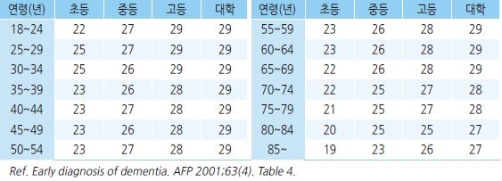
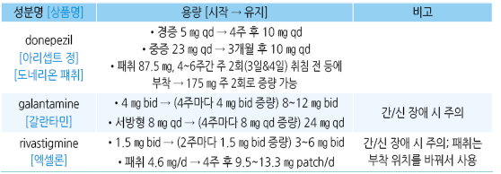
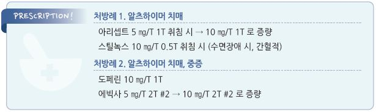

# 치매 Dementia

## <mark style="color:green;">일반 사항</mark>

* 일상생활 수행에 심각한 장애를 초래하는, 지적 기능의 점진적 쇠퇴
* 보통 60세 이후에 시작, 고령에서 5년마다 2배씩 증가, 85세의 30\~50% 이환
  * 미국에서의 유병률은 감소 (✽높아진 교육 수준 및 심혈관 위험 관리와 관련된 것으로 추정)
* 질병 자체를 변화시킬 수 있는 치료 방법은 현재 없음

### <mark style="color:$danger;">🚩 Red Flags!</mark>

* 조기 치매 증상(＜65세)
* 빠른 진행(2년 이내)
* 다른 원인(예: 우울, 뇌병증)과의 감별이 어려운 치매 증상
* non-AD 양상 : 조기 발생, 심한 증상, 언어 문제, 조기에 발생한 환각
* 뇌졸중 병력/신경학적 이상/비뇨기계 등에 이상이 없는 배뇨 문제

#### 종류

* 진행성 치매(퇴행성, 비가역적) : Alzheimer Dz(AD), 루이체 치매, 파킨슨병, 전측두엽 치매
* 예방/치료 가능한 치매 : 혈관성 치매(뇌경색, Binswanger’s), 우울증, 공간 점유 병변(예: 뇌출혈, 뇌종양, 뇌농양), 약물/독극물, 내분비 이상(예: Vit B12 저하, 엽산 부족, 갑상선 기능 이상), 수두증, 감염(예: 신경매독)

## <mark style="color:green;">원인 및 기전</mark>

* 대부분 명확치 않음
* 알츠하이머병 : 고령자 치매의 60\~80% 차지
  * Amyloid β 단백 축적, 신경원섬유 엉킴, 시냅스 이상 → 신경 퇴행/사멸
  * choline acetyltransferase↓ → acetylcholine synthesis↓ → cholinergic function↓
* 혈관성 치매 (Vascular dementia)
  * 대뇌 죽상경화증/색전증 → 혈류 감소 → 신경 손상
  * 오래 지속된 고혈압, 당뇨병, 뇌졸중 병력 환자에서 흔함. AD와 병발 가능
* 루이체 치매 (Dementia with Lewy bodies) : 뇌세포에서 비정상 단백인 Lewy body 형성
* 전측두엽 치매 (Frontotemporal dementia) : AD와 같은 기전에 의한 전측두엽 뇌세포 사멸

### <mark style="color:$primary;">위험 인자</mark>

* 가족력, 고령
* 흡연, 만성적인 음주, 육체 활동 저하, 사회적 고립, 낮은 교육 수준
* 우울증, 수면 장애(조각 수면, 수면 시간 단축, 수면무호흡증), 경도인지장애
* 독소, 대기 오염, 두부 외상, 난청
* Vit D 결핍, 고호모시스테인혈증, 대사증후군, 비만, 고혈압, 당뇨병, 이상지질혈증, 만성콩팥병, MI, 심방세동, 경동맥/뇌혈관 죽상경화증, 망막병증, 뇌졸중(허혈성/출혈성)
* 항콜린제 사용이 치매를 유발할 수 있다는 보고가 있음

## <mark style="color:green;">치매 종류</mark>

### <mark style="color:$primary;">알츠하이머병 (Alzheimer Disease, AD)</mark>

* 발생 연령 : 고령(대부분 ＞65세)
* 잠행성 시작, 점진적 진행; 의식 저하는 없음
* 기대 여명 : 진단 후 3\~11년&#x20;
  * 주요 사망 원인 : 탈수, 영양실조, 감염

#### 조기 변화

* 일상생활에 지장을 주는 기억력 상실 : 이름, 전화번호, 최근의 대화/행동, 중요한 일정
  * 가장 흔한 초기 증상. 즉각적 회상이나 오랫동안 강화된 기억력은 비교적 유지됨
  * 흔히 환자 본인은 인지하지 못함. 스스로 호소하는 기억력 저하는 보통 치매와의 관련성이 적음
* 계획 또는 문제 해결 능력 저하. 복잡한 작업 장애(예: 요리), 계산 능력 저하(예: 가계부 관리)
* 익숙한 작업 능력 저하 : 운전, 게임
* 시간이나 장소의 혼동
* 시각적 이미지와 공간적 관계를 이해하기 어려움
* 언어 장애 : 단어, 사물 명칭이 생각나지 않음, 문장 이해력 저하
* 물건을 잘못 배치하고 단계를 추적하는 기능 상실: 물건을 잘 잊거나 잃어 버림
* 판단력/업무 능력 저하 : 초기에는 다양한 수준의 장애. 다중 작업이나 요약에 어려움을 보이며 점차 행동 장애와 연관됨; 판단력이 유지되는 경우에는 우울증과의 감별을 요함
* 성격 및 감정 변화 : 무관심, 위축, 우울, 기타 성격 변화
* 직장 또는 사회 활동에서 멀어짐

#### 후기 변화

* 정신/행동 증상 : 화/공격적 행동(일부에서는 수동적 행동), 환각, 망상
* 방향 감각 상실, 돌아다님(친숙한 장소에서 길을 잃음)
* 기초적 작업 수행 장애 : 식사, 목욕, 옷 입기
* 대소변 실금

#### AD 의심 징후

1. 업무 능력에 영향을 미치는 기억력 손실
2. 익숙한 업무 수행에 어려움
3. 언어 문제
4. 시간과 장소에 대한 disorientation
5. 판단력 장애 또는 저하
6. 추상적인 사고 장애
7. 상황을 잘못 이해함
8. 기분이나 행동의 변화
9. 성격 변화
10. initiative 상실

#### DSM-5 진단 기준 (Major neurocognitive disorder due to Alzheimer’s Dz)

A. Major neurocognitive disorder에 부합

a. 다음의 인지 영역 중 ≥1개에서 이전보다 심각한 장애

> 1. complex attention : 다중 작업, 집중력 유지, 암산 능력 저하
> 2. executive function : 계획 수립, 의사 결정, 오류 수정, 정신적 유연성 등 감퇴
> 3. learning & memory : 같은 말을 반복, 쇼핑 목록을 기억할 수 없음, 자주 상기시켜야 함
> 4. language : 가족 이름 회상, 단어 회상(“신발” 대신 “발에 있는 저것”), 문법 능력 저하
> 5. perceptual-motor : 익숙한 장소에서 길을 잃음, 익숙한 활동, 공간 작업 능력 저하
> 6. social cognition : 허용되는 사회적 범위를 벗어나는 행동, 사회적 표준에 대한 무감각, 안전에 대한 고려 없이 작업

b. 인지 장애는 일상 활동의 수행에 지장을 줌. 예) 청구서 관리, 약물 관리 등의 complex instrumental activities of daily living에 조력자가 필요함

c. 인지 결손은 delirium의 맥락에서 발생하는 것은 아님

d. 인지 결손은 우울증, 조현병 등의 다른 정신 질환으로 더 잘 설명되지 않음

B. 최소한 2가지의 인지 영역에서의 장애가 잠행성 시작 및 점진적 진행

C. 다음 중 하나 이상 해당

> 1. 가족력 또는 유전자 검사를 통해 입증된 AD의 유전자 변이에 대한 증거
> 2. 다음 3가지 모두 해당
>    1. learning & memory 및 최소 하나 이상의 인지 영역 저하의 분명한 증거
>    2. 일정하게 유지되지 않는, 인지 능력의 지속적인 저하
>    3. mixed etiology(예: 인지 기능 저하를 유발하는 다른 신경퇴행성/뇌혈관 질환, 또는 다른 신경학적/정신적/전신 질환이나 상태)의 증거가 없음

D. 이 장애는 뇌혈관 질환, 다른 신경퇴행성 질환, substance의 영향, 또는 다른 정신/신경/전신 질환으로 더 잘 설명되지 않음

#### NINCDS-ADRDA 진단 기준

Definite AD

* probable AD criteria에 부합하고, 부검 또는 생검에서 알츠하이머병에 합당한 조직병리학적 소견

Probable AD

* clinical & neuropsychological 검사를 통해 확인함(예: MMSE, Blessed dementia scale)
* 두 개 이상의 인지 영역의 결함
* 기억력 및 기타 인지 기능의 점진적 악화
* 의식 장애는 없음
* 40\~90세에서 발병(대부분 65세 이후에 발병)
* 기억과 인지 장애의 점진적인 진행을 설명할 수 있는 전신 장애 또는 다른 뇌 질환은 없음

Possible AD

* 치매를 유발하기에 충분한 다른 신경, 정신 또는 전신 장애가 없으며, 개시, 양상 또는 경과에 변수가 존재함
* 치매를 유발할 수 있는 제2의 전신 질환이나 다른 뇌 질환이 있으나, 환자에게서 보이는 치매의 원인으로 여겨지지 않음
* 다른 식별 가능한 원인이 없는 상태에서 하나의 점진적인 중증 인지적 결함이 확인됨

Unlikely AD

* 갑작스런 발병
* 국소 신경학적 증상(편마비, 감각 장애, 시야 장애, 초기에 나타나는 균형 장애)
* 질병의 시작 또는 매우 이른 시기에 나타난 발작 또는 보행 장애

#### NIA-AA criteria

1. Preclinical AD : AD 증상(-), AD에 대한 biomarker(+)
2. MCI(경도인지장애) due to AD : 표지자(+), 경증 기억력 장애(+), 일상 생활 기능 장애(-)
3. Dementia due to AD : 표지자(+), 기능 장애를 초래하는 인지 능력 저하(+)

### 혈관성 치매 (Vascular dementia)

* 인지 결핍의 시작이 혈관 사건 발생과 관련이 있음
* 인지 능력의 저하는 정보 처리 속도, 복잡한 주의력 및 frontal-executive 기능에서 현저함

#### ICD-10 진단 기준

A.치매의 일반 기준에서 기술한 대로 특정 수준의 중증도를 가진 인지 기능의 쇠퇴와 장애의 증거

B. higher cognitive function에서의 균등하지 않은 장애. 장애가 있는 부분이 있고 그렇지 않은 부분이 있음.

```
기억에는 심한 장애가 있으면서 사고, 추론, 정보 처리 과정 등에서는 아주 경미한 장애만 가질 수 있음
```

C. 다음 중 하나 또는 그 이상의 국소적 뇌 손상의 증거가 있음

① 사지의 편측 강직성 약화

② 편측 심부 건반사 항진

③ extensor plantar response

④ pseudobulbar palsy

D. 병인으로서 치매와 관련되었다고 판단할 만한 중요한 뇌혈관 질환의 병력, 진찰, 검사 증거가 있음

* 민감도 70%, 특이도 80%

### 루이체 치매 (Dementia due to Lewy body diseas; DLB)

* 파킨슨 운동 증상이 시작되기 전 또는 1년 이내에 발생
* Lewy body : 뇌간, 변연계, 전뇌 및 신피질에 α-synuclein 및 ubiquitin을 함유하는 intraneuronal inclusion
* 주의력 및 executive 기능 결함이 서서히 진행
* 환각, REM 수면 장애, 우울, 망상 동반
* 흔히 인지 증상 발생 후 1년 이내에 파킨슨병 발병

### 전측두엽 치매(Frontotemporal dementia; FTD)

* 전두엽 및 측두엽에 주로 영향을 미치는 일차적인 신경 퇴행성 질환 그룹; 유전 경향 있음
* 점진적 발병 및 악화
*   조기에 현저한 성격 및 행동 변화(예: executive 기능 장애, 무관심, social cognition 악화, 반복적 행동 및 식이 변화),

    언어 결함(paraphasias, anomia, 유창성 감소), 움직임 관련 결함(progressive supranuclear palsy, corticobasal degeneration,

    multiple systems atrophy, amyotrophic lateral sclerosis)
* 기억력, 시공간 능력은 비교적 유지됨

## 진단

#### 진단 과정

1. 객관적인 변화 : 환자를 잘 아는 사람에 의해 관찰되는 인지 및 행동 변화
2. 약물, 외상 등 다른 원인 배제
3. 인지 평가 및 진단 기준 해당 여부 확인
4. 실험실 및 영상 검사

### 선별 검사 : 인지 기능 검사

* 증상이 없는 고령자에 대한 일률적인 인지 장애 선별 검사는 권고하지 않음
* 인지 장애 병력(+) & 인지 검사 정상 → 경증 치매, 높은 지적 수준, 우울 가능성 고려
* 인지 장애 병력(-) & 인지 검사 이상 → 급성 혼돈 상태, 매우 낮은 지적 수준, 병력 정보 오류 가능성 고려

#### 검사 대상

* 인지 변화 : 건망증, 말과 글을 이해하는 데 어려움, 단어를 찾는데 어려움, 상식적인 사실을 모름, 방향 감각 장애 등의 증가
*   정신적 증상, 성격 변화 : 위축, 둔함, 무관심, 불면증, 우울, 불안, 두려움, 경박함, 부적절한 친절, 의심, 쉽게 좌절, 감정 폭발,

    편집증, 비정상적인 신념, 환각
* 문제 행동 : 방황, 동요, 소란함, 불안정, 수면 중 잠자리에서 벗어남
*   일상 기능의 변화 : 운전 곤란, 쇼핑 곤란, 길 잃음, 요리 방법 잊음, 자기 관리 방치, 집안일 방치, 금전 관리 어려움,

    이전에 하지 않던 실수

[Mini-Cog test](https://www.alz.org/media/Documents/mini-cog.pdf)

① 3 단어 암기 : 단어 3개를 듣고 말하게 함

```
판정 : 0개=치매, 3개=치매 아님; 1~2개 → 시계 그리기 시행
```

② 시계 그리기 : 원을 그린 종이에 12개의 시계 숫자를 적도록 하고 10시 50분을 그리도록 함

```
판정 : 정상(숫자와 바늘 모두 정상)=치매 아님, 비정상=치매
```

③ 3 단어 회상 : 1단계에서 암기했던 단어를 이야기하도록 함

* 장점 : 높은 민감도, 지적 수준과 무관, 짧은 소요 시간
* 치매 판정 시 MMSE의 추가 시행을 권고하기도 함

#### K-MMSE ([Mini-Mental State Examination](https://www.kafm.or.kr/event/2009f_abstract/038.pdf))

*   점수 구성 : 시간 지남력 5점, 장소 지남력 5점, 기억 등록 3점, 기억 회상 3점, 주의 집중 및 계산 능력 5점, 언어 능력 8점,

    시각 구성 1점(총 30점)
* 판정 : ≥24점=정상, 20~~23점=치매 의심, 15~~19점=경증 치매 의심, ≤14점=중증 치매 의심
* 높은 민감도(87%)와 특이도(82%)로 가장 널리 사용되는 선별 검사 도구; 검사에 7분 정도 소요
* 단점 : 경증 치매에 민감하지 않으며 언어/운동/시각 장애, 연령, 교육 수준에 영항을 받음
*   연령 및 교육 수준에 따른 MMSE median score

    

#### [SAGE](https://wexnermedical.osu.edu/brain-spine-neuro/memory-disorders/sage) (self-administered gerocognitive examination)

* 가정에서 시행할 수 있는 11가지 항목의 검사지. 15분 소요

#### Montreal Cognitive Assessment (대한신경과학회 한국판 몬드리올 인지평가)

* [검사지](https://new.neuro.or.kr/file/K-MoCA.pdf)
* [평가 방법](https://cumming.ucalgary.ca/sites/default/files/teams/122/research/ESCAPE-NA1/moca-instructions-korean.pdf)

#### [AD8 dementia screening interview](https://www.alz.org/media/Documents/ad8-dementia-screening.pdf)

① 판단에 문제(예: 재정적 결정)

② 취미/활동에 대한 흥미 부족

③ 같은 행위를 반복(예: 같은 질문)

④ 간단한 도구/장치의 사용법을 배우는데 어려움

⑤ 정확한 년/월을 잊음

⑥ 공과금 납부 등 다소 복잡한 재정 문제를 다루는데 어려움

⑦ 약속을 기억하는데 어려움 ⑧ 생각 &/or 기억에 지속적인 문제가 있음

* 판정 : ≥2개를 기준으로 치매 결정 시 민감도 93%, 특이도 46%; ≥3개를 기준으로 결정 시 민감도 90%, 특이도 68%

#### 한국판 확장판 임상 치매 평가 척도 ([Expanded clinical dementia rating, CDR](https://www.jkna.org/upload/pdf/200106005.pdf))

*   여섯 가지 항목으로 전반적인 인지 및 사회 기능을 평가 :

    ① 기억력

    ② 지남력

    ③ 판단력과 문제 해결 능력

    ④ 사회 활동

    ⑤ 집안 생활과 취미

    ⑥ 위생 및 몸치장
* 환자와 보호자와의 자세한 면담을 통하여 각 영역에 대하여 0, 0.5, 1, 2, 3, 4, 5점을 부여
*   판정 : 합산 점수에 따른 판정과 기억력 검사를 기준으로 결정하는 방법이 있음;

    0점=치매 아님, 0.5점=의심, 1점=경증, 2점=중등도, 3점=중증, 4점=매우 중증, 5점=말기 치매
* AD 환자의 전반적인 인지, 사회적 기능 정도 평가, 치매 환자의 중증도 평가
* 뇌졸중으로 인한 마비 등 신체적 질병과 사회적, 정서적 문제로 인한 기능 저하는 평가에서 고려하지 않음

#### 한국판 Global Deterioration Scale([GDS](https://www.jkna.org/upload/pdf/200206005.pdf))

* 판정 : 1점=없음, 2점=매우 경미, 3점=경미, 4점=중등도, 5점=초기 중증, 6점=중증, 7점=후기 중증 인지 장애
* 퇴행성 치매의 중증도를 평가
* CDR과는 달리 단계별로 인지 장애 정도를 구체적인 예를 들어 기술, 상대적으로 짧은 시간에 판단할 수 있음
* 초기 인지 장애의 평가에서는 CDR보다 우수, 중증의 인지 장애의 구분에는 민감하지 않음

### 실험실/영상 검사

* 치매의 원인 감별, 치매 상태 평가, 치매로 인한 영양 상태 저하 감별 목적
* 기본 검사 : CBC, 전해질, 혈당, Vit B12, RFT, LFT, TSH, 우울 선별 검사 \[미국신경과학회]
*   선택 : syphilis, HIV, MRI or CT(우리나라 지침에서는 치매 환자에 대하여 기본 검사로 권고), SPECT, 유전자 검사\*(예:

    APOE-allele), EEG, 요추 천자, 중금속, rapid plasma reagin

    \*AD 위험 식별이 불명확하고 이득이 적기 때문에 일반적으로는 권고하지 않음
* AD의 MRI 소견 : brain atrophy(보통 비특이적), hippocampal volume 감소

#### AD 표지자(biomarker)

* 영상 : AD 환자의 뇌에서 증가한 A(amyloid)β과 tau 단백질 PET으로 촬영
*   뇌척수액 : 뇌의 신경 퇴화가 진행됨에 따라 뇌에 Aβ가 축적되고 amyloid plaque가 형성되는 한편 CSF에서는 Aβ가 감소함;

    뇌신경세포 사멸에 따라 세포 밖으로 흘러나온 tau 단백질이 CSF에서 증가함
*   혈액(연구 중) : Aβ, tau 및 chemokines, cytokines, growth factors, glial fibrillary acidic protein, neurofilament light chain,

    phospholipids; 재현성 및 특이성 문제가 있음

### 감별

*   정상 노화 관련 인지 기능 저하 : 기능 장애는 없으며 일상생활에 심각한 장애를 일으키지는 않는 정도의,

    비진행성의 가벼운 기억력 저하, 새로운 정보 습득의 어려움
* 경도인지장애 : 인지 기능의 감소; 일상생활 능력은 유지됨 (☞ p.151)
* 섬망 : 불안정, 집중력 변화 (치매의 경우 집중력은 어느 정도 보존됨)
* 우울증 : 인지 능력 저하 외 우울, 불안증, 불면증 발생; 5년 내 치매 발생률 50%
* 약물 기인 : 항콜린제, 항히스타민제, 수면제, 항경련제, 진정제, 아편제, 알코올
* 시력 저하, 청력 저하, 영양 결핍, 전해질 장애, 뇌종양, 뇌 손상(예: 외상, 감염)

#### 고령자 인지 장애 감별

```

```

#### Hachinski ischemic score

* AD와 혈관성 치매의 감별 방법
* 다음 각 항목에 대하여 2점씩 부여

① 갑자기 발생

② 증상 변동이 있음

③ 뇌졸중 병력

④ 국소 신경학적 증상

⑤ 국소 신경학적 징후

* 다음 각 항목에 대하여 1점씩 부여

① emotional incontinence(예: 비정상적인 울음/웃음)

② 계단식 진행

③ 고혈압 병력

④ nocturnal confusion

⑤ 죽상경화증 관련 증거

⑥ personality는 비교적 유지

⑦ 우울

⑧ 신체 증상 호소

* 판정 : 0~~4점=AD, 5~~6점=경계, 7\~18점=혈관성 치매 (민감도 및 특이도 89%)

#### 의식 변화를 일으키는 질환들

```


```

***

## Management

## 관리 및 예방

* 보호자 관리 : 환자 관리 방법 교육(예: 환자와의 대화법/갈등 해소법), 보호자의 건강 관리
*   약물 치료

    • 인지 증상 : cholinesterase 억제제

    • 우울/불면 : SSRI, 수면제

    • 공격 성향 : 항정신병제
* 예방 및 기타 치료 (☞ p.153)

> ✽많은 커피 소비(＞6잔/d)가 뇌의 용적을 줄이고, 1\~2잔/d 섭취자에 비하여 치매 위험을 odd 값으로 53% 늘린다는 보고가 있음;

> ```
> 반면 하루 2~3잔의 커피나 차를 마신 사람은 치매 위험도가 28% 낮았다는 보고가 있음
> ```

## 약물 치료

#### Alzheimer Dz

* 1차 선택 : cholinesterase 억제제
* 추가 : 중증 또는 효과 부족 시 N-methyl-D-aspartate 수용체 대항제의 병용을 고려
* 평가 : 2~~4주 후 효과 및 부작용 평가. 안정 시 매 3~~6개월 F/U
* 유지 용량으로 6\~8주 내 호전이 없으면 중단. 중단 후 증상이 악화되면 재시작

#### 혈관성 치매

* 약제 : cholinesterase 억제제, N-methyl-D-aspartate 수용체 대항제; 제한적 효과

### 인지 증상 치료제

#### Cholinesterase 억제제 (ChEIs)

* 치매 1차 치료제 (보험기준 ☞ p.1178)
* 기전 : cholinesterase 작용 억제 → choline↑ → cholinergic transmission↑
*   효과 : AD 환자의 ⅓에서 약간의 증상 감소. 경증에서 보다 효과; 약제간의 유의한 효과 차이는 없음;

    병의 경과를 변화시키지는 못함 (✽약간의 MMSE 향상과 사망 위험 감소가 있다는 보고가 있음)
*   부작용 : 설사, 구역, 식욕 부진, 악몽, 근육 경련, 부정맥(서맥), 실신; 빈도는 용량 관련

    •대처 방법 : 악몽 발생 시 아침에 투여, 구역 발생 시 야간에 투여
* 주의 : 행동 증상을 악화시킬 수 있으므로 전측두엽 치매에는 투여하지 않음
*   상호 작용 : β-차단제/digoxin(심장 전도 장애), 항콜린제(ChEIs 약효 저하)

    

#### N-methyl-D-aspartate receptor antagonist

* 단독 또는 ChEIs와 병용 (보험기준 ☞ p.1178)
* 대상 : 중증 AD(MMSE 5\~14점), ChEIs 치료에 반응 없음, 혈관성 치매
* 기전 : 신경 보호 작용
*   효과 : 진행된 치매에서 통계적으로 유효; 장기 사용 및 유의미한 기능 개선은 입증되지 않음.

    중등도 이하의 AD 환자에서의 일상생활 개선은 입증되지 않음. 전측두엽 치매에는 효과 없음
* 부작용 : 어지럼, 두통, 시야 흐림, 부종, 체중 증가, 과민, 혼돈 (✽심각한 부작용은 매우 드묾)
*   memantine : 시작 5 ㎎\[서방형 7 ㎎] qd, 1주마다 5 ㎎\[7 ㎎] 증량, 유지 5 ㎎ qd\~10 ㎎\[14 ㎎] bid \[에빅사];

    신장애, 발작 병력 시 금기

#### Antiamyloid monoclonal antibody

*   aducanumab : AD 환자의 뇌에 축적되는 Aβprotein의 악화된 형태(plaque)을 표적으로하는 human IgG1 monoclonal Ab;

    효과 입증 안 됨
*   lecanemab : A β souluble protofibril에 결합하는 human IgG1 monoclonal Ab; 조기 AD에 대하여 FDA 승인; amyloid

    표지자 감소, 위약 대비 인지 기능 저하가 약간 적게 저하; 안정성과 효능에 대한 추가 연구가 필요함

### 항정신병제

* 대상 : psychosis, agitation, aggressive 행동에 대하여 고려
* 효과 : 논란 (✽다른 대안이 없어 사용하게 됨)
*   부작용 : 인지 기능 저하, 보행 장애(낙상), 추체외로 증상, 심장 전도 장애, 진정, 흡인성 폐렴, 사망률 증가; 고용량,

    고령자에서 보다 많이 발생
* 신중한 환자 선택 및 유효한 최소 용량 투여 (보험주의)

#### Atypical antipsychotics

* 장점 : 추체외로 부작용 위험이 보다 낮음
* 단점 : 뇌졸중 위험 증가; 체중 증가, 당뇨병 환자에서 고혈당과 관련
* 주의 : 혈관 위험이 있는 환자에서 주의 사용
* 용법 : 저용량으로 시작, 1주 간격 조정. 수면 효과를 감안하여 취침 시 투여
* quetiapine : 25\~200 ㎎/d hs \[쎄로켈]
* aripiprazole : 5\~10 ㎎/d \[아빌리파이]
* clozapine : 25\~50 ㎎/d hs \[클로자릴]
* olanzapine : 2.5\~10 ㎎/d hs \[자이프렉사]
* risperidone : 0.25\~2 ㎎/d hs \[리스페달]
* ziprasidone : 20\~40 ㎎/d \[젤독스]

#### Typical antipsychotics

* 효과 : 의미 있는 효과가 입증되지 않음
* 용법 : 저용량, 단기 사용으로 제한
* haloperidol : 0.5\~2 ㎎/d \[페리돌]

### 항경련제

* 대상 : 항정신병제에 반응하지 않는 전신 경련, 초조, 공격 성향에 대하여 2차 약제로 선택
* 부작용 : 진정
* carbamazepine : 시작 50~~100 ㎎/d, 유지 300~~600 ㎎/d \[테그레톨]
* divalproex : carbamazepine보다 부작용 적음; 시작 125~~250 ㎎, 유지 375~~1,375 ㎎/d \[데파코트]
* lamotrigine : 50 ㎎/d, 증량 50 ㎎/2wk, 최대 400 ㎎/d \[라믹탈]

### 항우울제 (SSRI)

* 대상 : 우울, 불안 증상을 보이는 경우 고려 (☞ p.124, p.1146)
* 효과 : 논란
* 부작용 : 구역/구토, 흥분, 파킨슨 작용, 성 기능 저하
* 1차 선택 : 저용량 SSRI
* citalopram : 10\~40 ㎎/d
* escitalopram : 5\~20 ㎎/d \[렉사프로]
* venlafaxine : 37.5\~225 ㎎/d \[이팩사]
* sertraline : 25\~200 ㎎/d \[졸로푸트]
* paroxetine과 TCA는 항콜린 부작용 문제로 피함

### 항불안제

* 대상 : 현저한 불안증, 다른 약제에 반응하지 않는 급성기 불안증 (☞ p.115)
* 용법 : 단기 작용 benzodiazepine 저용량, 단기 사용
* 장기 작용제는 낙상 등의 위험성 있음; 장기 투여 시 행동 이상 악화 위험이 있음
* lorazepam : 0.5~~1 ㎎ 필요시 4~~6시간마다 \[아티반]
* oxazepam : 흡수가 늦어 필요시 사용 방법으로는 덜 유용. 5.0~~7.5 ㎎ qd~~qid
* triazolam : 착란, 기억력 장애, 정신병적 행동 유발 우려 \[할시온]

### 수면 유도

* 용법 : 적정 복용 시간 선정(주로 취침 시 투여) 및 용량 조절이 필요 (☞ p.138)
* zolpidem : 5\~10 ㎎ \[스틸녹스]
* trazodone : 다른 수면제에 비하여 효과와 부작용이 적음; 25\~100 ㎎ \[트리티코]
* mirtazapine : 저용량으로 유의미한 수면 향상을 보임; 7.5\~15 ㎎ \[레메론]
*   benzodiazepine은 주간 진정, 내성, 반동성 불면, 인지저하, 낙상, 섬망 등의 위험이 있고 diphenhydramine은 인지 기능에

    대한 나쁜 영향, 남성 배뇨 장애를 유발할 수 있으므로 회피

> **질병코드** F01 혈관성 치매

F03 상세불명의 치매

G30 알츠하이머병


