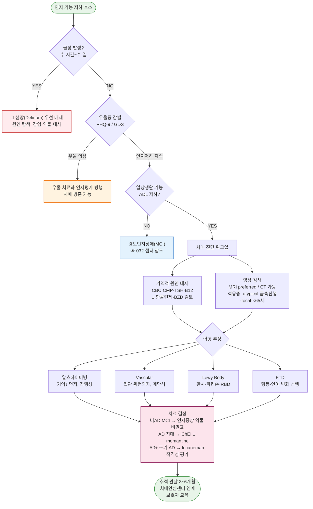
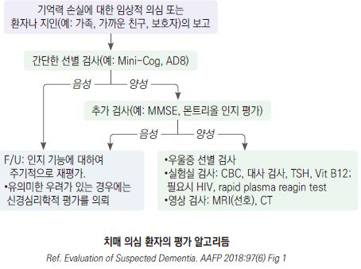

# 치매 Dementia

## <mark style="color:green;">일반 사항</mark>

* 치매는 기억력뿐 아니라 주의력, 집행 기능, 언어, 학습·기억, 지각-운동 또는 사회인지 중 하나 이상의 인지 영역이 이전보다 저하되어 **독립적인 일상생활 수행을 방해하는 임상 증후군**이다. 원인에 따라 진행성, 계단식 또는 비교적 안정된 경과를 보일 수 있으며, 단일 검사 점수만으로 진단하지 않는다.
* 대부분 65세 이후 발생하며 연령이 가장 강한 위험 인자이다. 65세 미만에서도 발생할 수 있으며 이때는 비전형적·유전성·교정 가능한 원인을 포함한 전문 평가가 중요
* 유병률 : [보건복지부가 2025년 발표한 2023년 전국 치매역학조사](https://www.mohw.go.kr/board.es?act=view&bid=0027&list_no=1484959&mid=a10503010100)에서 65세 이상 치매 유병률은 **9.25%**(2016년 9.50%)였다. 조사 정의·연도와 추정방법에 따라 수치가 달라질 수 있으며, 고령화로 환자 절대 수는 계속 증가할 것으로 추정된다.
* 항아밀로이드 단클론항체 lecanemab은 아밀로이드 병리가 확인된 조기 AD의 진행을 지연시키는 약제로 2024년 5월 국내 식약처 허가를 받았으며 **현재 건강보험 비급여**이다. Donanemab은 미국·일본·유럽 등에서 허가되었으나 **2026년 9월 현재 국내 미허가**이다(허가 심사 중이므로 개정 시 재확인).
* 일반적인 증상 완화제는 질병 경과를 변화시키지 못함

#### <mark style="color:$primary;">종류</mark>

* 주요 퇴행성 원인 : 알츠하이머병(AD), 루이소체병, 전측두엽퇴행, 파킨슨병 치매
* 혈관성 인지장애 : 뇌경색·뇌출혈·소혈관질환 등에 의한 인지저하. 이미 발생한 손상이 반드시 가역적인 것은 아니지만 추가 혈관 손상 예방이 중요
* 잠재적으로 교정 가능한 동반·악화 요인 : 약물·독극물, 우울증, 수면무호흡, Vit B12 결핍, 갑상샘기능 이상, 전해질·대사 이상, 시청각 장애
* 특정 치료가 가능한 원인 : 정상압수두증, 경막하혈종, 뇌종양 등 구조적 병변, 신경매독·HIV 등 감염. 이러한 원인이 교정되어도 인지기능이 완전히 회복된다고 보장할 수는 없음

## <mark style="color:green;">원인 및 기전</mark>

* 대부분 명확치 않음

### <mark style="color:orange;">알츠하이머병 (Alzheimer Disease, AD)</mark>

* 고령자 치매의 60\~80% 차지 (흔히 혈관성 병리와 혼합된 형태로 발생; 순수 AD 단독은 생각보다 적음)
* amyloid β 단백 축적, 신경원섬유 엉킴(tau 단백), 시냅스 이상 → 신경 퇴행/사멸
* choline acetyltransferase↓ → acetylcholine synthesis↓ → cholinergic function↓

### <mark style="color:orange;">혈관성 치매 (Vascular dementia)</mark>

* 대뇌 죽상경화증/색전증 → 혈류 감소 → 신경 손상
* 오래 지속된 고혈압, 당뇨병, 뇌졸중 병력 환자에서 흔함. AD와 병발 가능

### <mark style="color:orange;">루이소체치매 (Dementia with Lewy bodies)</mark>

* 뇌세포에서 비정상 단백인 Lewy body(α-synuclein) 형성

### <mark style="color:orange;">전측두엽 치매 (Frontotemporal dementia)</mark>

* tau 또는 TDP-43 단백 이상 집적에 의한 전측두엽 뇌세포 사멸

### <mark style="color:orange;">위험 인자</mark>

#### <mark style="color:$primary;">주요 14가지 위험 인자</mark>

**초기 (Early life)**

* 낮은 교육 수준

**중기 (Midlife)**

* 청력 저하, 고혈압, 비만, 흡연, 과도한 음주, 두부 외상, 고LDL 콜레스테롤

**후기 (Late life)**

* 우울증, 신체 활동 저하, 당뇨병, 사회적 고립, 대기 오염, 미교정 시력 저하

#### <mark style="color:$primary;">그 외 위험 인자</mark>

* 수정 불가 인자 : 고령, 가족력
* 인지·정신 관련 : 경도인지장애(MCI), 수면 장애(수면무호흡증, 수면 분절, 수면 시간 단축)
* 대사·혈관 관련 : 심방세동, 뇌졸중(허혈성/출혈성), 만성콩팥병, 고호모시스테인혈증
* 유전·약물 : APOE ε4 대립유전자 보유, 항콜린제 사용 - 항콜린 부담(anticholinergic burden) 누적은 인지 저하 및 치매 위험을 높임; 대표 약제: TCA, oxybutynin, 1세대 항히스타민(diphenhydramine 등) → 고령 환자에서 정기적 복용 약물 점검 필수

_<mark style="color:$info;">✽ 2024년 Lancet Commission 보고서에서 기존 12가지 위험 인자에 미교정 시력 저하와 고LDL 콜레스테롤을 추가하여 총 14가지로 확대. 약 45%는 인구집단 수준의 이론적 예방가능분율 추산치이며, 모든 위험 인자를 교정하면 개별 환자의 치매 위험이 실제로 45% 감소한다는 뜻은 아님</mark>_

## <mark style="color:green;">임상 양상 및 주요 아형</mark>

### <mark style="color:orange;">알츠하이머병 (Alzheimer Disease, AD)</mark>

* 발생 연령 : 고령(대부분 ＞65세)
* 잠행성 시작, 점진적 진행; 의식 저하는 없음
* 기대 여명 : 진단 후 3\~11년
  * 주요 사망 원인 : 탈수, 영양실조, 감염

#### <mark style="color:$primary;">조기 변화</mark>

* 일상생활에 지장을 주는 기억력 상실 : 이름, 전화번호, 최근의 대화/행동, 중요한 일정
  * 가장 흔한 초기 증상. 즉각적 회상이나 오랫동안 강화된 기억력은 비교적 유지됨
  * 환자가 병식을 잃어 변화를 인지하지 못할 수 있으나, 주관적 인지저하도 향후 객관적 저하 위험과 연관될 수 있으므로 환자 호소를 무시하지 않고 정보제공자 병력과 함께 평가
* 계획 또는 문제 해결 능력 저하. 복잡한 작업 장애(예: 요리), 계산 능력 저하(예: 가계부 관리)
* 익숙한 작업 능력 저하 : 운전, 게임
* 시간이나 장소의 혼동
* 시각적 이미지와 공간적 관계를 이해하기 어려움
* 언어 장애 : 단어, 사물 명칭이 생각나지 않음, 문장 이해력 저하
* 물건을 잘못 배치하고 단계를 추적하는 기능 상실: 물건을 잘 잊거나 잃어 버림
* 판단력/업무 능력 저하 : 초기에는 다양한 수준의 장애. 다중 작업이나 요약에 어려움을 보이며 점차 행동 장애와 연관됨; 판단력이 유지되는 경우에는 우울증과의 감별을 요함
* 성격 및 감정 변화 : 무관심, 위축, 우울, 기타 성격 변화
* 직장 또는 사회 활동에서 멀어짐

#### <mark style="color:$primary;">후기 변화</mark>

* 정신/행동 증상 : 화/공격적 행동(일부에서는 수동적 행동), 환각, 망상
* 방향 감각 상실, 돌아다님(친숙한 장소에서 길을 잃음)
* 기초적 작업 수행 장애 : 식사, 목욕, 옷 입기
* 대소변 실금

#### <mark style="color:$primary;">AD 의심 징후</mark>

1. 업무 능력에 영향을 미치는 기억력 손실
2. 익숙한 업무 수행에 어려움
3. 언어 문제
4. 시간과 장소에 대한 disorientation
5. 판단력 장애 또는 저하
6. 추상적인 사고 장애
7. 상황을 잘못 이해함
8. 기분이나 행동의 변화
9. 성격 변화
10. initiative 상실

#### <mark style="color:$primary;">DSM-5 진단 기준(Major neurocognitive disorder due to Alzheimer's disease)</mark>

A. Major neurocognitive disorder에 부합

* a. 다음의 인지 영역 중 ≥1개에서 이전보다 심각한 장애

> 1. complex attention : 다중 작업, 집중력 유지, 암산 능력 저하
> 2. executive function : 계획 수립, 의사 결정, 오류 수정, 정신적 유연성 등 감퇴
> 3. learning & memory : 같은 말을 반복, 쇼핑 목록을 기억할 수 없음, 자주 상기시켜야 함
> 4. language : 가족 이름 회상, 단어 회상("신발" 대신 "발에 있는 저것"), 문법 능력 저하
> 5. perceptual-motor : 익숙한 장소에서 길을 잃음, 익숙한 활동, 공간 작업 능력 저하
> 6. social cognition : 허용되는 사회적 범위를 벗어나는 행동, 사회적 표준에 대한 무감각, 안전에 대한 고려 없이 작업

* b. 인지 장애는 일상 활동의 수행에 지장을 줌. 예) 청구서 관리, 약물 관리 등의 complex instrumental activities of daily living에 조력자가 필요함
* c. 인지 결손은 delirium의 맥락에서 발생하는 것은 아님
* d. 인지 결손은 우울증, 조현병 등의 다른 정신 질환으로 더 잘 설명되지 않음

B. 하나 이상의 인지 영역에서 장애가 잠행성으로 시작하여 점진적으로 진행

C. 알츠하이머병에 의한 주요 신경인지장애의 확실성

* **Probable Alzheimer's disease** : 다음 중 하나를 충족
  1. 가족력 또는 유전자검사로 확인된 원인성 AD 유전자 변이의 증거가 있음
  2. 다음 세 임상 조건을 모두 충족
     * learning & memory와 최소 하나의 다른 인지 영역에서 분명한 저하
     * 장기간의 뚜렷한 정체기 없이 꾸준하고 점진적인 인지 저하
     * 다른 신경퇴행성·뇌혈관 질환이나 신경학적·정신적·전신 상태 등 mixed etiology의 증거가 없음
* **Possible Alzheimer's disease** : 원인성 유전자 변이의 증거가 없고 위 세 임상 조건을 모두 충족하지는 않지만, 임상적으로 AD가 가능한 경우

D. 이 장애는 뇌혈관 질환, 다른 신경퇴행성 질환, substance의 영향, 또는 다른 정신/신경/전신 질환으로 더 잘 설명되지 않음

#### <mark style="color:$primary;">알츠하이머병의 생물학적 진단·병기</mark>

1. Preclinical AD : AD 증상(-), AD에 대한 biomarker(+)
2. MCI(경도인지장애) due to AD : 표지자(+), 경증 기억력 장애(+), 일상 생활 기능 장애(-)
3. Dementia due to AD : 표지자(+), 기능 장애를 초래하는 인지 능력 저하(+)

* NIA-AA 2018 AT(N) framework는 본래 연구용 기준으로, AD를 아밀로이드(A), tau(T), 신경퇴행(N)의 생물학적 지표로 기술함
* [2024 Alzheimer's Association 개정 기준](https://www.alz.org/research/for_researchers/diagnostic-criteria-guidelines)은 혈액 바이오마커를 포함한 생물학적 진단과 통합 임상·생물학적 병기 체계를 제시함. 다만 **바이오마커 양성은 임상적 치매와 동의어가 아니며**, 무증상 일반인에게 일률적으로 검사하거나 혈액검사 하나만으로 진단·치료하지 않음
* 실제 임상 평가는 [2024\~2025 DETeCD-ADRD 지침](https://alz-journals.onlinelibrary.wiley.com/doi/10.1002/alz.14337)에 따라 환자와 정보제공자의 병력, 객관적 인지평가, 기능 평가, 신경학적 진찰, 단계별 검사, 진단 설명과 상담을 통합

#### <mark style="color:$primary;">AD 바이오마커 계층 (접근성 순)</mark>

<table><thead><tr><th>단계</th><th>검사</th><th>주요 지표</th><th>임상적 역할</th></tr></thead><tbody><tr><td>1단계</td><td><strong>혈액</strong></td><td>p-tau217 기반 검사, Aβ42/40 ratio 등</td><td>AD 병리 가능성의 보조·선별 평가; 단독 확진·무증상 선별용 아님</td></tr><tr><td>2단계</td><td><strong>CSF</strong></td><td>Aβ42, total tau, p-tau</td><td>AD 병리 확인; 침습적이나 PET 대비 저비용</td></tr><tr><td>3단계</td><td><strong>Amyloid PET</strong></td><td>뇌 아밀로이드 침착 직접 시각화</td><td>AD 병리 확인; 항아밀로이드 치료 적격성 평가</td></tr></tbody></table>

_<mark style="color:$info;">✽ 2025년 FDA가 허가한 최초의 혈액 기반 AD 진단 보조검사는 Lumipulse G pTau217/β-amyloid 1-42 plasma ratio이다. 55세 이상 인지저하 증상이 있는 환자의 평가를 보조하며, 무증상 선별 또는 단독 확진검사가 아니다. 국내에서는 연구·비급여 검사 또는 제한된 기관 중심으로 도입 상황이 달라 검사실의 분석법·검증 상태·적용 대상과 가용 여부를 기관별로 확인한다.</mark>_

#### <mark style="color:$primary;">NINCDS-ADRDA 진단 기준</mark>

* NINCDS-ADRDA 기준(1984년)은 NIA-AA 2011/2018 기준으로 대체되었으나, 임상 현장에서 여전히 참고됨

**Definite AD**

* probable AD criteria에 부합하고, 부검 또는 생검에서 알츠하이머병에 합당한 조직병리학적 소견

**Probable AD**

* clinical & neuropsychological 검사를 통해 확인함(예: MMSE, Blessed dementia scale)
* 두 개 이상의 인지 영역의 결함
* 기억력 및 기타 인지 기능의 점진적 악화
* 의식 장애는 없음
* 40\~90세에서 발병(대부분 65세 이후에 발병)
* 기억과 인지 장애의 점진적인 진행을 설명할 수 있는 전신 장애 또는 다른 뇌 질환은 없음

**Possible AD**

* 치매를 유발하기에 충분한 다른 신경, 정신 또는 전신 장애가 없으며, 개시, 양상 또는 경과에 변수가 존재함
* 치매를 유발할 수 있는 제2의 전신 질환이나 다른 뇌 질환이 있으나, 환자에게서 보이는 치매의 원인으로 여겨지지 않음
* 다른 식별 가능한 원인이 없는 상태에서 하나의 점진적인 중증 인지적 결함이 확인됨

**Unlikely AD**

* 갑작스런 발병
* 국소 신경학적 증상(편마비, 감각 장애, 시야 장애, 초기에 나타나는 균형 장애)
* 질병의 시작 또는 매우 이른 시기에 나타난 발작 또는 보행 장애

### <mark style="color:orange;">혈관성 치매 (Vascular dementia)</mark>

* 인지 결핍의 시작이 혈관 사건 발생과 관련이 있음
* 인지 능력의 저하는 정보 처리 속도, 복잡한 주의력 및 frontal-executive 기능에서 현저함

#### <mark style="color:$primary;">ICD-10 진단 기준</mark>

A.치매의 일반 기준에서 기술한 대로 특정 수준의 중증도를 가진 인지 기능의 쇠퇴와 장애의 증거

B. higher cognitive function에서의 균등하지 않은 장애. 장애가 있는 부분이 있고 그렇지 않은 부분이 있음. 기억에는 심한 장애가 있으면서 사고, 추론, 정보 처리 과정 등에서는 아주 경미한 장애만 가질 수 있음

C. 다음 중 하나 또는 그 이상의 국소적 뇌 손상의 증거가 있음

> 1. 사지의 편측 강직성 약화
> 2. 편측 심부 건반사 항진
> 3. extensor plantar response
> 4. pseudobulbar palsy

D. 병인으로서 치매와 관련되었다고 판단할 만한 중요한 뇌혈관 질환의 병력, 진찰, 검사 증거가 있음

* 민감도 70%, 특이도 80%

### <mark style="color:orange;">루이소체치매(Dementia with Lewy bodies; DLB)</mark>

* 파킨슨 운동 증상이 시작되기 전 또는 1년 이내에 인지 장애 발생 (파킨슨 치매와의 감별 기준)
* Lewy body : 뇌간, 변연계, 전뇌 및 신피질에 α-synuclein 및 ubiquitin을 함유하는 intraneuronal inclusion
* 주의력 및 executive 기능 결함이 서서히 진행
* 2017 DLB Consortium 핵심 임상 특징 : 인지 변동, 반복적이고 구체적인 환시, REM수면행동장애, 자발성 파킨슨증
* 지지 바이오마커 : 선조체 dopamine transporter 섭취 감소, MIBG 심근섭취 감소, 수면다원검사에서 REM수면 무긴장 소실
* 신경이완제(항정신병제)에 대한 과민 반응 → 루이소체치매에서는 항정신병제 사용 시 심각한 부작용 위험
* 항정신병제 치료주의 : 루이소체치매 환자에게 항정신병제(특히 haloperidol 등 전형적 항정신병제)를 투여하면 심각한 파킨슨 증상 악화, 신경이완제 악성 증후군 및 사망 위험이 증가하므로 **강력히 회피**. 불가피한 경우에도 전문의 판단 아래 quetiapine 등을 저용량으로 신중히 사용하며, 효과와 안전성이 보장되는 것은 아님
* DLB와 파킨슨병 치매의 1년 규칙은 임상적 명명 규칙이며, 서로 완전히 다른 병태생리라는 의미는 아님


**DLB의 neuroleptic sensitivity**

Haloperidol 등 전형적 항정신병제는 급격하고 심한 파킨슨증 악화, 의식저하, 자율신경 불안정, 신경이완제 악성증후군 및 사망을 초래할 수 있으므로 강력히 회피한다. 항정신병제가 불가피하면 먼저 섬망·통증·감염·약물·환경 요인을 교정하고 전문의와 상의한다.


### <mark style="color:orange;">전측두엽 치매(Frontotemporal dementia; FTD)</mark>

* 전두엽 및 측두엽에 주로 영향을 미치는 일차적인 신경 퇴행성 질환 그룹; 유전 경향 있음
* 점진적 발병 및 악화
* 조기에 현저한 성격 및 행동 변화(예: executive 기능 장애, 무관심, social cognition 악화, 반복적 행동 및 식이 변화), 언어 결함(paraphasias, anomia, 유창성 감소). Progressive supranuclear palsy, corticobasal syndrome, amyotrophic lateral sclerosis와 임상·병리학적으로 중첩될 수 있음
* 기억력, 시공간 능력은 비교적 유지됨
* tau 또는 TDP-43 단백병증이 주된 기전(AD와는 다른 기전)

### <mark style="color:$danger;">🚩 Red Flags!</mark>

<mark style="color:$danger;">**즉각 의뢰 또는 이송**</mark>

* **급성(수 시간\~수 일) 인지 기능 저하** : 섬망(delirium)을 우선 배제 - 원인(감염, 약물, 대사 장애 등) 탐색 및 즉각 처치
* 새 국소신경학적 결손, 경련, 발열·수막자극징후, 최근 두부외상 또는 의식수준 저하 동반
* 자살·타해 위험 또는 심한 초조·정신병적 증상으로 환자와 주변 사람의 안전을 유지하기 어려움

<mark style="color:$warning;">**신속 의뢰**</mark>

* 수 주\~수 개월 이내 급속히 진행하는 인지 기능 저하(Rapidly Progressive Dementia, RPD) → 긴급 전문 평가; 감별: CJD, 자가면역뇌염, 부종양 증후군, 대사 장애, 감염, 뇌종양 등
* 뚜렷한 파킨슨 증상(안정 시 떨림, 경축, 보행 장애) 동반
* 시각적 환각, 초기 렘수면행동장애 동반(루이소체치매 가능성)
* 뚜렷한 언어·행동·인격 변화가 기억력 장애보다 선행(전측두엽 치매 가능성)
* 보행 장애·요실금·인지 저하의 삼증 동반(정상압수두증 가능성)
* 조기 AD 의심 시 항아밀로이드 치료 적격성 평가 고려
* 조기 발생 인지장애(＜65세) 또는 비전형적 경과

<mark style="color:$info;">**외래 추적 / 추가 평가 계획**</mark> <mark style="color:$info;">- 즉각 위험 낮으나 호전 없으면 의뢰</mark>

* 가족이 먼저 알아채는 서서히 진행하는 기억력·판단력 저하(치매 초기 가능성)
* 우울 또는 약물(항콜린제·진정제·수면제) 치료 후 인지 기능 재평가 필요 시
* 경도인지장애(MCI) 진단 후 추적 관찰 중 일상생활 기능 저하 발생 시

## <mark style="color:green;">진단</mark>

#### <mark style="color:$primary;">진단 과정</mark>

1. 객관적인 변화 : 환자를 잘 아는 사람에 의해 관찰되는 인지 및 행동 변화
2. 약물, 외상 등 다른 원인 배제
3. 인지 평가 및 진단 기준 해당 여부 확인
4. 실험실 및 영상 검사

### <mark style="color:orange;">선별 검사 : 인지 기능 검사</mark>

* 증상이 없는 고령자에 대한 일률적인 인지 장애 선별 검사는 권고하지 않음
* 인지 장애 병력(+) & 인지 검사 정상 → 경증 치매, 높은 지적 수준, 우울 가능성 고려
* 인지 장애 병력(-) & 인지 검사 이상 → 급성 혼돈 상태, 매우 낮은 지적 수준, 병력 정보 오류 가능성 고려

#### <mark style="color:$primary;">검사 대상</mark>

* 인지 변화 : 건망증, 말과 글을 이해하는 데 어려움, 단어를 찾는데 어려움, 상식적인 사실을 모름, 방향 감각 장애 등의 증가
* 정신적 증상, 성격 변화 : 위축, 둔함, 무관심, 불면증, 우울, 불안, 두려움, 경박함, 부적절한 친절, 의심, 쉽게 좌절, 감정 폭발, 편집증, 비정상적인 신념, 환각
* 문제 행동 : 방황, 동요, 소란함, 불안정, 수면 중 잠자리에서 벗어남
* 일상 기능의 변화 : 운전 곤란, 쇼핑 곤란, 길 잃음, 요리 방법 잊음, 자기 관리 방치, 집안일 방치, 금전 관리 어려움, 이전에 하지 않던 실수

#### [<mark style="color:$primary;">Mini-Cog test</mark>](https://mini-cog.com/wp-content/uploads/2022/09/KOREAN-Mini-Cog.pdf)

* 장점 : 약 3분 내 시행 가능하며 기억과 시공간·집행 기능을 함께 선별
* 문맹, 시력 저하, 운동 장애가 있는 경우 시계 그리기 점수가 실제 인지 기능보다 낮을 수 있음
* 선별검사일 뿐 치매 확진검사가 아니며, 양성 또는 임상 의심이 지속되면 정보제공자 면담, 기능 평가와 정밀 인지평가를 시행

1. 3단어 등록 : 서로 관련 없는 단어 3개를 듣고 반복하게 함(등록 단계는 채점하지 않음)
2. 시계 그리기 : 원 안에 숫자를 배치하고 **“11시 10분(11시에서 10분 지난 시각)”**을 표시하게 함
3. 지연 회상 : 처음 제시한 단어 3개를 단서 없이 회상하게 함
4. 채점 : 회상 0\~3점＋정상 시계 2점(비정상 또는 거부 0점)=총 0\~5점
   * ＜3점 : 표준적으로 인지장애 선별 양성, 추가 평가 필요
   * 민감도를 우선할 때는 ＜4점을 추가 평가 기준으로 고려할 수 있음

#### [<mark style="color:$primary;">K-MMSE</mark>](https://www.jkna.org/upload/pdf/200304004.pdf) <mark style="color:$primary;">(Mini-Mental State Examination)</mark>

* 점수 구성 : 시간 지남력 5점, 장소 지남력 5점, 기억 등록 3점, 기억 회상 3점, 주의 집중 및 계산 능력 5점, 언어 능력 8점, 시각 구성 1점(총 30점)

* 총점만으로 정상·치매 또는 중증도를 확정하지 않으며, 검사판에 맞는 연령·교육수준별 국내 규준과 환자의 기저 기능을 적용하여 해석
* 경증 치매에 민감하지 않고 언어·운동·시각 장애, 연령, 교육수준에 영향을 받으며 천장 효과로 초기 AD 및 전측두엽 치매의 변별력이 낮음
* 초기 치매가 의심되나 MMSE 점수가 높게 나오는 경우, K-MoCA를 병행하여 집행 기능과 시공간 능력을 재평가할 것 (☞ [경도인지장애](032_-mild-cognitive-impairment-mci.md#k-moca))

#### <mark style="color:$primary;">**한국판 몬트리올 인지평가 (**</mark>[<mark style="color:$primary;">K-MoCA</mark>](https://accesson.kr/kjcp/assets/pdf/16582/journal-28-2-549.pdf)<mark style="color:$primary;">)</mark>

☞ [경도인지장애](032_-mild-cognitive-impairment-mci.md#k-moca)

#### <mark style="color:$primary;">한국판 확장판 임상 치매 평가 척도 (</mark>[<mark style="color:$primary;">Expanded clinical dementia rating, CDR</mark>](https://www.jkna.org/upload/pdf/200106005.pdf)<mark style="color:$primary;">)</mark>

* 여섯 가지 항목으로 전반적인 인지 및 사회 기능을 평가
  1. 기억력
  2. 지남력
  3. 판단력과 문제 해결 능력
  4. 사회 활동
  5. 집안 생활과 취미
  6. 위생 및 몸치장
* 환자와 보호자와의 자세한 면담을 통하여 각 영역에 대하여 0, 0.5, 1, 2, 3, 4, 5점을 부여
* 판정 : 합산 점수에 따른 판정과 기억력 검사를 기준으로 결정하는 방법이 있음; 0점=치매 아님, 0.5점=의심, 1점=경증, 2점=중등도, 3점=중증, 4점=매우 중증, 5점=말기 치매
* AD 환자의 전반적인 인지, 사회적 기능 정도 평가, 치매 환자의 중증도 평가
* 뇌졸중으로 인한 마비 등 신체적 질병과 사회적, 정서적 문제로 인한 기능 저하는 평가에서 고려하지 않음

#### <mark style="color:$primary;">한국판 Global Deterioration Scale(</mark>[<mark style="color:$primary;">GDS</mark>](https://www.jkna.org/upload/pdf/200206005.pdf)<mark style="color:$primary;">)</mark>

* 판정 : 1점=없음, 2점=매우 경미, 3점=경미, 4점=중등도, 5점=초기 중증, 6점=중증, 7점=후기 중증 인지 장애
* 퇴행성 치매의 중증도를 평가
* CDR과는 달리 단계별로 인지 장애 정도를 구체적인 예를 들어 기술, 상대적으로 짧은 시간에 판단할 수 있음
* 초기 인지 장애의 평가에서는 CDR보다 우수, 중증의 인지 장애의 구분에는 민감하지 않음

#### <mark style="color:$primary;">CIST (인지선별검사, Cognitive Impairment Screening Test)</mark>

* 개요 : 국가 치매검진사업에 활용이 용이하고 인지기능저하 변별력이 우수한 도구로 개발되어 2021년 1월 1일부터 적용 중. 기존 MMSE-DS(MMSE-KC)를 대체한 **국가치매검진사업의 표준 1차 선별검사**
* 검사 구성 : 지남력, 기억력, 주의력, 언어기능, 시공간 기능, 집행기능으로 총 13문항, 30점 만점이며 검사 시간은 약 5\~10분 소요
* 시행 방식 : 검사자와 대상자의 1:1 문답 및 지필문항으로 시행하며, 인지저하 의심 여부 판단을 위한 연령·학력별 규준을 제공
* 사용 제한 : 저작권자- 보건복지부, 검사지 사용 전 국가치매교육 홈페이지(edu.nid.or.kr)에서 치매선별검사 수행교육(CIST)을 이수해야 함
* K-MMSE와의 관계 : CIST와 K-MMSE-2 총점 간 높은 상관관계가 보고되었지만 서로 다른 검사이다. CIST는 총 30점이라도 연령·학력별 규준에 따라 인지저하 의심 여부를 판정하므로 K-MMSE 점수나 절단점으로 일대일 환산하지 않음

#### <mark style="color:$primary;">1차 진료용 상황별 인지 기능 검사 가이드 안</mark>&#x20;

   (입증된 프로토콜은 아님)

1. 시간이 부족할 때 (3\~5분) → **Mini-Cog**
   * 민감도가 높고 교육 수준 영향이 적음.
   * 주의: 문맹·시력 저하 시 '시계 그리기'가 부적합할 수 있으므로 임상 판단으로 보완.
2. 기본 선별 (7\~10분) → **K-MMSE**
   * 가장 광범위하게 사용. 점수와 임상상이 불일치하거나 초기 장애가 의심되면 K-MoCA 등 추가 평가.
   * 해석: 검사판에 맞는 연령·학력별 국내 규준값을 적용하며 고정 절단점만으로 판정하지 않음.
   * 참고: **국가치매검진사업의 표준 1차 검사는 CIST**이다. 보건소·치매안심센터 연계 시 CIST의 연령·학력별 판정 결과를 확인하고 K-MMSE 점수와 직접 환산하지 않음.
3. 경증 치매·집행 기능 의심 (10\~15분) → **K-MoCA**
   * MMSE의 천장 효과(Ceiling effect) 보완. 경도인지장애(MCI) 감별에 우수.
4. 중증도 평가 (15\~20분) → **CDR** 또는 **GDS**
   * 치매 단계(Staging) 평가, 경과 추적 및 장기요양등급 판정의 핵심 근거.

**가정·대기실 자가 모니터링**

* 중앙치매센터-[치매위험체크](https://m.nid.or.kr/riskcheck/riskcheck_step02.aspx)(KDSQ) : 15문항
* 진료 전 대기실에서 미리 작성하게 하여 면담 효율화 가능
* 결과 이상 시 치매안심센터(☎ 치매상담콜센터 1899-9988) 연계

### <mark style="color:orange;">실험실/영상 검사</mark>

* 치매의 원인 감별, 치매 상태 평가, 치매로 인한 영양 상태 저하 감별 목적
* 기본 평가 : CBC, 전해질·칼슘, 혈당, Vit B12, RFT, LFT, TSH와 우울 선별 등. 이를 일률적으로 '가역적 치매 검사'라고 부르기보다 인지·행동 증상을 유발하거나 악화시키는 동반 상태를 확인하는 검사로 설명
* 선택 검사 : 위험과 임상상에 따라 syphilis, HIV, folate, ESR/CRP, MRI 또는 CT, 기능·분자영상, EEG, 요추천자, 자가면역·감염·독성 검사 등을 단계적으로 시행
* AD의 MRI 소견 : brain atrophy(보통 비특이적), hippocampal volume 감소

#### <mark style="color:$primary;">영상 검사</mark>

* 우리나라 지침에서는 치매 진단 시 뇌 영상 검사(MRI 또는 CT)를 기본 검사로 권고
* **MRI 우선** : 구조적 원인(뇌졸중, 뇌종양, 뇌수두증, 백질 변성 등) 감별에 CT보다 우수
* **CT 허용** : MRI 촬영 불가 환자(금속 삽입물, 폐쇄 공포증, 협조 어려움)에서 대체 가능
* 다음 경우는 영상 검사를 **적극 시행**
  * 비전형적 임상 양상 (atypical presentation)
  * 급속 진행하는 인지 저하 (수 주\~수 개월 이내)
  * 국소 신경학적 징후 (focal deficit)
  * 65세 미만 조기 발생
  * 낙상·두부 외상 병력 또는 항응고제 사용 중인 경우

#### <mark style="color:$primary;">AD 표지자(biomarker)</mark>

* 영상 : AD 환자의 뇌에서 증가한 Aβ(amyloid)와 tau 단백질을 PET으로 촬영
* 뇌척수액 : 뇌의 신경 퇴화가 진행됨에 따라 뇌에 Aβ가 축적되고 amyloid plaque가 형성되는 한편 CSF에서는 Aβ가 감소함; 뇌신경세포 사멸에 따라 세포 밖으로 흘러나온 tau 단백질이 CSF에서 증가함
* 혈액 바이오마커 : 임상 활용이 확대 중이나 검사법별 성능·절단점과 적용 대상이 다름
  * Lumipulse G pTau217/β-amyloid 1-42 plasma ratio : 2025년 FDA가 55세 이상 인지저하 증상 환자의 AD 진단 보조검사로 허가. 무증상 선별 또는 단독 확진용이 아님
  * Aβ42/40 비율, neurofilament light chain(NfL), GFAP 등 추가 마커 연구 중
  * 혈액검사 결과만으로 치매를 진단하거나 항아밀로이드 치료를 결정하지 않으며 임상상과 함께 해석. 국내 lecanemab 치료 전에는 amyloid PET 또는 CSF 검사로 Aβ 병리를 확인

### <mark style="color:orange;">감별</mark>

* 정상 노화 관련 인지 기능 저하 : 기능 장애는 없으며 일상생활에 심각한 장애를 일으키지는 않는 정도의, 비진행성의 가벼운 기억력 저하, 새로운 정보 습득의 어려움
* 경도인지장애 : 인지 기능의 감소; 일상생활 능력은 유지됨 (☞ [경도인지장애](032_-mild-cognitive-impairment-mci.md))
* 섬망 : 불안정, 집중력 변화 (치매의 경우 집중력은 어느 정도 보존됨)
* **우울증성 인지장애(과거 '가성치매[pseudodementia]'로 표현)** : 우울, 불안, 불면, 의욕저하와 함께 주의·기억·집행 기능 저하가 나타날 수 있음. '가성'이라는 표현과 달리 실제 기능장애가 있으며 별개의 정식 진단명은 아님. 우울과 신경퇴행성 질환은 병존할 수 있으므로 우울 치료 반응만으로 치매를 배제하지 않고 인지·기능 경과를 함께 추적
* 약물 기인 : 항콜린제, 항히스타민제, 수면제, 항경련제, 진정제, 아편제, 알코올
* 시력 저하, 청력 저하, 영양 결핍, 전해질 장애, 뇌종양, 뇌 손상(예: 외상, 감염)
* LATE (Limbic-predominant Age-related TDP-43 Encephalopathy) : 80세 이상 초고령층에서 AD와 유사한 기억력 저하를 보이나, 아밀로이드 축적은 없으며 TDP-43 단백병증이 원인; 뇌척수액·혈액 아밀로이드 바이오마커 음성이면서 AD 유사 증상이 있는 초고령 환자에서 고려; 부검으로만 확진 가능. AD와 동반되는 경우도 흔함

#### <mark style="color:$primary;">고령자 인지 장애 감별</mark>

<table><thead><tr><th>상태</th><th>주요 병력</th><th>진찰 소견</th><th>영상·검사 단서</th><th>비고</th></tr></thead><tbody><tr><td>정상 노화</td><td>처리·회상이 느려질 수 있으나 독립적 기능 유지</td><td>특이 소견 없음</td><td>연령 관련 변화 가능</td><td>진행성 기능 저하가 있으면 정상 노화로 보지 않음</td></tr><tr><td>MCI</td><td>객관적 인지저하가 있으나 독립성은 대체로 유지</td><td>원인에 따라 다양</td><td>원인에 따라 다양</td><td>AD로 인한 MCI인지 평가</td></tr><tr><td>AD</td><td>잠행성·점진적 기억저하가 흔함</td><td>초기에는 정상일 수 있음</td><td>내측 측두엽·두정엽 위축, Aβ·tau 바이오마커</td><td>비전형적 언어·시각형도 있음</td></tr><tr><td>혈관성 인지장애</td><td>혈관 위험, 뇌졸중 병력, 계단식 또는 처리속도·집행기능 저하</td><td>국소신경학적 징후 가능</td><td>경색·출혈·백질질환</td><td>AD와 혼합병리 흔함</td></tr><tr><td>DLB/PDD</td><td>인지 변동, 구체적 환시, RBD, 파킨슨증</td><td>경직·서동·자율신경장애</td><td>DAT 영상, MIBG, PSG가 진단을 지지</td><td>임상적으로 1년 규칙 적용</td></tr><tr><td>FTD</td><td>행동·인격 또는 언어 변화가 선행</td><td>전두엽 해제 징후, 운동신경·추체외로 징후 가능</td><td>전두·전측두엽 위축</td><td>초기 기억·시공간 기능이 상대적으로 보존될 수 있음</td></tr><tr><td>RPD</td><td>수 주~수 개월에 빠르게 진행</td><td>원인별 소견; myoclonus 등</td><td>MRI·EEG·CSF 등 긴급 원인평가</td><td>즉시 또는 긴급 전문 평가</td></tr><tr><td>섬망</td><td>급성 발병, 하루 중 변동</td><td>부주의·의식수준 변화</td><td>감염·약물·대사 등 원인 탐색</td><td>치매와 병존 가능</td></tr></tbody></table>

_<mark style="color:$info;">MCI=mild cognitive impairment, VaD=vascular dementia, DLB=dementia with Lewy bodies, PD=Parkinson dementia, FTD=frontotemporal dementia, CTE=chronic traumatic encephalopathy, RPD=rapidly progressive dementia Ref. Ferri's clinical advisor 2024. Table 2.</mark>_

#### <mark style="color:$primary;">Hachinski ischemic score</mark>

1. AD와 혈관성 병인의 가능성을 가늠하는 과거의 보조 척도이며, 현재는 병력·신경학적 진찰과 MRI를 종합하여 판단하므로 이 점수만으로 아형을 진단하지 않음
2. 다음 각 항목에 대하여 2점씩 부여
   1. 갑자기 발생
   2. 증상 변동이 있음
   3. 뇌졸중 병력
   4. 국소 신경학적 증상
   5. 국소 신경학적 징후
3. 다음 각 항목에 대하여 1점씩 부여
   1. emotional incontinence(예: 비정상적인 울음/웃음)
   2. 계단식 진행
   3. 고혈압 병력
   4. nocturnal confusion
   5. 죽상경화증 관련 증거
   6. personality는 비교적 유지
   7. 우울
   8. 신체 증상 호소

* 판정 : 0\~4점=AD, 5\~6점=경계, 7\~18점=혈관성 치매 (민감도 및 특이도 89%)

#### <mark style="color:$primary;">치매·우울·섬망의 핵심 감별</mark>

<table><thead><tr><th>특징</th><th>주요 신경인지장애</th><th>우울증</th><th>섬망</th></tr></thead><tbody><tr><td>시작·경과</td><td>대개 잠행성, 원인에 따라 점진적·계단식</td><td>수 주~수 개월, 삽화성 가능</td><td>수 시간~수 일, 하루 중 변동</td></tr><tr><td>주의력·각성</td><td>초기에는 비교적 유지되나 DLB 등에서는 변동 가능</td><td>저하될 수 있으나 의식수준은 정상</td><td>부주의와 각성수준 변동이 핵심</td></tr><tr><td>기능</td><td>치매에서는 독립적 일상기능 저하</td><td>의욕저하로 수행이 감소할 수 있음</td><td>급격한 기능 변화</td></tr><tr><td>관계</td><td colspan="3">서로 배타적이지 않으며 치매 환자에게 우울과 섬망이 동반될 수 있음</td></tr></tbody></table>

***


```mermaid
flowchart TD
    A([인지 기능 저하 호소]) --> B{급성 발생?\n수 시간~수 일}
    B -- YES --> C["🚨 섬망(Delirium) 우선 배제\n원인 탐색: 감염·약물·대사"]
    B -- NO --> D{우울증 감별\nPHQ-9 / GDS}
    D -- 우울 의심 --> E["우울 치료와 인지평가 병행\n치매 병존 가능"]
    D -- 인지저하 지속 --> F{일상생활 기능\nADL 저하?}
    F -- NO --> G["경도인지장애(MCI)\n☞ 032 챕터 참조"]
    F -- YES --> H[치매 진단 워크업]
    H --> I["가역적 원인 배제\nCBC·CMP·TSH·B12\n± 항콜린제·BZD 검토"]
    H --> J["영상 검사\nMRI preferred / CT 가능\n적응증: atypical·급속진행·focal·<65세"]
    I --> K{아형 추정}
    J --> K
    K --> L["알츠하이머병\n기억↓ 먼저, 잠행성"]
    K --> M["Vascular\n혈관 위험인자, 계단식"]
    K --> N["Lewy Body\n환시·파킨슨·RBD"]
    K --> O["FTD\n행동·언어 변화 선행"]
    L --> P["치료 결정\n비AD MCI → 인지증상 약물 비권고\nAD 치매 → ChEI ± memantine\nAβ+ 조기 AD → lecanemab 적격성 평가"]
    M --> P
    N --> P
    O --> P
    P --> Q(["추적 관찰 3~6개월\n치매안심센터 연계\n보호자 교육"])

    style A fill:#e8f5e9,stroke:#388e3c
    style C fill:#ffebee,stroke:#c62828
    style E fill:#fff3e0,stroke:#ef6c00
    style G fill:#e3f2fd,stroke:#1565c0
    style Q fill:#e8f5e9,stroke:#388e3c
    style P fill:#fce4ec,stroke:#880e4f
```

<p align="center"><strong>치매 1차 진료 임상 판단 알고리즘</strong></p>

<p align="center"><em><mark style="color:$info;">Ref. 처방가이드 033 편집 알고리즘 (2025)</mark></em></p>

***

<figure><figcaption><p>원문의 AD8은 국내에서 KDSQ(한국판 치매선별질문지)로 대체 가능.<br>Mini-Cog → K-MMSE → K-MoCA 순서의 단계적 접근은 본 챕터 '상황별 인지 기능 검사 가이드'를 참조</p></figcaption></figure>

***

## <mark style="background-color:$warning;">Management</mark>

### <mark style="color:orange;">관리 원칙 및 사회적 지원</mark>

* 진단명뿐 아니라 현재 인지·기능 단계, 원인·혼합병리, 동반질환, 환자 목표와 보호자 상황에 따라 개별 관리계획을 수립
* 안전·의사결정 : 운전, 약물·금전 관리, 화기·가스 사용, 실종·낙상 위험을 정기적으로 평가. 환자가 의사결정능력을 유지할 때 향후 치료·돌봄 선호와 대리의사결정자를 논의
* 보호자에게 환자와의 의사소통·갈등 완화법을 교육하고 보호자 부담, 우울, 수면과 건강상태를 확인
* 사회적 자원 연계
  * 치매안심센터 : 진단 후 관할 치매안심센터 등록을 안내하여 치료관리비 지원, 배회감지기 등 안전용품, 가족교육·상담 프로그램 이용
  * 노인장기요양보험 : 장기요양등급 신청 안내; 의사소견서에는 인지기능뿐 아니라 ADL과 실제 타인 의존도를 구체적이고 객관적으로 기록

### <mark style="color:orange;">비-약물 치료 및 예방</mark>

* BPSD에서는 섬망, 통증, 변비, 요폐, 감염, 탈수, 수면 문제, 약물, 시청각 장애와 환경 요인을 먼저 찾아 교정
* 일정한 일과와 익숙한 환경을 유지하고 과도한 자극을 줄이며, 환자 능력에 맞춘 운동·인지자극·음악·회상·사회활동을 제공
* 혈압·당뇨병·고LDL 콜레스테롤, 청력·시력 저하, 흡연, 신체활동 저하 등 교정 가능한 위험 인자를 관리(☞ [경도인지장애](032_-mild-cognitive-impairment-mci.md#management))
* 커피·차와 치매 위험의 관찰연구 결과는 일관되지 않으므로 치매 예방 목적으로 섭취를 권하지 않으며 개인의 수면·심혈관 상태를 고려해 과도한 섭취를 피함

※ 국가치매검진사업은 선별검사 → 진단검사(신경심리검사) → 감별검사(영상·혈액검사) 단계로 연계한다.

## <mark style="color:green;">약물 치료</mark>

#### <mark style="color:$primary;">알츠하이머병</mark>

* 1차 선택 : cholinesterase 억제제
* 추가 : 중증 또는 효과 부족 시 N-methyl-D-aspartate 수용체 길항제의 병용을 고려
* 평가 : 시작·증량 후 2\~4주에는 부작용, 맥박, 체중과 순응도를 평가하고, 인지·일상기능·행동 및 보호자 관찰을 충분한 치료기간 후 종합 평가. 안정 시 매 3\~6개월 추적
* 명백한 호전이 없어도 악화 지연이 이득일 수 있으므로 6\~8주 무호전만으로 자동 중단하지 않음. 중대한 부작용, 순응 불가, 치료 목표와 불일치, 충분한 치료 후 의미 있는 이득이 없다고 공동 판단한 경우 점진 감량하며, 중단 후 악화하면 재시작 고려

#### <mark style="color:$primary;">혈관성 치매</mark>

* 혈압·당뇨병·지질·심방세동·흡연 등 추가 뇌혈관 손상 위험을 관리
* 순수 혈관성 치매에서 ChEI 또는 memantine의 효과는 제한적이며 일률적으로 사용하지 않음. AD 혼합병리 가능성과 환자별 이득·위험을 평가

### <mark style="color:orange;">인지 증상 치료제</mark>

#### <mark style="color:$primary;">Cholinesterase 억제제 (ChEIs)</mark>

* 치매 1차 치료제 (☞ [보험기준](https://www.hira.or.kr/rc/insu/insuadtcrtr/InsuAdtCrtrPopup.do?mtgHmeDd=20250501\&sno=2\&mtgMtrRegSno=0003))
* 기전 : acetylcholinesterase 억제 → acetylcholine 분해 감소 → 시냅스 내 cholinergic transmission 증가
* 효과 : 인지·일상기능·전반적 상태의 저하를 소폭 지연할 수 있으나 질병 병리를 변화시키는 약제는 아니며 개인별 반응이 다름
* 부작용 : 설사, 구역, 식욕 부진, 악몽, 근육 경련, 부정맥(서맥), 실신; 빈도는 용량 관련
  * 대처 방법 : 악몽·불면 발생 시 아침 투여를 고려하고, 위장관 증상은 식사와 함께 복용하거나 증량 속도 조절·제형 변경을 고려
  * 위장 장애가 심하거나 복약 순응도가 낮은 경우 : 경구제 대신 패치제(donepezil 패취 또는 rivastigmine 패취)로 전환 고려 → 혈중 농도 안정적 유지 및 위장 부작용 경감
* 주의 : 행동 증상을 악화시킬 수 있으므로 전측두엽 치매에는 투여하지 않음
* 상호 작용 : β-차단제/비이중수용체 칼슘통로차단제(verapamil, diltiazem)/digoxin(심장 전도 장애 → 서맥, 방실 차단 위험 증가; 병용 시 심전도 모니터링 권고), 항콜린제(ChEIs 약효 저하)
* 병용 요법 : 중등도 이상(MMSE ≤20)에서 ChEIs와 memantine 병용이 단독 요법 대비 인지 및 행동 증상 개선에 더 효과적; 급여 기준 충족 시 적극 고려

<table><thead><tr><th width="146.73681640625">성분명 [상품명]</th><th width="339.26318359375">용량 [시작 → 유지]</th><th>비고</th></tr></thead><tbody><tr><td>donepezil<br><mark style="color:blue;">[아리셉트 정]</mark><br><mark style="color:blue;">[도네리온패취]</mark></td><td>• 경구 5 ㎎ qd → 4~6주 후 10 ㎎ qd<br>• 중등도~중증 AD에서 10 ㎎ qd를 최소 3개월 유지한 뒤 필요·내약 시 23 ㎎ qd 고려<br>• 패취 87.5 ㎎을 4~6주간 주 2회(3일과 4일 간격으로 교대) 부착 → 175 ㎎ 주 2회로 증량 가능</td><td>23 ㎎ 제형은 경증 AD의 시작 용량이 아님</td></tr><tr><td>galantamine<br><mark style="color:blue;">[갈란타민]</mark></td><td>• 4 ㎎ bid → 4주마다 4 ㎎ bid 증량, 유지 8~12 ㎎ bid<br>• 서방형 8 ㎎ qd → 4주마다 8 ㎎ qd 증량, 최대 24 ㎎ qd</td><td>간·신장애 시 감량 또는 회피 기준 확인</td></tr><tr><td>rivastigmine<br><mark style="color:blue;">[엑셀론]</mark></td><td>• 1.5 ㎎ bid → 2주 이상 간격으로 증량, 유지 3~6 ㎎ bid<br>• 패취 4.6 ㎎/24 h → 최소 4주 후 9.5 ㎎/24 h, 필요 시 13.3 ㎎/24 h</td><td>간·신장애와 저체중 환자에서 주의; 패취 부착 위치를 매일 변경</td></tr></tbody></table>

#### <mark style="color:$primary;">N-methyl-D-aspartate receptor antagonist</mark>

* 단독 또는 ChEIs와 병용 (☞ [보험기준](https://www.hira.or.kr/rc/insu/insuadtcrtr/InsuAdtCrtrPopup.do?mtgHmeDd=20190201\&sno=1\&mtgMtrRegSno=0006))
* 대상 : 알츠하이머형(뇌혈관 질환 동반 포함)의 중등도·중증 치매로 다음 조건을 동시에 충족하는 경우 급여 인정
  * MMSE ≤20점
  * CDR 2\~3 또는 GDS stage 4\~7
  * ChEIs와 병용 가능; 은행잎추출물(Ginkgo biloba extract) 병용 시 저렴한 1종은 비급여
* 기전 : 신경 보호 작용
* 효과 : 중등도·중증 AD에서 인지·일상기능·행동 또는 전반적 상태의 악화를 소폭 지연할 수 있음. 경증 AD에 일률적으로 사용하지 않으며 전측두엽 치매에는 권고하지 않음
* 부작용 : 어지럼, 두통, 시야 흐림, 부종, 체중 증가, 과민, 혼돈 (✽심각한 부작용은 매우 드묾)
* memantine 속방형 : 5 ㎎ qd로 시작, 1주마다 5 ㎎/d씩 증량하여 유지 10 ㎎ bid(최대 20 ㎎/d) <mark style="color:blue;">[에빅사]</mark>
* memantine 서방형 : 7 ㎎ qd로 시작, 1주마다 7 ㎎씩 증량하여 최대 28 ㎎ qd
* 중증 신장애(Cockcroft–Gault CrCl 5\~29 mL/min) : 속방형 최대 5 ㎎ bid, 서방형 최대 14 ㎎ qd; 중증 간장애에서는 주의

#### <mark style="color:$primary;">항아밀로이드 단클론항체 (Anti-amyloid monoclonal antibodies)</mark>

* **lecanemab** : Aβ soluble protofibril에 결합하는 human IgG1 단클론항체
  * 국내 식약처 허가(2024.5.24), 현재 비급여 : Aβ 병리가 확인된 알츠하이머병으로 인한 MCI 또는 경증 치매
  * 효과 : Clarity AD에서 18개월 CDR-SB 악화를 위약 대비 상대적으로 27% 감소(절대 평균 차이 -0.45점). 증상 회복이나 진행 정지를 의미하지 않음
  * 국내 허가 용법 : 10 ㎎/kg IV, 2주마다 <mark style="color:blue;">[레켐비]</mark>. 미국에서 승인된 18개월 후 월 1회 IV 유지요법 또는 주 1회 피하 유지요법을 국내 허가 용법으로 간주하지 않음
  * 부작용 : ARIA 약 21% 발생
    * ARIA-E (amyloid-related imaging abnormalities - edema/effusion) : 뇌 부종 또는 삼출; MRI FLAIR에서 고신호
    * ARIA-H (hemorrhage/hemosiderosis) : 미세출혈 또는 철침착; MRI T2\*·SWI에서 저신호
    * APOE ε4 보유자, 특히 동형접합자에서 ARIA 위험이 현저히 증가
* **donanemab** : Aβ plaque를 표적으로 하는 human IgG1 단클론항체
  * 미국·일본·유럽 등에서 아밀로이드 병리가 확인된 조기 AD에 허가되었으나 **2026년 9월 현재 국내 미허가** <mark style="color:blue;">[키썬라]</mark>
  * 효과 : TRAILBLAZER-ALZ 2에서 76주간 임상 저하를 위약 대비 유의하게 감소시켰으나, 효과 크기는 평가척도와 tau 병리 수준에 따라 달라짐
  * 미국 최신 용법(국내 사용 불가) : 제1회 350 ㎎ → 제2회 700 ㎎ → 제3회 1,050 ㎎ → 제4회부터 1,400 ㎎ IV, 4주마다. Amyloid PET에서 plaque가 최소 수준으로 감소하면 중단을 고려할 수 있음
  * 부작용 : ARIA 약 24% 발생
    * ARIA-E : 약 20\~24% - 대부분 경증이나 무증상; 심한 경우 두통, 혼돈, 시각 증상
    * ARIA-H : 미세출혈 및 철침착; 대부분 경증
    * APOE ε4 동형접합자에서 ARIA 위험이 현저히 높아 유전자검사와 정기 MRI 모니터링이 중요
* **항아밀로이드 치료 공통 주의사항**
  * 혈액 바이오마커는 보조·선별검사로 활용할 수 있으나 양성만으로 치료하지 않음. 국내 lecanemab 치료 전 amyloid PET 또는 CSF 검사로 Aβ 병리를 확인
  * 치료 전 APOE ε4 유전자검사를 강하게 권고하여 ARIA 위험 설명과 공동 의사결정에 활용. 검사 전후 상담이 필요하며 유전자검사 자체가 모든 허가체계에서 절대적 투여 필수조건인 것은 아님
  * 최근의 적절한 MRI로 미세출혈·표재성 철침착·거대출혈 등 기저 위험을 평가. 국내 허가사항과 국내 사용지침의 일정을 우선 적용하고, FDA는 2025년 8월 lecanemab에 기저 MRI＋제3·5·7·14회 투여 전 MRI를 권고함. 미국 donanemab 허가사항은 기저 MRI＋제2·3·4·7회 투여 전 MRI를 규정
  * 예정된 일정과 관계없이 두통, 혼돈, 시각 이상, 어지럼, 보행장애, 경련 또는 새 국소신경학적 결손이 발생하면 즉시 임상평가와 MRI 고려
  * 항응고제 및 혈전용해제는 특히 뇌출혈 위험이 우려됨. 항혈소판제는 약제 수, 적응증과 기저 MRI 소견을 함께 개별 평가하고 항응고제와 같은 수준의 위험으로 일괄 기술하지 않음
  * 일차 의료에서 직접 처방 대상 아님 - 신경과·인지신경의학 전문의 평가 후 시행


⚠️ **ARIA 발생 시 대응 원칙** (Appropriate Use Recommendations 요약)

ARIA 대응은 ARIA-E/ARIA-H, 증상 유무와 영상학적 중증도를 함께 판단하며 약제별 허가사항을 적용한다.

* 무증상·영상학적 경증 ARIA는 전문의 판단과 면밀한 MRI 추적 아래 투여를 지속할 수 있는 경우가 있음
* 증상이 있거나 영상학적 중등도·중증이면 일반적으로 투여를 보류하고 증상 및 MRI가 안정될 때까지 추적
* 거대뇌출혈, 중증 증상, 재발성 또는 중증 ARIA에서는 영구 중단을 고려
* 두통, 혼돈, 시각 증상, 보행장애, 경련 또는 국소신경학적 결손 시 즉각 신경과 의뢰

_✽ ARIA-E가 허혈성 뇌졸중과 유사하게 나타날 수 있으므로 항아밀로이드 치료 여부와 최근 MRI를 확인하고, 혈전용해제 투여 전 출혈·ARIA 가능성을 긴급 평가_


### <mark style="color:orange;">항정신병제</mark>

* 대상 : 비약물 치료에도 심한 고통이 지속되거나 자·타해 위험이 있는 psychosis, agitation, aggression에서 제한적으로 고려
  * 우선 확인 : 섬망, 통증, 변비, 요폐, 감염, 탈수, 수면 문제, 약물, 시청각 장애와 환경적 요인(소음, 과도한 자극, 조명)을 찾아 교정
* 효과 : 일부 환자의 심한 초조·공격성·정신병적 증상을 줄일 수 있으나 평균 효과는 작고 위해가 커 치료 목표를 명확히 설정
* 부작용 : 인지 기능 저하, 보행 장애(낙상), 추체외로 증상, 심장 전도 장애, 진정, 흡인성 폐렴, 사망률 증가; 고용량, 고령자에서 보다 많이 발생
* 주의: 치매 관련 정신행동 증상 환자에서 항정신병제 사용 시 뇌졸중 및 사망 위험이 유의하게 증가함. 처방 전 환자·보호자에게 반드시 고지할 것
* 최소 유효 용량·최단 기간 사용. 시작 후 적어도 6주마다 필요성과 부작용을 재평가하고, 안정되면 감량·중단을 시도
* 루이소체치매에서는 항정신병제 사용에 주의

#### <mark style="color:$primary;">Atypical antipsychotics</mark>

* 장점 : 추체외로 부작용 위험이 보다 낮음
* 단점 : 뇌졸중 위험 증가; 체중 증가, 당뇨병 환자에서 고혈당과 관련
* 주의 : 혈관 위험이 있는 환자에서 주의 사용
* 용법 : 저용량으로 시작, 1주 간격 조정. 수면 효과를 감안하여 취침 시 투여
* quetiapine : 12.5\~25 ㎎ hs로 시작하여 반응과 내약성에 따라 신중히 조정 <mark style="color:blue;">\[쎄로켈]</mark>
* aripiprazole : 5\~10 ㎎/d <mark style="color:blue;">\[아빌리파이]</mark>
* **brexpiprazole : 미국 허가 용법은 제1\~7일 0.5 ㎎ qd → 제8\~14일 1 ㎎ qd → 제15일부터 목표 2 ㎎ qd; 반응·내약성에 따라 최소 14일 후 최대 3 ㎎ qd** <mark style="color:blue;">[렉설티]</mark>
  * FDA가 2023년 AD 치매 관련 초조에 최초 승인. 국내에서는 2018년 수출용 품목으로만 허가되어 **2026년 9월 현재 국내 시판·처방할 수 없음**
  * 추체외로 부작용 및 진정 부작용이 기존 항정신병제 대비 적은 편; 대사 부작용도 비교적 경미
  * 루이소체치매에서의 안전성 자료는 제한적 - 주의 사용
* olanzapine : 2.5\~10 ㎎/d hs <mark style="color:blue;">\[자이프렉사]</mark>
* risperidone : 0.25\~2 ㎎/d hs <mark style="color:blue;">\[리스페달]</mark>

#### <mark style="color:$primary;">Typical antipsychotics</mark>

* Haloperidol은 급성의 심한 공격성 등에 제한적 효과가 있을 수 있으나 추체외로 증상, QT 연장과 사망 위험 때문에 일상적 BPSD 치료로 사용하지 않음
* 불가피하면 저용량·단기 사용으로 제한하며 DLB에서는 강력히 회피
* haloperidol : 0.5\~2 ㎎/d <mark style="color:blue;">\[페리돌]</mark>

### <mark style="color:orange;">항경련제와 BPSD</mark>

* 전신 경련은 발작 유형과 원인에 따라 별도로 치료하며, 항경련제를 항정신병제 불응 BPSD의 일률적인 2차 약제로 사용하지 않음
* **Valproate는 치매의 초조·공격성에 효과가 없고 부작용 위험이 증가하므로 다른 적응증이 없는 한 사용하지 않음**
* Carbamazepine은 제한된 근거가 있으나 약물상호작용, 저나트륨혈증, 혈액 이상 위험 때문에 전문의 판단이 필요
* Lamotrigine은 BPSD의 표준 치료가 아님

### <mark style="color:orange;">항우울제</mark>

* 대상 : 우울, 불안 증상을 보이는 경우 고려 (☞ [우울증](027_-depression.md#management))
* 효과 : 논란
* 부작용 : 구역/구토, 흥분, 파킨슨 작용, 성 기능 저하
* 1차 선택 : 저용량 SSRI
* citalopram(SSRI) : 10 ㎎/d로 시작; 60세 초과에서는 QT 연장 위험 때문에 최대 20 ㎎/d
* escitalopram : 5\~20 ㎎/d <mark style="color:blue;">\[렉사프로]</mark>
* sertraline : 25\~200 ㎎/d <mark style="color:blue;">\[졸로푸트]</mark>
* venlafaxine(SNRI) : 37.5\~225 ㎎/d <mark style="color:blue;">\[이팩사]</mark>
* paroxetine과 TCA는 항콜린 부작용 문제로 피함

### <mark style="color:orange;">항불안제</mark>

* 대상 : 현저한 불안증, 다른 약제에 반응하지 않는 급성기 불안증
* 용법 : 단기 작용 benzodiazepine 저용량, 단기 사용
* 장기 작용제는 낙상 등의 위험성 있음; 장기 투여 시 행동 이상 악화 위험이 있음
* **장기 사용 주의** : benzodiazepine 장기 투여는 치매 발생 위험 증가와 관련될 수 있으며, 낙상·섬망·인지저하 위험을 높임; 최소 용량·최단 기간 원칙 준수, 가능하면 비약물 접근 우선
* lorazepam : 0.5\~1 ㎎ 필요시 4\~6시간마다 <mark style="color:blue;">\[아티반]</mark>
* oxazepam : 흡수가 늦어 필요시 사용 방법으로는 덜 유용. 5.0\~7.5 ㎎ qd\~qid
* triazolam : 착란, 기억력 장애, 정신병적 행동 유발 우려 <mark style="color:blue;">\[할시온]</mark>

### <mark style="color:orange;">수면 유도</mark>

* 치매 환자의 수면 장애는 비약물 치료(환경 구조화, 광치료, 수면 위생)를 먼저 시도; 약물은 보조적으로 사용 (☞ 상세 용법·용량은 [불면증](029_-insomnia-sleep-disorder.md#management) 참조)
* suvorexant : 경도\~중등도 AD 치매 환자의 불면증 임상시험 근거가 있는 DORA 계열이나, 국내 허가는 일반 성인 불면증 적응증임; 10\~20 ㎎ hs <mark style="color:blue;">\[벨솜라]</mark>
* trazodone : 소규모 연구 근거에 그치므로 진정·기립저혈압·낙상 위험을 고려하여 선택적으로 사용; 25\~100 ㎎ <mark style="color:blue;">\[트리티코]</mark>
* mirtazapine : 우울증·식욕저하가 동반된 경우 선택할 수 있으나 치매 관련 불면의 표준 치료로 권고할 근거는 부족; 7.5\~15 ㎎ <mark style="color:blue;">\[레메론]</mark>
* zolpidem : 고령자는 5 ㎎ hs부터 고려 <mark style="color:blue;">\[스틸녹스]</mark>; 낙상·섬망 위험 때문에 최소 용량·최단 기간 사용
* benzodiazepine은 주간 진정, 내성, 반동성 불면, 인지저하, 낙상, 섬망 등의 위험이 있고 diphenhydramine은 인지 기능에 대한 나쁜 영향, 남성 배뇨 장애를 유발할 수 있으므로 회피

***

### <mark style="color:red;">질병코드</mark>

F00* 알츠하이머병에서의 치매(G30†와 함께 코딩)

F01 혈관성 치매

F02 달리 분류된 기타 질환에서의 치매

F02.0* 피크병에서의 치매(G31.00†와 함께 코딩; 모든 FTD를 일률적으로 이 코드로 분류하지 않음)

F02.3* 파킨슨병에서의 치매(G20†와 함께 코딩)

F02.8* 루이소체치매 등 달리 분류된 기타 명시된 질환에서의 치매

F03 상세불명의 치매

G30† 알츠하이머병

G31.00† 피크병

G31.82† 루이소체치매(F02.8*와 함께 코딩)

_<mark style="color:$info;">✽ 원인질환과 치매 발현을 함께 표시하는 별표·검표 코드는 실제 진단과 최신 KCD 지침에 따라 적용.</mark>_

***

## <mark style="color:purple;">처방례</mark>

> **처방례 1.** 알츠하이머 치매 - 경증, 초기 치료
>
> ```
> 아리셉트 5 ㎎/T  1T  qd  취침 전  (4주)
> → 4~6주 후 10 ㎎/T  1T  qd 로 증량 고려
> ※ 2~4주 후 효과 및 부작용(구역, 설사, 악몽, 서맥) 평가
> ※ 초기에는 부작용·맥박·체중·순응도를 평가하고, 충분한 치료 후 인지·일상기능·행동을 종합 평가
> ※ 명백한 호전이 없다는 이유만으로 자동 중단하지 않으며, 중단 시 점진 감량 후 악화 여부 관찰
> ※ 안정 후 매 3~6개월 추적
> ```

> **처방례 2.** 알츠하이머 치매 - 중등도\~중증 (ChEIs + memantine 병용)
>
> ```
> 아리셉트 10 ㎎/T  1T  qd  취침 전
> 에빅사 10 ㎎/T  1T  bid  (시작 5 ㎎ qd → 1주마다 5 ㎎/d 증량 → 유지 10 ㎎ bid)
> ※ 대상: 중등도~중증 AD(MMSE ≤20점, CDR 2~3 또는 GDS 4~7) 또는 ChEIs 단독 효과 불충분 시
> ※ 부작용 (어지럼, 혼돈) 모니터링
> ※ 중증 신장애(Cockcroft–Gault CrCl 5~29 mL/min) 시 속방형 최대 5 ㎎ bid
> ```

> **처방례 3.** 치매 - 행동심리증상(BPSD) 동반 시 (초조/공격성)
>
> ```
> 쎄로켈 25 ㎎/T  0.5T  hs  (→ 1주 간격으로 반응 보며 조정)
> ※ 저용량 시작, 최소 유효 용량으로 단기 사용
> ※ 부작용 (진정, 낙상, 추체외로 증상, 사망률 증가) 모니터링
> ※ 루이소체치매에서는 haloperidol 등 전형적 항정신병제를 강력히 회피
> ※ 가능한 비약물 치료(환경 조정, 음악 요법) 우선 시도
> ```

> **처방례 4.** 치매 - 우울/불안 동반 시
>
> ```
> 렉사프로 5 ㎎/T  1T  qd  (2주 후 내약성 평가; 필요시 10 ㎎ qd까지 증량)
> ※ paroxetine, TCA는 항콜린 부작용으로 회피
> ※ 4~6주 후 효과 평가; 치매에서의 효과는 제한적
> ```

> **처방례 5.** 조기 알츠하이머병 - lecanemab 치료 적격성 평가 및 의뢰
>
> ```
> 대상 확인: 알츠하이머병으로 인한 MCI 또는 경증 치매 여부
> → 객관적 인지·기능 평가 및 구조 MRI
> → amyloid PET 또는 CSF로 Aβ 병리 확인
> → 항응고제·출혈 위험, 기저 미세출혈·표재성 철침착 등 점검
> → APOE ε4 검사 전후 상담 및 ARIA 위험 공동 의사결정
> → 항아밀로이드 치료 경험과 MRI·응급대응 역량을 갖춘 전문기관 의뢰
> ※ 레켐비는 건강보험 비급여이며 1차 의료기관에서 직접 시작하는 일반 처방례가 아님
> ※ 투여 중 새 두통·혼돈·시각 이상·보행장애·경련·국소신경학적 결손 발생 시 ARIA를 의심하여 즉시 평가
> ```

***

### <mark style="color:$success;">핵심 복약 지도</mark>

> **치매 환자 보호자 안내**
>
> * 치매 치료제(아리셉트, 엑셀론, 갈란타민 등)는 증상을 완화시키는 데 도움이 되지만, 병의 진행 자체를 멈추지는 못합니다.
> * 약을 복용한 후 구역, 설사, 식욕 감소, 악몽이 생길 수 있습니다. 위장 증상이 지속되면 식사와 함께 복용하거나 증량 속도·제형을 조정할 수 있으므로 의사와 상의하십시오.
> * **서맥(맥박이 느려짐) 주의** : 심장 전도 장애나 기립성 저혈압이 있는 환자에서는 실신 위험이 있으므로, 복약 초기에 맥박을 주기적으로 확인하십시오(분당 50회 미만 또는 실신 증상 시 즉시 내원).
> * **식욕 부진·체중 감소** : 위장 장애로 인한 체중 감소가 심할 경우, 약을 저녁 식후에 복용하거나 패치제(피부에 붙이는 약)로 변경을 고려할 수 있음을 의사와 상의하십시오.
> * 갑자기 약을 중단하지 마시고, 증상 변화가 있으면 의사에게 알려주세요.
> * 환자를 돌보는 가족도 정기적으로 건강을 챙기고, 필요하면 전문 상담을 받으시기 바랍니다.

> **언제 다시 병원을 방문해야 하나요?**
>
> * 인지 기능이나 일상생활 능력이 급격히 나빠지는 경우
> * 환각, 심한 초조, 공격적 행동이 새로 나타난 경우
> * 낙상이나 보행 장애가 생긴 경우
> * 약물 부작용이 의심되는 경우(심한 구역, 서맥, 실신 등)

***

### <mark style="color:blue;">환자 안내서</mark>


**치매, 이렇게 관리하세요**

치매는 여러 뇌 질환 때문에 인지 기능이 저하되어 일상생활의 독립성이 떨어지는 상태입니다. 많은 원인 질환은 서서히 진행하지만 경과는 원인에 따라 다르며, 조기에 원인을 확인하고 꾸준히 관리하면 기능을 더 오래 유지하는 데 도움이 됩니다.

'[**중앙치매센터**](https://www.nid.or.kr/main/main.aspx)**'**&#xC5D0;서 치매와 관련된 자료와 정부 지원정책을 볼 수 있습니다.&#x20;


#### <mark style="color:$primary;">치매란 무엇인가요?</mark>

* 기억력을 포함한 여러 인지 기능이 서서히 나빠져 일상생활에 지장을 주는 상태입니다.
* 알츠하이머병이 가장 흔한 원인(약 60\~80%)이며, 혈관성 병리와 혼합된 형태도 매우 흔합니다. 그 외에 혈관성 치매, 루이소체치매 등 다양한 종류가 있습니다.
* 최근 조기 알츠하이머병에 대한 새로운 치료제(항아밀로이드 주사제)가 개발되어 전문의 평가 후 사용할 수 있습니다.

#### <mark style="color:$primary;">가장 중요한 생활 관리</mark>

* **규칙적인 운동** : 매일 30분 이상 걷기, 주 3\~5회 유산소 운동이 도움이 됩니다.
* **인지 자극 활동** : 독서, 퍼즐, 새로운 취미 활동, 사회 모임 참여를 꾸준히 하십시오.
* **혈압·혈당·콜레스테롤 관리** : 혈관 건강이 뇌 건강에 직결됩니다.
* **균형 잡힌 식사** : 지중해식 식단(채소, 생선, 올리브오일)이 권장됩니다.
* **금연, 절주** : 담배는 끊으십시오. 술을 마시지 않는 사람에게 치매 예방 목적으로 음주를 시작하도록 권하지 않으며, 음주자는 과음을 피하고 가능한 줄이십시오.

#### <mark style="color:$primary;">안전 관리</mark>

* 가스 밸브 잠금 장치, 배회 감지기 등 안전 장치를 설치하십시오.
* 낙상 예방을 위해 욕실에 미끄럼 방지 매트, 안전 손잡이를 설치하십시오.
* 환자가 외출할 때 이름·연락처가 적힌 인식표를 착용하도록 하십시오.

#### <mark style="color:$primary;">이럴 때는 즉시 내원하세요</mark>

* 인지 기능이 수 주 이내로 갑자기 나빠질 때
* 환각(없는 것이 보이거나 들림)이 나타날 때
* 걸음걸이가 갑자기 불안정해지거나 자주 넘어질 때
* 약 복용 후 심한 구역, 어지럼, 맥박이 느려지는 경우
