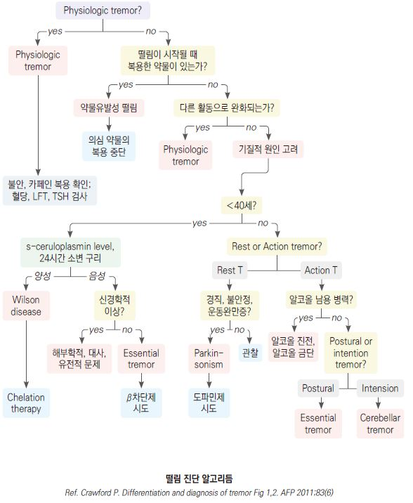

# 떨림 Tremor

## <mark style="color:green;">일반 사항</mark>

* 신체 일부분의 리드미컬한 불수의적 진동 움직임
* 진폭은 작고 진동수는 많음
* 손이 가장 흔하고 그 외에도 눈, 얼굴, 머리, 성대, 상체, 다리 등이 침범될 수 있음
* 보통 간헐적으로 나타나며 악화-완화의 변동이 있음

### <mark style="color:$danger;">🚩 Red Flags!</mark>

<mark style="color:$danger;">**즉각 의뢰 또는 응급 평가**</mark>

* 갑작스런 발생(수 분\~수 시간), 특히 편측 - 뇌졸중, 출혈 배제 필요
* 빠른 악화 경과(수일\~수 주)
* 신경학적 이상 동반 : 정신 상태 변화(의식 저하, 혼돈), 운동성 약화, 실조성 보행, 발음 장애

<mark style="color:$warning;">**조기 의뢰**</mark>&#x20;

* 50세 이전에 발생한 새로운 떨림 - Wilson병, 대사질환 등 이차성 원인 배제 필요
* 소아·청소년의 떨림 - 이차성 원인(Wilson병, 유전대사질환, 약물)의 가능성이 높아 반드시 전문과 평가 필요
* 떨림 외 파킨슨 징후(서동, 경직, 자세 불안) 동반

<mark style="color:$info;">**외래 추적 / 추가 평가 계획**</mark>

* 치료에 반응하지 않는 경우 (2가지 이상 약제 충분한 용량·기간 사용 후에도 미호전)

### <mark style="color:orange;">근육 운동과 관련한 분류</mark>

#### <mark style="color:$primary;">Action tremor</mark>

* 자발적 움직임(근 수축) 시 발생하는 떨림
* postural T : 신체를 중력에 대항하여 유지하고 있을 때(예: 팔을 뻗어 들고 있기) 발생; essential, physiologic, cerebellar, dystonic, 약물 유발 떨림 포함
* isometric T : 근육의 단축 없는 수축(예: 힘주어 주먹을 쥠) 시 발생
* kinetic T : 수의 운동 시 발생; classic essential, cerebellar, dystonic, 약물 유발 떨림 포함
* intention T : kinetic T의 아형으로 목표를 향한 움직임 시 심해짐; 소뇌 관련

#### <mark style="color:$primary;">Resting tremor</mark>

* 중력에 대해 완전히 지지되고 있는 이완 상태(예: 무릎에 올려 놓은 손)에서의 떨림
* 수의 운동 시 호전
* 관련 질환 : 파킨슨병, midbrain (rubral) tremor, Wilson병, severe essential tremor

## <mark style="color:green;">임상 양상 및 진단</mark>

### <mark style="color:orange;">감별</mark>

* 편측 떨림, 다리 떨림, 강직, 서동, resting tremor → 파킨슨병
* 보행 장애 → 파킨슨병, cerebellar tremor
* 불규칙, 경련성 떨림 → dystonic tremor
* 두부 떨림, 두부 위치 이상(head tilting or turning) → dystonic tremor
* 갑작스럽거나 빠른 시작 → functional (psychogenic) tremor, toxic tremor
* 최근 약물 치료 후 떨림 시작 또는 악화 → drug-induced, toxic tremor

<table><thead><tr><th width="131.15789794921875">분류</th><th width="257.52630615234375">임상 특징</th><th width="134.84210205078125">진단적 검사</th><th>치료</th></tr></thead><tbody><tr><td>Physiologic</td><td>Postural T; 저진폭, 10~12Hz; 불안, 스트레스, 약물/카페인/니코틴, 갑상선항진증, 근육 피로, 음주 금단, 발열</td><td>의심되는 원인 감별</td><td>안심시킴, 원인 치료</td></tr><tr><td>Psychogenic¹⁾</td><td>갑작스런 발생, 회복, 변환; 다른 활동으로 호전; 주의 분산 시 감소</td><td>병력</td><td>상담, 정신건강의학과 의뢰</td></tr><tr><td>Essential</td><td>Postural T(flexion-extension); 4~12Hz; 대칭성, 손/하지/머리/음성, 가족력; 음주로 호전, 스트레스/피로/카페인으로 악화</td><td>특이 검사 없음; CBC, TSH, BUN, Cr, LFT, 전해질</td><td>propranolol, primidone</td></tr><tr><td>Parkinsonism (☞ <a href="035_-parkinsons-disease.md">파킨슨병</a>)</td><td>Rest T(supination-pronation); 4~6Hz; 비대칭성, 사지 원위부/턱/혀, 수의 운동 시 감소; 작은 글씨증, 운동 완만, 자세 불안, 경직</td><td>특이 검사 없음; PET, SPECT</td><td>dopamine 작용제, 항콜린제</td></tr><tr><td>약물 유발²⁾</td><td>갑자기 발생, 시작 시기에 약물 복용력</td><td>발생 시기에 투여한 약물 의심</td><td>의심 약물 중단</td></tr><tr><td>대사 이상³⁾</td><td>다양한 양상</td><td>혈당, TSH, LFT, 전해질</td><td>원인 치료</td></tr><tr><td>Cerebellar</td><td>Intention/Postural T; 3~4Hz; 편측, finger-to-nose test 이상, imbalance, heel-to-shin test 이상, 근 긴장 저하</td><td>CT, MRI</td><td>원인 치료, deep brain stimulation</td></tr></tbody></table>

_<mark style="color:$info;">1) = Functional tremor</mark>_\
&#xNAN;_<mark style="color:$info;">2) 떨림 유발 약물 : amphetamines, 카페인, carbamazepine, haloperidol, lithium, methylphenidate, valproic acid, fluoxetine, TCA, amiodarone, verapamil, cyclosporine, epinephrine, atorvastatin, steroid, 당뇨약제, 갑상선 호르몬, metoclopramide, pseudoephedrine, 베타작용제(albuterol), terbutaline, theophylline</mark>_\
&#xNAN;_<mark style="color:$info;">3) 간경화증, 저칼슘혈증, 저혈당, 저나트륨혈증, 저마그네슘혈증, 갑상선항진증, 부갑상선항진증, Vit B12 결핍</mark>_

### <mark style="color:orange;">본태떨림 (Essential tremor)</mark>

#### <mark style="color:$primary;">일반 사항</mark>

* pathologic tremor 중에서 가장 흔함
* 고령에서 보다 흔함 : 65세- 4.6%, 95세- 22%
* 가족력 (상염색체 우성 경향)
* 장기간 이환(＞3년)

#### <mark style="color:$primary;">원인</mark>

* 불명; heterogenous disorder
* thalamo-cortical & cerebello-olivary loop 이상 추정
* 유전적 영향

#### <mark style="color:$primary;">진단 기준</mark> \[2018 MDS Consensus Statement]

* **확진 (Definite)** : 양측 상지의 postural &/or kinetic tremor가 3년 이상 지속 + 다른 신경학적 징후 없음
* **유사 (Probable)** : 위 기준을 충족하나 이환 기간이 3년 미만; 또는 머리·목소리 떨림이 단독으로 존재하나 이완 시 소실
* 다음이 있으면 essential tremor에서 제외 : resting tremor 단독, 다른 원인 가능 약물 복용, 편측 발생, 파킨슨 징후(서동·경직)

#### <mark style="color:$primary;">떨림 양상</mark>

* 리드미컬한 떨림, 4\~12 Hz(주로 5\~8 Hz)
* 양측성 비대칭성 postural(주로) or kinetic tremor; resting tremor는 ＜20%에서 발생
* 이환 부위 : 손/아래팔(주로 상지 이환; \~95%), 머리(\~34%), 하지(\~30%), 목소리(12%)
* cogwheel 현상을 제외한 신경학적 증상 없음
* 스트레스, 피로, 카페인 섭취로 악화
* 소량의 알코올 섭취로 호전

#### <mark style="color:$primary;">검사</mark>

* 특이 진단 방법 없음; 다른 원인 배제
* CBC, TSH, BUN, Cr, LFT, 전해질
* 40세 이전 발생 시 Wilson병 배제를 위한 혈청 ceruloplasmin, 24시간 소변 구리 검사 고려

### <mark style="color:orange;">생리적 떨림 (Physiologic tremor)</mark>

* 떨림 형태 : postural 또는 kinetic tremor
* 이환 부위 : 손, 손가락; 보통 양측
* 유발 인자 : 스트레스, 불안, 격렬한 육체 활동, 카페인 섭취, 다른 자극

### <mark style="color:orange;">말초신경병증</mark>

* 전신 발생 또는 특정 부위에 발생하여 점차 더 넓은 부위로 진행
* 하지 감각 신경 손상 시 다리 떨림, 걷기 및 균형장애, 운동실조증 발생

### <mark style="color:orange;">반얼굴연축 (Hemifacial spasm)</mark>

* 증상 : 불수의적인 수축이 안면 편측 근육에서 반복적으로 발생
* 편측 눈꺼풀의 경미한 수축으로 시작 → 얼굴 아래쪽으로 확장
* 유발 인자 : 안면 신경 자극(예: 음식을 씹거나 웃는 등 안면 근육을 움직일 때)
* 원인 또는 관련 인자 : 두개 내 혈관 이상, 종양, 다발경화증, 안면 신경 마비의 후유 장애

***



***

## <mark style="background-color:$warning;">Management</mark>

## <mark style="color:green;">본태성 떨림</mark>

#### <mark style="color:$primary;">비-약물 치료</mark>

* 유발 인자 회피 : 카페인 섭취 제한, 스트레스 관리, 충분한 수면
* 일상생활 보조 : 무거운 손목 보호대, 손잡이가 큰 식기 사용

#### <mark style="color:$primary;">약제</mark>

* **1차 선택** : propranolol 또는 primidone (각각 Level A 근거; 상호 대등)
* **2차 선택** : gabapentin, topiramate (Level B 근거)
* **3차 선택** : alprazolam (다른 약제 불응 시 추가; 의존성 주의)
* 떨림이 유발되는 상황(예: 공연, 발표)에 앞서 propranolol을 1회성으로 투여하는 것이 일부 환자에서 유효
* 환자의 30\~50%는 propranolol과 primidone에 반응하지 않음

<table><thead><tr><th width="199.0526123046875">성분명¹⁾ [상품명]</th><th width="156.4210205078125">시작 용량 (일)</th><th width="156.26324462890625">유지 용량 (일)</th><th width="104.2803955078125">근거 수준</th></tr></thead><tbody><tr><td>propranolol [인데놀]</td><td>10~20 mg</td><td>60~320 mg</td><td>Level A</td></tr><tr><td>primidone [프리미돈]</td><td>62.5 mg hs</td><td>62.5~480 mg</td><td>Level A</td></tr><tr><td>gabapentin [뉴론틴]</td><td>300 mg hs</td><td>1,200~3,600 mg</td><td>Level B</td></tr><tr><td>topiramate [토파맥스]</td><td>25 mg</td><td>200~400 mg</td><td>Level B</td></tr><tr><td>alprazolam²⁾ [자낙스]</td><td>0.125 mg</td><td>0.125~3 mg</td><td>Level C</td></tr></tbody></table>

_<mark style="color:$info;">1) 위에서부터 순서대로 선호. 2) 다른 약제로 호전되지 않을 때 추가 투여 고려; 장기 투여 시 의존성 주의</mark>_

_<mark style="color:$info;">Ref. AAN Evidence-based guideline update: Treatment of essential tremor. Neurology 2011;77. Bhattmisra et al. Ther Adv Neurol Disord. 2009;2(4).</mark>_

#### <mark style="color:$primary;">Botulinum toxin A</mark>

* 대상 : 약물 불응성 상지 본태성 떨림, cervical dystonia, blepharospasm, focal upper extremity dystonia, adductor laryngeal dystonia
* 신경과 의뢰 후 시행

#### <mark style="color:$primary;">침습적 치료 (약물 불응성)</mark>

* Deep brain stimulation (DBS) : 시상(VIM nucleus) 자극; 중증 약물 불응성 본태성 떨림에 적응
* Focused ultrasound thalamotomy : 2016 FDA 승인; 편측 시상 파괴술; 비침습적 시술로 DBS 대안

## <mark style="color:green;">생리적 떨림</mark>

* 비-약물 치료를 원칙으로 함
* 카페인 섭취, 흡연을 피함
* 일상생활에 지장을 주는 특별한 경우(예: 발표, 공연 전) β-차단제 단회 투여 고려
  * propranolol : 10\~40 mg 상황 발생 1\~2시간 전 단회 투여 <mark style="color:blue;">\[인데놀]</mark>
  * 투여 전 천식, 저혈압, 서맥 여부 확인

## <mark style="color:green;">반얼굴연축</mark>

* 1차 치료 : Botulinum toxin injection (표준치료; AAN 권고)
  * 효과 지속 : 3\~4개월; 반복 투여 필요
* 약물 치료 (보조적) : 항경련제, 항콜린제
  * clonazepam : 0.5 mg bid <mark style="color:blue;">\[리보트릴]</mark>
* 근본 원인 치료 : 혈관 압박이 원인인 경우 미세혈관 감압술(MVD) 고려 (신경외과 의뢰)

***

### <mark style="color:red;">질병코드</mark>

G25.0 본태성 떨림

R25.1 상세불명의 떨림

***

## <mark style="color:purple;">처방례</mark>

> **처방례 1.** 본태성 떨림 - propranolol (1차)
>
> ```
> 인데놀 10 mg/T  1T  bid
> ※ 반응 불충분 시 1~2주 간격으로 증량 (목표 유지량 60~320 mg/d)
> ※ 투여 전 천식, 서맥(HR <60), 저혈압 확인; 당뇨 환자는 저혈당 증상 마스킹 주의
> ※ 갑작스러운 중단 금지 (반동성 고혈압 위험); 1~2주에 걸쳐 서서히 감량
> ```

> **처방례 2.** 본태성 떨림 - primidone (1차; propranolol 금기 시)
>
> ```
> 프리미돈 62.5 mg/T  1T  취침 시  (첫 2주; 진정 부작용 최소화 목적)
> → 이후 반응에 따라 125~250 mg/d로 증량
> ※ 투여 초기 어지럼·진정·오심 발생 가능 - 야간 복용으로 경감
> ※ 목표 유지 용량 62.5~480 mg/d (분할 투여)
> ```

> **처방례 3.** 본태성 떨림 - gabapentin (2차; 1차 약제 불응 또는 금기 시)
>
> ```
> 뉴론틴 300 mg/C  1C  취침 시  (첫 주)
> → 이후 300 mg tid까지 증량 가능 (목표 1,200~3,600 mg/d)
> ※ 신기능 저하 시 용량 조절 필요 (Cr 확인)
> ※ 어지럼, 졸음 부작용; 고령자에서 주의
> ```

> **처방례 4.** 생리적 떨림 - 상황 발생 전 단회 투여
>
> ```
> 인데놀 10~40 mg  상황 발생 1~2시간 전 1회 투여
> ※ 정규 처방이 아닌 필요 시 단회 투여
> ※ 투여 전 천식, 서맥, 저혈압 확인
> ```

***

### <mark style="color:$success;">핵심 복약 지도</mark>

> **떨림 약물 복용 안내**
>
> * propranolol(인데놀)은 심박수를 낮추는 약입니다. 어지럼, 피로감이 생길 수 있으며, 천식이 있으신 분은 반드시 의사에게 알려 주십시오.
> * 약을 갑자기 끊으면 혈압이 오를 수 있습니다. 중단이 필요한 경우 반드시 의사와 상의하여 서서히 줄이십시오.
> * primidone(프리미돈)은 복용 초기에 어지럼, 졸음이 생길 수 있어 취침 전 복용합니다. 대개 1\~2주 후 적응됩니다.
> * 카페인(커피, 에너지 음료)과 흡연은 떨림을 악화시킵니다. 가능한 줄여 주십시오.
> * 소량의 알코올로 떨림이 일시적으로 좋아질 수 있지만, 규칙적인 음주는 병을 악화시키므로 피하십시오.

> **언제 다시 병원을 방문해야 하나요?**
>
> * 떨림이 갑자기 심해지거나 한쪽에만 발생하는 경우
> * 떨림 외에 손발이 뻣뻣하거나 동작이 느려지는 경우
> * 약 복용 후 심한 어지럼, 호흡 곤란, 맥박이 지나치게 느려지는 경우
> * 2\~4주 약 복용 후에도 증상 호전이 없는 경우

***

### <mark style="color:blue;">환자 안내서</mark>


**떨림(진전), 함께 이해하고 관리하기**

떨림은 적절한 치료와 생활 관리로 충분히 조절될 수 있는 질환입니다.


#### <mark style="color:$primary;">떨림이란 무엇인가요?</mark>

* **떨림(진전)** : 손, 머리, 목소리 등 신체 일부가 리드미컬하게 떨리는 증상으로, 가장 흔한 운동 장애 중 하나입니다
* **본태성 떨림** : 특별한 원인 질환 없이 발생하는 가장 흔한 형태; 가족력이 있는 경우가 많고 나이가 들수록 흔해짐
* **생리적 떨림** : 긴장, 피로, 카페인 등으로 일시적으로 나타나는 정상 범위의 떨림
* 파킨슨병, 갑상선 이상, 약물 등 다른 원인에 의한 떨림도 있으므로 정확한 진단이 중요합니다

#### <mark style="color:$primary;">어떻게 치료하나요?</mark>

* **약물 치료** : propranolol(인데놀), primidone(프리미돈) 등이 주로 사용되며, 약 효과는 수 주에 걸쳐 서서히 나타남
* **치료 목표** : 완치보다는 일상생활에 지장이 없을 정도로 증상을 조절하는 것이 목표
* **중증 약물 불응성** : 약물로 호전되지 않는 심한 경우 신경과에서 시술(집속초음파, 뇌심부자극술) 고려 가능

#### <mark style="color:$primary;">약 복용 시 꼭 지켜주세요</mark>

* **임의 중단 금지** : propranolol은 갑자기 끊으면 혈압이 오를 수 있으므로 반드시 의사와 상의하여 서서히 줄여야 함
* **초기 적응기** : primidone은 복용 초기 어지럼·졸음이 생길 수 있으나 1\~2주 후 대개 적응됨
* **천식·저혈압** : propranolol 복용 중 호흡 곤란이 생기면 즉시 담당 의사에게 알려 주십시오

#### <mark style="color:$primary;">생활 속 실천 사항</mark>

* **카페인 제한** : 커피, 에너지 음료, 녹차 등은 떨림을 악화시키므로 줄이는 것이 좋음
* **금연** : 니코틴도 떨림을 유발할 수 있음
* **음주 주의** : 소량의 알코올로 일시적으로 호전될 수 있으나 규칙적인 음주는 병을 악화시키므로 피할 것
* **충분한 수면과 스트레스 관리** : 피로와 스트레스는 떨림을 악화시키는 주요 인자
* **보조 도구 활용** : 손잡이가 굵은 식기, 무거운 손목 보호대 등이 일상생활에 도움이 될 수 있음

#### <mark style="color:$primary;">이럴 때는 즉시 병원을 방문하세요</mark>

* 떨림이 갑자기 심해지거나 한쪽에만 새로 발생한 경우
* 떨림과 함께 손발이 뻣뻣해지거나 동작이 느려지는 경우
* 약 복용 후 호흡 곤란, 심한 어지럼, 맥박이 지나치게 느려지는 경우
