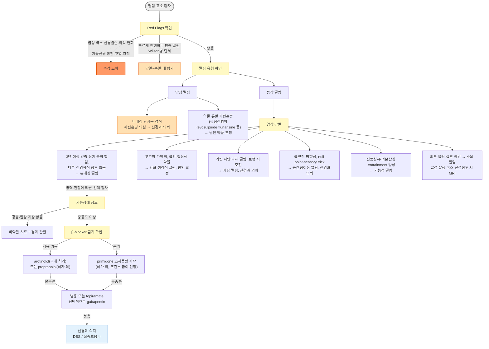

# 떨림(Tremor)

## <mark style="color:green;">일반 사항</mark>

* 신체 일부분의 리드미컬한 불수의적 진동 움직임
* 진폭과 진동수는 원인과 떨림 증후군에 따라 다양함
* 손과 팔에 가장 흔하며 머리, 목소리, 턱, 몸통, 다리 등에도 나타날 수 있음
* 발생 시점, 침범 부위, 안정 또는 동작과의 관계, 변동성 및 동반 신경학적 징후를 함께 평가해야 함

### <mark style="color:orange;">근육 운동과 관련한 분류</mark>

#### <mark style="color:$primary;">동작 떨림(Action tremor)</mark>

* 자발적 움직임(근 수축) 시 발생하는 떨림
* 자세 떨림(postural tremor) : 신체를 중력에 대항하여 유지하고 있을 때(예: 팔을 뻗어 들고 있기) 발생; 본태성·생리적·소뇌·근긴장이상·약물 유발 떨림 포함
* 등척성 떨림(isometric tremor) : 근육의 단축 없는 수축(예: 힘주어 주먹을 쥠) 시 발생
* 운동 떨림(kinetic tremor) : 수의 운동 시 발생; 본태성·소뇌·근긴장이상·약물 유발 떨림 포함
* 의도 떨림(intention tremor) : 운동 떨림의 아형으로 목표를 향한 움직임 시 심해짐; 소뇌 관련

#### <mark style="color:$primary;">안정 떨림(Resting tremor)</mark>

* 중력에 대해 완전히 지지되고 있는 이완 상태(예: 무릎에 올려 놓은 손)에서의 떨림
* 수의 운동 시 호전
* 관련 질환 : 파킨슨병 및 기타 파킨슨증, Holmes tremor, Wilson병 등

## <mark style="color:green;">임상 양상</mark>

### <mark style="color:orange;">진찰</mark>

* 떨림의 발생 시점, 진행 속도, 가족력, 음주·카페인·약물·독성물질 노출 및 알코올·진정제 금단 여부를 확인
* 안정 시, 양팔을 앞으로 뻗은 자세, wing-beating 자세, 손가락-코 검사에서 떨림을 관찰
* 글쓰기, Archimedes spiral, 컵에 물 따르기 등 기능 과제를 시행하고 가능하면 진폭과 기능장애를 기록
* 서동·경직·보행·자세반사, 소뇌기능, 근긴장이상 자세와 null point·sensory trick을 확인
* 기능성 떨림이 의심되면 변동성, 주의분산성, entrainment 및 반대쪽 ballistic movement 중 일시적 억제 등 양성 징후를 평가

### <mark style="color:orange;">감별</mark>

* 편측 떨림, 다리 떨림, 강직, 서동, 안정 떨림(resting tremor) → 파킨슨병
* 재출현 떨림(re-emergent tremor) : 팔을 뻗은 직후에는 없다가 수 초의 잠복기 후 발생하는 자세 떨림은 파킨슨병을 시사하지만 단독으로 확진하지 않음
* 보행 장애 → 파킨슨병, 소뇌 떨림
* 불규칙, 경련성 떨림 → 근긴장이상 떨림(dystonic tremor)
* 두부 떨림, 두부 위치 이상(head tilting or turning) → 근긴장이상 떨림
* 기립 시에만 다리가 후들거리며 '불안정감', '넘어질 것 같음'으로 호소 → 기립 떨림 (orthostatic tremor) 고려
  * 전형적인 일차성 기립 떨림은 13\~18 Hz의 고주파수 떨림으로, 앉거나 걸으면 대개 호전
  * 청진 시 허벅지·종아리 근육에서 "헬리콥터(helicopter sign)" 소리 (진단적 단서)
  * 표면근전도 또는 accelerometry로 주파수와 근육 간 동기성을 확인; 저주파 기립 떨림과 orthostatic myoclonus 감별
* 갑작스럽거나 빠른 시작 → 기능성 떨림, 약물·독성·대사성 떨림을 우선 감별하되 동반 신경학적 징후가 있으면 급성 구조 병변 평가
* 최근 약물 치료 후 떨림 시작 또는 악화 → 약물 유발 또는 독성 떨림

### <mark style="color:$danger;">🚩 Red Flags!</mark>

<mark style="color:$danger;">**즉각 조치**</mark>

* 급성 발생 떨림과 함께 편측 위약·감각저하, 실어증, 복시, 심한 실조, 구음장애, 의식 변화 또는 갑작스러운 심한 두통 동반 `뇌졸중` `두개내출혈`
* 알코올·진정제 금단 또는 약물·독성물질 중독이 의심되는 병력과 함께 현저한 빈맥·발한·발열 등 자율신경 항진, 혼돈·섬망 또는 경련 동반 `알코올·benzodiazepine 금단` `중독`
* 갑상샘중독증 환자에서 떨림과 함께 고열, 심한 빈맥 또는 의식 변화 동반 `갑상샘 폭풍`
* 혈당강하제 사용 중 떨림과 함께 식은땀, 혼돈 또는 의식 저하 동반 `저혈당`
* 세로토닌성 약물 시작·증량·병용 후 떨림과 함께 간대성 근경련(유발·안구 clonus), 반사항진, 고열 또는 의식 변화 동반 `세로토닌 증후군`
* 항정신병약 등 dopamine 차단제 복용 중 떨림과 함께 심한 근강직, 고열, 의식 변화, 자율신경 불안정 동반 `신경이완제 악성 증후군`
* 파킨슨병의 도파민성 약물(levodopa 등)을 갑자기 중단·대폭 감량한 뒤 심한 경직, 고열, 의식 변화 또는 자율신경 불안정 동반 `파킨슨증-고열 증후군`
* lithium 복용 중 거친 떨림과 함께 구토·설사, 실조, 혼돈 동반 `lithium 독성`

<mark style="color:$warning;">**당일\~수일 내 평가**</mark>

* 수일\~수 주에 걸쳐 빠르게 진행하는 원인 불명의 편측 떨림 `구조적 뇌병변`
* 소아·청소년의 원인 불명 떨림, 또는 젊은 환자(대략 40세 미만 발병)에서 간기능 이상·정신행동 변화·구음장애·근긴장이상 동반 `Wilson병`

<mark style="color:$info;">**조기 평가 및 추적**</mark>

* 서동·경직, 근긴장이상 자세, 소뇌징후 또는 뚜렷한 보행장애 동반 `파킨슨병` `근긴장이상 떨림` `소뇌 질환`
* 일상 기능장애가 진행하거나 떨림 증후군 분류가 불확실한 경우
* 적절한 약제를 충분히 적정했음에도 효과가 없거나 부작용으로 치료를 지속하기 어려운 경우

## <mark style="color:green;">진단 및 감별</mark>

<table><thead><tr><th width="131.15789794921875">분류</th><th width="257.52630615234375">임상 특징</th><th width="134.84210205078125">진단적 검사</th><th>치료</th></tr></thead><tbody><tr><td>강화 생리적 떨림</td><td>Postural/kinetic T; 저진폭·고주파수; 불안, 피로, 카페인·니코틴, 갑상샘항진증, 저혈당, 발열, 약물 또는 금단</td><td>병력에 따라 혈당, TSH, 전해질 등</td><td>유발 원인 교정</td></tr><tr><td>기립 떨림</td><td>서 있을 때 다리·몸통에 발생하고 앉거나 걸으면 호전; 전형적 일차성은 13\~18 Hz</td><td>표면근전도로 주파수와 근육 간 동기성 확인</td><td>신경과 의뢰; 확진 후 약물의 선택적 시도</td></tr><tr><td>기능성 떨림</td><td>큰 변동성, 주의분산성, entrainment, 일시적 억제 등 양성 징후</td><td>양성 임상징후의 조합; 필요 시 표면근전도·accelerometry</td><td>진단 설명, 운동 재훈련 중심 물리치료, 필요 시 심리치료</td></tr><tr><td>본태성 떨림</td><td>3년 이상 지속된 양측 상지 action T; 두부·음성·하지 떨림 동반 가능, 다른 신경학적 징후 없음</td><td>임상 진단; 병력과 진찰에 따른 선택적 검사</td><td>기능장애가 있을 때 약물·작업치료, 불응 시 시술 고려</td></tr><tr><td>파킨슨증 (☞ <a href="035_-parkinsons-disease.md">파킨슨병</a>)</td><td>주로 비대칭성 rest T; 서동·경직, 작은 글씨증, 보행·자세 이상 동반</td><td>임상 진단; 불확실한 경우 선택적으로 도파민운반체 영상(국내는 주로 18F-FP-CIT PET)</td><td>파킨슨병 챕터 참조</td></tr><tr><td>약물 유발¹⁾</td><td>약물 시작·증량과 시간적 연관; 동작 떨림 또는 약물 유발 파킨슨증 등</td><td>투약·보충제·노출력 검토</td><td>가능하면 원인 약물 감량·교체</td></tr><tr><td>대사 이상²⁾</td><td>다양한 양상; 전신 증상 동반 가능</td><td>의심 원인에 따라 혈당, TSH, 간·신기능, 전해질 등</td><td>원인 치료</td></tr><tr><td>소뇌 떨림</td><td>Intention/postural T; 저주파수, 측정이상·실조·구음장애·안진 등 동반</td><td>급성 또는 국소 병변 의심 시 뇌 MRI 중심 영상검사</td><td>원인 치료 및 신경과 의뢰</td></tr></tbody></table>

> ¹⁾_동작 또는 강화 생리적 떨림 : lithium, valproate, amiodarone, SSRI/SNRI, TCA, stimulant, β₂-작용제, theophylline, calcineurin inhibitor, 과량 갑상샘호르몬, corticosteroid, epinephrine, pseudoephedrine 등. 약물 유발 파킨슨증 : haloperidol 등 항정신병약, metoclopramide, levosulpiride, flunarizine, cinnarizine, valproate 등(dopamine 수용체 차단제는 akathisia·지연성 운동장애도 유발). 당뇨약제는 주로 저혈당을 통해 떨림을 유발한다._\
> ²⁾_저혈당, 갑상샘항진증, 간·신부전, 저칼슘혈증, 저나트륨혈증, 저마그네슘혈증, 부갑상샘기능항진증, vitamin B12 결핍 등_

### <mark style="color:orange;">본태성 떨림 (Essential tremor)</mark>

#### <mark style="color:$primary;">일반 사항</mark>

* pathologic tremor 중에서 가장 흔함
* 전 세계 유병률은 연구 방법에 따라 약 0.3\~0.9%로 추정되며 연령이 증가할수록 흔해짐
* 가족력이 흔하고 일부 가계에서 상염색체 우성 양상을 보이지만, 단일 유전자 질환으로 설명되지 않는 이질적인 증후군

#### <mark style="color:$primary;">원인</mark>

* 불명; heterogenous disorder
* cerebello-thalamo-cortical network 이상이 중심적으로 관여하는 것으로 추정
* 유전적 영향

#### <mark style="color:$primary;">진단 기준</mark>

* MDS 떨림 분류 합의안 [[Mov Disord 2018](https://movementdisorders.onlinelibrary.wiley.com/doi/10.1002/mds.27121)]

* **본태성 떨림(ET)** : 3년 이상 지속된 양측 상지의 동작(postural and/or kinetic) 떨림 + 근긴장이상·실조·파킨슨증 등 다른 신경학적 징후 없음
  * 두부·음성·하지 떨림이 동반될 수 있으나 단독 두부 또는 단독 음성 떨림은 ET에서 제외
* **미확정 떨림 증후군(indeterminate tremor)** : ET와 유사하나 이환 기간이 3년 미만이거나, 향후 경과 관찰이 필요한 분류가 불확실한 떨림
* **ET plus**
  * ET 기준을 충족하면서 의미가 불확실한 경미한 추가 신경학적 징후(경도 인지저하, 의심스러운 근긴장이상 자세, tandem gait 이상, 안정 시 떨림 등) 동반
  * 독립 질환인지 확립되지 않은 분류상 범주이므로 경과 중 진단을 재평가
* ET 제외 기준 : 단독 국소 떨림(두부·음성 등), 12 Hz 초과 기립 떨림, 과제·자세 특이 떨림, 갑작스러운 시작 또는 계단식 악화
* 강화 생리적 떨림, 약물 유발 떨림 등 다른 원인으로 설명되는 떨림은 별도 증후군으로 분류

#### <mark style="color:$primary;">떨림 양상</mark>

* 리드미컬한 떨림, 4\~12 Hz(주로 5\~8 Hz)
* 양측 상지의 postural 및/또는 kinetic tremor가 핵심이며 양쪽 진폭이 다를 수 있음
* 안정 시 떨림이 동반되면 2018 MDS 분류상 ET plus로 분류하며, pill-rolling 양상·뚜렷한 비대칭·서동·경직이 있으면 파킨슨병을 우선 감별
* 주로 손과 아래팔을 침범하고 머리·목소리·하지 떨림이 동반될 수 있음
* 다른 신경학적 징후가 없어야 하며, 의미가 불확실한 경미한 징후가 있으면 ET plus로 분류
* 스트레스, 피로, 카페인 섭취로 악화
* 일부 환자에서 알코올 섭취 후 일시적으로 호전되지만 진단적이지 않으며 치료 목적으로 권하지 않음

#### <mark style="color:$primary;">검사</mark>

* 특이 진단 방법 없음; 다른 원인 배제
* 나선 그리기 검사 (Archimedes spiral test) : 종이에 나선을 그리게 하여 떨림 정도 평가; 본태성 떨림은 선이 불규칙하게 떨리며 나타남 / 파킨슨병은 선의 떨림보다 나선이 점점 작아지는 경향(micrographia)을 보임
* 전형적 ET에서 일률적인 검사 패널은 필요하지 않으나 초진 시 TSH는 확인을 권장; 그 밖에는 병력·진찰에 따라 혈당, 전해질, BUN/Cr, LFT, CBC, vitamin B12 등을 선택
* Wilson병 감별 : 젊은 환자(대략 40세 미만 발병), 특히 간기능 이상·정신행동 변화·근긴장이상·구음장애·파킨슨증 또는 빠른 진행이 동반되면 혈청 ceruloplasmin, 혈청 구리, 24시간 소변 구리 및 세극등 검사를 고려
  * 추가 단서: Kayser-Fleischer ring (세극등 검사), AST/ALT 이상 (간 침범 시)

### <mark style="color:orange;">생리적 떨림 (Physiologic tremor)</mark>

* postural/kinetic, 8\~12 Hz, 저진폭
* 스트레스·카페인 등으로 유발
* 기능 장애 없음, 안심 + 원인 제거

### <mark style="color:orange;">강화 생리적 떨림 (Enhanced physiologic tremor)</mark>

* 정상 생리적 떨림이 뚜렷하게 심해진 상태로 외래에서 흔하게 접함
* 원인
  * 내분비 : 갑상샘기능항진증 (새로 발생했거나 원인 불명인 떨림, 갑상샘 증상이 있으면 TSH 우선 확인)
  * 심리 : 불안
  * 금단 : 알코올 금단, 진정제 금단
  * 약물 : β-작용제, SSRI, 리튬, 발프로산 등 (약물 유발 떨림과 일부 중복)
  * 기타 : 저혈당, 발열, 피로
* 원인을 교정하면 대개 호전되므로, 새로 발생한 떨림에서는 TSH와 약물력을 확인하고 임상 상황에 따라 혈당·전해질 등을 추가한다.

### <mark style="color:orange;">기능성 떨림 (Functional tremor)</mark>

* 기능성 신경학적 장애(Functional Neurological Disorder)의 한 표현형
* 배제진단이나 정신과적 병력만으로 진단하지 않고, 큰 변동성·주의분산성·entrainment·반대쪽 ballistic movement 중 일시적 억제 등 양성 임상징후의 조합으로 진단
* 불안·우울, 외상 또는 스트레스가 동반될 수 있으나 진단에 필수적이지 않으며, 기질성 신경계 질환과 공존할 수 있음
* 환자에게 증상이 실제이며 잠재적으로 가역적인 신경계 기능 이상임을 설명하고, 신경과 평가와 운동 재훈련 중심 물리치료를 시행; 필요에 따라 심리치료·정신건강의학과 협진

### <mark style="color:orange;">근긴장이상 떨림 (Dystonic tremor)</mark>

* 근긴장이상이 있는 신체 부위의 떨림; 불규칙하고 방향성이 있으며 특정 자세에서 심해짐
* null point(떨림이 사라지는 자세)와 sensory trick(특정 부위를 만지면 호전)이 진단 단서
* 단독 두부 떨림은 ET보다 근긴장이상 떨림을 먼저 고려
* 치료 : botulinum toxin A가 주된 치료 → 신경과 의뢰

### <mark style="color:orange;">떨림 유사 증상과 관련 질환</mark>

* myoclonus, asterixis, clonus, fasciculation, myokymia 및 반얼굴연축은 환자가 '떨림'으로 표현할 수 있으나 진정한 리드미컬한 떨림과 구별해야 함
* 말초신경병증과 연관된 떨림은 감각저하·근력저하·반사 이상 및 균형장애 등 말초신경병증 소견을 함께 평가
* 반얼굴연축은 흔히 편측 눈꺼풀에서 시작하여 같은 쪽 얼굴 아래로 확산하며, 주된 원인은 뇌간 부위의 안면신경 혈관 압박; 비전형적 양상이면 종양·탈수초질환 등 이차성 원인을 평가

***


```mermaid
flowchart TD
    A(["떨림 호소 환자"]) --> B["Red Flags 확인"]
    B -- "급성 국소 신경결손·의식 변화·<br/>자율신경 항진·고열·강직" --> C["즉각 조치"]
    B -- "빠르게 진행하는 편측 떨림·<br/>Wilson병 단서" --> C2["당일~수일 내 평가"]
    B -- "없음" --> D["떨림 유형 확인"]

    D --> E["안정 떨림"]
    D --> F["동작 떨림"]

    E --> G["비대칭 + 서동·경직<br/>파킨슨병 의심 → 신경과 의뢰"]
    E --> H["약물 유발 파킨슨증<br/>(항정신병약·levosulpiride·flunarizine 등)<br/>→ 원인 약물 조정"]

    F --> I["양상 감별"]
    I --> J["3년 이상 양측 상지 동작 떨림,<br/>다른 신경학적 징후 없음<br/>→ 본태성 떨림"]
    I --> K["고주파·가역적, 불안·갑상샘·약물<br/>→ 강화 생리적 떨림: 원인 교정"]
    I --> L["기립 시만 다리 떨림, 보행 시 호전<br/>→ 기립 떨림: 신경과 의뢰"]
    I --> L2["불규칙·방향성, null point·sensory trick<br/>→ 근긴장이상 떨림: 신경과 의뢰"]
    I --> M["변동성·주의분산성·entrainment 양성<br/>→ 기능성 떨림"]
    I --> N["의도 떨림·실조 동반 → 소뇌 떨림<br/>급성 발생·국소 신경징후 시 MRI"]

    J -- "병력·진찰에 따른 선택 검사" --> P["기능장애 정도"]
    P -- "경증·일상 지장 없음" --> Q["비약물 치료 + 경과 관찰"]
    P -- "중등도 이상" --> R["β-blocker 금기 확인"]
    R -- "사용 가능" --> S["arotinolol(국내 허가)<br/>또는 propranolol(허가 외)"]
    R -- "금기" --> T["primidone 초저용량 시작<br/>(허가 외, 조건부 급여 인정)"]
    S -- "불충분" --> U["병용 또는 topiramate<br/>선택적으로 gabapentin"]
    T -- "불충분" --> U
    U -- "불응" --> V["신경과 의뢰<br/>DBS / 집속초음파"]

    style A fill:#eeeeee,stroke:#888888,stroke-width:2px
    style B fill:#fff9c4,stroke:#ffe082
    style D fill:#fff9c4,stroke:#ffe082
    style I fill:#fff9c4,stroke:#ffe082
    style P fill:#fff9c4,stroke:#ffe082
    style R fill:#fff9c4,stroke:#ffe082
    style C fill:#f96,stroke:#e65100,stroke-width:2px
    style C2 fill:#ffe0b2,stroke:#e65100
    style G fill:#ffe0b2,stroke:#e65100
    style V fill:#e3f2fd,stroke:#1565c0
```

<p align="center"><strong>떨림 1차 진료 진단·치료 알고리듬</strong></p>

<p align="center"><em><mark style="color:$info;">저자 재구성 (참고 문헌 : Mov Disord 2018; Mov Disord 2026)</mark></em></p>

***

## <mark style="color:green;">본태성 떨림</mark>

### <mark style="color:orange;">비-약물 치료</mark>

* 환자에게 떨림의 양상과 유발 인자를 설명하고 과도한 카페인·니코틴, 수면 부족 및 스트레스를 조절
* 작업치료 및 보조도구 : 손잡이가 굵거나 가중된 식기, 뚜껑 있는 컵 등; 손목 무게추는 피로 또는 떨림 악화를 유발할 수 있어 개별 평가
* 경미하고 기능장애가 없으면 약물 없이 경과 관찰 가능

### <mark style="color:orange;">약물 치료</mark>

* 치료 여부는 떨림 진폭보다 식사·글쓰기·직업 활동·사회생활 등 환자가 느끼는 기능장애를 기준으로 결정
* 전통적인 초기 선택 : propranolol 또는 primidone; 국내 허가 약제인 arotinolol도 초기 선택으로 고려
  * 국내에서 arotinolol은 본태성 떨림 적응증이 있으나 propranolol(인데놀정 10 ㎎), primidone은 본태성 떨림에 허가 외 사용
  * 국내에서 primidone을 본태성 떨림의 첫 약제로 사용하면 현행 급여 기준을 충족하지 않음; β-blocker에 부작용·금기가 있거나 효과가 불충분한 경우 급여 인정
  * propranolol은 국내 허가사항상 COPD, 기관지천식·기관지경련 위험, 현저한 서맥, 2\~3도 방실차단, 저혈압 및 조절되지 않는 심부전 등에 금기
* 불충분하거나 사용할 수 없는 경우 : propranolol과 primidone 병용 또는 topiramate 고려; gabapentin은 근거가 제한적이므로 개별적으로 선택
* benzodiazepine은 근거가 매우 제한적이고 낙상·인지저하·의존성 위험이 있어 불안이 뚜렷한 선택된 환자에서 예외적으로 단기간 고려
* 2026 MDS 근거중심 재평가 [[Mov Disord 2026](https://movementdisorders.onlinelibrary.wiley.com/doi/10.1002/mds.70184)]에서는 propranolol·primidone·topiramate·botulinum toxin A의 복수 시험에서 개선이 보고되었으나, 비뚤림 위험과 부정확성 때문에 검토된 모든 중재의 근거 확실성을 낮음 또는 매우 낮음으로 평가함. 이는 기존 약제를 사용하지 말라는 의미가 아니며 환자 선호, 기능 개선 및 이상반응을 함께 고려하여 공유 의사결정
* 치료 목표는 일정한 감소율이 아니라 환자가 중요하게 여기는 활동의 의미 있는 개선과 허용 가능한 이상반응으로 개별화

**모니터링**

* 약제 시작·증량기 : 약제에 따라 HR/BP, 진정·어지럼·운동실조, 낙상, 인지·체중 변화 및 기능 개선(컵 들기, 글쓰기)을 평가
* 안정기 : 임상 상태에 맞춰 추적하고, 효과가 불분명하거나 이상반응이 크면 감량·중단을 검토

**상황별 특수 전략**

* 낙상 고위험 : primidone, gabapentin 및 benzodiazepine 모두 진정·어지럼·운동실조에 주의하고 초저용량에서 천천히 적정
* 인지저하 (MCI/치매) : topiramate와 benzodiazepine을 가급적 피함; gabapentin도 어지럼·진정과 신기능을 고려
* COPD / 천식 : propranolol과 arotinolol 등 비선택적 β-blocker를 피하고 다른 약제를 고려
* 저체중 / frailty : topiramate 피함 (체중 감소), ultra-low dose 전략

#### <mark style="color:$primary;">약물</mark>

**arotinolol**

* 국내에서 본태성 떨림 적응증이 허가된 α/β 차단제 <mark style="color:blue;">\[알말]</mark> ([제품정보](https://www.inno-n.com/business/medicine/view?bpc_cd=P10712\&no=150), [propranolol 비교시험](https://pubmed.ncbi.nlm.nih.gov/12853233/))
* 시작 : 10 ㎎/d
* 유지 : 20 ㎎/d, 2회 분할; 최대 30 ㎎/d
* 고령자·쇠약 환자 : 5 ㎎/T 제형을 이용해 5 ㎎ bid(10 ㎎/d) 또는 5 ㎎ qd부터 시작하여 맥박·혈압과 어지럼을 확인한 뒤 증량
* 주의/금기 : 서맥, 저혈압, 심부전, 기관지천식·기관지경련 등 β-blocker 관련 위험을 투여 전 확인

**propranolol**

* 시작 : 10 ㎎ bid (고령자 10 ㎎/d도 고려) <mark style="color:blue;">\[인데놀]</mark>
  * 상황성 떨림(예: 공연, 발표)에서는 이벤트 1\~2시간 전 1회성으로 투여하는 것을 고려
* 증량 : 1\~2주 간격으로 천천히 증량
* 목표 : 40\~320 ㎎/d (고령자에서는 낮게 유지 권장)
* 국내 허가 상태 : [인데놀정 10 ㎎](https://nedrug.mfds.go.kr/pbp/CCBBB01/getItemDetail?itemSeq=197400040)은 본태성 떨림 적응증이 없어 허가 외 사용
  * 갑상샘중독증의 보조요법은 국내 허가 적응증이므로, 갑상샘중독증에 동반된 떨림에는 허가 범위 내 사용
* 주의/금기 : 현저한 서맥, 저혈압, 피로, 당뇨 환자의 저혈당 증상 은폐, COPD, 기관지천식·기관지경련, 2\~3도 방실차단, 조절되지 않는 심부전

**primidone**

* 시작 : 12.5\~25 ㎎ hs를 고려하며, 특히 고령자·낙상 고위험군에서는 가능한 가장 낮은 용량에서 시작 <mark style="color:blue;">\[대웅프리미돈]</mark>
* 증량 : 1\~2주 간격
* 목표 : 50\~250 ㎎/d
* 국내 허가 상태 : 뇌전증 적응증만 있어 본태성 떨림에는 허가 외 사용; 다만 β-blocker(propranolol, arotinolol)에 부작용·금기가 있거나 효과가 불충분한 본태성 진전에는 급여 인정 (☞ [보험기준](https://www.hira.or.kr/rd/insuadtcrtr/InsuAdtCrtrPopup.do?mtgHmeDd=20180201\&sno=1\&mtgMtrRegSno=0002))
  * 정확한 급여 기준은 처방 시점의 HIRA 고시를 확인
* 분할 조제 : 국내 대표 제형은 250 ㎎ 정제이므로 12.5\~25 ㎎ 투여에는 산제 분할조제 가능 여부를 먼저 확인; 불가능하면 1/4정(62.5 ㎎)을 용량 균일성의 한계를 설명한 뒤 개별 판단
* 주의 : 초회 급성 독성 반응으로 심한 진정, 어지럼, 실조, 오심·혼돈 등이 생길 수 있어 초저용량에서 천천히 적정; 고령자·간질환·낙상 고위험군에서 특히 주의

**gabapentin**

* 시작 : 100\~300 ㎎ hs <mark style="color:blue;">\[뉴론틴]</mark>
* 목표 : 900\~1,800 ㎎/d
* 국내 허가 상태 : 뇌전증·신경병증성 통증 적응증이며 본태성 떨림에는 허가 외 사용
* 다른 일부 항경련제보다 인지 부작용이 상대적으로 적을 수 있으나 본태성 떨림 근거는 2026 MDS 재평가 기준 소규모 단일 RCT 수준으로 제한적
* 주의 : 졸림, 어지럼, 운동실조·말초부종 및 낙상 위험; 신기능에 따라 감량하고 opioid 등 중추신경 억제제 병용 시 호흡억제 주의

**topiramate**

* 시작 : 25 ㎎ hs <mark style="color:blue;">\[토파맥스]</mark>
* 목표 : 통상 100\~300 ㎎/d 범위에서 반응과 내약성에 따라 개별화하며, 필요 시 최대 400 ㎎/d까지 고려; 고령자는 낮게 유지
* 용량 근거 : 주요 임상시험의 평균 용량은 대체로 200 ㎎/d를 초과했으며 낮은 용량에서의 유효성 근거는 더 제한적임. 다만 2026 MDS 재평가에서는 topiramate를 포함한 모든 중재의 근거 확실성이 낮음 또는 매우 낮음으로 평가되어 200 ㎎/d 초과를 일률적인 목표로 삼지 않음
* 국내 허가 상태 : 뇌전증·편두통 예방 적응증이며 본태성 떨림에는 허가 외 사용
* 주의 : **인지 저하,** 체중 감소, 신결석, paresthesia; 고령자에서는 우선순위 낮음
* 가임 환자 : 태아 기형·성장 제한 위험이 알려져 있고 신경발달 장애 위험 증가 가능성도 보고되어, 처방 전 임신 여부·계획을 확인하고 효과적인 피임을 논의하며 가능하면 다른 약제를 우선 고려

**benzodiazepine**

* alprazolam 또는 clonazepam이 일부 환자에서 사용되지만 근거가 매우 제한적이며 본태성 떨림 적응증은 국내 미승인
* 낙상·인지저하·진정·의존성 위험 때문에 일상적 처방이나 장기 사용을 피하고, 불안이 떨림을 뚜렷하게 악화시키는 선택된 환자에서만 예외적으로 고려

#### <mark style="color:$primary;">Botulinum toxin A</mark>

* 대상 : 약물 불응성 상지·두부·음성 본태성 떨림에서 선택적으로 고려; cervical dystonia, blepharospasm 등은 별도 적응 질환
* 상지 떨림 시술 주의 : 관련 근육을 개별적으로 선정하고 용량을 조절해야 하며 손·손가락 근력 약화 위험
* 음성 떨림 : 이비인후과와 운동질환 전문의 협진 후 후두근 주입 고려
* 국내 허가 상태 : 본태성 떨림 적응증은 없어 허가 외 사용
* 신경과 의뢰 후 시행

#### <mark style="color:$primary;">침습적 치료</mark>

* 약물 불응성
* deep brain stimulation (DBS) : 시상(VIM nucleus) 자극; 중증 약물 불응성 본태성 떨림에 적응
* MR 유도 집속초음파 시상절개술(MR-guided focused ultrasound thalamotomy) : 절개 없이 VIM에 비가역적 병변을 만드는 치료로 DBS의 대안
  * 미국 FDA는 2016년 편측 치료를 승인했고 2022년부터 첫 시술 후 최소 9개월 간격을 둔 단계적 반대편 치료를 허용함. 양측 동시 치료와 구별해야 함 ([FDA device record](https://www.accessdata.fda.gov/scripts/cdrh/cfdocs/cfpma/pma.cfm?id=P150038))
  * 부작용 : 감각 이상, 보행·균형장애, 구음장애, 삼킴장애, 미각 이상 등이 발생하고 일부는 지속될 수 있음
  * 국내는 2017년 신의료기술로 인정되었으나 비급여로 운영되어 왔음; 급여 여부는 치료 시점의 건강보험 고시를 확인

#### <mark style="color:$primary;">개발 중인 치료</mark>

* ulixacaltamide : T-type calcium channel inhibitor로 3상 임상시험 후 2026년 4월 미국 FDA가 성인 본태성 떨림 치료제 신약허가신청(NDA)을 접수함 ([개발사 발표](https://ir.praxismedicines.com/news-releases/news-release-details/praxis-precision-medicines-announces-fda-acceptance-new-drug))
  * FDA 목표 결정일은 2027년 1월 29일이며, 2026년 9월 현재 미국·국내 모두 본태성 떨림 치료제로 승인되지 않았으므로 임상 처방 대상이 아님

## <mark style="color:green;">기립 떨림</mark>

* 임상적으로 의심되면 표면근전도로 떨림 주파수와 근육 간 동기성을 확인하고, 저주파 기립 떨림(pseudo-OT)·orthostatic myoclonus 및 다른 보행장애와 감별하기 위해 신경과 의뢰
* 지팡이·보행기 또는 고정된 물체에 기대기, 오래 서 있는 상황 줄이기 등으로 증상과 낙상 위험을 완화할 수 있음
* 아형 : 일차성 기립 떨림(단독 13\~18 Hz), OT-plus(추가 신경학적 소견 동반), pseudo-OT(13 Hz 미만)
* 확립된 표준 치료는 없으며 근거는 소규모 시험과 관찰자료 중심임. 단일기관 코호트 [[J Neurol 2026](https://link.springer.com/article/10.1007/s00415-026-13625-3)]에서는 clonazepam, gabapentin, alprazolam이 가장 흔히 시도되고 상대적으로 효과적이었으나, 효과 부족이나 이상반응(진정·어지럼·보행 불안정)으로 중단한 경우가 많았고 여러 약제를 시도한 뒤에도 부분 호전에 그치는 경우가 많았음
  * clonazepam : 0.25\~0.5 ㎎ hs에서 시작하여 반응에 따라 천천히 적정(통상 0.25\~2 ㎎/d 범위); 진정·인지저하·의존성·보행 불안 및 낙상에 주의 <mark style="color:blue;">\[리보트릴]</mark>
  * gabapentin : 100\~300 ㎎ hs에서 시작하여 통상 300\~1,800 ㎎/d 범위에서 분할 투여; 신기능에 따라 감량하고 어지럼·졸림·운동실조에 주의 <mark style="color:blue;">\[뉴론틴]</mark>
* 두 약제 모두 국내 기립 떨림 적응증은 없어 허가 외 사용이며, 객관적인 기립시간·보행 안정성 개선이 없거나 이상반응이 크면 중단
* 약물 불응성·불내성 중증 : 극히 선택된 환자에서 전문센터가 DBS 시술 가능성을 평가할 수 있으나, 근거는 소규모 증례 연구 수준임

## <mark style="color:green;">강화 생리적 떨림</mark>

* 비-약물 치료를 원칙으로 함
* 카페인 섭취, 흡연을 피함
* 일상생활에 지장을 주는 특별한 경우(예: 발표, 공연 전) β-차단제 단회 투여 고려
  * propranolol : 10\~40 ㎎ 상황 발생 1\~2시간 전 단회 투여 <mark style="color:blue;">\[인데놀]</mark>
  * 국내 허가 외 사용이며 투여 전 COPD, 천식·기관지경련, 저혈압, 서맥 및 심부전 여부 확인

## <mark style="color:green;">반얼굴연축</mark>

* 1차 증상 치료 : botulinum toxin 주사
  * 효과 지속 : 3\~4개월; 반복 투여 필요
* 경구 약물의 효과 근거는 제한적이며 진정·낙상 등 부작용을 고려해 선택적으로 사용
* 혈관 압박이 확인되고 증상이 중증이거나 botulinum toxin 반복 치료를 원하지 않는 경우 미세혈관 감압술(MVD) 고려 (신경외과 의뢰)

***

### <mark style="color:red;">질병코드</mark>

G25.0 본태성 떨림 Essential tremor

G25.1 약물유발 떨림 Drug-induced tremor

G25.2 기타 명시된 떨림 형태 Other specified forms of tremor

G51.3 간대성 반쪽얼굴연축 Clonic hemifacial spasm

R25.1 상세불명의 떨림 Tremor, unspecified

F44.4 해리성 운동장애 Dissociative motor disorders

***

## <mark style="color:purple;">처방례</mark>

> **처방례 1.** 본태성 떨림 - arotinolol (국내 허가 약제)
>
> ```
> 알말 10 ㎎/T  1T  qd
> ※ 반응과 내약성에 따라 10 ㎎ bid로 증량(최대 30 ㎎/d)
> ※ 고령자는 알말 5 ㎎/T 1T qd~bid로 시작 가능
> ※ 투여 전 COPD, 천식·기관지경련, 서맥, 저혈압, 방실차단 및 심부전 여부 확인
> ```

> **처방례 2.** 본태성 떨림 - propranolol (전통적 초기 약제; 국내 허가 외 사용)
>
> ```
> 인데놀 10 ㎎/T  1T  bid
> ※ 반응과 내약성에 따라 1~2주 간격으로 천천히 증량
> ※ 투여 전 COPD, 천식·기관지경련, 서맥, 저혈압, 방실차단 및 심부전 여부 확인
> ※ 당뇨 환자는 저혈당 증상 은폐에 주의
> ※ 정기적으로 복용한 경우 갑작스럽게 중단하지 말고 서서히 감량
> ```

> **처방례 3.** 본태성 떨림 - primidone (국내 허가 외 사용, β-blocker 부작용·금기·효과 불충분 시 급여 인정)
>
> ```
> 대웅프리미돈 250 ㎎/T  산제 분할조제로 12.5~25 ㎎  취침 시
> → 내약성과 반응에 따라 1~2주 간격으로 천천히 증량(통상 50~250 ㎎/d 범위에서 개별화)
> ※ 처방 전 약국의 산제 분할조제 가능 여부를 먼저 확인
> ※ 분할조제가 불가능하면 1/4정(62.5 ㎎)을 개별적으로 고려하되, 250 ㎎ 정제는 4등분용 제형이 아니어서 용량 균일성에 한계가 있고 시작 용량이 권장 초저용량보다 높다는 점을 환자에게 설명
> ※ 초회부터 심한 어지럼·진정·실조·오심·혼돈이 나타날 수 있어 고령자와 낙상 고위험군에서 특히 주의
> ```

> **처방례 4.** 본태성 떨림 - topiramate (국내 허가 외 사용; 초기 약제 불응 또는 금기 시)
>
> ```
> 토파맥스 25 ㎎/T  1T  취침 시
> → 이후 1~2주 간격으로 25 ㎎씩 증량; 통상 100~300 ㎎/d(분2회) 범위에서 반응과 내약성에 따라 개별화(필요 시 최대 400 ㎎/d)
> ※ 유효성 자료는 주로 200 ㎎/d 초과 용량에서 축적되었으나, 이상반응과 제한적인 근거 확실성을 고려하여 해당 용량을 일률적인 목표로 삼지 않음
> ※ 인지장애(말 찾기 어려움), 손발 저림(paresthesia), 식욕 감소·체중 감소 부작용 주의
> ※ 신결석 위험 - 충분한 수분 섭취 권고
> ※ 신기능 저하 시 용량 조절 필요
> ※ 가임 환자는 처방 전 임신 여부·계획 확인 및 피임 상담; 임신 계획 시 다른 약제로 전환
> ```

> **처방례 5.** 본태성 떨림 - gabapentin (국내 허가 외 사용; 선택적 대안)
>
> ```
> 뉴론틴 300 ㎎/C  1C  취침 시
> → 내약성과 반응에 따라 서서히 증량(통상 900~1,800 ㎎/d 분3회)
> ※ 근거가 제한적이므로 객관적 기능 개선이 없으면 지속하지 않음
> ※ 신기능 저하 시 감량; 어지럼·졸림·운동실조·말초부종 및 낙상 위험 주의
> ```

> **처방례 6.** 상황성 강화 생리적 떨림 - propranolol 단회 투여(국내 허가 외 사용)
>
> ```
> 인데놀 10~40 ㎎  상황 발생 1~2시간 전 1회 투여
> ※ 투여 전 COPD, 천식·기관지경련, 서맥, 저혈압, 방실차단 및 심부전 여부 확인
> ```

***

### <mark style="color:$success;">핵심 복약 지도</mark>

> **떨림 약물 복용 안내**
>
> * arotinolol(알말)과 propranolol(인데놀)은 심박수와 혈압을 낮출 수 있습니다. 어지럼, 피로감이 생길 수 있으며 COPD·천식·서맥·저혈압·심부전이 있으면 반드시 의사에게 알려 주십시오.
> * β-blocker를 정기적으로 복용한 경우 갑자기 끊으면 맥박이 빨라지거나 가슴 통증이 생길 수 있습니다. 중단이 필요한 경우 의사와 상의하여 서서히 줄이십시오.
> * primidone(프리미돈)은 첫 복용부터 심한 어지럼, 졸음, 비틀거림, 오심 또는 혼돈이 생길 수 있습니다. 취침 전 낮은 용량으로 시작하고 증상이 심하면 복용을 계속하지 말고 진료를 받으십시오.
> * 카페인(커피, 에너지 음료)과 흡연은 떨림을 악화시킵니다. 가능한 줄여 주십시오.
> * 소량의 알코올로 떨림이 일시적으로 좋아질 수 있지만 내성·의존·금단 시 악화 위험이 있어 치료 목적으로 음주하지 마십시오.
> * **치료 효과에 대하여** : 약물 반응은 개인차가 큽니다. 완전한 소실보다 식사, 글쓰기, 직업 활동 등 본인에게 중요한 기능의 의미 있는 개선을 목표로 합니다.

> **언제 다시 병원을 방문해야 하나요?**
>
> * 떨림이 갑자기 발생하면서 한쪽 힘 빠짐·감각저하, 말하기 어려움, 심한 균형장애, 의식 변화 또는 갑작스러운 심한 두통이 동반되는 경우에는 즉시 응급진료
> * 원인 불명의 한쪽 떨림이 새로 생기거나 손발이 뻣뻣하고 동작이 느려지는 경우에는 조기에 진료
> * 약 복용 후 심한 어지럼, 호흡 곤란, 맥박이 지나치게 느려지는 경우
> * 예정된 추적 진료까지 기능 개선이 없거나 약을 증량하기 어려운 부작용이 생긴 경우

***

## <mark style="color:blue;">환자 안내서</mark>


**떨림(진전), 함께 이해하고 관리하기**

떨림은 원인과 양상이 다양하며, 정확히 분류하면 증상과 생활 불편을 줄이는 데 도움이 됩니다.


#### <mark style="color:$primary;">떨림이란 무엇인가요?</mark>

* **떨림(진전)** : 손, 머리, 목소리 등 몸의 일부가 규칙적으로 떨리는 증상으로, 가장 흔한 운동 장애 중 하나입니다.
* **본태성 떨림** : 양손이 움직이거나 자세를 유지할 때 떨리는 흔한 떨림입니다. 진단 기준에는 "3년 이상 지속"이 들어 있지만, 이는 분류를 위한 기준이므로 그보다 짧게 지속된 떨림도 평가와 치료를 받을 수 있습니다. 가족 중에 같은 증상이 있는 경우가 많고, 나이가 들수록 흔해집니다.
* **강화 생리적 떨림** : 누구에게나 있는 아주 미세한 떨림이 긴장, 피로, 카페인, 약물, 갑상샘 이상 등으로 일시적으로 뚜렷해진 상태입니다.
* 파킨슨병, 갑상샘 이상, 복용 중인 약 등 다른 원인으로도 떨림이 생길 수 있으므로 정확한 진단이 중요합니다.

#### <mark style="color:$primary;">어떻게 치료하나요?</mark>

* **약물 치료** : 떨림 치료에는 여러 약이 쓰입니다. 국내에서 본태성 떨림 치료제로 허가된 약은 알말(arotinolol)이며, 그 밖의 약(인데놀, 프리미돈 등)은 다른 병의 치료제로 허가된 약을 의사의 판단으로 떨림 치료에 사용하는 것입니다.
* **치료 목표** : 약의 효과와 부작용은 사람마다 크게 다릅니다. 떨림이 완전히 없어지는 것보다 식사, 글쓰기, 직장 일처럼 본인에게 중요한 일상 활동이 실제로 나아지는지를 확인하면서 약의 용량과 계속 복용할지를 정합니다.
* **약으로 좋아지지 않는 심한 떨림** : 신경과에서 시술(집속초음파, 뇌심부자극술)을 고려할 수 있습니다.

#### <mark style="color:$primary;">약 복용 시 꼭 지켜주세요</mark>

* **임의로 끊지 마십시오.** 인데놀, 알말 같은 베타차단제를 꾸준히 복용했다면 갑자기 끊지 말고 의사와 상의하여 서서히 줄이십시오.
* **처음 복용할 때 주의하십시오.** 프리미돈은 첫 복용부터 심한 어지럼, 졸음, 비틀거림, 메스꺼움, 혼돈이 생길 수 있어 낮은 용량으로 시작합니다.
* **만성폐쇄성폐질환(COPD)·천식·느린 맥박·저혈압·심부전**이 있으면 약을 먹기 전에 반드시 의사에게 알려 주십시오. 복용 중 숨이 차거나 쓰러질 것 같으면 즉시 진료를 받으십시오.

#### <mark style="color:$primary;">생활 속 실천 사항</mark>

* **카페인을 줄이십시오.** 커피, 에너지 음료, 녹차 등은 떨림을 악화시킵니다.
* **담배를 끊으십시오.** 니코틴도 떨림을 일으킬 수 있습니다.
* **술로 떨림을 다스리지 마십시오.** 술을 마시면 잠시 떨림이 줄 수 있지만, 내성·의존이 생기고 술이 깰 때 오히려 악화될 수 있습니다.
* **충분히 자고 스트레스를 관리하십시오.** 피로와 스트레스는 떨림을 악화시키는 주요 요인입니다.
* **보조 도구를 활용하십시오.** 손잡이가 굵거나 무게가 있는 식기, 뚜껑 있는 컵 등이 도움이 됩니다. 작업치료를 통해 자신에게 맞는 도구를 고를 수 있습니다.

#### <mark style="color:$primary;">이럴 때는 빨리 진료를 받으세요</mark>

* 떨림이 갑자기 생기면서 한쪽 팔다리의 힘 빠짐·감각 저하, 말하기 어려움, 심한 균형장애, 의식 변화 또는 갑작스러운 심한 두통이 함께 나타나면 즉시 응급실을 방문하십시오.
* 원인을 모르는 한쪽 떨림이 새로 생기거나 손발이 뻣뻣하고 동작이 느려지면 가능한 빨리 진료를 받으십시오.
* 약을 먹은 뒤 숨이 차거나, 쓰러지거나, 심하게 어지럽거나, 맥박이 지나치게 느려지면 즉시 진료를 받으십시오.
