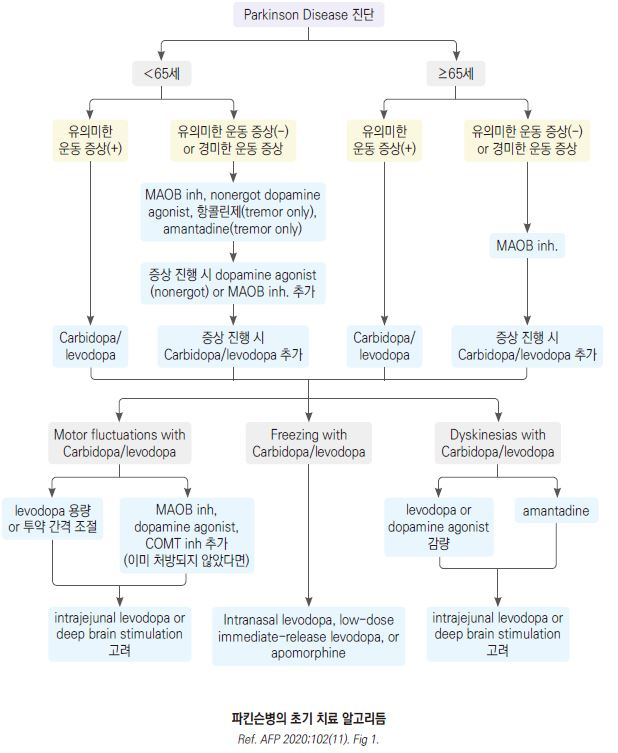

# 파킨슨병 Parkinson’s Disease

## <mark style="color:green;">일반 사항</mark>

* 'resting tremor, rigidity, bradykinesia, postural instability'를 특징으로 하는 진행성 neuro-degenerative disorder
* 보통 45\~65세에 발병; 60세 이상 인구의 1%; 알츠하이머병 다음으로 흔한 신경 변성 질환
* 발병 10년 후 상당수에서 사망, 자세 불안정, 치매 등 나쁜 경과를 보임
* 낙상, 폐렴, 질식 등의 사고에 의한 사망 위험이 증가하므로 운동, 움직임 등 기능 보존이 중요

## <mark style="color:green;">원인</mark>

* 불명
* 기전(추정) : substantia nigra의 도파민 뉴런 소실 및 Lewy body(주성분: α-synuclein) 형성이 병리학적으로 확인됨; 이로 인한 도파민 감소와 도파민-acetylcholine 불균형이 운동 증상의 주요 기전으로 설명되나, Lewy body의 정확한 역할 및 뉴런 소실의 근본 원인은 미해명

### <mark style="color:orange;">전구 증상</mark>

* 운동 증상이 나타나기 수년\~10년 전부터 다음 증상들이 선행할 수 있음; 조기 진단의 단서가 되며, 이 증상들이 복합적으로 존재하는 경우 파킨슨병 전구기를 의심하고 추적 관찰 권장
* REM 수면 행동 장애 (RBD) : 수면 중 소리를 지르거나 팔다리를 움직이는 행동; 파킨슨병으로 전환되는 가장 강력한 예측 인자
* 후각 소실 : 이유 없는 냄새 감각 저하
* 변비 : 만성적인 배변 장애
* 우울/불안 : 원인 불명의 기분 변화

### <mark style="color:orange;">위험 인자</mark>

* 가족력, 고령
* 반복적 head trauma, 독소(예: 살충제) 노출, 방사선 노출
* 약물 : 위장 운동 촉진제(metoclopramide, levosulpiride), 항정신병제(chlorpromazine, haloperidol, perphenazine, fluphenazine, olanzapine, risperidone, lithium, valproic acid), 항우울제(fluoxetine), 심혈관제(amiodarone, diltiazem, reserpine, methyldopa)
  * 니코틴과 카페인이 파킨슨병의 위험을 줄이거나 발생을 지연시킨다는 보고가 있음

## <mark style="color:green;">임상 양상</mark>

* 보통 편측 팔(±다리)에서 시작하여 수개월\~수년 후 양측에서 발생

#### <mark style="color:$primary;">운동 증상</mark>

* resting tremor
  * 환자의 ＞70%에서 발생
  * 4\~6㎐, 원위부에서 흔함(주로 손(pill-rolling tremor), 드물게 다리/입술/턱/혀 떨림)
  * 움직이거나 수면 시 호전
  * postural tremor 동반 가능
* rigidity&#x20;
  * 환자의 ＞90%에서 발생
  * 수동적 움직임에 대한 저항 증가
  * cogwheel(catching & releasing) 또는 lead pipe(지속적인 경직), bidirectional
  * 웅크린 자세
  * 통증을 동반할 수 있음
* bradykinesia 또는 akinesia&#x20;
  * 환자의 80\~100%에서 발생
  * 움직임 속도 감소, 미세 작업 장애
  * 반복적인 움직임 시 진폭 또는 속도가 점진적으로 감소(decrement)하는 양상이 진단적으로 중요 (예: 손가락 두드리기, 주먹 쥐었다 펴기 반복 시 관찰)
  * [보행 장애](https://www.youtube.com/watch?v=pFLC9C-xH8E) : 느려진 움직임, 좁게 발을 끌며 걸음(종종 걸음), 가속 보행(앞으로 넘어질 듯, 점차 보행 속도가 빨라짐), 보행 동결(걸음 시작 또는 돌아설 때 보행을 완전히 멈춤); 근 약화는 보통 없음
  * 운동 증상 : 타이핑/글씨 쓰기 곤란, 얼굴 표정 감소(가면 얼굴), 눈 깜박임 감소, 언어 장애(운동 감소형 구음 장애, 발성 부전), 연하 곤란, 과다 침 분비, 침대에서 돌아눕기 힘듦, 의자에서 일어서기 힘듦, 작은 글씨증
  * 달려오는 자동차를 급히 피해야 하는 것 같은 비상 상황에서는 자발 운동 능력이 잠시 회복될 수 있음
* postural instability : 질환 후기에 발생
* 시각 : contrast 민감도 저하, hypometric saccade, vestibulo-ocular reflex 장애, upward gaze 및 convergence 장애, lid apraxia

#### <mark style="color:$primary;">비-운동 증상</mark>

* 자율 신경 장애 : 기립성 저혈압, 급뇨/빈뇨, 변비, 발기 부전
* 감각 장애 : 후각 상실, 통각/감각 이상(자발적 작열감, 저림, 찌르는 느낌)
* 기분 장애 : 우울, 불안, 무관심/무욕, 의지 상실
* 인지 기능 장애, 치매 : 집중력, 수행 능력, 언어적 기억, 공간시각화 등의 장애, 환각, 망상
* 수면 장애 : 불면, 수면 단절, 악몽, 주간 졸음, REM 수면 행동 장애(수면 중 발음이나 행동)
* 기타 : 피로감, 지루성 피부 질환

### <mark style="color:$danger;">🚩 Red Flags!</mark>

<mark style="color:$danger;">**즉각 의뢰 또는 응급 평가**</mark>

* 현저한 extraocular movement 이상 (특히 수직 주시 장애) → Progressive supranuclear palsy 의심
* 호흡성 협착음(respiratory stridor) → Multiple system atrophy 의심
* Babinski's sign 양성, 소뇌 이상 징후 (운동 실조, 구음 장애, spasticity)

<mark style="color:$warning;">**조기 의뢰**</mark>

* 발병 연령 ＜50세 — Wilson병 등 이차성 원인 배제 필요
* 빠른 진행, 조기 자세 불안정 및 낙상 (발병 1년 이내)
* levodopa에 대한 반응 부족 또는 무반응
* 조기 중증 자율 신경 기능 상실 (기립성 저혈압, 실금)
* 근육 과긴장증(dystonia), 하지에서의 증상이 우세

<mark style="color:$info;">**외래 추적 / 추가 평가**</mark>

* 치료 반응 불충분 시 (2가지 이상 약제 충분한 용량·기간 사용 후에도 미호전)
* levodopa 장기 사용 후 wearing-off, dyskinesia 발생 시

## <mark style="color:green;">진단</mark>

* 임상적으로 진단

### <mark style="color:orange;">MDS 임상 진단 기준</mark>&#x20;

**필수 기준**

* bradykinesia + 다음 중 ≥1개
  * muscular rigidity
  * 4\~6 ㎐ resting tremor

**지지 기준 (Supportive criteria)** - 진단 가능성을 높임

* levodopa에 명확한 반응(70\~100%)
* levodopa-induced dyskinesia 발생
* 편측 발생으로 시작
* 안정 시 떨림 존재
* 후각 상실 또는 심장 교감 신경 탈신경 (MIBG 스캔)

**절대 배제 기준 (Absolute exclusion criteria)**

* 명확한 소뇌 이상 징후
* 하방 주시 장애(downward vertical supranuclear gaze palsy)
* 발병 5년 이내 전두-측두엽 치매 진단
* 파킨슨 증상이 하지에만 국한(＞3년)
* 도파민 차단제 복용에 의한 증상
* 대용량 levodopa 치료에 무반응
* 피질 감각 소실, 명확한 사지 실행증, 진행성 실어증
* 정상 기능 도파민 수송체 영상 (DAT-SPECT)

**Red flags (이하 항목 존재 시 대안 진단 고려)**

* 발병 5년 이내 빠른 진행으로 휠체어 의존
* 발병 3년 이내 구음 장애·연하 장애·자율 신경 장애가 운동 증상보다 심함
* 흡기 시 stridor
* 발병 3년 이후에도 편측성 유지

_Ref. Postuma RB, et al. MDS clinical diagnostic criteria for Parkinson's disease. Mov Disord 2015;30(12)._

### <mark style="color:orange;">UK Parkinson's disease society brain bank diagnostic criteria</mark>

#### <mark style="color:$primary;">파킨슨병 진단</mark>

* bradykinesia 및 다음 중 ≥1개 존재
  * muscular rigidity
  * 4\~6 ㎐ resting tremor
  * postural instability

#### <mark style="color:$primary;">파킨슨병 가능성</mark>

* 다음 중 ≥3개 존재
  * 편측 발생으로 시작
  * 안정 시 떨림이 있음
  * 점진적으로 진행되는 장애
  * 시작된 쪽에서 비대칭적으로 지속
  * levodopa에 잘 반응(70\~100%)
  * 심한 levodopa-induced chorea
  * levodopa 반응이 ≥5년 유지됨
  * ≥10년 경과

#### <mark style="color:$primary;">배제 기준</mark>

* 순차적으로 악화되는 파킨슨 양상을 보이는 반복적 뇌경색 병력
* 반복적 두부 외상력, 명확한 뇌염력
* 안구 운동 발작(oculogyric crisis)
* 증상 발병 시기에 neuroleptics 복용
* 이환된 친척 ≥2명
* 지속적인 완화
* 3년 후 절대적인 편측 양상
* supranuclear gaze palsy
* cerebellar signs
* 조기 중증 자율 신경 장애
* 기억력/언어/행동 장애를 동반한 조기 중증 치매
* Babinski's sign 양성
* 영상 검사로 진단된 뇌종양 또는 뇌수종
* 대용량 levodopa 치료에 반응하지 않음
* MPTP(신경독) 노출

### <mark style="color:orange;">검사</mark>

* 확진 검사 방법은 없음; 다른 질환 배제를 위해 고려
* DAT-SPECT (DaTscan) : 도파민 수송체 영상; 파킨슨병 vs 본태성 떨림 감별에 유용
* MIBG 심장 스캔 : 심장 교감 신경 탈신경 확인; 파킨슨병에서 감소
* Brain MRI : 혈관성 파킨슨증, PSP, MSA 등 구조적 이상 배제

### <mark style="color:orange;">감별</mark>

<table><thead><tr><th width="174">분류</th><th width="252">특징</th><th width="115">예상 경과</th><th width="127">Levodopa에 대한 반응</th></tr></thead><tbody><tr><td>Essential tremor<br>(☞ 떨림)</td><td>대칭적 떨림, 움직임에 의해 악화, 사지 원위부/머리 이환, 발음 이환; 서동증 없음</td><td></td><td>없음</td></tr><tr><td>Drug induced</td><td>현저하지 않은 보행 장애, 상지 증상 혼합, 대칭적; 대부분 항구토제/항정신성 약물 관련</td><td>약물 중단 후 호전</td><td>무관 (약물 중단에 반응)</td></tr><tr><td>Vascular</td><td>갑자기 발생, 국소 신경학적 이상, 단계적 악화, 대칭적 운동 완만, 질질 끄는 보행; 하지 우세</td><td>혈관 상태에 따름</td><td>미약</td></tr><tr><td>Progressive supranuclear palsy (PSP)</td><td>조기 자세 불안/낙상(발병 1년 이내), 몸통 경직, 수직 주시 제한(특히 하방 주시 장애), 놀란 표정(surprised look); Richardson syndrome이 전형적 아형이나 PSP-P(파킨슨 유사형) 등 다양한 아형 존재 [MDS 2017]</td><td>빠른 진행</td><td>초기 20~30%에서 일시적 반응; 대부분 무반응</td></tr><tr><td>Multiple system atrophy (MSA)</td><td>자율 신경 기능 상실(기립성 저혈압, 실금) 필수; MSA-P(파킨슨 우세형) 또는 MSA-C(소뇌 우세형)으로 분류 [개정 기준 2022]; 흡기 시 stridor가 특징적</td><td>빠른 진행</td><td>초기 40%에서 일시적 반응</td></tr><tr><td>Dementia with Lewy bodies (DLB)</td><td>인지 기능 저하가 운동 증상보다 선행 또는 동반(1년 이내); 변동성 인지 장애, 반복적 시각 환각, REM 수면 행동 장애(RBD), DAT-SPECT 이상이 핵심 진단 기준 [개정 기준 2017]; 현저한 경직</td><td>알츠하이머와 비슷</td><td>다양; cholinesterase 억제제가 인지·정신 증상에 효과적</td></tr></tbody></table>

_Ref. Höglinger GU, et al. Clinical diagnosis of progressive supranuclear palsy. Mov Disord 2017;32(6). Wenning GK, et al. The Movement Disorder Society criteria for MSA. Mov Disord 2022;37(6). McKeith IG, et al. Diagnosis and management of dementia with Lewy bodies. Neurology 2017;89(1)._


* 우울증 : 무표정, 고저가 없는 발성, 활동 감소; 가족력, 떨림의 특징, 다른 운동 증상으로 감별
* Wilson Dz : 이른 연령에서 시작, 다른 비정상적 움직임, Kayser-Fleischer rings, 만성 간염, 조직 내 구리 농도 증가

***

## <mark style="background-color:$warning;">Management</mark>

## <mark style="color:green;">비-약물 치료</mark>

* 규칙적 운동, 재활 운동
  * 유산소 운동, 태극권, 댄스 등이 보행 및 균형 개선에 도움
  * 강제 운동(Forced Exercise) : 자전거 등 외부 자극에 의한 고속 반복 운동; 파킨슨 운동 기능 개선에 유효 (증거 수준 중등도)
  * 고강도 인터벌 트레이닝(HIIT) : 신경 보호 효과(neuroprotection) 가능성이 있다는 최근 연구들이 보고됨; 심폐 기능 허용 범위 내에서 적극 권장
* 낙상 예방 : 미끄러짐 방지 장치, 발에 걸릴 위험이 있는 물건을 치움, 조명을 어둡지 않게 함
* 언어/발성 치료 (LSVT LOUD 등)
* 식사, 영양 관리, 적당한 칼로리 공급
  * 골격과 관련된 영양소(Vit D, Ca)를 포함하여 적절한 영양소 공급
  * 변비 예방을 위한 수분 및 식이 섬유 섭취 (☞ p.414, p.1164)
  * 소화 장애가 있는 경우 삼키기 쉬운 음식 또는 소화가 잘 되는 음식 선택
  * 소량으로 자주 식사
  * 과식/큰 음식/고지방 식품 섭취를 피함
  * 단백질 섭취 시간 조절 : 단백질(고기, 생선, 두부, 콩류)은 levodopa 흡수를 경쟁적으로 방해할 수 있음; 가급적 단백질 섭취를 저녁 식사로 몰아서 하고, 아침·점심은 탄수화물 위주로 구성하는 전략이 도움됨

### <mark style="color:orange;">수술적 치료 (약물 불응성)</mark>

* **Deep brain stimulation (DBS)**
  * 적응 : 약물 불응성 운동 증상, levodopa 유발 dyskinesia, wearing-off 현상이 심한 경우
  * 표적 : STN(subthalamic nucleus) 또는 GPi(globus pallidus internus)
  * levodopa에 반응하는 증상에 효과적; tremor, rigidity, bradykinesia 개선
  * 신경과(또는 신경외과) 의뢰 후 시행
* **MRI-guided focused ultrasound thalamotomy**
  * 비침습적 시술; 편측 tremor 우세형에 적합
  * 2021 FDA 승인 (양측 STN 대상 확대)
  * DBS 대안으로 고려 (단, 효과는 편측에 국한)

## <mark style="color:green;">약물 치료</mark>

### <mark style="color:orange;">운동 증상 치료</mark>

* 도파민 전구체인 levodopa 투여 또는 항콜린제로 acetylcholine 작용 차단
* 증상을 개선시키지만 병의 진행을 막지는 못함
* 치료 시작 시기 : 증상이 일상 기능에 영향을 미치면 연령에 무관하게 조기 치료를 적극 고려 (2023 MDS 권고)
  * 과거에는 장기 사용 시 dyskinesia 우려(levodopa phobia)로 투여를 최대한 늦추었으나, 현재는 이 우려가 과장된 것으로 평가됨
  * 삶의 질 향상을 위해 증상 발생 초기부터 적극적으로 사용하는 것이 원칙; levodopa 자체가 신경독성을 가진다는 근거는 없음
* 투여 중단 시 tapering
* 연령별 선택
  * ＜60세 환자 : dopamine 작용제, MAO-B 억제제
  * 60\~70세 환자 : levodopa/carbidopa, dopamine 작용제, MAO-B 억제제
  * ＞70세 환자 : levodopa/carbidopa

#### <mark style="color:$primary;">Levodopa</mark>

* 가장 효과적인 운동 증상 치료제
* carbidopa와 benserazide는 levodopa의 말초 전환을 억제하며 이들 약제를 병용함으로써 levodopa의 투여량과 부작용 발생을 줄일 수 있음
* 갑작스런 투여 중단은 neuroleptic malignant syndrome을 일으킬 수 있음
* 부작용 : 구역, 두통, 저혈압, 어지럼, 착란, 부정맥, dyskinesia(장기 사용 시)
* 금기 : 정신 질환, 녹내장
* levodopa/carbidopa : 시작 100/25 ㎎ 0.5\~1T tid; 최대 levodopa로 1,500 ㎎ #2\~4 <mark style="color:blue;">\[시네메트]</mark>
* L-dopa/benserazide : 100/25 ㎎, 100/50 ㎎ <mark style="color:blue;">\[마도파]</mark>

#### <mark style="color:$primary;">Dopamine agonists</mark>

* 도파민 수용체에 직접 작용
* levodopa 치료 시 발생할 수 있는 response fluctuation와 dyskinesia를 낮춤
* 단독 또는 levodopa와 병용
* DAWS (Dopamine Agonist Withdrawal Syndrome) : 투여 중단 시 불안, 공황 발작, 발한, 통증, 약물 갈망 등의 금단 증상이 levodopa보다 심하게 나타날 수 있음; 반드시 서서히 감량
* 부작용 : 구역, 기립성 저혈압, 졸림, 생생한 꿈, 충동 장애(도박, 과식, 과성욕 등), 착란, 하지 부종, 어지럼
* pramipexole : 시작 0.125 ㎎ tid, 서방형 0.375 ㎎ qd; 최대 4.5 ㎎/d <mark style="color:blue;">\[미라펙스]</mark>
* ropinirole : 시작 0.25 ㎎ tid, 서방형 2 ㎎ qd; 최대 8 ㎎ tid(24 ㎎/d) <mark style="color:blue;">\[리큅]</mark>
* rotigotine : 2 ㎎/d; 최대 16 ㎎/d <mark style="color:blue;">\[뉴프로 패취]</mark>
* bromocriptine : 시작 1.25 ㎎ bid; 최대 90 ㎎/d <mark style="color:blue;">\[팔로델]</mark>
* apomorphine : 주사제; 시작 2 ㎎; 최대 6 ㎎

#### <mark style="color:$primary;">MAO-B(Monoamine Oxidase type B) Inhibitor</mark>

* 내약성 좋음
* 부작용 : 구역, 두통, 수면 장애, 환각; SSRI, TCA, meperidine 병용 회피
* selegiline : 5 ㎎ 아침; 최대 10 ㎎ #2(아침/점심) — 저녁 복용 시 불면 유발 가능 <mark style="color:blue;">\[마오비]</mark>
* rasagiline : 시작 0.5 ㎎ qd; 최대 1 ㎎/d <mark style="color:blue;">\[아질렉트]</mark>
* safinamide : 시작 50 ㎎ qd; 최대 100 ㎎/d — levodopa 보조제; 운동 및 비운동 증상 개선

#### <mark style="color:$primary;">COMT(Catechol-O-Methyltransferase) Inhibitor</mark>

* 도파민 반응을 연장시킴. levodopa에 반응하는 경우 부가 사용 (wearing-off 개선 목적)
* 부작용 : 구역, 설사, 기립성 저혈압, 착란, 운동이상증, 간독성(tolcapone), 오렌지색 소변
* entacapone : levodopa와 동시 복용 필수; 복용 횟수 많음; 200 ㎎, levodopa 복용 때마다; 최대 8T(1,600 ㎎)/d <mark style="color:blue;">\[콤탄]</mark>
* tolcapone : 시작 100 ㎎ tid; 최대 800 ㎎/d; 간독성 위험, 간기능 모니터링 필수
* opicapone : 1일 1회 복용으로 편의성 우수. entacapone 대비 On-time 연장 효과 강력; 25\\\~50 ㎎ qd (취침 전; levodopa 복용 최소 1시간 전후) <mark style="color:blue;">\[온젠티스]</mark>

#### <mark style="color:$primary;">NMDA(N-Methyl-d-Aspartate) Inhibitor</mark>

* 부작용 : 어지럼, 착란, 망상피반, 환각
* amantadine : 시작 100 ㎎ qd → 100 ㎎ bid, 최대 400 ㎎/d <mark style="color:blue;">\[피케이멜즈]</mark>

#### <mark style="color:$primary;">Anticholinergics</mark>

* tremor 및 rigidity 완화에 도움; 젊은 연령에서 심한 진전 조절을 위해 고려
* 저용량으로 시작하여 점차 증량; 효과적이지 않으면 tapering
* 부작용 : 입마름, 기억력/시각 장애, 소변 잔류; 고령자에서 인지 기능 저하 위험 주의
* trihexyphenidyl : 1 ㎎ tid; 증량 2 ㎎ tid; 최대 15 ㎎/d <mark style="color:blue;">\[트리헥신]</mark>
* benztropine : 0.5 ㎎ 취침 시; 최대 1 ㎎ bid <mark style="color:blue;">\[벤즈트로핀]</mark>

#### <mark style="color:$primary;">복합제</mark>

* levodopa + carbidopa + entacapone <mark style="color:blue;">\[스타레보]</mark>

### <mark style="color:orange;">운동 증상 약제 비교</mark>

<table><thead><tr><th width="117.36846923828125">약제군</th><th width="167.894775390625">주요 성분명 [상품명]</th><th width="119.21051025390625">기전</th><th width="131.84210205078125">주요 부작용</th><th>비고</th></tr></thead><tbody><tr><td>Levodopa</td><td>Levodopa/Carbidopa [시네메트]<br>L-dopa/Benserazide [마도파]</td><td>도파민 전구체 보충</td><td>구역, dyskinesia(장기), 기립성 저혈압</td><td>Gold standard; 모든 연령에서 가장 효과적</td></tr><tr><td>Dopamine agonist</td><td>Pramipexole [미라펙스]<br>Ropinirole [리큅]<br>Rotigotine [뉴프로 패취]</td><td>도파민 수용체 직접 자극</td><td>충동 조절 장애, 졸림, DAWS(금단)</td><td>젊은 환자(＜60세) 초기 선호; dyskinesia 위험 낮음</td></tr><tr><td>MAO-B 억제제</td><td>Rasagiline [아질렉트]<br>Safinamide<br>Selegiline [마오비]</td><td>도파민 분해 억제</td><td>불면(저녁 복용 시), 두통, 구역</td><td>초기 단독 또는 levodopa 보조; 내약성 양호; SSRI/TCA 병용 금지</td></tr><tr><td>COMT 억제제</td><td>Entacapone [콤탄]<br>Opicapone [온젠티스]</td><td>Levodopa 말초 분해 억제 → 반감기 연장</td><td>오렌지색 소변, 설사, 운동이상증</td><td>Wearing-off 개선; Opicapone은 1일 1회로 편의성·효과 우수</td></tr><tr><td>NMDA 억제제</td><td>Amantadine [피케이멜즈]</td><td>글루타메이트 차단</td><td>망상피반, 어지럼, 착란, 환각</td><td>Dyskinesia 감소에도 유효</td></tr><tr><td>항콜린제</td><td>Trihexyphenidyl [트리헥신]<br>Benztropine [벤즈트로핀]</td><td>Acetylcholine 작용 차단</td><td>입마름, 소변 잔류, 인지 저하</td><td>Tremor 우세형 젊은 환자에서 고려; 고령자 주의</td></tr></tbody></table>

### <mark style="color:orange;">운동 증상 이외 증상의 치료</mark>

* 기립성 저혈압 : 수분 섭취 증가, 압박 스타킹, 머리쪽 침대 높이기; midodrine 2.5\~10 ㎎ tid, droxidopa 100\~600 ㎎ tid
* 주간 졸음 : 야간 수면 환경 개선, 적절한 커피 음용; modafinil, methylphenidate (☞ p.138)
* REM 수면 행동 장애 : clonazepam 0.25\~0.5 ㎎ 취침 전 <mark style="color:blue;">\[리보트릴]</mark>; melatonin 3\~12 ㎎ 취침 전
* 우울 : 보통 SSRI 선택 (TCA보다 부작용이 적음) (☞ [우울증](027_-depression.md))
* 통증 : 파킨슨 관련 통증에 duloxetine 고려; levodopa 최적화로 off-period 통증 감소
* 침 흘림 : 침샘에 botulinum toxin 주사; 경구 glycopyrrolate; 설하 atropine, ipratropium
* 콧물 : 비내 ipratropium
* 변비 : 충분한 수분/식이 섬유 섭취, 활동; polyethylene glycol, lubiprostone, probiotics (☞ [변비](../224_/082_-constipation.md))
* 치매 : [알츠하이머병](033_-dementia.md#undefined-17) 치료제 적용; rivastigmine, donepezil, galantamine, memantine
* psychosis(망상, 환각) : 항도파민제가 원인으로 의심되는 경우 감량 또는 교체 고려; quetiapine, clozapine, pimavanserin (파킨슨 정신증 최초 적응 허가 약물; 2016 FDA 승인)

***



***

### <mark style="color:red;">질병코드</mark>

G20 파킨슨병

***

## <mark style="color:purple;">처방례</mark>

> **처방례 1.** ＜60세 — dopamine 작용제 단독 (초기 치료)
>
> ```
> 미라펙스 0.125 ㎎/T  1T  tid
> ※ 5~7일마다 0.125 mg씩 증량; 목표 유지량 1.5~4.5 mg/d
> ※ 투여 초기 구역, 기립성 저혈압, 졸림 발생 가능; 취침 전 복용량 줄이거나 분할 투여
> ※ 충동 조절 장애(도박, 과식 등) 발생 시 즉시 보고하도록 안내
> ※ 갑작스러운 중단 금지 (금단 증상 위험); 1~2주에 걸쳐 서서히 감량
> ```

> **처방례 2.** 60세 이상 또는 인지 기능 저하 동반 — levodopa/carbidopa (1차)
>
> ```
> 시네메트 CR 200/50 ㎎/T  1T  qd (아침)
> → 증상 조절 불충분 시 시네메트 100/25 ㎎ 0.5~1T tid로 전환 또는 병용
> ※ 구역 부작용 시 식사와 함께 복용 (단, 고단백 식사는 흡수 방해 가능)
> ※ 갑작스러운 중단 금지 (neuroleptic malignant syndrome 위험)
> ※ 장기 복용 시 wearing-off, dyskinesia 발생 여부 추적
> ```

> **처방례 3.** Levodopa + COMT 억제제 병용 (wearing-off 발생 시)
>
> ```
> 스타레보 필름코팅정 100/25/200 ㎎/T  1T  tid (levodopa 복용 횟수에 맞춰)
> ※ entacapone 성분으로 인해 소변이 오렌지색으로 변할 수 있음 (정상 반응)
> ※ 설사, 운동이상증 발생 시 용량 조절 또는 신경과 의뢰
> ```

> **처방례 4.** MAO-B 억제제 추가 (초기 또는 보조 치료)
>
> ```
> 아질렉트 1 ㎎/T  1T  qd (아침)
> ※ SSRI, TCA, meperidine과 병용 금지 (세로토닌 증후군 위험)
> ※ 저용량(0.5 mg)으로 시작하여 1~2주 후 1 mg으로 증량 가능
> ```

***

### <mark style="color:$success;">핵심 복약 지도</mark>

> **파킨슨병 약물 복용 안내**
>
> * levodopa(시네메트, 마도파)는 파킨슨병의 가장 효과적인 약입니다. 갑자기 끊으면 심각한 부작용이 생길 수 있으므로 반드시 의사와 상의하여 서서히 줄여야 합니다.
> * 고단백 식사(고기, 두부 등)는 levodopa 흡수를 방해할 수 있습니다. 식사 30분 전이나 식사 1시간 후 복용을 권장하며, 단백질 섭취를 저녁으로 몰아서 하는 것도 방법입니다.
> * dopamine 작용제(미라펙스, 리큅 등)는 갑자기 잠들거나 충동 조절에 문제(도박, 과식 등)가 생길 수 있습니다. 이상한 행동 변화가 느껴지면 즉시 알려 주십시오.
> * selegiline(마오비)은 저녁에 복용하면 잠이 안 올 수 있으므로 반드시 아침 또는 점심에만 복용하십시오.
> * COMT 억제제(콤탄, 온젠티스, 스타레보)를 복용하면 소변 색이 오렌지색으로 변할 수 있습니다. 이것은 정상 반응이니 걱정하지 않아도 됩니다.

> **언제 다시 병원을 방문해야 하나요?**
>
> * 약 효과가 떨어지는 시간이 생기거나(wearing-off), 몸이 저절로 움직이는 증상(dyskinesia)이 생기는 경우
> * 갑자기 쓰러지거나 낙상 후 다친 경우
> * 환각(없는 것이 보임), 망상, 심한 혼란이 생기는 경우
> * 약 복용 후 심한 구역, 어지럼, 갑자기 잠드는 증상이 지속되는 경우
> * 소변이 갑자기 잘 나오지 않거나 기립 시 심하게 어지러운 경우

***

### <mark style="color:blue;">환자 안내서</mark>


**파킨슨병, 함께 이해하고 관리하기**

파킨슨병은 완치보다는 꾸준한 치료와 생활 관리로 일상 기능을 최대한 유지하는 것이 목표입니다.


#### <mark style="color:$primary;">파킨슨병이란 무엇인가요?</mark>

* **파킨슨병**은 뇌에서 운동을 조절하는 도파민이라는 물질이 줄어들어 발생하는 신경계 질환입니다
* 주요 증상으로는 손 떨림, 몸이 뻣뻣해짐(경직), 동작이 느려짐(서동), 자세 불안정(넘어질 것 같은 느낌) 등이 있습니다
* 운동 증상 외에도 변비, 후각 감소, 우울, 수면 장애 등 다양한 증상이 동반될 수 있습니다
* 진행성 질환이지만 적절한 치료로 오랫동안 일상생활을 유지할 수 있습니다

#### <mark style="color:$primary;">어떻게 치료하나요?</mark>

* **약물 치료** : 도파민을 보충하거나 그 효과를 높이는 여러 약물을 사용합니다. 약효는 꾸준히 복용할 때 가장 잘 유지됩니다
* **운동 치료** : 유산소 운동, 태극권, 댄스 등이 균형, 보행, 근력 유지에 도움이 됩니다. 규칙적인 운동이 병의 진행을 늦추는 데 도움이 될 수 있습니다
* **수술 치료(DBS)** : 약물 조절이 어려운 경우 뇌심부자극술(DBS)을 신경과에서 고려할 수 있습니다

#### <mark style="color:$primary;">약 복용 시 꼭 지켜주세요</mark>

* **임의 중단 금지** : 파킨슨 약을 갑자기 끊으면 고열, 근육 경직 등 심각한 부작용이 생길 수 있습니다. 반드시 의사와 상의하십시오
* **복용 시간 준수** : levodopa는 매일 같은 시간에 규칙적으로 복용해야 약 효과가 일정하게 유지됩니다
* **식사와의 관계** : levodopa는 가능하면 식사 30분 전에 복용하는 것이 흡수에 유리합니다. 고기·두부 등 단백질이 많은 음식과 함께 복용하면 약 흡수가 줄어들 수 있습니다

#### <mark style="color:$primary;">생활 속 실천 사항</mark>

* **낙상 예방** : 미끄러운 바닥, 어두운 조명, 발에 걸릴 물건을 없애십시오. 화장실에 손잡이를 설치하면 도움이 됩니다
* **규칙적인 운동** : 걷기, 수영, 자전거 타기 등 꾸준한 운동이 근력과 균형 유지에 중요합니다
* **충분한 수분·섬유질 섭취** : 변비 예방을 위해 하루 1.5\~2리터 물을 마시고, 채소·과일을 충분히 드십시오
* **수면 관리** : 수면 중 소리를 지르거나 발길질을 한다고 가족이 말하면 의사에게 알려 주십시오

#### <mark style="color:$primary;">이럴 때는 즉시 병원을 방문하세요</mark>

* 약을 먹었는데도 몸이 전혀 움직이지 않거나 갑자기 상태가 나빠진 경우
* 없는 것이 보이거나(환각), 이상한 행동이 갑자기 생긴 경우
* 넘어져서 다친 경우, 특히 머리를 부딪혔을 때
* 음식을 삼키기 힘들거나 자주 사레들리는 경우
