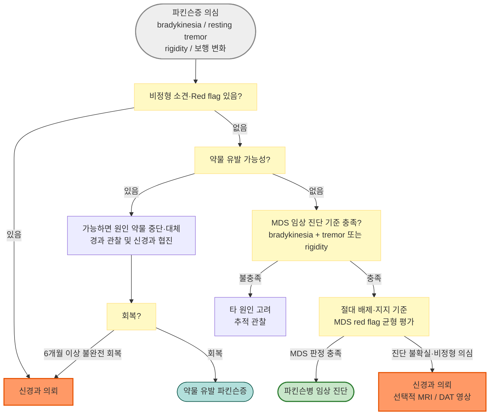
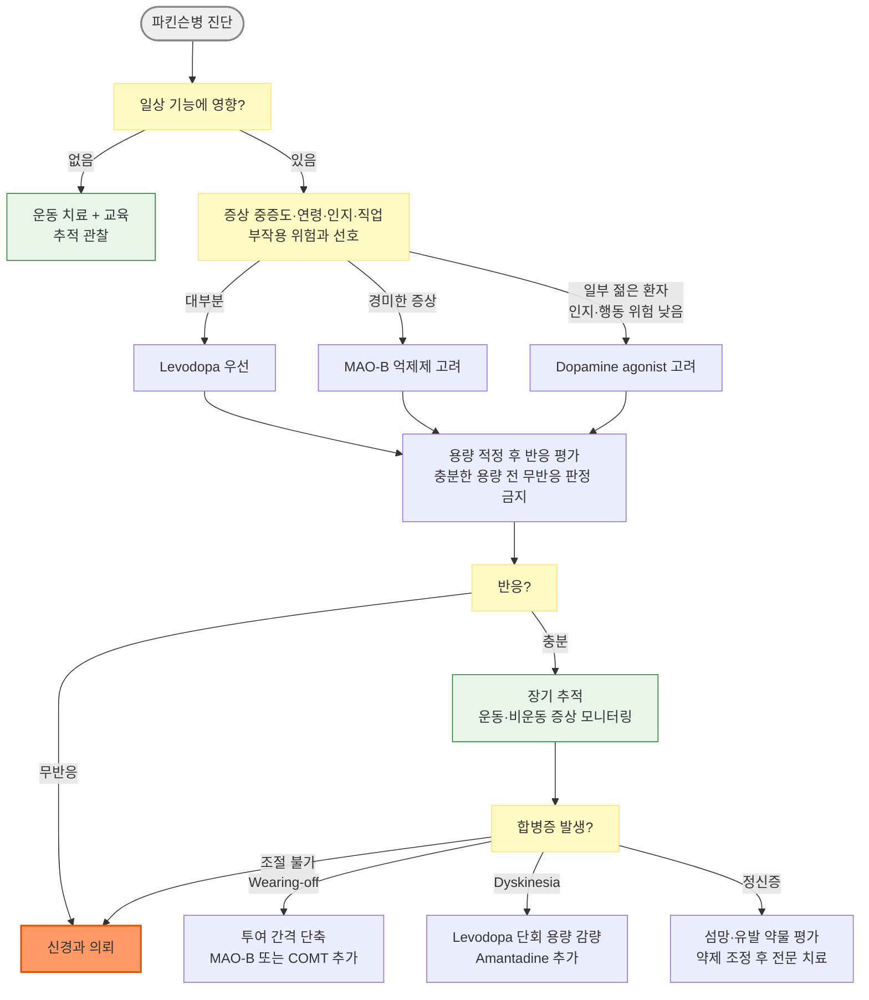

# 파킨슨병 Parkinson's Disease (PD)

## <mark style="color:green;">일반 사항</mark>

* 파킨슨병(Parkinson disease, PD)은 흑질 도파민 신경세포 소실을 주된 특징으로 하는 진행성 신경퇴행질환
* 파킨슨증(parkinsonism)은 **서동증(bradykinesia)과 안정 시 떨림(rest tremor) 또는 경직(rigidity) 중 1개 이상**이 함께 있는 임상 증후군이며, 파킨슨병은 그 원인 중 가장 흔한 질환임; 비정형 파킨슨증(PSP, MSA 등) 및 이차성 파킨슨증(약물, 혈관성 등)과 구별이 중요
* 평균 발병 연령은 약 60세이며 연령이 증가할수록 발생률과 유병률이 증가함; 알츠하이머병 다음으로 흔한 신경퇴행질환
* 질환 자체보다 낙상·폐렴·연하 장애 등 합병증으로 인한 사망 위험이 증가하며, 적절한 치료 시 장기간 기능 유지가 가능함; 자세 불안정, 치매는 주로 후기에 발생

## <mark style="color:green;">원인 및 위험 인자</mark>

* 불명
* 기전(추정) : substantia nigra의 도파민 뉴런 소실 및 Lewy body(주성분: α-synuclein) 형성이 병리학적으로 확인됨; 이로 인한 도파민 감소와 도파민-acetylcholine 불균형이 운동 증상의 주요 기전으로 설명되나, Lewy body의 정확한 역할 및 뉴런 소실의 근본 원인은 미해명

### <mark style="color:orange;">위험인자</mark>

* 가족력, 고령, 남성(약 1.5배)
* 유전 요인 : GBA1 변이(가장 흔한 유전 위험인자), LRRK2 변이 등; 단일유전자형은 전체의 약 5\~10%
* 반복적인 두부 외상, 일부 살충제·용매 노출과 연관성이 보고되었으나 개인의 발병 원인으로 단정할 수 없음
* 흡연과 카페인 섭취가 낮은 파킨슨병 발생 위험과 연관된 관찰 연구가 있으나 인과관계나 예방 효과가 확립된 것은 아니며, 예방 목적으로 흡연을 권고하지 않음

### <mark style="color:orange;">약물 유발 파킨슨증의 원인 약물</mark>

*   대표적 원인 약물

    * 위장 운동 촉진제 : metoclopramide, levosulpiride
    * 항정신병제 : chlorpromazine, haloperidol, perphenazine, fluphenazine, olanzapine, risperidone, aripiprazole, amisulpride, sulpiride; clozapine·quetiapine은 위험이 가장 낮음
    * 도파민 고갈제 : reserpine, tetrabenazine 등 VMAT2 억제제
    * 기타 중추신경계 약물 : lithium, valproic acid
    * 기타 보고 약물 : methyldopa; amiodarone과 diltiazem의 연관 근거는 제한적임
    * Calcium channel blocker : **flunarizine, cinnarizine** (국내에서 어지럼 치료 목적으로 흔히 처방되므로 시작 전·장기 처방 중 서동증, 경직, 떨림과 보행 변화를 확인)

    ※ 파킨슨병 환자의 구역·구토 치료 시 주의 : metoclopramide, levosulpiride 등 중추성 도파민 차단제는 파킨슨 증상을 악화시킬 수 있으므로 피함. Domperidone은 혈액뇌장벽 투과가 적어 대안으로 고려할 수 있으나 QT 연장·심실부정맥 위험 때문에 금기와 상호작용을 확인하고 1회 10 ㎎, 1일 최대 30 ㎎, 가능한 한 1주 이내로 사용(국내 허가사항 확인)

    ※ 약물 유발 파킨슨증(drug-induced parkinsonism) : 위 약물들에 의한 증상은 약물 중단 후 수 주\~6개월 이상에 걸쳐 서서히 회복됨 - 즉각 회복을 기대하지 않도록 환자에게 설명 필요; 회복이 불완전하거나 6개월 이상 지속되는 경우 기저 파킨슨병 가능성을 고려하여 신경과 의뢰

## <mark style="color:green;">임상 양상</mark>

* 보통 편측 팔(±다리)에서 시작하여 수개월\~수년 후 양측에서 발생

### <mark style="color:orange;">전구 증상</mark>

* 운동 증상이 나타나기 수년 전부터 다음 증상들이 선행할 수 있음. 그러나 각각은 흔하고 비특이적이며, 이러한 증상만으로 파킨슨병 또는 전구기 파킨슨병을 진단하지 않음
* MDS 전구기 기준은 개인 진료에서 확진하기 위한 기준이 아니라 주로 연구 목적의 확률적 기준임 [MDS 2015, update 2019]. 수면다원검사로 확인된 단독 REM 수면 행동 장애(isolated RBD) 등 고위험 상태에서는 신경과 평가와 장기 추적을 고려
* REM 수면 행동 장애 (RBD) : 수면 중 소리를 지르거나 팔다리를 움직이는 행동; α-synucleinopathy(파킨슨병, 루이소체치매, 다계통위축증)로 전환되는 가장 강력한 예측 인자
* 후각 소실 : 이유 없는 냄새 감각 저하
* 변비 : 만성적인 배변 장애
* 우울/불안 : 원인 불명의 기분 변화
* 자율 신경계 이상 : 기립성 저혈압 등은 운동 증상 수년 전부터 나타날 수 있음. 심장 MIBG 섭취 감소는 증상이 아니라 진단 보조 바이오마커임

_Ref. Berg D, et al. MDS research criteria for prodromal Parkinson's disease. Mov Disord 2015;30(12). Heinzel S, et al. Update of the MDS research criteria for prodromal Parkinson's disease. Mov Disord 2019;34(10)._

### <mark style="color:orange;">운동 증상</mark>

* resting tremor
  * 환자의 ＞70%에서 발생
  * 4\~6㎐, 원위부에서 흔함(주로 손(pill-rolling tremor), 드물게 다리/입술/턱/혀 떨림)
  * 움직이거나 수면 시 호전
  * postural tremor 동반 가능
* rigidity
  * 환자의 ＞90%에서 발생
  * 수동적 움직임에 대한 저항 증가
  * cogwheel(catching & releasing) 또는 lead pipe(지속적인 경직), bidirectional
  * 통증을 동반할 수 있음
* bradykinesia 또는 akinesia
  * 진단의 필수 요소
  * 움직임 속도 감소, 미세 작업 장애
  * 반복적인 움직임 시 진폭 또는 속도가 점진적으로 감소(decrement)하는 양상이 진단적으로 중요 (예: 손가락 두드리기, 주먹 쥐었다 펴기 반복 시 관찰)
  * [보행 장애](https://www.youtube.com/watch?v=pFLC9C-xH8E) : 느려진 움직임, 좁게 발을 끌며 걸음(종종 걸음), 가속 보행(앞으로 넘어질 듯, 점차 보행 속도가 빨라짐), 보행 동결(걸음 시작 또는 돌아설 때 보행을 완전히 멈춤); 근 약화는 보통 없음
  * 운동 증상 : 타이핑/글씨 쓰기 곤란, 얼굴 표정 감소(가면 얼굴), 눈 깜박임 감소, 언어 장애(운동 감소형 구음 장애, 발성 부전), 연하 곤란, 과다 침 분비, 침대에서 돌아눕기 힘듦, 의자에서 일어서기 힘듦, 작은 글씨증
  * 달려오는 자동차를 급히 피해야 하는 것 같은 비상 상황에서는 자발 운동 능력이 잠시 회복될 수 있음
* 자세 이상 : 몸통과 목이 앞으로 굽은 웅크린 자세
* postural instability : 질환 후기에 발생
* 시각 : 대비감도 저하, 눈모음 장애, 저진폭 신속눈운동 등이 나타날 수 있음. 뚜렷한 수직 핵상주시마비나 눈꺼풀 열기 실행증은 PSP 등 비정형 파킨슨증을 시사

### <mark style="color:orange;">비-운동 증상</mark>

* 자율 신경 장애 : 기립성 저혈압, 급뇨/빈뇨, 변비, 발기 부전
* 감각 장애 : 후각 상실, 통각/감각 이상(자발적 작열감, 저림, 찌르는 느낌)
* 기분 장애 : 우울, 불안, 무관심/무욕, 의지 상실
* 인지 기능 장애, 치매 : 경도 인지 저하는 여러 단계에서 나타날 수 있고 일상생활을 저해하는 파킨슨병 치매는 대체로 진행기에 흔함; 집중력, 수행 능력, 언어적 기억, 공간시각화 등의 장애, 환각, 망상
* 수면 장애 : 불면, 수면 단절, 악몽, 주간 졸음, REM 수면 행동 장애(수면 중 발음이나 행동)
* 기타 : 피로감, 지루성 피부 질환

### <mark style="color:$danger;">🚩 Red Flags!</mark>

<mark style="color:$danger;">**즉각 조치**</mark>

* 항파킨슨제 중단·흡수 장애(금식, 입원, 수술) 후 고열, 심한 전신 경직, 의식 변화 또는 자율신경 불안정 `파킨슨증-고열 증후군`
* 수시간 내 갑작스러운 운동 기능 악화와 함께 국소 신경학적 결손 `뇌졸중`
* 휴식 시 흡기성 협착음, 호흡곤란, 청색증 `성대 외전 마비(MSA)` `기도 흡인`
* 음식·침을 전혀 삼키지 못하거나 흡인 후 발열·호흡곤란 `흡인성 폐렴`
* 실신 또는 두부 손상을 동반한 낙상 `기립성 저혈압` `두개내출혈`
* MAO-B 억제제 복용 중 tramadol·meperidine·dextromethorphan·세로토닌성 약물 병용 후 고열, 초조, 근간대경련 `세로토닌 증후군`
* 구체적인 자살 사고 또는 자살 시도
* 환자·타인에게 위험한 급성 정신증 또는 의식 변화 `섬망` `약물 유발 정신증`

<mark style="color:$warning;">**당일\~수일 내 평가**</mark>

* 수일에 걸친 뚜렷한 운동 기능 악화 `감염(요로감염·폐렴)` `탈수` `약물 누락·상호작용`
* 새로 발생한 환각·망상 `파킨슨병 정신증` `섬망`
* 요폐 `항콜린제 부작용` `자율신경 기능장애`
* 도박·과소비 등으로 경제적·사회적 위해가 발생한 충동 행동 `충동조절장애`
* 반복 낙상 또는 급격한 식사량·체중 감소 `연하장애` `기립성 저혈압`

<mark style="color:$info;">**조기 평가 및 추적**</mark>

* 빠른 진행, 발병 3년 이내 반복 낙상, 5년 이내 중증 구음·연하 장애 또는 중증 자율신경 기능 상실, 수직 핵상주시마비, 소뇌 징후, 설명되지 않는 추체로 징후 `PSP` `MSA` `CBD`
* 충분한 용량의 levodopa에 무반응, 지속적 양측 대칭 또는 하지 우세 파킨슨증 `혈관성 파킨슨증` `정상압수두증`
* 젊은 발병(대략 40세 미만은 Wilson병 선별), 비전형적 근긴장이상, 가족력 `Wilson병` `유전성 파킨슨병`
* wearing-off, dyskinesia, 보행 동결, 치료 반응 불충분 `운동 합병증`
* 낙상, 연하, 체중·영양, 인지·기분, 수면, 자율신경 증상과 운전 안전을 정기적으로 평가

## <mark style="color:green;">진단</mark>

* 임상적으로 진단

### <mark style="color:orange;">임상 진단 기준</mark> \[MDS 2015]

**필수 기준**

* bradykinesia + 다음 중 ≥1개
  * muscular rigidity
  * resting tremor

**지지 기준 (Supportive criteria)** - 진단 가능성을 높임

* 도파민 치료에 명확하고 현저한 반응(초기 치료에서 정상 또는 거의 정상 수준으로 회복하거나, 용량 변화에 따라 뚜렷한 호전·악화가 반복됨; 객관적 평가에서 MDS-UPDRS III 30% 초과 변화는 한 예)
* levodopa-induced dyskinesia 발생
* 사지의 안정 시 떨림 존재
* 후각 상실 또는 심장 교감 신경 탈신경 (MIBG 스캔)


**급성 levodopa/apomorphine challenge는 파킨슨증 감별을 위해 사용하지 않음 [NICE NG71].** 진단이 불확실하면 운동장애 전문의가 통상적인 치료 과정에서 충분한 용량과 기간에 걸친 반응을 평가함.


**절대 배제 기준 (Absolute exclusion criteria)**

* 명확한 소뇌 이상 징후
* 하방 주시 장애(downward vertical supranuclear gaze palsy)
* 발병 5년 이내 행동변이형 전두측두치매 또는 원발진행실어증 진단
* 파킨슨 증상이 하지에만 국한(＞3년)
* 도파민 수용체 차단제 또는 도파민 고갈제의 투여 시점·용량·경과가 약물 유발 파킨슨증에 합당함
* 중등도 이상 중증도에서도 고용량 levodopa에 관찰 가능한 반응이 없음
* 피질 감각 소실, 명확한 사지 실행증, 진행성 실어증
* 정상 기능 도파민 수송체 영상 (DAT 영상)
* 파킨슨증을 설명할 수 있는 다른 질환이 명확하거나, 전문의가 임상적으로 다른 증후군일 가능성이 더 높다고 판단함

**MDS Red flags (대안 진단 고려 소견)**

* 발병 5년 이내 빠른 보행 장애 진행으로 휠체어 의존
* 치료와 무관하게 5년간 운동 증상의 진행이 없음
* 발병 5년 이내 중증 구음·연하 장애
* 흡기성 호흡 장애 : 주·야간 흡기성 협착음 또는 잦은 흡기성 한숨
* 발병 5년 이내 중증 자율신경 기능 상실(기립 3분 내 수축기 ≥30 또는 이완기 ≥15 ㎜Hg 저하, 또는 중증 요폐·요실금)
* 발병 3년 이내 반복적 낙상
* 발병 10년 이내 불균형적인 전경부 굴곡 또는 손·발의 구축
* 발병 5년 이후에도 흔한 비운동 증상이 전혀 없음
* 설명되지 않는 추체로 징후
* 지속적으로 양측 대칭적인 파킨슨증

**판정**

* **Clinically established PD** : 절대 배제 기준 없음 + 지지 기준 ≥2개 + Red flag 없음
* **Clinically probable PD** : 절대 배제 기준 없음 + Red flag 최대 2개; 각 Red flag가 지지 기준 1개 이상으로 상쇄되어야 함

_Ref. Postuma RB, et al. MDS clinical diagnostic criteria for Parkinson's disease. Mov Disord 2015;30(12)._

### <mark style="color:orange;">진단 기준의 관계</mark>

* 이 장에서는 MDS 2015 기준으로 정리함. NICE NG71은 UK Parkinson's Disease Society Brain Bank 기준에 근거한 임상 진단을 권고하므로, 지침·문헌을 읽을 때 적용 기준을 확인
* UK 기준에서는 자세 불안정이 파킨슨증을 구성하는 선택 요소 중 하나였으나, MDS 기준에서는 파킨슨증 정의에서 제외되었으며 조기 자세 불안정과 반복적 낙상은 오히려 대안 진단을 시사함

### <mark style="color:orange;">검사</mark>

* 확진 검사 방법은 없음; 다른 질환 배제를 위해 고려
* DAT 영상 (도파민 수송체 영상) : 국내에서는 주로 ¹⁸F-FP-CIT PET으로 시행(해외는 DaTscan SPECT); 파킨슨병 vs 본태성 떨림 감별에 유용; 약물 유발 파킨슨증과 PD 감별에도 도움
  * 순수 약물 유발 파킨슨증에서는 대체로 정상이지만, 약물이 잠복 파킨슨병을 드러낸 경우 감소할 수 있음
  * **파킨슨병 확진 검사가 아니며, PD와 PSP·MSA·DLB를 구분하지 못함**
* MIBG 심장 스캔 : 심장 교감 신경 탈신경 확인; 파킨슨병에서 감소할 수 있으나 심장질환, 당뇨병성 자율신경병증 및 약물의 영향을 받으므로 단독 판정하지 않음
* Brain MRI : 혈관성 파킨슨증, 정상압수두증, 종양 및 PSP·MSA를 시사하는 구조적 소견 평가; 정상 MRI가 파킨슨병을 확진하지 않음
* α-synuclein seed amplification assay(SAA)와 2024년 제안된 생물학적 분류체계(SynNeurGe, NSD-ISS)는 유망한 연구 도구이나, 현재 일상 임상 진단을 대체하지 않음

### <mark style="color:orange;">감별</mark>

<table><thead><tr><th width="174">분류</th><th width="252">특징</th><th width="115">예상 경과</th><th width="127">Levodopa에 대한 반응</th></tr></thead><tbody><tr><td>본태성 떨림<br>(☞ <a href="034_-tremor.md">떨림</a>)</td><td>주로 양측 상지의 동작 떨림; 머리·목소리 떨림 가능; 서동증과 경직 없음</td><td>서서히 진행</td><td>없음</td></tr><tr><td>약물 유발</td><td>도파민 차단제 등과 시간적 연관; 대칭적인 경우가 흔하나 비대칭도 가능</td><td>약물 중단 후 수 주~6개월 이상에 걸쳐 호전; 지속되면 잠복 PD 고려</td><td>대개 제한적</td></tr><tr><td>혈관성</td><td>단계적 악화, 국소 신경학적 이상, 하지 우세 보행 장애; 영상의 혈관 병변과 임상 연관성 확인</td><td>혈관 상태에 따름</td><td>대개 미약하나 일부 반응</td></tr><tr><td>정상압수두증</td><td>보행장애(발이 바닥에 붙은 듯한 자석 보행) + 인지 저하 + 요실금; MRI에서 뇌실 확대</td><td>배액 검사·션트로 호전 가능</td><td>대개 없음</td></tr><tr><td>진행성 핵상마비(PSP)</td><td>조기 반복 낙상, 몸통 경직, 수직 핵상주시마비, 전두엽 기능 이상; PSP-P 등 다양한 아형 존재 [MDS 2017]</td><td>빠른 진행</td><td>일부에서 초기·일시적 반응</td></tr><tr><td>다계통위축증(MSA)</td><td>자율신경 기능 상실, 파킨슨증 또는 소뇌증후군의 조합; 임상적 개연 MSA에서는 자율신경 기능 상실이 항상 필수는 아님 [MDS 2022]; 흡기성 협착음이 특징적</td><td>빠른 진행</td><td>일부에서 초기·일시적 반응</td></tr><tr><td>피질기저증후군(CBS)</td><td>비대칭 경직·근긴장이상, 사지 실행증, 피질 감각 소실, 외계인 손</td><td>진행성</td><td>불량</td></tr><tr><td>루이소체치매(DLB)</td><td>인지 저하가 파킨슨증보다 선행하거나 1년 이내 발생; 변동성 인지, 반복적 시각 환각, RBD가 핵심 특징</td><td>진행성</td><td>다양; 인지·정신 증상에는 cholinesterase 억제제 고려</td></tr></tbody></table>

_Ref. Höglinger GU, et al. Clinical diagnosis of progressive supranuclear palsy. Mov Disord 2017;32(6). Wenning GK, et al. The Movement Disorder Society criteria for MSA. Mov Disord 2022;37(6). McKeith IG, et al. Diagnosis and management of dementia with Lewy bodies. Neurology 2017;89(1)._

* 우울증 : 무표정, 고저가 없는 발성, 활동 감소; 가족력, 떨림의 특징, 다른 운동 증상으로 감별
* Wilson병 : 대략 40세 미만 발병, 다른 비정상적 움직임, Kayser-Fleischer rings, 만성 간염, 조직 내 구리 농도 증가

***


```mermaid
graph TD
    A(["파킨슨증 의심<br/>bradykinesia / resting tremor<br/>rigidity / 보행 변화"]) --> B["비정형 소견·Red flag 있음?"]
    B -->|있음| C["신경과 의뢰"]
    B -->|없음| D["약물 유발 가능성?"]
    D -->|있음| E["가능하면 원인 약물 중단·대체<br/>경과 관찰 및 신경과 협진"]
    E --> F["회복?"]
    F -->|"6개월 이상 불완전 회복"| C
    F -->|회복| G(["약물 유발 파킨슨증"])
    D -->|없음| H["MDS 임상 진단 기준 충족?<br/>bradykinesia + tremor 또는 rigidity"]
    H -->|불충족| I["타 원인 고려<br/>추적 관찰"]
    H -->|충족| J["절대 배제·지지 기준<br/>MDS red flag 균형 평가"]
    J -->|"MDS 판정 충족"| R(["파킨슨병 임상 진단"])
    J -->|"진단 불확실·비정형 의심"| K["신경과 의뢰<br/>선택적 MRI / DAT 영상"]

    style A fill:#eeeeee,stroke:#888888,stroke-width:2px
    style B fill:#fff9c4,stroke:#ffe082
    style D fill:#fff9c4,stroke:#ffe082
    style F fill:#fff9c4,stroke:#ffe082
    style H fill:#fff9c4,stroke:#ffe082
    style J fill:#fff9c4,stroke:#ffe082
    style C fill:#f96,stroke:#e65100,stroke-width:2px
    style K fill:#f96,stroke:#e65100,stroke-width:2px
    style G fill:#b2dfdb,stroke:#004d40,stroke-width:1px
    style R fill:#c8e6c9,stroke:#2e7d32,stroke-width:2px
```

<p align="center"><strong>파킨슨병 진단 알고리듬</strong></p>

<p align="center"><em><mark style="color:$info;">저자 재구성 (참고 문헌 : MDS 2015, NICE NG71)</mark></em></p>

***


```mermaid
graph TD
    A(["파킨슨병 진단"]) --> B["일상 기능에 영향?"]
    B -->|없음| C["운동 치료 + 교육<br/>추적 관찰"]
    B -->|있음| D["증상 중증도·연령·인지·직업<br/>부작용 위험과 선호"]
    D -->|대부분| E["Levodopa 우선"]
    D -->|"경미한 증상"| H["MAO-B 억제제 고려"]
    D -->|"일부 젊은 환자<br/>인지·행동 위험 낮음"| I["Dopamine agonist 고려"]
    E --> J["용량 적정 후 반응 평가<br/>충분한 용량 전 무반응 판정 금지"]
    H --> J
    I --> J
    J --> K["반응?"]
    K -->|무반응| L["신경과 의뢰"]
    K -->|충분| M["장기 추적<br/>운동·비운동 증상 모니터링"]
    M --> N["합병증 발생?"]
    N -->|Wearing-off| O["투여 간격 단축<br/>MAO-B 또는 COMT 추가"]
    N -->|Dyskinesia| P["Levodopa 단회 용량 감량<br/>Amantadine 추가"]
    N -->|정신증| Q["섬망·유발 약물 평가<br/>약제 조정 후 전문 치료"]
    N -->|"조절 불가"| L

    style A fill:#eeeeee,stroke:#888888,stroke-width:2px
    style B fill:#fff9c4,stroke:#ffe082
    style D fill:#fff9c4,stroke:#ffe082
    style K fill:#fff9c4,stroke:#ffe082
    style N fill:#fff9c4,stroke:#ffe082
    style L fill:#f96,stroke:#e65100,stroke-width:2px
    style C fill:#e8f5e9,stroke:#2e7d32,stroke-width:1px
    style M fill:#e8f5e9,stroke:#2e7d32,stroke-width:1px
```

<p align="center"><strong>파킨슨병 치료 알고리듬</strong></p>

<p align="center"><em><mark style="color:$info;">저자 재구성 (참고 문헌 : AAN 2021, NICE NG71)</mark></em></p>

***

## <mark style="background-color:$warning;">Management</mark>

### <mark style="color:orange;">치료 방침</mark>

* 치료 시작 시기 : 증상이 일상 기능에 영향을 미치면 연령에 무관하게 치료를 시작하며, 단순히 운동 합병증을 우려하여 levodopa를 미루지 않음
  * 과거에는 장기 사용 시 dyskinesia 우려(levodopa phobia)로 투여를 최대한 늦추었으나, 현재는 이 우려가 과장된 것으로 평가됨
  * 삶의 질 향상을 위해 증상 발생 초기부터 적극적으로 사용하는 것이 원칙; levodopa 자체가 신경독성을 가진다는 근거는 없음
* 초기 약제 선택
  * 치료가 필요한 초기 파킨슨병에서는 일반적으로 levodopa를 우선 권고
  * 운동 증상이 경미하면 MAO-B 억제제를 고려할 수 있으나 levodopa보다 증상 개선 효과가 작음
  * Dopamine agonist는 운동이상증 위험을 중요하게 고려하는 일부 젊은 환자에서 선택할 수 있음
  * 70세 이상, 인지 저하·환각·충동조절장애·과도한 졸림이 있거나 운전 직업인 경우 dopamine agonist를 피함
  * 연령만으로 약제를 정하지 않고 증상, 인지·정신 상태, 직업, 동반 질환, 부작용 위험과 환자 선호를 함께 고려
* 반응 평가 : 충분한 용량까지 적정하기 전에 "levodopa 무반응"으로 판정하지 않음
* 입원·수술·금식 시 : 항파킨슨제를 평소 시간에 지속 투여(비위관 투여 또는 rotigotine 패취로 일시 대체 고려); 입원 중 haloperidol·metoclopramide·levosulpiride 사용 금지
* 운동·재활, 영양, 비운동 증상(기분, 수면, 자율신경, 인지)을 운동 증상과 함께 정기적으로 평가·관리


**건강보험 급여기준 (보건복지부 고시 제2024-235호, 2024년 12월 1일 시행)**

허가사항 범위 내에서 항파킨슨 약제는 최대 6품목까지 인정하며 중증 파킨슨병은 최대 7품목까지 인정함. 복합제는 포함된 성분을 각각 1품목으로 계산함. 대상 약제군은 levodopa, dopamine agonist, MAO-B 억제제, antiviral(amantadine), 항콜린제, COMT 억제제임. 처방 시 최신 심평원 고시와 약제급여목록을 확인함.


## <mark style="color:green;">비-약물 치료 및 예방</mark>

* 규칙적 운동과 재활 치료 : 개인의 기능과 심폐 위험을 평가하여 주 150분 정도의 중등도\~고강도 운동을 목표로 하되, 유산소·근력·유연성·균형/민첩성/다중과제 훈련을 함께 구성
  * 유산소 운동(걷기, 자전거, 수영), 태극권, 댄스 등이 보행 및 균형 개선에 도움
  * 강제 운동(forced exercise)과 고강도 인터벌 트레이닝(HIIT)은 일부 환자의 기능 개선에 활용할 수 있으나 모든 환자에게 적합하지 않으며 전문가의 평가와 감독이 필요
  * 운동은 운동·비운동 증상, 기능과 삶의 질 개선에 유용하지만 질병 진행을 늦추는 신경보호 효과는 아직 확립되지 않음
  * 균형 훈련 (balance training) : 낙상 예방을 위해 별도로 포함; 한 발 서기, 기능적 도달 훈련, 태극권 등
* 낙상 예방 : 미끄러짐 방지 장치, 발에 걸릴 위험이 있는 물건을 치움, 조명을 어둡지 않게 함
* 언어/발성 치료 (LSVT LOUD 등)
* 식사, 영양 관리, 적당한 칼로리 공급
  * 골격과 관련된 영양소(Vit D, Ca)를 포함하여 적절한 영양소 공급
  * 변비 예방을 위한 수분 및 식이 섬유 섭취. 심부전·신장질환·저나트륨혈증 등 수분 제한이 필요한 상태에서는 개별 조정 (☞ [변비](../224_/082_-constipation.md#management), [식이지침](../231_/218_-nutritiondiet-guideline.md))
  * 연하 안전성 평가 : 식사 중 사레, 젖은 목소리, 식사 시간 연장, 체중 감소, 반복 폐렴이 있으면 연하 평가와 언어치료(연하재활) 의뢰 후 식이 형태를 조정
  * 연하 평가 결과에 따라 삼키기 쉬운 음식 또는 소화가 잘 되는 음식 선택
  * 소량으로 자주 식사
  * 과식/큰 음식/고지방 식품 섭취를 피함
  * 단백질 섭취 시간 조절 : levodopa와 식이 단백질의 연관성이 확인되는 운동 기복 환자에서 영양사와 상의하여 총 단백질량은 유지하면서 단백질 재분배 식이를 고려. 모든 환자에게 아침·점심 저단백 식이를 일률적으로 권하지 않으며 체중 감소·근감소·영양 불량을 모니터링
  * 철분제는 levodopa 흡수를 줄이므로 2시간 이상 간격을 두고 복용

## <mark style="color:green;">약물 치료</mark>

### <mark style="color:orange;">운동 증상 치료</mark>

* 도파민성 약물은 levodopa, dopamine agonist, MAO-B 억제제 등이 중심이며 항콜린제는 일부 젊은 떨림 우세 환자에서 제한적으로 고려
* 증상을 개선시키지만 병의 진행을 막지는 못하며, 현재 확립된 질병 조절 치료는 없음
  * Lixisenatide는 2024년 2상시험에서 운동 장애 진행이 적었으나 위장관 이상반응이 많았고 질병 조절 효과는 확정되지 않음
  * Exenatide는 2025년 3상시험에서 질병 진행 억제 효과를 입증하지 못함. 이후 시험 참여기관 중 한 곳에 대한 규제기관 점검에서 시험 수행·감독·거버넌스와 관련된 중대한 임상시험관리기준(GCP) 문제가 확인되어, 2026년 The Lancet이 Expression of Concern을 발행함. 이는 논문 철회나 연구부정의 확정을 의미하지 않으며 해당 문제가 전체 연구 결과의 신뢰성에 미치는 영향은 조사 중임
  * α-synuclein 표적 항체 등은 임상시험 단계임
* 장기 치료 중 발생하는 주요 합병증
  * Wearing-off : 다음 복용 전 약 효과가 떨어지면서 운동 증상이 다시 악화되는 현상; levodopa 장기 사용 후 점차 발생; 비운동 OFF 증상이 먼저 나타나는 경우가 많음 - 불안, 발한, 통증, 기분 저하, 급박뇨 등이 운동 증상 악화 전 전구 징후로 나타날 수 있음
  * Dyskinesia : 주로 levodopa 혈중 농도가 최고조일 때 발생하는 불수의적 이상 운동(몸이 흔들리거나 뒤틀리는 움직임); levodopa 단회 용량 감량·분할 및 amantadine을 고려. COMT·MAO-B 억제제는 wearing-off에는 유용하지만 dyskinesia를 유발·악화할 수 있음
* 항파킨슨제는 임의로 갑자기 중단하지 않으며, 감량·중단·전환은 약제와 임상 상황(이상반응의 중증도 포함)에 따라 계획함

#### <mark style="color:$primary;">Levodopa</mark>

* 가장 효과적인 운동 증상 치료제
* carbidopa와 benserazide는 levodopa의 말초 전환을 억제하며 이들 약제를 병용함으로써 levodopa의 투여량과 부작용 발생을 줄일 수 있음
* 갑작스러운 투여 중단 또는 흡수 장애는 고열·경직·의식 변화와 자율신경 불안정을 동반한 파킨슨증-고열 증후군을 일으킬 수 있음
* 부작용 : 구역, 두통, 기립성 저혈압, 어지럼, 착란, 환각, 부정맥, dyskinesia(장기 사용 시), 충동조절장애(드묾)
* 금기 (국내 허가사항) : 협우각형 녹내장, MAO 억제제 투여 중(비선택적 MAO 억제제; 선택적 MAO-B 억제제는 보조요법으로 병용), 미진단 피부 병변·흑색종 병력
* 주의 : 활동성 정신병, 심한 기립성 저혈압, 소화성 궤양, 중증 심혈관·폐질환, 당뇨병(혈당 상승)
* levodopa/carbidopa : 레보도파로서 1회 100\~125 ㎎, 1일 100\~300 ㎎으로 시작하여 매일 또는 격일로 100\~125 ㎎씩 증량; 표준 유지량 1회 200\~250 ㎎ tid; 최대 1일 1,500 ㎎ <mark style="color:blue;">\[퍼킨정 25-100]</mark>
* levodopa/benserazide : 국내 현행 제품은 100/25 ㎎의 확산정 및 HBS 캡슐; 제형별 흡수 특성과 용법이 다르므로 서로 단순 대체하지 않음 <mark style="color:blue;">\[마도파 확산정 125, 마도파 HBS 캡슐 125]</mark>


**Carbidopa/levodopa 치료의 비타민 B6 결핍 경고**

2026년 FDA는 carbidopa/levodopa 함유 제제(국내 퍼킨정, 스타레보 등)에 비타민 B6 결핍 및 관련 발작 경고를 추가함. 치료 시작 전과 치료 중 주기적으로, 그리고 결핍 증상 발생 시 B6를 평가하고 필요시 보충; 고용량일수록 위험이 증가함(보고 14례는 모두 levodopa ＞1,000 ㎎/d). 보고된 발작 다수는 통상의 항경련제에 반응하지 않았고 B6 투여 후 소실되었으므로, carbidopa/levodopa 복용 환자에서 새로운 발작이 생기면 표준 응급 평가·치료와 함께 B6 결핍을 확인. Levodopa/benserazide(마도파)는 이 FDA 경고의 대상이 아님. **국내 허가사항 반영 여부는 별도 확인 필요.**


* 치료 반응 조절
  * low dose 시작 → 점진 증량
  * 반응 부족 : Levodopa → 증량; DA → levodopa 추가
  * Wearing-off 발생 : 투여 간격 단축(예: q6h → q4h), MAO-B 추가, COMT 추가
  * Dyskinesia : levodopa 감량, amantadine 추가
  * 불응성 떨림 : 일부 젊은 환자에서 항콜린제 또는 DBS 고려
* 복용과 식사 : 가능하면 식전 30분 또는 식후 1시간에 복용하되 구역이 심하면 소량의 비단백 간식과 복용할 수 있음. 단백질 재분배는 식사와 연관된 운동 기복이 확인된 환자에서 총 단백질과 영양 상태를 유지하며 고려
* 초기 구역·구토 : 소량의 비단백 간식과 함께 복용하고, metoclopramide·levosulpiride 등 중추성 도파민 차단 항구토제는 피함. 지속되면 QT 연장 위험과 금기를 확인한 뒤 domperidone을 최소 유효 용량으로 단기간 고려 (☞ [약물 유발 파킨슨증의 원인 약물](#약물-유발-파킨슨증의-원인-약물))

#### <mark style="color:$primary;">운동 합병증 관리 요약</mark>

<table><thead><tr><th width="160">합병증</th><th width="220">특징</th><th>1차 대응</th><th>전문 치료</th></tr></thead><tbody><tr><td><strong>Wearing-off</strong></td><td>다음 복용 전 운동·비운동 증상 재출현; 불안, 발한, 통증 등이 먼저 나타날 수 있음</td><td>levodopa 단회 용량·간격 조정; MAO-B 또는 COMT 억제제 추가 고려</td><td>서방형 제제, dopamine agonist, 지속 주입 치료 또는 수술 치료 평가</td></tr><tr><td><strong>Peak-dose dyskinesia</strong></td><td>levodopa 최고 혈중 농도 시 몸이 흔들리거나 뒤틀리는 불수의운동</td><td>levodopa 단회 용량 감량·분할; dyskinesia를 악화시키는 보조약 재평가</td><td>amantadine; 약물 조절 한계 시 DBS 등 평가</td></tr><tr><td><strong>보행 동결</strong></td><td>걷기 시작·방향 전환·좁은 공간에서 발이 멈춤; OFF 시 악화 가능</td><td>ON/OFF 연관성을 확인하여 levodopa 최적화; 청각·시각 큐 활용</td><td>파킨슨병 전문 물리치료; levodopa 반응성 증상에 한해 수술 치료 평가</td></tr><tr><td><strong>갑작스러운 중증 OFF</strong></td><td>예측하기 어려운 OFF로 일상생활에 심한 지장</td><td>복약 누락·식사·위장관 흡수와 기존 요법을 재평가하고 신경과 의뢰</td><td>국내 허가·유통 제형을 확인하여 간헐적 구조요법 또는 지속 주입 치료를 개별 선택</td></tr></tbody></table>

* 지속 주입 치료 : levodopa/carbidopa 장관겔(LCIG) 등 국내 허가 제형 확인; foslevodopa/foscarbidopa 피하주입제는 2026년 2월 국내 희귀의약품으로 지정됨. 희귀의약품 지정은 품목허가와 별개이므로 처방 전 국내 허가·급여·공급 여부 확인

#### <mark style="color:$primary;">Dopamine agonists</mark>

* 도파민 수용체에 직접 작용
* 초기 치료로 사용하면 dyskinesia 발생을 늦추고, levodopa 보조요법으로 OFF 시간을 줄임
* 단독 또는 levodopa와 병용
* DAWS (Dopamine Agonist Withdrawal Syndrome) : 투여 중단 시 불안, 공황 발작, 발한, 통증, 약물 갈망 등의 금단 증상이 levodopa보다 심하게 나타날 수 있음; **반드시 서서히 감량**
* 부작용 : 구역, 기립성 저혈압, 졸림·갑작스러운 수면, 생생한 꿈, 충동 장애(도박, 과식, 과성욕 등), 착란, 하지 부종, 어지럼
* 금기/주의 : 인지 저하 / 치매, 환각 병력, 충동조절장애 (도박, 과소비, 성욕 증가), 고령 (≥70), 심한 졸림 (운전 직업), 부종, 심부전
* 매 방문 시 보호자와 함께 충동조절장애와 갑작스러운 수면 여부를 확인
* pramipexole : 시작 0.125 ㎎ tid, 서방형 0.375 ㎎ qd; 최대 4.5 ㎎/d <mark style="color:blue;">\[미라펙스]</mark>
* ropinirole : 시작 0.25 ㎎ tid, 서방형(XL) 2 ㎎ qd; 최대 속방형 8 ㎎ tid(24 ㎎/d), 서방형 24 ㎎ qd; 임상에서는 통상 16 ㎎/d 이하에서 사용 <mark style="color:blue;">\[리큅, 리큅 XL]</mark>
* rotigotine : 초기 파킨슨병 시작 2 ㎎/24h, 최대 8 ㎎/24h; 진행성 파킨슨병 시작 4 ㎎/24h, 최대 16 ㎎/24h; 패취 부착 부위 피부반응, 졸림·갑작스러운 수면과 충동조절장애에 주의 <mark style="color:blue;">\[뉴프로 패취]</mark>
* bromocriptine : ergot계 dopamine 작용제로 판막질환 및 심장·폐·후복막 섬유화 위험 때문에 현재 비선호. 비-ergot계 치료로 충분히 조절되지 않는 경우의 제한적 보조요법으로 고려하며, 사용 전과 치료 중 심장초음파 등 섬유화 모니터링 필요; 첫 1주간 취침 시 1.25 ㎎, 이후 1주 간격으로 1.25\~2.5 ㎎/d씩 증량하여 통상 1일 10\~15 ㎎(필요시 30\~40 ㎎), 식사 직후 복용; levodopa 병용 시 최적 균형을 확보하면서 levodopa를 점진 감량 <mark style="color:blue;">\[팔로델]</mark>
* apomorphine : 간헐적 피하주사 또는 지속 피하주입 제형; 전문센터에서 사용하며 국내 허가·유통 여부 확인 필요. 5-HT3 길항제와 병용 금기

#### <mark style="color:$primary;">MAO-B(Monoamine Oxidase type B) Inhibitor</mark>

* 내약성 좋음
* 부작용 : 구역, 두통, 수면 장애, 환각
* 금기/주의 : Meperidine, tramadol, methadone, dextromethorphan(감기약·기침약), 다른 MAO 억제제 등 병용 금기 약물을 성분별 허가사항에서 확인; SSRI/SNRI/TCA 병용 시 세로토닌 증후군 위험과 각 제품의 국내 병용금기·휴약기간을 확인; 심한 불면(특히 selegiline)
* selegiline : 5 ㎎ qd\~bid, 최대 총 10 ㎎/d(아침·점심) - 저녁 복용 시 불면 유발 가능 <mark style="color:blue;">\[마오비]</mark>
* rasagiline : 초기 단독요법 또는 dopamine agonist 보조요법은 1 ㎎ qd; 운동 동요가 있는 환자의 levodopa 보조요법은 0.5 ㎎ qd로 시작하여 필요시 1 ㎎ qd <mark style="color:blue;">\[아질렉트]</mark>
* safinamide : 시작 50 ㎎ qd; 최대 100 ㎎/d - 운동 기복이 있는 환자에서 levodopa 보조제로 사용; 통증 개선 가능성이 보고되었으나 통증 치료제로 확립된 것은 아님 <mark style="color:blue;">\[에퀴피나]</mark>

#### <mark style="color:$primary;">COMT(Catechol-O-Methyltransferase) Inhibitor</mark>

* 도파민 반응을 연장시킴. levodopa에 반응하는 경우 부가 사용 (wearing-off 개선 목적)
* 부작용 : 구역, 설사, 기립성 저혈압, 착란, 운동이상증, 간독성(tolcapone); entacapone은 소변을 적갈색·주황색으로 변색시킬 수 있음
* 금기/주의 : 설사, dyskinesia 악화; 간독성 (tolcapone)
* entacapone : levodopa와 동시 복용 필수; 복용 횟수 많음; 200 ㎎, levodopa 복용 때마다; 최대 8T(1,600 ㎎)/d <mark style="color:blue;">\[콤탄]</mark>
* tolcapone : 치명적 간독성 위험 때문에 다른 COMT 억제제로 충분히 조절되지 않는 경우에만 제한적으로 고려하고 간기능 모니터링 필수; 국내 허가·유통 여부 확인 필요
* opicapone : 1일 1회 복용으로 편의성 우수; 50 ㎎ qd(취침 전, levodopa 복용 최소 1시간 전후). 간기능 등 환자 상태와 국내 허가사항에 따라 용량 확인 <mark style="color:blue;">\[온젠티스]</mark>

#### <mark style="color:$primary;">Amantadine</mark>

* 복합 기전(NMDA 수용체 길항 작용 포함); levodopa 유발 dyskinesia에 고려
* 부작용 : 어지럼, 착란, 망상피반, 말초부종, 환각
* amantadine sulfate : 1회 100 ㎎ bid; 중증 내과질환 또는 다른 항파킨슨제 병용 시 100 ㎎ qd로 시작하여 1\~수 주 후 100 ㎎ bid; 최대 1일 400 ㎎; 고령자는 1일 100 ㎎을 초과하지 않음 <mark style="color:blue;">\[피케이멜즈]</mark>
* 금기 (국내 허가사항) : 경련 환자, 위궤양 또는 그 병력, 중증 신질환, 임부·수유부, 중증 심부전(NYHA IV), 심근병증·심근염, II·III도 AV 차단, 서맥(＜55회/분), QT 연장(QTc ＞420 ms) 또는 QT 연장 약물 병용
* 주의 : 투여 전과 투여 1주·3주 후, 증량 전후에 심전도로 QTc 확인; 신기능에 따른 감량 필수; 환각·착란·말초부종에 특히 주의

#### <mark style="color:$primary;">항콜린제</mark>

* tremor 및 rigidity 완화에 도움; 젊은 연령에서 심한 진전 조절을 위해 고려
* 저용량으로 시작하여 점차 증량; 효과적이지 않으면 tapering
* 부작용 : 입마름, 기억력/시각 장애, 소변 잔류; 고령자에서 인지 기능 저하 위험 주의
* 금기/주의 : ≥65세, 인지 저하, 전립선 비대 (urinary retention), 녹내장
* 처방약·일반약 전체의 **총 항콜린 부담(anticholinergic burden)**을 확인하고, 인지 저하·섬망·변비·요폐 악화를 모니터링
* trihexyphenidyl : 1 ㎎ tid; 증량 2 ㎎ tid; 최대 15 ㎎/d <mark style="color:blue;">\[트리헥신]</mark>
* benztropine : 0.5 ㎎ 취침 시; 최대 1 ㎎ bid <mark style="color:blue;">\[벤즈트로핀]</mark>

#### <mark style="color:$primary;">복합제</mark>

* levodopa + carbidopa + entacapone <mark style="color:blue;">\[스타레보]</mark>

### <mark style="color:orange;">운동 증상 약제 비교</mark>

<table><thead><tr><th width="117">약제군</th><th width="168">주요 성분명 [상품명]</th><th width="119">기전</th><th width="132">주요 부작용</th><th>비고</th></tr></thead><tbody><tr><td>Levodopa</td><td>levodopa/carbidopa <mark style="color:blue;">[퍼킨정]</mark><br>levodopa/benserazide <mark style="color:blue;">[마도파]</mark></td><td>도파민 전구체 보충</td><td>구역, 운동이상증, 기립성 저혈압, 환각</td><td>모든 연령에서 운동 증상 개선 효과가 가장 크며 일반적으로 초기 우선 치료</td></tr><tr><td>Dopamine agonist</td><td>pramipexole <mark style="color:blue;">[미라펙스]</mark><br>ropinirole <mark style="color:blue;">[리큅]</mark><br>rotigotine <mark style="color:blue;">[뉴프로 패취]</mark></td><td>도파민 수용체 직접 자극</td><td>충동조절장애, 졸림·갑작스러운 수면, 환각, 부종, DAWS</td><td>일부 젊은 환자에서 고려; 고령·인지 저하·환각·충동조절장애에서는 회피</td></tr><tr><td>MAO-B 억제제</td><td>rasagiline <mark style="color:blue;">[아질렉트]</mark><br>safinamide <mark style="color:blue;">[에퀴피나]</mark><br>selegiline <mark style="color:blue;">[마오비]</mark></td><td>도파민 분해 억제</td><td>불면, 두통, 구역, 환각</td><td>경증 초기 단독 또는 levodopa 보조; 병용금기(dextromethorphan 등)와 세로토닌성 약물 상호작용 확인</td></tr><tr><td>COMT 억제제</td><td>entacapone <mark style="color:blue;">[콤탄]</mark><br>opicapone <mark style="color:blue;">[온젠티스]</mark></td><td>levodopa 말초 분해 억제</td><td>설사, 운동이상증, 착란; entacapone은 소변 변색</td><td>Wearing-off 개선; 추가 시 levodopa 감량이 필요할 수 있음</td></tr><tr><td>Amantadine</td><td>amantadine <mark style="color:blue;">[피케이멜즈]</mark></td><td>복합 기전; NMDA 길항 작용 포함</td><td>망상피반, 부종, 착란, 환각, QT 연장</td><td>Levodopa 유발 운동이상증에 고려; 신기능·연령별 감량; 심전도 확인</td></tr><tr><td>항콜린제</td><td>trihexyphenidyl <mark style="color:blue;">[트리헥신]</mark><br>benztropine <mark style="color:blue;">[벤즈트로핀]</mark></td><td>Acetylcholine 작용 차단</td><td>입마름, 요폐, 흐린 시야, 인지 저하</td><td>일부 젊은 떨림 우세 환자에서 제한적으로 고려; 고령자 회피</td></tr></tbody></table>

### <mark style="color:orange;">운동 증상 이외 증상의 치료</mark>

* 기립성 저혈압 : 원인 약제와 탈수·빈혈을 먼저 교정하고, 금기가 없으면 수분·염분 섭취 조정, 복부 압박대 또는 허리까지 오는 압박 의류, 머리쪽 침대 높이기를 고려. 과식·고탄수화물 식사를 피하고 소량씩 자주 식사. 증상이 지속되면 midodrine 2.5\~10 ㎎ tid(늦어도 취침 4시간 전 복용)를 고려하되 앙와위 고혈압을 감시 <mark style="color:blue;">\[미드론]</mark>. droxidopa는 국내 미허가 (☞ [자율신경기능장애](030_-autonomic-dysfunction.md))
* 주간 졸음 : dopamine 작용제 등 유발 약물, 수면무호흡, RBD와 야간 수면 장애를 먼저 평가하고 운전을 제한. modafinil·methylphenidate의 근거는 제한적이며 국내 허가사항을 확인하여 전문의 감독하에 선별적으로 고려 (☞ [불면증](029_-insomnia-sleep-disorder.md#management))
* REM 수면 행동 장애 : 침실 안전 조치가 우선. [AASM 2023]은 즉방형 melatonin, clonazepam을 조건부 권고하며, 파킨슨병 등에 동반된 이차성 RBD에서는 rivastigmine(인지 저하 동반 시), rotigotine 패취도 조건부 권고함. clonazepam 0.25\~0.5 ㎎ 취침 전 <mark style="color:blue;">\[리보트릴]</mark>; clonazepam은 고령, 낙상·인지 저하·수면무호흡에서 주의. 국내에서 즉방형 melatonin은 의약품으로 허가되지 않았고(melatonin 서방정은 55세 이상 불면증 적응증), clonazepam의 RBD 사용은 허가 외 사용임
* 우울 : 정신치료와 약물치료를 중증도·인지·수면·기립성 저혈압 및 상호작용에 따라 개별화하며, SSRI/SNRI 등을 고려. MDS 근거평가에서 pramipexole, venlafaxine은 efficacious, SSRI·nortriptyline·CBT는 likely efficacious로 평가됨 [MDS 2019] (☞ [우울증](027_-depression.md))
* 통증 : OFF 연관성을 확인하여 levodopa를 우선 최적화. duloxetine 등은 통증 유형과 동반 우울에 따라 고려할 수 있으나 파킨슨병 특이 근거는 제한적
* 침 흘림 : 연하 평가와 자세·행동요법을 먼저 고려; 침샘 botulinum toxin 주사 또는 경구 glycopyrrolate를 고려. 설하 atropine·ipratropium은 근거와 허가 범위가 제한적이며, 다른 약제를 포함한 총 항콜린 부담과 인지 저하·변비·요폐 악화에 주의
* 콧물 : 비내 ipratropium
* 변비 : 항콜린제 등 악화 약물을 검토하고, 금기가 없으면 충분한 수분·식이 섬유와 활동을 권고하며 polyethylene glycol 또는 lubiprostone 등을 고려. probiotics의 균주·용량별 근거는 제한적 (☞ [변비](../224_/082_-constipation.md))
* 야간뇨·과민성 방광 : 항뮤스카린제는 인지 저하 위험이 있으므로 mirabegron 등 β3 작용제를 우선 고려
* 충동조절장애 : 매 방문 시 도박·과소비·과식·과성욕을 보호자와 함께 확인; 발생 시 dopamine agonist 감량·중단(DAWS 주의)이 1차 대응
* 치매 : 파킨슨증 발생 후 1년을 초과하여 치매가 나타나면 파킨슨병 치매(PDD)를 우선 고려. rivastigmine의 근거가 가장 확립되어 있으며 donepezil은 고려 가능; galantamine·memantine의 근거는 제한적 (☞ [치매](033_-dementia.md))
  * rivastigmine은 국내에서 경증\~중등도 파킨슨병 관련 치매에 허가됨 : 1.5 ㎎ bid 식사와 함께 시작, 최소 4주 간격으로 증량, 최대 6 ㎎ bid <mark style="color:blue;">\[엑셀론 캡슐]</mark>
  * 떨림 악화가 흔하므로 운동 증상을 모니터링; 3일 이상 중단 후에는 최저 용량부터 다시 적정; metoclopramide 병용은 권장되지 않음
* psychosis(망상, 환각) : 감염·대사 이상·탈수·수면 문제 등 섬망 원인을 먼저 찾고, 운동 기능을 고려하면서 항콜린제→amantadine→MAO-B 억제제→dopamine 작용제→COMT 억제제 순으로 감량을 검토. MDS 근거평가에서 pimavanserin과 clozapine은 clinically useful, quetiapine은 possibly useful로 평가됨 [MDS 2019]. pimavanserin은 국내 미허가이며, clozapine은 무과립구증 혈액 모니터링이 필수. quetiapine 저용량(예: 12.5\~50 ㎎ qhs)은 운동 악화가 비교적 적으나 효능 근거가 제한적이고 기립성 저혈압·진정에 주의. risperidone 등 도파민 차단 항정신병제는 피함

## <mark style="color:green;">시술 및 기타 처치</mark>

### <mark style="color:orange;">수술적 치료</mark>

* Deep brain stimulation (DBS)
  * 적응 : 약물 불응성 운동 증상, levodopa 유발 dyskinesia, wearing-off 현상이 심한 경우
  * 표적 : STN(subthalamic nucleus) 또는 GPi(globus pallidus internus)
  * levodopa 반응성이 DBS 효과의 가장 좋은 예측 인자; tremor, rigidity, bradykinesia 개선. 단, 떨림은 levodopa 불응성이어도 호전될 수 있음
  * 상대적 금기 : 치매, 조절되지 않는 정신과 질환
  * 신경과(또는 신경외과) 의뢰 후 시행
* MRI 유도 집속초음파(MRgFUS) 절제술
  * 비절개 방식이지만 영구적인 병변을 만드는 시술이며 표적과 적응증에 따라 효과·위험이 다름
  * 미국 FDA는 2018년 약물 불응성 떨림 우세형 파킨슨병의 편측 시상절개술(Vim), 2021년 진행성 파킨슨병의 약물 불응성 운동 합병증에 대한 편측 담창구절개술(GPi)을 승인함. 2021년 승인 표적은 STN이 아님
  * 2025년 FDA는 운동 합병증이 있는 진행성 파킨슨병에서 단계적 양측 pallidothalamic tractotomy(두 번째 시술은 첫 시술 후 최소 6개월 뒤)를 승인함. 근거 연구[Lancet Neurol 2026]에서 운동 증상은 개선되었으나, 지속적인 중등도 이상 이상반응(주로 언어·보행·균형)은 편측 시술 후 6개월에 54명 중 1명(약 2%), 양측 시술 후 12개월에 40명 중 10명(25%)이었음(시점·대상이 달라 직접 비교는 제한적). 두 번째 시술 전 언어·보행·균형 재평가와 충분한 상담이 필요함
  * 국가·기기·표적별 허가와 보험 상태가 다르므로 **국내 시행 가능성, 허가 범위와 보험 기준을 시술 결정 시점에 다시 확인**하고 DBS와 비교하여 전문센터에서 결정

_Ref. Pringsheim T, et al. Dopaminergic Therapy for Motor Symptoms in Early Parkinson Disease: AAN Practice Guideline Summary. Neurology 2021;97(20). NICE guideline NG71: Parkinson's disease in adults. Howell M, et al. Management of REM sleep behavior disorder: an AASM clinical practice guideline. J Clin Sleep Med 2023;19(4)._

_Ref. Vijiaratnam N, et al. Exenatide once a week versus placebo as a potential disease-modifying treatment for people with Parkinson's disease in the UK. Lancet 2025;405. The Editors of The Lancet. Expression of concern - Exenatide once a week versus placebo. Lancet 2026;407:2588. Dalvi A, et al. Staged bilateral focused ultrasound pallidothalamic tractotomy for Parkinson's disease. Lancet Neurol 2026;25(7). FDA Drug Safety Communication, March 20, 2026: vitamin B6 deficiency and associated seizures with carbidopa/levodopa products._

***

## <mark style="color:red;">질병코드</mark>

G20 파킨슨병 Parkinson disease

G21.1 기타 약물유발 이차성 파킨슨증 Other drug-induced secondary parkinsonism

G21.4 혈관성 파킨슨증 Vascular parkinsonism

G21.8 기타 이차성 파킨슨증 Other secondary parkinsonism

G21.9 상세불명의 이차성 파킨슨증 Secondary parkinsonism, unspecified

※ 약물 노출만으로 G21.1을 사용하지 않으며, 임상적으로 약물 유발 인과관계가 성립하는 경우에 적용

***

## <mark style="color:purple;">처방례</mark>

> **처방례 1.** 일상 기능에 영향을 주는 초기 운동 증상 - levodopa/carbidopa
>
> ```
> 퍼킨정 25-100 ㎎/T  1T  tid (아침·점심·저녁)
> → 반응과 내약성에 따라 매일 또는 격일로 레보도파 100~125 ㎎씩 서서히 조정
> ※ 구역이 우려되면 0.5T tid로 시작하여 증량할 수 있음
> ※ 모든 연령에서 운동 증상 개선 효과가 가장 커 일반적으로 초기 우선 치료로 고려
> ※ 구역이 있으면 소량의 비단백성 음식과 복용할 수 있음
> ※ 갑작스러운 중단 금지 (고열·심한 경직을 동반한 파킨슨증-고열 증후군 위험)
> ※ 레보도파로서 1일 1,500 ㎎ 초과 금지(국내 허가사항)
> ```

> **처방례 2.** 일부 젊은 환자의 초기 치료 - dopamine 작용제
>
> ```
> 미라펙스 0.125 ㎎/T  1T  tid
> ※ 5~7일마다 0.125 ㎎ tid씩 단계적으로 증량하되 최소 유효 용량을 사용하고 신기능에 따라 감량
> ※ 인지 저하·환각·충동조절장애·심한 졸림·고령에서는 피함
> ※ 충동 조절 장애(도박, 과식, 과소비, 과성욕)와 갑작스러운 수면을 환자·보호자에게 안내
> ※ 갑작스러운 수면 위험이 있어 운전 제한 안내
> ※ 갑작스러운 중단 금지; DAWS를 피하도록 서서히 감량
> ```

> **처방례 3.** Levodopa + COMT 억제제 병용 (wearing-off 발생 시)
>
> ```
> 스타레보 필름코팅정 100/25/200 ㎎/T  1T  tid (전환 예시)
> ※ 기존 levodopa 1회 용량과 복용 횟수에 맞는 함량을 선택하고, 추가 entacapone으로 dyskinesia가 악화되면 levodopa를 감량
> ※ entacapone 성분으로 인해 소변이 오렌지색으로 변할 수 있음 (정상 반응)
> ※ 설사, 운동이상증 발생 시 용량 조절 또는 신경과 의뢰
> ```

> **처방례 4.** 경증 초기 운동 증상 - MAO-B 억제제 단독요법
>
> ```
> 아질렉트 1 ㎎/T  1T  qd (아침)
> ※ meperidine, tramadol, methadone, dextromethorphan(감기약·기침약), 다른 MAO 억제제 등 금기 약물과 각 제품의 휴약기간을 확인
> ※ SSRI/SNRI/TCA 병용은 제품별 국내 허가사항과 세로토닌 증후군 위험을 확인
> ※ 운동 동요가 있어 levodopa 보조로 쓸 때는 0.5 ㎎ qd로 시작하여 내약성·반응에 따라 1 ㎎ qd까지 증량 가능
> ```

> **처방례 5.** 파킨슨병 치매 (경증\~중등도)
>
> ```
> 엑셀론 캡슐 1.5 ㎎  1C  bid (아침·저녁 식사와 함께)
> → 최소 4주 간격으로 3 ㎎ bid → 4.5 ㎎ bid → 6 ㎎ bid까지 내약성에 따라 증량
> ※ 구역·구토, 떨림 악화가 흔하므로 증량 시 운동 증상과 체중을 확인
> ※ 3일 이상 복용을 중단했다면 1.5 ㎎ bid부터 다시 적정
> ※ 서맥·방실차단, 소화성 궤양, 천식에서 주의; β-차단제 병용 시 서맥 확인
> ※ metoclopramide 병용 권장되지 않음; 항콜린제는 가능한 한 중단
> ```

***

### <mark style="color:$success;">핵심 복약 지도</mark>

> **파킨슨병 약물 복용 안내**
>
> * levodopa(퍼킨정, 마도파)는 파킨슨병의 가장 효과적인 약입니다. 갑자기 끊으면 고열·근육 경직·의식 저하를 동반하는 위험한 상태(파킨슨증-고열 증후군)가 생길 수 있으므로 반드시 의사와 상의하여 서서히 줄여야 합니다.
> * dopamine 작용제(미라펙스, 리큅 등)는 갑자기 잠들거나 충동 조절에 문제(도박, 과식, 과소비 등)가 생길 수 있습니다. 이상한 행동 변화가 느껴지면 즉시 알려 주십시오. 갑자기 끊으면 불안·발한·약물 갈망 등의 금단 증상이 생길 수 있으므로 반드시 서서히 감량하십시오.
> * 고기나 두부 같은 단백질 음식은 일부 환자에서 levodopa 흡수를 늦출 수 있습니다. 약효 변동이 있을 때만 영양 상태를 해치지 않는 범위에서 단백질 섭취 시간을 조정하십시오.
> * 철분제는 levodopa와 2시간 이상 간격을 두고 드십시오.
> * selegiline(마오비)은 저녁에 복용하면 잠이 안 올 수 있으므로 반드시 아침 또는 점심에만 복용하십시오.
> * 라사길린·셀레길린 등을 복용 중이면 감기약(덱스트로메토르판 함유)이나 진통제(트라마돌)를 드시기 전에 의사·약사와 상의하십시오.
> * 다른 병원에서 소화제·구역질약을 처방받을 때 파킨슨병이 있다고 꼭 알리십시오. 일부 위장약(레보설피리드, 메토클로프라미드)은 파킨슨 증상을 악화시킵니다.
> * entacapone이 든 콤탄·스타레보를 복용하면 소변이 적갈색이나 주황색으로 변할 수 있으며 대개 해롭지 않습니다.
> * 퍼킨정·스타레보처럼 carbidopa가 들어 있는 약을 복용하는 동안 의료진이 비타민 B6 수치를 확인할 수 있습니다. 보충제를 임의로 고용량 복용하지 마십시오.

> **언제 다시 병원을 방문해야 하나요?**
>
> * 약 효과가 떨어지는 시간이 생기거나(wearing-off), 몸이 저절로 움직이는 증상(dyskinesia)이 생기는 경우
> * 갑자기 쓰러지거나 낙상 후 다친 경우
> * 환각(없는 것이 보임), 망상, 심한 혼란이 생기는 경우
> * 약 복용 후 심한 구역, 어지럼, 갑자기 잠드는 증상이 지속되는 경우
> * 소변이 갑자기 잘 나오지 않거나 기립 시 심하게 어지러운 경우

***

## <mark style="color:blue;">환자 안내서</mark>


**파킨슨병, 함께 이해하고 관리하기**

파킨슨병은 완치보다는 꾸준한 치료와 생활 관리로 일상 기능을 최대한 유지하는 것이 목표입니다.


#### <mark style="color:$primary;">파킨슨병이란 무엇인가요?</mark>

* **파킨슨병**은 뇌에서 운동을 조절하는 도파민이라는 물질이 줄어들어 발생하는 신경계 질환입니다
* 주요 증상으로는 손 떨림, 몸이 뻣뻣해짐(경직), 동작이 느려짐, 자세 불안정(넘어질 것 같은 느낌) 등이 있습니다
* 운동 증상 외에도 변비, 후각 감소, 우울, 수면 장애 등 다양한 증상이 동반될 수 있습니다
* 진행성 질환이지만 적절한 치료로 오랫동안 일상생활을 유지할 수 있습니다

#### <mark style="color:$primary;">어떻게 치료하나요?</mark>

* **약물 치료** : 도파민을 보충하거나 그 효과를 높이는 여러 약물을 사용합니다. 약효는 꾸준히 복용할 때 가장 잘 유지됩니다
* **운동 치료** : 가능하면 주 150분의 유산소 운동을 목표로 하고 근력·균형/민첩성·유연성 운동을 함께 시행합니다. 운동은 보행, 균형, 운동·비운동 증상과 삶의 질에 도움이 되지만 질병 진행을 늦추는 효과가 확립된 것은 아닙니다. 낙상 위험이나 심혈관질환이 있으면 전문가와 강도를 조정합니다
* **수술 치료(DBS)** : 약물 조절이 어려운 경우 뇌심부자극술(DBS)을 신경과에서 고려할 수 있습니다

#### <mark style="color:$primary;">약 복용 시 꼭 지켜주세요</mark>

* **임의 중단 금지** : 파킨슨 약을 갑자기 끊으면 고열, 근육 경직 등 심각한 부작용이 생길 수 있습니다. 반드시 의사와 상의하십시오
* **복용 시간 준수** : levodopa는 매일 같은 시간에 규칙적으로 복용해야 약 효과가 일정하게 유지됩니다
* **식사와의 관계** : levodopa는 공복 복용 시 흡수에 유리하지만 구역이 있으면 소량의 비단백성 음식과 복용할 수 있습니다. 단백질 시간 조정은 약효 변동이 있는 경우에만 영양 상태를 고려하여 시행합니다
* **입원·응급실 방문 시** : 평소 복용 시간표와 약 목록을 보여 주고, 파킨슨병 약을 정해진 시간에 투여해 달라고 알리십시오
* **다른 약을 처방받을 때** : 소화제·구역질약, 감기약, 진통제를 처방받거나 구입할 때 파킨슨병 약을 복용 중이라고 알리십시오

#### <mark style="color:$primary;">생활 속 실천 사항</mark>

* **낙상 예방** : 미끄러운 바닥, 어두운 조명, 발에 걸릴 물건을 없애십시오. 화장실에 손잡이를 설치하면 도움이 됩니다
* **규칙적인 운동** : 걷기, 수영, 자전거 타기 등 유산소 운동과 근력·균형·유연성 운동을 꾸준히 병행하십시오. 낙상 위험이 있으면 혼자 운동하지 말고 물리치료사의 지도를 받으십시오
* **수분·섬유질 섭취** : 변비 예방에 도움이 됩니다. 다만 심부전·신장질환·저나트륨혈증 등으로 수분 제한이 필요하면 의료진이 정한 양을 따르십시오
* **식후 어지럼 주의** : 식사 후 혈압이 떨어질 수 있으므로 과식을 피하고 소량씩 자주 드십시오. 식후 바로 일어서지 말고 잠시 앉아 계십시오
* **수면 관리(RBD)** : 꿈을 꾸며 수면 중 소리를 지르거나 발길질을 하는 행동이 파킨슨병에 동반될 수 있습니다. 가족이 이런 행동을 보면 의사에게 알려 주십시오. 본인과 배우자의 부상 방지를 위해 침대를 낮게 하고 주변에 쿠션 등을 배치하여 침실 환경을 안전하게 조성하십시오
* **마음 건강** : 우울감이 2주 이상 계속되거나 삶이 의미 없다고 느껴지면 참지 말고 의료진에게 알리십시오. 극단적인 생각이 들면 자살예방 상담전화 109로 즉시 연락하십시오

#### <mark style="color:$primary;">치료비와 돌봄 지원 제도</mark>

* **산정특례** : 파킨슨병 진단이 확정되면 건강보험 산정특례를 등록할 수 있으며, 등록 후 5년간 관련 진료비 본인부담이 10%로 줄어듭니다. 진단받은 병원에 문의하십시오
* **장기요양보험** : 파킨슨병은 65세 미만이라도 장기요양 등급을 신청할 수 있습니다(국민건강보험공단 1577-1000)

#### <mark style="color:$primary;">이럴 때는 즉시 병원을 방문하세요</mark>

* 약을 먹었는데도 몸이 전혀 움직이지 않거나 갑자기 상태가 나빠진 경우
* 약을 거르거나 갑자기 끊은 뒤 고열, 심한 경직, 의식 변화가 생긴 경우
* 없는 것이 보이거나(환각), 이상한 행동이 갑자기 생긴 경우
* 실신하거나 넘어져 다친 경우, 특히 머리를 부딪혔을 때
* 음식을 삼키기 어렵거나 반복해서 사레들고 숨이 차는 경우
