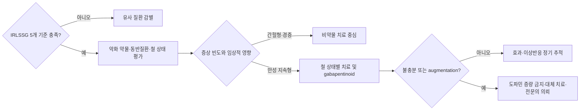

# 하지불안증후군 Restless Legs Syndrome

## <mark style="color:green;">일반 사항</mark>

* 감각운동 신경계 질환으로, 휴식하거나 움직이지 않을 때 다리를 움직이고 싶은 강한 충동(urge to move)이 발생 또는 악화되고 움직이는 동안 부분적 또는 완전하게 호전됨
  * 움직임 충동은 환자가 느끼는 증상이며, 실제 다리 움직임은 대개 불편감을 줄이기 위한 의식적 대처 행동임. 수면 중 주기적 사지 움직임(PLMS)은 불수의적 움직임으로 구분
* 다른 이름 : Willis-Ekbom disease
* 증상은 대개 다리에서 시작하지만 팔·몸통 등에도 나타날 수 있고, 중증도와 경과는 변동함. 연령과 함께 악화되기도 하지만 경증에서는 관해될 수 있음
* 특발성(idiopathic) RLS와 철 결핍, 만성콩팥병, 임신 등 특정 상태에 동반된 RLS로 구분할 수 있으나, 조기·후기 발병과 특발성·동반성 RLS가 일대일로 대응하지는 않음
* 유병률 : 성인 2\~3%(주 2회 이상, 중등도 이상 증상 기준)

## <mark style="color:green;">원인</mark>

* 병태생리는 단일한 도파민 결핍으로 설명되지 않으며, 뇌 철 대사 이상, 유전적 소인, 도파민계의 일주기 조절 이상 및 증가된 시냅스전 도파민 활성, glutamate 매개 시상-피질 과각성 등이 복합적으로 관여하는 것으로 추정
* 동반 상태 : 철 결핍, 만성콩팥병·말기콩팥병, 임신, 말초신경병증, 다발경화증, 파킨슨병, 폐쇄수면무호흡증(OSA), opioid 금단 등
* 악화 요인 : 수면 부족·장시간 비활동, 스트레스, 알코올, 카페인, 니코틴, 일부 약물
  * 약물
    * 항우울제 : SSRI/SNRI, mirtazapine
    * 항정신병제
    * 중추성 H1 항히스타민제(특히 diphenhydramine 등 1세대 항히스타민제)
    * 도파민 차단제(metoclopramide 등), 일부 항구토제

### <mark style="color:orange;">위험 인자</mark>

* 철분 결핍, 만성콩팥병·말기콩팥병, 임신, 말초신경병증, 일부 약물
* 가족력 : 50%에서 가족력이 있음 (상염색체 우성 경향)
* 여성, 고령(약 70세까지 유병률 증가)

## <mark style="color:green;">임상 양상</mark>

* 불쾌한 이상 감각 : 움직이고 싶은 충동, 벌레가 기어 다니는 느낌, 불안정감, 가려움, 통증; 피부보다 깊은 부위에서의 느낌
* 활동으로 호전, 비활동으로 재발
* 발생 빈도 : 다양(매일 \~ ＜1회/월)
* 발생 시기 : 저녁\~밤(주로 잠들기 전); 낮에도 발생할 수 있음
* 중증도 : 다양(무시할 만함\~생활에 지장을 줌)
* 동반 증상 : 수면 장애(수면 개시 어려움), 피로, 불안, 주간 졸음
* 동반 소견 : 수면 중 주기적 사지 움직임(periodic limb movements during sleep, PLMS) - 수면 중 나타나는 불수의적·반복적 사지 움직임으로 흔히 15\~30초 간격이나, RLS 진단에 필수적이지 않음

### <mark style="color:$danger;">🚩 Red Flags!</mark>

<mark style="color:$danger;">**즉각 의뢰 또는 이송**</mark>

* 급성 근력 저하 또는 급성 보행 불능
* 감각 수준(sensory level), 새로 발생한 배뇨·배변 장애, 안장 감각 저하 등 척수·마미 병변 의심 소견 - 즉시 응급실로 이송하여 신경외과·정형외과 척추 또는 신경과의 긴급 평가와 영상검사 시행
* 급성 국소 신경학적 결손 또는 의식 변화
* 도파민 작용제 감량 중 구체적 자살 계획·의도, 수단 확보 또는 안전 확보 불가 - dopamine agonist withdrawal syndrome(DAWS) 가능성을 고려하여 즉시 정신건강 응급 평가

<mark style="color:$warning;">**당일 또는 조기 의뢰**</mark>

* 도파민 작용제 복용 중 증상이 이전보다 이른 시각에 발생하거나 상지·몸통으로 확산되는 등 augmentation 의심
* 도파민 작용제 감량 중 심한 반동 증상, 불안·우울 악화 또는 구체적 계획·의도가 없는 자살사고(도파민 작용제 금단증후군, DAWS 의심)
* 임신 중 일상생활·수면을 현저히 방해하는 중증 RLS
* 적절한 철분 교정과 gabapentinoid 치료에도 조절되지 않는 난치성 RLS

<mark style="color:$info;">**외래 추적 / 추가 평가**</mark>

* 편측성, 낮 동안 지속되는 통증·감각 이상, 신경학적 진찰 이상 등 비전형적 증상 - 말초신경·척수·혈관·근골격계 질환 감별
* 철분 보충 후 약 3개월에 ferritin과 transferrin saturation(TSAT) 재평가
* 도파민 작용제 복용 환자는 매 방문마다 augmentation과 충동조절장애 확인

## <mark style="color:green;">진단</mark>

* 철분 검사: 아침에 철분 함유 음식·보충제를 최소 24시간 피한 상태에서 채혈; ferritin, TSAT(= Fe/TIBC × 100), Fe, TIBC
* 필요시 : BUN/Cr (신부전 배제), 혈당, 말초신경병증 평가
* 필요시 수면다원검사(polysomnography) - 대부분 임상 진단으로 충분, 일상적으로 불필요; PLMD 동반 의심·감별 진단 불확실 시에만 시행

### <mark style="color:orange;">진단 기준</mark> \[IRLSSG 2014]

#### <mark style="color:$primary;">Essential diagnostic criteria</mark>

* 다음 사항에 모두 해당

1. 하지의 불편하고 불쾌한 느낌을 동반하는 하지의 움직임 충동 (간혹 팔 등 다른 부위 이환)
2. 하지의 움직임 충동 및 동반되는 불쾌감은 휴식 중 시작 또는 악화
3. 하지의 움직임 충동 및 동반되는 불쾌감은 움직임(예: 보행, 스트레칭)에 의해 완전히 또는 부분적으로 완화
4. 하지의 움직임 충동 및 동반되는 불쾌감은 저녁이나 야간에 발생 또는 악화
5. 상기 사항들은 다른 의학적 문제(예: myalgia, venous stasis, leg edema, arthritis, leg cramps, positional discomfort [자세성 불편감], habitual foot tapping)의 1차적 증상으로 설명되지 않음

_✽ 중증 RLS에서는 **증상이 하루 종일 나타나 야간 우세가 불분명할 수 있으나**, 치료 전 또는 과거에는 저녁·야간 악화 양상이 존재해야 함._

#### <mark style="color:$primary;">Specifiers for clinical course</mark>

* Chronic-persistent RLS : 치료하지 않았을 때 지난 1년간 ≥2회/주 발생
* Intermittent RLS : 치료하지 않았을 때 지난 1년간 ＜2회/주, 평생 총 ≥5회 발생

#### <mark style="color:$primary;">Specifier for clinical significance</mark>

* RLS의 증상이 수면, 활력, 일상 활동, 행동, 인지, 또는 감정에 영향을 끼쳐 사회적, 직업적, 교육적, 또는 기타 중요한 영역에서 중대한 고통이나 장애를 초래하는 상태

### <mark style="color:orange;">감별</mark>

<table><thead><tr><th width="168">질환</th><th width="220">RLS와의 차이점</th><th>핵심 감별 포인트</th></tr></thead><tbody><tr><td>야간 다리 경련<br>(Nocturnal leg cramp)</td><td>근육의 지속적 수축·뭉침이 보이거나 촉진되고 국소 통증이 뚜렷함</td><td>수축된 근육의 스트레칭으로 호전; 움직임 <em>충동</em>은 없음</td></tr><tr><td>말초신경병증<br>(Peripheral neuropathy)</td><td>저림·화끈거림·감각저하가 지속적이고 양말·장갑 분포를 보일 수 있음</td><td>움직이는 동안의 일관된 호전과 뚜렷한 저녁·야간 우세가 없을 수 있음; RLS와 동반 가능하므로 신경학적 진찰 병행</td></tr><tr><td>정좌불능증<br>(Akathisia)</td><td>전신적 안절부절못함과 내적 초조감; 다리에 국한되지 않음</td><td>항정신병제·항구토제 등 원인 약물 확인; RLS 특유의 국소 감각과 저녁·야간 우세가 대개 없음</td></tr><tr><td>PLMD<br>(Periodic limb movement disorder)</td><td>수면 중 반복적 사지 움직임과 수면·주간 기능 장애</td><td>깨어 있을 때의 움직임 충동·이상 감각이 없음. PSG로 PLMS를 확인하고 RLS·OSA·약물 등 다른 원인을 배제해야 진단</td></tr><tr><td>하지정맥류<br>(Varicose veins)</td><td>정맥 확장, 부종·묵직함·통증</td><td>육안·진찰 소견과 기립 시 악화 여부 확인; RLS의 네 가지 시간·활동 특성을 모두 충족하지 않음</td></tr><tr><td>혈관성 파행<br>(Vascular claudication)</td><td>보행으로 악화, 휴식으로 호전</td><td>움직임 충동 없음; 맥박·ABI 이상 여부 확인</td></tr><tr><td>섬유근육통<br>(Fibromyalgia)</td><td>광범위 통증·피로·수면 장애</td><td>휴식 유발·움직이는 동안 호전·저녁 우세의 조합이 전형적이지 않음 (☞ <a href="../228_/153_-fibromyalgia.md">섬유근육통</a>)</td></tr><tr><td>Positional discomfort</td><td>특정 자세를 오래 유지할 때 발생</td><td>단순 자세 변경만으로 즉시 호전하며 반복적으로 움직일 충동이 없음</td></tr></tbody></table>

***



_<mark style="color:$info;">하지불안증후군 진단·치료 진입 알고리듬. 출처: IRLSSG 2014, AASM 2025 및 RLS Foundation 2026 알고리듬을 바탕으로 재구성.</mark>_

***

## <mark style="background-color:$warning;">Management</mark>

### <mark style="color:orange;">치료 방침</mark>

* 치료 목표 : 증상 완화, 주간 기능 회복, 수면 개선, 삶의 질 향상

#### <mark style="color:$primary;">치료 Step</mark>

**Step 1.** **진단 및 Red flags 배제**

**Step 2. 동반 상태·교정 가능한 요인 치료** - 철 결핍, 만성콩팥병, 임신, OSA 등 평가 및 치료

**Step 3. 관련 약물 파악**

* 악화 약물 중단 또는 대체 - SSRI/SNRI, mirtazapine, 항히스타민제(특히 diphenhydramine 함유 감기약·수면제), 도파민 차단제(metoclopramide 등)
* 우울증 동반 시 항우울제 선택
  * bupropion <mark style="color:blue;">\[웰부트린]</mark>은 다른 항우울제보다 RLS 악화 가능성이 낮을 수 있어 SSRI/SNRI/mirtazapine을 교체해야 하는 상황에서 고려 가능
  * 다만 **RLS 자체의 치료제로는** 효과가 불충분하여 AASM 조건부 권고 반대

**Step 4. 철분 보충** - ferritin/TSAT에 따라 (아래 약물 치료 참조)

**Step 5. 중증도 평가**

**Intermittent (간헐적)**

* 주 ＜2회, 삶의 질 영향 적음
* 치료 : 비약물 치료 우선. 특정 상황에서 증상이 불편한 경우 저용량 levodopa 또는 단시간형 도파민 작용제의 간헐적 사용을 공유 의사결정 후 고려할 수 있으나, 반복적·일상적 사용은 augmentation 위험 때문에 피함

**Chronic persistent**

* 주 ≥2회, 수면/삶의 질 영향 있음

**Step 6. 1차 약물 치료** : 중등도 이상으로 수면·삶의 질에 영향을 주는 경우 고려

**First-line**

* Gabapentinoid
  * gabapentin 100\~300 ㎎ 시작 → 300\~900 ㎎
  * pregabalin 25\~75 ㎎ 시작 → 150\~300 ㎎

**제한적 대안**

* 도파민 작용제 : gabapentinoid가 부적합·불내성이거나 효과가 불충분하고, 환자가 장기 augmentation·충동조절장애 위험을 충분히 이해한 경우에만 고려

**Step 7. Augmentation 모니터링** (매 방문마다)

* 체크리스트 : 증상이 더 일찍 시작?, 강도 증가?, 팔/몸통 확산?, 약 늘렸는데 더 악화?; 하나라도 해당 시 augmentation 의심

**Step 8. Augmentation 발생 시**

* **도파민 작용제 증량 금지**
* 철 상태와 악화 약물을 재평가하고 gabapentin/pregabalin 등 대체 치료를 먼저 도입하여 내약 가능한 유효 용량까지 적정하고 증상 조절을 확인한 뒤 도파민 작용제를 매우 서서히 감량; 가능하면 수면의학·신경과 전문의 의뢰

**Step 9. Refractory RLS**

* 적절한 철분 치료와 gabapentinoid에도 조절되지 않거나 심한 augmentation이 있는 경우
* 조치 : IV 철분 적응 재평가, 저용량 장시간형 opioid 또는 비골신경 자극 고려, 전문의 의뢰

**Step 10. 비약물 치료** (모든 단계에서)

## <mark style="color:green;">비약물 치료 및 예방</mark>

* 주간의 활발한 활동, 규칙적 운동(지나친 운동은 피함), 저녁 때 가벼운 걷기
* 적절한 규칙적 수면
* 수면무호흡증(OSA) 동반 시 CPAP 치료 - OSA 치료 후 RLS 호전되는 경우 있음; 일부에서는 CPAP 치료 후 RLS가 드러나기도 함(unmasking)
* 다리 마사지, 온찜질, 다리 보온(긴 양말)
* 저녁 때 알코올, 카페인, 니코틴 회피
* 활발한 두뇌 활동(게임, 퍼즐)
* 양측 고주파 비골신경 자극(bilateral high-frequency peroneal nerve stimulation) : 약물치료에 반응하지 않는 성인 RLS의 비침습적 보조 치료(AASM 2025 조건부 권고, 중등도 근거 확실성); 국내 허가·이용 가능 여부 확인 필요

## <mark style="color:green;">약물 치료</mark>

* 1차 선택제 : 철 상태에 따른 철분 치료와 gabapentinoid. 기존 1차 치료제였던 도파민 작용제(pramipexole, ropinirole, rotigotine)는 augmentation 위험 때문에 표준적 일상 사용에 대한 조건부 권고 반대로 변경됨(AASM 2025)

#### <mark style="color:$primary;">철분 보충</mark>

**철분 보충 의사결정 기준**

* 모든 임상적으로 유의한 RLS에서 ferritin과 TSAT를 측정하고, 아침에 철분 함유 음식·보충제를 최소 24시간 피한 상태에서 채혈
* AASM 2025와 RLS Foundation 2026은 근거의 성격과 IV 철분 고려 범위가 다르므로 구분하여 적용

<table><thead><tr><th width="176">기준</th><th width="230">철 지표</th><th>임상적 해석</th></tr></thead><tbody><tr><td>AASM 2025<br>Good practice statement</td><td>Ferritin ≤75 ng/㎖ 또는 TSAT ＜20%</td><td>경구 또는 IV 철분 고려</td></tr><tr><td>AASM 2025<br>Good practice statement</td><td>Ferritin 75\~100 ng/㎖</td><td>경구 흡수가 제한되므로 철분 치료 시 IV 제형 사용</td></tr><tr><td>RLS Foundation 2026<br>전문가 알고리듬</td><td>만성 지속성 RLS에서 ferritin ≤300 ng/㎖이고 TSAT ＜45%</td><td>IV 철분을 고려할 수 있는 확대된 전문가 합의 범위. 증상 중증도, 기존 경구 철분 반응 및 철 과부하 위험을 함께 판단</td></tr></tbody></table>

* ferritin ＞300 ng/㎖ 또는 TSAT ≥45%이면 철 과부하 위험 때문에 IV 철분을 투여하지 않음
* ferritin 100\~150 ng/㎖는 일부 전문가가 사용하는 실무적 목표 범위이며 AASM의 공식 치료 목표는 아님
* 염증·감염·간질환 시 ferritin은 급성기 반응 물질로 허위 상승 가능 - 이 경우 TSAT ＜ 20%가 철분 부족을 시사하는 더 강력한 지표가 됨
* ferritin ≥75 ng/㎖에서는 hepcidin 증가로 경구 철분 흡수가 제한되므로 IV 철분을 우선 고려
* IV ferric carboxymaltose <mark style="color:blue;">\[페린젝트주]</mark> : 적절한 철 상태의 성인 RLS에서 AASM 강력 권고. 임상 반응은 4\~6주 이후 나타나고 최대 효과까지 1\~3개월 걸릴 수 있음
  * RLS 치료 목적은 국내 허가 외 사용
  * 과민반응·드문 아나필락시스와 증상성 저인산혈증 위험. 투여 후 최소 30분간 과민반응을 관찰하고, 저인산혈증 위험 환자 또는 3개월 이내 반복 투여 예정 환자에서는 투여 전 혈청 인산염 확인
* 경구 ferrous sulfate : ferritin ≤75 ng/㎖ 또는 TSAT ＜20% 시 투여 (조건부 권고) (☞ [철결핍빈혈](../230_/193_-iron-deficiency-anemia.md))
  * 공복(식전 1시간) 복용을 우선하되 위장 장애 시 음식과 함께 복용할 수 있음. 비타민 C 병용은 선택 사항
  * ferritin ＞75 ng/㎖이면 경구 흡수 불량(hepcidin 상승으로 십이지장 철분 흡수 억제) → IV 철분제 고려
  * 매일 또는 격일 복용 가능. 격일 복용은 철 흡수와 위장관 내약성 자료를 적용한 실무 전략이며 RLS 자체에 대한 강한 비교 근거는 제한적
* IV low molecular weight iron dextran, IV ferumoxytol : AASM 조건부 권고. 국내 유통·허가 여부 확인 필요

#### <mark style="color:$primary;">Gabapentinoids (α2δ 칼슘통로 리간드)</mark>

* 1차 선택 - gabapentin <mark style="color:blue;">\[뉴론틴]</mark>·pregabalin <mark style="color:blue;">\[리리카]</mark>은 국내 RLS 적응증 미승인(허가 외 사용); gabapentin enacarbil은 국내 미발매
* 장점 : 도파민 작용제와 달리 현재까지 augmentation 근거가 없고 수면 개선, 불안·통증 동반 시 유리
* 주의 : 어지럼, 보행 불안정·낙상, 졸림, 인지 저하, 부종·체중 증가, 우울 악화·자살사고, 오남용 가능성
  * 고령자, OSA·COPD 등 호흡기 질환, opioid·benzodiazepine·기타 중추신경억제제 병용 시 진정과 호흡억제 위험 증가
* 용법 : 증상 발생 1\~2시간 전 저녁 복용 (고령자에서는 low & slow)

**신기능 저하 시 용량 조절 원칙**

* 두 약제 모두 신장 배설되므로 CrCl에 따라 감량. RLS 목표 용량과 다른 적응증의 제품 허가상 최대용량을 혼용하지 않음
* 정상 신기능에서 정한 RLS 목표 일일용량을 기준으로 각 제품 첨부문서의 CrCl별 용량·투여 간격 조절표를 적용하고 환자 반응과 이상반응에 따라 추가 감량
* 혈액투석 환자는 투석 후 보충용량이 필요할 수 있으므로 제품 첨부문서 확인 또는 전문의 자문

* gabapentin : 100\~300 ㎎ qd(저녁)로 시작 → 일반적 유효 용량 300\~900 ㎎/d. 600 ㎎을 넘는 단회 투여에서는 흡수가 용량에 비례하지 않으므로 고용량이 필요하면 저녁 시간대 분할 투여 고려
* pregabalin : 25\~75 ㎎ qd(저녁)로 시작 → 일반적 유효 용량 150\~300 ㎎/d
* gabapentin enacarbil : 600 ㎎/d (저녁) - 국내 미발매; FDA 유일 RLS 승인 gabapentinoid; prodrug 기전으로 흡수 변동성 감소, 일반 gabapentin 대비 약동학 안정성 향상

#### <mark style="color:$primary;">도파민 작용제</mark>

* 표준적 일상 사용에 대한 조건부 권고 반대(AASM 2025). gabapentinoid가 부적합·불내성이거나 불충분하고 환자가 augmentation·충동조절장애 위험을 수용하는 경우에만 제한적으로 선택
* Augmentation이 의심되면 **증량하지 말고**, 대체 치료를 먼저 도입한 뒤 매우 서서히 감량
* pramipexole : 0.125 ㎎ qd, 취침 2\~3시간 전 → 필요 시 4\~7일마다 증량. 국내 허가 및 전문가 권장 최대 0.5 ㎎ qd <mark style="color:blue;">\[미라펙스]</mark>
  * RLS 유효 용량(0.125\~0.5 ㎎/d)은 파킨슨병 용량보다 훨씬 낮으므로 파킨슨병 용량 기준으로 처방하지 않도록 주의
* ropinirole : 0.25 ㎎ qd, 취침 1\~3시간 전 → 내약성이 양호하면 3일째부터 0.5 ㎎, 이후 주 단위로 증량 <mark style="color:blue;">\[리큅]</mark>
  * 국내 허가 최대 4 ㎎/d이나, augmentation 위험을 줄이기 위한 최신 전문가 권장 상한은 통상 2 ㎎/d
* rotigotine : 1 ㎎/24 h 패치 qd → 필요 시 1주마다 1 ㎎/24 h 증량. 전문가 권장 최대 3 ㎎/24 h <mark style="color:blue;">\[뉴프로 패취]</mark>
* 충동조절장애 주의 : 병적 도박, 과식, 과성욕, 충동구매 등이 발생할 수 있음 - 특히 pramipexole에서 보고 많음; 매 방문마다 확인 필요
* 정신병적 증상·충동조절장애 병력, 주간 졸림·수면발작, 기립성 저혈압에서는 신중히 사용. 도파민 길항제 병용 시 효과가 감소하거나 증상이 악화될 수 있음

**도파민 작용제 Augmentation**

* 도파민 작용제를 장기 사용하면 augmentation이 발생할 수 있음
* 진단 단서(Max Planck Institute augmentation diagnostic criteria, 2007) - 다음 중 하나 이상이면 의심
  * 복용 전보다 4시간 이상 일찍 증상 발생
  * 용량 증가 시 단기 호전 후 재악화, 또는 감량 시 일시적 호전
  * 증상 발생 시간대가 하루 전체로 확장
  * 상지·몸통 등 다른 신체 부위로 증상 확산
  * 전반적 증상 강도 증가
* 발생률 : 도파민 작용제에서 연간 약 7\~10%로 보고되며, 장기 사용 시 누적 위험이 큼. 위험도는 약제·용량·치료기간에 따라 다르므로 특정 누적률을 개별 환자에게 그대로 적용하지 않음
* Augmentation 위험 인자
  * 도파민 작용제 고용량 또는 장기 사용
  * levodopa 사용 (dopamine agonist보다 augmentation 위험 높음)
  * ferritin 낮음 (＜ 75 ng/mL)
  * 장기 사용 기간
* 증상이 심해졌다고 증량하면 augmentation이 가속화됨. **Augmentation 의심 시 증량 금지** (초기 titration 시 용량 증량은 용법에 따라 허용)
* AASM 2025 가이드라인은 도파민 작용제의 표준적 사용에 대해 조건부 권고 반대 명시
* Augmentation 발생 시 교체 전략 (Tapering + Overlapping)
  1. 철 상태, 악화 약물, OSA 등 교정 가능한 요인을 재평가
  2. gabapentinoid 등 대체 치료를 먼저 도입하고 증상 조절을 확인
  3. 이후 도파민 작용제를 수 주\~수개월에 걸쳐 매우 서서히 감량(예: 현재 용량의 10\~25%씩 2\~4주 간격); 반동 증상에 따라 더 늦춤
  4. 급격한 중단과 격일 투여는 피함. 심한 반동 증상뿐 아니라 불안·우울·자살사고를 동반한 dopamine agonist withdrawal syndrome을 모니터링
  5. gabapentinoid만으로 감량이 어렵다면 전문의 감독하에 저용량 장시간형 opioid를 고려

#### <mark style="color:$primary;">항파킨슨제</mark>

* 특정 상황에서 발생하는 간헐적 증상에 대하여 필요 시 선택할 수 있으나, 반복적·일상적 사용은 높은 augmentation·반동 위험 때문에 피함(AASM 2025 표준 사용 조건부 권고 반대)
* carbidopa/levodopa : levodopa 성분량 100\~200 ㎎을 증상 예상 전에 간헐적으로 사용 <mark style="color:blue;">\[시네메트]</mark> - 국내 RLS 적응증 미승인(허가 외 사용)

#### <mark style="color:$primary;">Opioid (조건부 권고)</mark>

* 적응 : 적절한 철분 치료와 gabapentinoid에도 조절되지 않는 중등\~중증 RLS 또는 도파민 작용제 augmentation 감량 보조
* **사용 원칙 : refractory RLS에 한해 전문가 감독하(specialist setting) 제한적 사용**


⚠️ **Opioid 처방 시 주의**

* 의존성·오남용 위험 - 복용 기간 최소화, 주기적 재평가 필요
* 국내 마약성 진통제 처방 장벽(규제, 서류, 진료 기록) 고려
* 중추성 수면무호흡증 위험 - 특히 고용량 또는 다른 진정제 병용 시
* RLS 치료 목적은 국내 허가 외 사용


* 증상이 장시간 지속되는 난치성 RLS에서는 저용량 장시간형 제제를 고려
* 근거·전문가 합의 용량 예 : methadone 2.5\~20 ㎎/d, buprenorphine 0.5\~6 ㎎/d, oxycodone 5\~40 ㎎/d. 국내 규제·가용성·제품 조성을 확인하고 전문의가 개별화
* tramadol은 발작·세로토닌독성·의존성과 augmentation 보고가 있어 일반적 표준 옵션으로 제시하지 않음

#### <mark style="color:$primary;">기타 조건부 대안</mark>

* dipyridamole : 100\~200 ㎎/d; 아데노신 기전; 소규모 RCT 근거 <mark style="color:blue;">\[페르산틴]</mark>
  * AASM 2025 조건부 권고, 낮은 근거 확실성; 국내 RLS 적응증 미승인(허가 외 사용)

#### <mark style="color:$primary;">근거 불충분 약제·보충제</mark>

* clonidine·baclofen : 근거가 매우 제한적이며 AASM 2025 권고 약제가 아니므로 일상적 사용을 권고하지 않음
* Mg, Vit B12, folate 등 비타민·미네랄 : 확인된 결핍이 있을 때만 보충; RLS 자체 치료 효과는 확립되지 않음

#### <mark style="color:$primary;">권고하지 않는 약제</mark> (AASM 2025)

<table><thead><tr><th width="222">약제</th><th width="165">권고 수준</th><th>이유</th></tr></thead><tbody><tr><td>cabergoline <mark style="color:blue;">[카버락틴]</mark></td><td>강력 권고 반대</td><td>심장판막 손상 위험</td></tr><tr><td>bupropion <mark style="color:blue;">[웰부트린]</mark></td><td>조건부 권고 반대</td><td><strong>RLS 치료 목적</strong>: 치료 효과 불충분<br><strong>우울증 치료 시</strong>: 다른 항우울제보다 RLS 악화 가능성이 낮을 수 있어 선택지로 고려 가능</td></tr><tr><td>clonazepam <mark style="color:blue;">[리보트릴]</mark></td><td>조건부 권고 반대</td><td>임상적 유의한 호전 미입증</td></tr><tr><td>carbamazepine <mark style="color:blue;">[테그레톨]</mark></td><td>조건부 권고 반대</td><td>임상적 유의한 호전 미입증</td></tr><tr><td>valproic acid <mark style="color:blue;">[데파킨]</mark></td><td>조건부 권고 반대</td><td>임상적 유의한 호전 미입증</td></tr><tr><td>valerian</td><td>조건부 권고 반대</td><td>효과 근거 불충분</td></tr><tr><td>pergolide</td><td>-</td><td>심장판막 손상으로 국내외 퇴출</td></tr></tbody></table>

#### <mark style="color:$primary;">임신 중 RLS</mark>

* 임신 중 RLS 유병률 : 약 20\~26%
* 주로 3분기에 악화, 대부분 분만 후 수주 내 자연 소실
* 1차 : 비약물 치료(가벼운 운동, 수면 관리, 카페인·알코올 회피)와 철 상태 평가
* 철 결핍이 있으면 경구 철분을 우선. 경구 철분에 반응하지 않고 ferritin이 낮은 중증 RLS에서는 일반적으로 제2·3삼분기에 **산부인과 협진하에** IV 철분을 신중히 고려
  * ferric carboxymaltose의 임신 중 태아 안전성 자료는 제한적이므로 “태아 영향 없음”으로 단정하지 않음
* gabapentin : 사람에서 주요 기형 증가가 확립되지는 않았으나 RLS 치료 안전성 자료가 제한적. 불가피한 중증에서 산부인과·신경과 협진하에 최소 유효 용량 고려
* pregabalin·gabapentin enacarbil·도파민 작용제 : 임신 중 RLS 치료 자료가 부족하여 가급적 회피. 도파민 작용제는 수유 중 prolactin 억제로 모유 분비를 감소시킬 수 있음
* 약물 치료가 필요할 정도의 중증이면 산부인과·수면의학 또는 신경과 협진

_<mark style="color:$info;">Ref. Picchietti DL et al. Consensus clinical practice guidelines for the diagnosis and treatment of restless legs syndrome/Willis-Ekbom disease during pregnancy and lactation. Sleep Med Rev. 2015;22:64-77.</mark>_

#### <mark style="color:$primary;">소아 RLS</mark>

* 소아·청소년에서도 발생; IRLSSG의 5개 필수 기준을 모두 충족하고, 소아가 자신의 연령에 맞는 언어로 증상을 설명할 수 있어야 함
* **ADHD와 연관** : 소아 RLS의 상당수가 ADHD 증상을 동반
  * **임상적 함정** : RLS로 인한 수면 장애가 주의력 저하·과잉행동으로 나타나 ADHD처럼 보일 수 있으므로 야간 증상과 수면 상태를 함께 평가
* **철분 결핍** : 중요한 가역적 요인 - ferritin·TSAT 검사 및 적절한 철분 보충이 우선
* AASM 2025는 적절한 철 상태의 소아 RLS에서 ferrous sulfate를 조건부 권고하나 근거 확실성은 매우 낮음
* 소아에서 RLS 적응증으로 허가된 약물 없음; 적절한 철분 치료 후에도 지속되면 소아신경과·소아수면 전문의 의뢰

_<mark style="color:$info;">Ref. Winkelman JW et al. Treatment of restless legs syndrome and periodic limb movement disorder: an American Academy of Sleep Medicine clinical practice guideline. J Clin Sleep Med. 2025;21(1):137-152.</mark>_

_<mark style="color:$info;">Ref. Silber MH et al. An updated algorithm for the management of restless legs syndrome. Mayo Clin Proc. 2026. doi:10.1016/j.mayocp.2026.05.010.</mark>_

_<mark style="color:$info;">Ref. Winkelman JW, Wipper B. Restless legs syndrome: a review. JAMA. 2026;335(8):703-714.</mark>_

_<mark style="color:$info;">Ref. Allen RP et al. Restless legs syndrome/Willis-Ekbom disease diagnostic criteria: updated IRLSSG consensus criteria. Sleep Med. 2014;15(8):860-873.</mark>_

_<mark style="color:$info;">Ref. Garcia-Borreguero D et al. Diagnostic standards for dopaminergic augmentation of restless legs syndrome. Sleep Med. 2007;8(5):520-530.</mark>_

***

### <mark style="color:red;">질병코드</mark>

G25.8 하지불안증후군

***

## <mark style="color:purple;">처방례</mark>

> **처방례 1.** 1차 선택 - gabapentin
>
> ```
> 뉴론틴 300 ㎎/C  1C  저녁 식후 (증상 발생 1~2시간 전)
> ※ 국내 RLS 적응증 미승인(허가 외 사용)
> ※ 반응 불충분 시 1~2주 간격으로 증량 (일반적 목표 300~900 ㎎/d)
> ※ 600 ㎎ 초과 단회 투여는 흡수 효율이 낮아질 수 있어 고용량에서는 저녁 시간대 분할 고려
> ※ 신기능 저하 시 CrCl과 제품 첨부문서에 따라 감량
> ※ 어지럼·졸림·낙상·호흡억제 주의; 고령자와 opioid·기타 진정제 병용 환자는 특히 주의
> ```

> **처방례 2.** 1차 선택 - pregabalin (gabapentin 불내성 또는 신경병증 동반)
>
> ```
> 리리카 75 ㎎/C  1C  저녁 취침 전
> ※ 국내 RLS 적응증 미승인(허가 외 사용)
> ※ 반응 불충분 시 1~2주 간격으로 150~300 ㎎/d까지 증량
> ※ 신기능 저하 시 CrCl과 제품 첨부문서에 따라 감량
> ※ 체중 증가·어지럼·부종·낙상·호흡억제 주의
> ```

> **처방례 3.** 경구 철분 보충 - ferritin ≤75 ng/mL 또는 transferrin saturation rate ＜20%
>
> ```
> 훼로바-유 서방정 1T  격일(이틀에 한 번) 공복(식전 1시간)
> ※ 위장 장애가 있으면 음식과 함께 복용할 수 있음
> ※ 격일 복용은 철 흡수·내약성을 고려한 실무 전략이며 매일 복용도 가능
> ※ 비타민 C 병용은 선택 사항
> ※ 3개월 후 ferritin, transferrin saturation rate 재검
> ※ ferritin 75~100 ng/mL 또는 경구 철분 불내성·흡수장애 시 → IV 철분 평가
> ※ IV 철분의 RLS 치료 목적 사용은 국내 허가 외이며 저인산혈증·과민반응에 주의
> ```

> **처방례 3-1.** 정맥 철분 보충 - ferric carboxymaltose
>
> ```
> 페린젝트주 500 ㎎/10 mL 또는 1,000 ㎎/20 mL  IV infusion
> 투여량 : RLS 알고리듬에서는 ferric carboxymaltose 총 1,000 ㎎을 흔히 사용하되, 체중·Hb·철 결핍 정도와 국내 첨부문서에 따라 1회량 결정
> ※ 고려 대상 : ferritin 75~100 ng/mL, 경구 철분 불내성·흡수장애 또는 적절한 경구 철분에도 지속되는 임상적으로 유의한 RLS
> ※ RLS Foundation 2026 확대 기준(ferritin ≤300 ng/mL 및 TSAT ＜45%) 적용 시 증상 중증도·기존 반응·철 과부하 위험을 함께 평가
> ※ RLS 치료 목적 사용은 국내 허가 외 사용(Off-label)
> ※ 1회 최대 : 철 1,000 ㎎ 또는 20 ㎎/㎏ 중 적은 양; 철 1,000 ㎎ 투여는 주 1회를 초과하지 않음
> ※ 생리식염주사액으로만 희석하고 용량별 희석량·주입시간은 첨부문서에 따름; 철 1,000 ㎎은 15분 이상 정맥 점적
> ※ 투여 중과 투여 후 최소 30분간 과민반응·아나필락시스 및 활력징후 관찰
> ※ 임상반응과 ferritin·TSAT는 대체로 8~12주 후 재평가; 증상 재발로 반복 투여할 때는 이전 투여 후 최소 12주 간격
> ※ 저인산혈증 위험 환자 또는 3개월 이내 반복 투여 예정 환자는 투여 전 혈청 인산염 확인
> ```

> **처방례 4.** 도파민 작용제 단기 사용 - gabapentin 계열 불내성 또는 즉각적 증상 조절 필요 시
>
> ```
> 미라펙스 0.125 ㎎/T  1T  취침 2~3시간 전
> ※ 장기 사용 시 augmentation 위험 (연간 7~10%) - 매 방문마다 모니터링 필수
> ※ 충동조절장애(병적 도박, 과식, 충동구매 등) 발생 가능 - 매 방문마다 확인
> ※ 증상이 낮 시간대로 앞당겨지거나 팔로 확산되면 약을 증량하지 말고 처방의에게 신속히 연락
> ※ Augmentation 의심 시 증량 금지 - 증량은 augmentation을 가속화함 (초기 titration 제외)
> ※ 최대 0.5 ㎎/d 초과 금지
> ```
>
> **Augmentation 발생 시 교체 방법**\
> ① 철 상태·악화 약물·OSA를 재평가하고 gabapentinoid 등 대체 치료를 먼저 시작\
> ② 대체 치료를 내약 가능한 유효 용량까지 적정하고 증상 조절을 확인한 뒤 미라펙스를 매우 서서히 감량(예: 현재 용량의 10~25%씩 2~4주 간격; 환자 반응에 따라 더 늦춤)\
> ③ 격일 투여와 갑작스러운 중단은 피함\
> ④ 심한 반동 증상, 불안·우울 악화가 나타나면 DAWS 가능성을 고려하여 신속히 평가하고 전문의 의뢰; 구체적 자살 계획·의도 또는 안전 확보가 어려우면 즉시 정신건강 응급 평가

***

### <mark style="color:$success;">핵심 복약 지도</mark>

> **하지불안증후군 약물 복용 안내**
>
> * gabapentin<mark style="color:blue;">\[뉴론틴]</mark>, pregabalin<mark style="color:blue;">\[리리카]</mark>은 저녁에 복용합니다. 어지럼, 졸음이 생길 수 있으므로 복용 후 운전은 삼가 주십시오.
> * 신장 기능에 따라 용량 조절이 필요할 수 있으므로 의사가 지시한 용량을 지켜 주십시오. opioid·수면제·진정제 또는 술과 함께 복용하면 심한 졸림과 호흡억제 위험이 커질 수 있습니다.
> * 철분제는 공복(식전 1시간)에 복용하면 흡수가 잘 되지만, 속이 불편하면 음식과 함께 복용할 수 있습니다. 변비, 속쓰림이 생길 수 있습니다.
> * 도파민 작용제(<mark style="color:blue;">\[미라펙스]</mark>, <mark style="color:blue;">\[리큅]</mark> 등)를 복용 중이라면 증상 발생 시각이 낮으로 앞당겨지거나 팔로 퍼지는지 주의 깊게 살피십시오 - 이런 경우 약을 증량하지 말고 의사에게 신속히 알려 주십시오.
> * 도파민 작용제를 갑자기 중단하면 반동 증상이 심해질 수 있습니다. 반드시 의사와 상의하여 서서히 줄여 주십시오.
> * 저녁 시간의 카페인, 알코올, 니코틴은 증상을 악화시킵니다.

> **언제 다시 병원을 방문해야 하나요?**
>
> * 증상이 낮 시간(오후 또는 오전)으로 앞당겨지는 경우
> * 다리뿐만 아니라 팔이나 몸통으로 증상이 퍼지는 경우
> * 약 용량을 늘렸는데도 증상이 더 심해지는 경우 (augmentation 의심)
> * 어지럼, 낙상, 심한 졸음, 충동 조절 문제가 생기는 경우
> * 적절한 용량으로 4\~6주 치료 후에도 증상 호전이 없는 경우

***

### <mark style="color:blue;">환자 안내서</mark>


**하지불안증후군, 함께 이해하고 관리하기**

하지불안증후군은 적절한 치료와 생활 관리로 충분히 조절될 수 있는 질환입니다.

💡 **핵심 메시지** : 가만히 있을수록 증상이 악화되고, 움직이면 호전된다면 하지불안증후군을 의심할 수 있습니다.


#### <mark style="color:$primary;">하지불안증후군이란 무엇인가요?</mark>

* **하지불안증후군** : 쉬거나 누워 있을 때 다리를 움직이고 싶은 강한 충동과 함께 다리에 불편한 이상 감각(벌레가 기어다니는 느낌, 저림, 통증 등)이 발생하는 신경계 질환입니다
* 저녁\~밤에 심해지고, 다리를 움직이거나 걸으면 일시적으로 나아집니다
* 성인의 약 2\~3%에서 나타나며, 수면 장애와 낮 동안의 피로를 유발합니다
* 철분 부족, 신장 질환, 임신, 일부 약물 등이 원인이 될 수 있습니다

#### <mark style="color:$primary;">어떻게 치료하나요?</mark>

* **철분 검사 및 보충** : 뇌 철분 결핍이 중요한 원인 중 하나입니다. 혈액 검사로 철분 수치를 확인하고, 기준에 따라 철분제를 복용하거나 주사 치료를 받습니다
* **약물 치료** : gabapentin <mark style="color:blue;">\[뉴론틴]</mark>, pregabalin <mark style="color:blue;">\[리리카]</mark> 등이 현재 우선 권고되는 약물입니다. 초기 효과는 수일 내 나타날 수 있지만, 적절한 용량에서 충분한 효과를 판단하려면 수 주가 필요할 수 있습니다. 두 약물은 국내에서 하지불안증후군 치료 목적으로는 허가 외 사용입니다
* **생활 관리** : 규칙적인 운동, 수면 습관 개선, 카페인·알코올 제한이 증상 완화에 도움이 됩니다

#### <mark style="color:$primary;">도파민 약물을 복용 중이라면 꼭 알아 두세요</mark>

<mark style="color:blue;">\[미라펙스]</mark>, <mark style="color:blue;">\[리큅]</mark> 등

* 이 약물들은 단기적으로 효과가 있지만, 오래 복용하면 **증상이 오히려 악화되는 현상(augmentation)**이 나타날 수 있습니다
* 증상이 낮에도 나타나거나, 팔이나 몸통으로 퍼지거나, 약을 늘렸는데도 더 심해진다면 약을 더 늘리지 말고 처방한 의사에게 신속히 알려 주십시오
* 이 약을 갑자기 끊으면 반동 증상이 심해질 수 있으므로, 반드시 의사 지도하에 서서히 줄여야 합니다

#### <mark style="color:$primary;">생활 속 실천 사항</mark>

* **카페인·알코올 제한** : 특히 저녁 시간에는 피하는 것이 좋습니다
* **규칙적인 가벼운 운동** : 지나친 운동은 오히려 악화시킬 수 있습니다
* **수면 스케줄 유지** : 일정한 시간에 자고 일어나는 것이 중요합니다
* **다리 마사지, 온찜질** : 증상 완화에 도움이 됩니다
* **수면무호흡증 치료** : 코골이·수면무호흡이 있다면 함께 치료하면 RLS 증상도 좋아질 수 있습니다
* **⚠️ 감기약·수면보조제 주의** : 일반의약품 수면유도제와 종합감기약에 들어 있는 1세대 항히스타민제, 특히 diphenhydramine <mark style="color:blue;">\[쿨드림연질캡슐]</mark>·doxylamine <mark style="color:blue;">\[아졸정]</mark>·chlorpheniramine 등은 RLS를 악화할 수 있습니다. 불면이 심하더라도 임의로 복용하지 말고, 약국에서 수면유도제나 감기약을 구입할 때 RLS가 있음을 알리고 성분을 확인하십시오
* **우울증 약 복용 중이라면** : 일부 항우울제(SSRI/SNRI, mirtazapine 등)는 RLS를 악화시킬 수 있습니다. 임의로 중단하지 말고 담당 의사와 상의하십시오. Bupropion은 다른 항우울제보다 RLS를 악화시킬 가능성이 낮을 수 있지만 RLS 자체를 치료하는 약은 아닙니다

#### <mark style="color:$primary;">이럴 때는 의료진에게 알려 주세요</mark>

* 증상이 낮 시간으로 앞당겨지거나 팔·몸통으로 퍼지는 경우 - 약을 증량하지 말고 처방의에게 신속히 연락
* 약 용량을 늘렸는데도 증상이 더 심해지는 경우
* 심한 어지럼, 낙상, 충동적 행동(도박, 과식 등)이 생기는 경우
* 갑작스러운 근력 저하, 걷기 어려움, 새 배뇨·배변 장애 또는 안장 부위 감각 저하가 생기면 즉시 응급실 방문
* 도파민 약물을 줄이는 동안 극심한 불안·우울 또는 자살 생각이 생기면 즉시 의료진에게 알리고, 구체적인 자살 계획·의도가 있거나 안전을 유지하기 어렵다면 즉시 응급 평가
