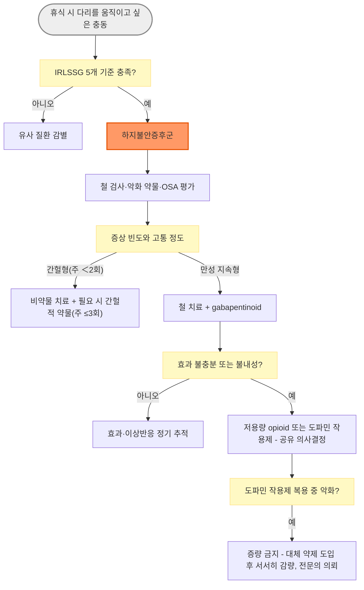

# 하지불안증후군 Restless Legs Syndrome, RLS

## <mark style="color:green;">일반 사항</mark>

* 감각운동 신경계 질환으로, 휴식하거나 움직이지 않을 때 다리를 움직이고 싶은 강한 충동(urge to move)이 발생 또는 악화되고 움직이는 동안 부분적 또는 완전하게 호전됨
  * 움직임 충동은 환자가 느끼는 증상이며, 실제 다리 움직임은 대개 불편감을 줄이기 위한 의식적 대처 행동임. 수면 중 주기적 사지 움직임(PLMS)은 불수의적 움직임으로 구분
* 다른 이름 : Willis-Ekbom disease
* 증상은 대개 다리에서 시작하지만 팔·몸통 등에도 나타날 수 있고, 중증도와 경과는 변동함. 연령과 함께 악화되기도 하지만 경증에서는 관해될 수 있음
* 유병률 : 임상적으로 유의한 RLS(주 ≥2회, 중등도 이상 고통)는 성인의 약 1.5\~3%
* 병태생리 : 단일한 도파민 결핍으로 설명되지 않으며, 뇌(기저핵) 철 대사 이상, 유전적 소인, 도파민계의 일주기 조절 이상과 선조체 도파민 수용체 하향조절, adenosine 신호 감소, glutamate 매개 시상-피질 과각성 등이 복합적으로 관여하는 것으로 추정

## <mark style="color:green;">원인</mark>

* 원발성(primary) RLS : 뚜렷한 원인 질환 없이 발생하며 대부분을 차지
  * 가족력이 흔하고(약 60%에서 유전성), 45세 이전의 조기 발병이 많으며 서서히 진행하는 경향
* 이차성(secondary) RLS : 특정 상태에 동반되어 발생하거나 악화
  * 철 결핍, 만성콩팥병·말기콩팥병(특히 투석), 임신(주로 3분기), 말초신경병증, 다발경화증, 파킨슨병, 폐쇄수면무호흡증(OSA), opioid 금단 등
  * 원인 상태가 교정되면 호전·소실될 수 있음(철 보충, 콩팥이식, 분만 후 등)
* 원발성·이차성이 발병 연령과 일대일로 대응하지는 않음. 원발성도 늦게 발병할 수 있고 원발성 환자에게 철 결핍 등 이차 요인이 겹칠 수 있으므로, 분류와 관계없이 모든 환자에서 철 상태와 동반 질환을 평가
* cf. RLS에서 원발성은 특발성(idiopathic)과 같은 의미로 쓰임. 도파민 작용제의 국내 허가 적응증은 이 원발성 RLS에 한정됨(미라펙스 "특발성", 리큅 "원발성")

### <mark style="color:orange;">악화 요인</mark>&#x20;

* 수면 부족·장시간 비활동, 갑작스러운 운동량 증가, 스트레스, 알코올, 카페인, 니코틴, 일부 약물
  * 약물
    * 항우울제 : bupropion을 제외한 대부분(SSRI/SNRI, TCA, mirtazapine 등). 의학적으로 필요하면 유지하고 RLS를 별도로 치료
    * 항정신병제
    * 중추성 H1 항히스타민제(특히 diphenhydramine 등 1세대 항히스타민제)
    * 도파민 차단제(metoclopramide 등), 일부 항구토제

### <mark style="color:orange;">위험인자</mark>

* 철분 결핍, 만성콩팥병·말기콩팥병, 임신, 말초신경병증
* 가족력 : 약 60%에서 유전성(다수 유전자 관여, GWAS)
* 여성, 고령(약 70세까지 유병률 증가)

## <mark style="color:green;">임상 양상</mark>

* 핵심 증상은 다리를 움직이고 싶은 충동. 벌레가 기어 다니는 느낌, 불안정감, 가려움, 통증 등 피부보다 깊은 부위의 불쾌한 감각이 흔히 동반되지만 필수는 아님
* 활동으로 호전, 비활동으로 재발
* 발생 빈도 : 다양(매일 \~ ＜1회/월)
* 발생 시기 : 저녁\~밤(주로 잠들기 전); 낮에도 발생할 수 있음
* 중증도 : 다양(무시할 만함\~생활에 지장을 줌)
* 동반 증상 : 수면 장애(수면 개시 어려움), 피로, 불안, 주간 졸음
* 동반 소견 : 수면 중 주기적 사지 움직임(periodic limb movements during sleep, PLMS) - 0.5\~10초 지속, 5\~90초 간격의 불수의적·반복적 사지 움직임. RLS의 약 80%에서 동반되나 비특이적이며 RLS 진단에 필수적이지 않음

### <mark style="color:$danger;">🚩 Red Flags!</mark>

<mark style="color:$danger;">**즉각 조치**</mark>

* 급성 근력 저하 또는 급성 보행 불능 `길랭-바레 증후군` `척수병증`
* 감각 수준(sensory level), 새로 발생한 배뇨·배변 장애, 안장 감각 저하 `척수 압박` `마미증후군`
* 급성 국소 신경학적 결손 또는 의식 변화 `뇌졸중`
* 도파민 작용제 감량 중 구체적 자살 계획·의도, 수단 확보 또는 안전 확보 불가 `DAWS`

<mark style="color:$warning;">**당일\~수일 내 평가**</mark>

* 도파민 작용제 복용 중 증상 시작이 앞당겨지거나 상지·몸통으로 확산, 또는 증량 요구 `augmentation`
* 도파민 작용제 감량 중 심한 반동 증상, 불안·우울 악화, 구체적 계획이 없는 자살사고 `DAWS`
* 도파민 작용제 복용 중 병적 도박·충동구매·과식 등 새로운 충동 행동 `충동조절장애`
* 임신 중 일상생활·수면을 현저히 방해하는 중증 증상 `임신 관련 RLS`

<mark style="color:$info;">**조기 평가 및 추적**</mark>

* 편측성, 낮 동안 지속되는 통증·감각 이상, 신경학적 진찰 이상 `말초신경병증` `신경근병증` `혈관질환`
* 새로 확인된 철 결핍(특히 남성·폐경 후 여성) `위장관 출혈` `월경과다` `흡수장애`
* TSAT ≥45%가 반복됨 `혈색소증`
* 적절한 철 치료와 gabapentinoid에도 조절되지 않음 `난치성 RLS`

## <mark style="color:green;">진단</mark>

* 병력으로 진단. 움직임 충동이 휴식 시 시작되고, 움직이는 동안 일시적으로 호전되며, 저녁·야간에 심해지는지 확인
* 철분 검사 : 아침 공복에 철분 함유 음식·보충제를 최소 24시간 피한 상태에서 채혈 \[AASM 2025]. 경구 철분제는 48시간 전 중단 \[RLS Foundation 2026]. Ferritin, TSAT(= Fe/TIBC × 100), Fe, TIBC를 확인
  * TSAT ≥45%가 2회 이상이면 혈색소증 유전자 검사
  * ferritin이 연령·성별 정상 하한 미만이면 철 결핍 원인 평가 : 월경과다, 상·하부 위장관 병변, 흡수장애, 채식, 잦은 헌혈, PPI·H2 차단제 사용 등


Ferritin 수치는 측정법에 따라 차이가 큼. 이 챕터의 기준값(75/100/300 ng/㎖)은 Beckman 측정법 기준이며, Roche 측정법에서는 각각 약 121/158/457 ng/㎖에 해당 \[RLS Foundation 2026]. 가능하면 소속 검사실의 측정법을 확인


* 필요시 : CBC(철 지표 이상·빈혈 의심 시), BUN/Cr (콩팥기능 평가), 혈당, 말초신경병증 평가
* 필요시 수면다원검사(polysomnography) - 대부분 임상 진단으로 충분, 일상적으로 불필요; PLMD 동반 의심·감별 진단 불확실 시에만 시행
* 중증도·치료 반응 평가 : 치료 전후의 빈도, 시작 시각, 수면 지연, 야간 각성과 재입면 시간을 문진으로 비교. 정량 평가가 필요하면 IRLS 중증도 척도(10문항, 0\~40점; 0\~10 경증, 11\~20 중등도, 21\~30 중증, 31\~40 최중증) 사용 - 임상의는 ePROVIDE에서 무료로 이용 가능

### <mark style="color:orange;">진단 기준</mark> \[IRLSSG 2014]

#### <mark style="color:$primary;">Essential diagnostic criteria</mark>

* 다음 사항에 모두 해당

1. 다리를 움직이고 싶은 충동. 대개 다리의 불편하고 불쾌한 감각을 동반하지만, 감각 없이 충동만 나타날 수도 있음 (간혹 팔 등 다른 부위에도 증상 동반)
2. 하지의 움직임 충동 및 동반되는 불쾌감은 휴식 중 시작 또는 악화
3. 하지의 움직임 충동 및 동반되는 불쾌감은 움직이는 동안(예: 보행, 스트레칭) 완전히 또는 부분적으로 완화¹⁾
4. 하지의 움직임 충동 및 동반되는 불쾌감은 저녁이나 야간에 발생 또는 악화¹⁾
5. 상기 사항들은 다른 의학적 문제(예: myalgia, venous stasis, leg edema, arthritis, leg cramps, positional discomfort \[자세성 불편감], habitual foot tapping)의 1차적 증상으로 설명되지 않음

#### <mark style="color:$primary;">Specifiers for clinical course</mark>²⁾

* Chronic-persistent RLS : 치료하지 않았을 때 지난 1년간 ≥2회/주 발생
* Intermittent RLS : 치료하지 않았을 때 지난 1년간 ＜2회/주, 평생 총 ≥5회 발생

#### <mark style="color:$primary;">Specifier for clinical significance</mark>

* RLS의 증상이 수면, 활력, 일상 활동, 행동, 인지, 또는 감정에 영향을 끼쳐 사회적, 직업적, 교육적, 또는 기타 중요한 영역에서 중대한 고통이나 장애를 초래하는 상태

> ¹⁾_중증 RLS에서는 움직임에 따른 완화나 저녁·야간 악화가 뚜렷하지 않을 수 있으나, 이전에는 해당 양상이 존재해야 함_\
> ²⁾_간헐형·만성 지속형의 경과 분류는 임신·약물 유발 등 유발 기간이 제한된 경우나 소아에게 그대로 적용하지 않음_

### <mark style="color:orange;">감별</mark>

<table><thead><tr><th width="168">질환</th><th width="220">RLS와의 차이점</th><th>핵심 감별 포인트</th></tr></thead><tbody><tr><td>야간 다리 경련<br>(Nocturnal leg cramp)</td><td>근육의 지속적 수축·뭉침이 보이거나 촉진되고 국소 통증이 뚜렷함</td><td>수축된 근육의 스트레칭으로 호전; 움직임 <em>충동</em>은 없음</td></tr><tr><td>말초신경병증<br>(Peripheral neuropathy)</td><td>저림·화끈거림·감각저하가 지속적이고 양말·장갑 분포를 보일 수 있음</td><td>움직이는 동안의 일관된 호전과 뚜렷한 저녁·야간 우세가 없을 수 있음; RLS와 동반 가능하므로 신경학적 진찰 병행</td></tr><tr><td>정좌불능증<br>(Akathisia)</td><td>전신적 안절부절못함과 내적 초조감; 다리에 국한되지 않음</td><td>항정신병제·항구토제 등 원인 약물 확인; RLS 특유의 국소 감각과 저녁·야간 우세가 대개 없음</td></tr><tr><td>PLMD<br>(Periodic limb movement disorder)</td><td>수면 중 반복적 사지 움직임과 수면·주간 기능 장애</td><td>깨어 있을 때의 움직임 충동·이상 감각이 없음. PSG로 PLMS를 확인하고 RLS·OSA·약물 등 다른 원인을 배제해야 진단</td></tr><tr><td>하지정맥류<br>(Varicose veins)</td><td>정맥 확장, 부종·묵직함·통증</td><td>육안·진찰 소견과 기립 시 악화 여부 확인; RLS의 네 가지 시간·활동 특성을 모두 충족하지 않음</td></tr><tr><td>혈관성 파행<br>(Vascular claudication)</td><td>보행으로 악화, 휴식으로 호전</td><td>움직임 충동 없음; 맥박·ABI 이상 여부 확인</td></tr><tr><td>섬유근육통<br>(Fibromyalgia)</td><td>광범위 통증·피로·수면 장애</td><td>휴식 유발·움직이는 동안 호전·저녁 우세의 조합이 전형적이지 않음 (☞ <a href="../228_/153_-fibromyalgia.md">섬유근육통</a>)</td></tr><tr><td>Positional discomfort</td><td>특정 자세를 오래 유지할 때 발생</td><td>단순 자세 변경만으로 즉시 호전하며 반복적으로 움직일 충동이 없음</td></tr></tbody></table>

***


```mermaid
graph TD
    Start(["휴식 시 다리를 움직이고 싶은 충동"]) --> A["IRLSSG 5개 기준 충족?"]
    A -- 아니오 --> B["유사 질환 감별"]
    A -- 예 --> C["하지불안증후군"]
    C --> D["철 검사·악화 약물·OSA 평가"]
    D --> E["증상 빈도와 고통 정도"]
    E -- "간헐형(주 ＜2회)" --> F["비약물 치료 + 필요 시 간헐적 약물(주 ≤3회)"]
    E -- 만성 지속형 --> G["철 치료 + gabapentinoid"]
    G --> H["효과 불충분 또는 불내성?"]
    H -- 아니오 --> I["효과·이상반응 정기 추적"]
    H -- 예 --> K["저용량 opioid 또는 도파민 작용제 - 공유 의사결정"]
    K --> L["도파민 작용제 복용 중 악화?"]
    L -- 예 --> M["증량 금지 - 대체 약제 도입 후 서서히 감량, 전문의 의뢰"]
    style Start fill:#eeeeee,stroke:#888888,stroke-width:2px
    style C fill:#f96,stroke:#e65100,stroke-width:2px
    style A fill:#fff9c4,stroke:#ffe082
    style E fill:#fff9c4,stroke:#ffe082
    style H fill:#fff9c4,stroke:#ffe082
    style L fill:#fff9c4,stroke:#ffe082
```

<p align="center"><strong>하지불안증후군 진단 및 치료 알고리듬</strong></p>

<p align="center"><em><mark style="color:$info;">저자 재구성 (참고 문헌 : IRLSSG 2014, AASM 2025, RLS Foundation 2026)</mark></em></p>

***

## <mark style="background-color:$warning;">Management</mark>

### <mark style="color:orange;">치료 방침</mark>

* 치료 목표 : 증상 완화, 주간 기능 회복, 수면 개선, 삶의 질 향상

#### <mark style="color:$primary;">치료 Step</mark>

**Step 1. 진단 및 Red Flags 배제**

**Step 2. 동반 상태·교정 가능한 요인 치료** - 철 결핍, 만성콩팥병, 임신, OSA 등 평가 및 치료

**Step 3. 관련 약물 파악**

* 악화 약물 중단 또는 대체 - bupropion을 제외한 항우울제, 1세대 항히스타민제(특히 diphenhydramine 함유 감기약·수면제), 도파민 차단제(metoclopramide 등)
* 우울증 동반 시 항우울제 선택
  * 항우울제가 의학적으로 필요하면 유지하고 RLS를 별도로 치료
  * bupropion <mark style="color:blue;">\[웰부트린]</mark>은 다른 항우울제보다 RLS 악화 가능성이 낮을 수 있어 항우울제를 교체해야 하는 상황에서 고려 가능
  * 다만 **RLS 자체의 치료제로는** 효과가 불충분하여 AASM 조건부 권고 반대

**Step 4. 철분 보충** - ferritin/TSAT에 따라 (아래 약물 치료 참조)

**Step 5. 중증도 평가**

**Intermittent (간헐적)**

* 치료가 필요할 만큼 불편하나 평균 주 ＜2회
* 치료 : 비약물 치료 우선. 장거리 이동·공연 관람 등 예측 가능한 유발 상황이나 증상 시작 시 저용량 carbidopa/levodopa, 도파민 작용제(증상 2시간 전 복용이 필요하므로 예측 가능한 상황에 한정), 저역가 opioid(codeine 30\~90 ㎎, tramadol 50\~100 ㎎)를 간헐적으로 사용. 어느 약이든 주 3회를 넘기지 않음 \[RLS Foundation 2026]

**Chronic persistent**

* 매일 치료가 필요할 정도로 불편하며, 대개 주 ≥2회이고 중등도 이상의 고통을 줌

**Step 6. 1차 치료** : 철 치료와 gabapentinoid

**First-line**

* Gabapentinoid \[AASM 2025 강력 권고]
  * gabapentin 300 ㎎(고령자 100 ㎎) 시작 → 통상 900\~1,800 ㎎/d
  * pregabalin 75 ㎎(고령자 50 ㎎) 시작 → 통상 300 ㎎/d (150\~600 ㎎)

**제한적 대안**

* 저용량 opioid·도파민 작용제 : gabapentinoid가 불충분·불내성일 때 공유 의사결정으로 선택 (Step 9)

**Step 7. Augmentation 모니터링** (매 방문마다)

* 도파민성 약물을 안정 용량으로 복용 중 증상이 악화되면 다른 원인이 입증되기 전까지 augmentation으로 간주
* 체크리스트 : 증상이 더 일찍 시작?, 강도 증가?, 팔/몸통 확산?, 약을 늘리거나 더 일찍 먹어야 조절되는지?; 하나라도 해당 시 augmentation 의심

**Step 8. Augmentation 발생 시**

* **도파민 작용제 증량 금지**
* 철 상태(필요 시 IV 철분)와 악화 약물을 재평가하고, 다른 계열 약제(대개 저용량 opioid, 이전에 실패하지 않았다면 gabapentinoid)를 먼저 도입하여 치료 용량에 도달한 뒤 도파민 작용제를 서서히 감량; 가능하면 수면의학·신경과 전문의 의뢰

**Step 9. gabapentinoid 실패·불내성 시**

* 교정 가능한 요인(철, 악화 약물, OSA) 재확인 → 저용량 opioid 또는 도파민 작용제 중 공유 의사결정으로 선택
* 1차 진료에서 opioid 처방이 어려우면 수면의학·신경과 의뢰

**Step 10. 비약물 치료** (모든 단계에서)

## <mark style="color:green;">비약물 치료 및 예방</mark>

* 주간의 활발한 활동, 규칙적 유산소 운동(아침 운동이 특히 도움이 될 수 있음), 갑작스러운 운동량 증가는 피함, 저녁 때 가벼운 걷기
* 적절한 규칙적 수면
* 수면무호흡증(OSA) 동반 시 CPAP 치료 - OSA 치료 후 RLS 호전되는 경우 있음; 일부에서는 CPAP 치료 후 RLS가 드러나기도 함(unmasking)
* 다리 마사지, 온찜질 또는 온냉 교대 샤워·목욕, 다리 보온(긴 양말)
* 저녁 때 알코올, 카페인, 니코틴 회피; 알코올을 끊어 보고 증상 빈도 변화를 확인
* 증상이 있을 때 정신적 각성 활동(게임, 퍼즐)
* 양측 고주파 비골신경 자극(bilateral high-frequency peroneal nerve stimulation) : 약물 1종 이상에 실패한 성인 RLS의 보조 치료 \[AASM 2025 조건부 권고]; 국내 미도입

## <mark style="color:green;">약물 치료</mark>

* 1차 선택제 : 철 상태에 따른 철분 치료와 gabapentinoid. 기존 1차 치료제였던 도파민 작용제(pramipexole, ropinirole, rotigotine)는 augmentation 위험 때문에 표준적 일상 사용에 대한 조건부 권고 반대로 변경됨 \[AASM 2025]

#### <mark style="color:$primary;">철분 보충</mark>

**철분 보충 의사결정 기준**

* 모든 임상적으로 유의한 RLS에서 ferritin과 TSAT를 측정 (채혈 조건은 진단 참조)
* AASM 2025와 RLS Foundation 2026은 근거의 성격과 IV 철분 고려 범위가 다르므로 구분하여 적용

<table><thead><tr><th width="176">기준</th><th width="230">철 지표</th><th>임상적 해석</th></tr></thead><tbody><tr><td>AASM 2025<br>Good practice statement</td><td>Ferritin ≤75 ng/㎖ 또는 TSAT ＜20%</td><td>경구 또는 IV 철분 고려. Ferritin 75~100 ng/㎖ 구간은 다음 행 참조</td></tr><tr><td>AASM 2025<br>Good practice statement</td><td>Ferritin 75~100 ng/㎖</td><td>철분 치료 시 IV 제형 사용</td></tr><tr><td>RLS Foundation 2026<br>전문가 알고리듬</td><td>Ferritin ≤75 ng/㎖ 및 TSAT ＜45%</td><td>경구 철분 고려. 염증성 질환에서는 TSAT ＜20%가 더 나은 결핍 지표</td></tr><tr><td>RLS Foundation 2026<br>전문가 알고리듬</td><td>만성 지속형 RLS, ferritin 75~300 ng/㎖ 및 TSAT ＜45%</td><td>IV 철분 고려. AASM 기준보다 넓은 전문가 합의 범위로, 증상 정도·철 과부하 위험을 함께 평가</td></tr><tr><td>RLS Foundation 2026<br>전문가 알고리듬</td><td>만성 지속형 RLS, ferritin ＜75 ng/㎖ 및 TSAT ＜45%</td><td>경구 흡수장애·불내성, 3개월 경구 치료 후 호전 없음, 또는 중증으로 빠른 반응이 필요할 때 IV 철분 고려</td></tr></tbody></table>

* ferritin ＞300 ng/㎖ 또는 TSAT ≥45%이면 철 과부하 위험 때문에 IV 철분을 투여하지 않음
* TSAT ≥45%이면 경구 철분도 경험적으로 시작하지 말고 철 과부하 가능성을 평가(2회 이상이면 혈색소증 유전자 검사)
* 염증·감염·간질환 시 ferritin은 급성기 반응 물질로 허위 상승 가능 - 이 경우 TSAT ＜20%가 철분 부족을 시사하는 더 강력한 지표가 됨
* ferritin ≥75 ng/㎖에서는 경구 철분 흡수가 제한될 수 있음. 특히 ferritin이 높으면서 TSAT ＜20%이면 염증·간질환에 의한 ferritin 상승 여부를 확인하고 IV·경구 경로를 개별화
* IV ferric carboxymaltose : 적절한 철 상태의 성인 RLS에서 강력 권고 \[AASM 2025]. 임상 반응은 최대 6\~8주까지 지연될 수 있음 <mark style="color:blue;">\[페린젝트주]</mark>
  * RLS 치료 목적은 국내 허가 외 사용이며 비급여 가능성이 높음. RLS 연구의 총 1,000 ㎎ 용량도 국내 제품 허가사항의 Hb·체중별 총 투여량과 다를 수 있으므로 처방례의 구분 참조
  * 심한 과민반응·아나필락시스는 드묾(약 1/200,000). 투여 후 최소 30분간 관찰. 항히스타민제 전처치는 하지 않음(부작용이 주입 반응과 비슷하고 RLS를 악화시킴)
  * 저인산혈증은 성인의 약 40\~70%에서 발생하나 대개 무증상. 저인산혈증 위험 환자 또는 반복 투여 예정 환자에서는 투여 전 혈청 인산염 확인
  * 투여 후 ferritin 재검은 일상적으로 필요하지 않음. 초기 호전 후 첫 투여 3개월 이후 재발하면 ferritin ≤300 ng/㎖·TSAT ＜45%를 확인하고 재투여 고려
  * 임신 1분기에는 투여하지 않음
* 경구 ferrous sulfate : ferritin ≤75 ng/㎖ 또는 TSAT ＜20%에서 고려 \[AASM 2025 조건부 권고]. Ferritin ＞75 ng/㎖이고 TSAT만 낮은 경우에는 경구 흡수·염증·IV 철분 적합성을 함께 평가 (☞ [철결핍빈혈](../230_/193_-iron-deficiency-anemia.md))
  * 취침 전(식사나 칼슘·마그네슘·카페인 섭취 후 2시간 이상 경과) 복용이 유리함. 위장 장애 시 음식과 함께 복용할 수 있음
  * 1일 1회 또는 격일 복용하며 격일 복용을 선호 \[RLS Foundation 2026]. 원소철 65 ㎎을 함유하면 제형은 무관하며, 비타민 C 100\~200 ㎎ 병용이 흡수를 높일 수 있음
  * 3개월 후 증상과 ferritin을 재평가하고, 증상이 지속되면 IV 철분 고려
* IV iron sucrose : 경구 철분이 불가능하거나 효과가 불충분한 철 결핍 환자, 특히 투석 환자(투석 회로로 투여 가능)에서 사용 <mark style="color:blue;">\[베노훼럼주]</mark>
  * 1회 최대 : 정맥점적 철 500 ㎎(주 1회 7 ㎎/㎏ 이내), 정맥주사 200 ㎎(10분 이상). 임신 1분기 금기
  * 경구 철분과 병용하지 않으며, 마지막 주사 5일 이후 경구제를 시작. 철분주사제 급여기준 확인
* IV low molecular weight iron dextran, IV ferumoxytol : AASM 조건부 권고. 국내 유통·허가 여부 확인 필요

#### <mark style="color:$primary;">Gabapentinoids (α2δ 칼슘통로 리간드)</mark>

* 1차 선택 \[AASM 2025 강력 권고]. 치료 용량에서 약 70%에서 유효. gabapentin <mark style="color:blue;">\[뉴론틴]</mark>·pregabalin <mark style="color:blue;">\[리리카]</mark>은 국내 RLS 적응증 미승인(허가 외 사용, 비급여 가능)
* 장점 : 도파민 작용제와 달리 augmentation이 없고 수면 개선, 불안·통증 동반 시 유리
* 주의 : 어지럼, 보행 불안정·낙상, 졸림, 인지 저하, 부종, 체중 증가(약 20%), 우울 악화·자살사고, 오남용 가능성(특히 opioid 사용장애 병력)
  * 고령자, OSA·COPD 등 호흡기 질환, opioid·benzodiazepine·기타 중추신경억제제 병용 시 진정과 호흡억제 위험 증가
* 용법 : 증상 발생 1\~2시간 전 저녁 또는 취침 전, 필요하면 저녁·취침 전 2회로 분할 (고령자에서는 low & slow)

**신기능 저하 시 용량 조절 원칙**

* 두 약제 모두 신장 배설되므로 CrCl에 따라 감량. RLS 목표 용량과 다른 적응증의 제품 허가상 최대용량을 혼용하지 않음
* 정상 신기능에서 정한 RLS 목표 일일용량을 기준으로 각 제품 첨부문서의 CrCl별 용량·투여 간격 조절표를 적용하고 환자 반응과 이상반응에 따라 추가 감량
* 혈액투석 환자는 투석 후 보충용량이 필요할 수 있으므로 제품 첨부문서 확인 또는 전문의 자문
* gabapentin : 300 ㎎(고령자 100 ㎎) qd(저녁)로 시작, 수일 간격으로 증량 → 통상 유효 용량 900\~1,800 ㎎/d, 드물게 3,600 ㎎/d. 600 ㎎을 넘는 단회 투여에서는 흡수가 용량에 비례하지 않으므로 고용량이 필요하면 저녁 시간대 분할 투여
* pregabalin : 75 ㎎(고령자 50 ㎎) qd(저녁)로 시작 → 통상 유효 용량 300 ㎎/d (150\~600 ㎎)
* gabapentin enacarbil : 미허가 (FDA가 RLS에 허가한 유일한 gabapentinoid)

#### <mark style="color:$primary;">도파민 작용제</mark>

* 표준적 일상 사용에 대한 조건부 권고 반대 \[AASM 2025]. gabapentinoid가 부적합·불내성이거나 불충분하고 환자가 augmentation·충동조절장애 위험을 이해하고 수용하는 경우에만 제한적으로 선택
* 사용 조건 : augmentation과 충동조절장애를 교육하고, 스스로 증량하지 않으며 악화 시 즉시 알리도록 함. 최대 용량을 넘기지 않고, 최소 6개월마다 재방문하여 환자와 배우자에게 증상 악화와 충동 행동을 확인 \[RLS Foundation 2026]
* Augmentation이 의심되면 **증량하지 말고**, 대체 치료를 먼저 도입한 뒤 서서히 감량
* pramipexole : 0.125 ㎎ qd, 취침 2\~3시간 전 → 필요 시 4\~7일마다 0.25 ㎎, 0.5 ㎎으로 증량. 국내 허가 및 전문가 권장 최대 0.5 ㎎ qd (0.75 ㎎의 추가 이득은 입증되지 않음) <mark style="color:blue;">\[미라펙스]</mark>
  * 국내 허가 적응증은 중등증 및 중증의 특발성 RLS에 한정
  * CrCl 20\~60 ㎖/min에서는 14일 간격으로 증량
  * RLS 유효 용량(0.125\~0.5 ㎎/d)은 파킨슨병 용량보다 훨씬 낮으므로 파킨슨병 용량 기준으로 처방하지 않도록 주의
* ropinirole : 0.25 ㎎ qd 취침 1\~3시간 전(2일) → 3일째부터 0.5 ㎎ → 이후 주 단위 증량. 허가 최대 4 ㎎/d이나 augmentation 위험 때문에 2 ㎎/d를 넘기지 않음 <mark style="color:blue;">\[리큅]</mark>
  * 국내 금기 : 임부·수유부·**임신 가능성이 있는 여성**
  * 이차성 RLS(신부전·철 결핍·임신)와 약물 유발 정좌불능증에는 사용하지 않음. CrCl ＜30 ㎖/min·간장애에서는 권장되지 않음
  * CYP1A2 억제제(ciprofloxacin, fluvoxamine 등) 병용, 흡연 시작·중단 시 용량 조절
* rotigotine 패취 : 미유통
* 충동조절장애 주의 : 병적 도박, 과식, 과성욕, 충동구매 등이 6\~17%에서 발생하며 평균 약 9개월 후 시작 - 매 방문마다 확인
* 정신병적 증상·충동조절장애 병력, 주간 졸림·수면발작, 기립성 저혈압에서는 신중히 사용. 도파민 길항제 병용 시 효과가 감소하거나 증상이 악화될 수 있음

**도파민 작용제 Augmentation**

* 도파민 작용제를 장기 사용하면 augmentation이 발생할 수 있음
* 선별 원칙 : 안정 용량 복용 중 증상이 악화되면 다른 원인이 입증되기 전까지 augmentation으로 간주 \[RLS Foundation 2026]
* 진단 기준 \[Sleep Med 2007] - 다음 중 하나에 해당
  * 증상이 치료 전보다 ≥4시간 일찍 시작
  * 다음 중 2개 이상 : 2\~4시간 조기 발생, 휴식 후 증상 발생까지의 시간 단축, 다른 신체 부위로 확산, 강도 증가, 약효 지속시간 단축
  * 증량 시 악화·감량 시 호전의 역설적 반응
* 발생률 : 8\~10년 사용 시 약 42\~70%(연간 환산 약 5\~7%) \[RLS Foundation 2026]. 위험도는 약제·용량·치료기간에 따라 다르므로 특정 누적률을 개별 환자에게 그대로 적용하지 않음
* Augmentation 위험인자
  * 도파민 작용제 고용량 또는 장기 사용
  * levodopa 사용 (dopamine agonist보다 augmentation 위험 높음)
  * ferritin 낮음 (＜75 ng/㎖)
* 증상이 심해졌다고 증량하면 augmentation이 가속화됨. **Augmentation 의심 시 증량 금지** (초기 titration 시 용량 증량은 용법에 따라 허용)
* Augmentation 발생 시 교체 전략 (Tapering + Overlapping)
  1. 철 상태, 악화 약물, OSA 등 교정 가능한 요인을 재평가하고 적응이 되면 IV 철분 투여
  2. 다른 계열 약제를 먼저 도입 - 대개 저용량 opioid가 필요하며, 이전에 실패하지 않았다면 gabapentinoid를 시도할 수 있음
  3. 대체 약제가 치료 용량에 도달한 뒤 도파민 작용제를 단계적으로 감량(pramipexole 0.25 ㎎, ropinirole 1 ㎎ 단위, 저용량에서는 더 작은 폭). 간격은 최소 3일에서 1개월까지 개별화하며 수 주\~수개월이 걸릴 수 있음
  4. 감량할 때마다 일시적 반동을 예상하고 대체 약제 용량을 조절. 급격한 중단은 피하고, 심한 반동 증상뿐 아니라 불안·우울·자살사고를 동반한 dopamine agonist withdrawal syndrome을 모니터링
  5. 장시간형 도파민 작용제(서방형 제제 등)로 전환하지 않으며, 중단 후 도파민 작용제를 재도입하지 않음(augmentation이 더 빨리 재발)
  6. 충분한 대체 치료에도 중단이 어려우면 최소 용량 유지를 선택할 수 있음

#### <mark style="color:$primary;">항파킨슨제</mark>

* 특정 상황에서 발생하는 간헐적 증상에 필요 시 선택할 수 있으나 주 3회 이내로 제한. 만성 지속형 RLS의 일상적 사용은 높은 augmentation 위험 때문에 피함 \[AASM 2025 표준 사용 조건부 권고 반대]
* carbidopa/levodopa : 25/100 ㎎ ½\~1정을 유발 상황 30분 전 또는 증상 시작 시 간헐적으로 사용(주 3회 이내), 고단백 식사와 함께 복용하지 않음 - 국내 RLS 적응증 미승인(허가 외 사용) <mark style="color:blue;">\[퍼킨정 25-100]</mark>

#### <mark style="color:$primary;">저용량 Opioid</mark>

* 적응 : 철 치료와 gabapentinoid가 불충분·불내성인 만성 지속형 RLS 또는 augmentation 감량 보조. 도파민 작용제와 공유 의사결정으로 선택 \[RLS Foundation 2026]
* 저용량에서는 효과가 대체로 좋고, 장기간 용량이 안정적으로 유지되는 경우가 대부분임


⚠️ **Opioid 처방 시 주의**

* 의존성·오남용 위험 - 처방 전 위험 평가, 정기적 재평가, 1인 처방의 원칙
* 국내 마약류 처방 규제(서류, 진료 기록 등) 확인
* 중추성 수면무호흡증 위험, OSA 악화 가능 - 특히 gabapentinoid·benzodiazepine 등 진정제 병용 시 호흡억제 주의
* RLS 치료 목적은 국내 허가 외 사용이며 비급여 가능성이 높음


* 국내 사용 가능 제형
  * oxycodone/naloxone 서방정 : 5/2.5 ㎎ 저녁 또는 bid로 시작, 통상 oxycodone 10\~30 ㎎/d. 저녁·야간 증상이 주이면 저녁에 비중을 둔 비대칭 투여 가능 <mark style="color:blue;">\[타진서방정]</mark>
    * 금기 : 임부·수유부, 중등도 이상 간장애, 중증 COPD, 폐성심, 중증 천식
  * buprenorphine 경피 패취 : 5 ㎍/h 7일 부착으로 시작, 3일 이상 간격으로 조절 <mark style="color:blue;">\[노스판패취]</mark>
    * 콩팥 기능에 따른 용량 조절이 필요 없음. 임부·임신 가능성이 있는 여성 금기
    * 부착 부위를 온찜질·핫팩·전기담요·온탕 등 외부 열원에 노출하지 않음(흡수 증가)
* tramadol은 만성 사용 시 augmentation 유사 악화가 보고되어 만성 지속형에는 쓰지 않음. 간헐형에서만 주 3회 이내로 사용

#### <mark style="color:$primary;">기타 조건부 대안</mark>

* dipyridamole : AASM 2025 조건부 권고(낮은 근거 확실성)이나 미유통

#### <mark style="color:$primary;">근거 불충분 약제·보충제</mark>

* clonidine·baclofen : 근거가 매우 제한적이며 AASM 2025 권고 약제가 아니므로 일상적 사용을 권고하지 않음
* Mg, Vit B12, folate 등 비타민·미네랄 : 확인된 결핍이 있을 때만 보충; RLS 자체 치료 효과는 확립되지 않음(투석 환자의 비타민 C는 예외, 아래 참조)

#### <mark style="color:$primary;">권고하지 않는 약제</mark>

<table><thead><tr><th width="222">약제</th><th width="165">권고 수준 [AASM 2025]</th><th>이유</th></tr></thead><tbody><tr><td>cabergoline <mark style="color:blue;">[카버락틴]</mark></td><td>강력 권고 반대</td><td>심장판막 손상 위험</td></tr><tr><td>carbidopa/levodopa</td><td>표준 사용 조건부 권고 반대</td><td>만성 사용 시 augmentation 위험 매우 높음(간헐적 사용만 허용)</td></tr><tr><td>bupropion <mark style="color:blue;">[웰부트린]</mark></td><td>조건부 권고 반대</td><td><strong>RLS 치료 목적</strong>: 치료 효과 불충분<br><strong>우울증 치료 시</strong>: 다른 항우울제보다 RLS 악화 가능성이 낮을 수 있어 선택지로 고려 가능</td></tr><tr><td>clonazepam <mark style="color:blue;">[리보트릴]</mark></td><td>조건부 권고 반대</td><td>임상적 유의한 호전 미입증</td></tr><tr><td>carbamazepine <mark style="color:blue;">[테그레톨]</mark></td><td>조건부 권고 반대</td><td>임상적 유의한 호전 미입증</td></tr><tr><td>valproic acid <mark style="color:blue;">[데파킨]</mark></td><td>조건부 권고 반대</td><td>임상적 유의한 호전 미입증</td></tr><tr><td>valerian</td><td>조건부 권고 반대</td><td>효과 근거 불충분</td></tr><tr><td>bromocriptine, pergolide</td><td>-</td><td>맥각계 도파민 작용제로 섬유화(심장판막 등) 위험; pergolide는 국내외 퇴출</td></tr></tbody></table>

_✽ bromocriptine·pergolide는 AASM 권고 항목이 아니며, 맥각계 도파민 작용제를 쓰지 않는다는 권고는 \[RLS Foundation 2026]에 따름._

#### <mark style="color:$primary;">임신·수유 중 RLS</mark>

* 임신 중 RLS 유병률 : 약 20\~26%
* 주로 3분기에 악화, 대부분 분만 전후에 소실되나 이후 재발할 수 있음
* 1차 : 비약물 치료(저강도 유산소 운동·스트레칭, 온냉 교대 샤워·목욕, 낮 시간 압박스타킹, 이완 요법, 카페인·알코올 회피)와 철 상태 평가. 비타민 D가 낮으면 보충
* 철 치료 기준은 비임신 성인과 같음. IV 철분은 2·3분기에 **산부인과 협진하에** 투여하고, 1분기에는 투여하지 않음
  * ferric carboxymaltose의 임신 중 태아 안전성 자료는 제한적이므로 “태아 영향 없음”으로 단정하지 않음
* 약물은 행동요법·철 치료에 반응하지 않는 2·3분기 중증 RLS에서만 공유 의사결정으로 저용량·간헐적 사용 고려
  * gabapentin : 신생아 중환자실 입원 증가, 일부 연구에서 조산·부당경량아 증가, 반복 노출 시 심장 기형 위험을 시사한 연구가 있음. 산부인과·신경과 협진하에 최소 유효 용량
  * pregabalin : 북유럽 코호트에서 명확한 위해 근거는 없었으나 자료가 제한적
  * carbidopa/levodopa : 간헐형에서 주 3회 이내 사용 가능(제한적 자료에서 태아 위험 시사 없음)
  * ropinirole과 국내 opioid 제형(<mark style="color:blue;">\[타진서방정]</mark>, <mark style="color:blue;">\[노스판패취]</mark>)은 국내 허가상 임부 금기
* 수유 : IV 철분 투여 중에도 수유를 중단할 필요 없음. 약물이 필요하면 gabapentin 우선. 도파민 작용제와 levodopa는 prolactin 억제로 모유 분비를 감소시키므로 사용하지 않음
* 약물 치료가 필요할 정도의 중증이면 산부인과·수면의학 또는 신경과 협진

_<mark style="color:$info;">Ref. Picchietti DL et al. Consensus clinical practice guidelines for the diagnosis and treatment of restless legs syndrome/Willis-Ekbom disease during pregnancy and lactation. Sleep Med Rev. 2015;22:64-77.</mark>_

#### <mark style="color:$primary;">소아 RLS</mark>

* 소아·청소년에서도 발생; IRLSSG의 5개 필수 기준을 모두 충족하고, 소아가 자신의 연령에 맞는 언어로 증상을 설명할 수 있어야 함. 1차 친족의 가족력, 수면다원검사의 PLMS ≥5/h가 보조 소견
* **ADHD와 연관** : 소아 RLS의 상당수가 ADHD 증상을 동반
  * **임상적 함정** : RLS로 인한 수면 장애가 주의력 저하·과잉행동으로 나타나 ADHD처럼 보일 수 있으므로 야간 증상과 수면 상태를 함께 평가
* 비약물 치료 : 일정한 취침 습관, 저녁 화면 사용·카페인 제한, 규칙적 신체 활동, 따뜻한 목욕·다리 마사지
* **철분 결핍** : 중요한 가역적 요인 - ferritin·TSAT를 확인하고 ferritin ＜50 ng/㎖이면 철분 보충 고려(성인 기준을 그대로 적용하지 않음)
  * ferrous sulfate 3 ㎎/㎏을 취침 전 1일 1회 또는 격일 복용하고, 3개월 후 ferritin이 50 ng/㎖를 넘었는지 확인
* AASM 2025는 ferritin ＜50 ng/㎖인 소아 RLS에서 ferrous sulfate를 조건부 권고하나 근거 확실성은 매우 낮음
* 소아에서 RLS 적응증으로 허가된 약물 없음. 약물이 필요하면 성인과 같이 gabapentinoid가 우선이며, 경구 철분이 효과 없거나 불내성이면 IV 철분을 포함하여 소아신경과·소아수면 전문의 의뢰

#### <mark style="color:$primary;">말기콩팥병·투석 환자</mark>

* 철 결핍 교정 : IV iron sucrose(투석 회로로 투여 가능) \[AASM 2025 조건부 권고] <mark style="color:blue;">\[베노훼럼주]</mark> - 철분주사제 급여기준 확인
* 비타민 C 보충 \[AASM 2025 조건부 권고], 운동, 마사지, 투석액 온도 낮추기
* 콩팥이식 후 호전되거나 소실되는 경우가 많음
* gabapentin·pregabalin : 저용량으로 시작하고 투석 후 투여, 진정·보행 불안정을 주의 깊게 관찰
* opioid가 필요하면 콩팥 기능에 따른 용량 조절이 필요 없는 buprenorphine 패취를 우선 고려
* 도파민 작용제 : pramipexole은 콩팥으로 배설되고, ropinirole은 CrCl ＜30 ㎖/min에서 국내 허가상 권장되지 않음. 선택지가 제한적이므로 전문의 의뢰

#### <mark style="color:$primary;">수술 전후 관리</mark>

* 유지 치료는 가능한 한 같은 용량·시간으로 계속하고, 수면 박탈을 피하며 부동을 최소화하고 조기 보행
* 억제대를 사용하지 않으며, 심한 RLS 움직임을 수술 후 섬망과 구별
* 항히스타민제와 도파민 차단 항구토제(metoclopramide 등)를 피하고, 수술 후 구역에는 ondansetron 사용 가능
* opioid를 쓰지 않던 환자에게 수술 후 opioid를 썼다면 최소 용량·최단 기간으로 쓰고 서서히 중단(급격한 중단 시 RLS 반동)

_<mark style="color:$info;">Ref. Winkelman JW et al. Treatment of restless legs syndrome and periodic limb movement disorder: an American Academy of Sleep Medicine clinical practice guideline. J Clin Sleep Med. 2025;21(1):137-152.</mark>_

_<mark style="color:$info;">Ref. Silber MH et al. An updated algorithm for the management of restless legs syndrome. Mayo Clin Proc. 2026;101(9):1561-1588.</mark>_

_<mark style="color:$info;">Ref. Winkelman JW, Wipper B. Restless legs syndrome: a review. JAMA. 2026;335(8):703-714.</mark>_

_<mark style="color:$info;">Ref. Allen RP et al. Restless legs syndrome/Willis-Ekbom disease diagnostic criteria: updated IRLSSG consensus criteria. Sleep Med. 2014;15(8):860-873.</mark>_

_<mark style="color:$info;">Ref. Garcia-Borreguero D et al. Diagnostic standards for dopaminergic augmentation of restless legs syndrome. Sleep Med. 2007;8(5):520-530.</mark>_

_<mark style="color:$info;">Ref. Snook J et al. British Society of Gastroenterology guidelines for the management of iron deficiency anaemia in adults. Gut. 2021;70:2030-2051.</mark>_

_<mark style="color:$info;">국내 제품 허가사항:</mark>_ [_<mark style="color:$info;">훼로바유서방정</mark>_](https://health.kr/searchDrug/result_drug.asp?drug_cd=A11AHHHHH0249)_<mark style="color:$info;">,</mark>_ [_<mark style="color:$info;">페린젝트주</mark>_](https://health.kr/searchDrug/result_drug.asp?drug_cd=2010061500005)_<mark style="color:$info;">,</mark>_ [_<mark style="color:$info;">베노훼럼주</mark>_](https://health.kr/searchDrug/result_drug.asp?drug_cd=A11ABBBBB2087)_<mark style="color:$info;">,</mark>_ [_<mark style="color:$info;">미라펙스정</mark>_](https://health.kr/searchDrug/result_drug.asp?drug_cd=A11AIIIII0016)_<mark style="color:$info;">,</mark>_ [_<mark style="color:$info;">리큅정</mark>_](https://health.kr/searchDrug/result_drug.asp?drug_cd=A11ABBBBB0597)_<mark style="color:$info;">,</mark>_ [_<mark style="color:$info;">타진서방정</mark>_](https://health.kr/searchDrug/result_drug.asp?drug_cd=2009090300005)_<mark style="color:$info;">,</mark>_ [_<mark style="color:$info;">노스판패취</mark>_](https://health.kr/searchDrug/result_drug.asp?drug_cd=A11APPPPP0767)_<mark style="color:$info;">.</mark>_

***

## <mark style="color:red;">질병코드</mark>

* G25.8 기타 명시된 추체외로 및 운동 장애 Other specified extrapyramidal and movement disorders

***

## <mark style="color:purple;">처방례</mark>

> **처방례 1.** 1차 선택 - gabapentin
>
> ```
> 뉴론틴 300 ㎎/C  1C  저녁 식후 (증상 발생 1~2시간 전)
> ※ 고령자는 100 ㎎으로 시작
> ※ 국내 RLS 적응증 미승인(허가 외 사용) - 급여 인정이 어려울 수 있음
> ※ 반응 불충분 시 수일~1주 간격으로 증량 (통상 900~1,800 ㎎/d)
> ※ 600 ㎎ 초과 단회 투여는 흡수 효율이 낮아지므로 고용량에서는 저녁·취침 전 분할
> ※ 신기능 저하 시 CrCl과 제품 첨부문서에 따라 감량
> ※ 어지럼·졸림·낙상·호흡억제 주의; 고령자와 opioid·기타 진정제 병용 환자는 특히 주의
> ```

> **처방례 2.** 1차 선택 - pregabalin (gabapentin 불내성 또는 신경병증 동반)
>
> ```
> 리리카 75 ㎎/C  1C  저녁 취침 전
> ※ 고령자는 저용량으로 시작
> ※ 국내 RLS 적응증 미승인(허가 외 사용) - 급여 인정이 어려울 수 있음
> ※ 반응 불충분 시 증량 (통상 300 ㎎/d, 150~600 ㎎/d)
> ※ 신기능 저하 시 CrCl과 제품 첨부문서에 따라 감량
> ※ 체중 증가·어지럼·부종·낙상·호흡억제 주의
> ```

> **처방례 3.** 경구 철분 보충 - ferritin ≤75 ng/㎖ 또는 TSAT ＜20%; ferritin ＞75 ng/㎖에서는 투여 경로 개별화
>
> ```
> 훼로바-유서방정(철로서 80 ㎎/T)  1T  취침 전 격일(이틀에 한 번)
> ※ 식사나 칼슘·마그네슘·카페인 섭취 후 2시간 이상 지나서 복용
> ※ 제품의 국내 허가 적응증은 철결핍성 빈혈의 예방·치료, 허가 용법은 1일 1~2회 식후 복용. RLS 목적의 격일 취침 전 복용은 이 허가사항과 다름
> ※ 위장 장애가 있으면 음식과 함께 복용할 수 있음
> ※ 격일 복용은 철 흡수·내약성을 고려한 전략이며 매일 복용도 가능
> ※ 비타민 C 100~200 ㎎ 병용이 흡수를 높일 수 있음
> ※ 약 3개월 후 증상과 ferritin·TSAT 재평가. 철 결핍 원인도 확인
> ※ 3개월 후에도 증상 지속, ferritin 75~300 ng/㎖(TSAT ＜45%), 경구 철분 불내성·흡수장애 시 → IV 철분 평가
> ```

> **처방례 3-1.** 정맥 철분 보충 - ferric carboxymaltose
>
> ```
> 페린젝트주 500 ㎎/10 ㎖ 또는 1,000 ㎎/20 ㎖  IV infusion - 투여량은 개별 결정
> ※ AASM 2025 : ferritin 75~100 ng/㎖이면 IV 철분 사용. RLS Foundation 2026 : 만성 지속형에서 ferritin 75~300 ng/㎖ 및 TSAT ＜45%이면 고려; ferritin ＜75 ng/㎖에서는 경구 치료 실패·불내성·흡수장애 또는 빠른 반응 필요 시 고려
> ※ RLS 연구·알고리듬은 총 철 1,000 ㎎을 흔히 사용하지만, 국내 허가상 적응증은 철 결핍이며 총량은 Hb와 체중에 따라 결정(예: Hb ≥14 g/㎗, 체중 ≥35 ㎏이면 총 500 ㎎). RLS 목적과 국내 허가상 총량을 넘는 투여는 각각 허가 외 사용에 해당할 수 있으며 비급여 가능성이 높음
> ※ 국내 허가상 성인·14세 이상 최대 1회량 : 철 1,000 ㎎ 또는 20 ㎎/㎏ 중 적은 양. 혈액투석 의존 환자는 1회 최대 200 ㎎. 철 1,000 ㎎ 투여는 주 1회를 초과하지 않음
> ※ 생리식염주사액으로만 희석하고 용량별 희석량·주입시간은 첨부문서에 따름; 철 1,000 ㎎은 15분 이상 정맥 점적
> ※ 항히스타민제 전처치는 하지 않음 (RLS 악화, 주입 반응과 혼동)
> ※ 투여 중과 투여 후 최소 30분간 과민반응·아나필락시스 및 활력징후 관찰
> ※ 임신 1분기에는 투여하지 않음
> ※ 반응은 최대 6~8주까지 지연될 수 있음. 투여 후 ferritin 재검은 일상적으로 불필요
> ※ 첫 투여 3개월 이후 재발하면 ferritin ≤300 ng/㎖·TSAT ＜45% 확인 후 재투여 고려
> ※ 저인산혈증 위험 환자 또는 반복 투여 예정 환자는 투여 전 혈청 인산염 확인
> ```

> **처방례 4.** 도파민 작용제 - gabapentinoid 실패·불내성 후 공유 의사결정으로 선택한 경우
>
> ```
> 미라펙스 0.125 ㎎/T  1T  취침 2~3시간 전
> ※ 국내 허가 적응증은 중등증 및 중증의 특발성 RLS
> ※ 필요 시 4~7일마다 0.25 ㎎, 0.5 ㎎으로 증량 (CrCl 20~60 ㎖/min은 14일 간격)
> ※ 최대 0.5 ㎎/d 초과 금지
> ※ 장기 사용 시 augmentation 위험(8~10년 누적 약 42~70%, 연간 환산 약 5~7%) - 매 방문마다 확인
> ※ 충동조절장애(병적 도박, 과식, 충동구매 등) 발생 가능 - 환자와 배우자에게 매 방문마다 확인
> ※ 최소 6개월마다 재방문
> ※ 증상이 낮 시간대로 앞당겨지거나 팔로 확산되면 약을 증량하지 말고 처방의에게 신속히 연락
> ※ Augmentation 의심 시 증량 금지 - 증량은 augmentation을 가속화함 (초기 titration 제외)
> ```
>
> **Augmentation 발생 시 교체 방법**\
> ① 철 상태·악화 약물·OSA를 재평가하고, 적응이 되면 IV 철분 투여\
> ② 다른 계열 약제(대개 저용량 opioid, 이전에 실패하지 않았다면 gabapentinoid)를 먼저 도입하여 치료 용량까지 적정\
> ③ 이후 미라펙스를 0.25 ㎎ 단위로 감량(저용량에서는 더 작은 폭; 간격은 반동 증상·내약성에 따라 최소 3일\~1개월로 개별화)\
> ④ 갑작스러운 중단, 장시간형 제제로의 전환, 중단 후 재도입은 하지 않음\
> ⑤ 심한 반동 증상, 불안·우울 악화가 나타나면 DAWS 가능성을 고려하여 신속히 평가하고 전문의 의뢰; 구체적 자살 계획·의도 또는 안전 확보가 어려우면 즉시 정신건강 응급 평가

> **처방례 5.** 간헐형 RLS - 예측 가능한 유발 상황(장거리 이동, 공연 관람 등)
>
> ```
> 퍼킨정 25-100  ½~1T  유발 상황 30분 전 또는 증상 시작 시 prn
> ※ 주 3회를 넘기지 않음 - 초과 시 augmentation 위험 매우 높음
> ※ 고단백 식사와 함께 복용하지 않음
> ※ 국내 RLS 적응증 미승인(허가 외 사용)
> ```

***

### <mark style="color:$success;">핵심 복약 지도</mark>

> **하지불안증후군 약물 복용 안내**
>
> * gabapentin <mark style="color:blue;">\[뉴론틴]</mark>, pregabalin <mark style="color:blue;">\[리리카]</mark>은 저녁에 복용합니다. 어지럼, 졸음이 생길 수 있으므로 복용 후 운전은 삼가 주십시오.
> * 신장 기능에 따라 용량 조절이 필요할 수 있으므로 의사가 지시한 용량을 지켜 주십시오. opioid·수면제·진정제 또는 술과 함께 복용하면 심한 졸림과 호흡억제 위험이 커질 수 있습니다.
> * 철분제는 자기 전, 식사 후 2시간 이상 지나서 복용하면 흡수가 잘 됩니다. 속이 불편하면 음식과 함께 복용할 수 있습니다. 변비, 속쓰림, 검은 변이 생길 수 있습니다.
> * 도파민 작용제(<mark style="color:blue;">\[미라펙스]</mark>, <mark style="color:blue;">\[리큅]</mark> 등)를 복용 중이라면 증상 발생 시각이 낮으로 앞당겨지거나 팔로 퍼지는지 주의 깊게 살피십시오 - 이런 경우 약을 증량하지 말고 의사에게 신속히 알려 주십시오.
> * 도파민 작용제는 도박, 과소비, 과식 같은 충동적 행동을 일으킬 수 있습니다. 가족도 함께 살펴 주시고, 최소 6개월마다 진료를 받으십시오.
> * <mark style="color:blue;">\[리큅]</mark>은 임신 중이거나 수유 중, 또는 임신 가능성이 있으면 복용하지 않습니다.
> * 도파민 작용제를 갑자기 중단하면 반동 증상이 심해질 수 있습니다. 반드시 의사와 상의하여 서서히 줄여 주십시오.
> * 마약성 진통제(<mark style="color:blue;">\[타진서방정]</mark>, <mark style="color:blue;">\[노스판패취]</mark>)를 처방받은 경우 : 정해진 용량을 지키고 다른 사람과 나누지 마십시오. 수면제·진정제·술과 함께 쓰지 마십시오. 패취를 붙인 부위에는 핫팩·전기담요·온찜질·뜨거운 목욕을 피하십시오.
> * 저녁 시간의 카페인, 알코올, 니코틴은 증상을 악화시킵니다.

> **언제 다시 병원을 방문해야 하나요?**
>
> * 증상이 낮 시간(오후 또는 오전)으로 앞당겨지는 경우
> * 다리뿐만 아니라 팔이나 몸통으로 증상이 퍼지는 경우
> * 약 용량을 늘렸는데도 증상이 더 심해지는 경우 (augmentation 의심)
> * 어지럼, 낙상, 심한 졸음, 충동 조절 문제가 생기는 경우
> * 적절한 용량으로 4\~6주 치료 후에도 증상 호전이 없는 경우

***

## <mark style="color:blue;">환자 안내서</mark>


**하지불안증후군, 함께 이해하고 관리하기**

하지불안증후군은 적절한 치료와 생활 관리로 충분히 조절될 수 있는 질환입니다.

💡 **핵심 메시지** : 가만히 있을수록 증상이 악화되고, 움직이면 호전된다면 하지불안증후군을 의심할 수 있습니다.


#### <mark style="color:$primary;">하지불안증후군이란 무엇인가요?</mark>

* **하지불안증후군** : 쉬거나 누워 있을 때 다리를 움직이고 싶은 강한 충동이 발생하는 신경계 질환입니다. 다리에 벌레가 기어다니는 느낌, 저림, 통증 등을 흔히 동반하지만 이런 감각 없이 충동만 나타날 수도 있습니다
* 저녁\~밤에 심해지고, 다리를 움직이거나 걸으면 일시적으로 나아집니다
* 성인의 약 2\~3%에서 치료가 필요할 정도로 나타나며, 수면 장애와 낮 동안의 피로를 유발합니다
* 철분 부족, 신장 질환, 임신, 일부 약물 등이 원인이 될 수 있습니다

#### <mark style="color:$primary;">어떻게 치료하나요?</mark>

* **철분 검사 및 보충** : 뇌 철분 결핍이 중요한 원인 중 하나입니다. 혈액 검사로 철분 수치를 확인하고, 기준에 따라 철분제를 복용하거나 주사 치료를 받습니다. 철분 주사의 효과는 몇 주 뒤에 나타날 수 있습니다
* **약물 치료** : gabapentin <mark style="color:blue;">\[뉴론틴]</mark>, pregabalin <mark style="color:blue;">\[리리카]</mark> 등이 현재 우선 권고되는 약물입니다. 초기 효과는 수일 내 나타날 수 있지만, 적절한 용량에서 충분한 효과를 판단하려면 수 주가 필요할 수 있습니다. 두 약물은 국내에서 하지불안증후군 치료 목적으로는 허가 외 사용입니다
* **생활 관리** : 규칙적인 운동, 수면 습관 개선, 카페인·알코올 제한이 증상 완화에 도움이 됩니다

#### <mark style="color:$primary;">도파민 약물을 복용 중이라면 꼭 알아 두세요</mark>

<mark style="color:blue;">\[미라펙스]</mark>, <mark style="color:blue;">\[리큅]</mark> 등

* 이 약물들은 단기적으로 효과가 있지만, 오래 복용하면 \*\*증상이 오히려 악화되는 현상(augmentation)\*\*이 나타날 수 있습니다
* 증상이 낮에도 나타나거나, 팔이나 몸통으로 퍼지거나, 약을 늘렸는데도 더 심해진다면 약을 더 늘리지 말고 처방한 의사에게 신속히 알려 주십시오
* 도박, 과소비, 과식 같은 충동적인 행동이 생길 수 있으니 가족과 함께 살펴 주십시오
* 이 약을 갑자기 끊으면 반동 증상이 심해질 수 있으므로, 반드시 의사 지도하에 서서히 줄여야 합니다

#### <mark style="color:$primary;">생활 속 실천 사항</mark>

* **카페인·알코올 제한** : 특히 저녁 시간에는 피하는 것이 좋습니다
* **규칙적인 운동** : 규칙적인 가벼운 운동이 도움이 되지만, 갑자기 운동량을 크게 늘리면 오히려 악화될 수 있습니다
* **수면 스케줄 유지** : 일정한 시간에 자고 일어나는 것이 중요합니다
* **다리 마사지, 온찜질, 따뜻한 목욕** : 증상 완화에 도움이 됩니다. 다만 진통제 패취를 붙인 부위에는 온찜질을 하지 마십시오
* **머리를 쓰는 활동** : 증상이 있을 때 퍼즐이나 게임처럼 집중하는 활동이 도움이 될 수 있습니다
* **수면무호흡증 치료** : 코골이·수면무호흡이 있다면 함께 치료하면 RLS 증상도 좋아질 수 있습니다
* **⚠️ 감기약·수면보조제 주의** : 일반의약품 수면유도제와 종합감기약에 들어 있는 1세대 항히스타민제, 특히 diphenhydramine <mark style="color:blue;">\[쿨드림연질캡슐]</mark>·doxylamine <mark style="color:blue;">\[아졸정]</mark>·chlorpheniramine 등은 RLS를 악화할 수 있습니다. 불면이 심하더라도 임의로 복용하지 말고, 약국에서 수면유도제나 감기약을 구입할 때 RLS가 있음을 알리고 성분을 확인하십시오
* **우울증 약 복용 중이라면** : 대부분의 항우울제는 RLS를 악화시킬 수 있습니다. 임의로 중단하지 말고 담당 의사와 상의하십시오. Bupropion은 다른 항우울제보다 RLS를 악화시킬 가능성이 낮을 수 있지만 RLS 자체를 치료하는 약은 아닙니다

#### <mark style="color:$primary;">이럴 때는 의료진에게 알려 주세요</mark>

* 증상이 낮 시간으로 앞당겨지거나 팔·몸통으로 퍼지는 경우 - 약을 증량하지 말고 처방의에게 신속히 연락
* 약 용량을 늘렸는데도 증상이 더 심해지는 경우
* 심한 어지럼, 낙상, 충동적 행동(도박, 과식 등)이 생기는 경우
* 갑작스러운 근력 저하, 걷기 어려움, 새 배뇨·배변 장애 또는 안장 부위 감각 저하가 생기면 즉시 응급실 방문
* 도파민 약물을 줄이는 동안 극심한 불안·우울 또는 자살 생각이 생기면 즉시 의료진에게 알리고, 구체적인 자살 계획·의도가 있거나 안전을 유지하기 어렵다면 즉시 응급 평가
