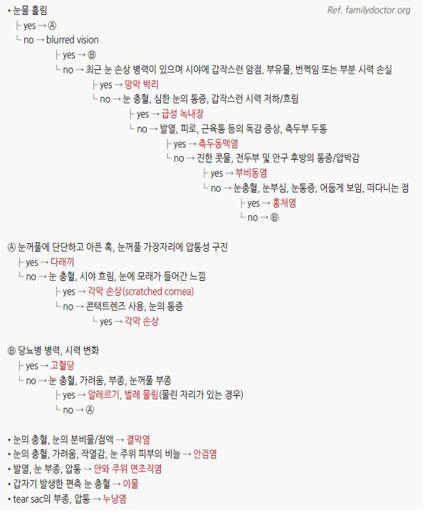

# 눈 충혈 Red Eye

## <mark style="color:green;">원인</mark>

* 흔한 원인 : 결막염, 각막 찰과상, 안검염, 안구 건조, 결막하출혈, 이물
* 덜 흔한 원인 : 다래끼, 익상편(군날개), 상공막염, 검열반
* 심각한 원인 : (일부) 각막염, 포도막염, 홍채염, 공막염, 녹내장
* 충혈 제거제 (혈관수축제 점안액) : 장기 사용 시반동성 충혈(rebound hyperemia)이 발생할 수 있으며,  사용 중단 시 충혈이 악화되는 악순환 유발; 시판 충혈 제거 안약의 장기 남용이 흔한 원인

### <mark style="color:$danger;">🚩 Red Flags!</mark>

<mark style="color:$danger;">**즉각 응급 조치 및 의뢰**</mark> <mark style="color:$danger;"></mark><mark style="color:$danger;">- 생명 위협 또는 즉각적 위해 가능성</mark>

* 급성 폐쇄각 녹내장 의심 : 급격한 시력 저하 + 박동성 두통 + 구역/구토 + 동공 산대
  * 안압계가 없는 경우 눈꺼풀 위로 안구를 가볍게 눌렀을 때 돌처럼 딱딱한 느낌(stony hard)이 있으면 안압 상승을 강력히 시사
* 화학적 화상 (산·알칼리) : 즉시 세안 후 응급 의뢰
* 안구 관통상 또는 심한 둔상
* Hypopyon 또는 Hyphema 확인 시

<mark style="color:$warning;">**당일 또는 조기 안과 의뢰**</mark>

* 시력 저하, 각막 혼탁, 심한 눈부심, 동공 반사 이상
* 심한 안구통 (특히 움직일 때 통증 → 공막염 의심)
* 공막염 의심 (광범위 충혈 + 심한 야간 통증 + 전신 질환 동반) - 당일
* 각막염 의심 (콘택트렌즈 착용자 + 각막 혼탁 + 점액농성 분비물) - 당일
* 홍채염(Iritis) 의심 : 눈부심 + 동공 축소 + 방사통 - 당일
* 대상포진 발진 동반 안구 충혈 - 당일
* 신생아·영아의 눈 충혈 (임균성·클라미디아 결막염 배제) - 당일
* 각막 이물 제거 실패
* 반복 상공막염, 만성 안검염 조절 불량

<mark style="color:$info;">**외래 추적 / 추가 평가 계획 - 즉각 위험 낮으나 호전 없으면 의뢰**</mark>&#x20;

* STI 감염 의심 정황 동반
* 외상 병력, 콘택트렌즈 관련 (각막 감염 위험)
* 면역저하자 (스테로이드 장기 사용, HIV 등) - 기회 감염성 각막염 위험
* 대증 치료에 반응 안 함 (결막염 의심 상태에서 5\~7일 내 호전 안 됨)

## <mark style="color:green;">눈의 질환별 특징</mark>

<table><thead><tr><th width="112">질환</th><th width="270">증상 및 징후</th><th>원인</th></tr></thead><tbody><tr><td><a href="042_-dry-eye.md"><strong>안구건조증</strong></a></td><td>양측, 이물감을 동반한 가려움, 경증 통증, 간헐적 심한 눈물, 시력 유지</td><td>눈물 조성 이상, 생성 감소, 과도한 증발; 항콜린제, 항히스타민제, 경구 피임제; Sjögren 증후군</td></tr><tr><td><a href="039_-blepharitis.md"><strong>안검염</strong></a></td><td>깨어 있는 동안 악화, 속눈썹 위의 비듬 같은 비늘, 눈꺼풀 방향 이상, 눈꺼풀 부종</td><td>눈꺼풀의 만성 염증</td></tr><tr><td><strong>각막 찰과상,</strong> <a href="045_-foreign-body-in-the-eye.md"><strong>이물</strong></a></td><td>양측/편측 심한 안구통, 눈물, 눈부심, 이물감, 안검 경련, 반응성 축동, 각막 부종 또는 혼탁, (손상 부위에 따라) 시력 저하</td><td>직접 손상(예: 이물, 렌즈, 화장, 손)</td></tr><tr><td><a href="044_-subconjunctival-hemorrhage.md"><strong>결막하출혈</strong></a></td><td>시력 유지, 공막 부위의 뚜렷한 경계의 적색 반, 경미한 통증 또는 무통, 분비물 없음</td><td>자발적, 심한 기침, 운동, 고혈압, 혈액 질환, 외상(예: 충격, 문지름)</td></tr><tr><td><strong>상공막염</strong></td><td>시력 유지, 뚜렷한 충혈 반, 상공막 부종, 충혈 부위 압통, 경미한 통증 또는 무통, 약간의 눈물</td><td>특발성</td></tr><tr><td><strong>각막염</strong></td><td>시력 저하, 각막 혼탁, 눈부심, 눈꺼풀 부종, hypopyon, 통증, 점액농성 분비물, 이물감</td><td>이물, 렌즈, 세균(포도알균, 사슬알균), 바이러스(HSV, VZV, Adenovirus; EBV·CMV는 면역저하자)</td></tr><tr><td><strong>홍채염</strong></td><td>시력 저하, 통증(주위 방사통), 눈물, 눈부심, 수 시간 동안 심해짐</td><td>외인성 감염, 자가면역 질환</td></tr><tr><td><strong>녹내장</strong></td><td>현저한 시력 저하, 동공 확장, 급성 악화, 압통, 눈물, 광륜(halo), 박동성 통증; 녹내장 편측</td><td>aqueous humor 유출로 폐쇄</td></tr><tr><td><strong>화학적 화상</strong></td><td>시력 저하, 심한 통증 및 충혈, 눈부심</td><td>—</td></tr><tr><td><strong>공막염</strong></td><td>광범위 충혈, 시력 저하, 압통, 공막 부종, 각막 개입(공막 주변), 심한 찌르는 듯한 통증(주위 방사통), 심한 야간 통증, 눈을 움직일 때 통증, 눈물, 눈부심</td><td>[전신 질환] RA, 반응성 관절염, Wegener granulomatosis, sarcoidosis, IBD, 매독, 결핵</td></tr></tbody></table>

_Ref. Diagnosis and management of red eye in primary care, Table 1. AFP. 2010:15;81(2)._

#### <mark style="color:$primary;">콘택트렌즈</mark>

* 각막 감염의 위험이 있음
  * 소프트 렌즈를 하루 넘게 사용 시 1일 착용에 비해 최소한 5배 이상 감염 위험 증가
  * 미용 렌즈는 미생물 오염 발생률이 높음
* 예방 : 밤샘 사용을 피함, 렌즈 교체일 이상 사용을 피함, 세심한 렌즈 위생 관리, 눈이 불편해 지거나 충혈 되면 제거

## <mark style="color:green;">충혈된 눈의 감별 진단</mark>

### <mark style="color:orange;">질환별 감별 진단</mark>

<table><thead><tr><th width="121"></th><th width="62" align="center">시력</th><th width="74" align="center">이물감</th><th width="74" align="center">눈부심</th><th width="100" align="center">분비물</th><th width="129">기타</th></tr></thead><tbody><tr><td><mark style="background-color:$success;"><strong>눈꺼풀/속눈썹</strong></mark></td><td align="center"></td><td align="center"></td><td align="center"></td><td align="center"></td><td></td></tr><tr><td><a href="038_-hordeolum.md">Hordeolum</a></td><td align="center">NI</td><td align="center">-</td><td align="center">-</td><td align="center">-</td><td>압통(+)</td></tr><tr><td>Chalazion</td><td align="center">NI</td><td align="center">-</td><td align="center">-</td><td align="center">-</td><td>압통(-)</td></tr><tr><td><a href="039_-blepharitis.md">Blepharitis</a></td><td align="center">NI</td><td align="center">-</td><td align="center">-</td><td align="center">마른 눈곱</td><td>만성</td></tr><tr><td><mark style="background-color:$success;"><strong>결막</strong></mark></td><td align="center"></td><td align="center"></td><td align="center"></td><td align="center"></td><td></td></tr><tr><td>결막염 - <a href="038_-conjunctivitis.md#bacterial-conjunctivitis">Bacterial</a></td><td align="center">NI</td><td align="center">-</td><td align="center">-</td><td align="center">점액농성</td><td>종일 지속되는 분비물</td></tr><tr><td>결막염 - <a href="038_-conjunctivitis.md#viral-conjunctivitis">Viral</a></td><td align="center">NI</td><td align="center">-</td><td align="center">-</td><td align="center">점액수양성</td><td>간혹 URI 동반</td></tr><tr><td>결막염 - <a href="038_-conjunctivitis.md#undefined-2">Allergic</a></td><td align="center">NI</td><td align="center">-</td><td align="center">-</td><td align="center">점액성</td><td>가려움</td></tr><tr><td><a href="042_-dry-eye.md">Dry eye</a></td><td align="center">NI</td><td align="center">-</td><td align="center">-</td><td align="center">수양성</td><td>치료 후 지속 시 의뢰</td></tr><tr><td>Episcleritis</td><td align="center">NI</td><td align="center">-</td><td align="center">-</td><td align="center">-</td><td>부채꼴 충혈, 둔통; 페닐에프린 점안 후 충혈 소실</td></tr><tr><td>Scleritis</td><td align="center">NI/↓</td><td align="center">-</td><td align="center">-</td><td align="center">-</td><td>광범위 충혈, 야간 통증, 압통; <strong>즉시 의뢰</strong></td></tr><tr><td><a href="044_-subconjunctival-hemorrhage.md">결막하출혈</a></td><td align="center">NI</td><td align="center">-</td><td align="center">-</td><td align="center">-</td><td>명확한 경계, 짙은 홍반</td></tr><tr><td><mark style="background-color:$success;"><strong>각막</strong></mark></td><td align="center"></td><td align="center"></td><td align="center"></td><td align="center"></td><td></td></tr><tr><td>Abrasion</td><td align="center">NI/↓</td><td align="center">+</td><td align="center">+</td><td align="center">수양성</td><td>손상 병력</td></tr><tr><td>콘택트렌즈 과착용</td><td align="center">NI/↓</td><td align="center">+</td><td align="center">+</td><td align="center">수양성</td><td>잘못된 사용 병력</td></tr><tr><td><a href="045_-foreign-body-in-the-eye.md">이물</a></td><td align="center">NI/↓</td><td align="center">+</td><td align="center">+</td><td align="center">점액성</td><td>손상 병력</td></tr><tr><td>세균 감염</td><td align="center">NI/↓</td><td align="center">+</td><td align="center">+</td><td align="center">점액농성</td><td><strong>즉시 의뢰</strong></td></tr><tr><td>바이러스 감염</td><td align="center">NI/↓</td><td align="center">+</td><td align="center">+</td><td align="center">수양성</td><td><strong>즉시 의뢰</strong>; HSV 의심 시 <mark style="color:$danger;"><strong>스테로이드 점안액 절대 금기</strong></mark></td></tr><tr><td><mark style="background-color:$success;"><strong>Anterior chamber/홍채/수정체</strong></mark></td><td align="center"></td><td align="center"></td><td align="center"></td><td align="center"></td><td></td></tr><tr><td>Iritis</td><td align="center">NI/↓</td><td align="center">-</td><td align="center">+</td><td align="center">-/수양성</td><td>동공 축소; <strong>즉시 의뢰</strong></td></tr><tr><td>Hyphema</td><td align="center">NI/↓</td><td align="center">-</td><td align="center">±</td><td align="center">-/수양성</td><td><strong>즉시 의뢰</strong></td></tr><tr><td>Hypopyon</td><td align="center">NI/↓</td><td align="center">-</td><td align="center">±</td><td align="center">-/농성</td><td><strong>즉시 의뢰</strong></td></tr><tr><td>Angle closure G.</td><td align="center">NI/↓</td><td align="center">-</td><td align="center">±</td><td align="center">-/수양성</td><td>동공 반사 저하; <strong>즉시 의뢰</strong></td></tr></tbody></table>

_NI = normal_\
&#xNAN;_&#x52;ef. Jacobs, DS. Evaluation of the red eye. UpToDate. \[accessed 2024]._

**※ 상공막염(Episcleritis) vs 공막염(Scleritis) 감별**&#x20;

* 페닐에프린 점안 검사
* 2.5% 페닐에프린 점안액을 1방울 점안하고 10\~20분 후 결과를 관찰
* 충혈된 혈관이 하얗게 소실 → 표층(상공막) 혈관의 확장 → 상공막염 가능성 높음
* 충혈이 소실되지 않음 → 더 깊은 공막 혈관의 염증 → 공막염 가능성 높음; 즉시 의뢰

### <mark style="color:orange;">충혈된 눈의 감별 알고리듬</mark>

### <mark style="color:orange;">부종이 있는 충혈된 눈의 감별 알고리듬</mark>

### <mark style="color:orange;">증상/병력에 따른 눈 문제의 감별 알고리듬</mark>

<figure><figcaption></figcaption></figure>

***


**스테로이드 점안액 처방 주의** 각막 궤양, HSV 각막염이 의심되는 경우 스테로이드 점안액은 금기임. 수지상 각막 병변(dendritic lesion)이 보이는 경우 즉시 의뢰


### <mark style="color:$success;">핵심 복약 지도</mark>

> **점안액 사용 안내**
>
> * 점안액은 아래 눈꺼풀을 살짝 당긴 후, 눈동자가 아닌 결막낭(아랫 눈꺼풀 안쪽)에 1방울 떨어뜨리십시오.
> * 점안 후 1\~2분간 눈을 살며시 감고, 눈 안쪽 코 옆 부분(눈물점)을 손가락으로 가볍게 눌러 주십시오. 약 성분이 눈물관을 통해 코점막으로 흡수되어 나타날 수 있는 쓴맛, 심박수 변화 등의 전신 부작용을 줄여 줍니다.
> * 여러 종류의 점안액을 함께 사용하는 경우, 점안 간격을 최소 5분 이상 두십시오.
> * 콘택트렌즈를 착용 중인 경우, 점안 전 렌즈를 먼저 빼고 점안 후 15분 뒤에 다시 착용하십시오.
> * 개봉 후 4주가 지난 점안액은 오염 우려가 있으므로 사용하지 마십시오.

> **언제 다시 병원을 방문해야 하나요?**
>
> * 치료를 시작했는데도 5\~7일 내 증상이 호전되지 않는 경우
> * 눈이 충혈되면서 **시력이 흐려지거나 떨어지는** 경우 — 즉시 내원
> * **심한 눈의 통증** 또는 두통·구역이 동반되는 경우 — 즉시 내원
> * 눈에 강한 빛을 보기 힘들 정도로 **눈부심이 심해지는** 경우 — 즉시 내원
> * 눈에 화학물질이 튀었거나 날카로운 것에 찔린 경우 — **즉시 응급실**

***

### <mark style="color:blue;">환자 안내서</mark>


**눈 충혈, 원인에 따라 대처가 다릅니다**

눈 충혈은 대부분 결막염·안구건조증 등 가벼운 원인이지만, 일부는 즉각적인 치료가 필요한 심각한 질환의 신호일 수 있습니다.


#### <mark style="color:$primary;">눈이 충혈되는 이유는 무엇인가요?</mark>

* 눈의 흰자위(결막·공막)에 분포한 혈관이 염증, 자극, 감염, 압력 상승 등으로 확장되어 붉게 보이는 상태입니다.
* 가장 흔한 원인은 **결막염**(세균·바이러스·알레르기), **안구건조증**, **안검염**, **이물·외상**이며, 대부분은 수일 내 호전됩니다.
* 그러나 시력 저하, 심한 통증, 눈부심을 동반하는 경우에는 각막염·홍채염·녹내장 등 즉각적인 치료가 필요한 질환일 수 있습니다.

#### <mark style="color:$primary;">점안액, 어떻게 사용하나요?</mark>

* **사용 전** 반드시 손을 깨끗이 씻으십시오.
* 아래 눈꺼풀을 살짝 당겨 결막낭(눈꺼풀 안쪽 빈 공간)에 1방울 떨어뜨리십시오. 눈동자 위에 직접 떨어뜨리면 자극이 생길 수 있습니다.
* 점안 후 **눈 안쪽(코 옆) 눈물점**을 1\~2분간 살짝 눌러 주십시오. 약 성분이 코점막을 통해 몸으로 흡수되면서 생길 수 있는 **쓴맛, 심박수 변화** 등의 전신 부작용을 줄여 줍니다.
* 두 종류 이상의 점안액을 사용하는 경우 **5분 이상 간격**을 두십시오.
* 개봉 후 **4주가 지난 점안액**은 세균 오염 가능성이 있으므로 버리고 새것을 사용하십시오.
* **콘택트렌즈**는 점안 전에 빼고, 점안 후 최소 15분 뒤에 다시 착용하십시오.

#### <mark style="color:$primary;">콘택트렌즈 사용 시 주의사항</mark>

* 눈이 충혈되거나 불편할 때는 즉시 렌즈를 제거하고 안경으로 교체하십시오.
* 소프트 렌즈를 하루 이상 연속 착용하면 감염 위험이 **5배 이상** 높아집니다. 자면서 착용하지 마십시오.
* 미용(서클) 렌즈는 일반 렌즈에 비해 세균 오염이 더 잘 생기므로 특히 위생에 주의하십시오.
* 렌즈 케이스는 매일 세척하고, 보존액은 완전히 교체하십시오(보충 금지).
* **수돗물로 렌즈를 세척하지 마십시오.** 수돗물에 존재하는 아칸토아메바(Acanthamoeba)에 감염되면 치료가 매우 어려운 심각한 각막염이 생길 수 있습니다.
* 교체 주기를 초과한 렌즈는 사용하지 마십시오.

#### <mark style="color:$primary;">가정에서의 응급 처치</mark>

* **눈에 화학물질(세제·표백제·산·알칼리)이 튀었을 때**
  * **즉시** 흐르는 물로 **15\~20분 이상** 눈을 충분히 씻으십시오. 수돗물도 괜찮으니 식염수를 찾느라 시간을 지체하지 마십시오. 빠른 세안이 가장 중요합니다.
  * 세안하면서 눈을 최대한 크게 뜨고 눈동자를 여러 방향으로 움직이십시오.
  * 세안 후 즉시 응급실을 방문하십시오.
* **눈에 모래·먼지 등 작은 이물이 들어갔을 때**
  * 눈을 비비지 마십시오. 비비면 각막에 상처가 생길 수 있습니다.
  * 깨끗한 물 또는 인공눈물로 눈을 씻어 내십시오.
  * 씻어도 이물감이 지속되면 병원을 방문하십시오.
* **날카로운 물체에 찔리거나 심한 둔상을 입었을 때**
  * 눈을 누르거나 비비지 말고, 깨끗한 거즈를 가볍게 덮은 후 즉시 응급실을 방문하십시오.

#### <mark style="color:$primary;">생활 속 눈 건강 관리</mark>

* **손 위생** : 눈을 만지기 전후에는 반드시 손을 씻으십시오. 유행성 결막염은 손을 통해 전파됩니다.
* **수건·베개 위생** : 결막염이 있을 때는 수건과 베개를 매일 교체하고, 다른 사람과 공유하지 마십시오.
* **눈 비비기 금지** : 눈이 가렵거나 이물감이 있을 때 비비면 증상이 악화되고 각막에 상처가 생길 수 있습니다.
* **화면 사용 시** : 장시간 스마트폰·컴퓨터 사용 시 20분마다 20초간 먼 곳(6m 이상)을 바라보십시오(20-20-20 규칙). 의식적으로 눈을 자주 깜박여 안구건조를 예방하십시오.
* **자외선 차단** : 야외 활동 시 자외선 차단 기능이 있는 선글라스를 착용하십시오.
* **금연** : 흡연은 안구건조증과 백내장·황반변성의 위험을 높입니다.

#### <mark style="color:$primary;">이럴 때는 즉시 응급실 또는 안과를 방문하세요</mark>

* 눈의 충혈과 함께 **시력이 갑자기 떨어지거나 흐려지는** 경우
* **심한 눈의 통증** 또는 박동성 두통·구역·구토가 동반되는 경우 (녹내장 의심)
* 강한 빛을 보기 힘들 정도로 **눈부심이 심한** 경우
* **화학물질이 눈에 들어간** 경우 — 세안 후 즉시
* 눈에 **날카로운 물체가 박혔거나 심한 외상**을 입은 경우
* 눈 충혈과 함께 얼굴·이마 부위에 **수포성 발진**이 생기는 경우 (대상포진 의심)
* 결막염으로 치료 중인데 **5\~7일이 지나도 호전이 없는** 경우
