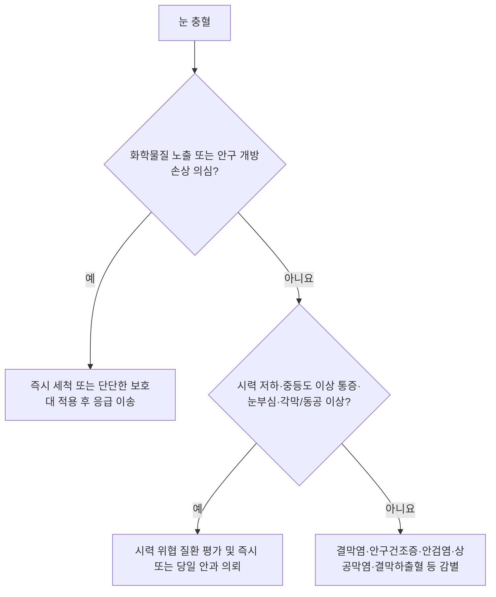
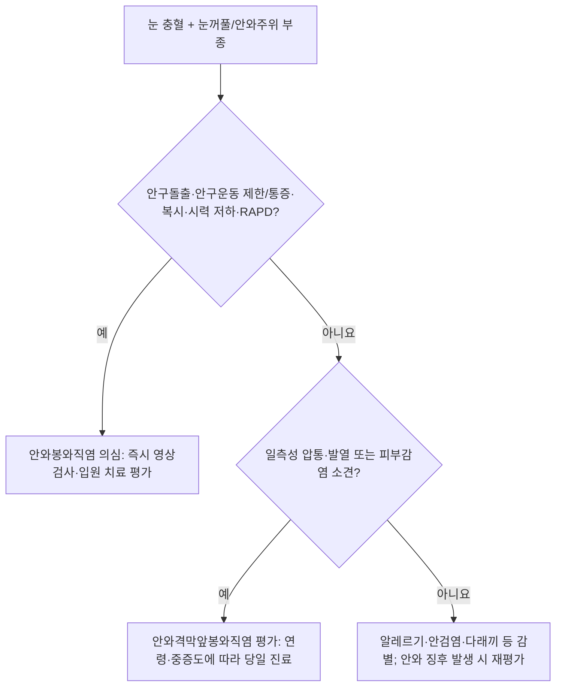
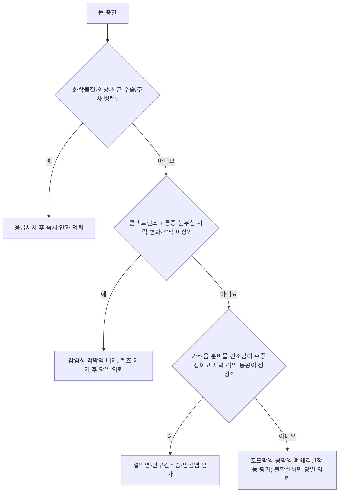

# 눈 충혈 Red Eye

## <mark style="color:green;">일반사항</mark>

* 눈 충혈(red eye)은 결막·상공막·공막 혈관의 확장 또는 증식으로 눈이 붉게 보이는 **증상**이다. 결막염·안구건조증처럼 흔하고 양성인 원인이 많지만, 각막염·급성 전방포도막염·공막염·급성 폐쇄각발작·안내염·안와봉와직염처럼 시력 또는 생명을 위협하는 질환의 초기 소견일 수 있다.
* 일차진료에서는 원인명을 성급히 붙이기보다 **시력 저하, 중등도 이상의 통증, 눈부심, 각막 침범, 동공 이상, 외상·화학물질 노출, 콘택트렌즈 착용, 최근 안과수술·유리체강내 주사** 여부를 먼저 확인한다.

### <mark style="color:red;">질병코드</mark>

* **H11.42** 결막충혈(KCD 세부코드; 상위 분류 **H11.4** 기타 결막의 혈관장애 및 낭) - 결막충혈은 확인되지만 원인 질환이 확정되지 않은 경우
* **H57.9** 눈 및 눈부속기의 상세불명 장애 - 충혈 부위나 원인을 구체적으로 분류하기 어려운 경우에 제한적으로 사용
* **눈 충혈은 증상이므로 H11.42·H57.9보다 결막염·각막염·공막염·홍채섬모체염 등 확인된 원인 질환 코드를 우선 사용한다.**

## <mark style="color:green;">원인</mark>

* 흔한 원인 : 결막염, 안구건조증, 안검염, 각막찰과상, 결막하출혈, 이물
* 그 밖의 원인 : 다래끼, 콩다래끼, 익상편(군날개), 검열반, 상공막염
* 시력 위협 가능 원인 : 감염성 각막염, 급성 전방포도막염(홍채염), 공막염, 급성 폐쇄각발작, 안내염, 안와봉와직염, 안구 개방손상, 화학적 손상
* 충혈제거제(혈관수축제 점안액) : 장기간 또는 반복 사용하면 반동성 충혈(rebound hyperemia)이 발생하여 중단 시 충혈이 악화되는 악순환을 유발할 수 있다. 특히 일반의약품 충혈제거 점안액을 반복적으로 자가 사용하기 쉬우므로 장기 사용에 따른 반동성 충혈과 원인 질환 진단 지연 가능성을 교육한다.

## <mark style="color:green;">임상 양상 및 감별 진단</mark>

#### <mark style="color:$primary;">질환별 특징</mark>

<table><thead><tr><th width="115">질환</th><th width="280">주요 증상 및 징후</th><th>원인·관련 요인</th></tr></thead><tbody><tr><td><a href="042_-dry-eye.md"><strong>안구건조증</strong></a></td><td>대개 양측성, 작열감·따가움·모래알 같은 이물감, 변동성 흐림, 반사성 눈물흘림; 심한 통증이나 지속적 시력 저하는 드묾</td><td>눈물 생성 감소 또는 증발 증가; 항콜린제·항히스타민제 등 약물, Sjögren 증후군</td></tr><tr><td><a href="039_-blepharitis.md"><strong>안검염</strong></a></td><td>속눈썹 기저부의 비늘·딱지, 눈꺼풀 가장자리 충혈·부종, 작열감·이물감; 만성·재발성</td><td>전방 또는 후방 안검염, 마이봄샘 기능장애</td></tr><tr><td><strong>각막찰과상·</strong><a href="045_-foreign-body-in-the-eye.md"><strong>이물</strong></a></td><td>대개 일측성, 갑작스러운 통증·이물감·눈물·눈부심·안검경련; fluorescein 염색 결손, 손상 위치에 따라 시력 저하</td><td>직접 손상, 고속 금속·목재 작업, 콘택트렌즈, 손톱·화장도구</td></tr><tr><td><a href="044_-subconjunctival-hemorrhage.md"><strong>결막하출혈</strong></a></td><td>경계가 뚜렷한 선홍색 또는 암적색 반점, 정상 시력, 대개 무통, 분비물 없음</td><td>자발성, 기침·구토·운동, 고혈압, 항혈전제·출혈질환, 외상</td></tr><tr><td><strong>상공막염</strong></td><td>부분적 또는 미만성 표층 충혈, 경미한 불편감·압통·눈물; 시력 유지, 심한 눈부심 없음</td><td>대부분 특발성; 반복되면 전신 염증질환과의 연관성 평가</td></tr><tr><td><strong>감염성 각막염</strong></td><td>통증·눈부심·시력 저하, 각막 상피 결손·백색 침윤 또는 혼탁, 섬모체충혈, 분비물; 중증이면 전방축농</td><td>콘택트렌즈, 외상, 수술, 안구표면질환; 세균·HSV·VZV·진균·Acanthamoeba 등</td></tr><tr><td><strong>급성 전방포도막염</strong></td><td>심부 통증, 직접 및 교감성 눈부심, 눈물, 시력 저하, 섬모체충혈; 축소되거나 불규칙한 동공, 전방 cell/flare</td><td>특발성, HLA-B27 관련 질환, 염증성·자가면역 질환, 감염 등</td></tr><tr><td><strong>급성 폐쇄각발작</strong></td><td>급격한 안구통·두통, 시력 저하·색깔광륜, 구역·구토, 각막부종, 중간 정도 산대된 고정 또는 반응 저하 동공, 안압 상승</td><td>방수 유출로의 급성 폐쇄; 원시·고령·동아시아인 등 해부학적 위험 요인, 산동 유발 약물</td></tr><tr><td><strong>공막염</strong></td><td>청자색을 띠는 깊은 충혈, 안구 압통·부종, 수면을 방해하는 심한 심부통과 방사통, 눈부심·시력 저하; 안구운동 시 악화 가능</td><td>류마티스관절염, 다발혈관염 동반 육아종증(GPA), 염증성 장질환, sarcoidosis, 매독, 결핵 등</td></tr><tr><td><strong>안와봉와직염</strong></td><td>발열, 안검·안와주위 부종, 안구돌출, 안구운동 제한·복시·운동 시 통증, 시력 저하</td><td>부비동염, 외상·수술, 치성 감염 등</td></tr><tr><td><strong>안내염</strong></td><td>최근 안과수술·유리체강내 주사·관통상 후 빠르게 진행하는 통증·충혈·시력 저하, 눈부심, 전방축농</td><td>수술·주사·외상 후 외인성 감염 또는 드문 혈행성 감염</td></tr><tr><td><strong>화학적 손상</strong></td><td>갑작스러운 심한 통증·충혈·눈부심·시력 저하, 각막 상피 결손·혼탁, 결막 또는 윤부 허혈</td><td>산·알칼리·세제·용제 등; 알칼리가 일반적으로 더 깊게 침투</td></tr></tbody></table>

**안와격막앞봉와직염과 안와봉와직염의 감별** : 안와격막앞봉와직염은 안검·안와주위 발적과 부종이 있으나 시력·동공·안구운동이 정상이고 안구돌출이나 운동 시 통증이 없다. 반면 안구돌출, 안구운동 제한·통증, 복시, 시력 저하 또는 RAPD는 안와봉와직염을 시사하므로 즉각 영상검사와 입원 치료를 평가한다. 발열이 없다는 이유만으로 안와봉와직염을 배제하지 않는다.

_Ref. Cheung AY, et al. Conjunctivitis Preferred Practice Pattern. Ophthalmology. 2024;131(4):P134-P204. doi:10.1016/j.ophtha.2023.12.037; CDC. Clinical Overview of Pink Eye. 2024; Sargolzaeimoghaddam M, et al. Review of ophthalmic emergencies in primary care: a comprehensive approach to red eye. Ann Eye Sci. 2025;10:20. doi:10.21037/aes-25-10._

<table><thead><tr><th width="125"></th><th width="65" align="center">시력</th><th width="75" align="center">이물감</th><th width="75" align="center">눈부심</th><th width="105" align="center">분비물</th><th>기타</th></tr></thead><tbody><tr><td><mark style="background-color:$success;"><strong>눈꺼풀/속눈썹</strong></mark></td><td align="center"></td><td align="center"></td><td align="center"></td><td align="center"></td><td></td></tr><tr><td><a href="040_-hordeolum.md">다래끼</a></td><td align="center">정상</td><td align="center">-</td><td align="center">-</td><td align="center">-</td><td>국소 압통(+)</td></tr><tr><td>콩다래끼</td><td align="center">정상</td><td align="center">-</td><td align="center">-</td><td align="center">-</td><td>대개 압통(-)</td></tr><tr><td><a href="039_-blepharitis.md">안검염</a></td><td align="center">정상</td><td align="center">±</td><td align="center">-</td><td align="center">마른 눈곱</td><td>만성·재발성</td></tr><tr><td><mark style="background-color:$success;"><strong>결막/공막</strong></mark></td><td align="center"></td><td align="center"></td><td align="center"></td><td align="center"></td><td></td></tr><tr><td>결막염 - <a href="038_-conjunctivitis.md#bacterial-conjunctivitis">세균성</a></td><td align="center">정상*</td><td align="center">±</td><td align="center">-</td><td align="center">점액농성</td><td>눈꺼풀이 붙을 정도의 분비물</td></tr><tr><td>결막염 - <a href="038_-conjunctivitis.md#viral-conjunctivitis">바이러스성</a></td><td align="center">정상*</td><td align="center">±</td><td align="center">-</td><td align="center">수양성</td><td>URI·귀앞림프절병증 동반 가능</td></tr><tr><td>결막염 - <a href="038_-conjunctivitis.md#allergic-conjunctivitis">알레르기성</a></td><td align="center">정상</td><td align="center">±</td><td align="center">-</td><td align="center">수양성/점액성</td><td>가려움이 핵심</td></tr><tr><td><a href="042_-dry-eye.md">안구건조증</a></td><td align="center">정상/변동</td><td align="center">+</td><td align="center">-</td><td align="center">수양성</td><td>작열감·모래알 느낌</td></tr><tr><td>상공막염†</td><td align="center">정상</td><td align="center">-</td><td align="center">-</td><td align="center">-</td><td>부분적/미만성 표층 충혈, 경미한 불편감</td></tr><tr><td>공막염†</td><td align="center">정상/저하</td><td align="center">-</td><td align="center">±</td><td align="center">-</td><td>깊은 청자색 충혈, 심한 야간통·압통</td></tr><tr><td><a href="044_-subconjunctival-hemorrhage.md">결막하출혈</a></td><td align="center">정상</td><td align="center">-</td><td align="center">-</td><td align="center">-</td><td>명확한 경계의 적색 반점</td></tr><tr><td><mark style="background-color:$success;"><strong>각막</strong></mark></td><td align="center"></td><td align="center"></td><td align="center"></td><td align="center"></td><td></td></tr><tr><td>찰과상</td><td align="center">정상/저하</td><td align="center">+</td><td align="center">+</td><td align="center">수양성</td><td>외상 병력, fluorescein 염색 결손</td></tr><tr><td>콘택트렌즈 관련 각막병증</td><td align="center">정상/저하</td><td align="center">+</td><td align="center">±</td><td align="center">수양성/점액농성</td><td>통증·눈부심·시력 변화 시 당일 의뢰</td></tr><tr><td><a href="045_-foreign-body-in-the-eye.md">이물</a></td><td align="center">정상/저하</td><td align="center">+</td><td align="center">+</td><td align="center">수양성</td><td>외상·고속 작업 병력</td></tr><tr><td>감염성 각막염</td><td align="center">저하 가능</td><td align="center">+</td><td align="center">+</td><td align="center">다양</td><td>각막 침윤·혼탁·염색 결손; 즉시/당일 의뢰</td></tr><tr><td><mark style="background-color:$success;"><strong>전방/홍채</strong></mark></td><td align="center"></td><td align="center"></td><td align="center"></td><td align="center"></td><td></td></tr><tr><td>급성 전방포도막염</td><td align="center">정상/저하</td><td align="center">-</td><td align="center">+</td><td align="center">-/수양성</td><td>섬모체충혈, 축소·불규칙 동공; 당일 의뢰</td></tr><tr><td>전방출혈</td><td align="center">정상/저하</td><td align="center">-</td><td align="center">±</td><td align="center">-</td><td>외상성인 경우가 흔함; 즉시 의뢰</td></tr><tr><td>전방축농</td><td align="center">대개 저하</td><td align="center">-</td><td align="center">±</td><td align="center">-</td><td>중증 각막염·안내염 등; 즉시 의뢰</td></tr><tr><td>급성 폐쇄각발작</td><td align="center">저하</td><td align="center">-</td><td align="center">±</td><td align="center">-/수양성</td><td>각막부종, 중간 산대·반응 저하 동공, 안압 상승; 즉시 의뢰</td></tr></tbody></table>


⚠️ **단순 결막염에서 뚜렷하거나 지속적인 시력 저하는 전형적이지 않다.** 분비물을 닦고 깜박인 뒤에도 시력 저하가 지속되면 각막 침범 등 다른 원인을 평가한다.


† **상공막염과 공막염의 감별**

상공막염은 대개 경미한 불편감과 표층의 밝은 적색 충혈을 보이고 시력이 유지된다. 공막염은 깊은 청자색 충혈, 안구 압통과 심한 심부통·야간통이 특징이며 시력 저하가 동반될 수 있다. 숙련된 검사자는 외상·안구 개방손상과 급성 폐쇄각발작 가능성을 배제한 뒤 2.5% phenylephrine 점안에 의한 표층 혈관의 소실 여부를 보조적으로 이용할 수 있으나, 이 검사만으로 공막염을 배제해서는 안 된다. **통증·시력 저하가 있거나 감별이 불확실하면 반드시 당일 안과에 의뢰한다.** Phenylephrine은 드물게 전신 흡수될 수 있으므로 중증 고혈압·부정맥·허혈성 심질환 환자에서는 필요성을 판단하고 점안 후 눈물점 압박을 고려한다.

**스테로이드 점안액** : 원인이 확정되지 않은 충혈이나 각막궤양·각막염에 안과 진단과 감독 없이 사용하지 않는다. 특히 활동성 HSV 상피각막염에서는 금기이다. HSV 기질각막염 등에서는 항바이러스제 병용 아래 안과 전문의가 스테로이드를 사용할 수 있다. 수지상 각막 병변(dendritic lesion)이 보이면 즉시 의뢰한다.

### <mark style="color:$danger;">🚩 Red Flags!</mark>

<mark style="color:$danger;">**즉각 응급 조치 및 의뢰**</mark> <mark style="color:$danger;">- 수 시간 내 시력 또는 생명 위해 가능성</mark>

* 화학적 손상 : 병력청취나 시력검사 때문에 지연하지 말고 즉시 세척을 시작한다. 물·생리식염수 등 즉시 사용할 수 있는 액체로 세척하고, 가능하면 결막낭 pH가 7.0～7.4로 안정될 때까지 반복한다. 잔류 입자가 있으면 눈꺼풀을 뒤집어 제거한 뒤 즉시 안과에 의뢰한다.
* 안구 개방손상·관통상 또는 심한 둔상 의심 : 눈을 누르거나 박힌 물체를 제거하지 말고, 점안·안압 측정·안구 초음파를 피한다. 압력이 가해지지 않는 단단한 안구보호대(rigid eye shield)를 적용하고 금식 상태로 즉시 이송한다.
* 급성 폐쇄각발작 의심 : 급격한 시력 저하·색깔광륜, 심한 안구통·두통, 구역·구토, 각막부종, 중간 정도 산대된 고정 또는 반응 저하 동공
* 전방출혈(hyphema, 특히 외상 후) 또는 전방축농(hypopyon)
* 최근 안과수술·유리체강내 주사·관통상 후 빠르게 진행하는 통증·충혈·시력 저하 ± 전방축농 - 안내염 의심
* 발열·안검부종과 함께 안구돌출, 안구운동 제한·복시·운동 시 통증 또는 시력 저하 - 안와봉와직염 의심
* 다량의 지속적 농성 분비물, 심한 결막부종·통증·시력 저하 ± 최근 성접촉 위험이나 요도·질 분비물 - 과급성 임균성 결막염 의심; 성접촉 위험이나 비뇨생식기 증상이 뚜렷하지 않아도 배제하지 않음
* 생후 28일 이내 신생아에서 다량의 농성 분비물, 현저한 안검·결막 부종 또는 각막 이상 - 임균성 신생아 결막염 의심
* 빠르게 진행하는 각막 침윤·혼탁, 광범위 상피 결손 또는 전방축농을 동반한 감염성 각막염

<mark style="color:$warning;">**당일 의뢰**</mark> <mark style="color:$warning;">- 시력 위협 질환을 당일 배제</mark>

* 분비물을 닦고 깜박인 뒤에도 지속되는 시력 저하, 중등도 이상의 안구통, 뚜렷한 눈부심, 각막 혼탁·백색 반점·fluorescein 염색 결손, 동공 모양·반응 이상
* 콘택트렌즈 착용자의 충혈에 통증, 눈부심, 시력 변화, 분비물 또는 각막 이상 중 하나라도 동반 - 렌즈를 즉시 제거하고 감염성 각막염 배제
* 급성 전방포도막염 또는 공막염 의심
* 눈꺼풀·이마 또는 코끝·코 측면·콧등의 대상포진성 수포와 동반된 눈 충혈·통증·눈부심·시력 변화. 코의 수포(Hutchinson sign)는 안구 침범 위험을 높이지만, 이 징후가 없어도 안구 침범을 배제할 수 없음
* 생후 28일 이내의 그 밖의 결막염 - 원인과 전신감염 동반 여부를 당일 평가
* 각막 이물 제거 실패 또는 제거 후에도 통증·이물감이 지속되는 경우
* 면역저하자의 통증성 충혈 또는 각막염 의심

<mark style="color:$info;">**외래 추적 및 추가 평가 계획**</mark> <mark style="color:$info;">- 즉각 위험은 낮지만 경과 또는 원인 평가 필요</mark>

* 반복 상공막염 또는 적절한 치료에도 조절되지 않는 만성 안검염 - 계획된 안과 평가 및 필요 시 전신 질환 평가; 단, 심한 통증·눈부심·시력 저하·각막 침범이 있으면 당일 의뢰
* 성인의 만성 일측성 점액농성·여포성 결막염 또는 STI 위험 - 클라미디아 감염을 포함한 조기 평가
* 외상 없이 반복되거나 양측성·광범위하게 발생한 결막하출혈 - 혈압, 항응고제·항혈소판제 복용, 다른 출혈·멍 및 전신질환을 평가하고, 원인이 불명확하거나 출혈 경향이 의심되면 CBC·혈소판, PT/INR, aPTT 등 표적 검사를 고려. 항혈전제는 임의로 중단하지 않음
* 결막염으로 치료 중 5～7일 내 호전이 없거나 증상이 1～2주 이상 지속·재발하는 경우

## <mark style="color:green;">진단</mark>

#### <mark style="color:$primary;">문진</mark>

* 발병 시점과 진행 속도, 편측/양측, 통증의 정도와 양상, 눈부심, 시력 변화, 이물감·가려움, 분비물의 양과 성상
* 콘택트렌즈 종류와 수면·수영·샤워 중 착용, 위생·교체 주기, 수돗물 노출
* 화학물질·외상·고속 금속/목재 작업, 이물 가능성
* 최근 안과수술·유리체강내 주사, 기존 녹내장·각막질환, 사용 중인 점안액과 충혈제거제
* 발열·부비동염·피부 수포, 면역저하, 성접촉 위험 및 류마티스관절염·강직척추염을 포함한 척추관절염·다발혈관염 동반 육아종증·염증성 장질환 등 전신 염증·자가면역질환의 병력과 관련 증상

#### <mark style="color:$primary;">진찰 순서</mark>

1. 화학적 손상이면 다른 검사보다 세척을 먼저 시작한다. 안구 개방손상이 의심되면 추가 조작을 중단하고 보호대를 적용한다.
2. 교정렌즈를 착용한 상태에서 양안 시력을 각각 측정한다. 불가능하면 손가락세기·손 움직임·광각 순으로 기록한다.
3. 눈꺼풀과 안와주위 피부, 수포, 안구돌출을 보고 안구운동·복시·운동 시 통증을 확인한다.
4. 동공 크기·모양과 직접·간접 대광반사, swinging flashlight test로 상대구심동공운동장애(RAPD)를 확인한다.
5. 충혈의 위치와 양상, 분비물, 각막 투명도·백색 침윤, 전방출혈·전방축농을 관찰한다. 반대쪽 눈에 빛을 비출 때 환측 통증이 유발되는 교감성 눈부심은 전방포도막염을 시사한다.
6. fluorescein 염색과 청색광 검사로 각막 상피 결손·수지상 병변·Seidel sign(각막·공막 상처를 통한 방수 누출 여부)을 확인하고, 선상 찰과상이나 이물이 의심되면 위눈꺼풀을 뒤집어 검사한다. 명백한 안구 개방손상에서는 검사를 위해 불필요하게 조작하지 않는다.
7. 가능하면 세극등으로 각막과 전방의 cell/flare를 평가한다.
8. 안구 개방손상이 배제된 경우에만 안압을 측정한다. 급성 폐쇄각발작이 의심되면 측정 결과를 기다리느라 안과 의뢰를 지연하지 않는다.


**안압계를 사용할 수 없는 경우의 안구 촉진**

외상·안구 개방손상이 배제된 경우에 한해, 감은 눈꺼풀 위에서 환측 안구가 반대편보다 현저히 단단하게 느껴지는 소견은 안압 상승의 보조적 단서가 될 수 있다. **안구 촉진은 확진·배제 검사가 아니며, 급성 폐쇄각발작이 의심되면 즉시 안과에 의뢰한다.** 외상 또는 안구 개방손상이 의심되면 안구 촉진과 안압 측정을 시행하지 않는다.


* 분비물의 색과 성상만으로 바이러스성과 세균성 결막염을 확실히 구분할 수 없다. 단순 결막염으로 판단하기 전에 시력 저하·통증·눈부심·각막 침범·동공 이상이 없는지 확인한다.

#### <mark style="color:$primary;">충혈된 눈의 감별 알고리듬</mark>

```mermaid
flowchart TD
    A["눈 충혈"] --> B{"화학물질 노출 또는 안구 개방손상 의심?"}
    B -- "예" --> C["즉시 세척 또는 단단한 보호대 적용 후 응급 이송"]
    B -- "아니요" --> D{"시력 저하·중등도 이상 통증·눈부심·각막/동공 이상?"}
    D -- "예" --> E["시력 위협 질환 평가 및 즉시 또는 당일 안과 의뢰"]
    D -- "아니요" --> F["결막염·안구건조증·안검염·상공막염·결막하출혈 등 감별"]
```

_그림. 본문의 Red Flags와 진찰 순서에 따라 재구성한 눈 충혈 초기 분류 알고리듬._

_Ref. Cheung AY, et al. Ophthalmology. 2024;131(4):P134-P204; Sargolzaeimoghaddam M, et al. Ann Eye Sci. 2025;10:20._

#### <mark style="color:$primary;">부종이 있는 충혈된 눈의 감별 알고리듬</mark>

```mermaid
flowchart TD
    A["눈 충혈 + 눈꺼풀/안와주위 부종"] --> B{"안구돌출·안구운동 제한/통증·복시·시력 저하·RAPD?"}
    B -- "예" --> C["안와봉와직염 의심: 즉시 영상검사·입원 치료 평가"]
    B -- "아니요" --> D{"일측성 압통·발열 또는 피부감염 소견?"}
    D -- "예" --> E["안와격막앞봉와직염 평가: 연령·중증도에 따라 당일 진료"]
    D -- "아니요" --> F["알레르기·안검염·다래끼 등 감별; 안와 징후 발생 시 재평가"]
```

_그림. 안와 징후를 중심으로 재구성한 눈 충혈·부종 감별 알고리듬. 발열이 없어도 안와봉와직염을 배제할 수 없다._

_Ref. Sargolzaeimoghaddam M, et al. Ann Eye Sci. 2025;10:20._

#### <mark style="color:$primary;">증상/병력에 따른 눈 문제의 감별 알고리듬</mark>

```mermaid
flowchart TD
    A["눈 충혈"] --> B{"화학물질·외상·최근 수술/주사 병력?"}
    B -- "예" --> C["응급처치 후 즉시 안과 의뢰"]
    B -- "아니요" --> D{"콘택트렌즈 + 통증·눈부심·시력 변화·각막 이상?"}
    D -- "예" --> E["감염성 각막염 배제: 렌즈 제거 후 당일 의뢰"]
    D -- "아니요" --> F{"가려움·분비물·건조감이 주증상이고 시력·각막·동공이 정상?"}
    F -- "예" --> G["결막염·안구건조증·안검염 평가"]
    F -- "아니요" --> H["포도막염·공막염·폐쇄각발작 등 평가; 불확실하면 당일 의뢰"]
```

_그림. 주요 증상과 병력에 따라 재구성한 눈 충혈 감별 알고리듬. 분비물의 성상만으로 결막염 원인을 확정하지 않는다._

_Ref. Cheung AY, et al. Ophthalmology. 2024;131(4):P134-P204; CDC. Clinical Overview of Pink Eye. 2024._

***

## <mark style="background-color:$warning;">Management</mark>

* 원인 질환에 따라 치료한다. 바이러스결막염은 항균제에 반응하지 않으며, 경증 세균결막염은 자연 호전될 수 있으므로 항균제 점안액을 일률적으로 사용하지 않는다.
* 진단되지 않은 눈 충혈에 스테로이드 점안액을 경험적으로 처방하지 않는다.
* 통증·눈부심·시력 변화 또는 각막 이상이 있는 콘택트렌즈 착용자는 렌즈를 즉시 제거하고 당일 안과 평가를 시행한다. 감염이 의심되면 증상이 사라지고 의료진이 허용할 때까지 렌즈를 다시 착용하지 않는다.

#### <mark style="color:$primary;">콘택트렌즈</mark>

* 렌즈 종류와 관계없이 수면 중 착용은 미생물각막염 위험을 약 5배 이상 높이며, 연구와 요약 자료에 따라 약 6～8배 증가하는 것으로 보고된다.
* 예방 : 수면·낮잠·수영·샤워 중 착용하지 않고, 렌즈와 케이스를 수돗물에 접촉시키지 않는다. 손을 씻고 완전히 말린 뒤 렌즈를 다루며, 보존액은 매번 새로 교체하고 보충해서 사용하지 않는다. 렌즈와 케이스의 권장 교체 주기를 지킨다.

_Ref. Dart JKG, et al. Ophthalmology. 2008;115:1647-1654; CDC. Corneal Infections Associated with Sleeping in Contact Lenses. MMWR. 2018;67:877-881._

***

### <mark style="color:$success;">핵심 복약 지도</mark>

> **점안액 사용 안내**
>
> * 손을 씻고 아래 눈꺼풀을 살짝 당긴 후, 용기 끝이 눈·속눈썹·피부에 닿지 않도록 결막낭에 1방울 점안하십시오.
> * 점안 후 1～2분간 눈을 살며시 감고 눈 안쪽 코 옆 부분(눈물점)을 가볍게 누르십시오. 약물이 코점막으로 흡수되어 생길 수 있는 쓴맛과 일부 전신 부작용을 줄일 수 있습니다.
> * 여러 점안액은 약 5분 간격을 두고 사용하며, 안연고를 함께 쓰면 연고를 마지막에 사용하십시오.
> * 점안액의 개봉 후 사용기간은 제품 설명서에 따르십시오. 1회용 무보존제 점안액은 사용 직후 폐기하며, 용액이 변색·혼탁해졌거나 용기 끝이 오염되었으면 사용하지 마십시오.
> * 충혈·감염·각막 손상이 있는 동안에는 콘택트렌즈를 착용하지 마십시오. 증상이 없는 상태에서 렌즈 재착용이 가능한 점안제는 제품별 허가사항에 따른 대기시간을 지키십시오.

> **언제 다시 병원을 방문해야 하나요?**
>
> * 분비물을 닦고 깜박인 뒤에도 시력이 흐리거나 떨어지는 경우 - 당일 또는 즉시
> * 중등도 이상의 눈 통증, 심한 눈부심, 두통·구역·구토가 동반되는 경우 - 당일 또는 즉시
> * 콘택트렌즈 착용 중 충혈과 통증·눈부심·시력 변화가 생긴 경우 - 렌즈를 제거하고 당일
> * 눈에 화학물질이 들어갔거나 날카로운 물체에 찔린 경우 - 응급처치와 동시에 즉시 이송
> * 치료 후 5～7일 내 호전되지 않거나 악화되는 경우

***

### <mark style="color:blue;">환자 안내서</mark>


**눈 충혈, 원인에 따라 대처가 다릅니다**

눈 충혈은 대부분 결막염·안구건조증 등 비교적 가벼운 원인으로 생기지만, 일부는 즉각적인 치료가 필요한 심각한 질환의 신호일 수 있습니다.


#### <mark style="color:$primary;">눈이 충혈되는 이유는 무엇인가요?</mark>

* 눈의 흰자위에 있는 결막·상공막·공막 혈관이 염증, 자극, 감염, 외상 또는 안압 상승 등으로 확장되어 붉게 보이는 상태입니다.
* 흔한 원인은 결막염, 안구건조증, 안검염, 이물·외상입니다. 원인에 따라 수일에서 1～2주 이상 지속될 수 있습니다.
* 시력 저하, 중등도 이상의 통증, 심한 눈부심이 있으면 각막염·포도막염·공막염·급성 폐쇄각발작 등 시력을 위협하는 질환일 수 있습니다.

#### <mark style="color:$primary;">점안액, 어떻게 사용하나요?</mark>

* 사용 전 손을 깨끗이 씻으십시오.
* 아래 눈꺼풀을 살짝 당겨 용기 끝이 눈이나 속눈썹에 닿지 않도록 결막낭에 1방울 떨어뜨리십시오.
* 점안 후 눈을 1～2분간 살며시 감고 눈 안쪽 코 옆의 눈물점을 눌러 주십시오.
* 두 종류 이상의 점안액은 약 5분 간격을 두고, 안연고는 마지막에 사용하십시오.
* 개봉 후 사용기간은 제품마다 다르므로 설명서를 확인하십시오. 1회용 무보존제 점안액은 사용 직후 버리십시오.
* 다른 사람이 사용하던 점안액이나 남은 스테로이드 점안액을 임의로 사용하지 마십시오. 헤르페스성 각막염을 포함한 일부 감염은 스테로이드로 악화될 수 있습니다.
* 눈이 충혈되었거나 감염·각막 손상이 의심되는 동안에는 콘택트렌즈를 다시 착용하지 마십시오.

#### <mark style="color:$primary;">콘택트렌즈 사용 시 주의사항</mark>

* 눈이 충혈되거나 불편하면 즉시 렌즈를 제거하고 안경으로 교체하십시오. 통증·눈부심·시력 변화가 있으면 당일 안과 진료를 받으십시오.
* 렌즈를 끼고 자거나 낮잠을 자면 심각한 각막 감염 위험이 약 **5～8배** 높아질 수 있습니다. **수면 착용이 허가된 렌즈도 감염 위험이 증가**하므로 의료진의 지시 없이 착용한 채 자지 마십시오.
* 렌즈를 낀 채 수영·샤워하거나 렌즈와 케이스를 수돗물로 씻지 마십시오. Acanthamoeba 각막염을 포함한 심각한 감염이 발생할 수 있습니다.
* 렌즈를 만지기 전 손을 씻고 완전히 말리십시오. 보존액은 매번 완전히 교체하고 남은 액에 새 액을 보충하지 마십시오.
* 렌즈와 케이스는 권장 교체 주기를 지키고, 장식·미용 렌즈도 정식 처방과 동일한 위생 원칙을 따르십시오.

#### <mark style="color:$primary;">가정에서의 응급 처치</mark>

* ⚠️ **눈에 화학물질이 들어갔을 때**
  * 병원에 연락하거나 제품명을 확인하느라 지체하지 말고 즉시 흐르는 물로 눈을 씻으십시오. 눈꺼풀을 벌리고 눈동자를 여러 방향으로 움직이며 **최소 20～30분**, 가능하면 이동 중에도 계속 세척하십시오. 식염수를 찾느라 세척을 늦추지 마십시오.
  * 콘택트렌즈가 쉽게 빠지면 제거하되, 제거하느라 세척을 중단하지 마십시오.
  * 세척을 시작한 상태로 119 또는 응급실에 연락하고 즉시 진료받으십시오.
* **모래·먼지 등 작은 이물이 들어갔을 때**
  * 눈을 비비지 말고 깨끗한 물이나 인공눈물로 씻어 내십시오.
  * 눈에 박힌 이물을 억지로 빼지 마십시오. 세척 후에도 통증·이물감·시력 변화가 지속되면 진료받으십시오.
* **날카로운 물체에 찔리거나 심한 둔상을 입었을 때**
  * 눈을 누르거나 비비지 말고 박힌 물체를 제거하지 마십시오. 거즈나 안대로 눌러 덮지 마십시오.
  * 가능하면 압력이 가해지지 않는 단단한 안구보호대를 대고, 없으면 눈을 건드리지 않은 상태로 즉시 응급실로 이동하십시오. 음식이나 물은 먹지 마십시오.

#### <mark style="color:$primary;">생활 속 눈 건강 관리</mark>

* 유행성 결막염은 손과 오염된 물건을 통해 전파됩니다. 눈을 만지기 전후에 손을 씻고 수건·베개·화장품·점안액을 다른 사람과 공유하지 마십시오.
* 분비물이 묻은 수건과 침구는 세탁하고, 눈을 비비지 마십시오.
* 장시간 화면을 볼 때는 규칙적으로 먼 곳을 보고 의식적으로 자주 깜박이면 눈의 피로와 건조감을 줄이는 데 도움이 될 수 있습니다.
* 흡연은 안구표면을 자극하고 안구건조 증상을 악화시킬 수 있으므로 금연하십시오. 야외에서는 자외선 차단 기능이 있는 선글라스를 착용하십시오.

#### <mark style="color:$primary;">이럴 때는 즉시 응급실 또는 안과를 방문하세요</mark>

* 분비물을 닦고 깜박인 뒤에도 시력이 갑자기 떨어지거나 계속 흐린 경우
* 중등도 이상의 눈 통증, 심한 눈부심 또는 심한 두통·구역·구토가 동반되는 경우
* 콘택트렌즈 착용 중 충혈과 함께 통증·눈부심·시력 변화가 생긴 경우
* 화학물질이 눈에 들어간 경우 - 즉시 세척하면서 이송
* 날카로운 물체가 박혔거나 심한 외상을 입은 경우 - 눈을 누르거나 거즈로 덮지 말고 즉시 이송
* 최근 안과수술이나 눈 속 주사를 받은 뒤 통증·충혈·시력 저하가 생긴 경우
* 발열과 함께 눈꺼풀이 심하게 붓고 눈을 움직일 때 아프거나 눈이 돌출되는 경우
* 눈 충혈과 함께 얼굴·코끝·이마에 수포성 발진이 생기는 경우
* 다량의 고름 같은 분비물이 계속 나오고 눈꺼풀이 심하게 붓거나 시력이 떨어지는 경우
* 치료 중 증상이 악화되거나 5～7일이 지나도 호전되지 않는 경우
