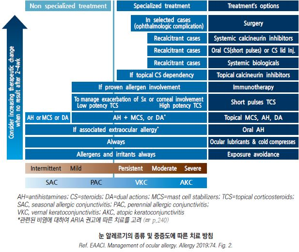

# 결막염 Conjunctivitis

## <mark style="color:green;">일반 사항</mark>

* 안구의 흰자위와 눈꺼풀 내측 표면을 덮고 있는 점막인 결막의 염증
* 분류
  * 감염성 : 바이러스(가장 흔함), 세균
  * 비감염성 : 알레르기, 비-알레르기(예: 건조, 바람, 연기, 외상)
* 증상 : 충혈, 분비물, 가려움, 자극감, 이물감
* 비감염성 결막염은 보통 양측에 발생
* 감염성 결막염의 전염 경로 : 환자의 분비물에 오염된 손이나 물체의 눈 접촉

### <mark style="color:$danger;">🚩 Red Flags!</mark>

<mark style="color:$danger;">**즉각 조치 또는 의뢰**</mark>

* 급속히 진행된 심한 화농성 결막 분비물 (임균성 결막염 의심)

<mark style="color:$warning;">**당일 또는 조기 의뢰**</mark>

* 시력 저하, 각막 혼탁, 심한 눈부심
* ciliary flush(모양충혈) : 가장 현저한 충혈이 limbus ring에 발생 → 각막염·홍채염 의심
* 이물감을 넘어서는 심한 안구통(deep eye pain) → 각막염·공막염 의심
* 동공 크기 변화 : 축동(miosis) → 홍채염(Iritis) 의심 / 산대 + 반응 소실 → 급성 폐쇄각 녹내장 의심
* 콘택트렌즈 관련 결막염이 렌즈 사용 중단 및 치료 24시간 이후에도 지속
* 헤르페스 피부 수포 동반 안구 충혈

<mark style="color:$info;">**외래 추적 / 추가 평가 계획 - 즉각 위험 낮으나 호전 없으면 의뢰**</mark>

* 대증 치료로 5\~7일 내 호전 안 됨
* 면역저하자의 결막염
* STI 감염 의심 정황 동반 (임균·클라미디아)

## <mark style="color:green;">알레르기 결막염 (Allergic Conjunctivitis)</mark>

* 기전 : 공기 중의 알레르겐 접촉 → type 1 과민 반응(IgE 매개) → local mast cell degranulation

#### <mark style="color:$primary;">분류</mark>

**급성 알레르기 결막염**

* 극적인 경과를 보임; 알레르겐 노출 후 빠르게(수 시간 내) 발생, 노출 중단 24시간 내 호전
* 심한 증상

**계절적(seasonal) 알레르기 결막염**

* 급성 알레르기 결막염에 비하여 덜 극적인 경과를 보임; 발생부터 호전까지 수일\~수 주 경과
* 실외 인자와 관련 : 꽃가루, 곰팡이 포자

**지속성(perennial) 알레르기 결막염**

* 간헐적으로 발생한 경우보다 증상이 덜하며 만성 경과를 보임; 보통 악화-완화 반복
* 실내 인자와 관련 : 집먼지진드기, 실내 곰팡이, 애완동물 비듬

### <mark style="color:orange;">임상 양상</mark>

* 보통 처음부터 양측 발생
  * 알레르기 결막염과 편측 증상 : 한쪽 눈에만 증상이 있어도 알레르기를 배제할 수 없음. 가려운 눈을 비빈 손이 반대쪽 눈을 아직 건드리지 않았다면 일시적으로 편측 양상으로 보일 수 있음
* 결막 충혈 및 부종, 눈꺼풀 부종, 눈꺼풀 결막의 소포성 변화(바이러스 결막염보다 적음, 만성 경과에서는 보다 흔함)
* 심한 가려움, 작열감; 간혹 눈부심, 시각 장애
* 수양성/점액성 분비물, 눈물 증가
* 지속성 알레르겐과 계절적 알레르겐이 중복되면 증상이 보다 심하게 발생
* 흔히 다른 알레르기 증상이 있음 (예: 알레르기 비염, 아토피)
* Vernal keratoconjunctivitis : 젊은층에서 봄에 호발; large cobblestone papillae가 위 눈꺼풀에 발생
* Atopic keratoconjunctivitis : 만성 경과; 위/아래 눈꺼풀의 papillary 변화

※ 가려움이 없거나 안구통이 있으면 다른 질환 의심

## <mark style="color:green;">바이러스 결막염 (Viral Conjunctivitis)</mark>

* 원인균 : adenovirus(가장 흔함), coxsackievirus, enterovirus, herpes virus
* 경과 : 한쪽에서 시작 → 48시간 내 반대쪽 전이 → 3\~5일간 악화 → 1\~2주간 호전; 총 2\~3주 내 자연 회복
* 전염 기간 : (증상 발생 후부터) 급성 출혈성 결막염 - 4일간, 아데노바이러스 - 14일간

#### <mark style="color:$primary;">임상 양상</mark>

* 수양성 분비물
  * 점액성 분비물이 나타나거나 아침에 화농 양상의 분비물을 호소할 수도 있음
* 모래 느낌, 눈부심, 눈물 증가
* 결막 충혈 및 부종, 눈꺼풀 결막의 소포성(follicle) 변화
* 눈 이외 증상 : 귓바퀴 앞 림프절 압통, 발열, 인두염
* 치료 후에도 3\~5일간은 증상이 더 심해질 수 있음

#### <mark style="color:$primary;">종류</mark>

**급성 출혈 결막염 (Acute hemorrhagic conjunctivitis)**

* 원인균 : enterovirus 70, coxsackievirus 24
* 증상 : 출혈성 분비물, 부종, 통증

**인두결막열 (Pharyngoconjunctival fever)**

* 원인균 : adenovirus가 눈과 인두에 이환
* 증상 : 인두염, 양측 결막염(눈꺼풀 결막의 충혈 및 follicular reaction), 고열, 귓바퀴 앞 림프절병증

**유행성 각결막염 (Epidemic keratoconjunctivitis)**

* 원인균 : adenovirus type 8, 19, 37
* 증상 : 심한 이물감, 가려움, 작열감, 눈부심, 안구 결막 부종(chemosis), 결막 소포 비대, 결막 위막, 시야 혼탁(각막 이환 시)

**단순포진 결막염**

* 원인균 : herpes simplex (☞ [단순포진](../229_/181_-herpes-simplex.md))
* 증상 : 작열감, 편측 이환, 피부 수포 동반; 가려움은 적음

 ※ HSV 결막염 의심 시 스테로이드 점안액 절대 금기 - 각막 수지상 병변(dendritic lesion) 확인 시 즉시 안과 의뢰

## <mark style="color:green;">세균 결막염 (Bacterial Conjunctivitis)</mark>

* 원인균 : _S. aureus_ (가장 흔함), _S. pneumoniae_, _H. influenzae_, _M. catarrhalis_
  * 렌즈 착용과 관련하여 발생한 경우에는 세균 감염의 가능성이 많음
* 경과 : 한쪽에서 시작 → 1\~2일 내 반대쪽 전이 → 보통 1\~2주 내 자연 회복
* 전염 기간 : 증상 발생 후 7일간
* 균 동정 검사 대상 : 신생아, 면역저하자, _N. gonorrhoeae_ 또는 _C. trachomatis_ 의심

### <mark style="color:orange;">임상 양상</mark>

* 지속적인 점액농성 삼출물; 닦아낸 후 10분 내에 다시 나타남
* 결막 충혈 및 부종, 눈꺼풀 결막의 papillary change
* 가려움 및 국소 림프절 비대는 적음

**Gonococcal conjunctivitis**

* 경과 : Hyperacute - 수 시간 내에도 각막 천공이 가능함(응급)
* 증상 : 매우 많은 화농성 분비물(profuse purulent discharge), 심한 결막 부종
* 관련 인자 : 성 접촉

 ※ 항생제 치료와 함께 시간당 생리식염수 안구 세척 병행. 성 파트너 동시 치료 필요.

**Chlamydia conjunctivitis**

* 증상 : 보통 편측 발생, 귓바퀴 앞 림프절 압통
* 관련 인자 : 직간접 생식기 접촉

## <mark style="color:green;">기타</mark>

#### <mark style="color:$primary;">콘택트렌즈 관련 결막염</mark>

* 증상 : 편측 또는 양측 충혈, 경미한 가려움, 점액성 분비물, 결막 비후
* 치료 : 최근에 사용한 렌즈 및 케이스 폐기 또는 철저 소독
  * 알레르기 또는 감염 의심 양상 시 이에 대하여 치료
  * 항생제 투여 시 흔한 원인균인 _P. aeruginos&#x61;_&#xC5D0; 대하여 quinolone 제제 선택

 ※ 각막 침윤(corneal infiltrate) 확인 필수 : 콘택트렌즈 사용자는 단순 결막염으로 간과하기 쉬우나 _Pseudomona&#x73;_&#xC5D0; 의한 세균 각막 궤양으로 신속히 진행할 수 있으므로 각막 혼탁·침윤 여부를 반드시 확인하고, 의심 시 즉시 의뢰

#### <mark style="color:$primary;">기계적 결막염</mark>

* 증상 : 국소 또는 광범위 결막 충혈, 이물감, 눈물
* 치료 : 이물 제거, 윤활제(점안 연고제), 감염 치료

#### <mark style="color:$primary;">외상성 결막염</mark>

* 증상 : 결막 충혈, 눈물, 이물감
* 치료 : 원인에 따른 치료. 세척, 항생제 연고

#### <mark style="color:$primary;">독성 결막염 (Toxic conjunctivitis)</mark>

* 원인 : 안약제(인공 눈물, 콘택트렌즈 액 포함)의 1일 다회, 장기 사용에 의한 자극 반응; 흔히 안약에 포함되어 있는 방부제와 관련
* 증상 : 가려움, 결막 충혈, chemosis, 점액성 분비물, 눈꺼풀 결막의 follicular/papillary 변화
* 치료 : 원인에 따른 치료. 윤활제

## <mark style="color:green;">진단</mark>

* 진단을 위한 검사는 보통 필요 없음
* 다른 질환 배제를 위하여 고려 (☞ [눈 충혈](037_-red-eye.md))

### <mark style="color:orange;">감별</mark>

* 분비물 등의 임상 양상으로 감별을 시도하지만 종종 명확하지 않음

<table><thead><tr><th width="151"></th><th width="187">알레르기</th><th width="147">바이러스</th><th width="152">세균</th></tr></thead><tbody><tr><td><strong>분비물</strong> 수양성</td><td>+</td><td>+</td><td>-</td></tr><tr><td><strong>분비물</strong> 점액성</td><td>+</td><td>-</td><td>-</td></tr><tr><td><strong>분비물</strong> 점액고름성</td><td>-</td><td>-</td><td>+</td></tr><tr><td><strong>분비물</strong> 고름성</td><td>-</td><td>-</td><td>+</td></tr><tr><td><strong>눈부심</strong></td><td>-</td><td>±</td><td>-</td></tr><tr><td><strong>통증 특징</strong></td><td>가려움</td><td>모래 느낌, 작열감</td><td>모래 느낌, 작열감</td></tr><tr><td><strong>기타</strong></td><td>다른 알레르기 질환 동반</td><td>한쪽 눈에서 시작</td><td>한쪽 눈에서 시작</td></tr></tbody></table>

_<mark style="color:$info;">Ref. Differentiating conjunctivitis of diverse origins. Surv Ophthalmol 1993;38</mark>_

### <mark style="color:orange;">Quick Decision Tips</mark>

<table><thead><tr><th width="315">핵심 질문</th><th>YES →</th></tr></thead><tbody><tr><td>통증이 심하거나 시력이 떨어졌는가?</td><td><strong>즉시 안과 의뢰</strong> (각막염·홍채염·녹내장 배제)</td></tr><tr><td>눈이 심하게 가려운가?</td><td><strong>알레르기성</strong> → 냉찜질, 항히스타민 점안액</td></tr><tr><td>눈곱이 닦아도 10분 내 다시 끼는가?</td><td><strong>세균성</strong> → 경험적 항생제 점안액 고려</td></tr><tr><td>감기 기운 + 귀 앞 림프절이 부었는가?</td><td><strong>바이러스성</strong> → 대증 치료, 격리·위생 강조</td></tr><tr><td>콘택트렌즈 착용자인가?</td><td><strong>각막 침윤 확인</strong> 필수 → 의심 시 즉시 의뢰</td></tr></tbody></table>

***

## <mark style="background-color:$warning;">Management</mark>

### <mark style="color:orange;">치료 방침</mark>

* 콘택트렌즈 사용 중단 : 충혈이 없고 분비물이 24시간 이상 나타나지 않을 때까지 중단
* 접촉 제한 : 감염 의심 시 환자는 14일 동안 수건 등을 혼자 사용함
  * 사회 격리(출근/등교 제한) : 눈 충혈 및 눈물 증상이 사라질 때까지
* 알레르기성인 경우 알레르겐 회피
* 감염성인 경우 최근에 사용한 렌즈 폐기 또는 철저 소독, 눈 화장품(특히 마스카라) 폐기
* 항생제 안약 : 제한적 사용; 세균성 결막염에 대하여 고려할 수 있으나 세균성 결막염도 대부분 자연 치유되므로 항생제 안약 사용이 필요한 경우는 많지 않음
* 스테로이드 점안액 주의 :  증상 완화 효과가 있으나 HSV 각막염에서 각막 손상 악화, 장기 사용 시 안압 상승·백내장 위험이 있으므로 처방 하기 전에 HSV 감염 여부를 반드시 확인해야 함

#### <mark style="color:$primary;">안약 사용법</mark>

* 개봉하여 사용한 다회 사용 점안액 사용 기한 : 개봉 후 4주(1달)
* 다음의 경우 무방부제 약제 선택 : 1일 5회(미국안과학회)\~7회(NHS) 이상 지속 사용, 콘택트렌즈 착용
* 투여량 : 아래 눈꺼풀 안쪽에 액체의 경우 1\~2방울 점적, 연고의 경우 0.5 인치 투여
* 다른 성분의 여러 안약제를 투여하는 경우 3\~5분 간격으로 투여

**점안액 점안 방법**

1. 약병을 확인한다.
2. 손을 씻는다.
3. 병을 열기 전에 몇 번 흔든다.
4. 고개를 뒤로 젖힌 후 한 손가락으로 아래 눈꺼풀을 아래로 당긴다.
5. 약병 끝이 눈에 닿지 않는 높이에서 안구와 눈꺼풀 사이에 떨어뜨린다.
6. 점안 후 수 초 동안 눈을 살짝 감고 있는다(반복적인 깜박임은 피함).
7. (약이 좀 더 머물 수 있도록) 눈의 코 쪽 끝을 손가락으로 수 분 동안 눌러 준다.
8. 손을 씻는다.

<figure><figcaption></figcaption></figure>

## <mark style="color:green;">알레르기 결막염 치료</mark>

* 문지르지 않는 것이 중요
* 냉찜질 : 가려움 및 부종 감소 효과
* 인공 눈물 : 증상 완화, 알레르겐 제거 효과 (☞ [눈마름증](042_-dry-eye.md#undefined-6))
* 알레르겐 회피 (☞ [항원회피](051_-allergic-rhinitis.md#undefined-13), [위험인자관리](../223_/071_-asthma.md#undefined-37))

#### <mark style="color:$primary;">국소 항히스타민제</mark>

* 1차 선택제; 가려움 등의 증상 완화 효과
* 국소 혈관 수축제(충혈 제거제) 또는 비만 세포 안정제 병용 시 보다 효과적

#### <mark style="color:$primary;">경구 항히스타민제</mark>

* 국소 항히스타민제보다 늦게 반응, 효과 적음, 안구 건조를 유발할 수 있음 (☞ [항히스타민제](../231_/212_-antihistamines.md))
* cetirizine : 10 ㎎ qd <mark style="color:blue;">\[지르텍]</mark>
* fexofenadine : 120 ㎎ qd <mark style="color:blue;">\[알레그라]</mark>
* loratadine : 10 ㎎ qd <mark style="color:blue;">\[클라리틴]</mark>
* mequitazine : 5 ㎎ bid <mark style="color:blue;">\[프리마란]</mark>

#### <mark style="color:$primary;">국소 비만 세포 안정제</mark>

* 충분한 효과 발현까지 1\~2주 소요
* 적용 : 만성 지속성 또는 재발성인 경우 지속 사용을 고려(예방 효과 기대)

#### <mark style="color:$primary;">국소 충혈 제거제</mark>

* 적용 : 발적, 충혈, 부종
* 알레르기 반응을 감소시키지는 못함
* 주의 : 단기 사용(5\~7d), 투여 중 렌즈 사용 중지
* 부작용 : 작열감, 속성 내성(tachyphylaxis), 반동성 충혈, 약물 결막염(conjunctivitis medicamentosa)

#### <mark style="color:$primary;">국소 NSAID</mark>

* 적용 : 가려움, 불편감
* 국소 항히스타민제보다 효과 적음

#### <mark style="color:$primary;">국소 Steroid</mark>

* 적용 : 호전되지 않는 결막염에 대하여 단기간(＜2주) 사용 (알레르기 결막염에 드물게 필요)
* 사용 2일 내 호전되지 않는 경우 재평가
* 부작용 : 장기 사용 시 안압 상승, 바이러스 감염, 백내장
* 주의 : herpes simplex, fungal, keratitis 등에서 사용하는 경우 각막 손상이 발생할 수 있음
* loteprednol <mark style="color:blue;">\[로테프로]</mark>, rimexolone <mark style="color:blue;">\[벡솔]</mark>, fluorometholone <mark style="color:blue;">\[오큐메토론]</mark>이 상대적으로 부작용이 적음

#### <mark style="color:$primary;">국소 비내 Steroid</mark>

* 적용 : 알레르기비염/결막염과 관련된 안구 증상 치료에 효과 (☞ [비내용스테로이드](051_-allergic-rhinitis.md#undefined-17))
* 비염 증상 없이 안구 증상만 있는 경우에는 사용하지 않음

#### <mark style="color:$primary;">국소 면역 조절제</mark>

* 적용 : vernal or atopic keratoconjunctivitis의 steroid 의존 환자에서 steroid 대체 고려
* 이 약제의 사용을 고려할 정도의 심한 환자는 의뢰를 고려
* 종류 : 국소 cyclosporine <mark style="color:blue;">\[레스타시스]</mark>(☞ [보험기준](https://www.hira.or.kr/rc/insu/insuadtcrtr/InsuAdtCrtrPopup.do?mtgHmeDd=20170701\&sno=1\&mtgMtrRegSno=0009)), 국소 tacrolimus(CsA에 난치성인 경우)

#### <mark style="color:$primary;">알레르겐 면역 치료</mark>

* allergen immunotherapy : grass pollen, house dust mite에 기인한 알레르기 결막염에 효과
  * first-line 치료 실패 또는 눈 알레르기 질환의 자연 경과를 변화시키고자 할 때 고려
  * IgE-mediated hypersensitivity가 입증될 때만 고려
* subcutaneous immunotherapy : 알레르기 결막염의 증상 완화에 효과

***



***

## <mark style="color:green;">바이러스 결막염 치료</mark>

* 특별한 치료법은 없음
* 눈꺼풀 세척 : (유아용 비누/샴푸 또는 눈꺼풀 세정제로) 1일 4회 세척
* 냉찜질, 인공 눈물 : 증상 완화에 도움 (☞ [인공눈물](042_-dry-eye.md#undefined-9); [보험주의](https://www.hira.or.kr/rc/insu/insuadtcrtr/InsuAdtCrtrPopup.do?mtgHmeDd=20241201\&sno=3\&mtgMtrRegSno=0013))
* 국소 steroid : 증상 완화에 일부 유효하나 바이러스 배출을 연장시킬 가능성이 있음
* 국소 항히스타민제/수축제 : 증상 완화 효과
* 경구 항히스타민제 : 코 증상 및 가려움을 줄일 수 있으나 안구 건조를 유발할 수 있음

 ※ 아데노바이러스는 염력이 매우 강하며 증상 발현 전후로도 전파됨. 수건·비누 공유를 금지하고, 수도꼭지·문손잡이·욕실 표면을 소독(70% 알코올 또는 염소계 소독제). 눈을 만진 후에는 즉시 손을 씻음

#### <mark style="color:$primary;">항바이러스제</mark>

* adenovirus 등 일반적으로는 효과 없음
* herpes 감염에 적용 (헤르페스 의심 시 의뢰)
* 국소 : ganciclovir <mark style="color:blue;">\[버간]</mark>, trifluridine <mark style="color:blue;">\[오큐플리딘]</mark>
* 경구 : acyclovir, valacyclovir (☞ [단순포진](../229_/181_-herpes-simplex.md#undefined-14))

## <mark style="color:green;">세균 결막염 치료</mark>

* 눈 세척(1일 4회)
* 냉찜질
* 인공 눈물

#### <mark style="color:$primary;">국소 항생제</mark>

* 경증의 경우 항생제 치료는 필요 없음; 대부분 항생제가 경과에 유의미한 영향을 주지 못함
* 용법 : 연고 bid, 물약 qid ×5\~7d; 수일 후 증상이 호전되면 bid로 줄일 수 있음
* 보통 경험적 선택
* 치료 시작 2일째에도 반응하지 않으면 의뢰 고려
* quinolone제는 1차로 선택하지 않으며 수술 후, 콘택트렌즈 관련 결막염, 다른 항생제에 내성이 있는 경우에 고려

<table><thead><tr><th width="385">성분명 [상품명]</th><th width="141">적응증 균주</th><th width="104">용법</th></tr></thead><tbody><tr><td>tobramycin <mark style="color:blue;">[토라빈]</mark></td><td>SA, SP, H, E, P</td><td>q2h~qid</td></tr><tr><td>polymyxin-B/TMP</td><td>SA, SP, H, E</td><td>q3h</td></tr><tr><td>erythromycin/colistin</td><td>SA, SP, H, N</td><td>qhs~qid</td></tr><tr><td>bacitracin</td><td>SA, SP, N</td><td>qhs~qid</td></tr><tr><td>oxytetracycline/polymyxin-B <mark style="color:blue;">[테라마이신]</mark></td><td>SA, E, N</td><td>q2h~qid</td></tr><tr><td>chloramphenicol <mark style="color:blue;">[클로람페니콜]</mark></td><td>SA, H</td><td>q2h~qid</td></tr><tr><td>polymyxin-B/neomycin</td><td>SA, P</td><td>qid</td></tr><tr><td>Na sulfacetamide</td><td>SP, H</td><td>q2h~qid</td></tr><tr><td>sulfisoxazole diolamine</td><td>SP, H</td><td>qid</td></tr><tr><td>ciprofloxacin <mark style="color:blue;">[씨펙스]</mark>, ofloxacin <mark style="color:blue;">[타리비드]</mark>, levofloxacin <mark style="color:blue;">[크라비트]</mark>, moxifloxacin <mark style="color:blue;">[모록사신]</mark></td><td>SA, SP, H, P</td><td>q2h~qid</td></tr></tbody></table>

_SA=S. aureus, SP=S. pneumoniae, H=H. influenzae, P=P. aeruginosa, E=Escherichia coli, N=Neisseria, TMP=trimethoprim._\
&#xNAN;_&#x52;ef. American optometric association. Care of the patient with conjunctivitis. 2002._

#### <mark style="color:$primary;">국소 항생제 대용</mark>

* povidone-iodine : 항생제 대체 또는 보조 <mark style="color:blue;">\[티어드롭]</mark>

#### <mark style="color:$primary;">국소 항생제/Steroid 복합제</mark>

* steroid : 증상 완화 효과; 부작용 주의
* tobramycin + dexamethasone <mark style="color:blue;">\[토브라덱스]</mark>
* polymyxin-B/neomycin + dexamethasone <mark style="color:blue;">\[포러스]</mark>
* chloramphenicol + dexamethasone

#### <mark style="color:$primary;">경구 항생제</mark>

**Chlamydial conjunctivitis**

* doxycycline : 100 ㎎ bid ×14d <mark style="color:blue;">\[독시사이클린]</mark>
* erythromycin : 250 ㎎ qid ×14d

**Gonococcal conjunctivitis**

* ceftriaxone : 1 g IM × 1회 <mark style="color:blue;">\[트리악손]</mark>

***

### <mark style="color:red;">질병코드</mark>

A74.0 클라미디아결막염

B00.52 헤르페스결막염

B30 바이러스결막염

H10 결막염

H10.1 급성 아토피결막염

H11 결막의 기타 장애

H13.1 달리 분류된 감염성 및 기생충성 질환에서의 결막염

H16 각막염

***

## <mark style="color:purple;">처방례</mark>

> **처방례 1. 알레르기 결막염**
>
> ```
> 파타놀 점안액(0.1%) 5 ㎖/병  1방울 bid (증상 지속 시까지)
>     또는 파타놀-S 점안액(0.2%) 2.5 ㎖/병  1방울 qd (1일 1회 투여)
> 오큐메토론 점안액 5 ㎖/병  1방울 qid (단기 2주 이내; 증상 조절 후 중단)
> 지르텍 10 ㎎/T  1T qd 저녁 (가려움 심할 때)
> ```
>
> _✽파타놀(olopatadine 0.1%) : 항히스타민 + 비만세포 안정 복합 작용; 증상 심할 경우 olopatadine과 국소 steroid(오큐메토론) 병용. 스테로이드는 2주 이내 단기 사용 후 반드시 재평가_

> **처방례 2. 바이러스 결막염**
>
> ```
> 나조린 점안액 15 ㎖/병  1방울 qid (비급여; 증상 완화 목적)
> 브로낙 점안액 5 ㎖/병  1방울 bid (이물감·불편감 완화)
> ```
>
> _✽바이러스 결막염은 특이 치료제 없음. 냉찜질·인공눈물 병행 권고. 치료 후 3\~5일간 증상이 더 심해질 수 있음을 환자에게 미리 설명_

> **처방례 3. 세균 결막염**
>
> ```
> 토브라 점안액 5 ㎖/병  1방울 qid ×5~7d (수일 후 호전 시 bid로 감량)
> ```
>
> _✽경증은 자연 치유가 원칙; 증상이 심하거나 콘택트렌즈 사용자, 면역저하자에서 항생제 고려. 2일째에도 반응 없으면 의뢰_\
> &#xNAN;_✽콘택트렌즈 사용자는 P. aeruginosa 각막 궤양 위험이 높으므로 퀴놀론계(예: 크라비트, 모록사신 등)를 우선적으로 고려해야 하며, 각막 침윤 여부를 반드시 확인해야 함_

> **처방례 4. 클라미디아 결막염 (경구)**
>
> ```
> 독시사이클린 100 ㎎/T  1T bid ×14d
> ```
>
> _✽성 파트너 동시 치료 필요_

> **처방례 5. 임균 결막염 (응급)**
>
> ```
> 트리악손주 1 g  IM × 1회
> ```
>
> _✽즉각 안과 의뢰. 시간당 생리식염수 안구 세척 병행. 성 파트너 동시 치료 필요_

***

### <mark style="color:$success;">핵심 복약 지도</mark>

> **결막염 안약 사용 안내**
>
> * 점안액은 아래 눈꺼풀을 살짝 당긴 후, 결막낭(아랫 눈꺼풀 안쪽)에 1\~2방울 떨어뜨리십시오. 약병 끝이 눈에 닿지 않도록 주의하십시오.
> * 점안 후 수 초 동안 눈을 살며시 감고, 눈 안쪽(코 옆 눈물점)을 손가락으로 1\~2분간 가볍게 눌러 주십시오. 약 성분이 눈물관을 통해 코점막으로 흡수되어 나타날 수 있는 쓴맛, 심박수 변화 등의 전신 부작용을 줄여 줍니다.
> * 여러 종류의 점안액을 함께 사용하는 경우, 점안 간격을 3\~5분 이상 두십시오.
> * 콘택트렌즈를 착용 중인 경우, 점안 전 렌즈를 먼저 빼고 점안 후 15분 뒤에 다시 착용하십시오.
> * 개봉 후 4주가 지난 점안액은 오염 우려가 있으므로 사용하지 마십시오.

> **감염 예방 및 전파 차단**
>
> * 손을 자주 씻고 눈을 만지거나 비비지 마십시오.
> * 수건, 베개, 눈 화장품은 혼자 사용하십시오.
> * 결막염이 있는 동안 콘택트렌즈 착용을 중단하십시오.
> * (바이러스성인 경우) 충혈과 눈물이 가라앉을 때까지 등교·출근을 자제하십시오.

> **언제 다시 병원을 방문해야 하나요?**
>
> * 치료를 시작했는데도 5\~7일 내 증상이 호전되지 않는 경우
> * 눈이 충혈되면서 **시력이 흐려지거나 떨어지는** 경우 — 즉시 내원
> * **심한 눈의 통증** 또는 두통이 동반되는 경우 — 즉시 내원
> * 강한 빛을 보기 힘들 정도로 **눈부심이 심해지는** 경우 — 즉시 내원

***

### <mark style="color:blue;">환자 안내서</mark>


**결막염, 종류에 따라 원인과 치료가 다릅니다**

결막염은 눈을 덮고 있는 얇은 막(결막)에 생기는 염증으로, 바이러스·세균·알레르기 등이 원인입니다. 대부분 1\~2주 내에 자연 회복되지만, 종류에 따라 관리법이 다릅니다.


#### <mark style="color:$primary;">결막염의 종류별 특징은 무엇인가요?</mark>

* **바이러스 결막염** (가장 흔함) : 수양성 분비물, 한쪽에서 시작해 반대쪽으로 퍼짐. 특별한 치료약은 없으며 증상 완화 치료를 합니다. 전염성이 강하므로 위생 관리가 중요합니다.
* **세균 결막염** : 끈적한 황녹색 분비물이 특징입니다. 경증은 자연 회복되지만 항생제 안약으로 회복을 앞당길 수 있습니다.
* **알레르기 결막염** : 심한 가려움이 특징이며 양쪽 눈에 동시에 발생합니다. 항히스타민 안약과 알레르겐 회피가 도움이 됩니다.

#### <mark style="color:$primary;">가정에서 어떻게 관리하나요?</mark>

* **냉찜질** : 깨끗한 수건을 차갑게 적셔 눈 위에 얹으면 가려움과 부종 완화에 도움이 됩니다.
* **인공눈물** : 자극 감소 및 분비물·알레르겐 세척 효과가 있습니다.
* **눈 비비기 금지** : 비비면 증상이 악화되고 각막에 상처가 생길 수 있습니다.
* **눈꺼풀 세척** (바이러스 결막염) : 유아용 샴푸를 희석한 물로 1일 4회 눈꺼풀을 닦아 주십시오.

#### <mark style="color:$primary;">전파 예방을 위해 무엇을 해야 하나요?</mark>

* 흐르는 물로 손을 자주, 꼼꼼히 씻으십시오.
* 수건, 비누, 베개, 눈 화장품(특히 마스카라)은 혼자만 사용하고, 감염 기간 중 사용한 화장품은 버리십시오.
* 눈을 만진 후에는 즉시 손을 씻으십시오.
* **수도꼭지, 문손잡이, 욕실 표면**을 알코올 소독제로 자주 닦으십시오. 아데노바이러스는 단단한 표면에서 수일간 생존할 수 있습니다.
* 바이러스 결막염은 눈 충혈과 눈물이 가라앉을 때까지 유치원·학교·직장 출석을 자제하십시오.

#### <mark style="color:$primary;">콘택트렌즈 사용 시 주의사항</mark>

* 결막염 증상이 있는 동안에는 콘택트렌즈 착용을 완전히 중단하십시오.
* 감염성 결막염이었다면 사용 중이던 렌즈와 렌즈 케이스를 폐기하십시오.
* 회복 후에도 충혈이 없고 분비물이 24시간 이상 없을 때까지 렌즈를 착용하지 마십시오.

#### <mark style="color:$primary;">이럴 때는 즉시 병원을 방문하세요</mark>

* 눈의 충혈과 함께 **시력이 갑자기 떨어지거나 흐려지는** 경우
* **심한 눈의 통증**이 있거나 두통·구역이 동반되는 경우
* 강한 빛을 보기 힘들 정도로 **눈부심이 심한** 경우
* 치료를 시작했는데 **5\~7일이 지나도 호전이 없는** 경우
* 콘택트렌즈 관련 결막염이 렌즈 중단 및 치료 24시간 후에도 **지속되는** 경우
