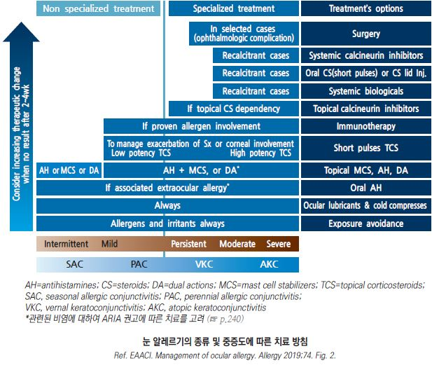

# 결막염 Conjunctivitis

## <mark style="color:green;">일반 사항</mark>

* 안구의 흰자위와 눈꺼풀 내측 표면을 덮고 있는 점막인 결막의 염증
* 분류
  * 감염성 : 바이러스(가장 흔함), 세균
  * 비감염성 : 알레르기, 비-알레르기(예: 건조, 바람, 연기, 외상)
* 증상 : 충혈, 분비물, 가려움, 자극감, 이물감
* 알레르기 결막염은 보통 양측에 발생하지만, 자극·이물·외상에 의한 비감염성 결막염은 편측일 수 있음
* 감염성 결막염의 전염 경로 : 환자의 분비물에 오염된 손이나 물체의 눈 접촉

※ 단순 결막염에서는 심한 안구통, 교정되지 않는 시력저하, 뚜렷한 광과민이 전형적이지 않음. 이러한 소견이 있으면 각막염·앞포도막염·급성 폐쇄각녹내장 등 시력위협 질환을 우선 배제

### <mark style="color:$danger;">🚩 Red Flags!</mark>

<mark style="color:$danger;">**즉각 조치 또는 의뢰**</mark>

* 급속히 진행된 심한 화농성 결막 분비물 (임균성 결막염 의심)
* 콘택트렌즈 사용자에서 통증·뚜렷한 광과민·시력저하·각막 혼탁/침윤 또는 fluorescein 염색 이상이 동반된 충혈 → 세균각막염 우선 배제, 대기 없이 즉시 안과 평가
* 화학물질 노출 → 즉시 충분한 세척을 시작하고 응급 평가(의뢰 때문에 세척을 지연하지 않음)

<mark style="color:$warning;">**당일 또는 조기 의뢰**</mark>

* 시력 저하, 각막 혼탁, 심한 눈부심
* ciliary flush(모양충혈) : 가장 현저한 충혈이 각막 주위(limbus ring)에 발생 → deep ocular inflammation, 각막염·홍채염 의심
* 이물감을 넘어서는 심한 안구통, 특히 심부 통증(deep eye pain) → 각막염·공막염 의심
* 동공 크기 변화 : 축동(miosis) → 홍채염(Iritis) 의심 / 산대 + 반응 소실 → 급성 폐쇄각 녹내장 의심
* 콘택트렌즈 사용자의 급성 충혈에서 각막염을 확실히 배제하기 어렵거나, 렌즈 사용 중단 후에도 호전되지 않고 지속
* 헤르페스 피부 수포 동반 안구 충혈
* 생후 30일 이내 신생아의 충혈 또는 결막 분비물 → 임균·클라미디아를 포함한 신생아 결막염 평가

<mark style="color:$info;">**외래 추적 / 추가 평가 계획**</mark> <mark style="color:$info;">- 즉각 위험 낮으나 호전 없으면 의뢰</mark>

* 대증 치료로 5\~7일 내 호전 안 됨
* 면역 저하자의 경증 결막염(통증·시력저하·각막 소견이 있으면 당일 의뢰)
* 응급 소견 없이 만성 여포결막염 등 클라미디아 감염이 의심되는 정황

## <mark style="color:green;">알레르기 결막염 (Allergic Conjunctivitis)</mark>

* 기전 : 공기 중의 알레르겐 접촉 → type 1 과민 반응(IgE 매개) → local mast cell degranulation

#### <mark style="color:$primary;">분류</mark>

**급성 알레르기 결막염**

* 극적인 경과를 보임; 알레르겐 노출 후 빠르게(수 시간 내) 발생, 노출 중단 24시간 내 호전
* 심한 증상

**계절적(seasonal) 알레르기 결막염**

* 급성 알레르기 결막염에 비하여 덜 극적인 경과를 보임; 발생부터 호전까지 수일\~수 주 경과
* 실외 인자와 관련 : 꽃가루, 곰팡이 포자

**지속성(perennial) 알레르기 결막염**

* 간헐적으로 발생한 경우보다 증상이 덜하며 만성 경과를 보임; 보통 악화-완화 반복
* 실내 인자와 관련 : 집먼지진드기, 실내 곰팡이, 애완동물 비듬

### <mark style="color:orange;">임상 양상</mark>

* 보통 처음부터 양측 발생
  * 알레르기 결막염과 편측 증상 : 한쪽 눈에만 증상이 있어도 알레르기를 배제할 수 없음. 가려운 눈을 비빈 손이 반대쪽 눈을 아직 건드리지 않았다면 일시적으로 편측 양상으로 보일 수 있음
* 결막 충혈 및 부종, 눈꺼풀 부종, 눈꺼풀 결막의 유두성 변화(papillary reaction) — 여포반응(follicular reaction)은 바이러스·클라미디아·독성/약물 결막염을 시사하므로 감별 필요
* 심한 가려움, 작열감
* 수양성/점액성 분비물, 눈물 증가
* 지속성 알레르겐과 계절적 알레르겐이 중복되면 증상이 보다 심하게 발생
* 흔히 다른 알레르기 증상이 있음 (예: 알레르기 비염, 아토피)
* Vernal keratoconjunctivitis(VKC) : 주로 사춘기 이전 소아·청소년, 특히 남아에서 호발하며 봄·여름에 악화. large cobblestone papillae가 위 눈꺼풀에 발생하고 사춘기 이후 호전되는 경우가 많지만 지속되거나 재발할 수 있음
* Atopic keratoconjunctivitis : 만성 경과; 위/아래 눈꺼풀의 papillary 변화

※ 가려움이 없거나 안구통이 있으면 다른 질환 의심

※ 진성 시력저하나 뚜렷한 눈부심은 단순 알레르기 결막염에서 전형적이지 않음 → VKC·AKC의 각막 침범 등 다른 질환 의심

## <mark style="color:green;">바이러스 결막염 (Viral Conjunctivitis)</mark>

* 원인균 : adenovirus(가장 흔함), coxsackievirus, enterovirus, herpes virus
* 경과 : 흔히 한쪽에서 시작하여 수일 내 반대쪽으로 전파되고 발병 초기 수일간 악화한 뒤 서서히 호전. 보통 2\~3주 내 회복하지만 유행각결막염은 3\~4주 이상 지속될 수 있음
* 전염 기간을 일률적으로 정하기는 어려우며 눈물·분비물과 충혈이 지속되는 동안 전파 가능. 유행각결막염은 특히 발병 후 약 2주간 전염력이 강함

#### <mark style="color:$primary;">임상 양상</mark>

* 수양성 분비물
  * 점액성 분비물이 나타나거나 아침에 화농 양상의 분비물을 호소할 수도 있음
* 모래 느낌, 눈부심, 눈물 증가
* 결막 충혈 및 부종, 눈꺼풀 결막의 소포성(follicle) 변화
* 눈 이외 증상 : 귓바퀴 앞 림프절 압통, 발열, 인두염
* 치료 여부와 관계없이 발병 초기 수일간 증상이 더 심해질 수 있음

#### <mark style="color:$primary;">종류</mark>

**급성 출혈 결막염 (Acute hemorrhagic conjunctivitis)**

* 원인균 : enterovirus 70, coxsackievirus 24
* 증상 : 급격한 충혈, 이물감·통증, 눈꺼풀부종, 수양성 또는 점액성 분비물과 함께 점상 또는 광범위 결막밑출혈(subconjunctival hemorrhage) 발생
* ※ 통증·이물감 없이 국소 출혈만 있는 경우 단순(외상성 등) 결막밑출혈과 감별

**인두결막열 (Pharyngoconjunctival fever)**

* 원인균 : adenovirus가 눈과 인두에 이환
* 증상 : 인두염, 양측 결막염(눈꺼풀 결막의 충혈 및 follicular reaction), 고열, 귓바퀴 앞 림프절병증

**유행성 각결막염 (Epidemic keratoconjunctivitis)**

* 원인균 : adenovirus type 8, 19, 37
* 증상 : 심한 이물감, 가려움, 작열감, 눈부심, 안구 결막 부종(chemosis), 결막 소포 비대, 결막 위막, 시야 혼탁(각막 이환 시)
* 각막상피밑침윤(subepithelial infiltrates, SEI)은 대개 발병 1\~3주 이후 나타나 눈부심·난반사·시력저하를 유발하고 수개월 이상 지속될 수 있음. 시축을 침범하거나 시력에 영향을 주면 안과 전문의가 저역가 국소 steroid를 제한적으로 사용하고 서서히 감량할 수 있으며, 재발성·steroid 의존성인 경우 cyclosporine 등 면역조절 점안제를 고려
* 거짓막(pseudomembrane)은 안과에서 세극등하 박리가 필요할 수 있으며, 심한 경우 결막 유착(symblepharon)을 유발할 수 있으므로 조기 의뢰

**단순포진 결막염**

* 원인균 : herpes simplex (☞ [단순포진](../229_/181_-herpes-simplex.md))
* 증상 : 작열감, 편측 이환, 피부 수포 동반; 가려움은 적음

 ※ HSV 상피각막염이 의심되거나 수지상 상피결손이 있으면 안과 전문의 지시 없는 스테로이드 점안은 금기이며 즉시 의뢰. HSV 기질각막염 등에서는 항바이러스제와 함께 전문의가 스테로이드를 사용할 수 있음

## <mark style="color:green;">세균 결막염 (Bacterial Conjunctivitis)</mark>

* 원인균 : 성인은 _S. aureus_가 흔하고, 소아에서는 _H. influenzae_, _S. pneumoniae_, _M. catarrhalis_ 등이 흔함
  * 렌즈 착용과 관련하여 발생한 경우에는 세균 감염의 가능성이 많음
* 경과 : 한쪽에서 시작 → 1\~2일 내 반대쪽 전이 → 보통 1\~2주 내 자연 회복
* 전염 기간을 일률적으로 7일로 정하지 않으며, 화농성 분비물이 지속되는 동안 전파 가능. 적절한 항생제 치료 후 전염 위험은 감소하지만 복귀 여부는 임상 상태와 기관 규정에 따라 판단
* 균 동정 검사 대상 : 신생아, 면역 저하자, _N. gonorrhoeae_ 또는 _C. trachomatis_ 의심

### <mark style="color:orange;">임상 양상</mark>

* 지속적인 점액농성 삼출물; 닦아낸 후 10분 내에 다시 나타남
* 결막 충혈 및 부종, 눈꺼풀 결막의 papillary change
* 가려움이 주증상인 경우는 드물고 국소 림프절 비대도 적으나, 가려움의 유무만으로 원인을 확정하지 않음

**Gonococcal conjunctivitis**

* 경과 : Hyperacute - 수 시간 내에도 각막 천공이 가능함(응급)
* 증상 : 매우 많은 화농성 분비물(profuse purulent discharge), 심한 결막 부종
* 관련 인자 : 성 접촉

 ※ 가능하면 치료 전 결막 검체 Gram 염색·배양·감수성검사를 시행하되 치료를 지연하지 않음. Ceftriaxone 1 g IM 1회 투여, 감염된 눈의 생리식염수 세척은 1회 고려(시간당 반복 세척 불필요). 즉시 안과 의뢰 및 감염내과/STI 전문가 협의. 결막 NAAT는 검사실에서 검증된 경우 사용하며 소변·질/자궁경부 또는 노출 부위 검체로 임균·클라미디아 NAAT를 함께 시행. 클라미디아 동시 감염이 배제되지 않으면 doxycycline 병용. HIV·매독 등 동반 STI 검사, 최근 60일 이내 성 파트너 평가·치료

**Chlamydia conjunctivitis**

* 증상 : 보통 편측으로 시작하는 만성 여포결막염, 점액농성 분비물, 귓바퀴 앞 림프절 압통. 일반 국소 항생제에 반응하지 않는 경우 의심
* 관련 인자 : 직간접 생식기 접촉

## <mark style="color:green;">기타</mark>

#### <mark style="color:$primary;">신생아 결막염</mark>

* 생후 30일 이내의 충혈·분비물은 임균, 클라미디아, 기타 세균 및 화학성 원인을 감별하기 위해 당일 평가
* 임균성은 출생 후 2\~5일경 심한 화농성 분비물로 나타날 수 있으며 각막 천공 위험이 있어 응급
* 클라미디아성은 흔히 출생 후 5\~12일경 발생. 결막 검체와 함께 임균도 검사하고, 국소 항생제만으로는 불충분하므로 전신 치료 필요
  * 표준 치료 : erythromycin base 또는 ethylsuccinate 50 ㎎/㎏/day PO, 4회 분할 ×14d. 치료 성공률이 완전하지 않아 임상 추적 및 필요 시 재치료
  * azithromycin 단기 요법은 근거가 제한적이므로 소아청소년과·감염 전문가와 상의하여 사용
  * 생후 6주 미만에서 erythromycin 또는 azithromycin 투여 시 비후성 유문협착증(IHPS) 위험을 설명하고 분출성 구토, 수유불량, 체중 증가 부진을 추적(CDC STI Treatment Guidelines 2021)
* 산모와 성 파트너도 평가·치료하며, 클라미디아 감염에서는 동반 폐렴 가능성을 추적

#### <mark style="color:$primary;">화학성 결막염·화학 화상</mark>

* 화학물질 노출 시 콘택트렌즈를 제거하고 즉시 다량의 깨끗한 물 또는 생리식염수로 충분히 세척. 세척을 먼저 시작하고, 가능하면 세척 중·후 결막낭 pH가 중성으로 회복될 때까지 반복 확인
* pH 확인, 병력 청취 또는 안과 의뢰를 위해 세척 시작을 지연하지 않으며, 세척 후 즉시 응급 안과 평가

#### <mark style="color:$primary;">콘택트렌즈 관련 결막염</mark>

* 증상 : 편측 또는 양측 충혈, 경미한 가려움, 점액성 분비물, 결막 비후
* 치료 : 렌즈 즉시 제거. 최근 사용한 일회용 렌즈와 케이스는 폐기하고 재사용 렌즈는 제조사 지침에 따라 세척·소독
  * 알레르기 또는 감염 의심 양상 시 이에 대하여 치료
  * 항생제 투여 시 흔한 원인균인 _P. aeruginosa_에 대하여 quinolone 제제 선택

 ※ 각막 침윤(corneal infiltrate) 확인 필수 : 콘택트렌즈 사용자는 _Pseudomonas_에 의한 세균각막염·각막궤양으로 신속히 진행할 수 있으므로 통증·시력저하·광과민, 각막 혼탁·침윤이 있으면 단순 결막염으로 간주하지 말고 즉시 안과 평가

#### <mark style="color:$primary;">기계적 결막염</mark>

* 증상 : 국소 또는 광범위 결막 충혈, 이물감, 눈물
* 치료 : 이물 제거, 윤활제(점안 연고제), 감염 치료

#### <mark style="color:$primary;">외상성 결막염</mark>

* 증상 : 결막 충혈, 눈물, 이물감
* 치료 : 원인에 따른 치료. 세척, 항생제 연고

#### <mark style="color:$primary;">독성 결막염 (Toxic conjunctivitis)</mark>

* 원인 : 안약제(인공 눈물, 콘택트렌즈 액 포함)의 1일 다회, 장기 사용에 의한 자극 반응; 흔히 안약에 포함되어 있는 방부제와 관련
* 증상 : 가려움, 결막 충혈, chemosis, 점액성 분비물, 눈꺼풀 결막의 follicular/papillary 변화
* 치료 : 원인에 따른 치료. 윤활제

## <mark style="color:green;">진단</mark>

* 진단을 위한 검사는 보통 필요 없음
* 다른 질환 배제를 위하여 고려 (☞ [눈 충혈](037_-red-eye.md))
* 모든 환자에서 기본적으로 확인
  * 양안 시력을 각각 측정하고 평소 시력과 비교
  * 동공 크기·반응, 안구운동, 각막 투명도, 전방 이상 여부
  * 콘택트렌즈 착용 여부와 통증·광과민·시력저하 동반 여부
  * fluorescein 염색으로 각막상피 결손·궤양·수지상 병변 확인
  * 눈꺼풀을 뒤집어 이물, 유두·여포반응을 확인하고 분비물 및 귀앞 림프절 평가
* 배양·병원체 검사 고려 : 신생아, 심한 화농성 또는 과급성 결막염, 임균·클라미디아 의심, 면역저하, 재발성 또는 치료 불응

### <mark style="color:orange;">감별</mark>

* 분비물·가려움·귀앞 림프절 등의 임상 양상으로 감별을 시도하지만 원인별 소견이 상당히 겹치며, 단일 증상이나 징후만으로 바이러스성과 세균성을 확정하지 않음

<table><thead><tr><th width="151"></th><th width="187">알레르기</th><th width="147">바이러스</th><th width="152">세균</th></tr></thead><tbody><tr><td><strong>분비물</strong> 수양성</td><td>+</td><td>+</td><td>-</td></tr><tr><td><strong>분비물</strong> 점액성</td><td>+</td><td>±</td><td>-</td></tr><tr><td><strong>분비물</strong> 점액고름성</td><td>-</td><td>-</td><td>+</td></tr><tr><td><strong>분비물</strong> 고름성</td><td>-</td><td>-</td><td>+</td></tr><tr><td><strong>눈부심</strong></td><td>-</td><td>±</td><td>-</td></tr><tr><td><strong>통증 특징</strong></td><td>가려움</td><td>모래 느낌, 작열감</td><td>이물감, 분비물 중심 (통증 경미)</td></tr><tr><td><strong>기타</strong></td><td>다른 알레르기 질환 동반</td><td>한쪽 눈에서 시작</td><td>한쪽 눈에서 시작</td></tr></tbody></table>

_<mark style="color:$info;">Ref. Differentiating conjunctivitis of diverse origins. Surv Ophthalmol 1993;38</mark>_

### <mark style="color:orange;">Quick Decision Tips</mark>

<table><thead><tr><th width="293">핵심 질문</th><th>YES →</th></tr></thead><tbody><tr><td>통증이 심하거나 시력이 떨어졌는가?</td><td><strong>즉시 의뢰</strong> (각막염·앞포도막염·녹내장 배제)</td></tr><tr><td>눈이 심하게 가려운가?</td><td><strong>알레르기성 가능성 높음</strong> → 냉찜질, 항히스타민/비만세포안정제 점안액</td></tr><tr><td>지속적인 점액농성 분비물로 눈꺼풀이 붙는가?</td><td><strong>세균성 가능성 높음</strong> → 중증도·위험인자에 따라 경험적 항생제 고려</td></tr><tr><td>감기 증상과 귀앞 림프절병증이 동반되는가?</td><td><strong>바이러스성 가능성 높음</strong> → 대증 치료, 전파 예방 강조</td></tr><tr><td>콘택트렌즈 착용자인가?</td><td><strong>각막 침윤·상피결손 확인</strong> 필수 → 배제하기 어렵거나 의심되면 당일 또는 즉시 의뢰</td></tr></tbody></table>

※ 위 소견은 진단 확정 기준이 아니며 서로 중복될 수 있음

***

## <mark style="background-color:$warning;">Management</mark>

### <mark style="color:orange;">치료 방침</mark>

* 콘택트렌즈 사용 중단 : 감염 증상이 완전히 소실되고 치료가 끝난 뒤, 필요하면 안과 확인 후 재개
* 접촉 제한
  * 감염 의심 시 환자는 초기 5\~7일 동안 위생 관리 철저 (증상 지속 시 최대 10\~14일까지 전염 가능); 수건 등을 혼자 사용함
  * 유행각결막염 : 발병 후 약 2주간 전염력이 강하므로 손 위생을 철저히 하고 수영장·목욕탕·다중이용시설 및 밀접접촉을 제한
  * 일반 감염성 결막염 : 발열·전신증상이 있거나 분비물이 많아 위생 관리 및 밀접접촉 회피가 어려우면 등교·출근을 제한. 복귀 시점은 임상 상태, 업무·시설 특성 및 해당 기관 규정에 따라 판단
* 알레르기성인 경우 알레르겐 회피
* 감염성인 경우 최근에 사용한 렌즈 폐기 또는 철저 소독, 눈 화장품(특히 마스카라) 폐기
* 항생제 안약 : 세균성 결막염도 대부분 자연 치유되므로 경증에서는 대증 치료 또는 지연 처방을 고려. 분비물이 많거나 증상이 지속되는 경우, 콘택트렌즈 사용자, 면역저하자 등 합병증 위험이 높은 경우에 치료 고려. **등교·출근만을 목적으로 항생제를 처방하지 않음** — 불필요한 항생제 사용을 억제하고 임상적 적응증에 따라 결정
* 스테로이드 점안액 주의 : 단순 결막염에 일상적으로 사용하지 않음. 세극등·fluorescein 검사로 각막상피 결손과 HSV 각막염을 배제하고 안압을 확인할 수 있는 경우에만 제한적으로 사용하며, 이를 확인하기 어렵거나 각막 침범이 의심되면 안과 의뢰

※ 안약 사용법 ☞ [안과계 약제](ophthalmic-medications.md)

#### <mark style="color:$primary;">안약제 종류</mark>

<figure><figcaption></figcaption></figure>

_<mark style="color:$info;">NAAG=Nacetyl-aspartyl-glutamic acid, VKC=vernal keratoconjunctivitis, AKC=atopic keratoconjunctivitis Ref. EAACI. Management of ocular allergy. Allergy 2019;74.</mark>_

## <mark style="color:green;">알레르기 결막염 치료</mark>

* 문지르지 않는 것이 중요
* 냉찜질 : 가려움 및 부종 감소 효과
* 인공 눈물 : 증상 완화, 알레르겐 제거 효과 (☞ [눈마름증](042_-dry-eye.md))
* 알레르겐 회피 (☞ [항원회피](051_-allergic-rhinitis.md), [위험인자관리](../223_/071_-asthma.md))

#### <mark style="color:$primary;">국소 항히스타민제</mark>

* 1차 선택제; 가려움 등의 증상 완화 효과
* 항히스타민과 비만세포 안정 작용을 함께 가진 이중작용 점안제(예: olopatadine)를 우선 고려

#### <mark style="color:$primary;">경구 항히스타민제</mark>

* 국소 항히스타민제보다 늦게 반응, 효과 적음, 안구 건조를 유발할 수 있음 (☞ [항히스타민제](../231_/212_-antihistamines.md))
* cetirizine : 10 ㎎ qd <mark style="color:blue;">\[지르텍]</mark>
* fexofenadine : 120 ㎎ qd <mark style="color:blue;">\[알레그라]</mark>
* loratadine : 10 ㎎ qd <mark style="color:blue;">\[클라리틴]</mark>
* mequitazine : 5 ㎎ bid <mark style="color:blue;">\[프리마란]</mark>

※ 알레르기비염에 동반된 안구 증상에 대한 ARIA-EAACI 2024\~2025 지침에서는 1세대보다 2세대 경구 항히스타민제를 선호하고, leukotriene receptor antagonist의 일상적 단독 또는 추가 병용을 권하지 않음. 이는 단독 알레르기 결막염이나 VKC·AKC 치료지침을 대체하는 권고는 아님

_<mark style="color:$info;">Ref. ARIA-EAACI Guidelines—2024–2025 Revision: Part II—Guidelines on Oral and Ocular Treatments. Allergy 2026;81.</mark>_

#### <mark style="color:$primary;">국소 비만 세포 안정제</mark>

* 충분한 효과 발현까지 1\~2주 소요
* 적용 : 만성 지속성 또는 재발성인 경우 지속 사용을 고려(예방 효과 기대)

#### <mark style="color:$primary;">국소 충혈 제거제</mark>

* 적용 : 발적, 충혈, 부종
* 알레르기 반응을 감소시키지는 못함
* 반동성 충혈과 약물 결막염 위험 때문에 기본 치료 또는 기본 처방례에는 포함하지 않음
* 주의 : 단기 사용(5\~7d), 투여 중 렌즈 사용 중지
* 부작용 : 작열감, 속성 내성(tachyphylaxis), 반동성 충혈, 약물 결막염(conjunctivitis medicamentosa)

#### <mark style="color:$primary;">국소 NSAID</mark>

* 적용 : 가려움, 불편감
* 국소 항히스타민제보다 효과 적음

#### <mark style="color:$primary;">국소 Steroid</mark>

* 적용 : 1차 치료(항히스타민/비만세포안정제)로 호전되지 않는 경우에 한해 단기간(＜2주) 사용
* 사용 전 확인 : 세극등·fluorescein 검사로 각막상피 결손·HSV 각막염을 배제하고 안압 평가
* 사용 2일 내 호전되지 않거나 악화되는 경우 사용을 재평가하고 안과 의뢰
* 부작용 : 장기 사용 시 안압 상승, 바이러스 감염, 백내장
* 주의 : herpes simplex, fungal, keratitis 등에서 사용하는 경우 각막 손상이 발생할 수 있음. 중증 VKC·AKC 또는 각막 침범 시 안과 의뢰
* 반복·장기 사용 시 안압과 수정체 상태 추적
* loteprednol 0.5% <mark style="color:blue;">\[로테프로]</mark>, rimexolone <mark style="color:blue;">\[벡솔]</mark>, fluorometholone 0.1% <mark style="color:blue;">\[오큐메토론]</mark>이 상대적으로 부작용이 적음

#### <mark style="color:$primary;">국소 비내 Steroid</mark>

* 적용 : 알레르기비염/결막염과 관련된 안구 증상 치료에 효과 (☞ [비내용스테로이드](051_-allergic-rhinitis.md))
* 비염 증상 없이 안구 증상만 있는 경우에는 사용하지 않음

#### <mark style="color:$primary;">국소 면역 조절제</mark>

* 적용 : vernal or atopic keratoconjunctivitis의 steroid 의존 환자에서 steroid 대체 고려
* 이 약제의 사용을 고려할 정도의 심한 환자는 의뢰를 고려
* 종류 : 국소 cyclosporine <mark style="color:blue;">\[레스타시스]</mark>(☞ [보험기준](https://www.hira.or.kr/rc/insu/insuadtcrtr/InsuAdtCrtrPopup.do?mtgHmeDd=20170701\&sno=1\&mtgMtrRegSno=0009)), 국소 tacrolimus(CsA에 난치성인 경우)

#### <mark style="color:$primary;">알레르겐 면역 치료</mark>

* allergen immunotherapy : grass pollen, house dust mite에 기인한 알레르기 결막염에 효과
  * first-line 치료 실패 또는 눈 알레르기 질환의 자연 경과를 변화시키고자 할 때 고려
  * IgE-mediated hypersensitivity가 입증될 때만 고려
* subcutaneous immunotherapy : 알레르기 결막염의 증상 완화에 효과

***



***

## <mark style="color:green;">바이러스 결막염 치료</mark>

* 특별한 치료법은 없음
* 분비물 관리 : 소금물·비눗물 세척은 금기(각결막 손상·염증 악화 위험, 질병관리청). 깨끗한 물 또는 생리식염수에 적신 거즈로 눈꺼풀 바깥쪽 분비물만 부드럽게 닦아냄
* 냉찜질, 인공 눈물 : 증상 완화에 도움 (☞ [인공눈물](042_-dry-eye.md); [보험주의](https://www.hira.or.kr/rc/insu/insuadtcrtr/InsuAdtCrtrPopup.do?mtgHmeDd=20241201\&sno=3\&mtgMtrRegSno=0013))
* 국소 steroid : 단순 바이러스 결막염에는 사용하지 않음. 시축을 침범하거나 시력에 영향을 주는 각막상피밑침윤·거짓막·앞포도막염 등에서 안과 전문의가 제한적으로 사용하고 서서히 감량할 수 있으며 바이러스 배출 연장, 안압 상승·백내장 위험에 주의. 재발성·steroid 의존성 각막상피밑침윤에서는 cyclosporine 등 면역조절 점안제를 전문의가 고려
* 국소 항히스타민제는 증상 완화에 도움. 혈관수축제는 기본 치료로 사용하지 않고 충혈이 심해 불가피한 경우에만 3\~5일 이내로 제한
* 경구 항히스타민제 : 코 증상 및 가려움을 줄일 수 있으나 안구 건조를 유발할 수 있음

 ※ 아데노바이러스는 전염력이 매우 강하며 증상 발현 전후로도 전파됨. 수건·비누 공유를 금지하고, 수도꼭지·문손잡이·욕실 표면은 제품 표시상 아데노바이러스 또는 노로바이러스에 유효한 소독제나 적절한 염소계 소독제로 소독. 의료환경의 일반 표면에는 유효염소 2,000\~5,000 ppm을 적용하여 최소 1분간 젖은 상태를 유지하는 방법을 예로 들 수 있으나 제품 농도·표면 재질·표시된 접촉시간을 우선함. 70% isopropyl alcohol 단독 소독에 의존하지 않으며 눈을 만진 후에는 즉시 손을 씻음

#### <mark style="color:$primary;">항바이러스제</mark>

* adenovirus 등 일반적으로는 효과 없음
* herpes 감염에 적용 (헤르페스 의심 시 의뢰)
* 국소 : ganciclovir <mark style="color:blue;">\[버간점안겔]</mark>, trifluridine <mark style="color:blue;">\[오큐플리딘]</mark>
* 경구 : acyclovir, valacyclovir (☞ [단순포진](../229_/181_-herpes-simplex.md))

## <mark style="color:green;">세균 결막염 치료</mark>

* 깨끗한 물 또는 생리식염수에 적신 거즈로 눈꺼풀 바깥쪽 분비물을 필요 시 닦아냄
* 냉찜질
* 인공 눈물

#### <mark style="color:$primary;">국소 항생제</mark>

* 경증은 자연 회복이 가능하므로 대증 치료 또는 지연 처방 고려. 분비물이 많거나 증상이 지속되는 경우, 콘택트렌즈 사용자, 면역저하자 등 합병증 위험이 높은 경우 항생제 점안 치료 고려
* 용법·기간은 제제별 국내 허가사항에 따르며, 임의로 투여 횟수를 감량하지 않음
* 보통 경험적 선택
* 치료 시작 2일째에도 반응하지 않거나 악화되면 진단과 치료를 재평가하고 안과 의뢰 고려
* quinolone제는 일반 경증 결막염에서는 일상적 1차 선택으로 제한. 콘택트렌즈 사용자에서는 녹농균을 고려하여 선택하되, 각막염이 의심되면 단순 qid 처방으로 관찰하지 말고 즉시 안과 평가

<table><thead><tr><th width="235">상황</th><th width="260">국내 사용 가능한 예</th><th>비고</th></tr></thead><tbody><tr><td>일반 세균 결막염</td><td>tobramycin <mark style="color:blue;">\[토브라, 토라빈]</mark></td><td>제품별 허가 용법·기간 확인</td></tr><tr><td>일반 세균 결막염의 대안</td><td>oxytetracycline/polymyxin-B 안연고 <mark style="color:blue;">\[테라마이신]</mark></td><td>연고 제형의 시야 흐림 설명; 제품별 허가사항 확인</td></tr><tr><td>콘택트렌즈 사용자 또는 녹농균 위험</td><td>levofloxacin <mark style="color:blue;">\[크라비트]</mark>, moxifloxacin <mark style="color:blue;">\[모록사신]</mark>, ofloxacin <mark style="color:blue;">\[타리비드]</mark></td><td>각막염 의심 시 즉시 안과 평가; 제품별 허가 용법·기간 확인</td></tr></tbody></table>

※ 특정 항생제가 모든 원인균에 우월하다는 근거는 부족함. 국내 유통·허가 상태는 변할 수 있으므로 처방 전 최신 허가사항 확인

※ Tobramycin 0.3% 점안액은 국내 허가사항상 중증 감염에서 증상이 개선될 때까지 매시간 2방울 투여 후 점차 감량할 수 있음. 다만 급속히 진행하는 심한 화농성 분비물이나 각막 이상이 있으면 단순히 투여 간격만 단축하지 말고 임균성 결막염·세균각막염을 우선 배제하며 즉시 안과 의뢰

#### <mark style="color:$primary;">국소 항생제 대용</mark>

* 저농도 povidone-iodine 점안액은 일부 연구(AAO PPP 2023)에서 검토되었으나, 국내 일반 유통 중인 povidone 인공눈물(예: 티어드롭)과는 전혀 다른 제제이며 일상적인 1차 치료로 권고하지 않음

#### <mark style="color:$primary;">국소 항생제/Steroid 복합제</mark>

* 단순 세균 결막염의 일상적 치료로 사용하지 않으며, 각막염·HSV 등을 배제한 후 안과적 판단하에 제한적으로 사용
* tobramycin + dexamethasone <mark style="color:blue;">\[토브라덱스]</mark>
* polymyxin-B/neomycin + dexamethasone <mark style="color:blue;">\[포러스]</mark>
* chloramphenicol + dexamethasone

#### <mark style="color:$primary;">경구 항생제</mark>

**Chlamydial conjunctivitis**

* doxycycline : 100 ㎎ bid ×7d <mark style="color:blue;">\[독시사이클린]</mark> (1차)
* azithromycin : 1 g 1회 (대안; 임신부 1차)
* erythromycin은 위장관 부작용·순응도 문제로 더 이상 권장 대안이 아님(CDC)
* 치료 후 약 3개월 재검사 권고. **최근 60일 이내 성 파트너 평가·치료를 반드시 병행**

**Gonococcal conjunctivitis**

* ceftriaxone : 1 g IM × 1회 <mark style="color:blue;">\[트리악손]</mark>

***

### <mark style="color:red;">질병코드</mark>

A54.3 눈의 임균감염(임균성 결막염 포함)

A74.0 클라미디아결막염

B00.52 헤르페스결막염

B30 바이러스결막염

H10 결막염

H10.0 점액화농성 결막염

H10.1 급성 아토피결막염

H10.2 기타 급성 결막염

H10.3 상세불명의 급성 결막염

H13.1 달리 분류된 감염성 및 기생충성 질환에서의 결막염

P39.1 신생아 결막염 및 누낭염

※ H11(결막의 기타 장애), H16(각막염)은 결막염 자체의 기본 코드가 아니며 감별진단이 확정된 경우 해당 질환에 맞게 사용

***

## <mark style="color:purple;">처방례</mark>

> **처방례 1. 알레르기 결막염**
>
> ```
> 파타놀 점안액(0.1%) 5 ㎖/병  1방울 bid (증상 지속 시까지)
>     또는 파타놀-S 점안액(0.2%) 2.5 ㎖/병  1방울 qd (1일 1회 투여)
> 지르텍 10 ㎎/T  1T qd 저녁 (가려움 심할 때)
> ```
>
> _✽파타놀(olopatadine 0.1%) : 항히스타민 + 비만세포 안정 복합 작용. 냉찜질 병행. 단순 계절성·지속성 알레르기 결막염의 1차 치료이며 스테로이드는 기본 처방에 포함하지 않음_

> **처방례 1-1. 안과적 평가 후 중증 또는 1차 치료 반응 불충분 시**
>
> ```
> 오큐메토론 점안액(0.1%) 5 ㎖/병  1방울 qid (단기 2주 이내; 증상 조절 후 중단)
> ```
>
> _✽세극등·fluorescein 검사로 각막상피 결손과 HSV 각막염을 배제하고 안압을 확인할 수 있는 경우에만 사용. 이를 확인하기 어렵거나 중증 VKC·AKC 또는 각막 침범이 의심되면 처방보다 안과 의뢰를 우선. 단기 사용 중에도 조기 추적하고 반복·장기 사용 시 안압과 수정체 상태 평가_

> **처방례 2. 바이러스 결막염**
>
> ```
> 히알루미니 점안액(0.1%, 1회용)  1방울 1일 5\~6회
> ```
>
> _✽바이러스 결막염은 특이 치료제 없음. 냉찜질·무방부제 인공눈물이 표준 대증 치료. 치료 여부와 관계없이 발병 초기 수일간 증상이 진행하거나 악화된 뒤 서서히 호전될 수 있음을 설명_\
> _✽충혈이 심해 불가피한 경우에 한해 naphazoline(혈관 수축제)을 단기(3\~5일 이내)만 사용. 장기 사용 시 반동성 충혈 위험이 있어 기본 처방례에는 포함하지 않음_

> **처방례 3. 세균 결막염**
>
> ```
> 토브라 점안액 5 ㎖/병  1방울 qid ×5\~7d
> ```
>
> _✽경증은 자연 치유가 가능하므로 대증 치료 또는 지연 처방을 고려. 분비물이 많거나 증상이 지속되거나 면역저하 등 합병증 위험이 높은 경우 항생제 고려. 2일째에도 반응이 없거나 악화되면 재평가 또는 의뢰_\
> _✽콘택트렌즈 사용자는 P. aeruginosa 각막궤양 위험이 높으므로 렌즈를 즉시 제거하고 각막 침윤·상피결손 여부를 확인. 통증·광과민·시력저하 또는 각막 이상이 있으면 즉시 안과 평가. 각막염을 배제한 결막염에서 항생제를 사용하는 경우 quinolone계(예: 크라비트, 모록사신 등)를 고려_

> **처방례 4. 클라미디아 결막염 (경구)**
>
> ```
> 독시사이클린 100 ㎎/T  1T bid ×7d
> ```
>
> _✽대안: azithromycin 1 g 1회(임신부 1차). 치료 후 약 3개월 재검사 권고. 최근 60일 이내 성 파트너 평가·치료 필요_

> **처방례 5. 임균 결막염 (응급)**
>
> ```
> 트리악손주 1 g  IM × 1회
>     클라미디아 배제 안 되면: 독시사이클린 100 ㎎/T  1T bid ×7d 병용
> ```
>
> _✽즉시 안과 의뢰 및 감염내과/STI 전문가 협의. 가능하면 치료 전 결막 검체 Gram 염색·배양·감수성검사를 시행하되 치료를 지연하지 않음. 생리식염수 세척은 1회 고려(시간당 반복 세척 불필요). 결막 NAAT는 검사실에서 검증된 경우 사용하고 소변·질/자궁경부 또는 노출 부위 임균·클라미디아 NAAT를 함께 시행. HIV·매독 등 동반 STI 검사 및 최근 60일 이내 성 파트너 평가·치료. 임신부에서 클라미디아가 배제되지 않으면 doxycycline 대신 azithromycin 1 g 1회 사용_

***

### <mark style="color:$success;">핵심 복약 지도</mark>

> **결막염 안약 사용 안내**
>
> * 점안액은 아래 눈꺼풀을 살짝 당긴 후, 결막낭(아랫 눈꺼풀 안쪽)에 처방된 양(일반적으로 1방울)을 떨어뜨리십시오. 약병 끝이 눈에 닿지 않도록 주의하십시오.
> * 점안 후 수 초 동안 눈을 살며시 감고, 눈 안쪽(코 옆 눈물점)을 손가락으로 1\~2분간 가볍게 눌러 주십시오. 약 성분이 눈물관을 통해 코점막으로 흡수되어 나타날 수 있는 쓴맛, 심박수 변화 등의 전신 부작용을 줄여 줍니다.
> * 여러 종류의 점안액을 함께 사용하는 경우, 점안 간격을 3\~5분 이상 두십시오.
> * 감염성 결막염이 있는 동안에는 점안 후에도 콘택트렌즈를 다시 착용하지 마십시오. 증상이 완전히 소실되고 치료가 끝난 뒤, 필요하면 안과 확인 후 재개하십시오.
> * 점안액의 개봉 후 사용기간은 제품별 설명을 따르십시오. 일회용 제제는 개봉 즉시 사용하고 남은 액과 용기는 버리십시오.

> **감염 예방 및 전파 차단**
>
> * 손을 자주 씻고 눈을 만지거나 비비지 마십시오.
> * 수건, 베개, 눈 화장품은 혼자 사용하십시오.
> * 결막염이 있는 동안 콘택트렌즈 착용을 중단하십시오.
> * 유행각결막염은 발병 후 약 2주간 전염력이 강하므로 손 위생을 철저히 하고 수영장·목욕탕·다중이용시설 및 밀접접촉을 피하십시오. 일반 감염성 결막염에서는 발열·전신증상이 있거나 분비물이 많아 위생 관리가 어려우면 등교·출근을 자제하고, 복귀 시점은 담당 의사와 해당 기관의 규정에 따라 결정하십시오.

> **언제 다시 병원을 방문해야 하나요?**
>
> * 치료를 시작했는데도 5\~7일 내 증상이 호전되지 않는 경우
> * 눈이 충혈되면서 **시력이 흐려지거나 떨어지는** 경우 - 즉시 내원
> * **심한 눈의 통증** 또는 두통이 동반되는 경우 - 즉시 내원
> * 강한 빛을 보기 힘들 정도로 **눈부심이 심해지는** 경우 - 즉시 내원
> * 생후 30일 이내 신생아에게 눈 충혈이나 분비물이 나타나는 경우 - 당일 내원
> * 화학물질이 눈에 들어간 경우 - 즉시 충분히 씻어내면서 응급 진료

***

### <mark style="color:blue;">환자 안내서</mark>


**결막염, 종류에 따라 원인과 치료가 다릅니다**

결막염은 눈을 덮고 있는 얇은 막(결막)에 생기는 염증으로, 바이러스·세균·알레르기 등이 원인입니다. 대부분 1\~2주 내에 자연 회복되지만, 종류에 따라 관리법이 다릅니다.


#### <mark style="color:$primary;">결막염의 종류별 특징은 무엇인가요?</mark>

* **바이러스 결막염** (가장 흔함) : 수양성 분비물, 한쪽에서 시작해 반대쪽으로 퍼짐. 특별한 치료약은 없으며 증상 완화 치료를 합니다. 전염성이 강하므로 위생 관리가 중요합니다.
* **세균 결막염** : 끈적한 황녹색 분비물이 특징입니다. 경증은 자연 회복되지만 항생제 안약으로 회복을 앞당길 수 있습니다.
* **알레르기 결막염** : 심한 가려움이 특징이며 양쪽 눈에 동시에 발생합니다. 항히스타민 안약과 알레르겐 회피가 도움이 됩니다.

#### <mark style="color:$primary;">가정에서 어떻게 관리하나요?</mark>

* **냉찜질** : 깨끗한 수건을 차갑게 적셔 눈 위에 얹으면 가려움과 부종 완화에 도움이 됩니다.
* **인공눈물** : 자극 감소 및 분비물·알레르겐 세척 효과가 있습니다.
* **눈 비비기 금지** : 비비면 증상이 악화되고 각막에 상처가 생길 수 있습니다.
* **분비물 닦기** (바이러스 결막염) : 깨끗한 물 또는 생리식염수에 적신 거즈로 눈꺼풀 바깥쪽 분비물만 살살 닦아내십시오. 소금물이나 비눗물로 눈을 씻으면 오히려 각막·결막 손상이 악화될 수 있으니 사용하지 마십시오.

#### <mark style="color:$primary;">전파 예방을 위해 무엇을 해야 하나요?</mark>

* 흐르는 물로 손을 자주, 꼼꼼히 씻으십시오.
* 수건, 비누, 베개, 눈 화장품(특히 마스카라)은 혼자만 사용하고, 감염 기간 중 사용한 화장품은 버리십시오.
* 눈을 만진 후에는 즉시 손을 씻으십시오.
* **수도꼭지, 문손잡이, 욕실 표면**을 자주 소독하십시오. 70% isopropyl alcohol 단독 소독에 의존하지 말고, 제품 표시상 아데노바이러스 또는 노로바이러스에 유효한 소독제나 적절한 염소계 소독제를 사용하십시오. 희석 농도와 표면 접촉시간은 제품 설명을 따르십시오.
* 유행각결막염은 발병 후 약 2주간 전염력이 강하므로 수영장·목욕탕·다중이용시설과 밀접접촉을 피하십시오. 발열·전신증상이 있거나 위생 관리가 어려우면 등교·출근을 자제하고, 복귀 시점은 담당 의사와 해당 기관의 규정에 따라 결정하십시오.

#### <mark style="color:$primary;">콘택트렌즈 사용 시 주의사항</mark>

* 결막염 증상이 있는 동안에는 콘택트렌즈 착용을 완전히 중단하십시오.
* 감염성 결막염이었다면 사용 중이던 렌즈와 렌즈 케이스를 폐기하십시오.
* 감염 증상이 완전히 소실되고 치료가 끝난 뒤, 필요하면 안과 확인 후 렌즈 착용을 재개하십시오.

#### <mark style="color:$primary;">이럴 때는 즉시 병원을 방문하세요</mark>

* 눈의 충혈과 함께 **시력이 갑자기 떨어지거나 흐려지는** 경우
* **심한 눈의 통증**이 있거나 두통·구역이 동반되는 경우
* 강한 빛을 보기 힘들 정도로 **눈부심이 심한** 경우
* 치료를 시작했는데 **5\~7일이 지나도 호전이 없는** 경우
* 콘택트렌즈 관련 결막염이 렌즈 중단 및 치료 후에도 호전되지 않고 **지속되는** 경우
* 콘택트렌즈 착용 중 **통증·눈부심·시력저하**가 있으면 기다리지 말고 **즉시** 병원을 방문하십시오.
* 생후 30일 이내 신생아에게 눈 충혈이나 분비물이 나타나는 경우
* 화학물질이 눈에 들어간 경우 — 즉시 충분히 씻어내면서 응급 진료
