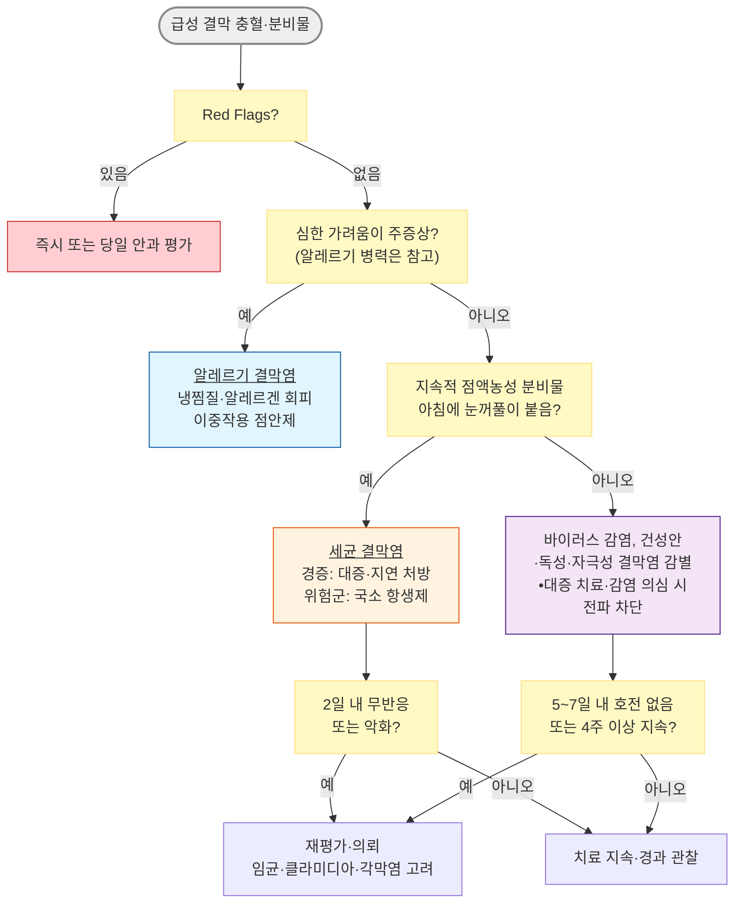

# 결막염 Conjunctivitis

## <mark style="color:green;">일반 사항</mark>

* 안구의 흰자위와 눈꺼풀 내측 표면을 덮고 있는 점막인 결막의 염증
* 분류
  * 감염성 : 바이러스(가장 흔함), 세균
  * 비감염성 : 알레르기, 비-알레르기(예: 건조, 바람, 연기, 외상)
* 증상 : 충혈, 분비물, 가려움, 자극감, 이물감
* 알레르기 결막염은 보통 양측에 발생하지만, 자극·이물·외상에 의한 비감염성 결막염은 편측일 수 있음
* 감염성 결막염의 전염 경로 : 환자의 분비물에 오염된 손이나 물체의 눈 접촉

### <mark style="color:$danger;">🚩 Red Flags!</mark>

<mark style="color:$danger;">**즉각 조치**</mark>

* 급격하거나 심한 시력저하, 각막궤양·천공 의심 소견  `세균각막염` `각막궤양`
* 급속히 진행하는 다량의 화농성 분비물, 심한 결막부종(과급성 결막염)  `임균성 결막염`
* 콘택트렌즈 착용자에서 통증·뚜렷한 광과민·시력저하, 각막 혼탁·침윤 또는 fluorescein 염색 이상이 동반된 충혈  `세균각막염` `가시아메바각막염`
* 동공 산대·대광반사 소실, 심한 안구통·두통·구역, 불빛 주위 달무리  `급성 폐쇄각녹내장`
* 발열, 눈꺼풀 부종·홍반과 함께 안구돌출·안구운동 장애·안구운동 시 통증  `안와연조직염`
* 화학물질 노출 : 의뢰 때문에 지체하지 말고 즉시 충분한 세척을 시작한 뒤 응급 평가

<mark style="color:$warning;">**당일\~수일 내 평가**</mark> <mark style="color:$warning;">- 이 챕터의 아래 항목은 원칙적으로 당일 안과 평가</mark>

* 시력 저하, 각막 혼탁, 심한 눈부심  `각막염` `앞포도막염`
* ciliary flush(모양충혈) : 각막 주위(limbus)에 가장 현저한 충혈  `각막염` `홍채염`
* 이물감을 넘어서는 심한 심부 안구통(deep eye pain)  `공막염` `각막염`
* 축동(miosis)과 광과민  `홍채염`
* 이마·코끝(Hutchinson 징후) 대상포진 또는 눈꺼풀 헤르페스 수포 동반 충혈  `대상포진 눈병` `HSV 각결막염`
* 콘택트렌즈 착용자에서 각막염을 확실히 배제하기 어렵거나 렌즈 중단 후에도 호전 없이 지속  `콘택트렌즈 관련 각막염`&#x20;
* 생후 4주(28일) 이내 신생아의 충혈 또는 결막 분비물  `신생아 결막염`
* 거짓막 또는 시력에 영향을 주는 각막상피밑침윤  `유행성 각결막염 합병증`

<mark style="color:$info;">**조기 평가 및 추적**</mark>

* 대증 치료 5\~7일 또는 항생제 치료 2일 후에도 호전 없음  `진단 재평가`
* 면역 저하자의 경증 결막염(통증·시력저하·각막 소견이 있으면 당일 평가)
* 4주 이상 지속되는 만성 또는 편측 결막염, 특히 고령자  `클라미디아 결막염` `눈꺼풀 피지샘암` `물사마귀`

## <mark style="color:green;">알레르기 결막염 (Allergic Conjunctivitis)</mark>

* 기전 : 계절성·통년성 알레르기 결막염은 알레르겐 → IgE 매개 type I 과민반응 → 비만세포 탈과립
  * VKC·AKC에는 비IgE(T세포 매개) 기전이, GPC에는 기계적 자극이 함께 관여

### <mark style="color:orange;">임상 양상</mark>

* 보통 처음부터 양측 발생
  * 양안의 증상 정도가 다르거나 국소 노출에 따라 편측 증상이 나타날 수 있음
  * 지속적인 편측 결막염은 이물·감염·독성 결막염 등 다른 원인을 우선 감별
* 결막 충혈 및 부종, 눈꺼풀 부종, 눈꺼풀 결막의 유두성 변화(papillary reaction)&#x20;
  * 여포반응(follicular reaction)은 바이러스·클라미디아·독성/약물 결막염을 시사하므로 감별 필요
* 심한 가려움, 작열감
* 수양성/점액성 분비물, 눈물 증가
* 통년성 알레르겐과 계절적 알레르겐이 중복되면 증상이 보다 심하게 발생
* 흔히 다른 알레르기 증상이 있음 (예: 알레르기 비염, 아토피)


• 가려움이 없거나 안구통이 있으면 다른 질환 의심\
• 진성 시력 저하나 뚜렷한 눈부심은 단순 알레르기 결막염에서 전형적이지 않음 → VKC·AKC의 각막 침범 등 다른 질환 의심


### <mark style="color:orange;">종류</mark>

#### <mark style="color:$primary;">**단순 알레르기 결막염**</mark>&#x20;

: IgE 매개, 각막 침범 드묾. 1차 진료에서 진단·치료

* **급성 알레르기 결막염**
  * 심한 증상, 극적인 경과를 보임
  * 알레르겐 노출 후 빠르게(수 시간 내) 발생, 노출 중단 24시간 내 호전
* **계절적(seasonal) 알레르기 결막염**
  * 급성 알레르기 결막염에 비하여 덜 극적인 경과를 보임
  * 발생부터 호전까지 수일\~수 주 경과
  * 실외 인자와 관련 : 꽃가루, 곰팡이 포자
* **통년성(perennial) 알레르기 결막염**
  * 간헐적으로 발생한 경우보다 증상이 덜하며 만성 경과를 보임
  * 보통 악화-완화 반복
  * 실내 인자와 관련 : 집먼지진드기, 실내 곰팡이, 애완동물 비듬

#### <mark style="color:$primary;">**중증 만성 알레르기 각결막염**</mark>&#x20;

* IgE 및 비IgE 기전, 각막 침범으로 시력 저하 가능. 안과 협진

**Vernal keratoconjunctivitis(VKC, 봄철각결막염)**

* large cobblestone papillae가 위 눈꺼풀에 발생
* 봄·여름에 악화
* 주로 사춘기 이전 소아·청소년, 특히 남아에서 호발
* 사춘기 이후 호전되는 경우가 많지만 지속되거나 재발할 수 있음
* Horner-Trantas 점, 방패궤양(shield ulcer)이 있으면 안과 의뢰

**Atopic keratoconjunctivitis(AKC, 아토피각결막염)**

* 위/아래 눈꺼풀(특히 아래 눈꺼풀)의 papillary 변화
* 주로 아토피피부염이 동반된 청장년
* 만성 경과
* 각막 합병증·원추각막 위험이 있어 안과 추적 필요

**Giant papillary conjunctivitis(GPC, 거대유두결막염)**&#x20;

* 기계적 자극에 의한 반응 ([콘택트렌즈 관련 결막염](038_-conjunctivitis.md#undefined-12)에서 기술)

## <mark style="color:green;">바이러스 결막염 (Viral Conjunctivitis)</mark>

* 원인균 : adenovirus(가장 흔함), coxsackievirus, enterovirus, herpes simplex virus, varicella-zoster virus
* 경과 : 흔히 한쪽에서 시작하여 수일 내 반대쪽으로 전파되고, 발병 초기 수일간 악화한 뒤 서서히 호전
  * 보통 7\~14일 내 회복하지만 일부는 2\~3주 이상 지속될 수 있음
  * 유행각결막염은 대개 2\~3주 내 호전되나 심하면 3\~4주 이상 지속될 수 있으며, 각막상피밑침윤에 의한 흐림·눈부심은 더 오래 남을 수 있음
* 전염 기간 : 일률적으로 정하기는 어려우나 아데노바이러스 결막염은 증상 발현 후 약 10\~14일(눈물·분비물·충혈이 있는 동안) 전파 가능
  * 유행각결막염은 특히 발병 후 약 2주간 전염력이 강함

### <mark style="color:orange;">임상 양상</mark>

* 수양성 분비물
  * 점액성 분비물이 나타나거나 아침에 화농 양상의 분비물을 호소할 수도 있음
* 모래 느낌, 눈부심, 눈물 증가
* 결막 충혈 및 부종, 눈꺼풀 결막의 소포성(follicle) 변화
* 눈 이외 증상 : 귓바퀴 앞 림프절 압통, 발열, 인두염
* 치료 여부와 관계없이 발병 초기 수일간 증상이 더 심해질 수 있음

### <mark style="color:orange;">종류</mark>

**급성 출혈 결막염 (Acute hemorrhagic conjunctivitis)**

* 원인균 : enterovirus 70, coxsackievirus A24 variant(CA24v)
* 증상 : 급격한 충혈, 이물감·통증, 눈꺼풀부종, 수양성 또는 점액성 분비물과 함께 점상 또는 광범위 결막밑출혈(subconjunctival hemorrhage) 발생
* 통증·이물감 없이 국소 출혈만 있는 경우 단순(외상성 등) 결막밑출혈과 감별

**인두결막열 (Pharyngoconjunctival fever)**

* 원인균 : adenovirus(주로 3, 4, 7형)가 눈과 인두에 이환
* 증상 : 인두염, 양측 결막염(눈꺼풀 결막의 충혈 및 follicular reaction), 고열, 귓바퀴 앞 림프절병증

**유행성 각결막염 (Epidemic keratoconjunctivitis)**

* 원인균 : adenovirus 8, 37, 53, 54, 56, 64(구 19a)형 등
* 증상 : 심한 이물감, 가려움, 작열감, 눈부심, 안구 결막 부종(chemosis), 결막 소포 비대, 결막 위막, 시야 혼탁(각막 이환 시)
* 각막상피밑침윤(subepithelial infiltrates, SEI)
  * 발병 1주 이후부터 수 주 내에 나타날 수 있는 면역반응성 병변
  * 각막 상피 아래에 작은 점 모양 또는 동전 모양 혼탁을 형성
  * 눈부심·난반사·시력저하를 유발하고 수개월 이상 지속될 수 있음
  * 시축을 침범하거나 시력에 영향을 주면 안과 전문의가 저역가 국소 steroid를 제한적으로 사용하고 서서히 감량할 수 있으며, 재발성·steroid 의존성인 경우 cyclosporine 등 면역조절 점안제를 고려
* 거짓막(pseudomembrane)
  * 심한 결막 염증으로 섬유소(fibrin)가 풍부한 삼출물이 결막 표면에 형성한 막
  * 안과에서 세극등하 박리가 필요할 수 있음
  * 심한 경우 결막 유착(symblepharon)을 유발할 수 있으므로 조기 의뢰

**단순포진 결막염**

* 원인균 : herpes simplex (☞ [단순포진](../229_/181_-herpes-simplex.md))
* 증상 : 작열감, 편측 이환, 피부 수포 동반; 가려움은 적음
* HSV 상피각막염이 의심되거나 수지상 상피결손이 있으면 안과 전문의 지시 없는 스테로이드 점안은 금기이며 즉시 의뢰
* HSV 기질각막염 등에서는 항바이러스제와 함께 전문의가 스테로이드를 사용할 수 있음

## <mark style="color:green;">세균 결막염 (Bacterial Conjunctivitis)</mark>

* 원인균 : 성인은 _S. aureu&#x73;_&#xAC00; 흔하고, 소아에서는 _H. influenzae_, _S. pneumoniae_, _M. catarrhalis_ 등이 흔함
* 경과 : 한쪽에서 시작 → 1\~2일 내 반대쪽 전이 → 보통 1\~2주 내 자연 회복
* 전염 기간 : 일률적으로 7일로 정하지 않으며, 화농성 분비물이 지속되는 동안 전파 가능
  * 적절한 항생제 치료 후 전염 위험은 감소하지만 복귀 여부는 임상 상태와 기관 규정에 따라 판단
* 콘택트렌즈 관련 충혈에서는 기계적·독성·알레르기성 염증(GPC 포함)과 감염을 감별
* 세균 감염이 의심되면 녹농균을 고려하며 각막염 위험 때문에 신속한 안과 평가 필요
* 소아에서 급성 중이염이 동반된 결막염(결막염-중이염 증후군, 주로 _H. influenzae_)은 국소 항생제만으로 불충분하므로 경구 항생제로 치료
* 균 동정 검사 적용대상 : 신생아, 면역 저하자, _N. gonorrhoeae_ 또는 _C. trachomatis_ 의심

### <mark style="color:orange;">임상 양상</mark>

* 지속적인 점액농성 분비물; 닦아낸 뒤에도 분비물이 계속 나와 눈꺼풀·속눈썹에 다시 고이고 들러붙음
* 결막 충혈 및 부종, 눈꺼풀 결막의 papillary change
* 가려움이 주증상인 경우는 드물고 국소 림프절 비대도 적으나, 가려움의 유무만으로 원인을 확정하지 않음

### <mark style="color:orange;">종류</mark>

**Gonococcal conjunctivitis**

* 증상 : 매우 많은 화농성 분비물(profuse purulent discharge), 심한 결막 부종
* 경과 : Hyperacute - 수 시간 내에도 각막 천공이 가능함(응급)
* 즉시 안과 의뢰 및 감염내과/STI 전문가 협의
* 관련 인자 : 성 접촉
* 검사 : 가능하면 치료 전 결막 검체 Gram 염색·배양·감수성검사를 시행하되 치료를 지연하지 않음
  * 결막 NAAT는 검사실에서 검증된 경우 사용하며 소변·질/자궁경부 또는 노출 부위 검체로 임균·클라미디아 NAAT를 함께 시행
  * HIV·매독 등 동반 STI 검사
  * 최근 60일 이내 성 파트너 평가·치료
* 치료 : ceftriaxone 1 g IM 1회 투여
  * 감염된 눈의 생리식염수 1회 세척을 고려하며, 이후 분비물 관리와 추가 세척은 안과 판단에 따름
  * 클라미디아 동시 감염이 배제되지 않으면 doxycycline 병용

**Chlamydia conjunctivitis**

* 증상 : 보통 편측으로 시작하는 만성 여포결막염, 점액농성 분비물, 귓바퀴 앞 림프절 압통
* 관련 인자 : 직간접 생식기 접촉
* 일반 국소 항생제에 반응하지 않는 경우 의심

## <mark style="color:green;">기타</mark>

### <mark style="color:orange;">신생아 결막염</mark>

* 생후 4주(28일) 이내의 충혈·분비물은 임균, 클라미디아, HSV, 기타 세균 및 화학성 원인을 감별하기 위해 당일 평가
  * 수포·각막 병변 또는 전신증상이 있으면 신생아 HSV 감염 고려
* 임균성은 출생 후 2\~5일경 심한 화농성 분비물로 나타날 수 있으며 각막 천공 위험이 있어 응급
  * 치료 : 파종감염이 없는 임균성 안염에서는 ceftriaxone 25\~50 ㎎/㎏ IV 또는 IM 1회(최대 250 ㎎)
  * ceftriaxone 금기 : 월경 후 연령 41주 미만인 미숙아(재태연령+출생 후 연령), 황달·고빌리루빈혈증·저알부민혈증·산증 등 빌리루빈 결합 장애가 예상되는 신생아, 칼슘 함유 정맥수액이 필요하거나 예상되는 생후 28일 이내 신생아에는 사용하지 않음(IM 투여도 동일)
  * 대안 : cefotaxime 100 ㎎/㎏ IV 또는 IM 1회 <mark style="color:blue;">\[세포탁심나트륨주]</mark>. CDC는 정맥 칼슘 투여로 ceftriaxone을 사용할 수 없는 경우의 대안으로 제시하며, 다른 금기 상황에서는 소아청소년과·감염 전문가 협의하에 적용
  * 패혈증·관절염·수막염 등 파종감염을 평가하고, 파종감염이 있으면 위 단회 요법이 아닌 별도의 전신 치료 적용
* 클라미디아성은 흔히 출생 후 5\~12일경 발생. 결막 검체와 함께 임균도 검사하고, 국소 항생제만으로는 불충분하므로 전신 치료 필요
  * 표준 치료 : erythromycin base 또는 ethylsuccinate 50 ㎎/㎏/d PO, 4회 분할 ×14d. 치료 성공률이 완전하지 않아 임상 추적 및 필요 시 재치료
  * 대안 : azithromycin 현탁액 20 ㎎/㎏ qd ×3d. 근거는 제한적
  * 생후 6주 미만에서 erythromycin 또는 azithromycin 투여 시 비후성 유문협착증(IHPS) 위험을 설명하고 분출성 구토, 수유불량, 체중 증가 부진을 추적
* 산모와 성 파트너도 평가·치료하며, 클라미디아 감염에서는 동반 폐렴 가능성을 추적

### <mark style="color:orange;">화학성 결막염·화학 화상</mark>

* 화학물질 노출 시 콘택트렌즈를 제거하고 즉시 다량의 깨끗한 물 또는 생리식염수로 충분히 세척
* 세척을 먼저 시작하고, 가능하면 세척 중·후 결막낭 pH가 중성으로 회복될 때까지 반복 확인
* pH 확인, 병력 청취 또는 안과 의뢰를 위해 세척 시작을 지연하지 않으며, 세척 후 즉시 응급 안과 평가

### <mark style="color:orange;">콘택트렌즈 관련 결막염</mark>

* 증상 : 편측 또는 양측 충혈, 경미한 가려움, 점액성 분비물, 결막 비후
* 치료 : 렌즈 즉시 제거. 감염성인 경우 최근 사용한 일회용 렌즈와 케이스는 폐기하고 재사용 렌즈는 제조사 지침에 따라 세척·소독
  * GPC·렌즈 용액 반응 등 비감염성 양상 : 렌즈 중단, 렌즈·용액 교체, 알레르기 치료에 준함
  * 세균성으로 판단되면 렌즈 제거, 녹농균을 고려한 국소 항생제(quinolone계), 신속한 안과 평가를 함께 시행
* 각막 침윤(corneal infiltrate) 확인 필수 : 콘택트렌즈 사용자는 _Pseudomona&#x73;_&#xC5D0; 의한 세균각막염·각막궤양으로 신속히 진행할 수 있으므로 통증·시력저하·광과민, 각막 혼탁·침윤이 있으면 단순 결막염으로 간주하지 말고 즉시 안과 평가

### <mark style="color:orange;">기계적 결막염</mark>

* 증상 : 국소 또는 광범위 결막 충혈, 이물감, 눈물
* 치료 : 이물 제거, 윤활제(점안 연고제), 감염 치료

### <mark style="color:orange;">외상성 결막염</mark>

* 증상 : 결막 충혈, 눈물, 이물감
* 치료 : 원인에 따른 치료. 세척, 항생제 연고

### <mark style="color:orange;">독성 결막염 (Toxic conjunctivitis)</mark>

* 원인 : 안약제(인공 눈물, 콘택트렌즈 액 포함)의 1일 다회, 장기 사용에 의한 자극 반응
  * 흔히 안약에 포함되어 있는 방부제와 관련
* 증상 : 가려움, 결막 충혈, chemosis, 점액성 분비물, 눈꺼풀 결막의 follicular/papillary 변화
* 치료 : 원인 점안제·보존제 함유 제품·렌즈 용액을 중단하거나 무방부제 제품으로 변경. 필요 시 무방부제 윤활제

## <mark style="color:green;">진단</mark>

* 진단을 위한 검사는 보통 필요 없음
* 다른 질환 배제를 위하여 고려 (☞ [눈 충혈](037_-red-eye.md))
* 모든 환자에서 기본적으로 확인
  * 양안 시력을 각각 측정하고 평소 시력과 비교
  * 동공 크기·반응, 안구운동, 각막 투명도, 전방 이상 여부
  * 콘택트렌즈 착용 여부와 통증·광과민·시력저하 동반 여부
  * fluorescein 염색으로 각막상피 결손·궤양·수지상 병변 확인
  * 눈꺼풀을 뒤집어 이물, 유두·여포반응을 확인하고 분비물 및 귀앞 림프절 평가
* 배양·병원체 검사 고려 : 신생아, 심한 화농성 또는 과급성 결막염, 임균·클라미디아 의심, 면역저하, 재발성 또는 치료 불응

### <mark style="color:orange;">감별</mark>

* 분비물·가려움·귀앞 림프절 등의 임상 양상으로 감별을 시도하지만 원인별 소견이 상당히 겹치며, 단일 증상이나 징후만으로 바이러스성과 세균성을 확정하지 않음
* 단순 결막염에서는 심한 안구통, 분비물을 닦고 깜박인 뒤에도 지속되는 시력저하, 뚜렷한 광과민이 전형적이지 않음. 이러한 소견이 있으면 각막염·앞포도막염·급성 폐쇄각녹내장 등 시력위협 질환을 우선 배제

<mark style="color:cyan;">**원인별 전형적 경향**</mark> (진단 기준 아님)

<table data-search="false"><thead><tr><th width="158">항목</th><th width="195">알레르기</th><th width="195">바이러스</th><th>세균</th></tr></thead><tbody><tr><td><strong>분비물</strong> 수양성</td><td>+</td><td>+</td><td>가능하나 비전형적</td></tr><tr><td><strong>분비물</strong> 점액성</td><td>+</td><td>±</td><td>-</td></tr><tr><td><strong>분비물</strong> 점액고름성</td><td>-</td><td>드묾</td><td>+</td></tr><tr><td><strong>분비물</strong> 고름성</td><td>-</td><td>-</td><td>+</td></tr><tr><td><strong>눈부심</strong></td><td>-</td><td>±</td><td>-</td></tr><tr><td><strong>통증 특징</strong></td><td>가려움</td><td>모래 느낌, 작열감</td><td>이물감, 분비물 (통증 경미)</td></tr><tr><td><strong>기타</strong></td><td>다른 알레르기 질환 동반</td><td>한쪽 눈에서 시작</td><td>한쪽 눈에서 시작</td></tr></tbody></table>

> _Ref. Differentiating conjunctivitis of diverse origins. Surv Ophthalmol 1993;38 (저자 수정)_

### <mark style="color:orange;">Quick Decision Tips</mark>

<table><thead><tr><th width="293">핵심 질문</th><th>YES →</th></tr></thead><tbody><tr><td>통증이 심하거나 시력이 떨어졌는가?</td><td><strong>즉시 의뢰</strong> (각막염·앞포도막염·녹내장 배제)</td></tr><tr><td>눈이 심하게 가려운가?</td><td><strong>알레르기성 가능성 높음</strong> → 냉찜질, 항히스타민/비만세포안정제 점안액</td></tr><tr><td>지속적인 점액농성 분비물로 눈꺼풀이 붙는가?</td><td><strong>세균성 가능성 높음</strong> → 중증도·위험인자에 따라 경험적 항생제 고려</td></tr><tr><td>감기 증상과 귀앞 림프절병증이 동반되는가?</td><td><strong>바이러스성 가능성 높음</strong> → 대증 치료, 전파 예방 강조</td></tr><tr><td>콘택트렌즈 착용자인가?</td><td><strong>각막 침윤·상피결손 확인</strong> 필수 → 배제하기 어렵거나 의심되면 당일 또는 즉시 의뢰</td></tr></tbody></table>

> 위 소견은 진단 확정 기준이 아니며 서로 중복될 수 있음

***


```mermaid
graph TD
    Start(["급성 결막 충혈·분비물"]) --> RF["Red Flags?"]
    RF -->|"있음"| Refer["즉시 또는 당일 안과 평가"]
    RF -->|"없음"| Q1["심한 가려움이 주증상?<br>(알레르기 병력은 참고)"]
    Q1 -->|"예"| Allergy["<u>알레르기 결막염</u><br>냉찜질·알레르겐 회피<br>이중작용 점안제"]
    Q1 -->|"아니오"| Q2["지속적 점액농성 분비물<br>아침에 눈꺼풀이 붙음?"]
    Q2 -->|"예"| Bact["<u>세균 결막염</u><br>경증: 대증·지연 처방<br>위험군: 국소 항생제"]
    Q2 -->|"아니오"| Viral["바이러스 감염, 건성안<br>·독성·자극성 결막염 감별<br>•대증 치료·감염 의심 시 <br>전파 차단"]
    Bact --> F1["2일 내 무반응 <br>또는 악화?"]
    Viral --> F2["5~7일 내 호전 없음 <br>또는 4주 이상 지속?"]
    F1 -->|"예"| Reeval["재평가·의뢰<br>임균·클라미디아·각막염 고려"]
    F2 -->|"예"| Reeval
    F1 -->|"아니오"| Cont["치료 지속·경과 관찰"]
    F2 -->|"아니오"| Cont

    style Start fill:#eeeeee,stroke:#888888,stroke-width:2px
    classDef yellow fill:#fff9c4,stroke:#ffe082
    class RF,Q1,Q2,F1,F2 yellow
    style Refer fill:#ffcdd2,stroke:#c62828
    style Allergy fill:#e1f5fe,stroke:#01579b
    style Bact fill:#fff3e0,stroke:#e65100
    style Viral fill:#f3e5f5,stroke:#4a148c
```

<p align="center"><strong>진단 및 치료 알고리듬</strong></p>

<p align="center"><em><mark style="color:$info;">저자 재구성 (참고 문헌 : Cheung AY, et al. Conjunctivitis Preferred Practice Pattern. Ophthalmology 2024;131(4):P134-P204; Workowski KA, et al. Sexually Transmitted Infections Treatment Guidelines, 2021. MMWR Recomm Rep 2021;70(4):1-187)</mark></em></p>

***

## <mark style="background-color:$warning;">Management</mark>

### <mark style="color:orange;">치료 방침</mark>

* 콘택트렌즈 사용 중단 : 감염 증상이 완전히 소실되고 치료가 끝난 뒤, 필요하면 안과 확인 후 재개
* 접촉 제한
  * 감염 의심 시 증상 발현 후 약 10\~14일(눈물·분비물·충혈이 있는 동안)은 전파 가능하므로 위생 관리 철저
    * 수건 등을 혼자 사용함
  * 유행각결막염 : 전염력이 강한 발병 후 약 2주 동안 손 위생을 철저히 하고 수영장·목욕탕·다중이용시설 및 밀접 접촉을 제한
  * 일반 감염성 결막염 : 발열·전신증상이 있거나 분비물이 많아 위생 관리 및 밀접접촉 회피가 어려우면 등교·출근을 제한
    * 복귀 시점은 임상 상태, 업무·시설 특성 및 해당 기관 규정에 따라 판단
* 알레르기성인 경우 알레르겐 회피
* 감염성인 경우 최근에 사용한 일회용 렌즈와 렌즈 케이스는 폐기하고 재사용 렌즈는 제조사 지침에 따라 세척·소독, 눈 화장품(특히 마스카라) 폐기
* 항생제 안약 : 세균성 결막염도 대부분 자연 치유되므로 경증에서는 대증 치료 또는 지연 처방을 고려
  * 분비물이 많거나 증상이 지속되는 경우, 면역저하자 등 합병증 위험이 높은 경우에 치료 고려
  * 콘택트렌즈 관련 충혈은 감염·비감염을 감별하고 세균성으로 판단되면 녹농균을 고려한 항생제와 신속한 안과 평가를 함께 시행(☞ 콘택트렌즈 관련 결막염)
  * 불필요한 항생제 사용을 억제하고 임상적 적응증에 따라 결정. 등교·출근만을 목적으로 항생제를 처방하지 않음&#x20;
* 스테로이드 점안액 주의 : 단순 결막염에 일상적으로 사용하지 않음. 세극등·fluorescein 검사로 각막상피 결손과 HSV 각막염을 배제하고 안압을 확인할 수 있는 경우에만 제한적으로 사용하며, 이를 확인하기 어렵거나 각막 침범이 의심되면 안과 의뢰
* 안약 사용법 ☞ [안과계 약제](037_1-ophthalmic-medications.md)

### <mark style="color:orange;">안약제 종류</mark>

<table data-search="false"><thead><tr><th width="175">계열</th><th>성분 (예)</th><th>특징</th></tr></thead><tbody><tr><td>이중작용<br>(항히스타민 + 비만세포 안정)</td><td>olopatadine <mark style="color:blue;">[파타놀]</mark>, ketotifen, azelastine, epinastine, alcaftadine, bepotastine</td><td>1차 선택. 수 분 내 가려움 완화와 예방 효과를 함께 가짐</td></tr><tr><td>항히스타민제</td><td>levocabastine, emedastine</td><td>빠른 증상 완화. 예방 효과는 제한적</td></tr><tr><td>비만세포 안정제</td><td>sodium cromoglicate, nedocromil, lodoxamide, NAAG, pemirolast</td><td>충분한 효과까지 1\~2주. 계절 시작 전 또는 지속성·재발성에서 예방 목적</td></tr><tr><td>국소 NSAID</td><td>ketorolac, diclofenac</td><td>보조 치료. 국소 항히스타민제보다 효과 적음</td></tr><tr><td>국소 corticosteroid</td><td>fluorometholone <mark style="color:blue;">[오큐메토론]</mark>, loteprednol <mark style="color:blue;">[로테프로]</mark></td><td>1차 치료 불응 시 단기(＜2주). 각막상피 결손·HSV 배제, 안압 확인 후</td></tr><tr><td>면역조절제</td><td>cyclosporine, tacrolimus</td><td>중증·steroid 의존성 VKC·AKC. 전문의 처방</td></tr><tr><td>혈관수축제</td><td>naphazoline, tetrahydrozoline</td><td>충혈만 일시 완화. 기본 치료가 아니며 3일(72시간) 이내</td></tr></tbody></table>

> 국내 유통 제품은 성분별로 확인.
>
> _<mark style="color:$info;">NAAG=N-acetyl-aspartyl-glutamic acid, VKC=vernal keratoconjunctivitis, AKC=atopic keratoconjunctivitis.</mark>_&#x20;
>
> _<mark style="color:$info;">저자 재구성 (참고 문헌 : EAACI. Management of ocular allergy. Allergy 2019;74, AAO Conjunctivitis PPP 2023)</mark>_

## <mark style="color:green;">알레르기 결막염 치료</mark>

* 문지르지 않는 것이 중요
* 냉찜질 : 가려움 및 부종 감소 효과
* 인공 눈물 : 증상 완화, 알레르겐 제거 효과 (☞ [눈마름증](042_-dry-eye.md))
* 알레르겐 회피 (☞ [항원회피](051_-allergic-rhinitis.md), [위험인자관리](../223_/071_-asthma.md))

#### <mark style="color:$primary;">국소 항히스타민제</mark>

* 1차 선택제; 가려움 등의 증상 완화 효과
* 항히스타민과 비만세포 안정 작용을 함께 가진 이중작용 점안제(예: olopatadine)를 우선 고려

#### <mark style="color:$primary;">경구 항히스타민제</mark>

* 국소 이중작용 점안제 우선 고려 원칙과 함께, 빠른 증상 완화 필요성·동반 비염·건성안·환자 선호를 고려하여 선택
* 경구제는 안구 건조를 유발할 수 있음 (☞ [항히스타민제](../231_/212_-antihistamines.md))
* cetirizine : 10 ㎎ qd <mark style="color:blue;">\[지르텍]</mark>
* fexofenadine : 120 ㎎ qd <mark style="color:blue;">\[알레그라]</mark>
* loratadine : 10 ㎎ qd <mark style="color:blue;">\[클라리틴]</mark>


\[ARIA-EAACI 2026] 안구 증상에 경구 2세대 항히스타민제를 국소 항히스타민제보다 우선 제안(조건부 권고, 근거 확실성 매우 낮음; 빠른 안구 증상 완화가 필요하면 점안제 선택 가능). Table 1에서는 비염 증상이 없는 알레르기 결막염에도 적용 가능하다고 명시함.



ARIA-EAACI 2024\~2025 개정 지침은 알레르기비염 환자에서 경구 항히스타민제보다 비내 스테로이드를, 1세대보다 2세대 경구 항히스타민제를 권고하며, leukotriene receptor antagonist의 일상적 추가 병용은 권하지 않음. 경구·국소 항히스타민제 비교 권고는 비염 증상이 없는 알레르기 결막염에도 적용 가능하다고 제시하나 조건부 권고이며 근거 확실성은 매우 낮음. VKC·AKC의 별도 치료 원칙을 대체하지 않음


#### <mark style="color:$primary;">국소 비만 세포 안정제</mark>

* 충분한 효과 발현까지 1\~2주 소요
* 적용 : 만성 지속성 또는 재발성인 경우 지속 사용을 고려(예방 효과 기대)

#### <mark style="color:$primary;">국소 충혈 제거제</mark>

* 적용 : 발적, 충혈, 부종
* 알레르기 반응을 감소시키지는 못함
* 반동성 충혈과 약물 결막염 위험 때문에 기본 치료 또는 기본 처방례에는 포함하지 않음
* 주의 : 단기 사용(3일, 72시간 이내), 투여 중 렌즈 사용 중지. 폐쇄각녹내장(좁은 전방각) 환자에는 사용하지 않음
* 부작용 : 작열감, 속성 내성(tachyphylaxis), 반동성 충혈, 약물 결막염(conjunctivitis medicamentosa)

#### <mark style="color:$primary;">국소 NSAID</mark>

* 적용 : 가려움, 불편감
* 국소 항히스타민제보다 효과 적음

#### <mark style="color:$primary;">국소 Steroid</mark>

* 적용 : 1차 치료(항히스타민/비만세포안정제)로 호전되지 않는 경우에 한해 단기간(＜2주) 사용
* 사용 전 확인 : 세극등·fluorescein 검사로 각막상피 결손·HSV 각막염을 배제하고 안압 평가
* 사용 2일 내 호전되지 않거나 악화되는 경우 사용을 재평가하고 안과 의뢰
* 부작용 : 장기 사용 시 안압 상승, 바이러스 감염, 백내장
* 주의 : HSV 각막염, 진균 각막염 등 감염성 각막염에서 사용하면 각막 손상이 악화될 수 있음. 중증 VKC·AKC 또는 각막 침범 시 안과 의뢰
* 가능한 짧은 기간 사용하고 조기 재평가. 10일 이상 사용하거나 반복 사용 시 안압 추적을 계획하며, 녹내장·steroid 반응 병력 등 위험인자가 있으면 더 일찍 확인. 반복·장기 사용 시 수정체 상태도 추적
* loteprednol 0.5% <mark style="color:blue;">\[로테프로]</mark>, fluorometholone 0.1% <mark style="color:blue;">\[오큐메토론]</mark>은 일부 강력한 스테로이드보다 안압 상승 위험이 상대적으로 낮을 수 있으나, 안압 상승·백내장·감염 악화 위험은 여전히 있음

#### <mark style="color:$primary;">국소 비내 Steroid</mark>

* 적용 : 알레르기비염/결막염과 관련된 안구 증상 치료에 효과 (☞ [비내용스테로이드](051_-allergic-rhinitis.md))
* 비염 증상 없이 안구 증상만 있는 경우에는 사용하지 않음

#### <mark style="color:$primary;">국소 면역 조절제</mark>

* 적용 : vernal or atopic keratoconjunctivitis의 steroid 의존 환자에서 steroid 대체 고려
* 이 약제의 사용을 고려할 정도의 심한 환자는 의뢰를 고려
* 종류&#x20;
  * 국소 cyclosporine <mark style="color:blue;">\[레스타시스]</mark> : VKC·AKC는 허가 외 사용으로 건성안 급여기준에 해당하지 않아 비급여 가능
  * tacrolimus : CsA에 난치성인 경우; 점안제는 미허가, tacrolimus 연고의 눈꺼풀 도포도 허가 외

#### <mark style="color:$primary;">알레르겐 면역 치료</mark>

* allergen immunotherapy : grass pollen, house dust mite에 기인한 알레르기 결막염에 효과
  * 임상적으로 관련된 감작(피부단자시험·특이 IgE)이 확인되고, 적절한 회피·약물치료에도 증상 부담이 큰 경우 고려
  * VKC·AKC의 일반적 치료로 확대하지 않음
* subcutaneous immunotherapy : 알레르기 결막염의 증상 완화에 효과
* sublingual immunotherapy(SLIT) : 집먼지진드기·꽃가루 설하면역치료는 알레르기비결막염의 안구 증상 개선에도 효과

***

## <mark style="color:green;">바이러스 결막염 치료</mark>

* 아데노바이러스 등 흔한 바이러스 결막염은 대증 치료가 기본. HSV·VZV 의심 시 안과 평가 후 항바이러스 치료
* 분비물 관리 : 소금물·비눗물 세척은 금기(각결막 손상·염증 악화 위험, 질병관리청). 깨끗한 물 또는 생리식염수에 적신 거즈로 눈꺼풀 바깥쪽 분비물만 부드럽게 닦아냄
* 냉찜질, 인공 눈물 : 증상 완화에 도움 (☞ [인공눈물](042_-dry-eye.md); [보험주의](https://www.hira.or.kr/rc/insu/insuadtcrtr/InsuAdtCrtrPopup.do?mtgHmeDd=20241201\&sno=3\&mtgMtrRegSno=0013))
* 국소 steroid : 단순 바이러스 결막염에는 사용하지 않음
  * 시축을 침범하거나 시력에 영향을 주는 각막상피밑침윤·거짓막·앞포도막염 등에서 안과 전문의가 제한적으로 사용하고 서서히 감량할 수 있으며 바이러스 배출 연장, 안압 상승·백내장 위험에 주의
  * 재발성·steroid 의존성 각막상피밑침윤에서는 cyclosporine 등 면역조절 점안제를 전문의가 고려
* 국소 항히스타민제는 증상 완화에 도움
* 혈관수축제는 기본 치료로 사용하지 않고 충혈이 심해 불가피한 경우에만 3일(72시간) 이내로 제한
* 경구 항히스타민제 : 코 증상 및 가려움을 줄일 수 있으나 안구 건조를 유발할 수 있음


**아데노바이러스는** 전염력이 매우 강하며 증상 발현 전후로도 전파됨. 수건·비누 공유를 금지하고, 수도꼭지·문손잡이·욕실 표면은 제품 표시상 아데노바이러스 또는 노로바이러스에 유효한 소독제나 적절한 염소계 소독제로 소독. 의료 환경의 일반 표면에는 유효 염소 2,000\~5,000 ppm을 적용하여 최소 1분간 젖은 상태를 유지하는 방법을 예로 들 수 있으나 제품 농도·표면 재질·표시된 접촉 시간을 우선함. 70% isopropyl alcohol 단독 소독에 의존하지 않으며 눈을 만진 후에는 즉시 손을 씻음


#### <mark style="color:$primary;">항바이러스제</mark>

* adenovirus 등 일반적으로는 효과 없음
* herpes 감염에 적용 (헤르페스 의심 시 의뢰)
* 국소 : ganciclovir <mark style="color:blue;">\[버간점안겔]</mark>, trifluridine <mark style="color:blue;">\[오큐플리딘]</mark>
* 경구 : acyclovir, valacyclovir (☞ [단순포진](../229_/181_-herpes-simplex.md))

## <mark style="color:green;">세균 결막염 치료</mark>

* 깨끗한 물 또는 생리식염수에 적신 거즈로 눈꺼풀 바깥쪽 분비물을 필요 시 닦아냄
* 냉찜질
* 인공 눈물

#### <mark style="color:$primary;">국소 항생제</mark>

* 경증은 자연 회복이 가능하므로 대증 치료 또는 지연 처방 고려
* 분비물이 많거나 증상이 지속되는 경우, 면역저하자 등 합병증 위험이 높은 경우 항생제 점안 치료 고려
* 콘택트렌즈 관련 세균성 결막염은 녹농균을 고려한 항생제와 신속한 안과 평가를 함께 시행(☞ 콘택트렌즈 관련 결막염)
* 항생제는 임상 회복을 다소 높이지만(4\~9일째 회복 68.2% vs 위약 55.5%) 자연 회복도 흔함 \[Cochrane 2023]
* 용법·기간은 제제별 국내 허가사항에 따르며, 임의로 투여 횟수를 감량하지 않음
* 보통 경험적 선택
* 치료 시작 2일째에도 반응하지 않거나 악화되면 진단과 치료를 재평가하고 안과 의뢰 고려
* quinolone제는 일반 경증 결막염에서는 일상적 1차 선택으로 제한
  * 콘택트렌즈 관련 세균성 결막염에서는 녹농균을 고려하여 선택하되, 각막염이 의심되면 단순 qid 처방으로 관찰하지 말고 즉시 안과 평가

| 상황                         | 국내 사용 가능한 예                                                                                                                                                      | 비고                                 |
| -------------------------- | ---------------------------------------------------------------------------------------------------------------------------------------------------------------- | ---------------------------------- |
| 일반 세균 결막염                  | tobramycin 점안액 <mark style="color:blue;">\[토브라]</mark>, <mark style="color:blue;">\[토라빈]</mark>                                                                  | 성인 4시간마다 1\\\~2방울; 제품별 허가 용법·기간 확인 |
| 일반 세균 결막염의 대안 (안연고 제형)     | tobramycin 안연고 <mark style="color:blue;">\[토라빈안연고]</mark>                                                                                                        | 연고 제형의 시야 흐림 설명; 제품별 허가사항 확인       |
| 콘택트렌즈 관련 세균성 결막염 또는 녹농균 위험 | levofloxacin <mark style="color:blue;">\[크라비트]</mark>, moxifloxacin <mark style="color:blue;">\[모록사신]</mark>, ofloxacin <mark style="color:blue;">\[타리비드]</mark> | 각막염 의심 시 즉시 안과 평가; 제품별 허가 용법·기간 확인 |

* 특정 항생제가 모든 원인균에 우월하다는 근거는 부족함. 국내 유통·허가 상태는 변할 수 있으므로 처방 전 최신 허가사항 확인
* 신세대 quinolone이 녹농균에 더 우수하다고 가정하지 않으며, 지역 감수성과 각막 소견에 따라 선택
* Tobramycin 0.3% 점안액은 국내 허가사항상 중증 감염에서 증상이 개선될 때까지 매시간 2방울 투여 후 점차 감량할 수 있음. 다만 급속히 진행하는 심한 화농성 분비물이나 각막 이상이 있으면 단순히 투여 간격만 단축하지 말고 임균성 결막염·세균각막염을 우선 배제하며 즉시 안과 의뢰

#### <mark style="color:$primary;">국소 항생제 대용</mark>

* 저농도 povidone-iodine 점안액은 일부 연구에서 검토되었으나 \[AAO PPP 2023], 국내 일반 유통 중인 povidone 인공눈물(예: 티어드롭)과는 전혀 다른 제제이며 일상적인 1차 치료로 권고하지 않음

#### <mark style="color:$primary;">국소 항생제/Steroid 복합제</mark>

* 단순 세균 결막염의 일상적 치료로 사용하지 않으며, 각막염·HSV 등을 배제한 후 안과적 판단하에 제한적으로 사용
* tobramycin + dexamethasone <mark style="color:blue;">\[토브라덱스]</mark>
* polymyxin-B/neomycin + dexamethasone <mark style="color:blue;">\[포러스]</mark>
* chloramphenicol + dexamethasone

#### <mark style="color:$primary;">경구 항생제</mark>

**Chlamydial conjunctivitis**

* doxycycline : 100 ㎎ bid ×7d <mark style="color:blue;">\[독시사이클린]</mark> (1차)
* azithromycin : 1 g 1회 <mark style="color:blue;">\[지스로맥스]</mark> (대안; 임신부 1차)
* levofloxacin : 500 ㎎ qd ×7d (대안)
* erythromycin은 위장관 부작용·순응도 문제로 더 이상 권장 대안이 아님 \[CDC 2021]
* 치료 후 약 3개월에 재감염 확인을 위한 STI 재검사(생식기 등 NAAT) 권고
* 비임신 성인에서 test-of-cure는 일률적으로 시행하지 않고 순응도 문제·지속 증상·재감염 의심 시 고려
* 임신부는 치료 4주 후 test-of-cure. 최근 60일 이내 성 파트너 평가·치료를 반드시 병행

**Gonococcal conjunctivitis**

* ceftriaxone : 1 g IM × 1회 <mark style="color:blue;">\[트리악손]</mark>

***

## <mark style="color:red;">질병코드</mark>

* A54.3 눈의 임균감염 Gonococcal infection of eye
* A74.0 클라미디아결막염 Chlamydial conjunctivitis
* B00.53 헤르페스바이러스결막염 Herpesviral conjunctivitis
* B30.0 아데노바이러스에 의한 각결막염 Keratoconjunctivitis due to adenovirus
* B30.1 아데노바이러스에 의한 결막염 Conjunctivitis due to adenovirus
* B30.2 바이러스성 인두결막염 Viral pharyngoconjunctivitis
* B30.3 급성 유행성 출혈성 결막염(엔테로바이러스성) Acute epidemic haemorrhagic conjunctivitis (enteroviral)
* B30.9 상세불명의 바이러스결막염 Viral conjunctivitis, unspecified
* H10.0 점액화농성 결막염 Mucopurulent conjunctivitis
* H10.1 급성 아토피결막염 Acute atopic conjunctivitis
* H10.2 기타 급성 결막염 Other acute conjunctivitis
* H10.3 상세불명의 급성 결막염 Acute conjunctivitis, unspecified
* H10.4 만성 결막염 Chronic conjunctivitis
* H10.9 상세불명의 결막염 Conjunctivitis, unspecified
* P39.1 신생아 결막염 및 누낭염 Neonatal conjunctivitis and dacryocystitis

※ 신생아 임균성·클라미디아 결막염은 P39.1이 아닌 A54.3·A74.0으로 분류. H13.1(달리 분류된 감염성 및 기생충성 질환에서의 결막염)은 병발(\*) 코드로 원인 코드와 함께 사용

※ H11(결막의 기타 장애), H16(각막염)은 결막염 자체의 기본 코드가 아니며 감별진단이 확정된 경우 해당 질환에 맞게 사용

***

## <mark style="color:purple;">처방례</mark>

> **처방례 1. 알레르기 결막염**
>
> ```
> 파타놀 점안액(0.1%) 5 ㎖/병  1방울 bid (증상 지속 시까지)
>     또는 파타놀-S 점안액(0.2%) 2.5 ㎖/병  1방울 qd (1일 1회 투여)
> 지르텍 10 ㎎/T  1T qd 저녁 (알레르기비염 동반 등 경구 치료 필요 시 선택적 추가)
> ```
>
> _✽파타놀(olopatadine 0.1%) : 항히스타민 + 비만세포 안정 복합 작용. 냉찜질 병행. 단순 계절성·통년성 알레르기 결막염의 1차 치료이며 스테로이드는 기본 처방에 포함하지 않음_

> **처방례 1-1. 안과적 평가 후 중증 또는 1차 치료 반응 불충분 시**
>
> ```
> 오큐메토론 점안액(0.1%) 5 ㎖/병  1방울 qid (단기 2주 이내; 증상 조절 후 중단)
> ```
>
> _✽세극등·fluorescein 검사로 각막상피 결손과 HSV 각막염을 배제하고 안압을 확인할 수 있는 경우에만 사용. 이를 확인하기 어렵거나 중증 VKC·AKC 또는 각막 침범이 의심되면 처방보다 안과 의뢰를 우선. 단기 사용 중에도 조기 재평가. 10일 이상 또는 반복 사용 시 안압 추적을 계획하며 위험인자가 있으면 더 일찍 확인. 반복·장기 사용 시 수정체 상태도 평가_

> **처방례 2. 바이러스 결막염**
>
> ```
> 히알루미니 점안액(0.1%, 1회용)  1방울 1일 5~6회
> ```
>
> _✽아데노바이러스 등 흔한 바이러스 결막염은 특이 치료약 없이 대증 치료가 기본이며, HSV·VZV 의심 시 안과 평가 후 항바이러스 치료. 냉찜질·무방부제 인공눈물이 표준 대증 치료. 치료 여부와 관계없이 발병 초기 수일간 증상이 진행하거나 악화된 뒤 서서히 호전될 수 있음을 설명_\
> _✽충혈이 심해 불가피한 경우에 한해 naphazoline(혈관 수축제)을 단기(3일, 72시간 이내)만 사용. 장기 사용 시 반동성 충혈 위험이 있어 기본 처방례에는 포함하지 않음_\
> _✽히알루론산 점안제는 급여 인정기준 확인 필요(☞_ [_보험주의_](https://www.hira.or.kr/rc/insu/insuadtcrtr/InsuAdtCrtrPopup.do?mtgHmeDd=20241201\&sno=3\&mtgMtrRegSno=0013)_)_

> **처방례 3. 세균 결막염**
>
> ```
> 토브라 점안액 5 ㎖/병  1~2방울 4시간마다(1일 4~6회) ×5~7d
> ```
>
> _✽경증은 자연 치유가 가능하므로 대증 치료 또는 지연 처방을 고려. 분비물이 많거나 증상이 지속되거나 면역저하 등 합병증 위험이 높은 경우 항생제 고려. 2일째에도 반응이 없거나 악화되면 재평가 또는 의뢰_\
> _✽콘택트렌즈 사용자는 P. aeruginosa 각막궤양 위험이 높으므로 렌즈를 즉시 제거하고 각막 침윤·상피결손 여부를 확인. 통증·광과민·시력저하 또는 각막 이상이 있으면 즉시 안과 평가. GPC·렌즈 용액 반응 등 비감염성 원인을 감별하고, 세균성으로 판단되면 녹농균을 고려한 quinolone계(예: 크라비트, 모록사신 등)와 신속한 안과 평가를 함께 시행_

> **처방례 4. 클라미디아 결막염 (경구)**
>
> ```
> 독시사이클린 100 ㎎/T  1T bid ×7d
> ```
>
> _✽대안: azithromycin 1 g 1회(임신부 1차) 또는 levofloxacin 500 ㎎ qd ×7d. 치료 후 약 3개월에 재감염 확인을 위한 STI 재검사(생식기 등 NAAT) 권고. 비임신 성인은 순응도 문제·지속 증상·재감염 의심 시 test-of-cure를 고려하며, 임신부는 치료 4주 후 test-of-cure. 최근 60일 이내 성 파트너 평가·치료 필요_

> **처방례 5. 임균 결막염 (응급)**
>
> ```
> 트리악손주사 1 g(병; Type I)  IM × 1회
>     클라미디아 배제 안 되면: 독시사이클린 100 ㎎/T  1T bid ×7d 병용
> ```
>
> _✽즉시 안과 의뢰 및 감염내과/STI 전문가 협의. 가능하면 치료 전 결막 검체 Gram 염색·배양·감수성검사를 시행하되 치료를 지연하지 않음. 생리식염수 1회 세척을 고려하며, 이후 분비물 관리와 추가 세척은 안과 판단에 따름. 결막 NAAT는 검사실에서 검증된 경우 사용하고 소변·질/자궁경부 또는 노출 부위 임균·클라미디아 NAAT를 함께 시행. HIV·매독 등 동반 STI 검사 및 최근 60일 이내 성 파트너 평가·치료. 임신부에서 클라미디아가 배제되지 않으면 doxycycline 대신 azithromycin 1 g 1회 사용_

***

### <mark style="color:$success;">핵심 복약 지도</mark>

> **결막염 안약 사용 안내**
>
> * 점안액은 아래 눈꺼풀을 살짝 당긴 후, 결막낭(아랫 눈꺼풀 안쪽)에 처방된 양(일반적으로 1방울)을 떨어뜨리십시오. 약병 끝이 눈에 닿지 않도록 주의하십시오.
> * 점안 후 수 초 동안 눈을 살며시 감고, 눈 안쪽(코 옆 눈물점)을 손가락으로 1\~2분간 가볍게 눌러 주십시오. 약 성분이 눈물관을 통해 코점막으로 흡수되어 나타날 수 있는 쓴맛, 심박수 변화 등의 전신 부작용을 줄여 줍니다.
> * 여러 종류의 점안액을 함께 사용하는 경우, 점안 간격을 5분 이상 두십시오. 점안액을 먼저 넣고 안연고는 마지막에 바르십시오.
> * 감염성 결막염이 있는 동안에는 점안 후에도 콘택트렌즈를 다시 착용하지 마십시오. 증상이 완전히 소실되고 치료가 끝난 뒤, 필요하면 안과 확인 후 재개하십시오.
> * 점안액의 개봉 후 사용기간은 제품별 설명을 따르십시오. 일회용 제제는 개봉 즉시 사용하고 남은 액과 용기는 버리십시오.

> **감염 예방 및 전파 차단**
>
> * 손을 자주 씻고 눈을 만지거나 비비지 마십시오.
> * 수건, 베개, 눈 화장품은 혼자 사용하십시오.
> * 결막염이 있는 동안 콘택트렌즈 착용을 중단하십시오.
> * 유행각결막염은 발병 후 약 2주간 전염력이 강하므로 손 위생을 철저히 하고 수영장·목욕탕·다중이용시설 및 밀접접촉을 피하십시오. 일반 감염성 결막염에서는 발열·전신증상이 있거나 분비물이 많아 위생 관리가 어려우면 등교·출근을 자제하고, 복귀 시점은 담당 의사와 해당 기관의 규정에 따라 결정하십시오.

> **항생제·스테로이드 안약 사용 안내**
>
> * 항생제 안약은 처방받은 횟수와 기간을 지키십시오. 사용 2일이 지나도 호전이 없거나 악화되면 다시 진료를 받으십시오.
> * 스테로이드 안약은 처방 기간을 넘겨 임의로 연장하거나 남은 약을 다시 사용하지 마십시오. 장기간 사용하면 안압 상승이나 백내장이 생길 수 있습니다.
> * 현탁액 안약은 사용 전 잘 흔들어 점안하십시오.
> * 스테로이드 안약 사용 중 통증이 생기거나 시력이 떨어지면 즉시 사용을 멈추고 내원하십시오.

> **언제 다시 병원을 방문해야 하나요?**
>
> * 치료를 시작했는데도 5\~7일 내 증상이 호전되지 않는 경우
> * 눈이 충혈되면서 **시력이 흐려지거나 떨어지는** 경우 - 즉시 내원
> * **심한 눈의 통증** 또는 두통이 동반되는 경우 - 즉시 내원
> * 강한 빛을 보기 힘들 정도로 **눈부심이 심해지는** 경우 - 즉시 내원
> * 생후 4주(28일) 이내 신생아에게 눈 충혈이나 분비물이 나타나는 경우 - 당일 내원
> * 화학물질이 눈에 들어간 경우 - 즉시 충분히 씻어내면서 응급 진료

***

## <mark style="color:blue;">환자 안내서</mark>


**결막염, 종류에 따라 원인과 치료가 다릅니다**

결막염은 눈을 덮고 있는 얇은 막(결막)에 생기는 염증으로, 바이러스·세균·알레르기 등이 원인입니다. 감염성 결막염은 대개 1\~2주 내 회복되지만 유행성 각결막염은 수 주 지속되거나 각막 흐림이 오래 남을 수 있고, 알레르기 결막염은 원인에 노출되면 반복될 수 있습니다.


#### <mark style="color:$primary;">결막염의 종류별 특징은 무엇인가요?</mark>

* **바이러스 결막염** (가장 흔함) : 수양성 분비물, 한쪽에서 시작해 반대쪽으로 퍼짐. 흔한 바이러스 결막염은 특별한 치료약 없이 증상 완화 치료를 합니다(헤르페스 등 일부는 항바이러스제 치료가 필요합니다). 전염성이 강하므로 위생 관리가 중요합니다.
* **세균 결막염** : 끈적한 황녹색 분비물이 특징입니다. 경증은 자연 회복되지만 항생제 안약으로 회복을 앞당길 수 있습니다.
* **알레르기 결막염** : 심한 가려움이 특징이며 대개 양쪽 눈에 생깁니다. 항히스타민 안약과 알레르겐 회피가 도움이 됩니다. 알레르기 결막염은 다른 사람에게 옮지 않습니다.

#### <mark style="color:$primary;">가정에서 어떻게 관리하나요?</mark>

* **냉찜질** : 깨끗한 수건을 차갑게 적셔 눈 위에 얹으면 가려움과 부종 완화에 도움이 됩니다.
* **인공눈물** : 자극 감소 및 분비물·알레르겐 세척 효과가 있습니다.
* **눈 비비기 금지** : 비비면 증상이 악화되고 각막에 상처가 생길 수 있습니다.
* **안대 사용 피하기** : 안대로 눈을 가리면 분비물이 고여 증상이 악화될 수 있습니다.
* **분비물 닦기** (바이러스 결막염) : 깨끗한 물 또는 생리식염수에 적신 거즈로 눈꺼풀 바깥쪽 분비물만 살살 닦아내십시오. 소금물이나 비눗물로 눈을 씻으면 오히려 각막·결막 손상이 악화될 수 있으니 사용하지 마십시오.

#### <mark style="color:$primary;">전파 예방을 위해 무엇을 해야 하나요?</mark>

* 흐르는 물로 손을 자주, 꼼꼼히 씻으십시오.
* 수건, 비누, 베개, 눈 화장품(특히 마스카라)은 혼자만 사용하고, 감염 기간 중 사용한 화장품은 버리십시오.
* 눈을 만진 후에는 즉시 손을 씻으십시오.
* **수도꼭지, 문손잡이, 욕실 표면**을 자주 소독하십시오. 70% isopropyl alcohol 단독 소독에 의존하지 말고, 제품 표시상 아데노바이러스 또는 노로바이러스에 유효한 소독제나 적절한 염소계 소독제를 사용하십시오. 희석 농도와 표면 접촉시간은 제품 설명을 따르십시오.
* 유행각결막염은 발병 후 약 2주간 전염력이 강하므로 수영장·목욕탕·다중이용시설과 밀접접촉을 피하십시오. 발열·전신증상이 있거나 위생 관리가 어려우면 등교·출근을 자제하고, 복귀 시점은 담당 의사와 해당 기관의 규정에 따라 결정하십시오.

#### <mark style="color:$primary;">콘택트렌즈 사용 시 주의사항</mark>

* 결막염 증상이 있는 동안에는 콘택트렌즈 착용을 완전히 중단하십시오.
* 감염성 결막염이었다면 일회용 렌즈와 렌즈 케이스는 버리고, 다시 쓰는 렌즈는 제품 설명에 따라 세척·소독하십시오.
* 감염 증상이 완전히 소실되고 치료가 끝난 뒤, 필요하면 안과 확인 후 렌즈 착용을 재개하십시오.

#### <mark style="color:$primary;">이럴 때는 즉시 병원을 방문하세요</mark>

* 눈의 충혈과 함께 **시력이 갑자기 떨어지거나 흐려지는** 경우
* **심한 눈의 통증**이 있거나 두통·구역이 동반되는 경우
* 강한 빛을 보기 힘들 정도로 **눈부심이 심한** 경우
* 치료를 시작했는데 **5\~7일이 지나도 호전이 없는** 경우
* 콘택트렌즈 관련 결막염이 렌즈 중단 및 치료 후에도 호전되지 않고 **지속되는** 경우
* 콘택트렌즈 착용 중 **통증·눈부심·시력저하**가 있으면 기다리지 말고 **즉시** 병원을 방문하십시오.
* 생후 4주(28일) 이내 신생아에게 눈 충혈이나 분비물이 나타나는 경우
* 화학물질이 눈에 들어간 경우 - 즉시 충분히 씻어내면서 응급 진료
