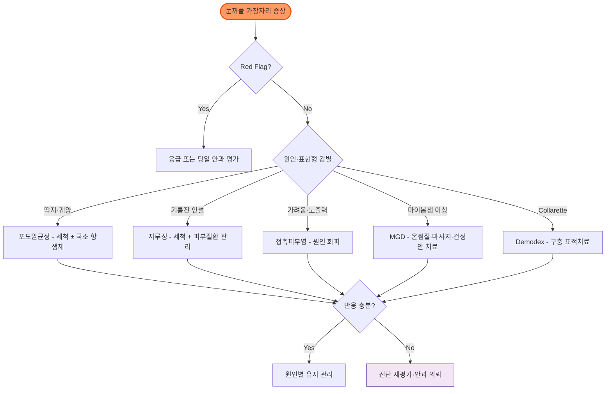

# 안검염 Blepharitis

## <mark style="color:green;">일반 사항</mark>

* 감염성·염증성·피부질환성 원인에 의해 발생하는 눈꺼풀 가장자리의 염증성 질환군; 급성으로 발생할 수도 있으나 만성·재발성 경과가 흔함
* 흔히 양측성이지만 편측성도 가능하며, 한쪽에만 지속되거나 치료에 반응하지 않으면 종양 등 다른 질환을 배제
* 전-안검염 : 눈꺼풀 피부, 속눈썹 base 및 모낭 이환; 종종 포도알균, 지루피부염(비듬) 관련
* 후-안검염 : meibomian gland 이환; 전-안검염보다 흔함

## <mark style="color:green;">원인</mark>

#### <mark style="color:$primary;">기전</mark>

* 정확한 기전은 불명; 복합적 요인
* 안구건조증, meibomian gland 이상 및 눈꺼풀 미생물총 변화가 서로 영향을 미침
* 감염 또는 세균 집락 증가
  * _Staphylococcus_ spp.가 흔히 관련되지만, 모든 만성 안검염을 세균 감염으로 해석하지 않음
  * 세균 : impetigo(_S. aureus_), erysipelas(_S. pyogenes_), angular blepharitis(_Moraxella_)
  * 바이러스 : 단순포진, 대상포진, 물사마귀, 인유두종
  * 기생충 : 사면발니, _Demodex folliculorum_, _D. brevis_
* 연관 피부 질환 : 아토피피부염, 접촉피부염, 지루피부염, 건선, acne rosacea, ichthyosis, exfoliative dermatitis
* 감별해야 할 눈꺼풀 병변 : actinic keratosis, 기저세포암, 편평세포암, 피지샘암, 흑색종 등
* 콘택트렌즈, 눈 화장, 외상/독성, 약물(isotretinoin, 항히스타민제, 항콜린제), 흡연

## <mark style="color:green;">종류</mark>

#### <mark style="color:$primary;">지루성 안검염 (Seborrheic blepharitis)</mark>

* 속눈썹 주위 피지샘(Zeis샘·Moll샘)의 과도한 분비 및 지루피부염과 연관된 앞쪽 눈꺼풀 염증
* 증상 : 눈꺼풀 홍반, 기름진 딱지, 기름진 모습; 속눈썹 뿌리에 oily scales

#### <mark style="color:$primary;">접촉피부염성 안검염 (Contact dermatitis/Eczematoid blepharitis)</mark>

* 원인 : 안약(보존제 포함), 화장품, 세안제, 속눈썹 접착제 등에 대한 자극 또는 알레르기 반응
* 심한 가려움과 눈꺼풀 피부의 홍반·부종·인설이 특징적이며, 2차 감염은 일부에서 동반

#### <mark style="color:$primary;">포도알균성 안검염 (Staphylococcal blepharitis)</mark>

* 눈꺼풀 가장자리의 감염
* 증상 : 아침에 심한 속눈썹 주위 딱지, 홍반, 궤양
  * 심한 경우 각막염, 눈꺼풀 궤양, 속눈썹 탈락 발생

#### <mark style="color:$primary;">Meibomian gland dysfunction (MGD)</mark>

* meibomian gland의 만성·미만성 이상으로, 흔히 말단 도관 폐쇄 또는 분비물의 질적·양적 변화가 나타남; 임상적으로 뚜렷한 염증이 필수조건은 아님
* 관련 인자 : acne rosacea, acne vulgaris, 경구 retinoid 복용
* 진단 소견 : 눈꺼풀 가장자리 혈관 확장, lid margin irregularity, meibomian gland 개구부 막힘, meibum 성상 및 압출성 변화
  * **Meibum 성상(quality)** : 0 투명한 액상 → 1 혼탁한 액상 → 2 혼탁하고 과립이 섞인 액상 → 3 농축된 불투명·치약 양상
  * **압출성(expressibility)** : 아래눈꺼풀 중앙부를 일정한 압력으로 눌러 분비 가능한 개구부의 수와 압출에 필요한 압력을 평가; 압출되지 않거나 강한 압력이 필요할수록 기능 저하가 심함
* MGD는 증발성 안구건조증의 주요 원인

#### <mark style="color:$primary;">Parasitic blepharitis</mark>

* _D. folliculorum_은 주로 속눈썹 모낭, _D. brevis_는 피지샘·meibomian gland와 관련
* 속눈썹 뿌리의 collarette(cylindrical dandruff)는 Demodex 안검염의 특징적인 pathognomonic 임상 소견; 일반적인 scurf·crust와 구분
* chronic blepharitis 환자에서 높은 빈도로 발견되며, 고령에서 유병률 증가

## <mark style="color:green;">임상 양상</mark>

* 안구 충혈, 작열감, 이물감, 눈부심, 눈물 과다(또는 안구 건조감), 시야 흐림(눈을 깜빡이면 잠시 호전)
* 눈꺼풀 발적, 부기, 가려움, 속눈썹 뿌리의 debris·scurf·crust 또는 collarette
* 만성 경과에서 속눈썹 탈락(madarosis), 첩모난생(trichiasis), meibomian gland 개구부 폐쇄 및 meibum 농축·성상 변화

<table><thead><tr><th width="136">특징</th><th width="192">Anterior Eyelid – Staphylococcal</th><th width="155">Anterior Eyelid – Seborrheic</th><th width="192">Posterior Eyelid – MGD</th></tr></thead><tbody><tr><td>속눈썹 소실</td><td>흔함</td><td>드묾</td><td>-</td></tr><tr><td>Trichiasis</td><td>흔함</td><td>드묾</td><td>만성 시 발생 가능</td></tr><tr><td>Eyelid deposit</td><td>엉킨, 단단한 비늘/잔여물</td><td>oily 또는 greasy</td><td>심한 지질, 거품 분비물</td></tr><tr><td>눈꺼풀 궤양</td><td>중증 악화</td><td>-</td><td>-</td></tr><tr><td>Eyelid scarring</td><td>발생 가능</td><td>-</td><td>만성 시 발생 가능</td></tr><tr><td>Chalazion</td><td>드묾</td><td>드묾</td><td>가끔\~빈번; 때때로 여러 개</td></tr><tr><td>Hordeolum</td><td>발생 가능</td><td>-</td><td>-</td></tr><tr><td>결막</td><td>경증\~중등증 충혈</td><td>경증 충혈</td><td>경증\~중등증 충혈; 눈꺼풀 결막의 papillary 반응</td></tr><tr><td>눈물 결핍</td><td>tear film 불안정·dry eye 동반 가능</td><td>tear film 불안정·dry eye 동반 가능</td><td>흔함</td></tr><tr><td>Cornea</td><td>아래쪽 punctate epithelial erosion, 주변부 infiltrate, 흉터, 신혈관 형성, pannus, thinning, (드물게) phlyctenule</td><td>아래쪽 punctate epithelial erosion</td><td>아래쪽 punctate epithelial erosion, 상하 fine infiltrate, 흉터, 신혈관 형성, pannus, 궤양</td></tr><tr><td>동반 피부 질환</td><td>드물게 아토피</td><td>지루피부염</td><td>Rosacea</td></tr></tbody></table>

 _MGD = meibomian gland dysfunction_\
 _Ref. AAO Blepharitis Preferred Practice Pattern. Ophthalmology. 2024;131(4):P50-P86 (2018년판 Table 2 기반 구성; 최신판 대조 확인 권장)._

### <mark style="color:$danger;">🚩 Red Flags!</mark>

<mark style="color:$danger;">**즉각 조치 또는 의뢰**</mark>

* 안구의 심한 충혈, 통증, 광과민 또는 각막 혼탁·궤양 의심 (→ 각막염·각막궤양·공막염 등 감별)
* 시력 저하 또는 급격한 시야 변화
* 발열과 함께 안구돌출, 안구운동 통증·제한, 복시 또는 시력 저하 (→ 안와봉와직염 의심, 응급 평가)

<mark style="color:$warning;">**당일 또는 조기 의뢰**</mark>

* 눈꺼풀 병변이 궤양, 비대칭, 지속 출혈 → 악성 종양 배제 필요
* 속눈썹 탈락(madarosis)이 국소적·비대칭으로 진행하거나 편측 산립종·안검염이 같은 부위에 반복 (→ 피지샘암 감별, 조기 안과 의뢰 및 생검 고려)
* 단순포진·대상포진 피부 수포 동반 안구 충혈

<mark style="color:$info;">**외래 추적 / 추가 평가 계획**</mark> <mark style="color:$info;">- 즉각 위험 낮으나 호전 없으면 의뢰</mark>

* 2주간의 비-약물 치료로 해결되지 않는 증상
* 치료에 반응하지 않거나 재발 반복

## <mark style="color:green;">진단</mark>

* 병력, 증상/징후, 증상 기간, 동반 전신 질환
* 다음 상황에서 증상 악화 : 흡연, 바람, 콘택트렌즈, 건조, 음주, 눈 화장

### <mark style="color:orange;">검사</mark>

* 일률적인 검사는 권고하지 않음
* 시력 측정, 동공·안구운동·안구돌출 여부 확인; 충혈·통증·광과민이 있으면 fluorescein 염색으로 각막 상피결손 평가
* slit lamp : 눈꺼풀 가장자리, 속눈썹 뿌리, meibomian gland 개구부와 안구 표면 평가; collarette가 있으면 속눈썹을 뽑아 현미경으로 확인하지 않고도 Demodex 안검염을 임상적으로 진단 가능
* 눈꺼풀 배양·scraping : 반복되는 중증 전-안검염, 비전형적 분비물, 면역저하 또는 통상 치료에 반응하지 않는 경우에 선택적으로 시행
* 현저한 비대칭, 치료 저항성 또는 한 부위에 반복되는 산립종은 피지샘암 등 배제를 위해 안과 의뢰 및 생검 고려

### <mark style="color:orange;">감별 진단</mark>

<table><thead><tr><th width="160">질환</th><th width="220">주요 특징</th><th>감별 포인트</th></tr></thead><tbody><tr><td>안검염</td><td>양측성, 만성 경과, 가려움·작열감</td><td>눈꺼풀 가장자리 비늘·딱지; 아침 악화</td></tr><tr><td>결막염</td><td>안구 충혈, 눈곱(분비물)</td><td>눈꺼풀보다 결막 자체의 증상이 주; 분비물 성상으로 원인 감별 (☞ <a href="038_-conjunctivitis.md">결막염</a>)</td></tr><tr><td>Hordeolum (다래끼)</td><td>급성, 눈꺼풀 국소 발적·압통</td><td>압통이 있는 종창; 보통 편측·단발</td></tr><tr><td>Chalazion (산립종)</td><td>만성, 무통성 눈꺼풀 종창</td><td>압통 없는 단단한 결절; MGD 반복 시 동반</td></tr><tr><td>Floppy eyelid syndrome</td><td>쉽게 외번되는 이완된 위눈꺼풀, 아침에 심한 자극·분비물</td><td>비만·옆으로 자는 습관과 연관; 코골이·목격된 무호흡·주간졸림이 있으면 OSA 평가</td></tr><tr><td>피지샘암 (Sebaceous Ca)</td><td>편측성, 반복 재발하는 산립종·안검염 양상</td><td><strong>🚩 Red Flag</strong>: 고령자에서 같은 부위에 반복, 국소 속눈썹 탈락·결막 병변 동반 → 조기 안과 의뢰 및 생검 고려</td></tr></tbody></table>

### <mark style="color:orange;">Quick Decision Tips</mark>

<table><thead><tr><th width="355">핵심 질문</th><th>YES →</th></tr></thead><tbody><tr><td>양측성 + 만성 경과 + 아침 악화?</td><td><strong>안검염 시사</strong> → 눈꺼풀 가장자리와 meibomian gland 평가</td></tr><tr><td>눈꺼풀 가장자리에 딱지·비늘이 있는가?</td><td><strong>전-안검염 시사</strong> → scurf·crust·collarette 형태로 원인 감별</td></tr><tr><td>기름진 딱지 + 지루피부염(비듬) 동반?</td><td><strong>Seborrheic blepharitis</strong> → 눈꺼풀 및 동반 피부질환 관리</td></tr><tr><td>아침 딱지 심함 + 속눈썹 궤양·탈락?</td><td><strong>Staphylococcal blepharitis</strong> → 눈꺼풀 세척 ± 국소 항생제 고려</td></tr><tr><td>반복 다래끼 + Rosacea·여드름 동반?</td><td><strong>MGD/ocular rosacea</strong> 우선 의심 → 온찜질·마사지; 지속·중증이면 추가 치료</td></tr><tr><td>속눈썹 뿌리에 collarette?</td><td><strong>Demodex blepharitis</strong> → 구충 표적치료 가능 여부 평가</td></tr><tr><td>한쪽 병변이 지속·재발하거나 속눈썹 탈락·궤양·출혈?</td><td><strong>종양성 병변 배제</strong> → 조기 안과 의뢰</td></tr></tbody></table>

***



<p align="center"><strong>안검염 진단 및 치료 알고리듬</strong></p>

<p align="center"><em><mark style="color:$info;">Ref. AAO Blepharitis PPP (2024)의 원인별 관리 내용을 바탕으로 저자 재구성</mark></em></p>

***

## <mark style="background-color:$warning;">Management</mark>

### <mark style="color:orange;">치료 방침</mark>

* 만성 안검염의 기본은 환자 교육과 지속 가능한 눈꺼풀 위생 관리이나, 유형에 따라 세척·온찜질의 비중과 추가 치료가 다름
* 모든 유형을 동일한 단계로 치료하지 않고 포도알균성, 지루성, 접촉피부염성, MGD/ocular rosacea 및 Demodex 안검염으로 구분하여 치료
* 2주간 적절히 관리해도 호전되지 않거나 반복 재발하면 순응도·진단·동반 안구건조증 및 악성 병변 가능성을 재평가

#### <mark style="color:$primary;">원인별 치료</mark>

<table><thead><tr><th width="180">유형</th><th>초기 치료 및 추가 조치</th></tr></thead><tbody><tr><td><strong>포도알균성 전-안검염</strong></td><td>눈꺼풀 세척; 중등도 이상 또는 위생 관리에 반응하지 않으면 국소 항생제 안연고 고려. 각막 침범 의심 시 당일 안과 의뢰</td></tr><tr><td><strong>지루성 안검염</strong></td><td>눈꺼풀 세척과 함께 두피·눈썹·안면의 지루피부염 치료</td></tr><tr><td><strong>접촉피부염성 안검염</strong></td><td>의심되는 안약·보존제·화장품·세안제·속눈썹 접착제 중단; 지속·중증이면 피부과 patch test 또는 안과·피부과 의뢰</td></tr><tr><td><strong>MGD/ocular rosacea</strong></td><td>온찜질·마사지, 동반 안구건조증 치료; 지속되는 중등도\~중증에서는 경구 doxycycline 또는 azithromycin 고려. 난치성은 안과에서 IPL·thermal pulsation 등 선택</td></tr><tr><td><strong>Demodex 안검염</strong></td><td>collarette 확인 후 구충 표적치료. lotilaner 사용 가능 지역에서는 1차 치료로 고려; <strong>국내 미허가·미도입 상태이므로 안과 의뢰 후 대체치료를 검토</strong></td></tr><tr><td><strong>염증이 심한 불응형</strong></td><td>진단을 재평가하고 안과 의뢰; 필요한 경우 감염을 배제한 뒤 국소 steroid 또는 면역조절 점안제를 최단기간·개별적으로 사용</td></tr></tbody></table>

## <mark style="color:green;">비-약물 치료 및 예방</mark>

* 온찜질(따뜻한 물수건) : 눈꺼풀 테두리 세정 보조 및 MGD 지질층 개선; 1일 2\~4회, 매회 5\~10분 적용
  * 온도 유지 : 40\~43℃. 매일 유지 가능한 현실적 시간으로 설정; 아이마스크형 팩 활용 시 편의성 향상
* 눈꺼풀 마사지 : 온찜질 후 손끝으로 눈꺼풀 가장자리를 부드럽게 마사지
* 눈꺼풀 세척(lid scrub) : 전용 눈꺼풀 세정제 또는 0.01–0.02% hypochlorous acid 제제 등을 이용해 1일 1\~2회 부드럽게 세척; 희석한 유아용 무자극 샴푸도 사용할 수 있으나 자극·건조가 생기면 중단. Hypochlorous acid는 위생 관리와 세균 부담 감소를 위한 보조제로, Demodex 구제치료를 대체하지 않음
* MGD에서는 온찜질 → 마사지 → 가장자리 세척 순서로 시행하면 연화된 분비물을 제거하기 편리하지만, 환자가 장기적으로 유지할 수 있는 방법과 횟수로 조정
* 접촉피부염 의심 시 원인 제품 중단; 금연, 증상 중 눈 화장 회피(특히 수성선 안쪽 아이라이너), 콘택트렌즈로 악화되면 일시 중단

## <mark style="color:green;">약물 치료</mark>

### <mark style="color:orange;">항생제</mark>

#### <mark style="color:$primary;">국소제</mark>

* 해외 지침의 포도알균성 전-안검염 선택지 : erythromycin 또는 bacitracin 안연고, topical azithromycin; 취침 시 눈꺼풀 가장자리에 도포하며 중증도에 따라 횟수 조절 (☞ [안과계 약제](ophthalmic-medications.md))
  * 국내에서는 erythromycin·bacitracin 안과용 제형 및 topical azithromycin의 실제 허가·유통 여부를 확인한 뒤 사용; 피부용 bacitracin 연고를 눈에 사용하지 않음
* 각막 침윤·상피결손·궤양 또는 중증 감염 의심 시 fluoroquinolone을 단순 안검염 처방으로 경험적으로 추가하지 말고 당일 안과 의뢰
* 복합제 : polymyxin-B/neomycin + dexamethasone <mark style="color:blue;">\[포러스]</mark>
  * **감염을 배제하지 않은 채 routine으로 사용하지 않음.** HSV·진균성 각막염 및 치료가 불충분한 세균성 각막염을 악화시킬 수 있으므로 선별 환자에게 최단기간 사용하고, 반복 사용 또는 1\~2주 이상 사용 시 안압·각막 및 임상 반응을 재평가
* 투여 기간은 약제·중증도·반응에 따라 개별화; 항생제 장기·반복 사용은 내성 및 접촉과민 위험을 고려

#### <mark style="color:$primary;">경구제</mark>

* 대상 : 국소제에 반응하지 않는 경우, 특히 meibomian gland 이환
* doxycycline <mark style="color:blue;">\[독시사이클린]</mark> : **국내 안검염/MGD 적응증 미승인(허가 외 사용)이며 용량·기간의 표준화가 부족함.** 흔히 50\~100 ㎎/d 범위에서 환자별로 선택하고 4\~6주 후 반응을 평가하여 감량·중단 여부 결정
  * 해외의 doxycycline 40 ㎎ modified-release 제형은 sub-antimicrobial dose이나, 50 ㎎ 일반제 또는 minocycline을 동일한 의미로 부르지 않음
* minocycline <mark style="color:blue;">\[미노씬]</mark> : 대체제로 고려할 수 있으나 어지럼증·색소침착 및 드문 자가면역 이상에 유의
* azithromycin <mark style="color:blue;">\[지스로맥스]</mark> : 1 g 주 1회 ×3주 요법이 중등도\~중증 MGD에서 doxycycline 200 ㎎/d ×6주와 동등한 효과를 보였고 위장관 부작용은 더 적었음(4.4% vs 15.9%); QT 연장 및 상호작용 확인
* 경구 doxycycline·minocycline·azithromycin의 MGD/안검염 치료는 국내 허가 외 사용; 임신·수유, 소아, 간·신기능, 병용약물 및 tetracycline의 철분·칼슘·제산제 상호작용을 확인

### <mark style="color:orange;">국소 항염증제</mark>

* 대상 : 위생 관리와 원인별 치료에도 호전되지 않는 중증 염증 또는 동반 안구 표면 염증; 안과 평가 후 사용
* steroid : loteprednol <mark style="color:blue;">\[로테프로]</mark>, fluorometholone <mark style="color:blue;">\[오큐메토론]</mark>, rimexolone <mark style="color:blue;">\[벡솔]</mark>; HSV·진균·세균성 각막염 등을 배제하고 최저 유효역가·최단기간 사용 (☞ [안과계 약제](ophthalmic-medications.md))
  * 1\~2주 이상 사용하거나 반복 처방할 때에는 안압, 수정체 및 각막 상태 재평가
* calcineurin inhibitor : cyclosporine <mark style="color:blue;">\[레스타시스]</mark>; 동반 건성각결막염·안구 표면 염증에서 고려하며, 안검염/MGD 자체에 대한 국내 적응증은 아님. 국내 급여는 건성각결막염 관련 기준에 따르므로 최신 [건강보험심사평가원 약제 급여기준](https://www.hira.or.kr/bbsDummy.do?brdBltNo=12124&brdScnBltNo=4&pgmid=HIRAA020002000100)을 확인
* 항생제/steroid 복합제는 감염과 염증을 함께 치료할 필요가 있는 선별 환자에게 단기간 사용

### <mark style="color:orange;">인공 눈물</mark>

* 대상 : 안구건조증 동반 시; 증발성 안구건조에서는 지질 성분을 포함한 인공눈물을 고려할 수 있음 (☞ [인공 눈물](ophthalmic-medications.md))
  * 지질 기반 제제 : mineral oil·phospholipid 등 실제 유상 성분을 포함한 제품(예: <mark style="color:blue;">\[시스테인 발란스]</mark>); 제품별 성분·허가사항 확인
  * carbomer 제제(예: <mark style="color:blue;">\[리포직]</mark>)는 점도를 높여 안구 표면 체류시간을 연장하는 겔 제제이며 지질층 보충제로 분류하지 않음
  * hyaluronate, CMC 등 수성 보충형은 환자의 눈물막 이상과 증상에 따라 선택·병용
* 콘택트렌즈 착용자 : 무방부제 제형 선택; 증상 악화 시 착용 중단하고 회복 후 재착용

### <mark style="color:orange;">Demodex 구제</mark>

* lotilaner 0.25% 점안액 <mark style="color:blue;">\[Xdemvy]</mark> : 양안에 1방울씩 bid ×6주; 2023년 미국 FDA 승인, 2026년 3월 중국 NMPA 승인. **국내 미허가·미도입 상태이므로(2026년 9월 기준) Demodex 안검염이 의심되면 안과 의뢰를 권고**하며, 사용 전 최신 허가상태를 재확인
  * Saturn-1/2에서 총 833명을 평가; 가장 흔한 이상반응은 점안부위 따가움·작열감(10%). 18세 미만 안전성·유효성은 확립되지 않음
* ivermectin : 200 ㎍/㎏ PO, 1주 후 반복 (✽일부 연구에서 보고되나 표준 치료로 권고되지 않음; 국내 안검염 적응증 미승인)
* tea tree oil : 안구 주변 사용을 위해 제조된 TTO/terpinen-4-ol 함유 전용 패드·티슈 등 시판 제형을 제품 설명에 따라 보조적으로 고려할 수 있으나, 농도·용법이 표준화되지 않았고 효과 근거도 불확실함. 자극·접촉피부염에 유의하며 고농도·원액 또는 임의 희석액을 자가 사용하지 않음
* 일반 눈꺼풀 세척은 잔여물 제거와 증상 완화에는 도움이 되지만 Demodex 구제치료를 대체하지 않음

### <mark style="color:orange;">영양</mark>

* 오메가-3 보충제는 일부 안구건조증/MGD 환자에서 표현형·식이·금기사항을 고려해 보조적으로 선택할 수 있으나, 일상적 권고를 뒷받침하는 근거는 부족함. DREAM Study 및 2024년 MGD 연관 건성안 무작위시험에서는 대조군 대비 유의한 증상 개선을 입증하지 못했으며, 최적 제형·용량·기간도 확립되지 않음
* 생선·견과류 등 식품을 통한 섭취를 우선하며, 처방용 omega-3 제제 <mark style="color:blue;">\[오마코]</mark>는 국내 안검염/MGD 적응증이 없음

## <mark style="color:green;">시술 및 기타 처치</mark>

* IPL(Intense Pulsed Light) : meibomian gland 기능 개선 및 염증 완화 목적으로 난치성 MGD에서 고려; 횟수·간격은 장비와 프로토콜에 따름. 피부 유형·광과민 약물·안구 보호를 확인하며 비급여, 안과 전문의 시행
* Thermal pulsation(예: LipiFlow 등 기기) : meibomian gland 가온·압출을 통한 개방; 국내 도입 시설 제한적, 비급여
* Meibomian gland probing : 폐쇄가 뚜렷한 경우 탐침을 이용한 물리적 개통; 안과 전문의 시행
* BlephEx 등 기계적 눈꺼풀 가장자리 디브리망 : 딱지·biofilm 제거 목적의 전문 시술; 근거 수준은 아직 제한적
* TFOS DEWS III(2025)는 MGD에서 온찜질, 눈꺼풀 위생, 항염증 치료와 IPL·thermal treatment 등 다양한 치료를 환자 표현형에 맞추어 선택하도록 제시
* 전문 시술은 직접 비교 및 장기 효과 근거가 제한적이며, 대부분 안과 전문의 의뢰 후 시행; 1차 진료에서는 시술 적응증 해당 여부 판단 및 의뢰가 핵심 역할

***

### <mark style="color:red;">질병코드</mark>

H01.0 안검염

***

## <mark style="color:purple;">처방례</mark>

> **처방례 1. 경증 MGD/안구건조증 동반 안검염**
>
> ```
> 히알루론산나트륨 0.1% 점안액  1\~2방울 qid prn
> ```
>
> _✽온찜질·마사지·눈꺼풀 세척과 병행. 인공눈물은 증상 완화 목적이며 안검염 원인 치료를 대체하지 않음. 가능하면 무방부제 제형 선택_

> **처방례 2. 포도알균성 전-안검염에서 염증이 뚜렷한 경우**
>
> ```
> 포러스 안연고 5 g/tube  qid (눈꺼풀 가장자리에 도포; 7일 후 재평가)
> ```
>
> _✽polymyxin-B/neomycin+dexamethasone 복합제. HSV·진균·세균성 각막염을 배제하고 선별적으로 단기 사용하며, 안압 상승 위험과 접촉과민을 확인. 1\~2주 이상 사용하거나 반복 처방할 때에는 안과에서 안압·각막 상태를 재평가. 각막 침범이 의심되면 처방례를 적용하지 말고 당일 안과 의뢰_

> **처방례 3. 보존적 치료에 반응하지 않는 중등도\~중증 MGD/ocular rosacea**
>
> ```
> 독시사이클린 100 ㎎/T  1T #1 (4\~6주 후 반응 재평가)
> ```
>
> _✽MGD에서 경구 doxycycline은 주로 항염 효과를 목적으로 하는 국내 허가 외 사용. 임신·수유, 소아 및 약물상호작용을 확인하고 위장관·식도 자극과 광과민에 주의_\
> _✽대안: azithromycin 1 g 주 1회 ×3주. QT 연장 위험과 병용약물을 확인_

***

### <mark style="color:$success;">핵심 복약 지도</mark>

> **안연고·점안액 사용 안내**
>
> * 안검염 치료용 안연고는 처방 지시에 따라 깨끗한 손가락이나 면봉으로 눈꺼풀 가장자리에 소량 바릅니다. 결막낭 투여로 처방된 경우에는 아래 눈꺼풀을 살짝 당겨 안쪽에 넣으십시오. 약 끝이 눈·피부에 닿지 않도록 주의하십시오.
> * 점안액은 아래 눈꺼풀을 살짝 당긴 후 1\~2방울 떨어뜨리고, 점안 후 눈 안쪽(코 옆 눈물점)을 손가락으로 1\~2분간 가볍게 눌러 주십시오.
> * 여러 종류의 안약을 함께 사용하는 경우, 점안 간격을 5분 이상 두십시오. 점안액을 먼저 넣고, 안연고는 마지막에 넣으십시오.
> * 제품 설명서에 명시된 개봉 후 사용기간을 따르십시오. 1회용 무방부제 점안액은 개봉 후 즉시 사용하고 남은 액과 용기는 버리십시오.

> **경구 항생제(독시사이클린·미노사이클린) 복용 안내**
>
> * 식후 충분한 물(200 ㎖ 이상)과 함께 복용하십시오. 복용 후 30분 이내에 눕지 마십시오(식도 자극 예방).
> * 철분·칼슘 보충제, 제산제와는 복용 간격을 두십시오.
> * 복용 중 햇빛·자외선에 노출되면 피부가 민감해질 수 있습니다(광과민 반응). 외출 시 자외선 차단제를 사용하십시오.
> * 복용 기간 중 어지럼증, 구역, 복통이 지속되면 담당의에게 알리십시오.
> * 임신 중이거나 임신을 계획 중이거나 수유 중이면 복용 전에 반드시 의료진에게 알리십시오.
> * 임의로 복용을 중단하지 마십시오. 증상이 호전되어도 처방된 기간을 지켜 복용하십시오.

> **눈꺼풀 위생 관리 방법**
>
> * **온찜질** : 깨끗한 수건을 따뜻한 물(40\~43℃)에 적셔 눈 위에 5\~10분 올려 두십시오. 1일 2\~4회 시행합니다.
> * **눈꺼풀 마사지** : 온찜질 직후 눈을 감은 상태로 손끝으로 눈꺼풀 가장자리를 아래로(아래 눈꺼풀은 위로) 부드럽게 수 회 밀어 주십시오.
> * **눈꺼풀 세척(lid scrub)** : 마사지 직후 전용 눈꺼풀 세정제 또는 물에 희석한 유아용 무자극 샴푸로 속눈썹 밑 가장자리를 부드럽게 닦으십시오. 자극이나 건조가 생기면 샴푸 사용을 중단하고 의료진과 상의하십시오.
>
> 📹 **참고 동영상 (AAO)**
>
> * [눈꺼풀 세척법 - What can I do about blepharitis? (AAO, 영어)](https://www.aao.org/eye-health/ask-ophthalmologist-q/what-can-i-do-about-blepharitis-video-answer)
> * [안검염이란? - What Is Blepharitis? (AAO 환자교육 페이지, 영어)](https://www.aao.org/eye-health/diseases/what-is-blepharitis)

> **언제 다시 병원을 방문해야 하나요?**
>
> * 2주간 치료 후에도 증상이 호전되지 않는 경우
> * 눈이 충혈되면서 **시력이 흐려지거나 떨어지는** 경우 - 즉시 내원
> * **심한 눈의 통증** 또는 강한 눈부심이 동반되는 경우 - 즉시 내원
> * 눈꺼풀 병변이 한쪽만 악화되거나, 궤양·출혈이 생기는 경우 - 조기 내원

***

### <mark style="color:blue;">환자 안내서</mark>


**안검염(눈꺼풀 염증)은 꾸준한 관리가 핵심입니다**

안검염은 눈꺼풀 가장자리에 생기는 만성 염증입니다. 완치보다는 증상 조절이 목표이며, 매일 눈꺼풀 위생 관리를 꾸준히 실천하는 것이 가장 중요합니다.


#### <mark style="color:$primary;">안검염이란 무엇인가요?</mark>

* 눈꺼풀 가장자리에 세균, 피부 질환(지루피부염, 여드름 피부), 또는 기름샘(meibomian gland) 이상으로 인해 만성 염증이 생기는 상태입니다.
* 양쪽 눈에 함께 나타나는 경우가 많고, 재발이 흔합니다.
* 주요 증상 : 눈 가려움·작열감·이물감, 아침에 심한 눈꺼풀 딱지, 눈부심, 시야 흐림(눈 깜빡임 후 일시 호전)

#### <mark style="color:$primary;">가정에서 어떻게 관리하나요?</mark>

* **온찜질** : 따뜻한 물수건을 눈 위에 5\~10분 올려 두십시오(1일 2\~4회). 굳어 있는 기름샘 분비물을 녹여 배출을 도와줍니다.
* **눈꺼풀 마사지** : 온찜질 후 눈을 감고 눈꺼풀 가장자리를 손끝으로 부드럽게 밀어 주십시오.
* **눈꺼풀 세척(lid scrub)** : 마사지 직후 전용 세정제 또는 유아용 무자극 샴푸를 희석한 물로 속눈썹 뿌리를 부드럽게 닦아 주십시오. 자극이나 건조가 생기면 샴푸 사용을 중단하십시오.
* 증상이 좋아지더라도 위생 관리는 계속 유지하십시오.

#### <mark style="color:$primary;">생활 습관에서 주의할 점은 무엇인가요?</mark>

* 눈을 비비거나 만지지 마십시오.
* 흡연은 증상을 악화시킵니다. 금연하십시오.
* 눈 화장(특히 아이라이너, 마스카라)은 증상이 있는 동안 자제하십시오.
* 마스카라·액상 아이라이너는 제품의 개봉 후 사용기간(PAO)을 따르되 일반적으로 약 3개월을 넘기지 않고, 눈 감염이 발생했거나 냄새·색·질감이 변하면 즉시 폐기하십시오. 다른 사람과 함께 사용하지 마십시오.
* 아이라이너는 마이봄샘 개구부가 있는 속눈썹 안쪽 점막(waterline)을 채우지 말고 속눈썹 바깥쪽에만 사용하십시오.
* **아이크림·눈가 화장품의 성분표를 확인하십시오.** 레티노이드 계열(비타민 A 유도체) 제품은 눈 주위에 닿을 때 자극과 안구건조를 악화시킬 가능성이 있으므로, 증상과 연관되면 사용을 중단하고 의료진과 상의하십시오.
* 콘택트렌즈 착용은 증상 악화 시 일시 중단하십시오.
* 등 푸른 생선·견과류 등은 균형 잡힌 식사의 일부로 섭취할 수 있습니다. Omega-3 보충제는 일부 환자에서 보조적으로 고려할 수 있지만 일상적으로 권할 만큼 치료 효과가 일관되게 확립되지는 않았으므로, 복용 전 의료진과 상의하십시오.

#### <mark style="color:$primary;">눈꺼풀 세척법을 영상으로 확인하세요</mark>

* 📹 [What can I do about blepharitis? - AAO 안검염 치료 동영상 (영어)](https://www.aao.org/eye-health/ask-ophthalmologist-q/what-can-i-do-about-blepharitis-video-answer)
* 📄 [What Is Blepharitis? - AAO 안검염 환자 교육 페이지 (영어)](https://www.aao.org/eye-health/diseases/what-is-blepharitis)

#### <mark style="color:$primary;">약은 어떻게 사용하나요?</mark>

* **안연고** : 처방받은 위치와 횟수에 따라 눈꺼풀 가장자리 또는 결막낭에 사용하십시오. 잠시 시야가 흐려질 수 있으나 보통 곧 회복됩니다.
* **스테로이드 점안액·안연고** : 증상 완화 효과가 있으나 안압 상승·백내장 및 감염 악화 위험이 있습니다. 처방받은 기간과 재평가 일정을 지키십시오.
* **경구 항생제** : 기름샘 염증에서는 주로 항염 효과를 목적으로 사용합니다. 임의로 중단하거나 연장하지 마십시오.

#### <mark style="color:$primary;">이럴 때는 즉시 병원을 방문하세요</mark>

* 눈의 충혈과 함께 **시력이 갑자기 떨어지거나 흐려지는** 경우
* **심한 눈의 통증** 또는 강한 눈부심이 동반되는 경우
* 눈꺼풀 병변이 **한쪽만 점점 악화**되거나, 궤양·출혈이 생기는 경우
* **2주 이상 치료해도 호전이 없는 경우**에는 진단과 치료 방법을 다시 평가받으십시오.

***

_주요 근거 : AAO Blepharitis Preferred Practice Pattern 2024; TFOS DEWS III Management and Therapy Report 2025; Upaphong P, et al. JAMA Ophthalmol. 2023;141:423-429; FDA Xdemvy Prescribing Information; Eom Y, et al. JAMA Ophthalmol. 2024._
