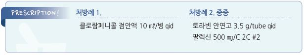

# 다래끼 (맥립종) Hordeolum

## 일반 사항

* 눈꺼풀의 급성 화농성 염증
* 기전 : 눈꺼풀 분비선의 국소 염증 → 분비선 폐쇄 → 통증성 종괴(pustule) 형성
* 경과 : 보통 1주 내 치유

### 겉다래끼 (외맥립종, External hordeolum, Stye)

* 발생 부위 : eyelid margin에 위치한 gland of Zeis 또는 Moll’s gland
* 눈꺼풀 가장자리 표면에서 관찰됨
* 농양이 보다 작음
* 흔히 다발성, 재발성

### 속다래끼 (내맥립종, Internal hordeolum)

* 발생 부위 : eyelid margin 바로 안쪽에 위치한 meibomian gland
* 눈꺼풀 결막을 통하여 관찰됨
* 농양이 보다 큼

## 원인

* 주요 원인균 : S. aureus
* sterile inflammation도 있음

### 위험 인자

* 불결한 위생
* 과거 발생 병력
* 콘택트렌즈 착용, 눈 화장
* 지루피부염 : 흔히 seborrhea가 감염의 유발 인자가 되며 안검염이 동반될 수 있음
* ocular rosacea, acne

## 임상 양상

* 눈의 이물감
* 눈꺼풀 부종, 종괴, 가려움, 통증/압통, 발적, 농포
* 결막 충혈; 안구 충혈은 드묾

## 진단

* 일반적으로 검사 없이 진단

***

## Management

## 비-약물 치료

* 온찜질 : 혈액 순환 및 자연 배농에 도움; 15분씩 1일 4회
* 눈꺼풀 세척 : (유아용 비누/샴푸 또는 눈꺼풀 세정제로) 1일 2회 세척 (squeezing 하지 않음)

## 약물/수술 치료

* internal hordeolum에 대한 비수술적 치료의 효과는 증거가 불충분함

### 1차 선택 : 외용제

*   국소 항생제 : 세척 후 도포, 7\~10일간 적용 (☞ p.192)

    •bacitracin, erythromycin, chloramphenicol \[클로람페니콜] : qid

    •tobramycin 안연고 \[토라빈] : qid
* 인공 눈물 : 필요시 적용

### 2차 선택 : 전신 항생제

* 대상 : 심한 감염, cellulitis 동반 또는 국소 치료에 반응하지 않는 경우에 2주간 투여
* dicloxacillin : 125\~250 ㎎ qid
* cephalexin : 500 ㎎ bid \[팔렉신]

### 수술

* 절개, 배농 : 48시간 내 완화가 시작되지 않으면 고려

## 예방

* 눈을 만지기 전에 손을 씻음
* 콘택트렌즈를 위생적으로 관리하며 만지기 전에 손을 씻음
* 매일 밤 눈 화장을 지움
* 다른 사람과 눈 화장품을 공동 사용하지 않음

> **질병코드** H00.00 외맥립종 H00.01 내맥립종

