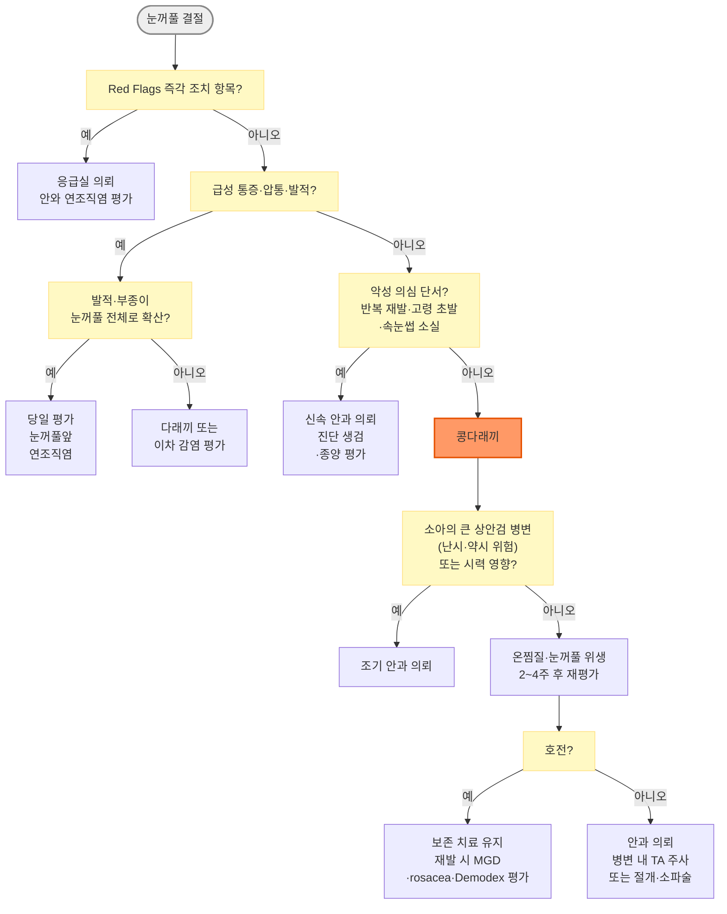

# 콩다래끼 (산립종) Chalazion

## <mark style="color:green;">일반 사항</mark>

* 눈꺼풀 피지선(주로 meibomian gland, 드물게 Zeis gland)의 폐쇄로 생기는 비감염성 만성 육아종성 염증(lipogranuloma) ([콩다래끼 이미지](https://my.clevelandclinic.org/health/diseases/17657-chalazion))
* 다른 이름 : meibomian cyst, 산립종
* 기전 : 주로 meibomian gland 폐쇄 → meibum/지질 성분의 정체 및 주변 조직으로의 유출 → 국소 lipogranulomatous inflammation(눈꺼풀 부종·홍반) → 섬유화; 수주\~수개월에 걸쳐 성장
  * hordeolum(다래끼)과 임상적으로 연속선상에 있는 경우가 있음 - 급성 감염성 병변(hordeolum)이 치유되며 만성 육아종(chalazion)으로 전환되기도 함
* 발생 연령 : 모든 연령에서 발생하며 성인 30\~50세에 흔하지만 소아에서도 흔함
* 경과 : 작은 병변은 자연 흡수될 수 있으나 수주\~수개월이 걸릴 수 있음; 드물게 이차 감염 또는 급성 염증이 동반될 수 있으며 재발·만성 경과를 보이기도 함

## <mark style="color:green;">원인 및 위험 인자</mark>

* chalazion, meibomian gland dysfunction(MGD), 만성 안검염, hordeolum 등의 발생 병력
  * Demodex [안검염](039_-blepharitis.md) : 다발성·재발성 병변, 속눈썹 뿌리의 원통형 비듬(collarettes) 또는 만성 안검염 동반 시 고려 - 성인뿐 아니라 소아에서도 재발·다발성 chalazion과의 연관성이 보고됨
* 지루피부염, rosacea&#x20;
* 불량한 눈꺼풀 위생
* 고지혈증, 비타민 A 결핍, 흡연, 눈꺼풀 외상 등도 연관성이 보고되었으나 일관된 인과 근거는 제한적

## <mark style="color:green;">임상 양상</mark>

* 통증·압통이 없는 국소 결절 - 다래끼와의 핵심 감별점
* 다래끼보다 크고 단단한 rubber-like nodule - 눈꺼풀 가장자리에서 떨어진 눈꺼풀판(tarsus) 내부에 위치하며, 눈꺼풀을 뒤집으면 결막면에서 붉거나 회색빛 융기로 보임
* 인접 결막 및 피부의 부종·발적
* 드물게 이차 감염 또는 급성 염증이 동반되면 통증·압통이 발생할 수 있음
* 큰 상안검 병변은 각막 압박으로 난시를 유발하여 시야 흐림을 일으킬 수 있음

### <mark style="color:$danger;">🚩 Red Flags!</mark>

<mark style="color:$danger;">**즉각 조치**</mark>

* 안구 돌출, 안구 운동 제한 또는 안구 운동 시 통증, 복시, 시력 저하 또는 상대구심동공운동장애(RAPD) `안와 연조직염` `골막하·안와 농양`
* 고열·전신 중독 증상을 동반하며 급속히 진행하는 눈꺼풀 부종·발적, 또는 영유아·면역저하자의 눈꺼풀 연조직염 `중증 눈꺼풀앞 연조직염` `초기 안와 연조직염`

<mark style="color:$warning;">**당일\~수일 내 평가**</mark>

* 통증 없던 결절에 통증·압통·발적·열감이 새로 생기며 눈꺼풀 전체로 퍼지는 경우 **(당일)** `눈꺼풀앞 연조직염`
* 각막 압박·시력 저하를 동반한 큰 병변 `유발 난시`&#x20;
* 어린 소아에서 동공을 가리거나 각막을 누르는 큰 상안검 병변, 지속되는 기계적 안검하수 `가림약시` `유발난시`
* 소아의 재발성·다발성 병변에 만성 충혈, 눈부심, 각막 혼탁이 동반된 경우 `안검각결막염`
* 동일 부위 반복 재발, 고령 초발, 속눈썹 소실, 눈꺼풀 가장자리 변형, 단단하고 경계 불분명한 종괴 `피지선 암종`&#x20;
* 치료에 반응하지 않는 편측 만성 안검결막염 `피지선 암종`

<mark style="color:$info;">**조기 평가 및 추적**</mark>

* 보존 치료 2\~4주 후에도 호전이 없는 경우 `치료 저항성 콩다래끼`


**안와 연조직염**(Orbital cellulitis) **vs 눈꺼풀앞 연조직염**(Preseptal cellulitis) **임상 감별**

<table><thead><tr><th width="165">항목</th><th>안와 연조직염</th><th>눈꺼풀앞 연조직염</th></tr></thead><tbody><tr><td>안구 운동 시 통증</td><td>있음</td><td>없음</td></tr><tr><td>안구 운동 제한·복시</td><td>있음</td><td>없음</td></tr><tr><td>시력 저하·RAPD</td><td>있을 수 있음</td><td>정상</td></tr><tr><td>안구 돌출(Proptosis)</td><td>있을 수 있음</td><td>없음</td></tr><tr><td>대응</td><td>응급실 이송, 영상 검사 및 정주 항생제·입원 평가</td><td>당일 평가 후 중증도에 따라 경구 또는 정주 항생제·입원 결정</td></tr></tbody></table>

※ 눈꺼풀 부종이 심해 안구 진찰이 어렵거나 영유아에서 안구 운동·시력을 확인할 수 없으면 안와 소견이 관찰되지 않는다는 것만으로 안와 연조직염을 배제하지 않음


## <mark style="color:green;">진단</mark>

* 임상 진단
  * 전형적인 콩다래끼에는 실험실·영상 검사가 필요하지 않음
  * 안와 침범·안와 연조직염 또는 비전형적인 깊은 종괴가 의심되면 영상 검사 고려
* 진찰 : 눈꺼풀을 뒤집어 결막면 병변 확인, 눈꺼풀 가장자리(MGD·속눈썹 소실) 관찰, 귀앞·턱밑 림프절 촉진
* 보존 치료 2\~4주에도 호전이 없거나 1개월 이상 지속·재발하면 진단 재평가와 안과 의뢰가 필요
  * 단, 지속 기간만으로 생검을하지는 않음
* 생검을 적극 고려할 상황 : 동일 위치 반복 재발, 치료 저항성 편측 안검결막염, 고령 초발, 속눈썹 소실·황색 또는 불규칙한 비후·경계 불분명·고정된 단단한 종괴 등 비전형적 소견
  * 상안검 병변에서 피지선 암종 빈도가 상대적으로 높음&#x20;


**피지선 암종 의심 임상 단서** - 아래 소견이 있으면 신속히 안과 의뢰하고 생검 역치를 낮게 유지\
• 이전 병력 없이 고령에 처음 발생한 눈꺼풀 종괴\
• 동일 부위 반복 재발 또는 적절한 치료에도 지속·진행, 특히 상안검에서 반복 재발\
• 종괴 질감이 rubbery가 아닌 딱딱하고(rock-hard) 불분명한 경계\
• 속눈썹 소실(madarosis) 또는 눈꺼풀 가장자리 불규칙\
• 치료에 반응하지 않는 편측 만성 안검결막염 - 결막 상피 내 확산(pagetoid spread)이 염증처럼 보일 수 있음\
• 국소 림프절 비대 동반

피지선 암종은 chalazion으로 위장하는 대표적 악성 종양임. 100명 단일기관 후향 연구에서 5년 질환특이생존율은 92.0%였으나 21%에서 림프절 전이가 발생하여, 조기 진단과 림프절 촉진이 중요함 \[Br J Ophthalmol 2019]


### <mark style="color:orange;">감별</mark>

<table data-search="false"><thead><tr><th width="119">항목</th><th>콩다래끼 (Chalazion)</th><th>겉다래끼</th><th>속다래끼</th></tr></thead><tbody><tr><td><strong>기전</strong></td><td>피지선 폐쇄 후 비감염성 육아종성 염증</td><td>Zeis/Moll gland의 급성 화농성 감염</td><td>Meibomian gland의 급성 화농성 감염</td></tr><tr><td><strong>주요 위치</strong></td><td>주로 눈꺼풀판(tarsus) 내부</td><td>속눈썹 인접 눈꺼풀 가장자리</td><td>눈꺼풀판 내부·결막면</td></tr><tr><td><strong>통증·압통</strong></td><td>없거나 경미함</td><td>뚜렷함</td><td>뚜렷함</td></tr><tr><td><strong>발적·부종</strong></td><td>초기에 경미할 수 있으나 만성기에는 감소</td><td>국소적으로 뚜렷함</td><td>깊고 넓게 나타날 수 있음</td></tr><tr><td><strong>경과</strong></td><td>만성; 수주~수개월</td><td>급성; 농포가 피부 쪽으로 배출될 수 있음</td><td>급성; 결막면으로 배출되거나 chalazion으로 이행 가능</td></tr><tr><td><strong>치료 원칙</strong></td><td>온찜질·눈꺼풀 위생; 지속 시 병변 내 스테로이드 주사 또는 절개·소파술(Incision &#x26; Curettage, I&#x26;C)</td><td colspan="2">온찜질 우선; 항생제는 감염 범위·안검염·연조직염 동반 여부에 따라 선택</td></tr></tbody></table>

* 속다래끼와 콩다래끼는 모두 meibomian gland·눈꺼풀판 내부에서 발생할 수 있으므로 위치만으로 구분하지 않음
* 급성 발병, 뚜렷한 통증·압통, 발적과 화농성 염증은 속다래끼를 지지
* 통증 없이 만성 경과를 보이면 chalazion을 우선 고려
* 급성 hordeolum이 치유된 뒤 chalazion으로 이행하기도 함
* 소아의 재발성·다발성 chalazion은 소아 안검각결막염(ocular rosacea) 동반 가능성을 평가

**chalazion 유사 육아종성 병변 유발 원인** (드묾)

* 면역 저하, 결핵, 바이러스 감염, trachoma, leishmaniasis 등 - 일반적인 chalazion의 흔한 위험인자는 아님
* 악성 종양(피지선 암종 등) - chalazion으로 오인될 수 있는 감별진단 대상&#x20;

***



<p align="center"><strong>콩다래끼 진단 및 치료 알고리듬</strong></p>

<p align="center"><em><mark style="color:$info;">저자 재구성 (참고 문헌 : Ophthalmic Plast Reconstr Surg 2025; Korean J Ophthalmol 2025)</mark></em></p>

***

## <mark style="background-color:$warning;">Management</mark>

### <mark style="color:orange;">치료 방침</mark>

* 작은 병변은 자연 흡수를 기대하며 온찜질·눈꺼풀 세척 유지
* 보존 치료 2\~4주에 반응을 재평가
  * 호전이 없거나 커지는 경우, 환자 불편이 크거나 진단이 불확실하면 안과 의뢰
  * 1개월 이상 지속되면 의뢰
    * 새 병변이 조금씩 작아지고 시기능 영향·비전형 소견이 없으면 환자와 경과 관찰을 함께 결정할 수 있음
* 처음 진료 시 이미 2개월 이상 경과한 병변은 보존 치료 효과가 낮으므로 처음부터 의뢰하여 침습적 치료를 고려
* 항생제는 단순 chalazion이나 재발 자체에는 사용하지 않음
  * 눈꺼풀앞·안와 연조직염 등 명확한 감염 또는 동반된 MGD·ocular rosacea·만성 안검염의 선택적 치료에만 고려


국내 안과 전문의 대상 설문에서도 chalazion 치료 전략(보존 치료 기간, 병변 내 주사 vs 절개·소파술 선호 등)에 시술자 간 편차가 있는 것으로 보고됨 (대한안과성형외과학회(KSOPRS) 회원 설문) \[Korean J Ophthalmol 2025]


#### <mark style="color:$primary;">병변 특성에 따른 의사결정</mark>

<table data-search="false"><thead><tr><th width="260">임상 상황</th><th>치료 방향</th></tr></thead><tbody><tr><td>발생 수주 이내, 작고 시기능 영향 없음</td><td>온찜질·눈꺼풀 위생 2~4주 후 재평가</td></tr><tr><td>처음 진료 시 이미 2개월 이상 경과</td><td>보존 치료 효과가 낮으므로 처음부터 안과 의뢰</td></tr><tr><td>보존 치료 실패 또는 지속 병변</td><td>안과 의뢰; 병변 내 triamcinolone 주사 또는 절개·소파술을 병변 특성과 환자 선호에 따라 선택</td></tr><tr><td>큰 병변, 각막 압박·시력 저하·기계적 안검하수</td><td>조기 안과 의뢰; 빠른 감압이 필요하면 절개·소파술 선호</td></tr><tr><td>누점 인접·다발성, 진단이 명확함</td><td>누점 손상·흉터를 고려하여 병변 내 스테로이드 주사를 선택할 수 있음</td></tr><tr><td>반복·비전형·악성 의심</td><td>통상의 콩다래끼 소파술이 아니라 충분한 깊이의 진단 생검과 종양 평가를 위해 신속 안과 의뢰</td></tr><tr><td>재발성 + MGD·rosacea·Demodex 안검염</td><td>기저 눈꺼풀 질환을 평가·치료; 약물·IPL은 적응 환자에서 선택적으로 고려</td></tr></tbody></table>

* 병변 크기별 단일 검증 절단값은 없으므로 3·5·7 ㎜ 등의 수치만으로 치료법이나 triamcinolone 농도를 결정하지 않음
* 진단이 불명확하거나 악성 의심 소견 동반 시 → 크기·기간에 관계없이 신속히 안과 의뢰하고 생검을 적극 고려

## <mark style="color:green;">비-약물 치료 및 예방</mark>

* 온찜질 : ductal blockage 완화 및 meibum 배출 촉진
  * 화상을 일으키지 않을 정도의 따뜻한 온도(약 40°C), 10\~15분씩 1일 3\~4회
  * 온도 유지에는 제조사가 눈꺼풀용·전자레인지 가열용으로 허용한 아이마스크형 온찜질 팩을 사용할 수 있음
* 눈꺼풀 세척(lid scrub) : 매일 눈꺼풀 가장자리를 세척하며 온찜질과 함께 시행
* 눈꺼풀 마사지 : 찜질 후 가볍게 마사지 (squeezing 하지 않음)

#### <mark style="color:$primary;">눈꺼풀 세정제 종류 (동반 안검염·MGD 위생 관리)</mark>

<table><thead><tr><th width="158">종류</th><th width="252">주요 적응</th><th>비고</th></tr></thead><tbody><tr><td>유아용 샴푸 희석액</td><td>일반 눈꺼풀 위생</td><td>접근성이 높으나 계면활성제 자극에 주의</td></tr><tr><td>차아염소산(HOCl)<br>스프레이</td><td>세균성 안검염, 일반 눈꺼풀 위생</td><td>상대적으로 자극이 적을 수 있으나 제품별 용법을 따름</td></tr><tr><td>Tea tree oil 계열</td><td>Demodex 안검염이 확인되거나 강하게 의심될 때</td><td>표준화된 눈꺼풀용 희석 제품만 사용; 원액은 각막·결막 자극 위험으로 사용하지 않음</td></tr></tbody></table>

* 세정제는 동반 안검염·MGD의 위생 관리 수단이며 콩다래끼 결절 자체를 없애는 치료가 아님
* 오메가-3 보충제가 chalazion 재발을 예방한다는 직접 근거는 없고 MGD 연구도 결과가 일관되지 않음
  * 국내 7개 기관 RCT에서도 rTG omega-3가 포도씨유 대조군보다 MGD 동반 안구건조 증상을 유의하게 개선하지 못했으므로(군당 60명 미만으로 검정력 제한) routine 보충제로 권고하지 않으며 식품을 통한 섭취를 우선 \[JAMA Ophthalmol 2024]
* 국소 azithromycin은 후부 안검염 또는 ocular rosacea 치료 연구가 있으나 chalazion 자체의 재발 예방 효과는 확립되지 않았으며 국내 제제 이용 가능성과 허가사항을 별도로 확인해야 함

## <mark style="color:green;">약물 치료</mark>

#### <mark style="color:$primary;">국소 스테로이드 (보조 치료)</mark>

* 단순 chalazion에 routine으로 사용하지 않음 : 온찜질 단독과 온찜질 + 항생제 또는 항생제/스테로이드 복합제의 완전 소실률에 유의한 차이가 없음
* 주변 결막·눈꺼풀 염증이 뚜렷하고 감염·각막상피결손·각막염(특히 HSV)을 배제한 선택적 상황에서만 안과 전문의 판단으로 짧은 기간 고려
* fluorometholone <mark style="color:blue;">\[오큐메토론]</mark>, loteprednol etabonate <mark style="color:blue;">\[로테프로점안현탁액]</mark> 등 - 제품별 허가사항 확인; 안압 상승·백내장·감염 악화 위험 때문에 임의 장기 사용 금지 및 필요 시 안압 추적 (☞ [안과계 약제](037_1-ophthalmic-medications.md))

#### <mark style="color:$primary;">병변 내 스테로이드 주사</mark>

* 적용 : 앞서 기술한 보존 치료 실패 기준에 해당하고, 감염 소견이 없으며 임상 진단이 명확하고 조직 진단이 필요하지 않을 때
* 방법 : triamcinolone acetonide 병변 내 직접 주입(가는 바늘, 예: 27\~30G); 안과 처치
  * 접근 경로 : 결막 면(conjunctival approach) 선호 - 피부 면(skin approach) 대비 탈색소 위험 낮음
  * 안구 천공 예방 : chalazion clamp 등으로 안구를 보호하고, 바늘 끝이 안구를 향하지 않도록 눈꺼풀 면과 평행한 접선 방향으로 병변 내부에 진입
  * 연구에서는 병변 크기에 따라 총 2\~6 ㎎(예: 40 ㎎/㎖ 제제 0.05\~0.15 ㎖) 등이 사용되었으나 표준화된 단일 용량은 없음; 시술자의 프로토콜과 병변 특성에 따라 결정
  * 과다 주입 시 결막하 백색 침착물 장기 잔존 및 안압 상승 위험 증가
  * 첫 주사 후 호전이 불충분하면 시술자 프로토콜에 따라 재평가하여(연구에서는 대개 2주 전후) 추가 주사를 고려할 수 있음
* 농도는 10 또는 40 ㎎/㎖ 등이 연구되었으나 병변 크기만으로 농도를 결정하는 검증된 기준은 없음; 피부색이 어두운 환자·표재성 병변에서는 저농도 및 결막면 접근을 고려
* 효과 : 소실의 정의와 대상에 따라 연구별 성공률 차이가 큼
  * 무작위시험 메타분석에서 1회 시술 성공률은 주사 60.4%, 절개·소파술 78.0%였고 1\~2회까지 허용하면 각각 72.5%, 86.7%로, 1회 치료 성공률은 절개·소파술이 높은 경향임 \[Ophthalmic Plast Reconstr Surg 2016]
  * 중소형 병변에서는 주사 1\~2회도 선택지가 되며, 반복 치료 의향과 병변 특성(크기·만성도·위치·조직 진단 필요성)에 따라 선택
  * 한 무작위시험에서는 TA 4 ㎎ 주사군 52명 중 42명(81%), 절개·소파술군 42명 중 33명(79%)에서 완전 소실되어 차이가 없었음(p=0.8). 단일 연구 수치를 일반화하지 않음 \[Am J Ophthalmol 2011]
* 부작용
  * 피부 탈색소(depigmentation) : 특히 피부색이 어두운 환자에서 주의; 10 ㎎/㎖ 희석 사용 고려
  * 피하 지방 위축(subcutaneous fat atrophy)
  * 안압 상승
  * 중심성 장액성 맥락막망막병증(CSCR) : 드물지만 스테로이드 주사 후 발생 보고 있음
    * 주사 후 시력 변화·중심 암점 발생 시 즉시 안과 내원 필요
  * 드문 부작용 : 망막·맥락막 혈관 폐쇄, 안구 관통, 시력 손실

#### <mark style="color:$primary;">항생제</mark>

* 단순 chalazion 자체에는 항생제가 필요하지 않음
  * 2,712명 후향 관찰 연구에서 보존 치료에 국소·경구 항생제를 추가해도 치료 성공률이 높아지지 않았으며(adjusted RR 0.97, 95% CI 0.89\~1.04), tetracycline·macrolide계도 다른 경구 항생제와 차이가 없었음 \[Eye Contact Lens 2022]
* 통증·압통·농성 분비물이 새로 생기면 hordeolum 또는 이차 감염 여부를 다시 평가
  * 국소 염증만으로 경구 항생제를 일률적으로 사용하지 않음
* 눈꺼풀앞 연조직염(preseptal cellulitis)이 동반되면 당일 평가 후 원인과 중증도에 맞는 전신 항생제를 사용
* 안와 연조직염이 의심되면 즉시 입원·정주 치료 (☞ 항생제 선택은 [다래끼](040_-hordeolum.md#management) 참고)

#### <mark style="color:$primary;">동반 MGD·ocular rosacea·만성 안검염의 선택적 항염 치료</mark>

* 성인에서 doxycycline 40\~50 ㎎ qd, 6\~12주를 고려할 수 있음 <mark style="color:blue;">\[모노신정]</mark>&#x20;
  * chalazion 자체 또는 단순 재발에 대한 routine 치료가 아니라 기저 눈꺼풀 질환을 대상으로 한 허가 외 사용이며, 50 ㎎/일 용법도 국내 허가 용법과 다름
  * 임부·수유부·12세 미만 소아는 이 선택적 장기 항염 치료의 대상에서 제외
  * isotretinoin 등 레티노이드와 병용 금지(두개내압 상승 위험)
  * 광과민성·식도 자극·위장관 부작용과 철분·칼슘·제산제 상호작용에 주의

## <mark style="color:green;">시술 및 기타 처치</mark>

#### <mark style="color:$primary;">스테로이드 주사 vs 절개·소파술 비교</mark>

<table><thead><tr><th width="96">구분</th><th>병변 내 스테로이드 주사</th><th>절개·소파술</th></tr></thead><tbody><tr><td>장점</td><td>최소 침습적; 다발성·누점 인접 병변에 유리; 흉터 위험이 낮음</td><td>즉각적인 부피 감소; 조직 병리 검사 가능; 오래된 큰 병변에 유리</td></tr><tr><td>단점</td><td>피부 탈색소·지방 위축 위험; 큰 섬유화 병변에서 효과 제한적; 조직 진단 불가</td><td>통증·출혈·흉터 가능성; 누점 인근 시 손상 위험</td></tr><tr><td>선호 상황</td><td>소~중형 병변; 흉터 우려; 누점 인근; 다발성; 진단이 명확할 때</td><td>큰 병변; 보존 치료 실패; 빠른 해소 필요 시</td></tr></tbody></table>

* 임상 진단의 확실성, 조직 검사의 필요성, 병변 크기·위치·만성도뿐 아니라 통증·흉터·회복 속도에 대한 환자 선호를 함께 고려하여 공동 의사결정
* 악성이 의심되면 치료 목적의 절개·소파술이 아닌 진단 생검 경로로 별도 접근

#### <mark style="color:$primary;">절개·소파술</mark>

* 적용 : 큰 병변(각막 압박·시력 저하·기계적 안검하수), 보존 치료 실패 또는 2개월 이상 지속된 섬유화 병변, 빠른 제거가 필요한 병변. 악성 의심 병변은 별도의 진단 생검 경로로 의뢰
* 절개 방향 : 접근 면에 따라 다름

<table><thead><tr><th width="82">접근 면</th><th width="109">절개 방향</th><th width="254">적용 상황</th><th>근거</th></tr></thead><tbody><tr><td>결막 면</td><td>Vertical</td><td>대부분의 chalazion - 표준 접근</td><td>meibomian gland 주행 방향 평행; 주변 기름샘 손상 최소화</td></tr><tr><td>피부 면</td><td>Horizontal</td><td>병변이 피부 쪽에 매우 근접한 경우</td><td>피부 주름선(relaxed skin tension line) 방향; 흉터 최소화</td></tr></tbody></table>

* 조직 병리 검사 : 통상의 절개·소파술 검체는 원칙적으로 병리 의뢰하는 안전 중심 방침을 고려
* 반복·비전형(고령 초발, 경계 불분명, madarosis 등)·악성 의심 병변은 통상 소파술과 별개로 충분한 조직을 확보하는 진단 생검을 반드시 시행 - 피지선 암종 등 악성 병변 배제
* 기타 드문 합병증 : 출혈·감염·흉터, 눈꺼풀 윤곽 변형 또는 notch, 누점·눈물길 손상, 안구 천공

#### <mark style="color:$primary;">시술 후 합병증 - 화농성 육아종(Pyogenic Granuloma)</mark>

* 절개·소파술 후 또는 드물게 자연 파열 후, 절개 부위에 붉고 말랑말랑한 육아 조직이 돌출되어 성장할 수 있음
* 처치 : 안과에서 병변 크기와 위치를 확인한 후 단기간의 국소 스테로이드 또는 국소 timolol <mark style="color:blue;">\[리스몬티지점안액]</mark>등 비수술적 허가 외 치료를 고려할 수 있으며, 반응이 없거나 진단이 불확실하면 소작·절제 및 병리검사 시행
  * 환자가 스테로이드 점안액을 임의로 증량하지 않도록 안내
  * 국소 timolol은 콩다래끼 자체가 아니라 진단이 확인된 시술 후 병변에 대한 선택지로, 사용 전 천식·서맥 등 금기와 전신 흡수 가능성을 확인
* 감별 포인트 : 통증 없이 빠르게 커지는 붉은 조직 → 자연 회복 기대하지 말고 조기 의뢰

#### <mark style="color:$primary;">IPL (Intense Pulsed Light) 치료</mark>

* 적용 : 재발성 chalazion + MGD(마이봄샘 기능 장애) 동반 환자에서 선택적으로 고려하는 보조 치료
* 기전 : 광열 작용에 의한 meibum 유동성 개선, 염증 조절 등이 제안되나 확립된 단일 기전은 없음
* 효과 : 병변 호전·재발 감소 및 기름샘 기능 개선 가능성이 보고되었으나 연구 규모가 작고 비맹검·단일군 연구가 포함되어 장기 효과는 불확실함
* 표준 1차 치료가 아님; 재발성·MGD 동반 환자에서 안과 전문의가 적응증·금기와 피부 유형을 평가한 후 선택
* 국내 안과성형 전문의 설문에서도 다래끼·콩다래끼의 잠재적 보조 치료로 인식됨 \[Korean J Ophthalmol 2025]

***

## <mark style="color:red;">질병코드</mark>

* H00.1 콩다래끼 Chalazion

***

## <mark style="color:purple;">처방례</mark>

> **처방례 1. 단순 콩다래끼 - 약물 없이 보존 치료**
>
> ```
> 약물 처방 없음
> ```
>
> _✽화상을 일으키지 않을 정도의 온찜질을 10\~15분씩 1일 3\~4회 시행하고 눈꺼풀 위생·가벼운 마사지를 병행. 2\~4주 후 재평가하며, 1개월 이상 지속되거나 커지면 안과 의뢰_

> **처방례 2. 성인 재발성 병변 + MGD·ocular rosacea·만성 안검염 동반 - 선택적 허가 외 치료**
>
> ```
> 모노신정 100 ㎎/T  0.5T qd  ×6~12wk
> ```
>
> _✽단순 chalazion 또는 재발 자체의 치료가 아니라 동반된 MGD·ocular rosacea·만성 안검염의 항염 치료. 국내 해당 안과 적응증은 허가 외 사용이며 제품별 허가사항과 급여 기준 확인. **처방 전 실제 공급 정제의 분할 적합성을 확인하고, 100 ㎎ qod로 임의 환산하지 않음.** 50 ㎎/일 용법도 국내 허가 용법과 다르며, 40 ㎎ 서방형 제제와 동일시하지 않음. isotretinoin 등 레티노이드 병용 금지. 임부·수유부·12세 미만 소아는 대상에서 제외_

***

### <mark style="color:$success;">핵심 복약 지도</mark>

> **온찜질 방법**
>
> * 화상을 일으키지 않을 정도의 따뜻한 물수건(약 40°C)을 눈꺼풀 위에 10\~15분간 올려놓으십시오. 1일 3\~4회 시행하십시오.
> * 찜질 후 눈꺼풀 가장자리를 부드럽게 세척하고 가볍게 마사지하십시오.
> * 제조사가 눈꺼풀용·전자레인지 가열용으로 허용한 아이마스크형 온찜질 팩은 제품 설명대로 사용하십시오. **젖은 수건이나 밀봉한 지퍼백을 전자레인지에 직접 가열하지 마십시오** - 국소 과열·증기 화상 위험이 있습니다. 사용 전 손목 안쪽에 대어 온도를 확인하십시오.
> * 뜨거운 수건을 세게 누르거나 종괴를 손으로 짜지 마십시오.

> **저용량 doxycycline 복용 시 주의사항**
>
> * 충분한 물(200 ㎖ 이상)과 함께 복용하고, 복용 후 최소 30분간 눕지 마십시오 - 식도 자극 예방.
> * 복용 중 햇빛·자외선에 과민해질 수 있으므로 외출 시 자외선 차단제를 사용하십시오.
> * 철분·칼슘 보충제, 제산제와 동시에 복용하면 흡수가 감소할 수 있으므로 복용 간격을 두십시오.
> * 여드름 치료제(이소트레티노인 등 비타민 A 유도체)를 복용 중이면 반드시 미리 알리십시오. 함께 복용하면 뇌압이 올라 심한 두통·시야 이상이 생길 수 있습니다.
> * 임신 중·수유 중 또는 만 12세 미만인 경우에는 장기 복용하지 마십시오.
> * 임의로 복용 기간을 연장·단축하지 말고 처방 의사와 상의하십시오.

> **병변 내 스테로이드 주사 전 안내 (사전 고지)**
>
> * 주사 후 수일 내에 병변이 줄어드는 것을 느낄 수 있습니다.
> * **피부 탈색소** : 주사 부위 피부색이 옅어질 수 있습니다. 피부색이 어두운 분은 미리 의사에게 알리십시오 - 저농도(10 ㎎/㎖)와 결막면 접근을 고려할 수 있습니다.
> * **피하 지방 위축** : 주사 부위가 약간 꺼져 보일 수 있습니다.
> * **안압 상승** : 주사 후 안압이 높아질 수 있으므로 녹내장이 있는 분은 반드시 사전에 알리십시오.
> * **시력 변화 시 즉시 내원** : 드물게 주사 후 중심 시야가 흐려지거나 물체가 작게 보이는 증상(중심성 장액성 맥락막망막병증, CSCR)이 발생할 수 있습니다. 이런 증상이 나타나면 즉시 내원하십시오.
> * 한 번의 주사로 충분히 해소되지 않으면 2주 전후 재평가하여 반복 주사가 필요할 수 있습니다.

> **스테로이드 점안액 사용 시 주의사항**
>
> * 스테로이드 점안액은 단순 콩다래끼의 routine 치료가 아니며 감염·각막질환을 배제한 선택적 상황에서만 사용합니다.
> * 점안 전 반드시 손을 씻으십시오.
> * 아래 눈꺼풀을 살짝 당긴 후 결막낭에 1방울 점적하십시오. 약병 끝이 눈·속눈썹에 닿지 않도록 주의하십시오.
> * 점안 후 눈 안쪽(코 옆 눈물점)을 1\~2분간 가볍게 눌러 전신 흡수를 줄이십시오.
> * **스테로이드 점안액은 의사 지시 없이 임의로 장기 사용하지 마십시오** - 장기 사용 시 안압 상승·백내장·감염 악화 위험이 있습니다.
> * 눈꺼풀 염증이 있는 동안에는 콘택트렌즈 착용을 쉬십시오. 착용하는 경우 점안 전 렌즈를 빼고, 다시 착용하는 시점은 제품 설명서를 따르십시오(일반적으로 점안 15분 후).
> * 점안액은 제품별 개봉 후 사용 기한을 따르십시오(일반적으로 개봉 후 4주 이내).

> **언제 다시 병원을 방문해야 하나요?**
>
> * 치료를 시작한 후 **2\~4주가 지나도 종괴가 줄어들지 않는** 경우
> * 종괴가 오히려 **커지거나 딱딱해지는** 경우
> * 통증 없던 종괴에 **통증·발적·분비물**이 새로 생긴 경우 (이차 감염 또는 급성 염증 가능)
> * **갑자기 시력이 뚜렷하게 떨어지거나** 눈이 아프고 눈동자를 움직이기 어려운 경우 - 즉시 내원
> * 혹이 커지면서 **서서히 흐려 보이거나** 눈꺼풀이 잘 감기지 않는 경우 - 빨리 진료
> * **같은 자리에 반복 재발**하는 경우 - 악성 병변 감별 필요, 조기 의뢰

***

## <mark style="color:blue;">환자 안내서</mark>


**콩다래끼(산립종)란 무엇인가요?**

콩다래끼는 눈꺼풀 안의 기름샘(meibomian gland)이 막혀 생기는 **만성 육아종성 염증**입니다. 세균 감염 없이 기름샘 분비물이 쌓여 생기므로, 통증이 없는 단단한 혹(결절)이 특징입니다. 보통 서서히 줄어들지만 수주에서 수개월간 지속될 수 있으며 드물게 결막면이나 피부면으로 자연 배출되기도 합니다.

대부분 양성으로 경과하고 적절히 치료하면 최종 시력 예후는 양호합니다. 다만 어린 소아에서 큰 상안검 병변이 동공을 가리거나 각막을 압박하면 난시·약시를 유발할 수 있으므로 조기 진료가 필요합니다.


#### <mark style="color:$primary;">콩다래끼와 다래끼는 어떻게 다른가요?</mark>

* **콩다래끼(산립종)** : 감염 없이 기름샘이 막혀 생기는 만성 염증. 눈꺼풀 속에 **통증이 없는** 단단한 종괴로 나타나며 수주\~수개월 지속됩니다.
* **다래끼** : 세균 감염으로 생기는 급성 염증. 눈꺼풀 가장자리가 빨갛게 부어오르며 **통증**이 있으며, 대개 1\~2주 안에 좋아지고 저절로 터지기도 합니다.
* 다래끼가 치유된 후 콩다래끼로 전환되는 경우도 있습니다.

#### <mark style="color:$primary;">어떤 증상이 생기나요?</mark>

* 눈꺼풀 속(눈꺼풀을 뒤집으면 보이는 안쪽 면)에 통증 없이 단단하고 둥근 혹이 만져집니다.
* 처음에는 약간 붓고 가려울 수 있으나, 시간이 지나면서 통증 없이 굳어집니다.
* 종괴가 커지면 시야가 흐려지거나 눈꺼풀이 무겁게 느껴질 수 있습니다.
* 드물게 이차 감염이나 급성 염증이 동반되면 다래끼처럼 통증과 발적이 생길 수 있습니다.

#### <mark style="color:$primary;">가정에서 어떻게 관리하나요?</mark>

* **온찜질** : 화상을 일으키지 않을 정도의 따뜻한 수건(약 40°C)을 눈꺼풀 위에 1회 10\~15분씩, 하루 3\~4회 올려놓으십시오. 막힌 기름샘 내용물의 배출을 돕습니다.
  * 제조사가 눈꺼풀용·전자레인지 가열용으로 허용한 온찜질 팩만 설명서대로 데우고, 사용 전 손목 안쪽에 대어 온도를 확인하십시오. **젖은 수건이나 밀봉한 지퍼백을 전자레인지에 직접 가열하지 마십시오.**
* **눈꺼풀 세척** : 전용 눈꺼풀 세정제 또는 유아용 샴푸 희석액으로 눈꺼풀 가장자리를 하루 1\~2회 부드럽게 닦으십시오. 자극이 생기면 중단하고 상담하십시오.
* **눈꺼풀 마사지** : 찜질 후 눈꺼풀을 가볍게 문질러 주십시오. 단, 종괴를 억지로 짜거나 세게 누르지 마십시오.

#### <mark style="color:$primary;">치료는 어떻게 하나요?</mark>

* 많은 병변이 온찜질과 눈꺼풀 위생으로 서서히 호전되지만 완전히 없어지는 데 수개월이 걸릴 수도 있습니다.
* 스테로이드 안약은 단순 콩다래끼에 일률적으로 사용하지 않습니다. 주변 염증이 심하고 감염·각막질환이 배제된 경우에만 의사가 짧게 처방할 수 있습니다.
* 2\~4주 치료 후에도 줄어들지 않거나 1개월 이상 지속되면 안과에서 **병변 내 스테로이드 주사** 또는 **절개·소파술**을 고려할 수 있습니다.

#### <mark style="color:$primary;">재발을 예방하려면 어떻게 해야 하나요?</mark>

* 매일 눈꺼풀 가장자리를 전용 세정제 또는 유아용 샴푸 희석액으로 닦아 주십시오.
* 활동성 염증이 있는 동안에는 눈 화장과 콘택트렌즈 착용을 가급적 중단하십시오.
* 매일 밤 눈 화장(아이라이너, 마스카라 등)을 깨끗이 지우고 화장품을 다른 사람과 공유하지 마십시오. 오래되거나 오염된 눈 화장품은 교체하십시오.
* 렌즈 착탈 전 손을 씻고 렌즈·보관용기·세척액을 제품 지침에 따라 위생적으로 관리하십시오.
* 지루피부염·여드름·rosacea 등 기저 피부 질환을 함께 관리하십시오.
* 오메가-3 보충제가 콩다래끼 재발을 예방한다는 근거는 확립되지 않았으므로 routine으로 복용할 필요는 없습니다. 일반적인 식사를 통한 섭취를 우선하십시오.
* 재발이 잦거나 여러 개가 반복되면 마이봄샘 기능 장애, rosacea, 만성 안검염 또는 Demodex 안검염 등이 동반되었는지 안과에서 평가받으십시오.

#### <mark style="color:$primary;">이럴 때는 병원을 다시 방문하세요</mark>

* 치료 후 **2\~4주가 지나도 종괴가 줄어들지 않는** 경우
* 종괴가 **점점 커지거나 딱딱해지는** 경우
* 통증 없던 혹에 **갑자기 통증·발적·분비물**이 생기는 경우
* **갑자기 시력이 뚜렷하게 떨어지거나** 눈이 아프고 눈동자를 움직이기 어려운 경우 - 즉시 내원
* 혹이 커지면서 **서서히 흐려 보이거나** 눈꺼풀이 잘 감기지 않는 경우 - 빨리 진료
* **같은 자리에 반복 재발**하는 경우 - 드물게 악성 종양이 콩다래끼처럼 보일 수 있으므로 반드시 검사를 받으십시오

#### <mark style="color:$primary;">❓ 콩다래끼에 대한 오해와 진실 (FAQ)</mark>

**Q. 콩다래끼는 다른 사람에게 옮나요?** A. 아닙니다. 콩다래끼는 세균 감염이 아닌 기름샘 폐쇄로 생기므로 전염되지 않습니다.

**Q. 그냥 두면 저절로 없어지나요?** A. 작은 병변은 자연 흡수되기도 하지만 수개월이 걸릴 수 있습니다. 1개월 이상 지속되거나 커진다면 안과에서 진단과 치료 필요성을 다시 평가받으십시오.

**Q. 콩다래끼를 손으로 짜면 안 되나요?** A. 삼가십시오. 강하게 누르거나 짜면 염증이 퍼져 감염·연조직염(눈꺼풀 주변 피부 감염)으로 악화될 수 있습니다.

**Q. 같은 자리에 계속 재발하는데 왜 그런가요?** A. 동일 부위의 반복 재발은 마이봄샘 기능 장애, 지루피부염, rosacea 등 기저 원인이 있는 경우가 많습니다. 드물게는 피지선 암종이 콩다래끼처럼 보일 수 있으므로 안과에서 재평가하고, 비전형 소견이 있으면 생검을 고려해야 합니다.
