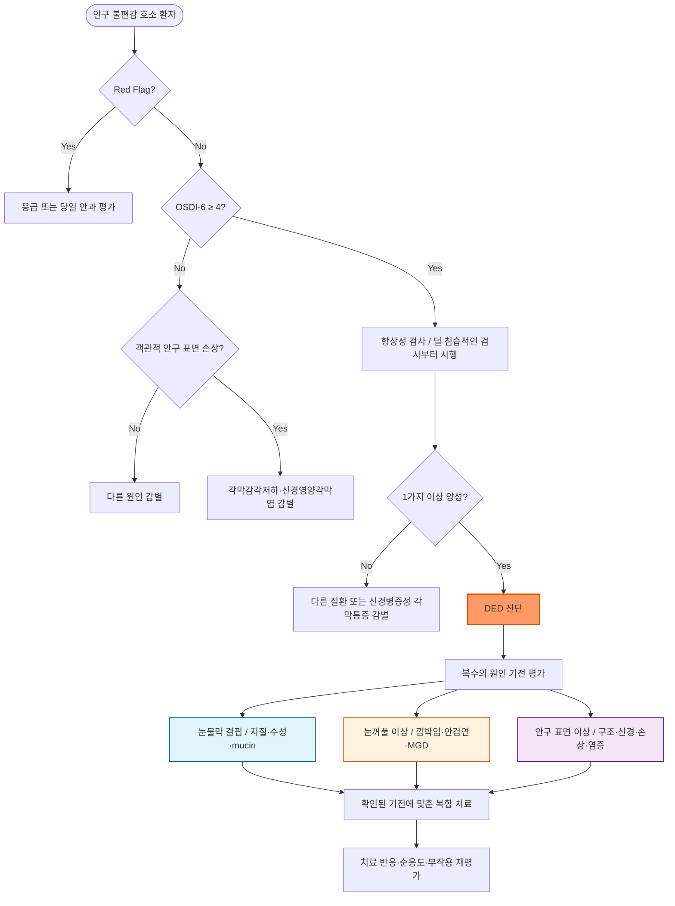

# 눈마름증 (안구건조증) Dry Eye Disease (DED)

## <mark style="color:green;">일반 사항</mark>

* 눈물막 및/또는 안구 표면 항상성의 소실로 발생하는 다인성 질환
* 다른 이름 : keratoconjunctivitis sicca, dry eye disease(DED)\
  ✽2007년 최초 TFOS DEWS부터 질환명으로 "Disease"를 사용해 왔으며, DEWS III에서도 이를 재강조함. "Syndrome"은 원인 불명의 증후군 뉘앙스가 있어 특정 치료 가능한 질환임을 흐리므로 사용하지 않음
* 정의 (TFOS DEWS III, 2025) : 눈물막 및/또는 안구 표면의 항상성 소실을 특징으로 하는 다인성 증상 질환으로, 눈물막 불안정성·고삼투압, 안구 표면 염증 및 손상, 신경감각 이상(neurosensory abnormality)이 병인에 포함됨
  * DED 진단에는 증상과 객관적 항상성 이상 소견이 모두 필요함
  * 증상은 심하지만 징후가 미미한 경우에는 신경병증성 각막통증을, 각막 손상은 심하지만 증상이 미미한 경우에는 각막감각저하·신경영양각막염(neurotrophic keratopathy)을 감별
* 분류(TFOS DEWS III) : 환자를 ADDE/EDE 중 하나로만 고정 분류하지 않고, 다음 원인 기전(driver)을 개별적으로 확인하여 복수의 원인을 동시에 치료
  * 눈물막 결핍 : 지질, 수성 눈물, mucin/glycocalyx
  * 눈꺼풀 이상 : 불완전 깜박임·안검폐쇄 이상, 안검연 질환·MGD
  * 안구 표면 이상 : 구조적 이상, 신경기능 이상, 세포 손상·장벽 파괴, 일차 염증·산화스트레스
  * 전통적 임상 표현형인 수성 눈물 결핍형(ADDE), 증발과다형(EDE), 혼합형도 병태 파악에 보조적으로 사용 가능하며 실제로는 중복이 흔함
* 보통 양측 발생
* 유병률 : 성인의 5\~50%(진단 기준에 따라 범위 광범위); 고령 여성에서 특히 높음
* 합병증 : 지속성 각막상피결손, 각막염·궤양, 감염, 각막 흉터·신생혈관(중증에서 드묾)

#### <mark style="color:$primary;">눈물막의 구성</mark>

* 전통적으로 점액층·수성층·지질층의 3층 구조로 설명했으나, 현재는 바깥쪽 **지질층**과 그 아래 점액 성분이 농도 구배를 이루며 통합된 **mucoaqueous phase**의 2상 모델을 선호
* 지질층 : 주로 meibomian gland에서 분비; 눈물막 안정화 및 증발 억제
* mucoaqueous phase : 눈물샘의 수성 성분과 결막 술잔세포 등의 mucin이 연속적으로 혼합; 윤활·영양 공급·방어 및 눈물막의 고른 퍼짐에 기여
* 각막·결막 상피 표면의 glycocalyx는 눈물막 부착과 안구 표면 항상성 유지에 중요

## <mark style="color:green;">원인</mark>

#### <mark style="color:$primary;">눈물 생성 부족/감소 (ADDE)</mark>

* 눈물샘 기능 부전으로 수성 눈물 생성 감소
* 유발 요인 : androgen 감소(고령·폐경), 눈물샘 결함, Sjögren's syndrome, RA, 당뇨병, 안검염 후유 장애, 눈 수술(예: blepharoplasty, 백내장 수술, 시력 교정술)
  * 유발약물 : 항히스타민제, 항콜린제, 항우울제, estrogen(경구 피임제), isotretinoin, 세로토닌 수용체 대항제, 이뇨제, β-차단제, amiodarone, nicotinic acid

#### <mark style="color:$primary;">Tear film 불안정, 빠른 눈물 증발 (EDE)</mark>

* 눈물막 지질층 결핍으로 인한 과도한 눈물 증발
* Meibomian gland dysfunction(MGD)이 가장 흔한 원인
* 유발 요인 : 안구열 이상, 안검 내반/외반, Bell's palsy, 알레르기, 콘택트렌즈 착용, 영양 결핍(예: Vit A 결핍), 안약의 잦은 장기 사용(특히 보존제 함유 안약)
  * 건조한 환경(예: 냉/온풍기 사용, 높은 고도), 자극(예: 담배 연기)
  * 눈 깜빡임 감소 : IT 기기·화면 사용, 독서, 운전, 파킨슨병

#### <mark style="color:$primary;">추가 위험인자</mark>

* 수면 장애 : 불량한 수면의 질, 수면 시간 부족
* 심리적 동반 질환 : 우울·불안·스트레스 → 증상 중증도와 유의미하게 연관
* 눈 주위 화장 : 마스카라, 아이라이너 등(meibomian gland 개구부 폐쇄 가능)
* 환경 : 대기 오염, 낮은 습도, 고온
* 장내 마이크로바이옴 이상 (근거 축적 중)

## <mark style="color:green;">임상 양상</mark>

* 충혈, 건조, 자극감, 작열감, 가려움, 이물감(모래 느낌), 안구통, 눈부심, 시야 흐림
* 소량의 점액성 분비물 : 눈물 감소에 따른 점액질 분비 증가에 기인
* 과도한 눈물(paradoxical tearing) : 안구 표면 자극·손상 → 눈물샘 반사 자극 → 수성 눈물 분비 증가; 안구 건조가 지속되면 점차 감소
* 증상-징후 불일치
  * 각막 염색 소견이 경미한데 통증이 심하고 바람·빛·건조 환경 등에 극도로 과민(allodynia)한 경우 → 신경병증성 각막통증 고려
  * 각막 손상·염색은 심하지만 통증이 미미한 경우 → 각막감각저하·신경영양각막염 감별
  * 국소마취제 점안 후 통증이 현저히 감소하면 말초 각막신경 성분을 지지하지만, 검사와 해석은 안과에서 시행

### <mark style="color:$danger;">🚩 Red Flags!</mark>

<mark style="color:$danger;">**즉각 조치 또는 의뢰**</mark>

* 급격한 시력 저하, 깜박여도 호전되지 않는 새 시야 흐림 또는 각막 혼탁
* 심한 안구통(deep eye pain), 심한 눈부심 → 각막궤양·공막염·포도막염·급성 폐쇄각녹내장 등 의심
* 화학물질 노출, 관통상 또는 고속 이물에 의한 안구 외상

<mark style="color:$warning;">**당일 또는 조기 의뢰**</mark>

* 각막 손상·침윤 또는 감염 의심(slit-lamp exam 필요)
* 콘택트렌즈 착용자에서 충혈과 함께 통증·눈부심·시력저하가 있거나 증상이 지속·악화 → 감염성 각막염 가능
* 갑작스러운 일측성 증상 또는 한쪽 눈이 현저히 심한 경우
* 화농성 분비물 또는 각막 궤양 의심
* 치료에도 통증이 임상 소견에 비해 현저히 심하거나 각막 손상에 비해 통증이 미미함 → 신경병증성 각막통증 또는 신경영양각막염 의심

<mark style="color:$info;">**외래 추적 / 추가 평가 계획**</mark> <mark style="color:$info;">- 즉각 위험 낮으나 호전 없으면 의뢰</mark>

* 인공 눈물 등 1차 치료로 4\~6주 내 호전 없음
* 난치성 증상으로 국소 면역억제제 사용 고려 시
* Sjögren syndrome 등 전신 질환 의심(구강건조, 반복되는 침샘종창, 관절통·피로 등 동반)

## <mark style="color:green;">진단</mark>

* 단일 확진 검사는 없으며, '증상 + 임상 진찰소견'으로 진단
* 증상 확인 : OSDI-6(6문항, cut-off ≥4)을 TFOS DEWS III(2025)의 표준 선별 설문으로 권고
  * 증상 점수 구간 : 0\~3점 정상, 4\~8점 경증\~중등도, 9\~24점 중증. 이는 증상 중증도 구간이며 객관적 안구 표면 손상까지 포함한 전체 DED 중증도 분류는 아님
  * 한국어 문항은 검증된 번역본 사용을 원칙으로 하며, 자체 번역을 사용할 경우 그 사실을 명시
  * DEQ-5는 보조 설문으로 사용할 수 있으나 DEWS III 표준 진단 알고리듬의 동등한 대안은 아님
* 눈물막 및 안구 표면 항상성 이상 확인 : 증상 양성에 더하여 아래 중 1가지 이상 양성이면 DED 진단
  * non-invasive tear breakup time(NIBUT) : ＜10초(TFOS DEWS III에서 우선 권고)
  * fluorescein tear breakup time(FBUT) : ＜5초(TFOS DEWS III); ADES 진단기준에서는 TFBUT ≤5초
  * tear osmolarity : ≥308 mOsm/L (또는 양안 차이 ＞8 mOsm/L)
  * 안구 표면 염색 : 각막 fluorescein punctate spot ＞5개, 결막 lissamine green spot ＞9개 또는 안검연 염색 길이 ≥2 ㎜이면서 폭 ≥25%
  * 검사는 덜 침습적인 검사부터 시행하며, 첫 검사가 음성이더라도 임상 의심이 지속되면 다른 항상성 검사를 추가
* Schirmer's test : 5분 후 ≤5 ㎜ wetting → 수성 눈물 결핍 기전 시사(DED 자체의 필수 확진 검사는 아님)
* MGD 평가 : meibomian gland expressibility, 눈꺼풀 가장자리 관찰; Meibography(마이봄샘 촬영)로 선상 위축·구조적 손상 평가 가능
* 임상적으로 Sjögren syndrome이 의심될 때 자가항체(우선 anti-SSA/Ro; 필요 시 ANA·ENA 등) 및 관련 검사를 시행하고 류마티스내과 협진 고려
  * 구강건조, 반복되는 침샘종창, 관절통·피로 등 전신 증상과 현저한 수성 눈물 결핍이 의심을 높임
  * Schirmer ≤5 ㎜/5분과 안구 염색은 2016 ACR/EULAR 분류기준의 일부일 뿐 단독 진단기준이 아니며, anti-SSB/La 단독 양성은 해당 분류기준 항목이 아님
* 갑상선기능검사는 갑상선질환을 시사하는 병력·진찰 소견이 있거나 관련 자가면역질환이 의심될 때 고려
* 알레르기 질환과의 감별을 요함 (☞ [결막염](038_-conjunctivitis.md#allergic-conjunctivitis))
* 필요 시 각막 손상 여부 검사(slit-lamp exam)

**OSDI-6 설문지 (Ocular Surface Disease Index 6)**

* 아래 문항은 한국어 번역 예시이며, 정식 선별에 사용할 때는 검증된 한국어판 여부와 사용 조건을 확인
* 지난 한 달 중 일상적인 하루 동안 아래 상황을 경험한 빈도를 항상(4점), 대부분(3점), 종종(2점), 가끔(1점), 없음(0점)으로 답변
* 채점/판정 : 각 문항 점수 합산(최저 0점, 최고 24점) → 총점 ≥4이면 건성안 의심
  * 0\~3점 정상, 4\~8점 경증\~중등도, 9\~24점 중증. 단, 설문 점수만으로 DED의 전체 중증도나 치료 단계를 결정하지 않음

 \[증상·시기능 영역]\
   1. 빛에 눈이 민감하셨나요?\
   2. 시야가 흐려지셨나요?

 \[시각 기능 영역]\
   3. 야간 운전(또는 동승) 시 불편하셨나요?\
   4. TV 시청 또는 유사한 작업 시 불편하셨나요?

 \[환경 영역]\
   5. 바람이 부는 환경에서 불편하셨나요?\
   6. 습도가 낮은 환경에서 불편하셨나요?

**DEQ-5 설문지(Dry Eye Questionnaire 5)**

* DEWS III 표준 선별 설문은 아니며, 증상 정도를 보조적으로 평가할 때 사용
* 지난 한 달 중 일상적인 하루 동안의 경험
* 채점/판정 : 각 문항 점수 합산(최저 0점, 최고 22점) → 총점 ＞6 → 건성안 증상 시사

 \[눈의 불편감(Eye Discomfort)]\
   1. 눈이 불편하다고 느낀 빈도는?\
   없음(0), 드물게(1), 가끔(2), 자주(3), 항상(4)\
   2. 잠자리에 들기 2시간 전, 하루가 끝날 무렵 불편감의 강도는?\
   없음(0), 매우 약함(1)\~매우 심함(5)

 \[눈의 건조감(Eye Dryness)]\
   3. 눈이 건조하다고 느낀 빈도는?\
   없음(0), 드물게(1), 가끔(2), 자주(3), 항상(4)\
   4. 잠자리에 들기 2시간 전, 하루가 끝날 무렵 건조감의 강도는?\
   없음(0), 매우 약함(1)\~매우 심함(5)

 \[눈물 흘림(Watery Eyes)]\
   5. 눈이 지나치게 촉촉하거나 눈물이 흘렀던 빈도는?\
   없음(0), 드물게(1), 가끔(2), 자주(3), 항상(4)

#### <mark style="color:$primary;">원인 기전(driver) 평가</mark>

<table><thead><tr><th width="180">영역</th><th width="260">핵심 평가</th><th>치료 방향</th></tr></thead><tbody><tr><td>눈물막 결핍</td><td>지질층·meibum 상태, tear meniscus, Schirmer, mucin/glycocalyx 관련 염색</td><td>성분에 맞춘 윤활제·지질 보충, 눈물 보존 또는 분비 촉진</td></tr><tr><td>눈꺼풀 이상</td><td>불완전 깜박임, 안검폐쇄부전, 안검연염·Demodex·MGD</td><td>깜박임 교정, 온찜질·눈꺼풀 위생, 원인별 안검 치료</td></tr><tr><td>안구 표면 이상</td><td>결막이완증 등 구조 이상, 각막감각, 세포 손상·염색, 염증·산화스트레스</td><td>구조 이상 교정, 항염치료, 신경기능 이상 및 상피 손상 치료</td></tr><tr><td>전신 원인</td><td>Sjögren syndrome, rosacea, 갑상선질환, 약물·수술 관련 요인</td><td>원인 질환 평가·치료 및 관련 약물 조정</td></tr></tbody></table>

* ADDE, EDE 및 혼합형 표현은 임상적 방향 설정에 유용하지만, 한 환자에서 여러 원인 기전이 함께 존재할 수 있으므로 배타적으로 적용하지 않음

### <mark style="color:orange;">감별 진단</mark>

* 충혈, 이물감, 불편감이 나타날 수 있는 질환들의 감별

<table><thead><tr><th width="150">질환</th><th width="260">건성안과의 차이점</th><th>핵심 감별 포인트</th></tr></thead><tbody><tr><td>결막염·안검염</td><td>가려움, 눈꺼풀 부종·가피, 화농성 분비물 등이 두드러질 수 있음</td><td>알레르기·감염·안검연 질환을 원인별로 평가</td></tr><tr><td>각막 찰과상·이물·감염성 각막염</td><td>급성 통증, 눈부심, 일측성 충혈, 시력저하; 콘택트렌즈가 위험인자</td><td>fluorescein 염색·slit-lamp 검사; 감염 의심 시 당일 안과 의뢰</td></tr><tr><td>포도막염·공막염·급성 폐쇄각녹내장</td><td>심한 통증·눈부심·시력저하, 깊은 충혈; 녹내장은 두통·구역 동반 가능</td><td>응급 안과 평가</td></tr><tr><td>상공막염<br>(Episcleritis)</td><td>국소적 선홍색 충혈(부채꼴 모양), 해당 부위 압통; 분비물 없음</td><td>재발하거나 진단이 불확실하면 안과 의뢰</td></tr><tr><td>결막이완증<br>(Conjunctivochalasis)</td><td>하결막의 과잉 주름이 각막 하부를 덮고 눈물 분포·배출을 방해</td><td>slit-lamp 검사로 확인; 윤활·항염치료 또는 필요 시 수술적 교정</td></tr><tr><td>신경병증성 각막통증·신경영양각막염</td><td>각막 징후에 비해 통증이 과도하거나, 반대로 손상에 비해 통증이 적음</td><td>각막감각검사와 전문 안과 평가</td></tr></tbody></table>

***



<p align="center"><strong>진단 및 치료 알고리듬</strong></p>

<p align="center"><em><mark style="color:$info;">Ref. TFOS DEWS III Diagnostic Methodology; Management &#x26; Therapy. Am J Ophthalmol. 2025;279.</mark></em></p>

***

## <mark style="background-color:$warning;">Management</mark>


**원인 기전 기반 치료 전략 (Driver-based Approach)**


<table><thead><tr><th width="190">확인된 기전</th><th>주요 치료 선택지</th></tr></thead><tbody><tr><td>모든 환자의 기본 관리</td><td>교육, 유발 요인 조정, 깜박임·환경·수면 개선, 적절한 인공 눈물</td></tr><tr><td>지질 결핍·MGD</td><td>온찜질·눈꺼풀 위생, 지질 함유 윤활제; 불응 시 안과에서 약물·기기 치료 선별</td></tr><tr><td>수성 눈물 결핍</td><td>무방부제 윤활제, 야간 연고; Sjögren 등 원인 평가, 선별된 환자에서 눈물 보존·분비 촉진</td></tr><tr><td>mucin/glycocalyx 이상</td><td>국내 허가된 분비촉진제(rebamipide·diquafosol 등)를 적응증과 허가사항에 따라 고려</td></tr><tr><td>안구 표면 염증</td><td>감염 배제 후 안과 감독 아래 단기 국소 스테로이드 또는 장기 면역조절제 고려</td></tr><tr><td>구조·신경·상피 이상</td><td>원인 구조 교정, 신경병증성 통증·신경영양각막염 평가; 중증에서는 재생치료·보호렌즈 등 전문치료</td></tr></tbody></table>


복수의 원인 기전이 동반되는 경우에는 순차적 단계 상승보다 확인된 기전에 대한 치료를 병행 적용


### <mark style="color:orange;">치료 방침</mark>

* 예방 및 유발 인자 회피
* 적절한 인공 눈물 사용(1 drop/회) ± 취침 시 윤활제 안연고 도포
* MGD 동반 시 온찜질·눈꺼풀 위생을 우선 시행
* 알레르기 등 관련 질환 진단 및 치료
* 난치성 질환에 대하여 항염제 고려
* 복수의 병인이 동반되는 경우 복합 치료가 원칙 (TFOS DEWS III 2025)

## <mark style="color:green;">비-약물 치료 및 예방</mark>

* 눈을 자주 깜박임; 화면 사용 중 의식적으로 깜빡임 빈도 유지
* 자극을 피함 : 건조 환경, 대기 오염, 담배 연기, 햇빛
* 바람 회피 : 선풍기, 에어컨, 온풍기, 헤어드라이어; 직접 접촉 회피, 습기 유지 안경(moisture chamber) 착용
* 더운 방·건조한 실내 회피; 실내 습도 유지(가습기)
* 눈을 작게 뜸(예: 컴퓨터 모니터 위치를 낮춤, 책을 내려서 봄), 자주 눈을 감고 있음
* 증상이 악화된 동안에는 콘택트렌즈 착용을 중단하고 안경으로 대체; 재착용 시 렌즈 적합성과 관리 상태를 점검
* 탈수를 피하고 적절한 수분 섭취를 유지하되, 과도한 수분 섭취 자체가 DED 치료로 입증된 것은 아님
* 눈꺼풀 온찜질 및 청결 유지 (특히 MGD 동반 시)
  * 온찜질 : meibomian gland 굳은 기름 성분 액화 → 분비 개선; 40\~43°C, 1일 1\~2회, 5\~10분
  * 눈꺼풀 세척(lid scrub) : 온찜질 직후 면봉 또는 눈꺼풀 세정제로 가장자리를 닦아냄 - 열로 연화된 분비물 제거 효과 극대화; 온찜질→세척 순서가 핵심
  * 화상 예방 : 지나치게 뜨거운 찜질을 피하고 젖은 수건을 전자레인지에 직접 가열하지 않음
* 유발 약물 회피
* 굴절교정술(라식·라섹 등) : 각막 신경 손상으로 건성안 악화 가능성이 있으므로 수술 전 안구건조증 평가 및 환자 교육 필요
* 화면 사용 시 20-20-6 규칙 : 20분 사용 후 20초간 6미터 이상 먼 곳을 바라봄

## <mark style="color:green;">약물 치료</mark>

### <mark style="color:orange;">인공 눈물, 윤활제</mark>

* 1차 선택제
  * [급여기준](https://www.hira.or.kr/rc/insu/insuadtcrtr/InsuAdtCrtrPopup.do?mtgHmeDd=20260701\&sno=1\&mtgMtrRegSno=0003) (2026.7.1.) : 건성안증후군에 사용하는 일회용 인공누액제는 동일 기전 내 1종만 급여 인정. sodium hyaluronate 일회용 제제는 내인성 질환에 의한 각결막상피장애 등 인정 범위에서 원칙적으로 1일 최대 6관이며, Sjögren syndrome·Stevens-Johnson syndrome·이식편대숙주병으로 인한 건성안증후군은 용량 제한의 예외
* 사용 빈도 : 경증 - 증상 시 필요에 따라 사용; 중등도 이상 - 규칙적 사용(qid 이상) 권장
* 경증 눈마름증에 대하여 필요시 사용
* 정확한 점안 시 한쪽 눈에 한 방울로 충분
* 빈번한 사용(대개 1일 4\~6회 이상), 중등도 이상 DED 또는 안구 표면 손상 시에는 무방부제 제품을 우선 고려\
  ✽병 제품에도 무방부제 다회용 용기가 있으므로 제품별 방부제 포함 여부와 허가사항을 확인
* 콘택트렌즈 착용 중 사용할 때는 무방부제 여부만으로 판단하지 말고 해당 제품의 렌즈 착용 중 사용 가능 여부를 확인
* MGD에 의한 증발과다형에는 지질 함유 인공 눈물 또는 연고제 선택(특히 취침 시 적용)

#### <mark style="color:$primary;">수분 보유 (Humectant)</mark>

* hyaluronate : 점탄성·수분 보유 기전. 방부제 함유 병 제품과 무방부제 단회용 제품으로 구분; <mark style="color:blue;">\[라큐아 점안액]</mark>, <mark style="color:blue;">\[히알루 미니]</mark>, <mark style="color:blue;">\[히아레인 미니]</mark>

#### <mark style="color:$primary;">점성 유지</mark>

* carboxymethylcellulose <mark style="color:blue;">\[리프레쉬 티어즈]</mark>, <mark style="color:blue;">\[인프레쉬 플러스]</mark>
* hydroxypropyl methylcellulose <mark style="color:blue;">\[아티어]</mark>
* polyvinylpyrrolidone <mark style="color:blue;">\[옵타젠트]</mark>

#### <mark style="color:$primary;">표면 장력 완화</mark>

* polyethylene glycol <mark style="color:blue;">\[시스탄]</mark>

#### <mark style="color:$primary;">지질층 보충 / 증발 방지 (EDE/MGD에 특히 적합)</mark>

* anhydrous liquid lanolin (취침 전 연고) <mark style="color:blue;">\[듀라티얼즈 안연고]</mark>
* perfluorohexyloctane (PFHO) : 반불소화 알케인(semifluorinated alkane); 눈물-공기 경계면에 증발 억제층을 형성하는 무수·무방부제 제제, qid; phase 3 RCT(GOBI·MOJAVE)에서 증상·징후 개선; FDA 승인(2023); 제품명 <mark style="color:blue;">미에보</mark>(Miebo) - 국내 허가·유통 및 보험 적용 여부 확인 필요

#### <mark style="color:$primary;">Mucin Secretagogue</mark>

* rebamipide : 1회 1적, 1일 4회 점안 <mark style="color:blue;">\[레바아이]</mark>, <mark style="color:blue;">\[레바케이]</mark>
* diquafosol : 1회 1적, 1일 6회 점안 <mark style="color:blue;">\[디쿠아이]</mark>

### <mark style="color:orange;">항염제</mark>

#### <mark style="color:$primary;">국소 Steroid</mark>

* 단순 자극감만으로 사용하지 않으며, 감염성 각막염·헤르페스각막염 등을 배제하고 임상적으로 안구 표면 염증이 확인된 경우에 안과 감독 아래 단기간 사용
* 가능한 한 저역가를 선택하고 치료 전후 각막 상태와 안압을 평가; 임의 연장 또는 간헐적 장기 사용을 피함 (☞ [안과계 약제](ophthalmic-medications.md#undefined-14))
* fluorometholone <mark style="color:blue;">\[오큐메토론]</mark>
* loteprednol <mark style="color:blue;">\[로테프로]</mark>

#### <mark style="color:$primary;">국소 면역억제제</mark>

* 2차 약제
* 대상 : 안구 건조에 의한 염증 발생, 다른 치료로 호전 안 됨
* 한계 : 효과 발현까지 수 주 이상 소요(초기 4\~8주 무효 반응 흔함); 장기 사용 시 전신 흡수가 낮아 안전성 양호; 이 제제의 사용이 필요한 경우 의뢰 고려
* cyclosporine 0.05% <mark style="color:blue;">\[레스타시스]</mark> : 일반적으로 1회 1방울 bid
* cyclosporine 0.1% <mark style="color:blue;">\[아이커비스점안액0.1%]</mark> : 인공눈물 치료에도 개선되지 않는 안구건조증 성인 환자의 중증 각막염에서 1회 1방울 qd, 취침 전 점안 권장
  * 보험기준(2026.7.1. 시행) : cyclosporine 0.05%와 0.1% 모두 일회용 인공누액제 일반원칙에 포함되며, 허가사항과 약제별 세부 인정기준 범위에서 동일 기전 내 1종만 급여 인정 (☞ [보험기준](https://www.hira.or.kr/bbsDummy.do?brdBltNo=12124\&brdScnBltNo=4\&pgmid=HIRAA020002000100))

#### <mark style="color:$primary;">국소 Integrin antagonist</mark>

* 작용 : 항염 작용, 증상 개선
* 부작용 : 안구 자극/불편감, 쓴맛
* lifitegrast 5.0% bid <mark style="color:blue;">\[자이드라]</mark> (국내 유통 중단)

### <mark style="color:orange;">전신 분비 촉진 및 신경자극 치료</mark>

* 경구 pilocarpine(cholinergic agonist) 5 ㎎ tid <mark style="color:blue;">\[살라겐]</mark> 또는 cevimeline 30 ㎎ tid는 일반 DED의 routine 치료가 아니라 주로 Sjögren syndrome의 전신 sicca 증상에서 전문의 판단으로 고려
  * 발한, 구역·설사, 빈뇨, 서맥·저혈압, 기관지수축 등의 콜린성 이상반응과 금기·주의사항 및 국내 허가·가용성을 확인

**비강 내 분무제 (Nasal Spray)**

* varenicline nasal spray 0.03 ㎎/dose : 삼차신경(CN V) 말단의 α3β4 nAChR을 자극하여 반사 기전으로 수성·점액성 눈물 분비를 유도하는 새로운 기전; 안약 점안이 어렵거나 안구 표면 자극이 심한 환자에서 대안으로 고려
  * 용법 : 양쪽 코에 각 1회(0.03 mg), 1일 2회(bid)
  * ONSET-1/ONSET-2 RCT에서 Schirmer 검사 및 눈물 분비량 유의미한 개선 확인; FDA 승인(2021); 제품명 Tyrvaya (국내 미허가)
  * 주요 부작용 : 재채기(약 82%), 코 자극감, 비인두 불편감

**TRPM8 작용제**

* acoltremon 0.003% ophthalmic solution : 각막의 TRPM8 냉각수용체를 자극하여 자연 눈물 분비를 촉진; 양안 각 1방울 bid
  * COMET-2·COMET-3 임상시험을 근거로 FDA 승인(2025.5.28.); 제품명 Tryptyr
  * 국내 미허가(2026년 9월 기준); 최신 해외 치료 동향으로 안내

### <mark style="color:orange;">영양 요법</mark>

* 연구 결과가 상반되고 DREAM trial 등에서 유의미한 효과가 확인되지 않아, 결핍이 없는 환자에게 routine 처방하지 않음
* 오메가-3, γ-linolenic acid, 항산화제 등은 routine 치료로 권고할 근거가 충분하지 않으며, 보조적으로 사용할 경우 안구건조증은 국내 허가 외 사용임을 설명
* Vit A·B12·D 등은 결핍이 확인된 경우 보충 고려\
  ✽DREAM 연구에서는 오메가-3 총 3 g/일(EPA 2 g + DHA 1 g)을 12개월간 투여했으나 olive-oil placebo보다 유의한 호전을 보이지 못함(NEJM 2018)

### <mark style="color:orange;">항생제</mark>

* 대상 : 2차 감염, MGD, rosacea, blepharitis
* 국소 항생제 (☞ [안과계 약제](ophthalmic-medications.md#undefined-10))
* 전신 항생제 : 보존치료에 반응하지 않는 중등도\~중증 MGD 또는 ocular rosacea에서 doxycycline 등을 안과 판단으로 제한적으로 고려(국내 허가 외 사용)\
  ✽용량·기간은 연구마다 다양하며 장기간 routine 사용 근거는 제한적이다. 위장관 장애·식도염·광과민, 임신·수유 및 소아 사용 제한, 약물상호작용을 확인하고 통상 6\~12주 이내 반응을 재평가. 식도 자극을 줄이기 위해 충분한 물과 함께 복용하고 복용 후 최소 30분간 눕지 않도록 안내

## <mark style="color:green;">시술 및 기타 처치</mark>

#### <mark style="color:$primary;">눈물 점 폐쇄 (Punctal occlusion)</mark>

* lacrimal puncta에 silicone 또는 gel plug을 삽입하여 눈물 배출을 늦춤
* 다른 방법으로 조절되지 않는 심한 수성 눈물 결핍에서 선별적으로 고려하나, 임상적 이득에 관한 근거는 일관되지 않음
* 활성 안구 표면 염증이 있으면 염증 매개물질의 체류로 악화될 수 있으므로 염증을 먼저 조절하고 안과에서 환자를 선별

#### <mark style="color:$primary;">기기 치료 - MGD 동반 난치성 건성안</mark>

* IPL (Intense Pulsed Light) : 항염 및 meibomian gland 기능 개선을 목적으로 사용; 일부 연구에서 증상·TBUT 개선이 보고되었으나 연구 간 이질성과 근거 확실성의 한계가 있음
* LipiFlow (thermal pulsation) : 12분 1회 시술로 meibomian gland 기능 개선을 유도; 일부 추적 연구에서 장기간 효과가 보고되었으나 개인차가 크고 반복 치료가 필요할 수 있음
* 두 치료 모두 국내 비급여 시술로 시행 가능; routine 1차 치료가 아니라 보존·약물 치료로 조절되지 않는 MGD 관련 건성안에서 안과가 적응증·금기와 기대 효과를 평가하여 선택

#### <mark style="color:$primary;">중증·난치성 DED의 전문 치료</mark>

* 다음 치료는 모두 안과 전문 평가와 추적관찰하에 시행
* 최대한의 일반 치료에도 증상 또는 안구 표면 손상이 지속되면 안과에서 자가혈청·혈액유래 점안제, 보호용 또는 scleral lens, 양막 치료 등을 고려
* 노출각막병증은 안검폐쇄부전 등 해부학적 원인을 교정하고, 신경영양각막염은 각막감각과 상피 손상 정도에 따른 전문 치료 시행

***

### <mark style="color:red;">질병코드</mark>

H04.1 눈물샘의 기타 장애

H04.11 건성안증후군

H04.9 눈물계통의 상세불명 장애

✽KCD-9(2026.1.1. 시행) 기준. 단순 건성안에는 구체적인 H04.11을 우선하며 H04.1 또는 H04.9를 대체 코드처럼 일률적으로 사용하지 않음. 각결막염, Sjögren syndrome 등 원인 질환이 확진된 경우에는 해당 원인 질환 코드를 우선 또는 함께 사용

***

## <mark style="color:purple;">처방례</mark>

> **처방례 1. 경증**
>
> ```
> 라큐아 점안액 5 ㎖/병  필요시
> ```
>
> _✽경증에서는 히알루론산 함유 인공 눈물을 필요시 점안. 빈번하게 사용하거나 안구 표면 손상이 있는 경우에는 무방부제 제품을 우선 선택_

> **처방례 2. 중증 (수성 결핍형)**
>
> ```
> 히알루 미니 점안액  1방울 qid 이상
> 듀라티얼즈 안연고 1 tube  취침 전
> ```
>
> _✽중등도 이상에서는 인공 눈물을 규칙적으로 사용(qid 이상). 히아레인 미니 등 동등한 무방부제 제품으로 대체 가능하나 동일 목적 제품을 중복 처방하지 않음. 중증 ADDE에서는 취침 전 윤활 연고(lanolin계)를 병용_

> **처방례 3. 안구 표면 염증 확인 (안과 감독 아래 단기 치료)**
>
> ```
> 로테프로 점안액 5 ㎖/병  1방울 qid ×1주
> 히아레인 미니 점안액  필요시
> ```
>
> _✽감염을 배제하고 안구 표면 염증이 확인된 경우에만 안과 감독 아래 저역가 스테로이드(로테프로)를 단기 사용 후 재평가. 임의 연장하지 않으며 각막 상태와 안압을 확인_

> **처방례 4. MGD/증발과다형 (blepharitis·rosacea 동반)**
>
> ```
> 독시사이클린 50 ㎎/T  1T qd  6~8주
> 히알루 미니 점안액  필요시
> ```
>
> _✽국내 허가 외 사용. 보존치료에 반응하지 않는 중등도\~중증 MGD 또는 ocular rosacea에서 안과 판단으로 고려하며 6\~8주 후 반응과 부작용을 재평가. 충분한 물과 함께 복용하고 복용 후 최소 30분간 눕지 않도록 안내. 임신·수유, 소아, 식도염·광과민 및 약물상호작용에 주의. 온찜질과 눈꺼풀 위생을 병행_

***

### <mark style="color:$success;">핵심 복약 지도</mark>

> **인공 눈물 올바른 사용법**
>
> * 점안액은 아래 눈꺼풀을 살짝 당긴 후 결막낭(아랫 눈꺼풀 안쪽)에 1방울 떨어뜨리십시오. 한 방울이면 충분하며, 약병 끝이 눈에 닿지 않도록 주의하십시오.
> * 점안 후 수 초간 눈을 살며시 감고, 눈 안쪽(코 옆 눈물점)을 손가락으로 1\~2분간 가볍게 눌러 주십시오. 약 성분이 목으로 넘어가 나타날 수 있는 쓴맛을 줄여 줍니다.
> * 여러 종류의 점안액을 함께 사용하는 경우, 점안 간격을 3\~5분 이상 두십시오.
> * 점안액을 자주 사용하거나 안구 표면 손상이 있는 경우에는 **무방부제 제품**을 우선 사용하십시오. 방부제가 포함된 제품을 빈번하게 장기간 사용하면 오히려 안구 표면을 자극할 수 있습니다.
> * 단회용 제품은 개봉 즉시 사용하고 남은 액은 버리십시오. 다회용 제품은 제품별 허가사항에 표시된 개봉 후 사용기간을 따르십시오.
> * 콘택트렌즈 착용 중에는 해당 점안액을 렌즈를 낀 채 사용할 수 있는지 제품별로 확인하십시오.
> * 취침 전 안연고를 사용하는 경우, 소량(약 0.5 cm)을 아래 결막낭에 도포하십시오. 기상 직후 일시적인 시야 흐림이 있을 수 있으나 정상적인 반응입니다.

> **MGD 동반 시 - 눈꺼풀 온찜질 방법**
>
> 1. 깨끗한 수건을 40\~43°C 따뜻한 물(뜨겁지 않은 정도)에 적십니다.
> 2. 눈을 감고 눈꺼풀 위에 5\~10분간 얹어 둡니다. 1일 1\~2회 시행합니다.
> 3. **찜질 직후**, 면봉 또는 눈꺼풀 전용 세정제로 눈꺼풀 가장자리를 부드럽게 닦아 냅니다. 열로 연화된 기름샘 분비물이 가장 효과적으로 제거됩니다.
>
> * **온찜질→세척 순서**를 지키는 것이 핵심입니다.
> * 화상을 피하기 위해 지나치게 뜨거운 찜질을 하지 말고, 젖은 수건을 전자레인지에 직접 가열하지 마십시오.
> * 굳은 기름 성분이 액화되어 meibomian gland 분비가 개선됩니다. 최소 1개월 이상 꾸준히 시행해야 효과가 나타납니다.

> **스테로이드 안약 사용 시 주의사항**
>
> * 감염 여부와 안구 표면 상태를 확인한 뒤 처방된 약입니다. 의사가 처방한 기간 이상 임의로 연장하거나 남은 약을 재사용하지 마십시오. 장기 사용 시 안압 상승·백내장뿐 아니라 감염 악화나 각막 치유 지연이 발생할 수 있습니다.
> * 사용 중 눈이 더 불편해지거나 시야가 흐려지면 즉시 내원하십시오.

> **언제 다시 병원을 방문해야 하나요?**
>
> * 인공 눈물 사용에도 4\~6주 이내에 증상이 호전되지 않는 경우
> * 눈의 충혈과 함께 **시력이 갑자기 저하되거나 흐려지고, 깜박여도 좋아지지 않는 경우** - 즉시 내원
> * **심한 눈의 통증·눈부심**이 동반되는 경우 - 즉시 내원
> * 콘택트렌즈 착용 중 충혈과 함께 통증·눈부심·시력저하가 발생한 경우 - 당일 내원
> * 화학물질이 눈에 들어간 경우 - 즉시 충분히 세척하면서 응급 진료
> * 스테로이드 안약 사용 중 증상이 오히려 악화되는 경우 - 즉시 내원

***

### <mark style="color:blue;">환자 안내서</mark>


**안구건조증, 꾸준한 관리가 중요합니다**

안구건조증은 눈물이 부족하거나 빨리 증발하여 눈 표면이 건조해지는 만성 상태입니다. 완전한 완치보다는 증상을 조절하고 악화를 예방하는 것이 치료의 목표입니다.


#### <mark style="color:$primary;">왜 눈이 건조해지나요?</mark>

* 눈물막은 바깥쪽 기름층과 그 아래 수분·점액 성분이 어우러진 층으로 이루어져 있습니다. 어느 성분이 부족하거나 균형이 무너지더라도 눈물막이 불안정해질 수 있습니다.
* **수성 결핍형** : 눈물샘 기능 저하로 눈물 자체가 부족한 경우. Sjögren syndrome 등 전신 질환이 원인인 경우 있음
* **증발과다형 (가장 흔함)** : 눈꺼풀 안쪽 meibomian gland(기름샘)의 기능 저하로 눈물 기름층이 부족해 눈물이 빨리 증발하는 경우
* 주요 유발 요인 : 고령, 장시간 화면(스마트폰·PC) 사용, 건조한 환경, 콘택트렌즈 착용, 항히스타민제·이뇨제 등 일부 약물, 수면 부족, 스트레스

#### <mark style="color:$primary;">일상생활에서 어떻게 관리하나요?</mark>

* **눈을 자주 깜박이십시오.** 화면을 볼 때는 의식적으로 깜박임을 늘리고, 20분 사용 후 20초간 6미터 이상 먼 곳을 바라보는 '20-20-6 규칙'을 실천하십시오.
* **건조한 환경을 피하십시오.** 실내 가습기를 사용하고, 선풍기·에어컨·온풍기 바람이 눈에 직접 닿지 않도록 하십시오.
* **탈수를 피하고 적절한 수분 섭취를 유지하십시오.** 물을 과도하게 마시는 것 자체가 안구건조증 치료가 되는 것은 아닙니다.
* **눈꺼풀을 청결하게 유지하십시오.** 따뜻한 찜질(40\~43°C, 1일 1\~2회, 5\~10분) 후 눈꺼풀 가장자리를 부드럽게 닦아 주면 기름샘 기능 개선에 도움이 됩니다.
* **증상이 심할 때는 콘택트렌즈를 쉬고 안경으로 교체하십시오.** 콘택트렌즈는 눈물막 안정성과 안구 표면 환경에 영향을 주어 증상을 악화시킬 수 있습니다.
* **수면을 충분히 취하고 스트레스를 관리하십시오.** 수면 장애와 심리적 스트레스는 안구건조증 증상을 악화시킵니다.

#### <mark style="color:$primary;">인공 눈물, 어떻게 써야 하나요?</mark>

* 증상이 있을 때마다 사용할 수 있습니다. 자주 사용하거나 안구 표면 손상이 있다면 **무방부제 제품**을 우선 선택하십시오. 콘택트렌즈 착용 중 사용 가능 여부는 제품마다 다르므로 반드시 확인하십시오.
* 건조해진 눈 표면의 자극 때문에 반사적으로 눈물이 많이 날 수 있습니다. 다만 눈물 흘림이 지속되거나 한쪽만 심하면 눈물길 질환 등 다른 원인을 확인해야 합니다.
* 취침 전 윤활 **안연고**는 잠자는 동안 눈 표면을 오래 보호해 줍니다. 기상 시 일시적으로 눈이 뿌옇게 보일 수 있으나 곧 좋아집니다.

#### <mark style="color:$primary;">이럴 때는 병원을 방문하세요</mark>

* 눈이 충혈되면서 **시력이 갑자기 저하되거나 흐려지고, 깜박여도 좋아지지 않는 경우** — 즉시 진료
* **심한 눈의 통증·눈부심**이 있는 경우 — 즉시 진료
* 콘택트렌즈 착용 중 충혈과 함께 통증·눈부심·시력저하가 발생한 경우 — 당일 진료
* 화학물질이 들어갔거나 눈을 다친 경우 — 즉시 세척 등 응급조치 후 진료
* 인공 눈물 등 치료를 해도 **4\~6주 이내에 호전이 없는 경우** — 외래 재평가
* 구강 건조·반복되는 침샘 부종·관절통 등 전신 증상이 함께 나타나는 경우 — Sjögren syndrome 등 감별을 위한 외래 평가
* 치료를 꾸준히 했는데도 **증상이 검사 소견에 비해 과도하게 심하거나**, 반대로 눈 표면 손상에 비해 통증이 거의 없는 경우 — 신경병증성 각막통증 또는 신경영양각막염 감별
